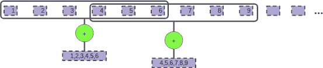
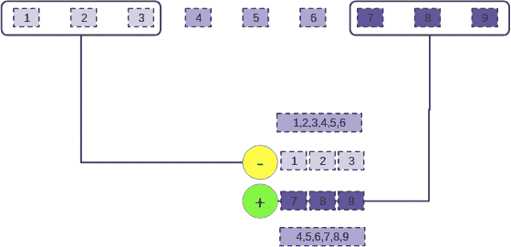

# 第二十一章：基于时间的流处理

正如我们之前提到的，并且如我们在之前的转换中展示的，Spark Streaming 提供了构建基于时间的数据聚合的能力。与结构化流不同，Spark Streaming 在这一领域的开箱即用能力仅限于处理时间，如果您还记得来自 “时间的影响” 的话，那是流引擎处理事件的时间。

在本章中，我们将探讨 Spark Streaming 的不同聚合能力。虽然它们受限于处理时间域，但它们提供丰富的语义，可以帮助以可伸缩和资源受限的方式处理数据。

# 窗口聚合

聚合在流数据处理中是一个频繁出现的模式，反映了数据生产者（在输入端）和数据消费者（在输出端）关注点的差异。

如 “Window Aggregations” 中所讨论的，通过时间的数据*窗口*的概念可以帮助我们创建跨越较长时间段的聚合。Spark Streaming API 提供了在该部分介绍的两个通用窗口概念的定义，*滚动*和*滑动窗口*，并提供了专门的减少函数，用于在一段时间内执行给定聚合所需的中间内存的限制。

在接下来的页面中，我们将探索 Spark Streaming 的窗口能力：

+   滚动窗口

+   滑动窗口

+   基于窗口的减少

# Tumbling 窗口

在 Spark Streaming 中，最基本的窗口定义是对 DStreams 进行的 `window(<time>)` 操作。这个 DStream 转换创建了一个新的*窗口化* DStream，可以进一步转换以实现我们想要的逻辑。

假设一个 hashtags 的 DStream，我们可以使用滚动窗口来实现这一点：

```
val tumblingHashtagFrequency = hashTags.window(Seconds(60))
                                       .map(hashTag => (hashTag,1))
                                       .reduceByKey(_ + _)
```

在 `window` 操作中，在 `map` 和 `reduceByKey` 步骤之前—我们现在知道它们只是简单地计数—我们正在重新编程我们的 DStream 的分段为 RDD。原始流 `hashTags` 严格按照批处理间隔进行分段：每批一个 RDD。

在这种情况下，我们正在配置新的 DStream，`hashTags.window(Seconds(60))`，每 60 秒包含一个 RDD。每当时钟滴答 60 秒，集群资源上都会创建一个新的 RDD，与同一窗口化 DStream 的先前元素无关。从这个意义上说，窗口是*滚动*的，如 “Tumbling Windows” 中所解释的：每个 RDD 都是由新的“新鲜”元素组成的。

## 窗口长度与批处理间隔

因为通过将原始流的几个 RDD 的信息合并为窗口流的单个 RDD 来创建窗口化流，窗口间隔*必须是*批处理间隔的倍数。

自然地，任何初始`批处理间隔`的倍数都可以作为参数传递。因此，这种分组流使用户可以查询最近一分钟、15 分钟或一小时的数据——更准确地说，是窗口化流计算运行时的第*k*个间隔。

一个让新用户感到惊讶的重要观察：窗口间隔与流式应用程序的启动时间对齐。例如，给定一个 30 分钟的窗口，批处理间隔为 2 分钟的 DStream，如果流处理作业从 10:11 开始，则窗口间隔将在 10:41、11:11、11:41、12:11、12:41 等时刻计算。

# 滑动窗口

尽管“在一场著名体育赛事中，每 10 分钟最受欢迎的标签是什么”这样的信息对法医学或未来预测很有趣，但在该事件期间通常不会提出这种问题。检测异常时，也不会使用滚动窗口作为相关的时间框架。在这种情况下，通常需要聚合，因为所观察的值经常有但通常很小的无意义波动，需要通过附加数据点提供的上下文进行分析。股票价格或组件温度具有不应单独观察的小波动。通过观察一系列最近事件，实际趋势变得可见。

在保持部分内容新鲜的情况下，通常有必要查看一种不同类型的聚合，它在相对较长的时间段内呈现数据——滑动窗口：

```
val slidingSums = hashTags.window(Seconds(60), Seconds(10))
                          .map(hashTag => (hashTag, 1))
                          .reduceByKey(_ + _)
```

在这个例子中，我们描述了一种不同类型的 DStream，用于计算最频繁的标签：这次，每 10 秒产生一个新的 RDD。在`window`函数的这种替代版本中，第一个参数名为`windowDuration`，确定窗口的长度，而第二个参数名为`slideDuration`，确定我们希望多久观察一次新数据窗口。

回到这个例子，结果窗口化的 DStream 将包含在最新 60 秒数据上的计算结果的 RDD，每 10 秒产生一次。

这种滑动视图使得实现监控应用程序成为可能，而通常在处理后，会看到此类流产生的数据被发送到仪表盘。在这种情况下，仪表盘的刷新率自然与滑动间隔相关联。

## 滑动窗口与批处理间隔对比

再次强调，由于输出函数的 RDD 是通过合并原始 DStream 的输入 RDD 获得的，因此很明显，滑动间隔需要是批处理间隔的倍数，而窗口间隔需要是滑动间隔的倍数。

例如，使用批处理间隔为 5 秒的*流上下文*，并且一个名为`stream`的基本 DStream，表达式`stream.window(30, 9)`是不合法的，因为滑动间隔不是批处理间隔的倍数。正确的窗口规范应该是`stream.window(30, 10)`。表达式`stream.window(Seconds(40), Seconds(25))`同样无效，尽管窗口持续时间和滑动间隔是批处理间隔的倍数。这是因为窗口间隔必须是滑动间隔的倍数。在这种情况下，`stream.window(Seconds(50), Seconds(25))`是正确的窗口持续时间和滑动间隔的定义。

简而言之，批处理间隔可以看作是窗口化 DStreams 时间间隔的“不可分割原子”。

最后，请注意，滑动窗口的长度必须小于窗口长度，以便计算有意义。如果不遵守这些约束之一，Spark 将输出运行时错误。

## 滑动窗口与翻滚窗口的区别

滑动窗口的特殊情况是滑动间隔等于窗口长度的情况。在这种情况下，您会注意到流与前面介绍的翻滚窗口情况相当，其中`window`函数只有`windowDuration`参数。这恰好对应于`window`函数在内部实现的语义。

# 使用窗口化与更长批处理间隔

您可能会想，在简单的翻滚窗口中，为什么需要使用窗口化流以滚动模式，而不是简单地增加批处理间隔：毕竟，如果用户希望按分钟汇总数据，这不正是批处理间隔的用途吗？这种方法有几个反驳的观点：

多重聚合需求

有时用户希望看到以不同增量计算的数据，这需要提取查看数据的两个特定频率。在这种情况下，因为批处理间隔是不可分割的，并且是其他窗口聚合的来源，最好将其设置为所需最小延迟的最大公约数（`gcd`）。在数学上，如果我们希望多个窗口的数据，比如持续时间为*x, y 和 z*，我们希望将我们的`batch interval`设置为它们的*最大公约数*（`gcd(x,y,z)`）。

安全性和局部性

批处理间隔不仅仅是将 DStream 划分为 RDD 的来源。对于基于接收器的数据源，批处理间隔还影响数据的复制和跨网络传输的方式。例如，如果我们有一个包含八台机器的集群，每台机器有四个核心，因为我们可能希望每个核心有大约两个分区，所以我们希望设置块间隔使得每个批次有 32 个块间隔。块间隔决定了 Spark 中接收到的数据在何时被块管理器视为需要复制的时钟周期。因此，当批处理间隔增长时，块间隔也应该相应增长，这样会使系统更容易受到崩溃的影响，可能会影响数据的接收（例如，如果接收机器宕机）。例如，如果批处理间隔为一小时，块间隔为两分钟，那么在接收器崩溃的情况下可能会最多损失两分钟的数据，这取决于数据的频率，可能是不合适的。我们可以通过使用可靠的接收器来减轻这种风险，这些接收器使用预写日志（WAL）来避免数据丢失，但这会增加额外的开销和存储成本。

对于需要一小时聚合的情况，基于每五分钟批处理间隔的源 `DStream` 使用的滚动窗口为大约 10 秒不到的块间隔，这将降低潜在的数据损失。

总结来说，保持合理大小的批处理间隔可以增加集群设置的弹性。

# 窗口缩减

在构建复杂的管道的末尾，我们经常希望看到数据的指标，这些指标本质上是依赖于不同时间概念的内容。例如，我们期望看到网站访客数量或者穿过十字路口的汽车数量，分别是过去 15 分钟、过去一小时和前一天的情况。

这三个信息都可以基于窗口化的 DStream 的计数进行计算，我们在本章已经见过了这种情况。尽管基于窗口的函数为我们提供了在不同时间段内生成聚合的基本功能，但它们也要求我们保留指定时间段内的所有数据。例如，要生成 24 小时的聚合，到目前为止我们所知道的窗口函数需要在存储（内存和/或磁盘，具体取决于 DStream 的配置）中保留 24 小时的数据。

想象一下，我们想要在 24 小时内计算用户访问我们网站的总数。我们不需要保留每个单独的记录 24 小时然后再计数。相反，我们可以使用一个运行计数，并在新数据到来时添加。这就是基于窗口的减少的直觉。假设的函数（假定为可结合的）应用于每个新的微批次数据，然后结果添加到窗口 DStream 维护的聚合中。与保留大量数据不同，我们将其作为系统进入的方式进行聚合，提供一种使用最小内存资源的可伸缩聚合。

Spark Streaming 中的窗口化减少函数族结合了一个减少函数和我们之前学习的窗口定义参数。接下来的部分讨论了几种这样的减少函数：

## reduceByWindow

`reduceByWindow`采用一个减少函数，窗口持续时间和滑动持续时间。减少函数必须组合原始 DStream 的两个元素，并产生相同类型的新组合元素。可以省略`slideDuration`以生成长度为`windowDuration`的滚动窗口：

```
 def reduceByWindow(
      reduceFunc: (T, T) => T,
      windowDuration: Duration,
      slideDuration: Duration
    ): DStream[T]
```

## reduceByKeyAndWindow

`reduceByKeyAndWindow`仅在成对的 DStream 中定义——一个`(Key, Value)`元组的 DStream。它需要与`reduceByWindow`类似的参数，但减少函数应用于 DStream 的值。这个操作可能比它的兄弟`reduceByWindow`更有用，因为我们可以使用键来指示我们正在处理哪些值：

```
def reduceByKeyAndWindow(
      reduceFunc: (V, V) => V,
      windowDuration: Duration,
      slideDuration: Duration
    ): DStream[(K, V)]
```

回到标签的例子，我们可以使用`reduceByKeyAndWindow`函数实现每日标签频率的累加：

```
val sumFunc: Long => Long => Long = x => y => x+y
val reduceAggregatedSums = hashTags.map(hashTag => (hashTag, 1))
                      .reduceByKeyAndwindow(sumFunc, Seconds(60), Seconds(10))
```

## countByWindow

`countByWindow`是`reduceByWindow`的一种特殊形式，我们只关心在时间窗口内元素的计数。它回答了这个问题：在给定的窗口中收到了多少事件？

```
  def countByWindow(
      windowDuration: Duration,
      slideDuration: Duration): DStream[Long]
```

`countByWindow`使用我们在“滑动窗口”中定义的`windowDuration`和`slideDuration`参数。

## countByValueAndWindow

`countByValueAndWindow`是刚才提到的`countByWindow`操作的分组变体。

```
def countByValueAndWindow(
      windowDuration: Duration,
      slideDuration: Duration,
      numPartitions: Int = ssc.sc.defaultParallelism)
      (implicit ord: Ordering[T] = null) : DStream[(T, Long)]
```

`countByValueAndWindow`将原始 DStream 中的值作为键来计数。这使得我们的标签例子变得相当简单：

```
val sumFunc: Long => Long => Long = x => y => x+y
val reduceAggregatedSums =
  hashTags.countByValueAndWindow(Seconds(60), Seconds(10))
```

在内部，它执行类似于我们之前示例的步骤：创建形如`(value, 1L)`的元组，然后在生成的 DStream 上使用`reduceByKeyAndWindow`。顾名思义，我们使用`countByValueAndWindow`来计算原始 DStream 中每个值的出现次数。

它使用我们在“滑动窗口”中定义的`windowDuration`和`slideDuration`参数。

# 可逆窗口聚合

`reduceByWindow`和`reduceByKeyAndWindow`函数包含一个额外的第四个参数作为可选参数。该参数称为*逆减少函数*。仅当您使用可逆的聚合函数时才重要，这意味着您可以从聚合中“减去”一个元素。

形式上，反函数`invReduceFunc`满足对于任何累积值 y 和元素 x：`invReduceFunc(reduceFunc(x, y), x) = y`。

在幕后，这种可逆概念使得 Spark 可以简化我们的聚合计算，使 Spark 在每个新滑动窗口上计算几个滑动间隔的元素，而不是整个窗口的全部内容。

例如，假设我们每分钟以批处理间隔聚合整数计数，窗口为 15 分钟，每分钟滑动一次。如果您未指定逆减少函数，则需要在 DStream 上看到的数据上添加每 15 分钟的新计数以汇总数据。我们在图 21-1 中概述了这个过程。



###### 图 21-1\. 使用非可逆函数的 reduceByWindow 的聚合

这种方法有效，但是如果我们每分钟看到 100,000 个元素，则每分钟在窗口内求和 1.5 百万数据点——更重要的是，我们需要将这 1.5 百万元素存储在内存中。我们可以做得更好吗？

我们可以记住过去 15 分钟的计数，并考虑我们有新的一分钟数据进入。取得这些前 15 分钟的计数，我们可以减去该 15 分钟聚合中最旧一分钟的计数，因为计数（求和）函数是可逆的。我们减去最旧一分钟的计数，得到 14 分钟的聚合值，然后我们只需添加最新的一分钟数据，就得到了最近 15 分钟的数据。图 21-2 展示了这一过程的工作方式。



###### 图 21-2\. 使用可逆函数的 reduceByWindow 的聚合

这件事的有趣之处在于，我们不需要存储 1.5 百万数据点；相反，我们只需要每分钟的中间计数值——也就是说，15 个值。

正如您所看到的，对于窗口聚合来说，拥有可逆的减少函数可以非常有用。这也是我们可以使由`reduceByWindow`创建的各种 DStream 生成廉价的方法之一，使我们有一个出色的方式来在分析我们的流时共享信息和聚合值，即使是在长时间的聚合期间也是如此。

###### 注意

对于翻滚窗口，聚合函数的反函数是无用的，因为每个聚合间隔完全不重叠。因此，如果您不使用滑动间隔，这个选项就不值得麻烦了！

# 流分片

最后，请注意 Spark 的 DStreams 还具有一个名为 `slice` 的选择函数，它返回在两个边界之间包括的 DStream 的特定子部分。您可以使用开始和结束 `Time` 指定边界，这对应于 Spark 的 `org.apache.spark.streaming.Time` 或 `org.apache.spark.streaming.Interval`。两者都是使用毫秒作为基本单位的时间算术的简单重新实现，为用户留下了相当高的表达能力。

Spark 将通过让带有正确时间戳的元素通过来生成切片的 DStreams。还要注意，`slice` 会生成与 DStream 两个边界之间批处理间隔数相同的 RDD。

# 如果您的切片规范不完全适合批处理怎么办？

如果 RDD 的原始批次时间和切片的输出时间不完全匹配，那么如果开始和结束时间与原始 DStream 的批次间隔 *ticks* 不对齐，时间的任何变化将在 `INFO` 级别的日志中反映出来：

```
INFO Slicing from [fromTime] to [toTime]
  (aligned to [alignedFromTime] and [alignedToTime])
```

# 总结

在本章中，我们研究了 Spark Streaming 的能力，可以创建和处理来自 DStream 的数据窗口。现在您可以做到以下几点：

+   使用 DStream API 表达翻滚窗口和滑动窗口

+   计算窗口中的元素数量，包括使用数据中的键来分组计数

+   创建基于窗口的计数和聚合

+   使用优化的 `reduce` 版本，利用函数的反可逆性大幅减少内部内存使用量

窗口聚合允许我们观察数据在远远超过批处理间隔的时间段内的趋势。您刚学到的工具使您能够在 Spark Streaming 中应用这些技术。
