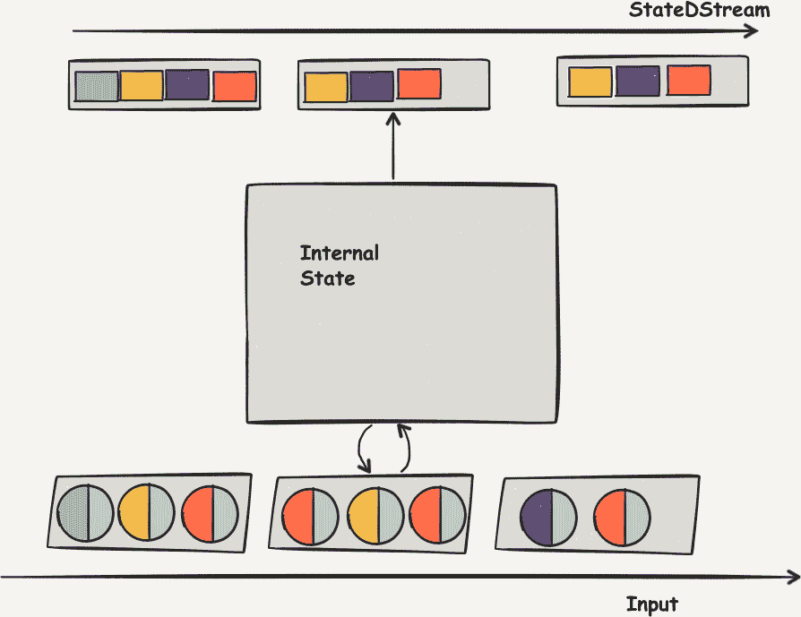
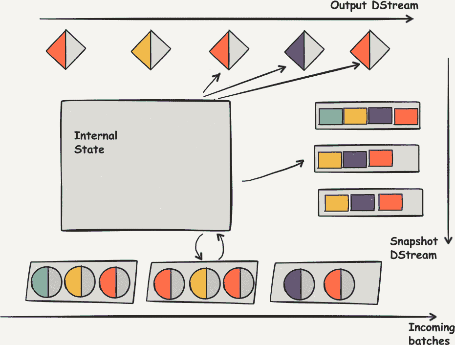

# 第二十二章：任意的有状态流计算

到目前为止，我们已经看到 Spark Streaming 如何独立于过去的记录处理传入数据。在许多应用中，我们还对分析与旧数据点相关的数据的演变感兴趣。我们也可能对跟踪由接收到的数据点生成的变化感兴趣。也就是说，我们可能有兴趣使用我们已经看到的数据来构建系统的有状态表示。

Spark Streaming 提供了几个函数，让我们能够构建和存储关于先前看到的数据的知识，并使用该知识来转换新数据。

# 流的可扩展状态性

函数式程序员喜欢没有状态性的函数。这些函数返回与其函数定义之外的世界状态无关的值，只关心其输入值的值。

然而，一个函数可以是无状态的，只关心它的输入，但同时保持与其计算相关的受管值的概念，而不违反任何有关功能性的规则。其思想是，表示某些中间状态的这个值，在计算的一个或多个参数的遍历中使用，以在遍历参数结构时同时保持一些记录。

例如，在第十七章讨论的`reduce`操作会沿着给定为参数的任何 RDD 更新一个单一值：

```
val streamSums = stream.reduce {
  case (accum, x) => (accum + x)
}
```

在这里，计算每个 RDD 沿输入 DStream 的中间和是通过迭代 RDD 的元素从左到右进行的，并保持累加器变量更新——这是通过返回累加器新值的更新操作指定的（在括号内）。

# updateStateByKey

有时计算一些依赖于流的先前元素的结果是有用的，这些先前元素发生在当前批次之前超过一个批次。此类情况的示例包括以下内容：

+   流的所有元素的运行总和

+   特定标记值的出现次数

+   流中遇到的最高元素，给定流元素的特定顺序

这种计算通常可以被看作是一个大的`reduce`操作的结果，它会在整个流的遍历过程中更新某个计算状态的表示。在 Spark Streaming 中，这由`updateStateByKey`函数提供：

```
  def updateStateByKeyS: ClassTag => Option[S]
    ): DStream[(K, S)]
```

`updateStateBykey`是仅在键-值对 DStream 上定义的操作。它将一个状态更新函数作为参数。此状态更新函数应具有以下类型：

```
`Seq[V] -> Option[S] -> Option[S]`
```

此类型反映了更新操作如何接受一组新值类型`V`，这些值对应于当前批处理操作期间到达的给定键的所有*值*，以及类型`S`表示的可选状态。然后，如果有要返回的状态`S`，则计算并返回新状态值为`Some(state)`；如果没有新状态，则返回`None`，在这种情况下，删除与此键对应的存储状态的内部表示：

```
def updateFunction(Values: Seq[Int], runningCount: Option[Int]): Option[Int] = {
    val newCount = runningCount.getOrElse(0) + Values.filter(x => x >5).length
    if (newCount > 0)
      Some(newCount)
    else
      None
}
```

更新状态函数在每个批次上调用，在执行器处理此流的开始时遇到的所有键上。在某些情况下，这是在以前从未见过的新键上。这是更新函数的第二个参数（状态）为`None`的情况。在其他情况下，它将在此批次中未收到新值的键上，此时更新函数的第一个参数（新值）为`Nil`。

最后，`updateStateByKey`函数仅在用户更新要求时返回值（即特定键的新状态快照）。这解释了函数返回类型中的`Option`：在前面的示例中，只有在实际遇到大于五的整数时，我们才会更新状态。如果特定键仅遇到小于五的值，则不会为此键创建状态，并相应地不进行更新。

图 22-1 描述了使用诸如`updateStateByKey`之类的状态计算时保留的内部状态动态。流的中间状态保留在内部状态存储中。在每个批次间隔中，内部状态与来自流的新数据使用`updateFunc`函数组合，产生一个当前状态计算结果的次级流。



###### 图 22-1\. 由`updateStateByKey`产生的数据流动态

# 状态流的强制检查点

请注意，在为此应用程序启动 Spark Streaming Context 时，Spark 可能会输出以下错误：

> java.lang.IllegalArgumentException: requirement failed: 未设置检查点目录。请通过`StreamingContext.checkpoint()`设置。

这是因为由`updateStateByKey`在幕后创建的`StateStream`具有 RDDs，这些 RDDs 本质上各自依赖于先前的 RDD，这意味着在每个批次间隔内重新构建每个标签的部分总和链的唯一方法是重播整个流。这与容错性不兼容，因为我们需要保留接收到的每个记录以便能够在任意时间点重建状态。而不是保留所有记录，我们将状态的中间结果保存到磁盘中。如果处理此流的执行器之一崩溃，则可以从此中间状态中恢复。

幸运的是，错误告诉我们如何使用 `ssc.checkpoint("path/to/checkpoint/dir")` 来做到这一点。用共享文件系统中的目录替换作为参数传递的 `String` 的内容，该目录可由驱动程序和作业中的所有执行器访问。

# `updateStateByKey` 的限制

我们迄今为止描述的 `updateStateByKey` 函数使我们能够使用 Spark Streaming 进行有状态编程。例如，它允许我们对用户会话的概念进行编码——对于这种应用程序，没有特定的批次间隔与之匹配。然而，这种方法存在两个问题。让我们更仔细地看看这些问题。

## 性能

第一个问题与性能有关：自应用程序框架启动以来，`updateStateByKey` 函数在遇到的每个键上都运行。这是个问题，因为即使在数据集相对稀疏的情况下——只要数据的种类很多，并且特别是键的种类很多——可以清楚地证明内存中表示的数据总量是无限增长的。

例如，如果在应用程序运行的开始时看到网站上的某个键或特定用户，更新该用户的状态以表示我们自应用程序开始以来（例如，上个月以来）未见过此特定个体的会话的相关性是什么？这对应用程序的好处并不明显。

## 内存使用

第二个问题是，因为状态不应无限增长，程序员必须自行管理内存的簿记——为每个键编写代码，以确定是否仍然有必要保留该特定元素的状态数据。这是一种需要手动进行内存管理的复杂性。

实际上，对于大多数有状态计算，处理状态是一个简单的操作：要么一个键仍然相关，例如某个用户在一定时间范围内访问了网站，要么在一段时间内未刷新。

# 引入带有 `mapwithState` 的有状态计算

`mapWithState` 是在 Spark 中进行有状态更新的更好模型，它克服了上述两个缺点：对每个键进行更新，并设置默认的超时时间以限制与计算一起创建的状态对象的大小。它是在 Spark 1.5 中引入的：

```
  def mapWithStateStateType: ClassTag, MappedType: ClassTag: MapWithStateDStream[K, V, StateType, MappedType]
```

`mapWithState` 需要您编写一个 `StateSpec` 函数，该函数操作包含键、可选值和 `State` 对象的状态规范。尽管这显然更复杂，因为涉及到几种显式类型，但它简化了许多元素：

+   程序员逐个值操作，而不是作为列表

+   更新函数可以访问键本身

+   此更新仅在当前批次中具有新值的键上运行

+   更新状态是对状态对象方法的命令式调用，而不是生成输出的隐式行为

+   程序员现在可以独立于状态管理生成输出

+   该函数具有自动超时功能

图 22-2 展示了使用 `mapWithState` 函数时的数据流程。



###### 图 22-2\. 使用 `mapWithState` 产生的数据流

如果您希望在每个批次间隔的每个键上看到状态的快照，请在通过 `mapWithState` 创建的特定 DStream 上调用 `.snapshots` 函数。

# `mapWithState` 和 `updateStateByKey`：何时使用哪一个

`mapWithState` 的性能更高且使用更方便，比 `updateStateByKey` 函数更好，并且通常是处理有状态计算的一个很好的默认选择。然而，一个注意点是，将数据从状态表示中推出（即刷新状态数据）的模型是特定的超时机制，不再由用户控制。因此，如果您希望保持状态处于新鲜条件下（例如，网页用户时间限定会话的点击数），则 `mapWithState` 尤为适合。对于那些绝对需要保证在长时间内保持小状态的特定情况，我们可以选择 `updateStateByKey`。

一个例子是洪水监控：如果我们处理的是在河流附近特定位置报告水位的传感器，并且我们想要在观察期间保持观察到的最大值，那么使用 `updateStateByKey` 而不是 `mapWithState` 可能是有意义的。

使用 `mapWithState`，我们的流元素计算可以在接收到事件时开始，并在接收到最后几个结构事件后尽快完成。我们将在接下来的几页中看到一个示例。

# 使用 `mapWithState`

`mapWithState` 要求用户提供一个 `StateSpec` 对象，描述状态计算的工作原理。其中的核心部分是一个函数，该函数接受给定键的新值并返回一个输出，同时更新该键的状态。事实上，对于 `StateSpec` 的构建对象来说，这个函数是必需的。

这个 `StateSpec` 是由四种类型参数化的：

+   键类型 `K`

+   值类型 `V`

+   状态类型 `S`，表示用于存储状态的类型

+   输出类型 `U`

在其最一般的形式中，`StateSpec` 构建器 `StateSpec.function` 需要一个 `(Time, K, Option[V], State[S]) => Option[U]` 参数，或者如果您不需要 `mapWithState` 附带的批处理时间戳，则可以使用 `(K, Option[V], State[S]) => Option[U]`。

在这个函数定义中涉及的状态类型可以看作是一个支持超时的可变单元。您可以使用 `state.exists()` 和 `state.get()` 进行查询，或者像处理选项一样使用 `state.getOption()`，通过 `state.isTimingOut()` 检查是否超时，使用 `state.remove()` 进行擦除，或使用 `state.update(newState: S)` 进行更新。

假设我们正在监控一家带传感器的工厂，并且我们想要最后一批的平均温度以及检测异常温度的简单方法。对于这个练习，让我们定义异常温度为高于 80 度：

```
import org.apache.spark.streaming.State

case class Average(count: Int, mean: Float){
  def ingest(value: Float) =
    Average(count + 1, mean + (value - mean) / (count + 1))
}

def trackHighestTemperatures(sensorID: String,
    temperature: Option[Float],
    average: State[Average]): Option[(String, Float)] = {
  val oldMax = average.getOption.getOrElse(Average(0, 0f))
  temperature.foreach{ t => average.update(oldMax.ingest(t)) }
  temperature.map{
    case Some(t) if t >= (80) => Some(sensorID, t)
    case _ => None
  }
}

val highTempStateSpec = StateSpec.function(trackHighestTemperatures)
                                 .timeout(Seconds(3600))
```

在这个函数中，我们提取旧的最大值，并同时对最新值进行均值和阈值的聚合，将结果分别路由到状态更新和输出值。这使我们可以利用两个流：

+   `temperatureStream.mapWithState(highTempStateSpec)`，用于跟踪发生的高温

+   `temperatureStream.mapWithState(highTempStateSpec).stateSnapshots()`，用于跟踪每个传感器的平均温度

如果传感器停止发射 60 分钟，则其状态会被自动移除，从而防止我们担心的状态存储爆炸。请注意，我们可以使用显式的 `remove()` 函数来实现这一点。

然而，这里存在一个问题：在传感器的前几个值中，我们将传感器的值与一个低默认值进行比较，这可能对每个传感器都不合适。我们可能会检测到温度峰值，读取可能对这个特定传感器来说是完全适当的值，只是因为我们还没有它的值。

在这种情况下，我们有机会为我们的传感器提供初始值，使用 `highTempStateSpec.initialState(initialTemps: RDD[(String, Float)])`。

# 使用 `mapWithState` 进行事件时间流计算

`mapWithState` 的一个辅助好处是，它让我们能够有效且明确地在其 `State` 对象中存储过去的数据。这在执行事件时间计算时非常有用。

实际上，在流系统中“在线”看到的元素可能会无序到达、延迟到达，甚至与其他元素相比异常地快。因此，确保我们处理的数据元素确实是在特定时间生成的唯一方法是在生成时为它们打上时间戳。例如，在我们之前的例子中，我们试图检测温度的增幅的温度流中，如果某些事件以相反的顺序到达，则可能会混淆温度的增加和温度的减少。

###### 注意

尽管结构化流本地支持事件时间计算，就像我们在 第十二章 中看到的那样，但是你可以使用这里描述的技术在 Spark Streaming 中以编程方式实现它。

然而，如果我们的目标是按顺序处理事件，我们需要能够通过读取流上数据元素的时间戳来检测和反转错序。为了进行这种重新排序，我们需要对我们的流上可能看到的延迟的数量级有一个概念（或者说上下限）。确实，如果没有这种重新排序范围的界限，我们将需要无限等待才能计算特定时间段的最终结果：我们始终可以收到另一个可能已被延迟的元素。

为了实际处理这个问题，我们将定义一个*水印*，即我们将等待滞后元素的最长时间。按照 Spark Streaming 时间概念，它应该是批处理间隔的倍数。超过这个水印后，我们将“封存”计算结果，并忽略延迟超过水印的元素。

###### 警告

处理这种错序的自然方法可能是窗口化流：定义一个与水印相等的窗口间隔，并使其每次滑动一个批次，定义一个按时间戳排序元素的转换。

这在一定程度上是正确的，因为一旦超过第一个水印间隔，它将导致对排序元素的正确视图。然而，它要求用户接受等于水印的初始延迟才能看到计算结果。然而，对于像 Spark Streaming 这样已经因其微批处理方法而产生高延迟的系统来说，可能会看到一个比批处理间隔高一个数量级的水印延迟，这种延迟是不可接受的。

一个良好的事件时间流处理解决方案将允许我们基于流事件的临时视图进行计算，然后在延迟元素到达时更新此结果。

假设我们有一个循环缓冲区的概念，即一个固定大小为*k*的向量，它包含它接收到的最近的`k`个元素：

```
import scala.collection.immutable

object CircularBuffer {
  def empty[T](): CircularBuffer[T] = immutable.Vector.empty[T]
}

implicit class CircularBufferT extends Serializable {
  val maxSize = 4
  def get(): Vector[T] = v
  def addItem(item : T) : CircularBuffer[T]  =
    v.drop(Math.min(v.size, v.size - maxSize + 1)) :+ item
}
```

这个对象保持一个内部向量，至少有一个，最多有`maxSize`个元素，选择其中最近添加的元素。

现在假设我们正在跟踪最近四批次的平均温度，假设批处理间隔为五毫秒：

```
import org.apache.spark.streaming.State

def batch(t:Time): Long = (t.milliseconds % 5000)

def trackTempStateFunc(
  batchTime: Time,
  sensorName: String,
  value: Option[(Time, Float)],
  state: State[CB]): Option[(String, Time, Int)] = {

  value.flatMap { (t: Time, temperature: Float) =>
     if ( batch(t) <= batch(batchTime)) { // this element is in the past
      val newState: CB =
        state.getOption.fold(Vector((t, Average(1, temperature))): CB){ c =>
          val (before, hereOrAfter) =
            c.get.partition{case (timeStamp, _) => batch(timeStamp) < batch(t) }
          (hereOrAfter.toList match {
            case (tS, avg: Average) :: tl if (batch(tS) == batch(t)) =>
              (tS, avg.ingest(temperature)) ::tl
            case l@_ => (t, Average(1, temperature)) :: l
          }).toVector.foldLeft(before: CB){ case (cB, item) => cB.addItem(item)}
        }
      state.update(newState) // update the State
      // output the new average temperature for the batch that was updated!
      newState.get.find{ case (tS, avg) => batch(tS) == batch(t) }.map{
        case (ts, i) => (key, ts, i)
      }
    }
    else None // this element is from the future! ignore it.
  }
}
```

在这个函数中，我们的`State`是包含每个批次平均值的四个单元格集合。这里我们使用`mapWithState`的变体，该变体将当前批次时间作为参数。我们使用`batch`函数以使批处理比较变得合理，即如果`t1`、`t2`在同一批次内，则我们期望`batch(t1) == batch(t2)`。

我们从检查我们的新值及其事件时间开始。如果事件时间的批次超出当前批次时间，那么我们的壁钟或事件时间存在错误。对于这个例子，我们返回`None`，但我们也可以记录一个错误。如果事件是过去的，我们需要找出它属于哪个批次。为此，我们在我们的`CircularBuffer`状态的每个单元格的批次上使用 Scala 的分区函数，将来自我们元素之前批次的元素与来自相同批次或之后批次的元素分开。

然后，我们查看是否已为我们的事件批次初始化了平均值，我们应该在后面列表的头部找到它（感谢我们的分区）。如果有的话，我们将新的温度添加到其中；否则，我们将我们的单个元素取平均值。最后，我们将当前元素时间之前的批次和所有后置批次按顺序添加到其中。`CircularBuffer`本身确保如果超过我们的阈值（四个），则仅保留最新的元素。

作为最后一步，我们查找我们用新元素更新的单元格上的更新后的平均值（如果确实有的话，我们可能已经更新了一个过时的元素），如果是这样，则输出新的平均值。因此，我们可以在 RDD 的`(String, (Time, Float))`元素上创建`mapWithState`流（传感器名称作为键，时间戳温度作为值），更新我们收到的最后更新的平均值，从第一个批次开始。

在处理我们的`CircularBuffer`内容时，自然地，它使用了线性时间，这是我们通过这个例子想要达到的简单性的结果。然而，请注意，我们正在处理一个按时间戳排序的结构，不同的数据结构比如跳表将使我们在处理速度上获得很大提升，并使其可扩展。

总之，`mapWithState`凭借其强大的状态更新语义、简洁的超时语义以及`snapshots()`带来的多功能性，为我们提供了一个强大的工具，在几行 Scala 代码中表示基本的事件时间处理。
