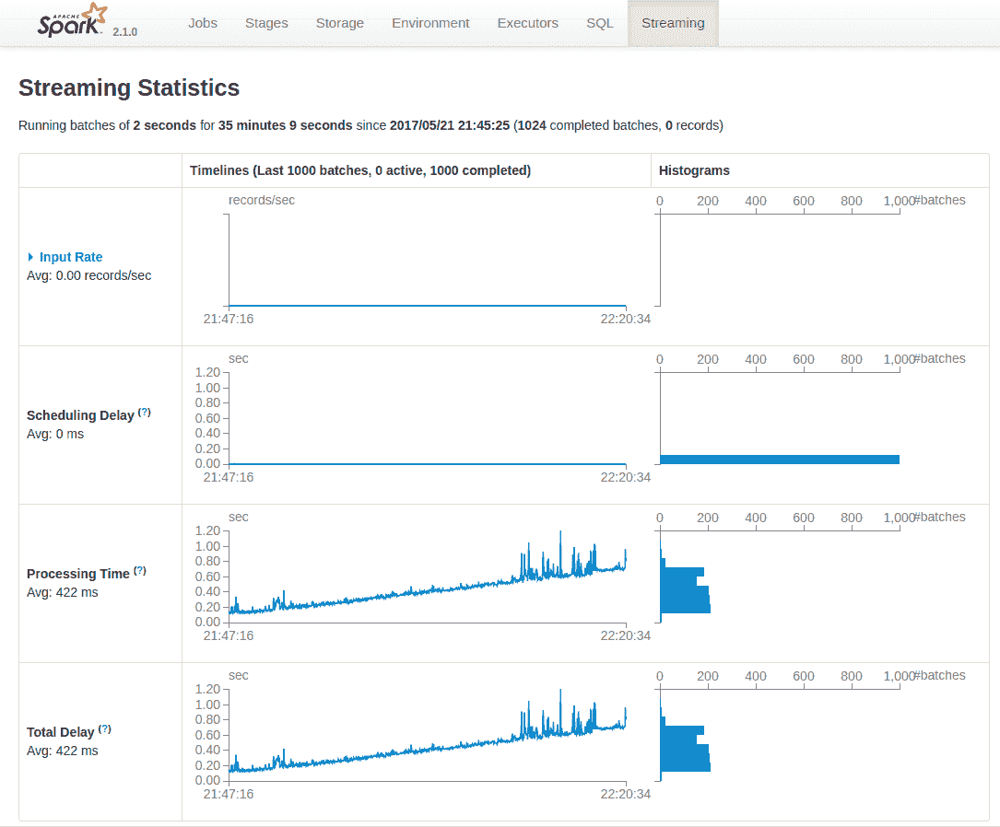
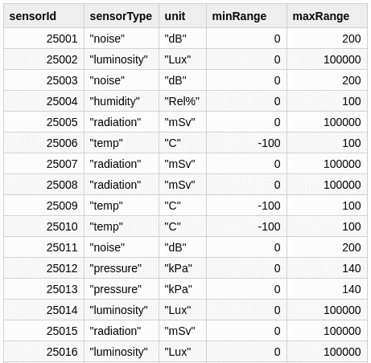
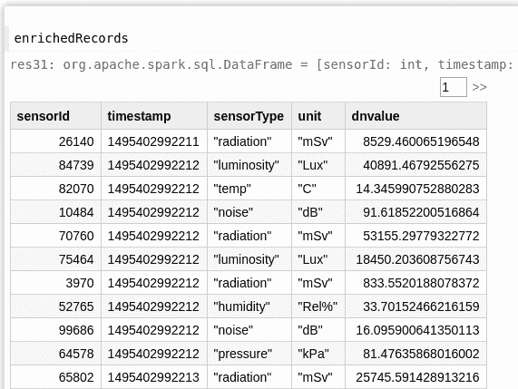
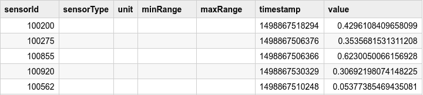
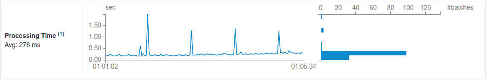

# 第二十三章：使用 Spark SQL

到目前为止，我们已经看到了 Spark Streaming 如何作为一个独立的框架来处理多源流，并生成可以进一步发送或存储以供后续使用的结果。

孤立的数据具有有限的价值。我们经常希望合并数据集以探索仅在合并来自不同来源的数据时才显现的关系。

在流数据的特定情况下，我们在每个批处理间隔看到的数据仅仅是潜在无限数据集的一个样本。因此，为了增加在给定时间点观察到的数据的价值，我们必须有办法将其与我们已经拥有的知识结合起来。这可能是我们在文件或数据库中拥有的历史数据，是基于前一天数据创建的模型，或者甚至是早期流数据。

Spark Streaming 的一个关键价值主张是其与其他 Spark 框架的无缝互操作性。这种 Spark 模块之间的协同作用增加了我们可以创建的面向数据的应用程序的范围，导致应用程序的复杂性低于自行组合任意——而且通常是不兼容——库的复杂性。这转化为增加的开发效率，进而提高了应用程序提供的业务价值。

在本章中，我们探讨了如何将 Spark Streaming 应用程序与 Spark SQL 结合使用。

###### 注意

正如我们在第二部分中看到的，结构化流处理是 Spark 中使用 Spark SQL 抽象进行流处理的本地方法。本章描述的技术适用于当我们有一个 Spark Streaming 作业时，希望为特定目的使用 Spark SQL 函数。

要进行纯 Spark SQL 方法的流处理，请首先考虑结构化流处理。

# Spark SQL

Spark SQL 是与结构化数据一起工作的 Spark 模块。它实现了传统数据库领域中通常找到的函数和抽象，如查询分析器、优化器和执行计划器，以在 Spark 引擎之上对任意结构化数据源进行类似表格的操作。

Spark SQL 引入了三个重要的特性：

+   使用 SQL 查询语言来表示数据操作

+   Datasets，一种类型安全的数据处理*领域特定语言*（DSL），类似于 SQL

+   DataFrames，Datasets 的动态类型对应物

本章的目的是假设读者对 Spark SQL、Datasets 和 DataFrames 有所了解。要深入了解 Spark SQL，请参阅[[Karau2015]](app01.xhtml#Karau2015)。

结合 Spark Streaming 和 Spark SQL，我们可以从 Spark Streaming 作业的上下文中获得 Spark SQL 的重要数据操作能力。我们可以使用从数据库加载的数据框架来高效地丰富传入流，或者使用可用的 SQL 函数进行高级摘要计算。我们还可以将传入或生成的数据写入支持的写入格式之一，如 Parquet、ORC，或通过 Java 数据库连接（JDBC）写入外部数据库。可能性是无限的。

正如我们在第二部分中看到的，Apache Spark 提供了一个使用 Dataset/DataFrame API 抽象和概念的本机流 API。当涉及到利用 Spark 的本机 SQL 功能时，结构化流应该是我们的首选。但是，在需要从 Spark Streaming 上下文中访问这些功能的情况下，也存在一些情况。在本章中，我们探讨了在需要将 Spark Streaming 与 Spark SQL 结合使用时可以使用的技术。

# 从 Spark Streaming 访问 Spark SQL 函数

通过增强 Spark Streaming 与 Spark SQL 的结合，最常见的用例是访问查询功能，并将结构化数据格式的写入访问到支持的格式，如关系数据库、逗号分隔值（CSV）和 Parquet 文件。

## 示例：将流数据写入 Parquet

我们的流数据集将包含我们运行的传感器信息，包括`sensorId`、时间戳和值。在这个自包含示例中，为了简化起见，我们将使用模拟真实物联网（IoT）用例的场景生成一个随机数据集。时间戳将是执行时间，每个记录将被格式化为来自逗号分隔值字段的字符串。

# 在线资源

对于这个例子，我们将使用书籍在线资源中的`enriching-streaming-data`笔记本，位于[*https://github.com/stream-processing-with-spark*](https://github.com/stream-processing-with-spark)。

我们还向数据中添加了一点真实世界的混乱：由于天气条件的影响，一些传感器发布了损坏的数据。

我们首先定义我们的数据生成函数：

```
import scala.util.Random
// 100K sensors in our system
val sensorId: () => Int = () =>  Random.nextInt(100000)
val data: () => Double = () => Random.nextDouble
val timestamp: () => Long = () => System.currentTimeMillis
val recordFunction: () => String = { () =>
  if (Random.nextDouble < 0.9) {
    Seq(sensorId().toString, timestamp(), data()).mkString(",")
  } else {
    "!!~corrupt~^&##$"
  }
}

> import scala.util.Random
> sensorId: () => Int = <function0>
> data: () => Double = <function0>
> timestamp: () => Long = <function0>
> recordFunction: () => String = <function0>
```

###### 注意

我们使用一个特别的技巧，需要稍微注意一下。注意前面示例中的值是函数。我们不是创建文本记录的 RDD，而是创建生成记录函数的 RDD。然后，每次评估 RDD 时，记录函数将生成一个新的随机记录。这样我们就可以模拟出一个真实的随机数据负载，每个批次都会提供不同的数据集。

```
val sensorDataGenerator = sparkContext.parallelize(1 to 100)
                                      .map(_ => recordFunction)
val sensorData = sensorDataGenerator.map(recordFun => recordFun())

> sensorDataGenerator: org.apache.spark.rdd.RDD[() => String] =
  MapPartitionsRDD[1] at map at <console>:73
> sensorData: org.apache.spark.rdd.RDD[String] =
  MapPartitionsRDD[2] at map at <console>:74
```

我们抽样一些数据：

```
sensorData.take(5)

> res3: Array[String] = Array(
                !!~corrupt~^&##$,
                26779,1495395920021,0.13529198017496724,
                74226,1495395920022,0.46164872694412384,
                65930,1495395920022,0.8150752966356496,
                38572,1495395920022,0.5731793018367316
)
```

然后我们创建流处理上下文：

```
import org.apache.spark.streaming.StreamingContext
import org.apache.spark.streaming.Seconds

val streamingContext = new StreamingContext(sparkContext, Seconds(2))
```

我们的流源将是由生成记录的 RDD 提供的`ConstantInputDStream`。通过将`ConstantInputDStream`与生成记录的 RDD 结合使用，我们在示例中创建了一个自动生成的流，用于处理新鲜的随机数据。这种方法使示例自包含，不需要外部流生成过程：

```
import org.apache.spark.streaming.dstream.ConstantInputDStream
val rawDStream  = new ConstantInputDStream(streamingContext, sensorData)
```

我们必须为我们的流数据提供模式信息。

现在我们有了以两秒间隔处理的新数据的 DStream，我们可以开始专注于此示例的主要内容。首先，我们想要定义并应用于我们接收到的数据的模式。在 Scala 中，我们使用`case class`定义模式，如下所示：

```
case class SensorData(sensorId: Int, timestamp: Long, value: Double)

> defined class SensorData
```

现在，我们需要使用`flatMap`函数将模式应用于 DStream：

###### 注意

我们使用`flatMap`而不是`map`，因为可能存在传入数据不完整或损坏的情况。

如果我们使用`map`，则需要为每个转换后的记录提供一个结果值。这对于无效记录是无法做到的。使用`flatMap`结合`Option`，我们可以将有效记录表示为`Some(recordValue)`，无效记录表示为`None`。通过`flatMap`，内部的`Option`容器被展平，因此我们的结果流将仅包含有效的`recordValue`。

在解析逗号分隔记录时，我们不仅防止丢失字段，还将数值类型解析为其期望的类型。周围的`Try`捕获可能由无效记录引起的任何`NumberFormatException`。

```
import scala.util.Try
val schemaStream = rawDStream.flatMap{record =>
  val fields = record.split(",")
  // this Try captures exceptions related to corrupted input values
  Try {
    SensorData(fields(0).toInt, fields(1).toLong, fields(2).toDouble)
  }.toOption
}

> schemaStream: org.apache.spark.streaming.dstream.DStream[SensorData] =
    org.apache.spark.streaming.dstream.FlatMappedDStream@4c0a0f5
```

### 保存数据帧

有了模式流之后，我们可以继续将底层的 RDD 转换为数据帧（DataFrames）。我们在通用操作`foreachRDD`的上下文中执行此操作。此时无法使用转换，因为`DStream[DataFrame]`未定义。这也意味着我们希望应用于数据帧（或数据集）的任何进一步操作都需要包含在`foreachRDD`闭包的范围内，如下所示：

```
import org.apache.spark.sql.SaveMode.Append
schemaStream.foreachRDD{rdd =>
  val df = rdd.toDF()
  df.write.format("parquet").mode(Append).save("/tmp/iotstream.parquet")
}
```

最后，我们启动流处理过程：

```
streamingContext.start()
```

然后，我们可以检查目标目录，查看数据流入 Parquet 文件的情况。

现在，让我们转到 URL `http://<spark-host>:4040` 查看 Spark 控制台。在那里，您可以看到 SQL 和 Streaming 选项卡都存在，如图 23-1 所示。特别是，我们对 Streaming 选项卡感兴趣。



###### 图 23-1\. 将流保存为 Parquet

在图 23-1 中，您可以看到 Parquet 写入时间随时间快速增加。随着时间的推移，向 Parquet 文件追加操作变得更加昂贵。对于像 Spark Streaming 作业这样的长期运行进程，解决此限制的一种方法是定期向新文件追加。

在例子 23-1 中，我们每小时（3,600 秒）更改文件的后缀，从流作业启动的时刻开始计算。

##### 示例 23-1\. 为文件目的地添加时间戳

```
def ts: String = ((time.milliseconds - timeOrigin)/(3600 * 1000)).toString
df.write.mode(SaveMode.Append).format("parquet").save(s"${outputPath}-$ts")
```

###### 注意

在流处理界面中，您可能会注意到输入速率图表仍然保持零平面。该图表从接收器实现中收集信息。因为我们使用的是 `ConstantInputDStream`，所以对于此图表，没有实际的传入记录计数。

# 处理静态数据

在设计和实现流处理应用程序时，通常会出现一个问题，即如何使用现有数据来丰富流中的事件。这些“静态”的数据可以是文件中的历史记录、查找表、数据库中的表，或者是我们可以用来增强“在途”数据的任何其他静态数据。

我们可以利用 Spark SQL 的能力加载“静态”数据集，这些数据集可以与传入的流数据进行合并。在这种情况下，Spark SQL 的一个关键优势是加载的数据是结构化的。这减少了流处理开发人员在执行连接操作之前需要投入的准备数据格式的工作量。

此示例说明了在 DataFrame 形式的固定数据集和我们应用程序连续消耗的流数据上使用 `join` 操作的用法。

## 使用连接操作来丰富输入流

在我们之前的示例中，我们处理了传入的传感器数据流，将其解析为有效的记录，并直接存储到 Parquet 文件中。但是要解释报告数据点中的值，我们首先需要了解传感器类型、其工作范围以及每个记录值的单位。

在我们的物联网应用程序中，传感器在部署之前会首先进行注册。注册过程捕获了我们需要的信息。幸运的是，这些信息以 CSV 文件的形式导出，我们可以在我们的流处理应用程序中导入，正如我们在 图 23-2 中所看到的。

###### 注意

对于这个示例，我们只讨论与前一个程序的相关差异。[完整的笔记本可在线查看](https://github.com/LearningSparkStreaming/notebooks)，供您自行探索。

让我们定义一些常量，指定我们数据的位置：

```
val sensorCount = 100000
val workDir = "/tmp/learningsparkstreaming/"
val referenceFile = "sensor-records.parquet"
val targetFile = "enrichedIoTStream.parquet"
```

现在，我们从 Parquet 文件中加载参考数据（参见 图 23-2）。我们还将数据缓存到内存中，以提高我们流处理应用程序的性能：

```
val sensorRef = sparkSession.read.parquet(s"$workDir/$referenceFile")
sensorRef.cache()
```



###### 图 23-2\. 示例参考数据

接下来，我们将丰富流数据。有了模式流的基础，我们可以继续将底层 RDD 转换为 DataFrame。这一次，我们将使用参考数据添加特定的传感器信息。我们还将根据传感器的范围去规范化记录的值，这样我们就不需要在结果数据集中重复这些数据。

与以往一样，在通用操作 `foreachRDD` 的上下文中进行：

```
val stableSparkSession = sparkSession
import stableSparkSession.implicits._
import org.apache.spark.sql.SaveMode.Append
schemaStream.foreachRDD{ rdd =>
  val sensorDF = rdd.toDF()
  val sensorWithInfo = sensorDF.join(sensorRef, "sensorId")
  val sensorRecords =
    sensorWithInfo.withColumn(
      "dnvalue", $"value"*($"maxRange"-$"minRange")+$"minRange"
    ).drop("value", "maxRange", "minRange")
  sensorRecords.write
               .format("parquet")
               .mode(Append)
               .save(s"$workDir/$targetFile")
}
```

###### 警告

`stableSparkSession`看似奇怪的结构是必要的，因为在 Spark 笔记本中，`sparkSession`引用是一个可变变量，我们不能从一个非稳定的引用中导入。

继续检查结果。我们可以同时使用当前的 Spark Session 与运行中的 Spark Streaming 作业来检查结果数据，如图 23-3 所示：

```
val enrichedRecords = sparkSession.read.parquet(s"$workDir/$targetFile")
enrichedRecords
```


###### 图 23-3\. 从 enrichedRecords DataFrame 中的样本

此时，我们可以看到记录计数在不断增加。我们可以对结果数据集执行`count`以查看流处理如何增加数据集。在两次执行之间等待片刻以观察差异：

```
enrichedRecords.count
>res33: Long = 45135
// ... wait few seconds ...
enrichedRecords.count
>res37: Long = 51167
```

# 连接优化

我们当前的解决方案有一个主要缺点：它会丢弃来自未注册传感器的传入数据。因为我们在过程开始时只加载一次参考数据，之后注册的传感器将被悄悄地丢弃。我们可以通过使用不同类型的`join`操作来改善这种情况。让我们记住，在`foreachRDD`中，我们可以充分利用其他 Spark 库的功能。在这种特殊情况下，我们使用的`join`操作来自 Spark SQL，并且我们可以利用该包中的选项来增强我们的流处理过程。特别是，我们将使用*outer* join 来区分系统已知的 IoT 传感器 ID 和未知的 IoT 传感器 ID。然后，我们可以将未知设备的数据写入一个单独的文件，以便后续对账。

程序的其余部分保持不变，除了`foreachRDD`调用之外，在此我们添加了新的逻辑，如示例 23-2 所示。

##### 示例 23-2\. 使用广播优化进行外连接

```
val stableSparkSession = sparkSession
import stableSparkSession.implicits._
import org.apache.spark.sql.SaveMode.Append
schemaStream.foreachRDD{ rdd =>
  val sensorDF = rdd.toDF()
  val sensorWithInfo = sensorRef.join(
    broadcast(sensorDF), Seq("sensorId"), "rightouter"
  )
  val sensorRecords =
    sensorWithInfo.withColumn(
      "dnvalue", $"value"*($"maxRange"-$"minRange")+$"minRange"
    ).drop("value", "maxRange", "minRange")
  sensorRecords.write
               .format("parquet")
               .mode(Append)
               .save(s"$workDir/$targetFile")
}
```

细心的人会注意到，我们对连接操作进行了两处改动。示例 23-3 专注于这些改动。

##### 示例 23-3\. 连接操作的详细信息

```
val sensorWithInfo = sensorRef.join(
  broadcast(sensorDF), Seq("sensorId"), "rightouter"
)
```

不同之处在于我们改变了连接的顺序。我们不再将传入数据与参考数据集连接，而是反过来。我们需要这种方向的改变有一个特定的原因：我们在连接表达式中添加了一个`broadcast`提示，以指示 Spark 执行*广播连接*。

在 Hadoop 行话中被称为*map-side joins*的广播连接，在参与连接的两个数据集之间大小存在显著差异并且其中一个数据集足够小以至于能够发送到每个执行器的内存时非常有用。与执行 I/O 密集型的基于 shuffle 的连接不同，小数据集可以在每个执行器上作为内存中的查找表使用，以并行方式进行。这样可以减少 I/O 开销，从而提高执行速度。

在我们的场景中，我们交换了参与数据集的顺序，因为我们知道我们的参考数据集比每个间隔接收的设备数据要大得多。虽然我们的参考数据集包含我们所知道的每个设备的记录，但流数据只包含总体样本的一部分。因此，从性能上讲，最好将流中的数据广播以执行与参考数据的广播连接。

此代码片段中的最后一条备注是连接方向，由连接类型 `rightouter` 指定。此连接类型保留右侧的所有记录，即我们传入的传感器数据，并在匹配的连接条件下添加左侧的字段。在我们的情况下，这是匹配的 `sensorId`。

我们将结果存储在两个文件中：一个是已知 `SensorId` 的丰富传感器数据（参见 图 23-4），另一个是我们当前不知道的传感器的原始数据（参见 图 23-5）。



###### 图 23-4\. 丰富记录样本



###### 图 23-5\. 未知设备记录样本

要深入讨论 Spark 中不同连接选项及其特性，请阅读 [[Karau2017]](app03.xhtml#Karau2017)。

# 更新流应用程序中的参考数据集

在上一节中，您看到了我们如何加载静态数据集来丰富传入的数据流。

尽管某些数据集相当静态，例如去年的智能电网合成配置文件、物联网传感器的校准数据或人口分布在人口普查后的分布，我们通常也会发现，我们需要与流数据组合的数据集也在发生变化。这些变化可能比我们的流应用程序慢得多，因此不需要单独考虑为流。

在数字化进程中，组织通常拥有不同节奏的混合过程。诸如数据导出或每日报告等慢节奏输出过程是我们流处理系统的有效输入，需要定期更新，但不需要连续更新。

我们将探讨一种 Spark Streaming 技术，将静态数据集（“慢数据”）集成到我们的流数据（“快数据”）轨道中。

在其核心，Spark Streaming 是一个高性能调度和协调应用程序。为了确保数据完整性，Spark Streaming 按顺序调度流作业的不同输出操作。应用程序代码中声明的顺序在运行时成为执行顺序。

第十八章 讨论了 `batch interval` 及其如何提供数据收集和之前收集的数据提交到 Spark 引擎进行进一步处理的同步点。我们可以钩入 Spark Streaming 调度程序，以执行除流处理之外的 Spark 操作。

特别地，我们将使用一个 `ConstantInputDStream` 和一个空输入作为在流应用程序中调度额外操作的基本构建块。我们将空的 DStream 与通用操作 `foreachRDD` 结合使用，以便 Spark Streaming 处理我们应用程序上下文中所需的常规执行额外操作。

## 使用参考数据集增强我们的示例

为了更好地理解这一技术的动态，请继续我们的运行示例。

在前一节中，我们使用了一个包含系统已知传感器描述的参考数据集。该数据用于将流式传感器数据与其进一步处理所需的参数进行丰富。该方法的一个关键限制是，在启动流应用程序后，我们无法添加、更新或删除列表中存在的任何传感器。

在我们的示例上下文中，我们每小时获取该列表的更新。我们希望我们的流应用程序使用新的参考数据。

### 从 Parquet 文件加载参考数据

如前例所示，我们从 Parquet 文件加载参考数据。我们还将数据缓存到内存中，以提高流应用程序的性能。在这一步中唯一观察到的区别是，我们现在使用一个 `variable` 而不是 `value` 来保持对参考数据的引用。我们需要将此引用设置为可变的，因为随着流应用程序的运行，我们将使用新数据更新它：

```
var sensorRef: DataFrame = sparkSession.read.parquet(s"$workDir/$referenceFile")
sensorRef.cache()
```

### 设置刷新机制

为了定期加载参考数据，我们将 *hook* 到 Spark Streaming 调度程序上。我们只能通过 `batch interval` 来实现这一点，它作为所有操作的内部时钟基础。因此，我们将刷新间隔表示为基本批处理间隔的窗口。实际上，每 `x` 个批次，我们将刷新我们的参考数据。

我们使用一个 `ConstantInputDStream` 和一个空的 RDD。这确保我们始终有一个空的 DStream，其唯一的功能是通过 `foreachRDD` 函数让我们访问调度程序。在每个窗口间隔内，我们更新指向当前 `DataFrame` 的变量。这是一个安全的构造，因为 Spark Streaming 调度程序将按照每个 `batch interval` 应执行的调度操作的线性顺序执行。因此，新数据将可供使用它的上游操作使用。

我们使用缓存确保参考数据集仅在流应用程序中使用的间隔期间加载一次。重要的是，为了释放集群中的资源并确保从资源消耗的角度看，我们具有稳定的系统，需要 `unpersist` 先前缓存的过期数据：

```
import org.apache.spark.rdd.RDD
val emptyRDD: RDD[Int] = sparkContext.emptyRDD
val refreshDStream  = new ConstantInputDStream(streamingContext, emptyRDD)
val refreshIntervalDStream = refreshDStream.window(Seconds(60), Seconds(60))
refreshIntervalDStream.foreachRDD{ rdd =>
  sensorRef.unpersist(false)
  sensorRef = sparkSession.read.parquet(s"$workDir/$referenceFile")
  sensorRef.cache()
}
```

我们的刷新过程使用一个 60 秒的滚动窗口。

### 运行时影响

加载大型数据集会消耗大量时间和资源，因此会对操作产生影响。图 23-6 描述了处理时间中的周期性峰值，这些峰值对应于参考数据集的加载。



###### 图 23-6\. 加载参考数据对运行时有显著影响

通过以比流应用程序的频率低得多的速率调度加载参考数据，可以使成本在相对大量的微批次上摊销。然而，在规划集群资源时，你需要考虑这种额外负载，以确保长时间内的稳定执行。

# 总结

虽然 SQL 能力是结构化流处理的本地特性，但在本章中，你看到了如何从 Spark Streaming 中使用 Spark SQL 特性以及这种组合开放的可能性。你了解到了以下内容：

+   从 Spark Streaming 的输出操作中访问 Spark SQL 上下文

+   加载和重新加载静态数据以丰富我们的流数据

+   如何使用不同的连接模式连接数据
