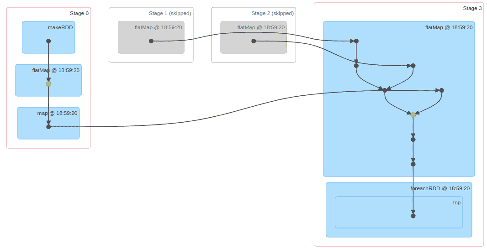
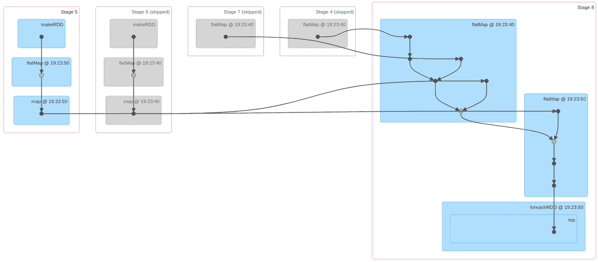
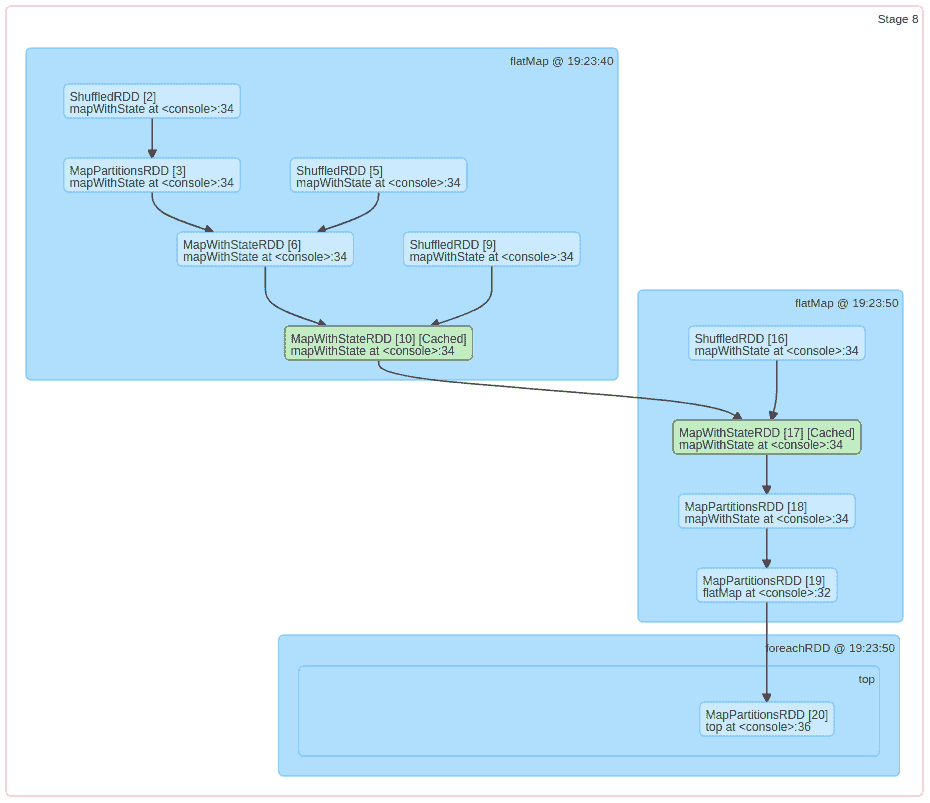
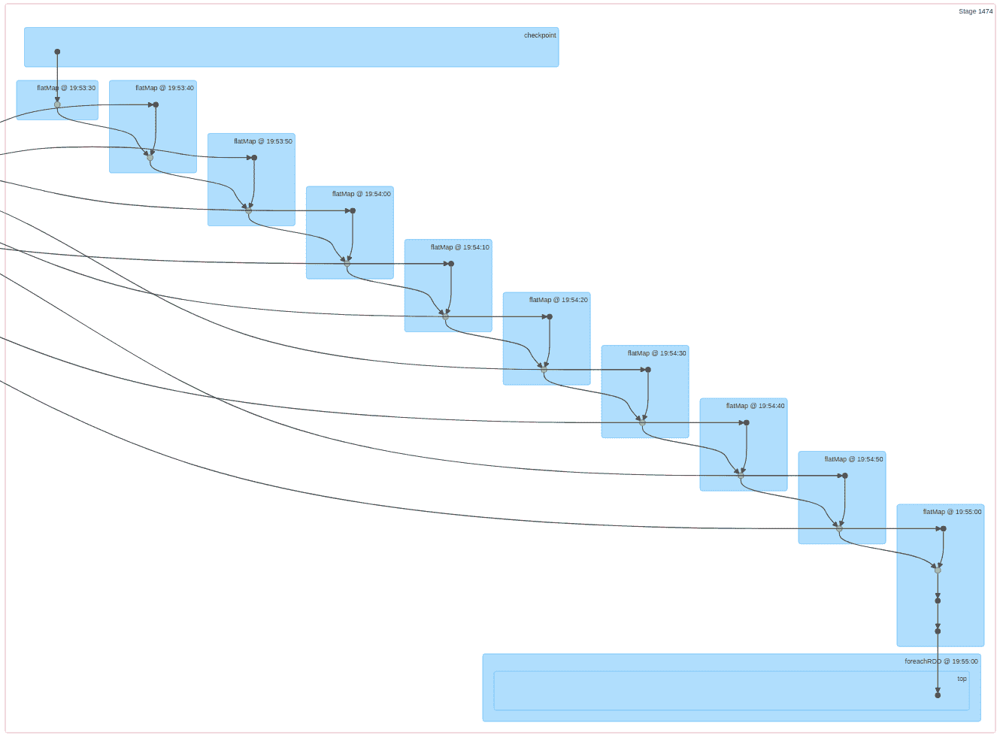
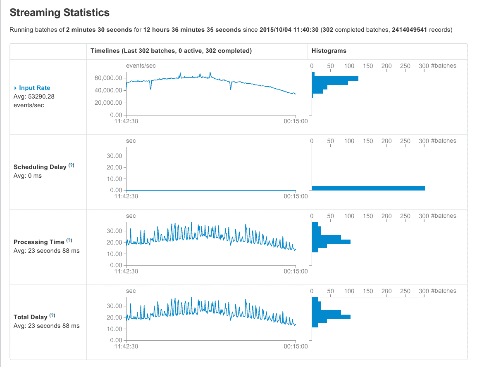

# 第二十四章：Checkpointing

Checkpointing 的行为包括定期保存重新启动有状态流式应用程序所需的信息，而无需丢失信息，也无需重新处理到目前为止看到的所有数据。

*Checkpointing* 是处理有状态的 Spark Streaming 应用程序时特别需要注意的一个主题。没有 checkpointing，重新启动有状态的流式应用程序将要求我们重建状态，直到应用程序之前停止的那一点。在窗口操作的情况下，重建过程可能包括数小时的数据，这将需要更大的中间存储。更具挑战性的情况是在实现任意状态聚合时，正如我们在第二十二章中所见。如果没有 checkpoints，即使是简单的有状态应用程序，比如统计网站每个页面的访客数量，也需要重新处理所有过去的数据来重建其状态到一个一致的水平；这是一个从非常困难到不可能的挑战，因为系统中可能不再有所需的数据。

然而，checkpoint 并非免费。checkpoint 操作对流式应用程序提出了额外的要求，涉及维护 checkpoint 数据所需的存储以及此重复操作对应用程序性能的影响。

在本章中，我们讨论了设置和使用 Spark Streaming 应用程序中的 checkpointing 所需考虑的要点。我们从一个示例开始，以说明在程序中设置 checkpoint 的实际方面。然后，我们看看如何从 checkpoint 恢复，checkpointing 引入的操作成本，最后，我们讨论一些调整 checkpointing 性能的技术。

# 理解 Checkpoints 的使用

让我们考虑以下流式作业，该作业跟踪在线视频商店每小时播放的视频次数。它使用 `mapWithState` 来跟踪通过流传递的 `videoPlayed` 事件，并处理事件中嵌入的时间戳以确定基于时间的聚合。

在接下来的代码片段中，我们做出以下假设：

+   数据流包括结构 `VideoPlayed(video-id, client-id, timestamp)`

+   我们有一个类型为 `DStream[VideoPlayed]` 的 `videoPlayedDStream` 可用。

+   我们有一个具有以下签名的 `trackVideoHits` 函数：

```
// Data Structures
case class VideoPlayed(videoId: String, clientId: String, timestamp: Long)
case class VideoPlayCount(videoId: String, day: Date, count: Long)

// State Tracking Function
def trackVideoHits(videoId: String,
                   timestamp:Option[Long],
                   runningCount: State[VideoPlayCount]
                   ): Option[VideoPlayCount]
```

# 在线资源

我们将代码简化为理解 checkpointing 所需的元素。要探索完整示例，请访问书籍在线资源中名为 [*https://github.com/stream-processing-with-spark*](https://github.com/stream-processing-with-spark) 的独立项目 `checkpointed-video-stream`。

##### 示例 24-1. 流式 checkpointing

```
import org.apache.spark.streaming.State
import org.apache.spark.streaming._

val streamingContext = new StreamingContext(spark.sparkContext, Seconds(10))
streamingContext.checkpoint("/tmp/streaming")

val checkpointedVideoPlayedDStream = videoPlayedDStream.checkpoint(Seconds(60))

// create the mapWithState spec
val videoHitsCounterSpec = StateSpec.function(trackVideoHits _)
                                    .timeout(Seconds(3600))

// Stateful stream of videoHitsPerHour
val statefulVideoHitsPerHour = checkpointedVideoPlayedDStream.map(videoPlay =>
  (videoPlay.videoId, videoPlay.timestamp)
).mapWithState(videoHitsCounterSpec)

// remove the None values from the state stream by "flattening" the DStream
val videoHitsPerHour = statefulVideoHitsPerHour.flatMap(elem => elem)

// print the top-10 highest values
videoHitsPerHour.foreachRDD{ rdd =>
  val top10 = rdd.top(10)(Ordering[Long].on((v: VideoPlayCount) => v.count))
  top10.foreach(videoCount => println(videoCount))
}

streamingContext.start()
```

如果我们运行这个示例，我们应该看到类似于以下的输出：

```
Top 10 at time 2019-03-17 21:44:00.0
=========================
video-935, 2019-03-17 23:00:00.0, 18
video-981, 2019-03-18 00:00:00.0, 18
video-172, 2019-03-18 00:00:00.0, 17
video-846, 2019-03-18 00:00:00.0, 17
video-996, 2019-03-18 00:00:00.0, 17
video-324, 2019-03-18 00:00:00.0, 16
video-344, 2019-03-17 23:00:00.0, 16
video-523, 2019-03-18 00:00:00.0, 16
video-674, 2019-03-18 00:00:00.0, 16
video-162, 2019-03-18 00:00:00.0, 16
=========================
```

在此作业执行时观察的更有趣的方面是 Spark UI，在那里我们可以看到每个批处理执行对前一阶段依赖关系的展开情况。

图 24-1 说明了第一次迭代（`Job #0`）如何仅依赖于由 `makeRDD` 操作标识的初始数据批次。



###### 图 24-1\. 观察初始有状态作业血统

###### 注意

要在您自己的设置中查看此表示，请转至 Spark UI，位于 `<host>:4040`（如果在同一主机上运行多个作业，则为 4041、4042 等）。

然后，点击作业详情，跳转至页面 `http://<host>:4040/jobs/job/?id=0`，您可以展开*DAG 可视化*以显示可视化内容。

随着作业的进展，我们可以检查下一个执行的作业 `job #1` 的 DAG 可视化，如我们在图 24-2 中展示的那样。在那里，我们可以看到结果依赖于前一批次的 `makeRDD` 和当前数据批次，通过 `mapWithState` 阶段体现了有状态计算的作用。



###### 图 24-2\. 进化的有状态作业血统

如果我们查看 `job #1` 中 `stage 8` 的详细信息，在图 24-3 中，我们可以欣赏当前结果如何依赖于前期和新数据的组合。



###### 图 24-3\. 进化的有状态作业血统：详细

此过程将随着每个新数据批次的到来而重复，创建一个越来越复杂的依赖图。在相同的图表中，我们可以看到旧阶段被跳过，因为结果仍然存储在内存中。但我们不能永远保留所有先前的结果。

检查点提供了解决此复杂性的解决方案。在每个检查点，Spark Streaming 存储流计算的中间状态，因此不再需要处理新数据之前的检查点之前的结果。

在图 24-4 中，我们可以看到同一流作业超过 300 次迭代后的状态。与将前 300 个结果存储在内存中不同，有状态计算结合检查点信息和最新数据批次，以获得最新微批次的结果。



###### 图 24-4\. 进化的有状态作业血统：检查点

# DStreams 的检查点

要启用检查点，您需要设置两个参数：

`streamingContext.checkpoint(<dir>)`

设置流处理上下文的检查点目录。此目录应位于弹性文件系统上，例如 Hadoop 分布式文件系统（HDFS）。

`dstream.checkpoint(<duration>)`

将 DStream 的检查点频率设置为指定的`duration`。

在 DStream 上设置持续时间是可选的。如果未设置，则默认为特定值，具体取决于 DStream 类型。对于`MapWithStateDStream`，默认为批处理间隔的 10 倍。对于所有其他 DStreams，默认为 10 秒或批处理间隔，以较大者为准。

检查点频率*必须*是批处理间隔的倍数，否则作业将因初始化错误而失败。直观地说，我们希望间隔频率是每*n*批处理间隔一次，其中*n*的选择取决于数据量以及作业故障恢复的要求的关键性。根据 Spark 文档的建议，一个经验法则是起始时每五到七个批处理间隔进行检查点。

###### 警告

请注意，如果批处理间隔超过 10 秒，则保留默认值将在每个批处理上创建一个检查点，这可能会对流作业的性能产生负面影响。

当流处理操作依赖于先前状态时，状态处理需要检查点，因此保留所有必要数据可能会计算量大或根本不可能。这里的思路是，Spark Streaming 实现可能依赖于先前 RDD 的计算，无论是来自中间结果还是先前的源数据。正如我们在先前的例子中看到的那样，这构成了计算的衍生线。然而，正如我们也观察到的那样，在使用有状态计算时，该衍生线可能会变得很长甚至无限。

例如，计算从窗口化计算中获取的最大衍生线条长度的推理是考虑如果在最坏情况下由于部分数据丢失我们需要恢复整个计算所需的数据类型。给定持续时间为*t*的批处理间隔和*n* × *t*的窗口间隔，我们将需要最后的*n*个 RDD 数据来重新计算窗口。在窗口化计算的情况下，衍生线条的长度可能很长，但受到固定因子的限制。

当我们的计算衍生线可能是任意长时，从方便到必要使用检查点跳转。在任意有状态流的情况下，状态依赖于先前 RDD 的长度可以回溯到应用程序运行时的开始，这使得在有状态流上使用检查点是强制性的。

# 从检查点恢复

在我们迄今为止的讨论中，我们考虑了检查点在保存有状态流作业的中间状态中发挥的作用，以便进一步迭代可以引用该中间结果而不依赖作业的完整衍生线。这可能一直延续到接收到的第一个元素。

当我们处理故障和从故障中恢复时，检查点还有另一个同等重要的方面。让我们回到我们的初始示例并思考一分钟：“如果我的作业在任何时候失败会发生什么？”如果没有检查点，我们将需要重播过去至少一个小时的数据，以恢复每个视频播放的部分总数。现在想象一下，我们正在计算每日总数。然后，我们需要在新数据仍在到达进行处理时，重播一天的数据。

检查点中包含的信息使我们能够从最后一个已知状态恢复流处理应用程序，即上次检查点的状态。这意味着全面恢复仅需要重播几个批次的数据，而不是数小时或数天的记录。

Spark Streaming 应用程序在实现中必须支持从检查点进行恢复。特别是，我们需要使用特定方法来获取活动的 `streamingContext`。`streamingContext` 提供了 `getActiveOrCreate(<dir>, <ctx-creation-function>)` 方法，允许应用程序从存储在 `<dir>` 的现有检查点开始运行，如果检查点不可用，则使用 `<ctx-creation-function>` 函数创建新的 `streamingContext`。

如果我们更新先前的示例并加入检查点恢复功能，我们的 `streamingContext` 创建应如下所示：

```
def setupContext(
  checkpointDir : String,
  sparkContext: SparkContext
  ): StreamingContext = {
// create a streamingContext and setup the DStream operations we saw previously
}

val checkpointDir = "/tmp/streaming"
val streamingContext = StreamingContext.getOrCreate(
  CheckpointDir,
  () => setupContext(CheckpointDir, spark.sparkContext)
)

streamingContext.start()
streamingContext.awaitTermination()
```

## 限制

检查点恢复仅适用于打包为 JAR 文件并使用 `spark-submit` 提交的应用程序。从检查点恢复仅限于编写检查点数据的相同应用程序逻辑，不能用于对正在运行的流处理应用程序进行升级。应用程序逻辑的更改将影响从检查点中的序列化形式重建应用程序状态的可能性，并且会导致重新启动失败。

检查点严重影响将流处理应用程序升级到新版本的可能性，并要求在新版本应用程序变得可用时进行特定的架构考虑以恢复有状态计算。

# 检查点成本

将检查点写入磁盘会增加流处理应用程序的执行时间成本，这在 Spark Streaming 中尤为关注，因为我们将批处理间隔视为计算预算。将可能的大型状态写入磁盘可能会很昂贵，特别是如果支持该应用程序的硬件相对较慢，这在使用 Hadoop 分布式文件系统（HDFS）作为后备存储时经常会出现。需要注意的是这是检查点的最常见情况：HDFS 是可靠的文件系统，磁盘驱动器提供的复制存储成本可管理。

Checkpointing 理想情况下应在可靠的文件系统上运行，以便在故障发生时能够通过从可靠存储读取数据迅速恢复流的状态。然而，考虑到写入 HDFS 可能较慢，我们需要面对一个事实，即 checkpointing 周期性地可能需要更长的运行时间，甚至可能比批处理间隔时间还要长。正如我们之前解释过的，批处理时间长于批处理间隔时间可能会带来问题。

# Checkpoint 调整

由于 Spark 用户界面，您可以平均衡量需要多少额外时间来计算包含 checkpointing 的批处理间隔，与在不需要 checkpointing 的 RDD 中观察到的批处理时间相比。假设我们的批处理时间约为 30 秒，批处理间隔为一分钟。这是一个相对有利的情况：每个批处理间隔，我们只需花费 30 秒进行计算，而在接收数据的同时，我们有 30 秒的“空闲”时间，我们的处理系统在此期间处于空闲状态。

鉴于我们的应用要求，我们决定每五分钟进行一次检查点。现在我们决定每五分钟进行一次检查点，我们进行了一些测量并观察到我们的检查点批次需要四分钟的实际批处理时间。我们可以得出结论，在这种情况下，我们将需要大约三分半钟的时间来写入磁盘，考虑到在同一批次中，我们还扩展了 30 秒的计算时间。这意味着在这种情况下，我们将需要四个批次再次进行检查点。为什么会这样？

这是因为当我们实际花费三分半钟将文件写入磁盘时，事实上我们仍在接收数据，当这三分半钟结束时，我们已经接收到了三个半新的批次，因为我们的系统被阻塞等待检查点操作结束。因此，我们现在有了三个半（即四个）批次数据存储在我们的系统上，我们需要处理以追赶并再次达到稳定状态。现在，我们在正常批处理中的计算时间是 30 秒，这意味着我们每分钟的批次间隔都能够赶上一个新的批次，因此在四个批次内，我们将赶上接收到的数据。我们将在第五个批次间隔时再次进行检查点。在五个批次的检查点间隔下，我们实际上只是处于系统的稳定极限。

当然，前提是，在您的有状态流中编码的状态确实反映了随时间从输入源接收的数据量大小相对恒定的大小。状态的大小与随时间接收的数据量之间的关系可能更复杂，并且依赖于特定的应用程序和计算，这就是为什么通过检查点长度进行实验通常非常有用的原因。其思想是更大的检查点间隔将为我们的集群提供更多时间来赶上检查点期间丢失的时间，同样重要的是，如果我们设置的检查点间隔过高，那么如果发生崩溃导致数据丢失，我们可能会遇到一些难以赶上的集群问题。在这种情况下，我们确实需要系统加载检查点并重新处理自那个检查点以来看到的所有 RDD。

最后，请注意，任何 Spark 用户都应考虑更改任何 DStream 上的默认检查点间隔，因为它设置为 10 秒。这意味着在每个批处理上，如果自上次检查点以来的间隔大于检查点间隔，则 Spark 将进行检查点。因此，如果批处理间隔大于 10 秒，这将导致处理时间上的“锯齿”模式，如 图 24-5 所示，描述了每隔一个批次进行一次检查点（对大多数应用程序来说可能太频繁了）。

###### 注意

对于检查点间隔调整的另一种选择是将数据写入一个接受非常高速数据的持久化目录。为此，您可以选择将检查点目录指向由非常快速硬件存储支持的 HDFS 集群路径，例如固态硬盘（SSD）。另一种选择是将其支持为内存，并在内存填满时将数据卸载到磁盘，例如由 Alluxio 执行的操作，这是最初作为 Tachyon 开发的项目，是 Apache Spark 的某个模块。通过这种简单方法来减少检查点时间和在检查点中丢失的时间通常是达到 Spark Streaming 稳定计算的最有效方式之一；当然，前提是这是可承受的。



###### 图 24-5\. 检查点“锯齿”性能模式
