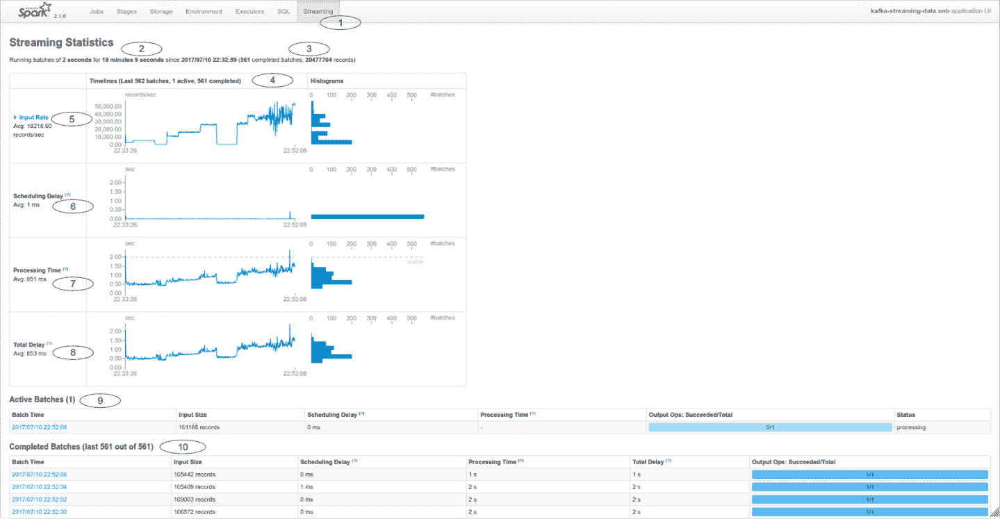
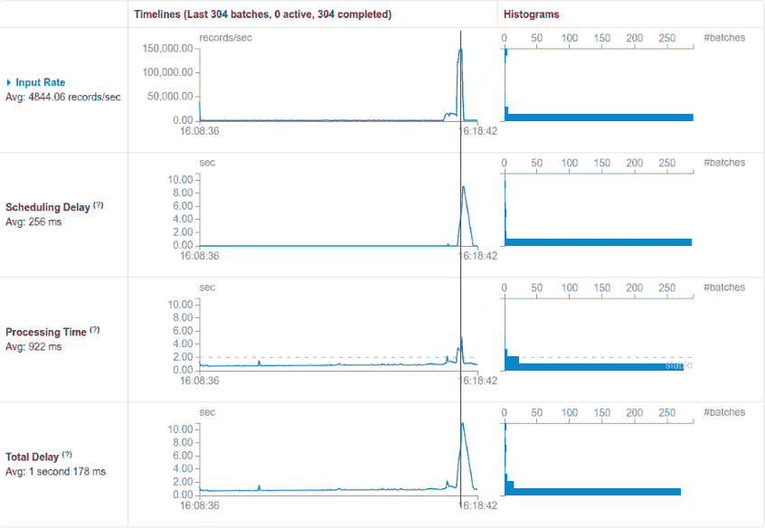
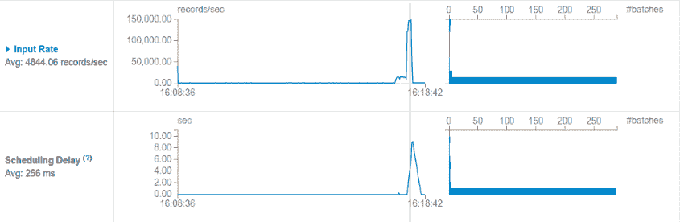
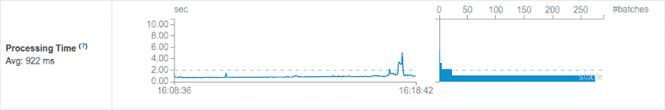
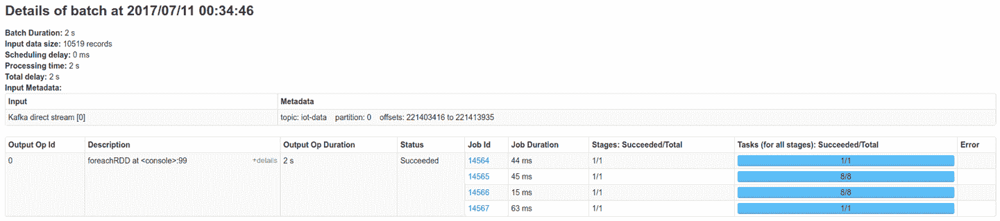

# 第二十五章：监控 Spark Streaming

流应用程序中的监控需要获得部署应用程序的操作信心，应包括应用程序使用的资源的整体视图，例如 CPU、内存和二级存储。作为分布式应用程序，要监控的因素数量将与集群部署中节点数量相乘。

为了管理这种复杂性，我们需要一个全面而智能的监控系统。它需要从参与流应用运行时的所有关键**组件**收集指标，并同时以易于理解和可消费的形式提供它们。

对于 Spark Streaming 而言，除了刚讨论的通用指标外，我们主要关注接收到的数据量、应用程序选择的批处理间隔以及每个微批处理的实际执行时间之间的关系。这三个参数之间的关系对于长期稳定的 Spark Streaming 作业至关重要。为确保我们的作业在稳定的边界内执行，我们需要将性能监控作为开发和生产过程的一个整体组成部分。

Spark 提供了几种监控接口，以满足该过程不同阶段的需求：

流式 UI

提供有关运行作业的关键指标的图表的 Web 界面

[监控 REST API](https://wiki.example.org/monitoring_rest_api)

一组 API，可通过 HTTP 接口被外部监控系统消费，以获取指标

指标子系统

允许将外部监控工具紧密集成到 Spark 中的可插拔服务提供者接口（SPI）

内部事件总线

Spark 中的发布/订阅子系统，其中编程订阅者可以接收有关集群上应用程序执行不同方面的事件

在本章中，我们探讨这些监控接口及其如何应用于流应用程序的生命周期的不同阶段。我们从流式 UI 开始，其中我们调查此接口提供的功能及其与运行中 Spark Streaming 作业不同方面的联系。流式 UI 是一个强大的视觉工具，我们可以在初始开发和部署阶段使用它，以更好地了解我们的应用程序从实用的角度如何运行。我们专门详述了使用流式 UI 的部分，重点关注性能方面。

在本章的其余部分，我们涵盖了 Spark Streaming 的不同监控集成能力。我们探索 REST API 和 Metrics Subsystem SPI 提供的 API，以向外部监控客户端公开内部指标。最后，我们描述了内部事件总线的数据模型和交互，这可以用于以编程方式访问 Spark Streaming 提供的所有指标，适用于需要最大灵活性以集成自定义监控解决方案的情况。

# 流式 UI

SparkUI 是一个网络应用程序，位于 Spark 驱动节点上，通常运行在端口 4040 上，除非同一节点上有其他 Spark 进程运行，否则将使用增加的端口（4041、4042 等），直到找到一个空闲端口。我们也可以通过配置键 `spark.ui.port` 来配置此端口。

我们所说的 *流式 UI* 是 Spark UI 中的一个选项卡，仅当启动 `StreamingContext` 时才会激活，如 图 25-1 所示。



###### 图 25-1\. 流式 UI

流式 UI 包括几个视觉元素，提供 Spark Streaming 作业性能的一览无余视图。根据图像中的数字线索，以下是组成 UI 的元素：

(1) 流式 UI 选项卡

这是 Spark UI 上的流式选项卡。单击它会打开该流式 UI。

(2) 基于时间的统计数据

总体统计行包括批处理间隔、此应用程序已运行的时间和启动时间戳。

(3) 批次和记录摘要

在时间信息旁边，我们找到已完成的批次总数以及处理的记录总数。

(4) 性能图表

图表标题在图表报告的表中指出了使用的数据。图表中表示的数据保存在循环缓冲区中。我们只看到最近的一千（1,000）个接收到的数据点。

(5) 输入速率图表

每个批次间隔接收的记录数量的时间序列表示，并且旁边还有一个分布直方图。

(6) 调度延迟图表

此图表报告了批次调度和处理之间的差异。

(7) 处理时间图表

处理每个批次所需时间（持续时间）的时间序列。

(8) 总延迟图表

这是调度延迟和处理时间的总和的时间序列。它提供了对 Spark Streaming 和 Spark 核心引擎的联合执行的视图。

(9) 活动批次

提供当前在 Spark Streaming 队列中的批次列表。它显示当前正在执行的批次或批次，以及在过载情况下可能存在的任何潜在积压批次。理想情况下，此列表中只有处理中的批次。如果在加载流式 UI 时当前批次已完成处理且下一批次尚未计划，则此列表可能为空。

(10) 已完成批次

最近处理的批次列表，以及指向该批次详细信息的链接。

# 使用流式 UI 理解作业性能

如“流式处理 UI”中讨论的，流式处理作业的主屏幕包含四个图表，展示了当前和最近的性能快照。默认情况下，UI 显示最后 1,000 个处理间隔，这意味着我们能够查看的时间段是间隔 × 批处理间隔，因此对于批处理间隔为两秒的作业，我们可以看到大约最近半小时的指标（2 × 1,000 = 2,000 秒，或 33.33 分钟）。我们可以使用 `spark.ui.retainedJobs` 配置参数来配置记忆间隔的数量。

## 输入速率图表

顶部的输入速率图表显示了应用程序正在维持的输入负载。所有图表共享一个公共时间轴。我们可以想象一条竖直线通过所有图表，这将作为一个参考，用于将不同的指标与输入负载相关联，正如在图 25-2 中所示。图表线的数据点可点击，并将链接到图表下方出现的相应作业详细信息行。正如我们稍后将探讨的，这种导航功能对于追踪我们可以在图表上观察到的某些行为的起源非常有帮助。



###### 图 25-2\. 流式处理 UI：度量的相关性

## 调度延迟图表

UI 中的下一个图表是**调度延迟**图表。这是一个关键的健康指标：对于一个在其时间和资源约束内运行良好的应用程序，这个度量指标将始终保持在零上。小的周期性干扰可能指向定期支持过程，例如快照。

创建异常负载的窗口操作也可能影响这个度量。重要的是要注意，延迟将显示在紧随需要超过批处理间隔完成的批次后面的批次上。这些延迟不会与输入速率显示相关。由数据输入高峰引起的延迟将与输入速率的高峰相关联，并带有偏移。图 25-3 显示了输入速率图中的高峰比调度延迟的相应增加早。因为这个图表代表了一个延迟，我们看到系统在开始“消化”数据过载后才会显示这些效果。



###### 图 25-3\. 流式处理 UI：调度延迟

## 处理时间图表

此图表显示了图 25-4 中数据处理部分的执行时间。此执行发生在 Spark 集群上，因此这是实际数据处理在（可能的）分布式环境中表现的主要指标。图表的一个重要方面是水位线，其水平对应批处理间隔时间。让我们迅速回顾一下，批处理间隔是每个微批处理的时间，也是我们处理前一间隔到达的数据的时间。低于此水位线的处理时间被视为稳定的。偶尔超过此线的峰值可能是可以接受的，如果作业有足够的空间从中恢复。如果作业始终高于此线，则会利用内存和/或磁盘中的存储资源构建积压。如果可用存储资源耗尽，则作业最终会崩溃。此图表通常与输入速率图表高度相关，因为作业的执行时间通常与每个批处理间隔接收的数据量有关。



###### 图 25-4\. 流式 UI：处理时间

## 总延迟图表

总延迟图表是系统端到端延迟的图形化表示。总延迟包括 Spark Streaming 收集、调度和提交每个微批处理以进行处理的时间，以及 Spark 应用作业逻辑并生成结果的时间。此图表提供了系统性能的整体视图，并揭示了作业执行过程中可能发生的任何延迟。至于调度延迟图表，总延迟指标的持续增加是一个值得关注的原因，可能表明高负载或其他条件（如增加的存储延迟）对作业性能产生负面影响。

## 批次详情

当我们向下滚动到构成流式 UI 主屏幕的图表下方时，我们会发现两个表格：活跃批次和已完成批次。这些表格的列对应我们刚刚学习的图表：输入大小、调度延迟、处理时间以及输出操作计数器。除了这些字段，已完成批次还显示了相应微批次的总延迟。

###### 注意

*输出操作* 指的是注册要在微批次上执行的输出操作数量。这涉及作业的代码结构，不应与并行性指标混淆。正如我们所记得的，输出操作（如 `print()` 或 `foreachRDD`）是触发 DStream 惰性执行的操作。

活跃批次

包含关于 Spark Streaming 调度队列中微批次的信息。对于一个健康的作业，该表最多包含一行：当前正在执行的批次。此条目指示微批次中包含的记录数及执行开始前的任何延迟。处理时间在微批次完成之前是未知的，因此在活动批次表上从未显示该指标。

当此表中存在多行时，表示作业超出了批次间隔并且新的微批次排队等待执行，形成执行积压。

已完成批次

批次执行完成后，其在活动批次表中对应的条目会转移到已完成批次表中。在此转换中，处理时间字段填充其执行时间，并且总延迟也会被确定并包括在内。

每个条目由时间戳标识，标记为批次时间。此标签还提供了链接，指向提供此批次执行的 Spark 作业的详细信息。

批次详情的链接值得进一步探索。正如前几章所解释的，Spark Streaming 模型基于微批次。批次详情页面提供了每个批次执行的洞察，分解为构成批次的不同作业。Figure 25-5 展示了结构。批次定义为按照应用程序代码中定义的顺序执行的输出操作序列。每个输出操作包含一个或多个作业。本页面总结了这种关系，显示了每个作业的持续时间以及任务概述中的并行级别。



###### 图 25-5\. 流式 UI：批次详情

作业按作业 ID 列出，并提供指向 Spark UI 中作业页面的链接。这些是核心引擎执行的*普通* Spark 作业。通过点击，我们可以探索执行情况，包括阶段、分配的执行器和执行时间统计信息。

###### 注意

要在本地使用流式 UI，本书的在线资源中提供了两个笔记本：

kafka-data-generator.snb

此笔记本用于按秒产生可配置数量的记录，这些记录发送到本地 Kafka 主题。

kafka-streaming-data.snb

该笔记本从相同主题消费数据，将数据与参考数据集进行连接，并将结果写入本地文件。

通过尝试生产者速率，我们可以观察流式 UI 的行为，并体验稳定和过载情况。这是将流式应用程序推向生产时的良好练习，因为它有助于理解其性能特征并确定应用程序在何时执行正确的负载阈值。

# 监控 REST API

监控 REST API 将作业的流式指标公开为一组预定义的 HTTP 终端，这些终端以 JSON 格式的对象传送数据。这些对象可以被外部监控和警报应用程序消耗，以将 Spark Streaming 作业与某些外部监控系统集成。

## 使用监控 REST API

监控 REST API 由 Spark 驱动节点提供，端口与 Spark UI 相同，并挂载在 `/api/v1` 终点：`http://<driver-host>:<ui-port>/api/v1`。

`/api/v1/applications/:app-id` 资源提供有关提供的应用程序 ID `app-id` 的信息。首先必须通过调用 `/api/v1/applications` 查询此 `id`，以构建特定应用程序的 URL。在以下 URL 中，我们将这个变量应用程序 ID 称为 `app-id`。

注意，对于运行中的 Spark Streaming 上下文，只会有一个当前应用程序 ID。

###### 警告

监控 REST API 从 Spark 版本 2.2 开始仅支持 Spark Streaming。对于较早版本的 Spark，请考虑在下一节中进一步解释的度量 servlet。

## 监控 REST API 提供的信息

与运行中的 Spark Streaming 上下文对应的资源位于 `/api/v1/applications/:app-id/streaming`。

表 25-1 总结了此终端提供的子资源。

表 25-1\. 流处理资源的子资源

| 资源 | 含义 | 对应的 UI 元素 |
| --- | --- | --- |
| `/statistics` | 一组汇总的指标（有关详细信息，请参阅后续章节） | 流处理 UI 图表 |
| `/receivers` | 在这个流处理作业中实例化的所有接收器列表 | 输入速率图表上的接收器摘要 |
| `/receivers/:stream-id` | 根据提供的 `stream-id` 索引的接收器的详细信息 | 点击打开输入速率图表上的接收器 |
| `/batches` | 当前保存的所有批次列表 | 图表下的批次列表 |
| `/batches/:batch-id/operations` | 输出操作 | 点击批处理列表中的一个批处理 |
| `/batches/:batch-id/operations/:output-op-id` | 给定批次中相应输出操作的详细信息 | 在批处理详细页面下的操作详情中点击 |

从监控的角度来看，我们应该额外关注 `statistics` 对象。它包含了我们需要监视的关键性能指标，以确保流处理作业的健康运行：`/api/v1/applications/:app-id/ streaming/statistics`。

表 25-2 展示了`statistics`端点提供的不同数据列表、它们的类型以及涉及的指标简要描述。

表 25-2\. 流处理资源的统计对象

| 键 | 类型 | 描述 |
| --- | --- | --- |
| `startTime` | 字符串 | 以 ISO 8601 格式编码的时间戳 |
| `batchDuration` | 数字 (长整型) | 批处理间隔的持续时间（以毫秒为单位） |
| `numReceivers` | Number (Long) | 注册接收器的计数 |
| `numActiveReceivers` | Number (Long) | 当前活动接收器的计数 |
| `numInactiveReceivers` | Number (Long) | 当前不活动接收器的计数 |
| `numTotalCompletedBatches` | Number (Long) | 从流处理作业启动以来已完成的批次计数 |
| `numRetainedCompletedBatches` | Number (Long) | 目前保留的批次计数，我们仍然存储其信息 |
| `numActiveBatches` | Number (Long) | 流处理上下文执行队列中批次的计数 |
| `numProcessedRecords` | Number (Long) | 当前运行作业处理的记录总和 |
| `numReceivedRecords` | Number (Long) | 当前运行作业接收的记录总和 |
| `avgInputRate` | Number (Double) | 最近保留的批次的输入速率的算术平均值 |
| `avgSchedulingDelay` | Number (Double) | 最近保留的批次的调度延迟的算术平均值 |
| `avgProcessingTime` | Number (Double) | 最近保留的批次的处理时间的算术平均值 |
| `avgTotalDelay` | Number (Double) | 最近保留的批次的总延迟的算术平均值 |

在将监控工具集成到 Spark Streaming 中时，我们特别关注 `avgSchedulingDelay`，并确保它不会随时间增长。许多监控应用程序使用 *增长率*（或类似）测量指标随时间的变化。由于 API 提供的值是最近保留的批次（默认为 1,000）的平均值，设置关于此指标的警报应考虑小幅增长的变化。

# 指标子系统

在 Spark 中，指标子系统是一个 SPI，允许实现指标接收器以将 Spark 与外部管理和监控解决方案集成。

提供一些内置实现，例如以下内容：

控制台

将指标信息记录到作业的标准输出

HTTP Servlet

使用 HTTP/JSON 传递指标

CSV

以逗号分隔值 (CSV) 格式将指标传递到配置目录中的文件

JMX

通过 Java 管理扩展 (JMX) 启用指标报告

日志

将指标信息传递到应用程序日志中

Graphite、StatsD

将指标转发至 Graphite/StatsD 服务

Ganglia

将指标传递到现有的 Ganglia 部署（请注意，由于许可限制，使用此选项需要重新编译 Spark 二进制文件）

指标子系统报告 Spark 和 Spark Streaming 进程的最新值。这为我们提供了对性能指标的原始访问，可以向远程性能监控应用程序提供数据，并在流处理过程中的异常发生时进行准确及时的报警。

流处理作业的特定指标可以在键 `<app-id>.driver.<application name>.StreamingMetrics.streaming` 下找到。

如下所示：

+   `lastCompletedBatch_processingDelay`

+   `lastCompletedBatch_processingEndTime`

+   `lastCompletedBatch_processingStartTime`

+   `lastCompletedBatch_schedulingDelay`

+   `lastCompletedBatch_submissionTime`

+   `lastCompletedBatch_totalDelay`

+   `lastReceivedBatch_processingEndTime`

+   `lastReceivedBatch_processingStartTime`

+   `lastReceivedBatch_records`

+   `lastReceivedBatch_submissionTime`

+   `receivers`

+   `retainedCompletedBatches`

+   `runningBatches`

+   `totalCompletedBatches`

+   `totalProcessedRecords`

+   `totalReceivedRecords`

+   `unprocessedBatches`

+   `waitingBatches`

尽管不直接提供，您可以通过简单的算术运算获取 `lastCompletedBatch_processingTime`：`lastCompletedBatch_processingEndTime - lastCompletedBatch_processingStartTime`。

在这个 API 中，跟踪作业稳定性的关键指标是 `lastCompletedBatch_processingDelay`，我们期望它接近零并且随时间稳定。对最近 5 到 10 个值的移动平均值应该消除由小延迟引入的噪声，并提供一个可靠的度量标准，以触发警报或呼叫。

# 内部事件总线

本章讨论的所有度量接口都有一个共同的真实数据来源：它们都通过专用的 `StreamingListener` 实现从内部 Spark 事件总线消耗数据。

Spark 使用多个内部事件总线向订阅客户端传递有关正在执行的 Spark 作业的生命周期事件和元数据。这种接口主要由内部 Spark 消费者使用，以某种处理过的形式提供数据。Spark UI 就是这种交互的最显著例子。

对于那些现有的高级接口无法满足我们需求的情况，可以开发自定义监听器并注册它们来接收事件。要创建自定义的 Spark Streaming 监听器，我们扩展 `org.apache.spark.streaming.scheduler.StreamingListener` trait。该 trait 对所有回调方法都有一个无操作的默认实现，因此扩展它只需要覆盖我们自定义的指标处理逻辑所需的回调方法。

请注意，此内部 Spark API 标记为 `DeveloperApi`。因此，其定义（如类和接口）可能会在未公开通知的情况下更改。

###### 注意

您可以在在线资源中探索自定义的 Spark Streaming 监听器实现。笔记本 *kafka-streaming-with-listener* 扩展了之前使用的 Kafka 笔记本，使用自定义笔记本监听器将所有事件传递到可直接在笔记本中显示的 `TableWidget` 中。

## 与事件总线交互

`StreamingListener` 接口由一个带有多个回调方法的 trait 组成。每个方法都由通知过程调用，使用 `StreamingListenerEvent` 的子类实例来传递相关信息给回调方法。

### StreamingListener 接口

在以下概述中，我们突出显示这些数据事件中最有趣的部分：

`onStreamingStarted`

```
def onStreamingStarted(
  streamingStarted:StreamingListenerStreamingStarted):Unit
```

当流处理作业启动时调用此方法。`StreamingListenerStreamingStarted` 实例具有一个字段 `time`，其中包含流处理作业启动时的时间戳（以毫秒为单位）。

接收器事件

所有与接收器生命周期相关的回调方法共享一个名为 `ReceiverInfo` 的通用类，描述正在报告的接收器。每个事件报告类都将有一个单独的 `receiverInfo: ReceiverInfo` 成员。`ReceiverInfo` 类属性中包含的信息将取决于报告事件的相关接收器信息。

`onReceiverStarted`

```
def onReceiverStarted(
  receiverStarted: StreamingListenerReceiverStarted): Unit
```

当接收器已启动时调用此方法。`StreamingListenerReceiverStarted` 实例包含描述为此流处理作业启动的接收器的 `ReceiverInfo` 实例。请注意，此方法仅适用于基于接收器的流模型。

`onReceiverError`

```
def onReceiverError(
  receiverError: StreamingListenerReceiverError): Unit
```

当现有接收器报告错误时调用此方法。与 `onReceiverStarted` 调用类似，提供的 `StreamingListenerReceiverError` 实例包含一个 `ReceiverInfo` 对象。在此 `Receiver Info` 实例中，我们将找到关于错误的详细信息，例如错误消息和发生时间戳。

`onReceiverStopped`

```
def onReceiverStopped(
  receiverStopped: StreamingListenerReceiverStopped): Unit
```

这是 `onReceiverStarted` 事件的对应项。当接收器已停止时触发此事件。

### 批处理事件

这些事件与批处理生命周期相关，从提交到完成。请注意，在 DStream 上注册的每个输出操作都会导致独立的作业执行。这些作业被分组成批次，一起顺序提交到 Spark 核心引擎执行。此监听器接口的这一部分在批次提交和执行生命周期后触发事件。

由于这些事件将在每个微批处理的处理后触发，因此它们的报告频率至少与相关 `StreamingContext` 的批次间隔一样频繁。

与 `receiver` 回调接口的相同实现模式一致，所有与批处理相关的事件都报告一个带有单个 `BatchInfo` 成员的容器类。每个报告的 `BatchInfo` 实例包含对应于报告回调的相关信息。

`BatchInfo` 还包含此批次中注册的输出操作的 `Map`，由 `OutputOperationInfo` 类表示。此类包含每个单独输出操作的时间、持续时间和最终错误的详细信息。我们可以利用这些数据点将批处理的总执行时间拆分为导致在 Spark 核心引擎上执行单个作业的不同操作所需的时间：

`onBatchSubmitted`

```
def onBatchSubmitted(
  batchSubmitted: StreamingListenerBatchSubmitted)
```

当一批作业提交给 Spark 进行处理时，将调用此方法。由`StreamingListenerBatchSubmitted`报告的`BatchInfo`对象包含了批处理提交时间的时间戳。此时，可选值`processingStartTime`和`processingEndTime`都被设置为`None`，因为这些值在批处理周期的此阶段是未知的。

`onBatchStarted`

```
def onBatchStarted(batchStarted: StreamingListenerBatchStarted): Unit
```

当一个单独作业的处理刚刚开始时，将调用此方法。由提供的`StreamingListenerBatchStarted`实例嵌入的`BatchInfo`对象包含了填充的`processingStartTime`。

`onBatchCompleted`

```
def onBatchCompleted(batchCompleted: StreamingListenerBatchCompleted): Unit
```

当批处理完成时，将调用此方法。提供的`BatchInfo`实例将完全填充有批处理的总体时间信息。`OutputOperationInfo`的映射还将包含每个输出操作执行的详细时间信息。

### 输出操作事件

`StreamingListener`回调接口的此部分提供了由批次提交触发的每个作业执行级别的信息。由于可能有多个输出操作注册到同一批次中，此接口可能以比`StreamingContext`的批处理间隔更高的频率触发。任何接收此接口提供的数据的客户端都应该调整为接收这样大量的事件。

这些方法报告的事件包含了一个`OutputOperationInfo`实例，该实例提供了关于正在报告的输出操作的进一步时间详细信息。此`OutputOperationInfo`是刚刚在与批处理相关的事件中看到的`BatchInfo`对象的`outputOperationInfo`中包含的相同数据结构。对于仅对每个作业的时间信息感兴趣，但不需要实时了解执行生命周期的情况，您应该参考由`onBatchCompleted`提供的事件（正如刚刚所描述的）。

这里是您可以在作业执行期间注入自己处理的回调。

`onOutputOperationStarted`

```
def onOutputOperationStarted(
  outputOperationStarted: StreamingListenerOutputOperationStarted): Unit
```

当一个作业的处理（对应于一个输出操作）开始时，将调用此方法。可以通过`batchTime`属性将单个作业关联回其对应的批次。

`onOutputOperationCompleted`

```
def onOutputOperationCompleted(
  outputOperationCompleted: StreamingListenerOutputOperationCompleted): Unit
```

当单个作业的处理完成时，将调用此方法。请注意，没有回调来通知单个作业的失败。`OutputOperationInfo`实例包含一个名为`failureReason`的属性，它是一个`Option[String]`。在作业失败的情况下，此选项将被填充为`Some(error message)`。

### 注册`StreamingListener`

在我们开发了自定义的`StreamingListener`之后，我们需要将其注册以消费事件。流监听总线由`StreamingContext`托管，后者提供了一个注册调用来添加`StreamingListener`特性的自定义实现。

假设我们实现了一个`LogReportingStreamingListener`，将所有事件转发到一个日志框架。示例 25-1 展示了如何在`StreamingContext`中注册我们的自定义监听器。

##### 示例 25-1\. 自定义监听器注册

```
val streamingContext = new StreamingContext(sc, Seconds(10))
val customLogStreamingReporter = new LogReportingStreamingListener(...)
streamingContext.addStreamingListener(customLogStreamingReporter)
```

# 摘要

在本章中，您学习了观察和持续监控运行中的 Spark Streaming 应用程序的不同方法。考虑到作业的性能特征是保证其稳定部署到生产环境的关键因素，性能监控是您在开发周期的早期阶段应执行的活动。

Streaming UI 作为 Spark UI 中的一个选项，非常适合对流式应用程序进行交互式监控。它提供高级图表，跟踪流作业的关键性能指标，并提供详细视图的链接，您可以深入调查组成批处理的各个作业的级别。这是一个能够产生可操作洞见的积极过程，了解流作业的性能特征。

一旦作业被持续执行，显然我们无法 24/7 进行人工监控。通过消费基于 REST 的接口，您可以与现有的监控和警报工具集成，该接口报告的数据与 Streaming UI 或 Metrics Subsystem 中可用的数据相当，后者提供了标准的可插拔外部接口，供监控工具使用。

对于需要完全可定制解决方案的特定用例，可以实现自定义`StreamingListener`，并将其注册到应用程序的`StreamingContext`中，以实时获取最精细粒度的执行信息。

这种广泛的监控方案确保您的 Spark Streaming 应用程序部署可以与生产基础设施中的通用监控和警报子系统共存，并遵循企业内部的质量流程。
