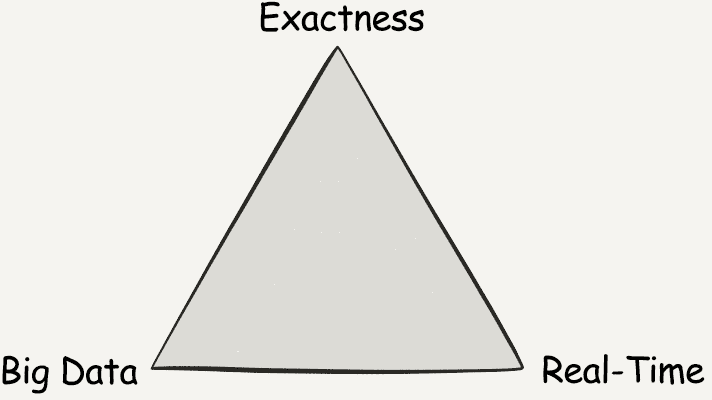
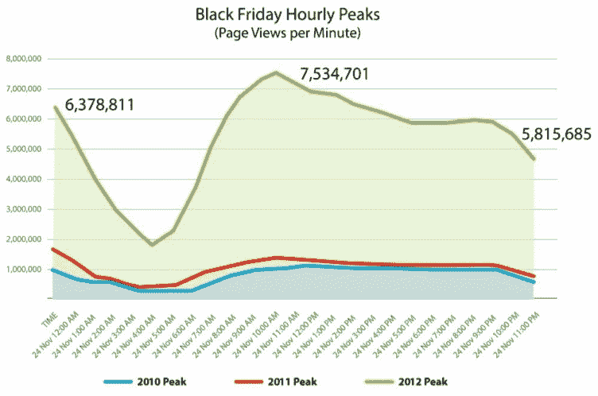
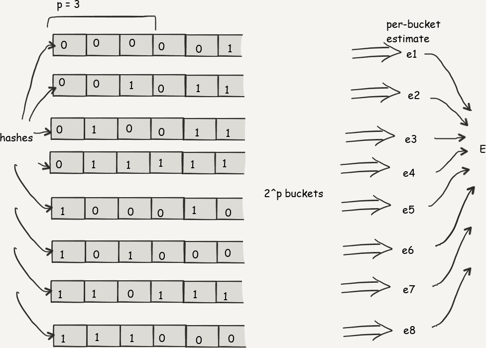
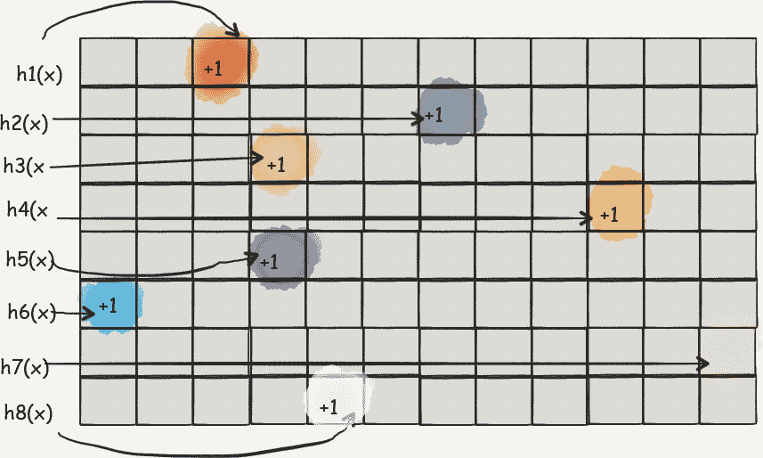
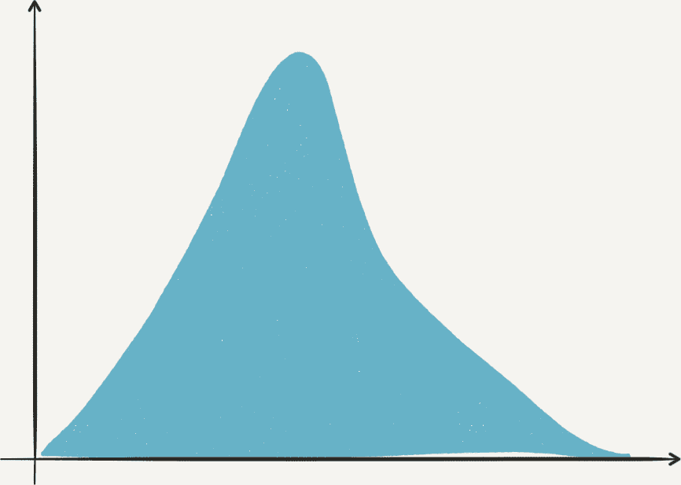
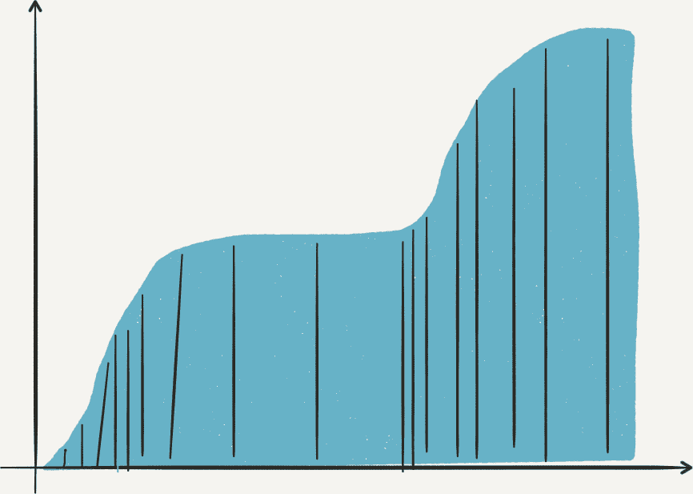

# 第二十七章：流式逼近与采样算法

当涉及到随时间产生观察数据摘要时，流处理面临特殊的挑战。因为我们只有一次机会观察流中的值，即使在有界数据集上被认为简单的查询在想要在数据流上回答同样的问题时也变得复杂。

问题的关键在于这些查询如何要求一个全局摘要的形式，或者一个*最大值*结果，例如观察整个数据集:

+   流中所有不同元素的计数（摘要）

+   流中*k*个最高的元素（全局最大值）

+   流中*k*个最频繁的元素（全局最大值）

自然而然地，当数据来自流时，一次性看到整个数据集是困难的。这类查询可以通过存储整个流，然后将其视为数据批处理来简单回答。但这种存储不仅不总是可能的，而且是一种笨拙的方法。正如你将看到的，我们可以构建简明的数据表示来反映我们流的主要数值特征。这种简洁性有一个代价，即返回的答案的准确性: 这些数据结构及其操作它们的算法返回近似结果，具有特定的误差界限。总结如下：

+   精确算法更精确，但资源消耗非常大

+   近似算法不够精确，但我们愿意接受稍微不那么精确的结果，而不是承担额外的资源成本。

在本节中，我们研究了将近似算法和采样技术应用于通过有限资源对观察到的数据流中的元素进行全局问题的总结的应用。首先，我们探讨了在面对大量数据时实时响应与精确性之间的张力。然后，我们介绍了我们需要理解的三种覆盖的近似方法的哈希和素描的概念：

HyperLogLog（HLL）

用于计数不同元素

CountMinSketch（CMS）

用于计数元素频率

T-Digest

用于近似观察元素的频率直方图

我们以概述不同的采样方法及其在 Spark 中的支持结束本章。

# 精确性、实时性和大数据

分布式计算，在处理连续数据流时通常被认为是一种特殊的问题，因为它受三角概念的限制:

+   产生结果的精确性

+   实时发生的计算

+   大数据的计算

让我们详细看看这些概念：

## 精确性

首先，我们可以看到精确计算是对我们从数据中提问要求得出精确数值答案的反映。例如，如果我们正在监控来自网站的数据，我们可能希望通过分析网站产生的交互、事件和日志来了解当前独立用户的数量。

## 实时处理

第二个方面是分析的新鲜度或延迟性。在这个背景下，延迟性指的是从数据第一次可用到我们能够得出一些见解之间的时间。回到网站访问者的例子，我们可以在一天结束时询问“独立用户”的问题。我们会分析网站在过去 24 小时内产生的日志，并尝试计算在那段时间内访问的独立用户数量。这样的计算可能需要几分钟到几小时才能得出结果，这取决于我们需要处理的数据量。我们认为这是一种高延迟的方法。我们也可以随时询问“网站上有多少用户”，并期望立即得到答案。但是，由于浏览器与 Web 服务器的交互是及时的查询，所谓的“立即”实际上是指“我们在*精心选择的短暂时间内来代表浏览会话的长度*内有多少独立访问者？”

## 大数据

我们需要解决的第三个问题是，我们处理的数据有多大？我们是在看一个本地体育俱乐部的网站，每次只有几个用户在访问，还是在看亚马逊这样的大型零售商的网站，每时每刻都迎来成千上万的访问者？

# 精确性、实时性和大数据三角形

精确性、实时处理和数据量的概念可以用三角形表示，如图 27-1 所示。这个三角形反映出，在数据量增加时，实现精确性和新鲜度（接近实时结果）是矛盾的：这三个需求很少能同时满足。直到最近，分布式数据处理的分析通常只关注这个三角形的两个方面。



###### 图 27-1\. 精确结果、实时处理和大数据的三角形

例如，在网站监控领域，我们过去专注于精确和实时处理，设计了系统，使我们能够快速了解有多少用户访问我们的网站，并提供确切的独立用户数量的答案。

这是流处理的常规工作。近年来，由于大数据的吸引力，它已经落后了。越来越多的在线企业通常将可伸缩性放在首位，因为当一个大型网站扩展时，其维护者仍然希望得到非常精确的关于访问用户数量的结果，因此常常需要分析大量访问者的数量。然后，他们需要认清答案的计算可能需要大量时间，有时比收集这些数据所花费的时间还长。

这通常通过诸如 Apache Spark 的分析框架来处理非常庞大网站的日志。基于周期性（例如，月均值）的估算可能足以进行长期容量规划，但随着企业需要更快地对不断变化的环境做出反应，我们对问题的快速答案越来越感兴趣。如今，在弹性云基础设施的时代，商业网站维护者希望能够实时了解条件是否发生变化，因为他们可以据此做出反应，我们即将看到。

## 大数据与实时

要解决这个难题，我们需要转向三角形的第三边，介于大数据和实时顶点之间。

例如，Walmart 是一个商业零售网站，2018 年每月约有 [3 亿个独立用户访问](http://bit.ly/2Lm9Aye)。然而，在 2012 年黑色星期五，访问 Walmart 网站以享受特别销售的用户数量在几小时内就翻了一番，正如在 图 27-2 中所示，这种情况并不可预测。网站基础设施处理这一新用户涌入所需的资源突然比预期的要高得多。



###### 图 27-2\. 2012 年黑色星期五 Walmart.ca 的流量（图片由 Lightbend, Inc. 提供）。

可伸缩性问题对我们实时生成答案的能力有影响。在 Walmart 网站上的黑色星期五统计不同用户的网络会话比其他任何一天都要花费更长的时间。

在这种情况下，与延迟的确切答案相比，我们更希望有一个快速的近似答案更有用。近似答案更容易计算，但仍然具有操作价值：一个好的网站管理员将为网站提供资源，以匹配网站访问者的数量的大致范围 —— 用户数量的小误差会导致成本增加（未使用的资源），而这些成本将会被年度最繁忙的在线购物日的收入增加所补偿。

如果资源不足，管理员还可以通过例如接纳控制（即将一部分用户重定向到静态页面，并以高效的方式为这些用户提供服务，而不是让所有用户遭受慢速、无法使用的网站）来更优雅地降低服务的质量。管理员所需的仅仅是一个大概的估计。

# 近似算法

近似算法在可扩展性上比传统的精确算法要好得多，我们将在接下来的页面上详细量化这一点。

在本节中，我们将介绍多种近似算法，这些算法可以在实时数据流上计算结果，包括允许我们计算不同用户数量的算法，允许我们得到数据流中数值直方图的概念的算法，以及得到数据流中经常遇到的数值的近似的算法。

# 哈希和草图：简介

哈希函数是一个将任意大小的输入映射到固定大小输出的函数。它们在计算机科学应用中被广泛使用，用例包括加密应用、哈希表和数据库。其中之一是作为几个对象的等价或接近等价的代表。

让我们回到哈希函数的定义。哈希函数将其输入域的对象（例如，任意长的`String`元素）映射到固定大小的输出域。让我们将这个输出域考虑为 32 位整数的空间。一个有趣的特性是这些整数很好地*标识*这些字符串：如果我们能够处理 32 位整数，我们只需进行少量计算就能确定两个大字符串是否相等。

在哈希函数的设计中，我们经常说我们希望它们具有*碰撞抵抗力*，这意味着对于随机选择的两个不同输入文档来说，它们产生相同的哈希是不可能的。

###### 警告

我们对碰撞抵抗力的定义是放松的，因为*密码学安全*的哈希函数与我们的上下文无关。在这个情况下，我们要求敌手难以有意找到两个产生相同哈希值的不同文档。

当然，给每个可能的字符串编号并不是简单的事情：在 Java 虚拟机（JVM）上，我们只能表示 4,294,967,295 个 32 位整数（大约 40 亿个），而`String`元素却比这更多。

实际上，如果我们将超过五十亿个不同的文档映射到具有四十亿大小的 32 位整数空间中，那么至少有十亿个文档会导致我们的哈希函数重新使用它已经与先前文档关联的整数。我们称这种将两个不同文档映射到相同哈希的映射为*碰撞*。无论函数如何，当我们的函数用于比其固定大小输出域更大的输入集时，这些碰撞总会发生。

然而，由于我们的应用处理从非常大的数据集中提取的文档，我们希望我们要么有一个足够大的哈希函数，要么永远不会比较那些会导致碰撞的几个元素（即，文档相等的*误判*）。

我们将哈希值视为特定元素身份的标记，选择良好的哈希函数意味着我们将节省大量计算时间，因为我们比较的是哈希值而不是整个文档，并且碰撞概率降低到基数比较。

# 哈希概率碰撞

严格来说，由大小为*N*的域表示的*k*个键发生碰撞的概率是通过生成*k*个唯一整数的概率来计算的，如下所示：

<math display="block"><mrow><mn>1</mn> <mo>-</mo> <munderover><mo>∏</mo> <mrow><mi>i</mi><mo>=</mo><mn>1</mn></mrow> <mrow><mi>k</mi><mo>-</mo><mn>1</mn></mrow></munderover> <mfrac><mrow><mo>(</mo><mi>N</mi><mo>-</mo><mi>i</mi><mo>)</mo></mrow> <mi>N</mi></mfrac> <mo>≈</mo> <mn>1</mn> <mo>-</mo> <msup><mi>e</mi> <mfrac><mrow><mo>-</mo><mi>k</mi><mo>(</mo><mi>k</mi><mo>-</mo><mn>1</mn><mo>)</mo></mrow> <mrow><mn>2</mn><mi>N</mi></mrow></mfrac></msup></mrow></math>

在接下来的几节中，我们将看看如何利用这一点，通过非常小的表示来观察我们将在流中观察到的元素集合。然而，牢记需要控制哈希碰撞的必要性和良好哈希函数创建的映射的伪随机性始终是有用的。

# 计数不同元素：HyperLogLog

在许多分析任务中存在对大量数据中不同元素进行计数的需求，这通常是因为这种唯一性是数据中离散“情况”的标记：例如网站日志中用户会话的不同、商业注册中的交易数量等。但在统计学中，它也被称为数据集的第一个“瞬间”，“瞬间”指的是流中元素频率分布的各种指标。

在 DStream 中计算所有不同元素的天真版本将要求我们存储观察到的每个单独不同元素的多重集。然而，对于以流方式到来的数据来说，这是不实际的：不同元素的数量可能是无限的。

幸运的是，自 1983 年以来，我们知道一种概率计算流中不同元素的方法，即 Flageolet-Martin 算法。此后，它已逐步扩展为 LogLog 计数、HyperLogLog 算法以及一种特定的混合实现，HyperLogLog++，其中的一种版本在 Spark 中通过 DataSets 和 RDDs 的`approxCountDistinct` API 中使用。

所有这些算法都继承自 Flajolet-Martin 算法的核心思想，我们现在将对其进行解释。然而，首先，我们从一个例子开始。

## 角色扮演练习：如果我们是系统管理员

我们可以考虑用来计算我们的 DStream 元素数量的第一件事是对这些元素进行哈希。让我们假设我们是一个系统管理员，计算客户访问的不同 URL 数量，以确定缓存代理的大小。如果我们只考虑现代网络中最常见的 URL，其可能的中位长度为 77 个 ASCII 字符，¹ 并且如果我们实际存储所有可能性，我们会看到平均每个有效访问的 URL 占用 616 位（一个 ASCII 字符是 1 字节或 8 位）。

让我们正确规模化我们的哈希函数。通过第 172 个字符，我们将达到 URL 长度的第 97 百分位数，² 这意味着可能的数据集大小为 8¹⁷²，这被 log_2(8¹⁷²) = 516 位所表示。但当然，并不是所有 172 个 ASCII 字符的组合都是正确的。根据前面提到的资源，从 78,764 个域中有 6,627,999 个公共唯一 URL，这意味着我们可以预期每个域名大约有 84 个 URL。为了安全起见（我们引用的文章是 2010 年的），我们将这个数字乘以 10，并将其与现有网站数（截至本文撰写时约为 12 亿）进行比较。因此，我们可以预期最多可能有 9600 亿个 URL 的数据集。这可以由大约 40 位的哈希值充分表示。因此，我们可以选择 64 位大小的哈希值，而不是之前考虑的 600 位，这将数据存储每个不同流元素的数量减少了 10 倍。³

我们计数方法的运作方式是通过考虑我们的哈希值的二进制表示的统计特性来实现的。作为一个一般的前提条件，让我们考虑在重复的硬币翻转中连续获得四个反面的概率有多么不可能。鉴于硬币翻转具有二元结果，获得这样的翻转的概率是 1/2⁴。一般来说，期望获得四个连续反面，我们预计需要重复四次硬币翻转实验 2⁴次，这是 16 次（总共 64 次翻转）。我们注意到这如何轻松推广到*n*个连续反面。我们哈希函数的二进制表示方式也以类似的方式运作，因为遇到的不同数的分布是均匀的。因此，如果我们从我们的哈希值的二进制表示中选择一个长度为*k*比特的特定数字，我们可以预期我们需要看到 2^(*k*)个样本（唯一流元素）才能达到它。⁴

现在让我们考虑一个特定的位序列。任意地，我们可以决定考虑一个以非零高阶位为前导的长序列的零。[⁵] 让我们把一个数的二进制表示中的末尾（较低阶位）零称为*尾部*。例如，12 的尾部（二进制为 1100）是两，8 的尾部（二进制为 1000）是三，10 的尾部（1010）是一。因此，我们可以推断，如果我们观察到一个至少为*k*的尾部大小的数，2^(*k*)是我们必须从集合中抽取样本达到该尾部长度的期望数。由于我们哈希函数的均匀性让我们将哈希化输入视为独立抽样，我们可以得出结论：*如果我们观察到流元素的哈希中的最大尾部大小为*k*，那么 2^k 是流中不同元素数量的良好估计* ——虽然非常不稳定。

然而，这个方法存在两个问题：

+   由于这是一种随机方法来计算流中元素的数量，它对异常值非常敏感。也就是说，虽然非常不太可能，我们可能会遇到流元素的一个非常长的尾部作为流的第一个元素，并且大大高估流中不同元素的数量。

+   此外，由于我们对流元素的哈希的最长尾部估计的增量被用作我们估计的指数，我们只能生成 2 的幂次估计：2、4、8，…，1,024、2,048 等。

缓解这个问题的方法是*并行*使用几个成对独立的哈希函数：如果这些哈希函数是独立的，我们可以在特定实验中防止一个特定的哈希函数给出异常结果的风险。但是这样做在计算时间上是昂贵的（我们需要计算每个扫描元素的多个哈希值），更糟糕的是，这将需要大量成对独立的哈希函数，而我们并不一定知道如何构造。然而，我们可以通过将输入流分成*p*个子集来模拟使用多个哈希函数，这些子集由相同的函数处理，使用元素的哈希的固定大小前缀作为该哈希所属桶的指示器。

比较这些桶中估计的尾部大小的微妙之处不容小觑；它们对估计精度的影响是显著的。HyperLogLog 算法在图 27-3 中使用调和平均来补偿每个桶中可能存在的异常值，同时保留返回非 2 的幂次估计的能力。因此，对于 64 位哈希，我们可以使用*p*个桶，每个桶有(64-*p*)位。在这些桶中，唯一需要存储的数字是迄今为止遇到的最长尾部的大小，可以用 log2(64-*p*)表示。



###### 图 27-3\. HyperLogLog 算法的数据流

总之，我们的存储使用量为 <math alttext="2 Superscript p Baseline left-parenthesis l o g 2 left-parenthesis l o g 2 left-parenthesis upper N slash 2 Superscript p Baseline right-parenthesis right-parenthesis right-parenthesis"><mrow><msup><mn>2</mn> <mi>p</mi></msup> <mrow><mo>(</mo> <mi>l</mi> <mi>o</mi> <msub><mi>g</mi> <mn>2</mn></msub> <mrow><mo>(</mo> <mi>l</mi> <mi>o</mi> <msub><mi>g</mi> <mn>2</mn></msub> <mrow><mo>(</mo> <mi>N</mi> <mo>/</mo> <msup><mn>2</mn> <mi>p</mi></msup> <mo>)</mo></mrow> <mo>)</mo></mrow> <mo>)</mo></mrow></mrow></math> ，其中 *N* 是我们试图测量的基数。我们想要测量的基数（潜在的 9600 亿个 URL）与实际存储的数据量 4 log2(60) = 24 位之间的显著差距令人惊叹。

###### 注意

另一方面，LogLog 计数算法及其特定变体 HyperLogLog++，它由 Spark 和以下示例使用，虽然从相同的思想出发，但实际上有很大不同。特别是，HyperLogLog 是一种混合算法，用线性计数代替 LogLog 计数算法处理小基数。此外，实现通常会选择散列长度和索引长度。我们希望我们的解释有助于传达基本算法的思想，但使用更高级的实现意味着有更多的参数和选择。

因此，详细查看所使用实现的文档，与文献进行比较，看看参数是否适合您的用例非常重要。

在我们将使用的 streamlib 实现中，相对精确度约为 1.054/sqrt(2^p)，其中 *p* 是我们用于确定元素应落入的桶的输入位数（因此我们的桶数为 2^(*p*)）。HyperLogLog++ 还有第二个可选参数，在 `HyperLogLogPlus(p, sp)` 中，其中 `sp > p` 会触发寄存器的稀疏表示。对于 *n* < *m* 的情况，它可能会减少内存消耗并增加准确性，但仅当基数较小时，超出大数据案例的范围。

## 在 Spark 中实际使用的 HyperLogLog

现在让我们在 Spark 中创建一个独立元素计数器。我们首先导入 `streamlib` 库，并添加以下依赖项：

```
  groupId: com.clearspring.analytics
  artifactId: stream
  version: 2.7.0
```

当这一步骤完成后，我们可以按照以下方式创建 HyperLogLog++ 计数器的实例：

```
val HLL = new HyperLogLogPlus(12, 0);
```

要理解这个调用，我们需要查阅 `HyperLogLog` 的构造函数，它告诉我们：

> [此实现] 有两种表示模式：稀疏和正常有两种基于当前模式的程序。*正常* 模式类似于 HLL，但具有一些新的偏差校正。*稀疏* 模式是线性计数。

构造函数的参数是 `HyperLogLog(p, sp)`，其中 `p` 是我们的哈希函数的桶数。如果 `sp` = 0，则 Hyperloglog 处于普通模式，如果 `sp > 0`，则对于小基数，它以稀疏模式工作，作为混合算法。如果 `sp` 不为零，则 `p` 应该在 4 和 `sp` 之间，而 `sp` 应该在 `p` 和 32 之间，以确定用于线性计数的位数。如果被测基数过大，则集合的表示将转换为 HyperLogLog。

我们的 HyperLogLog 的相对精度大约是 1.054/sqrt(2^p)，这意味着为了达到 2% 的相对精度，我们应该使用 19 位索引来为我们的桶进行索引。因此，我们可以预期有 2¹⁹ 个桶，即 4,096 个。

我们可以使用 `hll.offer()` 向计数器添加元素，并使用 `hll.cardinality()` 获取结果。有趣的是，两个兼容的 `HyperLogLog` 计数器（相同的 *p* 和 *sp*）可以使用 `hll.addAll(hll2)` 合并，这意味着它们对于 Spark 中许多 reduce 函数非常合适，比如下面这些：

+   我们的 DStreams 上 `aggregateByKey` 类函数及其窗口对应函数

+   累加器依赖 `merge` 函数来 `reduce` 每个执行器上注册的不同本地计数。

为了实际说明使用 HyperLogLog 计算基数的用途，我们将考虑一个简单的网站案例。假设我们有一个媒体网站，我们想知道当前流行的内容是什么。此外，我们还想知道任何时间点的独立访问者人数。尽管我们可以使用滑动窗口计算趋势，就像我们在 第二十一章 中学到的那样，我们将利用自定义累加器来跟踪独立访问者的数量。累加器是可合并的数据结构，让我们能够在某些逻辑的分布式执行过程中跟踪特定的指标。在 Spark 中，有内置的累加器来计数整数和长整型。如果我们想知道网站上所有内容的点击次数，我们可以使用 `longAccumulator`。还有一个 API 可以创建自定义累加器，我们将利用它来创建基于 HyperLogLog 的累加器，以跟踪独立用户的数量。

# 在线资源

这个累加器的功能代码可以在这本书附带的代码库中找到，位于[*https://github.com/stream-processing-with-spark/HLLAccumulator*](https://github.com/stream-processing-with-spark/HLLAccumulator)。在这一节中，我们只讨论实现的关键特性。

要创建一个新的`HyperLogLogAccumulator`，我们使用之前解释过的参数`p`来调用构造函数。注意，我们已经提供了一个合理的默认值。还要注意，累加器是有类型的。这种类型代表了我们将要跟踪的对象类型。在幕后，所有不同类型都被视为`Object`，因为我们只关注它们的哈希码：

```
class HLLAccumulatorT extends AccumulatorV2[T, Long]
    with Serializable
```

要向累加器添加元素，我们使用要添加的对象调用方法`add`。然后，这将调用`HyperLogLog`实现中已讨论的哈希方法的`offer`方法。

```
override def add(v: T): Unit = hll.offer(v)
```

我们想要强调的最后一个方法是`merge`。合并能力对于在并行执行中协调部分计算至关重要。请注意，合并两个`HyperLogLog`实例类似于计算集合的并集，结果表示将包含两部分的公共和非公共元素：

```
override def merge(other: AccumulatorV2[T, Long]): Unit = other match {
  case otherHllAcc: HLLAccumulator[T] => hll.addAll(otherHllAcc.hll)
  case _ => throw new UnsupportedOperationException(
      s"Cannot merge ${this.getClass.getName} with ${other.getClass.getName}")
}
```

在拥有`HyperLogLogAccumulator`之后，我们可以在我们的 Spark Streaming 作业中使用它。

正如前面提到的，我们的流处理作业跟踪媒体网站上包含不同类别博客的内容流行度。核心逻辑是通过维护一个按路径分区的 URL 点击寄存器来跟踪哪些文章受欢迎。为了跟踪唯一访问者，我们使用累加器，这些累加器作为主要流处理逻辑的并行通道进行维护。

我们使用了简化的视图流表示形式，该形式包含点击的`timestamp`、`userId`和注册视图的`path`：

```
case class BlogHit(timestamp: Long, userId: String, path: String)
```

我们的流上下文具有两秒的批处理间隔，以保持数据的定期更新：

```
@transient val ssc = new StreamingContext(sparkContext, Seconds(2))
```

###### 注意

在此声明中使用`@transient`可以防止非可序列化流上下文被闭包捕获时进行序列化，这在流应用中非常重要。

我们将创建并注册我们的自定义累加器。该过程与`SparkContext`提供的内置累加器稍有不同。要使用自定义累加器，我们首先创建一个本地实例，然后将其注册到`SparkContext`，以便 Spark 可以在分布式计算过程中跟踪它：

```
import learning.spark.streaming.HLLAccumulator
val uniqueVisitorsAccumulator = new HLLAccumulator[String]()
sc.register(uniqueVisitorsAccumulator, "unique-visitors")
```

我们利用最近学到的滑动窗口知识，创建一个视图，展示网站流量的最新趋势。在将点击信息分解为 URL 计数之前，我们还将`userId`添加到累加器中，以注册点击的`userId`。

首先，我们将`users`提供给累加器。我们可能会认为可以通过简单的集合操作来计算批处理中的唯一用户数，但为了做到这一点，我们需要记住长时间内见过的所有用户。这让我们回到了支持使用概率数据结构的论点，因为我们不需要记住所有见过的用户，而只需要记住它们哈希的 HyperLogLog 组合：

```
clickStream.foreachRDD{rdd =>
        rdd.foreach{
	  case BlogHit(ts, user, url) => uniqueVisitorsAccumulator.add(user)
	}
        val currentTime =
	   // get the hour part of the current timestamp in seconds
	  (System.currentTimeMillis / 1000) % (60*60*24)
   val currentUniqueVisitors = uniqueVisitorsAccumulator.value
   uniqueUsersChart.addAndApply(Seq((currentTime, currentUniqueVisitors)))
}
```

###### 警告

再次强调，本例中在`foreachRDD`的执行上下文中有不同之处；在此情况下，将数据提供给累加器的过程发生在`rdd.foreach`操作中，这意味着它将在集群中分布执行。

紧接着，我们访问累加器的值来更新我们的图表。此调用在驱动程序中执行。驱动程序是唯一可以读取累加器的执行上下文。

此示例中使用的图表也位于驱动程序机器上。它们的后备数据也在本地更新。

接下来，我们使用滑动窗口分析我们的网站流量趋势。在这里，我们使用了一个相当短的窗口持续时间。这仅用于提供的笔记本中的示例，因为我们可以很快观察到变化。在生产环境中，这个参数需要根据应用程序的上下文进行调整：

```
@transient val trendStream = clickStream
        .map{case BlogHit(ts, user, url) =>  (url,1)}
        .reduceByKeyAndWindow(
          (count:Int, agg:Int) => count + agg, Minutes(5), Seconds(2))

trendStream.foreachRDD{rdd =>
        val top10URLs =
          // display top10URLs
          rdd.map(_.swap).sortByKey(ascending = false).take(10).map(_.swap)
}
```

在提供的笔记本中，我们可以执行此示例并观察两个图表如何更新，同时计算我们系统中唯一用户的排名。

###### 提示

Databricks 博客中有一篇关于在 Spark 中实现近似算法的文章，包括近似计数。尽管我们建议在流处理中使用此算法，而 Spark 只在 Dataset API 的一部分中提供它，但这里选择的实现与 Spark 使用的实现相同：Streamlib 的 HyperLogLog++。因此，《Apache Spark 中的近似算法：HyperLogLog 和分位数》（http://bit.ly/2UUQmiJ）中提供的见解同样适用于此处：

> 总之，使用 approxCountDistinct 时，您应该记住以下几点：
> 
> +   当所请求的结果误差较高（> 1%）时，近似不同计数非常快速，并且以计算精确结果成本的一小部分返回结果。事实上，对于目标误差为 20%或 1%，性能几乎相同。
> +   
> +   对于更高的精度，算法遇到瓶颈并开始比精确计数花费更多时间。

请注意，无论运行时间如何，HyperLogLog 算法使用大小为 loglog(*N*)的存储空间，其中*N*是我们想要报告的基数。对于无限大小的数据流，这是其主要优势。

# 计算元素频率：计数最小化草图

在许多应用中正确确定流的最频繁元素的问题非常有用，特别是涉及元素、用户或项目的“长尾”问题。它包括以下内容：

+   确定零售网站上最受欢迎的商品。

+   计算最易变的股票。

+   理解哪些 TCP 流向我们的网络发送了最多的流量，暗示可能有攻击。

+   计算频繁的 Web 查询以填充 Web 缓存。

这个问题可以通过存储我们在流中看到的每个不同元素的计数以及每个元素的副本来轻松解决。然后我们对数据集进行排序并输出前几个元素。这个方法有效，但代价是<math alttext="upper O left-parenthesis n l o g left-parenthesis n right-parenthesis right-parenthesis"><mrow><mi>O</mi> <mo>(</mo> <mi>n</mi> <mi>l</mi> <mi>o</mi> <mi>g</mi> <mo>(</mo> <mi>n</mi> <mo>)</mo> <mo>)</mo></mrow></math>次操作和线性存储成本。我们能做得更好吗？

在确切性约束下，答案是否定的，即在数据和次线性空间的单次数据通行中找到频率大于*n*/*k*的最大元素的问题没有解决算法，其中*n*是元素数量，k 是频率选择器，这在(Alon1999 Prop.3.7)中形式化表达。然而，为大数据流计算频率分配线性空间是不可行的。这再次展示了近似可以提供帮助的地方。

## 引入布隆过滤器。

计数-最小草图的原则是受到称为布隆过滤器的一种更简单的近似集表示的启发。这意味着要学习如何使用计数-最小草图对元素进行排名，我们首先要学会使用布隆过滤器确定它们是否为集合的成员。

布隆过滤器的工作原理如下：为了表示一个集合，我们选择存储每个元素的哈希值，而不是使用集合中所有对象的全面表示。但这仍然使得存储与集合中元素数量线性相关。为了实现这一目标，我们选择仅存储一个常数个数的指示哈希值，而不考虑集合元素的数量。为此，我们将每个元素哈希为*m*位的字，并将所有这些元素的哈希值叠加在一起。集合的代表*S*的第*i*位如果任何元素的哈希值中的位被设置为 1，则*S*的第*i*位也被设置为 1。

这给了我们一个大量误报但没有假阴性的指示器：如果我们拿一个新元素*z*，想知道它是否在集合中，我们会查看*h*(*z*)并检查*h*(*z*)的所有非零位在*S*中的相同位位置也是非零的。如果*S*中任何这样的位是零（而对应的*h*(*z*)是一），*z*不可能是集合的一部分，因为它的任何非零位都会将相应的叠加位翻转为一。否则，如果在*S*中所有非零位也在*h*(*z*)中是非零的，我们知道*z*极有可能存在于这个集合中——尽管我们无法保证，任何哈希*h*(*z’*)包含的数字*z’*比其二进制表示中的*h*(*z*)多一个，都可能遇到，而不是*z*。

使用这种方案的碰撞概率是<math alttext="1 minus left-parenthesis 1 minus 1 slash m right-parenthesis Superscript n"><mrow><mn>1</mn> <mo>-</mo> <msup><mrow><mo>(</mo><mn>1</mn><mo>-</mo><mn>1</mn><mo>/</mo><mi>m</mi><mo>)</mo></mrow> <mi>n</mi></msup></mrow></math>，如果*n*是插入元素的数量，我们通过使用*k*这样的叠加并行来改进为<math alttext="1 minus left-parenthesis 1 minus 1 slash m right-parenthesis Superscript k n"><mrow><mn>1</mn> <mo>-</mo> <msup><mrow><mo>(</mo><mn>1</mn><mo>-</mo><mn>1</mn><mo>/</mo><mi>m</mi><mo>)</mo></mrow> <mrow><mi>k</mi><mi>n</mi></mrow></msup></mrow></math>，以减少碰撞的概率。这是使用独立的哈希函数来保证独立概率乘积的控制存储空间，对于过滤器方案的总位数为(*km*)。布隆“过滤器”的称呼因其用于创建一个查询引擎，高概率地回答查询是否在某些问题集合中而得名，“返回”（或放过）只有非问题查询的意图。

## 在 Spark 中使用布隆过滤器

虽然不专门与 Streaming 相关，布隆过滤器在 Spark 中可以用于各种目的，并且当试图用它们来过滤列表元素并有偏向于误报时特别有用。

您也可以使用 streamlib 库进行此操作：

```
import com.clearspring.analytics.stream.membership.BloomFilter

val numElements: Int = 10000
val maxFalsePosProbability: Double = 0.001

val bloom = BloomFilter(numElements, maxFalsePosProbability)
```

这个库包括一个辅助功能，允许您计算最佳的哈希函数数量，以便在您愿意接受的最大误报概率的情况下使用——这最终成为布隆过滤器的最简构造方法。当我们建立了这个“不良”元素的过滤器之后，我们可以用它来过滤流元素：

```
val badWords = scala.io.Source.fromFile("prohibited.txt")
  .getLines
  .flatMap(_.split("\\W+"))

for (word <- badWords) bloom.add(word)

val filteredStream = myStream.filter{
    (w: String) => !bloom.isPresent(w)
}
```

如果您的目标是哈希速度的性能，并且您愿意使用 Scala 的解决方案，请看一看 Alexandr Nitkin 的实现([[Nitkin2016]](app04.xhtml#Nitkin2016))，它与 Twitter 的 Algebird 和 Google 的 Guava 中的实现相比具有优势。

## 使用 Count-Min Sketch 计算频率

创建一个初始化为零的整数数组，宽度为*w*，深度为*d*。取 d 个成对独立的哈希函数，<math alttext="h Baseline 1 comma period period period comma h Subscript d Baseline"><mrow><mi>h</mi> <mn>1</mn> <mo>,</mo> <mo>.</mo> <mo>.</mo> <mo>.</mo> <mo>,</mo> <msub><mi>h</mi> <mi>d</mi></msub></mrow></math>，并将每个函数与表的每一行关联，这些函数应产生在范围[1..*w*]内的值。当看到新值时，对表的每一行，使用相应的哈希函数对该值进行哈希，并递增指示的数组槽中的计数器。图 27-4 说明了此过程。



###### 图 27-4。构建 count-min 草图

如果您想知道给定值的实例已经看到了多少次的估计，请像以前一样哈希该值并查找每行中给出的计数器值。取这些值中的最小值作为您的估计。

这样一来，我们将得到一个大于我们正在查找的元素*x*的实际频率计数的数字，因为每个哈希都将递增我们将查看的草图中的每个位置的计数器。如果我们幸运的话，*x*将是唯一一个递增这些计数器的元素，每个计数器的估计值将是*x*的频率计数。如果我们不那么幸运，会发生一些碰撞，一些计数器会高估*x*的出现次数。因此，我们取所有计数器的最小值：我们的估计是有偏的，因为它们只是高估了我们正在寻找的真实值，很明显，最不偏的估计是最小的那个。

count-min 草图具有相对误差ε，并且有一个概率（1 - δ），只要我们设置*w* = ⌈*e*/ε⌉和*d* = ⌈ln 1/δ⌉，其中*e*是欧拉数([[Cormode2003]](app04.xhtml#Cormode2003))。

使用 Spark，这同样是 streamlib 库的一部分：

```
import com.clearspring.analytics.stream.frequency.CountMinSketch

val sketch = new CountMinSketch(epsOfTotalCount, confidence)

// or val sketch = new CountMinSketch(depth, width)
```

count-min 草图要求您为此构建指定相对误差和置信度（1 - δ），并尝试为您设置宽度和深度的值，尽管您可以指定显式宽度和深度的草图大小。如果您指定了宽度和深度，您应该提供整数，而对于概率论参数，构造函数参数预计将是双精度。

转换如下表所示：

|  | 草图的宽度 | 草图的深度 | 相对误差 | 相对误差的置信水平 |
| --- | --- | --- | --- | --- |
| 符号 | *w* | *d* | ε | (1 - δ) |
| 如何计算 | ⌈*e*/ε⌉ | ⌈ln 1/δ⌉ | *e* / *w* | 1 - 1 / 2^(*d*) |
| Streamlib 的近似 | ⌈2 / ε⌉ | ⌈-log(1 - δ) / log(2)⌉ | 2 / w | 1 - 1 / 2^(*d*) |

count-min 草图是可加的并且可合并的，这使得它成为`updateStateByKey`函数的理想候选：

```
dStream.updateStateByKey((
  elems: List[Long], optSketch: Option[CountMinSketch]) => {
  val sketch = optSketch.getOrElse(new CountMinSketch(16, 8))
  elems.foreach((e) => sketch.add(e))
  sketch
})
```

草图还具有允许您添加`String`或`byte[]`参数的功能。

###### 注意

Apache Spark 在 Spark 2.0 中引入了一个计数最小草图，位于`org.apache.spark.util.sketch`包下。

这个实现是从 streamlib 中纯粹地重用的，唯一的例外是哈希函数，为了将 Scala 的 Object 转换为`CountMinSketch`的一个入口类型（long、string、byte[]），添加了一些便利方法，并且重用了 Scala 作为默认的内部 32 位`MurmurHash`哈希函数。

因此，Spark 的计数最小草图可以与我们在此展示的草图互换使用。

# 等级和分位数：T-Digest

当评估在数据流中观察到的值的分布时，重点关注的是这些值分布的图像，如图 27-5 所示。



###### 图 27-5\. 适合用 T-Digest 表示的分布

如果在最近的流样本上计算，该分布允许诊断数据流性质的变化，而探索性分析则是各种聚合统计信息（平均数、中位数等）的全面图像。通过查看累积分布函数（CDF）来接近该分布通常很容易，它代表了在我们的流上观察到的任意值*X*，有多少数据点等于或小于*X*。对累积分布函数的粗略看法也很容易直观理解：分位数的概念。

分位数是百分比和值之间的映射，这样，在数据流上观察到的值的百分比正好是低于该百分比图像的值。例如，第 50 个百分位数（即中位数）是这样一个值，使得一半的数据点都低于它。

因此，即使这种视图有些粗略，对我们流中数据点的累积分布函数（CDF）有一个良好的视角也是很有用的。代表 CDF 的一种紧凑表示方式，同时还允许我们快速计算 CDF 的表示，是一种摘要，特别是 T-Digest，它解决了并行计算分位数的难题。请注意，这并不是完全不重要的。因为分位数与平均数相反，并不容易聚合，而联合的平均数可以使用每个联合组件的元素数量的总和和计数来计算，这对于中位数并不适用。T-Digest 通过将分位数的表示方法转化为一个压缩问题来进行处理，而不是通过表示数据流的 CDF 中的每个点，它通过一组点的重心来总结，这些点被选择为这些 CDF 中各个位置上我们期望看到的“压缩率”的聪明选择。图 27-6 描述了一种可能的质心分布。



###### 图 27-6\. 用 T-Digest 的质心近似的*CDF*

例如，假设我们的分布符合高斯假设或是高斯混合物，它非常接近最高和最低百分位数的值，压缩率非常低，因为那些百分位数处的值只有很少的表现。相反，大约在第 50 百分位数处，我们可以期望在该中位数周围的值有很多表示，因此我们进行的近似替换它们的平均值不会特别昂贵，既不会在信息丢失方面也不会在实际意义方面。

T-Digest 是由 Ted Dunning 发明的数据结构（[[Dunning2013]](app04.xhtml#Dunning2013)），首先通过随机放置的质心来近似分布的子集，然后当特定质心附加的点过多时，会分裂这些近似的子集。然而，达到多少点的限制取决于与该质心相关联的值。这确保了该数据结构在 CDF 的边缘处较低，在 CDF 的中位数周围相对较高。这确保了该数据结构既紧凑又反映了我们感兴趣的高精度的 CDF 值。

## Spark 中的 T-Digest

遵循本章的常见做法，我们指向 stream-lib 库中 T-Digest 实现的部分：

```
import com.clearspring.analytics.stream.quantile.TDigest

val compression: Double = 100
val digest = TDigest(compression)
```

实例化一个新的 T-Digest 数据结构需要一个压缩参数，指示我们希望如何平衡我们分布的压缩表示的准确性和大小。对于任何分位数，准确性的相对误差几乎总是小于压缩的倒数的三倍，对于极端分位数，预期的误差要低得多。然而，我们将用于跟踪我们分布的质心的数量将按压缩的五倍数量。

T-Digest 具有基本函数，使其成为 `Accumulator` 对象的核心（如之前与 HyperLogLog 见过的），或者是一个聚合计算的核心：添加单个元素和可合并性。

```
dStream.updateStateByKey((elems: List[Double], optSketch: Option[TDigest]) => {
  val digest = optSketch.getOrElse(new Digest(100))
  elems.foreach((e) => digest.add(e))
  digest
})
```

我们还可以使用 `merge` 函数，带有压缩和其他 `TDigest` 实例的列表，将它们融合成一个所需的最终压缩的单一实例。当然，参数摘要的压缩总和应大于或等于所需的最终压缩。

最后，我们还可以使用 `TDigest` 的两个查询函数。`digest.cdf(value: Double)` 返回所有样本中小于或等于 `value` 的近似分数，而 `digest.quantile(fraction: Double)` 返回最小值 `v`，使得大约 `fraction` 的样本值小于 `v`。

# 减少元素数量：采样

Spark 提供了多种方法，用于对数据进行采样，这对数据分析以及保证分布式应用程序的性能非常有用。

在时间约束下的数据分析中，抽样可以使较小的数据集上运行*更重的*算法成为可能。原始数据集的主导趋势也将出现在样本中，前提是所使用的抽样技术不会引入任何偏差。

作为性能调优工具，我们可以使用抽样来减少不需要观察数据集每个元素的特定应用程序的负载。

Spark 的内置抽样功能直接表现为 RDDs API 的函数。因此，在流处理的语义中，可以在微批次级别应用 DStream 操作，这些操作提供对流的 RDD 级别的访问，如 `transform` 或 `foreachRDD`，我们在第十七章中看到的。

###### 警告

截至本文写作时，*抽样*在结构化流处理中不受支持。尝试将*样本*函数应用于流式 DataFrame 或 Dataset 将导致错误：

```
org.apache.spark.sql.AnalysisException:
Sampling is not supported on streaming DataFrames/Datasets;
```

## 随机抽样

对 RDD 进行抽样的第一个和最简单的选项是 `RDD.sample` 函数，可以调整为在每个微批次 RDD 中抽样一部分，分别使用泊松或伯努利试验来实现此抽样：

```
// let's assume that dstream is a `DStream[Data]`
// create a random sampling
val sampledStream = dstream.transform{rdd =>
    rdd.sample(withReplacement, fraction,seed)
  }
```

这里是参数：

`withReplacement: Boolean`

指示样本元素是否可以多次抽样的标志。

`fraction: Double`

概率值在范围 `[0,1]` 内，表示样本中选择一个元素的机会。

`seed: Long`

在我们希望重复结果的情况下使用的种子值。如果未指定，默认为 `Utils.random.nextLong`。

随机抽样特别有用，因为它保持了抽样的公平性，因此当我们将抽样的 `RDD` 的联合视为数据流的单个样本时，它还保留了更多的统计属性。

如果按百分比抽样，不均匀大小的批次将不均匀地对最终样本做出贡献，因此保留我们将尝试从样本中挖掘的数据的统计属性。然而，请注意，使用标志 `withReplacement = false` 进行无替换抽样仅限于单个 RDD 的范围内，这意味着*DStream*的概念中*无替换*没有意义。

## 分层抽样

分层抽样允许按类对 RDD 进行抽样，其中不同类别的数据记录使用键-值对的键标记。

Spark Streaming 可以利用 RDD API 使用分层抽样，如下例所示：

```
// let's assume that dstream is a `DStream[(K,V)]`
// create a stratified sampling
val sampledStream = dstream.transform{rdd =>
    rdd.sampleByKey(withReplacement, fraction,seed)
  }
```

API 与*随机抽样*函数相同，只是它仅在 `RDD[(K,V)]` 上操作：包含键-值对的 RDD。

但是，如果我们对数据集的每个类别中的元素数量没有概念，采用按类别抽样就特别难以实施。因此，我们可以两次遍历数据集并提供精确的样本，或者使用重复抽样的统计法则，在每条记录上抛硬币决定是否进行抽样，这种技术称为*分层抽样*。`sampleByKeyExact`函数使用后者技术，而两次遍历抽样则称为`sampleByKeyExact`。

在 DStream 上，`sampleByKeyExact`的确切类别定义将在每个微批次上计算，并且不会在整个流中保持稳定。

请注意，在批量分析和流分析中，类别抽样的作用同样重要；特别是在通过增强等方法来纠正数据集中的偏差和解决类别不平衡问题时，它是一种有价值的工具。

¹ 这个长度，作为一个粗略估计，是通过[Supermind](http://www.supermind.org/blog/740/average-length-of-a-url-part-2)对大型网络抓取中找到的 URL 平均长度计算而得。

² 同上。

³ [*http://www.internetlivestats.com/total-number-of-websites/*](http://www.internetlivestats.com/total-number-of-websites/)

⁴ 请注意我们哈希函数的一致性是多么重要——如果没有它，我们哈希中的位值就不再独立于其前后位值，很可能导致我们的硬币翻转失去独立性。这意味着我们不能再把 2^(*k*)作为达到我们选择的*k*位数所需的样本数的良好估计。

⁵ 当然，这是大端记法。
