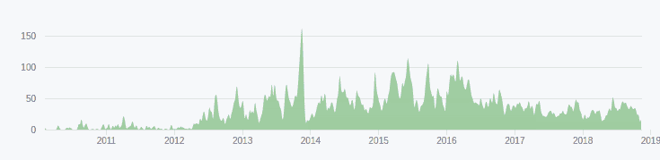

# 第三十章：展望未来

Apache Spark 是一个快速发展的项目。

我们已经看到，Spark Streaming 是建立在弹性分布式数据集（RDDs）及每位程序员都习惯使用的常规 Java、Scala 或 Python 对象之上的较老且相对低级别的 API。Spark Streaming 已经在许多生产级应用中经过了实战验证和部署。我们可以认为它是一个稳定的 API，其中大部分工作主要集中在维护上。

结构化流处理是建立在 Spark 的 Dataset 和 Dataframe API 之上的，充分利用了 Apache Spark 通过 Spark SQL 引入的卓越优化工作，例如 Catalyst 引擎以及来自 Tungsten 项目的代码生成和内存管理。从这个意义上讲，结构化流处理是 Apache Spark 流处理的未来，也是可预见未来主要开发工作的重点。因此，结构化流处理正在提供如连续处理等令人兴奋的新发展。

我们需要提到，结构化流处理是流处理的一个较新的框架，因此较少成熟，特别是在本书的机器学习章节中已经详细阐述。在进行重视机器学习的项目时，牢记这一点非常重要。鉴于当前对机器学习的兴趣，我们预计未来版本的 Spark 将在这一领域带来改进，并支持更多的流模式算法。我们希望为您提供了所有元素，以便对这两个 API 的提供进行准确评估。

还有一个问题我们想要解答：如何在这个领域继续学习和进步。

# 保持关注

Apache Spark 最强大的一面之一始终是它的社区。

作为一个开源项目，Apache Spark 在将个人和公司的贡献整合成为全面而一致的代码库方面非常成功，正如在 图 30-1 中所展示的。

###### 图 30-1\. Spark 贡献时间线

Apache Spark 的 GitHub 页面证明了其稳定的开发步伐，每个发布都有超过 200 名开发人员贡献，并且总贡献者人数超过数千人。

有几个成熟的渠道可以与社区保持联系。

## 在 Stack Overflow 上寻求帮助

[Stack Overflow](http://www.stackoverflow.com)，这个著名的问答社区，是讨论与 Spark 相关问题的非常活跃的地方。建议在提问之前先在这个网站上搜索现有的答案，因为很可能之前的人已经有过相同或类似的疑问。

## 在邮件列表上开始讨论

Apache Spark 社区一直严重依赖于两个邮件列表，核心开发人员和 Apache Spark 的创建者定期致力于帮助用户和其他贡献者。用户邮件列表，user@spark.apache.org，适用于试图找到最佳使用 Spark 方法的读者，而开发者邮件列表，dev@spark.apache.org，则服务于那些正在改进 Spark 框架本身的人。

你可以免费在线了解如何订阅这些邮件列表的最新详细信息，[for free online](https://spark.apache.org/community.html)。

## 参加会议

Spark Summit 是由 Databricks 推广的两年一度的会议周期。除了专注于 Spark 的会议议程之外，这个会议还提供了一个让 Spark 开发者与社区及彼此见面的场所。你可以在 [online](https://databricks.com/sparkaisummit) 找到更多信息。

# 参加 Meetups

如果你住在技术足迹大的城市附近，请考虑参加 [user groups or meetups](http://bit.ly/2wBBXyd)。它们通常是免费的，是早期预览会议演讲或更亲密的演示和 Apache Spark 应用案例的绝佳机会。

## 阅读书籍

我们之前提到过 Matei Zaharia 和 Spark 项目的其他创始人在 2015 年出版的书籍 *Learning Spark* 是建立在理解 Apache Spark 功能的良好起点。一般来说，O'Reilly 出版的关于 Spark 的多篇文献都是我们强烈推荐的。我们只想提一下 Matei Zaharia 和 Bill Chambers 在 2017 年出版的 *Spark: The Definitive Guide*，作为对 Spark 平台最新演进的必读内容。

在更加理论的一面，你可能会发现自己在抽象层面上寻找关于流算法和机器学习更深入的知识，然后再使用 Apache Spark 实现这些概念的更多内容。在这个领域有太多的材料，我们无法详尽推荐，但我们可以提到 Alex Smola 在伯克利进行的 2012 年的 [course on data streams at Berkeley](http://bit.ly/2WiE0Xc) 是一个很好的入门点，附有丰富的参考文献。

# 参与 Apache Spark 项目的贡献

当你想把你的算法探险成果贡献给开源社区时，你会发现 Apache Spark 的开发组织如下：

+   在 [Github](https://github.com/apache/spark)

+   在 [JIRA bug tracker](http://bit.ly/2wwt8Wq)

Spark 的开发工作流程包括用于更大规模开发的设计文档，您将在之前提到的资源中找到它们，这些资源为您提供了一个了解开发过程的绝佳窗口。另一种了解 Apache Spark 开发工作的方法是观看 Holden Karau 的视频，她是 Apache Spark 的开发者和 PMC 成员，直播她的拉取请求审查甚至编码会话。您将在以下地方找到这种独特的“一天中的 Spark 开发者生活”体验：

+   [YouTube](http://bit.ly/2KlkMZK)

+   [Twitch](http://bit.ly/2EQ9WYj)

所有这些资源都应该为您提供工具，不仅可以掌握使用 Apache Spark 进行流处理，还可以为每天使这个系统变得更好的集体努力提供手段。

我们希望您喜欢这本书！
