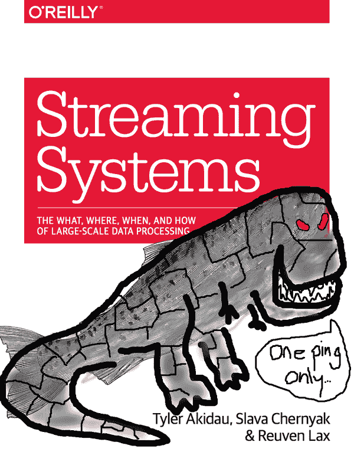

# 前言或：你在这里要做什么？

你好，冒险的读者，欢迎来到我们的书！在这一点上，我假设你要么对学习更多关于流处理的奇迹感兴趣，要么希望花几个小时阅读关于雄伟的棕色鳟鱼的荣耀。无论哪种方式，我都向你致敬！也就是说，属于后一种类型的人，如果你对计算机科学没有高级的理解，那么在继续前，你应该考虑一下你是否准备好面对失望；*警告渔夫*，等等。

为了从一开始就设定这本书的基调，我想提醒你一些事情。首先，这本书有点奇怪，因为我们有多个作者，但我们并不假装我们以某种方式都说和写着相同的声音，就像我们是奇怪的同卵三胞胎，碰巧出生在不同的父母身边。因为尽管听起来很有趣，但最终的结果实际上会更不愉快。相反，我们选择了用自己的声音写作，我们给了这本书足够的自我意识，可以在适当的时候提到我们每个人，但不会让它对我们只是一本书而不是像苏格兰口音的机器恐龙这样更酷的东西感到不满。¹

就声音而言，你会遇到三种：

泰勒

那就是我。如果你没有明确被告知有其他人在讲话，你可以假设是我，因为我们在游戏的后期才添加了其他作者，当我考虑回去更新我已经写过的一切时，我基本上是“不可能的”。我是谷歌数据处理语言和系统²组的技术负责人，负责谷歌云数据流、谷歌的 Apache Beam 工作，以及谷歌内部的数据处理系统，如 Flume、MillWheel 和 MapReduce。我也是 Apache Beam PMC 的创始成员。

###### 图 P-1。本来可以成为封面的封面...

Slava

Slava 是谷歌 MillWheel 团队的长期成员，后来成为 Windmill 团队的原始成员，该团队构建了 MillWheel 的继任者，迄今为止未命名的系统，该系统驱动了谷歌云数据流中的流引擎。Slava 是全球流处理系统中水印和时间语义的最高专家，没有之一。你可能会觉得不奇怪，他是第三章《水印》的作者。

Reuven

Reuven 在这个名单的底部，因为他在流处理方面的经验比 Slava 和我加起来还要丰富，因此如果他被放置得更高，他会压垮我们。Reuven 已经创建或领导了几乎所有谷歌通用流处理引擎中有趣的系统级魔术，包括在系统中应用了大量的细节关注，以提供高吞吐量、低延迟、精确一次的语义，同时利用了细粒度的检查点。你可能会觉得不奇怪，他是第五章《精确一次和副作用》的作者。他还是 Apache Beam PMC 成员。

# 阅读本书

现在你知道你将听到谁的声音，下一个合乎逻辑的步骤将是找出你将听到什么，这就是我想提到的第二件事。这本书在概念上有两个主要部分，每个部分有四章，然后是一个相对独立的章节。

乐趣从第一部分开始，*Beam 模型*（第 1-4 章），重点介绍了最初为谷歌云数据流开发的高级批处理加流处理数据处理模型，后来捐赠给 Apache 软件基金会作为 Apache Beam，并且现在整体或部分地出现在行业中的大多数其他系统中。它由四章组成：

+   第一章《流处理 101》，介绍了流处理的基础知识，建立了一些术语，讨论了流式系统的能力，区分了处理时间和事件时间这两个重要的时间领域，并最终研究了一些常见的数据处理模式。

+   第二章《数据处理的“什么”、“哪里”、“何时”和“如何”》，详细介绍了流处理的核心概念，分析了每个概念在无序数据的情况下的具体运行示例中的上下文，并通过动画图表突出了时间维度。

+   第三章《水印》（由 Slava 撰写），深入调查了时间进度指标的情况，它们是如何创建的，以及它们如何通过管道传播。最后，它通过检查两种真实世界的水印实现的细节来结束。

+   第四章《高级窗口》，延续了第二章的内容，深入探讨了一些高级窗口和触发概念，如处理时间窗口，会话和继续触发器。

在第一部分和第二部分之间，提供了一个及时的插曲，其中包含的细节非常重要，即第五章《精确一次和副作用》（由 Reuven 撰写）。在这一章中，他列举了提供端到端精确一次（或有效一次）处理语义的挑战，并详细介绍了三种不同方法的实现细节：Apache Flink，Apache Spark 和 Google Cloud Dataflow。

接下来是第二部分《流和表》（第 6-9 章），深入探讨了概念，并研究了更低级别的“流和表”处理流程的方式，这是最近由 Apache Kafka 社区的一些杰出成员广泛推广的，当然，几十年前就被数据库社区的人发明了，因为一切都是这样吗？它也由四章组成：

+   第六章《流和表》，介绍了流和表的基本概念，通过流和表的视角分析了经典的 MapReduce 方法，然后构建了一个足够一般的流和表理论，以包括 Beam 模型（以及更多）的全部范围。

+   第七章《持久状态的实际问题》，考虑了流水线中持久状态的动机，研究了两种常见的隐式状态类型，然后分析了一个实际用例（广告归因），以确定一般状态管理机制的必要特征。

+   第八章《流式 SQL》，研究了关系代数和 SQL 中流处理的含义，对比了 Beam 模型和经典 SQL 中存在的固有的流和表偏见，并提出了一套可能的前进路径，以在 SQL 中融入健壮的流处理语义。

+   第九章《流式连接》，调查了各种不同类型的连接，分析了它们在流处理环境中的行为，并最终详细研究了一个有用但支持不足的流式连接用例：时间有效窗口。

最后，结束本书的是第十章《大规模数据处理的演变》，它回顾了 MapReduce 数据处理系统的历史，检查了一些重要的贡献，这些贡献使流式处理系统演变成今天的样子。

## 重点

最后，作为最后的指导，如果你让我描述我最希望读者从本书中学到的东西，我会说：

+   本书中最重要的一点是学习流和表的理论以及它们之间的关系。其他所有内容都是基于这一点展开的。不，我们要到第六章才会讨论这个话题。没关系，值得等待，到那时你会更好地准备好欣赏它的精彩之处。

+   时变关系是一种启示。它们是流处理的具体体现：是流系统构建的一切的具体体现，也是与我们从批处理世界中熟悉的工具的强大连接。我们要到第八章才会学习它们，但是再次强调，前面的学习将帮助你更加欣赏它们。

+   一个写得好的分布式流引擎是一件神奇的事情。这可能适用于分布式系统总体来说，但是当你了解更多关于这些系统是如何构建来提供它们的语义的（特别是第三章和第五章的案例研究），你就会更加明显地意识到它们为你做了多少繁重的工作。

+   LaTeX/Tikz 是一个制作图表的神奇工具，无论是动画还是其他形式。它是一个可怕的、充满尖锐边缘和破伤风的工具，但无论如何也是一个令人难以置信的工具。我希望本书中的动画图表能够为我们讨论的复杂主题带来清晰的解释，从而激励更多的人尝试使用 LaTeX/Tikz（在“图表”中，我们提供了本书动画的完整源代码链接）。

# 本书中使用的约定

本书中使用以下排版约定：

*斜体*

表示新术语、URL、电子邮件地址、文件名和文件扩展名。

`常量宽度`

用于程序清单，以及在段萂中引用程序元素，如变量或函数名称、数据库、数据类型、环境变量、语句和关键字。

**`常量宽度粗体`**

显示用户应直接输入的命令或其他文本。

*`常量宽度斜体`*

显示应由用户提供值或由上下文确定的值替换的文本。

###### 提示

此元素表示提示或建议。

###### 注意

此元素表示一般注释。

###### 警告

此元素表示警告或注意事项。

# 在线资源

有一些相关的在线资源可帮助您享受本书。

## 图表

本书中的所有图表都以数字形式在书的网站上提供。这对于动画图表特别有用，因为书中非 Safari 格式只显示了少量帧（漫画风格）：

+   在线索引：[*http://www.streamingbook.net/figures*](http://www.streamingbook.net/figures)

+   特定的图表可以在以下形式的 URL 中引用：

    *http://www.streamingbook.net/fig/<FIGURE-NUMBER>*

    例如，对于图 2-5：[*http://www.streamingbook.net/fig/2-5*](http://www.streamingbook.net/fig/2-5)

动画图表本身是 LaTeX/Tikz 绘制的，首先渲染为 PDF，然后通过 ImageMagick 转换为动画 GIF。对于你们中的更有冒险精神的人，本书、[“流媒体 101”](http://oreil.ly/1p1AKux)和[“流媒体 102”](http://oreil.ly/1TV7YGU)博客文章以及原始[数据流模型论文](http://bit.ly/2sXgVJ3)的动画的完整源代码和渲染说明都可以在 GitHub 上找到，链接为[*http://github.com/takidau/animations*](http://github.com/takidau/animations)。请注意，这大约有 14,000 行 LaTeX/Tikz 代码，它们是非常有机地生长出来的，没有意图被其他人阅读和使用。换句话说，这是一个混乱、纠缠不清的古老咒语网络；现在就回头吧，或者放弃所有希望吧，因为这里有龙。

## 代码片段

尽管这本书在很大程度上是概念性的，但在整个过程中使用了许多代码和伪代码片段来帮助说明观点。来自第二章和第四章更功能核心 Beam 模型概念的代码，以及第七章更命令式状态和定时器概念的代码，都可以在[*http://github.com/takidau/streamingbook*](http://github.com/takidau/streamingbook)上找到。由于理解语义是主要目标，代码主要以 Beam `PTransform`/`DoFn`实现和相应的单元测试提供。还有一个独立的管道实现，用来说明单元测试和真实管道之间的差异。代码布局如下：

[src/main/java/net/streamingbook/BeamModel.java](https://github.com/takidau/streamingbook/blob/master/src/main/java/net/streamingbook/BeamModel.java)

将 Beam `PTransform`实现从第 2-1 到第 2-9 和第 4-3 的示例，每个示例都有一个额外的方法，在这些章节的示例数据集上执行时返回预期的输出。

[src/test/java/net/streamingbook/BeamModelTest.java](https://github.com/takidau/streamingbook/blob/master/src/test/java/net/streamingbook/BeamModelTest.java)

通过生成的数据集验证*BeamModel.java*中示例`PTransforms`的单元测试与书中的匹配。

[src/main/java/net/streamingbook/Example2_1.java](https://github.com/takidau/streamingbook/blob/master/src/main/java/net/streamingbook/Example2_1.java)

可以在本地运行或使用分布式 Beam 运行程序的 Example 2-1 管道的独立版本。

[src/main/java/net/streamingbook/inputs.csv](https://github.com/takidau/streamingbook/blob/master/src/main/java/net/streamingbook/inputs.csv)

*Example2_1.java*的示例输入文件，其中包含了书中的数据集。

[src/main/java/net/streamingbook/StateAndTimers.java](https://github.com/takidau/streamingbook/blob/master/src/main/java/net/streamingbook/StateAndTimers.java)

使用 Beam 的状态和定时器原语实现的第七章转换归属示例的 Beam 代码。

[src/test/java/net/streamingbook/StateAndTimersTest.java](https://github.com/takidau/streamingbook/blob/master/src/test/java/net/streamingbook/StateAndTimersTest.java)

通过*StateAndTimers.java*验证转换归属`DoFn`的单元测试。

[src/main/java/net/streamingbook/ValidityWindows.java](https://github.com/takidau/streamingbook/blob/master/src/main/java/net/streamingbook/ValidityWindows.java)

时间有效窗口实现。

[src/main/java/net/streamingbook/Utils.java](https://github.com/takidau/streamingbook/blob/master/src/main/java/net/streamingbook/Utils.java)

共享的实用方法。

这本书是为了帮助你完成工作。一般来说，如果本书提供了示例代码，您可以在您的程序和文档中使用它。除非您复制了大部分代码，否则您无需联系我们以获得许可。例如，编写一个使用本书中几个代码片段的程序不需要许可。出售或分发 O’Reilly 图书示例的 CD-ROM 需要许可。通过引用本书回答问题并引用示例代码不需要许可。将本书中大量示例代码合并到产品文档中需要许可。

我们感激，但不需要归属。归属通常包括标题、作者、出版商和 ISBN。例如：“*Streaming Systems* by Tyler Akidau, Slava Chernyak, and Reuven Lax (O’Reilly). Copyright 2018 O’Reilly Media, Inc., 978-1-491-98387-4.”

如果您觉得您对代码示例的使用超出了公平使用范围或上述给出的许可，请随时通过*permissions@oreilly.com*与我们联系。

# O’Reilly Safari

###### 注意

[*Safari*](http://oreilly.com/safari)（原 Safari Books Online）是一个面向企业、政府、教育工作者和个人的会员制培训和参考平台。

会员可以访问来自 250 多家出版商的数千本图书、培训视频、学习路径、交互式教程和精选播放列表，包括 O’Reilly Media、哈佛商业评论、Prentice Hall 专业、Addison-Wesley 专业、微软出版社、Sams、Que、Peachpit 出版社、Adobe、Focal Press、思科出版社、约翰威利与儿子、Syngress、Morgan Kaufmann、IBM Redbooks、Packt、Adobe Press、FT Press、Apress、Manning、New Riders、麦格劳希尔、琼斯与巴特利特等等。

有关更多信息，请访问[*http://www.oreilly.com/safari*](http://www.oreilly.com/safari)。

# 如何联系我们

请将有关本书的评论和问题发送给出版商：

+   O’Reilly Media, Inc.

+   1005 Gravenstein Highway North

+   Sebastopol, CA 95472

+   800-998-9938（在美国或加拿大）

+   707-829-0515（国际或本地）

+   707-829-0104（传真）

我们为这本书创建了一个网页，列出勘误、示例和任何其他信息。您可以访问[*http://bit.ly/streaming-systems*](http://bit.ly/streaming-systems)。

要就本书发表评论或提出技术问题，请发送电子邮件至*bookquestions@oreilly.com*。

有关我们的图书、课程、会议和新闻的更多信息，请访问我们的网站[*http://www.oreilly.com*](http://www.oreilly.com)。

在 Facebook 上找到我们：[*http://facebook.com/oreilly*](http://facebook.com/oreilly)

在 Twitter 上关注我们：[*http://twitter.com/oreillymedia*](http://twitter.com/oreillymedia)

在 YouTube 上观看我们：[*http://www.youtube.com/oreillymedia*](http://www.youtube.com/oreillymedia)

# 致谢

最后，但肯定不是最不重要的：许多人都很棒，我们想在这里特别感谢其中的一部分人，因为他们在创建这本书时提供了帮助。

这本书中的内容汇集了 Google、行业和学术界的无数聪明人的工作。我们要向他们表示真诚的感激之情，并为我们无法在这里列出所有人而感到遗憾，即使我们尝试过，我们也不会这样做。

在 Google 的同事中，DataPLS 团队（以及其各种祖先团队：Flume、MillWheel、MapReduce 等）的每个人多年来都帮助实现了这么多想法，因此我们要非常感谢他们。特别是，我们要感谢：

+   Paul Nordstrom 和黄金时代的 MillWheel 团队的其他成员：Alex Amato、Alex Balikov、Kaya Bekiroğlu、Josh Haberman、Tim Hollingsworth、Ilya Maykov、Sam McVeety、Daniel Mills 和 Sam Whittle，因为他们构想并构建了一套全面、强大和可扩展的低级原语，我们后来能够在此基础上构建本书中讨论的高级模型。如果没有他们的愿景和技能，大规模流处理的世界将会大不相同。

+   Craig Chambers、Frances Perry、Robert Bradshaw、Ashish Raniwala 和昔日 Flume 团队的其他成员，因为他们构想并创建了富有表现力和强大的数据处理基础，后来我们能够将其与流媒体世界统一起来。

+   Sam McVeety 因为他是最初的 MillWheel 论文的主要作者，这让我们了不起的小项目第一次出现在人们的视野中。

+   Grzegorz Czajkowski 多次支持我们的传教工作，即使竞争的最后期限和优先事项也在逼近。

更广泛地看，Apache Beam、Calcite、Kafka、Flink、Spark 和 Storm 社区的每个人都应该得到很多的赞扬。在过去的十年里，这些项目每一个都在推动流处理技术的发展。谢谢。

为了更具体地表达感激之情，我们还要感谢：

+   马丁·克莱普曼，领导倡导流和表思维的努力，并且在这本书的每一章的草稿中提供了大量有见地的技术和编辑意见。所有这些都是在成为一个灵感和全面优秀的人的同时完成的。

+   朱利安·海德，因为他对流 SQL 的深刻远见和对流处理的热情。

+   杰伊·克雷普斯，为了与 Lambda 架构暴政作斗争而不懈努力；正是你最初的[“质疑 Lambda 架构”](https://www.oreilly.com/ideas/questioning-the-lambda-architecture)帖子让泰勒兴奋地加入了这场战斗。

+   斯蒂芬·伊文，科斯塔斯·佐马斯，法比安·休斯克，阿尔约夏·克雷特克，罗伯特·梅茨格，科斯塔斯·克劳达斯，杰米·格里尔，马克斯·米切尔斯和数据工匠的整个家族，过去和现在，总是以一种一贯开放和合作的方式推动流处理的可能性。由于你们所有人，流媒体的世界变得更美好。

+   杰西·安德森，感谢他的认真审查和所有的拥抱。如果你见到杰西，替我给他一个大大的拥抱。

+   丹尼·袁，西德·阿南德，韦斯·雷斯和令人惊叹的 QCon 开发者大会，让我们有机会在行业内公开讨论我们的工作，2014 年在 QCon 旧金山。

+   奥莱利的本·洛里卡和标志性的 Strata 数据大会，一直支持我们的努力，无论是在线、印刷还是亲自传播流处理的理念。

+   整个 Apache Beam 社区，特别是我们的同行，帮助推动 Beam 的愿景：阿赫梅特·阿尔塔伊，阿米特·塞拉，阿维姆·祖尔，本·张伯斯，格里斯尔达·奎瓦斯，查米卡拉·贾亚拉斯，达沃尔·博纳奇，丹·哈尔佩林，艾蒂安·肖肖，弗朗西斯·佩里，伊斯梅尔·梅希亚，杰森·卡斯特，让-巴蒂斯特·奥诺弗雷，杰西·安德森，尤金·基尔皮科夫，乔什·威尔斯，肯尼斯·诺尔斯，卢克·克维克，李静松，曼努·张，梅丽莎·帕什尼亚克，徐明敏，马克斯·米切尔斯，巴勃罗·埃斯特拉达，裴赫，罗伯特·布拉德肖，斯蒂芬·伊文，斯塔斯·莱文，托马斯·格罗，托马斯·韦斯和詹姆斯·徐。

没有致谢部分会完整无缺，没有对那些不知疲倦的审阅者的致谢，他们的深刻评论帮助我们将垃圾变成了精彩：杰西·安德森，格热戈日·查约夫斯基，马里安·德沃尔斯基，斯蒂芬·伊文，拉斐尔·J·费尔南德斯-莫克特苏马，马丁·克莱普曼，肯尼斯·诺尔斯，山姆·麦克维蒂，莫沙·帕苏曼斯基，弗朗西斯·佩里，杰莲娜·皮耶西瓦克-格博维奇，杰夫·舒特和威廉·万贝内普。你们是我们的德洛雷安时光机的弗尼斯先生。这在我脑海中听起来更好——看，这就是我所说的。

当然，还要感谢我们的作者和制作支持团队：

+   玛丽·博戈，我们最初的编辑，为了帮助和支持我们启动这个项目，并对我持续颠覆编辑规范的坚持耐心。我们想念你！

+   杰夫·布莱尔，我们的编辑 2.0，接管了这个庞大的项目，并对我们甚至不能满足最低限度的截止日期的无能耐心。我们成功了！

+   鲍勃·拉塞尔，我们的副本编辑，比任何人都更仔细地阅读了我们的书。我向你致敬，你对语法、标点、词汇和 Adobe Acrobat 批注的精湛掌握。

+   尼克·亚当斯，我们勇敢的制作编辑，帮助将一团混乱的 HTMLBook 代码整理成一本值得印刷的美丽之物，当我要求他手动忽略鲍勃提出的许多建议时，他并没有生气，这些建议是要将我们对“数据”一词的使用从复数改为单数。你让这本书看起来比我希望的还要好，谢谢你。

+   埃伦·特劳特曼-扎格，我们的索引制作人，以某种方式将一堆随意的参考文献编织成一个有用而全面的索引。我对你的细节关注感到敬畏。

+   我们的插图师 Rebecca Panzer，美化我们的静态图表，并向 Nick 保证我不需要再花更多周末来想办法重构我的动画 LaTeX 图表以获得更大的字体。呼～2 次！

+   我们的校对者 Kim Cofer 指出我们的懒散和不一致，这样其他人就不必这样做了。

Tyler 想要感谢：

+   我的合著者 Reuven Lax 和 Slava Chernyak，以他们的想法和章节的方式将它们变得生动起来，这是我无法做到的。

+   George Bradford Emerson II，为肖恩·康纳利的灵感。这是我在书中最喜欢的笑话，而我们甚至还没有到第一章。从这里开始，一切都是下坡路。

+   Rob Schlender，为他即将在机器人接管世界之前给我买的惊人的威士忌。为了以优雅的方式离开！

+   我的叔叔 Randy Bowen，确保我发现了我有多么喜欢计算机，特别是那张自制的 POV-Ray 2.x 软盘，为我打开了一个全新的世界。

+   我的父母 David 和 Marty Dauwalder，没有他们的奉献和难以置信的毅力，这一切都不可能。你们是最好的父母，真的！

+   Dr. David L. Vlasuk，没有他我今天就不会在这里。感谢一切，V 博士。

+   我的美好家庭，Shaina，Romi 和 Ione Akidau，他们在完成这项艰巨的工作中给予了坚定的支持，尽管我们因此分开度过了许多个夜晚和周末。我永远爱你们。

+   我的忠实写作伙伴 Kiyoshi：尽管我们一起写书的整个时间里你只是睡觉和对邮递员吠叫，但你做得无可挑剔，似乎毫不费力。你是你的物种的光荣。

Slava 想要感谢：

+   Josh Haberman，Sam Whittle 和 Daniel Mills 因为是 MillWheel 和随后的 Streaming Dataflow 中水印的共同设计者和共同创造者，以及这些系统的许多其他部分。这样复杂的系统从来不是在真空中设计的，如果不是你们每个人投入的所有思想和辛勤工作，我们今天就不会在这里。

+   data Artisans 的 Stephan Ewen，帮助我塑造了我对 Apache Flink 中水印实现的思想和理解。

Reuven 想要感谢：

+   Paul Nordstrom 因他的远见，Sam Whittle，Sam McVeety，Slava Chernyak，Josh Haberman，Daniel Mills，Kaya Bekiroğlu，Alex Balikov，Tim Hollingsworth，Alex Amato 和 Ilya Maykov 因他们在构建原始 MillWheel 系统和撰写随后的论文中所做的努力。

+   data Artisans 的 Stephan Ewen 在审阅关于一次性语义的章节和对 Apache Flink 内部工作的宝贵反馈中的帮助。

最后，我们都想感谢*你*，光荣的读者，愿意花真钱买这本书来听我们唠叨我们可以构建和玩耍的酷东西。写下这一切是一种快乐，我们已经尽力确保你物有所值。如果出于某种原因你不喜欢它...希望你至少买了印刷版，这样你至少可以在愤怒中把它扔到房间的另一边，然后在二手书店卖掉。小心猫。³

¹ 顺便说一句，这正是我们要求我们的动物书封面的样子，但 O'Reilly 觉得它在线插图中不会很好表现。我尊重地不同意，但一条棕色的鳟鱼是一个公平的妥协。

² 或者 DataPLS，发音为 Datapals——明白了吗？

³ 或者不要。我实际上不喜欢猫。
