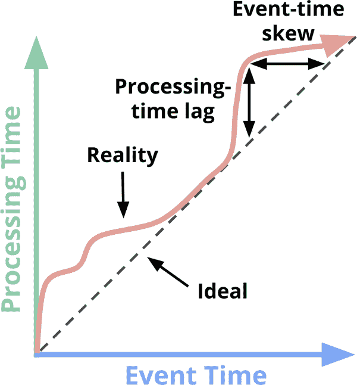
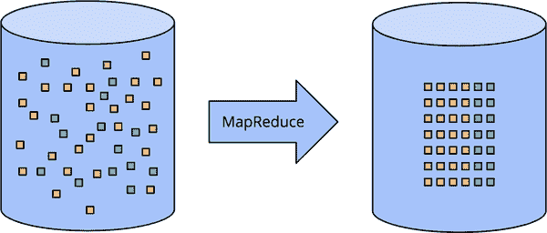
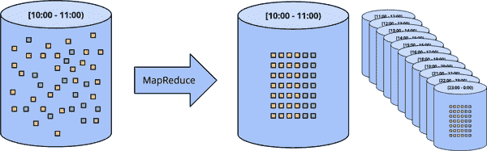
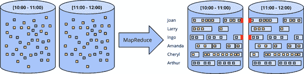
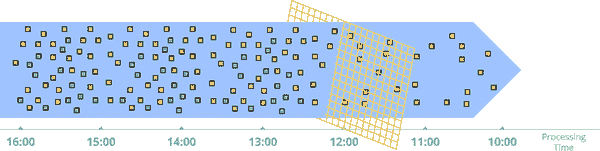
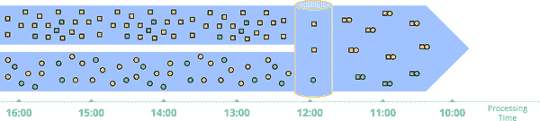
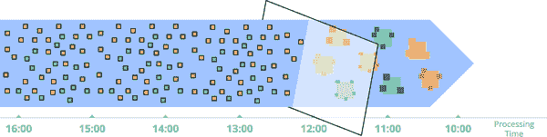
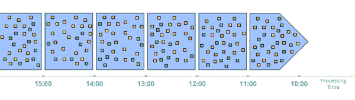
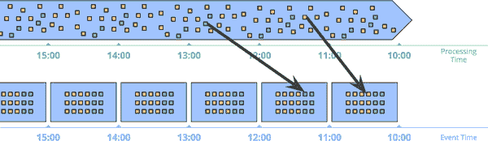
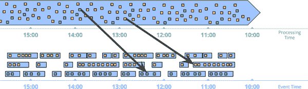

# 第一章：流处理 101

流数据处理在大数据领域是一件大事，而且有很多好的原因；其中包括以下几点：

+   企业渴望对其数据获得更及时的洞察，转向流处理是实现更低延迟的好方法。

+   在现代商业中越来越普遍的大规模、无限的数据集，更容易通过设计用于这种不断增长的数据量的系统来驯服。

+   随着数据到达时进行处理，可以更均匀地分配工作负载，从而产生更一致和可预测的资源消耗。

尽管业务驱动的对流处理的兴趣激增，但与批处理系统相比，流处理系统长期以来仍然相对不够成熟。直到最近，潮水才明确地向另一个方向转变。在我更为自负的时刻，我希望这在某种程度上是由于我最初在我的[“流处理 101”](http://oreil.ly/1p1AKux)和[“流处理 102”](http://oreil.ly/1TV7YGU)博客文章中提出的坚定的激励（这本书的前几章显然是基于这些文章）。但实际上，行业对流处理系统成熟的兴趣很大，有很多聪明而积极的人喜欢构建这些系统。

尽管我认为一般流处理的倡导战已经取得了有效的胜利，但我仍然会基本上原封不动地提出我在“流处理 101”中的原始论点。首先，即使行业的大部分已经开始听从这个呼声，这些论点今天仍然非常适用。其次，还有很多人还没有得到这个消息；这本书是我努力传达这些观点的延续尝试。

首先，我介绍一些重要的背景信息，这将有助于构建我想讨论的其他主题。我在三个具体的部分中做了这件事：

术语

要准确地讨论复杂的主题，需要对术语进行准确的定义。对于一些当前使用中具有多重解释的术语，我将尽量明确我使用它们时的确切含义。

能力

我谈到了人们对流处理系统常常认为存在的缺点。我还提出了我认为数据处理系统构建者需要采取的心态，以满足现代数据消费者的需求。

时间领域

我介绍了数据处理中相关的两个主要时间领域，展示它们的关系，并指出这两个领域所带来的一些困难。

# 术语：什么是流处理？

在继续之前，我想先搞清楚一件事：什么是流处理？今天，流处理这个术语被用来表示各种不同的东西（为了简单起见，我到目前为止一直在使用它有些宽泛），这可能会导致对流处理的真正含义或流处理系统实际能够做什么产生误解。因此，我更愿意对这个术语进行比较精确的定义。

问题的关键在于，许多本应该被描述为“它们是什么”（无限数据处理、近似结果等）的事物，却已经在口头上被描述为它们历史上是如何完成的（即通过流处理执行引擎）。术语的不精确使得流处理的真正含义变得模糊，并且在某些情况下，给流处理系统本身带来了这样的暗示，即它们的能力仅限于历史上被描述为“流处理”的特征，比如近似或推测性结果。

鉴于设计良好的流处理系统在技术上与任何现有的批处理引擎一样能够产生正确、一致、可重复的结果，我更倾向于将术语“流处理”限定为非常具体的含义：

流处理系统

一种设计时考虑到无限数据集的数据处理引擎。¹

如果我想谈论低延迟、近似或推测性结果，我会使用这些具体的词，而不是不准确地称它们为“流处理”。

在讨论可能遇到的不同类型的数据时，精确的术语也是有用的。在我看来，有两个重要（且正交的）维度来定义给定数据集的形状：*基数*和*构成*。

数据集的基数决定了其大小，基数最显著的方面是给定数据集是有限的还是无限的。以下是我喜欢用来描述数据集中粗略基数的两个术语：

有界数据

有限大小的数据集类型。

无界数据

无限大小的数据集类型（至少在理论上是这样）。

基数很重要，因为无限数据集的无界性对消耗它们的数据处理框架施加了额外的负担。在下一节中会详细介绍这一点。

另一方面，数据集的构成决定了其物理表现形式。因此，构成定义了人们可以与所讨论的数据进行交互的方式。我们直到第六章才会深入研究构成，但为了让你对事情有一个简要的了解，有两种主要的构成很重要：

表

在特定时间点上对数据集的整体视图。SQL 系统传统上处理表。

流²

逐个元素地查看数据集随时间的演变。MapReduce 数据处理系统传统上处理流。

我们在第 6、8 和 9 章深入探讨了流和表之间的关系，在第八章中，我们还了解了将它们联系在一起的统一基本概念*时变关系*。但在那之前，我们主要处理流，因为这是大多数数据处理系统（批处理和流处理）中开发人员直接交互的内容。它也是最自然地体现了流处理所特有的挑战的内容。

## 对流处理的夸大限制

在这一点上，让我们接下来谈一谈流处理系统能做什么和不能做什么，重点是能做什么。我在本章最想传达的一件重要的事情是，一个设计良好的流处理系统有多么强大。流处理系统历来被局限在为提供低延迟、不准确或推测性结果的一些小众市场上，通常与更有能力的批处理系统一起提供最终正确的结果；换句话说，[Lambda 架构](http://nathanmarz.com/blog/how-to-beat-the-cap-theorem.html)。

对于那些对 Lambda 架构不太熟悉的人，基本思想是你同时运行一个流处理系统和一个批处理系统，两者基本上执行相同的计算。流处理系统提供低延迟、不准确的结果（要么是因为使用了近似算法，要么是因为流处理系统本身没有提供正确性），然后一段时间后，批处理系统提供正确的输出。最初由 Twitter 的 Nathan Marz（[Storm](http://storm.apache.org)的创建者）提出，它最终非常成功，因为事实上这是一个很棒的想法；流处理引擎在正确性方面有点令人失望，而批处理引擎像你期望的那样本质上难以处理，所以 Lambda 让你可以同时拥有你的谚语蛋糕并吃掉它。不幸的是，维护 Lambda 系统很麻烦：你需要构建、提供和维护两个独立版本的管道，然后还要以某种方式合并两个管道的结果。

作为一个花了多年时间在一个强一致性的流式引擎上工作的人，我也觉得 Lambda 架构的整个原则有点不可取。毫不奇怪，当 Jay Kreps 的“质疑 Lambda 架构”一文出来时，我是一个巨大的粉丝。这是对双模式执行的必要性的一个最早的高度可见的声明。令人愉快。Kreps 在使用可重放系统（如 Kafka）作为流式互连的情况下，解决了可重复性的问题，并且甚至提出了 Kappa 架构，基本上意味着使用一个为手头的工作量量身定制的系统来运行一个单一的流水线。我并不确定这个概念需要自己的希腊字母名称，但我完全支持这个原则。

坦率地说，我会更进一步。我会认为，设计良好的流式系统实际上提供了批处理功能的严格超集。除了效率差异之外，今天的批处理系统应该没有存在的必要。对于[Apache Flink](http://flink.apache.org)的人来说，他们将这个想法内化并构建了一个在底层始终是全流式的系统，即使在“批处理”模式下也是如此；我喜欢这一点。

所有这一切的推论是，流式系统的广泛成熟，加上对无界数据处理的健壮框架，最终将允许 Lambda 架构被归类到大数据历史的古董中。我相信现在是时候让这成为现实了。因为要做到这一点，也就是说，要在批处理的游戏中击败批处理，你真的只需要两件事：

正确性

这让你与批处理保持一致。在核心上，正确性归结为一致的存储。流式系统需要一种方法来随着时间对持久状态进行检查点（Kreps 在他的“为什么本地状态是流处理中的基本原语”一文中谈到了这一点），并且必须设计得足够好，以便在机器故障的情况下保持一致。几年前，当 Spark Streaming 首次出现在公共大数据领域时，它是一个一致性的信标，而其他流式系统则是黑暗的。幸运的是，事情自那时以来已经有了显著改善，但令人惊讶的是，仍然有很多流式系统试图在没有强一致性的情况下运行。

再重申一遍——因为这一点很重要：强一致性对于精确一次处理是必需的，这对于正确性是必需的，而这又是任何系统的要求，这个系统要有机会满足或超过批处理系统的能力。除非你真的不在乎你的结果，我恳求你抵制任何不提供强一致状态的流式系统。批处理系统不要求你提前验证它们是否能够产生正确的答案；不要浪费时间在那些无法达到同样标准的流式系统上。

如果你想了解如何在流式系统中获得强一致性，我建议你查看[MillWheel](http://bit.ly/2Muob70)、[Spark Streaming](http://bit.ly/2Mrq8Be)和[Flink snapshotting](http://bit.ly/2t4DGK0)的论文。这三篇论文都花了大量时间讨论一致性。Reuven 将在第五章深入探讨一致性保证，如果你仍然渴望更多，文献和其他地方都有大量关于这个主题的高质量信息。

关于时间推理的工具

这使您超越了批处理。对于处理无界、无序数据的良好工具对于处理具有不同事件时间偏差的现代数据集至关重要。越来越多的现代数据集表现出这些特征，现有的批处理系统（以及许多流处理系统）缺乏应对它们带来的困难的必要工具（尽管我写这篇文章时情况正在迅速改变）。我们将在本书的大部分内容中解释和关注这一点的各个方面。

首先，我们要对时间域的重要概念有基本的理解，然后深入研究我所说的无界、无序数据的不同事件时间偏差。然后，我们将在本章的其余部分中，使用批处理和流处理系统，看一下有界和无界数据处理的常见方法。

## 事件时间与处理时间

要明晰地讨论无界数据处理，需要对涉及的时间域有清晰的理解。在任何数据处理系统中，通常有两个我们关心的时间域：

事件时间

这是事件实际发生的时间。

处理时间

这是在系统中观察事件的时间。

并非所有的用例都关心事件时间（如果你的用例不关心，太好了！你的生活会更轻松），但许多用例确实关心。例如，对用户行为进行时间特征化、大多数计费应用程序以及许多类型的异常检测等。

在理想的世界中，事件时间和处理时间总是相等的，事件发生时立即进行处理。然而，现实并不那么友好，事件时间和处理时间之间的偏差不仅不为零，而且通常是底层输入源、执行引擎和硬件特征的高度可变函数。影响偏差水平的因素包括以下内容：

+   共享资源限制，如网络拥塞、网络分区或非专用环境中的共享 CPU

+   软件原因，如分布式系统逻辑、争用等

+   数据本身的特征，如键分布、吞吐量的方差或无序性的方差（即，整个飞机上的人们在整个飞行中离线使用手机后将其从飞行模式中取出）

因此，如果在任何现实世界的系统中绘制事件时间和处理时间的进展，通常会得到类似图 1-1 中红线的结果。

###### 图 1-1. 时间域映射。x 轴表示系统中事件时间的完整性；即，事件时间 X 之前的所有数据已被观察到。y 轴⁴表示处理时间的进展；即，数据处理系统执行时所观察到的正常时钟时间。

在图 1-1 中，具有斜率为 1 的黑色虚线代表理想状态，其中处理时间和事件时间完全相等；红线代表现实情况。在这个例子中，系统在处理时间开始时稍微滞后，向理想状态靠近，然后在结束时再次稍微滞后。乍一看，这个图表中有两种不同时间域中的偏差：

处理时间

理想状态和红线之间的垂直距离是处理时间域中的滞后。这个距离告诉您在事件发生时和它们被处理时之间观察到的延迟（在处理时间上）。这可能是两种偏差中更自然和直观的一种。

事件时间

理想状态和红线之间的水平距离是管道中事件时间偏差的量。它告诉您管道当前在事件时间上距离理想状态有多远。

实际上，在任何给定时间点上，处理时间滞后和事件时间偏差是相同的；它们只是观察同一事物的两种方式。关于滞后/偏差的重要要点是：因为事件时间和处理时间之间的整体映射不是静态的（即，滞后/偏差可以随时间任意变化），这意味着如果你关心它们的事件时间（即事件实际发生的时间），你不能仅仅在管道观察它们时分析你的数据。不幸的是，这是历史上许多为无限数据设计的系统的运行方式。为了应对无限数据集的特性，这些系统通常提供了一些关于窗口化传入数据的概念。我们稍后会深入讨论窗口化，但它基本上意味着沿着时间边界将数据集切分成有限的部分。如果你关心正确性并且有兴趣在它们的事件时间上分析你的数据，你不能使用处理时间来定义这些时间边界（即处理时间窗口化），因为许多系统这样做；由于处理时间和事件时间之间没有一致的关联，你的一些事件时间数据将会出现在错误的处理时间窗口中（由于分布式系统的固有滞后，许多类型的输入源的在线/离线性质等），这将使正确性不复存在。我们将在接下来的几个部分以及本书的其余部分中更详细地讨论这个问题。

不幸的是，按事件时间进行窗口化也并非一帆风顺。在无界数据的情况下，混乱和可变的偏差为事件时间窗口带来了完整性问题：缺乏处理时间和事件时间之间的可预测映射，你如何确定你何时观察到了给定事件时间*X*的所有数据？对于许多真实世界的数据源来说，你根本无法确定。但是今天大多数使用的数据处理系统都依赖于某种完整性的概念，这使它们在应用于无界数据集时处于严重劣势。

我建议，我们不应该试图将无限的数据整理成最终变得完整的有限批次的信息，而是应该设计一些工具，让我们能够生活在这些复杂数据集所施加的不确定性世界中。新数据会到达，旧数据可能会被撤回或更新，我们构建的任何系统都应该能够自行应对这些事实，完整性的概念应该是特定和适当用例的便利优化，而不是所有用例的语义必要性。

在深入讨论这种方法可能是什么样子之前，让我们先完成一个有用的背景知识：常见的数据处理模式。

# 数据处理模式

在这一点上，我们已经建立了足够的背景知识，可以开始看一下今天有界和无界数据处理中常见的核心使用模式。我们将在两种处理类型和相关的情况下看一下我们关心的两种主要引擎（批处理和流处理，在这个上下文中，我基本上将微批处理与流处理归为一类，因为在这个层面上两者之间的差异并不是非常重要）。

## 有界数据

处理有界数据在概念上非常简单，可能对每个人都很熟悉。在图 1-2 中，我们从左侧开始，有一个充满熵的数据集。我们将其通过一些数据处理引擎（通常是批处理，尽管一个设计良好的流处理引擎也可以很好地工作），比如[MapReduce](http://bit.ly/2sZNfuA)，最终在右侧得到一个具有更大内在价值的新结构化数据集。

###### 图 1-2。使用经典批处理引擎处理有界数据。左侧的有限的非结构化数据通过数据处理引擎，生成右侧对应的结构化数据。

虽然在这种方案中实际上可以计算出无限多种变化，但总体模型非常简单。更有趣的是处理无界数据集的任务。现在让我们来看看通常处理无界数据的各种方式，从传统批处理引擎使用的方法开始，然后再看看您可以使用设计用于无界数据的系统（如大多数流式或微批处理引擎）采取的方法。

## 无界数据：批处理

尽管批处理引擎并非专门为无界数据设计，但自批处理系统首次构思以来，就一直被用于处理无界数据集。正如您所期望的那样，这些方法围绕将无界数据切分为适合批处理的有界数据集的集合。

### 固定窗口

使用批处理引擎的重复运行来处理无界数据集的最常见方式是将输入数据分割成固定大小的窗口，然后将每个窗口作为单独的有界数据源进行处理（有时也称为*滚动窗口*），如图 1-3 所示。特别是对于像日志这样的输入源，事件可以被写入目录和文件层次结构，其名称编码了它们对应的窗口，这种方法乍看起来似乎非常简单，因为您已经在适当的事件时间窗口中进行了基于时间的洗牌以提前获取数据。

然而，实际上，大多数系统仍然存在完整性问题需要解决（如果您的一些事件由于网络分区而延迟到达日志，该怎么办？如果您的事件是全球收集的，并且必须在处理之前转移到一个共同的位置，该怎么办？如果您的事件来自移动设备？），这意味着可能需要某种形式的缓解（例如，延迟处理直到确保所有事件都已收集，或者在数据迟到时重新处理给定窗口的整个批次）。

###### 图 1-3。通过经典批处理引擎将无界数据处理成临时固定窗口。无界数据集首先被收集到有限的、固定大小的有界数据窗口中，然后通过经典批处理引擎的连续运行进行处理。

### 会话

当尝试使用批处理引擎处理无界数据以实现更复杂的窗口策略（如会话）时，这种方法会变得更加复杂。会话通常被定义为活动期间（例如特定用户的活动）之后的不活动间隔。当使用典型的批处理引擎计算会话时，通常会出现会话跨批次分割的情况，如图 1-4 中的红色标记所示。我们可以通过增加批处理大小来减少分割的次数，但这会增加延迟。另一种选择是添加额外的逻辑来从之前的运行中拼接会话，但这会增加复杂性。

###### 图 1-4。通过经典批处理引擎将无界数据处理成会话，使用临时固定窗口。无界数据集首先被收集到有限的、固定大小的有界数据窗口中，然后通过经典批处理引擎的连续运行将其细分为动态会话窗口。

无论如何，使用经典批处理引擎计算会话都不是理想的方式。更好的方式是以流式方式构建会话，我们稍后会详细介绍。

## 无界数据：流式

与大多数基于批处理的无界数据处理方法的临时性相反，流处理系统是为无界数据而构建的。正如我们之前讨论的，对于许多真实世界的分布式输入源，你不仅需要处理无界数据，还需要处理以下类型的数据：

+   与事件时间相关的无序性很高，这意味着如果你想在发生事件的上下文中分析数据，你的管道中需要一些基于时间的洗牌。

+   事件时间偏移不同，这意味着你不能假设你总是会在某个常数时间*Y*内看到给定事件时间*X*的大部分数据。

处理具有这些特征的数据时，你可以采取几种方法。我通常将这些方法归为四类：时间不敏感、近似、按处理时间窗口分组、按事件时间窗口分组。

现在让我们花一点时间来看看这些方法。

### 时间不敏感

时间不敏感的处理用于时间基本无关的情况；也就是说，所有相关逻辑都是数据驱动的。因为这类用例的一切都由更多数据的到达来决定，所以流处理引擎实际上没有什么特别之处需要支持，除了基本的数据传递。因此，实际上所有现有的流处理系统都可以直接支持时间不敏感的用例（当然，如果你关心正确性，系统之间的一致性保证可能会有所不同）。批处理系统也非常适合对无界数据源进行时间不敏感的处理，只需将无界数据源切割成一系列有界数据集并独立处理这些数据集。本节中我们将看一些具体的例子，但考虑到处理时间不敏感的简单性（至少从时间的角度来看），我们不会在此之外花费太多时间。

#### 过滤

时间不敏感处理的一个非常基本的形式是过滤，一个例子如图 1-5 所示。想象一下，你正在处理网站流量日志，并且想要过滤掉所有不是来自特定域的流量。当每条记录到达时，你会查看它是否属于感兴趣的域，并丢弃不属于的记录。因为这种处理方式只依赖于任何时间的单个元素，数据源是无界的、无序的，并且事件时间偏移不同是无关紧要的。

###### 图 1-5。过滤无界数据。各种类型的数据（从左到右流动）被过滤成包含单一类型的同质集合。

#### 内连接

另一个时间不敏感的例子是内连接，如图 1-6 所示。当连接两个无界数据源时，如果你只关心当来自两个源的元素到达时连接的结果，那么逻辑上就没有时间元素。在看到一个源的值后，你可以简单地将其缓存到持久状态中；只有在另一个源的第二个值到达后，你才需要发出连接的记录。（事实上，你可能希望对未发出的部分连接进行某种垃圾回收策略，这可能是基于时间的。但对于几乎没有未完成连接的用例来说，这可能不是一个问题。）

###### 图 1-6。在无界数据上执行内连接。当观察到来自两个源的匹配元素时，连接就会产生。

将语义切换到某种外连接会引入我们之前讨论过的数据完整性问题：在看到连接的一侧之后，你怎么知道另一侧是否会到达或不会到达？说实话，你不知道，所以你需要引入某种超时的概念，这就引入了时间的元素。这个时间元素本质上是一种窗口，我们稍后会更仔细地看一下。

### 近似算法

第二大类方法是近似算法，比如[近似 Top-N](http://bit.ly/2JLcOG9)，[流式 k 均值](http://bit.ly/2JLQE6O)等。它们接受无限的输入源，并提供输出数据，如果你仔细看，它们看起来或多或少像你希望得到的结果，如图 1-7 所示。近似算法的优势在于，它们设计上开销低，适用于无限数据。缺点是它们的种类有限，算法本身通常很复杂（这使得很难想出新的算法），而且它们的近似性质限制了它们的实用性。

###### 图 1-7。在无限数据上计算近似值。数据经过复杂算法处理，产生的输出数据看起来或多或少像另一侧期望的结果。

值得注意的是，这些算法通常在设计上都有一定的时间元素（例如，一些内置的衰减）。由于它们处理元素的方式是按照到达的顺序进行的，所以时间元素通常是基于处理时间的。这对于那些在近似中提供一定的可证明误差界限的算法尤为重要。如果这些误差界限是基于数据按顺序到达的，那么当你向算法提供无序数据和不同的事件时间偏移时，它们基本上就毫无意义了。这是需要记住的一点。

近似算法本身是一个迷人的课题，但由于它们本质上是时间不可知的处理的另一个例子（除了算法本身的时间特征），它们非常容易使用，因此在我们目前的重点下，不值得进一步关注。

### 窗口

处理无限数据的剩下两种方法都是窗口的变体。在深入讨论它们之间的区别之前，我应该明确窗口的确切含义，因为我们在上一节中只是简单提到了它。窗口简单地意味着将数据源（无论是无限的还是有限的）沿着时间边界切割成有限的块进行处理。图 1-8 显示了三种不同的窗口模式。

###### 图 1-8。窗口策略。每个示例都显示了三个不同的键，突出了对齐窗口（适用于所有数据）和不对齐窗口（适用于数据子集）之间的差异。

让我们更仔细地看看每种策略：

固定窗口（又称滚动窗口）

我们之前讨论过固定窗口。固定窗口将时间划分为具有固定时间长度的段。通常（如图 1-9 所示），固定窗口的段均匀应用于整个数据集，这是*对齐*窗口的一个例子。在某些情况下，希望为数据的不同子集（例如，按键）相位移窗口，以更均匀地分散窗口完成负载，这反而是*不对齐*窗口的一个例子，因为它们在数据上变化。⁶

滑动窗口（又称跳跃窗口）

滑动窗口是固定长度和固定周期定义的。如果周期小于长度，窗口会重叠。如果周期等于长度，你就有了固定窗口。如果周期大于长度，你就有了一种奇怪的采样窗口，它只在时间上查看数据的子集。与固定窗口一样，滑动窗口通常是对齐的，尽管在某些用例中，它们可以是不对齐的性能优化。请注意，图 1-8 中的滑动窗口是按照它们的方式绘制的，以给出滑动运动的感觉；实际上，所有五个窗口都会应用于整个数据集。

会话

动态窗口的一个例子，会话由一系列事件组成，这些事件以大于某个超时的不活动间隙结束。会话通常用于分析用户随时间的行为，通过将一系列时间相关的事件（例如，一系列视频在一次观看中观看）分组在一起。会话很有趣，因为它们的长度不能事先定义；它们取决于实际涉及的数据。它们也是不对齐窗口的典型例子，因为会话在不同数据子集中几乎从不相同（例如，不同用户）。

我们之前讨论过的两个时间领域（处理时间和事件时间）基本上是我们关心的两个领域。分窗在这两个领域都是有意义的，所以让我们详细看看每个领域，并看看它们有何不同。因为按处理时间分窗在历史上更常见，我们将从那里开始。

#### 按处理时间分窗

按处理时间分窗时，系统基本上会将传入的数据缓冲到窗口中，直到经过一定的处理时间。例如，在五分钟的固定窗口的情况下，系统会缓冲五分钟的处理时间的数据，之后将把在这五分钟内观察到的所有数据视为一个窗口，并将它们发送到下游进行处理。

###### 图 1-9。按处理时间分窗到固定窗口。数据根据它们在管道中到达的顺序被收集到窗口中。

按处理时间分窗有一些不错的特性：

+   这很简单。实现非常简单，因为你永远不用担心在时间内对数据进行洗牌。当窗口关闭时，你只需按照它们到达的顺序缓冲数据并将它们发送到下游。

+   判断窗口的完整性是直截了当的。因为系统完全知道窗口的所有输入是否都已被看到，它可以对是否给定窗口完整做出完美的决定。这意味着在按处理时间分窗时，无需以任何方式处理“延迟”数据。

+   如果您想推断关于源*在观察到的*时刻的信息，按处理时间分窗正是您想要的。许多监控场景属于这一类。想象一下跟踪发送到全球规模网络服务的每秒请求的数量。计算这些请求的速率以便检测故障是按处理时间分窗的完美用途。

好处是一回事，但按处理时间分窗有一个非常大的缺点：*如果所讨论的数据与事件时间相关联，那么如果处理时间窗口要反映这些事件实际发生的时间，这些数据必须按事件时间顺序到达。*不幸的是，在许多真实世界的分布式输入源中，按事件时间排序的数据并不常见。

举个简单的例子，想象一下任何收集使用统计信息以供以后处理的移动应用程序。对于给定移动设备在任何时间段内离线的情况（短暂的连接丢失，飞越国家时的飞行模式等），在该期间记录的数据直到设备再次联机才会上传。这意味着数据可能会出现几分钟、几小时、几天、几周甚至更长的事件时间偏移。当按处理时间分窗时，基本上不可能从这样的数据集中得出任何有用的推断。

例如，许多分布式输入源在整个系统健康时可能*看起来*提供了按事件时间排序（或非常接近）的数据。不幸的是，当输入源在健康状态下事件时间偏移较低时，并不意味着它会一直保持在这种状态。考虑一个全球服务，处理在多个大陆上收集的数据。如果跨大陆线路上的网络问题（可悲的是，这种情况出奇地常见）进一步降低带宽和/或增加延迟，突然之间，部分输入数据的偏移可能比以前大得多。如果您按处理时间对这些数据进行窗口处理，那么您的窗口将不再代表实际发生在其中的数据；相反，它们代表事件到达处理管道时的时间窗口，这是一些旧数据和当前数据的任意混合。

在这两种情况下，我们真正想要的是根据事件时间对数据进行窗口处理，以便能够抵御事件到达顺序的影响。我们真正想要的是事件时间窗口。

#### 按事件时间窗口化

当您需要以反映事件实际发生时间的有限块观察数据源时，事件时间窗口是您使用的窗口处理方式。这是窗口处理的黄金标准。在 2016 年之前，大多数使用的数据处理系统都缺乏对其的本地支持（尽管具有良好一致性模型的任何系统，如 Hadoop 或 Spark Streaming 1.x，都可以作为构建此类窗口处理系统的合理基础）。我很高兴地说，今天的世界看起来非常不同，从 Flink 到 Spark 再到 Storm 和 Apex，多个系统都原生支持某种形式的事件时间窗口处理。

图 1-10 显示了将无界数据源窗口化为一小时固定窗口的示例。

###### 图 1-10。按事件时间窗口化为固定窗口。数据根据发生时间被收集到窗口中。黑色箭头指出了到达处理时间窗口的示例数据，这些数据与它们所属的事件时间窗口不同。

图 1-10 中的黑色箭头指出了两个特别有趣的数据片段。每个片段都到达了与其所属的事件时间窗口不匹配的处理时间窗口。因此，如果这些数据被按处理时间窗口化，用于关注事件时间的用例的计算结果将是不正确的。正如您所期望的那样，事件时间的正确性是使用事件时间窗口的一个好处。

事件时间窗口在无界数据源上的另一个好处是，您可以创建动态大小的窗口，例如会话，而无需在固定窗口上生成会话时观察到的任意拆分（如我们在“无界数据：流式处理”中看到的会话示例中所示），如图 1-11 所示。

###### 图 1-11。按事件时间窗口化为会话窗口。数据被收集到会话窗口中，根据相应事件发生的时间捕获活动突发。黑色箭头再次指出了必要的时间重排，以将数据放置在它们正确的事件时间位置。

当然，强大的语义很少是免费的，事件时间窗口也不例外。事件时间窗口由于窗口通常必须比窗口本身的实际长度（在处理时间上）存在更长的时间，因此具有两个显着的缺点：

缓冲

由于延长的窗口生命周期，需要更多的数据缓冲。幸运的是，持久存储通常是大多数数据处理系统所依赖的资源类型中最便宜的（其他资源主要是 CPU、网络带宽和 RAM）。因此，这个问题通常比你想象的要少得多，当使用任何设计良好的数据处理系统与强一致的持久状态和一个良好的内存缓存层时。此外，许多有用的聚合不需要整个输入集被缓冲（例如，求和或平均值），而是可以以增量方式执行，将一个更小的中间聚合存储在持久状态中。

完整性

鉴于我们经常没有好的方法来知道我们是否已经看到了给定窗口的所有数据，那么我们如何知道窗口的结果何时准备好实现？事实上，我们根本不知道。对于许多类型的输入，系统可以通过类似于 MillWheel、Cloud Dataflow 和 Flink 中的水印这样的东西给出一个相当准确的启发式估计窗口完成的时间（我们将在第三章和第四章中更多地讨论）。但对于绝对正确性至关重要的情况（再次思考计费），唯一的选择是为流水线构建者提供一种表达他们希望何时实现窗口结果以及如何随时间改进这些结果的方式。处理窗口的完整性（或缺乏完整性）是一个迷人的话题，但也许最好在具体例子的背景下进行探讨，这是我们接下来要看的内容。

# 总结

哇！这是大量的信息。如果你已经走到这一步，你应该受到表扬！但我们只是刚刚开始。在继续深入研究 Beam 模型方法之前，让我们简要地回顾一下我们到目前为止学到的东西。在本章中，我们已经做了以下工作：

+   澄清了术语，将“流处理”的定义重点放在了指建立在无界数据基础上的系统上，同时使用更具描述性的术语来区分通常被归类为“流处理”的不同概念，例如近似/推测性结果。此外，我们还强调了大规模数据集的两个重要维度：基数（有界与无界）和编码（表与流），后者将占据本书下半部分的大部分内容。

+   评估了设计良好的批处理和流处理系统的相对能力，假设流处理实际上是批处理的严格超集，并且像 Lambda 架构这样的概念，这些概念是基于流处理比批处理差的，注定会在流处理系统成熟时被淘汰。

+   提出了流式系统赶上并最终超越批处理所需的两个高级概念，分别是正确性和关于时间推理的工具。

+   确定了事件时间和处理时间之间的重要差异，描述了这些差异在分析数据时所带来的困难，并提出了一种从完整性概念转向简单地适应数据随时间变化的方法。

+   审视了今天常见的有界和无界数据的主要数据处理方法，通过批处理和流处理引擎，粗略地将无界方法分类为：时间不可知、近似、按处理时间分窗和按事件时间分窗。

接下来，我们将深入了解 Beam 模型的细节，概念上看看我们如何在四个相关的轴上分解了数据处理的概念：什么、在哪里、何时和如何。我们还将详细研究在多种场景下处理一个简单的具体示例数据集，突出了 Beam 模型所支持的多种用例，同时提供一些具体的 API 来使我们更接地气。这些示例将有助于加深本章介绍的事件时间和处理时间的概念，同时还将探索水印等新概念。

¹ 为了完整起见，也许值得指出，这个定义包括真正的流式处理以及微批量实现。对于那些不熟悉微批量系统的人来说，它们是使用重复执行批处理引擎来处理无界数据的流式系统。Spark Streaming 是行业中的典型例子。

² 熟悉我原始文章的读者可能会记得，我曾强烈鼓励放弃在引用数据集时使用术语“流”。这从未流行起来，我最初认为是因为它的朗朗上口和广泛的使用。然而，回想起来，我认为我错了。实际上，在区分两种不同类型的数据集构成：表和流方面有很大的价值。事实上，本书的大部分后半部分都致力于理解这两者之间的关系。

³ 如果你不熟悉我所说的“仅一次”，它指的是某些数据处理框架提供的特定类型的一致性保证。一致性保证通常分为三个主要类别：最多一次处理、至少一次处理和仅一次处理。请注意，这里使用的名称是指在管道生成的输出中观察到的有效语义，而不是管道可能处理（或尝试处理）任何给定记录的实际次数。因此，有时会使用“有效一次”这个术语来代替“仅一次”，因为它更能代表事物的基本性质。Reuven 在第五章中更详细地介绍了这些概念。

⁴ 自从《流式处理 101》最初出版以来，许多人指出对我来说，在 x 轴上放置处理时间，y 轴上放置事件时间可能更直观。我同意，交换这两个轴最初会感觉更自然，因为事件时间似乎是处理时间的因变量。然而，由于这两个变量都是单调的并且密切相关，它们实际上是相互依存的变量。所以我认为从技术角度来看，你只需要选择一个轴并坚持下去。数学很令人困惑（特别是在北美以外的地方，它突然变成复数并且对你进行围攻）。

⁵ 这个结果实际上不应该令人惊讶（但对我来说是），因为我们实际上是在测量两种偏差/滞后时创建了一个直角三角形。数学很酷。

⁶ 我们将在第二章详细讨论对齐的固定窗口，以及在第四章讨论未对齐的固定窗口。

⁷ 如果你在学术文献或基于 SQL 的流处理系统中仔细研究，你还会遇到第三种窗口时间域：基于元组的窗口（即，其大小以元素数量计算的窗口）。然而，基于元组的窗口实质上是一种处理时间窗口，其中元素在到达系统时被分配单调递增的时间戳。因此，我们不会进一步详细讨论基于元组的窗口。
