# 第二章：数据处理的*什么*、*哪里*、*何时*和*如何*

好了，派对的人们，是时候变得具体了！

第一章主要关注三个主要领域：*术语*，准确定义我在使用“流式处理”等术语时的含义；*批处理与流处理*，比较两种类型系统的理论能力，并假设将流处理系统提升到与批处理系统相同水平只需要两样东西：正确性和关于时间推理的工具；以及*数据处理模式*，研究在处理有界和无界数据时批处理和流处理系统采取的概念方法。

在本章中，我们现在将进一步关注第一章中的数据处理模式，但会更详细地结合具体示例进行讨论。到最后，我们将涵盖我认为是鲁棒的乱序数据处理所需的核心原则和概念；这些是真正让你超越经典批处理的关于时间推理的工具。

为了让你对实际情况有所了解，我使用了[Apache Beam](https://beam.apache.org/)代码片段，结合时间流逝图表¹，以提供概念的可视化表示。Apache Beam 是用于批处理和流处理的统一编程模型和可移植性层，具有各种语言的具体 SDK（例如 Java 和 Python）。使用 Apache Beam 编写的管道可以在任何受支持的执行引擎上进行可移植运行（例如 Apache Apex，Apache Flink，Apache Spark，Cloud Dataflow 等）。

我在这里使用 Apache Beam 作为示例，不是因为这是一本 Beam 的书（不是），而是因为它最完全地体现了本书中描述的概念。回顾[“流式处理 102”](http://oreil.ly/1TV7YGU)最初写作时（当时它仍然是来自 Google Cloud Dataflow 的 Dataflow 模型，而不是来自 Apache Beam 的 Beam 模型），它实际上是唯一存在的系统，提供了所有我们将在这里涵盖的示例所需的表达能力。一年半后，我很高兴地说，很多事情已经改变，大多数主要系统都已经或正在朝着支持与本书描述的模型非常相似的模型迈进。因此，请放心，我们在这里涵盖的概念，虽然是通过 Beam 的视角得出的，但同样适用于你将遇到的大多数其他系统。

# 路线图

为了帮助铺设本章的基础，我想先阐明将支撑其中所有讨论的五个主要概念，而且，对于第一部分的大部分内容来说，这些概念也是至关重要的。我们已经涵盖了其中的两个。

在第一章中，我首先建立了事件时间（事件发生的时间）和处理时间（在处理过程中观察到的时间）之间的关键区别。这为本书提出的一个主要论点奠定了基础：如果你关心正确性和事件实际发生的上下文，你必须分析数据相对于它们固有的事件时间，而不是它们在分析过程中遇到的处理时间。

然后我介绍了*窗口化*的概念（即，沿着时间边界对数据集进行分区），这是一种常用的方法，用来应对无界数据源在技术上可能永远不会结束的事实。一些更简单的窗口化策略示例是*固定*和*滑动*窗口，但更复杂的窗口化类型，比如*会话*（其中窗口由数据本身的特征定义；例如，捕获用户活动的会话，然后是一段不活动的间隙）也被广泛使用。

除了这两个概念之外，我们现在要仔细研究另外三个：

触发器

触发器是一种声明窗口输出何时相对于某些外部信号实现的机制。触发器在选择何时发出输出方面提供了灵活性。在某种意义上，你可以将它们看作是用于指示何时实现结果的流控制机制。另一种看法是，触发器就像相机的快门释放，允许你声明何时在计算的结果中拍摄时间快照。

触发器还使得可以观察窗口输出随着时间的演变而多次发生。这反过来打开了随着时间推移改进结果的大门，这允许在数据到达时提供推测结果，以及处理上游数据（修订）随时间变化或者延迟到达的数据（例如，移动场景，其中某人的手机在离线时记录各种操作和事件时间，然后在恢复连接后上传这些事件进行处理）。

水印

水印是相对于事件时间的输入完整性概念。具有时间*X*值的水印表示：“所有事件时间小于*X*的输入数据都已被观察到。”因此，当观察没有已知结束的无界数据源时，水印充当进度的度量。我们在本章中简要介绍了水印的基础知识，然后 Slava 在第三章中深入探讨了这个主题。

累积

累积模式指定了对于同一窗口观察到的多个结果之间的关系。这些结果可能是完全不相交的；即，代表随时间独立的增量，或者它们之间可能存在重叠。不同的累积模式具有不同的语义和相关成本，因此在各种用例中找到适用性。

此外，因为我认为这样做可以更容易地理解所有这些概念之间的关系，我们重新审视了旧的并在回答四个问题的结构中探索了新的，我提出这四个问题对于每个无界数据处理问题都至关重要：

+   计算什么结果？这个问题的答案取决于管道中的转换类型。这包括计算总和、构建直方图、训练机器学习模型等。这本质上也是经典批处理所回答的问题

+   在事件时间中，结果在何处计算？这个问题的答案取决于管道中的事件时间窗口化。这包括第一章中的常见示例（固定、滑动和会话）；似乎没有窗口化概念的用例（例如，无时间概念的处理；经典的批处理通常也属于这一类）；以及其他更复杂的窗口化类型，例如有时间限制的拍卖。还要注意，如果你将记录的进入时间分配为系统到达时的事件时间，它也可以包括处理时间窗口化。

+   在处理时间中，结果何时实现？这个问题的答案取决于触发器和（可选）水印的使用。在这个主题上有无限的变化，但最常见的模式是涉及重复更新（即，实现视图语义）、利用水印在相应输入被认为是完整后为每个窗口提供单一输出（即，经典的批处理语义应用于每个窗口），或者两者的某种组合。

+   结果的改进如何相关？这个问题的答案取决于所使用的累积类型：丢弃（其中结果都是独立和不同的）、累积（其中后续结果建立在先前结果的基础上）、或者累积和撤销（其中发出累积值以及先前触发的值的撤销）。

我们将在本书的其余部分更详细地讨论这些问题。是的，我将尽量清楚地表明*什么*/*在哪里*/*何时*/*如何*这种习语中的哪些概念与哪些问题相关，以此来运用这种颜色方案。不客气 <winky-smiley/>。²

# 批处理基础：*什么*和*在哪里*

好的，让我们开始吧。首先停下来：批处理。

## *什么*：转换

在经典批处理中应用的转换回答了问题：“*计算*出了什么结果？”即使您可能已经熟悉经典批处理，我们仍然要从那里开始，因为它是我们添加所有其他概念的基础。

在本章的其余部分（实际上，在本书的大部分内容中），我们将看一个单一的示例：计算一个简单数据集上的键控整数求和，该数据集由九个值组成。假设我们编写了一个基于团队的手机游戏，并且我们想要构建一个管道，通过对用户手机报告的个人得分进行求和来计算团队得分。如果我们将我们的九个示例得分捕获在名为“UserScores”的 SQL 表中，它可能看起来像这样：

```java

*> SELECT * FROM UserScores ORDER BY EventTime;*
------------------------------------------------
| Name  | Team  | Score | EventTime | ProcTime |
------------------------------------------------
| Julie | TeamX |     5 |  12:00:26 | 12:05:19 |
| Frank | TeamX |     9 |  12:01:26 | 12:08:19 |
| Ed    | TeamX |     7 |  12:02:26 | 12:05:39 |
| Julie | TeamX |     8 |  12:03:06 | 12:07:06 |
| Amy   | TeamX |     3 |  12:03:39 | 12:06:13 |
| Fred  | TeamX |     4 |  12:04:19 | 12:06:39 |
| Naomi | TeamX |     3 |  12:06:39 | 12:07:19 |
| Becky | TeamX |     8 |  12:07:26 | 12:08:39 |
| Naomi | TeamX |     1 |  12:07:46 | 12:09:00 |
------------------------------------------------

```

请注意，此示例中的所有得分都来自同一团队的用户；这是为了保持示例简单，因为我们的后续图表中的维度数量有限。而且因为我们是按团队分组，所以我们实际上只关心最后三列：

`得分`

与此事件相关联的个人用户得分

`事件时间`

得分的事件时间；即，得分发生的时间

`处理时间`

得分的处理时间；即，管道观察到得分的时间

对于每个示例管道，我们将查看一个时间跨度图，突出显示数据随时间如何演变。这些图表以我们关心的两个时间维度绘制了我们的九个得分：事件时间在 x 轴上，处理时间在 y 轴上。图 2-1 说明了输入数据的静态图的样子。

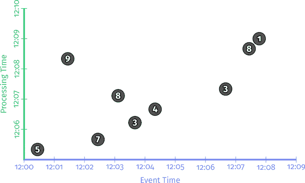

###### 图 2-1。九个输入记录，分别以事件时间和处理时间绘制

随后的时间跨度图要么是动画（Safari），要么是一系列帧（打印和所有其他数字格式），让您可以看到数据随时间如何处理（在我们到达第一个时间跨度图之后不久，我们将更详细地讨论这一点）。

在每个示例之前，都有一小段 Apache Beam Java SDK 伪代码，以使管道的定义更加具体。这是伪代码，因为我有时会弯曲规则，以使示例更清晰，省略细节（比如具体 I/O 源的使用），或简化名称（Beam Java 2.x 和之前的触发器名称非常冗长；我使用更简单的名称以增加清晰度）。除了这些小事情之外，它是真实世界的 Beam 代码（本章中的所有示例的真实代码都可以在[GitHub](http://bit.ly/2KMsDwR)上找到）。

如果您已经熟悉类似 Spark 或 Flink 的东西，您应该相对容易理解 Beam 代码在做什么。但是，为了给您一个快速入门，Beam 中有两个基本原语：

`PCollections`

这些代表数据集（可能是庞大的数据集），可以在其上执行并行转换（因此名称开头的“P”）。

`PTransforms`

这些应用于`PCollections`以创建新的`PCollections`。`PTransforms`可以执行逐元素转换，它们可以将多个元素分组/聚合在一起，或者它们可以是其他`PTransforms`的复合组合，如图 2-2 所示。

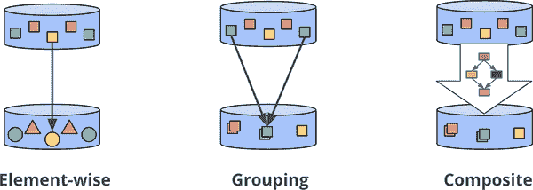

###### 图 2-2。转换的类型

对于我们的示例，我们通常假设我们从预加载的`PCollection<KV<Team, Integer>>`（即由`Teams`和`Integers`组成的`PCollection`，其中`Teams`只是表示团队名称的`Strings`，而`Integers`是相应团队中任何个人的得分）开始（例如，从 I/O 源读取原始数据（例如，日志记录）并将其转换为`PCollection<KV<Team, Integer>>`）。为了在第一个示例中更清晰，我包含了所有这些步骤的伪代码，但在后续示例中，我省略了 I/O 和解析。

因此，对于一个简单地从 I/O 源读取数据，解析团队/得分对，并计算得分的每个团队的管道，我们将会得到类似于示例 2-1 中所示的内容。

##### 示例 2-1. 求和管道

```java

PCollection<String> raw = IO.read(...);
PCollection<KV<Team, Integer>> input = raw.apply(new ParseFn());
PCollection<KV<Team, Integer>> totals =
  input.apply(Sum.integersPerKey());

```

键/值数据从 I/O 源读取，其中`Team`（例如，球队名称的`String`）作为键，`Integer`（例如，个人团队成员得分）作为值。然后对每个键的值进行求和，以生成输出集合中的每个键的总和（例如，团队总得分）。

在接下来的所有示例中，在看到描述我们正在分析的管道的代码片段之后，我们将看一下一个时间跨度图，显示该管道在我们的具体数据集上针对单个键的执行情况。在真实的管道中，你可以想象类似的操作会在多台机器上并行进行，但为了我们的示例，保持简单会更清晰。

正如之前提到的，Safari 版本呈现完整的执行过程，就像一部动画电影，而打印和所有其他数字格式则使用一系列静态关键帧，以提供管道随时间的进展的感觉。在这两种情况下，我们还提供一个完全动画版本的网址[*www.streamingbook.net*](http://www.streamingbook.net)。

每个图表都在两个维度上绘制输入和输出：事件时间（x 轴）和处理时间（y 轴）。因此，由管道观察到的实时时间从底部到顶部逐渐推移，如在处理时间轴上上升的粗黑水平线所示。输入为圆圈，圆圈内的数字表示该特定记录的值。它们开始为浅灰色，并在管道观察到它们时变暗。

当管道观察值时，它会将这些值累积到其中间状态中，并最终将聚合结果实现为输出。状态和输出由矩形表示（状态为灰色，输出为蓝色），聚合值靠近顶部，矩形覆盖的区域表示事件时间和处理时间累积到结果中的部分。对于示例 2-1 中的管道，在经典的批处理引擎上执行时，它看起来会像图 2-3 中所示的样子。

<assets/stsy_0203.mp4>


###### 图 2-3. 经典批处理

因为这是一个批处理管道，它会累积状态，直到看到所有的输入（由顶部的虚线绿线表示），然后产生 48 的单个输出。在这个示例中，我们计算了所有事件时间的总和，因为我们还没有应用任何特定的窗口处理转换；因此，状态和输出的矩形覆盖了整个 x 轴。然而，如果我们想要处理无界数据源，经典的批处理就不够了；我们不能等待输入结束，因为它实际上永远不会结束。我们想要的概念之一是窗口处理，我们在第一章中介绍过。因此，在我们的第二个问题的背景下——“*在事件时间中*结果是在哪里计算的？”——我们现在将简要回顾一下窗口处理。

## *Where*: 窗口处理

如第一章所讨论的，窗口化是沿着时间边界切分数据源的过程。常见的窗口化策略包括固定窗口、滑动窗口和会话窗口，如图 2-4 所示。

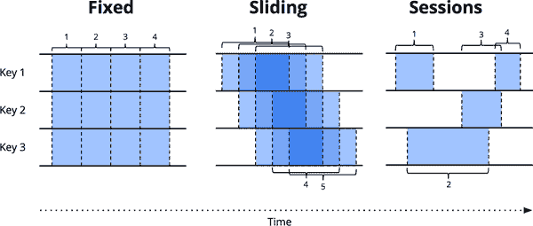

###### 图 2-4。示例窗口策略。每个示例都显示了三个不同的键，突出了对齐窗口（适用于所有数据）和不对齐窗口（适用于数据子集）之间的差异。

为了更好地了解窗口化在实践中的样子，让我们将整数求和管道窗口化为固定的两分钟窗口。使用 Beam，只需简单地添加一个`Window.into`转换，如示例 2-2 中所示。

##### 示例 2-2。窗口化求和代码

```java

PCollection<KV<Team, Integer>> totals = input
  .apply(Window.into(FixedWindows.of(TWO_MINUTES)))
  .apply(Sum.integersPerKey());

```

回想一下，Beam 提供了一个统一的模型，可以在批处理和流处理中同时工作，因为语义上批处理实际上只是流处理的一个子集。因此，让我们首先在批处理引擎上执行此管道；机制更加直接，而且在切换到流处理引擎时，可以直接进行对比。图 2-5 呈现了结果。

<assets/stsy_0205.mp4>

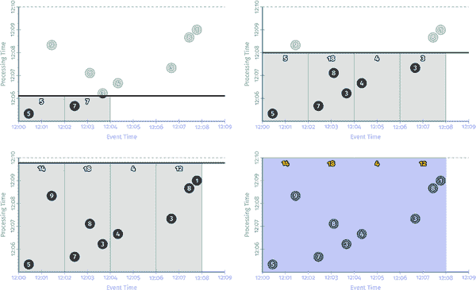

###### 图 2-5。批处理引擎上的窗口化求和

与以前一样，输入在状态中累积，直到完全消耗，然后产生输出。但是，在这种情况下，我们不是得到一个输出，而是得到四个输出：一个输出，分别对应四个相关的两分钟事件时间窗口。

到目前为止，我们已经重新讨论了我在第一章介绍的两个主要概念：事件时间和处理时间域之间的关系，以及窗口化。如果我们想进一步，我们需要开始添加本节开头提到的新概念：触发器、水印和累积。

# 转向流处理：*When*和*How*

我们刚刚观察了批处理引擎上的窗口化管道的执行。但是，理想情况下，我们希望结果的延迟更低，并且我们还希望原生地处理无界数据源。切换到流处理引擎是朝着正确方向迈出的一步，但是我们以前的策略等待输入完全被消耗才生成输出的做法不再可行。这时就需要触发器和水印。

## *When*：触发器的奇妙之处在于触发器是奇妙的东西！

触发器提供了对问题的答案：“*When*在处理时间中何时生成结果？”触发器声明在处理时间中窗口的输出应该发生的时间（尽管触发器本身可能基于在其他时间域中发生的事情做出这些决定，比如随着事件时间域中的水印进展，我们马上就会看到）。窗口的每个具体输出被称为窗口的*窗格*。

虽然可以想象出各种可能的触发语义，³但在概念上，通常只有两种通用的有用触发类型，实际应用几乎总是使用其中一种或两种的组合：

重复更新触发器

这些会定期为窗口生成更新的窗格，随着其内容的演变。这些更新可以随着每个新记录的到来而实现，也可以在一定的处理时间延迟后发生，比如每分钟一次。重复更新触发器的周期选择主要是在平衡延迟和成本方面的考量。

完整性触发器

这些在认为窗口的输入完全到达某个阈值后才为窗口生成一个窗格。这种类型的触发器最类似于我们在批处理中熟悉的：只有在输入完成后才提供结果。触发器方法的不同之处在于完整性的概念仅限于单个窗口的上下文范围，而不总是与整个输入的完整性绑定。

重复更新触发器是流式系统中最常见的触发器类型。它们易于实现和理解，并为特定类型的用例提供有用的语义：对材料化数据集的重复（并最终一致）更新，类似于数据库世界中材料化视图的语义。

完整性触发器并不经常遇到，但提供了更接近经典批处理世界的流语义。它们还提供了用于推理诸如缺失数据和延迟数据之类的工具，我们很快会讨论（并在下一章中）当我们探索驱动完整性触发器的基础原语：水印。

但首先，让我们从简单的开始，看看一些基本的重复更新触发器的实际操作。为了使触发器的概念更加具体，让我们继续向我们的示例管道添加最简单类型的触发器：随着每条新记录的触发，如例 2-3 所示。

##### 例 2-3。重复触发每条记录

```java

PCollection<KV<Team, Integer>> totals = input
  .apply(Window.into(FixedWindows.of(TWO_MINUTES))
                .triggering(Repeatedly(AfterCount(1))));
  .apply(Sum.integersPerKey());

```

如果我们在流式引擎上运行这个新的管道，结果会看起来像图 2-6 所示。

<assets/stsy_0206.mp4>

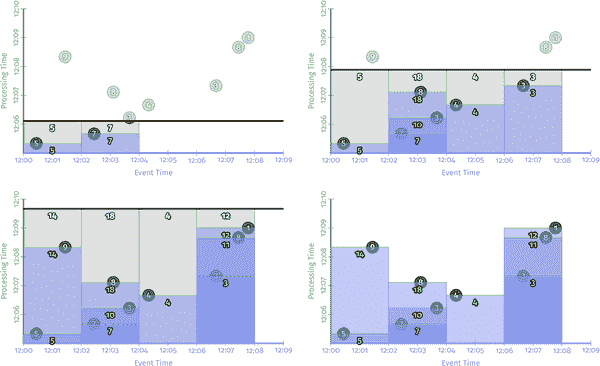

###### 图 2-6。在流式引擎上按记录触发

您可以看到我们现在为每个窗口获得多个输出（窗格）：每个输入对应一次。当输出流被写入某种表格时，这种触发模式效果很好，您可以简单地轮询结果。无论何时查看表格，您都会看到给定窗口的最新值，并且这些值随着时间的推移会趋向于正确。

按记录触发的一个缺点是它非常啰嗦。在处理大规模数据时，像求和这样的聚合提供了一个很好的机会，可以减少流的基数而不丢失信息。这在您有高容量键的情况下尤为明显；例如，我们的例子中有很多活跃玩家的大型团队。想象一下一个大型多人游戏，玩家被分成两个派别，您想要按派别统计数据。可能不需要在给定派别的每个玩家的每条新输入记录后更新您的统计数据。相反，您可能会在一定的处理时间延迟后，比如每秒或每分钟，更新它们。使用处理时间延迟的一个好处是它对高容量键或窗口具有均衡效果：结果流最终会在基数方面更加均匀。

触发器中有两种不同的处理时间延迟方法：*对齐延迟*（其中延迟将处理时间划分为与键和窗口对齐的固定区域）和*未对齐延迟*（其中延迟相对于给定窗口内观察到的数据）。具有未对齐延迟的管道可能看起来像例 2-4，其结果如图 2-7 所示。

##### 例 2-4。在对齐的两分钟处理时间边界上触发

```java

PCollection<KV<Team, Integer>> totals = input
  .apply(Window.into(FixedWindows.of(TWO_MINUTES))
               .triggering(Repeatedly(AlignedDelay(TWO_MINUTES)))
  .apply(Sum.integersPerKey());

```

<assets/stsy_0207.mp4>

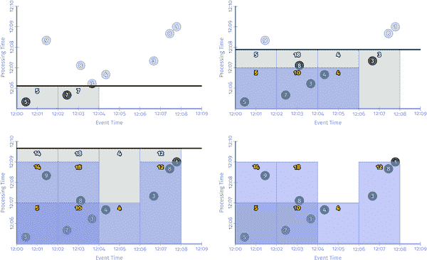

###### 图 2-7。两分钟对齐延迟触发器（即，微批处理）

这种对齐延迟触发实际上就是您从像 Spark Streaming 这样的微批处理流系统中获得的。它的好处在于可预测性；您可以同时获得所有修改窗口的定期更新。这也是它的缺点：所有更新同时发生，这导致了经常需要更大的峰值预配来正确处理负载的工作负载。另一种选择是使用未对齐延迟。这在 Beam 中可能看起来像例 2-5。图 2-8 呈现了结果。

##### 例 2-5。在未对齐的两分钟处理时间边界上触发

```java

PCollection<KV<Team, Integer>> totals = input
  .apply(Window.into(FixedWindows.of(TWO_MINUTES))
               .triggering(Repeatedly(UnalignedDelay(TWO_MINUTES))
  .apply(Sum.integersPerKey());

```

<assets/stsy_0208.mp4>

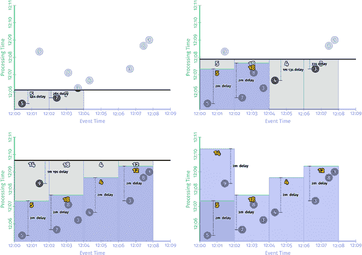

###### 图 2-8. 两分钟不对齐延迟触发器

将图 2-8 中的不对齐延迟与图 2-6 中的对齐延迟进行对比，很容易看出不对齐延迟如何在时间上更均匀地分布负载。对于任何给定窗口涉及的实际延迟在这两种情况下有所不同，有时更多，有时更少，但最终平均延迟基本上保持不变。从这个角度来看，不对齐延迟通常是大规模处理的更好选择，因为它会导致负载在时间上更均匀地分布。

重复更新触发器非常适用于我们只是希望定期更新结果并且可以接受这些更新朝着正确性收敛而没有明确指示何时达到正确性的用例。然而，正如我们在第一章中讨论的那样，分布式系统的种种变数经常导致事件发生的时间和管道实际观察到事件的时间之间存在不同程度的偏差，这意味着很难推断输出何时呈现出准确和完整的输入数据视图。对于输入完整性很重要的情况，有一种推理完整性的方式是很重要的，而不是盲目地相信计算结果，无论哪个数据子集恰好已经传递到管道中。这就是水印的作用。

## *何时*：水印

水印是对问题“*何时*在处理时间中结果实现？”的支持方面。水印是事件时间域中输入完整性的时间概念。换句话说，它们是系统相对于正在处理的事件流中记录的事件时间的进度和完整性的方式（有界或无界的情况下它们的用处更加明显）。

回想一下第一章中的这个图表，在图 2-9 中稍作修改，我描述了事件时间和处理时间之间的偏差，对于大多数实际的分布式数据处理系统来说，这是一个随时间不断变化的函数。

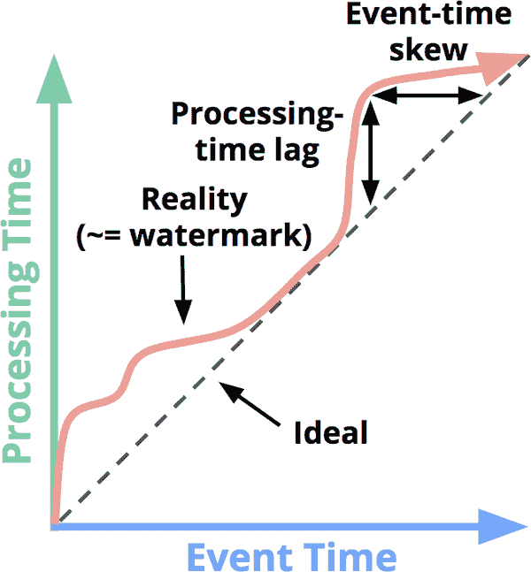

###### 图 2-9. 事件时间进度、偏差和水印

我声称代表现实的那条蜿蜒的红线本质上就是水印；它捕捉了事件时间完整性随着处理时间的进展而变化。在概念上，您可以将水印视为一个函数，*F*(*P*) → *E*，它接受一个处理时间点并返回一个事件时间点。⁴ 事件时间点*E*是系统认为所有事件时间小于*E*的输入都已被观察到的点。换句话说，这是一个断言，即再也不会看到事件时间小于*E*的数据。根据水印的类型，完美或启发式，这个断言可以是严格的保证或是一个有根据的猜测。

完美水印

对于我们完全了解所有输入数据的情况，可以构建完美水印。在这种情况下，不存在延迟数据；所有数据都是提前或准时的。

启发式水印

对于许多分布式输入源，完全了解输入数据是不切实际的，因此提供启发式水印是下一个最佳选择。启发式水印使用有关输入的任何可用信息（分区、分区内的排序（如果有）、文件的增长率等）来提供尽可能准确的进度估计。在许多情况下，这些水印的预测可以非常准确。即便如此，使用启发式水印意味着它有时可能是错误的，这将导致延迟数据。我们很快会向您展示处理延迟数据的方法。

因为它们提供了相对于我们的输入的完整性概念，水印构成了先前提到的第二种触发器的基础：*完整性触发器*。水印本身是一个迷人而复杂的话题，当你看到 Slava 在第三章中深入研究水印时，你会发现这一点。但现在，让我们通过更新我们的示例管道来利用建立在水印之上的完整性触发器来看看它们的作用，就像在示例 2-6 中演示的那样。

##### 示例 2-6。水印完整性触发器

```java

PCollection<KV<Team, Integer>> totals = input
  .apply(Window.into(FixedWindows.of(TWO_MINUTES))
               .triggering(AfterWatermark()))
  .apply(Sum.integersPerKey());

```

现在，水印的一个有趣的特性是它们是一类函数，这意味着有多个不同的函数*F*(*P*) → *E*满足水印的属性，成功程度各不相同。正如我之前所指出的，对于你对输入数据有完美的了解的情况，可能可以构建一个完美的水印，这是理想的情况。但对于你缺乏对输入的完美了解的情况，或者计算完美水印太昂贵的情况，你可能会选择使用启发式来定义你的水印。我想要在这里强调的是，所使用的水印算法与管道本身是独立的。我们不打算在这里详细讨论实现水印意味着什么（Slava 在第三章中会讲到）。现在，为了帮助强调这个观点，即给定的输入集可以应用不同的水印，让我们看一下我们在示例 2-6 中的管道在相同数据集上执行时使用两种不同的水印实现（图 2-10）：左侧是完美水印；右侧是启发式水印。

在这两种情况下，当水印通过窗口的末端时，窗口会被实体化。正如你所期望的那样，完美的水印完美地捕捉了管道随着时间的推移而发生的事件完整性。相比之下，右侧启发式水印的具体算法未考虑值为 9，⁵这极大地改变了实体化输出的形状，无论是在输出延迟还是正确性方面（如 12:00、12:02 提供的错误答案为 5）。

水印触发器与我们在图 2-5 到 2-7 中看到的重复更新触发器的一个重大区别是*水印给了我们一种推理输入完整性的方式*。直到系统为给定的窗口实体化输出，我们知道系统还不相信输入是完整的。这对于那些想要推理输入中的*数据缺失*或*缺失数据*的用例尤为重要。

<资产/ stsy_0210.mp4>

在具有完美（左）和启发式（右）水印的流处理引擎上的窗口求和


###### 图 2-10。在具有完美（左）和启发式（右）水印的流处理引擎上的窗口求和

缺失数据用例的一个很好的例子是外连接。如果没有像水印这样的完整性概念，你怎么知道何时放弃并发出部分连接，而不是继续等待该连接完成？你不知道。基于处理时间延迟做出决定的方式，这是缺乏真正水印支持的流处理系统的常见方法，这不是一个安全的方式，因为我们在第一章中讨论过的事件时间偏移的可变性：只要偏移保持小于所选的处理时间延迟，你的缺失数据结果将是正确的，但是一旦偏移超过了该延迟，它们将突然变得*不*正确。从这个角度来看，事件时间水印对于许多必须推理输入数据缺失的真实世界流处理用例（如外连接、异常检测等）是一个关键的拼图。现在，话虽如此，这些水印示例也突显了水印（以及任何其他完整性概念）的两个*缺点*，具体来说，它们可能是以下两种情况之一：太慢当任何类型的水印由于已知未处理的数据（例如，由于网络带宽限制而缓慢增长的输入日志）而被正确延迟时，如果水印的推进是你唯一依赖于刺激结果的因素，那么这直接转化为输出的延迟。这在图 2-10 的左侧图中最为明显，晚到的 9 会阻碍所有后续窗口的水印，即使这些窗口的输入数据较早就变得完整。对于第二个窗口，12:02, 12:04），从窗口中的第一个值出现到我们看到窗口的任何结果几乎需要七分钟。在这个示例中，启发式水印并没有遭受同样严重的问题（五分钟直到输出），但不要认为启发式水印永远不会遭受水印滞后的问题；这实际上只是我选择在这个特定示例中省略的记录的结果。这里的重要一点是：尽管水印提供了一个非常有用的完整性概念，但依赖完整性来产生输出通常从延迟的角度来看并不理想。想象一下一个包含有价值的指标的仪表板，按小时或天进行窗口化。你不太可能希望等到整整一个小时或一天才开始看到当前窗口的结果；这是使用经典批处理系统来支持这样的系统的痛点之一。相反，随着输入的演变和最终变得完整，看到这些窗口的结果随着时间的推移而不断完善会更好。太快当启发式水印比它应该提前推进时，事件时间早于水印的数据可能会在之后的某个时间到达，从而产生延迟数据。这就是右侧示例中发生的情况：水印在第一个窗口结束之前推进，而该窗口的所有输入数据尚未被观察到，导致输出值不正确，而不是 14。这个缺点严格来说是启发式水印的问题；它们的启发式本质意味着它们有时会出错。因此，如果你关心正确性，仅仅依赖它们来确定何时产生输出是不够的。在第一章中，我对完整性概念不足以满足大多数需要对无界数据流进行强大的乱序处理的用例做出了一些非常强调的陈述。这两个缺点——水印太慢或太快——是这些论点的基础。你简单地无法从完整性概念的系统中同时获得低延迟和正确性。因此，对于那些希望兼顾两全的情况，一个人该怎么办呢？如果重复更新触发器提供了低延迟更新但无法推理完整性，水印提供了完整性概念但变化和可能的高延迟，为什么不将它们的力量结合起来呢？

## *何时*：早期/准时/延迟触发器

胜利！我们现在已经看过了两种主要类型的触发器：重复更新触发器和完整性/水印触发器。在许多情况下，它们单独都不足够，但它们的组合是。Beam 通过提供标准水印触发器的扩展来认识到这一事实，该扩展还支持水印两侧的重复更新触发。这被称为早期/准时/延迟触发器，因为它将由复合触发器实现的窗格分为三类：+   零个或多个*早期窗格*，这是重复更新触发器的结果，它会定期触发，直到水印通过窗口的末尾。这些触发产生的窗格包含推测结果，但允许我们观察随着新的输入数据到达，窗口随时间的演变。这弥补了水印有时会*太慢*的缺点。

+   一个*准时窗格*，这是完整性/水印触发器在水印通过窗口的末尾后触发的结果。这种触发是特殊的，因为它提供了一个断言，即系统现在认为这个窗口的输入是完整的。这意味着现在可以推断*缺失数据*；例如，在执行外连接时发出部分连接。

+   零个或多个*迟到窗格*，这是另一个（可能不同的）重复更新触发器的结果，它会定期触发，任何迟到数据到达后，水印已经通过窗口的末尾。在完美的水印情况下，将始终没有迟到窗格。但在启发式水印的情况下，水印未能正确计算的任何数据都将导致迟到触发。这弥补了水印*太快*的缺点。

让我们看看这在实际中是什么样子。我们将更新我们的管道，使用周期性的处理时间触发器，早期触发的对齐延迟为一分钟，迟到触发的每条记录触发。这样，早期触发将为我们的高吞吐量窗口提供一定量的批处理（由于触发器每分钟只触发一次，不管窗口中的吞吐量如何），但我们不会为迟到触发引入不必要的延迟，如果我们使用一个相当准确的启发式水印，迟到触发应该是相当罕见的。在 Beam 中，这看起来像例 2-7（图 2-11 显示了结果）。

##### 例 2-7。通过早期/准时/迟到 API 进行早期、准时和迟到触发

```java
PCollection<KV<Team, Integer>> totals = input
  .apply(Window.into(FixedWindows.of(TWO_MINUTES))
               .triggering(AfterWatermark()
               			     .withEarlyFirings(AlignedDelay(ONE_MINUTE))			     .withLateFirings(AfterCount(1))))  
  .apply(Sum.integersPerKey());
```

<assets/stsy_0211.mp4>

在具有早期、准时和迟到触发的流引擎上的窗口求和

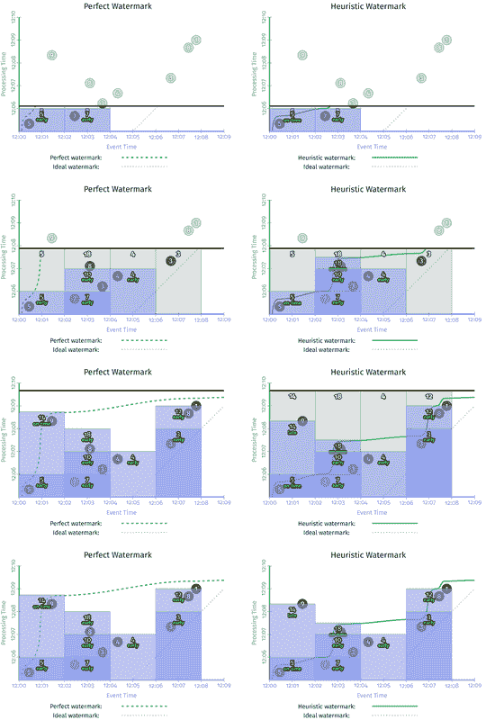


###### 图 2-11。在具有早期、准时和迟到触发的流引擎上的窗口求和

这个版本比图 2-9 有两个明显的改进：

+   对于第二个窗口（12:02, 12:04）中的“水印太慢”的情况：我们现在每分钟提供定期的早期更新。最大的差异在于完美的水印情况，首次输出时间从将近七分钟减少到三分半；但在启发式情况下，也明显改善了。现在两个版本都随时间稳定改进（窗格的值为 7、10，然后是 18），在输入变得完整和窗口的最终输出窗格实现之间的延迟相对较小。

+   对于第一个窗口（12:00, 12:02）中的“启发式水印太快”的情况：当值为 9 的数据迟到时，我们立即将其合并到一个新的、更正的窗格中，值为 14。这些新触发器的一个有趣的副作用是，它们有效地使完美和启发式水印版本之间的输出模式得到了规范化。

在图 2-10 中，两个版本截然不同，而在这里的两个版本看起来非常相似。它们看起来也更类似于图 2-6 到 2-8 中的各种重复更新版本，但有一个重要的区别：由于使用了水印触发器，我们还可以推断我们使用早期/准时/迟到触发器生成的结果的输入完整性。这使我们能够更好地处理关心*缺失数据*的用例，比如外连接，异常检测等。在这一点上，完美和启发式的早期/准时/延迟版本之间最大的区别是窗口生命周期的限制。在完美的水印情况下，我们知道在水印通过窗口结束之后我们不会再看到任何窗口的数据，因此我们可以在那时丢弃窗口的所有状态。在启发式水印情况下，我们仍然需要保留窗口的状态一段时间来处理延迟数据。但是到目前为止，我们的系统还没有一个好的方法来知道每个窗口需要保留状态的时间。这就是*允许延迟*的作用。## *何时*：允许延迟（即，垃圾回收）在继续我们的最后一个问题（“*结果的改进*如何相关？”）之前，我想谈谈长期、乱序的流处理系统中的一个实际必要性：垃圾回收。在图 2-11 中的启发式水印示例中，每个窗口的持久状态在整个示例的生命周期内都会持续存在；这是必要的，以便我们在需要时能够适当地处理延迟数据。但是，虽然能够一直保留我们的持久状态直到永远是很好的，但实际上，在处理无界数据源时，通常不太可能无限期地保留给定窗口的状态（包括元数据）；我们最终会耗尽磁盘空间（或者至少厌倦为其付费，因为随着时间的推移，旧数据的价值会降低）。因此，任何现实世界中的乱序处理系统都需要提供一种方式来限制它正在处理的窗口的生命周期。一个清晰而简洁的方法是在系统内定义允许延迟的地平线；也就是说，对于系统来说，设定任何给定*记录*相对于水印可以有多晚（相对于水印）才值得处理；超过这个地平线的任何数据都会被简单地丢弃。在你设定了个别数据可以有多晚之后，你也确立了窗口状态必须保留多久的时间：直到水印超过窗口结束时的延迟地平线。但另外，你也给了系统自由，让它在观察到后面的数据时立即丢弃超过地平线的任何数据，这意味着系统不会浪费资源处理没有人关心的数据。由于允许延迟和水印之间的相互作用有点微妙，值得看一个例子。让我们看一下示例 2-7/图 2-11 中的启发式水印流水线，并在示例 2-8 中添加一个一分钟的延迟地平线（请注意，这个特定的地平线之所以被选择，纯粹是因为它在图中很好地适应；对于实际用例，一个更大的地平线可能会更实用）：

##### 示例 2-8。允许延迟的早期/准时/延迟触发

```java
PCollection<KV<Team, Integer>> totals = input
  .apply(Window.into(FixedWindows.of(TWO_MINUTES))
        .triggering(AfterWatermark()
              .withEarlyFirings(AlignedDelay(ONE_MINUTE))
              .withLateFirings(AfterCount(1)))
              .withAllowedLateness(ONE_MINUTE)) 
  .apply(Sum.integersPerKey());
```

执行此流水线的过程看起来有点像图 2-12，我在其中添加了以下功能以突出允许延迟的影响：

+   表示处理时间中当前位置的粗黑线现在带有刻度，用于指示所有活动窗口的延迟地平线（以事件时间为单位）。

+   当水印通过窗口的延迟地平线时，该窗口关闭，这意味着窗口的所有状态都被丢弃。我留下一个虚线矩形，显示窗口关闭时它覆盖的时间范围（在两个域中），并在右侧延伸一小段以表示窗口的延迟地平线（与水印进行对比）。

+   仅对于此图，我为第一个值为 6 的窗口添加了一个额外的延迟数据。6 是延迟的，但仍在允许的延迟地平线内，因此被合并到值为 11 的更新结果中。然而，9 到达的时间超过了延迟地平线，因此被简单地丢弃。

<assets/stsy_0212.mp4>

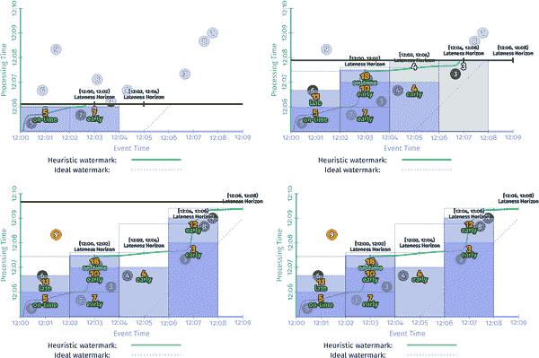

###### 图 2-12。具有早期/准时/延迟触发的允许延迟

关于延迟时间范围的两个最终注意事项：

+   要非常清楚，如果你恰好从具有完美水印的数据源中获取数据，就不需要处理延迟数据，允许的延迟时间为零秒将是最佳的。这就是我们在图 2-10 的完美水印部分看到的情况。

+   即使在使用启发式水印时，需要指定延迟时间范围的规则有一个值得注意的例外，那就是对于可管理的有限数量的键（例如，按网页浏览器系列对所有时间的全局聚合进行计算，例如，按网页浏览器系列对所有时间的总访问次数进行计算）。在这种情况下，系统中活动窗口的数量受到使用的有限键空间的限制。只要键的数量保持在可以管理的范围内，就不需要担心通过允许的延迟时间来限制窗口的生命周期。

实用性满足后，让我们继续我们的第四个和最后一个问题。

## *如何*：累积

当触发器用于在一段时间内为单个窗口生成多个窗格时，我们发现自己面临最后一个问题：“*结果的修正*如何相关？”在我们迄今为止看到的例子中，每个连续的窗格都是建立在紧随其后的窗格之上的。然而，实际上有三种不同的累积模式：⁹

丢弃

每次窗格被实现，任何存储的状态都会被丢弃。这意味着每个连续的窗格都与之前的窗格无关。当下游消费者执行某种累积时，丢弃模式是有用的；例如，当将整数发送到一个期望接收将它们相加以产生最终计数的增量的系统时。

累积

与图 2-6 到 2-11 一样，每次窗格被实现，任何存储的状态都会被保留，并且未来的输入会累积到现有的状态中。这意味着每个连续的窗格都建立在以前的窗格之上。当后续结果可以简单地覆盖先前的结果时，累积模式是有用的，例如在将输出存储在 HBase 或 Bigtable 等键/值存储中时。

累积和撤消

这就像是累积模式，但是在生成新的窗格时，它还会为以前的窗格产生独立的撤消。撤消（与新的累积结果结合）本质上是一种明确地说“我之前告诉过你结果是*X*，但我错了。去掉我上次告诉你的*X*，用*Y*替换它。”的方式。撤消有两种情况特别有帮助：

+   当下游消费者*通过不同的维度重新分组数据*时，新值很可能会以与以前的值不同的键方式进行分组，因此最终会进入不同的组。在这种情况下，新值不能简单地覆盖旧值；相反，您需要撤消以删除旧值

+   当使用*动态窗口*（例如，我们稍后将更仔细地研究的会话）时，新值可能会替换多个以前的窗口，因为窗口合并。在这种情况下，仅从新窗口中确定替换了哪些旧窗口可能会很困难。为旧窗口提供明确的撤消使得这个任务变得简单。我们在第八章中详细看到了一个例子。

每个组的不同语义在并排看时会更清晰一些。考虑图 2-11 中第二个窗口（事件时间范围为 12:06, 12:08）的两个窗格。表 2-1 显示了在三种累积模式下（*累积*模式是图 2-11 本身使用的特定模式）每个窗格的值会是什么样子。

表 2-1。使用图 2-11 的第二个窗口比较累积模式

|   | **丢弃** | **累积** | **累积和撤回** |
| --- | --- | --- | --- |
| **窗格 1：输入=[3]** | 3 | 3 | 3 |
| **窗格 2：输入=[8, 1]** | 9 | 12 | 12, –3 |
| **最终正常窗格的值** | 9 | 12 | 12 |
| **所有窗格的总和** | 12 | 15 | 12 |

让我们仔细看看发生了什么：

丢弃

每个窗格只包含在该特定窗格期间到达的值。因此，观察到的最终值并不能完全捕捉到总和。然而，如果你将所有独立窗格的值相加，你会得到一个正确的答案 12。这就是为什么在下游消费者本身对实体窗格执行某种聚合时，丢弃模式是有用的。

累积

就像图 2-11 一样，每个窗格都包含在该特定窗格期间到达的值，以及之前窗格的所有值。因此，观察到的最终值正确地捕捉到了总和 12。然而，如果你将各个窗格本身相加，你实际上会重复计算窗格 1 的输入，得到一个不正确的总和 15。这就是为什么当你可以简单地用新值覆盖先前的值时，累积模式是最有用的：新值已经包含了迄今为止看到的所有数据。

累积和撤回

每个窗格都包括一个新的累积模式值以及前一个窗格值的撤回。因此，最后观察到的值（不包括撤回）以及所有实体窗格的总和（包括撤回）都会给出正确答案 12。这就是为什么撤回是如此强大。

示例 2-9 演示了丢弃模式的运行，说明了我们将对示例 2-7 进行的更改：

##### 示例 2-9。流引擎上早期/及时/延迟触发的丢弃模式版本

```java

PCollection<KV<Team, Integer>> totals = input
  .apply(Window.into(FixedWindows.of(TWO_MINUTES))
               .triggering(
                 AfterWatermark()
                   .withEarlyFirings(AlignedDelay(ONE_MINUTE))
                   .withLateFirings(AtCount(1)))
               .discardingFiredPanes())
  .apply(Sum.integersPerKey());

```

在具有启发式水印的流引擎上再次运行会产生类似于图 2-13 所示的输出。

<assets/stsy_0213.mp4>


###### 图 2-13。流引擎上早期/及时/延迟触发的丢弃模式版本

尽管输出的整体形状与图 2-11 中的累积模式版本相似，但请注意，这个丢弃版本中没有任何窗格重叠。因此，每个输出都是独立的。

如果我们想看撤回的运行情况，更改将是类似的，如示例 2-10 所示。???描述了结果。

##### 示例 2-10。流引擎上早期/及时/延迟触发的累积和撤回模式版本

```java

PCollection<KV<Team, Integer>> totals = input
  .apply(Window.into(FixedWindows.of(TWO_MINUTES))
               .triggering(
                 AfterWatermark()
                   .withEarlyFirings(AlignedDelay(ONE_MINUTE))
                   .withLateFirings(AtCount(1)))
               .accumulatingAndRetractingFiredPanes())
  .apply(Sum.integersPerKey());

```

<assets/stsy_0214.mp4>

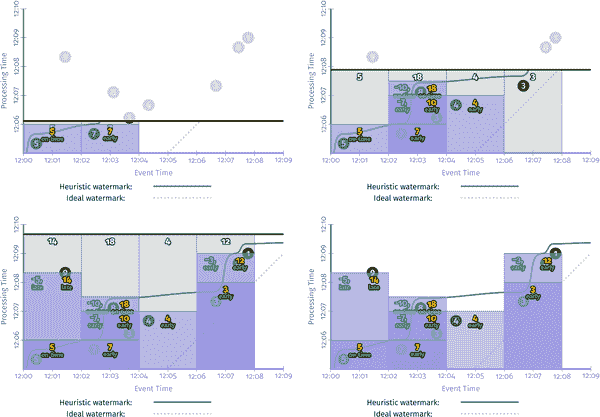 流引擎上早期/及时/延迟触发的累积和撤回模式版本

因为每个窗口的窗格都重叠，清楚地看到撤回有点棘手。撤回用红色表示，与重叠的蓝色窗格结合在一起，产生了略带紫色的颜色。我还稍微水平移动了给定窗格内的两个输出的值（并用逗号分隔），以便更容易区分它们。

图 2-14 结合了图 2-9、2-11（仅启发式）和并排的最终帧，提供了三种模式的良好视觉对比。

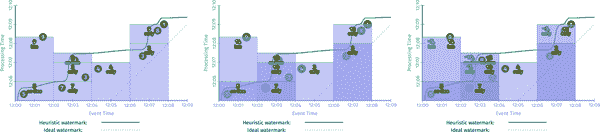

###### 图 2-14。累积模式的并排比较

正如你所想象的，按照呈现的顺序（丢弃、累积、累积和撤回）的模式在存储和计算成本方面是逐渐增加的。因此，累积模式的选择为在正确性、延迟和成本的轴上进行权衡提供了另一个维度。

# 摘要

通过本章的学习，您现在了解了强大的流处理的基础知识，并准备好进入世界，做出惊人的成就。当然，还有八章等着您去关注，所以希望您不要马上就出发，就在这一刻。但无论如何，让我们回顾一下我们刚刚涉及的主要概念：

事件时间与处理时间

事件发生的时间和数据处理系统观察到它们的时间之间的重要区别。

窗口

通过沿着时间边界（无论是处理时间还是事件时间，尽管在 Beam 模型中我们将窗口的定义缩小为仅在事件时间内）切分无界数据的常用方法。

触发器

用于准确指定何时对于特定用例来说输出的实现是有意义的声明性机制。

水印

事件时间中进展的强大概念，提供了一种推理完整性（因此缺失数据）的方式，用于处理无界数据的无序处理系统。

累积

对于单个窗口结果的改进与其多次实现时的情况之间的关系。

其次，我们用来构建我们探索的四个问题：

+   *什么*结果被计算？=转换。

+   *在*事件时间中计算结果的位置？=窗口。

+   *在*处理时间中结果何时实现？=触发器加水印。

+   *如何*结果的改进相关？=累积。

第三，为了强调这种流处理模型所提供的灵活性（因为归根结底，这才是关键：平衡正确性、延迟和成本等竞争张力），我们能够通过最少量的代码更改在相同数据集上实现的输出的主要变化的回顾：

|   | 整数求和 例 2-1 / 图 2-3 | 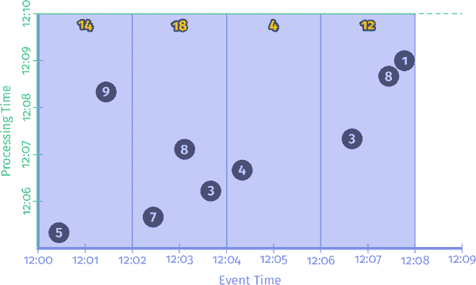整数求和 固定窗口批处理

例 2-2 / 图 2-5 | 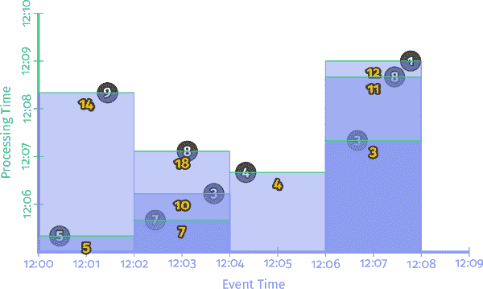整数求和 固定窗口流

每条记录重复触发

例 2-3 / 图 2-6 |

|   | 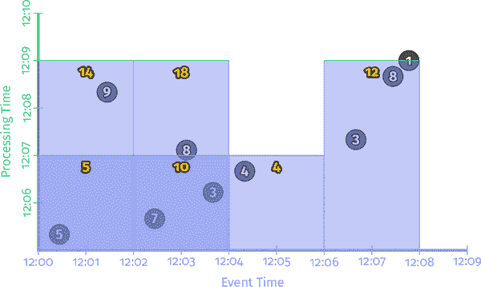整数求和 固定窗口流

重复对齐延迟触发

例 2-4 / 图 2-7 | 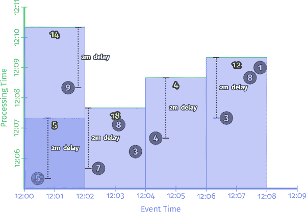整数求和 固定窗口流

重复不对齐延迟触发

例 2-5 / 图 2-8 | 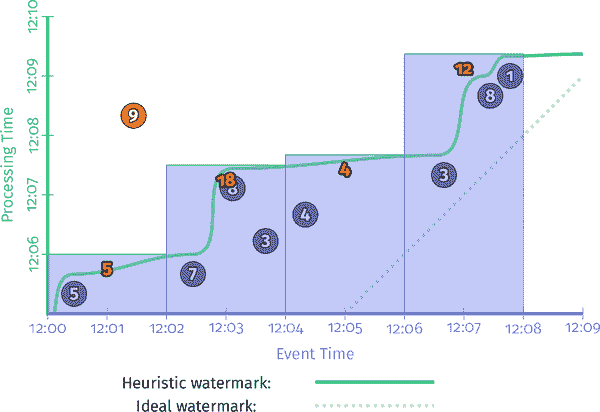整数求和 固定窗口流

启发式水印触发

例 2-6 / 图 2-10 |

|   | 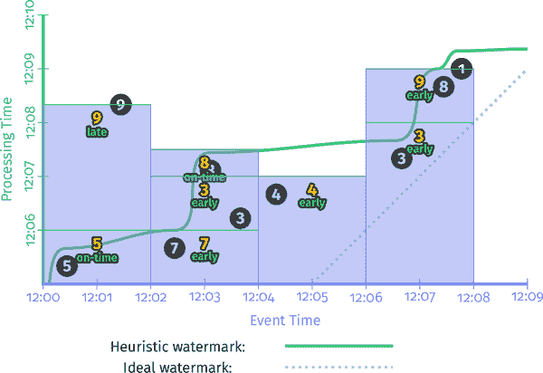整数求和 固定窗口流

早期/准时/延迟触发

丢弃

例 2-9 / 图 2-13 | 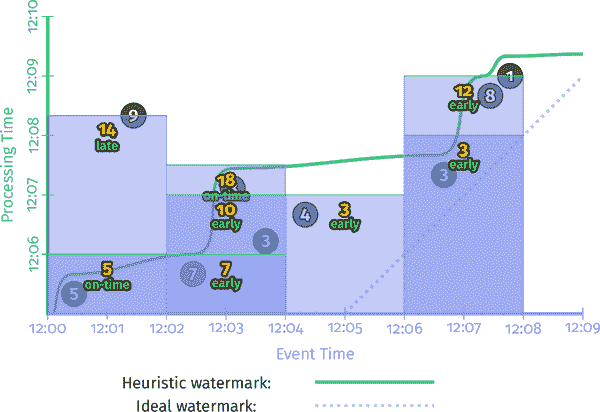整数求和 固定窗口流

早期/准时/延迟触发

累积

例 2-7 / 图 2-11 | 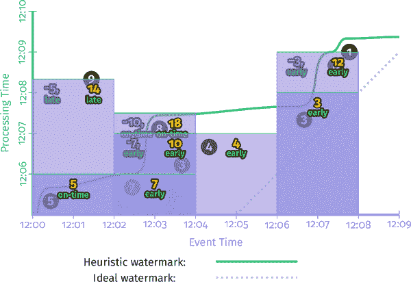整数求和 固定窗口流

早期/准时/延迟触发

累积和撤销

例 2-10 / ??? |

总之，到目前为止，我们只看了一种窗口方式：事件时间中的固定窗口。正如我们所知，窗口有许多维度，我想至少在我们结束 Beam 模型之前再触及另外两个维度。然而，首先，我们将稍微偏离一下，深入探讨水印的世界，因为这些知识将有助于构建未来的讨论（并且本身也很有趣）。斯拉瓦，右边的舞台进入...

¹ 如果您有幸阅读 Safari 版本的书，您将拥有完整的延时动画，就像[“流处理 102”](http://oreil.ly/1TV7YGU)中一样。对于印刷版、Kindle 和其他电子书版本，有静态图像并附有指向网络上动画版本的链接。

² 请耐心等待。在 O'Reilly 出版物中，严禁使用复合标点（即表情符号）进行细粒度的情感表达<​winky-smiley/>。

事实上，我们在 Beam 中的原始触发器功能中就是这样做的。回顾起来，我们有点过头了。未来的迭代将更简单、更易于使用，在本书中，我只关注那些可能以某种形式保留的部分。

更准确地说，函数的输入实际上是在观察到水印的管道中的那一点上游的一切的时间 *P* 的状态：输入源、缓冲数据、正在处理的数据等等；但在概念上，将其简单地视为从处理时间到事件时间的映射会更简单。

请注意，我特意选择省略启发式水印中值为 9 的价值，因为这将帮助我就延迟数据和水印滞后做出一些重要观点。实际上，启发式水印可能会选择省略其他一些值，这反过来可能会对水印产生显著较小的影响。如果筛选迟到的数据是你的目标（在某些情况下非常有效，比如滥用检测，你只想尽快看到大部分数据），你不一定想要启发式水印而不是完美水印。你真正想要的是百分位水印，它明确地从计算中删除一些百分位的迟到数据。参见第三章。

这并不是说没有主要关心正确性而不太关心延迟的用例；在这些情况下，使用准确的水印作为管道输出的唯一驱动是一个合理的方法。

正如我们之前所知，这种断言要么是有保证的，如果使用完美的水印，要么是一个有根据的猜测，如果使用启发式水印。

你可能会注意到，逻辑上应该有第四种模式：丢弃和撤销。在大多数情况下，这种模式并不是非常有用，所以我在这里不再讨论它。

回顾起来，也许选择一组更加面向物化流中数据观察性质的名称会更清晰一些（例如，“输出模式”），而不是描述产生这些数据的状态管理语义的名称。也许：丢弃模式 → 增量模式，累积模式 → 值模式，累积和撤销模式 → 值和撤销模式？然而，丢弃/累积/累积和撤销的名称已经成为 Beam 模型的 1.x 和 2.x 系列的一部分，所以我不想在书中引入潜在的混淆。此外，随着 Beam 3.0 和 [sink triggers](https://s.apache.org/beam-sink-triggers) 的引入，累积模式很可能会更加淡化；关于这一点，我们将在第八章讨论 SQL 时详细介绍。
