# 第三章：水印

到目前为止，我们一直从管道作者或数据科学家的角度来看待流处理。第二章介绍了水印作为解决*事件时间处理发生在何处*和*处理时间结果何时实现*这些基本问题的一部分。在本章中，我们从流处理系统的基本机制的角度来看待相同的问题。观察这些机制将帮助我们激发、理解和应用水印的概念。我们讨论了水印是如何在数据进入点创建的，它们如何通过数据处理管道传播，以及它们如何影响输出时间戳。我们还演示了水印如何保留必要的保证，以回答*事件时间数据在何处处理*和*何时实现*这些问题，同时处理无界数据。

# 定义

考虑任何摄取数据并持续输出结果的管道。我们希望解决一个一般性问题，即何时可以安全地认为事件时间窗口已关闭，即窗口不再期望任何更多数据。为此，我们希望描述管道相对于其无界输入所做的进展。

解决事件时间窗口问题的一个天真的方法是简单地基于当前处理时间来确定我们的事件时间窗口。正如我们在第一章中看到的，我们很快就会遇到麻烦——数据处理和传输并不是瞬时的，因此处理和事件时间几乎永远不会相等。我们的管道中的任何故障或突发事件都可能导致我们错误地将消息分配给窗口。最终，这种策略失败了，因为我们没有一种健壮的方法来对这样的窗口做出任何保证。

另一种直观但最终是错误的方法是考虑管道处理的消息速率。虽然这是一个有趣的度量标准，但速率可能会随着输入的变化、预期结果的可变性、可用于处理的资源等任意变化。更重要的是，速率无法帮助回答完整性的基本问题。具体来说，速率无法告诉我们何时已经看到了特定时间间隔内的所有消息。在现实世界的系统中，会出现消息在系统中无法取得进展的情况。这可能是由于瞬态错误（如崩溃、网络故障、机器停机）的结果，也可能是由于需要更改应用逻辑或其他手动干预来解决的持久性错误，例如应用级故障。当然，如果发生了大量故障，处理速率指标可能是检测这一情况的良好代理。但是速率指标永远无法告诉我们单个消息未能在我们的管道中取得进展。然而，即使是单个这样的消息，也可能会任意影响输出结果的正确性。

我们需要一个更健壮的进展度量。为了达到这个目标，我们对我们的流数据做出一个基本假设：*每条消息都有一个关联的逻辑事件时间戳*。在不断到达的无界数据的情况下，这个假设是合理的，因为这意味着输入数据的持续生成。在大多数情况下，我们可以将原始事件发生的时间作为其逻辑事件时间戳。有了包含事件时间戳的所有输入消息，我们可以检查任何管道中这些时间戳的分布。这样的管道可能分布在许多代理上并行处理，并且在单个分片之间没有排序的保证。因此，在这个管道中处于活动状态的正在传输的消息的事件时间戳集合将形成一个分布，如图 3-1 所示。

消息被管道摄取，处理，最终标记为已完成。每条消息要么是“在途”，意味着已接收但尚未完成，要么是“已完成”，意味着不需要为此消息再进行处理。如果我们按事件时间检查消息的分布，它看起来会像图 3-1。随着时间的推移，更多的消息将被添加到右侧的“在途”分布中，来自“在途”部分的更多消息将被完成并移动到“已完成”分布中。

<assets/stsy_0301.mp4>

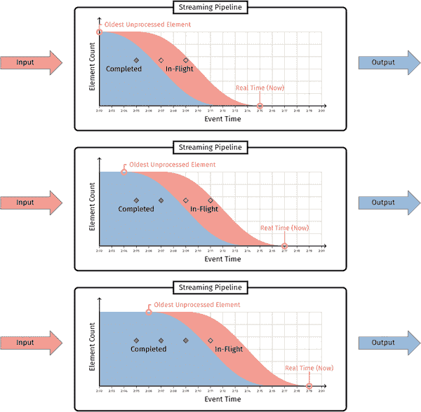

###### 图 3-1。流水线中在途和已完成消息事件时间的分布。新消息作为输入到达，并保持“在途”，直到完成处理。在任何给定时刻，“在途”分布的最左边缘对应于最老的未处理元素。

在这个分布上有一个关键点，位于“在途”分布的最左边缘，对应于我们管道中任何未处理消息的最老事件时间戳。我们使用这个值来定义水印：

> 水印是最老的尚未完成工作的单调¹递增时间戳。

这个定义提供了两个基本属性，使其有用：

完整性

如果水印已经超过某个时间戳*T*，我们可以通过其单调性质保证，不会再对*T*时刻或之前的准时（非延迟数据）事件进行处理。因此，我们可以正确地发出*T*时刻或之前的任何聚合。换句话说，水印允许我们知道何时正确关闭一个窗口。

可见性

如果由于任何原因消息在我们的管道中卡住，水印就无法前进。此外，我们将能够通过检查阻止水印前进的消息来找到问题的源头。

# 源水印创建

这些水印是从哪里来的？要为数据源建立水印，我们必须为从该源进入管道的每条消息分配一个逻辑事件时间戳。正如第二章所告诉我们的那样，所有水印创建都属于两种广泛的类别之一：*完美*或*启发式*。为了提醒自己完美水印和启发式水印之间的区别，让我们看一下第二章中的窗口求和示例的图 3-2。

<assets/stsy_0302.mp4>

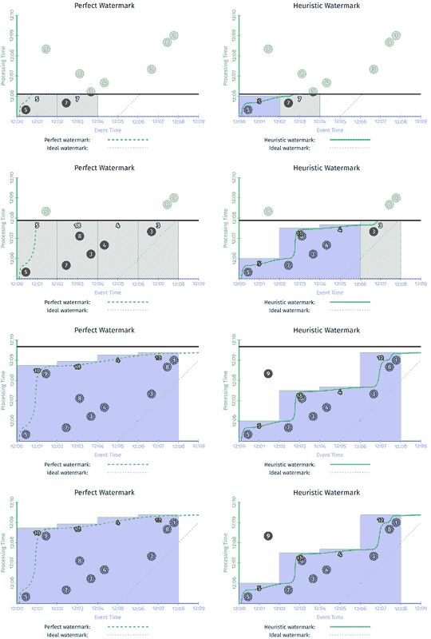

###### 图 3-2。完美（左）和启发式（右）水印的窗口求和

请注意，完美水印的区别特征在于，完美水印确保水印占据了*所有*数据，而启发式水印则允许一些延迟数据元素。

水印一旦被创建为完美或启发式，就会在管道的其余部分保持不变。至于是什么使水印创建完美或启发式，这在很大程度上取决于被消耗的源的性质。为了了解原因，让我们看一些每种类型水印创建的例子。

## 完美水印创建

完美的水印创建为传入消息分配时间戳，以便生成的水印是一个*严格的保证*，即在水印之前的事件时间内不会再次看到来自该源的任何数据。使用完美水印创建的管道永远不必处理延迟数据；也就是说，在水印已经超过新到达消息的事件时间之后到达的数据。然而，完美水印创建需要对输入有完美的了解，因此对于许多真实世界的分布式输入源来说是不切实际的。以下是一些可以创建完美水印的用例示例：

入口时间戳

将入口时间分配为进入系统的数据的事件时间的源可以创建一个完美的水印。在这种情况下，源水印简单地跟踪管道观察到的当前处理时间。这实际上是几乎所有在 2016 年之前支持窗口化的流系统使用的方法。

因为事件时间是从单一的、单调递增的源（实际处理时间）分配的，因此系统对于数据流中下一个时间戳有着完美的了解。因此，事件时间的进展和窗口语义变得更容易推理。当然，缺点是水印与数据本身的事件时间没有关联；这些事件时间实际上被丢弃了，水印只是跟踪数据相对于其在系统中到达的进展。

静态的时间顺序日志集

静态大小的²输入源时间顺序日志（例如，具有静态分区集合的 Apache Kafka 主题，其中源的每个分区包含单调递增的事件时间）将是一个相对简单的源，可以在其上创建一个完美的水印。为此，源将简单地跟踪已知和静态源分区中未处理数据的最小事件时间（即，每个分区中最近读取记录的事件时间的最小值）。

类似于前述的入口时间戳，系统对于下一个时间戳有着完美的了解，这要归功于静态分区集合中的事件时间是单调递增的事实。这实际上是一种有界的乱序处理形式；在已知分区集合中的乱序量由这些分区中观察到的最小事件时间所限制。

通常情况下，你可以保证分区内的时间戳单调递增的唯一方法是在数据写入时为分区内的时间戳分配；例如，通过网络前端直接将事件记录到 Kafka 中。尽管仍然是一个有限的用例，但这绝对比在数据处理系统到达时进行入口时间戳更有用，因为水印跟踪了基础数据的有意义的事件时间。

## 启发式水印创建

启发式水印创建，另一方面，创建的水印仅仅是一个*估计*，即在水印之前的事件时间内不会再次看到任何数据。使用启发式水印创建的管道可能需要处理一定量的*延迟数据*。延迟数据是指在水印已经超过该数据的事件时间之后到达的任何数据。只有启发式水印创建才可能出现延迟数据。如果启发式水印是一个相当好的方法，延迟数据的数量可能会非常小，水印仍然可以作为一个完成估计。系统仍然需要提供一种方式让用户处理延迟数据，如果要支持需要正确性的用例（例如计费等）。

对于许多现实世界的分布式输入源来说，构建完美的水印在计算上或操作上是不切实际的，但通过利用输入数据源的结构特征，仍然可以构建一个非常准确的启发式水印。以下是两个例子，其中可以构建启发式水印（质量不同）：

动态的时间排序日志集

考虑一个动态的结构化日志文件集（每个单独的文件包含记录，其事件时间相对于同一文件中的其他记录是单调递增的，但文件之间的事件时间没有固定的关系），在运行时并不知道预期日志文件的完整集（即 Kafka 术语中的分区）。这种输入通常出现在由多个独立团队构建和管理的全球规模服务中。在这种情况下，创建完美的输入水印是棘手的，但创建准确的启发式水印是完全可能的。

通过跟踪现有日志文件集中未处理数据的最小事件时间、监控增长速率，并利用网络拓扑和带宽可用性等外部信息，即使缺乏对所有输入的完美了解，也可以创建一个非常准确的水印。这种类型的输入源是 Google 发现的最常见的无界数据集之一，因此我们在为这种情况创建和分析水印质量方面有丰富的经验，并已看到它们在许多用例中发挥了良好的效果。

Google Cloud Pub/Sub

Cloud Pub/Sub 是一个有趣的用例。Pub/Sub 目前不保证按顺序传递；即使单个发布者按顺序发布两条消息，也有可能（通常很小的概率）会以无序的方式传递（这是由于底层架构的动态特性，允许在无需用户干预的情况下实现透明的扩展，以实现非常高的吞吐量）。因此，无法保证 Cloud Pub/Sub 的完美水印。然而，Cloud Dataflow 团队利用了有关 Cloud Pub/Sub 数据的可用知识，构建了一个相当准确的启发式水印。本章后面将详细讨论这种启发式的实现作为一个案例研究。

考虑一个例子，用户玩一个手机游戏，他们的分数被发送到我们的流水线进行处理：通常可以假设对于任何利用移动设备进行输入的源，提供完美水印基本上是不可能的。由于设备可能长时间离线，无法提供对这种数据源的绝对完整性的任何合理估计。然而，可以想象构建一个水印，准确跟踪当前在线设备的输入完整性，类似于刚才描述的 Google Pub/Sub 水印。从提供低延迟结果的角度来看，活跃在线的用户很可能是最相关的用户子集，因此这通常并不像你最初想的那样是一个缺点。

通过启发式水印创建，大体上来说，对于源的了解越多，启发式就越好，晚期数据项就会越少。鉴于不同类型的来源、事件分布和使用模式会有很大差异，因此并不存在一种适合所有情况的解决方案。但无论是完美的还是启发式的，一旦在输入源创建了水印，系统就可以完美地将水印传播到整个流水线。这意味着完美水印在下游仍然完美，而启发式水印将保持与建立时一样的启发式。这就是水印方法的好处：您可以将在流水线中跟踪完整性的复杂性完全减少到在源头创建水印的问题上。

# 水印传播

我们可以在管道中的任何单个操作或阶段的边界上定义水印。这不仅有助于理解管道中每个阶段的相对进展，还有助于独立地尽快为每个单独的阶段分发及时结果。我们为阶段边界的水印给出以下定义：

水印是在输入源处创建的，如前一节所讨论的。然后，它们在系统中概念上随着数据的进展而流动。您可以以不同粒度跟踪水印。对于包含多个不同阶段的管道，每个阶段可能会跟踪其自己的水印，其值是所有输入和之前阶段的函数。因此，管道中后面的阶段将具有过去更久的水印（因为它们看到的整体输入更少）。

每个阶段内的处理也不是单一的。我们可以将一个阶段内的处理分成几个概念组件的流，每个组件都有助于输出水印。正如前面提到的，这些组件的确切性质取决于阶段执行的操作和系统的实现。在概念上，每个这样的组件都充当一个缓冲区，其中活动消息可以驻留，直到某些操作完成。例如，数据到达时，它会被缓冲以进行处理。处理可能会将数据写入状态以进行延迟聚合。延迟聚合在触发时可能会将结果写入输出缓冲区，等待下游阶段消费，如图 3-3 所示。

+   *输入水印*捕获了该阶段之前所有内容的进展（即该阶段的输入对于该阶段而言有多完整）。对于源，输入水印是一个特定于源的函数，用于创建输入数据的水印。对于非源阶段，输入水印被定义为其所有上游源和阶段的所有分片/分区/实例的输出水印的最小值。

+   输入和输出水印的定义提供了整个管道中水印的递归关系。管道中的每个后续阶段根据阶段的事件时间滞后来延迟水印。

为特定阶段定义输入和输出水印的一个好处是，我们可以使用这些来计算阶段引入的事件时间延迟量。将阶段的输出水印值减去其输入水印值，得到阶段引入的事件时间延迟或*滞后*量。这种滞后是每个阶段输出相对于实时的延迟程度的概念。例如，执行 10 秒窗口聚合的阶段将具有至少 10 秒的滞后，这意味着阶段的输出至少会比输入和实时延迟这么多。

*输出水印*捕获了阶段本身的进展，基本上定义为阶段的输入水印和阶段内所有非延迟数据活动消息的事件时间的最小值。 “活动”包括的确切内容在某种程度上取决于给定阶段实际执行的操作和流处理系统的实现。它通常包括为聚合而缓冲但尚未在下游实现的数据，正在传输到下游阶段的待处理输出数据等。

到目前为止，我们只考虑了单个操作或阶段上下文中输入的水印。然而，大多数现实世界的管道由多个阶段组成。了解水印如何在独立阶段之间传播对于理解它们如何影响整个管道以及其结果的观察延迟是重要的。

###### 图 3-3。流系统阶段的示例系统组件，包含正在传输的数据的缓冲区。每个缓冲区都将有相关的水印跟踪，阶段的整体输出水印将是所有这些缓冲区的水印的最小值。

我们可以跟踪每个缓冲区及其自己的水印。每个阶段的缓冲区中的水印的最小值形成了该阶段的输出水印。因此，输出水印可以是以下内容的最小值：

+   每个发送阶段都有一个水印。

+   每个外部输入都有一个水印，用于管道外部的来源

+   每种类型的状态组件都有一个水印，可以写入

+   每个接收阶段都有一个输出缓冲区的水印

在这个粒度级别提供水印还可以更好地了解系统的行为。水印跟踪系统中各种缓冲区中消息的位置，从而更容易诊断卡住的情况。

## 理解水印传播

为了更好地了解输入和输出水印之间的关系以及它们如何影响水印传播，让我们来看一个例子。让我们考虑游戏得分，但我们不是计算团队得分的总和，而是试图衡量用户参与水平。我们将首先根据每个用户的会话长度来计算，假设用户与游戏保持参与的时间是他们享受游戏程度的合理代理。在回答我们的四个问题一次以计算会话长度后，我们将再次回答这些问题，以计算固定时间段内的平均会话长度。

为了使我们的例子更有趣，假设我们正在使用两个数据集，一个用于移动得分，一个用于主机得分。我们希望通过整数求和并行计算这两个独立数据集的相同得分。一个管道正在计算使用移动设备玩游戏的用户的得分，而另一个管道是为在家庭游戏主机上玩游戏的用户计算得分，可能是因为为不同平台采用了不同的数据收集策略。重要的是，这两个阶段执行相同的操作，但是针对不同的数据，因此输出水印也会有很大的不同。

首先，让我们看一下示例 3-1，看看这个管道的第一部分的缩写代码可能是什么样子。

##### 示例 3-1。计算会话长度

```java

PCollection<Double> mobileSessions = IO.read(new MobileInputSource())
  .apply(Window.into(Sessions.withGapDuration(Duration.standardMinutes(1)))
               .triggering(AtWatermark())
               .discardingFiredPanes())
  .apply(CalculateWindowLength());

PCollection<Double> consoleSessions = IO.read(new ConsoleInputSource())
  .apply(Window.into(Sessions.withGapDuration(Duration.standardMinutes(1)))
               .triggering(AtWatermark())
               .discardingFiredPanes())
  .apply(CalculateWindowLength());

```

在这里，我们独立读取每个输入，而以前我们是按团队对我们的集合进行分组，但在这个例子中，我们按用户进行分组。之后，对于每个管道的第一个阶段，我们将窗口划分为会话，然后调用一个名为`CalculateWindowLength`的自定义`PTransform`。这个`PTransform`简单地按键（即`User`）进行分组，然后通过将当前窗口的大小视为该窗口的值来计算每个用户的会话长度。在这种情况下，我们对默认触发器（`AtWatermark`）和累积模式（`discardingFiredPanes`）设置没有问题，但出于完整性考虑，我已经明确列出了它们。两个特定用户的每个管道的输出可能看起来像图 3-4。

<assets/stsy_0304.mp4>


###### 图 3-4。两个不同输入管道中的每个用户会话长度

因为我们需要跟踪跨多个阶段的数据，我们在图中用红色跟踪与移动得分相关的所有内容，用蓝色跟踪与主机得分相关的所有内容，而图 3-5 中的水印和输出是黄色的。

我们已经回答了计算个人会话长度的“什么”、“哪里”、“何时”和“如何”的四个问题。接下来我们将再次回答这些问题，将这些会话长度转换为一天内固定时间窗口内的全局会话长度平均值。这要求我们首先将两个数据源展平为一个，然后重新分配到固定窗口；我们已经捕捉到了我们计算的会话长度值的重要本质，现在我们想要在一天内的一致时间窗口内计算这些会话的全局平均值。示例 3-2 展示了这个代码。

##### 示例 3-2。计算会话长度

```java

PCollection<Double> mobileSessions = IO.read(new MobileInputSource())
  .apply(Window.into(Sessions.withGapDuration(Duration.standardMinutes(1)))
               .triggering(AtWatermark())
               .discardingFiredPanes())
  .apply(CalculateWindowLength());

PCollection<Double> consoleSessions = IO.read(new ConsoleInputSource())
  .apply(Window.into(Sessions.withGapDuration(Duration.standardMinutes(1)))
               .triggering(AtWatermark())
               .discardingFiredPanes())
  .apply(CalculateWindowLength());

PCollection<Float> averageSessionLengths = PCollectionList
  .of(mobileSessions).and(consoleSessions)
  .apply(Flatten.pCollections())
  .apply(Window.into(FixedWindows.of(Duration.standardMinutes(2)))
               .triggering(AtWatermark())
  .apply(Mean.globally());

```

如果我们看到这个管道在运行，它会看起来像图 3-5。与以前一样，两个输入管道正在计算移动和控制台玩家的个人会话长度。然后这些会话长度进入管道的第二阶段，在那里在固定窗口中计算全局会话长度平均值。

<assets/stsy_0305.mp4>

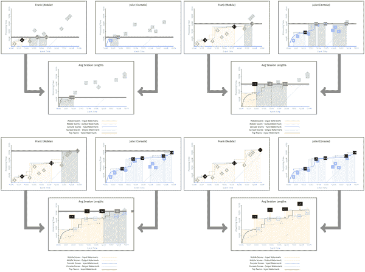

###### 图 3-5。移动和控制台游戏会话的平均会话长度

让我们仔细研究一些例子，因为这里有很多事情要做。这里的两个重要点是：

+   移动会话和控制台会话阶段的输出水印至少与每个对应的输入水印一样旧，实际上可能稍微更旧一些。这是因为在真实系统中，计算答案需要时间，我们不允许输出水印在给定输入的处理完成之前提前。

+   平均会话长度阶段的输入水印是直接上游两个阶段的输出水印的最小值。

结果是下游输入水印是上游输出水印的最小组合的别名。请注意，这与本章前面对这两种水印类型的定义相匹配。还要注意，下游的水印会更早一些，捕捉到上游阶段在时间上领先于其后续阶段的直观概念。

这里值得注意的一点是，我们在示例 3-1 中再次提出问题，从而大幅改变了管道的结果。以前我们只是计算每个用户的会话长度，现在我们计算两分钟的全局会话长度平均值。这提供了对玩家行为的更深入了解，并让你略微窥见简单数据转换和真正数据科学之间的差异。

更好的是，现在我们了解了这个管道运作的基本原理，我们可以更仔细地看待与再次提出四个问题相关的一个更微妙的问题：输出时间戳。

## 水印传播和输出时间戳

在图 3-5 中，我忽略了一些输出时间戳的细节。但是如果你仔细看图中的第二阶段，你会发现第一阶段的每个输出都被分配了一个与其窗口结束时间相匹配的时间戳。尽管这是一个相当自然的输出时间戳选择，但并不是唯一有效的选择。然而，在实践中，大多数情况下只有几种选择是有意义的：

窗口结束⁴

如果您希望输出时间戳代表窗口边界，那么使用窗口的结束是唯一安全的选择。正如我们将在一会儿看到的，这也是所有选项中水印进展最顺畅的选择。

第一个非延迟元素的时间戳

当您希望尽可能保守地保持水印时，使用第一个非延迟元素的时间戳是一个不错的选择。然而，折衷之处在于水印的进展可能会受到更大的阻碍，我们很快也会看到。

特定元素的时间戳

对于某些用例，某些其他任意（从系统角度看）元素的时间戳是正确的选择。想象一种情况，您正在将查询流与该查询结果的点击流进行连接。在执行连接后，某些系统会发现查询的时间戳更有用；其他人会更喜欢点击的时间戳。只要它对应于未延迟到达的元素，任何这样的时间戳都是从水印正确性的角度来看是有效的。

在考虑一些替代的输出时间戳选项后，让我们看看输出时间戳选择对整个流水线的影响。为了使变化尽可能显著，在示例 3-3 和图 3-6 中，我们将切换到使用窗口的最早时间戳：第一个非延迟元素的时间戳作为窗口的时间戳。

##### 示例 3-3。会话窗口输出时间戳设置为最早元素的平均会话长度流水线

```java

PCollection<Double> mobileSessions = IO.read(new MobileInputSource())
  .apply(Window.into(Sessions.withGapDuration(Duration.standardMinutes(1)))
               .triggering(AtWatermark())
               .withTimestampCombiner(EARLIEST)
               .discardingFiredPanes())
  .apply(CalculateWindowLength());

PCollection<Double> consoleSessions = IO.read(new ConsoleInputSource())
  .apply(Window.into(Sessions.withGapDuration(Duration.standardMinutes(1)))
               .triggering(AtWatermark())
               .withTimestampCombiner(EARLIEST)
               .discardingFiredPanes())
  .apply(CalculateWindowLength());

PCollection<Float> averageSessionLengths = PCollectionList
  .of(mobileSessions).and(consoleSessions)
  .apply(Flatten.pCollections())
  .apply(Window.into(FixedWindows.of(Duration.standardMinutes(2)))
               .triggering(AtWatermark())
  .apply(Mean.globally());

```

<assets/stsy_0306.mp4>

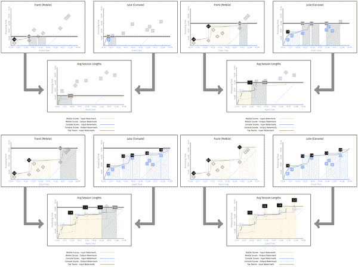

###### 图 3-6。在最早元素的时间戳输出的会话长度的平均值

为了突出输出时间戳选择的影响，请看第一阶段虚线显示的每个阶段输出水印被保持的情况。与图 3-7 和 3-8 相比，输出水印由于我们选择的时间戳而延迟，而在图 3-7 和 3-8 中，输出时间戳被选择为窗口的结束。从这个图表中可以看出，第二阶段的输入水印也因此被延迟。

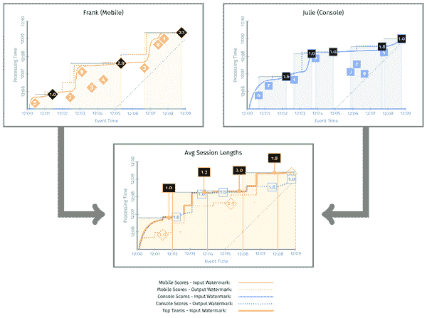

###### 图 3-7。不同窗口输出时间戳选择的水印和结果的比较。此图中的水印对应于会话窗口的结束时间戳（即图 3-5）。

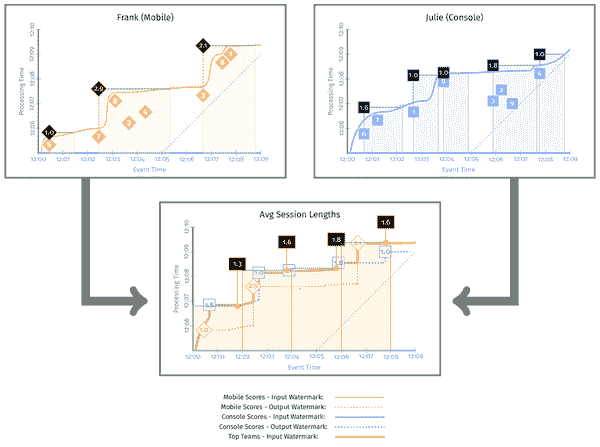

###### 图 3-8。在这个图中，水印位于会话窗口的开始位置（即图 3-6）。我们可以看到这个图中的水印线更加延迟，导致平均会话长度也不同。

与图 3-7 相比，这个版本的差异有两点值得注意：

水印延迟

与图 3-5 相比，图 3-6 中的水印进展要慢得多。这是因为第一阶段的输出水印被保持到每个窗口的第一个元素的时间戳，直到该窗口的输入变得完整为止。只有在给定窗口被实现后，输出水印（因此下游输入水印）才被允许前进。

语义差异

因为会话时间戳现在被分配为与会话中最早的非延迟元素相匹配，所以当我们在下一个阶段计算会话长度平均值时，个别会话通常会落入不同的固定窗口桶中。迄今为止，我们所看到的两种选择都没有固有的对错之分；它们只是不同而已。但重要的是要理解它们将是不同的，以及它们将以何种方式不同，这样当时机到来时，您就可以为您的特定用例做出正确的选择。

## 重叠窗口的棘手情况

关于输出时间戳的另一个微妙但重要的问题是如何处理滑动窗口。将输出时间戳设置为最早元素的朴素方法很容易导致下游由于水印被（正确地）阻止而出现延迟。为了理解原因，考虑一个具有两个阶段的示例管道，每个阶段都使用相同类型的滑动窗口。假设每个元素最终出现在三个连续的窗口中。随着输入水印的推进，这种情况下滑动窗口的期望语义如下：

+   第一个窗口在第一个阶段完成并向下游发出。

+   然后第一个窗口在第二阶段完成并且也可以向下游发出。

+   一段时间后，第二个窗口在第一个阶段完成...等等。

然而，如果选择输出时间戳为窗格中第一个非延迟元素的时间戳，实际发生的是：

+   第一个窗口在第一个阶段完成并向下游发出。

+   第二阶段的第一个窗口仍然无法完成，因为其输入水印被上游第二和第三个窗口的输出水印阻止。这些水印被正确地阻止，因为最早的元素时间戳被用作这些窗口的输出时间戳。

+   第二个窗口在第一个阶段完成并向下游发出。

+   第二阶段的第一个和第二个窗口仍然无法完成，被上游的第三个窗口阻塞。

+   第三个窗口在第一个阶段完成并向下游发出。

+   第二阶段的第一个、第二个和第三个窗口现在都能够完成，最终一次性发出所有三个窗口。

尽管这种窗口的结果是正确的，但这导致结果以不必要的延迟方式实现。因此，Beam 对重叠窗口有特殊逻辑，确保窗口*N*+1 的输出时间戳始终大于窗口*N*的结束时间。

# 百分位水印

到目前为止，我们关注的是水印，即在一个阶段中活动消息的最小事件时间所测量的。跟踪最小值允许系统知道何时已经考虑了所有更早的时间戳。另一方面，我们可以考虑活动消息的事件时间的整个分布，并利用它来创建更精细的触发条件。

与其考虑分布的最小点，我们可以取分布的任何百分位，并说我们保证已处理了这个百分比的所有具有更早时间戳的事件。⁵

这种方案的优势是什么？如果对于业务逻辑来说，“大多数情况下”正确就足够了，百分位水印提供了一种机制，使水印可以比跟踪最小事件时间更快、更平滑地前进，通过从水印中丢弃分布长尾中的异常值。图 3-9 显示了一个紧凑的事件时间分布，其中 90%百分位水印接近于 100%百分位。图 3-10 展示了一个异常值落后的情况，因此 90%百分位水印明显领先于 100%百分位。通过从水印中丢弃异常值数据，百分位水印仍然可以跟踪分布的大部分，而不会被异常值延迟。

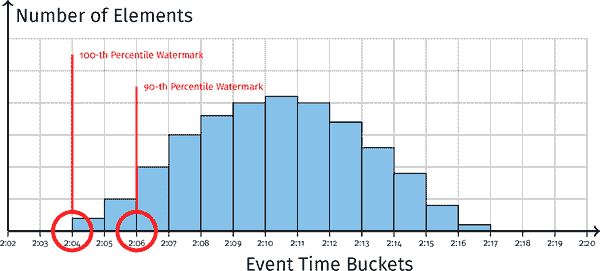

###### 图 3-9。看起来正常的水印直方图

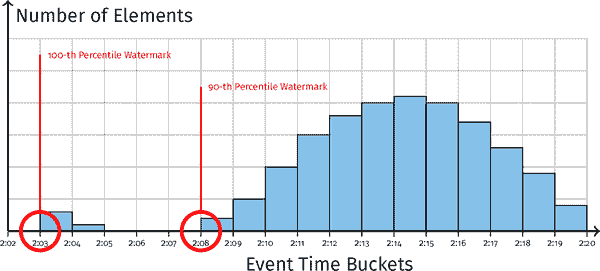

###### 图 3-10。带有异常值的水印直方图

图 3-11 显示了使用百分位水印来绘制两分钟固定窗口的窗口边界的示例。我们可以根据已到达数据的时间戳的百分位来绘制早期边界，由百分位水印跟踪。

<assets/stsy_0310.mp4>

水印百分位数变化的影响。随着百分位数的增加，窗口中包含的事件也会增加：然而，实现窗口的处理时间延迟也会增加。

###### 图 3-11。水印百分位数变化的影响。随着百分位数的增加，窗口中包含的事件也会增加：然而，实现窗口的处理时间延迟也会增加。

图 3-11 显示了 33%百分位数、66%百分位数和 100%百分位数（完整）水印，跟踪数据分布中相应的时间戳百分位数。如预期的那样，这些允许边界比跟踪完整的 100%百分位数水印更早地绘制。请注意，33%和 66%百分位数水印分别允许更早地触发窗口，但以标记更多数据为延迟为代价。例如，对于第一个窗口，12:00, 12:02)，基于 33%百分位数水印关闭的窗口将只包括四个事件，并在 12:06 处理时间时实现结果。如果使用 66%百分位数水印，相同的事件时间窗口将包括七个事件，并在 12:07 处理时间时实现。使用 100%百分位数水印将包括所有十个事件，并延迟到 12:08 处理时间时才实现结果。因此，百分位数水印提供了一种调整结果实现的延迟和精度之间的权衡的方法。

# 处理时间水印

到目前为止，我们一直在研究水印与流经我们系统的数据的关系。我们已经看到，观察水印如何帮助我们识别最旧数据和实时之间的总延迟。然而，这还不足以区分旧数据和延迟系统。换句话说，仅仅通过检查我们到目前为止定义的事件时间水印，我们无法区分一个快速处理一小时前数据而没有延迟的系统，和一个试图处理实时数据并在这样做时延迟了一个小时的系统。

为了做出这种区别，我们需要更多的东西：处理时间水印。我们已经看到流处理系统中有两个时间域：处理时间和事件时间。到目前为止，我们已经完全在事件时间域中定义了水印，作为系统中流动数据的时间戳的函数。这是一个事件时间水印。现在我们将应用相同的模型到处理时间域，以定义一个处理时间水印。

我们的流处理系统不断执行操作，例如在阶段之间传递消息、读取或写入持久状态的消息，或者根据水印进度触发延迟聚合。所有这些操作都是响应于当前或上游阶段的先前操作而执行的。因此，就像数据元素“流”经系统一样，处理这些元素所涉及的一系列操作也“流”经系统。

我们以与我们定义事件时间水印完全相同的方式定义处理时间水印，只是不是使用最早未完成的工作的事件时间戳，而是使用最早未完成的操作的处理时间戳。处理时间水印的延迟示例可能是从一个阶段到另一个阶段的消息传递卡住，读取状态或外部数据的 I/O 调用卡住，或者在处理过程中发生异常导致处理无法完成。

因此，处理时间水印提供了一个与数据延迟分开的处理延迟概念。为了理解这种区别的价值，考虑图 3-12 中的图表，我们看一下事件时间水印延迟。

我们看到数据延迟是单调递增的，但没有足够的信息来区分系统卡住和数据卡住的情况。只有通过查看图 3-13 中显示的处理时间水印，我们才能区分这些情况。

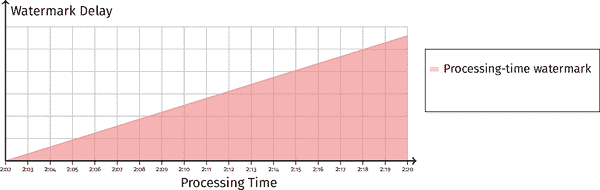

###### 图 3-13。处理时间水印也在增加。这表明系统处理被延迟了。

在第一种情况（图 3-12）中，当我们检查处理时间水印延迟时，我们看到它也在增加。这告诉我们系统中的一个操作卡住了，并且这种卡住也导致数据延迟落后。在现实世界中，可能发生这种情况的一些例子是网络问题阻止了管道各阶段之间的消息传递，或者发生了故障并且正在重试。通常，增长的处理时间水印表明存在一个问题，阻止了对系统功能必要的操作的完成，并且通常需要用户或管理员干预来解决。

在第二种情况中，如图 3-14 所示，处理时间水印延迟很小。这告诉我们没有卡住的操作。事件时间水印延迟仍在增加，这表明我们有一些缓冲状态正在等待排放。例如，如果我们在等待窗口边界发出聚合时缓冲了一些状态，这是可能的，并且对应于管道的正常操作，如图 3-15 所示。

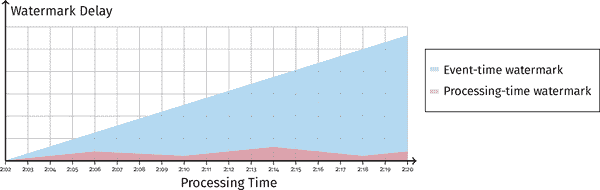

###### 图 3-14。事件时间水印延迟增加，处理时间水印稳定。这表明数据在系统中被缓冲并等待处理，而不是系统操作阻止数据处理完成的迹象。

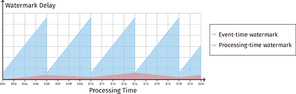

###### 图 3-15。固定窗口的水印延迟。随着每个窗口的元素被缓冲，事件时间水印延迟增加，并且随着每个窗口的聚合通过及时触发器发出，而处理时间水印只是跟踪系统级别的延迟（在健康的管道中保持相对稳定）。

因此，处理时间水印是一个有用的工具，可以区分系统延迟和数据延迟。除了可见性之外，我们还可以在系统实现级别使用处理时间水印，用于诸如临时状态的垃圾收集等任务（Reuven 在第五章中更多地讨论了一个例子）。

# 案例研究

现在我们已经为水印应该如何行为奠定了基础，是时候看一看一些真实系统，了解水印的不同机制是如何实现的了。我们希望这些能够揭示在现实世界系统中延迟和正确性以及可扩展性和可用性之间可能存在的权衡。

## 案例研究：Google Cloud Dataflow 中的水印

在流处理系统中，有许多可能的实现水印的方法。在这里，我们简要介绍了 Google Cloud Dataflow 中的实现，这是一个用于执行 Apache Beam 管道的完全托管的服务。Dataflow 包括用于定义数据处理工作流程的 SDK，以及在 Google Cloud Platform 资源上运行这些工作流程的 Cloud Platform 托管服务。

Dataflow 通过将每个数据处理步骤的数据处理图分布到多个物理工作器上，通过将每个工作器的可用键空间分割成键范围，并将每个范围分配给一个工作器来进行条纹化（分片）。每当遇到具有不同键的`GroupByKey`操作时，数据必须被洗牌到相应的键上。

图 3-16 描述了带有`GroupByKey`的处理图的逻辑表示。

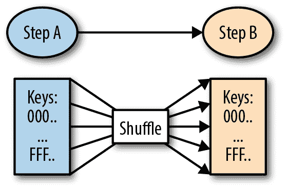

###### 图 3-16。GroupByKey 步骤从另一个 DoFn 中消耗数据。这意味着第一步的键和第二步的键之间存在数据洗牌。

图 3-17 显示了将键范围分配给工作节点的物理分配。

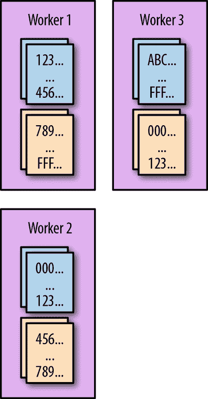

###### 图 3-17。两个步骤的键范围（条纹）分配给可用的工作节点。

在水印传播部分，我们讨论了水印是如何为每个步骤的多个子组件维护的。Dataflow 跟踪每个组件的每个范围水印。然后，水印聚合涉及计算所有范围的每个水印的最小值，确保满足以下保证：

+   所有范围都必须报告水印。如果某个范围没有水印，则我们无法提前水印，因为未报告的范围必须被视为未知。

+   确保水印单调递增。由于可能存在延迟数据，如果更新水印会导致水印后退，我们就不能更新水印。

Google Cloud Dataflow 通过集中式聚合代理执行聚合。我们可以对此代理进行分片以提高效率。从正确性的角度来看，水印聚合器充当了水印的“唯一真相来源”。

在分布式水印聚合中确保正确性会带来一定的挑战。至关重要的是，水印不会过早提前，因为过早提前水印会将准时数据变成延迟数据。具体来说，当物理分配被激活到工作节点时，工作节点会对与键范围相关的持久状态维护租约，确保只有一个工作节点可以对键的持久状态进行变更。为了保证水印的正确性，我们必须确保来自工作进程的每个水印更新只有在工作进程仍然维护其持久状态的租约时才被纳入聚合；因此，水印更新协议必须考虑状态所有权租约验证。

## 案例研究：Apache Flink 中的水印

Apache Flink 是一个开源的流处理框架，用于分布式、高性能、始终可用和准确的数据流应用程序。可以使用 Flink 运行 Beam 程序。在这样做时，Beam 依赖于 Flink 内部的水印等流处理概念的实现。与 Google Cloud Dataflow 不同，后者通过集中式水印聚合器代理执行水印聚合，Flink 在内部执行水印跟踪和聚合。

要了解这是如何工作的，让我们看一下 Flink 管道，如图 3-18 所示。

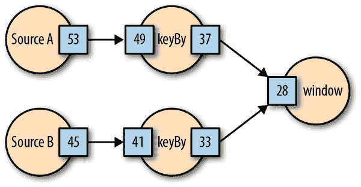

###### 图 3-18。一个 Flink 管道，其中有两个源和内部传播的事件时间水印

在这个管道中，数据在两个源处生成。这些源也都生成与数据流同步发送的水印“检查点”。这意味着当源 A 发出时间戳“53”的水印检查点时，它保证不会从源 A 发出时间戳在“53”之前的非延迟数据消息。下游的“keyBy”操作符消耗输入数据和水印检查点。随着新的水印检查点被消耗，下游操作符对水印的视图会被提前，并且可以为下游操作符发出新的水印检查点。

将水印检查点与数据流一起发送的选择与 Cloud Dataflow 方法不同，后者依赖于中央聚合，并导致一些有趣的权衡。

以下是内部水印的一些优势：

减少水印传播延迟，非常低延迟的水印

由于不需要水印数据在多个跳跃中传播并等待中央聚合，因此使用内部方法更容易实现非常低延迟。

水印聚合没有单点故障

中央水印聚合代理的不可用将导致整个管道中的水印延迟。采用带内方法，管道的部分不可用不能导致整个管道的水印延迟。

固有的可扩展性

尽管 Cloud Dataflow 在实践中具有良好的扩展性，但与带内水印的隐式可扩展性相比，实现具有集中式水印聚合服务的可扩展性需要更多的复杂性。

以下是带外水印聚合的一些优势：

“真相”的单一来源

对于调试、监控和其他应用（例如基于管道进度对输入进行限流），有一个可以提供水印值的服务是有利的，而不是在流中隐含水印，系统的每个组件都有自己的部分视图。

源水印创建

一些源水印需要全局信息。例如，源可能暂时空闲，数据速率低，或需要有关源或其他系统组件的带外信息来生成水印。这在中央服务中更容易实现。例如，查看接下来关于 Google Cloud Pub/Sub 源水印的案例研究。

## 案例研究：Google Cloud Pub/Sub 的源水印

Google Cloud Pub/Sub 是一个完全托管的实时消息传递服务，允许您在独立应用程序之间发送和接收消息。在这里，我们讨论如何为通过 Cloud Pub/Sub 发送到管道的数据创建一个合理的启发式水印。

首先，我们需要描述一下 Pub/Sub 的工作原理。消息发布在 Pub/Sub 的*主题*上。任何数量的 Pub/Sub *订阅*都可以订阅特定主题。相同的消息会传递到订阅给定主题的所有订阅。客户端通过*拉取*订阅中的消息，并通过提供的 ID 确认接收特定消息。客户端无法选择拉取哪些消息，尽管 Pub/Sub 会尝试首先提供最旧的消息，但没有硬性保证。

为了建立一个启发式方法，我们对将数据发送到 Pub/Sub 的源进行了一些假设。具体来说，我们假设原始数据的时间戳是“良好的”；换句话说，我们期望在将数据发送到 Pub/Sub 之前，源数据的时间戳存在有限的无序量。任何发送的数据，其时间戳超出允许的无序范围，将被视为延迟数据。在我们当前的实现中，这个范围至少为 10 秒，这意味着在发送到 Pub/Sub 之前，时间戳最多可以重新排序 10 秒，不会产生延迟数据。我们称这个值为*估计带宽*。另一种看待这个问题的方式是，当管道完全赶上输入时，水印将比实时晚 10 秒，以便允许源可能的重新排序。如果管道积压，所有积压（不仅仅是 10 秒的范围）都用于估计水印。

我们在使用 Pub/Sub 时面临哪些挑战？因为 Pub/Sub 不能保证排序，我们必须有某种额外的元数据来了解积压情况。幸运的是，Pub/Sub 提供了“最旧的未确认发布时间戳”的积压度量。这与我们消息的事件时间戳不同，因为 Pub/Sub 对通过它发送的应用级元数据是不可知的；相反，这是消息被 Pub/Sub 摄取的时间戳。

这个度量不同于事件时间水印。实际上，这是 Pub/Sub 消息传递的处理时间水印。Pub/Sub 发布时间戳不等于事件时间戳，如果发送了历史（过去）数据，可能会相差很远。这些时间戳的排序也可能不同，因为正如前面提到的，我们允许有限的重排序。

然而，我们可以将其用作积压的度量，以了解有关积压中存在的事件时间戳的足够信息，以便我们可以创建一个合理的水印，如下所示。

我们创建了两个订阅来订阅包含输入消息的主题：一个*基本订阅*，管道实际上将用它来读取要处理的数据，以及一个*跟踪订阅*，仅用于元数据，用于执行水印估计。

看一下我们在图 3-19 中的基本订阅，我们可以看到消息可能是无序到达的。我们用 Pub/Sub 发布时间戳“pt”和事件时间时间戳“et”标记每条消息。请注意，这两个时间域可能是无关的。

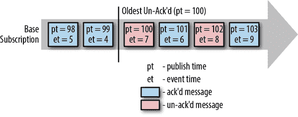

###### 图 3-19。Pub/Sub 订阅上到达的消息的处理时间和事件时间时间戳

基本订阅上的一些消息是未确认的，形成了积压。这可能是因为它们尚未被传递，或者它们可能已经被传递但尚未被处理。还要记住，从此订阅中拉取的操作是分布在多个分片上的。因此，仅仅通过查看基本订阅，我们无法确定我们的水印应该是什么。

跟踪订阅，如图 3-20 所示，用于有效地检查基本订阅的积压，并获取积压中事件时间戳的最小值。通过在跟踪订阅上保持很少或没有积压，我们可以检查基本订阅最旧的未确认消息之前的消息。

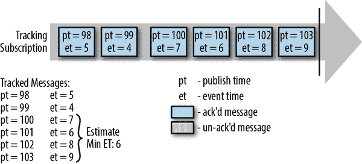

###### 图 3-20。一个额外的“跟踪”订阅接收与“基本”订阅相同的消息

我们通过确保从此订阅中拉取是计算上廉价的来保持跟踪订阅。相反，如果我们在跟踪订阅上落后得足够多，我们将停止推进水印。为此，我们确保满足以下条件之一：

+   跟踪订阅足够超前于基本订阅。足够超前意味着跟踪订阅至少超前于估计带宽。这确保了估计带宽内的任何有界重排序都会被考虑在内。

+   跟踪订阅与实时足够接近。换句话说，跟踪订阅上没有积压。

我们尽快在跟踪订阅上确认消息，在我们已经持久保存了消息的发布和事件时间戳的元数据之后。我们以稀疏直方图格式存储这些元数据，以最小化使用的空间和持久写入的大小。

最后，我们确保有足够的数据来进行合理的水印估计。我们从我们的跟踪订阅中读取的事件时间戳中取一个带宽，其发布时间戳比基本订阅的最旧未确认消息要新，或者等于估计带宽的宽度。这确保我们考虑了积压中的所有事件时间戳，或者如果积压很小，那么就是最近的估计带宽，以进行水印估计。

最后，水印值被计算为带宽中的最小事件时间。

这种方法在某种意义上是正确的，即在输入的重新排序限制内的所有时间戳都将被水印考虑在内，并且不会出现作为延迟数据。然而，它可能会产生一个过于保守的水印，即在第二章中描述的“进展过慢”。因为我们考虑了跟踪订阅上基本订阅最旧的未确认消息之前的所有消息的事件时间戳，所以我们可以将已经被确认的消息的事件时间戳包括在水印估计中。

此外，还有一些启发式方法来确保进展。这种方法在密集、频繁到达的数据情况下效果很好。在稀疏或不经常到达的数据情况下，可能没有足够的最近消息来建立合理的估计。如果我们在订阅中超过两分钟没有看到数据（而且没有积压），我们将将水印提前到接近实时。这确保了水印和管道即使没有更多消息也能继续取得进展。

以上所有内容确保只要源数据事件时间戳重新排序在估计范围内，就不会有额外的延迟数据。

# 总结

在这一点上，我们已经探讨了如何利用消息的事件时间来给出流处理系统中进展的稳健定义。我们看到这种进展的概念随后如何帮助我们回答在事件时间处理中发生的位置和在处理时间中结果何时实现的问题。具体来说，我们看了水印是如何在源头创建的，即数据进入管道的地方，然后在整个管道中传播，以保留允许回答“在哪里”和“何时”的基本保证。我们还研究了更改输出窗口时间戳对水印的影响。最后，我们探讨了在构建大规模水印时的一些现实系统考虑因素。

现在我们对水印在幕后的工作有了牢固的基础，我们可以深入探讨它们在我们使用窗口和触发器来回答第四章中更复杂的查询时可以为我们做些什么。

¹ 请注意单调性的额外提及；我们还没有讨论如何实现这一点。事实上，到目前为止的讨论并未提及单调性。如果我们只考虑最旧的在途事件时间，水印不会总是单调的，因为我们对输入没有做任何假设。我们稍后会回到这个讨论。

² 要准确，不是日志的数量需要是静态的，而是系统需要事先知道任何给定时间点的日志数量。一个更复杂的输入源，由动态选择的输入日志组成，比如[Pravega](http://pravega.io)，同样可以用于构建完美的水印。只有当动态集合中存在的日志数量在任何给定时间点是未知的（就像下一节中的示例一样），才必须依赖启发式水印。

³ 请注意，通过说“流经系统”，我并不一定意味着它们沿着与正常数据相同的路径流动。它们可能会（就像 Apache Flink 一样），但它们也可能会以带外的方式传输（就像 MillWheel/Cloud Dataflow 一样）。

⁴ 窗口的“开始”并不是从水印正确性的角度来看一个安全的选择，因为窗口中的第一个元素通常在窗口开始之后出现，这意味着水印不能保证被拖延到窗口的开始。

⁵ 这里描述的百分位水印触发方案目前尚未由 Beam 实现；然而，其他系统如 MillWheel 实现了这一点。

⁶ 有关 Flink 水印的更多信息，请参阅[有关此主题的 Flink 文档。](https://ci.apache.org/projects/flink/flink-docs-release-1.3/dev/event_time.html)
