# 第四章：高级窗口

你好！希望你和我一样喜欢第三章。水印是一个迷人的话题，Slava 比地球上任何人都更了解它们。现在我们对水印有了更深入的了解，我想深入一些与*什么*、*在哪里*、*何时*和*如何*相关的高级主题。

我们首先看一下*处理时间窗口*，这是一个更好地理解*何时*和*在哪里*的有趣混合，以更好地了解它与事件时间窗口的关系，并了解什么时候它实际上是正确的方法。然后我们深入一些高级事件时间窗口的概念，详细了解*会话窗口*，最后提出为什么广义的*自定义窗口*是一个有用（并且令人惊讶地简单）的概念，通过探索三种不同类型的自定义窗口：*不对齐*固定窗口、*按键*固定窗口和*有界*会话窗口。

# *何时*/*在哪里*：处理时间窗口

处理时间窗口的重要性有两个原因：

+   对于某些用例，比如使用监控（例如，Web 服务流量 QPS），你希望分析观察到的一系列数据流时，处理时间窗口绝对是适当的方法。

+   对于事件发生时间很重要的用例（例如，分析用户行为趋势、计费、评分等），处理时间窗口绝对不是正确的方法，能够识别这些情况至关重要。

因此，值得深入了解处理时间窗口和事件时间窗口之间的区别，特别是考虑到今天许多流系统中处理时间窗口的普遍性。

在一个模型中，窗口作为一个一流的概念严格基于事件时间，比如本书中介绍的模型，有两种方法可以实现处理时间窗口：

触发器

忽略事件时间（即使用跨越整个事件时间的全局窗口）并使用触发器在处理时间轴上提供该窗口的快照。

进入时间

将进入时间分配为数据的事件时间，并从那时开始使用正常的事件时间窗口。这基本上就是 Spark Streaming 1.x 之类的东西所做的。

请注意，这两种方法或多或少是等效的，尽管在多阶段管道的情况下略有不同：在触发器版本中，多阶段管道将在每个阶段独立地切割处理时间的“窗口”，因此，例如，一个阶段的窗口*N*中的数据可能最终会出现在下一个阶段的窗口*N*-1 或*N*+1 中；在进入时间版本中，一旦数据被合并到窗口*N*中，由于通过水印（在 Cloud Dataflow 情况下）、微批次边界（在 Spark Streaming 情况下）或其他引擎级别的协调因素的进度同步，它将在整个管道的持续时间内保持在窗口*N*中。

正如我一再指出的那样，处理时间窗口的一个很大的缺点是，当输入的观察顺序改变时，窗口的内容也会改变。为了更具体地强调这一点，我们将看看这三种用例：*事件时间*窗口、通过触发器的*处理时间*窗口和通过进入时间的*处理时间*窗口。

每个将应用于两组不同的输入（因此总共有六种变化）。这两组输入将是完全相同的事件（即相同的值，在相同的事件时间发生），但观察顺序不同。第一组将是我们一直看到的观察顺序，标为白色；第二组将使所有值在处理时间轴上移动，如图 4-1 中的紫色。您可以简单地想象，紫色示例是现实可能发生的另一种方式，如果风从东方吹来而不是从西方（即，复杂分布式系统的基础集合以稍有不同的顺序进行了一些操作）。

<assets/stsy_0401.mp4>

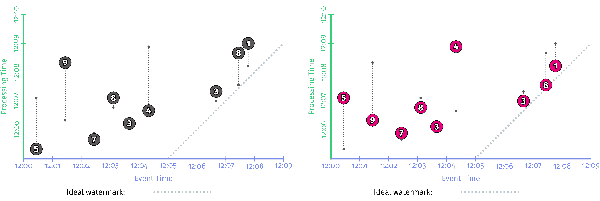

###### 图 4-1。在处理时间中移动输入观察顺序，保持值和事件时间不变

## 事件时间窗口化

为了建立一个基准，让我们首先比较事件时间的固定窗口化和这两个观察顺序上的启发式水印。我们将重用示例 2-7/图 2-10 中的早期/晚期代码，以获得图 4-2 中显示的结果。左侧基本上是我们之前看到的；右侧是第二个观察顺序的结果。这里需要注意的重要一点是，尽管输出的整体形状不同（由于处理时间中观察的不同顺序），*但四个窗口的最终结果保持不变*：14、18、3 和 12。

<assets/stsy_0402.mp4>

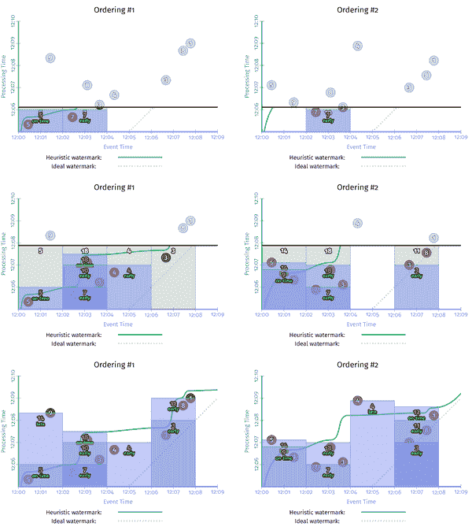

###### 图 4-2。在相同输入的两种不同处理时间排序上进行事件时间窗格化

## 通过触发器进行处理时间窗口化

现在让我们将其与刚刚描述的两种处理时间方法进行比较。首先，我们将尝试触发器方法。在以这种方式使处理时间“窗口化”方面有三个方面：

窗口化

我们使用全局事件时间窗口，因为我们实质上是用事件时间窗格模拟处理时间窗口。

触发

我们根据所需的处理时间窗口大小在处理时间域定期触发。

累积

我们使用丢弃模式使窗格彼此独立，从而让它们每个都像一个独立的处理时间“窗口”。

相应的代码看起来有点像示例 4-1；请注意，全局窗口是 Beam 中的默认设置，因此没有特定的窗口策略覆盖。

##### 示例 4-1。通过重复丢弃全局事件时间窗格进行处理时间窗格

```java

PCollection<KV<Team, Integer>> totals = input
  .apply(Window.triggering(Repeatedly(AlignedDelay(ONE_MINUTE)))
               .discardingFiredPanes())
  .apply(Sum.integersPerKey());

```

在流式运行器上执行针对输入数据的两种不同排序时，结果如图 4-3 所示。关于这张图有一些有趣的注释：

+   因为我们是通过事件时间窗格模拟处理时间窗口，所以“窗口”在处理时间轴上被界定，这意味着它们的有效宽度是在 y 轴上测量而不是 x 轴上。

+   因为处理时间窗口化对输入数据遇到的顺序敏感，每个“窗口”的结果对于两种观察顺序中的每一个都不同，尽管在每个版本中事件本身在技术上是在相同的时间发生的。在左侧，我们得到 12、18、18，而在右侧，我们得到 7、36、5。

<assets/stsy_0403.mp4>

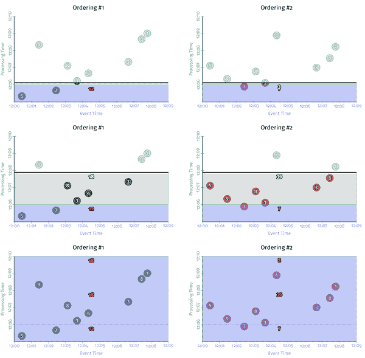

###### 图 4-3。通过触发器进行处理时间“窗口化”，在相同输入的两种不同处理时间排序上

## 通过处理时间窗口化

最后，让我们看看通过将输入数据的事件时间映射为其进入时间来实现的处理时间窗口化。在代码上，这里有四个值得一提的方面：

时间移位

当元素到达时，它们的事件时间需要被覆盖为到达时间。我们可以通过提供一个新的`DoFn`来在 Beam 中执行此操作，该函数通过`outputWithTimestamp`方法将元素的时间戳设置为当前时间。

窗口化

返回使用标准事件时间固定窗口。

触发

因为使用进入时间可以计算出完美的水印，所以我们可以使用默认触发器，在这种情况下，当水印通过窗口的结束时，触发器会隐式触发一次。

累积模式

因为每个窗口只有一个输出，所以累积模式是无关紧要的。

因此，实际代码可能看起来像示例 4-2 中的样子。

##### 示例 4-2。通过重复丢弃全局事件时间窗格的处理时间窗口化

```java

PCollection<String> raw = IO.read().apply(ParDo.of(
  new DoFn<String, String>() {
    public void processElement(ProcessContext c) {
      c.outputWithTimestmap(new Instant());
    }
  });
PCollection<KV<Team, Integer>> input =
  raw.apply(ParDo.of(new ParseFn());
PCollection<KV<Team, Integer>> totals = input
  .apply(Window.info(FixedWindows.of(TWO_MINUTES))
  .apply(Sum.integersPerKey());

```

在流引擎上执行的情况如图 4-4 所示。随着数据的到达，它们的事件时间被更新以匹配它们的进入时间（即到达时的处理时间），导致向右水平移动到理想的水印线上。关于这张图有一些有趣的注释：

+   与其他处理时间窗口化示例一样，当输入的排序发生变化时，我们会得到不同的结果，尽管输入的值和事件时间保持不变。

+   与另一个示例不同，窗口再次在事件时间域（因此沿着 x 轴）中划定。尽管如此，它们并不是真正的事件时间窗口；我们只是将处理时间映射到事件时间域，擦除了每个输入的原始发生记录，并用一个新的记录替换它，该记录代表了管道首次观察到数据的时间。

+   尽管如此，由于水印的存在，触发器的触发仍然与前一个处理时间示例中的时间完全相同。此外，产生的输出值与该示例中的输出值相同，如预期的那样：左侧为 12、18、18，右侧为 7、36、5。

+   因为使用进入时间时可以实现完美的水印，所以实际水印与理想水印匹配，向上向右倾斜。

<资产/stsy_0404.mp4>

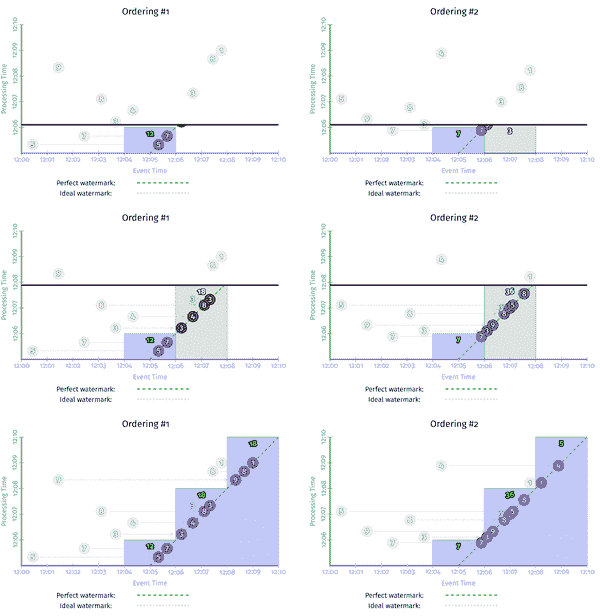

###### 图 4-4。通过使用进入时间进行处理时间窗口化，对相同输入的两种不同处理时间排序

虽然看到不同的实现处理时间窗口的方式很有趣，但这里的重点是我从第一章开始一直在强调的：事件时间窗口是无序的，至少在极限情况下（直到输入变得完整之前，实际窗格可能会有所不同）；处理时间窗口不是。*如果你关心事件实际发生的时间，你必须使用事件时间窗口，否则你的结果将毫无意义。*我现在要下台了。

# *何时*：会话窗口

足够了解处理时间窗口化。现在让我们回到经过验证的事件时间窗口化，但现在我们要看一下我最喜欢的功能之一：动态、数据驱动的窗口，称为*会话*。

会话是一种特殊类型的窗口，它捕获了数据中的一段活动期间，该期间由不活动的间隙终止。它们在数据分析中特别有用，因为它们可以提供特定用户在特定时间段内参与某些活动的活动视图。这允许在会话内进行活动的相关性，根据会话的长度推断参与水平等等。

从窗口化的角度来看，会话在两个方面特别有趣：

+   它们是*数据驱动窗口*的一个例子：窗口的位置和大小直接取决于输入数据本身，而不是基于时间内的某些预定义模式，如固定窗口和滑动窗口。

+   它们也是*不对齐窗口*的一个例子；也就是说，窗口不是均匀适用于所有数据，而只适用于数据的特定子集（例如，每个用户）。这与固定和滑动窗口等对齐窗口形成对比，后者通常均匀适用于所有数据。

对于某些用例，有可能提前使用共同标识符标记单个会话中的数据（例如，发出带有服务质量信息的心跳 ping 的视频播放器；对于任何给定的观看，所有 ping 可以提前使用单个会话 ID 进行标记）。在这种情况下，会话的构建要容易得多，因为它基本上只是一种按键分组。

然而，在更一般的情况下（即，实际会话本身事先不知道的情况下），会话必须仅从数据在时间内的位置构建。处理无序数据时，这变得特别棘手。

图 4-5 显示了一个例子，其中五个独立的记录被分组到了会话窗口中，间隔超时为 60 分钟。每个记录最初都在自己的 60 分钟窗口中（原型会话）。合并重叠的原型会话产生了包含三个和两个记录的两个较大的会话窗口。

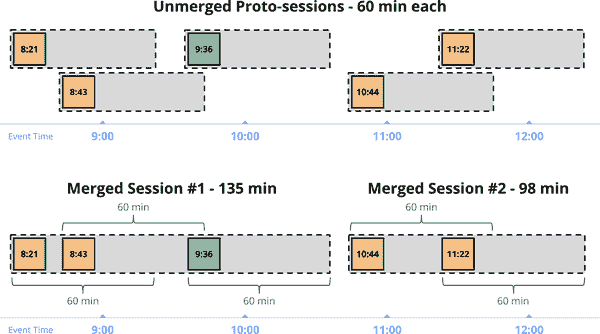

###### 图 4-5. 未合并的原型会话窗口，以及最终合并的会话

提供一般会话支持的关键见解是，完整的会话窗口是由一组较小的重叠窗口组成的，每个窗口包含一个单独的记录，序列中的每个记录与下一个记录之间的不活动间隙不大于预定义的超时时间。因此，即使我们以无序方式观察会话中的数据，我们也可以通过简单地合并到达的任何重叠窗口来构建最终的会话。

换个角度看，考虑到我们迄今为止一直在使用的例子。如果我们指定一个一分钟的会话超时，我们期望在数据中识别出两个会话，在图 4-6 中用虚线标出。每个会话捕获了用户的一次活动，会话中的每个事件与会话中的至少一个其他事件相隔不到一分钟。

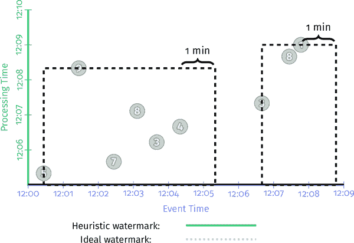

###### 图 4-6. 我们想要计算的会话

为了看到窗口合并是如何随着事件的出现而随时间构建这些会话的，让我们看看它的实际操作。我们将使用示例 2-10 中启用了撤回的早期/晚期代码，并更新窗口以使用一分钟的间隙持续时间来构建会话。示例 4-3 说明了这是什么样子。

##### 示例 4-3. 具有会话窗口和撤回的早期/准时/晚期触发

```java

PCollection<KV<Team, Integer>> totals = input
  .apply(Window.into(Sessions.withGapDuration(ONE_MINUTE))
               .triggering(
                 AfterWatermark()
                   .withEarlyFirings(AlignedDelay(ONE_MINUTE))
                   .withLateFirings(AfterCount(1))))
  .apply(Sum.integersPerKey());

```

在流式引擎上执行，你会得到类似图 4-7 所示的东西（请注意，我留下了用虚线标注的预期最终会话以供参考）。

<assets/stsy_0407.mp4>

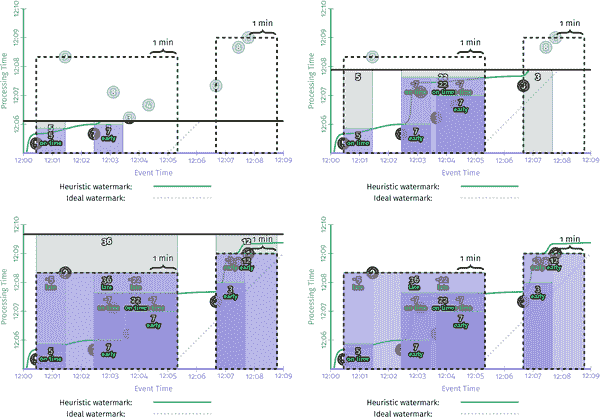

###### 图 4-7. 在流式引擎上具有会话窗口和撤回的早期和晚期触发

这里有很多事情要做，所以我会带你走一些：

+   当遇到值为 5 的第一条记录时，它被放入一个单独的原型会话窗口中，该窗口从该记录的事件时间开始，跨越会话间隙持续时间的宽度；例如，在该数据发生的点之后一分钟。我们将来遇到的任何与此窗口重叠的窗口都应该属于同一个会话，并将被合并到其中。

+   第二条到达的记录是 7，类似地被放入了自己的原型会话窗口中，因为它与 5 的窗口不重叠。

+   同时，水印已经超过了第一个窗口的结束时间，因此值为 5 的结果在 12:06 之前作为及时结果实现。不久之后，第二个窗口也作为具有值 7 的推测结果实现，就在处理时间达到 12:06 时。

+   接下来，我们观察一对记录 3 和 4，它们的原始会话重叠。因此，它们被合并在一起，当 12:07 的早期触发器触发时，一个值为 7 的单个窗口被发出。

+   随后，8 到达时，它与值为 7 的两个窗口重叠。因此，所有三个窗口合并在一起，形成一个新的组合会话，值为 22。然后，当水印通过此会话的结束时，它实现了值为 22 的新会话，以及之前发出的值为 7 的两个窗口的撤销，但后来合并到其中。

+   当 9 迟到时，与值为 5 的原始会话和值为 22 的会话合并成一个值为 36 的更大会话。 36 和值为 5 和 22 的撤销都立即由迟到数据触发器发出。

这是非常强大的东西。真正令人惊讶的是，在将流处理的维度分解为不同的可组合部分的模型中描述这样的东西是多么容易。最后，您可以更多地专注于有趣的业务逻辑，而不是将数据塑造成可用形式的细枝末节。

如果你不相信我，看看这篇博文，描述如何在 Spark Streaming 1.x 上[手动构建会话](http://bit.ly/2sXe3vJ)（请注意，这并不是要指责他们；Spark 的人员在其他方面做得足够好，以至于有人实际上费心记录在 Spark 1.x 上构建特定类型的会话支持需要什么；大多数其他系统都没有这样做）。这是相当复杂的，他们甚至没有进行适当的事件时间会话，或提供推测或迟到触发，或撤销。

# *何时*：自定义窗口

到目前为止，我们主要讨论了预定义类型的窗口策略：固定、滑动和会话。您可以从标准窗口类型中获得很多收益，但是有很多真实世界的用例需要能够定义自定义窗口策略，这样可以真正拯救一天（其中三个我们将在接下来看到）。

今天大多数系统不支持自定义窗口到 Beam 支持的程度，因此我们专注于 Beam 方法。在 Beam 中，自定义窗口策略由两部分组成：

窗口分配

这将每个元素放入初始窗口。在极限情况下，这允许每个元素放入一个唯一的窗口，这是非常强大的。

（可选）窗口合并

这允许窗口在分组时间合并，这使得窗口随时间演变成为可能，我们之前在会话窗口中看到了这种情况。

为了让您了解窗口策略的简单性，以及自定义窗口支持的实用性，我们将详细查看 Beam 中固定窗口和会话的标准实现，然后考虑一些需要对这些主题进行自定义变体的真实用例。在这个过程中，我们将看到创建自定义窗口策略有多么容易，以及当您的用例不完全符合标准方法时，缺乏自定义窗口支持会有多么限制。

## 固定窗口的变体

首先，让我们看一下相对简单的固定窗口策略。标准的固定窗口实现就像您想象的那样简单明了，并包括以下逻辑：

分配

根据其时间戳和窗口的大小和偏移参数，将元素放入适当的固定窗口中。

合并

无。

代码的简化版本如示例 4-4 所示。

##### 示例 4-4. 简化的 FixedWindows 实现

```java

public class FixedWindows extends WindowFn<Object, IntervalWindow> {
  private final Duration size;
  private final Duration offset;
  public Collection<IntervalWindow> assignWindow(AssignContext c) {
    long start = c.timestamp().getMillis() - c.timestamp()
                   .plus(size)
                   .minus(offset)
                   .getMillis() % size.getMillis();
    return Arrays.asList(IntervalWindow(new Instant(start), size));
  }
}

```

请记住，这里展示代码的目的并不是教你如何编写窗口策略（尽管解密它们并指出它们是多么简单也是不错的）。真正的目的是帮助对比支持一些相对基本的用例的相对容易和困难，分别使用和不使用自定义窗口。现在让我们考虑两种变体的固定窗口主题的用例。

### 非对齐的固定窗口

我们之前提到的默认固定窗口实现的一个特点是，所有数据的窗口都是对齐的。在我们的运行示例中，给定团队的中午到下午 1 点的窗口与所有其他团队的相应窗口对齐，这些窗口也从中午延伸到下午 1 点。对于希望在另一个维度上比较类似窗口的用例，比如团队之间的比较，这种对齐非常有用。然而，它也带来了一个相对微妙的代价。从中午到下午 1 点的所有活动窗口大约在同一时间完成，这意味着每小时系统都会受到大量窗口的材料化冲击。

为了说明我的意思，让我们看一个具体的例子（示例 4-5）。我们将从一个得分总和管道开始，就像我们在大多数示例中使用的那样，使用固定的两分钟窗口和单个水印触发器。

##### 示例 4-5. 水印完整性触发器（与示例 2-6 相同）

```java

PCollection<KV<Team, Integer>> totals = input
  .apply(Window.into(FixedWindows.of(TWO_MINUTES))
               .triggering(AfterWatermark()))
  .apply(Sum.integersPerKey());

```

但在这种情况下，我们将并行地查看同一数据集中的两个不同键（见图 4-8）。我们将看到这两个键的输出都是对齐的，因为所有键的窗口都是对齐的。因此，每当水印通过窗口结束时，我们就会得到*N*个窗格的材料化，其中*N*是在该窗口中更新的键的数量。在这个例子中，*N*为 2，可能并不太痛苦。但当*N*开始达到千百万或更多时，这种同步的突发性可能会成为问题。

<assets/stsy_0408.mp4>

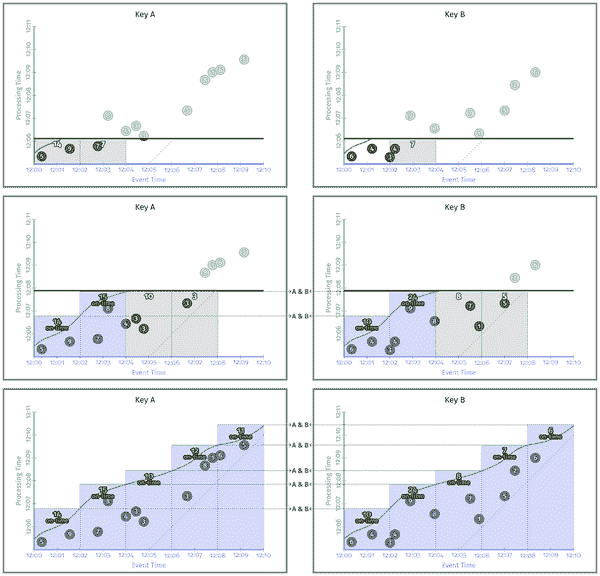

###### 图 4-8. 对齐的固定窗口

在不需要跨窗口比较的情况下，通常更希望将窗口完成负载均匀分布在时间上。这使得系统负载更可预测，可以减少处理峰值负载的需求。然而，在大多数系统中，如果系统不提供对齐的固定窗口支持，那么非对齐的固定窗口通常是不可用的。² 但是，通过自定义窗口支持，将默认的固定窗口实现修改为提供非对齐的固定窗口支持是相对简单的。我们希望继续保证所有被分组在一起的元素的窗口（即具有相同键的元素）具有相同的对齐，同时放宽对不同键之间的对齐限制。对默认的固定窗口策略进行的代码更改看起来像示例 4-6。

##### 示例 4-6. 简化的 UnalignedFixedWindows 实现

```java

publicclass`Unaligned`FixedWindowsextendsWindowFn<`KV``<``K``,``V``>`,IntervalWindow>{privatefinalDurationsize;privatefinalDurationoffset;publicCollection<IntervalWindow>assignWindow(AssignContextc){`long``perKeyShift``=``hash``(``c``.``element``(``)``.``key``(``)``)``%``size``;`longstart=`perKe``yShift``+`c.timestamp().getMillis()-c.timestamp().plus(size).minus(offset)returnArrays.asList(IntervalWindow(newInstant(start),size));}}
```

通过这种改变，所有具有相同键的元素的窗口³是对齐的，但具有不同键的元素的窗口（通常）是不对齐的，因此在分布窗口完成负载的同时，也使得跨键的比较变得不太有意义。我们可以将我们的管道切换到使用我们的新窗口策略，如示例 4-7 所示。

##### 示例 4-7. 具有单个水印触发器的非对齐的固定窗口

```java

PCollection<KV<Team, Integer>> totals = input
  .apply(Window.into(UnalignedFixedWindows.of(TWO_MINUTES))
               .triggering(AfterWatermark()))
  .apply(Sum.integersPerKey());

```

然后，通过比较与之前相同数据集的不同固定窗口对齐方式，您可以在图 4-9 中看到这是什么样子（在这种情况下，我选择了两种对齐之间的最大相位移，以最清楚地突出其好处，因为在大量键上随机选择相位将产生类似的效果）。

<assets/stsy_0409.mp4>

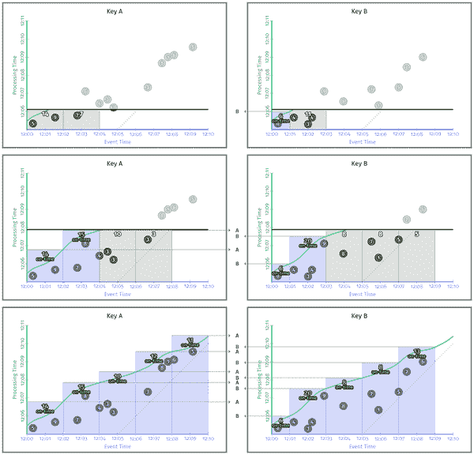

###### 图 4-9. 非对齐的固定窗口

请注意，我们没有同时为多个键发出多个窗格的情况。相反，窗格以更加均匀的节奏单独到达。这是另一个例子，可以在一个维度上进行权衡（跨键比较的能力），以换取另一个维度的好处（减少峰值资源配置要求），当用例允许时。当您试图尽可能高效地处理大量数据时，这种灵活性是至关重要的。

现在让我们看一下固定窗口的第二种变化，这种变化更与正在处理的数据密切相关。

### 每个元素/键的固定窗口

我们的第二个例子来自 Cloud Dataflow 的早期采用者之一。这家公司为其客户生成分析数据，但每个客户都可以配置其要聚合指标的窗口大小。换句话说，每个客户都可以定义其固定窗口的特定大小。

支持这样的用例并不太困难，只要可用的窗口大小数量本身是固定的。例如，您可以想象提供选择 30 分钟、60 分钟和 90 分钟固定窗口的选项，然后为每个选项运行一个单独的管道（或管道的分支）。虽然不理想，但也不太可怕。然而，随着选项数量的增加，这很快变得难以处理，在提供对真正任意窗口大小的支持的极限情况下（这正是这位客户的用例所需的），这完全是不切实际的。

幸运的是，因为客户处理的每条记录已经用描述聚合窗口所需大小的元数据进行了注释，因此支持任意的、每个用户的固定窗口大小就像从标准固定窗口实现中更改几行代码一样简单，如示例 4-8 所示。

##### 示例 4-8。修改（和简化）支持每个元素窗口大小的 FixedWindows 实现

```java

public class PerElementFixedWindows<T extends HasWindowSize%gt;
    extends WindowFn<T, IntervalWindow> {
  private final Duration offset;
  public Collection<IntervalWindow> assignWindow(AssignContext c) {
    long perElementSize = c.element().getWindowSize();
    long start = perKeyShift + c.timestamp().getMillis()
                   - c.timestamp()
                      .plus(size)
                      .minus(offset)
                      .getMillis() % size.getMillis();
    return Arrays.asList(IntervalWindow(
        new Instant(start), perElementSize));
  }
}

```

通过这种改变，每个元素都被分配到一个固定大小的窗口中，其大小由元素本身携带的元数据所决定。⁴ 将管道代码更改为使用这种新策略同样是微不足道的，如示例 4-9 所示。

##### 示例 4-9。使用单个水印触发器的每个元素固定窗口大小

```java

PCollection<KV<Team, Integer>> totals = input
  .apply(Window.into(PerElementFixedWindows.of(TWO_MINUTES))
               .triggering(AfterWatermark()))
  .apply(Sum.integersPerKey());

```

然后看着这个管道在运行中（图 4-10），很容易看出 Key A 的所有元素都有两分钟的窗口大小，而 Key B 的元素有一分钟的窗口大小。

<assets/stsy_0410.mp4>

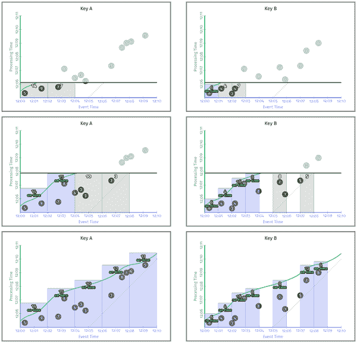

###### 图 4-10。每个键的自定义大小固定窗口

这确实不是您可以合理期望系统为您提供的东西；窗口大小偏好的存储方式对于尝试构建标准 API 来说太具体于用例，因此没有意义。然而，正如这位客户的需求所展示的那样，这样的用例确实存在。这就是自定义窗口提供的灵活性如此强大的原因。

## 会话窗口的变化

为了真正展示自定义窗口的有用性，让我们看一个最后的例子，这是会话的一个变化。会话窗口理所当然地比固定窗口更复杂。其实现包括以下内容：

分配

每个元素最初被放入一个原型会话窗口，该窗口从元素的时间戳开始，并持续一段间隔时间。

合并

在分组时，所有符合条件的窗口都被排序，然后任何重叠的窗口都被合并在一起。

会话代码的简化版本（手动从多个辅助类合并在一起）看起来像示例 4-10 中显示的样子。

##### 示例 4-10。简化的会话实现

```java

public class Sessions extends WindowFn<Object, IntervalWindow> {
  private final Duration gapDuration;
  public Collection<IntervalWindow> assignWindows(AssignContext c) {
    return Arrays.asList(
      new IntervalWindow(c.timestamp(), gapDuration));
  }
  public void mergeWindows(MergeContext c) throws Exception {
    List<IntervalWindow> sortedWindows = new ArrayList<>();
    for (IntervalWindow window : c.windows()) {
      sortedWindows.add(window);
    }
    Collections.sort(sortedWindows);
    List<MergeCandidate> merges = new ArrayList<>();
    MergeCandidate current = new MergeCandidate();
    for (IntervalWindow window : sortedWindows) {
      if (current.intersects(window)) {
        current.add(window);
      } else {
        merges.add(current);
        current = new MergeCandidate(window);
      }
    }
    merges.add(current);
    for (MergeCandidate merge : merges) {
      merge.apply(c);
    }
  }
}

```

与以往一样，看代码的重点并不是教你如何实现自定义窗口函数，甚至不是会话实现的具体内容；真正的重点是展示通过自定义窗口函数支持新用例的简单性。

### 有界会话

我多次遇到的一个这样的自定义用例是有界会话：不允许超出一定大小的会话，无论是在时间上，元素计数上还是其他维度上。这可能是出于语义原因，也可能只是一种垃圾邮件保护的练习。然而，鉴于限制类型的变化（一些用例关心事件时间上的总会话大小，一些关心总元素计数，一些关心元素密度等），很难为有界会话提供一个清晰简洁的 API。更实际的是允许用户实现自己的自定义窗口逻辑，以适应其特定用例。一个这样的用例示例，其中会话窗口受时间限制，可能看起来像示例 4-11（省略了我们将在这里使用的一些构建器样板）。

##### 示例 4-11。简化的会话实现

```java

publicclass`Bounded`SessionsextendsWindowFn<Object,IntervalWindow>{privatefinalDurationgapDuration;`private``final``Duration``maxSize``;`publicCollection<IntervalWindow>assignWindows(AssignContextc){returnArrays.asList(newIntervalWindow(c.timestamp(),gapDuration));}`private``Duration``windowSize``(``IntervalWindow``window``)``{``return``window``=``=``null``?``new``Duration``(``0``)``:``new``Duration``(``window``.``start``(``)``,``window``.``end``(``)``)``;``}`publicstaticvoidmergeWindows(WindowFn<?,IntervalWindow>.MergeContextc)throwsException{List<IntervalWindow>sortedWindows=newArrayList<>();for(IntervalWindowwindow:c.windows()){sortedWindows.add(window);}Collections.sort(sortedWindows);List<MergeCandidate>merges=newArrayList<>();MergeCandidatecurrent=newMergeCandidate();for(IntervalWindowwindow:sortedWindows){`MergeCandidate``next``=``new``MergeCandidate``(``window``)``;`if(current.intersects(window)){current.add(window);`if``(``windowSize``(``current``.``union``)``<``=``(``maxSize``-``gapDuration``)``)``continue``;``// Current window exceeds bounds, so flush and move to next``next``=``new``MergeCandidate``(``)``;``}`merges.add(current);current=next;}merges.add(current);for(MergeCandidatemerge:merges){merge.apply(c);}}}
```

与以往一样，更新我们的管道（在这种情况下是示例 2-7 中的早期/准时/迟到版本）以使用这种自定义窗口策略是微不足道的，正如您在示例 4-12 中所看到的。

##### 示例 4-12。通过早期/准时/迟到 API 进行早期、准时和迟到触发

```java

PCollection<KV<Team, Integer>> totals = input
  .apply(Window.into(BoundedSessions
                       .withGapDuration(ONE_MINUTE)
                       .withMaxSize(THREE_MINUTES))
               .triggering(
                 AfterWatermark()
                   .withEarlyFirings(AlignedDelay(ONE_MINUTE))
                   .withLateFirings(AfterCount(1))))
  .apply(Sum.integersPerKey());

```

并在我们的运行示例中执行，它可能看起来像图 4-11。

<assets/stsy_0411.mp4>

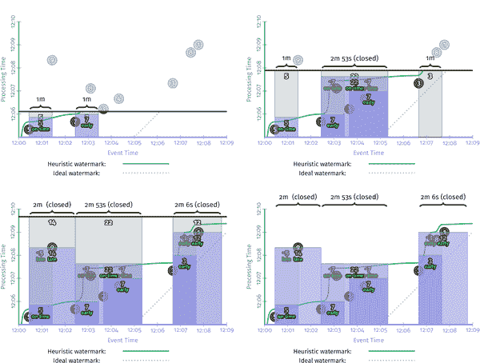

###### 图 4-11。按键自定义大小的固定窗口

请注意，大会话的值为 36，跨越了 12:00.26, 12:05.20，或者近五分钟的时间，在无界会话实现中从[图 2-7 现在分解为两个较短的会话，长度分别为 2 分钟和 2 分钟 53 秒。

考虑到目前很少有系统提供自定义窗口支持，值得指出的是，如果要使用只支持无限会话实现的系统来实现这样的功能，将需要更多的工作。你唯一的选择是在会话分组逻辑的下游编写代码，查看生成的会话并在超过长度限制时对其进行切割。这将需要在事后对会话进行分解的能力，这将消除增量聚合的好处（我们将在第七章中更详细地讨论），增加成本。这也将消除任何希望通过限制会话长度获得的垃圾邮件保护的好处，因为会话首先需要增长到其完整大小，然后才能被切割或截断。

## 一刀切并不适用于所有情况

我们现在已经看到了三个真实的用例，每个用例都是数据处理系统通常提供的窗口类型的微妙变化：不对齐的固定窗口，按元素固定的窗口和有界会话。在这三种情况下，我们看到了通过自定义窗口支持这些用例是多么简单，以及如果没有它，支持这些用例将会更加困难（或昂贵）。尽管自定义窗口在行业中尚未得到广泛支持，但它是一个功能，为构建需要尽可能高效地处理大量数据的复杂真实用例的数据处理管道提供了非常需要的灵活性。

# 总结

高级窗口是一个复杂而多样的主题。在本章中，我们涵盖了三个高级概念：

处理时间窗口

我们看到了这与事件时间窗口的关系，指出了它固有有用的地方，并且最重要的是，通过明确强调事件时间窗口为我们提供的结果的稳定性，确定了它不适用的地方。

会话窗口

我们首次介绍了动态合并窗口策略类，并看到系统为我们提供了多么大的帮助，提供了这样一个强大的构造，你可以简单地放置在那里。

自定义窗口

在这里，我们看了三个现实世界的例子，这些例子在只提供静态一组标准窗口策略的系统中很难或不可能实现，但在具有自定义窗口支持的系统中相对容易实现：

+   *不对齐的固定窗口*，在使用水印触发器与固定窗口时，可以更均匀地分布输出。

+   *每个元素的固定窗口*，可以灵活地选择每个元素的固定窗口大小（例如，提供可定制的每个用户或每个广告活动窗口大小），以更好地定制管道语义以适应特定用例。

+   *有界会话窗口*，限制给定会话的增长大小；例如，用于抵消垃圾邮件尝试或对由管道实现的已完成会话的延迟设置边界。

在与 Slava 深入研究了第三章的水印，并在这里对高级窗口进行了广泛调查后，我们已经远远超出了多维度的稳健流处理的基础知识。因此，我们结束了对 Beam 模型的关注，也结束了书的第一部分。

接下来是 Reuven 的第五章，讨论一致性保证、精确一次处理和副作用，之后我们将开始进入第二部分*流和表*，阅读第六章。

¹ 据我所知，Apache Flink 是唯一支持自定义窗口到 Beam 所做程度的另一个系统。公平地说，由于能够提供自定义窗口逐出器的能力，其支持甚至超出了 Beam 的支持。头都快炸了。

² 我实际上并不知道目前有任何这样的系统。

³ 这自然意味着使用分组数据，但因为窗口化本质上与按键分组紧密相关，所以这个限制并不特别繁重。

⁴ 并不是关键的是元素本身知道窗口大小；你可以轻松查找并缓存所需维度的适当窗口大小；例如，每个用户。
