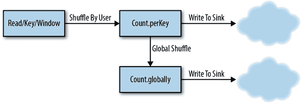
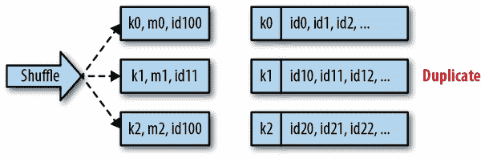
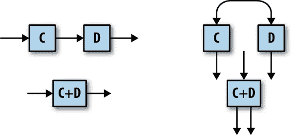
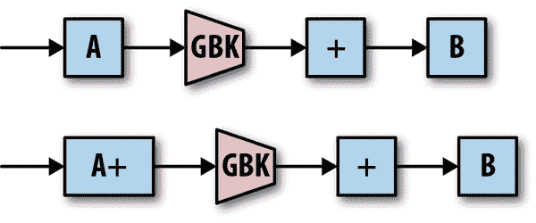
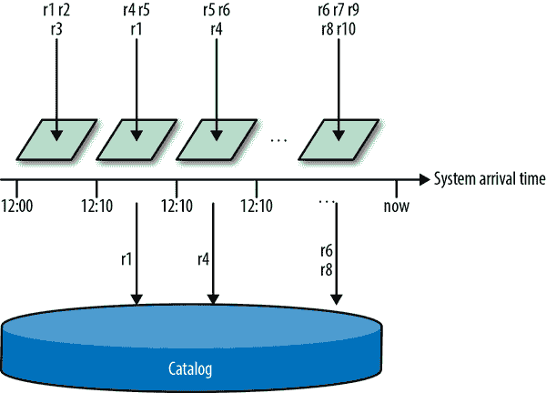

# 第五章：一次性和副作用

我们现在从讨论编程模型和 API 转向实现它们的系统。模型和 API 允许用户描述他们想要计算的内容。在规模上准确地运行计算需要一个系统——通常是一个分布式系统。

在本章中，我们将重点介绍一个实现系统如何正确实现 Beam 模型以产生准确结果。流处理系统经常谈论*一次性处理*；也就是确保每个记录只被处理一次。我们将解释我们的意思，并介绍如何实现它。

作为一个激励性的例子，本章重点介绍了 Google Cloud Dataflow 用于有效地保证记录的一次性处理的技术。在本章末尾，我们还将介绍一些其他流行的流处理系统用于保证一次性处理的技术。

# 为什么一次性很重要

许多用户来说，数据处理管道中出现丢失记录或数据丢失的风险是不可接受的。即便如此，历史上许多通用流处理系统并没有对记录处理提供任何保证——所有处理都只是“尽力而为”。其他系统提供至少一次的保证，确保记录至少被处理一次，但记录可能会重复（从而导致不准确的聚合）；实际上，许多这样的至少一次系统在内存中执行聚合，因此当机器崩溃时它们的聚合仍然可能会丢失。这些系统用于低延迟的、推测性的结果，但通常无法保证这些结果的真实性。

正如第一章所指出的，这导致了一个被称为*Lambda 架构*的策略——运行一个流处理系统以获得快速但不准确的结果。稍后（通常是在一天结束后），批处理系统运行以得到正确的答案。这只有在数据流是可重放的情况下才有效；然而，足够多的数据源都满足这一条件，这种策略被证明是可行的。尽管如此，许多尝试过这种策略的人都遇到了许多 Lambda 架构的问题：

不准确性

用户往往低估了故障的影响。他们经常假设只有少量记录会丢失或重复（通常是基于他们进行的实验），当有一天出现 10%（甚至更多！）的记录丢失或重复时，他们会感到震惊。在某种意义上，这样的系统只提供了“一半”的保证——没有完整的保证，一切皆有可能。

不一致性

用于每日计算的批处理系统通常具有与流处理系统不同的数据语义。让这两个管道产生可比较的结果的过程比最初想象的更加困难。

复杂性

根据定义，Lambda 要求您编写和维护两个不同的代码库。您还必须运行和维护两个复杂的分布式系统，每个系统都有不同的故障模式。除了最简单的管道之外，这很快就变得不堪重负。

不可预测性

在许多用例中，最终用户将看到与每日结果有不确定差异的流处理结果，这种差异可能会随机变化。在这些情况下，用户将停止信任流处理数据，而等待每日批处理结果，从而破坏了首次获得低延迟结果的价值。

延迟

一些业务用例*需要*低延迟的正确结果，而 Lambda 架构设计上并不提供这种功能。

幸运的是，许多 Beam 运行程序可以做得更好。在本章中，我们将解释一次流处理如何帮助用户依靠准确的结果并避免数据丢失的风险，同时依赖于单一的代码库和 API。由于一系列可能影响管道输出的问题经常被错误地与一次性保证混淆在一起，我们首先解释了在 Beam 和数据处理的上下文中，当我们提到“一次性”时，确切指的是哪些问题在范围内，哪些不在范围内。

# 准确性与完整性

每当 Beam 管道处理一个记录时，我们希望确保记录永远不会丢失或重复。然而，流水线的特性是有时记录会在时间窗口的聚合已经被处理后出现。Beam SDK 允许用户配置系统应该等待延迟数据的时间；任何（且仅有）晚于截止日期到达的记录都会被丢弃。这个特性有助于*完整性*，而不是准确性：所有及时到达的记录都会被准确处理一次，而这些延迟的记录则会被明确丢弃。

尽管延迟记录通常是在流式系统的背景下讨论的，但值得注意的是批处理管道也存在类似的完整性问题。例如，一个常见的批处理范例是在凌晨 2 点运行前一天所有数据的作业。然而，如果昨天的一些数据直到凌晨 2 点后才被收集，它就不会被批处理作业处理！因此，批处理管道也提供准确但不总是完整的结果。

## 副作用

Beam 和 Dataflow 的一个特点是用户可以注入自定义代码，作为他们的管道图的一部分执行。Dataflow *不*保证该代码仅对每个记录运行一次，¹无论是通过流式处理还是批处理运行器。它可能会多次运行给定的记录通过用户转换，甚至可能同时在多个工作器上运行相同的记录；这是为了保证至少一次的处理在工作器故障的情况下。这些调用中只有一个可以“获胜”并在管道中产生输出。

因此，不幂等的副作用不能保证只执行一次；如果您编写的代码对外部服务具有副作用，例如联系外部服务，这些效果可能会对给定记录执行多次。这种情况通常是不可避免的，因为没有办法在 Dataflow 的处理与外部服务的副作用之间进行原子提交。管道最终需要将结果发送到外部世界，这样的调用可能不是幂等的。正如你将在本章后面看到的，这样的输出通常能够添加一个额外的阶段来将调用重构为幂等操作。

## 问题定义

所以，我们给出了一些我们*不*讨论的例子。那么我们所说的一次性处理是什么意思呢？为了激励这一点，让我们从一个简单的流水线开始，²如示例 5-1 所示。

##### 示例 5-1. 一个简单的流水线

```java

Pipeline p = Pipeline.create(options);
// Calculate 1-minute counts of events per user.
PCollection<..> perUserCounts = 
      p.apply(ReadFromUnboundedSource.read())
       .apply(new KeyByUser())
       .Window.<..>into(FixedWindows.of(Duration.standardMinutes(1)))
       .apply(Count.perKey());
// Process these per-user counts, and write the output somewhere.
perUserCounts.apply(new ProcessPerUserCountsAndWriteToSink());
// Add up all these per-user counts to get 1-minute counts of all events.
perUserCounts.apply(Values.<..>create())
             .apply(Count.globally())
             .apply(new ProcessGlobalCountAndWriteToSink());
p.run();

```

这个管道计算了两种不同的窗口聚合。第一个计算了每个用户在一分钟内来自多少事件，第二个计算了每分钟总共有多少事件。这两个聚合都写入了未指定的流式输出。

请记住，Dataflow 并行在许多不同的工作器上执行管道。在每个`GroupByKey`（`Count`操作在底层使用`GroupByKey`），所有具有相同键的记录都在同一台机器上进行*shuffle*处理。Dataflow 工作器使用远程过程调用（RPC）在它们之间进行数据洗牌，确保给定键的记录都最终在同一台机器上。

图 5-1 显示了 Dataflow 为示例 5-1 中的管道创建的洗牌。³`Count.perKey`将每个用户的所有数据洗牌到给定的工作器，而`Count.globally`将所有这些部分计数洗牌到一个单一的工作器以计算全局总和。



###### 图 5-1. 管道中的洗牌

为了 Dataflow 准确处理数据，这个 shuffle 过程必须确保每个记录只被洗牌一次。正如你将在下一刻看到的，shuffle 的分布式特性使得这成为一个具有挑战性的问题。

这个管道还可以从外部世界读取和写入数据，因此 Dataflow 必须确保这种交互不会引入任何不准确性。Dataflow 一直支持这项任务，即 Apache Spark 和 Apache Flink 所称的“端到端精确一次”，只要在技术上可行的情况下，对于数据源和数据汇。

本章的重点将放在三件事情上：

洗牌

Dataflow 如何保证每条记录只被洗牌一次。

数据源

Dataflow 如何保证每个源记录只被处理一次。

数据汇

Dataflow 如何保证每个数据汇产生准确的输出。

# 确保洗牌中的精确一次

正如刚才解释的，Dataflow 的流式洗牌使用 RPC。现在，每当有两台机器通过 RPC 进行通信时，都应该认真考虑数据完整性。首先，RPC 可能因为很多原因而失败。网络可能中断，RPC 可能在完成之前超时，或者接收服务器可能决定失败调用。为了保证记录在洗牌过程中不会丢失，Dataflow 采用了“上游备份”。这意味着发送方将重试 RPC，直到收到接收确认。Dataflow 还确保即使发送方崩溃，它也会继续重试这些 RPC。这保证了每条记录至少被传递一次。

现在的问题是，这些重试可能会产生重复。大多数 RPC 框架，包括 Dataflow 使用的框架，都会为发送方提供成功或失败的状态。在分布式系统中，你需要意识到 RPC 有时可能会在看似失败的情况下成功。这有很多原因：与 RPC 超时的竞争条件，服务器的积极确认尽管 RPC 成功但传输失败，等等。发送方真正可以信任的唯一状态是成功的状态。

返回失败状态的 RPC 通常表示调用可能成功也可能失败。尽管特定的错误代码可以传达明确的失败，但许多常见的 RPC 失败，如超过截止日期，都是模棱两可的。在流式洗牌的情况下，重试一个真正成功的 RPC 意味着将记录传递两次！Dataflow 需要一种方法来检测和删除这些重复。

在高层次上，这个任务的算法非常简单（见图 5-2）：每个发送的消息都带有一个唯一标识符。每个接收者都存储了已经被看到和处理的所有标识符的目录。每次接收到一条记录时，它的标识符都会在这个目录中查找。如果找到了，记录就会被丢弃为重复。因为 Dataflow 是建立在可扩展的键/值存储之上的，所以这个存储被用来保存去重目录。



###### 图 5-2。在洗牌中检测重复

# 解决确定性问题

然而，在现实世界中使这种策略生效需要非常小心。一个立即显现的问题是，Beam 模型允许用户代码产生非确定性输出。这意味着`ParDo`可能会对相同的输入记录执行两次（由于重试），但每次重试可能会产生不同的输出。期望的行为是，只有一个输出会提交到管道中；然而，涉及的非确定性使得很难保证这两个输出具有相同的确定性 ID。更棘手的是，`ParDo`可以输出多条记录，因此每次重试可能会产生不同数量的输出！

那么，为什么我们不要求所有用户处理都是确定性的呢？我们的经验是，在实践中，许多管道需要非确定性转换。而且很多时候，管道作者并没有意识到他们编写的代码是非确定性的。例如，考虑一个在 Cloud Bigtable 中查找补充数据以丰富其输入数据的转换。这是一个非确定性的任务，因为外部值可能会在转换的重试之间发生变化。任何依赖当前时间的代码也是不确定的。我们还看到需要依赖随机数生成器的转换。即使用户代码是纯确定的，任何允许延迟数据的事件时间聚合也可能具有非确定性的输入。

Dataflow 通过使用检查点来使非确定性处理有效地变为确定性来解决这个问题。每个转换的输出与其唯一 ID 一起被检查点到稳定存储中，然后再传递到下一个阶段之前。⁵在洗牌传递中的任何重试都只是重放已经被检查点的输出 - 用户的非确定性代码不会在重试时再次运行。换句话说，用户的代码可能会运行多次，但只有其中一个运行可以“获胜”。此外，Dataflow 使用一致的存储，可以防止重复写入稳定存储。

# 性能

为了实现精确一次的洗牌传递，每个接收器键中都存储了记录 ID 的目录。对于到达的每个记录，Dataflow 查找已经看到的 ID 目录，以确定这个记录是否是重复的。从一步到另一步的每个输出都被检查点到存储中，以确保生成的记录 ID 是稳定的。

然而，除非实施得当，否则这个过程会通过增加大量的读写来显著降低客户的管道性能。因此，为了使 Dataflow 用户的精确一次处理可行，必须减少 I/O，特别是通过阻止每个记录上的 I/O。

Dataflow 通过两种关键技术实现了这一目标：*图优化*和*Bloom 过滤器*。

## 图优化

在执行管道之前，Dataflow 服务对管道图运行一系列优化。其中一种优化是*融合*，在这种优化中，服务将许多逻辑步骤融合成单个执行阶段。图 5-3 显示了一些简单的示例。



###### 图 5-3\. 示例优化：融合

所有融合的步骤都作为一个内部单元运行，因此不需要为它们中的每一个存储精确一次数据。在许多情况下，融合将整个图减少到几个物理步骤，大大减少了所需的数据传输量（并节省了状态使用）。

Dataflow 还通过在将数据发送到主要分组操作之前在本地执行部分组合来优化关联和交换的`Combine`操作（例如`Count`和`Sum`），如图 5-4 所示。这种方法可以大大减少传递的消息数量，因此也减少了读写的数量。



###### 图 5-4\. 示例优化：组合器提升

## 布隆过滤器

上述优化是改进精确一次性性能的通用技术。对于严格旨在改进精确一次处理的优化，我们转向*Bloom 过滤器*。

在一个健康的管道中，大多数到达的记录都不是重复的。我们可以利用这一点通过布隆过滤器大大提高性能，布隆过滤器是一种紧凑的数据结构，可以快速进行成员检查。布隆过滤器有一个非常有趣的特性：它们可以返回误报，但永远不会返回假阴性。如果过滤器说“是的，元素在集合中”，我们知道该元素*可能*在集合中（可以计算概率）。然而，如果过滤器说一个元素*不*在集合中，那么它肯定不在。这个功能非常适合当前的任务。

Dataflow 中的实现方式如下：每个工作节点都保留了它所见过的每个 ID 的布隆过滤器。每当出现新的记录 ID 时，它会在过滤器中查找。如果过滤器返回 false，则该记录不是重复的，工作节点可以跳过更昂贵的稳定存储查找。只有当布隆过滤器返回 true 时，它才需要进行第二次查找，但只要过滤器的误报率低，这一步就很少需要。

然而，随着时间的推移，布隆过滤器往往会填满，这样做的话，误报率会增加。此外，每当工作节点重新启动时，我们还需要通过扫描状态中存储的 ID 目录来构建这个布隆过滤器。有帮助的是，Dataflow 为每条记录附加了一个系统时间戳。因此，服务不是创建一个单一的布隆过滤器，而是为每个 10 分钟范围创建一个单独的布隆过滤器。当记录到达时，Dataflow 根据系统时间戳查询适当的过滤器。这一步防止了布隆过滤器饱和，因为随着时间的推移，过滤器会被垃圾回收，并且它也限制了需要在启动时扫描的数据量。

图 5-5 说明了这个过程：记录到达系统并根据它们的到达时间被分配到一个布隆过滤器。第一个过滤器中的记录都不是重复的，它们的所有目录查找都被过滤了。记录`r1`被传递了第二次，因此需要进行目录查找以验证它是否确实是重复的；对于记录`r4`和`r6`也是如此。记录`r8`不是重复的；然而，由于它的布隆过滤器中出现了误报，生成了一个目录查找（这将确定`r8`不是重复的，应该被处理）。



###### 图 5-5. 一次性布隆过滤器

## 垃圾回收

每个 Dataflow 工作节点都持久存储了它所见过的唯一记录 ID 的目录。由于 Dataflow 的状态和一致性模型是按键的，实际上每个键都存储了传递到该键的记录的目录。我们不能永远存储这些标识符，否则所有可用的存储空间最终都会被填满。为了避免这个问题，您需要对已确认的记录 ID 进行垃圾回收。

实现这一目标的一种策略是，发送方为了跟踪仍在传输中的最早序列号（对应于未确认的记录传递），为每条记录标记一个严格递增的序列号。目录中具有较早序列号的任何标识符都可以进行垃圾回收，因为所有较早的记录都已经被确认。

然而，有一个更好的选择。如前所述，Dataflow 已经为每个记录标记了一个系统时间戳，用于分桶一次性布隆过滤器。因此，Dataflow 不是使用序列号来垃圾回收一次性目录，而是基于这些系统时间戳计算垃圾回收水印（这是第三章讨论的处理时间水印）。这种方法的一个好处是，因为这个水印是基于在给定阶段等待的物理时间量（不像数据水印是基于自定义事件时间），它提供了对管道的哪些部分是慢的直觉。这些元数据是 Dataflow WebUI 中显示的系统滞后度指标的基础。

如果一个记录到达时带有旧的时间戳，而我们已经对这个时间点的标识符进行了垃圾回收，会发生什么？这可能是由于我们称之为*网络残留*的影响，其中一个旧消息在网络中停留了无限期，然后突然出现。垃圾回收触发的低水位不会提前，直到记录交付被确认，因此我们知道这个记录已经被成功处理。这样的网络残留显然是重复的，会被忽略。

# 在数据源中精确执行一次

Beam 提供了一个用于将数据读入 Dataflow 管道的源 API。⁹ 如果处理失败并且需要确保每个数据源产生的唯一记录被精确执行一次，Dataflow 可能会重试从源读取数据。

对于大多数数据源，Dataflow 会在后台处理这个过程；这些数据源是*确定性*的。例如，考虑一个从文件中读取数据的数据源。文件中的记录总是以确定性顺序和确定性字节位置出现，无论文件被读取多少次。¹⁰ 文件名和字节位置唯一标识每个记录，因此服务可以自动生成每个记录的唯一 ID。另一个提供类似确定性保证的数据源是 Apache Kafka；每个 Kafka 主题被分成一个静态的分区集，分区中的记录总是有确定性顺序的。这样的确定性数据源将在 Dataflow 中无重复地工作。

然而，并非所有的数据源都是如此简单。例如，Dataflow 管道的一个常见数据源是 Google Cloud Pub/Sub。Pub/Sub 是一个*不确定性*的数据源：多个订阅者可以从 Pub/Sub 主题中拉取消息，但哪些订阅者接收到给定的消息是不可预测的。如果处理失败，Pub/Sub 将重新传递消息，但消息可能会被传递给与最初处理它们的不同工作器，并且顺序也可能不同。这种不确定性行为意味着 Dataflow 需要帮助来检测重复，因为服务无法确定地分配在重试时稳定的记录 ID。（我们将在本章后面更详细地研究 Pub/Sub 的一个案例。）

因为 Dataflow 无法自动分配记录 ID，不确定性数据源需要通知系统记录 ID 应该是什么。Beam 的源 API 提供了`UnboundedReader.getCurrentRecordId`¹¹方法。如果一个数据源为每个记录提供唯一的 ID，并通知 Dataflow 它需要去重，¹²具有相同 ID 的记录将被过滤掉。

# 在汇聚中精确执行一次

在某个时候，每个管道都需要向外部输出数据，而汇聚是简单地执行这一操作的转换。请记住，向外部传递数据是一种副作用，我们已经提到 Dataflow 不能保证副作用的精确执行一次。那么，汇聚如何保证输出只被传递一次呢？

最简单的答案是 Beam SDK 提供了一些内置的汇聚。这些汇聚经过精心设计，以确保它们不会产生重复，即使执行多次。在可能的情况下，鼓励管道作者使用其中一个内置的汇聚。

然而，有时内置功能是不够的，你需要编写自己的功能。最好的方法是确保你的副作用操作是幂等的，因此在重播时是稳健的。然而，通常副作用`DoFn`的某些组件是不确定的，因此在重播时可能会发生变化。例如，在窗口聚合中，窗口中的记录集也可能是不确定的！

具体来说，窗口可能尝试使用元素`e0`、`e1`、`e2`触发，但工作器在提交窗口处理之前崩溃（但在这些元素作为副作用发送之前没有崩溃）。当工作器重新启动时，窗口将再次触发，但现在会出现一个延迟元素`e3`。因为这个元素在窗口提交之前出现，所以它不被视为延迟数据，所以`DoFn`会再次调用元素`e0`、`e1`、`e2`、`e3`。然后这些元素被发送到副作用操作。在这里幂等性是无法帮助的，因为每次发送的是不同的逻辑记录集。

还有其他引入不确定性的方式。解决这种风险的标准方法是依赖于 Dataflow 目前保证只有一个`DoFn`的输出版本可以通过洗牌边界。¹³

利用这一保证的一种简单方法是通过内置的`Reshuffle`转换。示例 5-2 中提出的模式确保副作用操作始终接收到一个确定性的记录以输出。

##### 示例 5-2。重排示例

```java

c.apply(Window.<..>into(FixedWindows.of(Duration.standardMinutes(1))))
 .apply(GroupByKey.<..>.create())
 .apply(new PrepareOutputData())
 .apply(Reshuffle.<..>of())
 .apply(WriteToSideEffect());

```

前面的管道将接收端分为两个步骤：`PrepareOutputData`和`WriteToSideEffect`。如果我们简单地依次运行，整个过程可能会在故障时重播，`PrepareOutputData`可能会产生不同的结果，并且两者都将被写入为副作用。当我们在两者之间添加`Reshuffle`时，Dataflow 保证这种情况不会发生。

当然，Dataflow 可能仍然多次运行`WriteToSideEffect`操作。这些副作用本身仍然需要是幂等的，否则接收端将收到重复的数据。例如，设置或覆盖数据存储中的值的操作是幂等的，即使运行多次，也会生成正确的输出。向列表追加的操作不是幂等的；如果操作运行多次，每次都会追加相同的值。

虽然`Reshuffle`提供了一种简单的方法来实现对`DoFn`的稳定输入，但`GroupByKey`同样有效。然而，目前有一个提案，可以消除添加`GroupByKey`以实现对`DoFn`的稳定输入的需要。相反，用户可以使用特殊注解`@RequiresStableInput`注解`WriteToSideEffect`，系统将确保该转换的输入稳定。

# 用例

为了说明这一点，让我们来看一些内置的源和接收端，看看它们如何实现上述模式。

## 示例来源：Cloud Pub/Sub

Cloud Pub/Sub 是一个完全托管的、可扩展的、可靠的、低延迟的系统，用于将消息从发布者传递给订阅者。发布者在命名主题上发布数据，订阅者创建命名订阅以从这些主题中拉取数据。可以为单个主题创建多个订阅，这种情况下，每个订阅从创建订阅时刻起都会接收到主题上发布的所有数据的完整副本。Pub/Sub 保证记录将继续传递直到被确认；但是，一条记录可能会被传递多次。

Pub/Sub 旨在用于分布式使用，因此许多发布过程可以发布到同一个主题，许多订阅过程可以从同一个订阅中拉取。在记录被拉取后，订阅者必须在一定时间内确认它，否则该拉取将过期，Pub/Sub 将重新将该记录传递给另一个订阅过程。

尽管这些特性使 Pub/Sub 具有高度可扩展性，但这也使它成为 Dataflow 等系统的一个具有挑战性的数据源。不可能知道哪个记录会被传递给哪个工作器，以及以什么顺序。更重要的是，在发生故障的情况下，重新传递可能会以不同的顺序将记录发送到不同的工作器！

Pub/Sub 为每条消息提供一个稳定的消息 ID，并且在重新传递时该 ID 将保持不变。Dataflow Pub/Sub 源将默认使用此 ID 来从 Pub/Sub 中删除重复项。（记录根据 ID 的哈希进行洗牌，因此重复的传递总是在同一个工作器上处理。）然而，在某些情况下，这还不够。用户的发布过程可能会重试发布，并因此将重复项引入 Pub/Sub。从该服务的角度来看，这些是唯一的记录，因此它们将获得唯一的记录 ID。Dataflow 的 Pub/Sub 源允许用户提供自己的记录 ID 作为自定义属性。只要发布者在重试时发送相同的 ID，Dataflow 就能够检测到这些重复项。

Beam（因此 Dataflow）为 Pub/Sub 提供了一个参考源实现。但是，请记住，这*不是*Dataflow 使用的，而是仅由非 Dataflow 运行器（如 Apache Spark，Apache Flink 和 DirectRunner）使用的实现。出于各种原因，Dataflow 在内部处理 Pub/Sub，并且不使用公共 Pub/Sub 源。

## 示例接收器：文件

流式运行器可以使用 Beam 的文件接收器（`TextIO`，`AvroIO`和任何实现`FileBasedSink`的其他接收器）来持续将记录输出到文件。示例 5-3 提供了一个示例用例。

##### 示例 5-3。窗口化文件写入

```java

c.apply(Window.<..>into(FixedWindows.of(Duration.standardMinutes(1))))
 .apply(TextIO.writeStrings().to(new MyNamePolicy()).withWindowedWrites());

```

示例 5-3 中的片段每分钟写入 10 个新文件，其中包含该窗口的数据。`MyNamePolicy`是一个用户编写的函数，根据分片和窗口确定输出文件名。您还可以使用触发器，在这种情况下，每个触发器窗格将作为一个新文件输出。

这个过程是使用示例 5-3 中的模式的变体实现的。文件被写入临时位置，这些临时文件名通过`GroupByKey`发送到后续的转换。在`GroupByKey`之后是一个最终转换，它会将临时文件原子地移动到它们的最终位置。示例 5-4 中的伪代码提供了 Beam 中一致的流式文件接收器的实现草图。（有关更多详细信息，请参见 Beam 代码库中的`FileBasedSink`和`WriteFiles`。）

##### 示例 5-4。文件接收器

```java

c
  // Tag each record with a random shard id.
  .apply("AttachShard", WithKeys.of(new RandomShardingKey(getNumShards())))
  // Group all records with the same shard.
  .apply("GroupByShard", GroupByKey.<..>())
  // For each window, write per-shard elements to a temporary file. This is the 
  // non-deterministic side effect. If this DoFn is executed multiple times, it will
  // simply write multiple temporary files; only one of these will pass on through 
  // to the Finalize stage.
  .apply("WriteTempFile", ParDo.of(new DoFn<..> {
    @ProcessElement
     public void processElement(ProcessContext c, BoundedWindow window) {
       // Write the contents of c.element() to a temporary file.
       // User-provided name policy used to generate a final filename.
      c.output(new FileResult()).
    }
  }))
  // Group the list of files onto a singleton key.
  .apply("AttachSingletonKey", WithKeys.<..>of((Void)null))
  .apply("FinalizeGroupByKey", GroupByKey.<..>create())
  // Finalize the files by atomically renaming them. This operation is idempotent. 
  // Once this DoFn has executed once for a given FileResult, the temporary file 
  // is gone, so any further executions will have no effect. 
  .apply("Finalize", ParDo.of(new DoFn<..>, Void> {
    @ProcessElement
     public void processElement(ProcessContext c)  {
       for (FileResult result : c.element()) { 
         rename(result.getTemporaryFileName(), result.getFinalFilename());
       }
}}));

```

您可以看到`WriteTempFile`中的非幂等工作是如何完成的。在`GroupByKey`完成后，`Finalize`步骤将始终看到相同的捆绑包进行重试。因为文件重命名是幂等的，¹⁴这给了我们一个恰好一次的接收器。

## 示例接收器：Google BigQuery

Google BigQuery 是一个完全托管的云原生数据仓库。Beam 提供了 BigQuery 接收器，BigQuery 提供了支持极低延迟插入的流式插入 API。这个流式插入 API 允许您为每个记录标记插入一个唯一的 ID，并且 BigQuery 将尝试使用相同的 ID 过滤重复的插入。¹⁵为了使用这个功能，BigQuery 接收器必须为每条记录生成统计上唯一的 ID。它通过使用`java.util.UUID`包来实现这一点，该包生成统计上唯一的 128 位 ID。

生成随机的通用唯一标识符（UUID）是一个非确定性操作，因此我们必须在插入到 BigQuery 之前添加`Reshuffle`。这样做后，Dataflow 的任何重试都将始终使用相同的被洗牌的 UUID。对 BigQuery 的重复尝试插入将始终具有相同的插入 ID，因此 BigQuery 能够对其进行过滤。示例 5-5 中显示的伪代码说明了 BigQuery 接收器的实现方式。

##### 示例 5-5。BigQuery 接收器

```java

// Apply a unique identifier to each record
c
 .apply(new DoFn<> {
  @ProcessElement
  public void processElement(ProcessContext context) {
   String uniqueId = UUID.randomUUID().toString();
   context.output(KV.of(ThreadLocalRandom.current().nextInt(0, 50),
                                     new RecordWithId(context.element(), uniqueId)));
 }
})
// Reshuffle the data so that the applied identifiers are stable and will not change.
.apply(Reshuffle.<Integer, RecordWithId>of())
// Stream records into BigQuery with unique ids for deduplication.
.apply(ParDo.of(new DoFn<..> {
   @ProcessElement
   public void processElement(ProcessContext context) {
     insertIntoBigQuery(context.element().record(), context.element.id());
   }
 });

```

再次，我们将接收器分成一个非幂等步骤（生成随机数），然后是一个幂等步骤。

# 其他系统

现在我们已经详细解释了 Dataflow 的恰好一次，让我们将其与其他流行的流式系统的简要概述进行对比。每个系统以不同的方式实现恰好一次保证，并因此做出不同的权衡。

## Apache Spark Streaming

Spark Streaming 使用微批处理架构进行连续数据处理。用户在逻辑上处理一个流对象；然而，在底层，Spark 将这个流表示为连续的一系列 RDD。¹⁶ 每个 RDD 都作为一个批次进行处理，Spark 依赖批处理的精确一次性特性来确保正确性；正如之前提到的，正确的批处理洗牌技术已经有一段时间了。这种方法可能会导致输出的延迟增加，特别是对于深层管道和高输入量，通常需要仔细调整才能实现所需的延迟。

Spark 假设操作都是幂等的，并且可能重放操作链直到当前图中的点。提供了一个检查点原语，可以导致一个 RDD 被实体化，从而保证该 RDD 之前的历史不会被重放。这个检查点功能是为了性能原因而设计的（例如，防止重放昂贵的操作）；然而，您也可以使用它来实现非幂等的副作用。

## Apache Flink

Apache Flink 还为流式管道提供了精确一次处理，但是它的方式与 Dataflow 或 Spark 不同。Flink 流式管道定期计算一致的快照，每个快照代表整个管道在一致时间点的状态。Flink 快照是逐步计算的，因此在计算快照时无需停止所有处理。这使得记录可以在系统中继续流动，同时进行快照，缓解了 Spark Streaming 方法的一些延迟问题。

Flink 通过向从源流出的数据流插入特殊编号的快照标记来实现这些快照。当每个算子接收到快照标记时，它执行特定的算法，使其将状态复制到外部位置，并将快照标记传播到下游算子。在所有算子执行完这个快照算法后，完整的快照就可用了。任何工作器故障都将导致整个管道从最后一个完整快照中回滚其状态。在途消息不需要包含在快照中。Flink 中的所有消息传递都是通过有序的基于 TCP 的通道完成的。任何连接故障都可以通过从最后一个良好序列号恢复连接来处理；¹⁷ 与 Dataflow 不同，Flink 任务是静态分配给工作器的，因此可以假定连接将从相同的发送方恢复，并重放相同的有效载荷。

由于 Flink 可能随时回滚到先前的快照，尚未在快照中的任何状态修改都必须被视为临时的。将数据发送到 Flink 管道外部世界的接收器必须等到快照完成，然后只发送包含在该快照中的数据。Flink 提供了一个 `notifySnapshotComplete` 回调，允许接收器在每个快照完成时得知，并发送数据。尽管这会影响 Flink 管道的输出延迟，¹⁸ 但这种延迟只在接收器处引入。实际上，这使得 Flink 在深层管道中的端到端延迟比 Spark 更低，因为 Spark 在管道的每个阶段都引入了批处理延迟。

Flink 的分布式快照是处理流式管道一致性的一种优雅方式；然而，对管道做出了一些假设。假设故障是罕见的，¹⁹ 因为故障的影响（回滚到先前的快照）是重大的。为了保持低延迟输出，还假设快照可以快速完成。尚不清楚这是否会在非常大的集群中引起问题，那里的故障率可能会增加，完成快照所需的时间也会增加。

实现也简化了，因为假设任务静态分配给工作程序（至少在单个快照时期内）。这个假设允许 Flink 在工作程序之间提供简单的一次性传输，因为它知道如果连接失败，相同的数据可以按顺序从同一个工作程序中拉取。相比之下，Dataflow 不断地在工作程序之间进行负载平衡（并且工作程序的集合不断增长和缩减），因此 Dataflow 无法做出这个假设。这迫使 Dataflow 实现一个更复杂的传输层，以提供一次性处理。

# 总结

总之，曾经被认为与低延迟结果不兼容的一次性数据处理是完全可能的——Dataflow 在不牺牲延迟的情况下高效地实现了这一点。这为流处理提供了更丰富的用途。

尽管本章重点介绍了 Dataflow 特定的技术，其他流处理系统也提供了一次性保证。Apache Spark Streaming 将流式管道作为一系列小批处理作业运行，依赖于 Spark 批处理运行器中的一次性保证。Apache Flink 使用 Chandy Lamport 分布式快照的变体来获得运行一致状态，并可以使用这些快照来确保一次性处理。我们鼓励您也了解这些其他系统，以便广泛了解不同的流处理系统的工作方式！

¹ 实际上，我们所知道的没有一个系统能够保证至少一次（或更好），包括所有其他 Beam 运行器。

² Dataflow 还提供了准确的批处理运行器；然而，在这个上下文中，我们专注于流式运行器。

³ Dataflow 优化器将许多步骤组合在一起，并仅在需要时添加洗牌。

⁴ 批处理管道也需要防范洗牌中的重复项。但是，在批处理中解决这个问题要容易得多，这就是为什么历史批处理系统会这样做而流式系统不会这样做的原因。使用微批处理架构的流式运行时，比如 Spark Streaming，将重复项检测委托给批处理洗牌器。

⁵ 我们非常小心确保这种检查点是高效的；例如，与底层键/值存储的特性密切相关的模式和访问模式优化。

⁶ 这不是用于窗口化的自定义用户提供的时间戳。相反，这是由发送工作程序分配的确定性处理时间时间戳。

⁷ 需要小心确保这个算法能够运行。每个发送者必须保证系统生成的时间戳严格递增，并且这个保证必须在工作重新启动时保持不变。

⁸ 从理论上讲，我们可以通过在一个桶中的时间戳达到阈值时才懒惰地构建 Bloom 过滤器来完全摒弃启动扫描。

⁹ 在撰写本文时，Apache Beam 提供了一个名为[SplittableDoFn](http://bit.ly/2JQa7GJ)的新的、更灵活的 API。

¹⁰ 我们假设在我们读取文件时没有人恶意修改文件中的字节。

¹¹ 再次注意，[SplittableDoFn API](http://bit.ly/2JQa7GJ)具有不同的方法。

¹² 使用`requiresDedupping`覆盖。

¹³ 请注意，这些确定性边界可能在某个时候在 Beam 模型中变得更加明确。其他 Beam 运行器在处理非确定性用户代码的能力上有所不同。

¹⁴ 只要在源文件不再存在时正确处理故障。

¹⁵ 由于服务的全局性质，BigQuery 不能保证所有重复项都被移除。用户可以定期对他们的表运行查询，以移除流式插入 API 没有捕捉到的任何重复项。有关更多信息，请参阅 BigQuery 文档。

¹⁶ 弹性分布式数据集；Spark 对分布式数据集的抽象，类似于 Beam 中的 PCollection。

¹⁷ 这些序列号是针对每个连接的，与快照时期编号无关。

¹⁸ 仅适用于非幂等的接收器。完全幂等的接收器不需要等待快照完成。

¹⁹ 具体来说，Flink 假设工作器故障的平均时间小于快照时间；否则，管道将无法取得进展。
