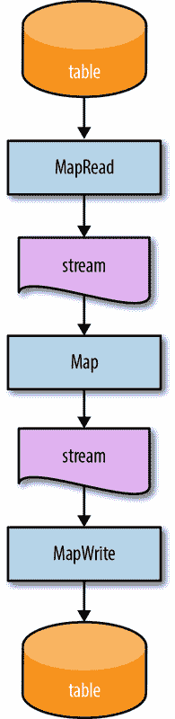
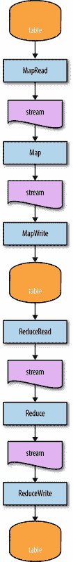
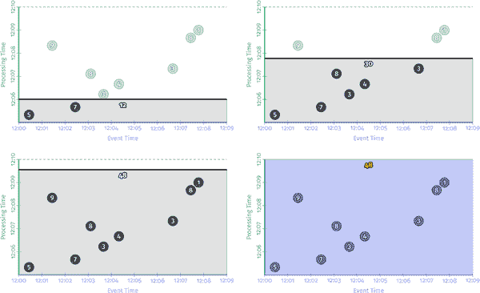
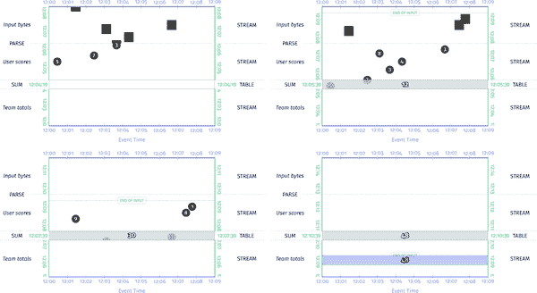
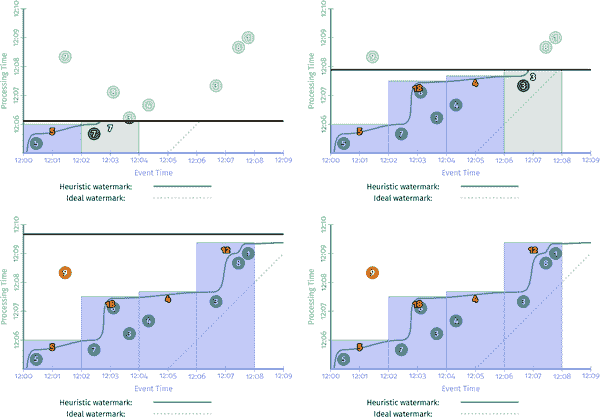
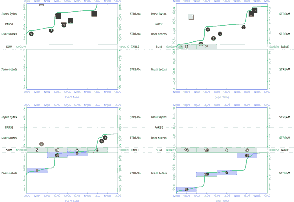
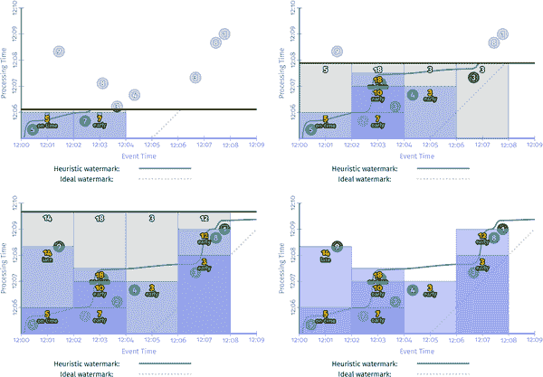
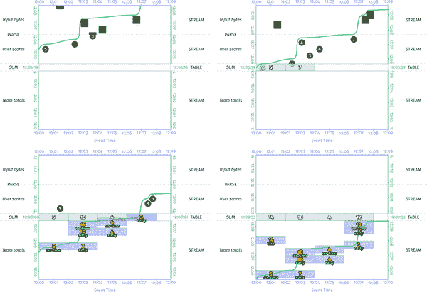
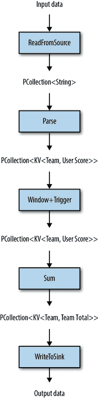
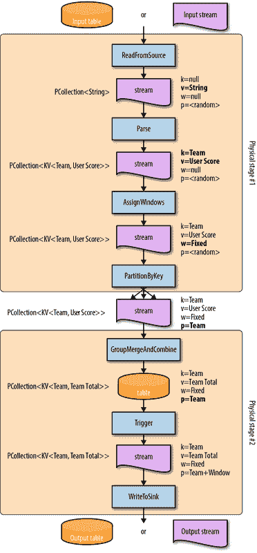

# 第六章：流与表

你已经到达了书中讨论流和表的部分。如果你还记得，在第一章中，我们简要讨论了数据的两个重要但正交的维度：*基数*和*构成*。到目前为止，我们严格关注基数方面（有界与无界），并且忽略了构成方面（流与表）。这使我们能够了解无界数据集引入的挑战，而不用太担心真正驱动事物运作方式的底层细节。我们现在将扩展我们的视野，看看构成的增加维度给混合带来了什么。

虽然有点牵强，但一种思考这种方法转变的方式是将经典力学与量子力学的关系进行比较。你知道在物理课上他们教你一堆经典力学的东西，比如牛顿理论之类的，然后在你觉得你更或多少掌握了之后，他们告诉你那都是废话，经典物理只给你部分图景，实际上还有这个叫做量子力学的东西，它真正解释了更低层次的事物运作方式，但一开始让事情变得复杂并不合理，所以...哦等等...我们之间还没有完全协调好一切，所以只是眯着眼睛相信我们，总有一天一切都会有意义？嗯，这很像那个，只是你的大脑会疼得少一些，因为物理学比数据处理难得多，你也不必眯着眼睛假装一切都有意义，因为实际上最后一切都会美好地结合在一起，这真的很酷。

所以，舞台已经适当地设置好了，这一章的重点有两个：

+   试图描述 Beam 模型（就像我们在书中描述的那样）与“流和表”理论（由[Martin Kleppmann](http://bit.ly/2LO0cik)和[Jay Kreps](http://bit.ly/2sX0bl8)等人普及，但实质上起源于数据库世界）之间的关系。事实证明，流和表理论很好地描述了 Beam 模型的底层概念。此外，当考虑如何将健壮的流处理概念清晰地集成到 SQL 中时，对它们之间的关系有一个清晰的理解尤为重要（这是我们在第八章中考虑的内容）。

+   为了纯粹的乐趣而向你轰炸糟糕的物理学类比。写一本书是一项艰苦的工作；你必须在这里找到一点点小乐趣来继续前行。

# 流与表的基础知识或者说：流与表的相对论特殊理论

流和表的基本概念源自数据库世界。熟悉 SQL 的人可能熟悉表及其核心属性，大致总结为：表包含数据的行和列，每行都由某种键唯一标识，可以是显式的也可以是隐式的。

如果你回想一下大学数据库系统课程，你可能会记得大多数数据库的数据结构是*追加日志*。当事务被应用到数据库中的表时，这些事务被记录在日志中，日志的内容然后被串行应用到表中以实现这些更新。在流和表的命名法中，该日志实际上就是流。

从这个角度来看，我们现在明白了如何从流创建表：表只是应用于流中找到的更新事务日志的结果。但是我们如何从表创建流呢？本质上是相反的：流是表的更改日志。通常用于表到流转换的激励示例是*物化视图*。SQL 中的物化视图允许您在表上指定查询，然后数据库系统将其本身作为另一个一流表来实现。这个物化视图本质上是该查询的缓存版本，数据库系统确保它始终保持最新，因为源表的内容随时间演变。也许并不奇怪，物化视图是通过原始表的更改日志实现的；每当源表更改时，该更改都会被记录。然后数据库在物化视图查询的上下文中评估该更改，并将任何结果更改应用于目标物化视图表。

将这两点结合起来，并运用另一个值得怀疑的物理学类比，我们就得到了可以称之为流和表相对论的特殊理论：

流→表

随时间对更新流的聚合产生一个表。

表→流

随时间观察表的变化产生一个流。

这是一对非常强大的概念，它们对流处理世界的精心应用是 Apache Kafka 巨大成功的一个重要原因，这个生态系统是围绕这些基本原则构建的。然而，这些陈述本身并不够一般化，无法将流和表与 Beam 模型中的所有概念联系起来。为此，我们必须深入一点。

## 朝着流和表相对论的一般理论

如果我们想要将流/表理论与我们对 Beam 模型的所有了解联系起来，我们需要解决一些问题，具体来说：

+   批处理如何融入其中？

+   流与有界和无界数据集的关系是什么？

+   四个“什么”、“哪里”、“何时”、“如何”问题如何映射到流/表世界？

当我们试图这样做时，对流和表有正确的心态将会有所帮助。除了理解它们之间的关系，如前面的定义所捕捉的那样，独立于彼此定义它们也是有启发性的。以下是一个简单的看待它的方式，将强调我们未来分析的一些内容：

+   表是*静态*数据。

    这并不是说表在任何方面都是静态的；几乎所有有用的表在某种程度上都在不断变化。但在任何给定时间，表的快照提供了数据集的某种整体图片。在这方面，表充当数据随时间累积和观察的概念休息地。因此，静态数据。

+   流是*运动中*的数据。

    表捕捉了在*特定时间点*数据集的整体视图，而流捕捉了数据*随时间*的演变。Julian Hyde 喜欢说流就像表的导数，而表就像流的积分，这对于数学思维的人来说是一个很好的思考方式。不管怎样，流的重要特征是它们捕捉了表内数据的固有运动，因为它改变了。因此，数据在运动。

尽管表和流密切相关，但重要的是要记住它们并不完全相同，即使有许多情况下，一个可能完全源自另一个。差异微妙但重要，我们将会看到。

# 批处理与流和表

现在我们已经做好了准备，让我们开始解决一些问题。首先，我们解决第一个问题，关于批处理。最后，我们会发现，关于流与有界和无界数据的关系的解决方案将自然而然地从第一个问题的答案中得出。这是巧合的一次得分。

## MapReduce 的流和表分析

为了保持我们的分析相对简单，但又坚实具体，让我们看看传统[MapReduce](http://bit.ly/2uvKRe6)作业如何适应流/表世界。正如其名称所暗示的，MapReduce 作业表面上由两个阶段组成：Map 和 Reduce。然而，为了我们的目的，更深入地看待它并将其视为六个阶段是有用的：

MapRead

这个阶段消耗输入数据并对其进行一些预处理，使其成为映射的标准键值形式。

Map

这个阶段重复（和/或并行）从预处理输入中消耗一个键值对³，并输出零个或多个键值对。

MapWrite

这个阶段将具有相同键的 Map 阶段输出值组合在一起，并将这些键值对列表组写入（临时）持久存储。这样，MapWrite 阶段本质上是一个按键分组和检查点操作。

ReduceRead

这个阶段消耗保存的洗牌数据，并将它们转换成标准的键值对列表形式以便进行减少。

Reduce

这个阶段重复（和/或并行）消耗一个键及其关联的值记录列表，并输出零个或多个记录，所有这些记录都可以选择保持与相同键相关联。

ReduceWrite

这个阶段将 Reduce 阶段的输出写入输出数据存储。

请注意，MapWrite 和 ReduceRead 阶段有时被称为 Shuffle 阶段的一部分，但对于我们的目的，最好将它们视为独立的阶段。也值得注意的是，MapRead 和 ReduceWrite 阶段的功能如今更常被称为源和汇。然而，撇开这些，现在让我们看看这与流和表的关系。 

### Map 作为流/表

因为我们从静态⁴数据集开始并结束，所以很明显我们从一个表开始并以一个表结束。但在中间我们有什么？天真地，人们可能会认为中间都是表；毕竟，批处理（概念上）被认为是消耗和产生表。如果你把批处理作业看作是执行经典 SQL 查询的粗略类比，那感觉相对自然。但让我们更仔细地看看一步步发生了什么。

首先，MapRead 消耗一个表并产生*某物*。接下来，Map 阶段消耗了这个东西，所以如果我们想要了解它的性质，一个好的起点就是 Map 阶段的 API，它在 Java 中看起来像这样：

```java

void map(KI key, VI value, Emit<KO, VO> emitter);

```

对于输入表中的每个键值对，map 调用将被重复调用。如果你觉得这听起来像输入表被消耗为记录流，那么你是对的。我们稍后会更仔细地看一下表是如何转换为流的，但现在，可以说 MapRead 阶段正在迭代输入表中的静态数据，并将它们以流的形式放入运动中，然后被 Map 阶段消耗。

接下来，Map 阶段消耗了这个流，然后做了什么？因为映射操作是逐元素转换，它并没有做任何会停止移动元素并使其休息的事情。它可能通过过滤一些元素或将一些元素分解成多个元素来改变流的有效基数，但在 Map 阶段结束后，这些元素仍然相互独立。因此，可以说 Map 阶段既消耗流，又产生流。

在 Map 阶段完成后，我们进入 MapWrite 阶段。正如我之前所指出的，MapWrite 通过键分组记录，然后以该格式将它们写入持久存储。实际上，在这一点上，写入的*持久*部分实际上并不是严格必要的，只要*某个地方*有持久性（即，如果上游输入被保存，并且在失败的情况下可以从中重新计算中间结果，类似于 Spark 对 Resilient Distributed Datasets（RDDs）采取的方法）。重要的是记录被组合到某种数据存储中，无论是在内存中，磁盘上，还是其他位置。这很重要，因为由于这个分组操作，以前在流中一个接一个地飞过的记录现在被带到由它们的键所指示的位置，从而允许每个键组积累，就像它们的同类兄弟姐妹到达一样。请注意，这与之前提供的流到表转换的定义有多么相似：*随着时间的推移，对更新流的聚合产生了一个表*。通过根据它们的键对记录进行分组，MapWrite 阶段使这些数据得到休息，从而将流转换回表。⁵酷！

现在我们已经完成了 MapReduce 的一半，所以，使用图 6-1，让我们回顾一下到目前为止我们所看到的内容。

我们已经通过三个操作从表转换为流，然后再转换回来。MapRead 将表转换为流，然后 Map（通过用户的代码）将其转换为新流，然后 MapWrite 将其转换回表。我们将发现 MapReduce 中的接下来的三个操作看起来非常相似，所以我会更快地通过它们，但我仍然想在途中指出一个重要的细节。



###### 图 6-1。 MapReduce 中的映射阶段。表中的数据被转换为流，然后再转换回去。

### 将流/表减少

在 MapWrite 阶段之后，ReduceRead 本身相对不那么有趣。它基本上与 MapRead 相同，只是读取的值是值的单例列表，而不是单个值，因为 MapWrite 存储的数据是键/值列表对。但它仍然只是在表的快照上进行迭代，将其转换为流。这里没有什么新东西。

即使在这种情况下，Reduce 听起来可能很有趣，但实际上它只是一个有点特别的 Map 阶段，它恰好接收每个键的值列表，而不是单个值。因此，它仍然只是将单个（复合）记录映射为零个或多个新记录。这里也没有什么特别新的东西。

ReduceWrite 是一个有点值得注意的阶段。我们已经知道这个阶段必须将流转换为表，因为 Reduce 产生了一个流，最终输出是一个表。但是这是如何发生的呢？如果我告诉你，这是由于将前一阶段的输出键分组到持久存储中的直接结果，就像我们在 MapWrite 中看到的那样，你可能会相信我，直到你记得我之前指出的 Reduce 阶段的键关联是一个*可选*特性。启用了该特性，ReduceWrite *基本上* 与 MapWrite 相同。⁶但是如果禁用了该特性，并且 Reduce 的输出没有关联的键，那么到底发生了什么来使这些数据得到休息呢？

要理解正在发生的事情，重新思考 SQL 表的语义是有用的。虽然经常建议，但并不严格要求 SQL 表具有唯一标识每行的主键。在无键表的情况下，插入的每一行都被视为新的、独立的行（即使其中的数据与表中的一个或多个现有行的数据相同），就像有一个隐式的 AUTO_INCREMENT 字段被用作键一样（顺便说一句，在大多数实现中，实际上就是这样的，即使在这种情况下，“键”可能只是一些从未公开或预期用作逻辑标识符的物理块位置）。这种隐式的唯一键分配正是在没有键数据的 ReduceWrite 中发生的。从概念上讲，仍然发生着按键分组操作；这就是将数据置于静止状态的原因。但是由于缺少用户提供的键，ReduceWrite 将每个记录都视为具有新的、以前从未见过的键，并有效地将每个记录与自身分组，再次导致数据处于静止状态。

看一下图 6-2，它显示了从流/表的角度看整个管道。你可以看到这是一个 TABLE → STREAM → STREAM → TABLE → STREAM → STREAM → TABLE 的序列。即使我们处理的是有界数据，即使我们正在进行传统意义上的批处理，实际上它只是在表面下进行流和表处理。



###### 图 6-2。从流和表的角度看 MapReduce 中的 Map 和 Reduce 阶段

## 与批处理的调和

那么，这对我们的前两个问题有什么影响呢？

1.  **Q:** 批处理如何适应流/表理论？

    **A:** 非常好。基本模式如下：

    1.  表被完整地读取成为流。

    1.  流被处理成新的流，直到遇到分组操作。

    1.  分组将流转换为表。

    1.  步骤 a 到 c 重复，直到管道中没有阶段为止。

1.  **Q:** 流如何与有界/无界数据相关联？

    **A:** 从 MapReduce 示例中可以看出，流只是数据的运动形式，无论它们是有界的还是无界的。

从这个角度来看，很容易看出流/表理论与有界数据的批处理并不矛盾。事实上，它进一步支持了我一直在强调的观点，即批处理和流处理并没有那么不同：归根结底，它一直都是流和表。

有了这个，我们已经在通向流和表的一般理论的道路上了。但是为了清晰地总结，我们最后需要重新讨论流/表上下文中的四个*什么*/*哪里*/*何时*/*如何*问题，看看它们如何相关。

# *什么*、*哪里*、*何时*和*如何*在流和表的世界中

在本节中，我们将看看这四个问题中的每一个，看看它们如何与流和表相关。我们还将回答可能从上一节中挥之不去的任何问题，其中一个重要的问题是：如果分组是将数据置于静止状态的原因，那么“取消分组”的逆过程究竟是什么？稍后再说。但现在，让我们来看看转换。

## *什么*：转换

在第三章中，我们了解到转换告诉我们管道正在计算的*是什么*；也就是说，它是在构建模型、计算总和、过滤垃圾邮件等。我们在前面的 MapReduce 示例中看到，六个阶段中的四个回答了*什么*问题：

+   Map 和 Reduce 都对输入流中的每个键/值或键/值列表对应用了管道作者的逐元素转换，分别产生了一个新的、转换后的流。

+   MapWrite 和 ReduceWrite 都根据上一阶段分配的键对输出进行分组（在可选的 Reduce 情况下可能是隐式的），这样做可以将输入流转换为输出表。

从这个角度来看，你可以看到从流/表理论的角度来看，基本上有两种*what*转换类型：

非分组

这些操作（正如我们在 Map 和 Reduce 中看到的）只是接受一系列记录，并在另一侧生成一系列新的转换记录。非分组转换的示例包括过滤器（例如，删除垃圾邮件消息）、扩展器（即，将较大的复合记录拆分为其组成部分）和变换器（例如，除以 100），等等。

分组

这些操作（正如我们在 MapWrite 和 ReduceWrite 中看到的）接受一系列记录，并以某种方式将它们组合在一起，从而将流转换为表。分组转换的示例包括连接、聚合、列表/集合累积、变更日志应用、直方图创建、机器学习模型训练等。

为了更好地了解所有这些是如何联系在一起的，让我们看一下图 2-2 的更新版本，我们首次开始研究转换。为了避免你跳回去看我们在谈论什么，示例 6-1 包含了我们正在使用的代码片段。

##### 示例 6-1。求和管道

```java

PCollection<String> raw = IO.read(...);
PCollection<KV<Team, Integer>> input = raw.apply(new ParseFn());
PCollection<KV<Team, Integer>> totals =
  input.apply(Sum.integersPerKey());

```

这个管道只是简单地读取输入数据，解析单个团队成员的分数，然后对每个团队的分数进行求和。它的事件时间/处理时间可视化看起来像图 6-3 中呈现的图表。

<assets/stsy_0603.mp4>



###### 图 6-3。经典批处理的事件时间/处理时间视图

图 6-4 描述了随着时间推移，从流和表的角度呈现的管道的更顶层视图。

<assets/stsy_0604.mp4>



###### 图 6-4。经典批处理的流和表视图

在这种可视化的流和表版本中，时间的流逝通过在处理时间维度（y 轴）向下滚动图形区域来体现。以这种方式呈现事物的好处在于，它非常清楚地指出了非分组和分组操作之间的差异。与我们以前的图表不同，在那些图表中，我省略了管道中除了`Sum.integersByKey`之外的所有初始转换操作，但在这里，我也包括了初始的解析操作，因为解析操作的非分组方面与求和的分组方面形成了鲜明对比。从这个角度来看，很容易看出两者之间的区别。非分组操作对流中的元素运动没有任何影响，因此在另一侧产生另一个流。相反，分组操作将流中的所有元素汇聚在一起，将它们相加得到最终的总和。因为这个示例是在有界数据上运行的批处理引擎上运行的，最终结果只有在输入结束后才会被发出。正如我们在第二章中指出的那样，这个示例对有界数据是足够的，但在无界数据的情况下太过限制，因为理论上输入永远不会结束。但它真的不够吗？

从图表的新流/表部分来看，如果我们所做的只是计算总和作为我们的最终结果（而不在管道中的下游实际上以任何其他方式转换这些总和），那么我们用分组操作创建的表中就有我们的答案，随着新数据的到来而不断演变。为什么我们不直接从那里读取我们的结果呢？

这正是那些支持流处理器作为数据库的人所要表达的观点⁸（主要是 Kafka 和 Flink 团队）：在管道中进行分组操作时，实际上创建了一个包含该阶段输出值的表。如果这些输出值恰好是管道正在计算的最终结果，那么如果可以直接从该表中读取它们，就不需要在其他地方重新生成它们。除了在时间演变过程中提供快速和便捷的结果访问外，这种方法通过不需要在管道中添加额外的接收阶段来节省计算资源，通过消除冗余数据存储来节省磁盘空间，并且消除了构建前述接收阶段的任何工程工作的需要。⁹ 唯一的主要注意事项是，您需要小心确保只有数据处理管道有能力对表进行修改。如果表中的值可以在管道之外由外部修改而发生变化，那么关于一致性保证的所有赌注都将失效。

行业中有许多人一直在推荐这种方法，并且它正在被广泛应用于各种场景中。我们已经看到 Google 内部的 MillWheel 客户通过直接从基于 Bigtable 的状态表中提供数据来做同样的事情，而且我们正在为从 Google 内部使用的 C++-based Apache Beam 等效版本（Google Flume）中的管道外部访问状态添加一流支持；希望这些概念将来某一天能够真正地传递到 Apache Beam。

现在，如果从状态表中读取值是很好的，如果其中的值是您的最终结果。但是，如果您在管道下游有更多的处理要执行（例如，想象一下我们的管道实际上正在计算得分最高的团队），我们仍然需要一种更好的方式来处理无界数据，允许我们以更增量的方式将表转换回流。为此，我们将希望通过剩下的三个问题的旅程，从窗口化开始，扩展到触发，最后将其与累积结合起来。

## *在哪里*：窗口化

正如我们从第三章所知，窗口化告诉我们在事件时间中分组发生的位置。结合我们之前的经验，我们也可以推断它必须在流到表转换中起到作用，因为分组是驱动表创建的原因。窗口化有两个方面与流/表理论相互作用：

窗口分配

这实际上意味着将记录放入一个或多个窗口中。

窗口合并

这就是使动态的、数据驱动类型的窗口（例如会话）成为可能的逻辑。

窗口分配的效果非常直接。当记录在概念上放置到窗口中时，窗口的定义基本上与该记录的用户分配的键结合起来，以在分组时创建一个隐式的复合键。¹⁰ 简单。

为了完整起见，让我们再次从第三章的原始窗口化示例中看一看，但从流和表的角度来看。如果你还记得，代码片段看起来有点像示例 6-2（这次没有省略解析）。

##### 示例 6-2。求和管道

```java

PCollection<String> raw = IO.read(...);
PCollection<KV<Team, Integer>> input = raw.apply(new ParseFn());
PCollection<KV<Team, Integer>> totals = input
  .apply(Window.into(FixedWindows.of(TWO_MINUTES)))
  .apply(Sum.integersPerKey());

```

原始可视化效果如图 6-5 所示。

<assets/stsy_0605.mp4>


###### 图 6-5。批处理引擎上窗口化求和的事件时间/处理时间视图

现在，图 6-6 显示了流和表的版本。

<assets/stsy_0606.mp4>


###### 图 6-6。批处理引擎上窗口化求和的流和表视图

正如你可能期望的那样，这看起来与图 6-4 非常相似，但表中有四个分组（对应数据占据的四个窗口），而不是只有一个。但与以前一样，我们必须等到有界输入结束后才能发出结果。我们将在下一节讨论如何处理无界数据，但首先让我们简要谈一下合并窗口。

### 窗口合并

接下来讨论合并，我们会发现窗口合并的影响比窗口分配更加复杂，但是当你考虑到需要发生的逻辑操作时，它仍然是直接的。当将流分组到可以合并的窗口时，该分组操作必须考虑到所有可能合并在一起的窗口。通常，这仅限于数据都具有相同键的窗口（因为我们已经确定窗口化修改了分组不仅仅是按键，还有键和窗口）。因此，系统实际上并不将键/窗口对视为一个平面复合键，而是将其视为分层键，用户分配的键是根，窗口是该根的子组件。当实际上将数据分组在一起时，系统首先按分层复合键的根（用户分配的键）进行分组。在按键分组后，系统可以继续在该键内按窗口进行分组（使用分层复合键的子组件）。按窗口进行分组就是窗口合并发生的地方。

从流和表的角度来看，有趣的是窗口合并如何改变最终应用于表的突变；也就是说，它如何修改了随时间指示表内容的更改日志。对于非合并窗口，每个新分组的元素都会导致对表的单个突变（将该元素添加到元素的键+窗口的组中）。对于合并窗口，分组新元素的操作可能导致一个或多个现有窗口与新窗口合并。因此，合并操作必须检查当前键的所有现有窗口，找出哪些窗口可以与新窗口合并，然后原子地删除旧未合并窗口并插入新合并窗口到表中。这就是为什么支持合并窗口的系统通常将原子性/并行性的单位定义为键，而不是键+窗口。否则，要提供正确性保证所需的强一致性将是不可能的（或者至少更加昂贵）。当你开始以这种细节水平来看待它时，你就会明白为什么让系统来处理窗口合并的麻烦事是多么美妙。要更近距离地了解窗口合并语义，我建议你参考[“数据流模型”](http://bit.ly/2sXgVJ3)的 2.2.2 节。

归根结底，窗口化实际上只是对分组语义的轻微改变，这意味着它对流到表转换的语义也是轻微的改变。对于窗口分配，就像在分组时将窗口合并到隐式复合键中一样简单。当涉及窗口合并时，这个复合键更像是一个分层键，允许系统处理按键分组，找出该键内的窗口合并，然后原子地应用所有必要的突变到相应的表中。抽象层次的叠加真是太好了！

尽管如此，我们实际上还没有解决将表转换为流的问题，特别是在无界数据的情况下以更增量的方式进行。为此，我们需要重新审视触发器。

## *何时*：触发器

我们在第三章学到，我们使用触发器来决定窗口的内容何时被实现（水印为某些类型的触发器提供了输入完整性的有用信号）。在数据被分组到窗口中之后，我们使用触发器来决定何时将这些数据发送到下游。在流/表术语中，我们了解到分组意味着流到表的转换。从那里，我们可以很容易地看到触发器是分组的补充；换句话说，这是我们之前所探索的“取消分组”操作。触发器是驱动表到流转换的东西。

在流/表术语中，触发器是应用于表的特殊程序，允许对表中的数据在响应相关事件时进行实现。以这种方式陈述，它们实际上听起来非常类似于经典数据库触发器。事实上，这里选择的名称并非巧合；它们本质上是相同的东西。当您指定触发器时，实际上是在随着时间的推移为状态表中的每一行编写代码。当触发器触发时，它会获取当前静止在表中的相应数据，并将它们置于运动中，产生一个新的流。

让我们回到我们的例子。我们将从第二章的简单的每记录触发器开始，该触发器在每次到达新记录时都会发出新的结果。该示例的代码和事件时间/处理时间可视化如示例 6-3 所示。图 6-7 呈现了结果。

##### 示例 6-3. 每条记录重复触发

```java

PCollection<String>> raw = IO.read(...);
PCollection<KV<Team, Integer>> input = raw.apply(new ParseFn());	
PCollection<KV<Team, Integer>> totals = input
  .apply(Window.into(FixedWindows.of(TWO_MINUTES))
               .triggering(Repeatedly(AfterCount(1))));
  .apply(Sum.integersPerKey());

```

<assets/stsy_0607.mp4>


###### 图 6-7. 批处理引擎上窗口求和的流和表视图

与以前一样，每次遇到新记录时都会实现新的结果。以流和表类型的视图呈现，该图将类似于图 6-8。 

<assets/stsy_0608.mp4>


###### 图 6-8. 流引擎上每条记录触发的窗口求和的流和表视图

使用每条记录触发器的一个有趣的副作用是它在某种程度上掩盖了数据被静止的效果，因为它们随后立即被触发器重新置于运动中。即便如此，从分组中产生的聚合物件仍然静止在表中，而未分组的值流则从中流走。

为了更好地了解静止/运动关系，让我们跳过我们的触发示例，转到第二章的基本水印完整性流示例，该示例在完成时简单地发出结果（由于水印通过窗口末端）。该示例的代码和事件时间/处理时间可视化如示例 6-4 所示（请注意，我这里只显示了启发式水印版本，以便简洁和比较），图 6-9 说明了结果。

##### 示例 6-4. 水印完整性触发器

```java

PCollection<String> raw = IO.read(...);
PCollection<KV<Team, Integer>> input = raw.apply(new ParseFn());
PCollection<KV<Team, Integer>> totals = input
  .apply(Window.into(FixedWindows.of(TWO_MINUTES))
               .triggering(AfterWatermark()))
  .apply(Sum.integersPerKey());

```

<assets/stsy_0609.mp4>



###### 图 6-9. 流引擎上带有启发式水印的窗口求和的事件时间/处理时间视图

由于在示例 6-4 中指定的触发器声明窗口应在水印通过它们时实现，系统能够在管道的无界输入变得越来越完整时以渐进的方式发出结果。在图 6-10 中的流和表版本中，它看起来就像您所期望的那样。

<assets/stsy_0610.mp4>



###### 图 6-10. 带有启发式水印的窗口求和的流和表视图

在这个版本中，您可以非常清楚地看到触发器对状态表的取消分组效果。随着水印通过每个窗口的末尾，它将该窗口的结果从表中取出，并将其与表中的所有其他值分开，向下游传送。当然，我们仍然有之前的迟到数据问题，我们可以再次使用示例 6-5 中显示的更全面的触发器来解决。

##### 示例 6-5。通过早期/准时/迟 API 进行早期、准时和迟触发

```java

PCollection<String> raw = IO.read(...);
PCollection<KV<Team, Integer>> input = raw.apply(new ParseFn());
PCollection<KV<Team, Integer>> totals = input
  .apply(Window.into(FixedWindows.of(TWO_MINUTES))
               .triggering(
                 AfterWatermark()
                   .withEarlyFirings(AlignedDelay(ONE_MINUTE))
                   .withLateFirings(AfterCount(1))))
  .apply(Sum.integersPerKey());

```

事件时间/处理时间图看起来像图 6-11。

<assets/stsy_0611.mp4>



###### 图 6-11。事件时间/处理时间视图的窗口求和在具有早期/准时/迟触发器的流引擎上

而流和表版本看起来像图 6-12 所示。

<assets/stsy_0612.mp4>



###### 图 6-12。具有早期/准时/迟触发器的流引擎上窗口求和的流和表视图

这个版本更清楚地显示了触发器的取消分组效果，根据示例 6-6 中指定的触发器，将表的各个独立部分呈现为流的不断变化视图。

到目前为止，我们谈到的所有具体触发器的语义（事件时间、处理时间、计数、早期/准时/迟等复合触发器等）都符合我们从流/表视角看到的预期，因此不值得进一步讨论。然而，我们还没有花太多时间讨论触发器在经典批处理场景中的样子。现在我们了解了批处理管道的底层流/表拓扑结构是什么样子，这值得简要提及。

归根结底，在经典批处理场景中实际上只有一种类型的触发器：当输入完成时触发。对于我们之前看过的 MapReduce 作业的初始 MapRead 阶段，该触发器在概念上会立即为输入表中的所有数据触发，因为批处理作业的输入被假定为从一开始就是完整的。¹¹因此，该输入源表将被转换为单个元素的流，之后 Map 阶段可以开始处理它们。

在管道中间的表到流转换中，例如我们示例中的 ReduceRead 阶段，使用相同类型的触发器。然而，在这种情况下，触发器实际上必须等待表中的所有数据完成（即更常见地称为所有数据被写入洗牌），就像我们示例中的批处理管道在图 6-4 和 6-6 中等待输入结束之前发出最终结果一样。

鉴于经典批处理实际上总是使用输入数据完成触发器，您可能会问在批处理场景中作者指定的任何自定义触发器可能意味着什么。答案实际上是：这取决于情况。有两个值得讨论的方面：

触发器的保证（或缺乏保证）

大多数现有的批处理系统都是根据这种锁步读取-处理-分组-写入-重复的顺序进行设计的。在这种情况下，很难提供任何更精细的触发能力，因为它们可能会在管道的最终洗牌阶段才会表现出任何变化。然而，这并不意味着用户指定的触发器不会被尊重；触发器的语义是可以在适当的时候采用更低的共同分母。

例如，`AfterWatermark`触发器意味着在水印通过窗口结束时触发。 它不保证水印在触发时距离窗口结束有多远。 同样，`AfterCount(N)`触发器只保证在触发之前已处理*至少 N*个元素；*N*很可能是输入集中的所有元素。

请注意，触发器名称的巧妙措辞并不仅仅是为了适应经典的批处理系统，而是模型本身的一个非常必要的部分，考虑到触发的自然异步性和不确定性。 即使在经过精心调整的低延迟真正流式处理系统中，基本上不可能保证`AfterWatermark`触发器会在水印恰好*在*任何给定窗口的结束时触发，除非在极端有限的情况下（例如，单台机器处理管道的所有数据，并且负载相对较小）。 即使您可以保证，真的有什么意义吗？ 触发器提供了一种控制数据从表到流的流动的手段，仅此而已。

批处理和流处理的融合

根据我们在本文中学到的知识，应该清楚批处理和流处理系统之间的主要语义区别是触发表的增量能力。 但即使这也不是真正的语义区别，而更多的是延迟/吞吐量的权衡（因为批处理系统通常以更高的吞吐量换取更高的结果延迟）。

这可以追溯到我在“批处理和流处理效率差异”中所说的一些内容：今天批处理和流处理系统之间实际上没有太大的区别，除了效率差异（有利于批处理）和处理无界数据的自然能力（有利于流处理）。 我当时认为，这种效率差异很大程度上来自于更大的捆绑大小（明确地在延迟和吞吐量之间进行折衷）和更有效的洗牌实现（即，流→表→流转换）。 从这个角度来看，应该可以提供一个系统，它可以无缝地整合两者的优点：既可以自然地处理无界数据，又可以通过透明地调整捆绑大小、洗牌实现和其他实现细节来平衡延迟、吞吐量和成本之间的紧张关系，以满足广泛的用例。

这正是 Apache Beam 在 API 级别已经做到的。¹² 这里提出的论点是，在执行引擎级别也有统一的空间。 在这样的世界中，批处理和流处理将不再存在，我们将能够永远告别批处理*和*流处理作为独立的概念。 我们将只有结合了两者最佳思想的通用数据处理系统，以提供特定用例的最佳体验。 某一天。

在这一点上，我们可以在触发部分插入叉子。 它完成了。 在我们全面了解 Beam 模型和流和表理论之间关系的过程中，我们只有一个更简短的停留：*累积*。

## *如何*：累积

在第二章中，我们了解到三种累积模式（丢弃、累积、累积和撤销¹³）告诉我们结果的细化如何与窗口在其生命周期内多次触发相关。 幸运的是，在这里与流和表的关系非常直接：

+   *丢弃模式*要求系统在触发时要么丢弃窗口的先前值，要么保留先前值的副本并在下次窗口触发时计算增量¹⁴。（这种模式最好被称为增量模式。）

+   *累积模式*不需要额外的工作；在触发时表中窗口的当前值就会被发出。（这种模式最好被称为值模式。）

+   *累积和撤回模式*需要保留窗口中所有先前触发的（但尚未撤回）值的副本。在合并窗口（如会话）的情况下，先前值的列表可能会变得非常大，但对于干净地撤销先前触发的效果是至关重要的，因为新值不能简单地用于覆盖先前的值。（这种模式最好被称为值和撤回模式。）

流和表的可视化对累积模式的语义几乎没有额外的洞察力，因此我们不会在这里进行调查。

## Beam 模型中流和表的整体视图

在解决了这四个问题之后，我们现在可以对 Beam 模型流水线中的流和表进行整体视图。让我们以我们的运行示例（团队得分计算流水线）为例，看看它在流和表级别的结构是什么样子。流水线的完整代码可能类似于示例 6-6（重复示例 6-4）。

##### 示例 6-6。我们完整的分数解析流水线

```java

PCollection<String> raw = IO.read(...);
PCollection<KV<Team, Integer>> input = raw.apply(new ParseFn());
PCollection<KV<Team, Integer>> totals = input
  .apply(Window.into(FixedWindows.of(TWO_MINUTES))
               .triggering(
                 AfterWatermark()
                   .withEarlyFirings(AlignedDelay(ONE_MINUTE))
                   .withLateFirings(AfterCount(1))))
  .apply(Sum.integersPerKey());

```

将其分解为由中间的`PCollection`类型分隔的阶段（我使用了更语义化的“类型”名称，如`Team`和`User Score`，而不是真实类型，以便清楚地说明每个阶段发生了什么），你会得到类似于图 6-13 所示的东西。



###### 图 6-13。团队得分总和流水线的逻辑阶段，带有中间的 PCollection 类型

当您实际运行此流水线时，它首先通过优化器，其工作是将此逻辑执行计划转换为经过优化的物理执行计划。每个执行引擎都是不同的，因此实际的物理执行计划将在运行程序之间有所不同。但是一个可信的计划可能看起来像图 6-14。



###### 图 6-14。团队得分总和流水线的理论物理阶段，带有中间的 PCollection 类型

这里有很多事情要做，所以让我们逐一讨论。图 6-13 和 6-14 之间有三个主要区别，我们将讨论：

逻辑与物理操作

作为构建物理执行计划的一部分，底层引擎必须将用户提供的逻辑操作转换为引擎支持的一系列原始操作。在某些情况下，这些物理等价物看起来基本相同（例如`Parse`），而在其他情况下，它们则非常不同。

物理阶段和融合

在流水线中，将每个逻辑阶段作为完全独立的物理阶段执行通常是低效的（伴随着每个阶段之间的序列化、网络通信和反序列化开销）。因此，优化器通常会尝试将尽可能多的物理操作融合成单个物理阶段。

键、值、窗口和分区

为了更清楚地说明每个物理操作正在做什么，我已经注释了中间的`PCollection`，并注明了每个点的键、值、窗口和数据分区的类型。

现在让我们详细地走一遍每个逻辑操作，看看它在物理计划中是如何转换的，以及它们如何与流和表相关联：

`ReadFromSource`

除了与紧随其后的物理操作融合在一起（`Parse`），`ReadFromSource`的翻译中并没有太多有趣的事情发生。就我们目前数据的特征而言，因为读取基本上是消耗原始输入字节，我们基本上有没有键、没有窗口和没有（或随机的）分区的原始字符串。原始数据源可以是表（例如 Cassandra 表）或流（例如 RabbitMQ）或类似两者的东西（例如处于日志压缩模式的 Kafka）。但无论如何，从输入源读取的最终结果是一个流。

`Parse`

逻辑`Parse`操作也以相对直接的方式转换为物理版本。`Parse`从原始字符串中提取键（团队 ID）和值（用户得分）。这是一个非分组操作，因此它消耗的流仍然是另一侧的流。

`Window+Trigger`

这个逻辑操作分布在许多不同的物理操作中。首先是窗口分配，其中每个元素被分配到一组窗口中。这立即发生在`AssignWindows`操作中，这是一个非分组操作，只是用窗口注释流中的每个元素，使其属于的窗口，产生另一个流。

第二个是窗口合并，我们在本章前面学到的，作为分组操作的一部分发生。因此，它被沉入管道后面的`GroupMergeAndCombine`操作中。我们在下一个逻辑`Sum`操作时讨论该操作。

最后，有触发。触发发生在分组之后，是我们将由分组创建的表转换回流的方式。因此，它被沉入自己的操作中，跟随`GroupMergeAndCombine`。

`Sum`

求和实际上是一个复合操作，由几个部分组成：分区和聚合。分区是一个非分组操作，以这样的方式重定向流中的元素，使得具有相同键的元素最终进入同一台物理机。分区的另一个词是洗牌，尽管这个术语有点过载，因为“Shuffle”在 MapReduce 意义上通常用来表示分区*和*分组（*和*排序，无论如何）。无论如何，分区在物理上改变了流，使其可以分组，但实际上并没有做任何事情来使数据真正停下来。因此，它是一个非分组操作，产生另一个流。

分区后是分组。分组本身是一个复合操作。首先是按键分组（由先前的按键分区操作启用）。接下来是窗口合并和按窗口分组，正如我们之前描述的那样。最后，因为求和在 Beam 中是作为`CombineFn`实现的（本质上是一个增量聚合操作），所以有组合，即当单个元素到达时将它们相加。具体细节对我们来说并不是非常重要的。重要的是，由于这显然是一个分组操作，我们的流链现在最终停留在一个包含随着时间演变的团队总分的表中。

`WriteToSink`

最后，我们有写操作，它接收触发产生的流（你可能还记得它被沉入`GroupMergeAndCombine`操作下面），并将其写入到我们的输出数据汇中。数据本身可以是表或流。如果是表，`WriteToSink`将需要执行某种分组操作来将数据写入表中。如果是流，就不需要分组（尽管可能仍然需要分区；例如，当写入类似 Kafka 的东西时）。

这里的重点不是物理计划中正在进行的一切的精确细节，而是 Beam 模型与流和表世界的整体关系。我们看到了三种类型的操作：非分组（例如，`解析`），分组（例如，`GroupMergeAndCombine`），和取消分组（例如，`触发`）。非分组操作总是消耗流并在另一侧产生流。分组操作总是消耗流并产生表。取消分组操作消耗表并产生流。这些见解以及我们一路学到的一切足以让我们制定关于 Beam 模型与流和表关系的更一般理论。

# 流和表相对论的一般理论

在调查了流处理、批处理、四个*什么*/*哪里*/*何时*/*如何*问题以及整个 Beam 模型与流和表理论的关系之后，现在让我们试图阐明流和表相对论的更一般定义。

流和表相对论的一般理论：

+   *数据处理管道*（批处理和流处理）包括对这些表和流进行的*操作*。

+   *表*是*静止的数据*，作为数据积累和随时间观察的容器。

+   *流*是*运动中的数据*，并编码了随时间演变的表的离散视图。

+   *操作*作用于流或表并产生新的流或表。它们被分类如下：

    +   流 → 流：非分组（逐元素）操作

        对流应用*非分组*操作会改变流中的数据，同时保持它们在运动中，产生一个可能具有不同基数的新流。

    +   流 → 表：分组操作

        在流中对数据进行*分组*会使这些数据静止下来，产生一个随时间演变的*表*。

        +   *窗口化*将事件时间维度纳入这样的分组中。

        +   *合并窗口*会随时间动态组合，使它们能够根据观察到的数据重新塑造自己，并决定键保持原子性/并行化的单位，窗口作为该键内分组的子组件。

    +   表 → 流：取消分组（触发）操作

        在表中*触发*数据会将它们取消分组并投入运动，产生一个捕获表随时间演变的*流*。

        +   *水印*提供了相对于事件时间的输入完整性概念，这是一个有用的参考点，特别是在触发事件时间戳数据时，特别是从无界流中分组的数据。

        +   触发器的*累积模式*决定了流的性质，决定它是否包含增量或值，以及是否提供先前增量/值的撤销。

    +   表 → 表：（无）

        没有操作可以消耗表并产生表，因为数据不可能在不被投入运动的情况下从静止到静止。因此，对表的所有修改都是通过转换为流，然后再转换回来。

我喜欢这些规则的原因是它们很有道理。它们给人一种非常自然和直观的感觉，因此使人更容易理解数据如何通过一系列操作流动（或不流动）。它们规范了这样一个事实：在任何给定时间，数据存在于两种状态中的一种（流或表格），并且它们提供了简单的规则来推理这些状态之间的转换。它们通过展示窗口化只是每个人都本能理解的分组的轻微修改来揭示窗口化的神秘。它们强调了为什么分组操作通常是流处理中的一个难点（因为它们将流中的数据转化为表格），但也非常清楚地表明了需要哪些操作来解决这个问题（触发器；即非分组操作）。它们强调了在概念上批处理和流处理实际上是多么统一。

当我开始写这一章时，我并不完全确定最终会得到什么，但最终的结果比我想象的要令人满意得多。在接下来的章节中，我们将再次使用这种流和表格相对论的理论来指导我们的分析。每一次应用都会带来清晰和洞察力，否则这些洞察力将会更难获得。流和表格是最好的。

# 总结

在这一章中，我们首先建立了流和表格理论的基础。我们首先相对地定义了流和表格：

流 → 表格

随着时间的推移，对更新流的聚合会产生一个表格。

表格 → 流

随着时间的推移观察表格的变化会产生一个流。

接下来我们独立定义它们：

+   表格是数据*静止*的。

+   流是数据*在运动*中。

然后，我们从流和表格的角度评估了经典的 MapReduce 批处理计算模型，并得出结论，以下四个步骤描述了从这个角度进行的批处理：

1.  表格被完整地读取以成为流。

1.  流被处理成新的流，直到遇到分组操作。

1.  分组将流转换为表格。

1.  步骤 1 到 3 重复，直到管道中的操作用尽。

通过这种分析，我们能够看到流在批处理中和流处理中同样重要，以及数据是流的想法与所讨论的数据是有界还是无界是无关的。

接下来，我们花了很多时间考虑流和表格之间的关系，以及 Beam 模型提供的强大的、无序的流处理语义，最终得出了我们在前一节中列举的流和表格相对论的一般理论。除了流和表格的基本定义之外，该理论的关键见解是数据处理管道中有四（实际上只有三）种操作类型：

流 → 流

非分组（逐元素）操作

流 → 表格

分组操作

表格 → 流

非分组（触发）操作

表格 → 表格

（不存在）

通过这种方式对操作进行分类，可以轻松地理解数据如何随着时间在给定的管道中流动（或停留）。

最后，也许最重要的是，我们学到了这一点：当你从流和表格的角度看问题时，批处理和流处理在概念上实际上是一样的。有界或无界都无所谓。从头到尾都是流和表格。

</bad-physics-jokes>

¹ 如果你不是为了计算机科学而上大学，但你已经读到了这本书的这一部分，你很可能是 1）我的父母，2）受虐狂，或者 3）非常聪明（就记录而言，我并不意味着这些群体必然是互相排斥的；如果你能理解这一点，妈妈和爸爸，就自己想想吧！<winky-smiley/>）。

2 请注意，在某些情况下，表本身可以接受时间作为查询参数，允许您向过去查看表的快照。

3 请注意，对于单个 mapper 观察到的两个连续记录的键，没有任何保证，因为尚未进行键分组。这里的键实际上只是为了让带键数据集以一种自然的方式被消费，如果输入数据没有明显的键，它们实际上都将共享一个全局的空键。

4 将批处理作业的输入称为“静态”可能有点过分。实际上，被消费的数据集在处理过程中可能会不断变化；也就是说，如果你直接从 HBase/Bigtable 表中读取在时间戳范围内的数据，这些数据并不保证是不可变的。但在大多数情况下，建议的方法是确保你以某种方式处理了输入数据的静态快照，任何偏离这一假设的情况都是自己的风险。

5 请注意，按键对流进行分组与简单地按键对流进行*分区*是有重要区别的，后者确保具有相同键的所有记录最终由同一台机器处理，但并不会使记录停止。它们仍然保持运动，因此继续作为流进行。分组操作更像是按键分区后写入适当分区的组，这是使它们停止并将流转换为表的原因。

6 一个巨大的区别，至少从实现的角度来看，是 ReduceWrite 知道键已经被 MapWrite 分组在一起，进一步知道 Reduce 无法改变键，因此它可以简单地累积减少值生成的输出，以便将它们分组在一起，这比 MapWrite 阶段所需的完整洗牌实现要简单得多。

7 另一种看待这个问题的方式是，有两种类型的表：可更新的和可追加的；这是 Flink 团队为他们的 Table API 所构建的方式。但即使这是捕捉到两种情况的观察语义的一个很好的直观方式，我认为它掩盖了实际发生的导致流变成表的基本本质；也就是分组。

8 尽管从这个例子中我们可以清楚地看到，这不仅仅是一个流处理的问题；如果批处理系统的状态表是全局可读的，你也可以得到相同的效果。

9 如果你的存储系统中还没有适合的接收器，这将特别痛苦；构建能够保证一致性的适当接收器是一个令人惊讶地微妙和困难的任务。

10 这也意味着，如果你将一个值放入多个窗口——例如滑动窗口——这个值在概念上必须被复制成多个独立的记录，每个窗口一个。即便如此，在某些情况下，底层系统可以智能地处理某些类型的重叠窗口，从而优化掉实际复制值的需要。例如，Spark 就为滑动窗口做到了这一点。

11 请注意，批处理管道中事物工作的这种高层概念视图掩盖了有效触发整个数据表的复杂性，特别是当该表足够大以至于需要多台机器来处理时。Beam 最近添加的 SplittableDoFn API 提供了一些关于涉及的机制的见解。

12 是的，如果你将批处理和流处理混合在一起，你就会得到 Beam，这也是这个名字最初的由来。真的。

13 这就是为什么你应该始终使用牛津逗号。

¹⁴请注意，在合并窗口的情况下，除了合并两个窗口的当前值以得到合并后的当前值之外，还需要合并这两个窗口的先前值，以便在触发时间后进行合并增量的计算。
