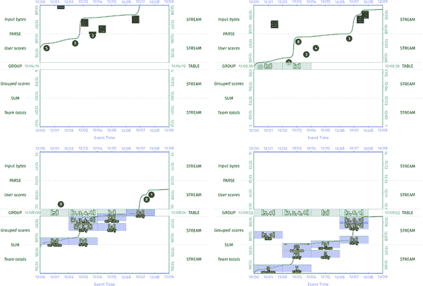
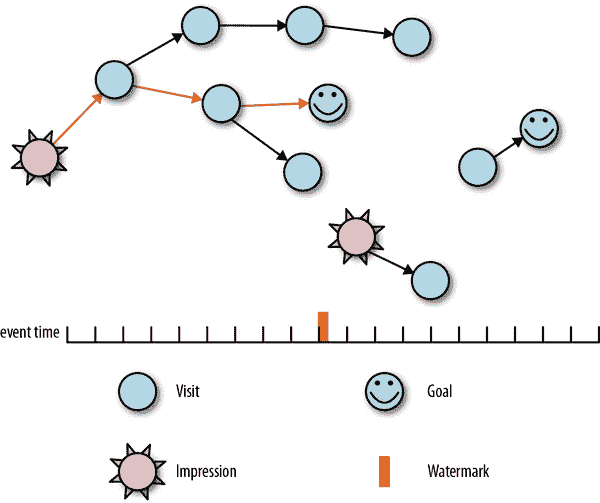

# 第七章：持久状态的实际性

人们为什么写书？当你排除了创造的乐趣、对语法和标点的某种喜爱，也许偶尔的自恋，你基本上只剩下了捕捉本来是短暂的想法，以便将来可以重新访问。在非常高的层面上，我刚刚激发并解释了数据处理管道中的持久状态。

持久状态，确切地说，就是我们在第六章中讨论过的表，额外的要求是这些表要稳固地存储在相对不易丢失的介质上。存储在本地磁盘上是可以的，只要你不问你的网站可靠性工程师。存储在一组复制的磁盘上更好。存储在不同物理位置的一组复制的磁盘上更好。存储在内存中绝对不算数。存储在多台机器上的复制内存，配备 UPS 电源备份和现场发电机，也许可以算数。你明白了。

在本章中，我们的目标是做以下事情：

+   激发管道内持久状态的需求

+   看看管道内经常出现的两种隐式状态形式

+   考虑一个现实世界的用例（广告转化归因），它本身不适合隐式状态，用它来激发一般显式持久状态管理的显著特点

+   探索一个具体的状态 API 的实例，就像在 Apache Beam 中找到的那样

# 动机

首先，让我们更准确地激发持久状态。我们从第六章知道，分组是给我们提供表的东西。而我在本章开头提出的核心观点是正确的：持久化这些表的目的是捕获其中包含的本来是短暂的数据。但为什么这是必要的呢？

## 失败的必然性

这个问题的答案在处理无界输入数据的情况下最清楚，所以我们从那里开始。主要问题是处理无界数据的管道实际上是打算永远运行的。但永远运行是一个更具挑战性的服务级别目标，远远超出了这些管道通常执行的环境所能实现的。长时间运行的管道将不可避免地因为机器故障、计划维护、代码更改以及偶尔的配置错误命令而中断整个生产管道集群。为了确保它们可以在这些情况发生时恢复到中断之前的状态，长时间运行的管道需要某种持久的记忆来记录它们中断之前的位置。这就是持久状态的作用。

让我们在无界数据之外再扩展一下这个想法。这只在无界情况下才相关吗？批处理管道使用持久状态吗，为什么或为什么不？与我们遇到的几乎每一个批处理与流处理的问题一样，答案与批处理和流处理系统本身的性质无关（也许这并不奇怪，鉴于我们在第六章学到的东西），而更多地与它们历史上用于处理的数据集类型有关。

有界数据集本质上是有限大小的。因此，处理有界数据的系统（历史上是批处理系统）已经针对这种情况进行了调整。它们通常假设在失败时可以重新处理输入的全部内容。换句话说，如果处理管道的某个部分失败，如果输入数据仍然可用，我们可以简单地重新启动处理管道的适当部分，让它再次读取相同的输入。这被称为*重新处理输入*。

他们可能还会假设失败不太频繁，因此会尽量少地进行持久化，接受在失败时重新计算的额外成本。对于特别昂贵的多阶段管道，可能会有某种每阶段全局检查点的方式，以更有效地恢复执行（通常作为洗牌的一部分），但这并不是严格要求，可能在许多系统中都不存在。

另一方面，无界数据集必须假定具有无限大小。因此，处理无界数据的系统（历史上的流处理系统）已经建立起来。它们从不假设所有数据都可用于重新处理，只假设其中的某个已知子集可用。为了提供至少一次或精确一次的语义，任何不再可用于重新处理的数据必须在持久检查点中得到考虑。如果最多一次是您的目标，您就不需要检查点。

归根结底，持久状态并不是批处理或流处理特有的。状态在这两种情况下都是有用的。只是在处理无界数据时，它变得至关重要，因此您会发现流处理系统通常提供更复杂的持久状态支持。

## 正确性和效率

考虑到失败的不可避免性和应对失败的需要，持久状态可以被视为提供两个东西：

+   在处理暂时输入时，提供正确性的*基础*。在处理有界数据时，通常可以安全地假设输入会永远存在；¹对于无界数据，这种假设通常不符合现实。持久状态允许您保留必要的中间信息，以便在不可避免的情况发生时继续处理，即使您的输入源已经移动并且忘记了之前提供给您的记录。

+   一种*最小化重复工作和持久化数据*的方式，作为应对失败的一部分。无论您的输入是暂时的，当您的管道遇到机器故障时，任何未在某个地方进行检查点的失败机器上的工作都必须重新进行。根据管道的性质和其输入，这在两个方面可能是昂贵的：重新处理期间执行的工作量以及存储以支持重新处理的输入数据量。

    最小化重复工作相对比较简单。通过在管道内部进行部分进度的检查点（计算的中间结果以及检查点时间内的当前输入位置），可以大大减少失败发生时重复工作的量，因为检查点之前的操作都不需要从持久输入中重新播放。最常见的是，这涉及到静态数据（即表），这就是为什么我们通常在表和分组的上下文中提到持久状态。但是也有流的持久形式（例如 Kafka 及其相关产品）可以起到这样的作用。

    最小化持久化数据量是一个更大的讨论，这将占据本章的相当大一部分。至少目前可以说，对于许多真实用例，与其记住管道中任何给定阶段的所有原始输入，通常实际上记住一些部分的中间形式更为实际，这些中间形式占用的空间比所有原始输入要少（例如，在计算平均值时，总和和值的计数比贡献到总和和计数的完整值列表更紧凑）。检查点这些中间数据不仅可以大大减少您需要在管道中任何给定点记住的数据量，而且还可以相应地减少从失败中恢复所需的重新处理量。

    此外，通过智能地对那些不再需要的持久状态进行垃圾回收（即已知已被管道完全处理的记录的状态），即使输入在技术上是无限的，也可以随着时间的推移将存储在给定管道的持久状态中的数据保持在可管理的大小，这样处理无界数据的管道就可以继续有效地运行，同时仍然提供强一致性保证，但不需要完全回忆管道的原始输入。

归根结底，持久状态实际上只是在数据处理管道中提供正确性和高效的容错的手段。在这两个方面所需的支持程度取决于管道输入的性质和正在执行的操作。无界输入往往需要比有界输入更多的正确性支持。计算昂贵的操作往往需要比计算廉价的操作更多的效率支持。

# 隐式状态

现在让我们开始谈论持久状态的实际情况。在大多数情况下，这基本上归结为在始终持久化一切（对一致性有利，对效率不利）和从不持久化任何东西（对一致性不利，对效率有利）之间找到合适的平衡。我们将从始终持久化一切的极端端点开始，并朝着另一个方向前进，看看如何在不损害一致性的情况下权衡实现复杂性以换取效率（因为通过从不持久化任何东西来牺牲一致性是一种简单的解决方案，对于一致性无关紧要的情况来说，但在其他情况下是不可选的）。与以前一样，我们使用 Apache Beam API 来具体地落实我们的讨论，但我们讨论的概念适用于今天存在的大多数系统。

此外，由于在原始输入中几乎没有可以减少大小的方法，除了可能压缩数据，我们的讨论重点是围绕在管道内进行分组操作时创建的中间状态表中数据的持久化方式。将多个记录聚合到某种复合形式中的固有性质将为我们提供机会，在实现复杂性的代价下获得效率上的收益。

## 原始分组

我们探索的第一步是在持续保持一切的极端端点，即在管道内进行最直接的分组实现：对输入进行原始分组。在这种情况下，分组操作通常类似于列表追加：每当新元素到达组时，它都会被追加到该组已见元素的列表中。

在 Beam 中，当您将`GroupByKey`转换应用于`PCollection`时，您将获得的正是这种状态。代表该`PCollection`的流在运动中被按键分组，以产生一个包含来自流的记录的静态表，²以相同键的值的列表分组在一起。这显示在`GroupByKey`的`PTransform`签名中，它声明输入为`K`/`V`对的`PCollection`，输出为`K`/`Iterable<V>`对的集合：

```java

class GroupByKey<K, V> extends PTransform<
    PCollection<KV<K, V>>, PCollection<KV<K, Iterable<V>>>>>

```

每当表中的键+窗口触发时，它将为该键+窗口发出一个新的窗格，值为我们在前面签名中看到的`Iterable<V>`。

让我们在示例 7-1 中看一个示例。我们将从示例 6-5 中的求和流水线（具有固定窗口和早期/准时/延迟触发）转换为使用原始分组而不是增量组合（我们稍后在本章中讨论）。我们首先对解析的用户/分数键值对应用`GroupByKey`转换。`GroupByKey`操作执行原始分组，产生一个具有用户和分数组的`PCollection`键值对。然后，我们通过使用一个简单的`MapElements` lambda 将每个可迭代的`Integer`相加，将`Integer`的所有值相加起来，将`Iterable<Integer>`转换为`IntStream<Integer>`并在其上调用`sum`。

##### 示例 7-1。通过早期/准时/延迟 API 进行早期、准时和延迟触发

```java

PCollection<String> raw = IO.read(...);
PCollection<KV<Team, Integer>> input = raw.apply(new ParseFn());
PCollection<KV<Team, Integer>> groupedScores = input
  .apply(Window.into(FixedWindows.of(TWO_MINUTES))
               .triggering(
                 AfterWatermark()
                   .withEarlyFirings(AlignedDelay(ONE_MINUTE))
                   .withLateFirings(AfterCount(1))))
  .apply(GroupBy.<String, Integer>create());
PCollection<KV<Team, Integer>> totals = input
  .apply(MapElements.via((KV<String, Iterable<Integer>> kv) ->
    StreamSupport.intStream(
      kv.getValue().spliterator(), false).sum()));

```

观察这个流水线的运行，我们会看到类似于图 7-1 所示的情况。

<资产/stsy_0701.mp4>



###### 图 7-1。通过窗口化和早期/准时/延迟触发的原始输入进行求和。原始输入被分组在一起，并通过 GroupByKey 转换存储在表中。在被触发后，MapElements lambda 将单个窗格内的原始输入相加，得出每个团队的得分。

与图 6-10 进行比较（该图使用了增量组合，稍后讨论），很明显可以看出这是更糟糕的。首先，我们存储了更多的数据：不再是每个窗口一个整数，而是现在存储了该窗口的所有输入。其次，如果我们有多个触发触发，我们会重复努力，重新对已经添加到以前触发触发的输入进行求和。最后，如果分组操作是我们将状态检查点到持久存储的地方，那么在机器故障时，我们必须重新计算表的任何重新触发的总和。这是大量重复的数据和计算。更好的做法是增量计算和检查点实际的总和，这是*增量组合*的一个例子。

## 增量组合

我们在将实现复杂性交换为效率的旅程中的第一步是增量组合。这个概念通过`CombineFn`类在 Beam API 中体现出来。简而言之，增量组合是一种自动状态，建立在用户定义的可结合和可交换的组合操作符之上（如果你不确定我所说的这两个术语是什么意思，我马上会更准确地定义它们）。虽然这对接下来的讨论并不是严格必要的，但 CombineFn API 的重要部分看起来像示例 7-2。

##### 示例 7-2。来自 Apache Beam 的简化 CombineFn API

```java

class CombineFn<InputT, AccumT, OutputT> {
    // Returns an accumulator representing the empty value.
    AccumT createAccumulator();

    // Adds the given input value into the given accumulator
    AccumT addInput(AccumT accumulator, InputT input);

    // Merges the given accumulators into a new, combined accumulator
    AccumT mergeAccumulators(Iterable<AccumT> accumulators);

    // Returns the output value for the given accumulator
    OutputT extractOutput(AccumT accumulator);
}

```

`CombineFn`接受类型为`InputT`的输入，可以将其组合成称为*累加器*的部分聚合，类型为`AccumT`。这些累加器本身也可以组合成新的累加器。最后，累加器可以转换为类型为`OutputT`的输出值。对于像平均值这样的东西，输入可能是整数，累加器可能是整数对（即`Pair<输入总和，输入计数>`），输出是表示组合输入的平均值的单个浮点值。

但是，这种结构给我们带来了什么？从概念上讲，增量组合的基本思想是，许多类型的聚合（求和、平均值等）表现出以下特性：

+   增量聚合具有一个中间形式，它捕获了组合一组 N 个输入的部分进展，比这些输入本身的完整列表更紧凑（即`CombineFn`中的`AccumT`类型）。如前所述，对于平均值来说，这是一个总和/计数对。基本求和甚至更简单，它的累加器是一个单一的数字。直方图的累加器相对复杂，由桶组成，每个桶包含在某个特定范围内看到的值的计数。然而，在这三种情况下，表示 N 个元素聚合的累加器所占用的空间仍然明显小于原始 N 个元素本身所占用的空间，特别是当 N 的大小增长时。

+   增量聚合对两个维度的排序都是漠不关心的：

    +   *单个元素*，意味着：

        `COMBINE(a, b) == COMBINE(b, a)`

    +   *元素的分组*，意味着：

        `COMBINE(COMBINE(a, b), c) == COMBINE(a, COMBINE(b, c))`

    这些属性分别被称为*可交换性*和*结合性*。在一起，它们有效地意味着我们可以自由地以任意顺序和任意分组组合元素和部分聚合。这使我们能够通过两种方式优化聚合：

    增量化

    因为个别输入的顺序并不重要，我们不需要提前缓冲所有的输入，然后按照某种严格的顺序处理它们（例如，按事件时间顺序；注意，这仍然独立于按事件时间将元素洗牌到适当的事件时间窗口中进行聚合）；我们可以在它们到达时逐个组合它们。这不仅极大地减少了必须缓冲的数据量（由于我们操作的第一个属性，即中间形式是部分聚合的更紧凑表示，而不是原始输入本身），而且还可以更均匀地分散计算负载的负担（与在缓冲完整输入集之后一次性聚合输入的负担相比）。

    并行化

    因为部分输入子组的组合顺序并不重要，我们可以任意分配这些子组的计算。更具体地说，我们可以将这些子组的计算分散到多台机器上。这种优化是 MapReduce 的`Combiners`（Beam 的`CombineFn`的起源）的核心。

    MapReduce 的 Combiner 优化对解决热键问题至关重要，其中对输入流进行某种分组计算的数据量太大，无法由单个物理机器合理处理。一个典型的例子是将高容量的分析数据（例如，流量到一个热门网站的网页浏览量）按相对较少的维度（例如，按浏览器系列：Chrome，Firefox，Safari 等）进行分解。对于流量特别高的网站，即使该机器专门用于计算统计数据，也很难在单台机器上计算任何单个网页浏览器系列的统计数据；流量太大，无法跟上。但是，通过类似求和这样的结合和交换操作，可以将初始聚合分布到多台机器上，每台机器计算一个部分聚合。然后，这些机器生成的部分聚合集合（其大小现在比原始输入小几个数量级）可以在单台机器上进一步组合在一起，得到最终的聚合结果。

    顺便说一句，这种并行化的能力还带来了一个额外的好处：聚合操作自然与合并窗口兼容。当两个窗口合并时，它们的值也必须以某种方式合并。对于原始分组来说，这意味着将两个完整的缓冲值列表合并在一起，其成本为 O(N)。但是对于`CombineFn`来说，这只是两个部分聚合的简单组合，通常是 O(1)的操作。

为了完整起见，再考虑一下示例 6-5，如示例 7-3 所示，它使用增量组合实现了一个求和管道。

##### 示例 7-3。通过增量组合进行分组和求和，就像示例 6-5 中那样

```java

PCollection<String> raw = IO.read(...);
PCollection<KV<Team, Integer>> input = raw.apply(new ParseFn());
PCollection<KV<Team, Integer>> totals = input
  .apply(Window.into(FixedWindows.of(TWO_MINUTES))
               .triggering(
                 AfterWatermark()
                   .withEarlyFirings(AlignedDelay(ONE_MINUTE))
                   .withLateFirings(AfterCount(1))))
  .apply(Sum.integersPerKey());

```

执行时，我们得到了我们在图 6-10 中看到的结果（在这里显示为图 7-2）。与图 7-1 相比，这显然是一个很大的改进，存储的数据量和执行的计算量都大大提高了效率。

<资产/stsy_0702.mp4>


###### 图 7-2。通过增量组合进行分组和求和。在这个版本中，增量和被计算并存储在表中，而不是输入的列表，这些列表必须在以后独立地进行求和。

通过为分组操作提供更紧凑的中间表示，并放宽对排序的要求（在元素和子组级别），Beam 的`CombineFn`在实现复杂性方面进行了一定程度的折衷，以换取效率的提高。这样做，它为热键问题提供了一个清晰的解决方案，并且与合并窗口的概念相互配合。

然而，一个缺点是，您的分组操作必须适合相对受限的结构。这对于求和、平均值等来说都很好，但在许多真实世界的用例中，需要更一般的方法，这种方法允许对复杂性和效率的权衡进行精确控制。接下来我们将看看这种一般方法包括什么。

# 广义状态

尽管我们迄今为止看到的两种隐式方法都各有其优点，但它们在某一方面都存在不足：灵活性。原始分组方法要求您在处理整个组之前始终缓冲原始输入到分组操作，因此在途中无法部分处理一些数据；要么全部处理，要么不处理。增量组合方法专门允许部分处理，但限制了所处理的处理必须是可交换和可结合的，并且是逐个记录到达时发生的。

如果我们想要支持更广义的流式持久状态方法，我们需要更灵活的东西。具体来说，我们需要在三个方面灵活：

+   数据结构的灵活性；也就是说，我们写入和读取数据的能力，以最适合和最有效的方式进行结构化。原始分组基本上提供了一个可附加的列表，而增量组合基本上提供了一个始终以其全部写入和读取的单个值。但是，我们可能希望以其他无数种方式来结构化我们的持久数据，每种方式都具有不同类型的访问模式和相关成本：映射、树、图、集合等等。支持各种持久数据类型对于效率至关重要。

    Beam 通过允许单个`DoFn`声明多个特定类型的状态字段来支持数据类型的灵活性。通过这种方式，逻辑上独立的状态片段（例如访问和印象）可以分别存储，并且语义上不同类型的状态（例如映射和列表）可以以符合其访问模式类型的方式进行访问。

+   写入和读取的灵活性;也就是说，能够根据需要调整在任何给定时间写入或读取的数据量和类型，以实现最佳效率。归根结底，这意味着能够在任何给定时间点精确地写入和读取必要数量的数据：不多，也不少（并且尽可能并行）。

    这与前面的观点相辅相成，因为专用数据类型允许专注于特定类型的访问模式（例如，可以使用类似 Bloom 过滤器的东西来极大地减少在某些情况下读取的数据量）。但它不仅限于此；例如，允许多个大型读取并行分派（例如，通过 futures）。

    在 Beam 中，通过特定数据类型的 API 实现了灵活的粒度写入和读取，这些 API 提供了细粒度的访问能力，结合了异步 I/O 机制，可以将写入和读取批量处理以提高效率。

+   处理调度的灵活性;也就是说，能够将特定类型的处理发生的时间与我们关心的两种时间域中的时间进展绑定在一起：事件时间的完整性和处理时间。触发器在这里提供了一定程度的灵活性，完整性触发器提供了一种将处理绑定到窗口结束时通过水印的方式，而重复更新触发器提供了一种将处理绑定到处理时间域中定期进展的方式。但对于某些用例（例如，某些类型的连接，对于这些连接，您不一定关心整个窗口的输入完整性，只关心连接中特定记录的事件时间之前的输入完整性），触发器的灵活性不够。因此，我们需要一个更通用的解决方案。

    在 Beam 中，通过*定时器*提供了灵活的处理调度。定时器是一种特殊类型的状态，它将支持的时间域（事件时间或处理时间）中的特定时间点与在达到该时间点时要调用的方法绑定。通过这种方式，特定的处理可以延迟到未来更合适的时间。

这三个特征之间的共同点是*灵活性*。一些特定的用例子集通过原始分组或增量组合的相对不灵活的方法得到了很好的服务。但是，当处理超出它们相对狭窄的专业领域时，这些选项通常表现不佳。当发生这种情况时，您需要全面通用状态 API 的强大灵活性，以便您可以最佳地定制持久状态的利用。

换个角度来看，原始分组和增量组合是相对高级的抽象，可以简洁地表达具有（至少在组合器的情况下）一些良好属性的管道。但有时，您需要降低级别以获得所需的行为或性能。这就是通用状态让您能够做到的。

## 案例研究：转化归因

为了看到这一点，现在让我们来看一个既不受原始分组也不受增量组合良好服务的用例：*转化归因*。这是广告界广泛使用的一种技术，用于提供有关广告效果的具体反馈。尽管相对容易理解，但它的一些多样化要求并不完全适合我们迄今考虑的两种类型的隐式状态。

想象一下，您有一个分析管道，监视网站的流量以及将流量引导到该网站的广告印象。目标是将显示给用户的特定广告归因于网站本身的某个目标的实现（通常可能远远超出初始广告着陆页面的许多步骤），例如注册邮件列表或购买物品。

图 7-3 显示了一个网站访问、目标和广告展示的示例集合，其中一个归因转化以红色突出显示。在无界、无序的数据流中建立转化归因需要跟踪到目前为止所见的展示、访问和目标。这就是持久状态的作用所在。



###### 图 7-3. 示例转化归因

在这个图表中，用户在网站上浏览各种页面的过程被表示为一个图形。展示是向用户展示并被点击的广告，导致用户访问网站上的页面。访问代表在网站上查看的单个页面。目标是被确定为用户的期望目的地的特定访问页面（例如，完成购买或注册邮件列表）。转化归因的目标是识别导致用户在网站上实现某个目标的广告展示。在这个图中，有一个这样的转化以红色突出显示。请注意，事件可能以无序方式到达，因此图表中有事件时间轴和水印参考点，指示认为输入正确的时间。

构建一个强大的大规模归因管道需要投入大量精力，但有一些方面值得明确指出。我们尝试构建的任何这样的管道必须做到以下几点：

处理无序数据

由于网站流量和广告展示数据来自分别作为分布式收集服务的系统，这些数据可能以极其无序的方式到达。因此，我们的管道必须对这种无序性具有弹性。

处理大量数据

我们不仅必须假设这个管道将处理大量独立用户的数据，而且根据给定广告活动的规模和给定网站的受欢迎程度，我们可能需要存储大量的展示和/或流量数据，以便我们尝试建立归因的证据。例如，为了让我们能够建立跨越多个月活动的归因，存储 90 天的访问、展示和目标树⁵数据对于每个用户来说并不罕见。

防范垃圾邮件

考虑到涉及到金钱，正确性至关重要。我们不仅必须确保访问和展示被准确计算一次（通过简单使用支持有效一次处理的执行引擎，我们基本上可以得到这一点），而且还必须保护我们的广告商免受试图不公平收费的垃圾邮件攻击。例如，同一用户连续多次点击同一广告将作为多个展示到达，但只要这些点击在一定时间内发生（例如在同一天内），它们只能被归因一次。换句话说，即使系统保证我们会看到每个单独的*展示*一次，我们还必须在技术上不同但根据我们的业务逻辑应该被解释为重复的展示之间执行一些手动去重。

优化性能

最重要的是，由于这个管道的潜在规模，我们必须始终关注优化管道的性能。由于写入持久存储的固有成本，持久状态往往会成为这种管道的性能瓶颈。因此，我们之前讨论的灵活性特征对于确保我们的设计尽可能高效至关重要。

## 使用 Apache Beam 进行转化归因

现在我们理解了我们要解决的基本问题，并且心中有一些重要的要求，让我们使用 Beam 的 State 和 Timers API 来构建一个基本的转化归因转换。我们将像在 Beam 中编写任何其他`DoFn`一样编写这个，但我们将利用状态和计时器扩展，允许我们编写和读取持久状态和计时器字段。那些想要在真实代码中跟随的人可以在[GitHub](http://bit.ly/2yeAGAQ)上找到完整的实现。

请注意，与 Beam 中的所有分组操作一样，State API 的使用范围限定为当前的键和窗口，窗口的生命周期由指定的允许延迟参数决定；在这个例子中，我们将在一个全局窗口内操作。并行性是按键线性化的，就像大多数`DoFns`一样。还要注意，为了简单起见，我们将省略手动回收超出我们 90 天视野范围的访问和印象，这对于保持持久状态不断增长是必要的。

首先，让我们为访问、印象、访问/印象联合（用于连接）和已完成的归因定义一些 POJO 类，如示例 7-4 所示。

##### 示例 7-4。Visit、Impression、VisitOrImpression 和 Attribution 对象的 POJO 定义

```java

@DefaultCoder(AvroCoder.class)
class Visit {
    @Nullable private String url;
    @Nullable private Instant timestamp;
    // The referring URL. Recall that we’ve constrained the problem in this
    // example to assume every page on our website has exactly one possible
    // referring URL, to allow us to solve the problem for simple trees
    // rather than more general DAGs.
    @Nullable private String referer;
    @Nullable private boolean isGoal;

    @SuppressWarnings("unused")
    public Visit() {
    }

    public Visit(String url, Instant timestamp, String referer,
                 boolean isGoal) {
	this.url = url;
	this.timestamp = timestamp;
	this.referer = referer;
	this.isGoal = isGoal;
    }

    public String url() { return url; }
    public Instant timestamp() { return timestamp; }
    public String referer() { return referer; }
    public boolean isGoal() { return isGoal; }

    @Override
    public String toString() {
        return String.format("{ %s %s from:%s%s }", url, timestamp, referer,
                             isGoal ? " isGoal" : "");
    }
}

@DefaultCoder(AvroCoder.class)
class Impression {
    @Nullable private Long id;
    @Nullable private String sourceUrl;
    @Nullable private String targetUrl;
    @Nullable private Instant timestamp;

    public static String sourceAndTarget(String source, String target) { 
        return source + ":" + target;
    }

    @SuppressWarnings("unused")
    public Impression() {
    }

    public Impression(Long id, String sourceUrl, String targetUrl,
                      Instant timestamp) {
        this.id = id;
	this.sourceUrl = sourceUrl;
	this.targetUrl = targetUrl;
	this.timestamp = timestamp;
    }

    public Long id() { return id; }
    public String sourceUrl() { return sourceUrl; }
    public String targetUrl() { return targetUrl; }
    public String sourceAndTarget() {
        return sourceAndTarget(sourceUrl, targetUrl);
    }
    public Instant timestamp() { return timestamp; }

    @Override
    public String toString() {
	return String.format("{ %s source:%s target:%s %s }",
                             id, sourceUrl, targetUrl, timestamp);
    }
}

@DefaultCoder(AvroCoder.class)
class VisitOrImpression {
    @Nullable private Visit visit;
    @Nullable private Impression impression;

    @SuppressWarnings("unused")
    public VisitOrImpression() {
    }

    public VisitOrImpression(Visit visit, Impression impression) {
	this.visit = visit;
	this.impression = impression;
    }

    public Visit visit() { return visit; }
    public Impression impression() { return impression; }
}

@DefaultCoder(AvroCoder.class)
class Attribution {
    @Nullable private Impression impression;
    @Nullable private List<Visit> trail;
    @Nullable private Visit goal;

    @SuppressWarnings("unused")
    public Attribution() {
    }

    public Attribution(Impression impression, List<Visit> trail, Visit goal) {
	this.impression = impression;
	this.trail = trail;
	this.goal = goal;
    }

    public Impression impression() { return impression; }
    public List<Visit> trail() { return trail; }
    public Visit goal() { return goal; }

    @Override
    public String toString() {
	StringBuilder builder = new StringBuilder();
	builder.append("imp=" + impression.id() + " " + impression.sourceUrl());
	for (Visit visit : trail) {
	    builder.append(" → " + visit.url());
	}
	builder.append(" → " + goal.url());
	return builder.toString();
    }
}

```

接下来，我们定义一个 Beam `DoFn`来消耗一个扁平化的`Visit`和`Impression`集合，以用户为键。反过来，它将产生一个`Attribution`集合。它的签名看起来像示例 7-5。

##### 示例 7-5。用于我们的转化归因转换的 DoFn 签名

```java

class AttributionFn extends DoFn<KV<String, VisitOrImpression>, Attribution>

```

在`DoFn`中，我们需要实现以下逻辑：

1.  将所有访问存储在一个以它们的 URL 为键的映射中，这样我们可以在追踪访问路径时轻松查找它们。

1.  将所有印象存储在一个以它们所引用的 URL 为键的映射中，这样我们可以识别引发通往目标的印象。

1.  每当我们看到一个恰好是目标的访问时，为目标的时间戳设置一个事件时间计时器。与此计时器关联的是一个执行目标归因的方法。这将确保只有在导致目标的输入完成后才进行归因。

1.  因为 Beam 缺乏对动态计时器集的支持（当前所有计时器必须在管道定义时声明，尽管每个单独的计时器可以在运行时的不同时间点设置和重置），我们还需要跟踪我们仍然需要归因的所有目标的时间戳。这将允许我们为所有待处理目标的最小时间戳设置一个单一的归因计时器。在我们归因最早时间戳的目标之后，我们再次使用下一个最早目标的时间戳设置计时器。

现在让我们逐步实现。首先，我们需要在`DoFn`中声明所有状态和计时器字段的规范。对于状态，规范规定了字段本身的数据结构类型（例如，映射或列表）以及其中包含的数据类型和它们关联的编码器；对于计时器，它规定了关联的时间域。然后，每个规范都被分配一个唯一的 ID 字符串（通过`@StateID`/`@TimerId`注释），这将允许我们动态地将这些规范与后续的参数和方法关联起来。对于我们的用例，我们将定义（在示例 7-6 中）以下内容：

+   两个用于访问和印象的`MapState`规范

+   一个用于目标的`SetState`规范

+   一个用于跟踪最小待处理目标时间戳的`ValueState`规范

+   一个用于延迟归因逻辑的`Timer`规范

##### 示例 7-6。状态字段规范

```java

class AttributionFn extends DoFn<KV<String, VisitOrImpression>, Attribution> {
    @StateId("visits")
    private final StateSpec<MapState<String, Visit>> visitsSpec =
	StateSpecs.map(StringUtf8Coder.of(), AvroCoder.of(Visit.class));

    // Impressions are keyed by both sourceUrl (i.e., the query) and targetUrl
    // (i.e., the click), since a single query can result in multiple impressions.
    // The source and target are encoded together into a single string by the
    // Impression.sourceAndTarget method.
    @StateId("impressions")
    private final StateSpec<MapState<String, Impression>> impSpec =
	StateSpecs.map(StringUtf8Coder.of(), AvroCoder.of(Impression.class));

    @StateId("goals")
    private final StateSpec<SetState<Visit>> goalsSpec =
	StateSpecs.set(AvroCoder.of(Visit.class));

    @StateId("minGoal")
    private final StateSpec<ValueState<Instant>> minGoalSpec =
	StateSpecs.value(InstantCoder.of());

    @TimerId("attribution")
    private final TimerSpec timerSpec =
	TimerSpecs.timer(TimeDomain.EVENT_TIME);

... continued in Example 7-7 below ...

```

接下来，我们实现我们的核心`@ProcessElement`方法。这是每次新记录到达时都会运行的处理逻辑。正如前面所述，我们需要将访问和展示记录到持久状态中，并跟踪目标并管理将我们的归因逻辑绑定到事件时间完整性进展的定时器，由水印跟踪。对状态和定时器的访问是通过传递给我们的`@ProcessElement`方法的参数提供的，Beam 运行时使用`@StateId`和`@TimerId`注解指示适当的参数调用我们的方法。逻辑本身相对简单，如示例 7-7 所示。

##### 示例 7-7。@ProcessElement 实现

```java

... continued from Example 7-6 above ...

@ProcessElement
public void processElement(
        @Element KV<String, VisitOrImpression> kv,
	@StateId("visits") MapState<String, Visit> visitsState,
	@StateId("impressions") MapState<String, Impression> impressionsState,
	@StateId("goals") SetState<Visit> goalsState,
	@StateId("minGoal") ValueState<Instant> minGoalState,
	@TimerId("attribution") Timer attributionTimer) {
    Visit visit = kv.getValue().visit();
    Impression impression = kv.getValue().impression();

    if (visit != null) {
	if (!visit.isGoal()) {
	    LOG.info("Adding visit: {}", visit);
	    visitsState.put(visit.url(), visit);
	} else {
	    LOG.info("Adding goal (if absent): {}", visit);
	    goalsState.addIfAbsent(visit);
	    Instant minTimestamp = minGoalState.read();
	    if (minTimestamp == null || visit.timestamp().isBefore(minTimestamp)) {
                LOG.info("Setting timer from {} to {}",
                         Utils.formatTime(minTimestamp),
                         Utils.formatTime(visit.timestamp()));
                attributionTimer.set(visit.timestamp());
		minGoalState.write(visit.timestamp());
	    }
	    LOG.info("Done with goal");
	}
    }
    if (impression != null) {
        // Dedup logical impression duplicates with the same source and target URL.
	// In this case, first one to arrive (in processing time) wins. A more
	// robust approach might be to pick the first one in event time, but that
        // would require an extra read before commit, so the processing-time
        // approach may be slightly more performant.
        LOG.info("Adding impression (if absent): {} → {}",
                 impression.sourceAndTarget(), impression);
	impressionsState.putIfAbsent(impression.sourceAndTarget(), impression);
    }
}

... continued in Example 7-8 below ...

```

请注意，这与我们对通用状态 API 中的三个期望功能的联系：

数据结构的灵活性

我们有地图、集合、值和定时器。它们使我们能够以对我们的算法有效的方式高效地操作我们的状态。

写入和读取粒度的灵活性

我们的`@ProcessElement`方法会为我们处理的每一个访问和展示调用一次。因此，我们需要尽可能地提高其效率。我们利用了进行细粒度的盲目写入，只针对我们需要的特定字段。我们在`@ProcessElement`方法中只在遇到新目标的罕见情况下从状态中读取。当我们这样做时，我们只读取一个整数值，而不触及（可能要大得多的）地图和列表。

处理调度的灵活性

由于定时器的存在，我们能够延迟我们复杂的目标归因逻辑（下面定义）直到我们确信已经收到了所有必要的输入数据，最大限度地减少重复工作并最大化效率。

在定义了核心处理逻辑后，让我们现在看看我们的最后一段代码，即目标归因方法。这个方法被注解为`@TimerId`，以标识它为在相应的归因定时器触发时执行的代码。这里的逻辑比`@ProcessElement`方法复杂得多：

1.  首先，我们需要加载我们的访问和展示地图的全部内容，以及我们的目标集。我们需要地图来逆向穿越我们将要构建的归因路径，我们需要目标来知道我们正在归因的目标是由于当前定时器触发的结果，以及我们想要在未来安排归因的下一个待定目标（如果有的话）。

1.  在加载了我们的状态之后，我们在一个循环中逐个处理这个定时器的目标：

    +   检查是否有任何展示将用户引荐到路径中的当前访问（从目标开始）。如果是，我们已经完成了这个目标的归因，可以跳出循环并发出归因路径。

    +   接下来检查是否有任何访问是当前访问的引荐者。如果是，我们在我们的路径中找到了一个反向指针，所以我们遍历它并重新开始循环。

    +   如果找不到匹配的展示或访问，我们有一个是有机达成的目标，没有相关的展示。在这种情况下，我们只需跳出循环，继续下一个目标，如果有的话。

1.  在我们用于归因的目标列表用尽后，我们为列表中的下一个待定目标设置一个定时器（如果有的话），并重置相应的`ValueState`以跟踪最小的待定目标时间戳。

为了简洁起见，我们首先看一下核心目标归因逻辑，如示例 7-8 所示，它大致对应于前面列表中的第 2 点。

##### 示例 7-8。目标归因逻辑

```java

... continued from Example 7-7 above ...

private Impression attributeGoal(Visit goal,
				 Map<String, Visit> visits,
				 Map<String, Impression> impressions,
				 List<Visit> trail) {
    Impression impression = null;
    Visit visit = goal;
    while (true) {
        String sourceAndTarget = Impression.sourceAndTarget(
            visit.referer(), visit.url());
        LOG.info("attributeGoal: visit={} sourceAndTarget={}",
                 visit, sourceAndTarget);
	if (impressions.containsKey(sourceAndTarget)) {
	    LOG.info("attributeGoal: impression={}", impression);
	    // Walked entire path back to impression. Return success.
	    return impressions.get(sourceAndTarget);
	} else if (visits.containsKey(visit.referer())) {
	    // Found another visit in the path, continue searching.
	    visit = visits.get(visit.referer());
	    trail.add(0, visit);
	} else {
	    LOG.info("attributeGoal: not found");
	    // Referer not found, trail has gone cold. Return failure.
	    return null;
	}
    }
}

... continued in Example 7-9 below ...

```

代码的其余部分（省略了一些简单的辅助方法），处理初始化和获取状态，调用归因逻辑，并处理清理以安排任何剩余的待定目标归因尝试，看起来像示例 7-9。

##### 示例 7-9。目标归因的整体@TimerId 处理逻辑

```java

... continued from Example 7-8 above ...

@OnTimer("attribution")
public void attributeGoal(
        @Timestamp Instant timestamp,
	@StateId("visits") MapState<String, Visit> visitsState,
	@StateId("impressions") MapState<String, Impression> impressionsState,
	@StateId("goals") SetState<Visit> goalsState,
	@StateId("minGoal") ValueState<Instant> minGoalState,
	@TimerId("attribution") Timer attributionTimer,
	OutputReceiver<Attribution> output) {
    LOG.info("Processing timer: {}", Utils.formatTime(timestamp));

    // Batch state reads together via futures.
    ReadableState<Iterable<Map.Entry<String, Visit> > > visitsFuture
        = visitsState.entries().readLater();
    ReadableState<Iterable<Map.Entry<String, Impression> > > impressionsFuture
        = impressionsState.entries().readLater();
    ReadableState<Iterable<Visit>> goalsFuture = goalsState.readLater();

    // Accessed the fetched state.
    Map<String, Visit> visits = buildMap(visitsFuture.read());
    Map<String, Impression> impressions = buildMap(impressionsFuture.read());
    Iterable<Visit> goals = goalsFuture.read();

    // Find the matching goal
    Visit goal = findGoal(timestamp, goals);

    // Attribute the goal
    List<Visit> trail = new ArrayList<>();
    Impression impression = attributeGoal(goal, visits, impressions, trail);
    if (impression != null) {
	output.output(new Attribution(impression, trail, goal));
	impressions.remove(impression.sourceAndTarget());
    }
    goalsState.remove(goal);

    // Set the next timer, if any.
    Instant minGoal = minTimestamp(goals, goal);
    if (minGoal != null) {
	LOG.info("Setting new timer at {}", Utils.formatTime(minGoal));
	minGoalState.write(minGoal);
	attributionTimer.set(minGoal);
    } else {
	minGoalState.clear();
    }
}

```

这个代码块与通用状态 API 的三个期望功能非常相似，与`@ProcessElement`方法有一个显著的区别：

写入和读取粒度的灵活性

我们能够进行一次单一的粗粒度读取，加载所有地图和集合中的数据。这通常比单独加载每个字段或者更糟糕的是逐个加载每个字段元素要高效得多。这也显示了能够遍历从细粒度到粗粒度的访问粒度的重要性。

就是这样！我们实现了一个基本的转化归因流水线，以一种足够高效的方式在可观的规模上运行，并且使用了合理数量的资源。而且，最重要的是，它在面对无序数据时能够正常运行。如果您查看[单元测试](http://bit.ly/2sY4goW)中使用的数据集，您会发现即使在这个小规模上也存在许多挑战：

+   跟踪和归因于共享 URL 集合中的多个不同的转化。

+   数据无序到达，特别是在处理时间上，目标到达（在访问和导致它们的印象之前），以及其他较早发生的目标。

+   生成多个不同印象到不同目标 URL 的源 URL。

+   物理上不同的印象（例如，对同一广告的多次点击）必须被去重为单个逻辑印象。

##### 示例 7-10。用于验证转化归因逻辑的示例数据集

```java

private static TestStream<KV<String, VisitOrImpression>> createStream() {
    // Impressions and visits, in event-time order, for two (logical) attributable
    // impressions and one unattributable impression.
    Impression signupImpression = new Impression(
	123L, "http://search.com?q=xyz",
	"http://xyz.com/", Utils.parseTime("12:01:00"));
    Visit signupVisit = new Visit(
	"http://xyz.com/", Utils.parseTime("12:01:10"),
	"http://search.com?q=xyz", false/*isGoal*/);
    Visit signupGoal = new Visit(
	"http://xyz.com/join-mailing-list", Utils.parseTime("12:01:30"),
	"http://xyz.com/", true/*isGoal*/);

    Impression shoppingImpression = new Impression(
	456L, "http://search.com?q=thing",
	"http://xyz.com/thing", Utils.parseTime("12:02:00"));
    Impression shoppingImpressionDup = new Impression(
	789L, "http://search.com?q=thing",
	"http://xyz.com/thing", Utils.parseTime("12:02:10"));
    Visit shoppingVisit1 = new Visit(
	"http://xyz.com/thing", Utils.parseTime("12:02:30"),
	"http://search.com?q=thing", false/*isGoal*/);
    Visit shoppingVisit2 = new Visit(
	"http://xyz.com/thing/add-to-cart", Utils.parseTime("12:03:00"),
	"http://xyz.com/thing", false/*isGoal*/);
    Visit shoppingVisit3 = new Visit(
	"http://xyz.com/thing/purchase", Utils.parseTime("12:03:20"),
	"http://xyz.com/thing/add-to-cart", false/*isGoal*/);
    Visit shoppingGoal = new Visit(
	"http://xyz.com/thing/receipt", Utils.parseTime("12:03:45"),
	"http://xyz.com/thing/purchase", true/*isGoal*/);

    Impression unattributedImpression = new Impression(
	000L, "http://search.com?q=thing",
	"http://xyz.com/other-thing", Utils.parseTime("12:04:00"));
    Visit unattributedVisit = new Visit(
	"http://xyz.com/other-thing", Utils.parseTime("12:04:20"),
	"http://search.com?q=other thing", false/*isGoal*/);

    // Create a stream of visits and impressions, with data arriving out of order.
    return TestStream.create(
	KvCoder.of(StringUtf8Coder.of(), AvroCoder.of(VisitOrImpression.class)))
	.advanceWatermarkTo(Utils.parseTime("12:00:00"))
	.addElements(visitOrImpression(shoppingVisit2, null))
	.addElements(visitOrImpression(shoppingGoal, null))
	.addElements(visitOrImpression(shoppingVisit3, null))
	.addElements(visitOrImpression(signupGoal, null))
	.advanceWatermarkTo(Utils.parseTime("12:00:30"))
	.addElements(visitOrImpression(null, signupImpression))
	.advanceWatermarkTo(Utils.parseTime("12:01:00"))
	.addElements(visitOrImpression(null, shoppingImpression))
	.addElements(visitOrImpression(signupVisit, null))
	.advanceWatermarkTo(Utils.parseTime("12:01:30"))
	.addElements(visitOrImpression(null, shoppingImpressionDup))
	.addElements(visitOrImpression(shoppingVisit1, null))
	.advanceWatermarkTo(Utils.parseTime("12:03:45"))
	.addElements(visitOrImpression(null, unattributedImpression))
	.advanceWatermarkTo(Utils.parseTime("12:04:00"))
	.addElements(visitOrImpression(unattributedVisit, null))
	.advanceWatermarkToInfinity();
}

```

还要记住，我们在这里处理的是相对受限的转化归因版本。一个完整的实现将有额外的挑战要处理（例如，垃圾收集，访问 DAG 而不是树）。无论如何，这个流水线提供了一个很好的对比，与原始分组和增量组合通常提供的不够灵活的方法相比。通过牺牲一定的实现复杂性，我们能够找到必要的效率平衡，而不会在正确性上妥协。此外，这个流水线突出了流处理更加命令式的方法，状态和定时器提供了这种方法（想想 C 或 Java），这是对窗口和触发器提供的更加功能性方法的一个很好的补充（想想 Haskell）。

# 总结

在本章中，我们仔细研究了为什么持久状态很重要，得出结论，它为长期运行的管道提供了正确性和效率的基础。然后，我们看了数据处理系统中遇到的两种最常见的隐式状态类型：原始分组和增量组合。我们了解到原始分组是简单直接的，但潜在地低效，而增量组合大大提高了对可交换和可结合操作的效率。最后，我们看了一个相对复杂但非常实际的用例（并通过 Apache Beam Java 实现），并用它来突出通用状态抽象中需要的重要特征：

+   *数据结构的灵活性*，允许使用针对特定用例定制的数据类型。

+   *写入和读取粒度的灵活性*，允许在任何时候写入和读取的数据量都可以根据用例进行调整，最小化或最大化 I/O。

+   *处理时间调度的灵活性*，允许将某些处理部分延迟到更合适的时间点，例如当输入被认为在特定事件时间点上完整时。

¹ 某种定义下的“永远”，通常至少是“直到我们成功完成批处理管道的执行并且不再需要输入”。

² 请记住，Beam 目前不直接暴露这些状态表；您必须将它们触发回到流中，以观察它们的内容作为新的 PCollection。

³ 或者，正如我的同事肯·诺尔斯指出的，如果你把定义看作是集合之间的可交换性，那么三参数版本的可交换性实际上也足以暗示结合性：`COMBINE(a, b, c) == COMBINE(a, c, b) == COMBINE(b, a, c) == COMBINE(b, c, a) == COMBINE(c, a, b) == COMBINE(c, b, a)`。数学很有趣。

⁴ 而且，定时器是实现我们在第二章讨论的大部分完整性和重复更新触发器的基础特性，以及基于允许迟到的垃圾回收。

⁵ 由于网络浏览的特性，我们将要分析的访问路径是由 HTTP 引用字段链接的 URL 树。实际上，它们最终会成为有向图，但为了简单起见，我们假设我们网站上的每个页面都有来自该网站上确切一个其他引用页面的入站链接，从而产生一个更简单的树结构。泛化到图是树结构实现的自然扩展，这进一步强调了所提出的观点。
