# 第八章：流 SQL

让我们谈谈 SQL。在本章中，我们将从中间某个地方开始，然后回到过去一点，以建立额外的背景，最后再回到未来，用一个漂亮的蝴蝶结来总结一切。想象一下，如果昆汀·塔伦蒂诺拥有计算机科学学位，并且非常兴奋地向世界讲述流 SQL 的精髓，所以他提出要和我一起幽灵写作这一章；有点像那样。当然没有暴力。

# 什么是流 SQL？

我认为这个问题在我们行业中已经困扰了几十年。公平地说，数据库界可能已经理解了答案的 99%。但我还没有看到一个真正有力和全面的流 SQL 定义，它包括了强大的流语义的全部广度。这就是我们将在这里尝试提出的，尽管假设我们现在已经走了 99.1%的路，这可能是傲慢的。一步一步。

不管怎样，我想提前指出，我们在本章中讨论的大部分内容在写作时仍然是纯粹假设的。本章和接下来的一章（涵盖流连接）都描述了流 SQL 可能的理想愿景。一些部分已经在 Apache Calcite、Apache Flink 和 Apache Beam 等系统中实现。许多其他部分在任何地方都没有实现。在这个过程中，我会尽量指出一些已经以具体形式存在的东西，但考虑到这是一个不断变化的目标，你最好的选择就是简单地查阅你感兴趣的特定系统的文档。

值得一提的是，这里提出的流 SQL 的愿景是 Calcite、Flink 和 Beam 社区之间合作讨论的结果。Calcite 的首席开发人员 Julian Hyde 长期以来一直提出了他对流 SQL 可能的样子的愿景。2016 年，Flink 社区的成员将 Calcite SQL 支持集成到 Flink 本身，并开始向 Calcite SQL 方言添加流特定功能，如窗口构造。然后，在 2017 年，所有三个社区开始了一场讨论，试图就 Calcite SQL 中用于强大流处理的语言扩展和语义达成一致。本章试图将该讨论中的想法概括为一个清晰而连贯的叙述，关于将流概念整合到 SQL 中，无论是 Calcite 还是其他方言。

## 关系代数

谈到 SQL 的流式处理意味着什么，重要的是要记住 SQL 的理论基础：关系代数。关系代数简单地描述了由命名、类型化元组组成的数据之间的关系的数学方式。在关系代数的核心是关系本身，它是这些元组的集合。在经典的数据库术语中，关系类似于表，无论是物理数据库表，SQL 查询的结果，视图（实体化或其他），等等；它是包含命名和类型化数据列的行的集合。

关系代数的一个更为关键的方面是其封闭性质：将关系代数中的任何运算符应用于任何有效的关系¹，总是产生另一个关系。换句话说，关系是关系代数的通用货币，所有运算符都将其作为输入并将其作为输出。

从历史上看，许多支持 SQL 中的流式处理的尝试都未能满足封闭性质。它们将流与经典关系分开处理，提供新的运算符来在两者之间转换，并限制可以应用于其中一个或另一个的操作。这显著提高了任何此类流式 SQL 系统的采用门槛：潜在用户必须学习新的运算符，并理解它们适用的地方，以及它们不适用的地方，并且同样需要重新学习在这个新世界中任何旧运算符的适用规则。更糟糕的是，这些系统中大多数仍然无法提供我们想要的完整流语义套件，比如对强大的无序处理和强大的时间连接支持（我们将在第九章中介绍后者）的支持。因此，我认为基本上不可能指出任何现有的流式 SQL 实现已经实现了真正广泛的采用。这些流式 SQL 系统的额外认知负担和受限能力确保它们仍然是一个小众企业。

为了真正将流式 SQL 引入前沿，我们需要一种方法，使流式处理在关系代数本身内成为一等公民，以便标准的关系代数可以自然地适用于流式和非流式用例。这并不是说流和表应该被视为完全相同的东西；它们绝对不是一样的，认识到这一点可以清晰地理解和掌握流/表关系的力量，我们很快就会看到。但是核心代数应该干净自然地适用于两个世界，只有在绝对必要的情况下才需要在标准关系代数之外进行最小的扩展。

## 时变关系

简而言之，我在本章开头提到的要点是：将流式处理自然地整合到 SQL 中的关键是扩展关系代数的核心数据对象，以表示一组数据随着时间的推移而不是在特定时间点的数据集。更简洁地说，我们需要的不是“特定时间点”的关系，而是“时变关系”。

但是时变关系是什么？让我们首先从经典关系代数的角度来定义它们，之后我们还将考虑它们与流和表理论的关系。

从关系代数的角度来看，时变关系实际上只是经典关系随时间的演变。要理解我的意思，想象一个由用户事件组成的原始数据集。随着用户生成新事件，数据集会不断增长和演变。如果你在特定时间观察这个集合，那就是一个经典关系。但是如果你观察这个集合随着时间的整体演变，那就是一个时变关系。

换句话说，如果经典关系就像是由 x 轴上具有命名和类型的列和 y 轴上的记录行组成的二维表，那么时变关系就像是具有 x 和 y 轴的三维表，但是还有一个额外的 z 轴，用来捕捉随时间变化的二维表的不同版本。随着关系的变化，关系的新快照被添加到 z 维度中。

让我们来看一个例子。想象一下我们的原始数据集是用户和分数；例如，来自手机游戏的每个用户的分数，就像本书中大部分其他例子一样。假设我们的例子数据集最终在特定时间点观察时看起来像这样，比如 12:07：

```java

*12:07> SELECT * FROM UserScores;*
-------------------------
| Name  | Score | Time  |
-------------------------
| Julie | 7     | 12:01 |
| Frank | 3     | 12:03 |
| Julie | 1     | 12:03 |
| Julie | 4     | 12:07 |
-------------------------

```

换句话说，它记录了随时间到达的四个分数：12:01 时朱莉的 7 分，12:03 时弗兰克的 3 分和朱莉的第二个分数 1 分，最后 12:07 时朱莉的第三个分数 4 分（请注意，这里的“时间”列包含表示系统内记录的*到达时间*的处理时间戳；我们稍后会介绍事件时间戳）。假设这是该关系曾经到达的唯一数据，那么无论我们在 12:07 之后何时观察它，它看起来都像前面的表格。但如果我们在 12:01 观察关系，它会看起来像下面这样，因为那时只有朱莉的第一个分数到达了：

```java

*12:01> SELECT * FROM UserScores;*
-------------------------
| Name  | Score | Time  |
-------------------------
| Julie | 7     | 12:01 |
-------------------------

```

如果我们在 12:03 再次观察它，弗兰克的分数和朱莉的第二个分数也会到达，所以关系会发展成这样：

```java

*12:03> SELECT * FROM UserScores;*
-------------------------
| Name  | Score | Time  |
-------------------------
| Julie | 7     | 12:01 |
| Frank | 3     | 12:03 |
| Julie | 1     | 12:03 |
-------------------------

```

通过这个例子，我们可以开始对这个数据集的*时间变化*关系有所了解：它将捕捉关系随时间的整体演变。因此，如果我们在 12:07 或之后观察时间变化关系（或 TVR），它将看起来像下面这样（请注意使用假设的`TVR`关键字来表示我们希望查询返回完整的时间变化关系，而不是经典关系的标准时点快照）：

```java

*12:07> SELECT TVR * FROM UserScores;*
---------------------------------------------------------
|       [-inf, 12:01)       |       [12:01, 12:03)      |
| ------------------------- | ------------------------- |
| | Name  | Score | Time  | | | Name  | Score | Time  | |
| ------------------------- | ------------------------- |
| |       |       |       | | | Julie | 7     | 12:01 | |
| |       |       |       | | |       |       |       | |
| |       |       |       | | |       |       |       | |
| |       |       |       | | |       |       |       | |
| ------------------------- | ------------------------- |
---------------------------------------------------------
|       [12:03, 12:07)      |       [12:07, now)        |
| ------------------------- | ------------------------- |
| | Name  | Score | Time  | | | Name  | Score | Time  | |
| ------------------------- | ------------------------- |
| | Julie | 7     | 12:01 | | | Julie | 7     | 12:01 | |
| | Frank | 3     | 12:03 | | | Frank | 3     | 12:03 | |
| | Julie | 1     | 12:03 | | | Julie | 1     | 12:03 | |
| |       |       |       | | | Julie | 4     | 12:07 | |
| ------------------------- | ------------------------- |
---------------------------------------------------------

```

由于印刷/数字页面仍然受限于二维，我已经将第三维压缩成了二维关系网格。但你可以看到，时间变化关系本质上是一系列经典关系（从左到右，从上到下排序），每个关系捕捉了特定时间范围内关系的完整状态（根据定义，所有这些时间范围都是连续的）。

定义时间变化关系的重要之处在于，它们实际上只是一系列经典关系，每个关系在其自己的不相交（但相邻）时间范围内独立存在，每个时间范围捕捉了关系在其中关系未发生变化的时间段。这一点很重要，因为这意味着将关系运算符应用于时间变化关系等同于分别将该运算符应用于相应序列中的每个经典关系。再进一步，将关系运算符分别应用于与时间间隔相关联的一系列关系的结果，将始终产生具有相同时间间隔的相应关系序列。换句话说，结果是相应的时间变化关系。这个定义给我们带来了两个非常重要的属性：

+   从经典关系代数中的*完整运算符集*在应用于时间变化关系时*仍然有效*，而且继续表现得正如你所期望的那样。

+   当应用于时间变化关系时，关系代数的*闭包性*仍然保持完整。

或者更简洁地说，*当应用于时间变化关系时，所有经典关系代数的规则仍然保持不变*。这是非常重要的，因为这意味着我们用时间变化关系替代经典关系并没有以任何方式改变游戏的参数。一切继续按照经典关系领域的方式运作，只是在一系列经典关系而不是单个关系上。回到我们的例子，考虑一下我们原始数据集上的另外两个时间变化关系，都是在 12:07 之后观察到的。首先是使用`WHERE`子句的简单过滤关系：

```java

*12:07> SELECT TVR * FROM UserScores WHERE Name = "Julie";*
---------------------------------------------------------
|       [-inf, 12:01)       |       [12:01, 12:03)      |
| ------------------------- | ------------------------- |
| | Name  | Score | Time  | | | Name  | Score | Time  | |
| ------------------------- | ------------------------- |
| |       |       |       | | | Julie | 7     | 12:01 | |
| |       |       |       | | |       |       |       | |
| |       |       |       | | |       |       |       | |
| ------------------------- | ------------------------- |
---------------------------------------------------------
|       [12:03, 12:07)      |       [12:07, now)        |
| ------------------------- | ------------------------- |
| | Name  | Score | Time  | | | Name  | Score | Time  | |
| ------------------------- | ------------------------- |
| | Julie | 7     | 12:01 | | | Julie | 7     | 12:01 | |
| | Julie | 1     | 12:03 | | | Julie | 1     | 12:03 | |
| |       |       |       | | | Julie | 4     | 12:07 | |
| ------------------------- | ------------------------- |
---------------------------------------------------------

```

正如你所期望的那样，这个关系看起来很像前面的关系，但弗兰克的分数被过滤掉了。尽管时间变化关系捕捉了记录数据集随时间演变所需的额外维度时间，但查询的行为与你对 SQL 的理解一样。

对于更复杂一些的情况，让我们考虑一个分组关系，我们将所有每个用户的得分相加，以生成每个用户的总体得分：

```java

*12:07> SELECT TVR Name, SUM(Score) as Total, MAX(Time) as Time 
       FROM UserScores GROUP BY Name;*
---------------------------------------------------------
|       [-inf, 12:01)       |       [12:01, 12:03)      |
| ------------------------- | ------------------------- |
| | Name  | Total | Time  | | | Name  | Total | Time  | |
| ------------------------- | ------------------------- |
| |       |       |       | | | Julie | 7     | 12:01 | |
| |       |       |       | | |       |       |       | |
| ------------------------- | ------------------------- |
---------------------------------------------------------
|       [12:03, 12:07)      |       [12:07, now)        |
| ------------------------- | ------------------------- |
| | Name  | Total | Time  | | | Name  | Total | Time  | |
| ------------------------- | ------------------------- |
| | Julie | 8     | 12:03 | | | Julie | 12    | 12:07 | |
| | Frank | 3     | 12:03 | | | Frank | 3     | 12:03 | |
| ------------------------- | ------------------------- |
---------------------------------------------------------

```

再次，这个查询的时间变化版本的行为与你所期望的完全一样，序列中的每个经典关系简单地包含了每个用户得分的总和。而且，无论我们选择多么复杂的查询，结果总是与独立应用该查询到输入时间变化关系组成的相应经典关系相同。我无法强调这一点有多重要！

好吧，这一切都很好，但时间变化关系本身更多的是一个理论构想，而不是数据的实际、物理表现；很容易看出，它们可能会变得非常庞大和难以控制，对于频繁变化的大型数据集来说。为了了解它们如何实际与现实世界的流处理联系起来，让我们现在探讨时间变化关系与流和表理论之间的关系。

## 流和表

对于这个比较，让我们再次考虑一下我们之前看过的分组时间变化关系：

```java

*12:07> SELECT TVR Name, SUM(Score) as Total, MAX(Time) as Time
       FROM UserScores GROUP BY Name;*
---------------------------------------------------------
|       [-inf, 12:01)       |       [12:01, 12:03)      |
| ------------------------- | ------------------------- |
| | Name  | Total | Time  | | | Name  | Total | Time  | |
| ------------------------- | ------------------------- |
| |       |       |       | | | Julie | 7     | 12:01 | |
| |       |       |       | | |       |       |       | |
| ------------------------- | ------------------------- |
---------------------------------------------------------
|       [12:03, 12:07)      |       [12:07, now)        |
| ------------------------- | ------------------------- |
| | Name  | Total | Time  | | | Name  | Total | Time  | |
| ------------------------- | ------------------------- |
| | Julie | 8     | 12:03 | | | Julie | 12    | 12:07 | |
| | Frank | 3     | 12:03 | | | Frank | 3     | 12:03 | |
| ------------------------- | ------------------------- |
---------------------------------------------------------

```

我们知道这个序列捕捉了关系随时间的完整历史。鉴于我们在第六章对表和流的理解，理解时间变化关系与流和表理论的关系并不太困难。

表非常简单：因为时间变化关系本质上是经典关系的序列（每个捕捉了特定时间点上的关系快照），而经典关系类似于表，将时间变化关系观察为表，简单地产生了观察时间点的关系快照。

例如，如果我们在 12:01 观察之前的分组时间变化关系作为表，我们将得到以下结果（注意使用另一个假设关键字`TABLE`，明确表示我们希望查询返回一个表）：

```java

*12:01> SELECT TABLE Name, SUM(Score) as Total, MAX(Time) as Time*
 *FROM UserScores GROUP BY Name;*
-------------------------
| Name  | Total | Time  |
-------------------------
| Julie | 7     | 12:01 |
-------------------------

```

在 12:07 观察到的结果将是预期的：

```java

*12:07> SELECT TABLE Name, SUM(Score) as Total, MAX(Time) as Time*
 *FROM UserScores GROUP BY Name;*
-------------------------
| Name  | Total | Time  |
-------------------------
| Julie | 12    | 12:07 |
| Frank | 3     | 12:03 |
-------------------------

```

这里特别有趣的是，实际上 SQL 中已经支持了时间变化关系的想法。SQL 2011 标准提供了“时间表”，它存储了表随时间的版本历史（实质上是时间变化关系），以及一个`AS OF SYSTEM TIME`结构，允许您明确地查询和接收在您指定的任何时间点的时间表/时间变化关系的快照。例如，即使我们在 12:07 执行了我们的查询，我们仍然可以看到关系在 12:03 时是什么样子的：

```java

*12:07> SELECT TABLE Name, SUM(Score) as Total, MAX(Time) as Time*
 *FROM UserScores GROUP BY Name AS OF SYSTEM TIME ‘12:03’;*
-------------------------
| Name  | Total | Time  |
-------------------------
| Julie | 8     | 12:03 |
| Frank | 3     | 12:03 |
-------------------------

```

因此，SQL 中已经有一些关于时间变化关系的先例。但我岔开了。这里的主要观点是，表在特定时间点捕捉时间变化关系的快照。大多数真实世界的表实现简单地跟踪我们观察到的实时时间；其他保留一些额外的历史信息，这在极限情况下等同于捕捉关系在时间上的整个历史的完整保真时间变化关系。

流畅有些不同。我们在第六章学到，它们也捕捉了表随时间的演变。但它们与我们迄今为止所看到的时间变化关系有些不同。它们不是在每次变化时整体捕捉整个关系的快照，而是捕捉导致这些快照的*变化序列*在时间变化关系中。这里微妙的差异在一个例子中变得更加明显。

作为一个提醒，再次回想一下我们的基准例子`TVR`查询：

```java

*12:07> SELECT TVR Name, SUM(Score) as Total, MAX(Time) as Time
       FROM UserScores GROUP BY Name;*
---------------------------------------------------------
|       [-inf, 12:01)       |       [12:01, 12:03)      |
| ------------------------- | ------------------------- |
| | Name  | Total | Time  | | | Name  | Total | Time  | |
| ------------------------- | ------------------------- |
| |       |       |       | | | Julie | 7     | 12:01 | |
| |       |       |       | | |       |       |       | |
| ------------------------- | ------------------------- |
---------------------------------------------------------
|       [12:03, 12:07)      |       [12:07, now)        |
| ------------------------- | ------------------------- |
| | Name  | Total | Time  | | | Name  | Total | Time  | |
| ------------------------- | ------------------------- |
| | Julie | 8     | 12:03 | | | Julie | 12    | 12:07 | |
| | Frank | 3     | 12:03 | | | Frank | 3     | 12:03 | |
| ------------------------- | ------------------------- |
---------------------------------------------------------

```

现在，让我们观察我们的时变关系作为一个流在几个不同的时间点存在的情况。在每一步，我们将比较 TVR 在那个时间点的原始表格呈现与流到那个时间点的演变。为了看到我们的时变关系的流呈现是什么样子，我们需要引入两个新的假设关键词：

+   一个`STREAM`关键词，类似于我已经介绍的`TABLE`关键词，表示我们希望查询返回一个事件流，捕捉时变关系随时间的演变。你可以把这看作是在时间上对关系应用每条记录触发器。

+   一个特殊的`Sys.Undo`³列，可以从`STREAM`查询中引用，用于识别撤销的行。稍后会详细介绍。

因此，从 12:01 开始，我们将有以下情况：

```java

 *12:01> SELECT STREAM Name,* 
*12:01> SELECT TABLE Name,                          SUM(Score) as Total,*
 *SUM(Score) as Total,                      MAX(Time) as Time,*
 *MAX(Time) as Time                         Sys.Undo as Undo*
 *FROM UserScores GROUP BY Name;            FROM UserScores GROUP BY Name;*
-------------------------                 --------------------------------
| Name  | Total | Time  |                 | Name  | Total | Time  | Undo |
-------------------------                 --------------------------------
| Julie | 7     | 12:01 |                 | Julie | 7     | 12:01 |      |
-------------------------                 ........ [12:01, 12:01] ........

```

表格和流的呈现在这一点上几乎是相同的。除了`Undo`列（在下一个例子中会更详细地讨论），只有一个区别：表格版本在 12:01 时是完整的（通过下方的虚线表示关系的底部结束），而流版本仍然是不完整的，通过最后的省略号一样的一行点表示，标记了关系的开放尾部（未来可能会有额外的数据）以及迄今为止观察到的处理时间范围。实际上，如果在真实实现中执行，`STREAM`查询将无限期地等待额外的数据到达。因此，如果等到 12:03，`STREAM`查询将出现三行新数据。与 12:03 的新`TABLE`呈现进行比较：

```java

 *12:01> SELECT STREAM Name,* 
*12:03> SELECT TABLE Name,                          SUM(Score) as Total,*
 *SUM(Score) as Total,                      MAX(Time) as Time,*
 *MAX(Time) as Time                         Sys.Undo as Undo*
 *FROM UserScores GROUP BY Name;            FROM UserScores GROUP BY Name;*
-------------------------                 --------------------------------
| Name  | Total | Time  |                 | Name  | Total | Time  | Undo |
-------------------------                 --------------------------------
| Julie | 8     | 12:03 |                 | Julie | 7     | 12:01 |      |
| Frank | 3     | 12:03 |                 | Frank | 3     | 12:03 |      |
-------------------------                 | Julie | 7     | 12:03 | undo |
                                          | Julie | 8     | 12:03 |      |
                                          ........ [12:01, 12:03] ........

```

这里有一个值得讨论的有趣观点：为什么在流中有*三*行新数据（Frank 的 3 和 Julie 的撤销-7 和 8），而我们原始数据集中只包含*两*行（Frank 的 3 和 Julie 的 1）？答案在于我们观察到的是原始输入的*聚合*变化流；特别是，在 12:01 到 12:03 的时间段内，流需要捕捉关于 Julie 的聚合分数变化的两个重要信息：

+   先前报告的总数为 7 是错误的。

+   新的总数是 8。

这就是特殊的`Sys.Undo`列允许我们做的事情：区分普通行和以前报告的值的*撤销*行。⁴

`STREAM`查询的一个特别好的特性是，你可以开始看到所有这些与经典的在线事务处理（OLTP）表有关：这个查询的`STREAM`呈现基本上捕捉了一系列`INSERT`和`DELETE`操作，你可以用它来在 OLTP 世界中随时间实现这个关系（实际上，当你考虑一下，OLTP 表本身本质上就是通过`INSERT`、`UPDATE`和`DELETE`的流来随时间变化的时变关系）。

现在，如果我们不关心流中的撤销，也完全可以不要求它们。在这种情况下，我们的`STREAM`查询将如下所示：

```java

*12:01> SELECT STREAM Name,*
 *SUM(Score) as Total,*
 *MAX(Time) as Time*
 *FROM UserScores GROUP BY Name;*
------------------------- 
| Name  | Total | Time  |
------------------------- 
| Julie | 7     | 12:01 | 
| Frank | 3     | 12:03 |
| Julie | 8     | 12:03 |
.... [12:01, 12:03] .....

```

但显然了解完整的流是有价值的，所以我们将回到在我们的最后一个例子中包括`Sys.Undo`列。说到这一点，如果我们再等四分钟到 12:07，我们将在`STREAM`查询中看到另外两行新数据，而`TABLE`查询将继续像以前一样演变。

```java

 *12:01> SELECT STREAM Name,* 
*12:07> SELECT TABLE Name,                          SUM(Score) as Total,*
 *SUM(Score) as Total,                      MAX(Time) as Time,*
 *MAX(Time) as Time                         Sys.Undo as Undo*
 *FROM UserScores GROUP BY Name;            FROM UserScores GROUP BY Name;*
-------------------------                 --------------------------------
| Name  | Total | Time  |                 | Name  | Total | Time  | Undo |
-------------------------                 --------------------------------
| Julie | 12    | 12:07 |                 | Julie | 7     | 12:01 |      |
| Frank | 3     | 12:03 |                 | Frank | 3     | 12:03 |      |
-------------------------                 | Julie | 7     | 12:03 | undo |
                                          | Julie | 8     | 12:03 |      |
                                          | Julie | 8     | 12:07 | undo |
                                          | Julie | 12    | 12:07 |      |
                                          ........ [12:01, 12:07] ........

```

到目前为止，很明显`STREAM`版本的时变关系与表格版本非常不同：表格捕捉了*特定时间点*的整个关系快照，而流捕捉了关系*随时间*的个别变化的视图。有趣的是，这意味着`STREAM`呈现与我们原始的基于表格的 TVR 呈现有更多的共同点：

```java

*12:07> SELECT TVR Name, SUM(Score) as Total, MAX(Time) as Time
       FROM UserScores GROUP BY Name;*
---------------------------------------------------------
|       -inf, 12:01)       |       [12:01, 12:03)      |
| ------------------------- | ------------------------- |
| | Name  | Total | Time  | | | Name  | Total | Time  | |
| ------------------------- | ------------------------- |
| |       |       |       | | | Julie | 7     | 12:01 | |
| |       |       |       | | |       |       |       | |
| ------------------------- | ------------------------- |
---------------------------------------------------------
|       [12:03, 12:07)      |       [12:07, now)        |
| ------------------------- | ------------------------- |
| | Name  | Total | Time  | | | Name  | Total | Time  | |
| ------------------------- | ------------------------- |
| | Julie | 8     | 12:03 | | | Julie | 12    | 12:07 | |
| | Frank | 3     | 12:03 | | | Frank | 3     | 12:03 | |
| ------------------------- | ------------------------- |
---------------------------------------------------------

```

事实上，可以说`STREAM`查询只是提供了与相应基于表的`TVR`查询中存在的整个数据历史的另一种呈现方式。`STREAM`呈现的价值在于它的简洁性：它仅捕捉了`TVR`中每个时间点关系快照之间的变化增量。序列表`TVR`呈现的价值在于它提供的清晰度：它以突出其与经典关系的自然关系的格式捕捉了关系随时间的演变，并在此过程中提供了对于在流媒体环境中的关系语义的简单和清晰定义，以及流媒体带来的额外时间维度。

`STREAM`和基于表的`TVR`呈现之间相似之处的另一个重要方面是它们在总体上编码的数据实际上是等价的。这涉及到流/表对偶的核心，即其支持者长期以来一直宣扬的观点：流和表⁶实际上只是同一概念的两个不同物理表现形式，取决于上下文，就像波和粒子对于光一样⁷：完整的时变关系同时是表和流；表和流只是同一概念的不同物理表现形式。

现在，重要的是要记住，只有在两个版本编码相同信息时，即当你有全保真度的表或流时，流/表的这种对偶才是真实的。然而，在许多情况下，全保真度是不切实际的。正如我之前所暗示的，无论是以流的形式还是表的形式编码时变关系的完整历史对于大型数据源来说都可能非常昂贵。流/表的表现形式通常在某种程度上是有损的。表通常只编码 TVR 的最新版本；支持时间或版本访问的表通常将编码的历史压缩到特定的时间点快照，并/或者清理比某个阈值更老的版本。同样，流通常只编码 TVR 演变的有限时间段，通常是最近历史的一部分。像 Kafka 这样的持久流可以编码 TVR 的全部内容，但这相对不常见，通常会通过垃圾回收过程丢弃一些阈值之前的数据。

这里的主要观点是流和表绝对是彼此的对偶，每种都是编码时变关系的有效方式。但在实践中，流/表的物理表现形式通常在某种程度上是有损的。这些部分保真度的流和表在总编码信息减少的情况下换取了一些好处，通常是减少资源成本。这些类型的权衡是重要的，因为它们通常是我们能够构建能够处理真正大规模数据源的管道的原因。但它们也使事情变得复杂，并需要更深入的理解才能正确使用。我们将在后面更详细地讨论这个话题，当我们涉及 SQL 语言扩展时。但在我们尝试推理 SQL 扩展之前，了解当今常见的 SQL 和非 SQL 数据处理方法中存在的偏见会很有用。

# 回顾：流和表的偏见

在许多方面，将强大的流支持添加到 SQL 中实质上是一种尝试将 Beam 模型的*where*、*when*和*how*语义与经典 SQL 模型的*what*语义合并的过程。但要做到干净利落地，并且保持对经典 SQL 的外观和感觉，需要理解这两种模型之间的关系。因此，就像我们在第六章中探讨了 Beam 模型与流和表理论的关系一样，现在我们将使用流和表理论作为比较的基础框架，探讨 Beam 模型与经典 SQL 模型的关系。通过这样做，我们将发现每个模型中存在的固有偏见，这将为我们提供一些洞察，以便以一种干净、自然的方式最好地将这两种模型结合起来。

## Beam 模型：一种流偏向的方法

让我们从 Beam 模型开始，基于第六章的讨论。首先，我想讨论 Beam 模型相对于流和表的固有流偏向。

如果回想一下图 6-11 和 6-12，它们展示了我们在整本书中一直使用的一个示例——分数求和管道的两种不同视图：图 6-11 是逻辑的 Beam 模型视图，图 6-12 是物理的流和表导向视图。比较这两者有助于突出 Beam 模型与流和表的关系。但是通过将一个叠加在另一个上面，就像我在图 8-1 中所做的那样，我们可以看到关系的另一个有趣方面：Beam 模型固有的流偏向。

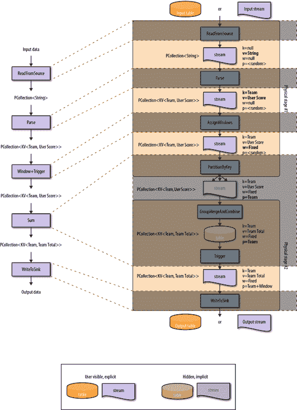


###### 图 8-1\. Beam 模型方法中的流偏向

在这张图中，我画了虚线连接逻辑视图中的变换与物理视图中对应的组件。以这种方式观察时显而易见的是，所有逻辑变换都由*流*连接，即使涉及分组的操作（我们从第六章知道这会导致*某处*创建表）。在 Beam 术语中，这些变换是`PTransforms`，它们总是应用于`PCollections`以产生新的`PCollections`。这里的重要观点是，在 Beam 中，`PCollections`始终是*流*。因此，Beam 模型是一种固有的流偏向数据处理方法：流是 Beam 管道中的通用货币（即使是批处理管道），而表始终被特别对待，要么在管道边缘抽象在源和汇处，要么在管道中的某个地方被隐藏在分组和触发操作之下。因为 Beam 以流为单位运行，任何涉及表的地方（源、汇以及任何中间分组/取消分组），都需要进行某种转换以隐藏底层表。Beam 中的这些转换看起来像这样：

+   *消费*表的*源*通常会硬编码表的*触发*方式；用户无法指定他们想要消费的表的自定义触发方式。源可能被编写为触发对表的每次新更新作为记录，它可能批量组合更新，或者在某个时间点上提供表中数据的单个有界快照。这实际上取决于对于给定源来说什么是实际可行的，以及源的作者试图解决的用例是什么。

+   *写*表的*汇*通常会硬编码它们*组*输入流的方式。有时，这是以一种给用户一定控制的方式来完成的；例如，通过简单地按用户分配的键进行分组。在其他情况下，分组可能是隐式定义的；例如，通过在写入没有自然键的输入数据时在分片输出源上分组到一个随机物理分区号。与源一样，这实际上取决于给定汇的实际可行性，以及汇的作者试图解决的用例是什么。

+   对于*分组/取消分组操作*，与源和汇点相反，Beam 为用户提供了完全灵活的方式将数据分组到表中，并将其取消分组为流。这是有意设计的。分组操作的灵活性是必要的，因为数据分组的方式是定义管道的算法的关键组成部分。取消分组的灵活性很重要，以便应用程序可以以适合手头用例的方式塑造生成的流。⁸    

然而，这里有一个问题。从图 8-1 中可以看出，Beam 模型本质上偏向于流。因此，虽然可以直接将分组操作清晰地应用于流（这是 Beam 的`GroupByKey`操作），但该模型从不提供可以直接应用触发器的一等表对象。因此，触发器必须在其他地方应用。基本上有两个选择：    

触发器的预声明    

在管道中的某个点*之前*指定触发器的位置应用于它们实际应用的表。在这种情况下，您基本上是预先指定了在管道中遇到分组操作后稍后希望看到的行为。以这种方式声明时，触发器是*向前传播*的。    

触发器声明后    

在管道中的某个点指定触发器的位置*之后*，它们被应用的表。在这种情况下，您正在指定在声明触发器的地方希望看到的行为。以这种方式声明时，触发器是*向后传播*的。    

因为触发器的后声明允许您在实际观察它的地方指定所需的行为，所以这更直观。不幸的是，Beam 目前（2.x 及更早版本）使用的是触发器的预声明（类似于窗口也是预声明的）。尽管 Beam 提供了许多应对表格隐藏的方法，但我们仍然面临一个事实，那就是必须在观察表格之前触发它们，即使该表格的内容确实是您想要消耗的最终数据。这是 Beam 模型目前存在的一个缺点，可以通过摆脱流中心模型，转向将流和表格视为一等实体的模型来解决。现在让我们来看一下 Beam 模型的概念对应：经典 SQL。## SQL 模型：以表为中心的方法与 Beam 模型的流为中心的方法相反，SQL 历来采用以表为中心的方法：查询应用于表，并且总是产生新的表。这类似于我们在第六章中看到的 MapReduce 的批处理模型，但是考虑到 Beam 模型的一个类似的具体示例会很有用。考虑以下非规范化的 SQL 表：

```java
UserScores (user, team, score, timestamp)
```

它包含用户得分，每个得分都带有相应用户和他们所在团队的 ID。没有主键，因此可以假设这是一个仅追加的表，每行都隐式地由其唯一的物理偏移标识。如果我们想要从这个表中计算团队得分，我们可以使用类似于以下内容的查询：

```java
    SELECT team, SUM(score) as total    FROM UserScores    GROUP BY team;
```

当由查询引擎执行时，优化器可能会将此查询大致分解为三个步骤：

1.  扫描输入表（即触发其快照）

1.  将该表中的字段投影到团队和得分 

1.  按团队分组并求和得分

如果我们使用类似于图 8-1 的图表来查看这一点，它会看起来像图 8-2。`SCAN`操作将输入表触发为一个有界流，其中包含查询执行时表的内容的快照。该流被`SELECT`操作消耗，将四列输入行投影到两列输出行。作为一个非分组操作，它产生另一个流。最后，团队和用户得分的这个两列流进入`GROUP BY`，按团队分组成一个表，相同团队的得分被`SUM`在一起，产生了我们的输出表，团队及其对应的团队得分总数。

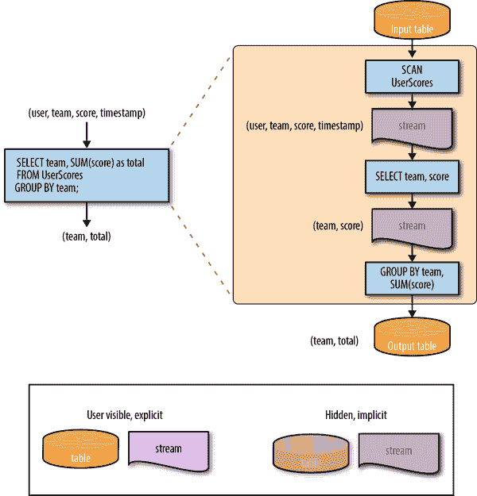

###### 图 8-2。简单 SQL 查询中的表倾向

这是一个相对简单的例子，自然会以一个表结束，因此它实际上并不足以突出经典 SQL 中的表倾向。但是，我们可以通过简单地将这个查询的主要部分（投影和分组）拆分成两个单独的查询来找出更多的证据：

```java

    SELECT team, score
    INTO TeamAndScore
    FROM UserScores;

    SELECT team, SUM(score) as total
    INTO TeamTotals
    FROM TeamAndScore
    GROUP BY team;

```

在这些查询中，我们首先将`UserScores`表投影到我们关心的两列中，将结果存储在一个临时的`TeamAndScore`表中。然后我们按团队对该表进行分组，同时对得分进行求和。在将事物拆分成两个查询的管道后，我们的图表看起来像图 8-3 所示。

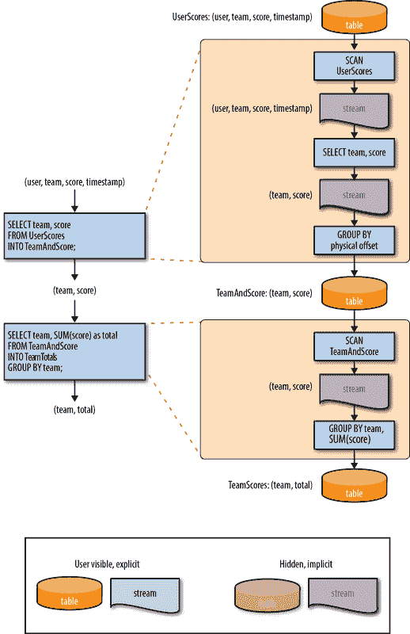

###### 图 8-3。将查询分成两部分以揭示表倾向的更多证据

如果经典 SQL 将流作为一流对象暴露出来，你会期望第一个查询`TeamAndScore`的结果是一个流，因为`SELECT`操作消耗一个流并产生一个流。但是因为 SQL 的通用货币是表，它必须首先将投影流转换为表。并且因为用户没有指定任何显式的键来分组，它必须简单地按其标识（即附加语义，通常通过按每行的物理存储偏移量进行分组）分组键。

因为`TeamAndScore`现在是一个表，第二个查询必须在前面添加一个额外的`SCAN`操作，将表扫描回流，以便`GROUP BY`再次将其分组成表，这次是按团队分组，并将它们的个人得分总和在一起。因此，我们看到了两次隐式转换（从流到表，然后再次转回来），这是由于中间表的显式实现而插入的。

话虽如此，SQL 中的表并不总是显式的；隐式表也是存在的。例如，如果我们在带有`GROUP BY`语句的查询末尾添加一个`HAVING`子句，以过滤出得分低于某个阈值的团队，那么图表将会改变，看起来会像图 8-4 所示的样子。

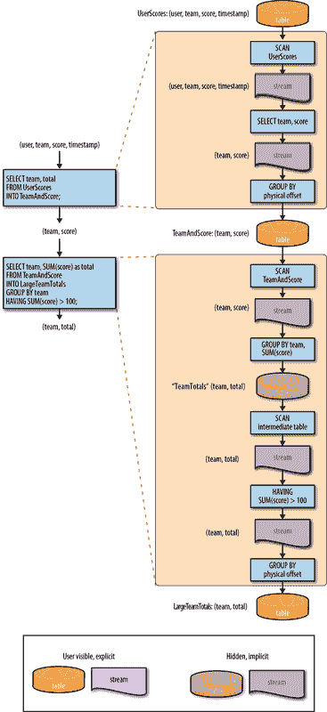

###### 图 8-4。最终带有 HAVING 子句的表倾向

通过添加`HAVING`子句，原来的用户可见的`TeamTotals`表现在是一个隐式的中间表。为了根据`HAVING`子句中的规则过滤表的结果，必须将该表触发为一个流，然后可以对该流进行过滤，然后该流必须隐式地重新分组成一个表，以产生新的输出表`LargeTeamTotals`。

这里的重要观点是经典 SQL 中明显的表倾向。流总是隐式的，因此对于任何实现的流，都需要从/到表的转换。这种转换的规则可以大致分类如下：

输入表（即 Beam 模型术语中的源）

这些总是在特定时间点¹⁰（通常是查询执行时间）完全隐式触发，以产生一个包含该时间点表快照的有界流。这与经典的批处理得到的结果是相同的；例如，我们在第六章中看到的 MapReduce 案例。

输出表（即 Beam 模型术语中的接收器）

这些表要么是查询中最终分组操作创建的表的直接表现，要么是应用于查询的终端流的隐式分组（按行的某个唯一标识符）的结果，对于不以分组操作结束的查询（例如前面示例中的投影查询，或者`GROUP BY`后跟一个`HAVING`子句）。与输入一样，这与经典批处理中的行为相匹配。

分组/非分组操作

与 Beam 不同，这些操作只在一个维度上提供完全的灵活性：分组。而经典 SQL 查询提供了一整套分组操作（`GROUP BY`，`JOIN`，`CUBE`等），它们只提供了一种隐式的非分组操作：在所有贡献数据都被合并后触发中间表的整体（再次强调，这与 MapReduce 中作为洗牌操作的隐式触发完全相同）。因此，SQL 在通过分组塑造算法方面提供了很大的灵活性，但在塑造查询执行过程中存在的隐式流方面基本上没有灵活性。

### 物化视图

考虑到经典 SQL 查询与经典批处理的相似性，可能会诱使人们认为 SQL 固有的表偏见只是 SQL 不以任何方式支持流处理的产物。但这样做将忽视一个事实，即数据库已经支持了一种特定类型的流处理很长一段时间：*物化视图*。物化视图是作为表物理材料化并随着时间由数据库保持更新的视图，源表发生变化时也会相应更新。请注意，这听起来与我们对时变关系的定义非常相似。物化视图的迷人之处在于，它为 SQL 增加了一种非常有用的流处理形式，而不会显著改变它的操作方式，包括其固有的表偏见。

例如，让我们考虑一下图 8-4 中的查询。我们可以将这些查询改为`CREATE MATERIALIZED VIEW`¹¹语句：

```java

    CREATE MATERIALIZED VIEW TeamAndScoreView AS
    SELECT team, score
    FROM UserScores;

    CREATE MATERIALIZED VIEW LargeTeamTotalsView AS
    SELECT team, SUM(score) as total
    FROM TeamAndScoreView
    GROUP BY team
    HAVING SUM(score) > 100;

```

通过这样做，我们将它们转换为连续的、持续的查询，以流式方式持续处理`UserScores`表的更新。即使如此，物化视图的物理执行图与一次性查询的执行图*几乎完全相同*；在查询执行过程中，流并没有被显式地转换为显式的一流对象来支持这种流式物化视图的概念。物理执行计划中*唯一*值得注意的变化是替换了不同的触发器：`SCAN-AND-STREAM`而不是`SCAN`，如图 8-5 所示。

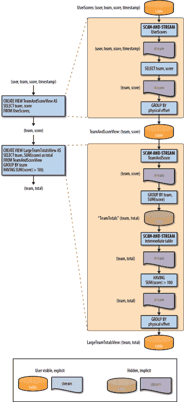

###### 图 8-5。物化视图中的表偏差

这个`SCAN-AND-STREAM`触发器是什么？`SCAN-AND-STREAM`开始时像`SCAN`触发器一样，将表的全部内容在某个时间点发射到流中。但它不会在此停止并声明流已完成（即有界），而是继续触发对输入表的所有后续修改，产生一个捕获表随时间演变的无界流。在一般情况下，这些修改不仅包括新值的`INSERT`，还包括先前值的`DELETE`和现有值的`UPDATE`（实际上被视为同时的`DELETE`/`INSERT`对，或者在 Flink 中称为`undo`/`redo`值）。

此外，如果我们考虑物化视图的表/流转换规则，唯一的真正区别是使用的触发器：

+   *输入表*通过`SCAN-AND-STREAM`触发器隐式触发，而不是`SCAN`触发器。其他一切都与经典批处理查询相同。

+   *输出表*与经典批处理查询处理方式相同。

+   *分组/取消分组操作*与经典批处理查询相同，唯一的区别是使用`SCAN-AND-STREAM`触发器而不是`SNAPSHOT`触发器进行隐式取消分组操作。

通过这个例子，很明显可以看出 SQL 固有的表偏向不仅仅是 SQL 被限制在批处理中的产物：¹²物化视图使 SQL 能够执行一种特定类型的流处理，而不需要进行任何重大的方法变更，包括对表的固有偏向。经典 SQL 只是一个偏向表的模型，无论你是用它进行批处理还是流处理。

# 展望未来：朝着强大的流 SQL

我们现在已经看过了时变关系，表和流提供不同的时变关系呈现方式，以及 Beam 和 SQL 模型在流和表理论方面的固有偏见。那么这一切对我们意味着什么？也许更重要的是，我们需要在 SQL 中做出哪些改变或添加以支持强大的流处理？令人惊讶的答案是：如果我们有好的默认值，就不需要太多。

我们知道，关键的概念变化是用时变关系替换经典的瞬时关系。我们之前看到，这是一个非常无缝的替换，适用于已经存在的关系代数的全部范围，这要归功于保持关系代数的关键闭包性质。但我们也看到，直接处理时变关系通常是不切实际的；我们需要能够以我们两种更常见的物理表现形式：表和流进行操作。这就是一些简单的带有良好默认值的扩展发挥作用的地方。

我们还需要一些工具来稳健地推理时间，特别是事件时间。这就是时间戳、窗口和触发器等东西发挥作用的地方。但同样，明智的默认选择将是重要的，以最小化这些扩展在实践中的必要性。

很棒的是，我们实际上不需要比这更多。所以现在让我们最终花一些时间详细研究这两类扩展：*流/表选择*和*时间操作符*。

## 流和表选择

当我们通过时变关系示例工作时，我们已经遇到了与流和表选择相关的两个关键扩展。它们是我们在`SELECT`关键字之后放置的`TABLE`和`STREAM`关键字，以指示我们对给定时变关系的期望物理视图。

```java

*12:07> SELECT TABLE Name,                 12:01> SELECT STREAM Name*
 *SUM(Score) as Total,                      SUM(Score) as Total,*                      
 *MAX(Time)                                 MAX(Time)* 
*FROM UserScores                           FROM UserScores*
 *GROUP BY Name;                            GROUP BY Name;*
-------------------------                 -------------------------
| Name  | Total | Time  |                 | Name  | Total | Time  |
-------------------------                 -------------------------
| Julie | 12    | 12:07 |                 | Julie | 7     | 12:01 |
| Frank | 3     | 12:03 |                 | Frank | 3     | 12:03 |
-------------------------                 | Julie | 8     | 12:03 |
                                          | Julie | 12    | 12:07 |
                                          ..... [12:01, 12:07] ....

```

这些扩展相对直接，需要时易于使用。但是，关于流和表选择的真正重要的事情是选择好的默认值，以便在没有明确提供时使用。这样的默认值应该尊重 SQL 的经典、偏向表的行为，这是每个人都习惯的，同时在包括流的世界中也能直观地操作。它们也应该容易记住。这里的目标是帮助系统保持自然的感觉，同时大大减少我们必须使用显式扩展的频率。满足所有这些要求的默认值的好选择是：

+   如果*所有*的输入都是*表*，输出是*`TABLE`*。

+   如果*任何*输入都是*流*，输出是*`STREAM`*。

这里另外需要指出的是，这些时变关系的物理呈现只有在你想以某种方式使 TVR 物化时才是真正必要的，无论是直接查看它还是将其写入某个输出表或流。鉴于 SQL 系统在全保真度时变关系方面的运行，中间结果（例如`WITH AS`或`SELECT INTO`语句）可以保持为系统自然处理的全保真度 TVR，无需将它们呈现为其他更有限的具体表现形式。

这就是流和表选择的全部内容。除了直接处理流和表的能力之外，如果我们想要在 SQL 中支持强大的、无序的流处理，我们还需要一些更好的工具来推理时间。现在让我们更详细地看看这些工具包含了什么。

## 时间操作符

强大的、无序处理的基础是事件时间戳：这个小的元数据片段捕获了事件发生的时间，而不是观察到它的时间。在 SQL 世界中，事件时间通常只是给定 TVR 的另一列数据，它在源数据中是本地存在的。在这个意义上，将记录的事件时间实现在记录本身中的想法是 SQL 自然地处理的，通过将时间戳放在一个常规列中。

在我们继续之前，让我们看一个例子。为了帮助将所有这些 SQL 的东西与我们之前在书中探讨过的概念联系起来，我们重新使用我们运行示例，将团队各成员的九个分数相加，得出团队的总分。如果你回忆一下，当这些分数在 X=事件时间/Y=处理时间轴上绘制时，看起来像图 8-6。


###### 图 8-6\. 我们运行示例中的数据点

如果我们把这些数据想象成一个经典的 SQL 表，它们可能看起来像这样，按事件时间排序（图 8-6 中从左到右）：

```java

*12:10> SELECT TABLE *, Sys.MTime as ProcTime
       FROM UserScores ORDER BY EventTime;*
------------------------------------------------
| Name  | Team  | Score | EventTime | ProcTime |
------------------------------------------------
| Julie | TeamX |     5 |  12:00:26 | 12:05:19 |
| Frank | TeamX |     9 |  12:01:26 | 12:08:19 |
| Ed    | TeamX |     7 |  12:02:26 | 12:05:39 |
| Julie | TeamX |     8 |  12:03:06 | 12:07:06 |
| Amy   | TeamX |     3 |  12:03:39 | 12:06:13 |
| Fred  | TeamX |     4 |  12:04:19 | 12:06:39 |
| Naomi | TeamX |     3 |  12:06:39 | 12:07:19 |
| Becky | TeamX |     8 |  12:07:26 | 12:08:39 |
| Naomi | TeamX |     1 |  12:07:46 | 12:09:00 |
------------------------------------------------

```

如果你回忆一下，我们在第二章的时候就看到了这张表，那时我第一次介绍了这个数据集。这个渲染提供了比我们通常展示的更多关于数据的细节，明确地突出了这九个分数属于七个不同用户，每个用户都是同一个团队的成员。在我们开始深入示例之前，SQL 提供了一个很好的、简洁的方式来看到数据的完整布局。

这种数据视图的另一个好处是，它完全捕获了每条记录的事件时间和处理时间。你可以想象事件时间列只是原始数据的另一部分，而处理时间列是系统提供的东西（在这种情况下，使用一个假设的`Sys.MTime`列记录给定行的处理时间修改时间戳；也就是说，记录本身进入系统的时间）。

SQL 的有趣之处在于它可以很容易地以不同的方式查看数据。例如，如果我们希望以处理时间顺序查看数据（图 8-6 中从下到上），我们可以简单地更新`ORDER BY`子句：

```java

*12:10> SELECT TABLE *, Sys.MTime as ProcTime*
 *FROM UserScores ORDER BY ProcTime;*
-----------------------------------------------
| Name  | Team  | Score | EventTime | ProcTime |
-----------------------------------------------
| Julie | TeamX |     5 |  12:00:26 | 12:05:19 |
| Ed    | TeamX |     7 |  12:02:26 | 12:05:39 |
| Amy   | TeamX |     3 |  12:03:39 | 12:06:13 |
| Fred  | TeamX |     4 |  12:04:19 | 12:06:39 |
| Julie | TeamX |     8 |  12:03:06 | 12:07:06 |
| Naomi | TeamX |     3 |  12:06:39 | 12:07:19 |
| Frank | TeamX |     9 |  12:01:26 | 12:08:19 |
| Becky | TeamX |     8 |  12:07:26 | 12:08:39 |
| Naomi | TeamX |     1 |  12:07:46 | 12:09:00 |
------------------------------------------------

```

正如我们之前学到的，这些数据的表格渲染实际上是对完整底层 TVR 的部分保真视图。如果我们改为查询完整的面向表的`TVR`（但为了简洁起见，只查询三个最重要的列），它会扩展到像这样：

```java

*12:10> SELECT TVR Score, EventTime, Sys.MTime as ProcTime
       FROM UserScores ORDER BY ProcTime;*
-----------------------------------------------------------------------
|         [-inf, 12:05:19)         |       [12:05:19, 12:05:39)       | 
| -------------------------------- | -------------------------------- | 
| | Score | EventTime | ProcTime | | | Score | EventTime | ProcTime | |
| -------------------------------- | -------------------------------- |
| -------------------------------- | |     5 |  12:00:26 | 12:05:19 | |
|                                  | -------------------------------- |
|                                  |                                  |
-----------------------------------------------------------------------
|       [12:05:39, 12:06:13)       |       [12:06:13, 12:06:39)       | 
| -------------------------------- | -------------------------------- | 
| | Score | EventTime | ProcTime | | | Score | EventTime | ProcTime | |
| -------------------------------- | -------------------------------- |
| |     5 |  12:00:26 | 12:05:19 | | |     5 |  12:00:26 | 12:05:19 | |
| |     7 |  12:02:26 | 12:05:39 | | |     7 |  12:02:26 | 12:05:39 | |
| -------------------------------- | |     3 |  12:03:39 | 12:06:13 | |
|                                  | -------------------------------- |
-----------------------------------------------------------------------
|       [12:06:39, 12:07:06)       |       [12:07:06, 12:07:19)       |
| -------------------------------- | -------------------------------- |
| | Score | EventTime | ProcTime | | | Score | EventTime | ProcTime | |
| -------------------------------- | -------------------------------- |
| |     5 |  12:00:26 | 12:05:19 | | |     5 |  12:00:26 | 12:05:19 | |
| |     7 |  12:02:26 | 12:05:39 | | |     7 |  12:02:26 | 12:05:39 | |
| |     3 |  12:03:39 | 12:06:13 | | |     3 |  12:03:39 | 12:06:13 | |
| |     4 |  12:04:19 | 12:06:39 | | |     4 |  12:04:19 | 12:06:39 | |
| -------------------------------- | |     8 |  12:03:06 | 12:07:06 | |
|                                  | -------------------------------- |
-----------------------------------------------------------------------
|       [12:07:19, 12:08:19)       |       [12:08:19, 12:08:39)       | 
| -------------------------------- | -------------------------------- | 
| | Score | EventTime | ProcTime | | | Score | EventTime | ProcTime | |
| -------------------------------- | -------------------------------- |
| |     5 |  12:00:26 | 12:05:19 | | |     5 |  12:00:26 | 12:05:19 | |
| |     7 |  12:02:26 | 12:05:39 | | |     7 |  12:02:26 | 12:05:39 | |
| |     3 |  12:03:39 | 12:06:13 | | |     3 |  12:03:39 | 12:06:13 | |
| |     4 |  12:04:19 | 12:06:39 | | |     4 |  12:04:19 | 12:06:39 | |
| |     8 |  12:03:06 | 12:07:06 | | |     8 |  12:03:06 | 12:07:06 | |
| |     3 |  12:06:39 | 12:07:19 | | |     3 |  12:06:39 | 12:07:19 | |
| -------------------------------- | |     9 |  12:01:26 | 12:08:19 | |
|                                  | -------------------------------- |
|                                  |                                  |
-----------------------------------------------------------------------
|       [12:08:39, 12:09:00)       |         [12:09:00, now)          |
| -------------------------------- | -------------------------------- |
| | Score | EventTime | ProcTime | | | Score | EventTime | ProcTime | |
| -------------------------------- | -------------------------------- |
| |     5 |  12:00:26 | 12:05:19 | | |     5 |  12:00:26 | 12:05:19 | |
| |     7 |  12:02:26 | 12:05:39 | | |     7 |  12:02:26 | 12:05:39 | |
| |     3 |  12:03:39 | 12:06:13 | | |     3 |  12:03:39 | 12:06:13 | |
| |     4 |  12:04:19 | 12:06:39 | | |     4 |  12:04:19 | 12:06:39 | |
| |     8 |  12:03:06 | 12:07:06 | | |     8 |  12:03:06 | 12:07:06 | |
| |     3 |  12:06:39 | 12:07:19 | | |     3 |  12:06:39 | 12:07:19 | |
| |     9 |  12:01:26 | 12:08:19 | | |     9 |  12:01:26 | 12:08:19 | |
| |     8 |  12:07:26 | 12:08:39 | | |     8 |  12:07:26 | 12:08:39 | |
| -------------------------------- | |     1 |  12:07:46 | 12:09:00 | |
|                                  | -------------------------------- |
-----------------------------------------------------------------------

```

这是很多数据。另外，`STREAM`版本在这种情况下会更紧凑地呈现；由于关系中没有显式的分组，它看起来与之前的点时间`TABLE`呈现基本相同，另外还有一个尾部描述了迄今为止流中捕获的处理时间范围，以及系统仍在等待流中的更多数据（假设我们将流视为无界；我们很快将看到流的有界版本）：

```java

*12:00> SELECT STREAM Score, EventTime, Sys.MTime as ProcTime FROM UserScores;*
--------------------------------
| Score | EventTime | ProcTime |
--------------------------------
|     5 |  12:00:26 | 12:05:19 |
|     7 |  12:02:26 | 12:05:39 |
|     3 |  12:03:39 | 12:06:13 |
|     4 |  12:04:19 | 12:06:39 |
|     8 |  12:03:06 | 12:07:06 |
|     3 |  12:06:39 | 12:07:19 |
|     9 |  12:01:26 | 12:08:19 |
|     8 |  12:07:26 | 12:08:39 |
|     1 |  12:07:46 | 12:09:00 |
........ [12:00, 12:10] ........

```

但这只是查看原始输入记录，没有任何形式的转换。当我们开始改变关系时，更有趣的是。在过去的探索中，我们总是从经典的批处理开始，对整个数据集的分数进行求和，所以让我们在这里也这样做。第一个示例管道（之前作为示例 6-1 提供）在 Beam 中看起来像示例 8-1。

##### 示例 8-1\. 求和管道

```java

PCollection<String> raw = IO.read(...);
PCollection<KV<Team, Integer>> input = raw.apply(new ParseFn());
PCollection<KV<Team, Integer>> totals =
  input.apply(Sum.integersPerKey());

```

在世界的流和表视图中呈现，该流水线的执行看起来像图 8-7。

<assets/stsy_0807.mp4>


###### 图 8-7. 经典批处理的流和表视图

鉴于我们已经将数据放入了适当的模式中，我们不会在 SQL 中进行任何解析；相反，我们专注于解析转换之后的所有流水线中的一切。因为我们采用的是传统的批处理模型，在处理完所有输入数据之后才会检索单个答案，所以求和关系的`TABLE`和`STREAM`视图看起来基本相同（请记住，对于这些初始的批处理样例，我们处理的是数据集的有界版本；因此，这个`STREAM`查询实际上以一行短横线和一个`END-OF-STREAM`标记终止）：

```java

*12:10> SELECT TABLE SUM(Score) as Total, MAX(EventTime),*
 *MAX(Sys.MTime) as "MAX(ProcTime)" FROM UserScores GROUP BY Team;*
------------------------------------------
| Total | MAX(EventTime) | MAX(ProcTime) |
------------------------------------------
|    48 |       12:07:46 |      12:09:00 |
------------------------------------------

```

```java

*12:00> SELECT STREAM SUM(Score) as Total, MAX(EventTime),*
 *MAX(Sys.MTime) as "MAX(ProcTime)" FROM UserScores GROUP BY Team;*
------------------------------------------
| Total | MAX(EventTime) | MAX(ProcTime) |
------------------------------------------
|    48 |       12:07:46 |      12:09:00 |
------ [12:00, 12:10] END-OF-STREAM ------

```

更有趣的是当我们开始将窗口加入到混合中时。这将让我们有机会更仔细地查看需要添加到 SQL 中以支持鲁棒流处理的时间操作。

### *何处*：窗口

正如我们在第六章中学到的，窗口是对按键分组的修改，其中窗口成为分层键的次要部分。与经典的程序化批处理一样，你可以通过简单地将时间作为`GROUP BY`参数的一部分，很容易地在现有的 SQL 中将数据窗口化。或者，如果所涉及的系统提供了，你可以使用内置的窗口操作。我们马上看一下两者的 SQL 示例，但首先，让我们重新访问第三章中的程序化版本。回想一下例子 6-2，窗口化的 Beam 流水线看起来就像例子 8-2 中所示的那样。

##### 例子 8-2. 求和流水线

```java

PCollection<String> raw = IO.read(...);
PCollection<KV<Team, Integer>> input = raw.apply(new ParseFn());
PCollection<KV<Team, Integer>> totals = input
  .apply(Window.into(FixedWindows.of(TWO_MINUTES)))
  .apply(Sum.integersPerKey());

```

而该流水线的执行（从图 6-5 中的流和表呈现），看起来像图 8-8 中呈现的图表。

<assets/stsy_0808.mp4>

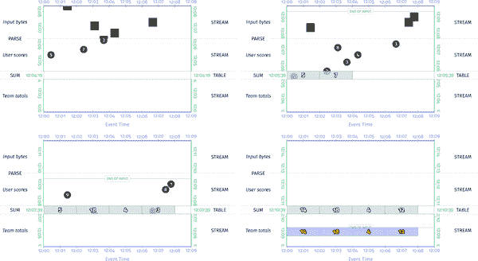

###### 图 8-8. 批处理引擎上窗口求和的流和表视图

正如我们之前看到的，从图 8-7 到 8-8 的唯一实质性变化是由`SUM`操作创建的表现现在被分成了固定的两分钟时间窗口，最终产生了四个窗口化的答案，而不是之前的单个全局总和。

在 SQL 中做同样的事情，我们有两个选择：通过在`GROUP BY`语句中包含窗口的某个唯一特征（例如结束时间戳）来隐式地进行窗口操作，或者使用内置的窗口操作。让我们来看看两者。

首先是临时窗口。在这种情况下，我们在 SQL 语句中自己执行计算窗口的数学运算：

```java

*12:10> SELECT TABLE SUM(Score) as Total,* 
 *"" || EventTime / INTERVAL '2' MINUTES || ", " ||* 
 *(EventTime / INTERVAL '2' MINUTES) + INTERVAL '2' MINUTES ||*
 *")" as Window,* 
 *MAX(Sys.MTime) as "MAX(ProcTime)"*
 *FROM UserScores*
 *GROUP BY Team, EventTime / INTERVAL '2' MINUTES;*
------------------------------------------------
| Total | Window               | MAX(ProcTime) |
------------------------------------------------
| 14    | [12:00:00, 12:02:00) | 12:08:19      |
| 18    | [12:02:00, 12:04:00) | 12:07:06      |
| 4     | [12:04:00, 12:06:00) | 12:06:39      |
| 12    | [12:06:00, 12:08:00) | 12:09:00      |
------------------------------------------------

```

我们也可以使用显式的窗口语句来实现相同的结果，比如 Apache Calcite 支持的那些。

```java

*12:10> SELECT TABLE SUM(Score) as Total,*
 *TUMBLE(EventTime, INTERVAL '2' MINUTES) as Window,*
 *MAX(Sys.MTime) as 'MAX(ProcTime)'* 
 *FROM UserScores*
 *GROUP BY Team, TUMBLE(EventTime, INTERVAL '2' MINUTES);*
------------------------------------------------
| Total | Window               | MAX(ProcTime) |
------------------------------------------------
| 14    | [12:00:00, 12:02:00) | 12:08:19      |
| 18    | [12:02:00, 12:04:00) | 12:07:06      |
| 4     | [12:04:00, 12:06:00) | 12:06:39      |
| 12    | [12:06:00, 12:08:00) | 12:09:00      |
------------------------------------------------

```

这就引出了一个问题：如果我们可以使用现有的 SQL 构造隐式地进行窗口操作，为什么还要支持显式的窗口构造呢？有两个原因，这个例子中只有第一个原因是明显的（我们将在本章后面看到另一个原因）：

1.  窗口化为你处理窗口计算数学。当你直接指定基本参数如宽度和滑动时，要保持一致地正确得到结果要容易得多，而不是自己计算窗口数学。¹⁴

1.  窗口允许简洁地表达更复杂、动态的分组，比如会话。尽管 SQL 在技术上能够表达定义会话窗口的另一个元素时间间隔内的每个元素的关系，但相应的表达式是一团乱麻的分析函数、自连接和数组展开，普通人不可能合理地自己构造出来。

这两个都是支持 SQL 中提供一流的窗口构造的有力论据，除了已经存在的临时窗口功能。

到目前为止，当我们将数据作为表格消耗时，我们已经从经典的批处理/经典关系的角度看到了窗口的样子。但是，如果我们想将数据作为流来消耗，我们就回到了 Beam 模型中的第三个问题：在处理时间中，我们何时实现输出？

### *何时*：触发器

与以前一样，这个问题的答案是触发器和水印。然而，在 SQL 的上下文中，有一个强有力的论点支持使用不同的默认值，而不是我们在第三章中引入的 Beam 模型的默认值：与其默认使用单个水印触发器，不如从物化视图中获取灵感，并在每个元素上触发。换句话说，每当有新的输入到达时，我们就会产生相应的新输出。

#### SQL 风格的默认值：每条记录触发器

使用每条记录触发器作为默认值有两个强有力的好处：

简单性

每条记录更新的语义易于理解；物化视图多年来一直以这种方式运作。

忠实度

与变更数据捕获系统一样，每条记录触发产生了给定时变关系的完整保真度流呈现；在转换过程中没有丢失任何信息。

缺点主要是成本：触发器总是应用于分组操作之后，而分组的性质通常提供了减少通过系统流动的数据的基数的机会，从而相应地减少了下游处理这些聚合结果的成本。即便如此，在成本不是禁锢的用例中，清晰和简单的好处可以说超过了默认使用非完整保真度触发器的认知复杂性。

因此，对于我们首次尝试将团队得分作为流来消耗的情况，让我们看看使用每条记录触发器会是什么样子。Beam 本身没有精确的每条记录触发器，因此，如示例 8-3 所示，我们使用重复的`AfterCount(1)`触发器，每当有新记录到达时就会立即触发。

##### 示例 8-3。每条记录触发器

```java

PCollection<String> raw = IO.read(...);
PCollection<KV<Team, Integer>> input = raw.apply(new ParseFn());
PCollection<KV<Team, Integer>> totals = input
  .apply(Window.into(FixedWindows.of(TWO_MINUTES))
               .triggering(Repeatedly(AfterCount(1)))
  .apply(Sum.integersPerKey());

```

然后，这个管道的流和表格呈现将看起来像图 8-9 中所示的样子。

<assets/stsy_0809.mp4>

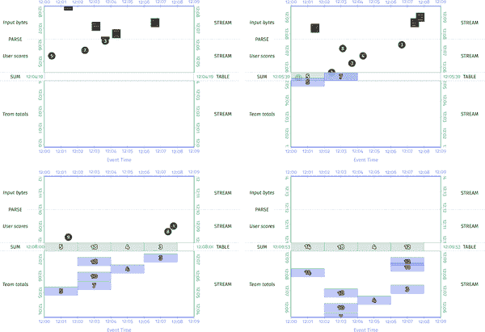


###### 图 8-9。流和表格视图的窗口求和在具有每条记录触发的流引擎上

使用每条记录触发器的一个有趣的副作用是，它在某种程度上掩盖了数据被静止的效果，因为触发器立即将其重新激活。即使如此，来自分组的聚合物件仍然静止在表中，而未分组的值流则从中流走。

回到 SQL，我们现在可以看到将相应的时间-值关系呈现为流的效果会是什么样子。它（不出所料）看起来很像图 8-9 中动画中的值流：

```java

*12:00> SELECT STREAM SUM(Score) as Total,* 
 *TUMBLE(EventTime, INTERVAL '2' MINUTES) as Window,*
 *MAX(Sys.MTime) as 'MAX(ProcTime)''* 
 *FROM UserScores*
 *GROUP BY Team, TUMBLE(EventTime, INTERVAL '2' MINUTES);*
------------------------------------------------
| Total | Window               | MAX(ProcTime) |
------------------------------------------------
| 5     | [12:00:00, 12:02:00) | 12:05:19      |
| 7     | [12:02:00, 12:04:00) | 12:05:39      |
| 10    | [12:02:00, 12:04:00) | 12:06:13      |
| 4     | [12:04:00, 12:06:00) | 12:06:39      |
| 18    | [12:02:00, 12:04:00) | 12:07:06      |
| 3     | [12:06:00, 12:08:00) | 12:07:19      |
| 14    | [12:00:00, 12:02:00) | 12:08:19      |
| 11    | [12:06:00, 12:08:00) | 12:08:39      |
| 12    | [12:06:00, 12:08:00) | 12:09:00      |
................ [12:00, 12:10] ................

```

但即使对于这个简单的用例来说，它也是相当啰嗦的。如果我们要构建一个处理大规模移动应用程序数据的管道，我们可能不希望为每个上游用户分数的下游更新付出成本。这就是自定义触发器发挥作用的地方。

#### 水印触发器

如果我们将 Beam 管道切换为使用水印触发器，例如，我们可以在 TVR 的流版本中每个窗口获得一个输出，如示例 8-4 所示，并如图 8-10 所示。

##### 示例 8-4。水印触发器

```java

PCollection<String> raw = IO.read(...);
PCollection<KV<Team, Integer>> input = raw.apply(new ParseFn());
PCollection<KV<Team, Integer>> totals = input
  .apply(Window.into(FixedWindows.of(TWO_MINUTES))
               .triggering(AfterWatermark())
  .apply(Sum.integersPerKey());

```

<assets/stsy_0810.mp4>


###### 图 8-10。带水印触发的窗口求和

要在 SQL 中获得相同的效果，我们需要语言支持来指定自定义触发器。类似于`EMIT *<when>*`语句，比如`EMIT WHEN WATERMARK PAST *<column>*`。这将向系统发出信号，即聚合创建的表应该在输入水印超过指定列中的时间戳值时触发一次流，这在这种情况下恰好是窗口的结束时间。

让我们看一下这个关系呈现为流。从理解触发器触发发生的时间的角度来看，停止依赖于原始输入的`MTime`值，并且捕获流中的行发出的当前时间戳也是很方便的：

```java

*12:00> SELECT STREAM SUM(Score) as Total,*
 *TUMBLE(EventTime, INTERVAL '2' MINUTES) as Window,*
 *CURRENT_TIMESTAMP as EmitTime*
 *FROM UserScores*
 *GROUP BY Team, TUMBLE(EventTime, INTERVAL '2' MINUTES)*
 *EMIT WHEN WATERMARK PAST WINDOW_END(Window);*
-------------------------------------------
| Total | Window               | EmitTime |
-------------------------------------------
| 5     | [12:00:00, 12:02:00) | 12:06:00 |
| 18    | [12:02:00, 12:04:00) | 12:07:30 |
| 4     | [12:04:00, 12:06:00) | 12:07:41 |
| 12    | [12:06:00, 12:08:00) | 12:09:22 |
............. [12:00, 12:10] ..............

```

这里的主要缺点是由于启发式水印的使用而导致的延迟数据问题，正如我们在前几章中遇到的那样。考虑到延迟数据，一个更好的选择可能是在每次出现延迟记录时立即输出更新，使用支持重复延迟触发的水印触发器的变体，如示例 8-5 和图 8-11 所示。

##### 示例 8-5。带有延迟触发的水印触发器

```java

PCollection<String> raw = IO.read(...);
PCollection<KV<Team, Integer>> input = raw.apply(new ParseFn());
PCollection<KV<Team, Integer>> totals = input
  .apply(Window.into(FixedWindows.of(TWO_MINUTES))
               .triggering(AfterWatermark()
                   .withLateFirings(AfterCount(1))))
  .apply(Sum.integersPerKey());

```

<assets/stsy_0811.mp4>

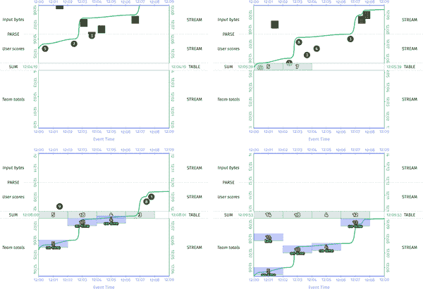

###### 图 8-11。带有准时/延迟触发的窗口求和

我们可以通过允许指定两个触发器来在 SQL 中做同样的事情：

+   一个水印触发器给我们一个初始值：`WHEN WATERMARK PAST *<column>*`，窗口的结束时间被用作时间戳`*<column>*`。

+   用于延迟数据的重复延迟触发器：`AND THEN AFTER *<duration>*`，其中`*<duration>*`为 0，以给出每条记录的语义。

现在我们每个窗口可以获得多行，还可以有另外两个系统列可用：每行/窗格相对于水印的时间（`Sys.EmitTiming`），以及每个窗口的窗格/行的索引（`Sys.EmitIndex`，用于标识给定行/窗口的修订序列）：

```java

*12:00> SELECT STREAM SUM(Score) as Total,*
 *TUMBLE(EventTime, INTERVAL '2' MINUTES) as Window,*
 *CURRENT_TIMESTAMP as EmitTime,*
 *Sys.EmitTiming, Sys.EmitIndex* 
 *FROM UserScores*
 *GROUP BY Team, TUMBLE(EventTime, INTERVAL '2' MINUTES)*
 *EMIT WHEN WATERMARK PAST WINDOW_END(Window)*
 *AND THEN AFTER 0 SECONDS;*
----------------------------------------------------------------------------
| Total | Window               | EmitTime | Sys.EmitTiming | Sys.EmitIndex |
----------------------------------------------------------------------------
| 5     | [12:00:00, 12:02:00) | 12:06:00 | on-time        | 0             |
| 18    | [12:02:00, 12:04:00) | 12:07:30 | on-time        | 0             |
| 4     | [12:04:00, 12:06:00) | 12:07:41 | on-time        | 0             |
| 14    | [12:00:00, 12:02:00) | 12:08:19 | late           | 1             |
| 12    | [12:06:00, 12:08:00) | 12:09:22 | on-time        | 0             |
.............................. [12:00, 12:10] ..............................

```

使用这个触发器，对于每个窗格，我们能够得到一个准时的答案，这很可能是正确的，这要归功于我们的启发式水印。对于任何延迟到达的数据，我们可以得到一行的更新版本，修正我们之前的结果。

#### 重复延迟触发器

你可能想要的另一个主要时间触发器用例是重复延迟更新；也就是说，在任何新数据到达后的一分钟（在处理时间上）触发窗口。请注意，这与在微批处理系统中触发对齐边界是不同的。正如示例 8-6 所示，通过相对于窗口/行的最近新记录到达的延迟触发，有助于更均匀地分散触发负载，而不像突发的对齐触发那样。它也不需要任何水印支持。图 8-12 呈现了结果。

##### 示例 8-6。重复触发，延迟一分钟

```java

PCollection<String> raw = IO.read(...);
PCollection<KV<Team, Integer>> input = raw.apply(new ParseFn());
PCollection<KV<Team, Integer>> totals = input
  .apply(Window.into(FixedWindows.of(TWO_MINUTES))
               .triggering(Repeatedly(UnalignedDelay(ONE_MINUTE)))
  .apply(Sum.integersPerKey());

```

<assets/stsy_0812.mp4>

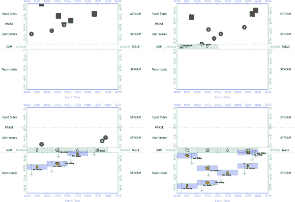

###### 图 8-12。带有重复一分钟延迟触发的窗口求和

使用这样的触发器的效果与我们最初开始的每条记录触发非常相似，但由于触发中引入了额外的延迟，稍微减少了一些冗余，这使得系统能够省略产生的某些行。调整延迟可以让我们调节生成的数据量，从而平衡成本和及时性的张力，以适应使用情况。

作为 SQL 流呈现，它可能看起来像这样：

```java

*12:00> SELECT STREAM SUM(Score) as Total,*
 *TUMBLE(EventTime, INTERVAL '2' MINUTES) as Window,*
 *CURRENT_TIMESTAMP as EmitTime,*
 *Sys.EmitTiming, SysEmitIndex*
 *FROM UserScores*
 *GROUP BY Team, TUMBLE(EventTime, INTERVAL '2' MINUTES)*
 *EMIT AFTER 1 MINUTE;*
----------------------------------------------------------------------------
| Total | Window               | EmitTime | Sys.EmitTiming | Sys.EmitIndex |
----------------------------------------------------------------------------
| 5     | [12:00:00, 12:02:00) | 12:06:19 | n/a            | 0             |
| 10    | [12:02:00, 12:04:00) | 12:06:39 | n/a            | 0             |
| 4     | [12:04:00, 12:06:00) | 12:07:39 | n/a            | 0             |
| 18    | [12:02:00, 12:04:00) | 12:08:06 | n/a            | 1             |
| 3     | [12:06:00, 12:08:00) | 12:08:19 | n/a            | 0             |
| 14    | [12:00:00, 12:02:00) | 12:09:19 | n/a            | 1             |
| 12    | [12:06:00, 12:08:00) | 12:09:22 | n/a            | 1             |
.............................. [12:00, 12:10] ..............................

```

#### 数据驱动触发器

在进入梁模型的最后一个问题之前，值得简要讨论“数据驱动触发器”的概念。由于 SQL 中处理类型的动态方式，似乎数据驱动触发器会是提议的`EMIT *<when>*`子句的一个非常自然的补充。例如，如果我们想在总分超过 10 时触发我们的总和，类似`EMIT WHEN Score > 10`的东西会非常自然地工作吗？

嗯，是的和不。是的，这样的构造会非常自然。但是当你考虑这样一个构造实际上会发生什么时，你基本上会在每条记录上触发，然后执行`Score > 10`谓词来决定触发的行是否应该向下游传播。你可能还记得，这听起来很像`HAVING`子句的情况。实际上，你可以通过简单地在查询的末尾添加`HAVING Score > 10`来获得完全相同的效果。在这一点上，它引出了一个问题：值得添加显式的数据驱动触发器吗？可能不值得。即便如此，看到使用标准 SQL 和精心选择的默认值如何轻松地获得所需的数据驱动触发器效果仍然令人鼓舞。

### *如何*：累积

到目前为止，在本节中，我们一直忽略了我在本章开头介绍的`Sys.Undo`列。因此，我们默认使用*累积模式*来回答窗口/行的细化如何相互关联的问题。换句话说，每当我们观察到聚合行的多个修订时，后续的修订都建立在前面的修订之上，将新的输入与旧的输入累积在一起。我选择这种方法是因为它与早期章节中使用的方法相匹配，并且相对于表世界中的工作方式，这是一个相对简单的转换。

也就是说，累积模式有一些主要缺点。实际上，正如我们在第二章中讨论的那样，对于具有两个或更多分组操作序列的任何查询/管道来说，它对于过度计数是明显错误的。在允许包含多个序列分组操作的查询的系统中，允许对行的多个修订进行消耗的唯一明智的方法是默认情况下以*累积和撤销*模式运行。否则，由于对单行的多个修订的盲目合并，会出现一个给定输入记录在单个聚合中被多次包含的问题。

因此，当我们考虑将累积模式语义纳入 SQL 世界时，最符合我们提供直观和自然体验目标的选项是系统在底层默认使用撤销。正如我之前介绍`Sys.Undo`列时所指出的，如果你不关心撤销（就像直到现在本节中的示例一样），你不需要要求它们。但是如果你要求它们，它们应该在那里。

#### 在 SQL 世界中的撤销

为了说明我的意思，让我们看另一个例子。为了适当地激发问题，让我们看一个相对不切实际的用例，即构建会话窗口并将它们逐步写入到 HBase 等键值存储中。在这种情况下，我们将从聚合中产生增量会话，但在许多情况下，给定的会话只是一个或多个先前会话的演变。在这种情况下，您真的希望删除先前的会话，并用新的会话替换它们。但是你该怎么做呢？判断给定的会话是否替换了另一个会话的唯一方法是将它们进行比较，看看新会话是否与旧会话重叠。但这意味着在管道的另一个部分中复制一些会话构建逻辑。更重要的是，这意味着您不再具有幂等输出，因此如果要保持端到端的一次性语义，就需要跳过一系列额外的步骤。更好的方法是，管道直接告诉您哪些会话被删除，哪些会话被替换。这就是撤销给您的东西。

要看到这个示例的效果（以及 SQL 中的效果），让我们修改我们的示例管道，计算具有一分钟间隔的会话窗口。为了简单和清晰起见，我们回到使用默认的每条记录触发。请注意，我还将处理时间内的一些数据点移动到这些会话示例中，以使图表更清晰；事件时间戳保持不变。更新后的数据集如下（用黄色突出显示了移动的处理时间戳）：

```java

*12:00> SELECT STREAM Score, EventTime, Sys.MTime as ProcTime* 
 *FROM UserScoresForSessions;*
--------------------------------
| Score | EventTime | ProcTime |
--------------------------------
|     5 |  12:00:26 | 12:05:19 |
|     7 |  12:02:26 | 12:05:39 |
|     3 |  12:03:39 | 12:06:13 |
|     4 |  12:04:19 | 12:06:46 |  # Originally 12:06:39
|     3 |  12:06:39 | 12:07:19 |
|     8 |  12:03:06 | 12:07:33 |  # Originally 12:07:06
|     8 |  12:07:26 | 12:08:13 |  # Originally 12:08:39
|     9 |  12:01:26 | 12:08:19 |
|     1 |  12:07:46 | 12:09:00 |
........ [12:00, 12:10] ........

```

首先，让我们看一下没有撤销的管道。在清楚了为什么该管道对于将增量会话写入键/值存储的用例是有问题之后，我们将看一下带有撤销的版本。

不撤销管道的 Beam 代码看起来像示例 8-7。图 8-13 显示了结果。

##### 示例 8-7。具有每条记录触发和累积但没有撤销的会话窗口

```java

PCollection<String> raw = IO.read(...);
PCollection<KV<Team, Integer>> input = raw.apply(new ParseFn());
PCollection<KV<Team, Integer>> totals = input
  .apply(Window.into(Sessions.withGapDuration(ONE_MINUTE))
               .triggering(Repeatedly(AfterCount(1))
               .accumulatingFiredPanes())
  .apply(Sum.integersPerKey());

```

<assets/stsy_0813.mp4>

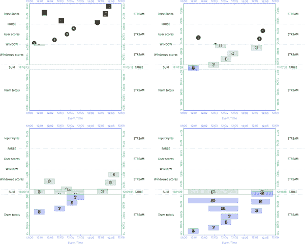

###### 图 8-13。使用累积但没有撤销的会话窗口总结

最后，在 SQL 中呈现的输出流将如下所示：

```java

*12:00> SELECT STREAM SUM(Score) as Total,*
 *SESSION(EventTime, INTERVAL '1' MINUTE) as Window,*
 *CURRENT_TIMESTAMP as EmitTime*
 *FROM UserScoresForSessions*
 *GROUP BY Team, SESSION(EventTime, INTERVAL '1' MINUTE);*
-------------------------------------------
| Total | Window               | EmitTime |
-------------------------------------------
| 5     | [12:00:26, 12:01:26) | 12:05:19 |
| 7     | [12:02:26, 12:03:26) | 12:05:39 |
| 3     | [12:03:39, 12:04:39) | 12:06:13 |
| 7     | [12:03:39, 12:05:19) | 12:06:46 |
| 3     | [12:06:39, 12:07:39) | 12:07:19 |
| 22    | [12:02:26, 12:05:19) | 12:07:33 |
| 11    | [12:06:39, 12:08:26) | 12:08:13 |
| 36    | [12:00:26, 12:05:19) | 12:08:19 |
| 12    | [12:06:39, 12:08:46) | 12:09:00 |
............. [12:00, 12:10] ..............

```

在这里要注意的重要事情（在动画和 SQL 渲染中）是增量会话流的样子。从我们的整体观点来看，很容易在动画中直观地识别出哪些后续会话取代了之前的会话。但是想象一下，逐个接收这个流中的元素（就像在 SQL 列表中一样），并需要以一种最终使 HBase 表只包含两个最终会话（值为 36 和 12）的方式将它们写入 HBase。你会怎么做呢？嗯，你需要进行一系列的读取-修改-写入操作，读取一个键的所有现有会话，将它们与新会话进行比较，确定哪些会话重叠，删除过时的会话，最后为新会话发出写入操作——所有这些都需要额外的成本，并且会丧失幂等性，最终导致无法提供端到端的、一次性的语义。这是不切实际的。

然后，将这个与启用撤销的相同管道进行对比，就像示例 8-8 和图 8-14 中所示的那样。

##### 示例 8-8。具有每条记录触发、累积和撤销的会话窗口

```java

PCollection<String> raw = IO.read(...);
PCollection<KV<Team, Integer>> input = raw.apply(new ParseFn());
PCollection<KV<Team, Integer>> totals = input
  .apply(Window.into(Sessions.withGapDuration(ONE_MINUTE))
               .triggering(Repeatedly(AfterCount(1))
               .accumulatingAndRetractingFiredPanes())
  .apply(Sum.integersPerKey());

```

<assets/stsy_0814.mp4>

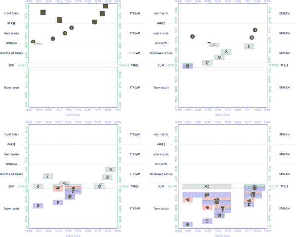

###### 图 8-14。使用累积和撤销的会话窗口总结

最后，在 SQL 形式上。对于 SQL 版本，我们假设系统默认情况下正在使用撤销，并且每当我们请求特殊的`Sys.Undo`列时，单独的撤销行就会在流中实现。正如我最初描述的那样，该列的价值在于它允许我们区分撤销行（在`Sys.Undo`列中标记为“撤销”）和正常行（在这里`Sys.Undo`列中未标记，以便更清晰地对比，尽管它们也可以被标记为“重做”）：

```java

*12:00> SELECT STREAM SUM(Score) as Total,*
 *SESSION(EventTime, INTERVAL '1' MINUTE) as Window,*
 *CURRENT_TIMESTAMP as EmitTime,*
 *Sys.Undo as Undo*
 *FROM UserScoresForSessions*
 *GROUP BY Team, SESSION(EventTime, INTERVAL '1' MINUTE);*
--------------------------------------------------
| Total | Window               | EmitTime | Undo |
--------------------------------------------------
| 5     | [12:00:26, 12:01:26) | 12:05:19 |      |
| 7     | [12:02:26, 12:03:26) | 12:05:39 |      |
| 3     | [12:03:39, 12:04:39) | 12:06:13 |      |
| 3     | [12:03:39, 12:04:39) | 12:06:46 | undo |
| 7     | [12:03:39, 12:05:19) | 12:06:46 |      |
| 3     | [12:06:39, 12:07:39) | 12:07:19 |      |
| 7     | [12:02:26, 12:03:26) | 12:07:33 | undo |
| 7     | [12:03:39, 12:05:19) | 12:07:33 | undo |
| 22    | [12:02:26, 12:05:19) | 12:07:33 |      |
| 3     | [12:06:39, 12:07:39) | 12:08:13 | undo |
| 11    | [12:06:39, 12:08:26) | 12:08:13 |      |
| 5     | [12:00:26, 12:01:26) | 12:08:19 | undo |
| 22    | [12:02:26, 12:05:19) | 12:08:19 | undo |
| 36    | [12:00:26, 12:05:19) | 12:08:19 |      |
| 11    | [12:06:39, 12:08:26) | 12:09:00 | undo |
| 12    | [12:06:39, 12:08:46) | 12:09:00 |      |
................. [12:00, 12:10] .................

```

包括撤销在内，会话流不再仅包括新会话，还包括已被替换的旧会话的撤销。有了这个流，随着时间的推移，逐步构建 HBase 中的会话集变得微不足道：您只需在新会话到达时写入新会话（未标记为“重做”行），并在它们被撤销时删除旧会话（“撤销”行）。好得多！

#### 丢弃模式，或者缺乏丢弃模式

通过这个例子，我们展示了如何简单而自然地将撤销纳入 SQL 中，以提供*累积模式*和*累积和撤销模式*语义。但是*丢弃模式*呢？

对于特定用例，例如通过单个分组操作部分聚合高容量输入数据，然后将其写入支持聚合的存储系统（例如类似数据库的系统），丢弃模式可以作为节省资源的选项非常有价值。但在那些相对狭窄的用例之外，丢弃模式是令人困惑和容易出错的。因此，将其直接纳入 SQL 可能并不值得。需要它的系统可以在 SQL 语言本身之外提供它作为一个选项。那些不需要的系统可以简单地提供更自然的默认值*累积和撤销模式*，并在不需要时忽略撤销。

# 总结

这是一个漫长而迷人的旅程。我们在本章中涵盖了大量信息，让我们花点时间来反思一下。

首先，我们推断出流处理和非流处理数据处理之间的关键区别是*时间的增加维度*。我们观察到关系（关系代数的基础数据对象，它本身是 SQL 的基础）本身随时间演变，并从中推导出了*TVR*的概念，它将关系的演变捕捉为经典快照关系的序列。从这个定义中，我们能够看到关系代数的*闭包性质*在 TVR 的世界中*保持完整*，这意味着整套关系运算符（因此也是 SQL 构造）在我们从瞬时快照关系的世界转移到流兼容的 TVR 的世界时继续像预期的那样运行。

其次，我们探讨了 Beam 模型和经典 SQL 模型中固有的偏见，得出结论 Beam 具有面向流的方法，而 SQL 采用面向表的方法。

最后，我们看了一下需要对 SQL 进行语言扩展以支持健壮流处理的假设性语言扩展，以及一些精心选择的默认值，这些默认值可以大大减少对这些扩展的需求：

表/流选择

鉴于任何时变关系都可以以两种不同的方式呈现（表或流），我们需要在实现查询结果时选择所需的呈现方式。我们引入了`TABLE`、`STREAM`和`TVR`关键字，以提供一种明确选择所需呈现方式的方式。

更好的是不需要明确指定选择，这就是好的默认值的作用。如果所有输入都是表，那么输出为表是一个很好的默认值；这给了您所习惯的经典关系查询行为。相反，如果任何输入是流，则输出为流是一个合理的默认值。

窗口化

虽然你可以使用现有的 SQL 构造声明一些类型的简单窗口，但是具有显式窗口化运算符仍然具有价值：

+   窗口化运算符封装了窗口计算数学。

+   窗口化允许简洁地表达复杂的、动态的分组，比如会话。

因此，添加用于分组的简单窗口化构造可以帮助使查询更少出错，同时还提供了（例如会话）在现有的声明性 SQL 中难以表达的功能。

水印

这不仅仅是 SQL 的扩展，而是一个系统级特性。如果所涉及的系统在内部集成了水印，它们可以与触发器一起使用，以在相信该行的输入已经完成后生成包含单个、权威版本的流。这对于那些不可能为结果轮询物化视图表的用例至关重要，而是必须直接将管道的输出作为流进行消耗。示例包括通知和异常检测。

触发器

触发器定义了从 TVR 创建的流的形状。如果未指定，默认应该是每条记录触发，这提供了与物化视图相匹配的直接和自然的语义。除了默认值，基本上有两种主要类型的有用触发器：

+   *水印触发器*，用于在相信该窗口的输入已经完成时，为每个窗口产生单个输出。

+   *重复延迟触发器*，用于提供周期性更新。

这两者的组合也可能很有用，特别是在启发式水印的情况下，以提供我们之前看到的早期/准时/迟的模式。

特殊系统列

当将 TVR 作为流进行消耗时，有一些有趣的元数据可能会很有用，而且最容易暴露为系统级列。我们看了四个：

`Sys.MTime`

给定行在 TVR 中上次修改的处理时间。

`Sys.EmitTiming`

行发出相对于水印的时间（早、准时、迟）。

`Sys.EmitIndex`

该行的发出版本的从零开始的索引。¹⁹

`Sys.Undo`

该行是正常行还是撤销（`undo`）。默认情况下，系统应该在内部使用撤销，这在可能存在一系列多个分组操作的任何时候是必要的。如果在将 TVR 呈现为流时未投影`Sys.Undo`列，那么只会返回正常行，这提供了在*累积*和*累积和撤销*模式之间切换的简单方法。

使用 SQL 进行流处理并不需要很困难。事实上，SQL 中的流处理已经相当普遍，以物化视图的形式存在。真正重要的部分实际上归结为捕获数据集/关系随时间的演变（通过时变关系），提供在物理表或流表示之间进行选择的手段，以及提供关于时间的推理工具（窗口化、水印和触发器），这些我们在本书中一直在讨论的。而且，至关重要的是，你需要很好的默认值，以最小化这些扩展在实践中需要被使用的频率。

¹ 这里我所说的“有效关系”简单地是指对于给定操作符的应用是良好形式的关系。例如，对于 SQL 查询`SELECT x FROM y`，一个有效的关系 y 将是任何包含名为 x 的属性/列的关系。任何不包含这样命名属性的关系将是无效的，并且在实际数据库系统的情况下，将产生查询执行错误。

² 对 Julian Hyde 的这个名称和概念的简洁表达表示非常感谢。

³ 请注意，这里使用的`Sys.Undo`名称是在[Apache Flink 的撤销/重做命名法](https://flink.apache.org/news/2017/04/04/dynamic-tables.html)的基础上进行的，我认为这是捕捉撤销和非撤销行的想法的一种非常简洁的方式。

⁴ 现在，在这个例子中，很容易发现新值 8 应该替换旧值 7，因为映射是 1:1。但当我们谈论会话时，我们将在稍后看到一个更复杂的例子，没有撤销作为指导，处理起来会更加困难。

⁵ 而且，这是一个需要记住的关键点。有一些系统主张将流和表视为相同，声称我们可以简单地将流视为永不结束的表。这种说法在某种程度上是准确的，因为真正的基础原语是时变关系，所有关系操作都可以等同地应用于任何时变关系，无论实际的物理表现形式是流还是表。但这种方法混淆了表和流为给定的时变关系提供的两种非常不同的视图类型。假装两个非常不同的东西是相同的，表面上看起来很简单，但这不是通向理解、清晰和正确的道路。

⁶ 这里指的是随时间变化的表；也就是我们一直在看的基于表的 TVR。

⁷ 这是朱利安·海德的礼貌。

⁸ 尽管各个项目中有许多正在进行的工作，试图简化触发/取消分组语义的规范。在 Flink 和 Beam 社区内部独立提出的最具说服力的建议是，触发器应该简单地在管道的输出处指定，并自动在整个管道中传播。通过这种方式，只需描述实际创建物化输出的流的期望形状；所有其他流的形状将从那里隐式地派生出来。

⁹ 当然，单个 SQL 查询的表达能力远远超过单个 MapReduce，因为它具有更少限制的操作和组合选项。

¹⁰ 请注意，我们在这里是在概念上讨论；当然，在实际执行中可以应用许多优化；例如，通过索引查找特定行而不是扫描整个表。

¹¹ 有多次提到这些查询的“`MATERIALIZED`”方面只是一种优化：从语义上讲，这些查询可以很容易地用通用的`CREATE VIEW`语句替换，这种情况下，数据库可能会在每次引用时重新生成整个视图。这是真的。我在这里使用`MATERIALIZED`变体的原因是，物化视图的语义是根据变化流增量更新视图表，这表明了它们背后的流式特性。也就是说，你可以根据发生的变化增量处理变化，也可以不时地重新处理整个输入数据集。这两种方式都是处理不断变化的数据表的有效方式。

¹² 虽然可以说 SQL 的表偏向可能是 SQL 在批处理中的根源。

¹³ 对于某些用例，捕获和使用给定记录的当前处理时间作为其未来事件时间可能是有用的（例如，当直接将事件记录到 TVR 中时，入口时间就是该记录的自然事件时间）。

¹⁴ 数学很容易出错。

15 默认情况下，使用撤回就足够了，而不仅仅是因为系统只需要*选择*使用撤回。有特定的用例；例如，具有单个分组操作的查询，其结果正在写入支持按键更新的外部存储系统，系统可以检测到不需要撤回并将其禁用作为优化。

16 请注意，仅仅在`SELECT`语句中简单添加新列就导致查询中出现新行有点奇怪。一个很好的替代方法是在不需要时通过`WHERE`子句过滤掉`Sys.Undo`行。

17 请注意，这种琐事只适用于最终一致性足够的情况。如果您需要始终在任何给定时间具有全局一致的视图，则必须 1）确保在其发出时间写入/删除（通过墓碑）每个会话，并且 2）仅从 HBase 表中的时间戳读取，该时间戳小于管道的输出水印（以使读取与会话合并时发生的多个独立写入/删除同步）。或者更好的是，直接从状态表中提供会话，而不是中间人。

18 明确地说，它们并非都是假设的。Calcite 支持本章描述的窗口构造。

19 请注意，在像会话这样的合并窗口的情况下，“索引”的定义变得复杂。一个合理的方法是取所有先前合并在一起的会话的最大值，并递增一。
