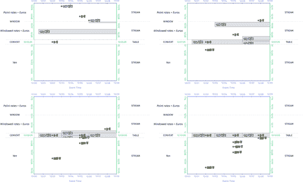
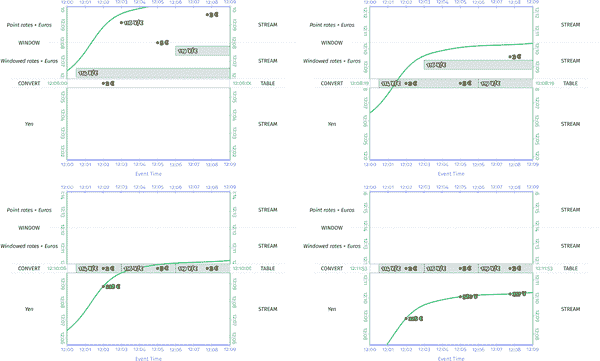

# 第九章：流连接

当我开始学习连接时，这是一个令人生畏的话题；`LEFT`、`OUTER`、`SEMI`、`INNER`、`CROSS`：连接的语言是富有表现力和广泛的。再加上流带来的时间维度，你会发现这似乎是一个具有挑战性的复杂话题。好消息是，连接实际上并不是一开始看起来那么可怕的野兽，它没有令人畏惧的尖牙。与许多其他复杂话题一样，一旦你理解了连接的核心思想和主题，建立在这些基础之上的更广泛的景观突然变得更加易于访问。所以请加入我，我们一起探索这个迷人的话题...连接。

# 你所有的连接都属于流连接

加入两个数据集是什么意思？我们直观地理解，连接只是一种特定类型的分组操作：通过将共享某些属性（即键）的数据连接在一起，我们将一些先前不相关的个体数据元素收集到一组相关元素中。正如我们在第六章中学到的，分组操作总是消耗流并产生表格。知道这两件事，然后得出这整个章节基础的结论只是一个小小的飞跃：*在它们的核心，所有连接都是流连接*。

这个事实的伟大之处在于，它实际上使得流连接的主题更加易于处理。我们在流分组操作的时间推理方面学到的所有工具（窗口化、水印、触发器等）在流连接的情况下仍然适用。也许令人生畏的是，将流连接添加到混合中似乎只会使事情变得更加复杂。但正如您将在接下来的示例中看到的那样，对于将所有连接建模为流连接，存在一种优雅的简单和一致性。与其感觉存在令人困惑的多种不同连接方法，不如清楚地认识到几乎所有类型的连接实际上都归结为同一模式的轻微变化。最终，这种洞察力的清晰有助于使连接（流连接或其他）变得不那么令人生畏。

为了给我们一些具体的推理对象，让我们考虑一些不同类型的连接，它们被应用于以下数据集，方便地命名为`Left`和`Right`以匹配常见的命名约定：

```java

*12:10> SELECT TABLE * FROM Left;        12:10> SELECT TABLE * FROM Right;*
--------------------                    --------------------
| Num | Id | Time  |                    | Num | Id | Time  |
--------------------                    --------------------
| 1   | L1 | 12:02 |                    | 2   | R2 | 12:01 |
| 2   | L2 | 12:06 |                    | 3   | R3 | 12:04 |
| 3   | L3 | 12:03 |                    | 4   | R4 | 12:05 |
--------------------                    --------------------

```

每个包含三列：

`Num`

一个数字。

`Id`

对应表格的第一个字母（“`L`”或“`R`”）和`Num`的混合词，从而提供了一种唯一标识连接结果中给定单元格来源的方式。

`时间`

给定记录在系统中的到达时间，在考虑流连接时变得重要。

为了保持简单，注意我们的初始数据集将严格具有唯一的连接键。当我们到达`SEMI`连接时，我们将引入一些更复杂的数据集，以突出重复键存在时的连接行为。

我们首先深入研究*未窗口连接*，因为窗口化通常只在微小程度上影响连接语义。在我们满足未窗口连接的胃口之后，我们将触及一些窗口化上连接的更有趣的点。

# 未窗口连接

流连接无限数据并不总是需要窗口。但是通过应用我们在第六章学到的概念，我们可以看到这并不是真的。连接（包括窗口化和非窗口化）只是另一种分组操作，而分组操作产生表。因此，如果我们想要将非窗口连接创建的表作为流来消费，我们只需要应用一个非“等待直到我们看到所有输入”的非分组（或触发）操作。将连接窗口化为非全局窗口并使用水印触发器（即“等待直到我们看到流的有限时间段内的所有输入”触发器）确实是一种选择，但无论连接是否窗口化，都可以在每条记录上触发（即物化视图语义）或定期触发，而不考虑处理时间的推移。因为这样做可以使示例更容易理解，我们假设在以下所有非窗口连接示例中使用隐式默认的每条记录触发器来观察连接结果作为流。

现在，让我们来看看连接本身。ANSI SQL 定义了五种连接类型：`FULL OUTER`、`LEFT OUTER`、`RIGHT OUTER`、`INNER`和`CROSS`。我们深入研究前四种，并在下一段简要讨论最后一种。我们还涉及另外两种有趣但不太常见（至少使用标准语法支持较差）的变体：`ANTI`和`SEMI`连接。

表面上，听起来有很多变体。但是你会看到，实际上核心只有一种连接类型：`FULL OUTER`连接。`CROSS`连接只是具有虚假真连接谓词的`FULL OUTER`连接；也就是说，它返回左表中的每一行与右表中的每一行的所有可能配对。所有其他连接变体都简化为`FULL OUTER`连接的某个逻辑子集。¹因此，一旦你理解了所有不同连接类型之间的共同点，就会更容易记住它们。这也使得在流的上下文中推理它们变得更加简单。

在我们开始之前，这里还有一点需要注意：我们将主要考虑最多具有 1:1 基数的等值连接，也就是说，连接谓词是一个相等语句，并且每一侧最多只有一行匹配。这样可以使示例简单而简洁。当我们涉及`SEMI`连接时，我们将扩展我们的示例以考虑具有任意 N:M 基数的连接，这将让我们观察更多任意谓词连接的行为。

## FULL OUTER

因为它们构成了其他每种变体的概念基础，我们首先看`FULL OUTER`连接。外连接体现了对“连接”一词的相当自由和乐观的解释：`FULL OUTER`连接两个数据集的结果基本上是两个数据集中所有行的完整列表，²两个数据集中具有相同连接键的行被合并在一起，但未匹配的行都包括在未连接中。

例如，如果我们将两个示例数据集进行`FULL OUTER`连接，生成一个只包含连接 ID 的新关系，结果可能如下所示：

```java

*12:10> SELECT TABLE* 
 *Left.Id as L,* 
 *Right.Id as R,*
 *FROM Left FULL OUTER JOIN Right*
 *ON L.Num = R.Num;*
---------------
| L    | R    |
---------------
| L1   | null | 
| L2   | R2   |
| L3   | R3   |
| null | R4   |
---------------

```

我们可以看到`FULL OUTER`连接包括满足连接谓词的行（例如，“`L2, R2`”和“`L3, R3`”），但它还包括未满足谓词的部分行（例如，“`L1, null`”和“`null, R4`”，其中 null 表示数据的未连接部分）。

当然，这只是这种`FULL OUTER`连接关系的一个时间点快照，在所有数据到达系统之后进行。我们在这里学习流连接，流连接的定义涉及时间的增加维度。正如我们从第八章所知，如果我们想要了解给定数据集/关系随时间如何变化，我们希望用时间变化关系（TVR）来表达。因此，为了最好地了解连接随时间的演变，让我们现在看看这个连接的完整 TVR（每个快照关系之间的变化都用黄色突出显示）：

```java

*12:10> SELECT TVR*
 *Left.Id as L,*
 *Right.Id as R,*
 *FROM Left FULL OUTER JOIN Right*
 *ON L.Num = R.Num;*
-------------------------------------------------------------------------
|  [-inf, 12:01)  |  [12:01, 12:02) |  [12:02, 12:03) |  [12:03, 12:04) |
| --------------- | --------------- | --------------- | --------------- |
| | L    | R    | | | L    | R    | | | L    | R    | | | L    | R    | |
| --------------- | --------------- | --------------- | --------------- |
| --------------- | | null | R2   | | | L1   | null | | | L1   | null | | 
|                 | --------------- | | null | R2   | | | null | R2   | |
|                 |                 | --------------- | | L3   | null | |
|                 |                 |                 | --------------- |
-------------------------------------------------------------------------
|  [12:04, 12:05) |  [12:05, 12:06) |  [12:06, 12:07) |
| --------------- | --------------- | --------------- |
| | L    | R    | | | L    | R    | | | L    | R    | |
| --------------- | --------------- | --------------- |
| | L1   | null | | | L1   | null | | | L1   | null | |
| | null | L2   | | | null | L2   | | | L2 | L2   | |
| | L3   | L3 | | | L3   | L3   | | | L3   | L3   | |
| --------------- | | null | L4   | | | null | L4   | |
|                 | --------------- | --------------- |
-------------------------------------------------------

```

然后，正如你可能期望的那样，这个 TVR 的流呈现将捕捉到每个快照之间的具体增量：

```java

*12:00> SELECT STREAM* 
 *Left.Id as L,*
 *Right.Id as R,* 
 *CURRENT_TIMESTAMP as Time,*
 *Sys.Undo as Undo*
 *FROM Left FULL OUTER JOIN Right*
 *ON L.Num = R.Num;*
------------------------------
| L    | R    | Time  | Undo |
------------------------------
| null | R2   | 12:01 |      |
| L1   | null | 12:02 |      |
| L3   | null | 12:03 |      |
| L3   | null | 12:04 | undo |
| L3   | R3   | 12:04 |      |
| null | R4   | 12:05 |      |
| null | R2   | 12:06 | undo |
| L2   | R2   | 12:06 |      |
....... [12:00, 12:10] .......

```

注意包括“时间”和“撤销”列，以突出给定行在流中出现的时间，并且还指出给定行的更新首次导致撤销该行的先前版本的情况。如果这个流要捕捉随时间变化的完整视图，那么撤销/撤回行就至关重要。

因此，尽管这三种连接（表、TVR、流）各自是不同的，但很明显它们都只是相同数据的不同视图：表快照向我们展示了所有数据到达后数据集的整体情况，而 TVR 和流版本以各自的方式捕捉了整个关系在其存在过程中的演变。

有了对`FULL OUTER`连接的基本了解，我们现在理解了流上下文中连接的所有核心概念。不需要窗口，也不需要自定义触发器，没有特别痛苦或不直观的东西。只是连接随时间的每条记录的演变，正如你所期望的那样。更好的是，所有其他类型的连接只是这个主题的变体（至少在概念上），本质上只是在`FULL OUTER`连接的每条记录流上执行的额外过滤操作。现在让我们更详细地看看它们中的每一个。

## LEFT OUTER

`LEFT OUTER`连接只是`FULL OUTER`连接，其中右数据集中的任何未连接行都被移除。通过对原始的`FULL OUTER`连接进行灰掉将被过滤的行，可以最清楚地看到这一点。对于`LEFT OUTER`连接，看起来会像下面这样，原始的`FULL OUTER`连接中的每一行未连接的左侧都被过滤掉：

```java

 *12:00> SELECT STREAM Left.Id as L,* 
*12:10> SELECT TABLE                               Right.Id as R,*
 *Left.Id as L,                            Sys.EmitTime as Time,* 
 *Right.Id as R                            Sys.Undo as Undo* 
 *FROM Left LEFT OUTER JOIN Right          FROM Left LEFT OUTER JOIN Right*
 *ON L.Num = R.Num;                        ON L.Num = R.Num;*
---------------                          ------------------------------
| L    | R    |                          | L    | R    | Time  | Undo |
---------------                          ------------------------------
| L1   | null |                          | null | R2   | 12:01 |      |
| L2   | R2   |                          | L1   | null | 12:02 |      |
| L3   | R3   |                          | L3   | null | 12:03 |      |
| null | R4   |                          | L3   | null | 12:04 | undo |
---------------                          | L3   | R3   | 12:04 |      |
                                         | null | R4   | 12:05 |      |
                                         | null | R2   | 12:06 | undo |
                                         | L2   | R2   | 12:06 |      |
                                         ....... [12:00, 12:10] .......

```

为了看到表和流在实践中实际上会是什么样子，让我们再次看一下相同的查询，但这次完全省略了灰色行：

```java

 *12:00> SELECT STREAM Left.Id as L,* 
*12:10> SELECT TABLE                               Right.Id as R,*
 *Left.Id as L,                            Sys.EmitTime as Time,* 
 *Right.Id as R                            Sys.Undo as Undo* 
 *FROM Left LEFT OUTER JOIN Right          FROM Left LEFT OUTER JOIN Right*
 *ON L.Num = R.Num;                        ON L.Num = R.Num;*
---------------                          ------------------------------
| L    | R    |                          | L    | R    | Time  | Undo |
---------------                          ------------------------------
| L1   | null |                          | L1   | null | 12:02 |      |
| L2   | R2   |                          | L3   | null | 12:03 |      |
| L3   | R3   |                          | L3   | null | 12:04 | undo |
---------------                          | L3   | R3   | 12:04 |      |
                                         | L2   | R2   | 12:06 |      |
                                         ....... [12:00, 12:10] .......

```

## RIGHT OUTER

`RIGHT OUTER`连接是左连接的相反：在完全外连接中，来自左数据集的所有未连接行都被右侧移除。

```java

 *12:00> SELECT STREAM Left.Id as L,* 
*12:10> SELECT TABLE                               Right.Id as R,*
 *Left.Id as L,                            Sys.EmitTime as Time,* 
 *Right.Id as R                            Sys.Undo as Undo* 
 *FROM Left RIGHT OUTER JOIN Right         FROM Left RIGHT OUTER JOIN Right*
 *ON L.Num = R.Num;                        ON L.Num = R.Num;*
---------------                          ------------------------------
| L    | R    |                          | L    | R    | Time  | Undo |
---------------                          ------------------------------
| L1   | null |                          | null | R2   | 12:01 |      |
| L2   | R2   |                          | L1   | null | 12:02 |      |
| L3   | R3   |                          | L3   | null | 12:03 |      |
| null | R4   |                          | L3   | null | 12:04 | undo |
---------------                          | L3   | R3   | 12:04 |      |
                                         | null | R4   | 12:05 |      |
                                         | null | R2   | 12:06 | undo |
                                         | L2   | R2   | 12:06 |      |
                                         ....... [12:00, 12:10] .......

```

在这里我们看到查询实际上呈现为实际的`RIGHT OUTER`连接会是什么样子：

```java

 *12:00> SELECT STREAM Left.Id as L,* 
*12:10> SELECT TABLE                               Right.Id as R,*
 *Left.Id as L,                            Sys.EmitTime as Time,* 
 *Right.Id as R                            Sys.Undo as Undo* 
 *FROM Left RIGHT OUTER JOIN Right         FROM Left RIGHT OUTER JOIN Right*
 *ON L.Num = R.Num;                        ON L.Num = R.Num;*
---------------                          ------------------------------
| L    | R    |                          | L    | R    | Time  | Undo |
---------------                          ------------------------------
| L2   | R2   |                          | null | R2   | 12:01 |      |
| L3   | R3   |                          | L3   | R3   | 12:04 |      |
| null | R4   |                          | null | R4   | 12:05 |      |
---------------                          | null | R2   | 12:06 | undo |
                                         | L2   | R2   | 12:06 |      |
                                         ....... [12:00, 12:10] .......

```

## INNER

`INNER`连接实质上是`LEFT OUTER`和`RIGHT OUTER`连接的交集。或者，从减法的角度来看，从原始的`FULL OUTER`连接中移除以创建`INNER`连接的行是从`LEFT OUTER`和`RIGHT OUTER`连接中移除的行的并集。因此，任一侧保留未连接的所有行都不会出现在`INNER`连接中：

```java

 *12:00> SELECT STREAM Left.Id as L,* 
*12:10> SELECT TABLE                               Right.Id as R,*
 *Left.Id as L,                            Sys.EmitTime as Time,* 
 *Right.Id as R                            Sys.Undo as Undo* 
 *FROM Left INNER JOIN Right               FROM Left INNER JOIN Right*
 *ON L.Num = R.Num;                        ON L.Num = R.Num;*
---------------                          ------------------------------
| L    | R    |                          | L    | R    | Time  | Undo |
---------------                          ------------------------------
| L1   | null |                          | null | R2   | 12:01 |      |
| L2   | R2   |                          | L1   | null | 12:02 |      |
| L3   | R3   |                          | L3   | null | 12:03 |      |
| null | R4   |                          | L3   | null | 12:04 | undo |
---------------                          | L3   | R3   | 12:04 |      |
                                         | null | R4   | 12:05 |      |
                                         | null | R2   | 12:06 | undo |
                                         | L2   | R2   | 12:06 |      |
                                         ....... [12:00, 12:10] .......

```

再次，更简洁地呈现为实际的`INNER`连接会是什么样子：

```java

 *12:00> SELECT STREAM Left.Id as L,* 
*12:10> SELECT TABLE                               Right.Id as R,*
 *Left.Id as L,                            Sys.EmitTime as Time,* 
 *Right.Id as R                            Sys.Undo as Undo* 
 *FROM Left INNER JOIN Right               FROM Left INNER JOIN Right*
 *ON L.Num = R.Num;                        ON L.Num = R.Num;*
---------------                          ------------------------------
| L    | R    |                          | L    | R    | Time  | Undo |
---------------                          ------------------------------
| L2   | R2   |                          | L3   | R3   | 12:04 |      |
| L3   | R3   |                          | L2   | R2   | 12:06 |      |
---------------                          ....... [12:00, 12:10] .......

```

根据这个例子，你可能会倾向于认为在`INNER`连接流中撤回从未发挥作用，因为在这个例子中它们都被过滤掉了。但是想象一下，如果“左”表中具有`Num`为`3`的行的值在 12:07 从`L3`更新为`L3v2`。除了在最终的`TABLE`查询中（再次在 12:10 执行，这是在“左”边的行`3`的更新到达之后）导致左侧的不同值之外，它还将导致一个`STREAM`，捕捉到旧值的撤回和新值的添加：

```java

 *12:00> SELECT STREAM Left.Id as L,* 
*12:10> SELECT TABLE                               Right.Id as R,*
 *Left.Id as L,                            Sys.EmitTime as Time,* 
 *Right.Id as R                            Sys.Undo as Undo* 
 *FROM LeftV2 INNER JOIN Right             FROM LeftV2 INNER JOIN Right*
 *ON L.Num = R.Num;                        ON L.Num = R.Num;*
---------------                           ------------------------------
| L    | R    |                           | L    | R    | Time  | Undo |
---------------                           ------------------------------
| L2   | R2   |                           | L3   | R3   | 12:04 |      |
| L3v2 | R3   |                           | L2   | R2   | 12:06 |      |
---------------                           | L3   | R3   | 12:07 | undo | 
                                          | L3v2 | R3   | 12:07 |      |
                                          ....... [12:00, 12:10] .......

```

## 反对

`ANTI`连接是`INNER`连接的反面：它们包含所有*未连接*的行。并非所有的 SQL 系统都支持清晰的`ANTI`连接语法，但为了清晰起见，我将在这里使用最直接的语法：

```java

 *12:00> SELECT STREAM Left.Id as L,* 
*12:10> SELECT TABLE                               Right.Id as R,*
 *Left.Id as L,                            Sys.EmitTime as Time,* 
 *Right.Id as R                            Sys.Undo as Undo* 
 *FROM Left ANTI JOIN Right                FROM Left ANTI JOIN Right*
 *ON L.Num = R.Num;                        ON L.Num = R.Num;*
---------------                          -------------------------------
| L    | R    |                          | L    |    R | Time  | Undo |
---------------                          ------------------------------
| L1   | null |                          | null | R2   | 12:01 |      |
| L2   | R2   |                          | L1   | null | 12:02 |      |
| L3   | R3   |                          | L3   | null | 12:03 |      |
| null | R4   |                          | L3   | null | 12:04 | undo |
---------------                          | L3   | R3   | 12:04 |      |
                                         | null | R4   | 12:05 |      |
                                         | null | R2   | 12:06 | undo |
                                         | L2   | R2   | 12:06 |      |
                                         ....... [12:00, 12:10] .......

```

关于`ANTI`连接的流呈现略有趣的地方在于，它最终包含了一堆最终加入的行的错误开始和撤回；事实上，`ANTI`连接的撤回与`INNER`连接的轻松相比是相当重的。更简洁的版本将如下所示：

```java

 *12:00> SELECT STREAM Left.Id as L,* 
*12:10> SELECT TABLE                               Right.Id as R,*
 *Left.Id as L,                            Sys.EmitTime as Time,* 
 *Right.Id as R                            Sys.Undo as Undo* 
 *FROM Left ANTI JOIN Right               FROM Left ANTI JOIN Right*
 *ON L.Num = R.Num;                        ON L.Num = R.Num;*
---------------                          ------------------------------
| L    | R    |                          | L    | R    | Time  | Undo |
---------------                          ------------------------------
| L1   | null |                          | null | R2   | 12:01 |      |
| null | R4   |                          | L1   | null | 12:02 |      |
---------------                          | L3   | null | 12:03 |      | 
                                         | L3   | null | 12:04 | undo |
                                         | null | R4   | 12:05 |      |
                                         | null | R2   | 12:06 | undo |
                                         ....... [12:00, 12:10] .......

```

## “SEMI”

现在我们来谈谈`SEMI`连接，而`SEMI`连接有点奇怪。乍一看，它们基本上看起来像是内连接，其中一个连接值被丢弃。确实，在 N:M 基数关系为<side-being-kept>:<side-being-dropped>是 N:M 且 M≤1 的情况下，这是有效的（请注意，我们将在接下来的所有示例中使用 kept=`Left`，dropped=`Right`）。例如，在我们迄今使用的`Left`和`Right`数据集上（连接数据的基数分别为 0:1、1:0 和 1:1），`INNER`和`SEMI`连接变体看起来是相同的。

```java

*12:10> SELECT TABLE            12:10> SELECT TABLE*
 *Left.Id as L                   Left.Id as L*
*FROM Left INNER JOIN           FROM Left SEMI JOIN*
*Right ON L.Num = R.Num;        Right ON L.Num = R.Num;*
---------------                ---------------
| L    | R    |                | L    | R    |
---------------                ---------------
| L1   | null |                | L1   | null |
| L2   | R2   |                | L2   | R2   |
| L3   | R3   |                | L3   | R3   |
| null | R4   |                | null | R4   |
---------------                ---------------

```

然而，在 N:M 基数为 M>1 的情况下，`SEMI`连接还有一个微妙之处：因为 M 端的*值*没有被返回，`SEMI`连接只是基于右侧存在*任何*匹配行来断定连接条件，而不是重复产生*每个*匹配行的新结果。

为了清楚地看到这一点，让我们切换到一对稍微复杂的输入关系，突出显示其中包含的行的 N:M 连接基数。在这些关系中，`N_M`列说明了左侧和右侧行之间的基数关系，而`Id`列（与之前一样）为每个输入关系中的每一行提供了一个唯一的标识符：

```java

*12:15> SELECT TABLE * FROM LeftNM;    12:15> SELECT TABLE * FROM RightNM;*
---------------------                 ---------------------
| N_M | Id  |  Time |                 | N_M | Id  |  Time |
---------------------                 ---------------------
| 1:0 | L2  | 12:07 |                 | 0:1 | R1  | 12:02 |
| 1:1 | L3  | 12:01 |                 | 1:1 | R3  | 12:14 |
| 1:2 | L4  | 12:05 |                 | 1:2 | R4A | 12:03 |
| 2:1 | L5A | 12:09 |                 | 1:2 | R4B | 12:04 |
| 2:1 | L5B | 12:08 |                 | 2:1 | R5  | 12:06 |
| 2:2 | L6A | 12:12 |                 | 2:2 | R6A | 12:11 |
| 2:2 | L6B | 12:10 |                 | 2:2 | R6B | 12:13 |
---------------------                 ---------------------

```

有了这些输入，`FULL OUTER`连接扩展如下：

```java

 *12:00> SELECT STREAM*
 *COALESCE(LeftNM.N_M,* 
*12:15> SELECT TABLE                                      RightNM.N_M) as N_M,* 
 *COALESCE(LeftNM.N_M,                     LeftNM.Id as L,*
 *RightNM.N_M) as N_M,            RightNM.Id as R,* 
 *LeftNM.Id as L,                        Sys.EmitTime as Time,* 
 *RightNM.Id as R,                         Sys.Undo as Undo*
 *FROM LeftNM                            FROM LeftNM* 
 *FULL OUTER JOIN RightNM                FULL OUTER JOIN RightNM*
 *ON LeftNM.N_M = RightNM.N_M;           ON LeftNM.N_M = RightNM.N_M;*
---------------------                  ------------------------------------
| N_M | L    | R    |                  | N_M | L    | R    | Time  | Undo |
---------------------                  ------------------------------------
| 0:1 | null | R1   |                  | 1:1 | L3   | null | 12:01 |      |
| 1:0 | L2   | null |                  | 0:1 | null | R1   | 12:02 |      |
| 1:1 | L3   | R3   |                  | 1:2 | null | R4A  | 12:03 |      |
| 1:2 | L4   | R4A  |                  | 1:2 | null | R4B  | 12:04 |      |
| 1:2 | L4   | R4B  |                  | 1:2 | null | R4A  | 12:05 | undo |
| 2:1 | L5A  | R5   |                  | 1:2 | null | R4B  | 12:05 | undo |
| 2:1 | L5B  | R5   |                  | 1:2 | L4   | R4A  | 12:05 |      |
| 2:2 | L6A  | R6A  |                  | 1:2 | L4   | R4B  | 12:05 |      |
| 2:2 | L6A  | R6B  |                  | 2:1 | null | R5   | 12:06 |      |
| 2:2 | L6B  | R6A  |                  | 1:0 | L2   | null | 12:07 |      |
| 2:2 | L6B  | R6B  |                  | 2:1 | null | R5   | 12:08 | undo |
---------------------                  | 2:1 | L5B  | R5   | 12:08 |      |
                                       | 2:1 | L5A  | R5   | 12:09 |      |
                                       | 2:2 | L6B  | null | 12:10 |      |
                                       | 2:2 | L6B  | null | 12:11 | undo |
                                       | 2:2 | L6B  | R6A  | 12:11 |      |
                                       | 2:2 | L6A  | R6A  | 12:12 |      |
                                       | 2:2 | L6A  | R6B  | 12:13 |      |
                                       | 2:2 | L6B  | R6B  | 12:13 |      |
                                       | 1:1 | L3   | null | 12:14 | undo |
                                       | 1:1 | L3   | R3   | 12:14 |      |
                                       .......... [12:00, 12:15] ..........

```

作为一个附注，当每一侧有多行匹配相同谓词时，这些更复杂的数据集的一个额外好处是连接的乘法性质开始变得更加清晰（例如，“2:2”行，从输入的每一侧的两行扩展到输出的四行；如果数据集有一组“3:3”行，它们将从每个输入的三行扩展到输出的九行，依此类推）。

但回到`SEMI`连接的微妙之处。通过这些数据集，很清楚地看到过滤的`INNER`连接和`SEMI`连接之间的区别：对于任何 N:M 基数为 M>1 的行，`INNER`连接会产生重复值，而`SEMI`连接不会（请注意，我已经用红色突出显示了`INNER`连接版本中的重复行，并在相应的`INNER`和`SEMI`版本中省略了完全外连接的部分）。

```java

*12:15> SELECT TABLE                       12:15> SELECT TABLE*
 *COALESCE(LeftNM.N_M,                      COALESCE(LeftNM.N_M,*
 *RightNM.N_M) as N_M,                      RightNM.N_M) as N_M,*
 *LeftNM.Id as L                            LeftNM.Id as L*
 *FROM LeftNM INNER JOIN RightNM            FROM LeftNM SEMI JOIN RightNM*
 *ON LeftNM.N_M = RightNM.N_M;              ON LeftNM.N_M = RightNM.N_M;*
---------------------                     ---------------------
| N_M | L    | R    |                     | N_M | L    | R    |
---------------------                     ---------------------
| 0:1 | null | R1   |                     | 0:1 | null | R1   |
| 1:0 | L2   | null |                     | 1:0 | L2   | null |
| 1:1 | L3   | R3   |                     | 1:1 | L3   | R3   |
| 1:2 | L4   | R5A  |                     | 1:2 | L4   | R5A  |
| 1:2 | L4 | R5B  |                     | 1:2 | L4   | R5B  |
| 2:1 | L5A  | R5   |                     | 2:1 | L5A  | R5   |
| 2:1 | L5B  | R5   |                     | 2:1 | L5B  | R5   |
| 2:2 | L6A  | R6A  |                     | 2:2 | L6A  | R6A  |
| 2:2 | L6A | R6B  |                     | 2:2 | L6A  | R6B  |
| 2:2 | L6B  | R6A  |                     | 2:2 | L6B  | R6A  |
| 2:2 | L6B | R6B  |                     | 2:2 | L6B  | R6B  |
---------------------                     ---------------------

```

或者，更简洁地表达：

```java

*12:15> SELECT TABLE                       12:15> SELECT TABLE*
 *COALESCE(LeftNM.N_M,                      COALESCE(LeftNM.N_M,*
 *RightNM.N_M) as N_M,                      RightNM.N_M) as N_M,*
 *LeftNM.Id as L                            LeftNM.Id as L*
 *FROM LeftNM INNER JOIN RightNM            FROM LeftNM SEMI JOIN RightNM*
 *ON LeftNM.N_M = RightNM.N_M;              ON LeftNM.N_M = RightNM.N_M;*
-------------                             -------------
| N_M | L   |                             | N_M | L   |
-------------                             -------------
| 1:1 | L3  |                             | 1:1 | L3  |
| 1:2 | L4  |                             | 1:2 | L4  |
| 1:2 | L4 |                             | 2:1 | L5A |
| 2:1 | L5A |                             | 2:1 | L5B |
| 2:1 | L5B |                             | 2:2 | L6A |
| 2:2 | L6A |                             | 2:2 | L6B |
| 2:2 | L6A |                             -------------
| 2:2 | L6B |
| 2:2 | L6B |
-------------

```

然后，`STREAM`呈现提供了一些上下文，说明了被过滤掉的行——它们只是后到达的重复行（从被投影的列的角度来看）。

```java

*12:00> SELECT STREAM                        12:00> SELECT STREAM*
 *COALESCE(LeftNM.N_M,                        COALESCE(LeftNM.N_M,*
 *RightNM.N_M) as N_M,                        RightNM.N_M) as N_M,*
 *LeftNM.Id as L                              LeftNM.Id as L*
 *Sys.EmitTime as Time,                       Sys.EmitTime as Time,*
 *Sys.Undo as Undo,                           Sys.Undo as Undo,*
 *FROM LeftNM INNER JOIN RightNM              FROM LeftNM SEMI JOIN RightNM*
 *ON LeftNM.N_M = RightNM.N_M;                ON LeftNM.N_M = RightNM.N_M;*
------------------------------------        ------------------------------------
| N_M | L    | R    | Time  | Undo |        | N_M | L    | R    | Time  | Undo |
------------------------------------        ------------------------------------
| 1:1 | L3   | null | 12:01 |      |        | 1:1 | L3   | null | 12:01 |      |
| 0:1 | null | R1   | 12:02 |      |        | 0:1 | null | R1   | 12:02 |      |
| 1:2 | null | R4A  | 12:03 |      |        | 1:2 | null | R4A  | 12:03 |      |
| 1:2 | null | R4B  | 12:04 |      |        | 1:2 | null | R4B  | 12:04 |      |
| 1:2 | null | R4A  | 12:05 | undo |        | 1:2 | null | R4A  | 12:05 | undo |
| 1:2 | null | R4B  | 12:05 | undo |        | 1:2 | null | R4B  | 12:05 | undo |
| 1:2 | L4   | R4A  | 12:05 |      |        | 1:2 | L4   | R4A  | 12:05 |      |
| 1:2 | L4 | R4B  | 12:05 |  |        | 1:2 | L4   | R4B  | 12:05 |      |
| 2:1 | null | R5   | 12:06 |      |        | 2:1 | null | R5   | 12:06 |      |
| 1:0 | L2   | null | 12:07 |      |        | 1:0 | L2   | null | 12:07 |      |
| 2:1 | null | R5   | 12:08 | undo |        | 2:1 | null | R5   | 12:08 | undo |
| 2:1 | L5B  | R5   | 12:08 |      |        | 2:1 | L5B  | R5   | 12:08 |      |
| 2:1 | L5A  | R5   | 12:09 |      |        | 2:1 | L5A  | R5   | 12:09 |      |
| 2:2 | L6B  | null | 12:10 |      |        | 2:2 | L6B  | null | 12:10 |      |
| 2:2 | L6B  | null | 12:10 | undo |        | 2:2 | L6B  | null | 12:10 | undo |
| 2:2 | L6B  | R6A  | 12:11 |      |        | 2:2 | L6B  | R6A  | 12:11 |      |
| 2:2 | L6A  | R6A  | 12:12 |      |        | 2:2 | L6A  | R6A  | 12:12 |      |
| 2:2 | L6A | R6B  | 12:13 |  |        | 2:2 | L6A  | R6B  | 12:13 |      |
| 2:2 | L6B | R6B  | 12:13 |  |        | 2:2 | L6B  | R6B  | 12:13 |      |
| 1:1 | L3   | null | 12:14 | undo |        | 1:1 | L3   | null | 12:14 | undo |
| 1:1 | L3   | R3   | 12:14 |      |        | 1:1 | L3   | R3   | 12:14 |      |
.......... [12:00, 12:15] ..........        .......... [12:00, 12:15] ..........

```

再次简洁地表达：

```java

*12:00> SELECT STREAM                        12:00> SELECT STREAM*
 *COALESCE(LeftNM.N_M,                        COALESCE(LeftNM.N_M,*
 *RightNM.N_M) as N_M,                        RightNM.N_M) as N_M,*
 *LeftNM.Id as L                              LeftNM.Id as L*
 *Sys.EmitTime as Time,                       Sys.EmitTime as Time,*
 *Sys.Undo as Undo,                           Sys.Undo as Undo,*
 *FROM LeftNM INNER JOIN RightNM              FROM LeftNM SEMI JOIN RightNM*
 *ON LeftNM.N_M = RightNM.N_M;                ON LeftNM.N_M = RightNM.N_M;*
----------------------------                ----------------------------
| N_M | L   | Time  | Undo |                | N_M | L   | Time  | Undo |
----------------------------                ----------------------------
| 1:2 | L4  | 12:05 |      |                | 1:2 | L4  | 12:05 |      |
| 1:2 | L4 | 12:05 |  |                | 2:1 | L5B | 12:08 |      |
| 2:1 | L5B | 12:08 |      |                | 2:1 | L5A | 12:09 |      |
| 2:1 | L5A | 12:09 |      |                | 2:2 | L6B | 12:11 |      |
| 2:2 | L6B | 12:11 |      |                | 2:2 | L6A | 12:12 |      |
| 2:2 | L6A | 12:12 |      |                | 1:1 | L3  | 12:14 |      |
| 2:2 | L6A | 12:13 |  |                ...... [12:00, 12:15] ......
| 2:2 | L6B | 12:13 |  |
| 1:1 | L3  | 12:14 |      |
...... [12:00, 12:15] ......      

```

正如我们在许多示例中所看到的，流连接并没有什么特别之处。它们的功能完全符合我们对流和表的了解，连接流捕获了随着时间推移而发展的连接历史。这与连接表形成对比，后者只是在特定时间点捕获了整个连接的快照，这可能是我们更习惯的方式。

但更重要的是，通过流-表理论的视角来看待连接增加了一些额外的清晰度。核心的基础连接原语是`FULL OUTER`连接，它是一个流→表分组操作，将关系中所有连接和未连接的行收集在一起。我们详细研究的所有其他变体（`LEFT OUTER`，`RIGHT OUTER`，`INNER`，`ANTI`和`SEMI`）只是在`FULL OUTER`连接后对连接流添加了一个额外的过滤层。³

# 窗口化连接

在查看了各种未窗口化的连接之后，让我们接下来探讨窗口化对混合的影响。我认为窗口化连接有两个动机：

以某种有意义的方式分区时间

一个明显的情况是固定窗口；例如，每日窗口，对于在同一天发生的事件应该出于某种业务原因进行连接（例如，每日计费总额）。另一个可能是出于性能原因限制连接中的时间范围。然而，事实证明，在连接中还有更复杂（和有用）的时间分区方式，包括一种特别有趣的用例，我目前所知的任何流系统都不支持本地：*时间有效连接*。稍后再详细介绍。

为连接提供一个有意义的超时参考点

这对于许多无界连接情况非常有用，但对于外连接等用例来说，它可能最明显地有益，因为无法事先知道连接的一侧是否会出现。对于经典的批处理（包括标准交互式 SQL 查询），只有在有界输入数据集被完全处理时，外连接才会超时。但是在处理无界数据时，我们不能等待所有数据被处理。正如我们在第二章和第三章中讨论的那样，水印为事件时间的输入源的完整性提供了一个进度指标。但是，为了利用该指标来超时连接，我们需要一些参考点进行比较。通过对连接进行窗口化，可以通过将连接的范围限定到窗口的末尾来提供该参考点。在水印通过窗口的末尾之后，系统可能会认为窗口的输入已完成。在那时，就像有界连接的情况一样，可以安全地超时任何未连接的行并实现它们的部分结果。

也就是说，正如我们之前看到的，窗口化绝对不是流连接的必要条件。在许多情况下是有意义的，但绝不是必需的。

实际上，大多数窗口化连接的用例（例如，每日窗口）相对简单，可以从我们到目前为止学到的概念中轻松推断出来。为了理解原因，我们简要看一下将固定窗口应用于我们已经遇到的一些连接示例意味着什么。之后，我们将在本章的其余部分中调查更有趣（也更令人费解）的*时间有效连接*主题，首先详细了解我所说的时间有效窗口，然后继续研究在这种窗口的上下文中连接意味着什么。

## 固定窗口

连接的窗口化将时间维度纳入连接条件本身。通过这样做，窗口用于将要连接的行的集合范围限定为仅包含在窗口时间间隔内的行。这可能更清楚地通过一个例子来看到，所以让我们将我们的原始`Left`和`Right`表窗口化为五分钟的固定窗口：

```java

*12:10> SELECT TABLE *,                     12:10> SELECT TABLE *,*
 *TUMBLE(Time, INTERVAL '5' MINUTE)          TUMBLE(Time, INTERVAL '5' MINUTE)*
 *as Window FROM Left;                       as Window FROM Right*
-------------------------------------      -------------------------------------
| Num | Id | Time  | Window         |      | Num | Id | Time  | Window         |
-------------------------------------      -------------------------------------
| 1   | L1 | 12:02 | [12:00, 12:05) |      | 2   | R2 | 12:01 | [12:00, 12:05) |
| 2   | L2 | 12:06 | [12:05, 12:10) |      | 3   | R3 | 12:04 | [12:00, 12:05) |
| 3   | L3 | 12:03 | [12:00, 12:05) |      | 4   | R4 | 12:05 | [12:05, 12:06) |
-------------------------------------      -------------------------------------

```

在我们之前的“左”和“右”示例中，连接条件只是“左.Num = 右.Num”。要将其转换为窗口连接，我们将扩展连接条件以包括窗口相等：`左.Num = 右.Num AND 左.Window = 右.Window`。知道这一点，我们可以从前面的窗口表中推断出我们的连接将如何改变（为了清晰起见进行了突出显示）：因为`L2`和`R2`行不在同一个五分钟的固定窗口内，它们在我们连接的窗口变体中将不会被连接在一起。

实际上，如果我们将未窗口化和窗口化的变体作为表进行对比，我们可以清楚地看到这一点（在连接的每一侧都突出显示了相应的`L2`和`R2`行）：

```java

 *12:10> SELECT TABLE* 
 *Left.Id as L,*
 *Right.Id as R,*
 *COALESCE(*
 *TUMBLE(Left.Time, INTERVAL '5' MINUTE),*
 *TUMBLE(Right.Time, INTERVAL '5' MINUTE)*
*12:10> SELECT TABLE                       ) AS Window*
 *Left.Id as L,                  FROM Left*
 *Right.Id as R,                   FULL OUTER JOIN Right* 
 *FROM Left                          ON L.Num = R.Num AND* 
 *FULL OUTER JOIN Right              TUMBLE(Left.Time, INTERVAL '5' MINUTE) =*
 *ON L.Num = R.Num;                  TUMBLE(Right.Time, INTERVAL '5' MINUTE);*
---------------                  --------------------------------
| L    | R    |                  | L    | R    | Window         |
---------------                  --------------------------------
| L1   | null |                  | L1   | null | [12:00, 12:05) |
| L2   | R2 |                  | null | R2   | [12:00, 12:05) |
| L3   | R3   |                  | L3   | R3   | [12:00, 12:05) |
| null | R4   |                  | L2   | null | [12:05, 12:10) |
---------------                  | null | R4   | [12:05, 12:10) |
                                 --------------------------------

```

当比较未窗口化和窗口化的连接作为流时，差异也是显而易见的。如下例所示，它们主要在最终行上有所不同。未窗口化的一侧完成了`Num = 2`的连接，产生了一个未连接的`R2`行的撤回，以及一个完成的“L2，R2”连接的新行。另一方面，窗口化的一侧只产生了一个未连接的`L2`行，因为`L2`和`R2`落入不同的五分钟窗口：

```java

 *12:10> SELECT STREAM* 
 *Left.Id as L,*
 *Right.Id as R,*
 *Sys.EmitTime as Time,*
 *COALESCE(*
 *TUMBLE(Left.Time, INTERVAL '5' MINUTE),*
*12:10> SELECT STREAM                        TUMBLE(Right.Time, INTERVAL '5' MINUTE)*
 *Left.Id as L,                    ) AS Window,*
 *Right.Id as R,                 Sys.Undo as Undo*
 *Sys.EmitTime as Time,          FROM Left*
 *Sys.Undo as Undo                 FULL OUTER JOIN Right*
 *FROM Left                          ON L.Num = R.Num AND*
 *FULL OUTER JOIN Right              TUMBLE(Left.Time, INTERVAL '5' MINUTE) =*
 *ON L.Num = R.Num;                  TUMBLE(Right.Time, INTERVAL '5' MINUTE);*
------------------------------   -----------------------------------------------
| L    | R    | Time  | Undo |   | L    | R    | Time  | Window         | Undo |
------------------------------   -----------------------------------------------
| null | R2   | 12:01 |      |   | null | R2   | 12:01 | [12:00, 12:05) |      |
| L1   | null | 12:02 |      |   | L1   | null | 12:02 | [12:00, 12:05) |      |
| L3   | null | 12:03 |      |   | L3   | null | 12:03 | [12:00, 12:05) |      |
| L3   | null | 12:04 | undo |   | L3   | null | 12:04 | [12:00, 12:05) | undo |
| L3   | R3   | 12:04 |      |   | L3   | R3   | 12:04 | [12:00, 12:05) |      |
| null | R4   | 12:05 |      |   | null | R4   | 12:05 | [12:05, 12:10) |      |
| null | R2   | 12:06 | undo |   | L2   | null | 12:06 | [12:05, 12:10) | |
| L2   | R2   | 12:06 | |   ............... [12:00, 12:10] ................
....... [12:00, 12:10] .......

```

有了这一点，我们现在了解了窗口对`FULL OUTER`连接的影响。通过应用我们在本章前半部分学到的规则，很容易推导出`LEFT OUTER`、`RIGHT OUTER`、`INNER`、`ANTI`和`SEMI`连接的窗口化变体。我会把这些推导的大部分留给你来完成，但是举一个例子，`LEFT OUTER`连接，正如我们所学的，只是在左侧的`FULL OUTER`连接中删除了空列（再次突出显示了`L2`和`R2`行以比较差异）：

```java

 *12:10> SELECT TABLE* 
 *Left.Id as L,*
 *Right.Id as R,*
 *COALESCE(*
 *TUMBLE(Left.Time, INTERVAL '5' MINUTE),*
 *TUMBLE(Right.Time, INTERVAL '5' MINUTE)*
*12:10> SELECT TABLE                       ) AS Window*
 *Left.Id as L,                  FROM Left*
 *Right.Id as R,                   LEFT OUTER JOIN Right* 
 *FROM Left                          ON L.Num = R.Num AND* 
 *LEFT OUTER JOIN Right              TUMBLE(Left.Time, INTERVAL '5' MINUTE) =*
 *ON L.Num = R.Num;                  TUMBLE(Right.Time, INTERVAL '5' MINUTE);*
---------------                  --------------------------------
| L    | R    |                  | L    | R    | Window         |
---------------                  --------------------------------
| L1   | null |                  | L1   | null | 12:00, 12:05) |
| L2   | R2 |                  | L2   | null | [12:05, 12:10) |
| L3   | R3   |                  | L3   | R3   | [12:00, 12:05) |
---------------                  --------------------------------

```

通过将连接的时间范围划分为固定的五分钟间隔，我们将我们的数据集划分为两个不同的时间窗口：`12:00, 12:05)`和`[12:05, 12:10)`。然后在这些区域内应用了我们之前观察到的完全相同的连接逻辑，对于`L2`和`R2`行分别落入不同区域的情况，得到了稍微不同的结果。基本上，窗口连接就是这样。

## 时间有效性

在看完窗口连接的基础知识后，我们现在将在本章的其余部分中看一种更高级的方法：时间有效性窗口。

### 时间有效性窗口

时间有效性窗口适用于在关系中的行有效地将时间划分为区域，其中给定值有效。更具体地说，想象一个用于执行货币转换的金融系统。这样的系统可能包含一个随时间变化的关系，记录了各种货币的当前转换率。例如，可能存在一个将不同货币转换为日元的关系。

```java

*12:10> SELECT TABLE * FROM YenRates;*
--------------------------------------
| Curr | Rate | EventTime | ProcTime |
--------------------------------------
| USD  | 102  | 12:00:00  | 12:04:13 |
| Euro | 114  | 12:00:30  | 12:06:23 |
| Yen  | 1    | 12:01:00  | 12:05:18 |
| Euro | 116  | 12:03:00  | 12:09:07 |
| Euro | 119  | 12:06:00  | 12:07:33 |
--------------------------------------

```

为了强调我所说的时间有效性窗口“有效地将时间划分为区域，其中给定值有效”，只考虑该关系中的欧元兑换成日元的汇率：

```java

*12:10> SELECT TABLE * FROM YenRates WHERE Curr = "Euro";*
--------------------------------------
| Curr | Rate | EventTime | ProcTime |
--------------------------------------
| Euro | 114  | 12:00:30  | 12:06:23 |
| Euro | 116  | 12:03:00  | 12:09:07 |
| Euro | 119  | 12:06:00  | 12:07:33 |
--------------------------------------

```

从数据库工程的角度来看，我们知道这些值并不意味着将欧元兑换成日元的汇率在 12:00 精确为 114 ¥/€，12:03 为 116 ¥/€，12:06 为 119 ¥/€，其他时间为未定义。相反，我们知道这个表的意图是捕捉欧元兑换成日元的汇率在 12:00 之前是未定义的，在 12:00 到 12:03 为 114 ¥/€，12:03 到 12:06 为 116 ¥/€，之后为 119 ¥/€。或者在时间轴上画出来：

```java

        Undefined              114 ¥/€                116 ¥/€              119 ¥/€
|----[-inf, 12:00)----|----[12:00, 12:03)----|----[12:03, 12:06)----|----[12:06, now)----→

```

现在，如果我们提前知道所有的费率，我们可以在行数据中明确地捕获这些区域。但是，如果我们需要基于给定费率变为有效的开始时间来逐步构建这些区域，我们会遇到问题：给定行的区域会随着之后的行的变化而随时间变化。即使数据按顺序到达也会出现这个问题（因为每次新费率到达时，先前的费率从永久有效变为有效直到新费率到达时间），但如果它们可以*无序*到达，则问题会进一步复杂化。例如，使用前面`YenRates`表中的处理时间排序，我们的表在时间上有效地表示的时间线序列将如下所示：

```java

Range of processing time | Event-time validity timeline during that range of processing-time
=========================|==============================================================================
                         |
                         |      Undefined
        [-inf, 12:06:23) | |--[-inf, +inf)---------------------------------------------------------→
                         |
                         |      Undefined          114 ¥/€
    [12:06:23, 12:07:33) | |--[-inf, 12:00)--|--[12:00, +inf)--------------------------------------→
                         |
                         |      Undefined          114 ¥/€                              119 ¥/€
    [12:07:33, 12:09:07) | |--[-inf, 12:00)--|--[12:00, 12:06)---------------------|--[12:06, +inf)→
                         |
                         |      Undefined          114 ¥/€            116 ¥/€           119 ¥/€
         [12:09:07, now) | |--[-inf, 12:00)--|--[12:00, 12:03)--|--[12:03, 12:06)--|--[12:06, +inf)→

```

或者，如果我们想将其呈现为一个时间变化的关系（每个快照关系之间的变化用黄色突出显示）：

```java

*12:10> SELECT TVR * FROM YenRatesWithRegion ORDER BY EventTime;*
---------------------------------------------------------------------------------------------
|              [-inf, 12:06:23)               |            [12:06:23, 12:07:33)             |
| ------------------------------------------- | ------------------------------------------- |
| | Curr | Rate |  Region        | ProcTime | | | Curr | Rate |  Region        | ProcTime | |
| ------------------------------------------- | ------------------------------------------- |
| ------------------------------------------- | | Euro | 114 | [12:00, +inf) | 12:06:23 | |
|                                             | ------------------------------------------- |
---------------------------------------------------------------------------------------------
|            [12:07:33, 12:09:07)             |              [12:09:07, +inf)               |
| ------------------------------------------- | ------------------------------------------- |
| | Curr | Rate |  Region        | ProcTime | | | Curr | Rate |  Region        | ProcTime | |
| ------------------------------------------- | ------------------------------------------- |
| | Euro | 114  | [12:00, 12:06) | 12:06:23 | | | Euro | 114  | [12:00, 12:03) | 12:06:23 | |
| | Euro | 119 | [12:06, +inf) | 12:07:33 | | | Euro | 116 | [12:03, 12:06) | 12:09:07 | |
| ------------------------------------------- | | Euro | 119  | [12:06, +inf)  | 12:07:33 | |
|                                             | ------------------------------------------- |
---------------------------------------------------------------------------------------------

```

这里需要注意的重要一点是，一半的变化涉及对多行的更新。这可能听起来不那么糟糕，直到你想起每个快照之间的差异是恰好到达一个新行。换句话说，单个新输入行的到达导致对多个输出行进行事务修改。这听起来不那么好。另一方面，这也听起来很像建立会话窗口所涉及的多行事务。事实上，这又是窗口提供超出简单时间分区的好处的另一个例子：它还提供了以涉及复杂的多行事务的方式进行操作的能力。

要看到这一点，让我们看一个动画。如果这是一个 Beam 管道，它可能看起来像以下内容：

```java

PCollection<Currency, Decimal> yenRates = ...;
PCollection<Decimal> validYenRates = yenRates
    .apply(Window.into(new ValidityWindows())
    .apply(GroupByKey.<Currency, Decimal>create());

```

在流/表动画中呈现，该管道看起来像图 9-1 所示的样子。

<assets/stsy_0901.mp4>

以获取一个示例部分实现。⁵

用 SQL 术语来说，创建这些有效窗口会看起来像以下内容（利用一个假设的`VALIDITY_WINDOW`结构），视为一个表：

```java

*12:10> SELECT TABLE* 
 *Curr,*
 *MAX(Rate) as Rate,*
 *VALIDITY_WINDOW(EventTime) as Window*
 *FROM YenRates* 
 *GROUP BY*
 *Curr,*
 *VALIDITY_WINDOW(EventTime)*
 *HAVING Curr = "Euro";*
--------------------------------
| Curr | Rate | Window         |
--------------------------------
| Euro | 114  | [12:00, 12:03) |
| Euro | 116  | [12:03, 12:06) |
| Euro | 119  | [12:06, +inf)  |
--------------------------------

```

或者，更有趣的是，将其视为一个流：

```java

*12:00> SELECT STREAM*
 *Curr,*
 *MAX(Rate) as Rate,*
 *VALIDITY_WINDOW(EventTime) as Window,*
 *Sys.EmitTime as Time,*
 *Sys.Undo as Undo,*
 *FROM YenRates*
 *GROUP BY*
 *Curr,*
 *VALIDITY_WINDOW(EventTime)* 
 *HAVING Curr = "Euro";*
--------------------------------------------------
| Curr | Rate | Window         | Time     | Undo |
--------------------------------------------------
| Euro | 114  | [12:00, +inf)  | 12:06:23 |      |
| Euro | 114  | [12:00, +inf)  | 12:07:33 | undo |
| Euro | 114  | [12:00, 12:06) | 12:07:33 |      | 
| Euro | 119  | [12:06, +inf)  | 12:07:33 |      |
| Euro | 114  | [12:00, 12:06) | 12:09:07 | undo | 
| Euro | 114  | [12:00, 12:03) | 12:09:07 |      |
| Euro | 116  | [12:03, 12:06) | 12:09:07 |      |
................. [12:00, 12:10] .................

```

很好，我们知道如何使用点时间值有效地将时间划分为值有效的范围。但是，当这些时间有效窗口应用于与其他数据连接时，它们的真正力量就显现出来。这就是时间有效连接的作用所在。

### 时间有效连接

为了探索时间有效连接的语义，假设我们的金融应用包含另一个时间变化的关系，跟踪各种货币兑换订单到日元的情况：

```java

*12:10> SELECT TABLE * FROM YenOrders;*
----------------------------------------
| Curr | Amount | EventTime | ProcTime |
----------------------------------------
| Euro | 2      | 12:02:00  | 12:05:07 |
| USD  | 1      | 12:03:00  | 12:03:44 |
| Euro | 5      | 12:05:00  | 12:08:00 |
| Yen  | 50     | 12:07:00  | 12:10:11 |
| Euro | 3      | 12:08:00  | 12:09:33 |
| USD  | 5      | 12:10:00  | 12:10:59 |
----------------------------------------

```

为了简单起见，和之前一样，让我们专注于欧元转换：

```java

*12:10> SELECT TABLE * FROM YenOrders WHERE Curr = "Euro";*
----------------------------------------
| Curr | Amount | EventTime | ProcTime |
----------------------------------------
| Euro | 2      | 12:02:00  | 12:05:07 |
| Euro | 5      | 12:05:00  | 12:08:00 |
| Euro | 3      | 12:08:00  | 12:09:33 |
----------------------------------------

```

我们希望将这些订单与`YenRates`关系健壮地连接起来，将`YenRates`中的行视为定义有效窗口。因此，我们实际上希望连接到上一节末尾构建的`YenRates`关系的有效窗口版本：

```java

*12:10> SELECT TABLE*
 *Curr,*
 *MAX(Rate) as Rate,*
 *VALIDITY_WINDOW(EventTime) as Window*
 *FROM YenRates*
 *GROUP BY*
 *Curr,*
 *VALIDITY_WINDOW(EventTime)*
 *HAVING Curr = "Euro";*
--------------------------------
| Curr | Rate | Window         |
--------------------------------
| Euro | 114  | [12:00, 12:03) |
| Euro | 116  | [12:03, 12:06) |
| Euro | 119  | [12:06, +inf)  |
--------------------------------

```

幸运的是，在我们将转换率放入有效窗口之后，这些费率与`YenOrders`关系之间的窗口连接正好给了我们想要的结果：

```java

*12:10> WITH ValidRates AS*
 *(SELECT*
 *Curr,*
 *MAX(Rate) as Rate,*
 *VALIDITY_WINDOW(EventTime) as Window*
 *FROM YenRates*
 *GROUP BY*
 *Curr,*
 *VALIDITY_WINDOW(EventTime))*
 *SELECT TABLE*
 *YenOrders.Amount as "E",*
 *ValidRates.Rate as "Y/E",* 
 *YenOrders.Amount * ValidRates.Rate as "Y",*
 *YenOrders.EventTime as Order,* 
 *ValidRates.Window as "Rate Window"*
 *FROM YenOrders FULL OUTER JOIN ValidRates* 
 *ON YenOrders.Curr = ValidRates.Curr*
 *AND WINDOW_START(ValidRates.Window) <= YenOrders.EventTime*
 *AND YenOrders.EventTime < WINDOW_END(ValidRates.Window)*
 *HAVING Curr = "Euro";*
-------------------------------------------
| E | Y/E | Y   | Order  | Rate Window    |
-------------------------------------------
| 2 | 114 | 228 | 12:02  | [12:00, 12:03) |
| 5 | 116 | 580 | 12:05  | [12:03, 12:06) |
| 3 | 119 | 357 | 12:08  | [12:06, +inf)  |
-------------------------------------------

```

回想一下我们最初的`YenRates`和`YenOrders`关系，这个连接的关系确实看起来是正确的：每个转换最终都以给定事件时间窗口的（最终）适当汇率结束，其对应的订单也在其中。因此，我们可以相当肯定，这个连接在提供我们想要的最终正确性方面做得很好。

也就是说，这个关系的简单快照视图，是在所有值都到达并且尘埃落定之后拍摄的，掩盖了这个连接的复杂性。要真正理解这里发生了什么，我们需要查看完整的 TVR。首先，回想一下，有效窗口转换率关系实际上比之前的简单表格快照视图所让你相信的要复杂得多。供参考，这里是有效窗口关系的`STREAM`版本，它更好地突出了这些转换率随时间的演变：

```java

*12:00> SELECT STREAM*
 *Curr,*
 *MAX(Rate) as Rate,*
 *VALIDITY(EventTime) as Window,*
 *Sys.EmitTime as Time,*
 *Sys.Undo as Undo,*
 *FROM YenRates*
 *GROUP BY*
 *Curr,*
 *VALIDITY(EventTime)*
 *HAVING Curr = "Euro";*
--------------------------------------------------
| Curr | Rate | Window         | Time     | Undo |
--------------------------------------------------
| Euro | 114  | [12:00, +inf)  | 12:06:23 |      |
| Euro | 114  | [12:00, +inf)  | 12:07:33 | undo |
| Euro | 114  | [12:00, 12:06) | 12:07:33 |      | 
| Euro | 119  | [12:06, +inf)  | 12:07:33 |      |
| Euro | 114  | [12:00, 12:06) | 12:09:07 | undo | 
| Euro | 114  | [12:00, 12:03) | 12:09:07 |      |
| Euro | 116  | [12:03, 12:06) | 12:09:07 |      |
................. [12:00, 12:10] .................

```

因此，如果我们查看我们的有效窗口连接的完整 TVR，您会发现随着时间的推移，这种连接的对应演变要复杂得多，这是由于连接的两侧值的无序到达：

```java

*12:10> WITH ValidRates AS*
 *(SELECT*
 *Curr,*
 *MAX(Rate) as Rate,*
 *VALIDITY_WINDOW(EventTime) as Window*
 *FROM YenRates*
 *GROUP BY*
 *Curr,*
 *VALIDITY_WINDOW(EventTime))*
 *SELECT TVR*
 *YenOrders.Amount as "E",*
 *ValidRates.Rate as "Y/E",* 
 *YenOrders.Amount * ValidRates.Rate as "Y",*
 *YenOrders.EventTime as Order,*
 *ValidRates.Window as "Rate Window"*
 *FROM YenOrders FULL OUTER JOIN ValidRates* 
 *ON YenOrders.Curr = ValidRates.Curr*
 *AND WINDOW_START(ValidRates.Window) <= YenOrders.EventTime*
 *AND YenOrders.EventTime < WINDOW_END(ValidRates.Window)*
 *HAVING Curr = "Euro";*
-------------------------------------------------------------------------------------------
|              [-inf, 12:05:07)              |            [12:05:07, 12:06:23)            |
| ------------------------------------------ | ------------------------------------------ |
| | E | Y/E | Y   | Order | Rate Window    | | | E | Y/E | Y   | Order | Rate Window    | |
| ------------------------------------------ | ------------------------------------------ |
| ------------------------------------------ | | 2 |  |  | 12:02 |  | |
|                                            | ------------------------------------------ |
-------------------------------------------------------------------------------------------
|            [12:06:23, 12:07:33)            |            [12:07:33, 12:08:00)            |
| ------------------------------------------ | ------------------------------------------ |
| | E | Y/E | Y   | Order | Rate Window    | | | E | Y/E | Y   | Order | Rate Window    | |
| ------------------------------------------ | ------------------------------------------ |
| | 2 | 114 | 228 | 12:02 | [12:00, +inf) | | | 2 | 114 | 228 | 12:02 | [12:00, 12:06) | |
| ------------------------------------------ | |  | 119 |  |  | [12:06, +inf) | |
|                                            | ------------------------------------------ |
-------------------------------------------------------------------------------------------
|            [12:08:00, 12:09:07)            |            [12:09:07, 12:09:33)            |
| ------------------------------------------ | ------------------------------------------ |
| | E | Y/E | Y   | Order | Rate Window    | | | E | Y/E | Y   | Order | Rate Window    | |
| ------------------------------------------ | ------------------------------------------ |
| | 2 | 114 | 228 | 12:02 | [12:00, 12:06) | | | 2 | 114 | 228 | 12:02 | [12:00, 12:03) | |
| | 5 | 114 | 570 | 12:05 | [12:03, 12:06) | | | 5 | 116 | 580 | 12:05 | [12:03, 12:06) | |
| |   | 119 |     |       | [12:06, +inf)  | | |   | 119 |     | 12:08 | [12:06, +inf)  | |
| ------------------------------------------ | ------------------------------------------ |
-------------------------------------------------------------------------------------------
|               [12:09:33, now)              |
| ------------------------------------------ |
| | E | Y/E | Y   | Order | Rate Window    | |
| ------------------------------------------ |
| | 2 | 114 | 228 | 12:02 | [12:00, 12:03) | |
| | 5 | 116 | 580 | 12:05 | [12:03, 12:06) | |
| | 3 | 119 | 357 | 12:08 | [12:06, +inf)  | |
| ------------------------------------------ |
----------------------------------------------

```

特别是，5€订单的结果最初报价为 570¥，因为该订单（发生在 12:05）最初落入 114¥/€汇率的有效窗口。但是，当 12:03 发生的 116¥/€汇率无序到达时，5€订单的结果必须从 570¥更新为 580¥。如果您观察连接的结果作为流（这里我用红色突出显示了不正确的 570¥，用蓝色显示了 570¥的撤回和随后更正为 580¥的值），这也是显而易见的：

```java

*12:00> WITH ValidRates AS*
 *(SELECT*
 *Curr,*
 *MAX(Rate) as Rate,*
 *VALIDITY_WINDOW(EventTime) as Window*
 *FROM YenRates*
 *GROUP BY*
 *Curr,*
 *VALIDITY_WINDOW(EventTime))*
 *SELECT STREAM*
 *YenOrders.Amount as "E",*
 *ValidRates.Rate as "Y/E",* 
 *YenOrders.Amount * ValidRates.Rate as "Y",*
 *YenOrders.EventTime as Order,*
 *ValidRates.Window as "Rate Window",*
 *Sys.EmitTime as Time,*
 *Sys.Undo as Undo*
 *FROM YenOrders FULL OUTER JOIN ValidRates* 
 *ON YenOrders.Curr = ValidRates.Curr*
 *AND WINDOW_START(ValidRates.Window) <= YenOrders.EventTime*
 *AND YenOrders.EventTime < WINDOW_END(ValidRates.Window)*
 *HAVING Curr = “Euro”;*
------------------------------------------------------------
| E | Y/E | Y   | Order | Rate Window    | Time     | Undo | 
------------------------------------------------------------
| 2 |     |     | 12:02 |                | 12:05:07 |      |
| 2 |     |     | 12:02 |                | 12:06:23 | undo |
| 2 | 114 | 228 | 12:02 | [12:00, +inf)  | 12:06:23 |      |
| 2 | 114 | 228 | 12:02 | [12:00, +inf)  | 12:07:33 | undo |
| 2 | 114 | 228 | 12:02 | [12:00, 12:06) | 12:07:33 |      |
|   | 119 |     |       | [12:06, +inf)  | 12:07:33 |      |
| 5 | 114 | 570 | 12:05 | [12:00, 12:06) | 12:08:00 |  |
| 2 | 114 | 228 | 12:02 | [12:00, 12:06) | 12:09:07 | undo |
| 5 | 114 | 570 | 12:05 | [12:00, 12:06) | 12:09:07 | undo |
| 2 | 114 | 228 | 12:02 | [12:00, 12:03) | 12:09:07 |      |
| 5 | 116 | 580 | 12:05 | [12:03, 12:06) | 12:09:07 |  |
|   | 119 |     |       | [12:06, +inf)  | 12:09:33 | undo |
| 3 | 119 | 357 | 12:08 | [12:06, +inf)  | 12:09:33 |      |
...................... [12:00, 12:10] ......................

```

值得一提的是，由于使用了`FULL OUTER`连接，这是一个相当混乱的流。实际上，当将转换订单作为流进行消耗时，您可能不关心未连接的行；切换到`INNER`连接有助于消除这些行。您可能也不关心汇率窗口发生变化，但实际转换值并未受到影响。通过从流中删除汇率窗口，我们可以进一步减少其通信量：

```java

*12:00> WITH ValidRates AS*
 *(SELECT*
 *Curr,*
 *MAX(Rate) as Rate,*
 *VALIDITY_WINDOW(EventTime) as Window*
 *FROM YenRates*
 *GROUP BY*
 *Curr,*
 *VALIDITY_WINDOW(EventTime))*
 *SELECT STREAM*
 *YenOrders.Amount as "E",*
 *ValidRates.Rate as "Y/E",* 
 *YenOrders.Amount * ValidRates.Rate as "Y",*
 *YenOrders.EventTime as Order,*
 *~~ValidRates.Window as "Rate Window",~~*
 *Sys.EmitTime as Time,*
 *Sys.Undo as Undo*
 *FROM YenOrders INNER JOIN ValidRates* 
 *ON YenOrders.Curr = ValidRates.Curr*
 *AND WINDOW_START(ValidRates.Window) <= YenOrders.EventTime*
 *AND YenOrders.EventTime < WINDOW_END(ValidRates.Window)*
 *HAVING Curr = "Euro";*
-------------------------------------------
| E | Y/E | Y   | Order | Time     | Undo |
-------------------------------------------
| 2 | 114 | 228 | 12:02 | 12:06:23 |      |
| 5 | 114 | 570 | 12:05 | 12:08:00 |  |
| 5 | 114 | 570 | 12:05 | 12:09:07 | undo |
| 5 | 116 | 580 | 12:05 | 12:09:07 |  |
| 3 | 119 | 357 | 12:08 | 12:09:33 |      |
............. [12:00, 12:10] ..............

```

好多了。现在我们可以清楚地看到，这个查询非常简洁地完成了我们最初的目标：以一种健壮的方式连接两个货币转换率和订单的 TVR，而且对数据无序到达具有容忍性。图 9-2 将此查询可视化为动画图表。在其中，您还可以非常清楚地看到随着时间的推移整体结构的变化方式。

<assets/stsy_0902.mp4>



###### 图 9-2。使用每条记录触发的时间有效连接，将欧元转换为日元

#### 水印和时间有效连接

通过这个例子，我们突出了本节开头提到的窗口连接的第一个好处：窗口连接允许您根据一些实际业务需求在时间内对连接进行分区。在这种情况下，业务需求是将时间划分为我们货币转换率的有效区域。

然而，在我们结束之前，事实证明这个例子也提供了一个突出第二点的机会：窗口连接可以为水印提供有意义的参考点。要看到这有多有用，想象一下将前面的查询更改为使用显式水印触发器替换隐式默认的每条记录触发器，当水印通过连接中有效窗口的末端时触发一次（假设我们有一个水印可用于我们的输入 TVR，准确跟踪这些关系在事件时间上的完整性，以及一个执行引擎知道如何考虑这些水印）。现在，我们的流不再包含多个输出和对到达顺序不正确的汇率的撤销，而是最终得到一个流，其中每个订单包含一个正确的转换结果，这显然比以前更理想：

```java

*12:00> WITH ValidRates AS*
 *(SELECT*
 *Curr,*
 *MAX(Rate) as Rate,*
 *VALIDITY_WINDOW(EventTime) as Window*
 *FROM YenRates*
 *GROUP BY*
 *Curr,*
 *VALIDITY_WINDOW(EventTime))*
 *SELECT STREAM*
 *YenOrders.Amount as "E",*
 *ValidRates.Rate as "Y/E",* 
 *YenOrders.Amount * ValidRates.Rate as "Y",*
 *YenOrders.EventTime as Order,*
 *Sys.EmitTime as Time,*
 *Sys.Undo as Undo*
 *FROM YenOrders INNER JOIN ValidRates* 
 *ON YenOrders.Curr = ValidRates.Curr*
 *AND WINDOW_START(ValidRates.Window) <= YenOrders.EventTime*
 *AND YenOrders.EventTime < WINDOW_END(ValidRates.Window)*
 *HAVING Curr = "Euro"*
 *EMIT WHEN WATERMARK PAST WINDOW_END(ValidRates.Window);*
-------------------------------------------
| E | Y/E | Y   | Order | Time     | Undo |
-------------------------------------------
| 2 | 114 | 228 | 12:02 | 12:08:52 |      |
| 5 | 116 | 580 | 12:05 | 12:10:04 |      |
| 3 | 119 | 357 | 12:08 | 12:10:13 |      |
............. [12:00, 12:11] ..............

```

或者，以动画形式呈现，清楚地显示了连接的结果直到水印移动到它们之外才被发射到输出流中，如图 9-3 所示。

<assets/stsy_0903.mp4>



###### 图 9-3。时间有效性连接，将欧元转换为日元，使用水印触发

无论如何，令人印象深刻的是，这个查询将如此复杂的交互集合封装成了所需结果的清晰简洁的呈现。

# 总结

在本章中，我们分析了在流处理的上下文中使用 SQL 连接词汇的连接世界。我们从未窗口连接开始，看到了概念上所有连接都是流连接的核心。我们看到了基本上所有其他连接变体的基础是`FULL OUTER`连接，并讨论了作为`LEFT OUTER`、`RIGHT OUTER`、`INNER`、`ANTI`、`SEMI`甚至`CROSS`连接的特定变化。此外，我们看到了所有这些不同的连接模式在 TVR 和流的世界中是如何相互作用的。

接下来，我们转向了窗口连接，并了解到窗口连接通常受到以下一个或两个方面的动机：

+   *在时间内对连接进行分区*的能力对某些业务需求来说是令人印象深刻的

+   *将连接的结果*与水印的进展*联系起来的能力*

最后，我们深入探讨了与连接相关的一种更有趣和有用的窗口类型：时间有效性窗口。我们看到时间有效性窗口如何自然地将时间划分为给定值的有效区域，仅基于这些值发生变化的特定时间点。我们了解到，在有效性窗口内进行连接需要支持可以随时间分割的窗口的窗口框架，这是当今没有任何现有的流系统本能支持的。我们看到时间有效性窗口如何简洁地让我们以稳健、自然的方式解决了将货币转换率和订单的 TVR 进行连接的问题。

连接通常是数据处理中最令人生畏的方面之一，无论是流式处理还是其他方式。然而，通过理解连接的理论基础以及我们如何可以从基本的基础中简单地推导出所有不同类型的连接，连接变得不再是一头可怕的野兽，即使在流式处理增加了时间维度的情况下。

¹至少从概念上来看。实现这些类型的连接有许多不同的方法，其中一些可能比执行实际的`FULL OUTER`连接然后过滤其结果更有效，特别是当考虑到查询的其余部分和数据的分布时。

²再次忽略当存在重复连接键时会发生什么；关于这一点我们稍后会讨论`SEMI`连接。

³ 从概念上讲，至少是这样。当然，实现这些类型的连接的方式有很多种，其中一些可能比执行实际的`FULL OUTER`连接然后过滤其结果更有效，这取决于查询的其余部分和数据的分布。

⁴ 请注意，示例数据和激发它的时间连接用例几乎完全来自 Julian Hyde 的优秀文档“Streams, joins, and temporal tables”。

⁵ 这是一个部分实现，因为它只在窗口存在于孤立状态时才有效，就像图 9-1 中所示。一旦将窗口与其他数据混合在一起，例如下面的连接示例，您将需要一些机制来将来自缩小窗口的数据分割成两个单独的窗口，而 Beam 目前并没有提供这样的机制。
