# 第十章：大规模数据处理的演变

你现在已经到达了这本书的最后一章，你这位坚忍的有文化的人。你的旅程很快就要结束了！

最后，我想邀请你和我一起进行一个简短的历史漫步，从 MapReduce 的大规模数据处理的古老时代开始，触及在随后的十五年中带来流式系统到今天这一点的一些亮点。这是一个相对轻松的章节，我在其中对一些著名系统（也许还有一些不太知名的系统）的重要贡献做了一些观察，并引用了一些你可以自己阅读的来源材料，如果你想了解更多，同时尽量不冒犯或激怒那些负责的系统的人，他们的真正有影响力的贡献我要么过于简化，要么完全忽略了，这是为了节省空间，专注和连贯的叙述。应该会很有趣。

在阅读本章时，请记住，我们实际上只是在谈论大规模数据处理中 MapReduce/Hadoop 家族的特定部分。我没有以任何方式涵盖 SQL 领域；我们不讨论 HPC/超级计算机等。因此，尽管本章的标题听起来可能很广泛和广泛，但我实际上是在专注于大规模数据处理的宏大宇宙中的一个特定垂直领域。文学警告，等等。

还要注意的是，我在这里涵盖了不成比例的谷歌技术。你会认为这可能与我在谷歌工作了十多年有关。但还有两个原因：1）大数据一直对谷歌很重要，因此在那里创造了一些值得详细讨论的有价值的贡献，2）我的经验是，谷歌以外的人似乎很喜欢了解我们所做的事情，因为我们公司在这方面历来有点守口如瓶。所以请容我多说一些我们在闭门造车方面的工作。

为了让我们的旅程有具体的时间线，我们将遵循图 10-1 中显示的时间线，该时间线显示了我讨论的各种系统的大致存在日期。

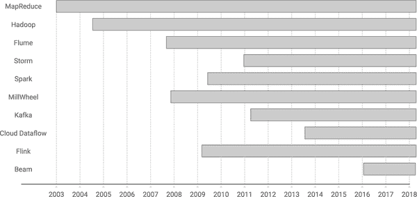

###### 图 10-1。本章讨论的系统的大致时间线

在每个停留点，我都会简要介绍我对系统的历史的理解，并从塑造我们今天所知的流式系统的角度来框定它的贡献。最后，我们将总结所有的贡献，看看它们如何总结出今天的现代流处理生态系统。

# MapReduce

我们从 MapReduce（图 10-2）开始旅程。

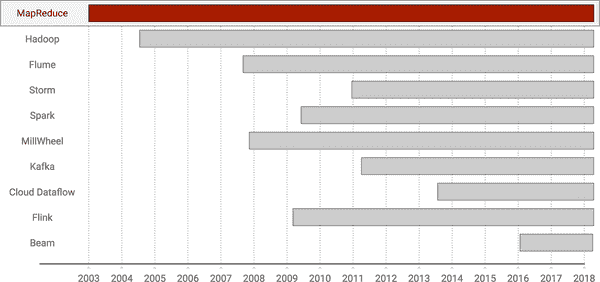

###### 图 10-2。时间线：MapReduce

我认为可以说，今天我们所知道的大规模数据处理始于 2003 年的 MapReduce。在当时，谷歌内部的工程师们正在构建各种定制系统，以解决全球网络规模的数据处理挑战。当他们这样做时，他们注意到了三件事：

数据处理很难

正如我们中的数据科学家和工程师所知，你可以通过专注于从原始数据中提取有用的见解来建立职业。

可扩展性很难

在大规模数据上提取有用的见解更加困难。

容错性很难

在商品硬件上以容错的正确方式从大规模数据中提取有用的见解是残酷的。

在同时解决了这三个挑战之后，他们开始注意到他们构建的定制系统之间的一些相似之处。他们得出结论，如果他们能够构建一个框架来解决后两个问题（可扩展性和容错性），那么专注于第一个问题将会变得简单得多。于是 MapReduce 诞生了。⁴

MapReduce 的基本思想是提供围绕函数式编程领域中两个广为人知的操作 map 和 reduce（图 10-3）的简单数据处理 API。使用该 API 构建的流水线将在一个分布式系统框架上执行，该框架负责处理所有让核心分布式系统工程师激动不已并压垮我们这些凡人灵魂的可扩展性和容错性问题。

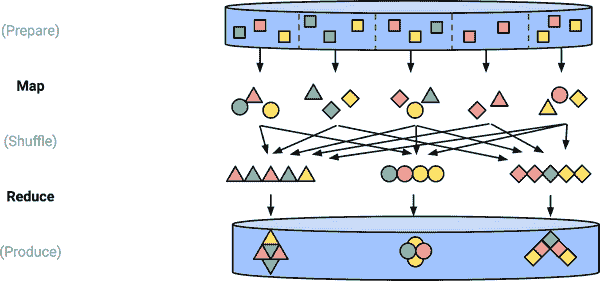

###### 图 10-3。MapReduce 作业的可视化

我们在第六章中已经非常详细地讨论了 MapReduce 的语义，所以我们不会在这里详细讨论。只需记住，我们将事情分解为六个离散阶段（MapRead、Map、MapWrite、ReduceRead、Reduce、ReduceWrite），作为我们的流和表分析的一部分，最终我们得出结论，总的来说，Map 和 Reduce 阶段并没有太大的不同；在高层次上，它们都做以下工作：

+   将表转换为流

+   对该流应用用户转换以产生另一个流

+   将该流分组成表

在谷歌内部投入使用后，MapReduce 在各种任务中得到了广泛的应用，团队决定值得与世界其他地方分享他们的想法。结果就是[MapReduce 论文](https://goo.gl/Rsqr3G)，发表于 OSDI 2004（见图 10-4）。

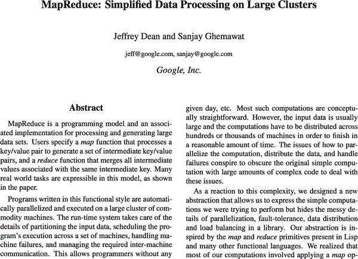

###### 图 10-4。[MapReduce 论文](https://goo.gl/Rsqr3G)，发表于 OSDI 2004

在其中，团队详细描述了项目的历史，API 的设计和实施，以及 MapReduce 应用的许多不同用例的细节。不幸的是，他们没有提供实际的源代码，因此当时谷歌以外的人们能做的就是说，“是的，这听起来确实很不错”，然后回去构建他们定制的系统。

在随后的十年中，MapReduce 在谷歌内部继续进行大量的开发，投入大量时间使系统扩展到前所未有的规模。对于这段旅程中的一些亮点的更详细描述，我推荐我们的官方 MapReduce 历史学家/可扩展性和性能专家 Marián Dvorský撰写的文章[“Google 大规模排序实验的历史”](http://bit.ly/2LPvuVN)（图 10-5）。

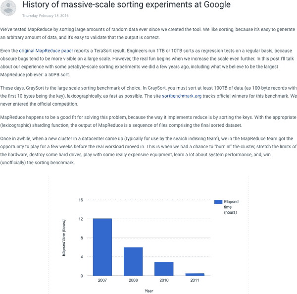

###### 图 10-5。Marián Dvorský的[“大规模排序实验历史”](http://bit.ly/2LPvuVN)博客文章

但就我们在这里的目的而言，可以说迄今为止没有其他东西能够触及 MapReduce 所实现的规模，甚至在谷歌内部也是如此。考虑到 MapReduce 已经存在了这么长时间，这是一个值得注意的事实；在我们的行业中，14 年就是一个漫长的时代。

从流系统的角度来看，我想要给 MapReduce 留下的主要印象是*简单*和*可扩展性*。MapReduce 迈出了驯服大规模数据处理的第一步，提供了一个简单而直接的 API，用于构建强大的数据处理流水线，其简约性掩盖了在幕后发生的复杂分布式系统魔术，使这些流水线能够在大规模的廉价硬件集群上运行。

# Hadoop

接下来是 Hadoop（图 10-6）。警告：这是我为了集中叙述而大大简化系统影响的情况之一。Hadoop 对我们行业和整个世界的影响无法言喻，它远远超出了我在这里讨论的相对特定的范围。

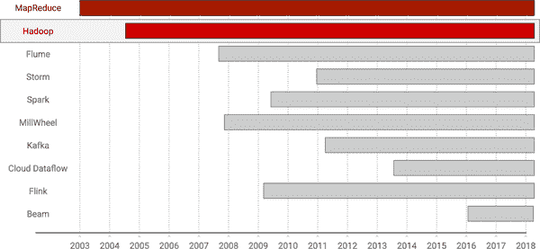

###### 图 10-6. 时间轴：Hadoop

Hadoop 诞生于 2005 年，当 Doug Cutting 和 Mike Cafarella 决定将 MapReduce 论文中的想法用于构建他们的 Nutch 网络爬虫的分布式版本时。他们已经构建了自己的谷歌分布式文件系统的版本（最初称为 NDFS，后来更名为 HDFS，或者 Hadoop 分布式文件系统），因此在该论文发表后，将 MapReduce 层添加到其上是一个自然的下一步。他们称这个层为 Hadoop。

Hadoop 和 MapReduce 的主要区别在于，Cutting 和 Cafarella 确保 Hadoop 的源代码通过开源方式与世界分享（以及 HDFS 的源代码），作为最终成为 Apache Hadoop 项目的一部分。雅虎聘请 Cutting 帮助将雅虎网络爬虫架构转移到 Hadoop，为该项目增添了额外的有效性和工程能量，从那时起，一个完整的开源数据处理工具生态系统就开始成长。与 MapReduce 一样，其他人已经在其他地方更好地讲述了 Hadoop 的历史；其中一个特别好的参考资料是 Marko Bonaci 的“Hadoop 的历史”，最初计划包括在一本印刷书籍中（图 10-7）。

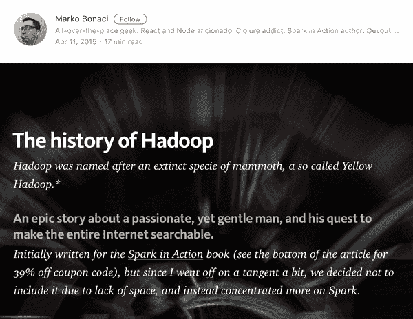

###### 图 10-7. Marko Bonaci 的“Hadoop 的历史”

我希望你从本节中得到的主要观点是，Hadoop 周围蓬勃发展的开源生态系统对整个行业产生了巨大影响。通过创建一个开放的社区，工程师可以改进和扩展早期 GFS 和 MapReduce 论文中的想法，一个繁荣的生态系统诞生了，产生了许多有用的工具，如 Pig、Hive、HBase、Crunch 等等。这种开放性对于培育我们行业现在存在的多样化思想至关重要，这也是为什么我将 Hadoop 的开源生态系统定位为其对我们今天所知的流处理系统世界的最重要贡献。

# Flume

现在我们回到谷歌领地，谈论谷歌内部 MapReduce 的官方继任者：Flume（图 10-8 有时也被称为 FlumeJava，指的是系统的原始 Java 版本，并且不要与 Apache Flume 混淆，后者是一个完全不同的系统，只是碰巧有相同的名称）。

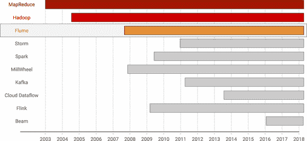

###### 图 10-8. 时间轴：Flume

Flume 项目是由 Craig Chambers 在 2007 年谷歌西雅图办公室开设时创建的。它的动机是解决 MapReduce 的一些固有缺陷，这些缺陷在其成功的最初几年中变得明显。其中许多缺陷围绕着 MapReduce 的严格的 Map→Shuffle→Reduce 结构；尽管简单清晰，但它也带来了一些不利因素：

+   因为许多用例无法通过单个 MapReduce 的应用来解决，谷歌开始出现了许多定制的“编排系统”，用于协调一系列 MapReduce 作业。这些系统本质上都是为了相同的目的（将多个 MapReduce 作业粘合在一起，创建一个解决复杂问题的连贯管道）。然而，由于它们是独立开发的，它们自然是不兼容的，这是不必要的重复努力的典型例子。

+   更糟糕的是，有许多情况下，一个清晰的 MapReduce 作业序列会由于 API 的严格结构而引入*低效*。例如，一个团队可能会编写一个简单地过滤一些元素的 MapReduce 作业；也就是说，一个只有空 reducer 的仅映射作业。接着可能是另一个团队的仅映射作业，对元素进行逐个丰富（又是另一个空 reducer）。然后第二个作业的输出可能最终被最后一个团队的 MapReduce 消费，对数据进行一些分组聚合。这个管道基本上由一个 Map 阶段的单一链条和一个 Reduce 阶段组成，需要通过完全独立的三个作业进行编排，每个作业通过洗牌和输出阶段将数据实现链在一起。但这是假设你想要保持代码库的逻辑和清晰，这导致了最终的缺点...

+   为了消除这些 MapReduce 中的低效，工程师们开始引入*手动优化*，这将*混淆*管道的简单逻辑，增加了维护和调试成本。

Flume 通过提供一个可组合的、高级的 API 来解决这些问题，用于描述数据处理管道，基本上是围绕 Beam 中发现的相同的 PCollection 和 PTransform 概念，如图 10-9 所示。

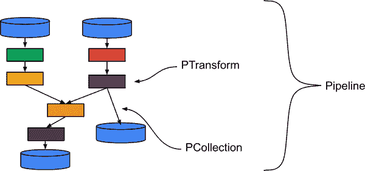

###### 图 10-9。Flume 中的高级管道（图片来源：Frances Perry）

这些管道在启动时将通过优化器⁵生成一个最优的 MapReduce 作业序列的计划，然后由框架进行编排，如图 10-10 所示。

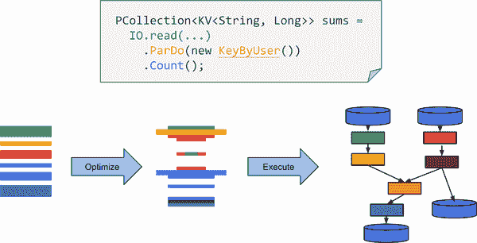

###### 图 10-10。从逻辑管道到物理执行计划的优化

也许 Flume 可以执行的最重要的自动优化示例是融合（Reuven 在第五章中已经讨论过一些），在融合中，两个逻辑上独立的阶段可以在同一个作业中顺序运行（消费者-生产者融合）或并行运行（同级融合），如图 10-11 所示。

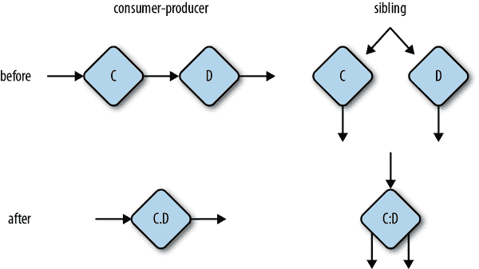

###### 图 10-11。融合优化将连续或并行的操作合并到同一个物理操作中

将两个阶段融合在一起可以消除序列化/反序列化和网络成本，这在处理大量数据的管道中可能是重要的。

另一种自动优化类型是*组合器提升*（见图 10-12），其机制我们在第七章已经提到，当时我们讨论了增量组合。组合器提升就是简单地应用我们在那一章讨论过的多级组合逻辑：在分组操作之后逻辑上发生的组合操作（例如求和）部分提升到分组之前的阶段（这根据定义需要通过网络进行数据洗牌），以便在分组发生之前进行部分组合。在非常热门的键的情况下，这可以大大减少在网络上传输的数据量，并且还可以更平稳地将最终聚合的负载分布在多台机器上。

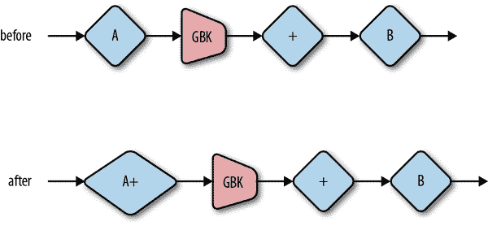

###### 图 10-12。组合器提升在消费者端的分组聚合之前对发送端进行部分聚合

由于其更清晰的 API 和自动优化，Flume Java 在 2009 年初在 Google 推出后立即受到欢迎。在这一成功之后，团队发表了题为[“Flume Java: Easy, Efficient Data-Parallel Pipelines”](https://goo.gl/9e1nXf)的论文（见图 10-13），这本身就是一个了解系统最初存在情况的绝佳资源。

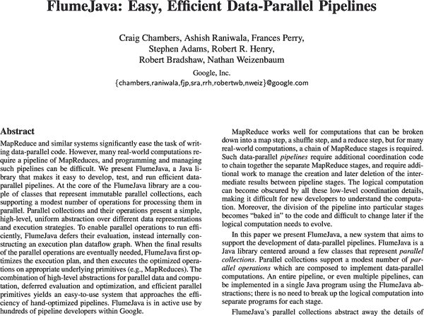

###### 图 10-13。[FlumeJava 论文](https://goo.gl/9e1nXf)

Flume C++在 2011 年不久后推出，2012 年初，Flume 被引入到 Google 为所有新工程师提供的 Noogler⁶培训中。这标志着 MapReduce 的终结。

自那时起，Flume 已经迁移到不再使用 MapReduce 作为其执行引擎；相反，它使用了一个名为 Dax 的自定义执行引擎，直接构建在框架本身中。通过将 Flume 本身从以前的 Map → Shuffle → Reduce 结构的 MapReduce 的限制中解放出来，Dax 实现了新的优化，例如 Eugene Kirpichov 和 Malo Denielou 在他们的[“No shard left behind”](http://bit.ly/2JPaUnR)博客文章中描述的动态工作再平衡功能（图 10-14）。

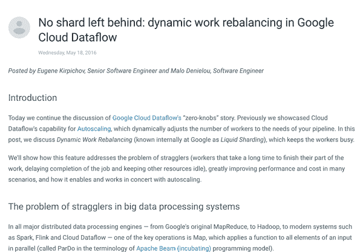

###### 图 10-14。[“No shard left behind”](http://bit.ly/2JPaUnR)博客文章

尽管在 Cloud Dataflow 的上下文中讨论，动态工作再平衡（或者在 Google 中俗称的液体分片）会自动将额外的工作从滞后的分片重新平衡到系统中其他空闲的工作者身上，因为他们提前完成了工作。通过随时间动态地重新平衡工作分配，可以更接近于最佳工作分配，甚至比最好的初始分配更接近。它还允许适应工作者池中的变化，其中一个慢速机器可能会延迟作业的完成，但通过将其大部分任务移交给其他工作者来进行补偿。当液体分片在 Google 推出时，它在整个系统中回收了大量资源。

关于 Flume 的最后一点是，它后来还扩展到支持流处理语义。除了批处理的 Dax 后端外，Flume 还扩展为能够在 MillWheel 流处理系统上执行管道（稍后将讨论）。我们在本书中讨论的大多数高级流处理语义概念最初都是在 Flume 中首次应用，然后才逐渐进入 Cloud Dataflow，最终进入 Apache Beam。

总之，在本节中从 Flume 中可以得出的主要观点是引入了“高级管道”的概念，这使得清晰编写的逻辑管道可以进行“自动优化”。这使得可以创建更大更复杂的管道，而无需手动编排或优化，并且同时保持这些管道的代码逻辑清晰。

# Storm

接下来是 Apache Storm（图 10-15），这是我们涵盖的第一个真正的流处理系统。Storm 肯定不是存在的第一个流处理系统，但我认为它是第一个在整个行业中得到广泛采用的流处理系统，因此我们在这里更仔细地研究它。

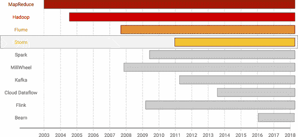

###### 图 10-15。时间轴：Storm

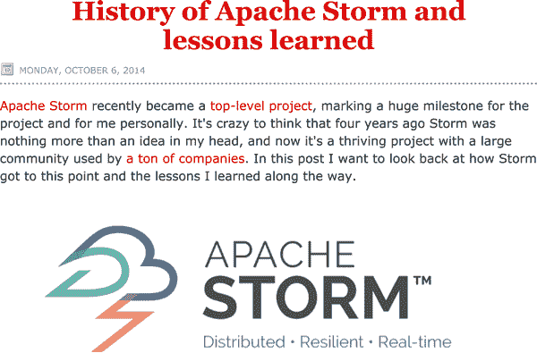

###### 图 10-16。[“Apache Storm 的历史和经验教训”](http://bit.ly/2HLwSqd)

Storm 是 Nathan Marz 的创意，后来他在一篇名为[“Apache Storm 的历史和经验教训”](http://bit.ly/2HLwSqd)的博客文章中详细记录了其创作历程（图 10-16）。简而言之，Nathan 所在的初创公司 BackType 一直在尝试使用自定义的队列和工作者系统来处理 Twitter 的数据流。他最终得出的结论与几乎十年前的 MapReduce 团队的结论基本相同：他们的代码中实际的数据处理部分只是系统的一小部分，如果有一个框架在幕后完成所有分布式系统的繁重工作，那么构建实时数据处理管道将会更容易。于是 Storm 诞生了。

与我们迄今为止谈到的其他系统相比，Storm 的有趣之处在于，团队选择放宽了所有其他系统中都有的强一致性保证，以提供更低的延迟。通过将最多一次或至少一次的语义与每条记录的处理和无集成（即无一致）的持久状态概念相结合，Storm 能够以比执行数据批处理并保证一次性正确性的系统更低的延迟提供结果。对于某种类型的用例来说，这是一个非常合理的权衡。

不幸的是，很快就清楚地看到，人们确实希望既能快速得到答案，又能同时获得低延迟的结果和最终的正确性。但是仅凭 Storm 是不可能做到这一点的。于是 Lambda 架构应运而生。

鉴于 Storm 的局限性，精明的工程师开始在强一致的 Hadoop 批处理管道旁边运行一个弱一致的 Storm 流处理管道。前者产生低延迟、不精确的结果，而后者产生高延迟、精确的结果，然后这两者最终会以某种方式合并在一起，以提供单一的低延迟、最终一致的输出视图。我们在第一章中了解到 Lambda 架构是 Marz 的另一个创意，详细内容在他的帖子中介绍[“如何打败 CAP 定理”](http://bit.ly/1ATyjbD)（图 10-17）。⁷

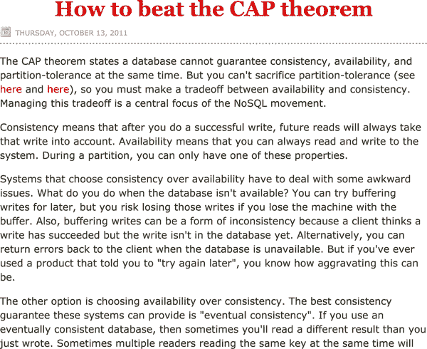

###### 图 10-17。[“如何打败 CAP 定理”](http://bit.ly/1ATyjbD)

我已经花了相当多的时间批评 Lambda 架构的缺点，所以我不会在这里再多加赘述。但我会重申一点：尽管成本高昂，带来了很多麻烦，Lambda 架构仍然变得非常流行，仅仅是因为它满足了许多企业本来很难满足的关键需求：从数据处理管道中获得低延迟但最终正确的结果。

从流处理系统的演变角度来看，我认为 Storm 首次为大众带来了低延迟数据处理。然而，这是以弱一致性为代价的，这反过来导致了 Lambda 架构的兴起，以及随之而来的双管道黑暗时期。

###### 图 10-18。[Heron paper](http://bit.ly/2LNzOF4)

但是，夸张的戏剧性除外，Storm 是该行业首次尝试低延迟数据处理的系统，这一影响在今天对流处理系统的广泛兴趣和采用中得到体现。

在继续之前，也值得一提的是 Heron。2015 年，Twitter（全球已知最大的 Storm 用户，最初培育了 Storm 项目的公司）宣布放弃 Storm 执行引擎，转而采用公司内部开发的新系统 Heron。Heron 旨在解决困扰 Storm 的一些性能和可维护性问题，同时保持 API 兼容性，详细内容在公司的论文中介绍[“Twitter Heron: Stream Processing at Scale”](http://bit.ly/2LNzOF4)（图 10-18）。Heron 本身随后被[开源](http://bit.ly/2MoOpYK)（治理权转移到了自己独立的基金会，而不是像 Apache 那样的现有基金会）。鉴于 Storm 的持续发展，现在有两个竞争性的 Storm 变种。事情最终会如何发展，任何人都无法预测，但观察将会是令人兴奋的。

# Spark

继续前进，我们现在来到 Apache Spark（图 10-19）。这是另一个部分，我将通过专注于其在流处理领域的贡献来大大简化 Spark 对行业的总体影响。提前道歉。

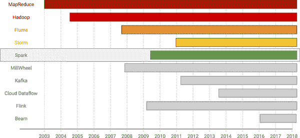

###### 图 10-19。时间轴：Spark

Spark 最初是在 2009 年左右在加州大学伯克利分校的著名 AMPLab 开始的。最初推动 Spark 声名鹊起的是其能够在大多数情况下完全在内存中执行管道的大部分计算，直到最后才触及磁盘。工程师们通过弹性分布式数据集（RDD）的概念实现了这一点，基本上捕获了管道中任何给定点的数据完整谱系，允许根据需要在机器故障时重新计算中间结果，假设 a）您的输入始终可以重放，b）您的计算是确定性的。对于许多使用案例，这些前提条件是真实的，或者至少在性能方面相对真实，用户能够实现与标准 Hadoop 作业相比的巨大性能提升。从那时起，Spark 逐渐建立起其作为 Hadoop 事实上的继任者的声誉。

Spark 创建几年后，当时是 AMPLab 的研究生的 Tathagata Das 意识到：嘿，我们有这个快速的批处理引擎，如果我们将多个批处理依次运行，并使用它来处理流数据怎么样？从这点洞察力出发，Spark Streaming 诞生了。

Spark Streaming 真正了不起的地方在于：由于在幕后支持一致性批处理引擎，世界现在拥有了一个流处理引擎，可以在不需要额外批处理作业的情况下自行提供正确的结果。换句话说，根据正确的使用案例，您可以放弃 Lambda 架构系统，只使用 Spark Streaming。万岁 Spark Streaming！

这里的一个主要限制是“正确的使用案例”部分。 Spark Streaming 的原始版本（1.x 变体）的一个很大的缺点是它只支持特定类型的流处理：处理时间窗口。因此，任何关心事件时间、需要处理延迟数据等的使用案例，都需要用户编写大量额外的代码来实现某种形式的事件时间处理，以覆盖 Spark 的处理时间窗口架构。这意味着 Spark Streaming 最适合于顺序数据或事件时间不可知的计算。正如我在本书中一再强调的那样，这些条件在处理当今常见的大规模用户中心数据集时并不如你希望的那样普遍。

围绕 Spark Streaming 的另一个有趣的争议是“微批处理与真正的流处理”的老问题。因为 Spark Streaming 建立在批处理引擎的小型重复运行的想法之上，批评者声称 Spark Streaming 不是真正的流处理引擎，因为系统中的进展受到每个批处理的全局障碍的限制。这里有一定的真相。尽管真正的流处理引擎几乎总是利用某种形式的批处理或捆绑以提高吞吐量，但它们有更高的灵活性，可以在更细粒度的级别进行，甚至可以到达单个键。微批处理架构在全局级别处理捆绑意味着几乎不可能同时具有低的每个键延迟和高的整体吞吐量，有许多基准测试表明这基本属实。但与此同时，以分钟或多秒为单位的延迟仍然相当不错。而且很少有使用案例要求确切的正确性和如此严格的延迟能力。因此，在某种程度上，Spark 最初定位的受众是绝对正确的；大多数人都属于这一类别。但这并没有阻止竞争对手将其视为该平台的巨大劣势。就我个人而言，在大多数情况下，我认为这只是一个小小的抱怨。

除了缺点之外，Spark Streaming 是流处理的一个分水岭时刻：首个公开可用的大规模流处理引擎，同时也能提供批处理系统的正确性保证。当然，正如之前提到的，流处理只是 Spark 整体成功故事的一小部分，它在迭代处理和机器学习领域做出了重要贡献，具有本地 SQL 集成，以及前面提到的快速内存性能等。

如果你对原始 Spark 1.x 架构的细节感兴趣，我强烈推荐马泰·扎哈里亚的论文，[“大规模集群上快速通用数据处理的架构”](http://bit.ly/2y8rduN)（图 10-20）。这是 113 页的 Spark 精华，非常值得投资。

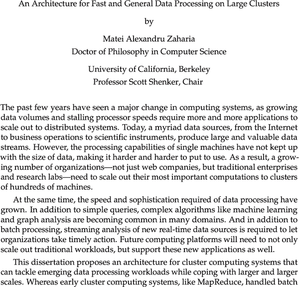

###### 图 10-20\. [Spark 论文](http://bit.ly/2y8rduN)

截至目前，Spark 的 2.x 变体正在大大扩展 Spark Streaming 的语义能力，同时试图简化一些更复杂的部分。而且，Spark 甚至正在推动一种新的真正的流处理架构，试图关闭微批处理的反对论点。但是当它首次出现时，Spark 带来的重要贡献是，它是*第一个公开可用的具有强一致性语义的流处理引擎*，尽管只在有序数据或事件时间不可知的计算中。

# MillWheel

接下来我们将讨论 MillWheel，这是我在 2008 年加入谷歌后在我的 20%工作时间中首次涉足的项目，后来在 2010 年全职加入了该团队（图 10-21）。

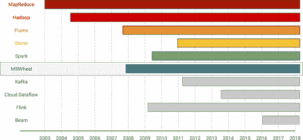

###### 图 10-21\. 时间轴：MillWheel

MillWheel 是谷歌最初的通用流处理架构，该项目是由保罗·诺德斯特罗姆在谷歌西雅图办公室开设之际创建的。MillWheel 在谷歌内部的成功长期以来一直集中在能够提供无界、无序数据的低延迟、强一致性处理能力上。在本书的过程中，我们已经看到了 MillWheel 中几乎所有组件的组合，使这一切成为可能：

+   Reuven 在第五章讨论了*仅一次保证*。仅一次保证对于正确性至关重要。

+   在第七章中，我们讨论了*持久状态*，其强一致性变体为在不可靠硬件上执行长时间运行的流水线维护正确性提供了基础。

+   Slava 在第三章谈到了*水印*。水印为推理输入数据的混乱提供了基础。

+   在第七章中，我们还讨论了*持久定时器*，它提供了水印和流水线业务逻辑之间的必要联系。

也许有些令人惊讶的是，MillWheel 项目最初并不关注正确性。保罗最初的愿景更接近 Storm 后来所倡导的：低延迟数据处理与弱一致性。最初的 MillWheel 客户，一个是在搜索数据上构建会话，另一个是在搜索查询上执行异常检测（MillWheel 论文中的 Zeitgeist 示例），他们驱使项目朝着正确性的方向发展。两者都对一致的结果有强烈需求：会话用于推断用户行为，异常检测用于推断搜索查询的趋势；如果它们提供的数据不可靠，它们的效用将显著降低。因此，MillWheel 的方向被引向了强一致性。

MillWheel 支持无序处理，这是强大流处理的另一个核心方面，也是 MillWheel 的常见特点，也是由客户的需求推动的。作为真正的流式使用案例，Zeitgeist 管道希望生成一个输出流，用于识别搜索查询流量中的异常情况，仅限异常情况（即，对于其分析的消费者来说，轮询等待标记异常的材料化视图输出表中的所有键是不切实际的；消费者只在特定键发生异常时需要直接信号）。对于异常的峰值（即查询流量的增加），这相对简单：当给定查询的计数超过模型对该查询的预期值的一定统计显著量时，可以发出异常信号。但对于异常的下降（即查询流量的减少），问题就有点棘手了。仅仅看到给定搜索词的查询数量减少是不够的，因为在任何时间段内，观察到的数量总是从零开始。在这种情况下，您真正需要做的是等到您有理由相信您已经看到了足够代表性的输入部分，然后再与您的模型进行比较。

Zeitgeist 管道最初尝试在寻找下降的分析逻辑之前插入处理时间延迟来实现这一点。当数据按顺序到达时，这种方法可以工作得相当不错，但管道的作者发现数据有时会被大大延迟，因此到达时会出现严重的无序。在这些情况下，他们使用的处理时间延迟是不够的，因为管道会错误地报告一大堆实际上并不存在的下降异常。他们真正需要的是一种等待直到输入变得完整的方法。

因此，水印是出于对无序数据的输入完整性的推理的需要而产生的。正如 Slava 在第三章中所描述的，基本思想是跟踪系统提供的输入的已知进度，使用给定类型的数据源提供的尽可能多或尽可能少的数据，构建一个可以用来量化输入完整性的进度指标。对于像静态分区的 Kafka 主题这样的简单输入源，每个分区按照递增的事件时间顺序写入（例如，通过实时记录事件的 Web 前端），您可以计算出一个完美的水印。对于像动态输入日志这样的更复杂的输入源，启发式可能是您能做的最好的。但无论如何，水印相对于使用处理时间来推理事件时间完整性的替代方法具有明显的优势，经验表明，后者在试图导航开罗的街道时，效果与使用伦敦地图一样好。

因此，由于客户的需求，MillWheel 最终成为了一个具有支持无序数据的强大流处理功能的系统。因此，题为[“MillWheel: Fault-Tolerant Stream Processing at Internet Scale”](http://bit.ly/2yab5ZH)⁸（图 10-22）的论文大部分时间都在讨论在这样的系统中提供正确性的困难，一致性保证和水印是主要关注的领域。如果您对这个主题感兴趣，这篇论文是非常值得一读的。

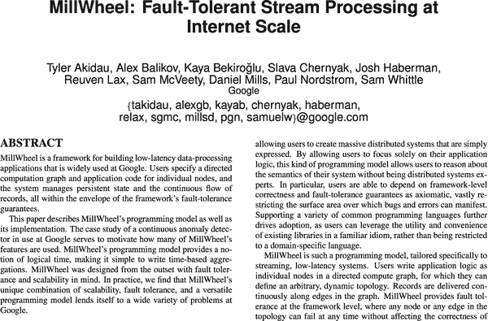

###### 图 10-22。[MillWheel 论文](http://bit.ly/2yab5ZH)

在 MillWheel 论文发表后不久，MillWheel 被集成为 Flume 的替代流后端，通常一起称为 Streaming Flume。如今在 Google 内部，MillWheel 正在被其后继者 Windmill 所取代（也是 Cloud Dataflow 的执行引擎，稍后将讨论），这是一个从头开始的重写，融合了 MillWheel 的所有最佳想法，以及一些新的想法，如更好的调度和分发，以及用户和系统代码的更清晰分离。

然而，对于 MillWheel 来说，最重要的是前面列出的四个概念（仅一次、持久状态、水印、持久定时器）共同为一个系统提供了基础，这个系统最终能够实现流处理的真正承诺：在不可靠的通用硬件上对无序数据进行稳健、低延迟的处理。

# Kafka

现在我们来谈谈 Kafka（图 10-23）。Kafka 在本章讨论的系统中是独一无二的，因为它不是一个数据处理框架，而是一个传输层。然而，毫无疑问，Kafka 在推动流处理方面发挥了最有影响力的作用。

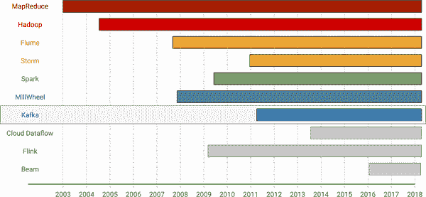

###### 图 10-23。时间线：Kafka

如果你对它不熟悉，Kafka 本质上是一个持久的流传输，实现为一组分区日志。它最初是在 LinkedIn 由 Neha Narkhede 和 Jay Kreps 等行业杰出人士开发的，它的荣誉包括以下内容：

+   提供了一个清晰的持久性模型，将批处理世界中温暖的持久、可重放的输入源的感觉打包到了一个流处理友好的接口中。

+   在生产者和消费者之间提供一个弹性的*隔离层*。

+   体现了我们在第六章讨论的*流和表*之间的关系，揭示了一种关于数据处理的基本思维方式，同时提供了与丰富而悠久的数据库世界的概念联系。

+   作为上述所有内容的副作用，Kafka 不仅成为了行业中大多数流处理安装的*基石*，还促进了流处理作为数据库和微服务运动。

他们一定是起得很早。

在这些荣誉中，有两个对我来说最突出。第一个是将持久性和可重放性应用于流数据。在 Kafka 之前，大多数流处理系统使用某种短暂的排队系统，如 Rabbit MQ 或甚至普通的 TCP 套接字来发送数据。持久性可能在生产者的上游备份中提供到一定程度（即，上游数据的生产者在下游工作人员崩溃时能够重新发送），但往往上游数据也是临时存储的。大多数方法完全忽略了在后续回填或用于原型设计、开发和回归测试时能够重放输入数据的想法。

Kafka 改变了一切。通过将数据库世界中经受考验的持久日志的概念应用到流处理领域，Kafka 让我们重新获得了从 Hadoop/批处理世界中常见的持久输入源到当时流处理世界中普遍存在的短暂源时失去的安全感和安全性。具有耐用性和可重放性，流处理又迈出了一步，成为了对昔日临时批处理系统的强大、可靠替代品。

作为流处理系统开发人员，Kafka 的耐用性和可重放性特性对行业产生的影响的一个更有趣的可见产物是，今天有多少流处理引擎在根本上依赖于可重放性来提供端到端的一次性保证。可重放性是 Apex、Flink、Kafka Streams、Spark 和 Storm 中端到端一次性保证的基础。在执行一次性模式时，这些系统中的每一个都假定/要求输入数据源能够倒带并重放直到最近的检查点。当与不能提供这种能力的输入源一起使用时（即使源可以通过上游备份保证可靠交付），端到端的一次性语义就会崩溃。对可重放性（以及相关的耐用性）的广泛依赖证明了这些特性在整个行业中产生的影响之大。

Kafka 简历中的第二个值得注意的亮点是流和表理论的普及。我们在整个第六章中讨论了流和表，以及第八章和第九章的大部分内容。而且理由充分。流和表构成了数据处理的基础，无论是 MapReduce 系统家族、庞大的 SQL 数据库系统还是其他任何系统。并非所有的数据处理方法都需要直接使用流和表的术语，但从概念上讲，它们都是如此操作的。作为这些系统的用户和开发人员，了解我们所有系统都建立在的核心基本概念是非常有价值的。我们都应该对 Kafka 社区的人们感激不尽，他们帮助更广泛地了解了流和表的思维方式。

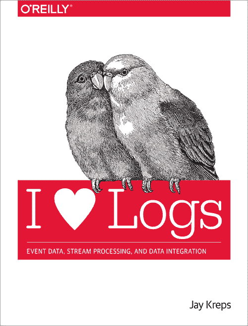

###### 图 10-24。我❤日志

如果您想了解更多关于 Kafka 及其基础的信息，《我❤日志》（O'Reilly；图 10-24）是杰伊·克雷普斯的一本优秀资源。¹⁰ 此外，正如在第六章中引用的那样，克雷普斯和马丁·克莱普曼有一对文章（图 10-25），我强烈推荐阅读，以了解流和表理论的起源。

Kafka 对流处理领域做出了巨大的贡献，可以说比其他任何单一系统都要多。特别是，将耐用性和可重放性应用于输入和输出流在帮助将流处理从近似工具的小众领域推向了一般数据处理的大联盟中发挥了重要作用。此外，由 Kafka 社区推广的流和表的理论为我们提供了对数据处理基本机制的深刻洞察。

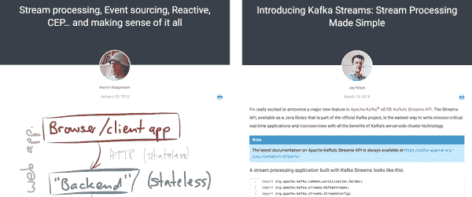

###### 图 10-25。[马丁的文章](https://www.confluent.io/blog/making-sense-of-stream-processing/)（左）和[杰伊的文章](https://www.confluent.io/blog/introducing-kafka-streams-stream-processing-made-simple/)（右）

# Cloud Dataflow

云数据流（图 10-26）是谷歌的全面托管的基于云的数据处理服务。 Dataflow 于 2015 年 8 月面向世界推出。它的构建意图是将十多年的 MapReduce、Flume 和 MillWheel 构建经验打包成一个无服务器的云体验。

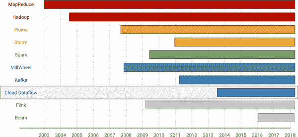

###### 图 10-26。时间轴：Cloud Dataflow

尽管 Cloud Dataflow 的无服务器方面可能是从系统角度最具挑战性和区分性的因素，但我想在这里讨论的对流系统的主要贡献是其统一的批处理加流处理编程模型。这就是我们在大部分书中讨论的所有转换、窗口、水印、触发器和累积的好处。当然，它们都包含了关于*什么*/*在哪里*/*何时*/*如何*思考问题的方式。

该模型最初出现在 Flume 中，当时我们试图将 MillWheel 中强大的无序处理支持纳入 Flume 提供的更高级别的编程模型中。随后，Flume 在谷歌内部可用的综合批处理和流处理方法成为 Dataflow 中包含的完全统一模型的基础。

统一模型的关键洞察力——当时我们甚至没有真正意识到的全部内容——是，在幕后，批处理和流处理实际上并没有那么不同：它们只是流和表主题的微小变化。正如我们在第六章中所学到的，主要区别实际上归结为能够逐渐将表触发为流；其他一切在概念上都是相同的。¹¹通过利用这两种方法的共同点，可以提供一个几乎无缝的单一体验，适用于两个世界。这是在使流处理更易于访问方面迈出的一大步。

除了利用批处理和流处理之间的共同点，我们还深入研究了多年来在谷歌遇到的各种用例，并利用这些信息来指导统一模型的组成部分。我们针对的关键方面包括以下内容：

+   *不对齐的事件时间窗口*，例如会话，提供了对无序数据进行简洁表达强大分析构造并将其应用的能力。

+   *自定义窗口支持*，因为一个（甚至三个或四个）大小很少适合所有情况。

+   *灵活的触发*和*累积模式*，提供了塑造数据流通过管道的方式，以匹配给定用例的正确性、延迟和成本需求的能力。

+   使用*水印*来推断*输入完整性*，这对于异常跌落检测等用例至关重要，其中分析取决于数据的缺失。

+   对底层执行环境的*逻辑抽象*，无论是批处理、微批处理还是流处理，都提供了执行引擎的选择灵活性，并避免系统级构造（如微批处理大小）渗入逻辑 API。

总的来说，这些方面提供了灵活性，以平衡正确性、延迟和成本之间的紧张关系，使该模型能够应用于广泛的用例。

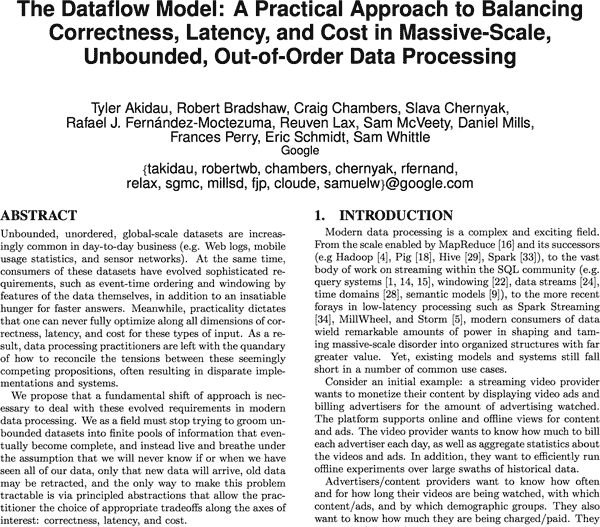

###### 图 10-27。[Dataflow 模型论文](http://bit.ly/2sXgVJ3)

考虑到您刚刚阅读了一本涵盖 Dataflow/Beam 模型细节的整本书，因此在这里重温这些概念没有太大意义。但是，如果您想对事情有稍微更学术化的看法，并且对之前提到的一些激励用例有一个很好的概述，您可能会发现我们 2015 年的[Dataflow 模型论文](http://bit.ly/2sXgVJ3)有价值（图 10-27）。

尽管 Cloud Dataflow 还有许多其他引人注目的方面，但从本章的角度来看，其重要贡献是其*统一的批处理加流处理编程模型*。它为解决无界、无序数据集提供了全面的方法，并以一种灵活的方式进行权衡，以满足给定用例的正确性、延迟和成本之间的紧张关系。

# Flink

Flink（图 10-28）于 2015 年突然出现，迅速从一个几乎没有人听说过的系统转变为流处理世界的强大力量之一。

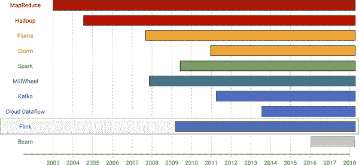

###### 图 10-28。时间轴：Flink

Flink 崭露头角的两个主要原因是：

+   它*快速采用 Dataflow/Beam 编程模型*，使其成为当时全球最具语义能力的完全开源流处理系统。

+   随后不久，Flink 实现了*高效的快照*（源自 Chandy 和 Lamport 原始论文[“分布式快照：确定分布式系统的全局状态”](http://bit.ly/2JBCsRU) [图 10-29]的研究），为其提供了所需的强一致性保证以确保正确性。

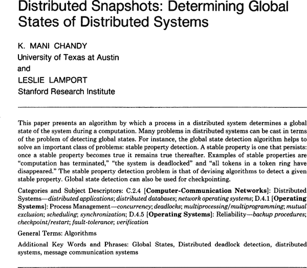

###### 图 10-29。[Chandy-Lamport 快照](http://bit.ly/2JBCsRU)

Reuven 在第五章简要介绍了 Flink 的一致性机制，但要重申的是，基本思想是定期障碍在系统中的工作人员之间的通信路径上传播。这些障碍充当各个分布式工作人员之间的数据生产者与消费者之间的对齐机制。当消费者在其所有输入通道（即来自其所有上游生产者）上接收到给定的障碍时，它会为所有活动键检查点其当前进度，然后可以安全地确认处理障碍之前的所有数据。通过调整障碍通过系统发送的频率，可以调整检查点的频率，从而在增加延迟（由于需要在检查点时间点上实现副作用）的情况下换取更高的吞吐量。

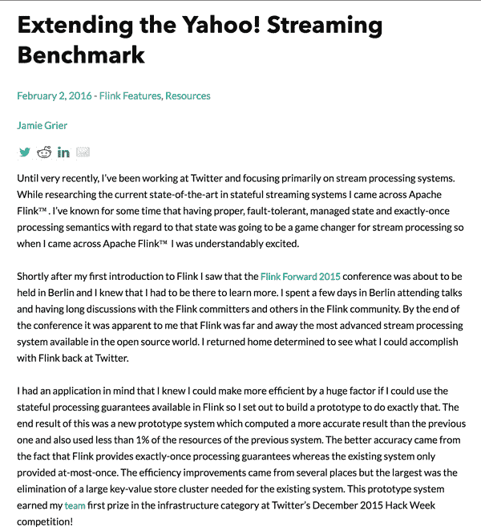

###### 图 10-30。[“扩展 Yahoo！流式基准”](http://bit.ly/2LQvGnN)

当时，Flink 具有提供精确一次语义以及本地支持事件时间处理的能力是一个巨大的进步。但直到 Jamie Grier 发表了题为[“扩展 Yahoo！流式基准”](http://bit.ly/2LQvGnN)（图 10-30）的文章，才清楚地表明了 Flink 的性能。在那篇文章中，Jamie 描述了两个令人印象深刻的成就：

1.  构建了一个原型 Flink 流水线，其准确性超过了 Twitter 现有的 Storm 流水线的 1%成本。

1.  更新[雅虎！流式基准](http://bit.ly/2bhgMJd)，显示 Flink（具有精确一次）的吞吐量是 Storm（没有精确一次）的 7.5 倍。此外，由于网络饱和，Flink 的性能受到限制；消除网络瓶颈使 Flink 的吞吐量几乎是 Storm 的 40 倍。

从那时起，许多其他项目（特别是 Storm 和 Apex）都采用了相同类型的一致性机制。

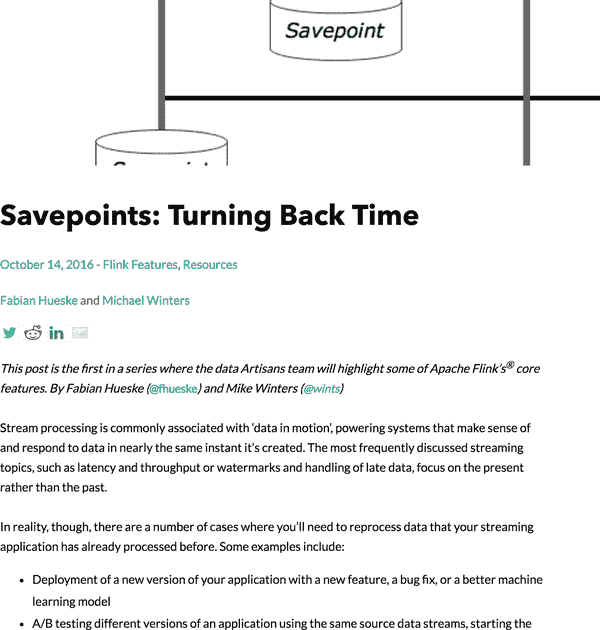

###### 图 10-31。[“保存点：时光倒流”](http://bit.ly/2JKCouO)

通过添加快照机制，Flink 获得了端到端精确一次所需的强一致性。但值得赞扬的是，Flink 更进一步利用其快照的全局性质，提供了从过去任何时间点重新启动整个流水线的能力，这一功能称为保存点（由 Fabian Hueske 和 Michael Winters 在[“保存点：时光倒流”](http://bit.ly/2JKCouO)一文中描述 [图 10-31]）。保存点功能将 Kafka 应用于流式传输层的持久重放的温暖特性扩展到整个流水线的广度。长时间运行的流式流水线随时间的优雅演变仍然是该领域的一个重要开放问题，有很大的改进空间。但截至目前，Flink 的保存点功能是朝着正确方向迈出的第一步巨大进展之一，而且在整个行业中仍然是独一无二的。

如果您对了解 Flink 快照和保存点的系统构造感兴趣，可以阅读论文[“Apache Flink 中的状态管理”](http://bit.ly/2LLyr9O)（图 10-32）对实现进行了详细讨论。

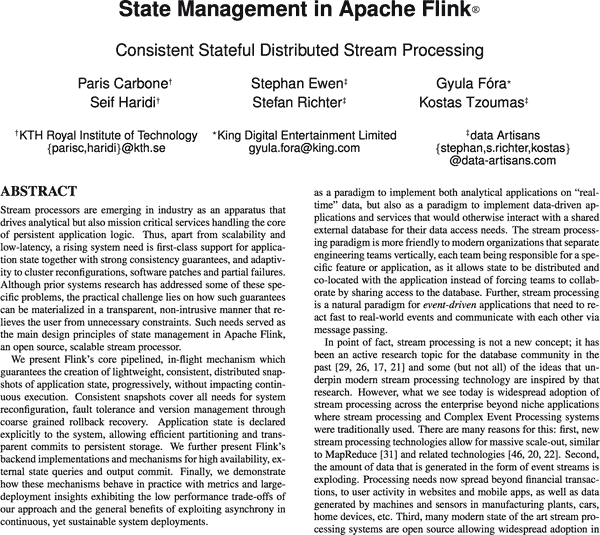

###### 图 10-32。[“Apache Flink 中的状态管理”](http://bit.ly/2LLyr9O)

除了保存点之外，Flink 社区继续创新，包括为大规模分布式流处理引擎推出了第一个实用的流式 SQL API，正如我们在第八章中讨论的那样。

总之，Flink 迅速崛起为流处理巨头主要归功于其方法的三个特点：1）吸收了行业中*最好的现有思想*（例如，成为 Dataflow/Beam 模型的第一个开源采用者），2）*带来了自己的创新*，推动了技术的发展（例如，通过快照和保存点实现强一致性，流式 SQL），以及 3）快速且*反复*地做这两件事。再加上所有这些都是在*开源*中完成的，您就可以看到为什么 Flink 一直在整个行业中不断提高流处理的标准。

# Beam

我们要讨论的最后一个系统是 Apache Beam（图 10-33）。Beam 与本章中的大多数其他系统不同之处在于，它主要是一个编程模型、API 和可移植性层，而不是具有执行引擎的完整堆栈。但这正是重点所在：正如 SQL 作为声明式数据处理的通用语言，Beam 旨在成为编程式数据处理的通用语言。让我们来探讨一下。

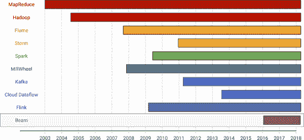

###### 图 10-33\. 时间轴：Beam

具体来说，Beam 由多个组件组成：

+   一个统一的批处理加流式*编程模型*，继承自其起源地 Cloud Dataflow，我们在本书的大部分内容中讨论了其细节。该模型独立于任何语言实现或运行时系统。您可以将其视为 Beam 对 SQL 的关系代数的等价物。

+   一组*SDKs（软件开发工具包）*，实现了该模型，允许以特定语言的习惯方式表达流水线。Beam 目前提供了 Java、Python 和 Go 的 SDKs。您可以将这些视为 Beam 对 SQL 语言的编程等价物。

+   一组*DSLs（领域特定语言）*，建立在 SDKs 之上，提供专门的接口，以独特的方式捕捉模型的部分内容。而 SDKs 需要展示模型的所有方面，DSLs 只能暴露那些对特定领域有意义的部分。Beam 目前提供了一个名为 Scio 的 Scala DSL 和一个 SQL DSL，两者都是建立在现有的 Java SDK 之上的。

+   一组可以执行 Beam 流水线的*运行器*。运行器以 Beam SDK 术语描述的逻辑流水线，并尽可能高效地将其转换为物理流水线，然后执行。目前存在的 Beam 运行器包括 Apex、Flink、Spark 和 Google Cloud Dataflow。用 SQL 术语来说，您可以将这些运行器视为 Beam 对各种 SQL 数据库实现的等价物，如 Postgres、MySQL、Oracle 等。

Beam 的核心愿景建立在其作为可移植性层的价值上，而在这个领域中更具吸引力的特性之一是其计划支持完全跨语言的可移植性。尽管尚未完全完成（但[即将到来](http://bit.ly/2N0tPNL)），计划是让 Beam 在 SDK 和运行器之间提供足够高效的抽象层，以实现完全的跨产品 SDK × runner 匹配。在这样的世界中，使用 JavaScript SDK 编写的流水线可以在 Haskell 运行器上无缝执行，即使 Haskell 运行器本身没有本地执行 JavaScript 代码的能力。

作为一个抽象层，Beam 相对于其 runners 的定位对于确保 Beam 实际为社区带来价值至关重要，而不是引入一个不必要的抽象层。关键在于，Beam 的目标是永远不只是其 runners 中发现的特性的交集（最低公共分母）或并集（厨房水槽）。相反，它的目标是仅包括整个数据处理社区中最好的想法。这允许在两个维度上进行创新：

Beam 中的创新

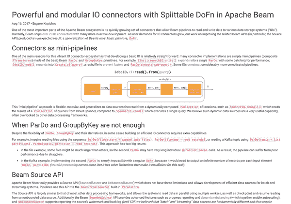

###### 图 10-34。强大和模块化的 I/O

Beam 可能会包括并非所有 runners 最初都支持的运行时特性的 API 支持。这没关系。随着时间的推移，我们期望许多 runners 将在未来版本中纳入这些特性；那些不这样做的将成为需要这些特性的用例的不太吸引人的 runner 选择。

这里的一个例子是 Beam 的 SplittableDoFn API，用于编写可组合的可伸缩源（由 Eugene Kirpichov 在他的文章“在 Apache Beam 中使用 Splittable DoFn 编写强大和模块化的 I/O 连接器”中描述）。它既独特又非常强大，但对于一些更具创新性的部分，比如动态工作重新平衡，目前还没有得到所有 runners 的广泛支持。然而，考虑到这些特性带来的价值，我们预计随着时间的推移，情况将会改变。

runners 中的创新

Runners 可能会引入运行时特性，而 Beam 最初并不提供 API 支持。这没关系。随着时间的推移，已经证明其有用性的运行时特性将被纳入 Beam 的 API 支持中。

这里的一个例子是 Flink 中的状态快照机制，或者之前我们讨论过的 savepoints。Flink 仍然是唯一公开可用的流处理系统，以这种方式支持快照，但 Beam 中有一个提案提供围绕快照的 API，因为我们认为随着时间的推移，管道的优雅演进是一个重要的特性，将在整个行业中具有价值。如果我们今天神奇地推出这样的 API，Flink 将是唯一支持它的运行时系统。但同样，这没关系。这里的重点是，随着这些特性的价值变得清晰，整个行业将随着时间的推移开始赶上。¹²这对每个人都更好。

通过鼓励 Beam 本身以及 runners 内的创新，我们希望随着时间的推移以更快的速度推动整个行业的能力，而不会在这一过程中接受妥协。通过实现跨运行时执行引擎的可移植性的承诺，我们希望建立 Beam 作为表达编程数据处理流水线的通用语言，类似于 SQL 如今作为声明式数据处理的通用货币存在。这是一个雄心勃勃的目标，截至目前，我们离完全实现它还有一段距离，但我们迄今为止也走了很长一段路。

# 总结

我们刚刚快速浏览了十五年来数据处理技术的进步，重点关注了使流式系统成为今天的样子的贡献。最后总结一下，每个系统的主要要点是：

MapReduce - 可伸缩性和简单性

通过在强大且可伸缩的执行引擎之上提供一组简单的数据处理抽象，MapReduce 使数据工程师能够专注于其数据处理需求的业务逻辑，而不是构建分布式系统的棘手细节，以使其能够抵御商品硬件的故障模式。

Hadoop - 开源生态系统

通过在 MapReduce 的思想基础上构建开源平台，Hadoop 创造了一个蓬勃发展的生态系统，远远超出了其前身的范围，并允许大量新的想法蓬勃发展。

Flume - 流水线，优化

通过将逻辑管道操作的高级概念与智能优化器相结合，Flume 使得编写干净、可维护的管道成为可能，其能力超越了 Map→Shuffle→Reduce 的 MapReduce 的限制，而又不牺牲通过手工调优获得的性能。

Storm-低延迟与弱一致性

通过牺牲结果的正确性以换取延迟的降低，Storm 将流处理带给了大众，并引领了 Lambda 架构的时代，其中弱一致性的流处理引擎与强一致性的批处理系统并行运行，实现了低延迟、最终一致的真正商业目标。

Spark-强一致性

通过利用强一致性批处理引擎的重复运行来提供无界数据集的连续处理，Spark Streaming 证明了在有序数据集中至少可以同时具有正确性和低延迟的结果是可能的。

MillWheel-无序处理

通过将强一致性和精确一次处理与水印和定时器等关于时间的推理工具相结合，MillWheel 征服了对无序数据进行强大流处理的挑战。

Kafka-持久流、流和表

通过将持久日志的概念应用于流传输问题，Kafka 重新带回了持久性流传输的温暖、踏实的感觉，这是由于像 RabbitMQ 和 TCP 套接字这样的短暂流传输而失去的。并通过推广流和表理论的思想，它帮助阐明了数据处理的概念基础。

Cloud Dataflow-统一批处理加流处理

通过将 MillWheel 的无序流处理概念与 Flume 的逻辑、自动可优化的管道相融合，Cloud Dataflow 提供了一个统一的批处理加流处理数据模型，提供了灵活性，以平衡正确性、延迟和成本之间的紧张关系，以适应任何给定的用例。

Flink-开源流处理创新者

通过迅速将无序处理的能力带到开源世界，并将其与分布式快照和相关的保存点功能等创新相结合，Flink 提高了开源流处理的标准，并帮助引领了行业内流处理创新的潮流。

Beam-可移植性

通过提供一个强大的抽象层，结合了行业内最佳想法的 Beam 提供了一个可移植性层，被定位为与 SQL 提供的声明性共同语言在编程上等效的，同时也鼓励行业内创新思想的采纳。

可以肯定的是，我在这里突出的这 10 个项目及其成就的抽样远远不能涵盖导致行业发展到今天的全部历史。但它们对我来说是重要和值得注意的里程碑，它们共同描绘了过去十五年中流处理的演变的信息图景。自 MapReduce 的早期以来，我们已经走了很长的路，沿途经历了许多起伏、曲折和转折。即便如此，在流系统领域仍然存在许多未解决的问题。我很期待未来会带来什么。

¹这意味着我跳过了关于流处理的大量学术文献，因为那是它的起源。如果你真的对这个话题的学术论文很感兴趣，可以从[“数据流模型”论文](http://bit.ly/2sXgVJ3)的参考文献开始，然后往回看。你应该能够很容易地找到你的方向。

² 当然，MapReduce 本身建立在许多早已知名的想法之上，甚至在 MapReduce 论文中明确说明了这一点。这并不改变 MapReduce 将这些想法（以及它自己的一些想法）结合起来，创造出一个实际解决重要且新兴问题的系统，比以往任何人都做得更好，并且激发了后来的数据处理系统的世代。

³ 明确地说，谷歌当时绝对不是唯一一家在这个规模上解决数据处理问题的公司。谷歌只是第一代尝试解决大规模数据处理问题的众多公司之一。

⁴ 明确地说，MapReduce 实际上是建立在谷歌文件系统 GFS 之上的，GFS 本身解决了特定子集的可伸缩性和容错性问题。

⁵ 不完全像数据库世界长期使用的查询优化器。

⁶ Noogler == 新人 + Googler == Google 的新员工

⁷ 顺便说一句，我还强烈推荐阅读 Martin Kleppmann 的《CAP 定理批评》（http://bit.ly/2ybJlnt），对 CAP 定理本身的缺点进行了很好的分析，以及更有原则的替代方法来看待同样的问题。

⁸ 值得一提的是，这本书主要由 Sam McVeety 撰写，Reuven 提供帮助，其他作者也有一些输入；我们不应该按字母顺序排列作者名单，因为每个人总是假设我是主要作者，即使我并不是。

⁹ Kafka Streams 和现在的 KSQL 当然正在改变这一点，但这些都是相对较新的发展，我将主要关注过去的 Kafka。

¹⁰ 虽然我推荐这本书作为最全面和连贯的资源，但如果你在 O'Reilly 的网站上搜索 Kreps 的文章，你也可以找到其中的许多内容。抱歉，Jay...

¹¹ 就像许多广泛的概括一样，这个概括在特定的背景下是正确的，但掩盖了现实的基本复杂性。正如我在第一章中所暗示的，批处理系统在优化有界数据集的数据处理管道的成本和运行时间方面做出了很大的努力，而流处理引擎尚未尝试复制。暗示现代批处理和流处理系统只在一个小方面上有所不同是一个相当简化的说法，在纯粹概念之外的任何领域都是如此。

¹² 这里还有一个值得注意的微妙之处：即使运行器采用了新的语义并勾选了功能复选框，也不能盲目选择任何运行器并获得相同的体验。这是因为运行器本身在运行时和操作特性上仍然可能存在很大的差异。即使两个给定的运行器在 Beam 模型中实现了相同的语义特性，它们在运行时执行这些特性的方式通常也是非常不同的。因此，在构建 Beam 管道时，重要的是要对各种运行器进行功课，以确保选择最适合您用例的运行平台。
