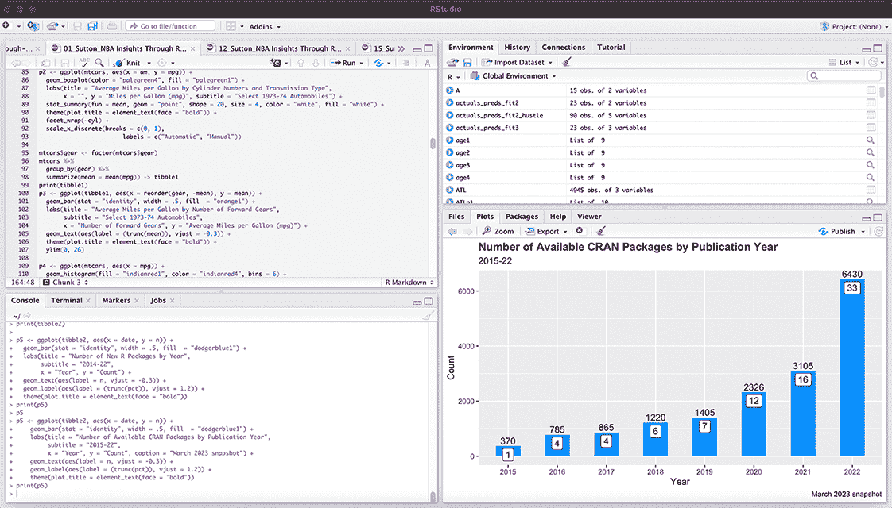
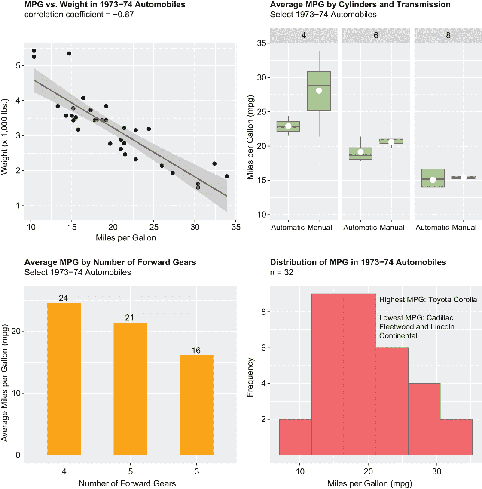
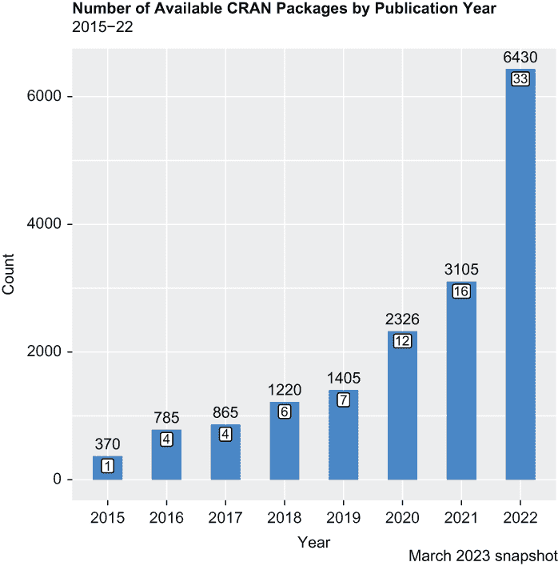
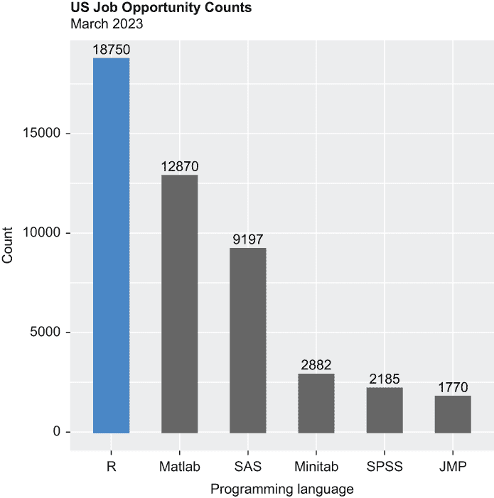

# 1 开始

本章涵盖

+   R 和 RStudio 的简要介绍

+   R 相对于其他编程语言的竞争优势

+   未来的期待

数据正在改变企业和其他组织的工作方式。在过去，挑战在于*获取*数据；现在挑战在于理解它，从噪音中筛选出信号，并为决策者提供可操作的见解。我们这些与数据打交道的人，尤其是在前端——统计学家、数据科学家、商业分析师等等——有许多编程语言可供选择。

R 是一种用于切片和切块大型数据集、进行显著性统计测试、开发预测模型、生成无监督学习算法和创建高质量视觉内容的常用编程语言。无论是初学者还是专业人士，无论是组织内部还是多个垂直领域，都依赖 R 的强大功能来生成推动有目的行动的见解。

本书提供了使用 R 语言发现和生成一系列独特且引人入胜见解的端到端和分步指南。实际上，本书在几个有意义的方面与其他你可能已经熟悉的手册有所不同。首先，本书按项目组织，而不是按技术组织，这意味着启动和完成一个离散项目所需的任何和所有操作都包含在每个章节中，从加载包到导入和整理数据，再到探索、可视化、测试和建模数据。你将学习如何从始至终思考、设置和运行一个数据科学或统计学项目。

其次，我们仅使用从网络上下载或抓取的可用数据集进行工作——有时需要支付少量费用——这些数据集当然是在没有任何预先了解内容可能如何分析的情况下创建的。换句话说，我们的数据集*不是*即插即用的。这实际上是一件好事，因为它提供了介绍与特定数据可视化方法和统计测试方法相关的各种数据整理技术的机会。你将学习如何将看似不同的操作结合起来，而不是孤立地学习这些技术。

第三，说到数据可视化，您将学习如何创建专业级别的图表和其他视觉内容——不仅仅是条形图和时间序列图，还有树状图、桑基图、金字塔图、分面图、克利夫兰点图和洛伦兹曲线等，仅举几个可能不在主流但仍然比您可能习惯的内容更有吸引力的可视化。通常，讲述故事或传达结果最有效的方式是通过图片而不是文字或数字。您将获得创建数十种图表类型和其他视觉内容的详细说明，其中一些使用基础 R 函数，但大多数来自 R 的顶级图形包`ggplot2`。

第四，这本书贯穿了职业篮球的主题；这是因为所有数据集实际上都是 NBA 数据集。每章中介绍的技术不仅仅是目的本身，而且是通过这些技术最终揭示 NBA 独特而迷人的洞察力的手段——所有这些都可以完全应用到您自己的专业或学术工作中。最终，这本书提供了一种更愉快、更有效的学习 R 语言的方法，并进一步巩固了统计概念。话虽如此，让我们深入探讨；以下部分提供了进一步背景信息，这将使您最好地准备应对本书的剩余部分。

## 1.1 R 和 RStudio 的简要介绍

R 是一种开源且免费的编程语言，由统计学家于 1993 年推出，用于其他统计学家。R 在执行统计计算（毫不奇怪）方面始终获得高分，产生引人注目的可视化，处理大量数据集，并支持广泛的监督和非监督学习方法。

近年来，为 R 创建了几种集成开发环境（IDE），其中源代码编辑器、调试器和其他实用工具结合成一个单一的图形用户界面。到目前为止，最受欢迎的 GUI 是 RStudio。

您不需要 RStudio。但想象一下没有现代便利设施的生活，比如自来水、微波炉和洗碗机；这就是没有 RStudio 优势的 R。同样，RStudio 也是免费下载的。本书中的所有代码都是在 RStudio 1.4.1103 上编写的，它运行在 R 4.1.2 之上，在装有 Big Sur 操作系统 11.1 版本的 Mac 笔记本电脑上。顺便说一下，R 和 RStudio 在 Windows 和 Linux 桌面上运行得同样好。

你应该首先下载并安装 R([`cran.r-project.org`](https://cran.r-project.org))，然后同样安装 RStudio([www.rstudio.com](https://www.rstudio.com))。通过下载库、编写脚本、运行代码以及在 RStudio 中直接查看输出，你将间接与 R 交互。RStudio 界面分为四个面板或窗口（见图 1.1）。脚本编辑器位于左上角；这是你导入数据、安装和加载库（也称为包）以及编写代码的地方。脚本编辑器下方是控制台。

图 1.1 RStudio 界面的快照。代码在左上角面板中编写；程序在左下角面板中运行；绘图窗口在右下角面板中；创建的对象的运行列表在右上角面板中。通过偏好设置，你可以设置背景颜色、字体和字体大小。

控制台的外观和操作方式与基本的 R 界面相似；这是你查看脚本编辑器输出的地方，包括错误信息和警告（如有）。控制台旁边，在 RStudio 界面的右下角，是绘图窗口；这是你查看在脚本编辑器中创建的视觉化的地方，如果你选择的话，可以调整它们的大小，并将它们导出到 Microsoft Word、PowerPoint 或其他应用程序。然后是环境窗口，它记录了在脚本编辑器内部创建的对象——数据框、tibbles（R 特有的数据框类型）和可视化。

RStudio 还可以在云端运行([`login.rstudio.cloud`](https://login.rstudio.cloud))，并且几乎可以通过任何网络浏览器访问。如果你的本地机器资源不足，这可能是一个不错的选择。

## 1.2 为什么选择 R？

数字宇宙的规模正沿着指数曲线而不是线性线扩展；最成功的企业和组织是那些比其他企业收集、存储和使用数据更多的企业；当然，我们知道 R 已经并且一直是全球统计学家、数据科学家和商业分析师近 30 年的首选编程语言。但为什么你应该投资时间磨练你的 R 技能，当有几种开源和商业替代品时？

### 1.2.1 可视化数据

这本书包含大约 300 个左右的图表。通常，分析数据最有效的方法是将其可视化。在将汇总数据转换为专业外观的视觉内容方面，R 绝对是一流的。因此，我们先从图片而不是数字开始讨论。

几个预包装的数据集包含在 R 的基础安装中。本书**不**使用这些对象中的任何，但在这里，mtcars 数据集——一个只有 32 行 11 列的对象——足以帮助展示 R 图形能力的强大。mtcars 数据是从 1974 年的一期《汽车趋势》杂志中提取的；该数据集包含美国、欧洲和日本制造的 32 种汽车型号的性能和其他数据。

以下可视化以 mtcars 作为数据源（见图 1.2）；它们是用`ggplot2`包创建的，然后使用`patchwork`包组合成一个 2×2 的矩阵。这两个包，尤其是`ggplot2`，在整本书中都被广泛使用。（关于包的更多内容，稍后将会介绍。）

图 1.2 使用`ggplot2`包对汽车数据的可视化

我们的视觉化包括顶部的一个相关图和分面图，以及底部的一个条形图和直方图，具体描述如下：

+   *相关图*—相关图显示了一对连续或数值变量之间的关系。两个连续变量之间的关系或关联可以是正的、负的或中性的。当为正时，变量朝同一方向移动；当为负时，两个变量朝相反方向移动；当为中性时，两者之间没有任何有意义的关系。

+   *分面图*—分面图是一组子图，它们共享相同的水平和垂直轴（分别对应 x 轴和 y 轴）；因此，每个子图必须其他方面都相同。数据通过数据中的组（通常称为*因素*）进行分割或分段。分面图为数据中的每个因素绘制一个子图，并在其自己的面板中显示。我们绘制了箱线图来显示每加仑行驶英里数在气缸数和变速器类型上的分布情况。

+   *条形图*—条形图，通常称为条形图，使用矩形条来显示离散或分类数据的计数。数据中的每个类别或因素都由其自己的条表示，每个条的长度对应于它所表示的值或频率。条形通常垂直显示，但可以将条形图的方向翻转，使条形水平显示。

+   *直方图*—有时被误认为是条形图，直方图是单个连续变量分布的图形表示。它显示在指定区间内的数据计数或频率，这些区间通常被称为箱。

我们可以从这四个可视化中轻易得出几个有趣和有意义的结论：

+   每加仑行驶英里数与重量之间存在强烈的负相关，相关系数为-0.87；也就是说，重量较重的汽车每加仑行驶的英里数比重量较轻的汽车少。回归线的斜率表示两个变量，如每加仑行驶英里数和重量，之间的相关性有多强，或者不强，这个相关性是在-1 到+1 的范围内计算的。

+   气缸数较少的汽车每加仑行驶的英里数比气缸数较多的汽车多。此外，特别是对于拥有四个或六个气缸的汽车，手动变速的汽车比自动变速的汽车每加仑行驶的英里数更多。

+   根据汽车的前进挡位数，每加仑行驶英里数存在显著差异；例如，拥有四个前进挡的汽车比只装备三个前进挡的汽车每加仑多行驶 8 英里。

+   mtcars 数据集中 32 个品牌和型号的每加仑行驶英里数的分布似乎呈正态分布（想想一个钟形曲线，其中大部分数据集中在平均值或平均数周围）；然而，大约每加仑行驶 20 英里或更少的汽车比其他汽车多。丰田卡罗拉的每加仑行驶英里数最高，而凯迪拉克 Fleetwood 和林肯 Continental 在每加仑行驶英里数最低上并列。

R 在数据可视化领域的声誉归功于可以创建的大量图表、图表、图形、图表和地图的数量以及它们的美学质量；这绝不是由于易用性。R，特别是`ggplot2`包，赋予你定制任何视觉对象和应用最佳实践的能力。但是，定制也带来了复杂性，例如以下内容：

+   关于分面图，例如，创建了成对的箱线图，并根据汽车发动机的气缸数进行划分，仅为了创建代表总体平均值的白色点（否则`ggplot2`在箱线图内打印一条水平线以表示中位数），就调用了具有六个参数的额外函数。还调用了另一个函数，以便`ggplot2`返回表示变速类型的 x 轴标签，而不是自动的 0 和手动的 1。

+   条形图，一个相对简单的视觉对象，尽管如此，仍然包含几个定制选项。数据标签不是默认可用的；添加它们需要调用另一个函数，并决定它们的字体大小和位置。由于这些数据标签是添加在每个条形图上方的，因此有必要延长 y 轴的长度，这又需要另一行代码。

+   当你创建直方图时，`ggplot2`并不会自动返回一个具有理想数量分箱的图表；相反，这需要你自己去确定，通常这需要一些实验。此外，y 轴上的刻度是硬编码的，只包括整数；默认情况下，`ggplot2`返回一半刻度的分数值，这对于直方图来说显然是没有意义的。

本书提供了逐步指导，说明如何创建这些以及其他大约三打种`ggplot2`可视化类型，它们符合最高美学标准，并且包含足够的功能和装饰，以传达清晰和引人入胜的信息。

### 1.2.2 安装和使用软件包以扩展 R 的功能范围

无论你想执行或需要执行哪种操作，有很大可能性其他程序员已经在你之前做过。也有很大可能性，那些程序员中的一位随后编写了一个 R 函数，将其打包成软件包，并使其易于你和其他人下载。R 的软件包库正在迅速扩展，这要归功于世界各地那些习惯使用 R 开源平台的程序员。简而言之，程序员将他们的源代码、数据和文档打包成软件包，然后将最终产品上传到中央仓库，以便我们其他人下载和使用。

到本书写作时为止，综合 R 档案网络（CRAN）中存储了 19,305 个软件包。大约三分之一是在 2022 年发布的；另外三分之一是在 2019 年至 2021 年之间发布的；剩余的三分之一是在 2008 年至 2018 年之间发布的。图 1.3 中显示的`ggplot2`条形图揭示了 CRAN 按出版年份可用的软件包数量。（请注意，软件包的可用数量与发布的数量不同，因为许多软件包已经过时。）条形图内部白色方框标签表示截至 2023 年 3 月的总软件包数量的百分比；例如，2021 年发布的所有软件包中，有 3,105 个仍然在 CRAN 中，这代表了总软件包数量的 16%。

图 1.3：CRAN 中按出版年份显示的软件包数量

显然，新软件包的发布速度正在不断增加；实际上，2023 年的新软件包数量预计将接近甚至超过 12,000 个。这意味着平均每天有大约 33 个新软件包。R-bloggers 是一个拥有数百个教程的流行网站，它每月发布一个包含 40 个新软件包的排行榜，仅为了帮助程序员筛选所有的新内容。这些数字在商业软件世界中无疑会让人们感到头晕目眩。

软件包的安装非常简单：只需一行代码或 RStudio GUI 内的几个点击即可安装一个。这本书将向你展示如何安装软件包，如何将软件包加载到你的脚本中，以及如何利用现在可用的最强大的软件包之一。

### 1.2.3 与其他用户进行网络连接

R 程序员在网络上非常活跃，寻求支持并得到它。这种网络活动的热潮有助于你纠正代码中的错误，克服其他障碍，并提高生产力。在统计学家、数据科学家和其他程序员聚集寻求技术支持的网站 Stack Overflow 上进行的一系列搜索，返回了大约 450,000 条关于 R 的搜索结果，而五个主要商业替代品（JMP、MATLAB、Minitab、SAS 和 SPSS）的总和仅占其中的一小部分，大约 20%。

在完全披露的精神下，另一种开源编程语言 Python 返回的搜索结果比 R 多得多——实际上要多得多。但请记住，尽管 Python 经常用于数据科学和统计计算，但它实际上是一种通用编程语言，也用于开发应用程序接口、网络门户甚至视频游戏；而另一方面，R 严格用于数值计算和数据分析。因此，将 R 与 Python 进行比较，就像比较苹果和橘子一样。

### 1.2.4 与大数据交互

如果你需要或预期需要与典型的大数据技术栈（例如，Hadoop 用于存储，Apache Kafka 用于摄取，Apache Spark 用于处理）交互，R 是你分析层最佳选择之一。实际上，在“最佳大数据编程语言”的 Google 搜索结果中，前 10 名都列出了 R 作为首选选择，而之前提到的商业平台（除 MATLAB 外）都没有被提及。

### 1.2.5 找到一份工作

R 程序员有一个健康的工作市场。Indeed 的搜索结果显示，在美国有近 19,000 个 R 程序员的职位机会，比 SAS、Minitab、SPSS 和 JMP 的总和还要多。这是一个单一国家在特定时间点的快照，但这个观点仍然成立。（注意，许多 SAS 和 SPSS 的职位机会是在 SAS 或 IBM 的工作。）其中一部分机会是由世界上一些领先的技术公司发布的，包括亚马逊、苹果、谷歌和 Meta（Facebook 的母公司）。图 1.4 中所示的 `ggplot2` 条形图可视化了完整的结果。由于之前提到的原因，没有包括 Python 的工作机会。

图 1.4 对于 R 程序员来说，有一个健康的工作市场。

## 1.3 这本书是如何工作的

如前所述，本书的组织结构是这样的，即以下每一章都是一个独立的项目——除了最后一章，它是对整本书的总结。这意味着从设计到完成的每个项目所需的操作都包含在每个章节中。下面的流程图或过程图提供了一个可视化的快照，展示了您接下来可以期待的内容（见图 1.5）。

图 1.5 典型的章节流程，以及不无巧合的是，大多数现实世界数据科学和统计项目从开始到结束的典型流程

我们只使用基础 R 函数——也就是说，在完成 R 和 RStudio 安装后立即可用的现成函数——将包加载到我们的脚本中。毕竟，不能本末倒置，也不能在没有先安装和加载包的情况下调用包内的函数。之后，我们依赖内置和包内函数的混合，强烈倾向于后者，尤其是在准备和整理我们的数据集以及创建视觉内容方面。

我们每章的开始都会提出一些假设。这可能是一个随后根据测试结果予以拒绝或未能拒绝的零假设。例如，在第七章中，我们的初始假设是主队和客队之间的个人犯规和尝试罚球之间的差异是由于偶然造成的。然后我们拒绝这个假设，并在我们的显著性统计测试返回获得相等或更极端结果的低概率时假设裁判存在偏见；否则，我们未能拒绝那个相同的假设。或者，它可能仅仅是一个必须通过应用其他方法来证实或否认的假设。以第十五章为例，我们假设 NBA 球队数量和比赛数量与赢得的比赛数量之间存在非线性关系，然后创建帕累托图，即单位频率和累积频率的视觉展示，来呈现结果。另一个例子是第十九章，我们假设通过季节标准化每场比赛的平均得分——即把原始数据转换为共同和简单的尺度——肯定会对 NBA 得分王的非常不同的历史视角提供帮助。

然后，我们开始编写我们的脚本。我们每个脚本都是从加载所需的包开始的，通常是通过调用 `library()` 函数来实现。在加载之前，包必须被安装，在调用其函数之前也必须被加载。因此，没有硬性要求在 R 脚本前加载任何包；如果这是你的偏好，它们可以逐个加载。但将我们的假设视为战略计划，将包视为代表战术或短期步骤的一部分，这些步骤帮助我们实现更大的目标。我们选择在开始时加载包反映了我们深思熟虑地规划了从起点到终点的细节。

接下来，我们通过调用 `readr` 包中的 `read_csv()` 函数导入我们的数据集或数据集，就像 `ggplot2` 一样，它是 `tidyverse` 包宇宙的一部分。这是因为我们所有的数据集都是从公共网站下载的 .csv 文件，或者是从抓取的数据创建的，然后复制到 Microsoft Excel 中并保存为 .csv 扩展名。

这本书展示了如何执行几乎任何你需要的数据整理操作，通常是通过调用 `dplyr` 和 `tidyr` 函数，这些函数也是 `tidyverse` 的一部分。你将学习如何转换或重塑数据集；通过行或列对数据进行子集化；在必要时按组总结数据；创建新变量；以及将多个数据集合并成一个。

本书还展示了如何应用最佳的数据探索性分析（EDA）实践。EDA 是对数据集的初步但彻底的质询，通常是通过将基本统计的计算与相关性图、直方图和其他视觉内容相结合来进行的。在整理完数据并在测试或分析数据之前，熟悉你的数据总是一个好习惯。我们主要调用基础 R 函数来计算基本统计量，如平均值和中位数；然而，我们几乎完全依赖于 `ggplot2` 函数甚至 `ggplot2` 扩展来创建一流的视觉呈现。

我们随后测试或至少进一步分析我们的数据。例如，在第五章中，我们开发了线性回归和决策树模型，以隔离哪些 hustle 统计指标——如 loose balls recovered（回收的松球）、passes deflected（被挡回的传球）、shots defended（防守的射门）等——对胜负有统计学上的显著影响。在第九章中，我们运行了卡方检验，这是一种针对两个分类变量的统计或假设检验，以确定前一天的休息日安排是否有助于决定谁获胜。或者让我们考虑第三章，在那里我们开发了一种称为 *层次聚类* 的无监督学习算法，以确定球队是否应该对前五顺位选秀和任何其他首轮选秀有非常不同的职业预期。或者看看第十六章，在那里我们通过“仅仅”应用一些硬核分析技术来评估所谓的“手感”现象，而不进行任何正式的测试。

最后，我们提出了我们的结论，这些结论与我们的假设相联系：是的（或不是），官员倾向于主场球队；是的（或不是），休息对胜负有影响；是的（或不是），防守实际上赢得冠军。我们的结论往往是可操作的，因此，它们自然演变成一系列建议。如果某些 hustle 统计指标比其他指标更重要，那么球队应该针对这些指标进行训练；如果球队希望通过业余选秀加强阵容，并且如果故意输球以提升选秀名单，以便选择最佳可用球员是有意义的，那么球队就应该这样做；进攻应该围绕 24 秒投篮时钟内的得分概率来设计。

在深入本书的其余部分之前，这里有一些注意事项和其他需要考虑的要点。首先，有些章节的顺序并不完全连续，例如，数据整理和 EDA 之间的界限并不清晰。数据整理操作可能贯穿始终；可能需要准备一个数据集作为探索其内容的先决条件，但可能还需要进行其他数据整理以创建可视化。关于结论，它们并不总是保留到章节末尾才揭晓。此外，第三章基本上是第二章的延续，第十一章是第十章的延续。这些一对一的断裂是为了将这些章节的长度限制在合理的页数范围内。然而，相同的流程或过程适用，你将在第二章中学到与第三章一样多的知识，同样在第十章中学到的知识与第十一章一样多。我们将从探索首轮选秀和其随后职业轨迹的数据集开始。

## 摘要

+   R 是一种由统计学家为统计学家开发的编程语言；它是一种仅用于处理数字和分析数据的编程语言。

+   RStudio 是一个图形用户界面（GUI）或集成开发环境（IDE），用于控制 R 会话。使用 RStudio 安装和加载包、编写代码、查看和分析结果、调试错误以及生成专业质量的报告，这些任务都变得*更加容易*。

+   面对许多竞争的替代方案——开源和商业——R 在执行统计计算、创建优雅的视觉内容、管理大型和复杂的数据集、创建回归模型和应用其他监督学习方法、以及进行细分分析和其他类型的无监督学习方面，仍然是最佳解决方案。作为一名 R 程序员，你的限制只在于你的想象力。

+   R 的功能性一直在，并且一直在飞速增长。包扩展了 R 的功能范围，现在在 CRAN 上可用的超过一半的包都是在过去三年内开发的。下一代程序员——在西北大学、伯克利大学或其他一些课程自然聚焦于开源和免费技术的大学或学院学习的学生——很可能会在可预见的未来保持 R 当前的轨迹。

+   没有可以拨打的 1-800 客服电话，但你有 Stack Overflow、GitHub 和其他类似网站，可以在这些网站上与其他 R 程序员互动并获得解决方案，这比任何一天请求一级分析师仅仅打开一个支持工单要好得多。

+   R 是使与大数据技术交互变得用户友好的编程语言之一。

+   在当今的市场上，对 R 程序员的需求很高。高等教育与私营行业之间持续的双赢关系创造了一个基于 R 的课程和 R 工作的恶性循环，这种循环在未来几年可能会自我延续。
