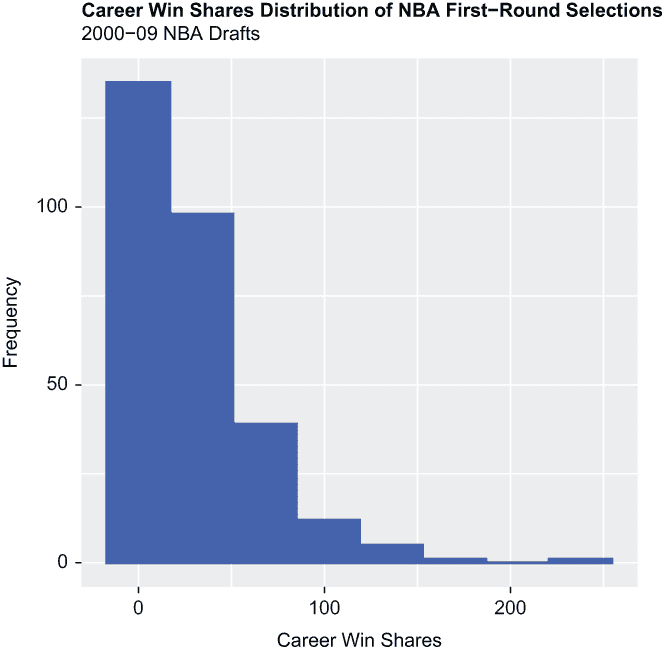
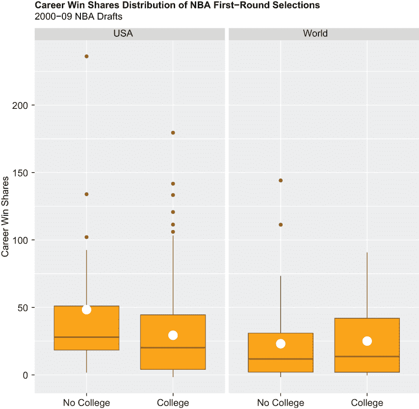
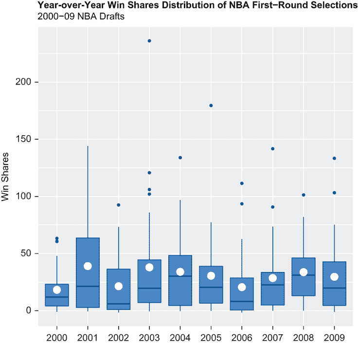
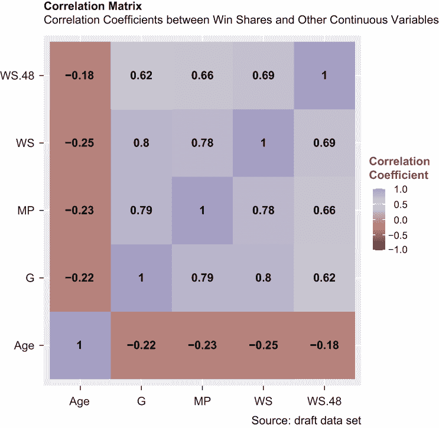
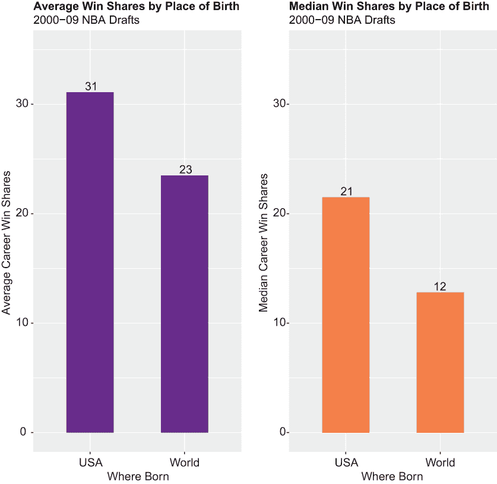
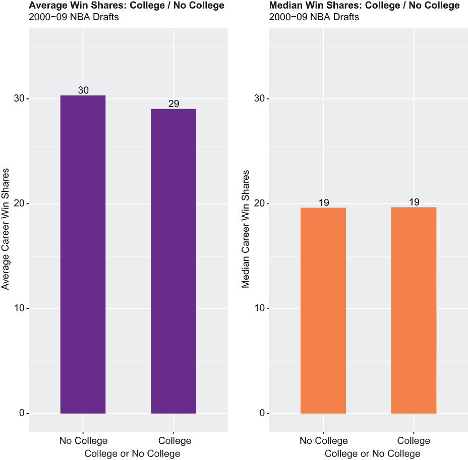
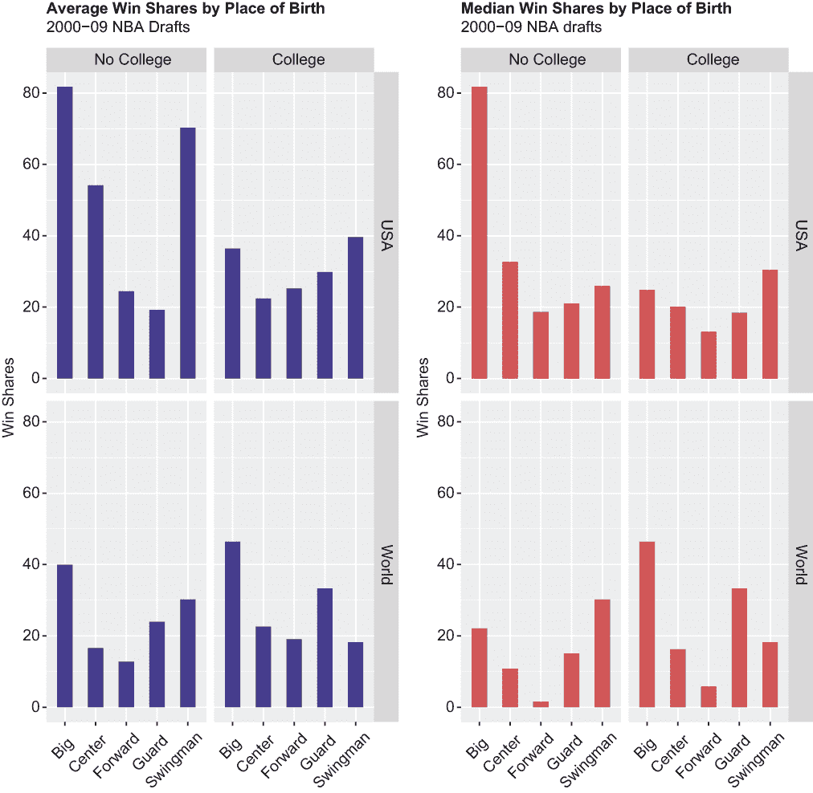

# 2 探索数据

本章涵盖了

+   加载包

+   导入数据

+   数据整理

+   探索和分析数据

+   写入数据

本章和下一章是一套组合——我们将在本章探索一个真实的数据集，然后在第三章中从中获得实际应用。探索性数据分析（EDA）是一个过程——实际上是一系列过程——通过计算基本统计量和创建相同数据的图形表示来对数据集进行质询。我们不会在过程中画任何大笔触；相反，我们将分析的重点放在一个单一变量上，这是一个称为赢分的性能指标，并发现赢分如何与我们数据中的其他变量相关联。我们在下一章中的初始假设将直接与本章的发现相联系。在这个过程中，我们将展示如何最好地利用 R 的力量彻底探索一个数据集——任何数据集。

但首先，我们必须完成加载包、导入我们的数据集以及整理和整理数据的强制任务。如果你没有将 *大部分* 时间投入到“无形”的任务中，这些任务有时会感觉像苦力活——理解时间分配并不一定与代码行数相关——那么你很可能在做一些错误的事情。不幸的是，数据并不总是为了后续的分析需求而收集和存储的；整理和整理数据有助于我们避免不良或误导性的结果。尽管如此，我们将介绍一些将对我们未来大有裨益的操作，在这个过程中，你将学到很多关于赢分和其他 NBA 数据的知识。

## 2.1 加载包

我们首先调用 `library()` 函数来加载允许我们调用基础产品中不可用的函数的包。你通过仅使用内置函数，并没有充分利用 R 的优势。这可能无需多言，但包必须在将它们加载到脚本中并调用它们的函数之前安装。这就是为什么我们保留脚本的最顶部来加载我们之前安装的包。为了明确起见，当你安装 R 时，你只安装了基础产品；任何需要超越基础 R 特性和功能的后续需求都需要持续安装包，通常是从 Comprehensive R Archive Network (CRAN) 安装，但偶尔也会从 GitHub 安装。

通过调用基础 R 的 `install.packages()` 函数，并在一对单引号或双引号之间传递包名作为参数来安装包，如下所示：

```
install.packages("tidyverse")
```

为了避免混淆 R，我们在引用整行代码时使用双引号，并在必要时在内部使用单引号引用代码的一部分。

虽然包只需要安装一次，但每次你计划使用它们时都必须加载它们。包扩展了 R 的功能和函数，而不会修改或以其他方式影响原始代码库（今天没有人想修改它）。以下是本章中我们计划使用的包的概述：

+   `dplyr` 和 `tidyr` 包包含了用于操作和整理数据的许多函数。这两个包都是 `tidyverse` 包宇宙的一部分。这意味着你可以一次调用 `library()` 函数，并传递 `tidyverse` 包，R 将自动加载 `dplyr`、`tidyr` 以及 `tidyverse` 的其他所有包。

+   `ggplot2` 包包含了 `ggplot()` 函数，用于创建优雅的视觉内容，其效果远胜于大多数现成的图表。此外，`ggplot2` 包还包含了一些其他函数，用于修剪你的可视化效果，总体来说，这些函数在基础 R 中没有等效功能。`ggplot2` 包也是 `tidyverse` 的一部分。

+   `readr` 包用于快速轻松地读取或导入由分隔符分隔的矩形数据；`readr` 是 `tidyverse` 的一部分。矩形数据等同于结构化数据或表格数据；它仅仅意味着数据是有行和列组织的。一个 *分隔符文件* 是一种平面文件，其中的值由一个特殊字符或字符序列分隔；它们通常保存为具有扩展名，该扩展名指示数据是如何分隔的。我们将仅使用之前保存为 .csv 扩展名的文件。一个 .csv，或 *逗号分隔值* 文件，是一个使用逗号作为分隔符的 Microsoft Excel 文件。

+   `reshape2` 包包含了使数据在宽格式和长格式之间转换变得容易的函数——这同样只需要一行代码。数据通常会被转换以适应特定的分析方法或可视化技术。

+   `sqldf` 包用于编写 `SELECT` 语句和其他结构化查询语言（SQL）查询。SQL 是一种编程语言，它提供了一种主要标准化的方式与存储数据交互。那些从其他编程语言迁移过来的人可能会发现，R 支持 SQL 是一种安慰；然而，我们将逐渐引导你从 `sqldf` 转向 `dplyr`。

+   `patchwork` 包使得将两个或更多可视化组合成一个单一图形对象变得非常简单——这同样只需要一行代码。

在下面的部分中，`library()` 函数被调用了四次，用于加载我们已安装的四个包。请注意，在调用 `library()` 函数时，不需要在包名周围使用一对引号：

```
library(tidyverse)
library(reshape2)
library(sqldf)
library(patchwork)
```

要运行一行或多行代码——顺便说一句，这些代码应该在脚本编辑器面板中输入——使用鼠标指针突出显示代码，然后在脚本编辑器的顶部点击运行。如果你在 Mac 上工作，可以按住 Control 键并按 Return 键。

## 2.2 导入数据

来自 `readr` 包的 `read_csv()` 函数用于导入以 .csv 扩展名保存的平面文件形式的数据集。只要数据局限于单个工作表（可以将 Microsoft Excel 文件想象成一个可以包含一个或多个工作表的工作簿），R 就能很好地读取 .csv 文件。否则，R 会抛出错误。`read_csv()` 函数只需要传递一个参数：文件名，前面是它的存储位置，由一对单引号或双引号包围。

然而，如果你之前设置了工作目录并在该位置部署了文件，你只需传递包括扩展名的文件名即可。你可以通过调用 `setwd()` 函数来设置工作目录，通过调用 `getwd()` 函数来获取之前设置的工作目录；`setwd()` 和 `getwd()` 都是基础 R 函数。当你调用 `read_csv()` 函数时，R 会自动导航你的文件夹结构，搜索你的工作目录，并导入你的文件。

以下代码行导入了一个名为 draft 的 .csv 文件，因为它存储在我们的工作目录中，并通过赋值运算符 `(<-)` 将其设置为与对象相同的名称。这个数据集是从 [`data.world`](http://data.world) 网站下载的，包含了 2000 年至 2009 年业余选秀中每个 NBA 第一轮选秀的信息：

```
draft <- read_csv("draft.csv")
```

NBA 选秀是什么？

对于可能不熟悉 NBA 的你来说，选秀是一个年度活动，在赛季间隙举行，各队轮流从美国和海外选择合格的球员。如今，选秀只有两轮。除非球队之间进行交易，否则每个队在每轮中只能选择一次，顺序由前一年的成绩决定，最差的球队可以首先选择。

确认数据导入成功并同时返回数据集维度的快速简单方法是通过调用基础 R 的 `dim()` 函数：

```
dim(draft)
## [1] 293  26
```

我们的数据集包含 293 行和 26 列。任何以一对井号（#）开头的内容都是 R 随后为我们返回的复制粘贴内容。现在我们有了数据集，我们将在探索、分析和从中得出一些有意义的结论之前对其进行处理。

## 2.3 处理数据

在现实世界中，你导入的大多数数据集可能都不完美；因此，绝对有必要执行一系列操作，将数据转换成干净整洁的对象，然后才能进行适当的准确分析。最常见的数据处理操作包括以下内容：

+   通过将列聚集到行或将行扩展到列来重塑或转置数据布局

+   通过行满足某些逻辑标准对数据进行子集化

+   通过列对数据进行子集化以删除多余数据

+   通过数学运算总结您的数据，通常按数据集中的其他变量分组

+   创建新变量，通常是从数据中的一个或多个原始变量派生出来的

+   将变量从一种类型转换为另一种类型，例如，从数值转换为日期或从字符字符串转换为分类

+   更改变量名

+   替换属性

+   将您的数据与一个或多个其他数据集合并或连接

我们将从删除不必要的列或变量开始。

### 2.3.1 删除变量

我们的第一步数据整理操作是从草稿数据集中删除多余的变量。大部分情况下，我们正在删除不会影响我们分析的职业统计数据。这是一个纯粹的选择性操作，但始终是最佳实践只保留您需要的，丢弃其他所有内容。当处理大型数据集时，删除无关或冗余数据绝对可以提高计算效率。

在以下代码行中，我们调用了来自 `dplyr` 包的 `select()` 函数以及来自基础 R 的 `c()` 函数：

```
draft <- select(draft,-c(3,4,16:24))
```

`select()` 函数用于通过变量名或索引选择或取消选择变量；`c()` 函数用于将多个参数组合成一个向量。我们调用 `select()` 函数通过移除变量来对草稿数据集进行子集化，这些变量通过在数据集中从左到右的位置表示，传递给 `c()` 函数（注意前面的减号 [-] 操作符）。在 R 中，通常有多种方法可以“剥猫皮”，这是一个例子：

+   变量名可以替换为位置编号。这实际上是一种最佳实践，应该是首选方法，除非要删除的变量数量过多或存在特殊情况。事实上，其中一些变量包含会导致 R 错误的字符，因此我们这次选择调用位置编号而不是变量名。

+   减号操作符可以移除，然后可以将要包含的变量名或位置作为参数传递给 `c()` 函数。

+   可以使用基础 R 函数代替 `dplyr` 代码。

我们将根据情况应用所有这些替代方案。

### 2.3.2 删除观测值

下一行代码删除了草稿中的观测值（即行或记录）90 和 131，原因很简单，这些观测值包含不完整的数据，否则会中断正在进行的操作。记录大部分为空白，因此消除了数据插补或其他纠正措施作为选项：

```
draft <- draft[-c(90, 131),]
```

现在我们已经通过首先删除不必要的变量然后删除大部分不完整的观测值来减少了草稿的维度，接下来我们将查看我们的数据并执行更有意义的数据整理操作。

### 2.3.3 查看数据

`dplyr` 的 `glimpse()` 函数，其中我们的数据集名称作为唯一的参数传递，返回数据的转置视图。在这个视图中，列显示为行，行显示为列，这使得在 RStudio 控制台中查看每一列成为可能；这在处理宽数据集时特别有用。

`glimpse()` 函数还返回每个变量的类型或类，以及在顶部，对象的维度：

```
glimpse(draft)
## Rows: 289
## Columns: 18
## $ Rk       <dbl> 1, 2, 3, 4, 5, 6, 7, 8, 9, 10, 11, 12, 13, 14, 1...
## $ Year     <fct> 2009, 2009, 2009, 2009, 2009, 2009, 2009, 2009, ...
## $ Pk       <dbl> 1, 2, 3, 4, 5, 6, 7, 8, 9, 10, 11, 12, 13, 14, 1...
## $ Tm       <fct> LAC, MEM, OKC, SAC, MIN, MIN, GSW, NYK, TOR, MIL...
## $ Player   <chr> "Blake Griffin", "Hasheem Thabeet", "James Harde...
## $ Age      <dbl> 20.106, 22.135, 19.308, 19.284, 18.252, 20.144, ...
## $ Pos      <chr> "F", "C", "G", "G-F", "G", "G", "G", "C-F", "G-F...
## $ Born     <fct> us, tz, us, us, es, us, us, us, us, us, us, us, ...
## $ College  <chr> "Oklahoma", "UConn", "Arizona State", "Memphis",...
## $ From     <fct> 2011, 2010, 2010, 2010, 2012, 2010, 2010, 2010, ...
## $ To       <fct> 2020, 2014, 2020, 2019, 2020, 2012, 2020, 2017, ...
## $ G        <dbl> 622, 224, 826, 594, 555, 163, 699, 409, 813, 555...
## $ MP       <dbl> 34.8, 10.5, 34.3, 30.7, 30.9, 22.9, 34.3, 18.8, ...
## $ WS       <dbl> 75.2, 4.8, 133.3, 28.4, 36.4, -1.1, 103.2, 16.4,...
## $ WS48     <dbl> 0.167, 0.099, 0.226, 0.075, 0.102, -0.015, 0.207...
## $ Born2    <fct> USA, World, USA, USA, World, USA, USA, USA, USA,...
## $ College2 <fct> 1, 1, 1, 1, 0, 1, 1, 1, 1, 0, 1, 1, 1, 1, 1, 1, ...
## $ Pos2     <chr> "F", "C", "G", "G-F", "G", "G", "G", "C-F", "G-F...
```

草稿数据集现在有 291 行长和 15 列宽（与原始的 293 × 26 维度相比），包含数值变量（`int` 和 `dbl`）和字符字符串（`chr`）的组合。

或者（或附加地），当调用基础 R 的 `head()` 和 `tail()` 函数时，R 返回数据集的前 *n* 行和后 *n* 行。这在 `glimpse()` 函数的转置输出不够直观时特别有用。默认情况下，R 为这两个函数显示数据集的前六行或后六行。以下两行代码返回了草稿数据集的前三行和后三行：

```
head(draft, 3) 
      Rk Year     Pk Tm    Player        Age Pos   Born  College
## <dbl> <dbl> <dbl> <chr> <chr>       <dbl> <chr> <chr> <chr>
## 1   1 2009      1 LAC   Blake Grif...  20.1 F     us    Oklaho...
## 2   2 2009      2 MEM   Hasheem Th...  22.1 C     tz    UConn  
## 3   3 2009      3 OKC   James Hard...  19.3 G     us    Arizon...
     From    To     G    MP    WS   WS48
##  <dbl> <dbl> <dbl> <dbl> <dbl>  <dbl>
## 1 2011  2020    622  34.8  75.2  0.167
## 2 2010  2014    224  10.5   4.8  0.099
## 3 2010  2020    826  34.3 133\.   0.226

tail(draft, 3)
        Rk Year     Pk Tm    Player        Age Pos   Born  College
##   <dbl> <dbl> <dbl> <chr> <chr>       <dbl> <chr> <chr> <chr>
## 1   291 2000     27 IND   Primo_ Bre...  20.3 C     si    0     
## 2   292 2000     28 POR   Erick Bark...  22.1 G     us    St. Jo...
## 3   293 2000     29 LAL   Mark Madsen  24.2 F     us    Stanfo...
     From    To     G    MP    WS   WS48
##  <dbl> <dbl> <dbl> <dbl> <dbl>  <dbl>
## 291  2002   2010    342  18.1  10.8 0.084
## 292  2001   2002     27   9.9   0.2 0.027
## 293  2001   2009    453  11.8   8.2 0.074
```

我们现在的一些字符字符串或数值变量应该转换为因子变量。我们将在下一步处理这个问题。

### 2.3.4 转换变量类型

一些字符字符串和数值变量实际上是分类变量或因子，即使它们没有被归类为这样的类型；这是因为它们只能取已知或固定的值集。以变量 `Year` 为例，我们可以提供一个例子。我们已经确定我们的数据集包括关于 2000 年至 2009 年 NBA 第一轮选秀的信息；因此，`Year` 只能等于 2000 年至 2009 年之间的某个值。或者，以变量 `Tm` 为例，它是 *Team* 的缩写。NBA 中只有这么多支球队；因此，`Tm` 有一个固定的可能性集合。如果您计划建模或可视化数据，将变量转换为真正的分类因子几乎是强制性的。

现在看看接下来的几行代码。在 R 中，`$` 运算符用于从选定的数据集中提取或子集变量。例如，在这段代码的第一行中，我们正在从草稿数据集中提取或子集变量 `Year`，并将其转换为因子变量：

```
draft$Year <- as.factor(draft$Year)
draft$Tm <- as.factor(draft$Tm)
draft$Born <- as.factor(draft$Born)
draft$From <- as.factor(draft$From)
draft$To <- as.factor(draft$To)
```

为了直接确认这些操作中的任何一个，从而间接确认其他操作，我们接下来调用基础 R 的 `class()` 函数，并传递草稿变量 `Year`。我们可以看到，`Year` 现在实际上是一个因子变量。`glimpse()` 函数可以作为替代再次调用：

```
class(draft$Year)
## "factor"
```

很快，我们将围绕这些变量的一些水平或组来可视化和分析我们的数据，这些变量现在是因子。

### 2.3.5 创建派生变量

我们已经删除了变量并将其他变量转换为因子变量。接下来，我们将创建变量——实际上三个变量——并将它们依次追加到草稿数据集的末尾。对于前两个变量，我们将同时使用 `dplyr mutate()` 函数和基础 R 的 `ifelse()` 函数。这个强大的组合使得我们可以对一个或多个原始变量执行逻辑测试，并根据测试结果向新变量添加属性。对于第三个变量，我们将复制一个原始变量，然后通过调用 `dplyr` 的 `recode()` 函数来替换新变量的属性。

让我们从变量 `Born` 开始；这是一个两字节变量，表示球员的出生国家，例如，`us` 等于美国。

在以下代码块的第一行中，创建了一个新的或派生变量，称为 `Born2`。如果原始变量 `Born` 中的值等于 `us`，则草稿中相同的记录应等于 `USA`；如果 `Born` 中的值等于除 `us` 之外的其他任何值，则 `Born2` 应该等于 `World`。第二行代码将变量 `Born2` 转换为因子变量，因为每个记录只能取两个可能值之一，并且我们即将进行的分析实际上将按这些相同的级别进行分组：

```
mutate(draft, Born2 = ifelse(Born == "us", "USA", "World")) -> draft
draft$Born2 <- as.factor(draft$Born2)
```

注意顺便说一下，`=` 和 `==` 运算符并不相同；第一个是赋值或数学运算符，而第二个是逻辑运算符。

现在，让我们处理变量 `College`，它等于在草稿数据集中每个 NBA 第一轮选秀球员最后就读的大学或学院，无论他们可能注册了多长时间，无论他们是否毕业。然而，并非每个球员都就读过大学或学院；对于那些没有就读的球员，`College` 等于 `NA`。在 R 中，`NA` 或不可用相当于缺失值，因此不能忽略。在下一行代码中，我们调用基础 R 的 `is.na()` 函数将每个 `NA` 替换为 `0`。

在第二行代码中，我们再次调用 `mutate()` 和 `ifelse()` 函数来创建一个新变量 `College2`，并添加从原始变量 `College` 导出的值。如果该变量等于 `0`，则 `College2` 中也应等于 `0`；另一方面，如果 `College` 等于其他任何值，则 `College2` 应该改为等于 `1`。第三行代码将 `College2` 转换为因子变量：

```
draft$College[is.na(draft$College)] <- 0 
mutate(draft, College2 = ifelse(College == 0, 0, 1)) -> draft
draft$College2 <- as.factor(draft$College2)
```

最后，对变量 `Pos`（代表球员的位置）进行快速检查，揭示了另一个整理的机会——前提是我们之前在调用 `glimpse()` 函数时没有获得相同的信息。对基础 R 的 `levels()` 函数的调用返回 `Pos` 中的每个唯一属性。请注意，`levels()` 只与因子变量一起工作，因此我们将 `levels()` 与 `as.factor()` 函数结合使用，临时将 `Pos` 从一个类转换为另一个类：

```
levels(as.factor(draft$Pos))
## [1] "C" "C-F" "F" "F-C" "F-G" "G" "G-F"
```

我们很容易看出，例如，一些球员打中锋和前锋（`C-F`），而其他球员打前锋和中锋（`F-C`）。不清楚被标记为 C-F 的球员是否主要是中锋，而被标记为 F-C 的球员是否主要是前锋——或者这只是粗心大意的数据录入的结果。无论如何，这些球员由于体型和技能集而打相同的两个位置。

在接下来的代码的第一行中，我们创建了一个名为`Pos2`的新变量，它是`Pos`的精确副本。在接下来的几行代码中，我们调用`recode()`函数将`Pos2`属性替换为新的属性，如下所示（注意，我们在变量名周围应用引号，因为至少目前，`Pos2`仍然是一个字符串）：

+   `C`被替换为`Center`。

+   `C-F`和`F-C`被替换为`Big`。

+   `F`被替换为`Forward`。

+   `G`被替换为`Guard`。

+   `F-G`和`G-F`被替换为`Swingman`。

然后，我们将变量`Pos`和`Pos2`转换为因子。最后，我们将`Pos2`传递给`levels()`函数以确认我们的重编码按计划进行：

```
draft$Pos2 <- draft$Pos
draft$Pos2 <- recode(draft$Pos2, 
                     "C" = "Center", 
                     "C-F" = "Big", 
                     "F" = "Forward", 
                     "F-C" = "Big", 
                     "F-G" = "Swingman", 
                     "G" = "Guard", 
                     "G-F" = "Swingman") 
draft$Pos <- as.factor(draft$Pos)
draft$Pos2 <- as.factor(draft$Pos2)
levels(draft$Pos2)
## [1] "Big"      "Center"   "Forward"  "Guard"    "Swingman"
```

在完成所有这些纠缠和整理工作——至少暂时如此——之后，对我们的工作数据集进行基准设置是有意义的，我们将在下一步进行。

## 2.4 变量分解

在删除了一部分原始变量、将其他变量转换为因子以及创建了三个新变量之后，选秀数据集现在包含以下 18 个变量：

+   `Rk`—仅记录计数器，最大值为 293。当导入选秀数据集时，*有* 293 条记录，其中`Rk`从 1 开始，然后随着每条后续记录的增加而递增。由于数据不完整，随后删除了两条记录，从而将选秀的长度减少到 291 条记录，但`Rk`中的值在删除后保持不变。

+   `Year`—表示球员在 NBA 选秀中被选中的年份，最小为 2000 年，最大为 2009 年。就其本身而言，[`data.world`](http://data.world)数据集实际上涵盖了 1989 年至 2016 年的 NBA 选秀；然而，10 年的数据对于我们的目的来说已经足够了。因为我们的意图（见第三章）是最终追踪职业轨迹，2009 年是一个合理甚至必要的截止点。我们有时会根据变量`Year`对数据进行分组总结。

+   `Pk`—仅包含第一轮选区的草稿数据集。因此，这是第一轮的选区号或抽签号，例如，数字 7 表示第七个整体抽签。我们特别关注变量`Pk`的赢分；我们预计在首轮高选球员与其他首轮较晚选中的球员之间会看到差异。

+   `Tm`—做出选秀选择的简写队名——例如，`NYK`代表纽约尼克斯或`GSW`代表金州勇士。

+   `Player`—被选球员的姓名，采用名-姓格式（例如，斯蒂芬·库里）。

+   `Age`—球员被选中时的年龄；例如，斯蒂芬·库里在 2009 年被勇士队以第七顺位选中时，年龄为 21.108 岁。

+   `Pos`—每位球员的位置或位置，以缩写格式表示。

+   `Born`—每位球员出生的国家，以缩写格式表示。

+   `College`—每位球员在成为职业球员之前最后就读的大学或学院。当然，许多球员，尤其是那些在国外出生的球员，没有上大学；在这种情况下，记录现在等于 0。

+   `From`—每位球员的第一个职业赛季，例如，2010 年等于 2009-10 赛季。典型的 NBA 常规赛从十月中旬开始，到下一年历年的四月中旬结束。因为选秀数据集从 2000 年的选秀开始，所以最小值等于`2001`。

+   `To`—包含球员统计数据的最后一个赛季。这里的最大值是`2020`。

+   `G`—每位球员在 2000-01 赛季至 2019-20 赛季之间参加的常规赛总场数。

+   `MP`—每位球员在常规赛每场比赛的平均出场时间。

+   `WS`—每位球员在 2000-01 赛季至 2019-20 赛季之间累积的胜利份额。胜利份额是一种高级统计数据，用于量化球员对其球队成功的贡献。它将每位球员的原始统计数据与球队和联盟统计数据相结合，产生一个代表每位球员对其球队胜利贡献的数字。任何球队的个人胜利份额总和应大致等于该球队的常规赛胜利总数。斯蒂芬·库里在 2009 年至 2020 年之间累积了 103.2 个胜利份额。换句话说，大约有 103 场金州勇士队在 10 年间的常规赛胜利与库里在进攻和防守上的表现有关。接下来的 EDA 大部分将关注胜利份额，包括其与其他变量的关联。

+   `WS48`—每位球员每 48 分钟累积的胜利份额。NBA 比赛时长为 48 分钟，只要它们在常规时间内结束且不需要加时。

+   `Born2`—不在原始数据集中。这是一个派生变量，如果一名球员出生在美国，则等于`USA`；如果球员出生在美国以外，则等于`World`。

+   `College2`—不在原始数据集中。这是一个派生变量，如果球员没有上大学或学院，则等于`0`；如果上了大学，则等于`1`。

+   `Pos2`—不在原始数据集中。这是一个派生变量，等于每位球员的完整位置名称，以便例如`F-G`和`G-F`都等于`Swingman`。

一支 NBA 球队可能有多达 15 名球员在其活跃名单上，但一次只能有 5 名球员上场。球队通常有两名后卫、两名前锋和一名中锋；更重要的是，还有控球后卫和得分后卫，以及小前锋和强力前锋，如以下所述：

+   *控球后卫*——篮球中的四分卫；他负责组织进攻，通常是最好的传球手和运球手。

+   *得分后卫*——通常是球队最好的射手和得分手。

+   *小前锋*——通常是一个非常多才多艺的球员；他可以在内线或外线得分，并防守矮个或高个球员。

+   *大前锋*——通常是一个好的防守者和篮板球手，但不一定是很好的射手或得分手。

+   *中锋*——球队最高的球员；他通常被指望防守篮筐、封盖投篮和篮板球。

草案数据集不区分控球后卫和得分后卫，也不区分小前锋和大前锋；但它确实突出了那些打多个位置的比赛者。*摇摆人*是一个能够打得分后卫或小前锋的球员，而*大前锋*是一个能够打大前锋或中锋的球员。

调用`head()`函数返回新改进的草案数据集中的前六个观测值：

```
head(draft)
        Rk Year     Pk Tm    Player            Age Pos    Born 
##   <dbl> <fct> <dbl> <fct> <chr>           <dbl> <fct> <fct>
## 1     1 2009      1 LAC   Blake Griffin    20.1 F     us   
## 2     2 2009      2 MEM   Hasheem Thabeet  22.1 C     tz   
## 3     3 2009      3 OKC   James Harden     19.3 G     us   
## 4     4 2009      4 SAC   Tyreke Evans     19.3 G-F   us   
## 5     5 2009      5 MIN   Ricky Rubio      18.3 G     es   
## 6     6 2009      6 MIN   Jonny Flynn      20.1 G     us   
     College       From  To        G    MP    WS   WS48
##   <chr>        <fct> <fct>  <dbl> <dbl> <dbl>  <dbl>
## 1 Oklahoma      2011  2020    622  34.8  75.2  0.167
## 2 UConn         2010  2014    224  10.5   4.8  0.099
## 3 Arizona State 2010  2020    826  34.3 133\.   0.226
## 4 Memphis       2010  2019    594  30.7  28.4  0.075
## 5 0             2012  2020    555  30.9  36.4  0.102
## 6 Syracuse      2010  2012    163  22.9  -1.1 -0.015
     Born2 College2  Pos2 
##   <fct> <fct>    <fct>
## 1 USA   1        Forward 
## 2 World 1        Center  
## 3 USA   1        Guard   
## 4 USA   1        Swingman
## 5 World 0        Guard   
## 6 USA   1        Guard
```

现在是时候探索和分析我们数据中的`win shares`和其他变量了。

## 2.5 探索性数据分析

再次强调，探索性数据分析（EDA）通常是计算基本统计量和创建视觉内容的混合。就我们的目的而言，特别是作为第三章的引言，接下来的 EDA 工作将集中在单个变量`win shares`上，但仍然提供了关于`win shares`与许多剩余的草案数据集变量相关联或未相关联的见解。因此，我们对草案数据集的调查将是一个单变量（一个变量）和多变量（多个变量）练习的组合。

### 2.5.1 计算基本统计量

基础 R 的`summary()`函数被调用以启动对草案数据集的探索和分析，这个过程将主要关注变量`win shares`；这是因为我们最终感兴趣的是了解当`win shares`与其他数据集中的变量挂钩时，球队可以从他们的选秀中期待多少生产力。`summary()`函数为草案中的每个变量返回基本统计信息。对于连续的或数值变量，如`win shares`，`summary()`函数返回最小值和最大值、第一四分位数和第三四分位数以及中位数和均值；对于如`Born2`这样的分类变量，另一方面，`summary()`函数返回每个级别的计数。为了详细说明，就连续变量而言

+   *最小值*代表最低值。

+   *最大值*代表最高值。

+   *均值*是平均值。

+   *中位数*是当数据按升序或降序排列时的中间值。当数据包含偶数个记录时，中位数是两个中间数的平均值。

+   *第一四分位数*是下四分位数；当数据按升序排列时，下四分位数代表 25%的分界点。

+   *第三四分位数*也称为上四分位数；再次强调，当数据按升序排列时，上四分位数代表 75%的分位数。

话虽如此，我们最终调用`summary()`函数：

```
summary(draft)
##       Rk             Year           Pk              Tm     
## Min.   :  1.0   2006   : 30   Min.   : 1.00   BOS    : 13  
## 1st Qu.: 73.5   2008   : 30   1st Qu.: 8.00   CHI    : 13  
## Median :148.0   2009   : 30   Median :15.00   POR    : 13  
## Mean   :147.3   2000   : 29   Mean   :15.12   MEM    : 12  
## 3rd Qu.:220.5   2003   : 29   3rd Qu.:22.00   NJN    : 12  
## Max.   :293.0   2004   : 29   Max.   :30.00   PHO    : 12  
##                 (Other):114                   (Other):216
##   Player               Age         Pos          Born    
## Length:291         Min.   :17.25   C  :42   us     :224  
## Class :character   1st Qu.:19.33   C-F:10   es     :  6  
## Mode  :character   Median :21.01   F  :88   fr     :  6  
##                    Mean   :20.71   F-C:24   br     :  4  
##                    3rd Qu.:22.05   F-G:10   si     :  4  
##                    Max.   :25.02   G  :95   de     :  3  
##                                    G-F:22   (Other): 44  
##   College               From           To     
## Length:291         2005   : 31   2020   : 46  
## Class :character   2009   : 31   2019   : 24  
## Mode  :character   2002   : 30   2013   : 23  
##                    2004   : 29   2017   : 23  
##                    2006   : 29   2015   : 22  
##                    2007   : 28   2018   : 18  
##                    (Other):113   (Other):135  
##       G                MP              WS              WS48         
## Min.   :   6.0   Min.   : 4.30   Min.   : -1.60   Min.   :-0.32600  
## 1st Qu.: 248.0   1st Qu.:15.60   1st Qu.:  4.05   1st Qu.: 0.05000  
## Median : 549.0   Median :21.60   Median : 19.60   Median : 0.07900  
## Mean   : 526.4   Mean   :21.53   Mean   : 29.35   Mean   : 0.07592  
## 3rd Qu.: 789.5   3rd Qu.:27.70   3rd Qu.: 43.85   3rd Qu.: 0.10600  
## Max.   :1326.0   Max.   :38.40   Max.   :236.10   Max.   : 0.24400  
##   Born2     College2       Pos2   
## USA  :224   0: 73    Center  :42  
## World: 67   1:218    Big     :34  
##                      Forward :88  
##                      Swingman:32  
##                      Guard   :95  
```

最有趣和有意义的收获包括以下内容：

+   职业胜利份额的差异极大。在 2000 年至 2009 年的 NBA 选秀中，至少有一位首轮新秀在其整个职业生涯中积累了负数的胜利份额。有球员积累了超过 236 个胜利份额。

+   其他职业统计数据也存在显著差异，尤其是常规赛比赛数和每场常规赛的平均分钟数。

+   回到胜利份额，平均值（对异常值或远离总体中心的观测值特别敏感）显著大于中位数，这表明平均值被数据集中的少数超级巨星所扭曲。

+   2000 年至 2009 年的首轮 NBA 选秀球员在选秀时的年龄在 17.25 至 25.02 岁之间。

+   在选秀中，超过四分之三的球员，确切地说，291 位球员中的 224 位，出生在美国。

+   几乎相同数量的球员——确切地说，218 位球员——曾就读于大学或学院。

然而，还有一些基本统计数据，`summary()`函数并没有返回。例如，基础 R 中的`sd()`函数计算连续变量（如常规赛比赛数`G`、每场常规赛的分钟数`MP`和职业生涯胜利份额`WS`）的标准差。再次强调，`$`运算符告诉 R 只计算并返回指定变量的结果：

```
sd(draft$G)
## [1] 319.6035
sd(draft$MP)
## [1] 7.826054
sd(draft$WS)
## [1] 33.64374
```

标准差是衡量数据相对于平均值的分散程度的指标。标准差低意味着数据集中在平均值附近；相反，标准差高意味着数据更分散。*如果*这些数据呈高斯分布或正态分布（想想钟形曲线），那么在大约 68%的选秀数据集中的球员将位于平均值的±一个标准差范围内，95%的球员将位于平均值的±两个标准差范围内，除了一两名球员外，所有球员都将位于平均值的±三个标准差范围内。以每场常规赛的分钟数为例——大约 68%的球员的平均分钟数可能在 13.71 至 29.35 分钟之间，这等于总体均值±标准差。我们可以通过平方标准差或通过将变量名传递给基础 R 的`var()`函数来得到任何连续变量的方差。

### 2.5.2 返回数据

在以下代码块中，我们通过调用`sqldf`包中的`sqldf()`函数运行一系列独立的`SELECT`语句。我们的目的是深入数据并获取`summary()`和其他函数不返回的一些具体信息：

```
sqldf("SELECT min(WS), Player, Tm, Pk, Year FROM draft")
##   min(WS)        Player  Tm Pk Year
## 1    -1.6 Mardy Collins NYK 29 2006
sqldf("SELECT max(WS), Player, Tm, Pk, Year FROM draft")
##   max(WS)       Player  Tm Pk Year
## 1   236.1 LeBron James CLE  1 2003
sqldf("SELECT min(G), Player, Tm, Pk, Year FROM draft")
##   min(G)          Player  Tm Pk Year
## 1      6 Pavel Podkolzin UTA 21 2004
sqldf("SELECT max(G), Player, Tm, Pk, Year FROM draft")
##   max(G)         Player  Tm Pk Year
## 1   1326 Jamal Crawford CLE  8 2000
sqldf("SELECT min(MP), Player, Tm, Pk, Year FROM draft")
##   min(MP)       Player  Tm Pk Year
## 1     4.3 Julius Hodge DEN 20 2005
sqldf("SELECT max(MP), Player, Tm, Pk, Year FROM draft")
##   max(MP)       Player  Tm Pk Year
## 1    38.4 LeBron James CLE  1 2003
sqldf("SELECT min(Age), Player, Tm, Pk, Year FROM draft")
##   min(Age)       Player  Tm Pk Year
## 1   17.249 Andrew Bynum LAL 10 2005
sqldf("SELECT max(Age), Player, Tm, Pk, Year FROM draft")
##   max(Age)          Player  Tm Pk Year
## 1   25.019 Mamadou N'Diaye DEN 26 2000
```

`SELECT`和`FROM`子句标识了要从哪个数据源中提取哪些变量。例如，第一个`SELECT`语句从草案中检索变量`win shares`等于数据集最小值的记录，返回赢分、球员的全名、选他的球队、选秀号码以及他被选中的年份。`SELECT`语句——易于编写且通常运行迅速——当你只需要一个数据点或可能是一短列表的记录时效果最佳。如果你需要创建一个可以随后用作进一步分析源的数据对象，`dplyr`是一个更好的选择。从现在起，我们将将注意力集中在赢分上，从一些频率分布分析开始。

### 2.5.3 计算和可视化频率分布

拉取数据是有建设性的。但可视化数据就像踩下油门——图片显示了变量之间的关系，显示了异常值，并展示了仅凭数字无法向我们揭示的趋势。特别是，频率分布是连续数据计数的视觉显示。它们通常以绝对频率或原始数据的表示形式显示，但有时相同的数据会被转换，以便显示百分比或比例。我们将使用直方图和箱线图来可视化原始数据，然后展示如何编写`sqldf`和`dplyr`代码以获得额外的见解。

直方图

毫无疑问，最常用的方法来可视化连续变量（如`win shares`）的频率分布是使用直方图；因此，绘制直方图是一个逻辑上的起点。**直方图**是表示一个连续变量分布的图形表示；它将数据划分为我们所说的“箱”，然后显示每个箱中观察值的频率或计数。

本章中的每个可视化都是使用`ggplot2`包创建的；`ggplot2`，既优雅又强大，是 R 在数据可视化领域领先的一个重要原因。构建`ggplot2`可视化非常类似于制作婚礼蛋糕——`ggplot()`函数建立基础，然后其他函数提供糖霜和装饰。请注意，在连续调用各种`ggplot2`函数以添加、更改或增强基本构建时，存在加号或加法运算符（`+`）：

+   `ggplot()`函数初始化一个`ggplot2`对象。传递给`ggplot()`的第一个参数是数据源的指针，当然，是草案数据集。第二个参数是对`aes()`函数的调用，它定义了应该绘制哪些变量以及它们应该映射到哪些绘图参数或轴。

+   `geom_histogram()` 函数——geom 是几何对象的简称——告诉 R 通过将 x 轴划分为指定数量的箱并计算每个箱内的观测值来可视化单个连续变量的分布。箱应着色并填充相同的皇家蓝色。

+   `labs()` 函数为 x 轴和 y 轴添加标题、副标题和标签。

+   `theme()` 函数将粗体字体应用于标题，以替代默认的普通字体。

+   基础 R 的 `print()` 函数打印出直方图，称为 `p1`；同时，仅 `p1` 本身也会执行相同的操作。

我们的直方图（见图 2.1）提供了对赢分数据的快照，只需几秒钟，就可以通过简单地观察数据行来了解分布，否则这将花费更长的时间，并可能导致错误的结论：

```
p1 <- ggplot(draft, aes(x = WS)) + 
  geom_histogram(fill = "royalblue3", color = "royalblue3", 
                 bins = 8) + 
  labs(title = "Career Win Shares Distribution of
       NBA First-Round Selections",
       subtitle = "2000-09 NBA Drafts",
       x = "Career Win Shares",
       y = "Frequency") +
  theme(plot.title = element_text(face = "bold"))
print(p1)
```



图 2.1 职业生涯赢分具有右偏斜，或正偏斜，的分布。

变量 `win shares` 具有右偏斜，或正偏斜，的分布——右偏斜是因为分布有一个长的右尾，正偏斜是因为长尾位于 x 轴的正方向。用通俗的话说，这意味着在 2000 年至 2009 年的 NBA 选秀中，许多首轮新秀在整个职业生涯中赢分很少，而只有少数球员赢分很多。

填充和颜色

如果你以实体书的形式阅读这本书，你现在肯定已经注意到每个图表都是以灰度打印的。尽管如此，我们展示了如何通过在几乎每个图表中添加自定义填充和颜色来增强你的可视化——无论是 `ggplot2` 还是其他——并在文本中引用相同的颜色。以下是一个 `ggplot2` 填充和颜色参考指南的网站，它非常实用：[`sape.inf.usi.ch/quick-reference/ggplot2/colour`](http://sape.inf.usi.ch/quick-reference/ggplot2/colour)。此外，任何购买过这本书新副本的人都可以访问电子书版本（全彩）；如果你对查看全彩可视化感兴趣，请参阅该版本。 

以下两个 `SELECT` 语句返回在选秀数据集中，职业生涯赢分数量大于或等于 75 或小于 75 的记录数。因此，我们得到了实际计数，而不是从我们的直方图中得到的近似计数。在 `COUNT()` 函数中包含星号确保我们得到任何包含 `null` 值的观测值作为结果集的一部分。更重要的是，`WHERE` 子句确定了任何观测值必须评估为 `true` 的条件，才能包含在结果中：

```
sqldf("SELECT COUNT (*) FROM draft WHERE WS >= 75")
##   COUNT (*)
## 1        27
sqldf("SELECT COUNT (*) FROM draft WHERE WS < 75")
##   COUNT (*)
## 1       264
```

在 2000 年至 2009 年的 NBA 选秀中，不到 10% 的首轮新秀在其各自的职业生涯中至少赢得了 75 分。事实上，超过 50% 的球员，即 291 名中的 169 名，赢分少于 25 分：

```
sqldf("SELECT COUNT (*) FROM draft WHERE WS <= 25")
##   COUNT (*)
## 1       169
```

箱线图

另一种可视化连续变量频率分布的方法是使用箱线图。我们的下一个可视化包含一个分面图内的两对箱线图，其中胜利份额的分布首先根据派生变量`Born2`进行分段，然后根据派生变量`College2`再次进行分段。

没有两个`ggplot2`可视化是完全相同的，尤其是在几何对象或几何形状之间；然而，它们都遵循相同的一般语法和结构。以下是一些关于我们的分面图的注意事项，其中数据被分解并在共享相同 x 轴和 y 轴的子图中可视化：

+   `stat_summary()`函数在每个箱线图上添加一个实心白点，以表示总体均值。总体中位数由水平线表示，这是`ggplot2`自动添加的。

+   `facet_wrap()`函数为变量`Born2`中的每个级别创建一个面板——因此为每个级别生成一对箱线图；因为`Born2`有两个级别，所以我们的分面图因此有两个面板。

+   `scale_x_discrete()`函数通过将`College2`中的级别`0`和`1`分别转换为`No College`和`College`来硬编码 x 轴上的标签。准确或直观的标签对于提高你的视觉内容的可读性和可解释性有很大帮助。

我们的第二个可视化（见图 2.2）显示，胜利份额的分布因出生地以及玩家是否首先就读于大学或学院而有所不同：

```
p2 <- ggplot(draft, aes(x = College2, y = WS)) + 
  geom_boxplot(color = "orange4", fill = "orange1") +  
  labs(title = "Career Win Shares Distribution of 
       NBA First-Round Selections",
       x = "", 
       y = "Career Win Shares", 
       subtitle = "2000-09 NBA Drafts") + 
  stat_summary(fun = mean, geom = "point", shape = 20, 
               size = 8, color = "white", fill = "white") + 
  theme(plot.title = element_text(face = "bold")) +
  facet_wrap(~Born2) + 
  scale_x_discrete(breaks = c(0, 1),
                   labels = c("No College", "College"))
print(p2)
```



图 2.2 胜利份额的分布因出生地以及球员在成为职业球员之前是否首先就读于大学或学院而有所不同。

箱线图通过隔离以下与`summary()`函数输出相一致（但有时并不完全一致）的指标来显示连续变量的分布：

+   *中位数*——中间值，由水平线表示。

+   *第一四分位数*——最小数（不一定是“最小值”）和中位数之间的中间值，也称为 25 百分位数。

+   *第三四分位数*——中位数和最高值（不一定是“最大值”）之间的中间值，也称为 75 百分位数。

+   *四分位距（IQR）*——25 百分位数到 75 百分位数；基本上，就是箱子。这也可以通过计算第一四分位数和第三四分位数的差来得到。

+   *“最小值”*——等于 Q1 - (1.5 * IQR)。这不一定是最小值；实际上，可能存在一个或多个数据点——异常值——超出所谓的最小值。

+   *“最大值”*——等于 Q3 + (1.5 * IQR)。同样，这实际上可能并不代表最高值。

平均值不是箱线图的常规指标，这可能是为什么`ggplot2`不会自动添加它。胡须是延伸到 IQR（箱线图因此通常被称为箱线图和胡须图）下方和上方的线。超出“最小值”和“最大值”的点或圆圈是异常值。

这是一种对数据的迷人图形表示，揭示了几个真理：

+   出生在美国的球员通常比出生在美国以外的球员积累了更多的职业生涯胜利份额。

+   出生在美国并绕过大学的球员通常比那些出生在美国并上了大学或学院的球员积累了更多的职业生涯胜利份额。

+   或者，出生在除美国以外任何国家的球员，如果没有上大学或学院，通常在其职业生涯中积累的胜利份额比那些出生在美国并上了大学或学院的球员要少。

+   均值始终高于中位数，这当然表明，无论数据如何切割和重组，平均胜利份额都受到超级巨星产出的影响。

更多的箱线图显示了按年份或草稿类别划分的胜利份额分布（见图 2.3）：

```
p3 <- ggplot(draft, aes(x = Year, y = WS)) + 
  geom_boxplot(color = "dodgerblue4", fill = "dodgerblue" ) +
  labs(title = "Year-over-Year Win Shares Distribution of 
       NBA First-Round Selections",
       x = "", 
       y = "Win Shares", 
       subtitle = "2000-09 NBA Drafts") + 
  stat_summary(fun = mean, geom = "point", shape = 20, 
               size = 8, color = "white", fill = "white") + 
  theme(plot.title = element_text(face = "bold")) 
print(p3)
```



图 2.3 并非 2000 年至 2009 年间的每个草稿类别都相同。

表格

让我们再次深入挖掘我们的数据。与其再次编写一系列 `SELECT` 语句，我们将展示如何扩展你对 `dplyr` 包的使用，该包包含几个用于提取和操作数据的函数。再次强调，如果你只需要几个数据点，`sqldf` 就足够好了，但如果你需要一个可以随后传递给 `ggplot2` 或用于其他分析的结果集，你将需要——并且必须——熟悉 `dplyr`。

理解以下几行代码的第一个关键是要知道管道操作符 `(%>%)` 的工作原理。简而言之，管道操作符将每个函数的输出作为下一个函数的参数。可以把管道看作是将一个函数或操作的输出传输到另一个函数或操作的手段。你还可以把“然后”这个词看作是管道的伪代码替代： “获取草稿数据集然后计算一系列汇总统计量。”

第二个关键是要了解 `dplyr summarize()` 函数的工作原理；`summarize()` 函数与基础 R 的 `summary()` 函数有些相似，但 `summarize()` 函数要灵活得多，可扩展性也更强，尤其是在与 `dplyr` 的 `group_by()` 函数搭配使用时。在这里，我们指导 `summarize()` 函数计算标准箱线图类型的度量。

结果随后被推送到一个名为`first_tibble`的 tibble 中（请注意赋值运算符）。关于 R 特有的 tibble，最重要的是要知道它们与数据框共享许多相同的属性，这意味着它们可以被整理并用作视觉内容和其它分析的源数据。然而，当打印时，只返回前 10 行以及适合屏幕的列数；你将反复看到和体验到这一点。此外，一些基本的 R 函数和其他遗留代码与 tibble（或 tibble 与旧代码）不兼容。当这种情况发生时——我们将在稍后看到——只需通过传递给基本的 R `as.data.frame()`函数将 tibble 转换为数据框即可：

```
draft %>%
  summarize(MIN = min(WS),
            LQ = quantile(WS, .25),
            UQ = quantile(WS, .75),
            AVG = mean(WS),
            M = median(WS),
            MAX = max(WS)) -> first_tibble
print(first_tibble)
##    MIN   LQ    UQ      AVG    M   MAX
## 1 -1.6 4.05 43.85 29.34811 19.6 236.1
```

以下代码块将`draft`作为参数传递给`group_by()`函数，然后`group_by()`函数随后作为参数传递给`summarize()`函数。或许理解这几行代码的更好、更有效的方法是将`summarize()`函数视为按年份计算胜分均值的操作，而不是整体操作。结果随后被放入一个新的对象，或 tibble，称为`second_tibble`。这些结果与我们的之前的箱线图相一致：

```
draft %>%
  group_by(Year) %>%
  summarize(avg = mean(WS)) -> second_tibble
print(second_tibble)
## # A tibble: 10 × 2
##    Year    avg
##    <fct> <dbl>
##  1 2000   18.3
##  2 2001   39.0
##  3 2002   21.4
##  4 2003   37.9
##  5 2004   34.0
##  6 2005   30.6
##  7 2006   20.6
##  8 2007   28.6
##  9 2008   33.7
## 10 2009   29.6
```

在这里，`dplyr tally()`函数统计了在选秀数据集中积累了 75 个或更多胜分的球员数量，并且按变量`Year`中的每个因素或水平分解结果。显然，均值受到积累了相对较高职业胜分选秀球员数量的影响：

```
draft %>%
  group_by(Year) %>%
tally(WS >= 75) -> third_tibble
print(third_tibble) 
## # A tibble: 10 × 2
##    Year      n
##    <fct> <int>
##  1 2000      0
##  2 2001      7
##  3 2002      1
##  4 2003      5
##  5 2004      2
##  6 2005      3
##  7 2006      2
##  8 2007      2
##  9 2008      2
## 10 2009      3
```

现在，在`dplyr`代码和`sqldf`代码之间交替，下面的`SELECT`语句返回`draft`中的`Player`和`Pk`变量，其中`WS`大于或等于`75`，并且变量`Year`等于`2001`（只是为了展示 2001 年选秀中积累了 75 个或更多胜分的七名球员）：

```
sqldf("SELECT Player, Pk FROM draft WHERE WS >= 75 AND Year == 2001")
##              Player Pk
## 1    Tyson Chandler  2
## 2         Pau Gasol  3
## 3     Shane Battier  6
## 4       Joe Johnson 10
## 5 Richard Jefferson 13
## 6     Zach Randolph 19
## 7       Tony Parker 28
```

下一个`SELECT`语句返回相同的变量，其中`WS`再次大于或等于`75`，并且变量`Year`这次等于`2003`（只是为了展示 2001 年选秀中积累了 75 个或更多胜分的五名球员）。结果按胜分降序排列：

```
sqldf("SELECT Player, Pk, WS
      FROM draft WHERE WS >= 75 AND Year == 2003 ORDER BY WS DESC")
##            Player Pk    WS
## 1    LeBron James  1 236.1
## 2     Dwyane Wade  5 120.7
## 3      Chris Bosh  4 106.0
## 4 Carmelo Anthony  3 102.0
## 5      David West 18  85.9
```

在下一个 `dplyr` 代码块中，草稿数据集被子集化或过滤，仅包含变量 `WS` 大于或等于 `75` 的记录；在 `group_by()` 和 `summarize()` 函数之间，然后计算每个年份的 `Pk` 的平均值。结果被推送到一个 9 × 2 的 tibble，称为 `fourth_tibble`。您可能还记得，在 2000 年的选秀中，没有球员获得了超过 75 个职业生涯胜利份额；R 为那一年的选秀没有返回任何结果，因为当然，从零记录中无法计算任何东西。否则，请注意，当考虑到每个选秀中都有 29 或 30 个第一轮选择时，平均值有多低：

```
draft %>%
  filter(WS >= 75) %>%
  group_by(Year) %>%
  summarize(avg = mean(Pk)) -> fourth_tibble
print(fourth_tibble)
## # A tibble: 9 × 2
##   Year    avg
##   <fct> <dbl>
## 1 2001  11.6 
## 2 2002   9   
## 3 2003   6.2 
## 4 2004   5   
## 5 2005  12.3 
## 6 2006  13   
## 7 2007   2.5 
## 8 2008   4.5 
## 9 2009   3.67
```

我们可以使用 `sqldf()` 函数运行相对简单直接的计算。以下计算了变量 `Pk` 的平均值，其中变量 `WS` 大于或等于 `75`：

```
sqldf("SELECT AVG(Pk) FROM draft WHERE WS >= 75")
##    AVG(Pk)
## 1 8.111111
```

接下来，草稿数据集再次子集化，仅包含那些球员的职业生涯胜利份额总和等于或超过 75 的记录，这是通过调用 `dplyr filter()` 函数实现的。在 `dplyr` `group_by()` 和 `summarize()` 函数之间，通过变量 `Year` 计算了 `Pk` 的中位数，然后将其放入一个新的对象 `fifth_tibble` 中：

```
draft %>%
  filter(WS >= 75) %>%
  group_by(Year) %>%
  summarize(med = median(Pk)) -> fifth_tibble
print(fifth_tibble)
## # A tibble: 9 × 2
##   Year    med
##   <fct> <dbl>
## 1 2001   10  
## 2 2002    9  
## 3 2003    4  
## 4 2004    5  
## 5 2005    4  
## 6 2006   13  
## 7 2007    2.5
## 8 2008    4.5
## 9 2009    3
```

以下 `SELECT` 语句计算并返回整个草稿数据集中变量 `Pk` 的中位数，其中变量 `WS` 再次大于或等于 `75`。请注意，中位数（对异常值不敏感）比平均值低得多：

```
sqldf("SELECT MEDIAN(Pk) FROM draft WHERE WS >= 75")
##   MEDIAN(Pk)
## 1          4
```

如您现在可能想象的那样，当草稿数据集仅包含变量 `WS` 等于或大于 `100` 的记录时，变量 `Pk` 的平均值和中位数甚至更低。以下 `dplyr` 代码返回 `Pk` 的年度平均值，并将结果转换为一个名为 `sixth_tibble` 的对象：

```
draft %>%
  filter(WS >= 100) %>%
  group_by(Year) %>%
  summarize(avg = mean(Pk)) -> sixth_tibble
print(sixth_tibble)
## # A tibble: 8 × 2
##   Year    avg
##   <fct> <dbl>
## 1 2001  11   
## 2 2003   3.25
## 3 2004   1   
## 4 2005   4   
## 5 2006   2   
## 6 2007   2   
## 7 2008   4   
## 8 2009   5
```

下一个 `SELECT` 语句计算并返回 `draft` 中变量 `WS` 等于或超过 `100` 的 `Pk` 的平均值：

```
sqldf("SELECT AVG(Pk) FROM draft WHERE WS >= 100")
##    AVG(Pk)
## 1 4.928571
```

现在，让我们看看相同的操作集，只是用中位数代替了平均值。以下 `dplyr` 代码块计算了在草稿数据集之前已按变量 `WS` 等于或大于 `100` 进行子集化时，每个年份的 `Pk` 的中位数：

```
draft %>%
  filter(WS >= 100) %>%
  group_by(Year) %>%
  summarize(med = median(Pk)) -> seventh_tibble
print(seventh_tibble)
## # A tibble: 8 × 2
##   Year    med
##   <fct> <dbl>
## 1 2001    3  
## 2 2003    3.5
## 3 2004    1  
## 4 2005    4  
## 5 2006    2  
## 6 2007    2  
## 7 2008    4  
## 8 2009    5
```

以下 `SELECT` 语句随后计算并返回 `WS` 等于或超过 `100` 的 `Pk` 的中位数：

```
sqldf("SELECT MEDIAN(Pk) FROM draft WHERE WS >= 100")
##   MEDIAN(Pk)
## 1          3
```

让我们旋转并提取 `WS` 等于或小于 `25` 的某些数字：

```
draft %>%
  filter(WS <= 25) %>%
  group_by(Year) %>%
  summarize(avg = mean(Pk),
            med = median(Pk)) -> eighth_tibble
print(eighth_tibble)
## # A tibble: 10 × 3
##    Year    avg   med
##    <fct> <dbl> <dbl>
##  1 2000   15.8  14.5
##  2 2001   14.9  16  
##  3 2002   16.6  17  
##  4 2003   15.6  16  
##  5 2004   18.6  21  
##  6 2005   17.8  18  
##  7 2006   16.6  17.5
##  8 2007   16.2  16.5
##  9 2008   16.6  14  
## 10 2009   17.5  16
```

平均而言，获得较少胜利份额的球员在第一轮被选中的时间晚于获得更多胜利份额的其他球员。下一个 `SELECT` 语句计算并返回变量 `Pk` 在 `WS` 等于或小于 `25` 时的平均值和中位数：

```
sqldf("SELECT AVG(Pk), MEDIAN(Pk) FROM draft WHERE WS <= 25")
##    AVG(Pk) MEDIAN(Pk)
## 1 16.55621         16
```

让我们更进一步，看看当选秀名单仅包括在其职业生涯中赢得少于五个胜利份额的球员时，这些相同的数字看起来如何。再次使用`dplyr`获取年度结果，使用`sqldf`返回总体结果：

```
draft %>%
  filter(WS <= 5) %>%
  group_by(Year) %>%
  summarize(avg = mean(Pk),
            med = median(Pk)) -> ninth_tibble
print(ninth_tibble)
## # A tibble: 10 × 3
##    Year    avg   med
##    <fct> <dbl> <dbl>
##  1 2000   17.4  15  
##  2 2001   17.9  19  
##  3 2002   15.3  18  
##  4 2003   19.2  17  
##  5 2004   17.1  16  
##  6 2005   17.2  14.5
##  7 2006   18.5  18.5
##  8 2007   17.6  18  
##  9 2008   23.8  28.5
## 10 2009   16.9  17.5

sqldf("SELECT AVG(Pk), MEDIAN(Pk) FROM draft WHERE WS <= 5")
##    AVG(Pk) MEDIAN(Pk)
## 1 17.65854       17.5
```

2000-2009 年 NBA 选秀中的许多首轮选中的球员从未成为什么大人物。对于每个勒布朗·詹姆斯或斯蒂芬·库里，都有数十个其他首轮选中的球员，对于大多数职业篮球迷来说，他们今天几乎无人知晓。2000 年至 2009 年之间，近 30%的首轮选中的球员在其职业生涯中赢得了少于五个胜利份额。下一个`SELECT`语句提取了在选秀数据集中变量`WS`小于`5`的球员数量：

```
sqldf("SELECT COUNT (*) FROM draft WHERE WS < 5")
##   COUNT (*)
## 1        81
```

我们最后的`SELECT`语句提取了在选秀中结束 NBA 职业生涯时胜利份额为负数的球员数量：

```
sqldf("SELECT COUNT (*) FROM draft WHERE WS < 0")
##   COUNT (*)
## 1        20
```

显然，并非每个选秀批次都是平等的。以下是最新一批箱线图以及我们`dplyr`和`sqldf`代码块返回的最显著发现：

+   2001 届脱颖而出：2001 年 NBA 选秀的第一轮选中的球员在其职业生涯中平均赢得了 39 个胜利份额，这是 2000 年至 2009 年之间任何一批次首轮选中球员中最多的。只有 2001 届，IQR 的上限才超过 50 个胜利份额。

+   此外，同一批次的七名球员在其职业生涯中积累了 75 个或更多的胜利份额，这是选秀数据集中任何一批次中最多的。其中三名球员——泰森·钱德勒、保罗·加索尔和肖恩·巴蒂尔——当年排名前六；另外三名球员——乔·约翰逊、理查德·杰弗森和扎克·兰多夫——被选在 10 到 19 号签之间；然后还有托尼·帕克，他在第 28 顺位被选中，并在为圣安东尼奥马刺队效力期间积累了 111.3 个胜利份额。

+   2003 年 NBA 选秀的第一轮选中的球员平均赢得了 38 个胜利份额，与 2001 届第一轮选中的球员相当。勒布朗·詹姆斯、德维恩·韦德、克里斯·波什、卡梅隆·安东尼和戴维斯·韦斯特都在他们的职业生涯中赢得了超过 75 个胜利份额，这仅仅是到 2019-20 赛季为止。

+   参考的这五名球员中的四名——除了大卫·韦斯特——都是 2001 年首轮前五名被选中的球员。

+   相反，2000 届可能是最令人失望的；2000 届首轮选中的球员在其职业生涯中平均只赢得了 18 个胜利份额，这是选秀数据集中任何一批次中最低的平均值。不出所料，2000 届没有球员在其职业生涯中赢得了 75 个胜利份额。只有 2000 届，IQR 的上限才低于 25 个胜利份额。

+   到目前为止，积累了至少 75 个胜利份额的球员平均被选中为第八位；事实上，在九个至少有一名球员后来积累了 75 个或更多胜利份额的选秀批次中，有五个批次的平均胜利份额为 6 个或更少。中位数等于 4。

+   当对那些在其职业生涯中累积了至少 100 个胜利份额的球员进行子集时，平均选择数或选择编号等于 4，中位数是 3。

+   在选秀数据集中的 291 个首轮选择中，其中 81 个累积的职业生涯胜利份额少于 5，这 81 名球员中有 20 名球员累积的职业生涯胜利份额为负数。

+   看起来胜利份额与球员在首轮被选中的位置之间存在某种关系。累积相对较高胜利份额的球员通常在其他获得较少胜利份额的球员之前被选中。

现在我们来探讨 `胜利份额` 与数据集中其他连续变量之间的关联性，或者可能没有关联性。

### 2.5.4 计算和可视化关联性

关联性是一种统计度量，它量化了一对连续变量或数值变量之间的线性关系。这种关系可以是正的，也可以是负的。当为正时，变量以恒定的速率同时增加；当为负时，变量以恒定的速率变化，但一个增加而另一个减少。这种关系实际上也可能是中性的。

两个连续变量之间的关系是通过计算它们之间的关联系数来确定的。结果将始终等于 -1 和 +1 之间的某个数字。当关联系数等于或近似于 -1 时，则关系为负；当关联系数等于或近似于 +1 时，关系为正。作为一个经验法则，关联系数小于 -0.8 且大于 0.8 是强线性关系的迹象；关联系数在 -0.6 和 -0.8 之间以及 0.6 和 0.8 之间也是相当强线性关系的迹象；关联系数在或接近 0 时表示没有关系。仅仅因为一对连续变量可能高度相关，并不意味着一个变量影响另一个变量——关联性不等于因果关系。

在 R 中计算两个变量或一次计算多个变量对的关联系数非常容易。R 中也有许多选项用于可视化。我们将通过创建一个 `ggplot2` 热图来演示如何进行后者。热图是一种将不同的数据值与不同的颜色或阴影关联的图表。

考虑到这一点，我们的第一步是通过管道操作符 (`%>%`) 将 `draft` 传递给 `dplyr select()` 函数，创建一个新的对象 `cor_draft`，以对其原始数据集的五个连续变量：`Age`（年龄）、`G`（比赛次数）、`MP`（分钟数）、`WS`（胜利份额）和 `WS48`（48 分钟胜利份额）进行子集。毕竟，我们只计算连续变量之间的关联系数；如果我们尝试其他方式，R 会抛出错误。以下是第一步：

```
    draft %>%
          select(c(Age, G:WS)) -> cor_draft
```

第二步是将 `cor_draft` 大概转换为表格格式，通过传递给基本 R `cor()` 函数，该函数计算每对变量之间的相关系数。我们的结果被转换到一个名为 `cor_matrix` 的新对象中。随后的 `print()` 函数调用是可选的——这不是创建热图所必需的步骤——但它当然会返回结果并显示相关矩阵应该是什么样子。以下是第二步：

```
cor_matrix <- cor(cor_draft)
print(cor_matrix)
##             Age          G         MP         WS       WS48
## Age   1.0000000 -0.2189601 -0.2327846 -0.2509647 -0.1801535
## G    -0.2189601  1.0000000  0.7921621  0.8004797  0.6165429
## MP   -0.2327846  0.7921621  1.0000000  0.7758876  0.6597869
## WS   -0.2509647  0.8004797  0.7758876  1.0000000  0.6942061
## WS48 -0.1801535  0.6165429  0.6597869  0.6942061  1.0000000
```

例如，变量 `MP` 和 `WS48` 之间的相关系数等于 0.66（四舍五入）。我们实际上看到了两次，因为矩阵中的每一对变量在两个点上相交，这不是我们热图所希望的。

第三步需要调用 `reshape2` 包中的 `melt()` 函数。`melt()` 函数将 `cor_matrix` 中的每一对变量组合（标记为 `Var1` 和 `Var2`）进行排列和堆叠，并创建一个名为 `value` 的第三列，其中单元格填充了相应的相关系数。考虑到空间，而不是打印整个结果集，我们调用 `head()` 和 `tail()` 函数来仅返回我们新对象 `cor_table` 中的前三个和最后三个观测值。以下是第三步：

```
cor_table <- melt(cor_matrix)
head(cor_table, n = 3)
##   Var1 Var2      value
## 1  Age  Age  1.0000000
## 2    G  Age -0.2189601
## 3   MP  Age -0.2327846
tail(cor_table, n = 3)
##     Var1 Var2     value
## 23    MP WS48 0.6597869
## 24    WS WS48 0.6942061
## 25  WS48 WS48 1.0000000
```

现在我们有了格式完美的数据源，接下来的代码块生成了我们的热图：

+   与任何 `ggplot2` 可视化一样，对象是通过调用 `ggplot()` 函数初始化的，其中 `cor_table` 被传递为热图的数据源；`cor_table` 变量 `Var1` 和 `Var2` 分别是 x 轴和 y 轴变量；填充基于计算出的相关系数。

+   `geom_tile()` 函数是 `ggplot()` 函数，用于绘制热图。

+   `scale_fill_gradient2()` 函数在相关系数之间建立了一个双色调渐变方案。

+   当标签或注释有序时，会调用文本几何。通过调用 `geom_text()` 函数，我们用数据源中每对连续变量之间的实际相关系数来注释我们的相关矩阵。基本的 R `round()` 函数将我们的系数减少到小数点后两位。

热图或相关矩阵的目的是将颜色及其阴影与不同的相关系数相对应（见图 2.4）。正相关用一种颜色渐变表示，负相关用另一种颜色渐变表示。较深的阴影表示变量之间的更强关联，反之亦然。以下是我们的代码，紧接着是我们的热图，它是由相同的代码生成的：

```
p4 <- ggplot(data = draft_cor, aes(x = Var1, 
                                   y = Var2, fill = value)) +
  geom_tile() +
  scale_fill_gradient2(midpoint = 0.5, mid = "grey84", 
                       limits = c(-1, 1)) +
  labs(title = "Correlation Matrix", 
    subtitle = "Correlation Coefficients between 
    Win Shares and Other Continuous Variables",
    x = "", 
    y = "", 
    fill = "Correlation\nCoefficient", 
    caption = "Source: draft data set") +
  theme(plot.title = element_text(face = "bold"), 
  legend.title = element_text(face = "bold", color = "brown", 
                              size = 10)) +
  geom_text(aes(x = Var1, y = Var2, 
                label = round(value, 2)), color = "black", 
  fontface = "bold", size = 5)
print(p4)
```



图 2.4 拟数据集中所有连续变量之间的相关系数矩阵

至少有两个结论跃然纸上：

+   赢分与常规赛比赛次数、每场常规赛的分钟数以及每 48 分钟比赛时间的赢分之间存在正相关和强相关，或者至少相当强。请注意，相关系数并不能告诉我们哪个变量可能正在影响另一个变量，如果存在任何因果关系的话。

+   变量“赢分”和“年龄”之间也存在负相关关系，也就是说，2000 年至 2009 年间参加 NBA 选秀的年轻球员，*通常*比在“较老”年龄成为职业球员的球员积累了更多的职业赢分。然而，这些变量之间的相关性并不强。毫无疑问，这部分的真相可能是，年轻球员可能有更多的年份作为职业球员进行比赛，因此有更多机会积累更多的赢分。但这也可能是真的——至少很可能是这样——更好的球员比技能较低的球员更早成为职业球员。

接下来，我们将通过一系列条形图来可视化人口均值和中位数，以便我们可以确定在不同水平上我们的因素变量中的赢分如何比较。

### 2.5.5 计算和可视化均值和中位数

最后，我们将通过计算并可视化按我们之前创建的派生变量划分的均值和赢分中位数来切割和分解我们的数据集。以下`dplyr`代码块再次使用`group_by()`和`summarize()`函数来总结选秀数据集中的数据子集，从而计算按派生变量`Born2`划分的均值和赢分中位数。结果被推送到一个 2×3 的 tibble，称为`tenth_tibble`：

```
draft %>% 
  group_by(Born2) %>%
  summarize(meanWS = mean(WS),
            medianWS = median(WS)) -> tenth_tibble
print(tenth_tibble)
## # A tibble: 2 × 3
##   Born2 meanWS medianWS
##   <fct>  <dbl>    <dbl>
## 1 USA     31.1     21.5
## 2 World   23.5     12.8
```

这些结果随后在两个`ggplopt2`条形图中进行可视化，其中职业赢分的平均值表示在左侧，而中位数赢分表示在右侧（见图 2.5）。在典型的条形图中，因素变量中的每个水平都由一个单独的条形表示，每个条形的长度（不一定是高度，因为条形图也可以水平排列）对应于它所代表的数据值或频率。实际上，条形图在可视化分类数据方面特别有效，例如按地区划分的销售数据或按财政年度划分的净利润——当`Born2`等于`USA`或`World`时，也适用于均值和中位数。条形图有许多变体，甚至还有条形图的替代品，我们将在后续章节中展示许多这些变体。



图 2.5 按出生地划分的平均和职业赢分中位数

通过对`ylim()`函数的类似调用，两个图表之间的 y 轴被标准化；否则，两个可视化之间的 y 轴刻度将不同，条形的高度将相同，这样就无法展示均值和中位数之间的差异。

我们再次调用`geom_text()`函数将平均值和中位数放置在条形图顶部。但数值并不完全匹配`tenth_tibble`中的结果，因为我们还调用了基础 R 的`trunc()`函数，该函数将平均值和中位数四舍五入到最近的整数，仅出于美观原因。标签的位置可以通过`vjust`和`hjust`参数在垂直和/或水平方向上调整；准备好通过实验`vjust`和`hjust`参数直到你对最终的外观满意：

```
p5 <- ggplot(tenth_tibble, aes(x = Born2, y = meanWS)) + 
  geom_bar(stat = "identity", width = .5, fill  = "darkorchid4") + 
  labs(title = "Average Win Shares by Place of Birth",
       subtitle = "2000-09 NBA Drafts", 
       x = "Where Born", 
       y = "Average Career Win Shares") + 
  geom_text(aes(label = trunc(meanWS), vjust = -0.3)) +
  ylim(0, 35) +
  theme(plot.title = element_text(face = "bold"))

p6 <- ggplot(tenth_tibble, aes(x = Born2, y = medianWS)) + 
  geom_bar(stat = "identity", width = .5, fill  = "sienna1") + 
  labs(title = "Median Win Shares by Place of Birth",
       subtitle = "2000-09 NBA Drafts", 
       x = "Where Born", 
       y = "Median Career Win Shares") + 
  geom_text(aes(label = trunc(medianWS), vjust = -0.3)) +
  ylim(0, 35) +
  theme(plot.title = element_text(face = "bold"))
```

我们的图表暂时保存在内存中而不是立即打印出来。通过调用`plot_layout()`函数从`patchwork`包中，我们的图表被捆绑成一个单一的可视化对象，其中两个条形图并排打印（由于我们传递了`ncol`，即列数，参数使其等于`2`）：

```
p5 + p6 + plot_layout(ncol = 2)
```

从这两张条形图中可以得出两个重要的结论：

+   在美国出生的球员，平均而言，其职业生涯的胜利份额比在其他地方出生的球员更多。

+   平均值显著大于中位数。平均值对异常值敏感，而中位数则不敏感；平均值大于中位数表明它们受到了超级巨星生产的影响，其中超级巨星的胜利份额超过 100。

这里重复相同的练习，只是将变量`Born2`替换为派生变量`College2`（见图 2.6）：

```
draft %>% 
  group_by(College2) %>%
  summarize(meanWS = mean(WS),
            medianWS = median(WS)) -> eleventh_tibble
print(eleventh_tibble)
## # A tibble: 2 × 3
##   College2 meanWS medianWS
##   <fct>     <dbl>    <dbl>
## 1 0          30.3     19.6
## 2 1          29.0     19.6

p7 <- ggplot(eleventh_tibble, aes(x = College2, y = meanWS)) + 
  geom_bar(stat = "identity", width = .5, fill  = "darkorchid4") + 
  labs(title = "Average Win Shares: College / No College", 
       x = "College or No College",
       y = "Average Career Win Shares") + 
  scale_x_discrete(breaks = c(0, 1),
                        labels = c("No College", "College")) +
  geom_text(aes(label = trunc(meanWS), vjust = -0.3)) +
  ylim(0, 35) +
  theme(plot.title = element_text(face = "bold"))

p8 <- ggplot(eleventh_tibble, aes(x = College2, y = medianWS)) + 
  geom_bar(stat = "identity", width = .5, fill  = "sienna1") + 
  labs(title = "Median Win Shares: College / No College", 
       x = "College or No College",
       y = "Median Career Win Shares") + 
  scale_x_discrete(breaks = c(0, 1),
                        labels = c("No College", "College")) +
  geom_text(aes(label = trunc(medianWS), vjust = -0.3)) +
  ylim(0, 35) +
  theme(plot.title = element_text(face = "bold"))
```



图 2.6 那些最初就读于大学或学院和那些没有就读于大学或学院的球员的平均和中值胜利份额

然后，我们再次调用`plot_layout()`函数，将最后两个条形图打包成一个单一的可视化表示：

```
p7 + p8 + plot_layout(ncol = 2)
```

在`College2`变量的两个水平或因素之间，平均值和中位数基本上是相等的；然而，平均值再次显著大于中位数。

我们最后的`dplyr`代码块将选秀数据集传递给`summarize()`函数，并将`Born2`、`College2`以及变量`Pos2`传递给它，以计算这三个变量的每一种组合的平均和中值胜利份额。我们这样做是因为我们接下来打算通过一对互补的面板图来可视化`Born2`、`College2`和`Pos2`每一种组合的平均和中值胜利份额。`twelfth_tibble`中结果被转换的前三个和最后三个观察值是通过连续调用基础 R 的`head()`和`tail()`函数得到的：

```
draft %>% 
  group_by(Pos2, Born2, College2) %>%
  summarize(mean = mean(WS),
            median = median(WS)) -> twelfth_tibble
head(twelfth_tibble, n = 3)
## # A tibble: 3 × 5
## # Groups:   Pos2, Born2 [2]
##   Pos2  Born2 College2  mean median
##   <fct> <fct> <fct>    <dbl>  <dbl>
## 1 Big   USA   0         81.8   81.8
## 2 Big   USA   1         36.4   24.8
## 3 Big   World 0         39.9   22.1
tail(twelfth_tibble, n = 3)
## # A tibble: 3 × 5
## # Groups:   Pos2, Born2 [2]
##   Pos2     Born2 College2  mean median
##   <fct>    <fct> <fct>    <dbl>  <dbl>
## 1 Swingman USA   1         39.6   30.4
## 2 Swingman World 0         30.2   30.2
## 3 Swingman World 1         18.2   18.2
```

我们最终的可视化是一对面图——再次强调，面图是一种显示数据两个或更多子集的可视化类型，左边的平均值和右边的中位数被压缩到一个 2×2 的对象中。请注意，我们再次调用了`theme()`函数，将 x 轴标签旋转 45 度，而不是使用`ggplot2`的默认设置，后者当然是将标签水平排列（见图 2.7）：

```
new_labels <- c("0" = "No College", "1" = "College")
p9 <- ggplot(twelfth_tibble, aes(x = Pos2, y = mean)) + 
  geom_bar(stat = "identity", width = .5, fill  = "slateblue4") +  
  labs(title = "Average Win Shares by Place of Birth", 
       x = "", 
       y = "Win Shares",
       subtitle = "2000-09 NBA Drafts") + 
  theme(plot.title = element_text(face = "bold")) +
  theme(axis.text.x = element_text(angle = 45, hjust = 1)) +
  facet_grid(Born2 ~ College2, labeller = labeller(College2 = new_labels))

new_labels <- c("0" = "No College", "1" = "College")
p10 <- ggplot(twelfth_tibble, aes(x = Pos2, y = median)) + 
  geom_bar(stat = "identity", width = .5, fill  = "indianred3") +  
  labs(title = "Median Win Shares by Place of Birth",
       x = "", 
       y = "Win Shares",
       subtitle = "2000-09 NBA drafts") + 
  theme(plot.title = element_text(face = "bold")) +
  theme(axis.text.x = element_text(angle = 45, hjust = 1)) +
  facet_grid(Born2 ~ College2, labeller = labeller(College2 = new_labels))
```



图 2.7 按出生地、是否上大学和位置的平均和中等职业生涯胜利份额

再次强调，我们并没有分别打印两个面图，而是将它们打包成一个图形对象，然后相应地打印出来：

```
p9 + p10 + plot_layout(ncol = 2)
```

毫无疑问，我们两个面图中最明显和最吸引人的结果出现在左上角的板块。出生于美国、在进入 NBA 选秀前没有上过大学的大个子、中锋和摇摆人，平均获得的胜利份额显著高于其他位置上的球员，无论他们出生在哪里，无论他们是否首先上大学。

然而，与具有不同`Born2`和`College2`特征的球员相比，这些球员的中等胜利份额并不那么明显，这再次暗示了少数超级巨星可能产生的影响。

这标志着我们对草案数据集的探索告一段落。正如您所看到的，仅通过应用标准或传统探索方法，就可以从数据集中获取大量信息；无论主题是什么，都不一定需要测试或建模数据，以便获得有价值的见解。在继续之前，我们将保存一份草案的副本——毕竟，这是在数据整理之后——用于第三章。

## 2.6 写入数据

我们的第一步操作是调用`read_csv()`函数来导入之前保存为.csv 文件的数据集。现在，在完成我们的 EDA 之后，我们想要生成一个输出文件。为此，我们将调用基础 R 的`write.csv()`函数来创建一个新的.csv 文件。这个新文件将在第三章的开头导入。我们不会再次导入原始的草案数据集——然后重复相同的数据整理操作——而是导入一个副本，即`draft2`，它等于草案数据集的最终配置。只要您设置了工作目录，`write.csv()`的工作方式与`read_csv()`非常相似；也就是说，您只需要传递文件名：

```
draft -> draft2
write.csv(draft2, "draft2.csv")
```

在下一章中，我们将首先导入`draft2`进行分析，这超出了此处进行的分析——其影响可能是深远的，甚至可能令人不安。

## 摘要

+   我们学习了如何安装和加载包、读取和写入数据、整理数据、计算基本统计量以及创建可视化内容——在这个过程中我们还了解了胜利份额和其他 NBA 数据。

+   在现实世界中，大多数获取的数据都是杂乱的，或者至少不是适合后续分析的结构。因此，统计学家、数据科学家、商业分析师以及任何与数据打交道的人都需要花费大部分时间整理数据，而不是分析数据。

+   在数据整理方面，我们学习了如何删除变量、删除观测值、将变量从一类转换为另一类、创建新变量、按组汇总数据，甚至将数据集从宽格式转换为长格式。

+   我们首次了解了`ggplot2`包，我们用它创建了直方图、成对箱线图、分面图、相关热图和条形图；我们还调用了几个`ggplot()`函数来定制我们的视觉内容并应用最佳实践。

+   我们展示了如何全面探索数据集——但要有目的性和专注力。通过计算和可视化数据来探索数据是一项有价值的练习，它能带来有趣和可操作的见解，并为更深入的分析做好准备。

+   这里应用的方法适用于任何数据集，无论是健康记录、销售数据、客户服务统计还是胜利份额。

+   2000 年至 2009 年的第一轮 NBA 选秀球员有着非常不同的职业生涯。虽然一些球员在其职业生涯中积累了大量的胜利份额，但大多数球员累积的职业生涯胜利份额不到 25 个。

+   根据到目前为止进行的分析，似乎那些累积了最多职业生涯胜利份额的球员在第一轮被选中得非常高，而技能较低的球员则在第一轮的后期被选中。这一点将在第三章通过应用更先进的分析技术进行更深入的探讨。
