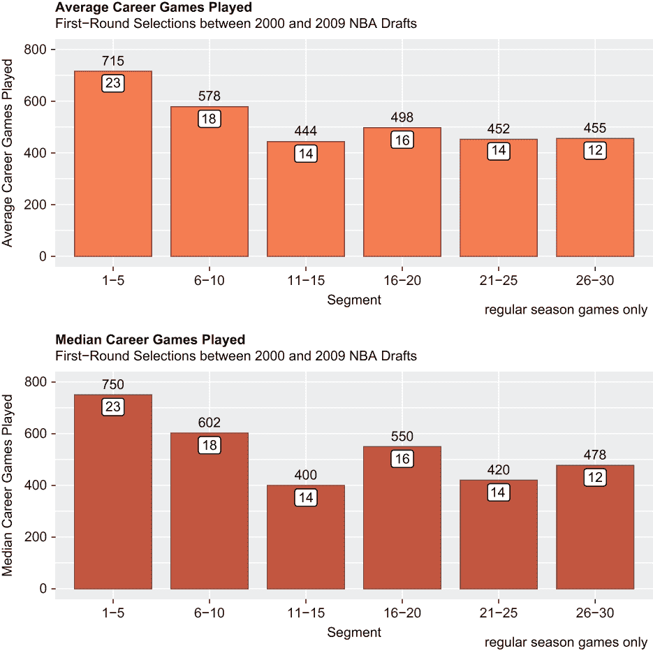
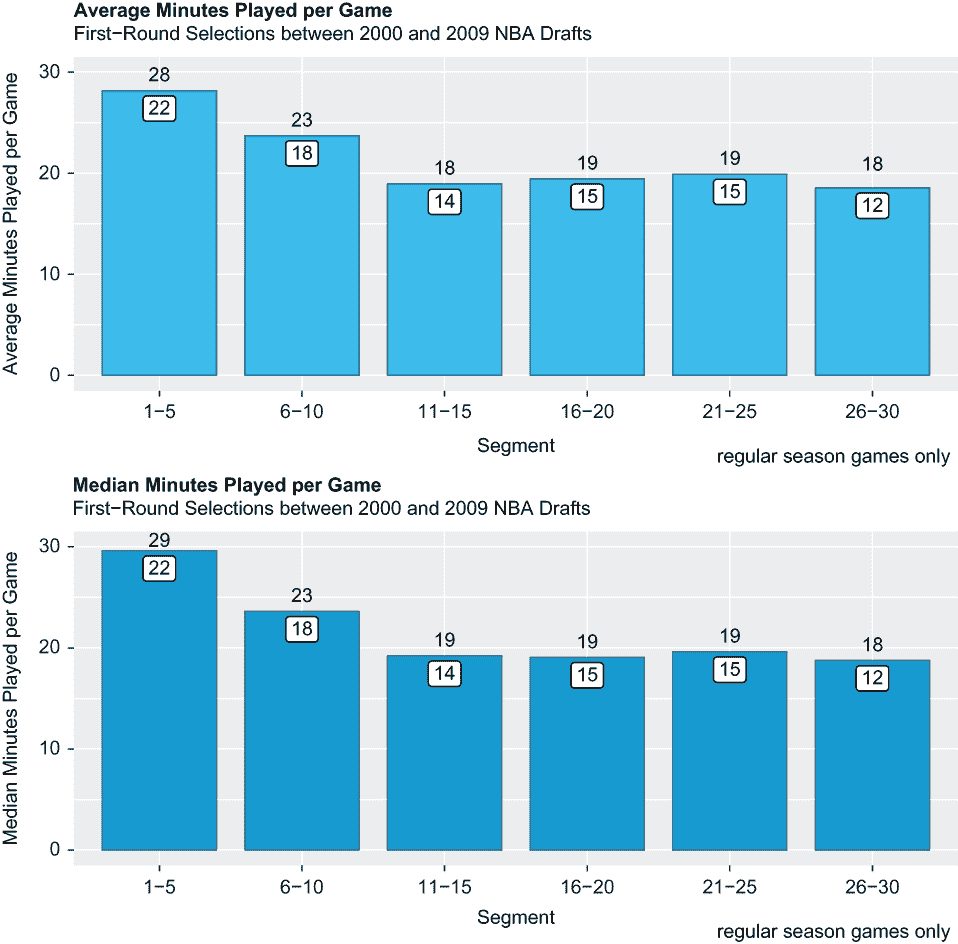
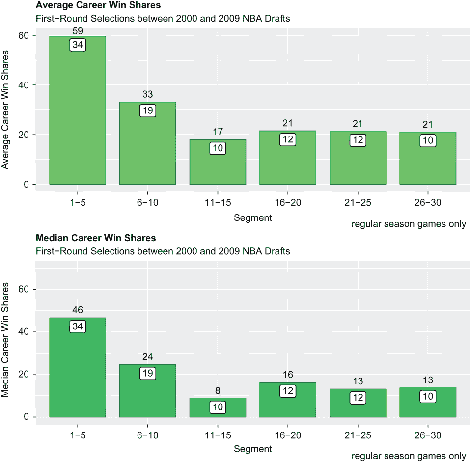
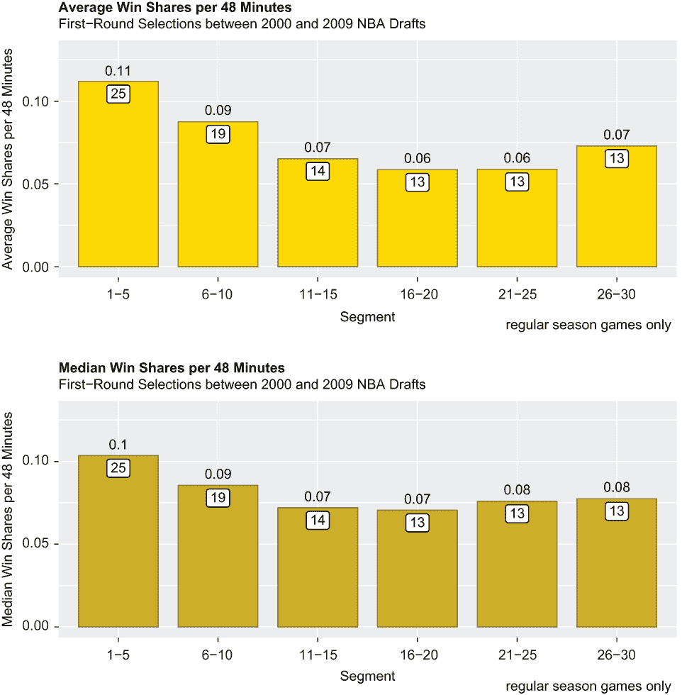
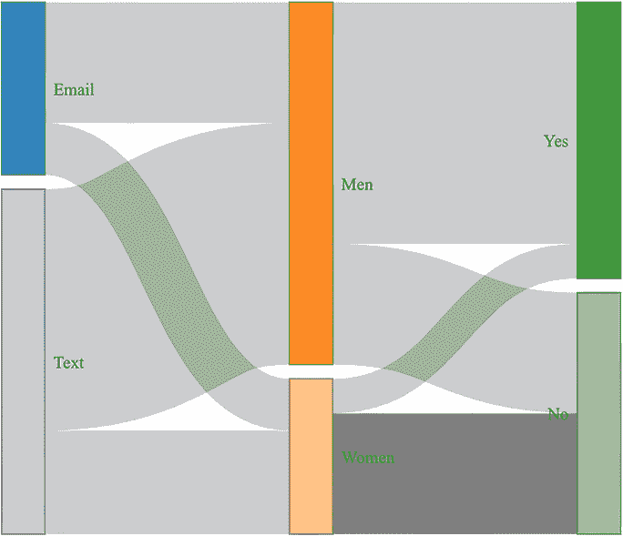
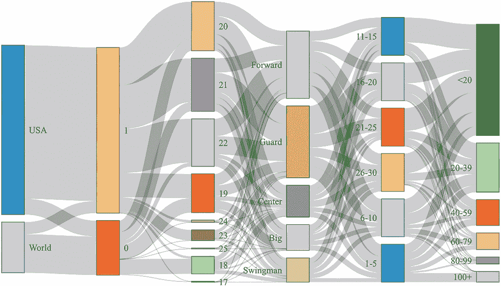
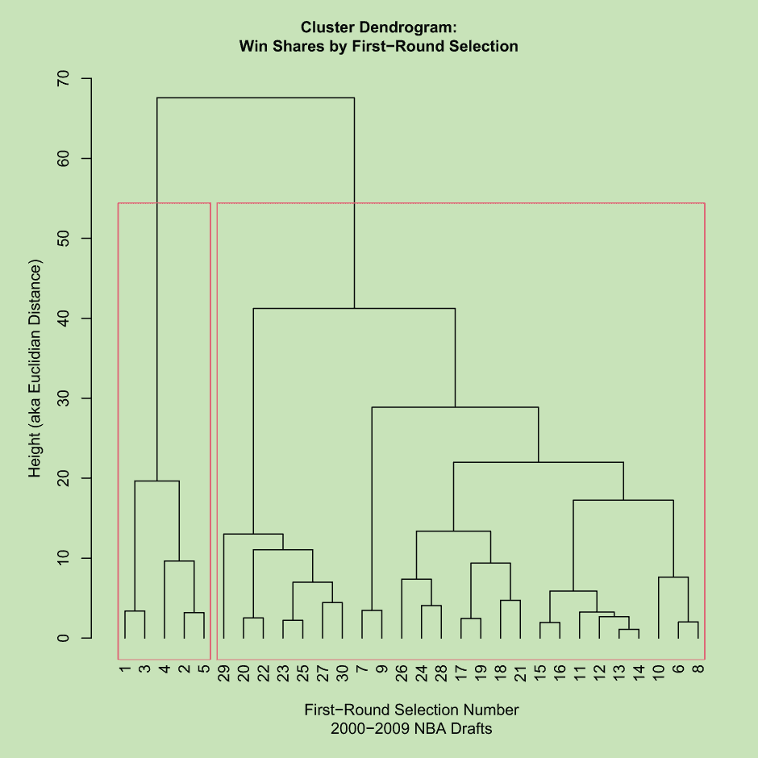

# 3 分段分析

本章涵盖了

+   使用 `c()` 和 `lapply()` 加载包

+   使用条形图可视化均值和中位数

+   创建桑基图

+   计算期望值

+   执行层次聚类

+   创建和理解树状图

在上一章中，我们介绍了几种方法，通过这些方法我们可以探索数据集，作为进行任何统计测试或执行专业分析的前提。毫无疑问，第二章分析的最显著发现是，总体而言，那些职业生涯最成功的球员在 NBA 选秀的第一轮中被选中，而那些职业生涯平庸，甚至更差的球员通常在第一轮后被选中——至少基于 2000 年至 2009 年的选秀。这一发现为球队提供了明显的动力，希望 somehow 能进入选秀榜的首位。

**摆烂**是指在某个赛季故意输掉比赛，以确保在下个赛季的选秀中能获得更高的选秀顺位。NBA 选秀，每年在赛季结束后举行，是各支球队轮流选择美国和海外最佳合格球员的地方。与其他美国职业体育的选秀一样，NBA 选秀与精英制正好相反；它是一个“最差选先”的系统，将“奖励”给胜场数最少的球队以在选秀中优先选择的机会，从而获得选择最佳球员的权利。

根据上一章的发现，本章的假设是，对于想要成为赢家的输球球队来说，摆烂是一种合理且值得的策略。我们打算通过分段我们的数据，然后对它展示不同的、逐步更技术性的分析技术来探索这个假设。分段分析是根据一个或多个共同特征对数据进行划分的过程——通常客户，但这也可能是 NBA 首轮选秀球员的情况。

球队选择摆烂是因为这似乎有效；超级巨星是赢得冠军的绝对要求，而超级巨星几乎总是选秀前五名的选择（尽管前五名的选择并不总是超级巨星）。因此，球队必须输掉比赢得更多的比赛——如果需要的话，故意这样做——才能在选秀中选中潜在的超级巨星。但让我们看看数据对此有何说法。

## 3.1 关于摆烂和选秀的更多内容

对于那些不太熟悉 NBA 的你们来说，专注于获取超级巨星人才以赢得冠军的球队通常遵循两种行动计划之一：通过选秀或通过老将自由市场。NBA 选秀的一个无意中但持续的后果是，当球队的重建计划围绕它时，球队往往会摆烂；也就是说，球队通过交易他们的最佳球员和提升板凳球员来故意输掉比赛，以换取通过每年选秀权的累积而可能获得的长期竞争优势，尤其是*高*选秀权。

1985 年，在休斯顿火箭队摆烂到选秀榜顶端并选中了联盟历史上最伟大的球员之一哈基姆·奥拉朱旺之后，NBA 为最差的球队推出了一个抽签。 (火箭队随后赢得了两座联赛冠军。) 抽签通过随机化选秀顺序和剥夺球队基于胜负的保证结果来减少摆烂——在这个过程中也保护了比赛的完整性。某种程度上。

NBA 选秀仍然是一个坏政府，因为最差的球队在下一个赛季之前被奖励，因为摆烂给球队带来了至少是合理的获得高选秀权的可能性，而成功几乎没有任何机会。以费城 76 人队为例：从 2013 年到 2016 年，在第一次抽签近 30 年后，76 人队通过摆烂接近了选秀榜的顶端，在这个过程中赢得了 47 场常规赛，但在选中乔尔·恩比德和其他人之后，减去因 COVID-19 缩短的 2019-20 赛季，平均每赛季赢得 51 场比赛。顺便说一句，每个 NBA 球队都有一场 82 场的常规赛赛程；所以一个平均球队每赛季会有 41 场胜利。

冠军是通过超级巨星人才赢得的，而这种人才只能在选秀榜的顶端或附近才能获得。除了之前的交易，保证获得超级巨星人才的唯一方式就是摆烂。

以下分析旨在排除任何合理的怀疑，确定摆烂是否得到数据的支持。为此分析，我们将使用 R 的出色图形功能，扩展 R 的功能范围以计算预期值，甚至创建一个无监督学习算法。

## 3.2 加载包

第一件事是调用 R 的基础`library()`函数来加载包，然后才能超越基础 R 功能；如果不调用最新或最好的包和函数，你就不在用 R 的最好功能。作为提醒，包必须在使用时和地点加载；因为我们有一个脚本和章节之间的一对一关系，一些包被多次加载。此外，必须在调用任何函数之前加载包，这就是为什么在编写或运行其他代码行之前加载包是一个好习惯。

在第二章中，我们使用了三个包中的两个，即 `tidyverse` 和 `patchwork`。（这两个包，尤其是 `tidyverse`，将在此后的工作中被广泛使用。）我们在这里加载的新包是 `networkD3` 包，它使得创建桑基图或流程图以及其他独特的可视化成为可能。我们将创建的桑基图是本章中两个不是用 `ggplot2` 图形包（它是 `tidyverse` 的一部分）创建的可视化之一。然后我们通过调用 `library()` 函数三次来依次加载这些包：

```
library(tidyverse)
library(networkD3)
library(patchwork)
```

顺便说一句，有一种方法可以同时加载多个包，而不是依次调用 `library()` 函数。第一步是创建一个包含包名的向量作为参数；接下来，我们通过调用基础 R 的 `c()` 函数并传递 `tidyverse`、`networkD3` 和 `patchwork` 作为参数来创建一个名为 packages 的向量——实际上，你可以将其命名为任何你想要的名称。注意，每个包都被引号包围：

```
packages <- c("tidyverse", "networkD3", "patchwork")
```

第二步和最后一步是调用基础 R 的 `lapply()` 函数：

```
lapply(packages, library, character.only = TRUE)
```

从现在开始，我们将继续调用 `library()` 函数，但如果你的脚本需要很多包，`c()` 和 `lapply()` 的组合是一个很好的替代方案。现在我们已经加载了包，我们可以自由地调用任何所需的函数来执行我们的分析。

## 3.3 导入和查看数据

显然，在我们可以做其他任何事情之前，我们需要导入数据。我们通过执行以下操作结束了第二章：

+   创建了一个名为 draft2 的 tibble，它是 draft 数据集的副本。复制操作是在 draft 被整理之后进行的，其中，例如，许多原始变量被删除，创建了派生变量，并且删除了缺失数据的观测值。

+   然后调用了基础 R 的 `write.csv()` 函数来创建并保存 draft2 为 .csv 文件。

`readr` 的 `read_csv()` 函数现在被用来导入 draft2 数据集。因为我们导入的是 draft2 而不是 draft，所以没有必要重复执行上一章中进行的那些数据整理操作：

```
draft <- read_csv("draft2.csv")
```

`dplyr` 的 `glimpse()` 函数返回 draft2 的转置版本，其中列名或变量名垂直排列，数据的一个子集水平排列。在导入数据集后，一个自然且虽小但重要的下一步是获取其维度以及对其内容的预览；`glimpse()` 做得非常好：

```
glimpse(draft2)
## Rows: 291
## Columns: 18
## $ Rk       <dbl> 1, 2, 3, 4, 5, 6, 7, 8, 9, 10, 11, 12, 13, 14,...
## $ Year     <dbl> 2009, 2009, 2009, 2009, 2009, 2009, 2009, 2009...
## $ Pk       <dbl> 1, 2, 3, 4, 5, 6, 7, 8, 9, 10, 11, 12, 13, 14,...
## $ Tm       <chr> "LAC", "MEM", "OKC", "SAC", "MIN", "MIN", "GSW...
## $ Player   <chr> "Blake Griffin", "Hasheem Thabeet", "James Har...
## $ Age      <dbl> 20.106, 22.135, 19.308, 19.284, 18.252, 20.144...
## $ Pos      <chr> "F", "C", "G", "G-F", "G", "G", "G", "C-F", "G...
## $ Born     <chr> "us", "tz", "us", "us", "es", "us", "us", "us"...
## $ College  <chr> "Oklahoma", "UConn", "Arizona State", "Memphis...
## $ From     <dbl> 2011, 2010, 2010, 2010, 2012, 2010, 2010, 2010...
## $ To       <dbl> 2020, 2014, 2020, 2019, 2020, 2012, 2020, 2017...
## $ G        <dbl> 622, 224, 826, 594, 555, 163, 699, 409, 813, 5...
## $ MP       <dbl> 34.8, 10.5, 34.3, 30.7, 30.9, 22.9, 34.3, 18.8...
## $ WS       <dbl> 75.2, 4.8, 133.3, 28.4, 36.4, -1.1, 103.2, 16....
## $ WS48     <dbl> 0.167, 0.099, 0.226, 0.075, 0.102, -0.015, 0.2...
## $ Born2    <chr> "USA", "World", "USA", "USA", "World", "USA", ...
## $ College2 <dbl> 1, 1, 1, 1, 0, 1, 1, 1, 1, 0, 1, 1, 1, 1, 1, 1...
## $ Pos2     <chr> "F", "C", "G", "G-F", "G", "G", "G", "C-F", "G...
```

基础 R 的 `dim()` 函数仅返回对象的维度；也就是说，行数后面跟着列数。它是一个很好的 `glimpse()` 的替代品，特别是如果你想将 `dim()` 与 `head()` 和 `tail()` 函数配对以获取未转置的数据视图：

```
dim(draft2)
## [1] 291  18
```

我们将首先创建另一个派生变量，这在第二章中根本不需要，但事实上将驱动本章的大部分分析。我们将继续创建那个变量。

## 3.4 创建另一个派生变量

现在我们已经窥视了我们的数据，我们可以继续准备我们的数据，以便进行我们在这里的原因：进行分割分析。在第二章中，`dplyr mutate()` 函数和基础 R 的 `ifelse()` 函数同时被调用，以创建随后附加到选秀数据集（因此包含在 draft2 中）的变量。这些相同的函数在一段代码中被调用（见以下讨论），其中创建了一个名为 `Pk2` 的新变量，并用与原始变量 `Pk` 逻辑上相关的属性填充。为了按分割评估我们的数据，我们首先需要推导出这些分割，因为它们本身并不存在。

变量 `Pk` 是指 *pick*；它是一个表示选择或第一轮选择编号的数值变量。例如，詹姆斯·哈登在 2009 年 NBA 选秀中被选为第三位球员；因此，当变量 `Player` 等于 `James Harden` 时，变量 `Pk` 等于 `3`。由于最多有 30 个首轮选择，`Pk` 的最小值为 `1`，最大值为 `30`。以下是我们对分割的分析——我们的分析将集中在这些六个 `Pk2` 分割上，而不是 30 个 `Pk` 属性上：

+   当原始变量等于 `1` 到 `5` 之间的任何数字时，派生的变量 `Pk2` 等于 `1-5`。R 中的 `%in%` 操作符用于确定一个元素（如数字）是否包含在向量或数据框中。如果是肯定的，则将 `Pk2` 分配值为 `1-5`；否则，读取并执行下一行代码，依此类推。

+   当 `Pk` 等于 `6` 到 `10` 之间的任何数字时，`Pk2` 等于 `6-10`。

+   当 `Pk` 等于 `11` 到 `15` 之间的任何数字时，`Pk2` 等于 `11-15`。

+   当 `Pk` 等于 `16` 到 `20` 之间的任何数字时，`Pk2` 等于 `16-20`。

+   当 `Pk` 等于 `21` 到 `25` 之间的任何数字时，`Pk2` 等于 `21-25`。

+   当 `Pk` 等于 `26` 到 `30` 之间的任何数字时，`Pk2` 等于 `26-30`。

+   如果原始变量 `Pk` 不等于 `1` 到 `30` 之间的任何数字，则新变量 `Pk2` 将等于 `NA`。

虽然默认情况下 `Pk2` 是一个字符字符串，但它实际上是一个分类变量。选秀数据集 draft2 中的所有 291 名球员或首轮选择，应根据他们确切的选择位置分配到这六个类别或分割中的一个：

```
mutate(draft2, Pk2 = ifelse(Pk %in% 1:5, "1-5",
                     ifelse(Pk %in% 6:10, "6-10",
                     ifelse(Pk %in% 11:15, "11-15",
                     ifelse(Pk %in% 16:20, "16-20",
                     ifelse(Pk %in% 21:25, "21-25",
                     ifelse(Pk %in% 26:30, "26-30", "NA"))))))) -> draft2
```

实际上，我们下一行代码通过调用基础 R 的 `as.factor()` 函数将 `Pk2` 转换为因子变量。同样，这是对只能假设有限或固定值集的变量的一种最佳实践：

```
draft2$Pk2 <- as.factor(draft2$Pk2)
```

我们后续的分析——我们将从计算基本统计量和创建数据的视觉表示开始——将完全集中在这些和其他分割上。

## 3.5 可视化均值和中位数

你找不到比平均值和中位数更基本的统计指标了。这些指标是观察数据之间一般差异的有用指标，因此代表了我们分段分析的逻辑起点。在 draft2 数据集中，连续变量的平均值和中位数将通过一系列条形图进行可视化，这些条形图按我们刚刚创建的六个 `Pk2` 段进行细分：

+   总常规赛比赛数

+   每场常规赛的分钟数

+   职业生涯胜利份额

+   每 48 分钟比赛时间的胜利份额（NBA 比赛以常规时间结束，持续时间为 48 分钟）

我们想查看在这些绩效和生产率指标中，我们的六个 `Pk2` 段之间是否存在差异（如果有的话）以及是否存在相似性（如果有的话）。随着我们进入本节的剩余部分，我们将逐一检查这些变量。

根据我们对 2000 年至 2009 年 NBA 选秀的分析，我们最终得出结论——尽管是初步的——基于胜利份额，那些职业生涯最成功的球员通常在第一轮被选中，比其他球员更高。我们还发现，`win shares` 变量与常规赛比赛数、每场常规赛的分钟数以及每 48 分钟比赛时间的胜利份额高度正相关。因此，如果我们看到 `1-5` 段与其他五个段之间有明显的分离，那么这可能是摆烂的统计依据——这正是我们打算明确确定的事情。

### 3.5.1 常规赛比赛数

总常规赛比赛数是衡量才能的一个合理指标。除了伤病之外，NBA 最优秀和最可靠的球员职业生涯更长，因此他们在常规赛中的出场次数比那些经常被年轻和更有潜力的球员取代的球员更多。

在下面的 `dplyr` 代码块中，我们调用 `summarize()` 函数，首先按变量 `Pk2` 中的每个因子或段计算常规赛比赛的均值和中位数。然后，使用前面的代码行，我们指示 `summarize()` 计算每个 `Pk2` 段的常规赛比赛数占所有 291 名球员在 draft2 数据集中比赛总数的百分比。结果是名为 tibble1 的新 6 × 4 tibble：

```
sumG <- sum(draft2$G)
draft2 %>% 
  group_by(Pk2) %>%
  summarize(mean = mean(G),
            median = median(G),
            pct = sum(G)/sumG) -> tibble1
print(tibble1)
## # A tibble: 6 × 4
##   Pk2    mean median   pct
##   <fct> <dbl>  <dbl> <dbl>
## 1 1-5    716\.   750\. 0.234
## 2 11-15  444\.   400  0.142
## 3 16-20  498\.   550  0.163
## 4 21-25  453\.   420  0.148
## 5 26-30  456\.   478  0.125
## 6 6-10   579\.   602\. 0.189
```

这些结果通过一对表示平均值和中位数的 `ggplot2` 条形图进行可视化：

+   将 `stat` 参数设置为 `"identity"` 并传递给 `geom_bar()` 函数，告诉 R 计算按 x 轴变量分组的 y 轴变量的总和，并以矩形条形图的形式显示每个 `Pk2` 段的结果。否则，`geom_bar()` 将仅返回 x 轴变量中每个唯一属性的出现次数。此外，我们还将条形的宽度缩小到 `ggplot2` 默认宽度的 80%。

+   调用`scale_x_discrete()`函数来在 x 轴上硬编码`Pk2`段的序列，从左到右。否则，`ggplot2`会将`Pk2`段`6-10`放在最后，仅仅是因为 6 是一个在 1 或 2 之后的数字。

+   调用`geom_text()`函数来添加标签——通过将均值和中位数传递给基础 R 的`trunc()`函数，这些度量被截断为最接近的整数，然后在条形上方添加截断后的均值和中位数版本。

+   调用`geom_label()`函数来添加`tibble1`变量`pct`——截断并乘以 100——在条形内部。由于这些和其他图表的注释已被截断，以下结果可能看起来“不正确”，但实际上，总数和百分比只是四舍五入到最接近的整数。

+   调用`ylim()`函数来延长 y 轴的长度，使其从 0 开始，到 800 结束；如果调用`geom_text()`或`geom_label()`函数在条形上方添加标签，这通常是出于美观原因。

```
g1 <- ggplot(tibble1, aes(x = Pk2, y = mean)) + 
  geom_bar(stat = "identity", width = .8, 
           fill = "coral", color = "coral4") + 
  labs(title = "Average Career Games Played",
       subtitle = "First-Round Selections between
       2000 and 2009 NBA Drafts", 
       x = "Segment", 
       y = "Average Career Games Played",
       caption = "regular season games only") + 
  scale_x_discrete(limits = c("1-5", "6-10", "11-15", 
                              "16-20", "21-25", "26-30"),
                   labels = c("1-5", "6-10", "11-15", 
                              "16-20", "21-25", "26-30")) +
  geom_text(aes(label = trunc(mean), vjust = -0.3)) +
  geom_label(aes(label = trunc(pct*100), vjust = 1.2)) +
  ylim(0, 800) +
  theme(plot.title = element_text(face = "bold"))

g2 <- ggplot(tibble1, aes(x = Pk2, y = median)) + 
  geom_bar(stat = "identity", width = .8, 
           fill = "coral3", color = "coral4") + 
  labs(title = "Median Career Games Played",
       subtitle = "First-Round Selections between
       2000 and 2009 NBA Drafts", 
       x = "Segment", 
       y = "Median Career Games Played",
       caption = "regular season games only") + 
  scale_x_discrete(limits = c("1-5", "6-10", "11-15", 
                              "16-20", "21-25", "26-30"),
                   labels = c("1-5", "6-10", "11-15", 
                              "16-20", "21-25", "26-30")) +
  geom_text(aes(label = trunc(median), vjust = -0.3)) +
  geom_label(aes(label = trunc(pct*100), vjust = 1.2)) +
  ylim(0, 800) +
  theme(plot.title = element_text(face = "bold"))
```

随后调用`plot_layout()`函数从`patchwork`包将这两个可视化，`g1`和`g2`，捆绑成一个单一的图形对象，其中第一个可视化位于第二个之上（见图 3.1）。如果传递给`plot_layout()`的`ncol`参数等于`2`，这两个可视化将并排打印，而不是`g1`堆叠在`g2`之上：

```
g1 + g2 + plot_layout(ncol = 1)
```



图 3.1 第一轮段均值和中位数游戏，附加在条形上方。条形内部的白色框标签表示总游戏数的百分比。

可视化数据比阅读一排排数字更容易、更快速地解读。以下是我们从第一对条形图中得出的结论：

+   在`1-5`段内选出的球员在常规赛中比赛次数多于其他任何一组首轮选择。实际上，尽管这些球员大约代表了 17%的选秀记录，但他们共同参加了超过 23%的常规赛。

+   在`6-10`段内选出的球员在常规赛中比赛次数多于第一轮后期选出的球员。他们同样大约代表了 17%的选秀记录，但不少于 18%的总常规赛比赛。

+   因此，在选秀 2 中，大约 34%的首轮选择占到了总常规赛比赛数的 41%以上。

+   在其他任何段位中，常规赛比赛的比例都没有超过或等于它们各自在选秀 2 记录中的比例；换句话说，`11-15`、`16-20`、`21-25`和`26-30`这四个段位各自向选秀 2 数据集贡献了大约 17%的记录，然而这四个段位在常规赛中的总比赛比例始终低于 17%。这绝对支持了我们的假设——那些摆烂并因此提升选秀板位的球队更有可能选秀到一名将比其他球员参加更多比赛的球员。

### 3.5.2 每场比赛的出场时间

每场常规赛的出场时间可能实际上比比赛次数更有说明力；毕竟，许多球员由于健康和可靠性而拥有漫长的职业生涯，但并不一定在过程中获得大量的出场时间。话虽如此，我们的下一步行动基本上是重复我们刚刚完成的练习，但以下是一些变化：

+   将每场常规赛的出场时间变量插入到类似的`dplyr`和`ggplot2`代码块中，以代替常规赛的比赛。

+   我们随后的`dplyr`代码块产生了一个新的对象`tibble2`，然后将其传递给`ggplot()`函数。

+   然后我们向`geom_bar()`函数传递不同的填充和颜色。

+   由于变量交换，图表标题和 y 轴标签，即传递给`labs()`函数的两个参数，被更改了。

+   根据变量变化相应地调整 y 轴的比例，这也是由于变量变化。

否则，我们正在创建额外的成对`ggplot2`条形图，其中平均值显示在顶部，中位数显示在底部，当然，按我们的六个`Pk2`段位细分（见图 3.2）：

```
sumMP <- sum(draft2$MP)
draft2 %>% 
  group_by(Pk2) %>%
  summarize(mean = mean(MP),
            median = median(MP),
            pct = sum(MP)/sumMP) -> tibble2

mp1 <- ggplot(tibble2, aes(x = Pk2, y = mean)) + 
  geom_bar(stat = "identity", width = .8, 
           fill = "deepskyblue", color = "deepskyblue4") + 
  labs(title = "Average Minutes Played per Game",
       subtitle = "First-Round Selections between 
       2000 and 2009 NBA Drafts", 
       x = "Segment", 
       y = "Average Minutes Played per Game",
       caption = "regular season games only") + 
  scale_x_discrete(limits = c("1-5", "6-10", "11-15", 
                              "16-20", "21-25", "26-30"),
                   labels = c("1-5", "6-10", "11-15", 
                              "16-20", "21-25", "26-30")) +
  geom_text(aes(label = trunc(mean), vjust = -0.3)) +
  geom_label(aes(label = trunc(pct*100), vjust = 1.2)) +
  ylim(0, 30) +
  theme(plot.title = element_text(face = "bold"))

mp2 <- ggplot(tibble2, aes(x = Pk2, y = median)) + 
  geom_bar(stat = "identity", width = .8, 
           fill = "deepskyblue3", color = "deepskyblue4") + 
  labs(title = "Median Minutes Played per Game",
       subtitle = "First-Round Selections between 
       2000 and 2009 NBA Drafts", 
       x = "Segment", 
       y = "Median Minutes Played per Game",
       caption = "regular season games only") + 
  scale_x_discrete(limits = c("1-5", "6-10", "11-15", 
                              "16-20", "21-25", "26-30"),
                   labels = c("1-5", "6-10", "11-15", 
                              "16-20", "21-25", "26-30")) +
  geom_text(aes(label = trunc(median), vjust = -0.3)) +
  geom_label(aes(label = trunc(pct*100), vjust = 1.2)) +
  ylim(0, 30) +
  theme(plot.title = element_text(face = "bold"))

mp1 + mp2 + plot_layout(ncol = 1)
```



图 3.2 第一轮段位每场比赛平均和中值出场时间

这些结果与我们的第一组结果相似，但同时又更加明确。它们在这里为您总结：

+   在`1-5`段被选中的球员，平均每场比赛比`6-10`段的球员多出约 18%的出场时间，比其他四个段的球员多出约 33%的出场时间。

+   `1-5`段和`6-10`段之间存在明显的差异，而`6-10`段与其他所有段之间也存在进一步的差异。

+   在`11-15`、`16-20`、`21-25`和`26-30`段位之间几乎没有差异。

所有这些进一步支持我们的假设，即摆烂是有意义的——如果这是球队在`1-5`段或甚至`6-10`段选择，而不是第一轮其他任何地方的话。现在让我们来看看胜利份额。

### 3.5.3 职业胜利份额

如第二章所述，赢分基本上是将每位球员的进攻和防守统计数据汇总成一个单一指标。否则，它等于每位球员对其球队总赢分的整体贡献或份额。为了更清楚地说明，在其职业生涯中累积至少 50 个赢分的球员，大多数情况下是多年的全职首发；累积 75 到 100 个职业生涯赢分的球员通常是频繁的全明星球员；而累积超过 100 个职业生涯赢分的球员无疑是名人堂材料。另一方面，赢分在 25 个或更少的球员通常是替补、边缘球员，有时甚至更糟。

卡里姆·阿卜杜尔-贾巴尔，被密尔沃基雄鹿队选中，但后来在洛杉矶湖人队度过了大部分职业生涯，曾在一个赛季中累积了创纪录的 25.4 个赢分，他的 273.4 个职业生涯赢分仍然是历史记录。仍在比赛的勒布朗·詹姆斯并不落后。

以下代码块与我们的先前`dplyr`和`ggplot2`代码块类似，除了我们用赢分替换了它们。对`geom_bar()`、`labs()`和`ylim()`函数的相应更改也适用：

```
sumWS <- sum(draft2$WS)
draft2 %>% 
  group_by(Pk2) %>%
  summarize(mean = mean(WS),
            median = median(WS),
            pct = sum(WS)/sumWS) -> tibble3

ws1 <- ggplot(tibble3, aes(x = Pk2, y = mean)) + 
  geom_bar(stat = "identity", width = .8, 
           fill = "springgreen", color = "springgreen4") + 
  labs(title = "Average Career Win Shares",
       subtitle = "First-Round Selections between 
       2000 and 2009 NBA Drafts", 
       x = "Segment", 
       y = "Average Career Win Shares",
       caption = "regular season games only") + 
  scale_x_discrete(limits = c("1-5", "6-10", "11-15", 
                              "16-20", "21-25", "26-30"),
                   labels = c("1-5", "6-10", "11-15", 
                              "16-20", "21-25", "26-30")) +
  geom_text(aes(label = trunc(mean), vjust = -0.3)) +
  geom_label(aes(label = trunc(pct*100), vjust = 1.2)) +
  ylim(0, 60) +
  theme(plot.title = element_text(face = "bold"))

ws2 <- ggplot(tibble3, aes(x = Pk2, y = median)) + 
  geom_bar(stat = "identity", width = .8, 
           fill = "springgreen3", color = "springgreen4") + 
  labs(title = "Median Career Win Shares",
       subtitle = "First-Round Selections between 
       2000 and 2009 NBA Drafts", 
       x = "Segment", y = "Median Career Win Shares",
       caption = "regular season games only") + 
  scale_x_discrete(limits = c("1-5", "6-10", "11-15", 
                              "16-20", "21-25", "26-30"),
                   labels = c("1-5", "6-10", "11-15", 
                              "16-20", "21-25", "26-30")) +
  geom_text(aes(label = trunc(median), vjust = -0.3)) +
  geom_label(aes(label = trunc(pct*100), vjust = 1.2)) +
  ylim(0, 70) +
  theme(plot.title = element_text(face = "bold"))
```

第三次，我们的最终目标是两个`ggplot2`条形图，它们被压缩在一个图形表示中，显示了每个`Pk2`段位的计算平均值，位于顶部，以及每个`Pk2`段位的计算中位数，位于底部（见图 3.3）：

```
ws1 + ws2 + plot_layout(ncol = 1)
```



图 3.3 第一轮段位的平均和中位职业生涯赢分

哇，段位之间的差距——`1-5`与`6-10`，以及`6-10`与其他四个段位之间的差距——甚至比我们之前看到的更加明显。更具体地说，考虑以下：

+   在`1-5`段位的球员，平均而言，累积的职业生涯赢分是`6-10`段位球员的两倍，是其他任何段位球员的三倍左右。

+   这些相同的球员——再次，占选秀 2 人口的 17%——占所有赢分的 34%，而排名前两段的球员，大约占选秀 2 人口的 34%，占所有赢分的至少 53%。

+   虽然在选秀的前端存在显著差异，但在`11-15`到`26-30`段位之间几乎没有差异。

+   这是我们迄今为止最好的证据，证明我们的初始假设是正确的；在最重要的指标上，我们看到了顶级段位与其他段位之间最大的差异。

最后，让我们来检查我们的第二个赢分变量，`WS48`。这个变量代表每 48 分钟常规赛比赛时间的累积赢分。

### 3.5.4 每 48 分钟的赢分

下面的`dplyr`代码计算了每个`Pk2`段位的变量`WS48`的平均值和中位数，以及用于可视化的`ggplot2`代码：

```
sumWS48 <- sum(draft2$WS48)
draft2 %>% 
  group_by(Pk2) %>%
  summarize(mean = mean(WS48),
            median = median(WS48),
            pct = sum(WS48)/sumWS48) -> tibble4

ws3 <- ggplot(tibble4, aes(x = Pk2, y = mean)) + 
  geom_bar(stat = "identity", width = .8, 
           fill = "gold", color = "gold4") + 
  labs(title = "Average Win Shares per 48 Minutes",
       subtitle = "First-Round Selections between 
       2000 and 2009 NBA Drafts", 
       x = "Segment", 
       y = "Average Win Shares per 48 Minutes",
       caption = "regular season games only") + 
  scale_x_discrete(limits = c("1-5", "6-10", "11-15", 
                              "16-20", "21-25", "26-30"),
                   labels = c("1-5", "6-10", "11-15",
                              "16-20", "21-25", "26-30")) +
  geom_text(aes(label = round(mean, 2), vjust = -0.3)) +
  geom_label(aes(label = trunc(pct*100), vjust = 1.2)) +
  ylim(0, 0.13) +
  theme(plot.title = element_text(face = "bold"))

ws4 <- ggplot(tibble4, aes(x = Pk2, y = median)) + 
  geom_bar(stat = "identity", width = .8, 
           fill = "gold3", color = "gold4") + 
  labs(title = "Median Win Shares per 48 Minutes",
       subtitle = "First-Round Selections between 
       2000 and 2009 NBA Drafts", 
       x = "Segment", y = "Median Win Shares per 48 Minutes",
       caption = "regular season games only") + 
  scale_x_discrete(limits = c("1-5", "6-10", "11-15", 
                              "16-20", "21-25", "26-30"),
                   labels = c("1-5", "6-10", "11-15", 
                              "16-20", "21-25", "26-30")) +
  geom_text(aes(label = round(median, 2), vjust = -0.3)) +
  geom_label(aes(label = trunc(pct*100), vjust = 1.2)) +
  ylim(0, 0.13) +
  theme(plot.title = element_text(face = "bold"))

ws3 + ws4 + plot_layout(ncol = 1)
```

紧接着是第四对和最后一对条形图——当然，这是不同的指标，但布局大致相同，结果也差不多（见图 3.4）。



图 3.4 第一轮各段每 48 分钟的平均和中位胜分

由于每 48 分钟比赛时间的胜分与其他指标相比显著降低，因此顶尖和底部段之间的差异可能看起来不那么明显，但它们与我们之前的结果非常相似。以下是我们为您总结的发现：

+   `1-5`段的球员在每 48 分钟比赛时间的胜分比`6-10`段的球员多近 20%，比其他段的球员多近 40%。

+   换句话说，`6-10`段与剩余四个段之间，每 48 分钟比赛时间的胜分差异超过 20%。

+   与其他指标一样，`1-5`段和`6-10`段之间存在明显的差异，而`6-10`段与剩余段之间也有进一步的差异。

+   在`11-15`到`26-30`段之间，性能和生产力是随机的。这是我们的假设正确的进一步证据：摆烂绝对是合理的，特别是对于意图通过选秀重建阵容的球队来说……如果故意输球能够让他们提升到足以选择`1-5`段或最坏的情况是`6-10`段的球员。

现在我们已经计算并可视化了最重要的选秀 2 变量的平均值和众数——在这个过程中，我们展示了选秀顶端与其他第一轮之间的明显差异——我们接下来应该记录我们到目前为止最重要的发现。

## 3.6 初步结论

那么，我们到目前为止都确定了什么？有什么影响？以及我们还有什么没有确定的？

+   无论从哪个角度衡量，`1-5`段选出的球员与`6-10`段选出的球员在性能和生产力上都有明显的差异，而`6-10`段与`11-15`段选出的球员之间也有进一步的差异。

+   在第一轮的`11-15`段以及之后的比赛中，几乎没有任何性能或生产力的差异，无论从哪个角度来衡量。

+   因此，对于想要——*或者需要*——选择潜在超级巨星的球队来说，有一个明确的激励让他们设法达到选秀榜的顶端或非常接近顶端。如果球队想要——*或者需要*——选择一个潜在超级巨星，那么在选秀榜上选择或在接近顶端的位置选择无疑是最好的。

+   但如何达到这个目标呢？向上交易几乎是不可能的，因为这当然需要另一支球队向下交易。只要 NBA 继续奖励输球队伍以高选秀权，球队就会——*并且应该*——摆烂，这当然会损害比赛的完整性。

+   最后，我们需要避免得出超出我们分析范围的泛泛结论。20 世纪 70 年代也有球队摆烂；他们可能这么做是因为他们想增加选中潜在超级巨星的几率。但我们无法合理化这一点。我们只能说，根据对 2000 年至 2009 年 NBA 选秀以及那些在首轮被选中的球员随后职业生涯的分析，摆烂是有道理的。永远不要将结果应用于测试和分析范围之外的情况。

说到这里，请记住，在 draft2 数据集中，拥有 100 多场胜利贡献值的球员中，除了两个球员外，所有球员在进入 NBA 选秀时都是前五顺位的选择；只有托尼·帕克，2001 年被圣安东尼奥以第 28 顺位选中，以及斯蒂芬·库里，2009 年被金州勇士以第七顺位选中，他们的选秀顺位不在前五，并且拥有超过 100 场胜利贡献值。NBA 冠军球队通常至少有两名前五顺位的选择（自 2000 年以来，只有两个联盟冠军只有一名前五顺位的选择，而且从那时起没有一支冠军球队没有前五顺位的选择）；然而，前五顺位的选择并不一定能保证赢得冠军。在我们数据集中的 50 名前五顺位的选择中，只有 11 名后来赢得了联盟冠军。

## 3.7 桑基图

我们接下来的技术是尝试将我们的结果整合成一个单一的图形对象。桑基图是一种流程图，其中一对节点之间的连接器或链接的宽度与数量成比例。创建一个桑基图特别繁琐——正如你即将发现的那样——但回报绝对值得投资。桑基图不仅看起来令人印象深刻，而且还能提供揭示性和可操作的见解。你可能对桑基图并不那么熟悉，但你应该熟悉，因为它们有大量的应用场景。例如，考虑以下：

+   人力资源领导者分析他们公司从端到端的就业申请流程，从功能组织和工作需求开始；然后包括简历和申请的接收渠道，包括职位发布板、招聘公司和内部推荐；最后，对每个候选人的状态进行分解。他们可能会决定在吸引最多或最佳候选人的两个职位发布板上发布新的机会。

+   非营利组织的管理者跟踪他们组织的收入来源，包括捐赠、补助金和会员费；资本和运营费用；以及用于教育、科学、宗教和文学目的的奖项的货币价值。管理者可能会决定提高会员费，寻求更多针对科学追求的补助金，或者寻找更便宜的办公空间。

+   一位没有机器学习背景的市场经理，通过细分客户的学历、职业类型和婚姻状况，绘制了针对直接营销活动的肯定/否定响应图。最后成对的节点——客户是否对活动做出响应——相当于机器学习模型中的目标或响应变量。经理可能会通过针对具有特定人口统计特征的客户来修改营销活动，而忽略其他具有其他特征的客户。

图 3.5 显示了一个相对简单的桑基图，仅用于说明。我们有一个虚构的 NBA 球队试图出售下一场主场比赛的最后几张剩余门票。球队向其啦啦队中的男性和女性发送营销电子邮件或短信。记录在案的移动电话号码比电子邮件地址多得多；此外，啦啦队中的男性比女性多得多。然后，大多数男性购买了一张或多张门票，而大多数女性则放弃。



图 3.5 仅用于说明目的的桑基图样本。垂直的长方形是节点，连接一对节点的带状物是链接。链接的宽度是数量的表示。在这个例子中，发送的短信比电子邮件多，收到某种类型数字通信的男性比女性多，然后大多数男性做出肯定回应，而大多数女性则没有。

我们接下来的代码块生成一个桑基图，从左到右的节点分组源自这些派生变量：

+   `Born2`—在第二章中创建的二进制变量，等于`USA`或`World`。

+   `College2`—在第二章中创建的另一个二进制变量，分别对应“无大学”和“大学”时等于`0`或`1`。

+   `Age2`—一个新变量（在以下列表中讨论），原始变量`Age`被截断为整数。在 draft2 数据集中，每位球员在成为职业球员时年龄在 17 到 25 岁之间。

+   `Pos2`—在第二章中创建的变量，将原始变量`Pos`中的球员位置合并并拼写出来；此变量等于`Big`、`Center`、`Forward`、`Guard`或`Swingman`。

+   `Pk2`—从原始变量`Pk`派生出的变量，等于`1-5`、`6-10`、`11-15`、`16-20`、`21-25`或`26-30`。

+   `WS3`—一个新变量（在以下列表中讨论），原始变量`WS`（简称*win shares*）被截断为整数，然后分配到六个类别或细分市场之一。

我们的第一项任务是创建变量`Age2`，然后是`WS3`。关于`Age2`，我们将`draft2`数据集传递给`dplyr`的`mutate()`函数，并将`Age2`赋值为原始变量`Age`的截断版本。对于`WS3`，我们首先调用`mutate()`创建一个名为`WS2`的变量，它是原始变量`WS`的截断版本；然后我们将`WS2`通过管道传递到`mutate()`和`case_when()`函数（`case_when()`是基础 R 的`ifelse()`函数的`dplyr`等价物）来创建`WS3`，它是`WS2`分成六个部分。例如，如果`WS2`等于`47`，那么`WS3`应该等于`40-59`。创建`Age2`和`WS3`的净效果是减少桑基图中的节点和链接数量，从而减少我们需要编写的代码量：

```
draft2 %>%
  mutate(Age2 = trunc(Age)) -> draft2

draft2 %>%
  mutate(draft2, WS2 = trunc(WS)) %>%
  mutate(WS3 = case_when(WS2 <= 19 ~ "<20",
                            WS2 >= 20 & WS2 <= 39 ~ "20-39",
                            WS2 >= 40 & WS2 <= 59 ~ "40-59",
                            WS2 >= 60 & WS2 <= 79 ~ "60-79",
                            WS2 >= 80 & WS2 <= 99 ~ "80-99",
                            WS2 >= 100 ~ "100+")) -> draft2
```

我们的第二项任务是创建节点。变量和节点分组之间应该存在一对一的关系，这意味着我们的桑基图将包含六个节点分组。此外，六个变量之间的唯一属性和节点总数之间也应该存在一对一的关系。例如，`Born2`和`College2`都是二元变量，因此这两个节点分组各自应包含两个节点。实际上，我们的桑基图将包含 30 个节点。接下来的代码块通过组合基础 R 的`data.frame()`和`c()`函数创建了一个单向量数据框，称为`nodes`：

```
nodes <- data.frame(
"name" = c("USA", "World",
                "0", "1",
                "17", "18", "19", "20", "21", "22", "23", "24", "25",
                "Big",  "Center", "Forward", "Guard",  "Swingman",
                "1-5",  "6-10", "11-15", "16-20", "21-25", "26-30",
                "<20", "20-39", "40-59", "60-79", "80-99", "100+"))
```

我们的第三项任务是创建另一个数据框，称为`links`。链接数据框中的每一组三个数字代表连接两个节点的链接，其中序列中的第一个数字是连接的节点（源），第二个数字表示连接到的节点（目标），第三个数字表示它们之间流动的值或数量（值）：

```
links <- as.data.frame(matrix(c(
  0,2,21, 0,3,203,
  1,2,51, 1,3,16,
  2,4,1, 2,5,20, 2,6,19, 2,7,15, 2,8,12, 2,9,5, 2,10,0, 2,11,0, 2,12,0,
  3,4,0, 3,5,3, 3,6,32, 3,7,50, 3,8,58, 3,9,58, 3,10,14, 3,11,3, 3,12,1,
  4,13,0, 4,14,0, 4,15,1, 4,16,0, 4,17,0,
  5,13,2, 5,14,8, 5,15,6, 5,16,2, 5,17,5,
  6,13,11, 6,14,6, 6,15,15, 6,16,14, 6,17,5,
  7,13,7, 7,14,12, 7,15,19, 7,16,24, 7,17,3,
  8,13,9, 8,14,7, 8,15,19, 8,16,25, 8,17,10,
  9,13,5, 9,14,5, 9,15,23, 9,16,24, 9,17,6,
  10,13,0, 10,14,1, 10,15,4, 10,16,6, 10,17,3,
  11,13,0, 11,14,1, 11,15,2, 11,16,0, 11,17,0,
  12,13,0, 12,14,1, 12,15,0, 12,16,0, 12,17,0, 
  13,18,7, 13,19,6, 13,20,8, 13,21,3, 13,22,2, 13,23,8,
  14,18,7, 14,19,6, 14,20,7, 14,21,7, 14,22,6, 14,23,9,
  15,18,16, 15,19,18, 15,20,13, 15,21,13, 15,22,13, 15,23,15,
  16,18,15, 16,19,13, 16,20,15, 16,21,22, 16,22,18, 16,23,12,
  17,18,5, 17,19,6, 17,20,7, 17,21,5, 17,22,3, 17,23,6,
  18,24,12, 18,25,9, 18,26,9, 18,27,6, 18,28,2, 18,29,12,
  19,24,19, 19,25,15, 19,26,5, 19,27,7, 19,28,3, 19,29,1,
  20,24,33, 20,25,9, 20,26,3, 20,27,3, 20,28,1, 20,29,0,
  21,24,27, 21,25,12, 21,26,8, 21,27,1, 21,28,2, 21,29,0,
  22,24,30, 22,25,10, 22,26,7, 22,27,2, 22,28,1, 22,29,0,
  23,24,26, 23,25,10, 23,26,2, 23,27,3, 23,28,0, 23,29,1),
  byrow = TRUE, ncol = 3))
names(links) = c("source", "target", "value")
```

我们第四和最后一项任务是调用`networkD3`包中的`sankeyNetwork()`函数来绘制桑基图（参见图 3.6）。传递给`sankeyNetwork()`函数的参数是强制性的且固定的：

```
sankeyNetwork(Links = links, Nodes = nodes,
                Source = "source", Target = "target",
                Value = "value", NodeID = "name",
                fontSize = 12, nodeWidth = 30)  
```



图 3.6 显示相邻节点集之间流动或数量的桑基图。从左到右看，2000 年至 2009 年 NBA 选秀第一轮被选中的大多数球员出生在美国（USA）而不是其他国家（世界）。选择大学或学院（1）的球员比没有选择（0）的球员多。大多数球员在 19 至 22 岁时进入 NBA 选秀。被选为前锋和后卫的球员比其他位置的球员多。球员被分配到六个相等的“选择”段，这取决于他们在第一轮被选中的位置。所有球员都积累了一定数量的胜利份额；只有一小部分首轮选秀球员积累了大量胜利份额，而且大多数都是在`1-5`段被选中的。

桑基图在 RStudio 中是交互式的。当你将光标移至一个节点上时，R 会突出显示节点之间的链接，并产生一个小弹出窗口，提供节点名称和从该节点流出的流量量。当你将光标移至链接上时，R 会突出显示它，并产生一个弹出窗口，标识连接的节点以及它们之间的流量量。

以下`dplyr`代码返回之前提供给链接数据框的数字或值。`draft2`数据集被`count()`函数管道五次，该函数计算`draft2`观察值在相邻节点分组之间的每个组合中的数量：

```
draft2 %>%
  count(Born2, College2)
draft2 %>%
  count(College2, Age2)
draft2 %>%
  count(Age2, Pos2)
draft2 %>%
  count(Pos2, Pk2)
draft2 %>%
  count(Pk2, WS3)
```

由于空间考虑，结果在此未重复，但它们当然反映在我们桑基图的构建中。

你现在可能明白了为什么桑基图并不那么普遍。想象一下，如果还有更多的节点。然而，这张图表有效地可视化了我们导出的变量的定量分解以及它们之间的关系。桑基图之所以有效，是因为这里描绘的“过程”是序列的或线性的。例如，我们可以轻松地看到以下内容：

+   在 2000 年至 2009 年的 NBA 选秀中，首轮选秀球员中出生在美国的人数是其他国家的四倍左右。

+   大多数在美国出生的首轮选秀球员在转为职业球员之前都曾在大学里打球，而大多数在美国以外出生的首轮选秀球员则没有在大学里打球。

+   更多首轮选秀球员，无论他们出生在哪里以及他们是否在大学里首次亮相，当他们进入 NBA 选秀时，年龄都在 19 到 22 岁之间。当他们转为职业球员时，很少有球员年龄小于 19 岁或大于 22 岁。

+   首轮选秀中，前锋和后卫比其他位置的球员更多。

+   在各自的职业生涯中拥有 100 次或更多胜场的球员大多数都是在选秀的非常顶端或附近被选中的。

+   职业胜场数在 80 到 99 之间的球员大多数是在`1-5`和`6-10` `Pk2`段之间被选中的。

+   职业胜场数少于 20 次的球员来自所有`Pk2`段，但其中大多数球员是在`11-15`和`26-30` `Pk2`段之间被选中的。

在`1-5`或`6-10`段被选中的球员，尤其是`1-5`段的球员，在职业胜场数的六个段中大致平均分配，但之后被选中的球员，从`11-15`段开始，更有可能在他们的职业生涯中获得少于 20 次胜场。在决定是否摆烂时，球队应考虑我们首次分段分析的结果，但他们也应记住最佳可用球员的人口统计和其他属性。

## 3.8 预期值分析

到目前为止，我们的分析清楚地表明，NBA 球队应该对前五名选秀权和任何其他首轮选秀权有非常不同的期望。让我们通过计算 2000 年至 2009 年 NBA 选秀的结果来计算前五名选秀权的预期值，与任何其他首轮选秀权的预期值进行比较。*预期值*是通过将可能结果乘以其概率然后汇总这些结果来计算的；它是一系列简单的数学计算，当结果不确定时进行计算，但我们仍然可以根据每个可能性的加权平均得到一个可能的价值。预期值是一种在金融和风险分析中最普遍的技术，但它也适用于许多其他领域和事业。以下是关于预期值的一些具体信息：

+   预期值代表可以预期的平均价值或回报，通常来自特定的决策或行动，当有多种可能结果时。

+   预期值是通过将每个可能结果乘以其发生的概率然后汇总这些乘积来计算的。因此，预期值 = (结果[1] × 概率[1]) + (结果[2] × 概率[2]) + ... + (结果[N] × 概率[N])。项数必须等于潜在结果的数量。

+   当必须做出决策，而外部环境不确定且可能具有风险时，预期值是一种常见的分析技术。应该考虑具有最高预期值的选项为最佳选择。

+   虽然可能不言而喻，但必须事先知道结果和概率，或者，作为替代，可以从历史数据中准确估计。

根据每个球员在首轮选秀中的位置（`1-5`或`6-30`），将 draft2 数据集划分为两个群体，然后根据每个球员赢得或已赢得的胜场数再次划分（一些球员仍在活跃中）。为了这次练习，以下指定被使用：

+   职业胜场数达到 100 或以上的球员被指定为**超级巨星**。

+   职业胜场数在 75 到 100 之间的球员是**明星球员**。

+   职业胜场数在 50 到 75 之间的球员被指定为**首发球员**。

+   职业胜场数在 25 到 50 之间的球员被指定为**预备球员**。

+   职业胜场数少于 25 的球员被指定为**边缘球员**。

现在，看看表 3.1 和表 3.2。它们结构相同（意味着它们有相同的列和行），但表 3.1 是针对`1-5`段的，而表 3.2 是针对`6-30`段的。

表 3.1 NBA 选秀中`1-5`段的预期值

| 段（A） | 胜场数（B） | 概率（C） | 中位数（D） | 预期值（E） |
| --- | --- | --- | --- | --- |
| 超级巨星 | > 100 | 0.24 | 127.00 | 30.48 |
| 星级 | 75-99.99 | 0.08 | 79.65 | 6.37 |
| 首发球员 | 50-74.99 | 0.16 | 59.90 | 9.58 |
| 预订 | 25-49.99 | 0.20 | 39.95 | 7.99 |
| 边缘球员 | < 25 | 0.32 | 9.70 | 3.10 |
|  |  | 1.00 |  | 57.53¹ |

表 3.2 从 `11-15` 到 `26-30` 段的 NBA 招募挑选期望值

| 段落（A） | 胜利份额（B） | 概率（C） | 中间值（D） | 期望值（E） |
| --- | --- | --- | --- | --- |
| 超级巨星 | > 100 | 0.01 | 107.25 | 1.07 |
| 明星 | 75-99.99 | 0.04 | 83.00 | 3.32 |
| 首发 | 50-74.99 | 0.11 | 60.60 | 6.67 |
| 替补 | 25-49.99 | 0.21 | 35.00 | 7.35 |
| 边缘 | < 25 | 0.63 | 5.00 | 3.15 |
|  |  | 1.00 |  | 21.21² |

从左到右，我们有以下内容：

+   段落（A）和胜利份额（B）列一起代表之前列表中总结的球员细分；也就是说，我们的两个表格都必然有五行——每一行对应于球员指定的每个部分。

+   概率（C）列实际上是一个条件概率。例如，当球队拥有前五顺位之一时，他们有 24% 的机会选中未来的超级巨星（等于 50 名拥有 100 个或更多胜利份额的球员中的 12 名）；而在第一轮的其他位置选秀的球队，选中未来超级巨星的概率仅为 1%（等于 50 名拥有 100 个或更多胜利份额的球员中的 2 名）。因此，每个表格中的五个概率数字加起来等于 1。

+   中间值（D）列代表每个段落（A）和胜利份额（B）组合的职业生涯胜利份额的中位数。例如，那些在 `1-5` 段落中被选中并积累了 100 个或更多胜利份额的球员的中位胜利份额为 127。在这里选择中位数而不是平均值是为了减轻异常值的影响。

+   期望值（E）列代表概率（C）和中间值（D）的乘积。然后通过将每个结果的和相加，我们得到 `1-5` 挑选与 `6-30` 挑选的期望值（E）。根据 2000 年至 2009 年的 NBA 招募，`1-5` 段落中被选中的球员的期望值为 57.53；换句话说，任何一位所有者、总经理、球迷——任何人——都可以预期在 1、2、3、4 或 5 号位置被选中的球员在其职业生涯中积累大约 58 个胜利份额。相比之下，被选中为第六位或以下的球员——这些球员在其各自的职业生涯中可以预期积累仅 21 个胜利份额。这就是多年全职首发与最多只是一个职业生涯替补之间的区别。

在 R 中有许多方法可以执行期望值分析，这些方法之间并不一定有哪一个比其他更好。在这里，我们调用基础 R 的 `c()` 函数来创建一个名为 `probs1` 的向量。`probs1` 的值是通过 `dplyr` 代码创建的；将 draft2 数据集反复通过 `dplyr filter()` 函数，该函数对 draft2 进行子集化，例如，变量 `Pk` 小于 `6` 且变量 `WS` 大于 `100`。剩余的 draft2 通过 `dplyr tally()` 函数计数，然后除以 `50`，这等于在 NBA 招募中首先被选中至第五位的球员人数。

这一系列操作重复四次，返回一个向量，其值等于表 3.1 中提供的概率：

```
c(draft2 %>%
  filter(Pk < 6 & WS > 100) %>%
  tally() / 50,
draft2 %>%
  filter(Pk < 6 & WS > 75 & WS < 100) %>%
  tally() / 50,
draft2 %>%
  filter(Pk < 6 & WS > 50 & WS < 75) %>%
  tally() / 50,
draft2 %>%
  filter(Pk < 6 & WS > 25 & WS < 50) %>%
  tally() / 50,
draft2 %>%
  filter(Pk < 6 & WS < 25) %>%
  tally() / 50) -> probs1
print(probs1)
## $n
## [1] 0.24
## 
## $n
## [1] 0.08
## 
## $n
## [1] 0.16
## 
## $n
## [1] 0.2
## 
## $n
## [1] 0.32
```

`c()`函数再次被调用，这次是为了创建一个名为`vals1`的向量。在`c()`函数内部，我们调用`filter()`函数来像之前一样对 draft2 数据集进行子集化；然而，这一次，结果被传递到`dplyr summarize()`函数，该函数计算中位数胜利份额。最终结果是第二个向量，其值等于表 3.1 中的中位数：

```
c(draft2 %>%
  filter(Pk < 6 & WS > 100) %>%
  summarize(med = median(WS)),
draft2 %>%
  filter(Pk < 6 & WS > 75 & WS < 100) %>%
  summarize(med = median(WS)),
draft2 %>%
  filter(Pk < 6 & WS > 50 & WS < 75) %>%
  summarize(med = median(WS)),
draft2 %>%
  filter(Pk < 6 & WS > 25 & WS < 50) %>%
  summarize(med = median(WS)),
draft2 %>%
  filter(Pk < 6 & WS < 25) %>%
  summarize(med = median(WS))) -> vals1
print(vals1)
## $med
## [1] 127
## 
## $med
## [1] 79.65
## 
## $med
## [1] 59.9
## 
## $med
## [1] 39.95
## 
## $med
## [1] 9.7
```

基础 R 的`sum()`函数通过将`probs1`和`vals1`相乘来计算前五名挑选的期望值，这两个值都通过基础 R 的`as.numeric()`函数的两次调用转换为数值变量：

```
sum(as.numeric(probs1) * as.numeric(vals1))
## [1] 57.53
```

下一段代码首先生成一对向量，其中

+   `probs2`与`probs1`大致相同，只是每个 draft2 子集的计数被除以 241，这是在 draft2 中被选中第六名或以下的第一个轮次挑选的人数：

+   `vals2`在其他方面与`vals1`“相等”：

最后一行代码包括对`sum()`函数的第二次调用，以计算在`6-30`段选择时的第一轮挑选的期望值：

```
c(draft2 %>%
  filter(Pk > 5 & WS > 100) %>%
  tally() / 241,
draft2 %>%
  filter(Pk > 5 & WS > 75 & WS < 100) %>%
  tally() / 241,
draft2 %>%
  filter(Pk > 5 & WS > 50 & WS < 75) %>%
  tally() / 241,
draft2 %>%
  filter(Pk > 5 & WS > 25 & WS < 50) %>%
  tally() / 241,
draft2 %>%
  filter(Pk > 5 & WS < 25) %>%
  tally() / 241) -> probs2
print(probs2)
## $n
## [1] 0.008298755
## 
## $n
## [1] 0.0373444
## 
## $n
## [1] 0.1120332
## 
## $n
## [1] 0.2074689
## 
## $n
## [1] 0.6348548
c(draft2 %>%
  filter(Pk > 5 & WS > 100) %>%
  summarize(med = median(WS)),
draft2 %>%
  filter(Pk > 5 & WS > 75 & WS < 100) %>%
  summarize(med = median(WS)),
draft2 %>%
  filter(Pk > 5 & WS > 50 & WS < 75) %>%
  summarize(med = median(WS)),
draft2 %>%
  filter(Pk > 5 & WS > 25 & WS < 50) %>%
  summarize(med = median(WS)),
draft2 %>%
  filter(Pk > 5 & WS < 25) %>%
  summarize(med = median(WS))) -> vals2
print(vals2)
## $med
## [1] 107.25
## 
## $med
## [1] 83
## 
## $med
## [1] 60.6
## 
## $med
## [1] 35
## 
## $med
## [1] 5
sum(as.numeric(probs2) * as.numeric(vals2))
## [1] 21.21452
```

接下来，最后一个支持我们假设的视角：我们将生成所谓的层次聚类算法，然后创建一个名为树状图的图表来可视化结果：

## 3.9 层次聚类

层次聚类是一种聚类算法类型（我们将在下一章演示另一种聚类方法），它根据数据点的相似性或差异性对数据进行分组或聚类。层次聚类是一种无监督学习方法，它首先将每个观察值或数据点分配到其自己的聚类中；然后算法不断迭代，通过每次迭代减少聚类数量，直到我们只剩下一个聚类。（它被认为是无监督的，因为我们不是试图预测响应变量的值，而是寻找数据集中的结构。）我们通过绘制树状图来获得最终结果，它大致类似于倒置的树，但更重要的是，它代表了聚类的层次结构：

毫无疑问，聚类（包括层次聚类）最常见的使用案例是在市场营销中。市场营销组织通常根据收入、先前购买和人口统计数据来细分客户，然后构建最适合每个细分市场或聚类的定制营销活动，从而产生比其他情况下更高的响应率。总的来说，层次聚类是一种强大但相对复杂的发现数据集中模式和关系的技巧，其中没有缺乏用例，不仅限于市场营销领域，还包括生物和社会科学等领域。与 k-means 不同，层次聚类不需要我们事先确定最佳聚类数量，这一点将在第十一章中演示。此外，结果相对容易解释。然而，层次聚类可能会在大数据集上变得缓慢，所以要有意识。

我们将围绕 draft2 的两个变量：`Pk` 和 `WS` 来构建我们的层次聚类算法。因此，我们首先调用 `dplyr select()` 函数来对 draft2 进行子集化，在这个过程中创建一个新的对象 `draft_clust`：

```
draft2 %>%
  select(Pk, WS) -> draft_clust
```

然后，我们将 `draft_clust` 输送到 `group_by()` 和 `summarize()` 函数中，以计算变量 `Pk` 中每个值（1-30）的平均或平均职业生涯胜率。我们的结果随后被转换成一个 30 × 2 的 tibble，称为 `draft_clust_final`。随后的 `head()` 和 `tail()` 函数调用分别返回前三个和最后三个观测值：

```
draft_clust %>%
  group_by(Pk) %>%
  summarize(ws = mean(WS)) -> draft_clust_final

head(draft_clust_final, n = 3)
## # A tibble: 3 × 2
##      Pk    ws
##   <int> <dbl>
## 1     1  69.6
## 2     2  51.5
## 3     3  66.9

tail(draft_clust_final, n = 3)
## # A tibble: 3 × 2
##      Pk    ws
##   <int> <dbl>
## 1    28 25.6 
## 2    29  8.12
## 3    30 19.7
```

这就是事情变得稍微复杂的地方。我们的下一步是计算并打印所谓的距离矩阵，通过连续调用基础 R 的 `dist()` 和 `print()` 函数。`dist()` 函数接受两个参数：数据源和首选的距离度量。首选的距离度量，有时称为成对差异度量，需要一些解释。

在层次聚类算法中，计算两点之间距离的最常见方法无疑是欧几里得距离。看看 `draft_clust_final` 中前三个观测值中的两个：当变量 `Pk` 等于 `1` 时，变量 `ws` 等于 `69.6`；当 `Pk` 等于 `3` 时，`ws` 等于 `66.9`。因此，被选中作为第一轮选秀的球员与被选中作为第三轮选秀的球员之间的平均胜率差异为 2.7，或者说差异在 69.6 和 66.9 之间。

但这**不是**这些点之间的欧几里得距离。为了计算（近似）欧几里得距离，数据点必须被绘制在二维空间中的坐标，其中每个观测值都有一个 x 坐标和一个 y 坐标。两点（x1, y1）和（x2, y2）之间的欧几里得距离是通过以下步骤计算的：

+   将 x2 和 x1 之间的差异平方，然后再将 y2 和 y1 之间的差异平方

+   将两个差异相加

+   计算总和的平方根

因此，`draft_clust_final` 中前三个观测值之间的近似欧几里得距离等于 `3.36`，其中 `x2` 和 `x1` 分别等于 `Pk` 值 `1` 和 `3`，而 `y2` 和 `y1` 分别等于 `ws` 值 `69.6` 和 `66.9`：

```
euclidean_distance <- sqrt((1 - 3)² + (69.6 - 66.9)²)
euclidean_distance
## [1] 3.36006
```

这是一个相当短的距离。让我们用第二个 `draft_clust_final` 观测值替换第一个，并计算它与第三个观测值之间的欧几里得距离：

```
euclidean_distance <- sqrt((2 - 3)² + (51.5 - 66.9)²)
euclidean_distance
## [1] 15.43243
```

这仍然是一个较短的距离，但显然，`draft_clust_final` 的第一个和第三个观测值彼此之间比第二个和第三个观测值更相似。

现在，我们可以调用 `dist``()` 和 `print``()`. 注意，为了节省空间，这里只显示了距离矩阵的前 30 行；否则，总输出将占用大约两页额外的空间：

```
distance_matrix <- dist(draft_clust_final, method = "euclidean")
print(distance_matrix)
##            1         2         3         4         5         6         7
## 2  18.177527                                                            
## 3   3.384213 15.452391                                                  
## 4  10.105568  8.732125  6.991881                                        
## 5  19.661193  3.195309 16.640625  9.651943                              
## 6  44.660770 26.533241 41.757903 34.787539 25.149889                    
## 7  27.297562  9.844308 24.232416 17.242981  7.646202 17.778147          
## 8  44.671852 26.654097 41.690911 34.701310 25.050287  2.016829 17.518564
## 9  30.536550 13.309485 27.404883 20.440949 10.974899 15.208817  3.473557
## 10 38.944218 21.299474 35.850043 28.870359 19.298953  7.623654 11.652794
## 11 53.777929 35.838472 50.744577 43.753584 34.121666  9.827085 26.513470
## 12 50.932042 33.125465 47.853944 40.870606 31.273478  8.038812 23.634932
## 13 53.366656 35.592450 50.274575 43.295756 33.712943 10.347193 26.069847
## 14 53.144528 35.471459 50.024394 43.057339 33.511168 10.729515 25.865228
## 15 54.209011 36.606125 51.069850 44.113472 34.596740 12.034953 26.954547
## 16 56.102438 38.542549 52.950627 46.002697 36.506658 13.917701 28.868753
## 17 50.217129 33.050000 47.003371 40.114866 30.785102 11.461605 23.232324
## 18 41.866784 25.698484 38.566577 31.851721 23.029983 13.470501 16.008026
## 19 49.573341 32.790877 46.311679 39.499008 30.360560 13.125399 22.947627
## 20 57.849197 40.688083 54.622780 47.750394 38.437639 17.357062 30.879768
## 21 46.428547 30.414840 43.107875 36.456309 27.731255 15.203631 20.716489
## 22 60.004701 42.994925 56.754827 49.918269 40.682202 19.898465 33.165892
## 23 54.745017 38.258599 51.446671 44.717227 35.743173 17.946100 28.429738
## 24 50.376903 34.572950 47.037943 40.458978 31.856316 18.005377 24.897311
## 25 54.678670 38.584458 51.351339 44.717674 35.955728 19.584752 28.814059
## 26 45.252607 30.967481 41.872426 35.664056 27.966782 21.079744 21.999730
## 27 59.204528 43.044182 55.876754 49.241564 40.446552 22.773144 33.248062
## 28 51.632161 36.670691 48.260112 41.911927 33.794343 22.003111 27.259208
## 29 67.587685 51.083493 64.278116 57.575848 48.603809 28.681148 41.242735
## 30 57.727872 42.344010 54.363814 47.929847 39.564406 24.629986 32.729058
```

虽然我们已截断结果，但距离矩阵仍然返回 `draft_clust_final` 中每对观测值之间的欧几里得距离。因此，我们可以将我们之前的计算与我们对 `dist``()` 函数的调用返回值进行比较。`draft_clust_final` 的第一个和第三个观测值之间的欧几里得距离位于（列）1 和（行）3 的交点处。它等于 3.38，这足够接近 3.36。紧接其右的是第二个和第三个观测值之间的欧几里得距离。它等于 15.45，这与我们之前计算的 15.43 相比是有利的。

然后我们调用 base R 的 `hclust()` 函数，它执行层次聚类。算法首先将每个 30 个 `draft_clust_final` 记录分配给它们自己的聚类；然后它迭代 30 次，每次基于欧几里得距离*合并最相似的聚类*，直到每个数据点都滚入同一个聚类。

`hclust()` 函数接受两个参数：我们的距离矩阵 `distance_matrix` 是第一个，而首选的聚类方法是第二个。*完全方法*（也称为 *完全链接方法*）通过找到来自不同聚类的点之间的最大距离来确定一对聚类彼此之间有多接近，或者可能不是很接近。R 支持其他方法，但这是最常见的方法：

```
hc <- hclust(distance_matrix, method = "complete")
```

现在我们有了我们的层次聚类对象，我们可以通过调用 base R 的 `plot()` 函数来可视化结果。我们得到一棵树状图，它显示了不同相似度级别上聚类的合并（见图 3.7）：

+   `as.dendrogram()` 函数，同样来自 base R，是可选的；然而，通过添加它而不是仅仅调用 `plot()` 函数，我们可以获得更清晰的可视化。

+   `cex` 参数是一个数字，表示文本和符号相对于默认值的缩放比例；当设置为 `0.6` 时，我们告诉 R 打印标签的大小为默认大小的 60%。

+   `hang`参数调整树状图叶子的高度，或者倒置树的端点；当设置为`-1`时，我们告诉 R 沿着 x 轴的宽度对齐或调整它们。

+   基础 R 的`rect.hclust()`函数也是可选的；它在树状图上绘制了*k*个透明框，以进一步区分簇或段。考虑到我们之前的分析集中在选择 1 至 5 与其他所有第一轮选择上，因此将*k*设置为`2`并等待结果是合理的。

+   内置的`par()`函数用于设置基础 R 图形的参数。在这里，我们只是指示 R 在我们的树状图后面绘制一个深海绿色背景：

```
bg = par(bg = "darkseagreen1")
plot(as.dendrogram(hc, cex = 0.6, hang = -1),
     main = "Cluster Dendrogram:\nWin Shares by First-Round Selection",
     xlab = "First-Round Selection Number\n2000-2009 NBA Drafts",
     ylab = "Height (aka Euclidian Distance")
rect.hclust(hc, k = 2)
```



图 3.7 显示基于赢分和选择编号的层次聚类的树状图

令人惊讶的是，R 在第一轮选择 1 至 5 周围绘制了一段线段，并在剩余的选择编号周围绘制了另一段线段。否则，这就是我们如何解释我们的树状图：

+   树状图最底部的每个“叶子”代表来自`draft_clust_final`的单独观察值。

+   当我们沿着树状图向上移动时，彼此相似的观察值会融合形成分支。例如，当我们的 x 轴等于 1 和 3 时——或者说，用不同的方式说，当`draft_clust_final`变量`Pk`等于`1`和`3`时——这些观察值会在 y 轴，即欧几里得距离等于 3.38 的地方聚集在一起。

+   观察彼此越接近，它们就越相似；反之，它们越远，就越不相似。

+   连接选择编号 1 至 5 的分支高度等于 19.66，因为我们选择了一种计算任何一对“类似”组件之间最大距离的聚类方法。再仔细看看我们的距离矩阵——第一轮选择 1 至 5 之间的最大欧几里得距离是在选择 1 和 5 之间。

+   同样，连接选择 1 至 5 和其他选择编号的分支高度等于 67.59；再次，这是因为 1 至 5 之间任何选择编号与任何其他选择编号之间最大的欧几里得距离是在选择 1 和 29 之间，等于 67.59（再最后看看距离矩阵以确认）。

+   这些结果与我们预期的价值分析和我们之前的发现完全一致。

在本章中，我们通过四种不同的、逐步提高的统计技术讲述了相同的故事。在任何 NBA 选秀中，只有少数几位潜在超级巨星可供选择，根据当前联赛规则，任何球队想要控制自己的命运，并可能选中这些潜在超级巨星的唯一方法就是摆烂。换句话说，我们应用的数据和方法整体上支持我们在一开始提出的假设。在下一章中，我们将介绍一种球队可以最好地组建阵容的方法，这不是通过摆烂选秀，而是通过自由球员市场。

## 摘要

+   我们展示了有比连续调用`library()`函数更好的方法来一次性加载许多包。

+   在 R 中，有许多方法可以从原始数据中创建分割。我们在本章和上一章中调用了`mutate()`和`ifelse()`函数，稍后还与`case_when()`函数一起调用了`mutate()`。

+   我们演示了多种进行分割分析的方法，包括数学运算和复杂的可视化技术。

+   例如，我们进一步演示了如何使用`ggplot2`条形图来可视化均值和中位数，以显示分割之间的方差和相似性。

+   了解如何创建和解释桑基图是许多用例的关键高级分析技术。我们展示了如何创建一个包含六个节点分组和总共 30 个节点的相当复杂的桑基图。

+   期望值是另一种具有许多用例的技术——投资机会和结果、不确定的天气模式、赌博等等。我们展示了在 R 中计算期望值的一种方法。

+   我们演示了如何进行层次聚类以及如何可视化和解释结果。

+   无论采用何种方法，很明显，并非所有首轮选秀球员都是平等的。在 NBA 选秀中，被选中或接近顶端的球员与其他几乎所有可用球员之间有明显的区别。

+   对于想要组建冠军级阵容的球队来说，吸引超级巨星人才是绝对必要的。

+   因此，球队必须拥有前几个选秀权之一，才有可能选择一个潜在的超级巨星，最终带领他们赢得冠军。

+   即使有乐透选秀，选择超级巨星的唯一机会也在于在前一个赛季有输球记录；更好的是，球队应该摆烂以确保他们的记录比其他球队更差。

* * *

1. 行的总和实际上等于 57.52；57.53 是 R 的输出。

2. 再次强调，打印的总和来自 R 的输出，而不是行的总和；方差是由于小数点右边的四舍五入造成的。
