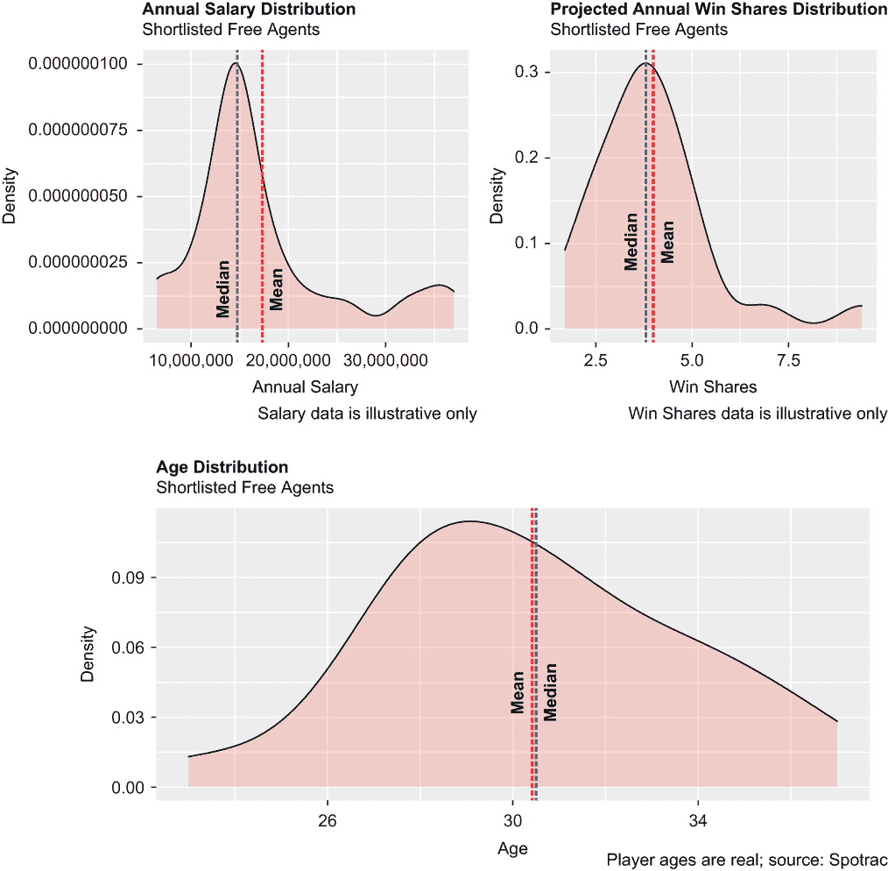
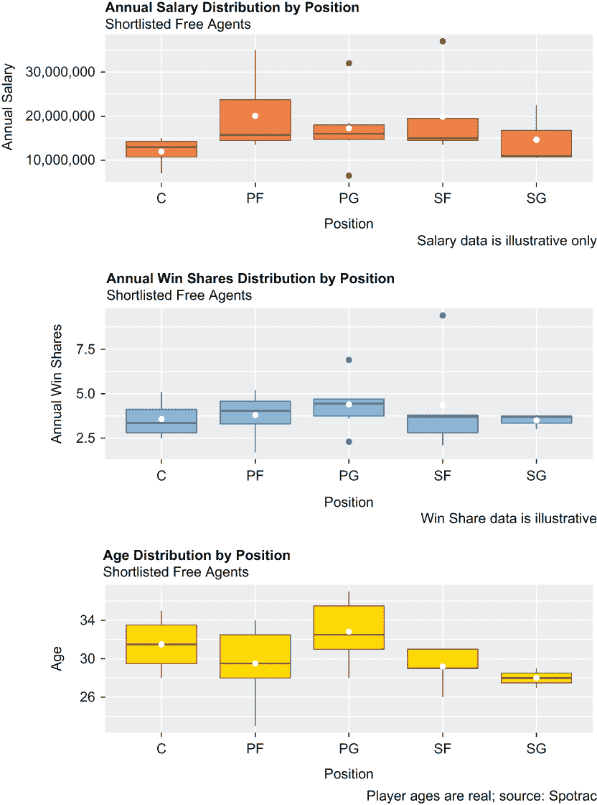
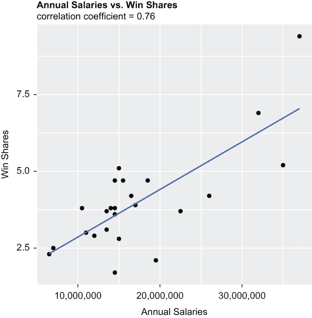
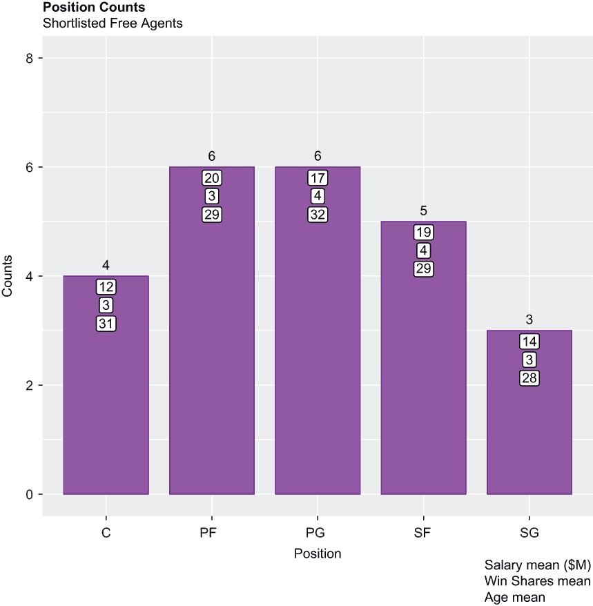

# 4 约束优化

本章涵盖

+   在 R 代码中添加注释

+   使用密度图可视化数据分布

+   同时可视化两个变量的相关性

+   定义约束优化

+   应用约束优化方法

你有多少次被要求在资源有限的情况下做更多的事情？换句话说，你真正被要求的是在不利情况下最大限度地利用一个受限制的情况。约束优化是针对这一目标的运筹学和定量解决方案。在本章中，我们将展示如何组织和执行一个典型的约束优化问题。为了实现这一目标，我们有一个虚构的 NBA 球队，专注于从自由球员市场上收购老将球员。他们的目标不是收购五个最好的球员，而是五个符合他们具体需求和要求的最佳球员。因此，我们的假设是，约束优化可以成功地隔离出这个球队应该收购的最佳自由球员组合，而不会违反事先设定的任何约束。

## 4.1 什么是约束优化？

**约束优化**是一种方法或技术，旨在在受到限制的情况下最小化或最大化某个函数，这些限制限制了行动的自由度。一种方法可能最小化成本或资源的消耗；另一种方法可能最大化利润率。约束是有效的边界，在计算最大化或最小化某个定义的函数时，不能越界。约束优化有许多应用案例：

+   首席财务官在审查一份长长的资本项目清单，以应对严重的预算和资源限制时，需要批准其中的一部分项目，以最大化收入并平衡不同部门的项目。

+   三项铁人运动员在自行车上需要以下物品：工具和备用零件，以防出现爆胎或机械故障；水和能量饮料以保持水分；盐片以治疗抽筋；以及一些能量棒、能量凝胶和士力架巧克力棒的组合，以保持能量。在一只鞍包、两个水瓶架和运动衫后口袋之间，铁人运动员必须事先决定如何最好地利用这些空间。

+   就我们的目的而言，一个 NBA 球队的总经理正在评估自由球员市场上的几位球员。

我们的虚构 NBA 球队打算通过自由球员市场而不是选秀来重建阵容：

+   该团队正在评估 24 名自由球员，他们打算签约**正好**5 名球员。这是他们的第一个要求或约束（在本章中，这些术语可以互换使用）。

+   他们希望每个位置都有一个球员：一个控球后卫、一个得分后卫、一个中锋、一个大前锋和一个小前锋。这是他们的第二个要求。

+   球员的薪资要求是已知且固定的。球队愿意为五名他们收购的球员支付的年薪总额不超过 9000 万美元（M）。这是他们的第三项要求。90 M 美元如何分配无关紧要；重要的是总额。

+   他们收购的五名球员的平均年龄必须等于或小于 30 岁。这是他们的第四和最后一项要求。个别年龄无关紧要；重要的是平均值必须等于或小于 30。

方程的另一方面是应该最小化或，在我们的情况下，最大化的函数。球队的评估包括基于前几个赛季的实际赢分、职业生涯轨迹、年龄和其他因素，对每个 24 名自由球员的年度赢分预测。我们虚构的 NBA 球队希望在遵守*所有*这些约束条件的情况下最大化赢分。让我们开始吧。

## 4.2 加载包

我们有四个包需要加载：`tidyverse` 和 `patchwork`，我们在前面的章节中已经加载并使用过，还有两个新包，如本节所述：

+   `lpSolve` 包包含解决线性规划问题的几个函数，包括需要约束优化的函数。

+   `scales` 包是 `ggplot2` 包的一部分，当然，`ggplot2` 包也是 `tidyverse` 包宇宙的一部分——它包含用于转换 `ggplot2` 轴标签的函数。尽管 `scales` 包与 `tidyverse` 相关联，但如果 `scales` 包没有首先单独且独立于 `tidyverse` 包加载，R 在调用 `scales` 函数时可能会抛出错误。

警告 注意到 `lpSolve` 包中的 `S` 是大写的。R 是一种区分大小写的编程语言。即使是“无害”的小写和大写误用也会生成错误信息——其中一些可能是直接的，而另一些则不然——并阻止你的代码运行。

在我们连续四次调用 `library()` 函数来加载这四个包之前，让我们首先介绍在代码块中添加注释的概念。尽管注释与你的代码混合在一起，但它们根本不是代码；实际上，当你执行 R 脚本时，它们会被完全忽略。注释是一种添加可读描述的做法，有助于减轻将来在需要修复或其他更改时的潜在痛苦，尤其是在这些更改随后分配给其他程序员时。

与许多其他编程语言不同，R 只允许单行注释；多行注释只能通过“合并”两个或多个单行注释来实现。要给一段代码添加注释，只需在前面加上井号（#）符号：

```
# single line comment example: lpSolve is for constrained optimization
library(lpSolve)

# multi-line example: tidyverse includes dplyr and tidyr
# mult-line example continued: tidyverse also includes ggplot2
# mult-line example continued: tidyverse also includes readr
library(tidyverse)

# scales package is part of tidyverse, but it’s best to load
# this as a standalone package
library(scales)

# we use the patchwork package to bundle multiple plots into one object
library(patchwork)
```

我们接下来将导入我们的数据集，并进一步展示注释的使用。

## 4.3 导入数据

使用 `readr` 的 `read_csv()` 函数导入我们的数据集，这是一个之前保存为 .csv 扩展名的 Microsoft Excel 文件。通过赋值运算符，我们将数据集标记为 free_agents。

free_agents 数据集（在数据集创建时）包含从 Sportrac 网站抓取的现实生活中的即将成为自由球员的数据，然后根据从 [www.basketball-reference.com](https://www.basketball-reference.com/) 收集的历史数据，结合了说明性的年薪和赢球份额预测。一旦球员的合同到期，NBA 球员就会成为自由球员；在那个时刻，自由球员可以自由地与任何球队谈判并签订新合同，包括他们最近效力的球队。

注意，我们添加了一条注释，但这次是在代码行末尾而不是单独的一行。R 将执行以下代码块，直到看到 # 符号；然后它将忽略该行之后的所有内容：

```
free_agents <- read_csv("free_agents.csv") # saved in default directory
```

接下来，我们将学习我们刚刚导入的数据的基本知识，然后可视化以获得更深入的见解。

## 4.4 了解数据

R 提供了几个函数来快速获得对数据集的基本理解。一个是基础 R 的 `dim()` 函数，它返回行数和列数：

```
dim(free_agents)
## [1] 24  7
```

首先提供行数，然后是列数。

另一个是来自 `dplyr` 包的 `glimpse()` 函数。该函数也返回数据集的维度，但以旋转 90 度的数据的截断视图返回：

```
glimpse(free_agents)
## Rows: 24
## Columns: 7
## $ player        <chr> "Chris Paul", "Kawhi Leonard", "Blake Griff...
## $ current_team  <chr> "PHX", "LAC", "DET", "DAL", "DEN", "LAL", "...
## $ age           <dbl> 37, 31, 33, 29, 28, 28, 27, 36, 31, 29, 30,...
## $ position1     <chr> "PG", "SF", "PF", "SG", "SG", "PF", "SG", "...
## $ position2     <chr> "PG1", "SF1", "PF1", "SG1", "SG2", "PF2", "...
## $ annual_salary <dbl> 32000000, 37000000, 35000000, 11000000, 225...
## $ win_shares    <dbl> 6.9, 9.4, 5.2, 3.0, 3.7, 4.2, 3.8, 2.3, 4.7...
```

顺便说一句，`glimpse()` 函数在基础 R 中有一个等价函数：`str()` 函数。`glimpse()` 函数比 `str()` “更干净”，因此是两者之间的首选，但这两个函数都以某种类似格式返回相同的信息：

```
str(free_agents)
## 'data.frame':    24 obs. of  7 variables:
## $ player       : chr [1:24] "Chris Paul" "Kawhi Leonard" ... 
## $ current_team : chr [1:24] "PHX" "LAC" "DET" "DAL" ...
## $ age          : num [1:24] 37 31 33 29 28 28 27 36 31 29 ...
## $ position1    : chr [1:24] "PG" "SF" "PF" "SG" ...
## $ position2    : chr [1:24] "PG1" "SF1" "PF1" "SG1" ...
## $ annual_salary: num [1:24] 32000000 37000000 35000000 11000000 ... 
## $ win_shares   : num [1:24] 6.9 9.4 5.2 3 3.7 4.2 3.8 2.3 4.7 2.1 ...
```

变量 `position1` 和 `position2` 应该是因子而不是字符字符串（`chr`），所以我们调用基础 R 的 `as.factor()` 函数两次，将两个变量从一种类型或类转换为另一种类型：

```
free_agents$position1 <- as.factor(free_agents$position1)
free_agents$position2 <- as.factor(free_agents$position2)
```

让我们运行基本的 R `levels()` 函数来返回两个变量的唯一属性。你必须将变量转换为因子后才能运行 `levels()` 函数，而不是在此之前：

```
levels(free_agents$position1)
## [1] "C"  "PF" "PG" "SF" "SG"
levels(free_agents$position2)
## [1] "C1"  "C2"  "C3"  "C4"  "PF1" "PF2" "PF3" "PF4" "PF5" "PF6"
## [11] "PG1" "PG2" "PG3" "PG4" "PG5" "PG6" "SF1" "SF2" "SF3" "SF4"
## [21] "SF5" "SG1" "SG2" "SG3"
```

变量 `position1` 包含五个水平，每个位置一个，这当然是我们所希望或预期的。因此，我们至少确认了 `position1` 没有错别字或其他异常。同时，变量 `position2` 包含 24 个水平，等于 free_agents 数据集的记录数，这是一个好事。

即使这两个变量中的任何一个出现最小的错误，也会损害我们的约束优化问题，这就是为什么检查两个变量的完整性值得我们去做。

如果你不喜欢 `glimpse()` 或 `str()`，`head()` 和 `tail()` 函数是很好的替代品；默认情况下，`head()` 返回前六条记录，而 `tail()` 返回最后六条。以下两行代码返回了 free_agents 的前三个和最后三个观测值：

```
head(free_agents, n = 3)
##   player        current_team   age position1 position2
##   <chr>         <chr>        <dbl> <fct>     <fct>
## 1 Chris Paul    PHX             37 PG        PG1      
## 2 Kawhi Leonard LAC             31 SF        SF1      
## 3 Blake Griffin DET             33 PF        PF1 
##   annual_salary win_shares
##           <dbl>      <dbl>
## 1      32000000        6.9
## 2      37000000        9.4
## 3      35000000        5.2 

tail(free_agents, n = 3)
##   player           current_team   age position1 position2
##   <chr>            <chr>        <dbl> <fct>     <fct>
## 1 Robert Covington POR             31 PF        PF6      
## 2 Serge Ibaka      LAC             33 C         C3       
## 3 Aron Baynes      TOR             35 C         C4
##   annual_salary win_shares
##           <dbl>      <dbl>
## 1      13500000        3.1
## 2      12000000        2.9
## 3       7000000        2.5
```

最后，`summary()` 函数是一个基础 R 通用函数，它返回传递给它的任何数据对象的基线统计信息。它主要用于返回各种模型拟合函数的结果（在第五章中讨论）；在这里，它返回 free_agents 数据集中每个变量的基线统计信息和其它数据。再次强调，`summary()` 返回连续变量的箱线图样度量，以及因子变量的水平计数：

```
summary(free_agents)
##    player          current_team            age        position1
## Length:24          Length:24          Min.   :23.00   C :4     
## Class :character   Class :character   1st Qu.:28.00   PF:6     
## Mode  :character   Mode  :character   Median :30.50   PG:6     
                                         Mean   :30.42   SF:5     
                                         3rd Qu.:33.00   SG:3     
                                         Max.   :37.00  
## C1     : 1   Min.   : 6500000   Min.   :1.700  
## C2     : 1   1st Qu.:13500000   1st Qu.:2.975  
## C3     : 1   Median :14750000   Median :3.800  
## C4     : 1   Mean   :17312500   Mean   :3.992  
## PF1    : 1   3rd Qu.:18750000   3rd Qu.:4.700  
## PF2    : 1   Max.   :37000000   Max.   :9.400  
## (Other):18  
```

`summary()` 函数返回一些有用且有趣的信息，但对于像 free_agents 这样的短数据集，始终最好也可视化数据以更好地理解它。

但首先，还需要一个额外的清理项目：基础 R 中的 `options()` 函数，带有参数 `scipen = 999`，告诉 R 不要以科学记数法（即 e+10）打印任何结果，而是无例外地以全数字形式返回它们。我们实际上是在指示 R 在结果大于 scipen 位数字长时返回固定记数法的结果。因此，任何大的 scipen 数字都足够，但 999 是最常用的数字：

```
options(scipen = 999)
```

可以通过再次调用 `options()` 函数并添加参数 `scipen = 000` 来撤销此设置；这次，任何小的数字都可以，但 000 是首选。顺便说一下，`options()` 函数并非通用——它仅适用于它被调用的脚本。

## 4.5 可视化数据

在我们设置并运行约束优化问题之前，让我们首先更好地了解我们的数据。我们将通过首先创建一系列密度图来覆盖变量 `annual_salary`、`win_shares` 和 `age`；一系列针对这些相同变量的箱线图，但按变量 `position1` 分组；一个变量 `annual_salary` 和 `win_shares` 之间的单一相关性图；最后，一个显示按变量 `position1` 分组的球员数量的条形图。

### 4.5.1 密度图

自由球员数据集的第一个图形表示是一系列围绕连续变量薪水（`annual_salary`）、赢分（`win_shares`）和年龄（`age`）的密度图。密度图本质上是对直方图的平滑版本，就像直方图一样，密度图显示连续或数值数据的分布。（之后，我们将创建箱线图、相关性图和条形图。）

密度图相较于直方图最显著的优势在于，密度图能更准确地反映实际的分布形状，因为没有程序员选项可以调整箱数，否则可能会影响外观。但尽管 x 轴代表值的范围，就像直方图一样，y 轴代表一个不太直观的密度函数，或概率密度函数，而不是频率。然而，最终，概率密度函数实际上与频率有很好的相关性；换句话说，当频率低时，概率密度函数等于一个低数值，反之，当频率高时，概率密度函数等于一个高数值（或至少是一个更高的数值）。无论如何，密度图对于可视化连续变量的潜在分布、识别峰值或模式以及评估偏度或对称性非常有用。

这里是三个 `ggplot2` 密度图中的第一个的演示：

+   `ggplot()` 函数始终首先被调用以初始化任何 `ggplot2` 对象。

+   `geom_density()` 函数计算平滑估计并绘制图表。传递给 `geom_density()` 的 `alpha` 参数使填充透明，以便 `ggplot2` 网格线在整个图表中保持可见。为了实现这种效果，`alpha` 应该等于接近 0 的数值，例如 .3。

+   `geom_vline()` 函数被调用两次以绘制一对垂直虚线，一条代表总体均值，另一条代表总体中位数。可以通过修改 `size` 参数上下调整线的厚度；默认值为 1，因此任何调整都是相对于 `ggplot2` 默认值的相对调整。

+   `scale_x_continuous()` 函数与 `scales` 包一起使用，在 x 轴刻度标记上添加逗号，因此 10000000 转换为更易读的 10,000,000。

+   `annotate()` 函数在提供的 x 和 y 坐标处添加垂直文本：

```
p1 <- ggplot(free_agents, aes(x = annual_salary)) +
  geom_density(alpha = .3, fill = "salmon") +
  geom_vline(aes(xintercept = mean(annual_salary, na.rm = TRUE)),
             color = "red", linetype = "longdash", size = .8) +
  geom_vline(aes(xintercept = median(annual_salary, na.rm = TRUE)),
             color = "blue", linetype = "longdash", size = .8) +
  labs(title = "Annual Salary Distribution",
       subtitle = "Shortlisted Free Agents",
       x = "Annual Salary", 
       y = "Density",
       caption = "Salary data is illustrative only") +
  scale_x_continuous(labels = comma) +
  theme(plot.title = element_text(face = "bold")) +
  annotate("text", x = 18000000, 
           y = .000000025, label = "Mean", color = "black",
           size = 4, fontface = "bold", angle = 90) +
  annotate("text", x = 14000000, 
           y = .000000025, label = "Median", color = "black",
           size = 4, fontface = "bold", angle = 90)
```

第二个和第三个密度图——分别是 `p2` 和 `p3`——与 `p1` 类似，只是做了一些修改：

+   将变量 `annual_salary` 替换为变量 `win_shares` 和 `age`。

+   已经包含了标签更改。

+   `scale_x_continuous()` 函数和 scales 包不再需要——毕竟，图表 `p2` 和 `p3` 没有需要转换的标签，因此已经被移除：

```
p2 <- ggplot(free_agents, aes(x = win_shares)) +
  geom_density(alpha = .3, fill = "salmon") +
  geom_vline(aes(xintercept = mean(win_shares, na.rm = TRUE)),
             color = "red", linetype = "longdash", size = .8) +
  geom_vline(aes(xintercept = median(win_shares, na.rm = TRUE)),
             color = "blue", linetype = "longdash", size = .8) +
  labs(title = "Projected Annual Win Shares Distribution",
       subtitle = "Shortlisted Free Agents",
       x = "Win Shares", y = "Density",
       caption = "Win Shares data is illustrative only") +
  theme(plot.title = element_text(face = "bold")) +
  annotate("text", x = 4.1, 
           y = .1, label = "Mean", color = "black",
           size = 4, fontface = "bold", angle = 90) +
  annotate("text", x = 3.7, 
           y = .1, label = "Median", color = "black",
           size = 4, fontface = "bold", angle = 90)

p3 <- ggplot(free_agents, aes(x = age)) +
  geom_density(alpha = .3, fill = "salmon") +
  geom_vline(aes(xintercept = mean(age, na.rm = TRUE)),
             color = "red", linetype = "longdash", size = .8) +
  geom_vline(aes(xintercept = median(age, na.rm = TRUE)),
             color = "blue", linetype = "longdash", size = .8) +
  labs(title = "Age Distribution", subtitle = "Shortlisted Free Agents",
       x = "Age", y = "Density",
       caption = "Player ages are real; source: Spotrac") +
  theme(plot.title = element_text(face = "bold")) +
  annotate("text", x = 30.2, 
           y = .04, label = "Mean", color = "black",
           size = 4, fontface = "bold", angle = 90) +
  annotate("text", x = 30.7,
           y = .04, label = "Median", color = "black",
           size = 4, fontface = "bold", angle = 90)
```

`plot_layout()` 函数从 `patchwork` 包中将三个密度图捆绑成一个对象（见图 4.1），其中图表 `p1` 和 `p2` 占据顶部一行，而图表 `p3`，假设与 `p1` 和 `p2` 相同的宽度，显示在底部一行：

```
p1 + p2 - p3 + plot_layout(ncol = 1)
```



图 4.1 密度图用于可视化数值数据的分布。密度图有时会替代直方图或箱线图。

我们的前三个可视化展示了以下关于数据的信息：

+   *年薪*—这些数字代表我们 24 名自由球员的年度基本工资的逐年预期，它们是右偏斜的，或者说正偏斜。有两种方法可以推断这一点：（1）大多数值明显聚集在分布的左尾，而右尾较长，并且（2）因此，均值大于中位数。

+   *赢分*—对于年度赢分数据，也可以说同样的话，这些数据代表每个球员在每个赛季预计获得的赢分数量。考虑到 `annual_salaries` 和 `win_shares` 的均值和中位数，我们可以合理地得出结论，大约 1500 万美元的薪水相当于大约 3.5 到 4 个赢分。

+   *年龄*—与变量 `annual_salaries` 和 `win_shares` 不同，变量 `age` 通常呈正态分布；均值和中位数都大约等于 30.5。

### 4.5.2 箱线图

我们接下来的可视化系列再次显示了这些相同变量的分布，但这次是通过箱线图，并且按变量 `position1` 的每个级别细分。这些箱线图与我们之前章节中创建的箱线图类似，但请注意，我们现在使用 `scales` 包来转换我们的 y 轴刻度标记，而不是 x 轴上的刻度标记。因此，我们调用 `scale_y_continuous()` 函数而不是 `scale_x_continuous()` 函数：

```
p4 <- ggplot(free_agents, aes(x = position1, y = annual_salary)) + 
  geom_boxplot(color = "sienna4", fill = "sienna1" ) +
  labs(title = "Annual Salary Distribution by Position",
       subtitle = "Shortlisted Free Agents",
       x = "Position", 
       y = "Annual Salary", 
       caption = "Salary data is illustrative only") + 
  scale_y_continuous(labels = comma) +
  stat_summary(fun = mean, geom = "point", 
               shape = 20, size = 8, color = "white", fill = "white") + 
  theme(plot.title = element_text(face = "bold")) 

p5 <- ggplot(free_agents, aes(x = position1, y = win_shares)) + 
  geom_boxplot(color = "steelblue4", fill = "steelblue1" ) +
  labs(title = "Annual Win Shares Distribution by Position",
       subtitle = "Shortlisted Free Agents",
       x = "Position", 
       y = "Annual Win Shares", 
       caption = "Win Share data is illustrative") + 
  stat_summary(fun = mean, geom = "point", 
               shape = 20, size = 8, color = "white", fill = "white") + 
  theme(plot.title = element_text(face = "bold")) 

p6 <- ggplot(free_agents, aes(x = position1, y = age)) + 
  geom_boxplot(color = "gold4", fill = "gold1" ) +
  labs(title = "Age Distribution by Position",
       subtitle = "Shortlisted Free Agents",
       x = "Position", 
       y = "Age", 
       caption = "Player ages are real; source: Spotrac") + 
  stat_summary(fun = mean, geom = "point",
               shape = 20, size = 8, color = "white", fill = "white") + 
  theme(plot.title = element_text(face = "bold")) 
```

然后，我们再次调用 `plot_layout()` 函数，该函数从内存中检索三个可视化效果，并将它们显示为一个 3 × 1 的图形对象（见图 4.2）：

```
p4 + p5 + p6 + plot_layout(ncol = 1)
```



图 4.2 另一系列对数值数据分布的观察

以下是一些关于我们箱线图的说明：

+   由于 `annual_salary` 的方差以及 free_agents 数据集中记录的低数量，特别是 `position1` 的五个级别中的每一个，分布差异很大。

+   虽然 `win_shares` 分布的分散度较低，但按位置查看似乎与 `annual_salary` 相同。

+   虽然我们之前发现 `age` 是正态分布的，但按位置查看时，其分布仍然相当不同。例如，大多数中锋和控球后卫的年龄都超过 30 岁，而大多数小前锋和得分后卫的年龄都低于 30 岁。

### 4.5.3 相关图

在第二章中，我们展示了如何同时计算多个连续变量之间的相关系数，并在热图或相关矩阵中显示相同的结果。在这里，我们只想计算两个变量之间的相关系数，然后将结果作为相关图的副标题添加，该图通过一个变量沿 x 轴运行，另一个变量沿 y 轴运行来可视化相同的内容。也就是说，我们将变量 `annual_salary` 和 `win_shares` 传递给基础 R 的 `cor()` 函数来计算它们之间的相关系数：

```
cor(free_agents$annual_salary, free_agents$win_shares)
## [1] 0.7571507
```

相关系数等于 0.76（四舍五入），这意味着工资和赢分之间存在着正面的强相关性，这意味着当一个变量移动时，另一个变量也会向同一方向移动。

我们接下来的代码块绘制了一个`ggplot2`相关图，其中`annual_salary`是 x 轴变量，`win_shares`是 y 轴变量（见图 4.3）。`geom_density()`被调用以绘制`ggplot2`密度图，`geom_boxplot()`被调用以绘制`ggplot2`箱线图，而`geom_point()`告诉 R 绘制相关图，有时也称为散点图。通过将`size = 3`参数传递给`geom_point()`，我们指示 R 绘制点的大小是默认大小的三倍。



图 4.3 工资和赢分之间存在着正面的高度相关性。这条线是最优拟合回归线，它最小化了与数据的距离。

当将`method = lm`参数传递给`geom_smooth()`函数时，会在数据上绘制一条线性回归线（`lm`是线性模型的缩写）。回归线，或最优拟合线，是一种注释，旨在可视化数据系列中的趋势；线被绘制以最小化与数据的距离。线越陡，相关性越强。

`geom_smooth()`函数会自动在回归线上绘制一个 95%的置信区间，除非有其他指示。实际上，置信区间可以向上或向下调整，或者完全删除。我们选择删除它，通过传递`se = FALSE`参数（`se`是标准误差的缩写）：

```
p7 <- ggplot(free_agents, aes(x = annual_salary, y = win_shares)) + 
  geom_point(size = 3) +
  labs(title = "Annual Salaries vs. Win Shares",
       subtitle = "correlation coefficient = 0.76",
       x = "Annual Salaries", 
       y = "Win Shares") + 
  geom_smooth(method = lm, se = FALSE) +
  scale_x_continuous(label = scales::comma) +
  theme(plot.title = element_text(face = "bold"))
print(p7)

```

### 4.5.4 条形图

在我们接下来的代码块中，我们通过管道操作符将 free_agents 数据集传递给`dplyr`的`group_by()`和`tally()`函数。`group_by()`和`tally()`函数一起计算变量`position1`中每个级别的 free_agents 观察值的数量，结果被放入一个名为 tibble1 的 tibble 中：

```
free_agents %>%
  group_by(position1) %>%
  tally() -> tibble1
print(tibble1)
## # A tibble: 5 × 2
##   position1     n
##   <fct>     <int>
## 1 C             4
## 2 PF            6
## 3 PG            6
## 4 SF            5
## 5 SG            3
```

在这个第二个代码块中，我们将 free_agents 传递给`dplyr summarize()`函数，以计算变量`position1`中每个级别的`annual_salary`、`win_shares`和`age`的平均值。结果被转换成一个名为 tibble2 的 tibble：

```
free_agents %>% 
  group_by(position1) %>%
  summarize(meanSalary = mean(annual_salary),
            meanWinShares = mean(win_shares),
            meanAge = mean(age)) -> tibble2
print(tibble2)
## # A tibble: 5 × 4
##   position1 meanSalary meanWinShares meanAge
##   <fct>          <dbl>         <dbl>   <dbl>
## 1 C          12000000           3.58    31.5
## 2 PF         20083333\.          3.8     29.5
## 3 PG         17250000           4.4     32.8
## 4 SF         19900000           4.36    29.2
## 5 SG         14666667\.          3.5     28
```

在这个第三个也是最后一个代码块中，我们调用`dplyr left_join()`函数，将我们刚刚创建的两个 tibbles 根据它们的类似变量`position1`进行连接。左连接是一种操作，通过它一个对象中的所有行都会与第二个对象中的相应值合并或匹配。在这个过程中，我们还得到了每个唯一的*列*返回。结果是另一个 tibble，tibble3：

```
left_join(tibble1, tibble2, by = "position1") -> tibble3
print(tibble3)
## A tibble: 5 × 5
## position1     n meanSalary meanWinShares meanAge
##  <fct>     <int>      <dbl>         <dbl>   <dbl>
## 1 C             4  12000000           3.58    31.5
## 2 PF            6  20083333\.          3.8     29.5
## 3 PG            6  17250000           4.4     32.8
## 4 SF            5  19900000           4.36    29.2
## 5 SG            3  14666667\.          3.5     28  
```

现在我们已经有了下一个和最后一个可视化所需的数据源，一个`ggplot2`条形图：

+   调用 `geom_text()` 函数将 `position1` 每个级别的计数固定在条形图顶部。`vjust` 参数移动或调整 `ggplot2` 图表元素（如标签、标题和副标题）的垂直位置；还有一个 `hjust` 参数，这里没有调用，它调整类似的图表元素的水平位置。你可能需要或需要根据每个图表的不同设置进行实验，以获得最佳的美观效果。

+   `geom_label()` 函数被调用了三次，用于在条形图中标注代表 `annual_salaries`、`win_shares` 和 `age` 的截断值，这些值位于条形图内部。

+   通过调用 `ylim()` 函数，y 轴被扩展或固定在最小和最大值上，以确保所有这些都能适应，并且不会损害美观。

这些附加功能增强了我们的条形图的美观（见图 4.4），将其从一种非常普通的图形数据表示转变为一个（希望）能吸引我们更多注意的对象。更重要的是，这些功能提供了足够的信息，而不会包含其他信息。我们希望通知我们的观众，而不是让他们感到不知所措。以下是我们 `ggplot2` 条形图的代码：

```
p8 <- ggplot(tibble3, aes(x = position1, y = n)) + 
  geom_bar(stat = "identity", width = .8, 
           fill = "darkorchid1", color = "darkorchid4") + 
  labs(title = "Position Counts",
       subtitle = "Shortlisted Free Agents", 
       x = "Position", 
       y = "Counts",
       caption = "Salary mean ($M)\nWin Shares mean\nAge mean") + 
  geom_text(aes(label = n, vjust = -0.3)) +
  geom_label(aes(label = trunc(meanSalary*.000001), vjust = 1.2)) +
  geom_label(aes(label = trunc(meanWinShares), vjust = 2.4)) +
  geom_label(aes(label = trunc(meanAge), vjust = 3.6)) +
  ylim(0, 8) +
  theme(plot.title = element_text(face = "bold"))
print(p8)
```



图 4.4 按位置统计的候选自由球员数量。注意右下角的图例，它解释了条形图内部从上到下白色框内的标签。

我们的条形图还包括一个标题，默认情况下位于图表下方和右侧，从上到下解释固定在条形图内部的三个标签。将不同职位的平均值汇总，我们得到了所谓的“墙上的标记”：对于 91 M（轻微的约束违规，但仍然是违规），我们的虚构 NBA 球队可以从五个平均年龄为 29.8 的球员那里获得 17 个胜利份额。

本章的其余部分致力于组织和执行一个约束优化问题，希望它能比我们的“墙上的标记”提供更好的解决方案——当然，没有任何约束违规。无论我们最终在哪里，约束优化都消除了猜测，并产生了*最优*的解决方案。

## 4.6 约束优化设置

我们即将演示如何设计和开发一个约束优化问题。通过仅替换要最大化或最小化的函数以及更改约束条件，代码可以轻松地转移到其他用例。

同时，我们有一个虚构的 NBA 球队，需要一场重大的重建努力。这个球队最近在选秀中失败，没有下个选秀的顶尖选择，并且无法通过交易提升排名；因此，球队的总经理（GM）决定通过在自由球员市场上收购老将球员来升级阵容。这些球员的合同即将到期，他们可以与任何球队签约并打球。

让我们回顾一下我们的要求。总经理有空间签约五名球员（第一约束）。必须有一名控球后卫、一名得分后卫、一名中锋、一名大前锋和一名小前锋（第二约束）。年薪总额不得超过 9000 万美元（第三约束）。最后，这五名球员在签约时的平均年龄必须等于或低于 30 岁（第四约束）。

为了这次练习，让我们假设球队可以签约任何它想要的自由球员；换句话说，没有风险是任何被追求的球员会选择签约另一支球队。因此，free_agents 数据集是球队的短期自由球员名单，以下变量：

+   `player`—该团队评估的每位球员的全名，采用名-姓格式（例如，Chris Paul）；free_agents 数据集有 24 行，因此我们总共有 24 名球员。当数据从 Spotrac 抓取时，这些球员实际上即将进入自由球员市场。

+   `current_team`—球队的简称——例如，PHX 代表凤凰城太阳队——每个球员在创建 free_agents 数据集时正在为该队效力。

+   `age`—在创建 free_agents 时，每位球员的年龄，以整数表示。

+   `position1`—24 名球员中的每一位球员的主要位置——C 代表中锋，PF 代表大前锋，PG 代表控球后卫，SF 代表小前锋，SG 代表得分后卫。

+   `position2`—主要位置加上从 1 开始的个位数整数，随着我们在 free_agents 数据集中向下移动，每个位置递增一个。例如，Chris Paul 在我们的数据集中是第一位控球后卫，因此 Chris Paul 的`position2`变量等于`PG1`；Rajon Rondo 是我们第二位控球后卫，因此 Rondo 的`position2`变量等于`PG2`。Jonas Valančiūnas 是我们第一位中锋，因此 Valančiūnas 的`position2`变量等于`C1`；最后四位中锋中的最后一位是 Aron Baynes，因此他的`position2`变量等于`C4`。当我们进一步设置和运行我们的约束优化问题时，这个变量将是必需的。

+   `annual_salary`—每位球员预期的年薪。这些数字大致基于从[www.basketball-reference.com](https://www.basketball-reference.com/)收集的先前薪资信息，但除此之外具有说明性。

+   `win_shares`—每位球员每赛季预计获得的胜利份额。这些数字与从[www.basketball-reference.com](https://www.basketball-reference.com/)抓取的先前赛季的实际胜利份额相关联，但像`annual_salary`变量一样，这些数字具有说明性。我们的约束优化问题将在遵守之前提到的硬约束的同时*最大化胜利份额*。

表 4.1 显示了球队的 24 名球员或自由球员的短期名单；`current_team`和`position2`变量不包括在这个表中。球员没有按照任何特定的顺序列出，除了按位置分组。

表 4.1 可用自由球员列表

| 球员 | 年龄 | 位置 | 年薪 | 胜场分 |
| --- | --- | --- | --- | --- |
| Chris Paul | 37 | PG | $32,000,000 | 6.9 |
| Rajon Rondo | 36 | PG | $6,500,000 | 2.3 |
| Ricky Rubio | 31 | PG | $18,500,000 | 4.7 |
| Patrick Beverley | 34 | PG | $16,500,000 | 4.2 |
| Marcus Smart | 28 | PG | $15,500,000 | 4.7 |
| Cory Joseph | 31 | PG | $14,500,000 | 3.6 |
| Josh Richardson | 29 | SG | $11,000,000 | 3.0 |
| Gary Harris | 28 | SG | $22,500,000 | 3.7 |
| Zach LaVine | 27 | SG | $10,500,000 | 3.8 |
| Jonas Valančiūnas | 30 | C | $15,000,000 | 5.1 |
| Jusuf Nurkić | 28 | C | $14,000,000 | 3.8 |
| Serge Ibaka | 33 | C | $12,000,000 | 2.9 |
| Aron Baynes | 35 | C | $7,000,000 | 2.5 |
| Blake Griffin | 33 | PF | $35,000,000 | 5.2 |
| Montrezl Harrell | 28 | PF | $26,000,000 | 4.2 |
| Thaddeus Young | 34 | PF | $17,000,000 | 3.9 |
| Marvin Bagley III | 23 | PF | $14,500,000 | 4.7 |
| Taurean Prince | 28 | PF | $14,500,000 | 1.7 |
| Robert Covington | 31 | PF | $13,500,000 | 3.1 |
| Kawhi Leonard | 31 | SF | $37,000,000 | 9.4 |
| Rodney Hood | 29 | SF | $19,500,000 | 2.1 |
| Will Barton | 31 | SF | $14,500,000 | 3.8 |
| Justise Winslow | 26 | SF | $15,000,000 | 2.8 |
| TJ Warren | 29 | SF | $13,500,000 | 3.7 |

尽管我们的问题场景似乎相当复杂，但您可能会对 R 和约束优化提供的解决方案的简单性感到惊讶。让我们在 4.7 节构建问题和 4.8 节得到结果之间转向那个解决方案。

## 4.7 约束优化构建

开始构建我们的约束优化问题（请注意，这些步骤无论在何种用例中都是相同的）。这个过程的第一步是通过调用 `dplyr arrange()` 函数创建一个“副本”的 `free_agents` 数据集，称为 `free_agents_sort`，数据按变量 `position2` 排序。打印的结果有意限制为六个观测值，仅考虑空间因素，同时也调用了基础 R 的 `head()` 函数：

```
head(free_agents_sort <- arrange(free_agents, position2))
##              player current_team age position1 position2 annual_salary
##   <chr>             <chr>      <dbl> <fct>     <fct>             <dbl>
## 1 Jonas Valanciunas          MEM  30         C        C1      15000000
## 2      Jusuf Nurkic          POR  28         C        C2      14000000
## 3       Serge Ibaka          LAC  33         C        C3      12000000
## 4       Aron Baynes          TOR  35         C        C4       7000000
## 5     Blake Griffin          DET  33        PF       PF1      35000000
## 6  Montrezl Harrell          LAL  28        PF       PF2      26000000
##   win_shares
##        <dbl>
## 1        5.1
## 2        3.8
## 3        2.9
## 4        2.5
## 5        5.2
## 6        4.2
```

第二，将 `free_agents_sort` 数据集子集化，仅包括我们约束优化问题绝对需要的变量；调用 `dplyr` 包中的 `select()` 函数将 `free_agents_sort` 简化为仅包含变量 `player`、`age`、`position2`、`annual_salary` 和 `win_shares`。打印的结果再次通过再次调用 `head()` 函数被限制：

```
head(free_agents_sort <- select(free_agents_sort, player, age, 
                                position2, annual_salary, win_shares))
##              player age position2 annual_salary win_shares
##   <chr>            <dbl> <fct>            <dbl>      <dbl>
## 1 Jonas Valanciunas  30        C1      15000000        5.1
## 2      Jusuf Nurkic  28        C2      14000000        3.8
## 3       Serge Ibaka  33        C3      12000000        2.9
## 4       Aron Baynes  35        C4       7000000        2.5
## 5     Blake Griffin  33       PF1      35000000        5.2
## 6  Montrezl Harrell  28       PF2      26000000        4.2
```

第三，构建一个约束矩阵，通过它创建了五个向量（注意 `$` 操作符分隔对象和变量名），称为 `centers`、`power_forwards`、`point_guards`、`small_forwards` 和 `shooting_guards`，然后将它们附加到 `free_agents_sort` 数据集上。然后我们使用二进制编码用一和零填充这些向量，代表真和假，取决于 `position2` 中的对应值。

为了详细说明，每个向量包含 24 个元素，这当然与 free_agents_sort 的长度相匹配。以向量 `centers` 为例，前四个值等于 1，因为在我们对数据进行排序后，担任中锋位置的球员占据了 free_agents_sort 的前四条记录。其余的值等于 0，因为我们的数据集中的其他球员扮演的是除中锋以外的其他位置。这些结果随后被完整打印出来：

```
free_agents_sort$centers = c(1,1,1,1,0,0,0,0,0,0,
                   0,0,0,0,0,0,0,0,0,0,0,0,0,0) 
free_agents_sort$power_forwards = c(0,0,0,0,1,1,1,1,1,1,
                          0,0,0,0,0,0,0,0,0,0,0,0,0,0)  
free_agents_sort$point_guards = c(0,0,0,0,0,0,0,0,0,0,
                        1,1,1,1,1,1,0,0,0,0,0,0,0,0) 
free_agents_sort$small_forwards = c(0,0,0,0,0,0,0,0,0,0,
                             0,0,0,0,0,0,1,1,1,1,1,0,0,0) 
free_agents_sort$shooting_guards = c(0,0,0,0,0,0,0,0,0,0,
                           0,0,0,0,0,0,0,0,0,0,0,1,1,1) 
print(free_agents_sort)
##               player age position2 annual_salary win_shares centers
## 1  Jonas Valanciunas  30        C1      15000000        5.1       1
## 2       Jusuf Nurkic  28        C2      14000000        3.8       1
## 3        Serge Ibaka  33        C3      12000000        2.9       1
## 4        Aron Baynes  35        C4       7000000        2.5       1
## 5      Blake Griffin  33       PF1      35000000        5.2       0
## 6   Montrezl Harrell  28       PF2      26000000        4.2       0
## 7     Thaddeus Young  34       PF3      17000000        3.9       0
## 8  Marvin Bagley III  23       PF4      14500000        4.7       0
## 9     Taurean Prince  28       PF5      14500000        1.7       0
## 10  Robert Covington  31       PF6      13500000        3.1       0
## 11        Chris Paul  37       PG1      32000000        6.9       0
## 12       Rajon Rondo  36       PG2       6500000        2.3       0
## 13       Ricky Rubio  31       PG3      18500000        4.7       0
## 14  Patrick Beverley  34       PG4      16500000        4.2       0
## 15      Marcus Smart  28       PG5      15500000        4.7       0
## 16       Cory Joseph  31       PG6      14500000        3.6       0
## 17     Kawhi Leonard  31       SF1      37000000        9.4       0
## 18       Rodney Hood  29       SF2      19500000        2.1       0
## 19       Will Barton  31       SF3      14500000        3.8       0
## 20   Justise Winslow  26       SF4      15000000        2.8       0
## 21       T.J. Warren  29       SF5      13500000        3.7       0
## 22   Josh Richardson  29       SG1      11000000        3.0       0
## 23       Gary Harris  28       SG2      22500000        3.7       0
## 24       Zach LaVine  27       SG3      10500000        3.8       0
##    power_forwards point_guards shooting_forwards shooting_guards
##             <dbl>        <dbl>             <dbl>           <dbl>
## 1               0            0                 0               0
## 2               0            0                 0               0
## 3               0            0                 0               0
## 4               0            0                 0               0
## 5               1            0                 0               0
## 6               1            0                 0               0
## 7               1            0                 0               0
## 8               1            0                 0               0
## 9               1            0                 0               0
## 10              1            0                 0               0
## 11              0            1                 0               0
## 12              0            1                 0               0
## 13              0            1                 0               0
## 14              0            1                 0               0
## 15              0            1                 0               0
## 16              0            1                 0               0
## 17              0            0                 1               0
## 18              0            0                 1               0
## 19              0            0                 1               0
## 20              0            0                 1               0
## 21              0            0                 1               0
## 22              0            0                 0               1
## 23              0            0                 0               1
## 24              0            0                 0               1
```

第四，我们调用基础 R 的 `rbind()` 函数（简称行绑定），它基本上就是按行将两个或多个向量（或矩阵或数据集）连接成一个单一的对象。在这里，我们调用 `rbind()` 函数将几个向量组合成一个新的对象，称为 `constraint_matrix`，其维度由变量 `position2` 以及最初建立的硬约束决定：

```
constraint_matrix <- as.matrix(rbind(free_agents_sort$centers,
                                    free_agents_sort$centers,
                                    free_agents_sort$power_forwards,
                                    free_agents_sort$power_forwards,
                                    free_agents_sort$point_guards,
                                    free_agents_sort$point_guards,
                                    free_agents_sort$small_forwards,
                                    free_agents_sort$small_forwards,
                                    free_agents_sort$shooting_guards,
                                    free_agents_sort$shooting_guards,
                                     t(rep(1, length = 24)),
                                    free_agents_sort$annual_salary,
                                    free_agents_sort$age))
```

最后，我们调用基础 R 的 `dimnames()` 函数一次性设置行和列名。现在我们有一个 13 行长的对象，其中每一行代表一个预定的约束，24 列宽，其中每一列都与变量 `position2` 的值相关联：

```
constraint_matrix <- as.matrix(rbind(free_agents_sort$centers,
                                    free_agents_sort$centers,
                                    free_agents_sort$power_forwards,
                                    free_agents_sort$power_forwards,
                                    free_agents_sort$point_guards,
                                    free_agents_sort$point_guards,
                                    free_agents_sort$small_forwards,
                                    free_agents_sort$small_forwards,
                                    free_agents_sort$shooting_guards,
                                    free_agents_sort$shooting_guards,
                                     t(rep(1, length = 24)),
                                    free_agents_sort$annual_salary,
                                    free_agents_sort$age))
dimnames(constraint_matrix) <- 
  list(c("OneCenterMax",
         "OneCenterMin",
         "OnePowerForwardMax",
         "OnePowerForwardMin",
         "OnePointGuardMax",
         "OnePointGuardMin",
         "OneSmallForwardMax",
         "OneSmallForwardMin",
         "OneShootingGuardMax",
         "OneShootingGuardMin",
         "FivePlayerMax",
         "SalaryMax",
         "AgeMax"),
       free_agents_sort$position2)
print(constraint_matrix)
##                           C1       C2       C3      C4      PF1      PF2
## OneCenterMax               1        1        1       1        0        0
## OneCenterMin               1        1        1       1        0        0
## OnePowerForwardMax         0        0        0       0        1        1
## OnePowerForwardMin         0        0        0       0        1        1
## OnePointGuardMax           0        0        0       0        0        0
## OnePointGuardMin           0        0        0       0        0        0
## OneSmallForwardMax         0        0        0       0        0        0
## OneSmallForwardMin         0        0        0       0        0        0
## OneShootingGuardMax        0        0        0       0        0        0
## OneShootingGuardMin        0        0        0       0        0        0
## FivePlayerMax              1        1        1       1        1        1
## SalaryMax           15000000 14000000 12000000 7000000 35000000 26000000
## AgeMax                    30       28       33      35       33       28
##                          PF3      PF4      PF5      PF6      PG1     PG2
## OneCenterMax               0        0        0        0        0       0
## OneCenterMin               0        0        0        0        0       0
## OnePowerForwardMax         1        1        1        1        0       0
## OnePowerForwardMin         1        1        1        1        0       0
## OnePointGuardMax           0        0        0        0        1       1
## OnePointGuardMin           0        0        0        0        1       1
## OneSmallForwardMax         0        0        0        0        0       0
## OneSmallForwardMin         0        0        0        0        0       0
## OneShootingGuardMax        0        0        0        0        0       0
## OneShootingGuardMin        0        0        0        0        0       0
## FivePlayerMax              1        1        1        1        1       1
## SalaryMax           17000000 14500000 14500000 13500000 32000000 6500000
## AgeMax                    34       23       28       31       37      36
##                          PG3      PG4      PG5      PG6      SF1
## OneCenterMax               0        0        0        0        0
## OneCenterMin               0        0        0        0        0
## OnePowerForwardMax         0        0        0        0        0
## OnePowerForwardMin         0        0        0        0        0
## OnePointGuardMax           1        1        1        1        0
## OnePointGuardMin           1        1        1        1        0
## OneSmallForwardMax         0        0        0        0        1
## OneSmallForwardMin         0        0        0        0        1
## OneShootingGuardMax        0        0        0        0        0
## OneShootingGuardMin        0        0        0        0        0
## FivePlayerMax              1        1        1        1        1
## SalaryMax           18500000 16500000 15500000 14500000 37000000
## AgeMax                    31       34       28       31       31
##                          SF2      SF3      SF4      SF5      SG1
## OneCenterMax               0        0        0        0        0
## OneCenterMin               0        0        0        0        0
## OnePowerForwardMax         0        0        0        0        0
## OnePowerForwardMin         0        0        0        0        0
## OnePointGuardMax           0        0        0        0        0
## OnePointGuardMin           0        0        0        0        0
## OneSmallForwardMax         1        1        1        1        0
## OneSmallForwardMin         1        1        1        1        0
## OneShootingGuardMax        0        0        0        0        1
## OneShootingGuardMin        0        0        0        0        1
## FivePlayerMax              1        1        1        1        1
## SalaryMax           19500000 14500000 15000000 13500000 11000000
## AgeMax                    29       31       26       29       29
##                          SG2      SG3
## OneCenterMax               0        0
## OneCenterMin               0        0
## OnePowerForwardMax         0        0
## OnePowerForwardMin         0        0
## OnePointGuardMax           0        0
## OnePointGuardMin           0        0
## OneSmallForwardMax         0        0
## OneSmallForwardMin         0        0
## OneShootingGuardMax        1        1
## OneShootingGuardMin        1        1
## FivePlayerMax              1        1
## SalaryMax           22500000 10500000
## AgeMax                    28       27
```

剩余的工作是编写和运行约束优化算法，打印结果，并执行一系列简单的检查。

## 4.8 结果

我们现在可以通过调用 `lp()` 函数从 `lpSolve` 包中解决我们的约束优化问题——即计算这支 NBA 球队应该签下哪五名自由球员。我们调用的是一个 *线性* 编程函数，因为我们的变量是连续的，并且所有变量都有 1 的幂，这意味着它们是相加和相减，而不是相乘或相除。以下是它是如何工作的：

+   `const.mat` 参数引用了一个数值约束系数矩阵，其中必须为每个约束有一个行，为每个变量有一个列，这当然正是我们构建 `constraint_matrix` 的方式。

+   `objective` 参数等于应该优化的函数，即胜利份额。

+   `direction` 参数是一个表示优化方向的字符串（这必须等于 `min` 或 `max`）。

+   `const.rhs` 参数是一个表示我们约束的数值向量——场上的每个位置至少有一名球员，每个位置最多有一名球员（即 10 个约束），最多五名球员，年薪最高为 9000 万美元，年龄最高为 150 岁。

+   `const.dir` 参数是一个表示每个约束方向的字符串向量——每个位置不多也不少地有一名球员，总共五名球员，年薪不超过 9000 万美元，总年龄不超过 150 岁（从而确保平均年龄等于或低于 30 岁）。

+   `int.vec` 参数是一个指定整数变量数量的数值向量。

结果是一个名为 `co_object` 的新对象。在下一个代码块结束时没有调用 `print()` 函数；虽然它会返回目标函数的结果——即每年从最佳自由球员中可以期望获得多少胜利份额——但它不会返回其他任何内容：

```
co_object <-
  lp(const.mat = constraint_matrix,
     objective = free_agents_sort$win_shares,
     direction = "max",
     const.rhs = c(1, 1, 1, 1, 1, 1, 1, 1, 1, 1, 5, 90000000, 150), 
     const.dir = c("<=", ">=","<=", ">=", "<=", ">=", 
                   "<=", ">=", "<=", ">=", "<=", "<=", "<="), 
     int.vec = 1:24, all.bin = TRUE)
```

以下代码行返回一个名为 `df` 的对象形式的*完整*结果。通过调用 `select()` 函数，将 `df` 限制为仅包含位置 1 到 5 的变量，这些变量是 `player`、`age`、`position2`、`annual_salary` 和 `win_shares`：

```
print(df <- select(free_agents_sort[as.logical(co_object$solution),], 1:5))
##               player age position2 annual_salary win_shares
##   <chr>            <dbl> <fct>             <dbl>      <dbl>
## 3        Serge Ibaka  33        C3      12000000        2.9
## 8  Marvin Bagley III  23       PF4      14500000        4.7
## 15      Marcus Smart  28       PG5      15500000        4.7
## 17     Kawhi Leonard  31       SF1      37000000        9.4
## 24       Zach LaVine  27       SG3      10500000        3.8
```

我们有五名球员，每个位置都有一个球员。

调用基础 R 的 `sum()` 函数计算变量 `win_shares` 的总和：

```
sum(df$win_shares)
## [1] 25.5
```

另一次调用 `sum()` 函数计算变量 `annual_salary` 的总和。结果是，这个球队将为每个胜利份额支付大约 $3.5 M 的薪水：

```
sum(df$annual_salary) 
## [1] 89500000
```

最后，调用基础 R 的 `mean()` 函数来计算五名自由球员收购的平均年龄：

```
mean(df$age) 
## [1] 28.4
```

任何其他球员组合要么会导致胜利份额总和不增加，要么不可避免地违反事先设定的至少一个硬约束。因此，我们证实了我们的假设，即约束优化可以在同时遵守多个约束的情况下最大化一个函数；我们的虚构 NBA 球队实际上在略低的成本下获得了显著更多的胜利份额，这比我们探索数据后计算的大致估计要高得多。

到目前为止，我们已经确定了 NBA 球队如何通过约束优化最好地利用选秀权，或者在本例中，通过自由球员市场来构建他们的阵容。在接下来的几章中，我们将应用几种统计技术，其中大多数尚未介绍，用于比赛中的使用。这些相同的技术可以转移到其他数据和现实世界的场景中。

## 摘要

+   我们展示了如何为你的代码添加注释。注释可以提高代码的可读性，在代码审查和后期维护期间特别有用。R 忽略并以 # 符号开头的脚本中的行，因此不会执行这些行。

+   我们介绍了如何绘制 `ggplot2` 密度图，作为显示单个连续变量分布以及 `ggplot2` 相关性图来可视化两个连续变量之间相关性的方法。

+   有时，对可视化的一些小改动可以大大提高其美学和可解释性。`scales` 包使得在不重新格式化数据的情况下转换 `ggplot2` 标签成为可能。实际上，我们将在未来的章节中应用其他 `scales` 转换。

+   约束优化是一种相对直接的运筹学技术，通过消除猜测并产生最佳可能解决方案，定量解决困难和现实世界的问题。从`lpSolve`包中调用`lp()`函数只是 R 中实现这一目标的一种方法。

+   无论问题大小，在不太理想的环境下减少可用选项时，最佳解决方案是通过约束优化方法。

+   约束优化问题很容易转移到其他用例；一个算法应用于 NBA 自由球员市场后，只需替换最大或最小函数并修改约束，就可以在其他地方使用。

+   更多的时候，你可能是在寻求最小化成本（获取成本、仓储成本、供应商成本、薪资和福利等）或时间（路线和配送、上市时间、服务水平响应、延误和停机时间等）。

+   当然，你对最大化你业务的一些方面也同等感兴趣，可能是利润率、货架空间或时间表的遵守。再次强调，每次你寻求最小化或最大化一个函数，其中一个或多个约束限制了你的选择时，你都可以也应该应用约束优化来找到最佳选项。
