# 5 个回归模型

本章涵盖

+   识别和处理异常值

+   运行和解释正态性统计测试

+   计算和可视化连续变量之间的相关性

+   调整和解释多重线性回归

+   调整和解释回归树

在本章中，我们将展示如何拟合回归模型，即多重线性回归和回归树。我们的因变量，或目标变量，将是常规赛胜利，我们的自变量，或预测变量，将是 NBA 在 2016-17 赛季开始记录的完整忙碌统计数据集。这些统计数据包括但不限于盖帽、挡球和抢断。因此，我们将对胜利进行一系列忙碌统计数据的回归。

我们的假设是，至少一些这些忙碌统计数据对胜负有有意义的影响，但哪些统计数据？以及影响有多大？在彻底探索数据的过程中——在此期间，我们将专注于识别和处理异常值、检验正态分布以及计算相关系数——我们将首先拟合多重线性回归作为初步测试，然后拟合回归树作为第二次测试。

多重线性回归是一个模型，通过产生一个穿过数据的直线方程来估计连续目标变量（如常规赛胜利）与两个或更多预测变量（通常是连续变量）之间的关系。（简单线性回归是一个模型，它执行相同的操作，但只有一个预测变量。）目标是理解和量化两个或更多预测变量共同如何影响目标变量的方差。

另一方面，回归树通常被称为决策树回归，它生成一系列的 if-else 规则以最佳拟合数据。此类模型根据预测变量的值递归地将数据划分为子集，并为每个子集预测目标变量的连续值。结果以图形方式显示，可能最能反映我们的决策过程；因此，它们比线性回归更容易解释并解释给他人——但通常预测性较差。哪一种可能更好取决于数据。

在加载我们的包、导入我们的数据以及继续我们的分析和测试之前，让我们进一步设定您的期望：

+   线性建模基于目标变量与预测变量之间存在线性关系的假设。只有当这个假设成立时，线性建模才是解释过去和预测未来的最佳检验。当这个假设被违反时，数据中的异常值有时是根本原因。线性模型对异常值特别敏感；实际上，在一个长数据集中，只有几个异常值就可以极大地改变回归线的斜率，从而使线性模型无法捕捉数据的整体模式，并返回不准确的结果。话虽如此，在 5.4 节中，我们将识别并处理数据中的每个异常值。

+   每个变量，尤其是预测变量，都应该呈正态分布。处理异常值可能足以将连续变量从非正态分布转换为正态分布，也可能不足以做到。在 5.5 节中，在识别出异常值并相应处理之后，我们将绘制密度图，并演示如何运行和解释一个常见的正态性统计检验。那些未能通过正态性检验的预测变量将被排除在模型开发之外。

+   与目标变量高度相关的预测变量，无论是正相关还是负相关，更有可能对目标变量的方差产生统计上显著的影响，比其他潜在的预测变量。因此，在 5.6 节中，我们将计算胜利与我们的剩余预测变量之间的相关系数，以隔离那些与胜利有强烈或相对强烈关系的变量，并将那些在模型开发中不具有这种关系的变量排除在外。

+   我们将在 5.7 节中拟合我们的多元线性回归，并演示如何解释和应用结果。在这个过程中，我们还将提供在拟合模型前后应用最佳实践的指导。

+   在 5.8 节中，我们将拟合和绘制回归树，并指导您如何解释结果，以及如何将结果与我们的线性模型进行比较和对比。

现在我们可以开始加载我们的包，导入我们的数据，并开始我们的分析。

## 5.1 加载包

关于我们的多元线性回归，我们将调用基础 R 的`lm()`函数来拟合模型，然后调用一系列包装函数来返回结果。相反，关于我们的回归树，我们将从`tree`包中调用`tree()`函数来拟合模型，然后调用一对内置函数来可视化结果。

总体来说，我们介绍了四个之前未加载或使用的包，包括`tree`包和以下包：

+   从`GGally`包，这是一个`ggplot2`的扩展，我们将调用`ggpairs()`函数来返回一个相关矩阵，该矩阵可以一次性可视化数据集中每个连续或数值变量之间的关系。在 R 中有很多方法可以可视化相关性；实际上，`GGally`的功能远超我们在第二章中创建的热图。

+   从`car`包中，将调用`vif()`函数，即方差膨胀因子，以检查我们的线性回归中独立变量或预测变量之间的多重共线性。多重共线性指的是两个或更多预测变量之间高度相关。当存在多重共线性时，至少应该移除一个预测变量，并拟合一个新的或简化的模型，以确保最高水平的有效性和可靠性。

+   从`broom`包中，将调用一系列函数以返回我们的线性模型结果。

这些包，包括`tidyverse`和`patchwork`包，通过连续调用`library()`函数来加载：

```
library(tidyverse)
library(GGally)
library(car)
library(broom)
library(tree)
library(patchwork)
```

现在我们已经加载了这些包，我们准备使用它们的函数，然后继续下一步。

## 5.2 导入数据

我们首先通过调用`readr`的`read_csv()`函数创建一个名为 hustle 的对象或数据集，该函数导入一个也称为 hustle 的.csv 文件。hustle 数据集包含从 NBA 官方网站（[www.nba.com](https://www.nba.com/)）抓取的数据：

```
hustle <- read_csv("hustle.csv")
```

`read_csv()`函数在运行时自动导入 hustle 数据集，因为文件存储在我们的默认工作目录中。如果 hustle.csv 存储在其他任何地方，前面的代码将失败。

设置或更改工作目录的方式不止一种。最佳方式——因为其他选项可能会随着后续软件版本的发布而改变——是调用基础 R 的`setwd()`函数，并在一对单引号或双引号之间添加完整目录：

```
setwd("/Users/garysutton/Library/Mobile Documents/com~apple~CloudDocs")
```

以下代码行通过用工作目录替换基础 R 的`file.choose()`函数来交互式地导入一个.csv 文件。如果您的.csv 文件存储在工作目录之外，或者您选择不定义工作目录，这是一个不错的选择：

```
hustle <- read_csv(file.choose()
```

在运行时打开一个对话框，提示您导航计算机并选择要导入的.csv 文件。

## 5.3 了解数据

现在我们已经导入了数据集，让我们开始了解它。与前面的章节一样，我们调用`dplyr`包中的`glimpse()`函数，以返回 hustle 数据集的转置版本：

```
glimpse(hustle)
## Rows: 90
## Columns: 12
## $ team               <fct> Atlanta Hawks, Boston Celtics, Brooklyn...
## $ season             <fct> 2018-19, 2018-19, 2018-19, 2018-19, 201...
## $ team_season        <fct> ATL 19, BOS 19, BKN 19, CHA 19, CHI 19,...
## $ screen_assists     <dbl> 8.0, 8.6, 11.0, 11.1, 8.3, 9.8, 8.5, 9....
## $ screen_assists_pts <dbl> 18.2, 20.0, 26.2, 25.7, 18.6, 22.4, 20....
## $ deflections        <dbl> 14.5, 14.1, 12.1, 12.6, 12.6, 11.8, 11....
## $ loose_balls        <dbl> 9.5, 8.3, 8.0, 8.1, 7.9, 7.6, 8.4, 8.6,...
## $ charges            <dbl> 0.5, 0.7, 0.3, 0.6, 0.4, 0.5, 0.8, 0.4,...
## $ contested_2pt      <dbl> 38.0, 35.9, 44.5, 39.2, 36.5, 34.6, 38....
## $ contested_3pt      <dbl> 25.2, 26.4, 22.2, 25.3, 24.9, 23.9, 24....
## $ contested_shots    <dbl> 63.2, 62.3, 66.7, 64.5, 61.3, 58.4, 62....
## $ wins               <int> 29, 49, 42, 39, 22, 19, 33, 54, 41, 57,...
```

hustle 数据集有 90 行长，14 列宽。它包含作为字符字符串的变量`team`、`season`和`team_season`；几个 hustle 统计数据作为数值变量；以及常规赛胜利数。

我们有一个必要且立即的行动：将前三个变量从字符字符串转换为因子。因此，我们调用基础 R 的`as.factor()`函数三次。再次强调，当变量可以假设仅为固定或有限集合的值时，将字符字符串转换为因子是一种最佳实践：

```
hustle$team <- as.factor(hustle$team)
hustle$season <- as.factor(hustle$season)
hustle$team_season <- as.factor(hustle$team_season)
```

然后，我们调用基础 R 的`summary()`函数，以返回 hustle 数据集中每个变量的基本或描述性统计信息：

```
summary(hustle)
##                   team        season    team_season screen_assists  
##  Atlanta Hawks      : 3   2016-17:30   ATL 17 : 1   Min.   : 6.800  
##  Boston Celtics     : 3   2017-18:30   ATL 18 : 1   1st Qu.: 8.425  
##  Brooklyn Nets      : 3   2018-19:30   ATL 19 : 1   Median : 9.350  
##  Charlotte Hornets  : 3                BKN 17 : 1   Mean   : 9.486  
##  Chicago Bulls      : 3                BKN 18 : 1   3rd Qu.:10.500  
##  Cleveland Cavaliers: 3                BKN 19 : 1   Max.   :13.100  
##  (Other)            :72                (Other):84                   
##  screen_assists_pts  deflections    off_loose_balls def_loose_balls
##  Min.   :15.90      Min.   :11.40   Min.   :0.000   Min.   :0.000  
##  1st Qu.:19.30      1st Qu.:13.32   1st Qu.:0.000   1st Qu.:0.000  
##  Median :21.55      Median :14.45   Median :3.400   Median :4.500  
##  Mean   :21.65      Mean   :14.38   Mean   :2.394   Mean   :3.181  
##  3rd Qu.:23.90      3rd Qu.:15.30   3rd Qu.:3.700   3rd Qu.:4.900  
##  Max.   :30.30      Max.   :18.70   Max.   :4.500   Max.   :5.500  
##   
##   loose_balls      charges       contested_2pt   contested_3pt  
##  Min.   :6.20   Min.   :0.2000   Min.   :34.00   Min.   :18.10  
##  1st Qu.:7.30   1st Qu.:0.4000   1st Qu.:37.73   1st Qu.:21.40  
##  Median :8.00   Median :0.5000   Median :39.90   Median :22.95  
##  Mean   :7.93   Mean   :0.5444   Mean   :40.19   Mean   :22.92  
##  3rd Qu.:8.50   3rd Qu.:0.7000   3rd Qu.:42.23   3rd Qu.:24.65  
##  Max.   :9.60   Max.   :1.1000   Max.   :49.10   Max.   :28.90  
##  
##  contested_shots      wins      
##  Min.   :55.30   Min.   :17.00  
##  1st Qu.:61.38   1st Qu.:32.25  
##  Median :63.15   Median :42.00  
##  Mean   :63.11   Mean   :41.00  
##  3rd Qu.:64.67   3rd Qu.:49.00  
##  Max.   :74.20   Max.   :67.00  
##  
```

从我们的数据中我们可以推断出以下内容：

+   我们的数据集涵盖了过去三个 NBA 常规赛赛季，即 COVID-19 之前（参见 `season` 变量的结果）；2019-20 赛季因疫情而缩短，特别是那些在赛季恢复后未能进入泡泡比赛（in-bubble play）的球队。 (一旦 2019-20 赛季恢复，所有比赛都在佛罗里达州奥兰多的一个中立、受控的场地进行。)

+   变量 `team` 和 `season` 被连接起来创建了一个额外的变量 `team_season`，例如，2016-17 赛季的亚特兰大老鹰队变为 ATL 17。

+   变量 `off_loose_balls` 和 `def_loose_balls` 分别代表进攻和防守中失去的球，它们的取值范围最小为 0，这表明至少在一个赛季中，NBA 只追踪了总失去的球数。一个被找回的球就是这样——进攻队失去了对球的控制，但不一定失去了球权，随后球被进攻方或防守方找回并控制。

+   变量 `charges` 上的统计数据不多，它们之间的差异可以忽略不计。当一个持球进攻球员在运球并向篮筐突破时，如果他与防守球员发生接触，就会被判个人犯规（除非接触轻微且没有严重影响比赛）。在 NBA 与大学篮球不同，运球突破到篮筐的接触通常会导致阻挡犯规或对防守方的犯规。但偶尔，进攻方会被判犯规；当这种情况发生时，防守方会被记为一次犯规，或者更具体地说，是一次引诱犯规。这样的变量，其频率很少且差异很小，不太可能对目标变量有太大影响。

+   除了 `wins`（胜利）之外，我们观察到以下变量的变化最大：

    +   `screen_assists_pts`——这个变量等于每场比赛中，当一名球员在队友通过挡拆（将身体置于队友和防守球员之间）后立即投篮得分时的总得分。

    +   `contested_2pt`——这个变量等于对手两分球尝试的平均防守紧密程度。

    +   `contested_shots`——这个变量等于总投篮尝试的平均次数——包括两分球和三分球——它们的防守紧密程度较高。所有投篮（投篮得分）尝试根据距离篮筐的距离，每球得分为两分或三分。

+   这些变量之间存在中等程度的差异：

    +   `contested_3pt`——这个变量等于对手三分球尝试的平均防守紧密程度。

    +   `screen_assists`——这个变量等于每场比赛中设置的挡拆平均次数，无论随后场上的情况如何。

    +   `deflections`——这个变量等于每场比赛中平均破坏或挡掉对手传球次数。

基于对进攻性 loose balls 恢复与防御性 loose balls 恢复的不一致跟踪，我们调用`dplyr`包中的`select()`函数，从 hustle 数据集中移除变量 `off_loose_balls` 和 `def_loose_balls`；在这种情况下，告诉 R 删除什么比保留什么要容易得多——因此，在随后的`c()`函数调用之前有一个减号运算符：

```
hustle %>% 
  select(-c(off_loose_balls, def_loose_balls)) -> hustle
```

我们随后调用基础 R 的`dim()`函数，通过返回数据集的新维度来确认此操作的执行成功：

```
dim(hustle)
## [1] 90 12
```

我们的数据集现在包含 90 行和仅 12 列，而之前它有 14 列。

## 5.4 识别异常值

如前所述，线性回归模型假设——实际上，要求——源数据不包含任何异常值。仅仅几个异常值，我们可能知道，可能是由于测量错误、数据输入错误或罕见事件，可能会压倒剩余数据点的 影响，从而给任何回归模型注入偏差。因此，将识别出与剩余数据整体模式或分布显著偏离的数据点，并随后对其进行修改，以有效地将其作为异常值消除。这可能会让一些人觉得过于夸张，但当我们处理 hustle 这样的短数据集时，改变极端值（称为 *winsorization*）是删除观测值并缩短数据长度的完全可接受和合法的替代方案。

### 5.4.1 原型

识别异常值有 *很多* 方法。视觉方法可能需要最多的工作，但它是理解数据最有效的方法。最简单的方法可能是一种统计测试：Dixon 的 *Q* 测试和 Grubbs 测试，两者都需要`outliers`包。然而，Dixon 的 *Q* 只适用于小数据集，其中 *n*，即记录数，小于 30；另一方面，Grubbs 测试具有更大的扩展性，但它只返回一个最显著的异常值，即使存在其他异常值。

让我们用变量 `deflections` 来演示视觉方法。有三种可视化选项可以用来发现异常值：散点图、直方图和箱线图。

仅使用 x 轴变量创建散点图与创建可视化 x 轴和 y 轴变量之间关系的关联图并不相同。话虽如此，我们不会调用`ggplot2`包中的`ggplot()`函数，而是首先通过调用`qplot()`函数创建我们的散点图，`qplot()`是快速绘图的意思。其次，我们将`seq_along()`函数传递给`qplot()`以创建一个均匀分布的数字向量。散点图的缺点是异常值并不总是那么明显。

对于直方图也是如此。它们通常是显示连续变量分布的第一个选项，但最终，在尾部标记（或不标记）值作为异常值通常是一个主观的练习。相比之下，箱线图专门设计用来隔离胡须外的值，并将它们确定为异常值。

为了比较目的，以下代码块返回了变量`deflections`周围的散点图（`sp1`）、直方图（`hist1`）和箱线图（`bp1`）（见图 5.1）。然而，对于 hustle 数据集中的剩余变量，只将创建箱线图：

```
sp1 <- qplot(seq_along(hustle$deflections), hustle$deflections) +
  labs(title = "Deflections", 
       subtitle = "scatterplot", 
       x = "", 
       y = "Value") +
  theme(plot.title = element_text(face = "bold")) +
  annotate("text", x = 65, y = 18.5, 
           label = "Outlier?", color = "red",
           size = 3, fontface = "bold") +
  annotate("text", x = 85, y = 18.3, 
           label = "Outlier?", color = "red",
           size = 3, fontface = "bold") 

hist1 <- ggplot(hustle, aes(x = deflections)) + 
  geom_histogram(fill = "snow1", color = "dodgerblue4", bins = 8) + 
  labs(title  ="Deflections", 
       subtitle = "histogram",
       x = "",           
       y  = "Frequency") +
  theme(plot.title = element_text(face = "bold")) +
  annotate("text", x = 18.75, y = 3, 
           label = "  Outliers?", color = "red",
           size = 3, fontface = "bold") 

bp1 <- ggplot(hustle, aes(x = "", y = deflections)) + 
  labs(title = "Deflections", 
       subtitle = "boxplot", 
       x = "", 
       y = "") +
  geom_boxplot(color = "dodgerblue4", fill = "snow1", width = 0.5) +
  stat_summary(fun = mean, geom = "point", shape = 20, size = 8,
               color = "dodgerblue4", fill = "dodgerblue4") + 
  annotate("text", x = "", y = 18.6, 
           label = "                  Outliers",
           color = "red", size = 3, fontface = "bold") +
  theme(plot.title = element_text(face = "bold"))
```

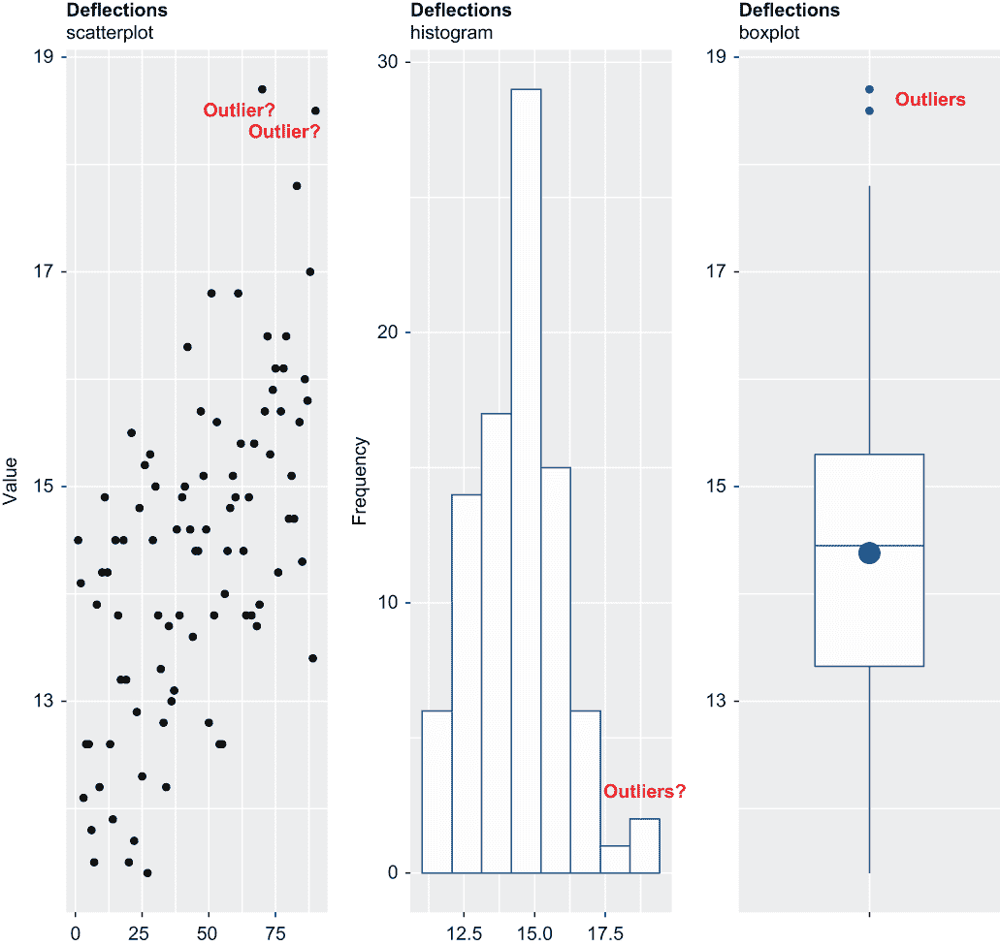

图 5.1 从左到右，hustle 数据集中变量`deflections`周围的散点图、直方图和箱线图。与散点图和直方图相比，在识别异常值时，箱线图的主观性较低。

开放引号和`Outliers`注释（例如，`" Outliers"`）之间的空格是有意为之的；它们被插入以最佳定位文本在直方图和箱线图中，出于美观考虑。否则，`plot_layout()`函数从`patchwork`包中打印出我们的三个可视化作为单个水平对象：

```
sp1 + hist1 + bp1 + plot_layout(ncol = 3)
```

变量`deflections`确实包含一对异常值。因此，我们的下一步是通过减少这两个异常值的值，使它们刚好等于最大值来 winsorize 数据。回想一下，箱线图上的最大值是胡须的顶端（而最小值是底部胡须的端点）。

以下行代码修改了变量`deflections`中大于 17.8 的任何值，使其等于 17.8，这是`bp1`顶部胡须的大约端点：

```
hustle$deflections[hustle$deflections > 17.8] = 17.8
```

变量`deflections`的最大值最初为 18.70（检查`summary()`函数返回）。基础 R 中的`max()`函数返回新的最大值 17.8，因此当你只需要返回一个统计值时，无需再次调用`summary()`函数：

```
max(hustle$deflections)
## [1] 17.8
```

第二个箱线图（见图 5.2）显示了变量`deflections`在 winsorization 后的新分布：

```
bp2 <- ggplot(hustle, aes(x = "", 
                          y = deflections)) + 
  labs(title = "Deflections", 
       subtitle = "post-winsorization boxplot", 
       x = "", y = "") +
  geom_boxplot(color = "dodgerblue4", fill = "grey65", width = 0.5) +
  stat_summary(fun = mean, geom = "point", shape = 20, size = 8, 
               color = "dodgerblue4", fill = "dodgerblue4") + 
  theme(plot.title = element_text(face = "bold")) 
print(bp2)
```

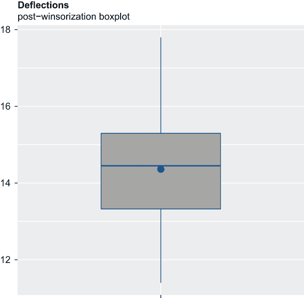

图 5.2 变量`deflections`在 winsorization 后的新或修订分布。注意异常值（即任何超出胡须长度的数据点）的缺失。

以下总结了我们迄今为止所做的工作：

+   我们选择了一种视觉方法而不是两种统计方法来在 hustle 数据集中检测异常值。

+   我们选择了箱线图而不是散点图和直方图，因为与使用其他可视化类型相比，在箱线图中识别异常值的主观性较低。此外，当决定如何减少或增加异常值的值以有效地消除它们时，箱线图比替代方案有更好的视觉效果。

+   我们没有从数据中移除异常值，而是由于 hustle 数据集只有 90 行长，我们决定采用 winsorization。

+   通过调用基础 R 的 `max()` 函数并创建第二个箱线图，我们两次确认变量 `deflections` 中的异常值已经消失。

在下一节中，这个过程将对 hustle 数据集中的剩余变量重复进行。

### 5.4.2 识别其他异常值

在紧随其后的长段代码中，我们将为 hustle 数据集中的每个剩余变量创建一个箱线图。对于包含一个或多个异常值的变量，我们的箱线图包括一个第二主题，通过在边缘添加红色边条来表示。否则，每个图表的语法都是完全相同的，这意味着你可以查看我们第一个箱线图的代码，然后跳转到叙述继续的地方，如果你愿意的话：

```
bp3 <- ggplot(hustle, aes(x = "", y = wins)) +
  labs(title = "Wins", 
       x = "", 
       y = "") +
  geom_boxplot(color = "dodgerblue4", fill = "snow1", width = 0.5) +
  stat_summary(fun = mean, geom = "point", shape = 20, size = 8,
               color = "dodgerblue4", fill = "dodgerblue4") + 
  theme(plot.title = element_text(face = "bold")) 

bp4 <- ggplot(hustle, aes(x = "", y = screen_assists)) +
  labs(title = "Screens", 
       x = "", 
       y = "") +
  geom_boxplot(color = "dodgerblue4", fill = "snow1", width = 0.5) +
  stat_summary(fun = mean, geom = "point", shape = 20, size = 8,
               color = "dodgerblue4", fill = "dodgerblue4") + 
  theme(plot.title = element_text(face = "bold")) 

bp5 <- ggplot(hustle, aes(x = "", y = screen_assists_pts)) + 
  labs(title = "Points off Screens", x = "", y = "") +
  geom_boxplot(color = "dodgerblue4", fill = "snow1", width = 0.5) +
  stat_summary(fun = mean, geom = "point", shape = 20, size = 8,
               color = "dodgerblue4", fill = "dodgerblue4") + 
  theme(plot.title = element_text(face = "bold")) 

bp6 <- ggplot(hustle, aes(x = "", y = loose_balls)) +
  labs(title = "Loose Balls Recovered", 
       x = "", 
       y = "") +
  geom_boxplot(color = "dodgerblue4", fill = "snow1", width = 0.5) +
  stat_summary(fun = mean, geom = "point", shape = 20, size = 8,
               color = "dodgerblue4", fill = "dodgerblue4") + 
  theme(plot.title = element_text(face = "bold")) 

bp7 <- ggplot(hustle, aes(x = "", y = charges)) + 
  labs(title = "Charges Drawn", 
       x = "", 
       y = "") +
  geom_boxplot(color = "dodgerblue4", fill = "snow1", width = 0.5) +
  stat_summary(fun = mean, geom = "point", shape = 20, size = 8,
               color = "dodgerblue4", fill = "dodgerblue4") + 
  theme(plot.title = element_text(face = "bold")) 

bp8 <- ggplot(hustle, aes(x = "", y = contested_2pt)) + 
  labs(title = "Contested 2pt Shots", 
       x = "", 
       y = "") +
  geom_boxplot(color = "dodgerblue4", fill = "snow1", width = 0.5) +
  stat_summary(fun = mean, geom = "point", shape = 20, size = 8,
               color = "dodgerblue4", fill = "dodgerblue4") + 
  theme(plot.title = element_text(face = "bold")) +
  theme(panel.background = element_rect(color = "red", size = 2))

bp9 <- ggplot(hustle, aes(x = "", y = contested_3pt)) +
  labs(title = "Contested 3pt Shots", 
       x = "", 
       y = "") +
  geom_boxplot(color = "dodgerblue4", fill = "snow1", width = 0.5) +
  stat_summary(fun = mean, geom = "point", shape = 20, size = 8,
               color = "dodgerblue4", fill = "dodgerblue4") + 
  theme(plot.title = element_text(face = "bold")) 

bp10 <- ggplot(hustle, aes(x = "", y = contested_shots)) +
  labs(title ="Contested Shots", 
       x = "", 
       y ="") +
  geom_boxplot(color = "dodgerblue4", fill = "snow1", width = 0.5) +
  stat_summary(fun = mean, geom = "point", shape = 20, size = 8,
               color = "dodgerblue4", fill = "dodgerblue4") + 
  theme(plot.title = element_text(face = "bold")) +
  theme(panel.background = element_rect(color = "red", size = 2))
```

我们的前四个箱线图（见图 5.3）通过再次调用 `plot_layout()` 函数从 `patchwork` 包中组合成一个单一的图形对象。然后，剩余的四个图表被组合成另一个对象（见图 5.4）。将超过四个可视化组合成一个图形表示通常没有意义——至少从美学角度来看是这样，也许从实用角度来看也是如此：

```
bp3 + bp4 + bp5 + bp6 + plot_layout(ncol = 2)
bp7 + bp8 + bp9 + bp10 + plot_layout(ncol = 2) 
```

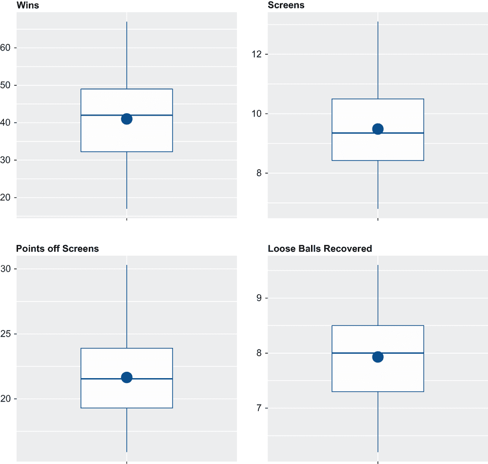

图 5.3 变量 `wins`、`screens_assists`、`screen_assists_pts` 和 `loose_balls` 的箱线图。这些变量中没有任何异常值。

除了变量 `deflections` 之外，hustle 数据集中只有另外两个变量包含异常值：`contested_2pt` 和 `contested_shots`。变量 `contested_2pt` 有一个异常值超过了最大值，而变量 `contested_shots` 有成对的异常值高于最大值，还有两个异常值低于最小值。

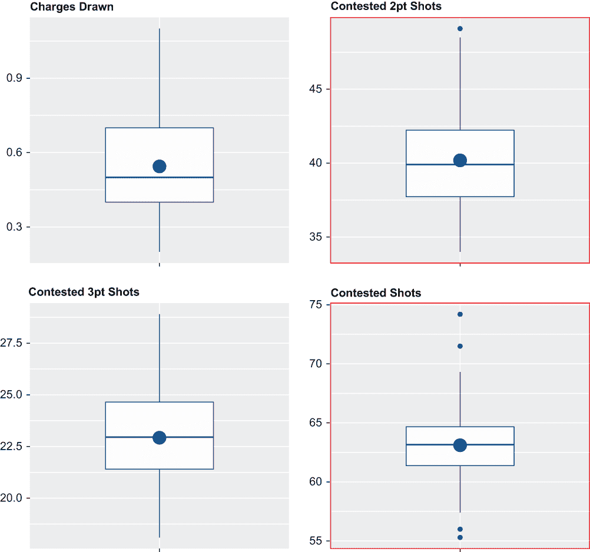

图 5.4 为 hustle 数据集中变量 `charges`、`contested_2pt`、`contested_3pt` 和 `contested_shots` 的箱线图。其中有两个变量存在异常值。

下一段代码将那些高于最大值的异常值降低，将那些低于最小值的异常值增加：

```
hustle$contested_2pt[hustle$contested_2pt > 48.5] = 48.5
hustle$contested_shots[hustle$contested_shots > 69.3] = 69.3
hustle$contested_shots[hustle$contested_shots < 57.4] = 57.4
```

对 `max()` 函数的调用确认了变量 `contested_2pt` 的最大值已从 49.10 降低到 48.5：

```
max(hustle$contested_2pt)
## [1] 48.5
```

然后绘制第二个箱线图（见图 5.5），显示变量 `contested_2pt` 现在没有任何异常值：

```
bp11 <- ggplot(hustle, aes(x = "", y = contested_2pt)) + 
  labs(title = "Contested 2pt Shots",
       subtitle = "post-winsorization boxplot", 
       x = "", 
       y = "") +
  geom_boxplot(color = "dodgerblue4", fill = "grey65", width = 0.5) +
  stat_summary(fun = mean, geom = "point", shape = 20, size = 8, 
               color = "dodgerblue4", fill = "dodgerblue4") + 
  theme(plot.title = element_text(face = "bold")) +
  print(bp11)
```

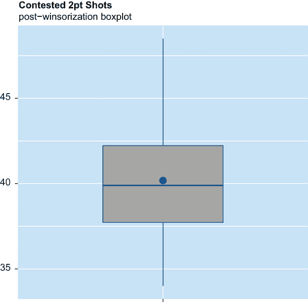

图 5.5 winsorization 后变量 `contested_2pt` 的新或修订分布

紧接着对 `max()` 函数的调用之后，紧接着调用基础 R 的 `min()` 函数，返回变量 `contested_shots` 的新最大值和最小值：

```
max(hustle$contested_shots)
## [1] 69.3
min(hustle$contested_shots)
## [1] 57.4
```

`contested_shots` 的最大值从 74.20 降低到 69.30，最小值从 55.30 增加到 57.40。

我们接下来的可视化显示了变量`contested_ shots`的新分布，现在它不再包含任何异常值，而之前它包含了四个（见图 5.6）：

```
bp12 <- ggplot(hustle, aes(x = "", y = contested_shots)) + 
  labs(title = "Contested Shots",
       subtitle = "post-winsorization boxplot", 
       x = "", 
       y = "") +
  geom_boxplot(color = "dodgerblue4", fill = "grey65", width = 0.5) +
  stat_summary(fun = mean, geom = "point", shape = 20, size = 8, 
               color = "dodgerblue4", fill = "dodgerblue4") + 
  theme(plot.title = element_text(face = "bold")) 
print(bp12)
```

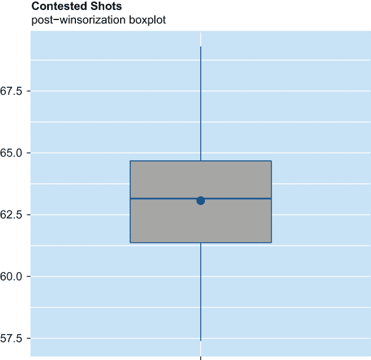

图 5.6 经过 winsorization 后的变量`contested_shots`的新或修订分布

线性回归也期望目标变量以及特别是预测变量呈正态分布以获得最佳结果（这就是为什么非正态变量通常会被转换以使其呈正态分布）。尽管 hustle 数据集现在没有异常值，但这并不意味着我们的变量现在具有正态或高斯分布。接下来，我们将使用一系列密度图来可视化每个变量的分布，并通过针对每个变量的统计测试来补充我们的持续视觉方法，以确定每个变量是否呈正态分布。

## 5.5 检查正态性

现在已经处理了异常值，接下来我们将创建一系列密度图，作为可视化每个变量频率分布或形状的手段。此外，在创建每个密度图之前，我们将调用基础 R 中的`shapiro.test()`函数来运行 Shapiro-Wilk 测试，以确定每个变量，无论其分布看起来是否正常或不太正常，是否满足正态分布。Shapiro-Wilk 测试只是几种正态性测试中的一种，尽管无疑是最常见的。另一种相当常见的正态性测试是 Kolmogorov-Smirnov 测试。R 支持这些和其他类似的测试。

Shapiro-Wilk 测试的零假设是数据呈正态分布。因此，如果 p 值——定义为观察到的差异可能偶然发生的概率——小于或等于 0.05，我们将拒绝零假设，并得出结论说数据是非正态的。另一方面，当 p 值大于 0.05 时，我们反而会得出结论说数据是正态分布的，并且零假设不应该被拒绝。

假设检验和 p 值

让我们暂时休息一下，来讨论一下假设检验和 p 值的一些额外要点。假设检验，或称统计推断，主要是测试一个假设，并从一组或多组数据系列中得出结论。假设检验本质上评估结果有多不寻常或不太不寻常，以及它们是否过于极端或不可能是偶然的结果。

我们应该始终假设的是所谓的零假设，表示为 H[0]，它表明在一个变量或两个数据系列之间不存在任何统计上显著或不寻常的情况。因此，我们需要非凡的证据来拒绝零假设，并接受备择假设，表示为 H[1]**。

这个证据是 p 值，特别是通常接受的 5% 的显著性阈值。虽然 5% 可能有些武断，但我们同意这是一个非常小的数字，所以我们设定了一个很高的标准来推翻或拒绝零假设。

如前所述，线性建模期望变量是正态分布的，因此任何在 Shapiro-Wilk 测试结果中 p 值小于或等于 0.05 的预测变量将被排除在模型开发之外。将不会应用数据转换或其他纠正措施。

### 5.5.1 原型

再次，我们将使用变量 `deflections` 来原型化所有这些（见图 5.7）。但首先，我们调用基础 R 的 `options()` 函数来禁用科学记数法；我们更喜欢结果以完整数字形式返回，而不是以科学记数法形式。

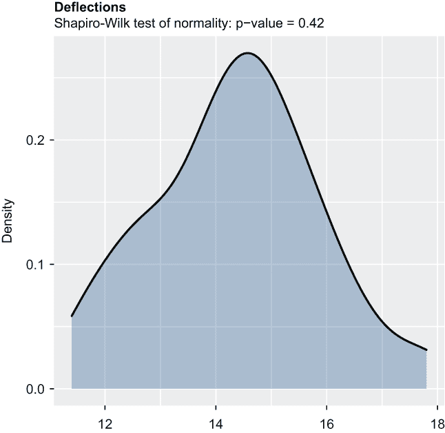

图 5.7 变量 `deflections` 的密度图。由于 Shapiro-Wilk 正态性测试返回的 p 值大于 0.05，我们可以得出结论，`deflections` 假设正态分布。

作为提醒，密度图是直方图的平滑版本，不允许我们通过实验不同的箱数来扭曲分布形状。我们只向 `ggplot()` 函数传递一个 hustle 变量，然后调用 `geom_density()` 函数来绘制密度图。R 随后返回一个图表，y 轴变量不是频率或计数，而是一个概率密度函数，其中频率低时概率低，频率高时概率高。否则，x 轴代表数据中的值范围，就像直方图一样：

```
options(scipen = 999)

shapiro.test(hustle$deflections)
## 
##  Shapiro-Wilk normality test
## 
## data:  hustle$deflections
## W = 0.98557, p-value = 0.4235
dp1 <- ggplot(hustle, aes(x = deflections)) +
  geom_density(alpha = .3, fill = "dodgerblue4") +
  labs(title = "Deflections",
       subtitle = "Shapiro-Wilk test of normality: p-value = 0.42",
       x = "", 
       y = "Density") +
  theme(plot.title = element_text(face = "bold")) 
print(dp1)
```

变量 `deflections` *似乎* 是正态分布的，并且根据 Shapiro-Wilk 测试结果，p 值显著高于 0.05 的显著性阈值，*是* 正态分布的。如果可以称之为这个过程的话，它将在下一节中重复应用于 hustle 数据集中的每个剩余变量。

### 5.5.2 检查其他分布的正态性

在我们的下一个代码块中，我们再次采取逐变量方法。我们将通过调用 `shapiro.test()` 函数运行一系列 Shapiro-Wilk 测试，并绘制一系列密度图。结果随后分为两个面板（见图 5.8 和 5.9）。任何显示非正态分布的图表都将根据 Shapiro-Wilk 测试结果绘制红色边框。同样，代码在从一个图表到下一个图表之间几乎是可重复的：

```
shapiro.test(hustle$wins)
## 
##  Shapiro-Wilk normality test
## 
## data:  hustle$wins
## W = 0.98034, p-value = 0.1907
dp2 <- ggplot(hustle, aes(x = wins)) +
  geom_density(alpha = .3, fill = "dodgerblue4") +
  labs(title = "Wins",
       subtitle = "Shapiro-Wilk test of normality: p-value = 0.19",
       x = "", 
       y = "Density") +
  theme(plot.title = element_text(face = "bold"))

shapiro.test(hustle$screen_assists)
## 
##  Shapiro-Wilk normality test
## 
## data:  hustle$screen_assists
## W = 0.98309, p-value = 0.2936
dp3 <- ggplot(hustle, aes(x = screen_assists)) +
  geom_density(alpha = .3, fill = "dodgerblue4") +
  labs(title = "Screens",
       subtitle = "Shapiro-Wilk test of normality: p-value = 0.29",
       x = "", 
       y = "Density") +
  theme(plot.title = element_text(face = "bold"))

shapiro.test(hustle$screen_assists_pts)
## 
##  Shapiro-Wilk normality test
## 
## data:  hustle$screen_assists_pts
## W = 0.9737, p-value = 0.06464
dp4 <- ggplot(hustle, aes(x = screen_assists_pts)) +
  geom_density(alpha = .3, fill = "dodgerblue4") +
  labs(title = "Points off Screens",
       subtitle = "Shapiro-Wilk test of normality: p-value = 0.06",
       x = "", 
       y = "Density") +
  theme(plot.title = element_text(face = "bold"))
shapiro.test(hustle$loose_balls)
## 
##  Shapiro-Wilk normality test
## 
## data:  hustle$loose_balls
## W = 0.98109, p-value = 0.2148
dp5 <- ggplot(hustle, aes(x = loose_balls)) +
  geom_density(alpha = .3, fill = "dodgerblue4") +
  labs(title = "Loose Balls Recovered",
       subtitle = "Shapiro-Wilk test of normality: p-value = 0.21",
       x = "", 
       y = "Density") +
  theme(plot.title = element_text(face = "bold"))

shapiro.test(hustle$charges)
## 
##  Shapiro-Wilk normality test
## 
## data:  hustle$charges
## W = 0.95688, p-value = 0.004562
dp6 <- ggplot(hustle, aes(x = charges)) +
  geom_density(alpha = .3, fill = "dodgerblue4") +
  labs(title = "Charges Drawn",
       subtitle = "Shapiro-Wilk test of normality: p-value = 0.00",
       x = "", 
       y = "Density") +
  theme(plot.title = element_text(face = "bold")) +
  theme(panel.background = element_rect(color = "red", size = 2))

shapiro.test(hustle$contested_2pt)
## 
##  Shapiro-Wilk normality test
## 
## data:  hustle$contested_2pt
## W = 0.97663, p-value = 0.1045
dp7 <- ggplot(hustle, aes(x = contested_2pt)) +
  geom_density(alpha = .3, fill = "dodgerblue4") +
  labs(title = "Contested 2pt Shots",
       subtitle = "Shapiro-Wilk test of normality: p-value = 0.10",
       x = "", 
       y = "Density") +
  theme(plot.title = element_text(face = "bold"))

shapiro.test(hustle$contested_3pt)
## 
##  Shapiro-Wilk normality test
## 
## data:  hustle$contested_3pt
## W = 0.98301, p-value = 0.2899
dp8 <- ggplot(hustle, aes(x = contested_3pt)) +
  geom_density(alpha = .3, fill = "dodgerblue4") +
  labs(title = "Contested 3pt Shots",
       subtitle = "Shapiro-Wilk test of normality: p-value = 0.29",
       x = "", 
       y = "Density") +
  theme(plot.title = element_text(face = "bold"))

shapiro.test(hustle$contested_shots)
## 
##  Shapiro-Wilk normality test
## 
## data:  hustle$contested_shots
## W = 0.98106, p-value = 0.2138
dp9 <- ggplot(hustle, aes(x = contested_shots)) +
  geom_density(alpha = .3, fill = "dodgerblue4") +
  labs(title = "Contested 2pt Shots",
       subtitle = "Shapiro-Wilk test of normality: p-value = 0.21",
       x = "", 
       y = "Density") +
  theme(plot.title = element_text(face = "bold")) 
```

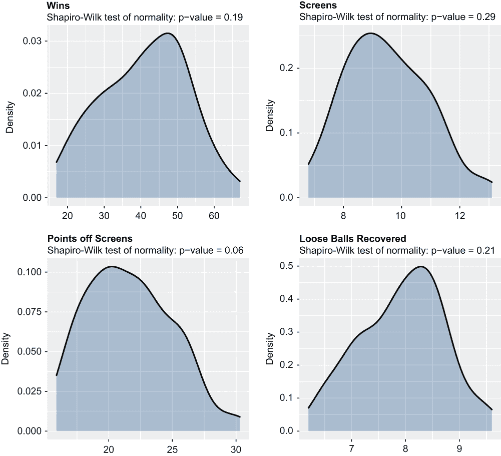

图 5.8 变量 `wins`、`screens_assists`、`screen_assists_pts` 和 `loose_balls` 的密度图。由于 Shapiro-Wilk 测试返回的 p 值高于 0.05 的显著性阈值，这四个变量都是正态分布的。

然后，我们的密度图被打包成一对 4 × 2 矩阵：

```
dp2 + dp3 + dp4 + dp5 + plot_layout(ncol = 2)
dp6 + dp7 + dp8 + dp9 + plot_layout(ncol = 2) 
```

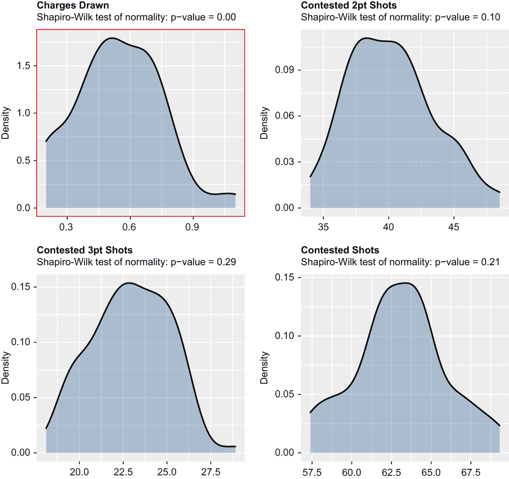

图 5.9 变量 `charges`、`contested_2pt`、`contested_3pt` 和 `contested_shots` 的密度图。只有“Charges Drawn”不是正态分布。

结果表明，只有变量 `charges` 的分布不符合正态分布，根据 Shapiro-Wilk 测试，在 p 值等于预定义的 5% 显著性阈值时划出了一条界线。变量 `screen_assists_pts` 和 `contested_2pt` 的 Shapiro-Wilk p 值仅略高于 0.05，这表明它们的分布几乎是非正态的。但再次强调，我们正在应用 0.05 的 p 值作为硬截止点；因此，我们将从线性建模中*保留*变量 `charges`。

尽管如此，我们仍有几个变量在考虑范围内。在下一节中，我们将可视化和测试剩余预测变量与变量 `wins` 之间的相关性，以确定其中哪些可能是最佳候选者，用于解释甚至预测常规赛的胜利。

## 5.6 可视化和测试相关性

总结一下，我们首先识别了数据中的异常值，然后相应地将这些数据点限制在最大值或最小值。其次，我们测试了变量的正态性，以确定哪些可以继续使用，哪些需要从任何进一步的分析和测试中保留。

现在，我们将计算变量 `wins` 与剩余变量之间的相关系数，并使用相关矩阵进行可视化。相关系数始终等于介于 -1 和 +1 之间的某个值。当一对变量的相关系数等于或接近 +1 时，我们可以得出结论，它们之间存在正相关关系；如果它们的相关系数相反等于 -1 或接近那个值，我们可以交替得出结论，它们之间存在负相关关系；如果它们的相关系数接近 0，那么它们之间根本不存在有意义的关联。

我们在这里的目的在于确定哪些变量可能是最佳拟合，或者根本不适合，作为线性回归模型中的预测变量。当处理宽数据集时，这是一个特别相关的练习，因为它使得进一步检查数据并识别高潜力预测变量比在模型中包含每个独立变量（无论是否增加任何值）更有意义。

### 5.6.1 原型

变量 `deflections` 将再次用于演示目的。调用基本的 R `cor()` 函数来计算变量 `deflections` 和 `wins` 之间的相关系数。

然后创建一个 `ggplot2` 相关性图来可视化这两个相同变量之间的关系，其中 x 轴变量是潜在的预测变量 `deflections`，y 轴变量是未来的因变量或目标变量 `wins`（见图 5.10）。相关系数被添加为副标题，并调用 `geom_smooth()` 函数来通过数据绘制回归线。我们得到一个相关性图，就像我们在上一章中绘制的那样：

```
cor(hustle$deflections, hustle$wins) 
## [1] 0.2400158
cor1 <- ggplot(hustle, aes(x = deflections, y = wins)) + 
  geom_point(size = 3) +
  labs(title = "Deflections and Wins", 
       subtitle = "correlation coefficient = 0.24",
       x = "Deflections per Game", 
       y = "Regular Season Wins") + 
  geom_smooth(method = lm, se = FALSE) +
  theme(plot.title = element_text(face = "bold")) 
print(cor1)
```

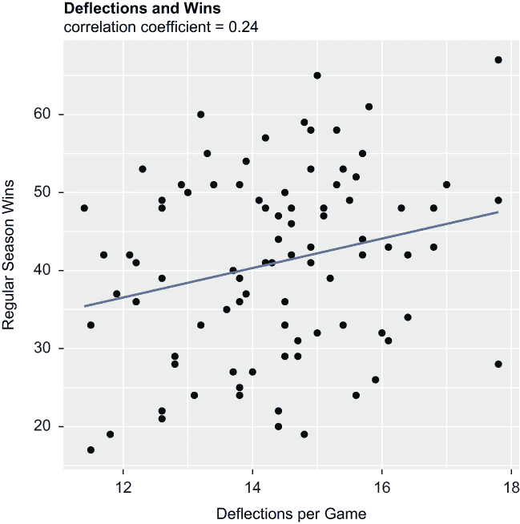

图 5.10 一个可视化 `deflections` 和 `wins` 变量之间关系的相关性图

当 `deflections` 和 `wins` 之间的相关系数为 0.24 时，两者之间存在正相关，但除此之外，这种关联并不引人注目。让我们看看这种关联与其他预测变量与 `wins` 变量之间的相关系数相比如何。

### 5.6.2 可视化和测试其他相关性

作为按顺序绘制相关性的替代方案，有一个大爆炸选项，只需要两行代码。在下一个代码块的第一行中，我们创建了一个名为 hustle2 的数据集，它是 hustle 的副本，但不包括连续变量 `deflections` 和 `charges` 以及因子变量 `team`、`season` 和 `team_season`。被丢弃的变量位于 1-3、6 和 8 位置。

然后，我们调用 `GGally` 包中的 `ggpairs()` 函数，从而生成一个矩阵，该矩阵使用 `ggplot2` 的外观和感觉来可视化左边的相关性，在右边显示相关系数，并在中间绘制变量分布。然后，我们添加或附加对 `theme()` 函数的调用，以便将 x 轴标签旋转 90 度。（见图 5.11。）根据您的系统，这可能需要几秒钟才能运行：

```
hustle %>% 
  select(-c(1:3, 6, 8)) -> hustle2
ggpairs(hustle2) + 
  theme(axis.text.x = element_text(angle = 90, hjust = 1))
```

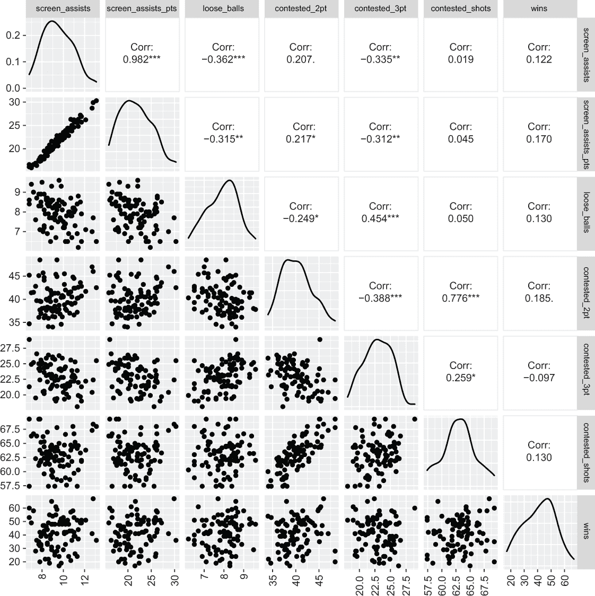

图 5.11 一个可视化并计算 hustle 数据集变量子集之间相关性的相关性矩阵

结果表明，剩余的 hustle 变量中没有任何一个与 `wins` 有强烈的正相关或负相关；事实上，没有一个与 `wins` 的相关系数等于或像 `deflections` 和 `wins` 之间的相关系数那样有意义。

调用基础 R 的 `cor()` 函数返回这些相同结果的表格视图，这是调用 `ggpairs()` 函数并渲染相关性矩阵的更快的替代方案：

```
cor(hustle2)
##                    screen_assists screen_assists_pts loose_balls
## screen_assists         1.00000000         0.98172006 -0.36232361
## screen_assists_pts     0.98172006         1.00000000 -0.31540865
## loose_balls           -0.36232361        -0.31540865  1.00000000
## contested_2pt          0.20713399         0.21707461 -0.24932814
## contested_3pt         -0.33454664        -0.31180170  0.45417789
## contested_shots        0.01946603         0.04464369  0.05003144
## wins                   0.12180282         0.16997124  0.12997385
##                    contested_2pt contested_3pt contested_shots
## screen_assists         0.2071340   -0.33454664      0.01946603
## screen_assists_pts     0.2170746   -0.31180170      0.04464369
## loose_balls           -0.2493281    0.45417789      0.05003144
## contested_2pt          1.0000000   -0.38772620      0.77579822
## contested_3pt         -0.3877262    1.00000000      0.25889619
## contested_shots        0.7757982    0.25889619      1.00000000
## wins                   0.1854940   -0.09666249      0.13024121
##                           wins
## screen_assists      0.12180282
## screen_assists_pts  0.16997124
## loose_balls         0.12997385
## contested_2pt       0.18549395
## contested_3pt      -0.09666249
## contested_shots     0.13024121
## wins                1.00000000
```

这就完成了所有线性回归的前期工作。我们已识别并调整了异常值，测试了正态性，然后确定了要向前推进的 hustle 变量子集，并测试了潜在预测变量与变量`wins`之间的相关性。通过这个过程，我们确定`deflections`、`contested_2pt`和`screen_assists_pts`可能比其他预测变量对胜利有更大的影响，因为它们的相关系数较高，而`wins`与完全中性的距离最远。

## 5.7 多元线性回归

与仅对一个预测变量（例如`wins`对`deflections`）进行简单线性回归测试的目标变量不同，多元线性回归测试的目标变量与两个或更多预测变量。线性回归*必须*包含一个连续的目标变量；预测变量通常是连续的，但也可以是分类的。换句话说，线性模型旨在预测目标变量在某个范围内的变化，例如 0-100 分的测试分数或 0-82 分的常规赛胜利。相比之下，*逻辑回归*（见第十四章）包含一个二元目标变量，例如哪些学生会或不会获得及格成绩，或者哪些 NBA 球队会或不会以胜利的记录完成常规赛。

我们的主要目标是展示以下内容：

+   如何将数据集中的观测值随机分成两个互斥的子集，其中一个将用于模型拟合，另一个用于生成预测

+   如何拟合多元线性回归

+   如何返回模型结果并解释

+   如何检查多重共线性

+   如何运行模型诊断并解释图表

+   如何比较两个具有相同目标变量（即每个模型也包含不同混合的预测变量）的竞争性线性模型

+   如何预测

话虽如此，让我们开始我们的回归测试。

### 5.7.1 将数据子集到训练集和测试集

我们的多元回归练习首先将 75%的 hustle 观测值子集到一个名为 train 的数据集中，将剩余的 25%子集到 test 中；我们将对 train 拟合线性模型，然后在 test 上进行预测。如果我们对 100%的记录进行拟合和预测，我们就有可能过度拟合我们的模型；也就是说，它们基本上会记住数据，而不一定对新数据有良好的响应。

以下`dplyr`代码块首先从 hustle 数据集中提取（即过滤）每第四个观测值，并将结果永久地转换到一个名为 test 的新对象中；因此，test 的行数等于 23，大约是 hustle 中 90 个观测值的 25%。然后我们调用`anti_join()`函数创建一个名为 train 的对象，它包含 67 个尚未分配给 test 的 hustle 观测值：

```
hustle %>%
  filter(row_number() %% 4 == 1) -> test
train <- anti_join(hustle, test)
```

然后，我们两次调用`dim()`函数来返回 train 和 test 的维度，从而确认我们的训练和测试分割按设计工作：

```
dim(train)
## [1] 67 12
dim(test)
## [1] 23 12
```

### 5.7.2 拟合模型

来自基础 R 的`lm()`函数被用来拟合线性模型。我们的第一个模型，fit1，将`wins`对变量`screen_assists_pts`、`deflections`、`loose_balls`、`contested_2pt`和`contested_shots`进行回归。这些变量是基于我们刚刚计算出的相关系数被选为预测变量的。

语法简单直接。目标变量通过波浪号与预测变量分隔，预测变量通过加号分隔，并指向我们的数据源：

```
fit1 <- lm(wins ~ screen_assists_pts + deflections + loose_balls + contested_2pt + contested_shots, data = train)
```

### 5.7.3 返回和解释结果

然后，我们调用`broom`包中的一系列函数，逐步返回结果。`tidy()`函数的调用特别返回一个 6 × 5 的 tibble，其中最重要的是包含系数估计和 p 值：

```
tidy(fit1)
## # A tibble: 6 × 5
##   term               estimate std.error statistic p.value
##   <chr>                 <dbl>     <dbl>     <dbl>   <dbl>
## 1 (Intercept)         -62.9      38.6      -1.63   0.108 
## 2 screen_assists_pts    1.04      0.441     2.35   0.0219
## 3 deflections           2.23      0.882     2.53   0.0138
## 4 loose_balls           5.38      2.19      2.45   0.0170
## 5 contested_2pt         0.525     0.763     0.688  0.494 
## 6 contested_shots      -0.241     0.790    -0.305  0.761
```

p 值等于或小于 0.05 的变量对`wins`的方差有统计学上的显著影响。否则，我们可以将`tidy()`函数返回的系数估计与 hustle 数据集的实际值结合起来，创建一个线性方程，该方程相对于 fit1 具有以下形式：

*y* = *B*[0] + *B*[1]*X*[1] + *B*[2]*X*[2] + *B*[3]*X*[3] + *B*[4]*X*[4] + *B*[5]*X*[5]

在这个方程中，请注意以下内容：

+   *y*是因变量`wins`的预测值。

+   *B*[0]是 y 截距，或常数项；它表示拟合回归线与 y 轴交叉的值。

+   *B*[1]*X*[1]是第一个 fit1 预测变量`screen_assists_pts`的回归系数，其中*B*[1]等于 1.04，而*X*[1]是每场比赛通过挡拆得分平均得分点数。

+   *B*[2]*X*[2]是第二个预测变量`deflections`的回归系数，其中*B*[2]等于 2.23，而*X*[2]是每场比赛的平均折返次数。

+   *B*[3]*X*[3]是`loose_balls`的回归系数，即 5.38 乘以每场比赛平均找回的松球次数。

+   *B*[4]*X*[4]是`contested_2pt`的回归系数，即 0.53 乘以每场比赛平均被争抢的两分投篮次数。

+   *B*[5]*X*[5]是`contested_shots`的回归系数，即-0.24 乘以每场比赛平均被争抢的总投篮次数。

让我们将 2016-17 赛季迈阿密热火的相关 hustle 统计数据插入 fit1 线性方程中，以展示这些结果。在 2016-17 赛季常规赛中，热火每场比赛平均通过挡拆得分 22.3 分，14.2 次折返，7.2 次找回松球，45.5 次被争抢的两分投篮次数，以及 64.7 次被争抢的总投篮次数。连续调用`dplyr filter()`和`select()`函数从 hustle 数据集中提取 MIA 17 记录的子集：

```
hustle %>%
  filter(team_season == "MIA 17") %>%
  select(wins, screen_assists_pts, deflections, loose_balls,
         contested_2pt, contested_shots)
##    wins screen_assists_pts deflections loose_balls contested_2pt 
## 1    41               22.3        14.2         7.2          45.5 
##    contested_shots
## 2             64.7
```

因此，我们的线性回归将“预测”（这些数字是从训练数据生成的，而不是测试数据）迈阿密的胜场总数如下：

```
wins = -62.91 + (1.04 * 22.3) + (2.23 * 14.2) + (5.38 * 7.2) + 
  (0.52 * 45.5) - (0.24 * 64.7)
print(round(wins))
## [1] 39
```

减去误差项后，fit1 预测 2016-17 热队将赢得 39 场胜利（这是通过将 `print()` 函数与基础 R 的 `round()` 函数结合来四舍五入到最接近的整数），而该赛季热队实际上赢得了 41 场比赛。这还不错；然而，后续的证据将揭示，fit1 在预测 .500 级别球队（如 2016-17 热队）的常规赛胜场数时比预测像 2017-18 胡斯顿火箭队（赢得 65 场比赛）或 2018-19 纽约尼克斯队（仅赢得 17 场比赛）这样的球队时更加准确。（每个 NBA 球队都参加 82 场常规赛的比赛。）

现在让我们假设热队实际上每场比赛回收了 8.2 个松散的球，而不是 7.2 个；在这种情况下，fit1 将预测 44 场胜利（同样，这已经被四舍五入到最接近的整数）。我们通过将线性方程中的 7.2 替换为 8.2 来得到这个结果。然而，从根本上说，对于变量 `loose_balls` 的每单位增加（或减少），对 `wins` 的预测值将增加（或减少）5.38。同样，如果热队能够每场比赛多拦截一次传球，fit1 将预测多赢得 2.23 场胜利（其他条件保持不变）：

```
wins = -62.91 + (1.04 * 22.3) + (2.23 * 14.2) + (5.38 * 8.2) + 
  (0.52 * 45.5) - (0.24 * 64.7)
print(round(wins))
## [1] 44
```

然而，并非所有 fit1 预测变量都对胜场数有统计学上的显著影响。只有 `screen_assists_pts`、`deflections` 和 `loose_balls` 这三个变量的 p 值低于通常接受的和预定义的 0.05 显著性阈值，而 `contest_2pt` 和 `contested_shots` 这两个变量的 p 值则显著高于 5% 的阈值。因此，我们的第一次多元线性回归揭示了只有 *一些* 疯狂统计数据对常规赛胜场数有显著影响。

来自 `broom` 包的 `augment()` 函数返回了诸如实际胜场数以及相同数据的拟合值等数据；结果被转换为一个名为 fit1_tbl 的 tibble。然后我们调用 `head()` 函数两次，首先返回变量 `wins` 的前六个值，其次返回变量 `.fitted` 的前六个值：

```
augment(fit1) -> fit1_tbl
head(fit1_tbl$wins)
## [1] 49 42 39 19 33 54
head(fit1_tbl$.fitted)
## [1] 37.84137 41.64023 40.52752 31.68228 33.81274 38.46419
```

然后，在下面的 `dplyr` 代码块中，我们首先调用 `mutate()` 函数创建一个新变量 `wins_dif`，它是 fit1_tbl 变量 `wins` 和 `.fitted` 之间的绝对差值（注意对基础 R 的 `abs()` 函数的调用）。然后我们调用基础 R 的 `mean()` 函数来计算实际胜场数和拟合胜场数之间的平均差异：

```
fit1_tbl %>%
  mutate(wins_dif = abs(wins - .fitted)) -> fit1_tbl
mean(fit1_tbl$wins_dif)
## [1] 8.274887
```

平均而言，我们的 fit1 线性方程返回的常规赛胜场数比实际常规赛胜场数多 8.27 场或少 8.27 场。

最后，`broom`包中的`glance()`函数返回最重要的 R-squared（R²）和调整后的 R²统计量。R²是一个统计量，表示目标变量中由预测因子解释的方差比例。因此，它等于 0 到 1 之间的某个数字，其中 1 表示预测因子解释了所有方差，而 0 表示预测因子未能解释任何方差。

调整后的 R²是 R²的修改版，它考虑了预测因子的数量。虽然当其他预测因子被添加到回归模型中时，R²自然会增加，但如果这些相同的预测因子没有对模型的预测能力做出贡献，调整后的 R²实际上会减少。模型越复杂，R²和调整后的 R²的差异就越大：

```
glance(fit1)
## # A tibble: 1 × 12
##   r.squared adj.r.squared sigma statistic p.value    df logLik 
##       <dbl>         <dbl> <dbl>     <dbl>   <dbl> <dbl>  <dbl>
## 1     0.202         0.137  10.9      3.09  0.0150     5  -252\.  
##        AIC   BIC deviance df.residual  nobs
##      <dbl> <dbl>    <dbl>       <int> <int>
## 1     518\.  533\.    7230\.          61    67
```

因为 R²等于 0.20，所以 fit1 预测因子共同解释了常规赛胜利变化的约 20%，无论它们的各自 p 值如何。

但调整后的 R²仅为 0.14，毫无疑问，这是由于 fit1 包含一对预测因子`contested_2pt`和`contested_shots`，由于它们的各自 p 值高于 5%的阈值，因此对胜利没有统计学上的显著影响。换句话说，我们的模型包含噪声。因此，根据这个度量，实际上更准确的说法是 fit1 最好解释了胜利变化的 14%，而不是 20%。

### 5.7.4 检查多重共线性

现在，让我们检查 fit1 中的多重共线性。再次强调，多重共线性是指两个或更多预测因子高度相关的情况；也就是说，它们之间的相关系数等于或接近+1。多重共线性的最显著后果是它人为地增加了解释的方差。正如我们刚才提到的，随着每个额外预测因子的增加，R²会自动和递增地增加；同时，调整后的 R²会减少，但如果额外的预测因子本身在统计学上是显著的，那么减少的幅度不会很大。但是，当存在多重共线性时，我们实际上是在重复计算；因此，R²和调整后的 R²度量都会被人为地提高。

我们从`car`包中调用`vif()`函数来测试多重共线性。根据我们之前进行的相关性测试，fit1 可能不包含多重共线性，但无论如何，测试它是一个最佳实践，以确保我们没有过度拟合：

```
vif(fit1)
## screen_assists_pts        deflections        loose_balls      
##           1.155995           1.062677           1.314189           
## contested_2pt    contested_shots 
##      3.052934           2.637588
```

如果 fit1 预测因子的方差膨胀因子中任何一个超过 5，我们应该丢弃这些变量，然后拟合一个简化模型，即具有较少预测因子的模型。但正如我们所看到的，fit1 所有预测因子的方差膨胀因子都小于 5。

### 5.7.5 运行和解释模型诊断

来自基础 R 的`plot()`函数返回关于线性和正态性的模型诊断（见图 5.12）。当`plot()`函数前有基础 R 的`par()`函数时，这些诊断信息会以 2×2 矩阵的形式打印出来。这些图表明 fit1 满足线性和正态性的先决条件，从而验证了我们第一个模型的完整性，即使我们可能对结果并不完全满意：

```
par(mfrow = c(2, 2))
plot(fit1)
```

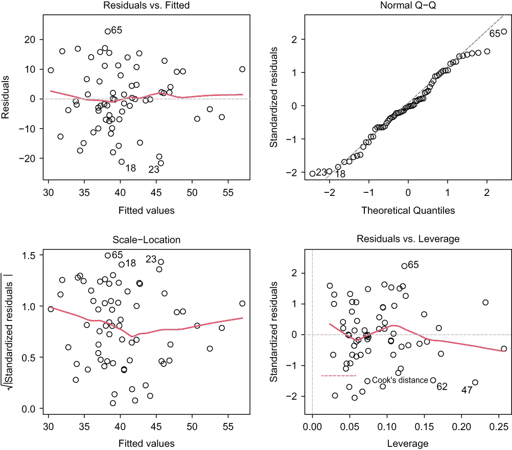

图 5.12 第一个多元线性回归模型的模型诊断

诊断图帮助我们评估拟合优度，并验证关于线性和正态性的初始假设。让我们逐一分析。

上左象限的残差与拟合值图显示了模型残差沿 y 轴和拟合值沿 x 轴。残差是从实际值到拟合回归线的垂直距离的度量；模型残差或误差应该遵循正态分布。数据点大致围绕水平线浮动，而不是遵循某种明显的模式，这是好事，因为它强烈表明残差确实遵循正态分布。

右上象限的正常 Q-Q 图是检查残差是否遵循正态分布的另一种检查。它将残差（已分为分位数，或四个相等大小的比例）与理论正态分布的分位数进行比较；前者沿 y 轴绘制，后者沿 x 轴绘制。请注意，这两个数据系列都已转换为标准化尺度。残差应遵循对角线，没有任何严重的偏差，正如它们应该的那样。当然，对齐并不完美，我们确实看到两端有一些中等程度的偏差，但这里没有什么可以引起我们对正态性和线性或缺乏线性有任何严重担忧的。

左下象限的尺度-位置图，也称为散点-位置图或标准化残差的平方根图，用于评估所谓的同方差性。它还沿 y 轴绘制标准化残差的平方根，沿 x 轴绘制拟合值。同方差性是指回归分析中的一个统计假设，即残差（即实际值与拟合值之间的差异）的方差在所有预测变量的水平上都是恒定的。换句话说，它期望残差的分布或分散在整个独立变量的范围内大致相同。尺度-位置图应该并且确实类似于残差与拟合值图。

在右下象限的残差与杠杆作用图，更常被称为库克距离图，用于隔离任何观察值——基本上是异常值——它们对拟合回归线有过度的影响。它还沿 y 轴绘制了标准化残差，以及称为杠杆值的 x 轴。杠杆值代表每个观察值的影响。我们特别关注任何低于标注为库克距离的虚线水平线的数据点，当然，我们有一些这样的数据点。但我们的实际关注点应该集中在那条线以下和右下角的数据点，我们看到只有一个观察值同时满足这两个条件。我们的结果并不完美（在现实世界中很少完美），但我们没有理由感到恐慌或改变方向。

### 5.7.6 模型比较

合理的下一步是将那个观察值从训练数据中移除，然后重新运行我们的回归，但我们将采取更大的下一步。因为只有 fit1 预测器中的一部分对胜利有统计学上的显著影响，我们现在将拟合第二个多重回归模型，其中预测器 `screen_assist_pts`、`deflections` 和 `loose_balls` 仍然有效，但预测器 `contested_2pt` 和 `contested_shots` 被排除在外。因此，我们的第二个回归，命名为 fit2，仅仅是 fit1 的简化版本。随后的 `tidy()`、`augment()`、`glance()` 等函数调用返回结果，图 5.13 显示了诊断结果：

```
fit2 <- lm(wins ~ screen_assists_pts + deflections + loose_balls, 
           data = train)

tidy(fit2)
## # A tibble: 4 × 5
##   term               estimate std.error statistic p.value
##   <chr>                 <dbl>     <dbl>     <dbl>   <dbl>
## 1 (Intercept)          -56.1     25.5       -2.20 0.0317 
## 2 screen_assists_pts     1.12     0.422      2.65 0.0101 
## 3 deflections            2.35     0.859      2.74 0.00805
## 4 loose_balls            4.81     1.98       2.42 0.0182
augment(fit2) -> fit_tbl2
print(fit_tbl2)
# A tibble: 67 × 10
##    wins screen_assists_pts deflections loose_balls .fitted  .resid   
##   <int>              <dbl>       <dbl>       <dbl>   <dbl>   <dbl>  
## 1    49               20          14.1         8.3    39.3   9.66  
## 2    42               26.2        12.1         8      40.1   1.85  
## 3    39               25.7        12.6         8.1    41.2  -2.24  
## 4    19               22.4        11.8         7.6    33.3 -14.3   
## 5    33               20.1        11.5         8.4    33.8  -0.825 
## 6    54               19.9        13.9         8.6    40.2  13.8   
## 7    57               26.3        14.2         8.7    48.6   8.44  
## 8    53               16.6        14.9         8.4    37.9  15.1   
## 9    48               20.2        14.2         8.6    41.2   6.76  
##10    37               20.1        11.9         8.5    35.2   1.75  
##         hat .sigma  .cooksd .std.resid
##       <dbl>  <dbl>    <dbl>      <dbl>
## 1    0.0224   10.8 0.00472      0.907 
## 2    0.0726   10.8 0.000626     0.179 
## 3    0.0568   10.8 0.000691    -0.214 
## 4    0.0647   10.7 0.0324      -1.37  
## 5    0.0749   10.9 0.000128    -0.0797
## 6    0.0316   10.7 0.0138       1.30  
## 7    0.0792   10.8 0.0144       0.817 
## 8    0.0550   10.7 0.0303       1.44  
## 9    0.0298   10.8 0.00312      0.637 
##10    0.0632   10.9 0.000478     0.168 
## # ... with 57 more rows

fit_tbl2 %>%
  mutate(wins_dif = abs(wins - .fitted)) -> fit_tbl2
mean(fit_tbl2$wins_dif)
## [1] 8.427093
glance(fit2)
## # A tibble: 1 × 12
##   r.squared adj.r.squared sigma statistic p.value    df logLik   
##       <dbl>         <dbl> <dbl>     <dbl>   <dbl> <dbl>  <dbl> 
## 1     0.194         0.156  10.8      5.06 0.00334     3  -252\.  
##        AIC   BIC deviance df.residual  nobs
##       dbl> <dbl>    <dbl>       <int> <int>
## 1     514\.  525\.    7302\.          63    67

vif(fit2)
## screen_assists_pts        deflections        loose_balls 
##           1.085184           1.031128           1.098619
par(mfrow = c(2,2))
plot(fit2)
```

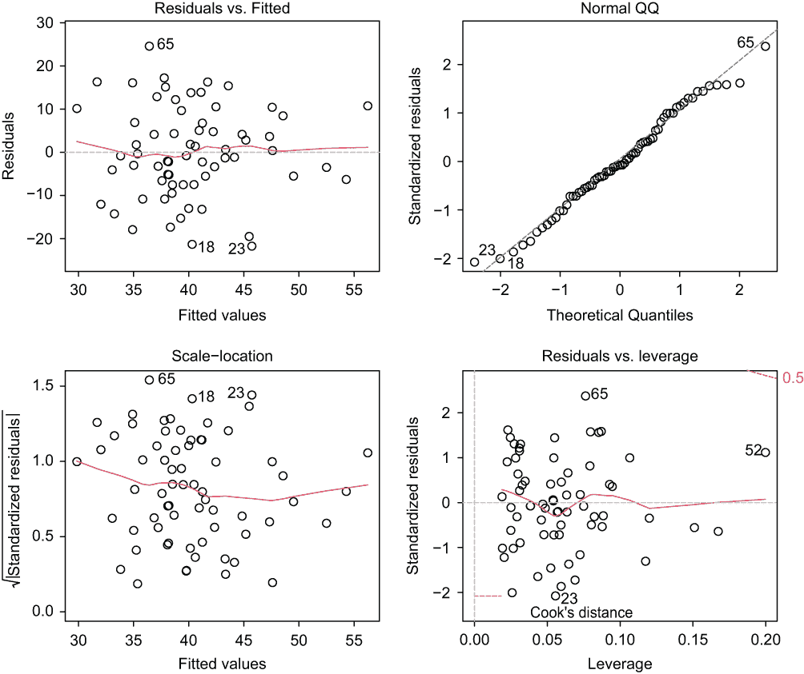

图 5.13 第二个，或简化的，多重线性回归模型模型诊断

在两个拟合回归模型中，fit2 模型相对于 fit1 模型来说是一个更好的模型，至少有以下原因：

+   fit2 模型中没有噪声——所有 fit2 预测器的 p 值都低于预定义的 0.05 显著性阈值。

+   我们的第二个回归模型仅仅是第一个模型的简化版本，但 fit2 模型比 fit1 模型更好地解释了胜利的方差，尽管这种改善很小：fit2 的调整 R² 统计量为 0.16，而 fit1 的为 0.14。这并不是说 fit2 能够很好地解释胜利的方差——但请记住这个想法。

+   我们的第二个模型比第一个模型具有更低的 AIC 得分，因此更好。AIC 是`glance()`函数返回的度量之一；或者，您也可以调用基础 R 的`AIC()`函数来返回相同的值。根据 AIC，最佳拟合模型是使用最少的预测因子来解释目标变量中大部分变差的模型；因此，它使用独立变量计数和对数似然估计作为输入。AIC 本身没有太大意义，但它是比较竞争模型的关键度量。此外，有一个经验法则表明，当一个模型的 AIC 得分比竞争模型低两个或更多单位时，具有较低 AIC 的模型比其他模型*显著*更好。嗯，fit1 的 AIC 为 518，fit2 的 AIC 为 514。

+   与 fit1 相比，fit2 的诊断结果略好，主要是因为残差与杠杆作用图没有包含任何低于 Cook 距离线的观测值。

然而，实际和拟合胜利次数之间的平均差异在 fit2（8.43）中略大于 fit1（8.27），但考虑到所有其他结果，这几乎微不足道。

### 5.7.7 预测

现在我们来看看 fit2 在测试中的表现。因此，我们调用基础 R 的`predict()`函数来预测常规赛胜利次数，上下限分别为 95%的置信区间（CI）。置信区间是一个范围，其中包含小于和大于预测值 y 的值，我们可以有 95%的信心认为它包含 y 的实际值。

`predict()`函数传递了三个参数：模型和数据源是必需的，而置信区间（CI），默认为 95%，是可选的。结果被转换成一个名为 fit2_pred 的对象，其中 fit 等于预测的常规赛胜利次数，`lwr`代表置信区间的下限，`upr`代表置信区间的上限：

```
fit2_pred <- predict(fit2, data.frame(test), interval = "confidence")
print(fit2_pred)
##         fit      lwr      upr
## 1  44.03632 37.33518 50.73746
## 2  32.32559 27.22836 37.42282
## 3  36.66966 31.99864 41.34067
## 4  33.97327 29.54744 38.39910
## 5  34.30091 28.39030 40.21152
## 6  43.32909 35.93216 50.72603
## 7  41.24102 35.64396 46.83807
## 8  44.46051 40.78216 48.13886
## 9  38.46246 34.58980 42.33511
## 10 41.12360 36.88138 45.36582
## 11 44.69284 40.73769 48.64799
## 12 37.34022 33.95924 40.72119
## 13 45.32616 39.41971 51.23261
## 14 50.02897 43.31042 56.74753
## 15 37.18162 33.31884 41.04439
## 16 42.25199 35.84835 48.65562
## 17 33.46908 27.89836 39.03979
## 18 34.15238 26.87326 41.43151
## 19 41.70479 36.39175 47.01783
## 20 34.30830 28.03565 40.58094
## 21 33.20151 27.19351 39.20951
## 22 43.30823 36.75603 49.86043
## 23 36.77234 29.78770 43.75698
```

然后我们调用`dplyr`包中的`select()`函数，将测试数据集减少到只包含变量`wins`：

```
test %>%
  select(wins) -> test
```

接下来，我们调用基础 R 中的`cbind()`函数将 fit2_pred 和 test 垂直连接，然后调用`dplyr`中的`mutate()`函数创建一个名为`wins_dif`的新变量，该变量等于变量`wins`和`fit`之间的绝对差值。结果被放入一个名为 fit_tbl_pred 的新对象中。

最后，我们使用基础 R 中的`mean()`函数计算`wins_dif`的平均值。结果等于 9.94，这表明我们的第二个回归在测试中的表现不如在训练中好：

```
cbind(fit2_pred, test) %>%
  mutate(wins_dif = abs(wins - fit)) -> fit_tbl_pred
mean(fit_tbl_pred$wins_dif)
## [1] 9.936173
```

`ggplot2`直方图绘制了 fit_tbl_pred 变量`wins_dif`的频率分布，即实际和预测胜利次数之间的差异（见图 5.14）：

```
p1 <- ggplot(fit_tbl_pred, aes(x = wins_dif)) +
  geom_histogram(fill = "snow1", color = "dodgerblue4", bins = 6) + 
  labs(title = "Frequency of Differences between
       Actual and Predicted Wins",
       subtitle = "Wins ~ Points Off Screens + Deflections + 
       Loose Balls Recovered",
       x = "Difference between Actual and Predicted Wins", 
       y = "Frequency") +
  theme(plot.title = element_text(face = "bold"))
print(p1)
```

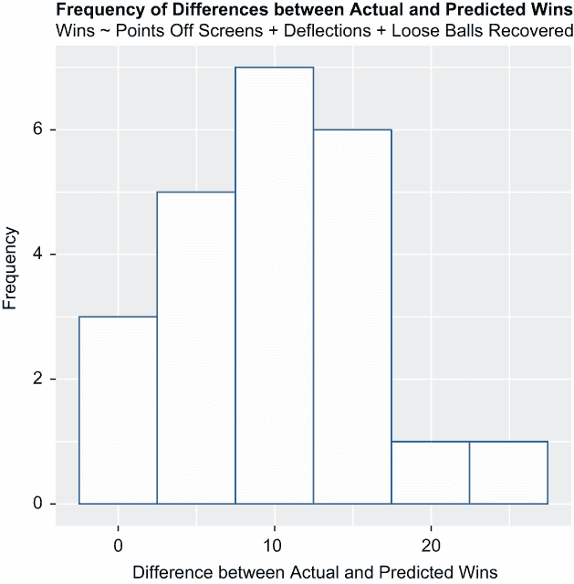

图 5.14 显示预测胜利与实际常规赛胜利之间绝对差异的频率分布

当实际常规赛胜利为 41 或左右时，我们得到更准确的结果；相反，当球队在一个 82 场的赛程中赢得的比赛非常少或非常多时，我们得到的结果就不那么准确了。

以下简短的 `dplyr` 代码块返回 `fit_tbl_pred` 记录，其中变量 `wins_dif` 大于 15，以及当同一变量小于 5 时的记录：

```
fit_tbl_pred %>%
  filter(wins_dif > 15)
##         fit      lwr      upr wins wins_dif
## 1  44.03632 37.33518 50.73746   29 15.03632
## 5  34.30091 28.39030 40.21152   60 25.69909
## 10 41.12360 36.88138 45.36582   24 17.12360
## 11 44.69284 40.73769 48.64799   65 20.30716
## 12 37.34022 33.95924 40.72119   22 15.34022
 fit_tbl_pred %>%
  filter(wins_dif < 5)
##         fit      lwr      upr wins  wins_dif
## 3  36.66966 31.99864 41.34067   41 4.3303443
## 13 45.32616 39.41971 51.23261   48 2.6738414
## 14 50.02897 43.31042 56.74753   52 1.9710281
## 16 42.25199 35.84835 48.65562   43 0.7480111
## 18 34.15238 26.87326 41.43151   37 2.8476181
## 22 43.30823 36.75603 49.86043   41 2.3082288
```

第二个 `ggplot2` 对象，一个折线图，比较实际胜利与预测胜利，预测值上方和下方的阴影区域代表上、下置信区间（见图 5.15）。

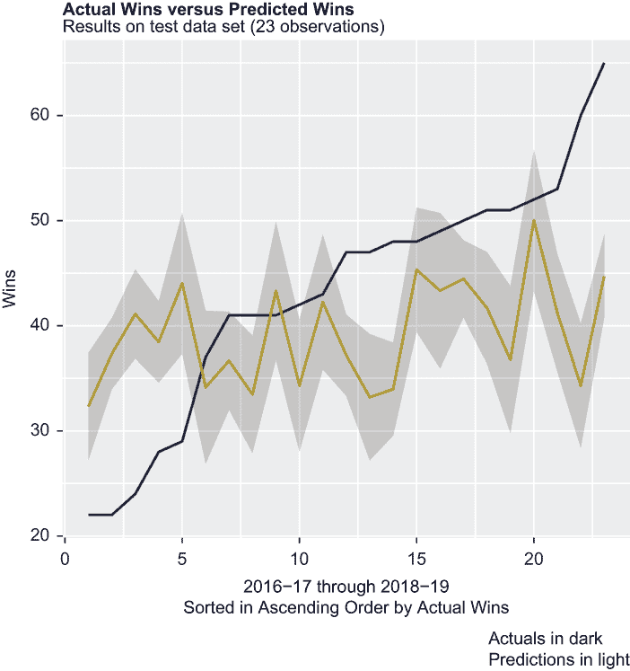

图 5.15 预测胜利与实际常规赛胜利的另一种视角

但首先，我们调用 `dplyr arrange()` 函数按变量 `wins` 的升序对 fit_tbl_pred 进行排序，然后添加一个名为 `row.num` 的新变量。这种方法有助于更明显地看出 fit2 在预测胜率接近或等于 .500 的球队方面做得比极端常规赛胜利数的球队要好得多：

```
fit_tbl_pred %>%
  arrange(wins) -> fit_tbl_pred

fit_tbl_pred$row_num <- seq.int(nrow(fit_tbl_pred))

p2 <- ggplot(fit_tbl_pred, aes(x = row_num, y = wins, group = 1)) + 
  geom_line(aes(y = wins), color = "navy", size = 1.5) +
  geom_line(aes(y = fit), color = "gold3", size = 1.5) +
  geom_ribbon(aes(ymin = lwr, ymax = upr), alpha = 0.2) +
  labs(title = "Actual Wins versus Predicted Wins",
       subtitle = "Results on test data set (23 observations)",
       x = "2016-17 through 2018-19\nSorted in Ascending Order
           by Actual Wins", 
       y = "Wins",             
       caption = "Actuals in dark\nPredictions in light") +
  theme(plot.title = element_text(face = "bold")) 
print(p2)
```

如果我们的目标是拟合一个多元线性回归，主要解释 2016-17 到 2018-19 NBA 常规赛季胜利的方差，那么我们需要一个更广泛的数据集来包括诸如投篮命中和尝试、罚球命中和尝试、失误率等变量。毕竟，我们的回归都没有很好地解释或预测常规赛胜利。

但我们的目标更为谦逊，或者至少与这个目标大相径庭。我们的目的是确定哪些 hustle 统计数据可能对胜利有统计学上的显著影响，并量化这种影响的效果。为此，我们已经表明，出界、折射和失球回收解释了常规赛胜利中大约 16% 的方差，这远非微不足道。我们还发现了球员何时何地应该全力以赴，何时何地并不存在等价的回报。现在，让我们看看回归树可能揭示出什么样的见解。

## 5.8 回归树

回归树，通常被称为决策树回归，相对容易构建，同样容易解释和说明；它们的缺点是通常不如其他监督学习方法准确。因此，数据科学家有时会转向 bagging、随机森林和 boosting 模型；这些方法中的每一种都涉及生成 *许多* 树，而不是仅仅一棵，然后将这些树组合起来形成一个单一的预测。

在非常基本的层面上，回归树将数据分割成多个预测空间区域。跳过一些内容，我们的回归树顶部将数据分割成两个区域：一个 `screen_assists_pts` 大于 26.05 的区域，另一个是相同变量小于 26.05 的区域。倒置树顶部的分割比底部或接近底部的分割更显著。

通过从 `tree` 包调用 `tree()` 函数来拟合回归树。顺便说一句，还有其他 R 包和函数用于拟合基于树的模型并可视化结果；事实上，在 R 中，几乎所有事情通常都有不止一个选项或替代方案，而且一个不一定比其他的好或坏。

我们的模式包含来自原始多元线性回归的五个预测因子；此外，我们将从名为 train 的 hustle 数据集的前 75%分割用作我们的数据源。请注意，语法与多元回归非常相似。对 `summary()` 函数的后续调用返回结果：

```
fit3 <- tree(formula = wins ~ screen_assists_pts + deflections + 
               loose_balls + contested_2pt + contested_shots, data = train)
summary(fit3)
## 
## Regression tree:
## tree(formula = wins ~ screen_assists_pts + deflections + loose_balls + 
##     contested_2pt + contested_shots, data = train)
## Number of terminal nodes:  10 
## Residual mean deviance:  82.83 = 4722 / 57 
## Distribution of residuals:
##     Min.  1st Qu.   Median     Mean  3rd Qu.     Max. 
## -17.2500  -5.6670   0.2857   0.0000   6.3330  21.0000
```

并非每个回归树都必须使用模型中的每个预测因子构建，但根据 fit3 的结果，我们的树将包含每个预测变量的一或多个分支。我们知道这一点，或者至少可以假设如此，因为模型输出否则会指出构建树时使用的 *子集* 预测因子。我们还知道我们的树将包含 10 个终端节点（即叶子节点）——这些是树底部的端点，预测的常规赛胜利数将附加在这些端点上。最后，残差均方差的平方根，等于 9.10，大致相当于我们多元回归中预测胜利数与实际胜利数之间的平均差异，这使得 fit3 与 fit2 具有竞争力，尽管精度较低。

要绘制我们的回归树，我们连续调用基础 R 中的 `plot()` 和 `text()` 函数（见图 5.16）；`plot()` 绘制树，`text()` 添加变量名称和条件：

```
plot(fit3)
text(fit3)
```

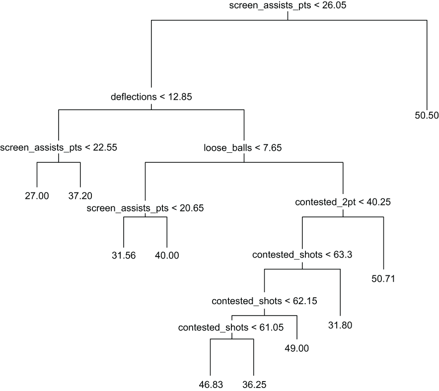

图 5.16 我们回归树的可视化结果

根据我们的回归树

+   每场比赛平均得分超过 26.05 分的球队预计将在 50 或 51 场常规赛中获胜。

+   或者，每场比赛平均得分少于 26.05 分的球队预计将在 27 到 51 场常规赛中获胜，具体取决于其他变量和其他分割。

+   每场比赛平均得分少于 26.05 分且防守反击次数少于 12.85 次的球队预计将在 27 到 37 场常规赛中获胜。

+   每场比赛平均得分少于 26.05 分但防守反击次数超过 12.85 次的球队预计将在 31 到 51 场常规赛中获胜。

如果-否则规则与树形图中的分支之间存在一一对应的关系。因此，我们的回归树产生的结果不仅与我们的多重回归相吻合，而且通过一系列如果-否则规则提供了线性模型无法提供的额外见解。根据这里测试的两种模型类型，预测因子`screen_assists_pts`、`deflections`和`loose_balls`比`contested_2pt`和`contested_shots`更为重要。尽管这两种模型都无法非常准确地预测胜利，但我们的目标是确定这些努力统计数据中哪一个对常规赛胜利的影响比其他类似统计数据更大。

最终，我们确定在进攻端设置掩护，创造无拘无束的投篮机会；在防守端挡掉传球，扰乱对手的进攻；以及在进攻或防守时抢断球，都值得付出百分之一百的努力，而其他所谓的努力表现则不然。因此，我们证实了我们的假设，即**某些**努力统计数据确实对胜负有统计学上的显著影响。

因此，我们的线性回归和回归树隔离出相同的三个变量——相同的三个努力统计数据——对胜利影响最大。它们还提供了不同的见解。根据我们的简化线性模型，根据涵盖三个 NBA 赛季的数据集，掩护得分、传球挡截和抢断球数占常规赛胜利差异的大约 16%。另一方面，我们的回归树基于一系列如果-否则规则返回了一系列预测胜利的结果。

在未来，我们将挑战一些传统智慧，并通过数据和统计技术来证明这些公认的惯例并不一定正确。在第六章中，我们将探讨一个观点，即比赛是在第四季度赢得的。

## 摘要

+   正确进行线性回归首先需要对数据进行彻底分析。应识别并处理异常值，对非正态分布的变量应进行转换或完全不予考虑，应优先考虑与目标变量相关性最强的潜在预测因子，尤其是在处理宽数据集时。

+   最好将您的数据分成两部分，用其中一部分来开发模型，然后用另一部分来预测，以避免过度拟合。

+   避免过度拟合的另一种方法是检查多重共线性，并在必要时采取纠正措施，通过从模型中移除违规变量来实施。

+   线性回归绘制一条直线，以最小化回归与数据之间的差异。虽然线性模型相当常见，可能比其他模型类型更普遍，其中因变量（即目标变量）是连续的，但重要的是要理解数据并不总是线性的。

+   我们的线性回归模型并没有以很高的准确性解释或预测胜利，但我们仍然成功地识别出了三个 hustle 统计量——屏幕外的得分、传球拦截和失球回收——这三个统计量共同解释了在测试的三个赛季中常规赛胜利的 16% 的变异性。因此，我们发现球员应该在哪些方面全力以赴，在必要时可以休息。

+   我们的回归树将与我们数据集中其他 hustle 统计量相比，识别出相同的三个变量更为重要；此外，它通过一系列的 if-else 规则预测了常规赛的胜利。

+   线性回归有几种应用场景，例如基于在线、广播和电视广告的多渠道广告策略的产品销售；基于犯罪率、每单位平均房间数和当地学校师生比例的单户住宅中位数价格；基于年龄、性别和最近 10K 和半程马拉松配速的马拉松表现；基于宏观经济指标信用卡违约率；以及基于职位年限和股价年度变化的 CEO 薪酬。线性回归需要一个连续的目标变量。在第十四章中，我们将拟合一个逻辑回归，它需要一个二进制目标变量。

+   基于树的模型是这些相同用例的良好替代品。此外，您还可以调用 `tree()` 函数来拟合一个分类树；它的语法与回归树相同，但您的目标变量必须是二进制而不是连续的。
