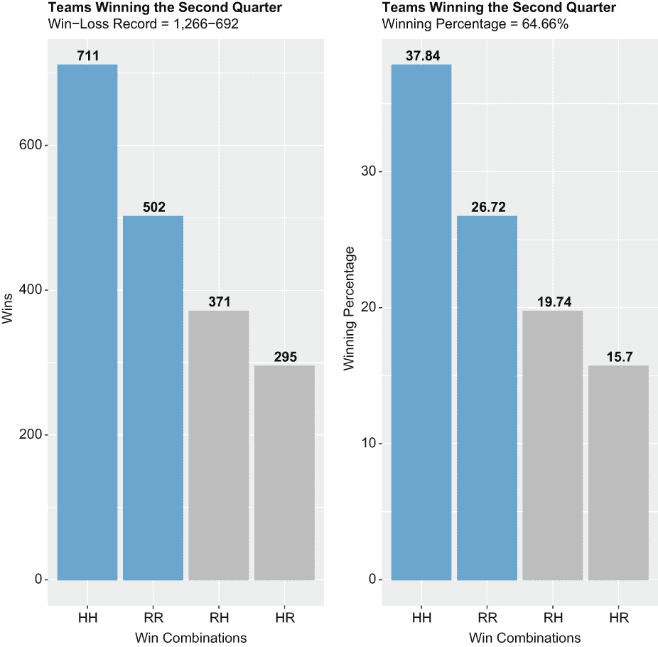
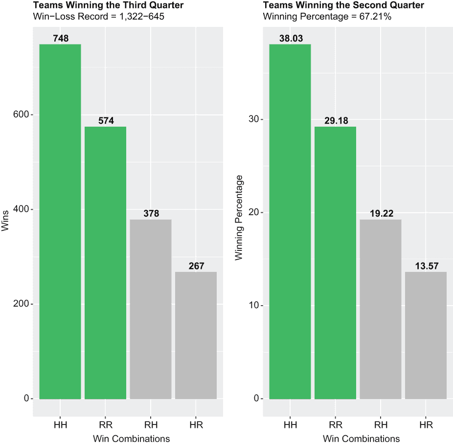
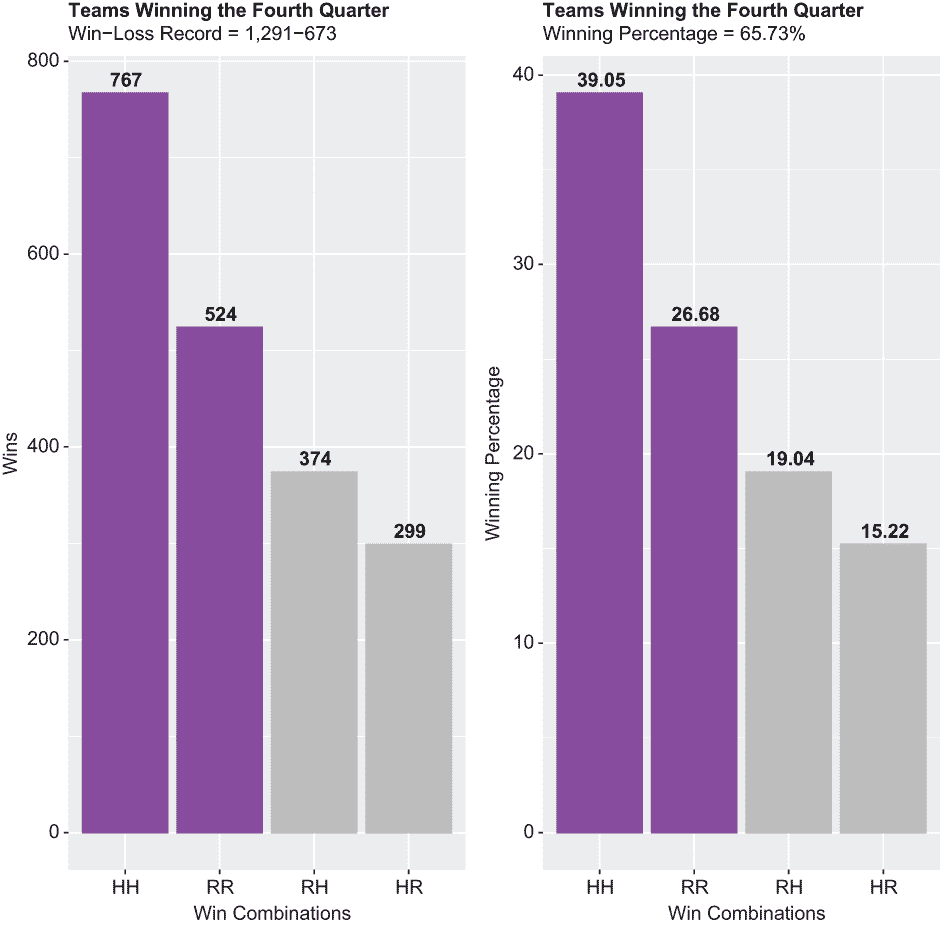
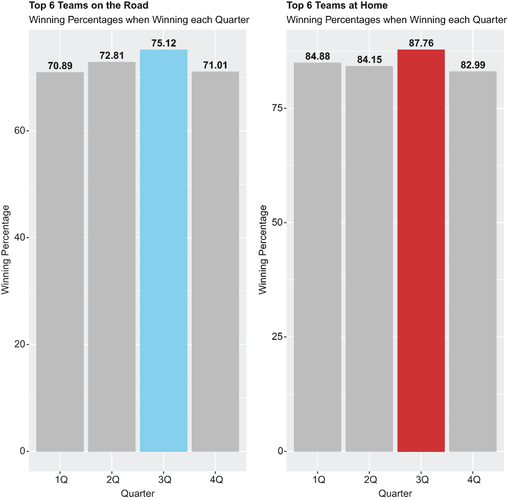
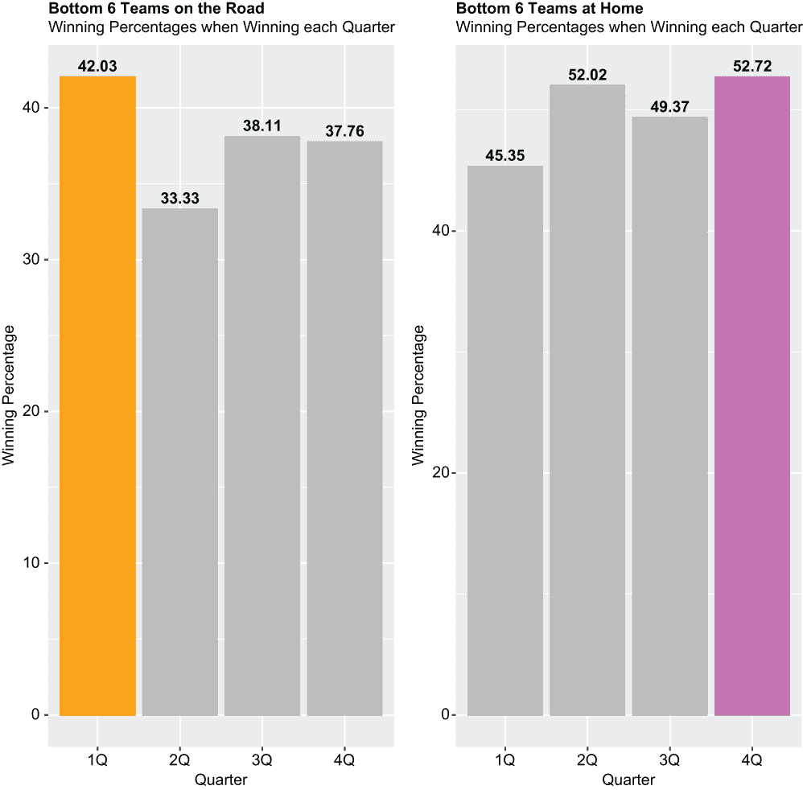

# 6 更多数据处理和可视化

本章涵盖

+   数据集的子集化

+   分离和连接数据集

+   变量的重命名和转换

+   排序数据和返回累积总和

+   转换数据集

+   记录索引

+   将`sqldf`代码转换为`dplyr`

+   创建和自定义条形图

根据传统智慧，无疑受到比赛后期偏见的影响，即一场接近的比赛中的最后几秒创造最难以忘怀的记忆，NBA 比赛是在第四节赢得的。换句话说，无论前三节发生了什么，赢得第四节并发挥最佳水平的队伍通常都会获胜。这表明 NBA 比赛的最后 12 分钟比前 36 分钟（NBA 比赛时长为 48 分钟，分为四个 12 分钟的季度）更重要。

我们的假设是这种传统智慧是错误的。我们将检查两个连续赛季中几乎每一场 NBA 常规赛，然后绘制获胜队伍在第四节与其他三个季度相比的表现。在这个过程中，我们将展示大量数据处理技术，这些技术将在你的职业或学术生涯中大有裨益，例如通过重塑整个数据集和排序向量来更改布局，提取符合逻辑标准的记录，通过名称选择或取消选择列，对数据进行分组和汇总，重命名现有变量并创建新的变量，以及垂直和水平地连接数据集。而且，通过我们的`ggplot2`条形图，我们将展示如何巧妙地通过突出显示一些内容并淡化其他内容来展示结果。

## 6.1 加载包

我们首先加载三个我们将需要的包，以超越基础 R 的能力进行数据处理、查询和可视化。我们通过一系列对`library()`函数的调用，并将所需的包作为参数传递。现在这些包应该对你来说都很熟悉：

```
library(tidyverse)
library(sqldf)
library(patchwork)
```

由于我们面前有大量的数据处理工作，如果不依赖基础 R，我们将比其他包装函数更频繁地调用`dplyr`和`tidyr`函数。再次强调，`dplyr`和`tidyr`是`tidyverse`包的一部分。

## 6.2 导入数据

我们有两个.csv 文件需要导入，这两个文件都是从网站[www.bigdataball.com](https://www.bigdataball.com/)下载的。第一个文件，设置为 nba1819，包含 2018-19 赛季每个常规赛和季后赛比赛的得分数据；第二个文件，设置为 nba1920，包含 2019-20 赛季每个常规赛和季后赛比赛的类似得分数据。

我们从`tidyverse`包中的`readr`包调用两次`read_csv()`函数，以逐个导入这两个文件：

```
nba1819 <- read.csv("nba_boxscore_1819.csv")
nba1920 <- read.csv("nba_boxscore_1920.csv")
```

比赛得分数据主要是团队层面和球员层面的基本统计数据的组合，如下所示：

+   总得分

+   每节得分

+   尝试和命中的投篮

+   尝试和命中的罚球

+   进攻和防守篮板

+   助攻

+   犯规

+   两队的首发阵容

包括比赛级别的属性；例如，比赛的日期和比赛地点，被分配来叫比赛官员的名字，以及开盘和收盘赔率。我们只需要分析中的一些数据。

基础 R 中的`dim()`函数返回维度——即行数和列数——在 nba1819 和 nba1920 数据集中：

```
dim(nba1819) 
## [1] 2624   57
dim(nba1920) 
## [1] 2286   57
```

这两个数据集都有 57 列，或变量。但与 nba1819 相比，nba1920 有更少的行，或观测值，因为 COVID-19 缩短了 2019-20 赛季；当然，比赛越少，数据行就越少。

## 6.3 数据整理

在开始时，我们的大部分数据处理操作将围绕数据子集（包括或排除满足或未满足某些逻辑标准的观测值，或通过删除不会影响我们分析的因素的变量来减少整个数据集的宽度）以及合并或连接一对数据集到一个对象。最终，我们需要能够转换成一系列互补的`ggplot2`可视化数据源，这些可视化可以按季度显示整数和百分比结果。我们离用我们两个.csv 文件做到这一点还有很长的路要走。

### 6.3.1 数据子集

我们首先通过调用`dplyr`包中的`filter()`函数来对 nba1819 数据集进行子集化，以便 nba1819 只包含变量`DATASET`等于`NBA 2018-2019 Regular Season`并且变量`MIN`（简称分钟数）等于`240`的观测值。这随后将 nba1819 数据集缩减到只有常规赛比赛，这些比赛以常规时间结束（240 是 48 分钟乘以场上的五名球员的结果）；或者换句话说，我们排除了进入加时赛的常规赛比赛和所有季后赛比赛。

R 语言中有一个与`dplyr filter()`函数等价的基函数，即`subset()`函数——它们操作类似，并返回相同的结果。但如果你在处理更大的数据集时，可能会发现`filter()`函数在性能上优于`subset()`。记住，R 区分`=`和`==`运算符；前者是赋值运算符，而后者是等于运算符。此外，当过滤 nba1819 数据集，其中变量`DATASET`等于`NBA 2018-2019 Regular Season`并且变量`MIN`（代表分钟数）等于`240`时，我们是在指示 R 对满足这两个条件的数据子集进行操作，而不仅仅是其中一个或另一个。

我们随后调用`dim()`函数来检查 nba1819 的新维度：

```
nba1819 %>%
  filter(DATASET == "NBA 2018-2019 Regular Season" & MIN == 240) -> nba1819
dim(nba1819) 
## [1] 2326   57
```

导入时，nba1819 数据集有 2,624 行，现在长度为 2,326 行。

关于 2019-20 赛季的 NBA，由于 COVID-19 大流行而暂时暂停比赛，然后在奥兰多一个中立场地（对于大多数球队，不是所有球队）恢复（对于大多数球队，不是所有球队），我们将 nba1920 数据集子集化，只包括暂停比赛之前的常规赛比赛，这些比赛也以常规时间结束。因此，我们将 nba1920 子集化，使得变量`GAME_ID`等于或小于`21900973`，并且变量`MIN`等于`240`：

```
nba1920 %>%
  filter(GAME_ID <= 21900973 & MIN == 240) -> nba1920
```

然后我们再次调用`dim()`函数，当然，它会返回 nba1920 数据集的新维度。现在它有 1,820 行，而最初它包含了 2,286 个观测值：

```
dim(nba1920) 
## [1] 1820   57
```

现在我们将演示一些合并技术。

### 6.3.2 数据集合并

基础 R 和`dplyr`函数可用于将两个或多个数据集合并成一个对象。虽然`dplyr`函数可能在处理大型数据集或在小型机器上工作时表现最佳，但基础 R 和`dplyr`函数在其他情况下操作类似，并返回相同的结果。在这里，我们将调用一个基础 R 函数，然后调用一个`dplyr`函数来合并数据集，同时混合其他数据处理操作。

话虽如此，我们首先调用基础 R 中的`rbind()`函数，将 nba1819 和 nba1920 数据集行绑定到一个名为 nbadf1 的新对象中。这是因为两个数据集具有相同的宽度和相同的变量名；任何差异都会导致 R 抛出错误。变量不需要按相同的顺序排列，此操作才能成功。

紧接着调用`dim()`函数来返回我们新对象的维度：

```
nbadf1 <- rbind(nba1819, nba1920)
dim(nbadf1)
## [1] 4146   57
```

我们可以看到 nbadf1 包含 57 个变量和 4,146 个观测值，包括来自 nba1819 的 2,326 个观测值和来自 nba1920 的 1,820 个观测值。

接着，我们通过调用`dplyr`包中的`select()`函数来对新的工作数据集进行子集化，只保留位于`DATASET`和`MIN`之间的 16 个变量；再次调用`dim()`函数确认 nbadf1 的宽度实际上已经从 57 列减少到仅 16 列。我们代码中的分号告诉 R 接受从`DATASET`到`MIN`之间的所有变量，这比列出所有 16 个变量要好得多：

```
nbadf1 %>%
  select(DATASET:MIN) -> nbadf1
dim(nbadf1) 
## [1] 4146   16
```

接下来，我们通过两次调用`dplyr filter()`函数将 nbadf1 分成相等的两半：一次是变量`VENUE`等于`R`（客场），这些观测值被放入一个名为 road 的数据集中，然后是`VENUE`等于`H`（主场），这些观测值被放入一个名为 home 的数据集中。（除非有特殊情况，NBA 比赛——常规赛和季后赛——永远不会在中立场地进行。无论如何，球队总是被指定为客场或主场。）两个调用都显示在这里：

```
nbadf1 %>%
  filter(VENUE == "R") -> road
dim(road) 
## [1] 2073   16

nbadf1 %>%
  filter(VENUE == "H") -> home
dim(home) 
## [1] 2073   16
```

`dim()`函数为两个对象返回相同的维度，这是好事，因为应该有相等数量的客场和主场观测值。

我们即将合并客场和主场的横向数据集，但首先我们需要给它们赋予唯一的变量名。`dplyr`包中的`rename()`函数允许我们重命名变量，其中赋值运算符左侧的变量名是新变量名，右侧的变量名是旧变量名或现有变量名：

```
road %>%
  rename(dataset = DATASET, ID = GAME_ID, date = DATE, 
         teamR = TEAM, venueR = VENUE, Q1R = Q1, Q2R = Q2, 
         Q3R = Q3, Q4R = Q4, OT1R = OT1,       
         OT2R = OT2, OT3R = OT3, OT4R = OT4, 
         OT5R = OT5, FR = F, MINR = MIN) -> road
home %>%
  rename(dataset = DATASET, ID = GAME_ID, date = DATE, 
         teamH = TEAM, venueH = VENUE, Q1H = Q1, Q2H = Q2,
         Q3H = Q3, Q4H = Q4, OT1H = OT1,       
         OT2H = OT2, OT3H = OT3, OT4H = OT4, 
         OT5H = OT5, FH = F, MINH = MIN) -> home 
```

大多数新的变量名都附加了字母 R 或 H 来区分客场和主场，否则变量是相同的。有三个例外，现在命名为`dataset`、`ID`和`date`的变量。

然后，我们通过调用`dplyr left_join()`函数在客场和主场之间执行左连接，通过匹配行来合并两个数据集；我们特别通过变量`dataset`、`ID`和`date`来匹配客场和主场。

然后，我们立即调用`dim()`函数再次检查工作数据集 nbadf2 的维度；nbadf2 包含 2,073 行（4,146 行的一半）和 29 个变量（16 个来自客场数据集，另外 16 个来自主场数据集，减去共同的变量`dataset`、`ID`和`date`）：

```
left_join(road, home, by = c("dataset", "ID", "date")) -> nbadf2 
dim(nbadf2)
## [1] 2073   29
```

再次，我们调用`dplyr select()`函数来删除不必要的或重复的变量（注意在基础 R `c()`函数之前的前导减号）；再次，我们调用`dim()`函数来返回行和列计数。提醒一下，当我们需要创建向量或将多个对象连接成一个向量时，会调用`c()`函数：

```
nbadf2 %>% 
  select(-c(OT1R:OT5R, MINR, OT1H:OT5H, MINH)) -> nbadf2
dim(nbadf2) 
## [1] 2073   17
```

现在，我们有了包含 2,073 行和 17 列的数据集 nbadf2。

接下来，我们通过连续调用基础 R 的`as.factor()`函数将 nbadf2 剩余的五个变量转换为因子变量。当你的变量是分类的或有序的，并且有一个固定的可能值集合时，这是一个好的做法：

```
nbadf2$dataset <- as.factor(nbadf2$dataset)
nbadf2$teamR <- as.factor(nbadf2$teamR)
nbadf2$venueR <- as.factor(nbadf2$venueR)
nbadf2$teamH <- as.factor(nbadf2$teamH)
nbadf2$venueH <- as.factor(nbadf2$venueH)
```

最后，我们调用`dplyr glimpse()`函数来返回 nbadf2 数据集的转置快照：

```
glimpse(nbadf2)
## Rows: 2,073
## Columns: 17
## $ dataset <fct> NBA 2018-2019 Regular Season, NBA 2018-2019 Regular...
## $ ID      <int> 21800001, 21800002, 21800003, 21800004, 21800005, 2...
## $ date    <chr> "10/16/18", "10/16/18", "10/17/18", "10/17/18", "10...
## $ teamR   <fct> Philadelphia, Oklahoma City, Milwaukee, Brooklyn, M...
## $ venueR  <fct> R, R, R, R, R, R, R, R, R, R, R, R, R, R, R, R, R, ...
## $ Q1R     <int> 21, 23, 36, 29, 16, 31, 24, 25, 35, 23, 30, 29, 24,...
## $ Q2R     <int> 21, 24, 31, 22, 23, 20, 25, 22, 36, 29, 38, 30, 22,...
## $ Q3R     <int> 24, 32, 26, 25, 19, 27, 35, 28, 30, 31, 25, 15, 27,...
## $ Q4R     <int> 21, 21, 20, 24, 25, 23, 23, 29, 30, 25, 30, 33, 27,...
## $ FR      <int> 87, 100, 113, 100, 83, 101, 107, 104, 131, 108, 123...
## $ teamH   <fct> Boston, Golden State, Charlotte, Detroit, Indiana, ...
## $ venueH  <fct> H, H, H, H, H, H, H, H, H, H, H, H, H, H, H, H, H, ...
## $ Q1H     <int> 21, 31, 23, 24, 27, 25, 23, 28, 29, 31, 34, 24, 37,...
## $ Q2H     <int> 26, 26, 31, 27, 29, 29, 49, 32, 25, 25, 21, 30, 19,...
## $ Q3H     <int> 30, 26, 29, 32, 20, 25, 34, 30, 30, 25, 32, 18, 27,...
## $ Q4H     <int> 28, 25, 29, 20, 35, 25, 20, 26, 28, 31, 30, 26, 38,...
## $ FH      <int> 105, 108, 112, 103, 111, 104, 126, 116, 112, 112, 1...
```

下面是 nbadf2 变量按变量分解的说明：

+   `dataset`—等于`NBA 2018-2019 常规赛季`或`NBA 2019-2020 常规赛季`。

+   `ID`**—**为每场比赛提供一个唯一的标识符，按时间顺序递增。

+   `date`**—**表示比赛进行的日期，格式为*MM/DD/YY*。

+   `teamR`**—**表示客场或访问球队，例如`Golden State`等于`Golden State Warriors`，`Boston`等于`Boston Celtics`。

+   `venueR`**—**始终等于`R`，这是客场（road）的简称。

+   `Q1R`**—**等于第一季度客场球队所得的分数。

+   `Q2R`**—**等于第二季度客场球队所得的分数。

+   `Q3R`**—**等于第三季度客场球队所得的分数。

+   `Q4R`**—**等于第四季度客场球队所得的分数。

+   `FR`**—**等于整个比赛期间客场球队所得的总分数。因为我们之前从数据集中移除了加时赛，所以`FR`*总是*等于前四个变量的总和。

+   `teamH`**—**与变量`teamR`相同的格式。

+   `venueH`**—**始终等于`H`。

+   `Q1H`**—**等于主队在第一节得到的分数。

+   `Q2H`**—**等于主队在第二节得到的分数。

+   `Q3H`**—**等于主队在第三节得到的分数。

+   `Q4H`**—**等于主队在第四节得到的分数。

+   `FH`**—**等于主队在整个比赛中得到的总分数；也等于前四个变量的总和。

在成功整理和合并我们的数据集后，我们准备开始进行一些分析。

## 6.4 分析

我们的分析工作将是一个三管齐下的攻击：

+   首先，我们将计算并可视化每节与比赛结束时的结果，以确定获胜队伍在第四节相对于第一、第二和第三节是否更成功。

+   其次，我们将数据集子集化到 2018-19 和 2019-20 NBA 常规赛中最成功的六支球队和最不成功的六支球队，然后计算并可视化它们在一节获胜与另一节获胜时的胜率，按客场与主场的比赛进行细分。

+   第三，我们将数据集缩减到只包括半场平局的游戏，然后比较第三、四节的结果与比赛结束时的结果。

我们会发现，大量证据支持这样一个观点：比赛通常不是在第四节赢得，而是在第三节赢得，从而证实了我们的假设。

### 6.4.1 第一节

我们的第一步是创建一个新的数据集，nbadf3，通过调用`filter()`函数来对 nbadf2 数据集进行子集化，其中变量`Q1R`和`Q1H`不相等；基本上，我们通过消除观察值或比赛来子集化 nbadf2，这些观察值或比赛在第一节结束时得分持平。`NOT` `(!)`运算符将`!TRUE`语句评估为`FALSE`，将`!FALSE`语句评估为`TRUE`：

```
nbadf2 %>%
  filter(Q1R != Q1H) -> nbadf3
dim(nbadf3)
## [1] 1990   17
```

nbadf3 数据集有 1,990 行。

在以下代码块中，我们调用了一对`dplyr`函数，`mutate()`和`case_when()`，来创建一个新的名为`Q1vF`的变量，该变量将根据条件逻辑填充四个值之一：

+   当主队在第一节得到的分数多于客队并且随后赢得比赛时，`Q1vF`将等于`HH`。

+   当客队在第一节得到的分数多于主队并且随后赢得比赛时，`Q1vF`将等于`RR`。

+   当主队在第一节得到的分数多于客队，但随后客队赢得比赛时，`Q1vF`将等于`HR`。

+   当客队在第一节得到的分数多于主队，但随后主队赢得比赛时，`Q1vF`将等于`RH`。

然后，我们将我们的新变量转换为因子：

```
nbadf3 %>% mutate(Q1vF = case_when(Q1H > Q1R & FH > FR ~ "HH",
                                   Q1R > Q1H & FR > FH ~ "RR",
                                   Q1H > Q1R & FR > FH ~ "HR",
                                   Q1R > Q1H & FH > FR ~ "RH")) -> nbadf3

nbadf3$Q1vF <- as.factor(nbadf3$Q1vF)
```

然后，我们创建了一个比之前章节中创建的其他 tibble 更复杂的数据框：

+   我们首先调用来自 `dplyr` 包的 `count()` 函数；它计算 `nbadf3` 中每个 `Q1vF` 导出变量四个级别的观测数，并将相同的结果传递给一对其他 `dplyr` 函数，`arrange()` 和 `desc()`，以便将结果堆叠在名为 `n` 的变量中，并按降序排序。

+   然后，我们将新对象传递给一系列对 `mutate()` 函数的调用，以创建三个额外的 tbl1 变量。我们第一次调用 `mutate()` 创建了一个名为 `pct_total` 的变量，该变量等于 `n` 除以 nbadf3 行数，然后乘以 100。

+   我们第二次调用 `mutate()` 创建了一个名为 `cum_n` 的变量，该变量等于 `n` 的累积和；`cumsum()` 是一个内置函数，它返回从另一个向量中的原始数据派生的累积和向量。例如，如果我们有一个包含数字 1、2 和 3 的向量，`cumsum()` 将返回 1、3 和 6。

+   我们对 `mutate()` 的第三次也是最后一次调用创建了一个名为 `cum_pct_total` 的变量，该变量将 `cum_n` 中的值转换为相对于 nbadf3 数据集中总记录数的百分比。

+   然后，通过调用基础 R 的 `round()` 函数，将 `pct_total` 和 `cum_pct_total` 变量格式化，以便只返回小数点后两位数字。

最终结果是包含四行五列的 tibble。

```
count(nbadf3, Q1vF) %>% arrange(desc(n)) -> tbl1
tbl1 %>%
  mutate(pct_total = n/nrow(nbadf3)*100) %>%
  mutate(cum_n = cumsum(n)) %>%
  mutate(cum_pct_total = cumsum(pct_total)) -> tbl1
tbl1$pct_total <- round(tbl1$pct_total, digits = 2)
tbl1$cum_pct_total <- round(tbl1$cum_pct_total, digits = 2)
print(tbl1)
##   Q1vF   n pct_total cum_n cum_pct_total
## 1   HH 783     39.35   783         39.35
## 2   RR 550     27.64  1333         66.98
## 3   RH 365     18.34  1698         85.33
## 4   HR 292     14.67  1990        100.00
```

为了检查或协调我们的结果，我们随后对 `sqldf()` 函数进行了一系列调用，该函数来自 `sqldf` 包。`SELECT` 和 `COUNT(*)` 返回与 tbl1 中的变量 `n` 相等的 nbadf3 记录计数：

```
sqldf("SELECT COUNT(*) FROM nbadf3 WHERE Q1H > Q1R AND FH > FR") 
##   COUNT(*)
## 1      783
sqldf("SELECT COUNT(*) FROM nbadf3 WHERE Q1R > Q1H AND FR > FH") 
##   COUNT(*)
## 1      550
sqldf("SELECT COUNT(*) FROM nbadf3 WHERE Q1R > Q1H AND FR < FH") 
##   COUNT(*)
## 1      365
sqldf("SELECT COUNT(*) FROM nbadf3 WHERE Q1H > Q1R AND FH < FR") 
##   COUNT(*)
## 1      292
```

通过用管道运算符代替 `FROM` 并将 `sqldf()` 的 `WHERE` 子句传递给 `count()` 函数，我们可以轻松地将我们的 `SELECT` 语句转换为 `dplyr` 代码。但请注意，`dplyr` 使用 `&`，而 `sqldf()` 使用 `AND`，并且 `dplyr` 为 `TRUE` 和 `FALSE` 观测返回计数，而 `sqldf()` 只返回实际满足逻辑的记录计数：

```
nbadf3 %>% 
  count(Q1H > Q1R & FH > FR)
## # A tibble: 2 × 2
##   `Q1H > Q1R & FH > FR`     n
##   <lgl>                 <int>
## 1 FALSE                  1207
## 2 TRUE                    783

nbadf3 %>% 
  count(Q1R > Q1H & FR > FH)
## # A tibble: 2 × 2
##   `Q1R > Q1H & FR > FH`     n
##   <lgl>                 <int>
## 1 FALSE                  1440
## 2 TRUE                    550

nbadf3 %>% 
  count(Q1R > Q1H & FR < FH)
## # A tibble: 2 × 2
##   `Q1R > Q1H & FR < FH`     n
##   <lgl>                 <int>
## 1 FALSE                  1625
## 2 TRUE                    365

nbadf3 %>% 
  count(Q1H > Q1R & FH < FR)
## # A tibble: 2 × 2
##   `Q1H > Q1R & FH < FR`     n
##   <lgl>                 <int>
## 1 FALSE                  1698
## 2 TRUE                    292
```

幸运的是，无论如何检查都是正确的。

现在让我们用一对互补的 `ggplot2` 条形图来可视化我们的结果。其中第一个，plot1a，显示了获胜次数。记住，这些是 2018-19 赛季和 2019-20 赛季之间的常规赛季获胜次数，减去在奥兰多进行的比赛、进入加时赛的比赛以及来自我们导出变量 `Q1vF` 的四个因素之间的首节平局比赛。

我们的第二个可视化，plot1b，几乎返回相同的视图，只是用获胜百分比代替了获胜次数。因此，plot1a 和 plot1b 之间有相似的外观，从不同的、但互补的度量中获得了类似的结果。

需要强调几点：

+   在两个图表中，我们调用基础 R 的`reorder()`函数，按`tbl1`变量`n`（在 plot1a 的情况下）和`pct_total`（在 plot1b 的情况下）的降序对`Q1vF`因子进行排序。注意变量名前面的负号；如果没有这个负号，结果将按升序排序。

+   添加了一个自定义的颜色和填充方案来强调在第一季度赢得比赛并且赢得比赛的队伍，同时降低相反结果的重要性；我们为前者选择了明亮的颜色，为后者选择了浅灰色。

+   栏状图顶部的标签与 y 轴变量相关联，并使用粗体字体格式化。

+   由于四舍五入，胜率可能相差十分之一。

两个可视化的代码如下：

```
plot1a <- ggplot(tbl1, aes(x = reorder(Q1vF, -n), y = n)) + 
  geom_bar(color = c("orange1", "orange1", "gray74", "gray74"),
           fill = c("orange1", "orange1", "gray74", "gray74"), 
           stat = "identity") + 
  labs(title = "Teams Winning the First Quarter", 
       subtitle = "Win-Loss Record = 1,333-657",
       x = "Win Combinations", 
       y = "Wins") + 
  geom_text(aes(x = Q1vF, y = n, label = n, vjust = -0.3, 
                fontface = "bold")) +
  theme(plot.title = element_text(face = "bold")) 

plot1b <- ggplot(tbl1, aes(x = reorder(Q1vF, -pct_total), y = pct_total)) + 
  geom_bar(color = c("orange1", "orange1", "gray74", "gray74"),
           fill = c("orange1", "orange1", "gray74", "gray74"), 
           stat = "identity") + 
  labs(title = "Teams Winning the First Quarter", 
       subtitle = "Winning Percentage = 66.98%",
       x = "Win Combinations", 
       y = "Winning Percentage") + 
  geom_text(aes(x = Q1vF, y = pct_total, label = pct_total, 
                vjust = -0.3, fontface = "bold")) +
  theme(plot.title = element_text(face = "bold")) 
```

然后，我们将两个可视化并排配对成一个单一的对象（见图 6.1），这是通过调用`patchwork`包中的`plot_layout()`函数实现的。

```
plot1a + plot1b + plot_layout(ncol = 2)
```


图 6.1 第一季度赢得比赛的队伍有超过三分之二的时间赢得相同的比赛

在第一季度赢得比赛的公司随后有大约 67%的时间赢得比赛（等于 plot1b 中的 39.35% + 27.64%）。在第一季度赢得比赛的主队整体胜率几乎等于 73%（等于 783 / 783 + 292 来自 plot1a）；另一方面，客场队在赢得第一季度比赛后有大约 60%的时间获胜（等于 550 / 550 + 365 来自 plot1a）。

### 6.4.2 第二季度

接下来，我们再次进行完整的练习，但现在我们的目的是比较第二季度结果和最终得分。我们调用`filter()`函数创建一个新的对象 nbadf4，它等于 nbadf2 数据集，减去任何客场队和主队在第二季度得分相同的观测值：

```
nbadf3 %>% 
  filter(Q2R != Q2H) -> nbadf4
```

我们随后调用`mutate()`和`case_when()`函数来创建一个新的变量`Q2vF`，这个变量是之前创建并附加到`nbadf3`上的派生变量`Q1vF`的第二季度版本。然后，我们通过调用基础 R 中的`as.factor()`函数将新变量转换为因子：

```
nbadf4 %>% mutate(Q2vF = case_when(Q2H > Q2R & FH > FR ~ "HH",
                                   Q2R > Q2H & FR > FH ~ "RR",
                                   Q2H > Q2R & FR > FH ~ "HR",
                                   Q2R > Q2H & FH > FR ~ "RH")) -> nbadf4

nbadf4$Q2vF <- factor(nbadf4$Q2vF)
```

在下面的代码块中，我们创建了一个名为 tbl2 的 tibble，它只是我们第一个 tibble，tbl1 的第二季度版本。tbl1 和 tbl2 之间没有区别，除了我们已经替换了数据源（用 nbadf4 代替 nbadf3）和派生变量（用`Q2vF`替换`Q1vF`）：

```
count(nbadf4, Q2vF) %>% arrange(desc(n)) -> tbl2
tbl2 %>% 
  mutate(pct_total = n/nrow(nbadf4)*100) %>%
  mutate(cum_n = cumsum(n)) %>%
  mutate(cum_pct_total = cumsum(pct_total)) -> tbl2
tbl2$pct_total <- round(tbl2$pct_total, digits = 2)
tbl2$cum_pct_total <- round(tbl2$cum_pct_total, digits = 2)
print(tbl2)
##   Q2vF   n pct_total cum_n cum_pct_total
## 1   HH 711     37.84   711         37.84
## 2   RR 502     26.72  1213         64.56
## 3   RH 371     19.74  1584         84.30
## 4   HR 295     15.70  1879        100.00
```

最后，我们创建第二对`ggplot2`条形图，然后将两个可视化捆绑成一个单一的图形对象（见图 6.2）：

```
plot2a <- ggplot(tbl2, aes(x = reorder(Q2vF, -n), y = n)) + 
  geom_bar(color = c("skyblue3", "skyblue3", "gray74", "gray74"),
           fill = c("skyblue3", "skyblue3", "gray74", "gray74"), 
           stat = "identity") + 
  labs(title = "Teams Winning the Second Quarter", 
       subtitle = "Win-Loss Record = 1,266-692",
       x = "Win Combinations", 
       y = "Wins") + 
  geom_text(aes(x = Q2vF, y = n, label = n,
                vjust = -0.3, fontface = "bold")) +
  theme(plot.title = element_text(face = "bold")) 

plot2b <- ggplot(tbl2, aes(x = reorder(Q2vF, -pct_total), y = pct_total)) + 
  geom_bar(color = c("skyblue3", "skyblue3", "gray74", "gray74"),
           fill = c("skyblue3", "skyblue3", "gray74", "gray74"), 
           stat = "identity") + 
  labs(title = "Teams Winning the Second Quarter", 
       subtitle = "Winning Percentage = 64.66%",
       x = "Win Combinations", 
       y = "Winning Percentage") + 
  geom_text(aes(x = Q2vF, y = pct_total, label = pct_total, 
                vjust = -0.3, fontface = "bold")) +
  theme(plot.title = element_text(face = "bold")) 

plot2a + plot2b + plot_layout(ncol = 2)
```



图 6.2 中赢得第二季度的队伍有大约 65%的时间赢得相同的比赛，这个数字略低于我们之前看到的第一季度结果。

赢得第二季度的球队随后赢得同一场比赛的比例几乎达到 65%，这个数字比我们之前看到的第一季度结果低两个百分点以上。主场赢得第二季度的球队的整体获胜比例约为 71%，而主场赢得第一季度的球队获胜比例为 73%；客场赢得第二季度的球队获胜比例约为 58%，而客场赢得第一季度的球队获胜比例为 60%。

### 6.4.3 第三节

让我们现在来看看第三节结果与比赛结束结果。这次，我们的代码被合并成一个块，以另一对`ggplot2`条形图结束（见图 6.3）：

```
nbadf2 %>%
  filter(Q3R != Q3H) -> nbadf5

nbadf5 %>% mutate(Q3vF = case_when(Q3H > Q3R & FH > FR ~ "HH",
                                   Q3R > Q3H & FR > FH ~ "RR",
                                   Q3H > Q3R & FR > FH ~ "HR",
                                   Q3R > Q3H & FH > FR ~ "RH")) -> nbadf5

nbadf5$Q3vF <- factor(nbadf5$Q3vF)

count(nbadf5, Q3vF) %>% arrange(desc(n)) -> tbl3
tbl3 %>% 
  mutate(pct_total = n/nrow(nbadf5)*100) %>%
  mutate(cum_n = cumsum(n)) %>%
  mutate(cum_pct_total = cumsum(pct_total)) -> tbl3
tbl3$pct_total <- round(tbl3$pct_total, digits = 2)
tbl3$cum_pct_total <- round(tbl3$cum_pct_total, digits = 2)
print(tbl3)
##   Q3vF   n pct_total cum_n cum_pct_total
## 1   HH 748     38.03   748         38.03
## 2   RR 574     29.18  1322         67.21
## 3   RH 378     19.22  1700         86.43
## 4   HR 267     13.57  1967        100.00

plot3a <- ggplot(tbl3, aes(x = reorder(Q3vF, -n), y = n)) + 
  geom_bar(color = c("springgreen3", "springgreen3", "gray74", "gray74"),
           fill = c("springgreen3", "springgreen3", "gray74", "gray74"), 
           stat = "identity") + 
  labs(title = "Teams Winning the Third Quarter", 
       subtitle = "Win-Loss Record = 1,322-645",
       x = "Win Combinations", 
       y = "Wins") + 
  geom_text(aes(x = Q3vF, y = n, label = n, 
                vjust = -0.3, fontface = "bold")) +
  theme(plot.title = element_text(face = "bold")) 

plot3b <- ggplot(tbl3, aes(x = reorder(Q3vF, -pct_total), y = pct_total)) + 
  geom_bar(color = c("springgreen3", "springgreen3", "gray74", "gray74"),
           fill = c("springgreen3", "springgreen3", "gray74", "gray74"), 
           stat = "identity") + 
  labs(title = "Teams Winning the Second Quarter", 
       subtitle = "Winning Percentage = 67.21%",
       x = "Win Combinations", 
       y = "Winning Percentage") + 
  geom_text(aes(x = Q3vF, y = pct_total, label = pct_total, 
                vjust = -0.3, fontface = "bold")) +
  theme(plot.title = element_text(face = "bold")) 

plot3a + plot3b + plot_layout(ncol = 2)
```



图 6.3 赢得第三节的球队随后赢得同一场比赛的比例超过 67%，这是迄今为止最高的获胜比例。

主场和客场赢得第三节的球队随后赢得了超过 67%的相同比赛——这是迄今为止最高的数字。主场球队的表现主要对这些结果负责：74%的时间，当主场球队赢得第三节时，它随后赢得了同一场比赛，而客场球队的获胜比例仅为 60%。

### 6.4.4 第四节

我们再次运行了季度结束与比赛结束的结果，这次专注于第四节。我们的代码再次被合并成一个块，我们的结果再次通过一对`ggplot2`条形图可视化，这些图表被压缩在一个单一的数据图形表示中（见图 6.4）：

```
nbadf2 %>%
  filter(Q4R != Q4H) -> nbadf6

nbadf6 %>% mutate(Q4vF = case_when(Q4H > Q4R & FH > FR ~ "HH",
                                   Q4R > Q4H & FR > FH ~ "RR",
                                   Q4H > Q4R & FR > FH ~ "HR",
                                   Q4R > Q4H & FH > FR ~ "RH")) -> nbadf6

nbadf6$Q4vF <- factor(nbadf6$Q4vF)

count(nbadf6, Q4vF) %>% arrange(desc(n)) -> tbl4
tbl4 %>% 
  mutate(pct_total = n/nrow(nbadf6)*100) %>%
  mutate(cum_n = cumsum(n)) %>%
  mutate(cum_pct_total = cumsum(pct_total)) -> tbl4
tbl4$pct_total <- round(tbl4$pct_total, digits = 2)
tbl4$cum_pct_total <- round(tbl4$cum_pct_total, digits = 2)
print(tbl4)
##   Q4vF   n pct_total cum_n cum_pct_total
## 1   HH 767     39.05   767         39.05
## 2   RR 524     26.68  1291         65.73
## 3   RH 374     19.04  1665         84.78
## 4   HR 299     15.22  1964        100.00

plot4a <- ggplot(tbl4, aes(x = reorder(Q4vF, -n), y = n)) + 
  geom_bar(color = c("darkorchid3", "darkorchid3", "gray74", "gray74"),
           fill = c("darkorchid3", "darkorchid3", "gray74", "gray74"), 
           stat = "identity") + 
  labs(title = "Teams Winning the Fourth Quarter", 
       subtitle = "Win-Loss Record = 1,291-673",
       x = "Win Combinations", 
       y = "Wins") + 
  geom_text(aes(x = Q4vF, y = n, label = n,
                vjust = -0.3, fontface = "bold")) +
  theme(plot.title = element_text(face = "bold")) 

plot4b <- ggplot(tbl4, aes(x = reorder(Q4vF, -pct_total), y = pct_total)) + 
  geom_bar(color = c("darkorchid3", "darkorchid3", "gray74", "gray74"),
           fill = c("darkorchid3", "darkorchid3", "gray74", "gray74"), 
           stat = "identity") + 
  labs(title = "Teams Winning the Fourth Quarter", 
       subtitle = "Winning Percentage = 65.73%",
       x = "Win Combinations", 
       y = "Winning Percentage") + 
  geom_text(aes(x = Q4vF, y = pct_total, label = pct_total, 
                vjust = -0.3, fontface = "bold")) +
  theme(plot.title = element_text(face = "bold")) 

plot4a + plot4b + plot_layout(ncol = 2)
```



图 6.4 赢得第四节的球队随后赢得同一场比赛的比例接近 66%，这是除了我们第二季度结果之外最低的获胜比例。

在第四节获胜的球队在我们的数据集中也几乎在 66%的相关比赛中赢得了比赛。主场赢得第四节的球队也大约有 72%的时间获胜；客场球队在第四节得分最高的比赛中获胜的比例约为 58%。

要说何时赢得比赛，尤其是当选择是某一节对另一节时，这很困难，甚至可能不可能。尽管如此，获胜的球队赢得第三节比赛的比例高于赢得第四节比赛的比例，或者任何其他节比赛的比例，这当然是对传统观点的挑战，即比赛是在第四节赢得的。

我们接下来的分析将关注 2018-19 赛季和 2019-20 赛季常规赛中表现最佳和最差的六支球队。

### 6.4.5 比较最佳和最差球队

现在，让我们通过在包括 2018-19 和 2019-20 赛季常规赛中赢得最多常规赛比赛的六个团队的数据集上重复我们的分析来做一个更深更专注的深入研究（不包括因 COVID-19 停赛后的中立场地比赛）。这六个团队是密尔沃基雄鹿（116 胜），多伦多猛龙（111），丹佛掘金（100），波士顿凯尔特人（97），休斯顿火箭（97）和洛杉矶快船（97）。然后，我们将在仅包括这六个最差团队的数据集上执行相同的分析。

最佳 6

要实现这一点，我们首先通过调用 `dplyr filter()` 函数创建一个名为 nbadf7 的数据集，它是 nbadf3 的一个子集，只包含上述六个团队中任一团队被指定为客场球队的观测。而 `AND` `(&)` 运算符接受两个或多个逻辑值，只有当所有值实际上都是 `TRUE` 时才返回 `TRUE`，而 `OR` `(|)` 运算符如果至少有一个值是 `TRUE` 就返回 `TRUE`。

然后，我们在那些变量 `Q1vF` 等于 `RR` 或 `RH` 的观测上对 nbadf7 进行子集化。结果保存在一个名为 nbadf8 的新对象中：

```
nbadf3 %>% 
  filter(teamR == "Milwaukee" | teamR == "Toronto" | 
           teamR == "Boston" | teamR == "Denver" | 
           teamR == "Houston" | teamR == "LA Clippers") -> nbadf7

nbadf7 %>%
  filter(Q1vF == "RR" | Q1vF == "RH") -> nbadf8
```

然后，我们调用 `count()` 函数来统计 nbadf8 中 `Q1vF` 等于 `RR` 与 `RH` 的观测数量，然后调用 `arrange()` 函数按降序排序结果；结果被转换成一个名为 tbl5 的 tibble。然后我们调用 `mutate()` 函数创建一个名为 `pct_total` 的变量，该变量计算 `n` 与总记录数的百分比；该变量随后被缩减到只保留小数点后两位：

```
count(nbadf8, Q1vF) %>% arrange(desc(Q1vF)) -> tbl5
tbl5 %>% 
  mutate(pct_total = n/nrow(nbadf8)*100) -> tbl5
tbl5$pct_total <- round(tbl5$pct_total, digits = 2)
print(tbl5)
##   Q1vF   n pct_total
## 1   RR 151     70.89
## 2   RH  62     29.11
```

这个练习重复了三次，首先是通过将第二季度替换为第一季度，通过将变量 `Q1vF` 替换为 `Q2vF` 来实现的：

```
nbadf4 %>% 
  filter(teamR == "Milwaukee" | teamR == "Toronto" | 
           teamR == "Boston" | teamR == "Denver" | 
           teamR == "Houston" | teamR == "LA Clippers") -> nbadf9

nbadf9 %>%
  filter(Q2vF == "RR" | Q2vF == "RH") -> nbadf10

count(nbadf10, Q2vF) %>% arrange(desc(Q2vF)) -> tbl6
tbl6 %>% 
  mutate(pct_total = n/nrow(nbadf10)*100) -> tbl6
tbl6$pct_total <- round(tbl6$pct_total, digits = 2)
print(tbl6)
##   Q2vF   n pct_total
## 1   RR 149     73.04
## 2   RH  55     26.96
```

接下来，我们将变量 `Q2vF` 替换为 `Q3vF`：

```
nbadf5 %>%
  filter(teamR == "Milwaukee" | teamR == "Toronto" | 
           teamR == "Boston" | teamR == "Denver" | 
           teamR == "Houston" | teamR == "LA Clippers") -> nbadf11

nbadf11 %>% 
  filter(Q3vF == "RR" | Q3vF == "RH") -> nbadf12

count(nbadf12, Q3vF) %>% arrange(desc(Q3vF)) -> tbl7
tbl7 %>% 
  mutate(pct_total = n/nrow(nbadf12)*100) -> tbl7
tbl7$pct_total <- round(tbl7$pct_total, digits = 2)
print(tbl7)
##   Q3vF   n pct_total
## 1   RR 157     75.12
## 2   RH  52     24.88
```

最后，我们通过将变量 `Q4vF` 插入 `Q3vF` 的位置来统计第四季度的结果：

```
nbadf6 %>% 
  filter(teamR == "Milwaukee" | teamR == "Toronto" | 
           teamR == "Boston" | teamR == "Denver" | 
           teamR == "Houston" | teamR == "LA Clippers") -> nbadf13

nbadf13 %>%
  filter(Q4vF == "RR" | Q4vF == "RH") -> nbadf14

count(nbadf14, Q4vF) %>% arrange(desc(Q4vF)) -> tbl8
tbl8 %>% 
  mutate(pct_total = n/nrow(nbadf14)*100) -> tbl8
tbl8$pct_total <- round(tbl8$pct_total, digits = 2)
print(tbl8)
##   Q4vF   n pct_total
## 1   RR 142        71
## 2   RH  58        29
```

我们接下来从头创建一个名为 df1 的数据集，通过调用基础 R 的 `data.frame()` 函数来存储变量 `Q1vF`、`Q2vF`、`Q3vF` 和 `Q4vF` 等于 `RR` 的结果。然后我们调用基础 R 的 `c()` 函数向我们的数据框中添加一对向量。我们的第一个向量是一个名为 `quarter` 的字符串（注意属性周围的引号），我们的第二个向量是一个名为 `win_pct` 的数值变量（注意没有引号）。从头创建数据集只有在设计上保持行和列计数最小的情况下才有意义；否则，应该进行自动化投资：

```
df1 <- data.frame(quarter = c("1Q", "2Q", "3Q", "4Q"),
                 win_pct = c(70.89, 72.81, 75.12, 71.01))
print(df1)
##   quarter win_pct
## 1      1Q   70.89
## 2      2Q   72.81
## 3      3Q   75.12
## 4      4Q   71.01
```

然后我们将结果可视化在条形图中。我们将暂时将我们的绘图保存在内存中，然后将其作为单一对象与另一个 `ggplot2` 条形图一起打印：

```
plot5 <- ggplot(df1, aes(x = quarter, y = win_pct)) + 
  geom_bar(color = c("gray74", "gray74", "skyblue", "gray74"),
           fill = c("gray74", "gray74", "skyblue", "gray74"), 
           stat = "identity") + 
  labs(title = "Top 6 Teams on the Road", 
       subtitle = "Winning Percentages when Winning each Quarter",
       x = "Quarter", 
       y = "Winning Percentage") + 
  geom_text(aes(x = quarter, y = win_pct, label = win_pct, 
                vjust = -0.3, fontface = "bold")) +
  theme(plot.title = element_text(face = "bold")) 
```

现在，让我们看看这些相同的团队在主场的表现：

```
nbadf3 %>%
  filter(teamH == "Milwaukee" | teamH == "Toronto" | 
           teamH == "Boston" | teamH == "Denver" | 
           teamH == "Houston" | teamH == "LA Clippers") -> nbadf15

nbadf15 %>% 
  filter(Q1vF == "HR" | Q1vF == "HH") -> nbadf16

count(nbadf16, Q1vF) %>% arrange(Q1vF) -> tbl9
tbl9 %>% 
  mutate(pct_total = n/nrow(nbadf16)*100) -> tbl9
tbl9$pct_total <- round(tbl9$pct_total, digits = 2)
print(tbl9)
##   Q1vF   n pct_total
## 1   HH 219     84.88
## 2   HR  39     15.12

nbadf4 %>% 
  filter(teamH == "Milwaukee" | teamH == "Toronto" | 
           teamH == "Boston" | teamH == "Denver" | 
           teamH == "Houston" | teamH == "LA Clippers") -> nbadf17

nbadf17 %>% 
  filter(Q2vF == "HR" | Q2vF == "HH") -> nbadf18

count(nbadf18, Q2vF) %>% arrange(Q2vF) -> tbl10
tbl10 %>% 
  mutate(pct_total = n/nrow(nbadf18)*100) -> tbl10
tbl10$pct_total <- round(tbl10$pct_total, digits = 2)
print(tbl10)
##   Q2vF   n pct_total
## 1   HH 200     84.03
## 2   HR  38     15.97

nbadf5 %>% 
  filter(teamH == "Milwaukee" | teamH == "Toronto" | 
           teamH == "Boston" | teamH == "Denver" | 
           teamH == "Houston" | teamH == "LA Clippers") -> nbadf19

nbadf19 %>% 
  filter(Q3vF == "HR" | Q3vF == "HH") -> nbadf20

count(nbadf20, Q3vF) %>% arrange(Q3vF) -> tbl11
tbl11 %>% 
  mutate(pct_total = n/nrow(nbadf20)*100) -> tbl11
tbl11$pct_total <- round(tbl11$pct_total, digits = 2)
print(tbl11)
##   Q3vF   n pct_total
## 1   HH 208     87.76
## 2   HR  29     12.24

nbadf6 %>% 
  filter(teamH == "Milwaukee" | teamH == "Toronto" | 
           teamH == "Boston" | teamH == "Denver" | 
           teamH == "Houston" | teamH == "LA Clippers") -> nbadf21

nbadf21 %>% 
  filter(Q4vF == "HR" | Q4vF == "HH") -> nbadf22

count(nbadf22, Q4vF) %>% arrange(Q4vF) -> tbl12
tbl12 %>% 
  mutate(pct_total = n/nrow(nbadf22)*100) -> tbl12
tbl12$pct_total <- round(tbl12$pct_total, digits = 2)
print(tbl12)
##   Q4vF   n pct_total
## 1   HH 200     82.99
## 2   HR  41     17.01
df2 <- data.frame(quarter = c("1Q", "2Q", "3Q", "4Q"),
                  win_pct = c(84.88, 84.15, 87.76, 82.99))
print(df2)
##   quarter win_pct
## 1      1Q   84.88
## 2      2Q   84.15
## 3      3Q   87.76
## 4      4Q   82.99

plot6 <- ggplot(df2, aes(x = quarter, y = win_pct)) + 
  geom_bar(color = c("gray74", "gray74", "brown3", "gray74"),
           fill = c("gray74", "gray74", "brown3", "gray74"), 
           stat = "identity") + 
  labs(title = "Top 6 Teams at Home", 
       subtitle = "Winning Percentages when Winning each Quarter",
       x = "Quarter", 
       y = "Winning Percentage") + 
  geom_text(aes(x = quarter, y = win_pct, label = win_pct, 
                vjust = -0.3, fontface = "bold")) +
  theme(plot.title = element_text(face = "bold")) 
```

再次，我们调用 `plot_layout()` 函数将最后两个条形图 `plot5` 和 `plot6` 打包成一个单一的对象（见图 6.5）：

```
plot5 + plot6 + plot_layout(ncol = 2)
```



图 6.5 在 2018-19 和 2019-20 赛季常规赛中，NBA 最优秀的球队在赢得比赛时比其他季度更频繁地赢得了第三季度。这在客场和主场的比赛中都适用。

因此，联赛中最优秀的球队在赢得比赛时，最常在客场和主场的第三季度获胜。同时，这些球队在第四季度，当客场和主场的成绩合并时，**最不成功**。

最差 6 队

那么，关于最差的球队——我们是否看到了类似或不同的结果？接下来，我们将重用我们的代码，并将其应用于 2018-19 和 2019-20 赛季常规赛中最差的六支球队。这些球队是明尼苏达森林狼（55 胜）、菲尼克斯太阳（53 胜）、亚特兰大老鹰（49 胜）、芝加哥公牛（44 胜）、克利夫兰骑士（38 胜）和纽约尼克斯（38 胜）。结果被总结并在另一对`ggplot2`条形图中可视化（见图 6.6）：

```
nbadf3 %>%
  filter(teamR == "Minnesota" | teamR == "Phoenix" | 
           teamR == "Atlanta" | teamR == "Chicago" | 
           teamR == "Cleveland" | teamR == "New York") -> nbadf23

nbadf23 %>%
  filter(Q1vF == "RR" | Q1vF == "RH") -> nbadf24

count(nbadf24, Q1vF) %>% arrange(desc(Q1vF)) -> tbl13
tbl13 %>% 
  mutate(pct_total = n/nrow(nbadf24)*100) -> tbl13
tbl13$pct_total <- round(tbl13$pct_total, digits = 2)
print(tbl13)
##   Q1vF  n pct_total
## 1   RR 58     42.03
## 2   RH 80     57.97

nbadf4 %>% 
  filter(teamR == "Minnesota" | teamR == "Phoenix" | 
           teamR == "Atlanta" | teamR == "Chicago" | 
           teamR == "Cleveland" | teamR == "New York") -> nbadf25

nbadf25 %>%
  filter(Q2vF == "RR" | Q2vF == "RH") -> nbadf26

count(nbadf26, Q2vF) %>% arrange(desc(Q2vF)) -> tbl14
tbl14 %>% 
  mutate(pct_total = n/nrow(nbadf26)*100) -> tbl14
tbl14$pct_total <- round(tbl14$pct_total, digits = 2)
print(tbl14)
##   Q2vF  n pct_total
## 1   RR 43      34.4
## 2   RH 82      65.6

nbadf5 %>%
  filter(teamR == "Minnesota" | teamR == "Phoenix" | 
           teamR == "Atlanta" | teamR == "Chicago" | 
           teamR == "Cleveland" | teamR == "New York") -> nbadf27

nbadf27 %>%
  filter(Q3vF == "RR" | Q3vF == "RH") -> nbadf28

count(nbadf28, Q3vF) %>% arrange(desc(Q3vF)) -> tbl15
tbl15 %>% 
  mutate(pct_total = n/nrow(nbadf28)*100) -> tbl15
tbl15$pct_total <- round(tbl15$pct_total, digits = 2)
print(tbl15)
##   Q3vF   n pct_total
## 1   RR  64      38.1
## 2   RH 104      61.9

nbadf6 %>% 
  filter(teamR == "Minnesota" | teamR == "Phoenix" | 
           teamR == "Atlanta" | teamR == "Chicago" | 
           teamR == "Cleveland" | teamR == "New York") -> nbadf29

nbadf29 %>%
  filter(Q4vF == "RR" | Q4vF == "RH") -> nbadf30

count(nbadf30, Q4vF) %>% arrange(desc(Q4vF)) -> tbl16
tbl16 %>% 
  mutate(pct_total = n/nrow(nbadf30)*100) -> tbl16
tbl16$pct_total <- round(tbl16$pct_total, digits = 2)
print(tbl16)
##   Q4vF  n pct_total
## 1   RR 54     37.76
## 2   RH 89     62.24
df3 <- data.frame(quarter = c("1Q", "2Q", "3Q", "4Q"),
                  win_pct = c(42.03, 33.33, 38.11, 37.76))
print(df3)
##   quarter win_pct
## 1      1Q   42.03
## 2      2Q   33.33
## 3      3Q   38.11
## 4      4Q   37.76

plot7 <- ggplot(df3, aes(x = quarter, y = win_pct)) + 
  geom_bar(color = c("orange", "gray74", "gray74", "gray74"),
           fill = c("orange", "gray74", "gray74", "gray74"), 
           stat = "identity") + 
  labs(title = "Bottom 6 Teams on the Road", 
       subtitle = "Winning Percentages when Winning each Quarter",
       x = "Quarter", 
       y = "Winning Percentage") + 
  geom_text(aes(x = quarter, y = win_pct, label = win_pct, 
                vjust = -0.3, fontface = "bold")) +
  theme(plot.title = element_text(face = "bold")) 

nbadf3 %>% 
  filter(teamH == "Minnesota" | teamH == "Phoenix" | 
           teamH == "Atlanta" | teamH == "Chicago" | 
           teamH == "Cleveland" | teamH == "New York") -> nbadf31

nbadf31 %>%
  filter(Q1vF == "HR" | Q1vF == "HH") -> nbadf32

count(nbadf32, Q1vF) %>% arrange(Q1vF) -> tbl17
tbl17 %>% 
  mutate(pct_total = n/nrow(nbadf32)*100) -> tbl17
tbl17$pct_total <- round(tbl17$pct_total, digits = 2)
print(tbl17)
##   Q1vF  n pct_total
## 1   HH 78     45.35
## 2   HR 94     54.65

nbadf4 %>%
  filter(teamH == "Minnesota" | teamH == "Phoenix" | 
           teamH == "Atlanta" | teamH == "Chicago" | 
           teamH == "Cleveland" | teamH == "New York") -> nbadf33

nbadf33 %>% 
  filter(Q2vF == "HR" | Q2vF == "HH") -> nbadf34

count(nbadf34, Q2vF) %>% arrange(Q2vF) -> tbl18
tbl18 %>% 
  mutate(pct_total = n/nrow(nbadf34)*100) -> tbl18
tbl18$pct_total <- round(tbl18$pct_total, digits = 2)
print(tbl18)
##   Q2vF  n pct_total
## 1   HH 86     51.81
## 2   HR 80     48.19

nbadf5 %>% 
  filter(teamH == "Minnesota" | teamH == "Phoenix" | 
           teamH == "Atlanta" | teamH == "Chicago" | 
           teamH == "Cleveland" | teamH == "New York") -> nbadf35
nbadf35 %>%
  filter(Q3vF == "HR" | Q3vF == "HH") -> nbadf36

count(nbadf36, Q3vF) %>% arrange(Q3vF) -> tbl19
tbl19 %>% 
  mutate(pct_total = n/nrow(nbadf36)*100) -> tbl19
tbl19$pct_total <- round(tbl19$pct_total, digits = 2)
print(tbl19)
##   Q3vF  n pct_total
## 1   HH 78     49.37
## 2   HR 80     50.63

nbadf6 %>%
  filter(teamH == "Minnesota" | teamH == "Phoenix" | 
           teamH == "Atlanta" | teamH == "Chicago" | 
           teamH == "Cleveland" | teamH == "New York") -> nbadf37

nbadf37 %>%
  filter(Q4vF == "HR" | Q4vF == "HH") -> nbadf38

count(nbadf38, Q4vF) %>% arrange(Q4vF) -> tbl20
tbl20 %>% 
  mutate(pct_total = n/nrow(nbadf38)*100) -> tbl20
tbl20$pct_total <- round(tbl20$pct_total, digits = 2)
print(tbl20)
##   Q4vF  n pct_total
## 1   HH 97     52.72
## 2   HR 87     47.28

df4 <- data.frame(quarter = c("1Q", "2Q", "3Q", "4Q"),
                  win_pct = c(45.35, 52.02, 49.37, 52.72))
print(df4)
##   quarter win_pct
## 1      1Q   45.35
## 2      2Q   52.02
## 3      3Q   49.37
## 4      4Q   52.72

plot8 <- ggplot(df4, aes(x = quarter, y = win_pct)) + 
  geom_bar(color = c("gray74", "gray74", "gray74", "orchid"),
           fill = c("gray74", "gray74", "gray74", "orchid"), 
           stat = "identity") + 
  labs(title = "Bottom 6 Teams at Home", 
       subtitle = "Winning Percentages when Winning each Quarter",
       x = "Quarter", 
       y = "Winning Percentage") + 
  geom_text(aes(x = quarter, y = win_pct, label = win_pct, 
                vjust = -0.3, fontface = "bold")) +
  theme(plot.title = element_text(face = "bold")) 

plot7 + plot8 + plot_layout(ncol = 2)
```



图 6.6 在 2018-19 和 2019-20 赛季常规赛中，NBA 最差的球队。当它们设法获胜时，最常在客场赢得第一季度，在主场赢得第四季度。

当在客场作战时，NBA 最不成功的球队在赢得比赛时最常在第一季度获胜。当在主场作战时，这些球队在赢得比赛时最常在第四季度获胜。

到目前为止，大部分证据表明**第三季度**最为重要，尽管有这些最新的结果；至少，几乎没有证据表明第四季度的结果比前三个季度的结果更为显著。再次，这一发现进一步证实了我们的假设。但让我们再仔细看看。

### 6.4.6 半场结果

在我们的最终分析中，我们将调查第三季度和第四季度的结果，数据集仅包括 2018-19 和 2019-20 赛季常规赛中半场平局的比赛。因此，我们将最后两个季度相互配对，在这个过程中，我们忽略了前两个季度；换句话说，在这个最终分析中，我们正在检查根据传统智慧认为是决定性的季度（即第四季度）与根据我们到目前为止的分析确实是决定性的季度（即第三季度）之间的比较。

因此，我们调用`dplyr filter()`函数对 nbadf2 数据集进行子集化，选取那些在第一和第二季度之间双方球队得分相同的观测值。结果被转换成一个新的对象，称为 nbadf39：

```
nbadf2 %>%
  filter(Q1R + Q2R == Q1H + Q2H) -> nbadf39
```

我们再次调用`filter()`函数，这次是为了对 nbadf39 数据集进行子集化，选取那些第三季度或第四季度结束时双方球队得分相同的观测值。因此，nbadf39 数据集包含了每个第三季度和第四季度的获胜球队：

```
nbadf39 %>% 
  filter(Q3R != Q3H & Q4R != Q4H) -> nbadf39
dim(nbadf39)
## [1] 61 17
```

通过运行`dim()`函数，我们看到 nbadf39 只有 61 行。

在接下来的代码块中，我们将 nbadf39 数据集通过管道传递到一对`dplyr`函数：`tally()`函数计算 nbadf39 中`group_by()`函数中指定的每个结果组合的记录数。

传递给`group_by()`函数的参数映射到第三季度、第四季度和比赛结束之间的所有可能的结果组合。例如，第一个参数——其中`Q3H`大于`Q3R`，`Q4H`大于`Q4R`，`FH`大于`FR`——表示主队在第三和第四季度得分超过客队，并且最终赢得比赛。最后一个参数——其中`Q3R`小于`Q3H`，`Q4R`大于`Q4H`，`FR`大于`FH`——表示主队在第三季度得分超过客队，客队在第四季度得分超过主队，并且客队赢得比赛。

这可能不用说，但对于半场平局的游戏，数学上不可能的结果组合不包括在内。例如，客队不可能赢得第三和第四季度，然后**不**赢得比赛，因此没有传递给`group_by()`函数的参数来考虑这种情况。结果被转换为一个名为 tbl21 的 tibble：

```
nbadf39 %>%
  group_by(Q3H > Q3R & Q4H > Q4R & FH > FR,
           Q3H > Q3R & Q4H < Q4R & FH > FR,
           Q3H < Q3R & Q4H > Q4R & FH > FR,
           Q3R > Q3H & Q4R > Q4H & FR > FH,
           Q3R > Q3H & Q4R < Q4H & FR > FH,
           Q3R < Q3H & Q4R > Q4H & FR > FH) %>%
tally() -> tbl21
print(tbl21)
## # A tibble: 6 × 7
## # Groups:   Q3H > Q3R & Q4H > Q4R & FH > FR, 
## # Q3H > Q3R & Q4H < Q4R & FH > FR, 
## # Q3H < Q3R & Q4H > Q4R & FH > FR, 
## # Q3R > Q3H & Q4R > Q4H & FR > FH, 
## # Q3R > Q3H & Q4R < Q4H & FR > FH [6]
## # `Q3H > Q3R & Q4H > Q4R & FH > FR` `Q3H > Q3R & Q4H < Q4R & FH > FR` 
##   <lgl>                             <lgl>                               
## 1 FALSE                             FALSE         
## 2 FALSE                             FALSE                 
## 3 FALSE                             FALSE                        
## 4 FALSE                             FALSE                     
## 5 FALSE                             TRUE                               
## 6 TRUE                              FALSE                         
## # `Q3H < Q3R & Q4H > Q4R & FH > FR` `Q3R > Q3H & Q4R > Q4H & FR > FH`
##   <lgl>                             <lgl>                               
## 1 FALSE                             FALSE                              
## 2 FALSE                             FALSE                
## 3 FALSE                             TRUE                        
## 4 TRUE                              FALSE                    
## 5 FALSE                             FALSE                               
## 6 FALSE                             FALSE                 
## # `Q3R > Q3H & Q4R < Q4H & FR > FH` `Q3R < Q3H & Q4R > Q4H & FR > FH` 
##   <lgl>                             <lgl>                               
## 1 FALSE                             TRUE               
## 2 TRUE                              FALSE             
## 3 FALSE                             FALSE                
## 4 FALSE                             FALSE              
## 5 FALSE                             FALSE                               
## 6 FALSE                             FALSE                   
## #     n 
##   <int>                             
## 1     6                             
## 2     8                             
## 3    13                            
## 4     8                                                           
## 5     8                                                             
## 6    18                            
```

这些结果没有以快速或易于解读的方式格式化；因此，我们将运行一系列数据处理操作，以生成一个可以很好地转换为简单表格的 tibble，这样的表格更容易解释。

首先，我们调用基础 R 的`colnames()`函数来设置，或者说是重命名，tbl21 的列。请注意，在`colnames()`和`c()`函数之间，我们正在实现 tbl21 列名的**完全**替换，因此向量的长度必须等于 tbl21 的宽度，以防止 R 抛出错误；因此，没有必要像我们之前通过调用`rename()`函数那样在我们的代码中包含原始和更改后的列名。

基础 R 的`head()`函数，其中`n = 1`，返回 tbl21 的新标题信息以及数据的第一行：

```
colnames(tbl21) <- c('HHH', 'HRH', 'RHH', 'RRR', 'RHR', 'HRR', 'count')
head(tbl21, n = 1)
## # A tibble: 1 × 7
## # Groups:   HHH, HRH, RHH, RRR, RHR [1]
##   HHH   HRH   RHH   RRR   RHR   HRR   count
##   <lgl> <lgl> <lgl> <lgl> <lgl> <lgl> <int>
## 1 FALSE FALSE FALSE FALSE FALSE TRUE      6
```

避免使用特殊字符和空格

在更改或创建变量名时，不要使用特殊字符或空格，因为根据被调用的函数，R 可能会抛出错误。所以，例如，表示主队在第三季度、第四季度和比赛中获胜的列`HHH`——不应该被命名为以下类似的内容：

H_H_H

H H H

H-H-H

H@H@H

我们的大部分变量都是逻辑数据类型，通过将逻辑变量转换为数值，我们的数据处理操作将变得更加容易。我们通过反复调用基础 R 的`as.numeric()`函数来实现这一点：

```
tbl21$HHH <- as.numeric(tbl21$HHH)
tbl21$HRH <- as.numeric(tbl21$HRH)
tbl21$RHH <- as.numeric(tbl21$RHH)
tbl21$RRR <- as.numeric(tbl21$RRR)
tbl21$RHR <- as.numeric(tbl21$RHR)
tbl21$HRR <- as.numeric(tbl21$HRR)
```

之前等于`FALSE`的值现在等于`0`，之前等于`TRUE`的值现在等于`1`。

然后，我们通过应用开闭方括号来索引现在等于`1`的六个值，以便它们可以被修改为等于计数列中的相应值。例如，当变量`HHH`等于`1`时——第 6 行和第 1 列——我们将它改为等于 18，因为 tbl21 包含 18 条记录，其中主队在第三节、第四节和比赛中获胜：

```
tbl21[6, 1] = 18
tbl21[5, 2] = 8
tbl21[4, 3] = 8
tbl21[3, 4] = 13
tbl21[2, 5] = 8
tbl21[1, 6] = 6
```

由于不再需要计数列，我们调用`dplyr select()`函数来对 tbl21 进行子集化，仅包括从`HHH`到`HRR`的变量，从而排除计数列：

```
tbl21 %>% 
  select(HHH:HRR) -> tbl21
```

然后，我们调用`tidyr pivot_longer()`函数，该函数通过将列转换为行来将数据对象从宽格式转换为长格式。`pivot_longer()`函数本质上要求我们指出要折叠的现有列以及随后要创建的新列，以下条件是成立的：

+   `cols`等于要旋转的列名。

+   `names_to`等于新字符列的名称。

+   `values_to`等于新值列的名称。

基础 R 的`head()`函数返回 tbl21 中的前六个观察结果。现在，每个结果组合（例如，`HHH`、`HRH`等）下都有六个行，其中只有一个是实际的记录计数：

```
tbl21 %>% 
  pivot_longer(cols = c("HHH", "HRH", "RHH", "RRR", "RHR", "HRR"),
                    names_to = "result",
                    values_to = "count") -> tbl21
head(tbl21)
## # A tibble: 6 × 2
##   result count
##   <chr>  <dbl>
## 1 HHH        0
## 2 HRH        0
## 3 RHH        0
## 4 RRR        0
## 5 RHR        0
## 6 HRR        6
```

通过再次调用`filter()`函数并子集化 tbl21，其中变量计数大于 0，我们最终得到一个 6×2 的 tibble，可以轻松分析：

```
tbl21 %>% 
  filter(count > 0)
print(tbl21)
## # A tibble: 6 × 2
##   result count
##   <chr>  <dbl>
## 1 HRR        6
## 2 RHR        8
## 3 RRR       13
## 4 RHH        8
## 5 HRH        8
## 6 HHH       18
```

与可视化这些结果相比，实际上可能更有效地将它们放入一个简单的表格中（见表 6.1）。

表 6.1 常规赛季比赛中半场平局的总结结果

| 结果组合 | 说明 | 计数 |
| --- | --- | --- |
| `HHH` | 主队赢得第三节主队赢得第四节主队赢得比赛 | 18 |
| `HRH` | 主队赢得第三节客队赢得第四节主队赢得比赛 | 8 |
| `RHH` | 客队赢得第三节主队赢得第四节主队赢得比赛 | 8 |
| `RRR` | 客队赢得第三节客队赢得第四节客队赢得比赛 | 13 |
| `RHR` | 客队赢得第三节主队赢得第四节客队赢得比赛 | 8 |
| `HRR` | 主队赢得第三节客队赢得第四节客队赢得比赛 | 6 |

结果并不引人注目，因为这里没有什么可以触发我们之前结论的任何转换。不仅 NBA 比赛通常不在第四节获胜，而且我们对 2018-19 和 2019-20 赛季常规赛的分析显示，第三节是最关键的：

+   在 tbl21 中的 61 次观察，或者说比赛，主队赢了 34 次，客队赢了 27 次。这实际上非常接近整个常规赛中主客场胜负的分布。

+   在那些比赛中，主队在第三节和第四节各赢了 26 次。

+   在那些客队获胜的比赛中，客队在第三节赢了 21 次，在第四节赢了 19 次。

+   因此，对于半场平局的游戏，第三节和第四节都不是主导的。

在下一章中，我们将继续进行游戏分析，探讨 NBA 主场优势背后的潜在原因。

## 摘要

+   就像这本书中的其他几乎所有内容一样，没有可用的数据集理想地结构化以支持这里所进行的广泛分析。幸运的是，在 R 中，*任何*数据集都可以以*任何*方式被处理；从创建变量到重命名、转换或删除它们；从子集数据集到重塑它们或与其他数据集合并；以及从切割和切片数据到可视化相同的数据。

+   数据驱动的分析推翻那些从未基于数据而是基于看似合理的传统观点，这并不罕见。但如果是这种情况，你需要的是*更多*数据，而不仅仅是某些数据，才能改变人们的观念。

+   同时，没有证据支持传统观点，即第四季度比前三个季度更重要。

+   事实上，第三季度最为关键；毕竟，获胜的球队，尤其是联赛中的最佳球队，赢得第三季度的比赛次数比赢得其他任何季度的次数都要多，至少在 2018-19 赛季和 2019-20 赛季的大部分时间里是这样的。

+   在调查那些半场结束时平局的比赛时，第四季度与第三季度“竞争”的情况，没有哪个季度比另一个季度更突出。虽然这并没有进一步支持我们之前的发现，即第三季度实际上比第四季度或任何其他季度都重要，但它确实进一步削弱了先入为主的替代假设。
