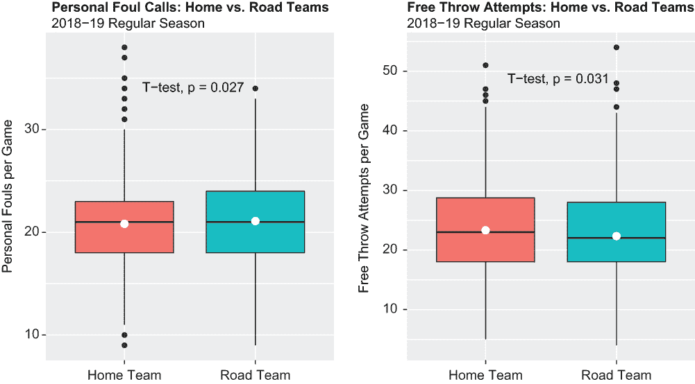
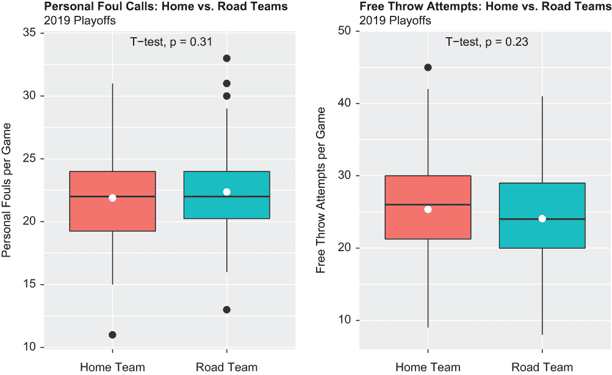
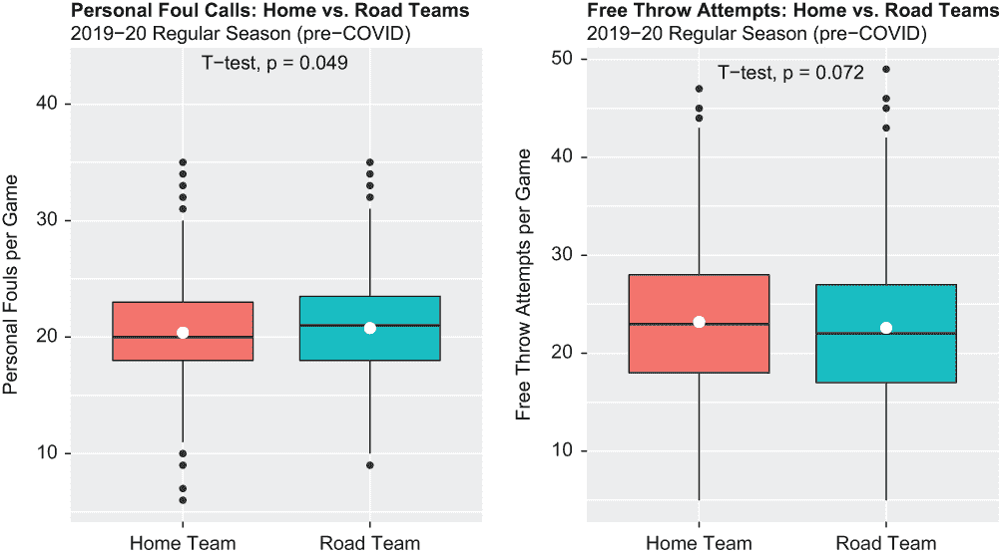
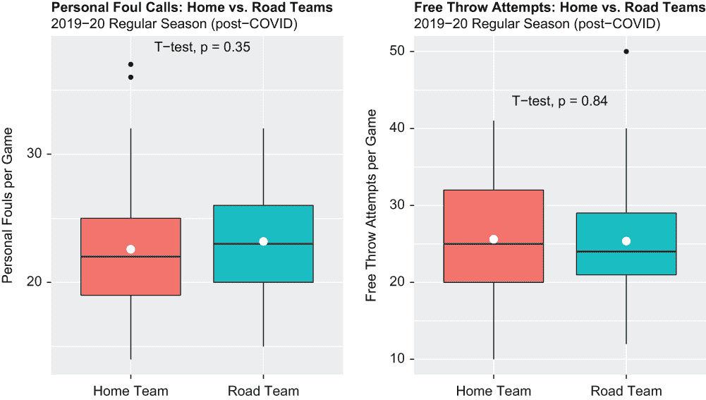

# 7 t 检验和效应量测试

本章涵盖

+   运行和解释连续数据的显著性统计测试

+   可视化显著性统计测试

+   运行和解释连续数据的效应量测试

即使你只是个篮球爱好者，你也可能知道，主队赢得比赛的概率远远高于输掉比赛（其他运动也是如此）。在第九章中，我们将探讨主队和客队在不同休息日排列下的实际胜负百分比，但在此期间，我们想确定是否存在可能解释主场优势的裁判偏见。我们将比较主队和客队的犯规次数和罚球尝试次数，然后进行统计测试以确定这些计数中的任何差异是否具有统计学意义以及它们的效果量可能是什么。要运行哪些统计测试主要取决于数据。由于我们将比较两组（仅两组）结果为数字的数据，因此我们的计划是运行 t 检验以确定是否存在任何具有统计学意义的差异，并运行 Cohen 的 d 效应量测试来衡量这些差异的大小。

我们的初始假设，或零假设，是客场和主场的个人犯规或罚球尝试之间没有统计学上显著的差异；因此，我们首先假设任何差异都是由于偶然而不是有意的。我们需要从 t 检验中获得压倒性的证据来拒绝我们的零假设，然后得出结论，我们观察到的任何数据差异都不是由于偶然。Cohen 的 d 测试返回关于这些相同差异的定量和定性度量，独立于 t 检验结果；我们不会根据效应量测试的结果拒绝或未能拒绝零假设。

我们将在后面详细介绍 t 检验和效应量测试，但这里是一个我们旅程的快照：

+   我们将从加载包开始，导入与第六章中导入的相同的数据集对，然后运行一系列数据整理操作。

+   关于 2018-19 赛季，我们将对个人犯规和罚球（通常在对方球队犯规后判给一支球队）进行 t 检验，这些数据分为常规赛和季后赛。然后，我们将运行效应量测试来补充我们的 t 检验。

+   关于受 COVID-19 影响的 2019-20 赛季，我们还将运行一系列 t 检验和效应量测试，但这次数据仅分为常规赛。我们首先将在 COVID-19 暂时暂停比赛之前进行的常规赛比赛数据集上运行我们的测试，然后在赛季恢复时，所有比赛都在佛罗里达州奥兰多的中立场地进行。

让我们通过加载我们的包开始我们的旅程。

## 7.1 加载包

如同往常，我们将调用基础 R 和包装函数的混合来导入数据，整理数据，进行显著性测试，可视化结果，并计算基本统计量。我们的首要任务是调用基础 R 的`library()`函数来加载`tidyverse`、`ggpubr`、`sqldf`、`effsize`和`patchwork`包：

```
library(tidyverse)
library(ggpubr)
library(sqldf)
library(effsize)
library(patchwork)
```

`ggpubr`包包括用于定制`ggplot2`可视化的简单直接函数。`effsize`包包括一个执行效应量测试的函数。本章中所有超出基础 R 的内容都与这五个包中的一个相关联。

## 7.2 导入数据

我们现在调用`readr`的`read_csv()`函数来导入我们在上一章中加载的相同两个.csv 文件——`nba_boxscore_1819.csv`和`nba_boxscore_1920.csv`——这两个文件都是从网站[www.bigdataball.com](https://www.bigdataball.com/)下载的，并随后存储在我们的默认工作目录中：

```
df1 <- read_csv("nba_boxscore_1819.csv")
df2 <- read_csv("nba_boxscore_1920.csv")
```

我们将这些设置为 df1 和 df2 数据集，分别对应。

## 7.3 整理数据

回到第二章，我们保存了我们原始数据集的一个经过大量修改的版本，然后通过调用基础 R 的`write.csv()`函数将内容导出为.csv 文件。这样做是为了避免在第三章中重复第二章的数据整理操作。尽管我们导入的文件与上一章首次导入的文件相同，但我们的目的与第六章中的目的完全不同，因此我们的数据整理操作将完全不同。换句话说，在第六章中没有调用`write.csv()`函数并没有失去任何机会。

话虽如此，我们将从包含在 df1 中的 2018-19 赛季得分数据开始。我们调用`dplyr filter()`函数来对 df1 数据集进行子集化，选择变量`VENUE`等于`R`的观测值，并将结果保存在一个新的对象 df3 中。因此，我们的新数据集仅包含客场队伍的数据：

```
df1 %>%
  filter(VENUE == "R") -> df3
```

接下来，我们调用`select()`函数，也是来自`dplyr`包的，将 df3 数据集减少到只包含未来需要的变量：

```
df3 %>%
  select(DATASET, TEAM, VENUE, FT, FTA, PF) -> df3
```

其中一些你可能从上一章中熟悉，而另一些可能不熟悉：

+   `DATASET`—现在是一个字符串，但本质上包括两个级别，用于区分常规赛比赛和季后赛比赛。

+   `TEAM`—另一个字符串；这等于队伍名称，例如，密尔沃基等于密尔沃基雄鹿，丹佛等于丹佛掘金。

+   `VENUE`—始终等于`R`，作为代表客场队伍的标识（与代表主场队伍的`H`相对）。

+   `FT`—等于客场队伍在任何特定比赛中做出的罚球次数。当球员在尝试投篮时被对方犯规时，他们最常获得罚球。

+   `FTA`—等于客场队伍尝试的罚球次数。

+   `PF`—等于客场队伍在任何特定比赛中犯的个人犯规次数。

这些相同的变量随后被重命名，以便在以后区分它们与主队的等效变量（除了`DATASET`，我们只是将其转换为小写）。使用`dplyr`的`rename()`函数将赋值运算符右侧的变量名转换为左侧的名称：

```
df3 %>% 
  rename(dataset = DATASET, teamR = TEAM, venueR = VENUE, ftR = FT, 
         ftaR = FTA, pfR = PF) -> df3
```

我们将 df3 中的三个变量——`dataset`、`teamR`和`venueR`——通过三次调用基础 R 的`as.factor()`函数转换为因子变量。这同样是对具有有限可能值的变量的一种最佳实践：

```
df3$dataset <- as.factor(df3$dataset)
df3$teamR <- as.factor(df3$teamR)
df3$venueR <- as.factor(df3$venueR)
```

这些相同的步骤被重复执行以创建一个名为 df4 的数据集。这个数据集与 df3 相似，只是它包含的是主队的得分数据而不是客队的得分数据（并且没有`DATASET`变量）：

```
df1 %>%
  filter(VENUE == "H") -> df4

df4 %>% 
  select(TEAM, VENUE, FT, FTA, PF) -> df4

df4 %>% 
  rename(teamH = TEAM, venueH = VENUE, ftH = FT, ftaH = FTA,
               pfH = PF) -> df4

df4$teamH <- as.factor(df4$teamH)
df4$venueH <- as.factor(df4$venueH)
```

接下来，我们通过两次调用基础 R 的`dim()`函数来指示 R 返回 df3 和 df4 的维度：

```
dim(df3) 
## [1] 1312    6
dim(df4)
## [1] 1312    5
```

两个数据集都包含 1,312 行；df3 有六个变量，而 df4 只有五个变量，因为我们保留了前者的变量`dataset`，而没有在后者中保留。

接下来，我们通过调用基础 R 的`cbind()`函数将 df3 和 df4 数据集合并成一个名为 fouls1819 的单个对象（回想一下，我们现在正在专门使用 2018-19 数据）。`cbind()`函数使得将多个数据集横向合并成一个数据集成为可能。然后我们再次调用`dim()`函数来检查 fouls1819 中的行和列计数：

```
fouls1819 <- cbind(df3, df4)
dim(fouls1819) 
## [1] 1312   11
```

而 df3 有 1,312 行和 6 列，df4 有 1,312 行和 5 列，我们的 fouls1819 数据集有 1,312 行和 11 列。现在我们有一个包含 2018-19 常规赛和季后赛数据的数据集，可以进行分析了。

## 7.4 对 2018-19 数据的分析

我们的分析将分为两部分。首先，我们将计算并测试 2018-19 常规赛期间主队和客队在犯规和罚球尝试方面的方差。然后，我们将对 2018-19 季后赛进行相同的计算和测试。

### 7.4.1 2018-19 常规赛分析

我们需要首先对 fouls1819 数据集进行子集化，使其仅包含常规赛比赛。因此，我们将 fouls1819 数据集传递（或管道）到`filter()`函数，该函数将 fouls1819 减少到一个新的数据集，称为 fouls1819reg，其中变量`dataset`等于`NBA 2018-2019 Regular Season`。

然后，我们调用基础 R 的`sum()`和`mean()`函数来计算使用我们的新数据集作为源的关键度量在客场和主场球队之间的方差。目前，我们只是对获取基线数据感兴趣：

```
fouls1819 %>% 
  filter(dataset == "NBA 2018-2019 Regular Season") -> fouls1819reg

sum(fouls1819reg$pfR) - sum(fouls1819reg$pfH)
## [1] 470
mean(fouls1819reg$pfR) - mean(fouls1819reg$pfH)
## [1] 0.3821138
mean(fouls1819reg$ftaR) - mean(fouls1819reg$ftaH)
## [1] -0.6504065
sum(fouls1819reg$ftR) / sum(fouls1819reg$ftaR) 
## [1] 0.7655742
sum(fouls1819reg$ftH) / sum(fouls1819reg$ftaH) 
## [1] 0.7670176
```

以下是对这些结果的总结：

+   在 2018-19 常规赛期间，客场球队被吹罚的个人犯规比主场球队多 470 次；确切地说，客场球队总共被吹罚了 25,947 次个人犯规，而主场球队为 25,477 次。

+   因此，客场球队在每场比赛中被吹罚大约 0.38 次更多的个人犯规，比主场球队多。

+   因此，主队每场比赛尝试的罚球次数比客队多大约 0.65 次。

+   尽管主队平均每场比赛尝试的罚球次数更多，但主队和客队在这方面的效率是相同的；主队和客队在他们的罚球尝试中成功率都是 77%。

这些差异可能*看起来*微不足道，但我们的数据集的长度也必须考虑。显著性检验允许考虑这两个因素——统计显著性取决于组均值、方差和记录数。例如，在短数据上的“大”方差可能是统计上*不显著的*；相反，在长数据上的“小”方差可能是统计上*显著的*。t 检验就是这样一种统计检验，其中比较的是两组——并且不超过两组——数据是连续的。我们的零假设始终是，无论测量方法如何，均值在客队和主队之间基本上没有不同。因此，任何测试中的 p 值必须等于或低于 0.05 的显著性阈值，以拒绝均值在统计上相等的零假设，并接受替代假设。虽然 5%的截止值相当任意，但它无疑是一个很小的数字，因此可以被视为拒绝零假设的高标准。

t 检验有*很多*应用案例；例如：

+   一家制药公司想要测试一种新的降胆固醇药物与市场上已经存在多年的药物的效果。受影响的病人被随机选择，并被分配使用其中一种药物。t 检验将确定哪种药物在治疗高胆固醇水平方面比另一种药物更有效，或者任何结果差异仅仅是偶然造成的。

+   一所大学想要测试和比较一组随机选择的学生（他们亲自上课）与另一组随机选择的学生（他们在线上课）之间的商业分析 101 考试分数。t 检验将确定一种学习方法是否真正优于另一种学习方法。

+   一家运营两个分支机构的社区银行进行了一项调查，参与调查的客户被要求根据 1 到 10 的评分标准对所接受的服务进行评分。t 检验将确定是否有一个分支机构提供更优质的客户服务，或者任何差异都是微不足道的。

数据必须否则是连续的（在第九章中，我们将对分类数据进行卡方检验），并且比较的组数不应超过两个。（在随后的章节中，我们将拟合方差分析[ANOVA]模型来比较超过两个组。）

t 检验：个人犯规

在 R 中运行 t-test 非常简单；我们只需调用现成的`t.test()`函数，并将我们比较的两个变量作为参数传递。我们的第一个 t-test 比较了客场和主场球队在个人犯规中的平均值。因为 R 默认会以科学记数法返回我们的 t-test 结果，所以我们首先调用基础 R 的`options()`函数来禁用科学记数法，以便使用它们的完整数值等价物：

```
options(scipen = 999)

t.test(fouls1819reg$pfR, fouls1819reg$pfH)
## 
##  Welch Two Sample t-test
## 
## data:  fouls1819reg$pfR and fouls1819reg$pfH
## t = 2.2089, df = 2457.8, p-value = 0.02727
## alternative hypothesis: true difference in means is not equal to 0
## 95 percent confidence interval:
##  0.04290002 0.72132763
## sample estimates:
## mean of x mean of y 
##  21.09512  20.71301
```

p 值等于 0.03，这当然低于接受的或预定义的显著性阈值 0.05。换句话说，如果零假设实际上是真的，观察到相同或更极端差异的概率仅为 3%。因此，我们可以拒绝零假设，并得出结论，2018-19 NBA 常规赛期间客场和主场球队在个人犯规计数上的方差不是由于偶然；换句话说，数据指向的趋势很可能是有因果关系的。

t-test：罚球尝试

让我们现在运行第二个 t-test，这次比较客场和主场球队的罚球尝试次数：

```
t.test(fouls1819reg$ftaR, fouls1819reg$ftaH)
## 
##  Welch Two Sample t-test
## 
## data:  fouls1819reg$ftaR and fouls1819reg$ftaH
## t = -2.1619, df = 2457.9, p-value = 0.03072
## alternative hypothesis: true difference in means is not equal to 0
## 95 percent confidence interval:
##  -1.24035782 -0.06045519
## sample estimates:
## mean of x mean of y 
##  22.74715  23.39756
```

这个方差同样具有显著性。因为 p 值再次等于 0.03，我们可以再次拒绝零假设，并自信地得出结论，2018-19 常规赛期间客场和主场球队在罚球尝试次数上的方差是有意义的。

顺便说一下，说“客场球队总是被判更多的犯规”或“客场和主场球队在罚球尝试次数上的差异显著”并不准确。最好具体说明在什么数据上进行了哪些测试，并且不要得出更大的结论；2018-19 NBA 常规赛期间的情况可能并不适用于，比如说，1978-79 赛季。

可视化方差

可视化这些差异的最佳方式是使用配对箱线图。我们首先创建格式化为`ggplot2`可读性的临时数据集。对于我们的第一组配对箱线图，我们调用`dplyr`包中的`select()`函数来创建一个名为 temp1 的数据集，它只包含犯规 1819reg 数据集中的`pfR`和`pfH`变量。

然后，我们调用`tidyr`包中的`pivot_longer()`函数——`tidyr`也是`tidyverse`包宇宙的一部分——通过将列折叠成行来重塑 temp1；temp1 仍然有两个列，但现在它们被命名为`team`和`fouls`。之前`pfR`和`pfH`的列现在成为`team`变量的级别，它们对应的计数现在占据`fouls`变量的单元格。

接下来，我们调用基础 R 的`head()`函数，它将 temp1 中的前六个观测值打印出来，以提供我们结果的视觉展示：

```
temp1 <- select(fouls1819reg, c(pfR, pfH))
temp1 %>%
  pivot_longer(cols = c(pfR, pfH),
               names_to = "team",
               values_to = "fouls") -> temp1
head(temp1)
## # A tibble: 6 × 2
##   team  fouls
##   <chr> <int>
## 1 pfR      20
## 2 pfH      20
## 3 pfR      21
## 4 pfH      29
## 5 pfR      25
## 6 pfH      19
```

现在，对于我们的`ggplot2`箱线图（见图 7.1），我们做以下操作：

+   首先，我们调用基础 R 的`c()`函数来创建一个向量，称为 tempt1.text，包含`Home Team`和`Road Team`的值。tempt1.text 随后被转换为`scale_x_discrete()`函数，这样`Home Team`和`Road Team`就是我们的 x 轴标签。

+   我们的箱线图其他来源是 temp1，其中`team`作为我们的 x 轴变量，`fouls`作为我们的 y 轴变量。

+   `stat_summary()`函数在每个箱线图中添加一个白点来表示均值，这对于特别重要，因为 t 检验是在比较两组的均值，而不是中位数。

+   `ggpubr`包中的`stat_compare_means()`函数本质上通过比较我们可视化的两个变量的均值来执行独立 t 检验，并将结果插入其中，就像`ggplot2`的`geom_text()`或`annotate()`函数一样，其中指定的 x 和 y 坐标交叉。



图 7.1：主队和客队每场比赛个人犯规的配对箱线图（左侧）和每场比赛主队和客队罚球尝试的配对箱线图（右侧）。白点代表总体均值。数据来自 2018-19 赛季。这两个方差都经过统计检验，具有统计学意义。

以下是完全的代码块：

```
temp1.text <- c("Home Team", "Road Team")
p1 <- ggplot(temp1, aes(x = team, y = fouls, fill = team)) + 
  geom_boxplot() +
  labs(title = "Personal Foul Calls: Home vs. Road Teams", 
       subtitle = "2018-19 Regular Season",
       x = "", 
       y = "Personal Fouls per Game") +
  stat_summary(fun = mean, geom = "point", shape = 20, size = 8, 
               color = "white", fill = "white") + 
  theme(legend.position = "none") +
  scale_x_discrete(labels = temp1.text) +
  theme(plot.title = element_text(face = "bold")) +
  stat_compare_means(method = "t.test", 
                     label.x = 1.4, label.y = 34)
```

我们现在用罚球尝试代替个人犯规来做同样的事情。我们首先创建一个名为 temp2 的数据源，其结构与 temp1 相同，然后调用`ggplot()`函数创建第二组与第一组相似的箱线图：

```
temp2 <- select(fouls1819reg, c(5,10)) 
temp2 %>%
  pivot_longer(cols = c(ftaR, ftaH),
               names_to = "team",
               values_to = "ftattempts") -> temp2
head(temp2)
##   team ftattempts
## 1 ftaR         23
## 2 ftaH         14
## 3 ftaR         37
## 4 ftaH         18
## 5 ftaR         20
## 6 ftaH         22

temp2.text <- c("Home Team", "Road Team")
p2 <- ggplot(temp2, aes(x = team, y = ftattempts, fill = team)) + 
  geom_boxplot() +
  labs(title = "Free Throw Attempts: Home vs. Road Teams", 
       subtitle = "2018-19 Regular Season",
       x = "", 
       y = "Free Throw Attempts per Game") +
  stat_summary(fun = mean, geom = "point", shape = 20, size = 8, 
               color = "white", fill = "white") + 
  theme(legend.position = "none") +
  scale_x_discrete(labels = temp2.text) +
  theme(plot.title = element_text(face = "bold")) +
  stat_compare_means(method = "t.test", 
                     label.x = 1.4, label.y = 48)
```

我们通过调用`patchwork`包中的`plot_layout()`函数，将我们的两个可视化，p1 和 p2，打包成一个单独的图形对象：

```
p1 + p2 + plot_layout(ncol = 2)
```

我们的双箱线图清晰地显示了主队和客队之间人口均值（由箱内的白点表示）以及长度或四分位距的额外差异（仅由箱体表示）的方差。

我们可能被这两个图中的异常值分心。例如，在 2018-19 赛季的常规赛季中，至少有五次球队被要求至少 34 次个人犯规，至少有两次球队尝试了超过 50 次罚球。

然后，我们调用`sqldf`包中的`sqldf()`函数，以返回 fouls1819reg 数据集中至少有一支球队被要求 34 次或更多个人犯规的观测值：

```
sqldf("SELECT * from fouls1819reg WHERE pfH >= 34 OR pfR >= 34")
##                         dataset         teamR venueR ftR ftaR pfR         
## 1  NBA 2018-2019 Regular Season   LA Clippers      R  33   43  26 
## 2  NBA 2018-2019 Regular Season       Phoenix      R  13   24  34  
## 3  NBA 2018-2019 Regular Season   LA Clippers      R  37   47  22       
## 4  NBA 2018-2019 Regular Season  Philadelphia      R  41   54  30       
## 5  NBA 2018-2019 Regular Season       Phoenix      R  15   21  34        
## 6  NBA 2018-2019 Regular Season      Brooklyn      R  26   34  23     
## 7  NBA 2018-2019 Regular Season Oklahoma City      R  16   25  34        
## 8  NBA 2018-2019 Regular Season       Chicago      R  35   48  30       
## 9  NBA 2018-2019 Regular Season Oklahoma City      R  17   26  34   
## 10 NBA 2018-2019 Regular Season      Brooklyn      R  33   54  23   
##            teamH venueH ftH ftaH pfH
## 1  Oklahoma City      H  23   32  35
## 2  Philadelphia       H  31   42  27
## 3  Atlanta            H  17   19  38
## 4  Phoenix            H  30   36  34
## 5  Dallas             H  32   45  17
## 6  Cleveland          H  13   18  37
## 7  Denver             H  26   35  28
## 8  Atlanta            H  17   25  34
## 9  LA Clippers        H  31   46  26
## 10 Atlanta            H  26   32  37    
```

结果表明，在 2018-19 赛季的常规赛季中，有 10 场比赛至少有一支参赛队伍被要求至少 34 次个人犯规——这通常发生在主队。

接下来，我们再次调用`sqldf()`函数，这次是为了获取 fouls1819reg 中客队或主队至少尝试了 50 次罚球的全部记录。在我们的三次尝试中，有两次实际上是客队受益：

```
sqldf("SELECT * from fouls1819reg WHERE ftaH > 50 OR ftaR > 50")
##                        dataset        teamR venueR ftR ftaR pfR        
## 1 NBA 2018-2019 Regular Season      Detroit      R  28   41  32 
## 2 NBA 2018-2019 Regular Season Philadelphia      R  41   54  30      
## 3 NBA 2018-2019 Regular Season     Brooklyn      R  33   54  23      
##          teamH venueH ftH ftaH pfH
## 1 Philadelphia      H  44   51  31
## 2 Phoenix           H  30   36  34
## 3 Atlanta           H  26   32  37
```

所以在 2018-19 赛季实际上有三场比赛一支球队尝试了超过 50 次罚球。其中两场比赛与我们的第一次`sqldf`查询结果相关联，这并不奇怪；毕竟，个人犯规往往会导致尝试罚球。但有一场比赛不是这样，这就是为什么我们要测试主客场球队之间的个人犯规**以及**同一比赛中的罚球尝试。现在让我们使用相同的方法来检查 2018-19 赛季季后赛的相同措施。

### 7.4.2 2019 赛季分析

由于并非每个 NBA 球队都符合季后赛资格，而且每个回合球队都会被淘汰，我们的分析将针对比之前**短得多**的数据集进行。而 fouls1819reg 数据集包含 1,230 条记录，我们现在将处理一个只有 82 行长的数据集。因此，为了再次获得具有统计学意义的成果，我们的方差可能需要比之前更大。

我们首先将 fouls1819 数据集通过`dplyr filter()`函数传递，以创建一个新的对象 fouls1819post，它只包括那些变量`dataset`等于`NBA 2019 Playoffs`的 82 条 fouls1819 记录。

然后，我们调用`sum()`和`mean()`函数来计算之前所做的相同措施上的相同方差；唯一的不同是我们已经更换了数据源。再一次，我们只是在尝试对数据进行初步了解：

```
fouls1819 %>% 
  filter(dataset == "NBA 2019 Playoffs") -> fouls1819post

sum(fouls1819post$pfR) - sum(fouls1819post$pfH)
## [1] 48
mean(fouls1819post$pfR) - mean(fouls1819post$pfH)
## [1] 0.5853659
mean(fouls1819post$ftaR) - mean(fouls1819post$ftaH)
## [1] -1.280488
sum(fouls1819post$ftR) / sum(fouls1819post$ftaR) 
## [1] 0.7857143
sum(fouls1819post$ftH) / sum(fouls1819post$ftaH) 
## [1] 0.7821068
```

这里是我们结果的总结，包括与 2018-19 赛季常规赛季的比较：

+   在 2019 赛季季后赛中，客队比主队多被吹罚 48 次个人犯规。更具体地说，客队在 2019 赛季季后赛中被吹罚了总共 1,843 次犯规，而主队被吹罚了 1,795 次个人犯规。

+   这平均下来是 0.59 的方差，也就是说，客队在每场季后赛中被吹罚的个人犯规比主队多 0.59 次。常规赛季的差异等于 0.38。

+   因此，主队在季后赛中每场比赛尝试的罚球比客队多 1.28 次；这个方差大约是常规赛季比赛的两倍。

+   客队在罚球尝试中命中了几乎 79%，而主队在尝试的罚球中成功率为大约 78%。这些数字略高于常规赛季。

T-test: 个人犯规

让我们运行一对 t-test 来确定这些方差是否具有统计学上的显著性，从个人犯规开始：

```
t.test(fouls1819post$pfR, fouls1819post$pfH)
## 
##  Welch Two Sample t-test
## 
## data:  fouls1819post$pfR and fouls1819post$pfH
## t = 1.0133, df = 161.46, p-value = 0.3124
## alternative hypothesis: true difference in means is not equal to 0
## 95 percent confidence interval:
##  -0.5553998  1.7261315
## sample estimates:
## mean of x mean of y 
##  22.47561  21.89024
```

p 值等于 0.31。因为它大于 0.05——实际上大得多——我们应该拒绝零假设，因此可以得出结论，主客场球队之间被吹罚的个人犯规的方差**不**显著；均值基本上是相等的。虽然原始数据与 2018-19 赛季的常规赛季方向一致，但结果却是中性的。结果发现，记录数量的下降对 t-test 结果的影响大于方差增加的影响。

t 检验：罚球尝试

我们接下来的 t 检验将告诉我们，2019 年季后赛期间客场和主场球队在尝试罚球次数上的方差是否具有统计学意义：

```
t.test(fouls1819post$ftaR, fouls1819post$ftaH)
## 
##  Welch Two Sample t-test
## 
## data:  fouls1819post$ftaR and fouls1819post$ftaH
## t = -1.1997, df = 159.16, p-value = 0.232
## alternative hypothesis: true difference in means is not equal to 0
## 95 percent confidence interval:
##  -3.3884143  0.8274387
## sample estimates:
## mean of x mean of y 
##  24.07317  25.35366
```

因为 p 值再次大于显著性水平的 0.05 阈值——确切地说，是 0.23——所以我们再次得出结论，总体均值基本上是相等的，因此无法拒绝零假设。虽然结果再次与我们的常规赛结果方向一致，但我们仍然被迫再次将结果定性为中性。

可视化方差

我们随后像之前一样可视化和打包我们的结果（见图 7.2）。以下代码块与我们之前的代码块非常相似，只是我们改变了数据源：

```
temp3 <- select(fouls1819post, c(6,11)) 
temp3 %>%
  pivot_longer(cols = c(pfR, pfH),
               names_to = "team",
               values_to = "fouls") -> temp3
head(temp3)
##   team fouls
## 1  pfR    19
## 2  pfH    19
## 3  pfR    27
## 4  pfH    24
## 5  pfR    22
## 6  pfH    22

temp3.text <- c("Home Team", "Road Team")
p3 <- ggplot(temp3, aes(x = team, y = fouls, fill = team)) + 
  geom_boxplot() +
  labs(title = "Personal Foul Calls: Home vs. Road Teams", 
       subtitle = "2019 Playoffs",
       x = "", 
       y = "Personal Fouls per Game") +
  stat_summary(fun = mean, geom = "point", shape = 20, size = 8, 
               color = "white", fill = "white") + 
  theme(legend.position = "none") +
  scale_x_discrete(labels = temp1.text) +
  theme(plot.title = element_text(face = "bold")) +
  stat_compare_means(method = "t.test", label.x = 1.4, label.y = 34)
temp4 <- select(fouls1819post, c(5,10)) 
temp4 %>%
  pivot_longer(cols = c(ftaR, ftaH),
               names_to = "team",
               values_to = "ftattempts") -> temp4
head(temp4)
##   team ftattempts
## 1 ftaR         20
## 2 ftaH         14
## 3 ftaR         26
## 4 ftaH         42
## 5 ftaR         22
## 6 ftaH         20

temp4.text <- c("Home Team", "Road Team")
p4 <- ggplot(temp4, aes(x = team, y = ftattempts, fill = team)) +
  geom_boxplot() +
  labs(title = "Free Throw Attempts: Home vs. Road Teams", 
       subtitle = "2019 Playoffs",
       x = "", 
       y = "Free Throw Attempts per Game") +
  stat_summary(fun = mean, geom = "point", shape = 20, size = 8, 
               color = "white", fill = "white") + 
  theme(legend.position = "none") +
  scale_x_discrete(labels = temp2.text) +
  theme(plot.title = element_text(face = "bold")) +
  stat_compare_means(method = "t.test", label.x = 1.4, label.y = 48)

p3 + p4 + plot_layout(ncol = 2)

```



图 7.2：每场比赛个人犯规次数和每场比赛尝试的罚球次数的配对箱线图，客场与主场的对比。由白色点表示的总体均值差异很明显。尽管结果与我们的第一组测试方向一致，但这些差异在统计学上并不显著。数据来自 2019 年季后赛比赛。

以下总结了我们从 2018-19 赛季得出的发现：

+   在常规赛期间，个人犯规次数和罚球尝试次数的方差在客场和主场球队之间具有统计学意义。客场球队被吹罚的个人犯规次数多于主场球队，而主场球队尝试的罚球次数多于客场球队。这些差异在整个常规赛期间都很重要。

+   在季后赛期间，这两项指标的方差与我们的常规赛结果方向一致，但却是中性的；它们在统计学上并不显著，这主要是因为*记录数量低*。正是出于这个原因，我们接下来将进行一对效应量测试。

### 7.4.3 效应量测试

虽然 t 检验告诉我们两个总体均值之间是否存在统计学上的显著差异（以及我们应该拒绝还是无法拒绝零假设），但它们并没有告诉我们差异有多大，或者有多小。这就是效应量测试发挥作用的地方。效应量最常用的测量方法之一是 Cohen 的 d 值，它计算两个均值之间的差异，并将其除以相同两个总体之间的平均标准差，从而得到一个既量化又分类的效应量。效应量测试的结果对我们的零假设没有任何影响；结果仅仅告诉我们方差有多大或有多小。在很大程度上，这是因为 Cohen 的 d 测试不考虑记录数量。

Cohen’s d 理论上可能在数据较少的情况下返回较大的效果量，而之前的 t 测试返回了统计上不显著的结果；另一方面，Cohen’s d 理论上可能在数据较多的情况下返回较小或甚至可忽略的效果量，而之前的 t 测试返回了统计上显著的结果。这表明，尽管 t 测试和 Cohen’s d 测试很好地互补，但它们不一定返回“相关”很强的结果，因此不应这样比较。

让我们看看一对 Cohen’s d 测试的结果如何，记住我们的 t 测试在数据方向上是一致的，但结果却相互矛盾。在 R 中运行 Cohen’s d 测试和 t 测试一样简单——我们只需从`effsize`包中调用`cohen.d()`函数，并将我们正在测试的数据作为参数传递。

在下面的代码块中，我们两次调用`cohen.d()`函数——首先测量 2018-19 赛季客场与主场球队之间的个人犯规效果量，然后再次测量 2019 赛季季后赛中的相同效果量：

```
cohen.d(fouls1819reg$pfR, fouls1819reg$pfH)
## 
## Cohen's d
## 
## d estimate: 0.08907251 (negligible)
## 95 percent confidence interval:
##       lower       upper 
## 0.009960997 0.168184021

cohen.d(fouls1819post$pfR, fouls1819post$pfH)
## 
## Cohen's d
## 
## d estimate: 0.158254 (negligible)
## 95 percent confidence interval:
##      lower      upper 
## -0.1506272  0.4671351
```

两个测试都返回了相同的结果；无论是否存在均值上的统计显著性差异，Cohen’s d 测试告诉我们，客场与主场球队、常规赛与季后赛之间的个人犯规方差是微不足道的。这是因为 d 估计值，它代表了均值之间标准差的数目，对于两个测试来说都是如此微不足道。在我们的两个测试中，第一个测试中，对客场球队判定的个人犯规比主场球队多 0.09 个标准差（0.09 等于 d 估计值）；在第二个测试中，对客场球队的犯规比主场球队多 0.16 个标准差。如果 d 估计值为负，这仅仅意味着传递给`cohen.d()`函数的第二组具有两个标准差中的较高值。为了使效果量被标记为小，d 估计值需要至少等于 0.20，正负；相比之下，为了使效果量获得大的定性评价，d 估计值需要至少等于 0.80，正负。

让我们在尝试的罚球方面做同样的处理：

```
cohen.d(fouls1819reg$ftaR, fouls1819reg$ftaH)
## 
## Cohen's d
## 
## d estimate: -0.08717524 (negligible)
## 95 percent confidence interval:
##       lower       upper 
## -0.16628510 -0.00806538
cohen.d(fouls1819post$ftaR, fouls1819post$ftaH)
## 
## Cohen's d
## 
## d estimate: -0.1873661 (negligible)
## 95 percent confidence interval:
##      lower      upper 
## -0.4964408  0.1217086
```

根据我们进行的第二轮 Cohen’s d 测试，尝试的罚球之间的实际差异——客场与主场的球队，常规赛与季后赛，之前是否有统计显著性——在两种情况下都是微不足道的。然而，至少再强调一次，但稍微有所不同，我们不应该因为后续的 Cohen’s d 测试返回了可忽略的效果量就对我们的 t 测试结果泼冷水，这些 t 测试结果显示了统计显著性。一方面，人们会考虑记录数，另一方面则不会。当记录数较少时，两个样本或两个群体之间的均值差异应该不那么重要，而当我们有更多数据时，这种差异应该更加重要。

## 7.5 对 2019-20 数据的分析

这就是我们对 2018-19 数据集的分析。但你可能还记得我们导入了两个赛季的数据——所以现在是时候探索 2019-20 NBA 赛季了。

### 7.5.1 2019-20 常规赛分析（疫情前）

我们将使用相同的衡量标准和统计测试，但我们的 2019-20 分析将仅限于常规赛比赛，包括疫情前后。在疫情之前，2019-20 NBA 常规赛的进行方式与任何之前的赛季一样。COVID 突然暂停了所有比赛，一旦赛季恢复，剩余的所有比赛都在奥兰多的中立场地进行，没有球迷在场。因此，我们不会再次测试常规赛和季后赛，而是测试疫情前后的常规赛。我们之前用于整理 2018-19 数据的步骤在下面的代码块中得到了复制，并应用于 2019-20 赛季。

我们首先通过调用`filter()`函数，创建一个新的数据集 df5，它等于 df2，其中变量`VENUE`等于`R`，代表客队：

```
df2 %>%
  filter(VENUE == "R") -> df5
```

然后我们调用`select()`函数来减少 df5 数据集的宽度。注意我们保留了一个额外的变量`GAME_ID`，我们之前从 2018-19 数据中丢弃了它：

```
df5 %>%
  select(DATASET, GAME_ID, TEAM, VENUE, FT, FTA, PF) -> df5
```

在准备进一步的数据整理操作之前，我们调用`rename()`函数来重命名 df5 变量，有时在末尾附加一个大写 R，以便稍后区分客队和主队的相同衡量标准：

```
df5 %>% 
  rename(dataset = DATASET, gameID = GAME_ID, teamR = TEAM, venueR = VENUE, 
         ftR = FT, ftaR = FTA, pfR = PF) -> df5
```

通过连续调用基础 R 的`as.factor()`函数，将变量`dataset`、`teamR`和`venueR`转换为因子变量：

```
df5$dataset <- as.factor(df5$dataset)
df5$teamR <- as.factor(df5$teamR)
df5$venueR <- as.factor(df5$venueR)
```

现在我们调用这些相同的函数来创建一个名为 df6 的数据集，它基本上是 df5 的主队版本：

```
df2 %>%
  filter(VENUE == "H") -> df6

df6 %>%
  select(TEAM, VENUE, FT, FTA, PF) -> df6

df6 %>% 
  rename(teamH = TEAM, venueH = VENUE, ftH = FT, ftaH = FTA,
               pfH = PF) -> df6
df6$teamH <- as.factor(df6$teamH)
df6$venueH <- as.factor(df6$venueH)
```

接下来，我们通过调用基础 R 的`cbind()`函数将 df5 和 df6 数据集连接起来：

```
fouls1920 <- cbind(df5, df6)
dim(df5) 
## [1] 1143    7
dim(df6) 
## [1] 1143    5
dim(fouls1920) 
## [1] 1143   12
```

根据`dim()`函数的返回值，df5 包含 1,143 行和 7 列；df6 数据集包含 1,143 行和 5 列；fouls1920，df5 和 df6 的汇总，包含 1,143 行和 12 列。

为了将 fouls1920 数据集子集化，使其仅包括在疫情前进行的比赛，我们调用`filter()`函数来子集化 fouls1920，其中变量`gameID`等于或小于`21900973`。结果是名为 fouls1920a 的新对象。

然后我们通过调用基础 R 的`sum()`和`mean()`函数，使用 fouls1920a 作为数据源来计算我们的关键衡量标准的方差：

```
fouls1920 %>% 
  filter(gameID <= 21900973) -> fouls1920a

sum(fouls1920a$pfR) - sum(fouls1920a$pfH)
## [1] 378
mean(fouls1920a$pfR) - mean(fouls1920a$pfH)
## [1] 0.3892894
mean(fouls1920a$ftaR) - mean(fouls1920a$ftaH) 
## [1] -0.5983522
sum(fouls1920a$ftR) / sum(fouls1920a$ftaR) 
## [1] 0.7707593
sum(fouls1920a$ftH) / sum(fouls1920a$ftaH) 
## [1] 0.7712117
```

我们的结果如下：

+   客队被吹罚的个人犯规比主队多 378 次，等于 20,171 次犯规和 19,793 次犯规之间的差异。

+   因此，客队每场比赛被吹罚的个人犯规比主队多 0.39 次（2018-19 常规赛的每场比赛平均值为 0.38）。

+   主队每场比赛尝试的罚球比客队多 0.60 次（前一个常规赛的每场比赛平均值为 0.65）。

+   路线和主队成功率为 77%的罚球尝试。

t 检验：个人犯规

现在我们再进行另一个 t 检验，这次是为了确定 2019-20 赛季常规赛（在 COVID-19 之前）中，路线和主队在个人犯规判罚上的方差是否有统计学意义：

```
t.test(fouls1920a$pfR, fouls1920a$pfH)
## 
##  Welch Two Sample t-test
## 
## data:  fouls1920a$pfR and fouls1920a$pfH
## t = 1.9686, df = 1937.3, p-value = 0.04914
## alternative hypothesis: true difference in means is not equal to 0
## 95 percent confidence interval:
##  0.001474823 0.777103962
## sample estimates:
## mean of x mean of y 
##  20.77343  20.38414
```

如果使用 0.05 作为分界线的 p 值，结果几乎不显著。话虽如此，我们仍然应该拒绝总体均值相等的零假设。

t 检验：罚球尝试

让我们再进行另一个 t 检验，这次比较路线和主队在罚球尝试上的差异：

```
t.test(fouls1920a$ftaR, fouls1920a$ftaH)
## 
##  Welch Two Sample t-test
## 
## data:  fouls1920a$ftaR and fouls1920a$ftaH
## t = -1.8004, df = 1936.4, p-value = 0.07196
## alternative hypothesis: true difference in means is not equal to 0
## 95 percent confidence interval:
##  -1.25014956  0.05344513
## sample estimates:
## mean of x mean of y 
##  22.59732  23.19567
```

这次，我们的结果几乎**不显著**；因此，我们必须拒绝零假设，并接受总体均值基本上是相等的——再次，因为我们使用 5%作为预定义的截止点。但除此之外，我们的结果表明，如果零假设实际上是真的，观察到至少相等结果的可能性仅为 7%。因此，虽然方差在技术上并不显著，但 p 值很低，显然非常接近我们预定义的显著性阈值。

可视化方差

我们将结果可视化和打包，就像我们处理 2018-19 年的数据那样（见图 7.3）：

```
temp5 <- select(fouls1920a, c(7,12)) 
temp5 %>%
  pivot_longer(cols = c(pfR, pfH),
               names_to = "team",
               values_to = "fouls") -> temp5
head(temp5)
##   team fouls
## 1  pfR    34
## 2  pfH    24
## 3  pfR    24
## 4  pfH    25
## 5  pfR    20
## 6  pfH    18

temp5.text <- c("Home Team", "Road Team")
p5 <- ggplot(temp5, aes(x = team, y = fouls, fill = team)) +
  geom_boxplot() +
  labs(title = "Personal Foul Calls: Home vs. Road Teams", 
       subtitle = "2019-20 Regular Season (pre-COVID)",
       x = "", 
       y = "Personal Fouls per Game") +
  stat_summary(fun = mean, geom = "point", shape = 20, size = 8, 
               color = "white", fill = "white") + 
  theme(legend.position = "none") +
  scale_x_discrete(labels = temp1.text) +
  theme(plot.title = element_text(face = "bold")) +
  stat_compare_means(method = "t.test", label.x = 1.4, label.y = 43)

temp6 <- select(fouls1920a, c(6,11)) 
temp6 %>%
  pivot_longer(cols = c(ftaR, ftaH),
               names_to = "team",
               values_to = "ftattempts") -> temp6
head(temp6)
##   team ftattempts
## 1 ftaR         20
## 2 ftaH         38
## 3 ftaR         21
## 4 ftaH         24
## 5 ftaR         22
## 6 ftaH         16

temp6.text <- c("Home Team", "Road Team")
p6 <- ggplot(temp6, aes(x = team, y = ftattempts, fill = team)) + 
  geom_boxplot() +
  labs(title = "Free Throw Attempts: Home vs. Road Teams", 
       subtitle = "2019-20 Regular Season (pre-COVID)",
       x = "", 
       y = "Free Throw Attempts per Game") +
  stat_summary(fun = mean, geom = "point", shape = 20, size = 8, 
               color = "white", fill = "white") + 
  theme(legend.position = "none") +
  scale_x_discrete(labels = temp1.text) +
  theme(plot.title = element_text(face = "bold")) +
  stat_compare_means(method = "t.test", label.x = 1.4, label.y = 48)

p5 + p6 + plot_layout(ncol = 2)
```



图 7.3 这组成对箱线图代表了在 COVID-19 暂时暂停比赛之前 2019-20 赛季常规赛的结果。

与 2018-19 年的数据相比，这两对箱线图的长度或分散度似乎没有太大差异，无论是常规赛还是季后赛。尽管如此，我们可以清楚地看到，总体均值并不完全一致。

在下一节中，我们将通过检查和测试 2019-20 赛季剩余的常规赛来比较和对比这些结果。

### 7.5.2 2019-20 赛季常规赛分析（COVID-19 之后）

现在我们来检查 2019-20 赛季剩余的常规赛，其中每场比赛都在没有观众的情况下在奥兰多进行。我们需要一个数据集，所以我们调用`filter()`函数，对 fouls1920 进行子集处理，其中变量`dataset`等于`NBA 2019 -2020 Regular Season` *和* 变量`gameID`大于`21901231`，以得到一个新的对象 fouls1920b。然后，我们运行这些数字：

```
fouls1920 %>% 
  filter(dataset == "NBA 2019-2020 Regular Season" & 
           gameID >= 21901231) -> fouls1920b

sum(fouls1920b$pfR) - sum(fouls1920b$pfH)  
## [1] 54
mean(fouls1920b$pfR) - mean(fouls1920b$pfH) 
## [1] 0.6067416
mean(fouls1920b$ftaR) - mean(fouls1920b$ftaH) 
## [1] -0.2359551
sum(fouls1920b$ftR) / sum(fouls1920b$ftaR) 
## [1] 0.7927369
sum(fouls1920b$ftH) / sum(fouls1920b$ftaH) 
## [1] 0.7915753
```

我们得到以下结果：

+   路线队——尽管奥兰多在技术上是一个中立场地，但球队仍然被指定为路线和主队，NBA 用主队的标志和颜色装饰了场地——被吹罚了 54 次更多的个人犯规，比主队多。在 89 场比赛的赛程中，大约相当于典型的季后赛，指定的路线队犯了 2,064 次个人犯规，而指定的主队犯了 2,010 次个人犯规。这等于每场比赛的方差为 0.61，这比我们观察到的其他情况略高。

+   然而，这种差异并没有完全转化为罚球尝试次数。主队平均每场比赛比客队多尝试 0.24 次罚球，这可能表明大量的个人犯规判罚是进攻犯规或球权犯规，在这些情况下不会判罚罚球。

+   路队和主队在尝试的罚球中成功率达到大约 79%。

t 测试：个人犯规和罚球尝试

让我们看看这些原始数据如何转化为对统计显著性的测试：

```
t.test(fouls1920b$pfR, fouls1920b$pfH)
## 
##  Welch Two Sample t-test
## 
## data:  fouls1920b$pfR and fouls1920b$pfH
## t = 0.93709, df = 173.63, p-value = 0.35
## alternative hypothesis: true difference in means is not equal to 0
## 95 percent confidence interval:
##  -0.6711954  1.8846785
## sample estimates:
## mean of x mean of y 
##  23.19101  22.58427

t.test(fouls1920b$ftaR, fouls1920b$ftaH)
## 
##  Welch Two Sample t-test
## 
## data:  fouls1920b$ftaR and fouls1920b$ftaH
## t = -0.20855, df = 175.79, p-value = 0.835
## alternative hypothesis: true difference in means is not equal to 0
## 95 percent confidence interval:
##  -2.468889  1.996979
## sample estimates:
## mean of x mean of y 
##  25.37079  25.60674
```

第一点，尽管客队每场比赛被吹罚的个人犯规比主队多 0.61 次，但这在我们的第一个 t 测试中并没有显现出来。尽管我们的数据集只有 89 行长，但计算出的 p 值等于 0.35，远高于显著性阈值 0.05，因此我们不得不拒绝零假设，并得出这些均值基本上是相等的结论。

第二点，鉴于客队和主队每场比赛尝试的罚球次数差异很小，以及我们的数据中的记录计数很小，我们的第二个 t 测试返回了一个非常高的 p 值（0.84）。因此，结果基本上是中立的。然而，这两个结果的方向性与我们之前的结果一致。

可视化方差

如前所述，我们使用配对箱线图来可视化我们的结果，这些箱线图被组合成一个单一的图形表示（见图 7.4）：

```
temp7 <- select(fouls1920b, c(7,12)) 
temp7 %>%
  pivot_longer(cols = c(pfR, pfH),
               names_to = "team",
               values_to = "fouls") -> temp7
head(temp7)
##   team fouls
## 1  pfR    23
## 2  pfH    25
## 3  pfR    30
## 4  pfH    27
## 5  pfR    23
## 6  pfH    25

temp7.text <- c("Home Team", "Road Team")
p7 <- ggplot(temp7, aes(x = team, y = fouls, fill = team)) + 
  geom_boxplot() +
  labs(title = "Personal Foul Calls: Home vs. Road Teams",
       subtitle = "2019-20 Regular Season (post-COVID)", 
       x = "", 
       y = "Personal Fouls per Game") +
  stat_summary(fun = mean, geom = "point", shape = 20, size = 8, 
               color = "white", fill = "white") + 
  theme(legend.position = "none") +
  scale_x_discrete(labels = temp1.text) +
  theme(plot.title = element_text(face = "bold")) +
  stat_compare_means(method = "t.test", label.x = 1.4, label.y = 38)

temp8 <- select(fouls1920b, c(6,11)) 
temp8 %>%
  pivot_longer(cols = c(ftaR, ftaH),
               names_to = "team",
               values_to = "ftattempts") -> temp8
head(temp8)
##   team ftattempts
## 1 ftaR         28
## 2 ftaH         18
## 3 ftaR         28
## 4 ftaH         37
## 5 ftaR         28
## 6 ftaH         23

temp8.text <- c("Home Team", "Road Team")
p8 <- ggplot(temp8, aes(x = team, y = ftattempts, fill = team)) + 
  geom_boxplot() +
  labs(title = "Free Throw Attempts: Home vs. Road Teams",
       subtitle = "2019-20 Regular Season (post-COVID)", 
       x = "", 
       y = "Free Throw Attempts per Game") +
  stat_summary(fun = mean, geom = "point", shape = 20, size = 8, 
               color = "white", fill = "white") + 
  theme(legend.position = "none") +
  scale_x_discrete(labels = temp1.text) +
  theme(plot.title = element_text(face = "bold")) +
  stat_compare_means(method = "t.test", label.x = 1.4, label.y = 43)

p7 + p8 + plot_layout(ncol = 2)
```



图 7.4 这两组配对箱线图显示了我们所见到的最不显著的统计结果。

我们 2019-20 赛季的发现与 2018-19 赛季的发现相似，如下所示：

+   无论从哪个角度来看，COVID 前后结果的方向性都一致，有利于主队。

+   在 COVID 之前，方差在统计学上是显著的，而在 COVID 之后则不是，这并不是因为方差发生了变化，更多的是因为记录计数的不一致。

我们将通过进行一系列 Cohen’s d 测试来结束 2019-20 赛季的常规赛季分析。

### 7.5.3 更多的效应量测试

由于 2018-19 赛季的常规赛季和 2019 赛季季后赛的效应量测试结果，以及 2019-20 赛季常规赛前后个人犯规和罚球尝试的计算，我们对 2019-20 赛季的数据进行的 Cohen’s d 测试可能是可预测的。我们将从我们的前 COVID 数据集开始：

```
cohen.d(fouls1920a$pfR, fouls1920a$pfH)
## 
## Cohen's d
## 
## d estimate: 0.08934564 (negligible)
## 95 percent confidence interval:
##        lower        upper 
## 0.0002941679 0.1783971024

cohen.d(fouls1920a$ftaR, fouls1920a$ftaH)
## 
## Cohen's d
## 
## d estimate: -0.08934564 (negligible)
## 95 percent confidence interval:
##        lower       upper 
## -0.170753099 0.007335309
```

毫不奇怪，根据我们的 Cohen’s d 测试，在 COVID 大流行之前进行的所有 2019-20 赛季常规赛中，客队和主队在个人犯规和罚球尝试方面的差异被评为可忽略不计。再次强调，这是因为标准差几乎相同。

让我们用我们的后 COVID 数据集进行相同的测试：

```
cohen.d(fouls1920b$pfR, fouls1920b$pfH)
## 
## Cohen's d
## 
## d estimate: 0.1404753 (negligible)
## 95 percent confidence interval:
##      lower      upper 
## -0.1557346  0.4366853

cohen.d(fouls1920b$ftaR, fouls1920b$ftaH)
## 
## Cohen's d
## 
## d estimate: -0.03126236 (negligible)
## 95 percent confidence interval:
##       lower     upper 
## -0.3271257  0.2646010
```

定量结果——即 d 估计值——高于我们的前 COVID 结果，但不足以将定性排名从可忽略不计提升。

在下一章中，我们将检查由球员控制的比赛方面，而不是由官员控制：何时投篮。

## 摘要

+   准确比较两组的平均值可能具有重大影响。测试一对竞争性药物的制药公司可能会推广一种更昂贵的替代品，而实际上它并没有优于一种更便宜但其他方面相似的药物；一所大学可能会要求每个商业分析 101 课程的学生亲自上课，从而限制招生，尽管与其他仅在线上课的学生相比，考试分数的方差实际上并不具有统计学意义；一家银行的分行经理可能会被降职甚至被解雇，尽管该分行的客户服务评分较低，而参与度平平。

+   我们 R 代码可以完全转移到这些和其他 t 检验用例中。

+   我们进行了 t 检验来确定方差是否具有统计学意义，然后进行了 Cohen’s d 检验来测量这些相同方差的规模。再次强调，选择运行多个测试以获得完整和彻底的阅读。

+   所有结果——2018-19 赛季和季后赛以及 2019-20 赛季前和 COVID 后的个人犯规和尝试罚球——都显示有利于主队的方向性结果。

+   在我们记录数相对较大的地方——即 2018-19 赛季和 COVID 之前的 2019-20 赛季——根据我们的 t 检验，个人犯规和尝试罚球在客场和主队之间的方差在统计上是显著的。

+   相反，在我们记录数较低的地方——2019 年季后赛和 2019-20 赛季在奥兰多举行的比赛——根据 5%的阈值，客场和主队在个人犯规和尝试罚球方面的方差在统计上并不显著。

+   我们的 Cohen’s d 检验，它忽略了记录数，而是使用平均值和标准差，每次都返回相同的结果：客场和主队之间的个人犯规和罚球尝试的差异始终被评定为微不足道。

+   因此，我们可以得出结论，在 2018-19 赛季和 2019-20 赛季期间存在一些裁判偏见，但我们只能推测可能是什么原因导致了这种偏见（观众和其他大气影响？）。

+   此外，我们只能推测这种偏见如何影响了结果。我们的目的不是解释为什么或如何主队有时不公平地赢得比赛；相反，它仅仅解释了，结果证明，主队往往在裁判方面获得轻微但统计上显著的边缘优势。
