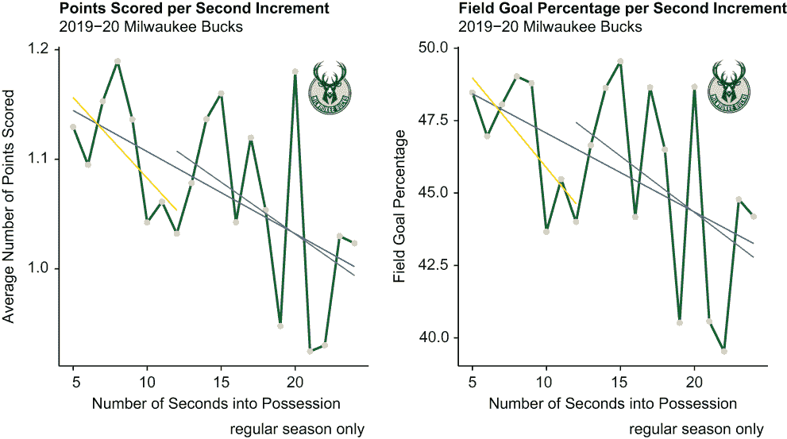
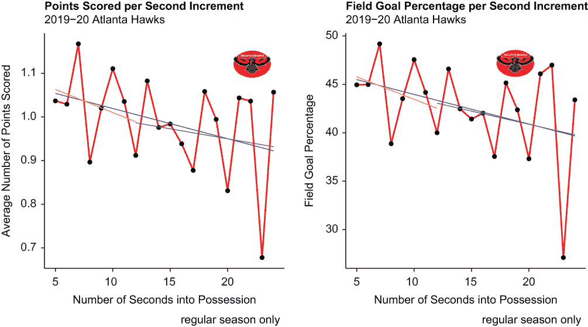
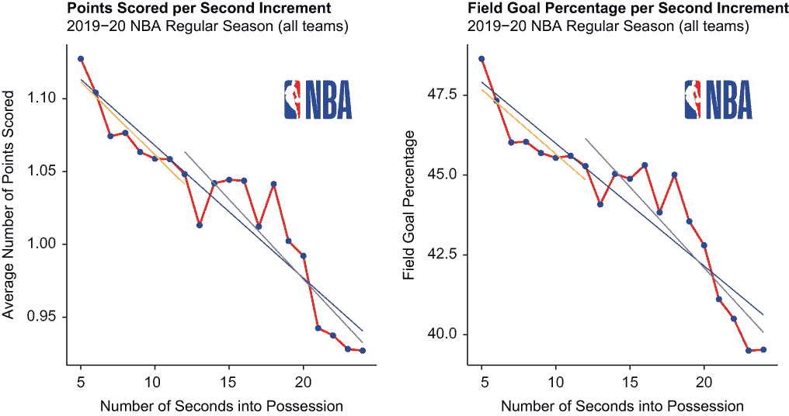

# 8 优化停止

本章涵盖

+   最优停止（又称 37%规则）

+   均值回归

+   创建频率表

+   为`ggplot2`可视化添加主题

+   将图像导入和插入到`ggplot2`可视化中

+   向数据系列添加多个趋势线

+   从子字符串创建派生变量

有一个流行的算法称为最优停止规则——通常被称为 37%规则，有时也称为观察后跳跃规则——它解决了在何时采取特定行动与继续深思熟虑之间的问题。以下是一个常见的用例：假设你是组织中的一个开放职位的招聘经理，正在面试候选人，你必须在面试每个候选人后立即做出是或否的决定，因为没有第二次机会。根据最优停止规则，你应该自动跳过申请池中前 37%的候选人，然后向第一个评分高于所有之前候选人的面试候选人发出录用通知。

我们在这里的目的就是要探索最优停止规则可能或不可能适用于 NBA 的情况。球队是否应该在分配的控球时间的 37%之前不投篮？然后，一旦他们获得与之前任何机会相等或更好的得分机会，他们是否应该立即尝试投篮？根据规则，球队有 24 秒的时间尝试投篮，没有重置；未能投篮将导致失误，对方球队获得控球权。球队使用所有或部分分配的时间进行传球和运球——相当于面试候选人——期望或希望在他们 24 秒用完之前创造一个高概率的投篮机会。是否存在一个最优的停止点，以秒为单位，来衡量传球和运球与投篮之间的平衡？如果是的话，它是否与 37%的规则一致？这正是我们想要弄清楚的事情。

我们将使用 2019-20 赛季的数据，依次对三支球队进行最优停止规则的测试，然后我们将对整个联赛进行相同的测试。在这个过程中，我们将展示一系列新的可视化和数据处理技术。

## 8.1 加载包

我们将使用基本的 R 功能以及熟悉和不那么熟悉的包的组合；这里介绍了一些之前未使用的包，包括`stringr`、`janitor`和`png`：

+   `stringr`包实际上是`tidyverse`包宇宙的一部分，因此当我们加载`tidyverse`时，它会默认加载；`stringr`使得操作字符字符串变得容易。

+   `janitor`包包含用于检查和清理脏数据的几个函数。

+   `png`包包含用于读取、写入和显示便携式网络图形（PNG）图像的函数。

我们首先通过调用四次基本的 R `library()` 函数来依次加载所需的包：

```
library(tidyverse)
library(janitor)
library(patchwork)
library(png)
```

我们首先将对这些包中的最后一个进行操作。

## 8.2 导入图像

以.png 扩展名保存并存储在我们默认工作目录中的图像，导入方式与导入.csv 文件类似——我们只需从`png`包中调用`readPNG()`函数，并在一对单引号或双引号之间添加文件路径。当插入到任何图表或图中时，图像不仅增强了其美学，还提供了关于范围或内容的即时清晰度。例如，在图表中出现密尔沃基雄鹿队的标志，可以立即清楚地表明我们正在可视化密尔沃基雄鹿队的结果。

在下面的代码块中，我们四次调用`readPNG()`函数，依次导入从互联网下载的四个 NBA 标志，保存为.png 文件，然后拖放到我们的默认工作目录中。（可能有数十个，甚至数百个网站可以下载这些和其他 NBA 图像。）因为这些是光栅（或位图）图像，所以原生的参数设置为`TRUE`：

```
bucks <- readPNG("bucks.png", native = TRUE)

hawks <- readPNG("hawks.png", native = TRUE)

hornets <- readPNG("hornets.png", native = TRUE)

nba <- readPNG("nba.png", native = TRUE)
```

一旦我们着手创建一系列`ggplot2`折线图，我们将插入这些图像作为增强我们视觉内容的一种方式。在此期间，我们将继续导入和查看我们的数据集。

## 8.3 导入和查看数据

我们通过调用`readr`的`read_csv()`函数导入数据，并在过程中创建了一个名为 pbp（意为比赛过程）的对象。我们的数据是从网站[www.bigdataball.com](https://www.bigdataball.com/)下载的，随后保存在我们的默认工作目录中，文件名为 pbp.csv。

我们的数据集包含了 2019-20 NBA 赛季每场常规赛和季后赛的几乎所有比赛。我们数据中包含和不包含的比赛类型将在稍后探讨。现在，我们只想从宏观层面了解我们数据的大小和范围；`dplyr`包中的`glimpse()`函数返回 pbp 的维度和内容的转置快照——它有 543,149 行长和 44 列宽。如果你在个人电脑上工作而不是服务器上，加载数据可能需要几秒钟：

```
pbp <- read_csv("pbp.csv")

glimpse(pbp) 
## Rows: 543,149
## Columns: 44
## $ game_id        <chr> "0021900001", "0021900001", "0021900001", ...
## $ data_set       <chr> "2019-2020 Regular Season", "2019-2020 Reg...
## $ date           <date> 2019-10-22, 2019-10-22, 2019-10-22, 2019-...
## $ a1             <chr> "Jrue Holiday", "Jrue Holiday", "Jrue Holi...
## $ a2             <chr> "Brandon Ingram", "Brandon Ingram", "Brand...
## $ a3             <chr> "Derrick Favors", "Derrick Favors", "Derri...
## $ a4             <chr> "JJ Redick", "JJ Redick", "JJ Redick", "JJ...
## $ a5             <chr> "Lonzo Ball", "Lonzo Ball", "Lonzo Ball", ...
## $ h1             <chr> "OG Anunoby", "OG Anunoby", "OG Anunoby", ...
## $ h2             <chr> "Pascal Siakam", "Pascal Siakam", "Pascal ...
## $ h3             <chr> "Marc Gasol", "Marc Gasol", "Marc Gasol", ...
## $ h4             <chr> "Kyle Lowry", "Kyle Lowry", "Kyle Lowry", ...
## $ h5             <chr> "Fred VanVleet", "Fred VanVleet", "Fred Va...
## $ period         <dbl> 1, 1, 1, 1, 1, 1, 1, 1, 1, 1, 1, 1, 1, 1, ...
## $ away_score     <dbl> 0, 0, 0, 0, 2, 2, 2, 2, 2, 2, 2, 2, 2, 2, ...
## $ home_score     <dbl> 0, 0, 0, 0, 0, 0, 0, 0, 0, 0, 0, 0, 0, 0, ...
## $ remaining_time <time> 00:12:00, 00:12:00, 00:11:48, 00:11:47, 0...
## $ elapsed        <time> 00:00:00, 00:00:00, 00:00:12, 00:00:13, 0...
## $ play_length    <chr> "0:00:00", "0:00:00", "0:00:12", "0:00:01"...
## $ play_id        <dbl> 2, 4, 7, 8, 9, 10, 11, 12, 13, 14, 15, 16,...
## $ team           <chr> NA, "NOP", "NOP", "NOP", "NOP", "TOR", "NO...
## $ event_type     <chr> "start of period", "jump ball", "miss", "r...
## $ assist         <chr> NA, NA, NA, NA, NA, NA, NA, NA, NA, NA, NA...
## $ away           <chr> NA, "Derrick Favors", NA, NA, NA, NA, NA, ...
## $ home           <chr> NA, "Marc Gasol", NA, NA, NA, NA, NA, NA, ...
## $ block          <chr> NA, NA, NA, NA, NA, NA, NA, NA, NA, NA, NA...
## $ entered        <chr> NA, NA, NA, NA, NA, NA, NA, NA, NA, NA, NA...
## $ left           <chr> NA, NA, NA, NA, NA, NA, NA, NA, NA, NA, NA...
## $ num            <dbl> NA, NA, NA, NA, NA, NA, NA, NA, NA, NA, NA...
## $ opponent       <chr> NA, NA, NA, NA, NA, NA, NA, NA, NA, NA, NA...
## $ outof          <dbl> NA, NA, NA, NA, NA, NA, NA, NA, NA, NA, NA...
## $ player         <chr> NA, "Marc Gasol", "Lonzo Ball", "Derrick F...
## $ points         <dbl> NA, NA, 0, NA, 2, 0, NA, 0, NA, 0, NA, 0, ...
## $ possession     <chr> NA, "Lonzo Ball", NA, NA, NA, NA, NA, NA, ...
## $ reason         <chr> NA, NA, NA, NA, NA, NA, NA, NA, NA, NA, NA...
## $ result         <chr> NA, NA, "missed", NA, "made", "missed", NA...
## $ steal          <chr> NA, NA, NA, NA, NA, NA, NA, NA, NA, NA, NA...
## $ type           <chr> "start of period", "jump ball", "unknown",...
## $ shot_distance  <dbl> NA, NA, 11, NA, 1, 3, NA, 8, NA, 25, NA, 1...
## $ original_x     <dbl> NA, NA, 2, NA, 0, 15, NA, 81, NA, 178, NA,...
## $ original_y     <dbl> NA, NA, 114, NA, -6, 28, NA, -1, NA, 176, ...
## $ converted_x    <dbl> NA, NA, 24.8, NA, 25.0, 26.5, NA, 16.9, NA...
## $ converted_y    <dbl> NA, NA, 16.4, NA, 4.4, 86.2, NA, 4.9, NA, ...
## $ description    <chr> NA, "Jump Ball Gasol vs. Favors: Tip to Ba...
```

在我们能够正确分析刚刚加载的数据之前，我们首先需要进一步探索和整理它。

## 8.4 探索和整理数据

我们首先通过调用内置的`as.factor()`函数将变量`data_set`从字符字符串转换为因子：

```
pbp$data_set <- as.factor(pbp$data_set)
```

通过这样做，我们就可以调用基础 R 的`levels()`函数，该函数返回与变量`data_set`相关的三个因子水平。如果我们没有将`data_set`保持为字符字符串，而是将其转换为因子，然后调用`levels()`函数，R 将返回`NULL`：

```
levels(pbp$data_set)
## [1] "2019-20 Playoffs"         "2019-20 Regular Season"  
## [3] "2019-2020 Regular Season"
```

看起来，那些与常规赛比赛相关的观测值，由于某种原因，被分成了两个因子水平，即 2019-20 常规赛和 2019-2020 常规赛，而季后赛比赛则由 2019-20 季后赛因子水平指定。

我们的意图是将我们的分析限制在常规赛比赛上，而不是混合常规赛和季后赛结果；每个 NBA 球队都有一份固定的常规赛赛程，但只有一些球队有资格参加季后赛。因此，我们将 pbp 数据集通过`dplyr filter()`函数进行管道处理，以子集 pbp，其中变量`data_set`不等于`2019-20 Playoffs`（`!=`运算符表示不等于）。

我们随后从基础 R 中调用`dim()`函数来检查 pbp 数据集的新维度：

```
pbp %>% 
  filter(data_set != "2019-20 Playoffs") -> pbp
dim(pbp) 
## [1] 504445     44
```

通过过滤掉季后赛比赛并保留 2019-20 常规赛的每一场比赛，pbp 因此减少到 504,445 行。

变量`play_length`有点更具挑战性。它现在是一个以小时:分钟:秒格式表示的字符串（这对我们不起作用），我们需要一个只以秒为单位的数值变量。因此，我们调用`dplyr`包中的`mutate()`函数和`stringr`包中的`str_sub()`函数来创建一个新变量`play_length2`，它将只以秒为单位。`str_sub()`函数需要以下三个输入：

+   需要操作的字符串，即原始变量`play_length`。

+   应从变量`play_length`中提取并移植到派生变量`play_length2`的第一个字符。因为`play_length2`将只以秒为单位，所以我们感兴趣的是提取并移植`play_length`的最后两个字符，它再次是以小时:分钟:秒的格式。因此，第二个输入是`-2`，它是`play_length`中的倒数第二个字符。

+   应从`play_length`中提取并移植到最后一个字符到`play_length2`，即字符串中的最后一个字符。因此，第三个输入是`-1`。

我们的新变量随后通过调用基础 R 的`as.numeric()`函数转换为数值类型：

```
pbp %>%
  mutate(play_length2 = str_sub(play_length, -2, -1)) -> pbp
pbp$play_length2 <- as.numeric(pbp$play_length2)
```

要比较和对比变量`play_length`和`play_length2`，我们两次调用基础 R 的`head()`函数，以返回每个变量在 pbp 数据集中的前六个值。通常，当我们调用`head()`函数，甚至`tail()`函数时，我们指示 R 返回我们需要查看的顶部或底部观察值中的每个变量；这里，通过插入`$`运算符，我们告诉 R 只返回`play_length`和`play_length2`，忽略其他 pbp 变量：

```
head(pbp$play_length)
## [1] "00:00:00" "00:00:00" "00:00:12" "00:00:01" "00:00:00" "00:00:18"
head(pbp$play_length2)
## [1]  0  0 12  1  0 18
```

因此，通过调用`str_sub()`函数，我们成功创建了一个新变量，例如，00:00:12 被转换为 12 秒，00:00:18 被转换为 18 秒。

现在我们来探索变量`event_type`，它也是一个字符串。我们将其转换为因子变量，然后调用`levels()`函数以返回因子水平：

```
pbp$event_type <- as.factor(pbp$event_type)
levels(pbp$event_type)
##  [1] "ejection"        "end of period"   "foul"            "free throw"     
##  [5] "jump ball"       "miss"            "rebound"         "shot"           
##  [9] "start of period" "sub"             "timeout"         "turnover"       
## [13] "unknown"         "violation"
```

结果表明，pbp 数据集包含 14 种事件类型，包括未知类型。我们最终将只处理以下 13 种事件类型的小子集：

+   `ejection`——一名球员被一名裁判永久驱逐出场比赛，通常是在被判定第二次技术犯规后。技术犯规是在特别暴力或球员与裁判争论之后对个人犯规的追加。

+   `end of period`——时间已到，因此结束了一个时段或一个季度。

+   `foul`——被判个人犯规。

+   `free throw`——尝试罚球，可能命中（成功投篮）或未命中。罚球不同于投篮或投篮。当球员尝试罚球时，比赛计时器和投篮计时器都不会运行。

+   `jump ball`——在两名对方球员拥有相等球权后发生。裁判吹哨，从而停止比赛。然后两名球员跳起争夺球权。

+   `miss`——投篮未命中，或未成功。

+   `rebound`——在投篮不中后立即进行的进攻或防守篮板。

+   `shot`——投篮尝试成功。

+   `start of period`——一个新的时段或一个季度开始，包括任何加时赛，这些加时赛在比赛平局后进行。

+   `sub`——一方或双方球队正在替换一名或多名球员。替换只能在比赛计时器停止时进行。

+   `timeout`——比赛暂停，通常由一方球队请求。当叫暂停时，比赛计时器停止，直到比赛恢复时才继续。

+   `turnover`——持球方犯了一些粗心大意的失误，导致对方球队获得球权。

+   `violation`——一方球队，通常是持球方，犯了一些违规行为，如越位、两次运球或关键区三秒违例，这导致球权改变。

在下面的 `dplyr` 代码块中，我们调用 `group_by()` 和 `tally()` 函数，以 tibble 形式返回 pbp 数据集中每种事件类型的计数，称为 tbl1：

```
pbp %>%
  group_by(event_type) %>%
  tally() -> tbl1
print(tbl1)
## # A tibble: 15 × 2
##    event_type             n
##    <fct>              <int>
##  1 ejection            39
##  2 end of period     4315
##  3 foul             45295
##  4 free throw       49006
##  5 jump ball         1856
##  6 miss            101684
##  7 rebound         112803
##  8 shot             86633
##  9 start of period   4315
## 10 sub              51838
## 11 timeout          11911
## 12 turnover         30707
## 13 unknown           1306
## 14 violation         1947
## 15 <NA>               790
```

以下是一些观察和解释：

+   投篮犯规很少见。一旦球员犯了第六次个人犯规，就会被永久罚下场，但这是一种取消资格，而不是被驱逐出场。

+   结束时段和开始时段的事件数量相等，这是完全合理的。

+   个人犯规通常立即导致一次或两次罚球尝试，但有时根本不会导致罚球尝试。无法从另一个计数中轻松推导出一个计数的数量。

+   大约有 15,000 次事件是球员投篮未命中，而不是投篮命中，这意味着未命中的投篮比命中的投篮多。

+   反弹通常发生在大多数投篮不中和罚球不中之后，但并非所有。

+   同队球员之间的传球可能是最明显的一——当然是最频繁的一——事件类型，但我们的数据集中没有记录。

+   注意，我们的数据集中有 790 个观测值，其中没有定义事件类型；我们对`levels()`函数的调用未能检测到这些。否则，这些数字完全合理——只是少数投篮，比投篮次数多，例如，这当然表明我们正在处理一个整体上可靠的数据集。

我们接下来的操作是将变量`team`转换为因子。然后我们可以再次调用`levels()`函数来返回因子水平，但我们将调用基本的 R `summary()`函数，它返回因子水平和每个的记录计数。因此，`summary()`函数返回了变量`team`的因子水平和计数，而之前我们调用`levels()`函数，然后编写一小段`dplyr`代码来返回与变量`event_type`相同的相同结果：

```
pbp$team <- as.factor(pbp$team)
summ ary(pbp$team) 
##   ATL   BKN   BOS   CHA   CHI   CLE   DAL   DEN   DET   GSW   HOU   IND 
## 15643 16578 16302 14012 14263 13986 16943 15999 14150 14337 16290 15477 
##   LAC   LAL   MEM   MIA   MIL   MIN   NOP   NYK   OKC   ORL   PHI   PHX 
## 16701 15996 17066 16013 17691 14847 16368 14940 15890 15877 16346 16333 
##   POR   SAC   SAS   TOR   UTA   WAS  NA's 
## 16601 15761 15812 15845 15931 16101 30346
```

NBA 是一个 30 支球队的联赛，但变量`team`包含 31 个水平，这是由于 R 返回的 30,346 个空白值作为 NAs。

最后，我们再次调用`summary()`函数来返回变量`points`的一系列基本统计数据：

```
summary(pbp$points)
##    Min. 1st Qu.  Median    Mean 3rd Qu.    Max.    NA's 
##       0       0       1       1       2       3  267122
```

尽管我们的数据集可能并不完美，但结果仍然与我们的预期一致：

+   大多数事件类型中不可能得分，所以我们有 267,122 个 NAs。

+   失误和罚球失误得零分。

+   成功的罚球得一分。

+   成功的投篮得两分或三分，具体取决于投篮距离篮筐的远近。

现在我们已经探索并整理了我们的数据，是时候开始分析它了。

## 8.5 分析

再次强调，我们在这里的目的是确定最优停止算法在 NBA 中的应用效果。换句话说，我们想确定 NBA 球队是否应该自动放弃射击一些有限秒数，然后抓住第一个等于或优于任何先前射击机会的射击；如果是的话，我们还想进一步确定 37%规则是否适用。一如既往，我们必须小心不要得出任何过于宽泛的结论。因为接下来的分析只使用了我们已导入并随后整理的数据，因此我们的结论仅适用于 2019-20 赛季常规赛。

我们的分析分为两部分。我们将首先隔离三支在 2019-20 赛季每场比赛得分平均值差异很大的球队，按 1 秒的增量总结和可视化他们的得分和投篮百分比，然后基于 R 返回的结果得出一些更广泛的结论。之后，我们将对整个 NBA 进行同样的分析，将联盟的 30 支球队打包成一个单一的数据系列。让我们从密尔沃基雄鹿队开始，他们在 2019-20 赛季常规赛中平均每场得分 118.7 分，领跑 NBA。

### 8.5.1 密尔沃基雄鹿队

我们的首要任务是创建一个从 pbp 数据集中提取的密尔沃基雄鹿队数据集。我们将首先调用 `dplyr filter()` 函数来通过仅保留满足一系列特定标准的观测值来减少 pbp 的长度：

1.  当变量 `team` 等于 `MIL`，即密尔沃基雄鹿队

1.  当我们派生的变量 `play_length2` 等于或大于 `5` 且小于或等于 `24`

1.  当变量 `event_type` 等于 `shot` 或 `miss`

这里需要一些解释。我们的兴趣在于半场控球，球队可以选择通过运球和传球来犹豫，或者可以选择通过投篮来采取行动。控球时间少于 5 秒的投篮通常是对站位不当的防守的快速反击机会，是进攻篮板后靠近篮筐的轻松得分，或者是在比赛时间即将用尽时的绝望努力。在这三种情况下，投篮是唯一合理的行动。因此，持续时间少于 5 秒的控球时间将被忽略，全部删除。因此，设定一个截止点绝对是必要的；5 秒虽然有些武断，但确实代表了大多数快速反击的大致持续时间。不幸的是，我们的数据集没有包含一个事件类型来指示控球球队何时穿过中场并建立半场阵容。

此外，NBA 采用 24 秒的投篮计时器，这意味着球队必须在获得球权后的 24 秒内尝试投篮，否则将球权转给对方球队。投篮计时器通过加快比赛节奏来增加得分，并防止球队使用拖延战术来保护领先（以及避免让观众感到无聊）。由于某些原因——可能是由于缺少事件类型——pbp 数据集中包含一些变量 `play_length2` 大于 24 秒的观测值。因此，只删除这些少数记录是有意义的。

最后，我们只对投篮或未投篮的回合感兴趣。因为我们不感兴趣于驱逐、篮板、犯规和其他事件类型，所以也删除这些记录是有意义的。

创建数据源

最终结果是称为 MIL 的新对象。关于我们的 `dplyr` 代码和特别是我们传递给 `filter()` 函数的逻辑的一个注意事项：像其他编程语言一样，R 要求在设置唯一选择标准时明确调用变量名。例如，如果我们告诉 R `play_length2` 必须等于或大于 5 秒且小于或等于 24 秒，而不是告诉 R `play_length2` 必须等于或大于 5 秒，并且 `play_length2` 也应该等于或小于 24 秒，R 就会不知道哪个 pbp 变量应该等于或小于 24；然后它会抛出一个错误。

然后我们调用 `dim()` 函数来返回 MIL 行和列的数量：

```
pbp %>% 
  filter(team == "MIL",
         play_length2 >= 5 & play_length2 <= 24,
         event_type == "shot" | event_type == "miss") -> MIL
dim(MIL)
## [1] 5436   45
```

MIL 包含 5,436 行和 45 列。我们的分析只需要 `event_type`、`points` 和 `play_length2` 这三个变量；因此，我们通过调用 `dplyr select()` 函数来裁剪 MIL 的宽度，该函数仅保留这三个变量。

然后，我们再次调用 `dim()` 函数，只是为了确认 MIL 现在具有 5,436 行和仅三个列的维度。何时以及如何频繁地验证操作和显示相同的结果完全取决于你。我们倾向于安全而不是后悔：

```
MIL %>%
  select(event_type, points, play_length2) -> MIL
dim(MIL)
## [1] 5436    3
```

然后，我们将 MIL 数据集通过管道传递到 `dplyr group_by()` 和 `summarize()` 函数，以计算雄鹿队在每个 `play_length2` 值上得分的平均值。我们的结果是名为 MILx 的 20 × 2 tibble，其中 `play_length2` 是一列（最小值为 5，最大值为 24 秒），而 `avg` 是另一列，它代表平均或平均得分数：

```
MIL %>%
  group_by(play_length2) %>%
  summarize(avg = mean(points)) -> MILx
print(MILx)
## # A tibble: 20 × 2
##    play_length2   avg
##           <dbl> <dbl>
##  1            5 1.13 
##  2            6 1.09 
##  3            7 1.15 
##  4            8 1.19 
##  5            9 1.14 
##  6           10 1.04 
##  7           11 1.06 
##  8           12 1.03 
##  9           13 1.08 
## 10           14 1.14 
## 11           15 1.16 
## 12           16 1.04 
## 13           17 1.12 
## 14           18 1.05 
## 15           19 0.948
## 16           20 1.18 
## 17           21 0.925
## 18           22 0.930
## 19           23 1.03 
## 20           24 1.02
```

我们将暂时将这些结果放在我们的口袋里。

同时，让我们创建第二个数据对象，以获取 `play_length2` 中每个值的投篮百分比。然后我们将 MIL 传递给 `janitor` 包中的 `tabyl()` 函数来创建一个频率表，其中第一个参数是 `play_length2`，第二个参数是 `event_type`。R 返回一个频率表，或数据框——称为 MILy，它统计了每个 `play_length2` 值的每个 `event_type` 因子的频率。因为我们只对投篮和未命中事件类型感兴趣，所以我们调用 `select()` 函数将 MILy 简化，仅包括这两个变量，当然还有 `play_length2`。

最后，我们调用来自 `dplyr` 包的 `mutate()` 函数来创建另一个变量，`fg_pct`，然后将其附加到 MILy 上。我们的新变量通过将变量 `shot` 除以变量 `shot` 和 `miss` 的总和来计算投篮（或射门）百分比；然后将商数乘以 100 以返回一个百分比。我们的导出变量然后四舍五入到小数点后两位：

```
MIL %>%
  tabyl(play_length2, event_type) -> MILy
MILy %>%
  select(play_length2, shot, miss) %>%
  mutate(fg_pct = shot / (shot + miss)*100) -> MILy
MILy$fg_pct <- round(MILy$fg_pct, digits = 2)
print(MILy)
##  play_length2 shot miss fg_pct
##             5  206  219  48.47
##             6  193  218  46.96
##             7  173  187  48.06
##             8  176  183  49.03
##             9  161  169  48.79
##            10  155  200  43.66
##            11  171  205  45.48
##            12  165  210  44.00
##            13  167  191  46.65
##            14  178  188  48.63
##            15  164  167  49.55
##            16  125  158  44.17
##            17  126  133  48.65
##            18  113  130  46.50
##            19   62   91  40.52
##            20   73   77  48.67
##            21   43   63  40.57
##            22   34   52  39.53
##            23   30   37  44.78
##            24   19   24  44.19
```

显示结果

现在，我们有两个数据源，MILx 和 MILy，用于两个独立但互补的 `ggplot2` 线形图。我们两个线形图中的第一个，MILp1，从 tibble MILx 中提取数据，显示了密尔沃基雄鹿队在 2019-20 赛季的每个整秒拥有时间中得分平均数，在 5 到 24 秒之间，其中投篮命中或未命中是结果：

+   因此，`play_length2` 是我们的 x 轴变量，而 `avg`，我们使用 `dplyr group_by()` 和 `summarize()` 函数的组合创建，是我们的 y 轴变量。

+   `geom_line()` 函数绘制线条，而 `geom_point()` 函数向线条添加点层。

+   被调用三次的 `geom_smooth()` 函数在数据上绘制了三条回归线，使我们能够轻松地看到平均得分趋势是如何随着比赛时间的增加而变化的。回归线被绘制出来以最小化它与适用数据点之间的距离。蓝色线表示覆盖整个数据系列的趋势，而金色和紫色线分别显示了 12 秒前后的趋势，或 37% 的标记（12 秒等于 5 秒加 7 秒；7 除以 19 秒等于 37%）。通过传递 `se = FALSE` 参数，我们指示 R 不要在回归线之上和之下绘制阴影置信区间。

+   `theme_classic()` 函数将 `ggplot2` 默认的背景替换为纯白色。必须在使用 `theme()` 函数之前调用 `theme_classic()` 函数，以保留标题的粗体字体；否则，`theme_classic()` 函数，它以普通字体渲染标题，将覆盖 `theme()` 函数的偏好设置。

+   `inset_element()` 函数，实际上是 `patchwork` 包的一部分，将名为 bucks 的 .png 文件嵌入。左、底、右和顶参数共同决定图像应该放置的位置以及它的大小。因为这些参数等于接近 1 的数字，所以我们的图像将被放置在图表的右上角。你可能想要尝试这些设置。

所有这些都在以下代码块中一起使用：

```
MILp1 <- ggplot(MILx, aes(x = play_length2, y = avg, group = 1)) +
  geom_line(aes(y = avg), color = "darkgreen", size = 2) +
  geom_point(color = "wheat2", size = 3) +
  labs(title = "Points Scored per Second Increment",
       subtitle = "2019-20 Milwaukee Bucks",
       caption = "regular season only",
       x = "Number of Seconds into Possession",
       y = "Average Number of Points Scored") +
  geom_smooth(method = lm, color = "blue", se = FALSE) +
  geom_smooth(method = lm, color = "gold", 
              data = MILx[MILx$play_length2 < 13,], se = FALSE) +
  geom_smooth(method = lm, color = "purple", 
              data = MILx[MILx$play_length2 > 11,], se = FALSE) +
  theme_classic() +
  theme(plot.title = element_text(face = "bold")) +
  inset_element(bucks, left = 0.80, bottom = 0.80, 
                right = 0.95, top = 0.95) 
```

我们的第二个折线图 MILp2 从 MILy 中获取，这是通过调用 `janitor` 包中的 `tabyl()` 函数之前创建的频率表。`play_length2` 是我们的 x 轴变量，`fg_pct` 是我们的 y 轴变量。否则，我们的第二个折线图的语法就像第一个一样，因此返回一个具有与 MILp1 相同的形式、特征和功能的图形对象：

```
MILp2 <- ggplot(MILy, aes(x = play_length2, y = fg_pct, group = 1)) +
  geom_line(aes(y = fg_pct), color = "darkgreen", size = 2) +
  geom_point(color = "wheat2", size = 3) +
  labs(title = "Field Goal Percentage per Second Increment", 
       subtitle = "2019-20 Milwaukee Bucks",
       caption = "regular season only",
       x = "Number of Seconds into Possession",
       y = "Field Goal Percentage") +
  geom_smooth(method = lm, color = "blue", se = FALSE) +
  geom_smooth(method = lm, color = "gold", 
              data = MILy[MILy$play_length2 < 13,], se = FALSE) +
  geom_smooth(method = lm, color = "purple", 
              data = MILy[MILy$play_length2 > 11,], se = FALSE) +
  theme_classic() +
  theme(plot.title = element_text(face = "bold")) +
  inset_element(bucks, left = 0.80, bottom = 0.80, 
                right = 0.95, top = 0.95) 
```

然后，我们调用 `plot_layout()` 函数，该函数来自 `patchwork` 包，将我们的两个折线图捆绑成一个单一的对象，其中图表并排放置（见图 8.1）。我们的注意力立即被吸引到这样一个事实，即得分和投篮命中率都会随着控球时间的增加而急剧下降，尽管这种关系并不完全是线性的：

```
MILp1 + MILp2 + plot_layout(ncol = 2)
```



图 8.1 在 2019-20 赛季每半场控球每秒计算出的密尔沃基雄鹿队平均得分（左侧）和投篮命中率（右侧），并带有趋势线

结论

在总结我们的第一组结果之前，让我们再讨论一下最佳停止策略：首先，最佳停止规则的目的在于规定在采取行动之前应该进行的具体思考量，也就是说，招聘经理在发出录用通知之前应该面试多少个候选人，或者 NBA 球队在尝试投篮之前应该运球和传球多长时间。

第二，当正确应用时，最佳停止策略会带来最大收益并防止无效努力。最大收益可能不等于任何绝对意义上的“巨大”回报，但它确实提供了在几种替代方案中实现最佳回报的最高机会。违反最佳停止规则不会增加最佳结果的机会：招聘经理不会通过违反最佳停止点来增加找到最佳申请人的机会；NBA 球队至少在理论上，不会通过忽视最佳停止点并追求更好的得分机会的虚假希望而射出更多的球。

第三，无论情况如何，招聘经理或 NBA 球队——或任何人——应该跳过而不是继续寻找的点是 37%。计算这个标记的方法有两种。例如，如果*n*等于 20——申请池中有 20 个候选人或投篮时钟剩余 20 秒——最佳停止点就是 20 乘以 37%，等于 7（四舍五入到最接近的整数）。或者，当*n*除以数学常数*e*（约等于 2.72）时，我们也会得到相同的结果。

因此，如果招聘经理有 20 个候选人的申请池，经理应该自动跳过前七个候选人，继续面试，然后在面试第一个与前面七个候选人相比表现良好的候选人后立即停止。同样，NBA 球队应该等到 24 秒的投篮时钟过半，即 12 秒，或 5 加 7 秒，然后才有得分机会，这个机会与任何之前的得分机会一样好或更好时再尝试投篮。

话虽如此，从这两个图表中，我们可以得出一些明显和可能不那么明显的结论，因为这里有很多东西需要解释：

+   趋势线是方向的视觉表示，其中斜率进一步说明了变化的速率。尽管下降趋势几乎不是线性的，但我们的两个 y 轴变量，平均得分和投篮命中率，仍然正强相关——这意味着它们同时向同一方向移动。

+   关于每秒占有时间平均得分的数量，雄鹿队在 x 轴变量等于 8 秒或 20 秒时最成功；当 x 等于 8 时，雄鹿队平均得到 1.19 分，当 x 等于 20 时，平均得到 1.18 分。

+   这是有意义的，因为它意味着雄鹿队在 37%的标记之后从未像之前那样成功得分。换句话说，密尔沃基的最佳停止点实际上是在 37%的标记之前，而不是之后。

+   然而，这些结果并不能转化为投篮命中率。当 x 等于 8 时，雄鹿队的投篮命中率为 49.03%，当 x 等于 15 时为 49.55%。当然，这意味着根据这一衡量标准，至少密尔沃基在 37%的标记之前不投篮是更好的选择。

+   无论如何，当投篮计时器剩余时间更多时，雄鹿队通常在得分和投篮方面表现得更好。我们说“通常”，因为，又一次，这些趋势并不完全是线性的；大多数数据点实际上都远远低于或高于我们的回归线。这表明我们真正看到的是回归到平均值的现象，其中相反的结果相互抵消，而不是最优停止规则的字面意思。

+   为了进一步阐述这一点，让我们更仔细地看看 x 等于 19 到 21 秒的图表——这三个连续的数据点显著且交替地低于或高于回归线。当投篮计时器仅剩 4 秒时（因此 x 等于 20），密尔沃基在得分和投篮方面的成功在很大程度上是对其当 x 等于 19 时的相对不成功的一种抵消，而当 x 等于 21 时，其进一步的不成功则是另一种相反方向的抵消。

+   回归到平均值，有时也称为回归*到*平均值，是一种现象，其中极端的结果被更温和的结果或同等极端但方向相反的结果所继起，从而相互抵消。我们所看到的是由于偶然性引起的变化，或者至少是只有少数数据点的自然结果。毕竟，当投篮计时器剩余时间不超过 5 秒时，我们的数据包含的记录明显少于其他情况。当我们评估两个更多球队的结果时，我们将看到相同的现象；然而，当我们分析整个 NBA 的单个数据系列时，我们将观察到平滑过的结果。

接下来，我们将看看这些结果能保持多久，或者不能保持多久，我们将使用一对得分较低的球队。

### 8.5.2 亚特兰大老鹰队

我们首先将用亚特兰大老鹰队代替雄鹿队重复这项练习。老鹰队在 2019-20 赛季常规赛中每场比赛得到 111.8 分，这是联盟的平均水平。

创建数据源

我们对 pbp 数据集进行子集化，其中变量`team`等于`ATL`（代表亚特兰大老鹰队），派生变量`play_length2`等于或大于`5`且小于或等于`24`，变量`event_type`等于`shot`或`miss`。然后我们调用`dim()`函数来返回我们新数据集的维度：

```
pbp %>% 
  filter(team == "ATL",
         play_length2 >= 5 & play_length2 <= 24,
         event_type == "shot" | event_type == "miss") -> ATL
dim(ATL) 
## [1] 4945   45
```

ATL 数据集有 4,945 行，这比 MIL 数据集短得多。以下`dplyr`代码块返回老鹰队和雄鹿队的失误和投篮次数，用于比较目的。

```
ATL %>%
  group_by(event_type) %>%
  tally()
## # A tibble: 2 × 2
##   event_type     n
##   <fct>      <int>
## 1 miss        2807
## 2 shot        2138

MIL %>%
  group_by(event_type) %>%
  tally()
## # A tibble: 2 × 2
##   event_type     n
##   <fct>      <int>
## 1 miss        2902
## 2 shot        2534
```

老鹰队的投篮次数比雄鹿队少 441 次，投篮次数少 396 次。这就是为什么 ATL 行数少于 MIL 行数，以及为什么老鹰队平均每场比赛比密尔沃基雄鹿队少得 7 分。

然后，我们调用`select()`函数，仅保留`event_type`、`points`和`play_length2`变量来减少 ATL 的宽度：

```
ATL %>%
  select(event_type, points, play_length2) -> ATL
dim(ATL)
## [1] 4945    3
```

再次运行`dim()`函数确认，我们的 ATL 数据集现在仅包含这三个变量。

接下来，我们通过调用`dplyr group_by()`和`summarize()`函数创建一个名为 ATLx 的 tibble，这是亚特兰大的 MILx 的对应物，以计算老鹰队在`play_length2`变量中每秒的平均得分：

```
ATL %>%
  group_by(play_length2) %>%
  summarize(avg = mean(points)) -> ATLx
print(ATLx)
## # A tibble: 20 × 2
##    play_length2   avg
##           <dbl> <dbl>
##  1            5 1.04 
##  2            6 1.03 
##  3            7 1.17 
##  4            8 0.897
##  5            9 1.02 
##  6           10 1.11 
##  7           11 1.04 
##  8           12 0.912
##  9           13 1.08 
## 10           14 0.976
## 11           15 0.984
## 12           16 0.938
## 13           17 0.878
## 14           18 1.06 
## 15           19 0.994
## 16           20 0.831
## 17           21 1.04 
## 18           22 1.04 
## 19           23 0.678
## 20           24 1.06
```

然后，我们创建一个名为 ATLy 的频率表，这是亚特兰大的 MILy 的对应物，通过将 ATL 传递给`tabyl()`函数，并添加`play_length2`和`event_type`作为额外的参数。因为我们只需要`event_type`变量中的`play_length2`变量以及`shot`和`miss`因子，这些现在也是变量，所以我们调用`select()`函数将 ATLy 减少到仅包含`play_length2`、`shot`和`miss`。

接下来，我们调用`mutate()`函数创建一个名为`fg_pct`的变量；我们的新变量通过将`shot`变量除以`shot`和`miss`变量之和，然后乘以 100 来计算投篮命中率。我们的导出变量随后被四舍五入到小数点后两位：

```
ATL %>%
  tabyl(play_length2, event_type) -> ATLy
ATLy <- select(ATLy, play_length2, shot, miss)
ATLy %>%
  mutate(fg_pct = shot / (shot + miss)*100) -> ATLy
ATLy$fg_pct <- round(ATLy$fg_pct, digits = 2)
print(ATLy)
##  play_length2 shot miss fg_pct
##             5  147  180  44.95
##             6  139  170  44.98
##             7  150  155  49.18
##             8  124  195  38.87
##             9  131  170  43.52
##            10  155  171  47.55
##            11  163  206  44.17
##            12  136  204  40.00
##            13  164  188  46.59
##            14  141  191  42.47
##            15  128  181  41.42
##            16  116  160  42.03
##            17   92  153  37.55
##            18   93  113  45.15
##            19   75  102  42.37
##            20   53   89  37.32
##            21   53   62  46.09
##            22   39   44  46.99
##            23   16   43  27.12
##            24   23   30  43.40
```

展示结果

我们将 tibble ATLx 提取为一段`ggplot2`代码，以生成一个折线图，并将频率表 ATLy 提取为另一段`ggplot2`代码，以生成第二个折线图。这些折线图（见图 8.2）与第一个对完全相同，只是我们更换了数据源和图像：

```
ATLp1 <- ggplot(ATLx, aes(x = play_length2, y = avg, group = 1)) +
  geom_line(aes(y = avg), color = "red", size = 2) +
  geom_point(color = "black", size = 3) +
  labs(title = "Points Scored per Second Increment",
       subtitle = "2019-20 Atlanta Hawks",
       caption = "regular season only",
       x = "Number of Seconds into Possession", 
       y = "Average Number of Points Scored") +
  geom_smooth(method = lm, color = "blue", se = FALSE) +
  geom_smooth(method = lm, color = "gold", 
              data = ATLx[ATLx$play_length2 < 13,], se = FALSE) +
  geom_smooth(method = lm, color = "purple", 
              data = ATLx[ATLx$play_length2 > 11,], se = FALSE) +
  theme_classic() +
  theme(plot.title = element_text(face = "bold")) +
  inset_element(hawks, left = 0.78, bottom = 0.78, 
                right = 0.95, top = 0.95)

ATLp2 <- ggplot(ATLy, aes(x = play_length2, y = fg_pct, group = 1)) +
  geom_line(aes(y = fg_pct), color = "red", size = 2) +
  geom_point(color = "black", size = 3) +
  labs(title = "Field Goal Percentage per Second Increment",
       subtitle = "2019-20 Atlanta Hawks",
       caption = "regular season only",
       x = "Number of Seconds into Possession", 
       y = "Field Goal Percentage") +
  geom_smooth(method = lm, color = "blue", se = FALSE) +
  geom_smooth(method = lm, color = "gold", 
              data = ATLy[ATLy$play_length2 < 13,], se = FALSE) +
  geom_smooth(method = lm, color = "purple", 
              data = ATLy[ATLy$play_length2 > 11,], se = FALSE) +
  theme_classic() +
  theme(plot.title = element_text(face = "bold")) +
  inset_element(hawks, left = 0.62, bottom = 0.78, 
                right = 0.79, top = 0.95) 
```



图 8.2 展示了亚特兰大老鹰队在 2019-20 赛季常规赛中，在每个半场控球秒数所获得的平均得分（左侧）和投篮命中率（右侧），并附有趋势线

在临时保留 ATLp1 和 ATLp2 在内存中后，我们再次通过调用`plot_layout()`函数从`patchwork`包中捆绑它们，并将两个对象打印为一个单一对象：

```
ATLp1 + ATLp2 + plot_layout(ncol = 2)
```

结论

我们的结果既相同又略有不同：

+   在得分和投篮命中率方面，2019-20 赛季的老鹰队在控球时间仅 7 秒时最成功，平均每秒得到 1.17 分，投篮命中率达到了 49.18%。

+   这意味着在 37%标记之后，老鹰队平均得分没有达到或超过他们在控球时间等于 7 秒时的得分，也没有达到或超过他们的投篮命中率。因此，我们再次没有看到最佳停止，或 37%，规则生效。

+   就像雄鹿队一样，亚特兰大老鹰队在剩余投篮时间较多时，无论从哪个角度来看，在进攻上都普遍更成功。

+   同样，就像雄鹿队一样，我们看到随着 x 轴变量的增加和观察次数的减少，存在回归到平均水平的趋势。

让我们再看看另一支球队。

### 8.5.3 夏洛特黄蜂队

我们将再次重复这项练习，这次是将夏洛特黄蜂队插入到雄鹿队或老鹰队的位置。2019-20 赛季常规赛中，黄蜂队平均每场得分仅为 102.9 分，这是联盟中最低的。

创建数据源

我们将 pbp 数据集传递给`filter()`函数，以便对它进行子集化，其中变量`team`等于`CHA`，变量`play_length2`再次等于或大于`5`且小于或等于`24`，变量`event_type`等于`shot`或`miss`。然后我们将结果转换为名为 CHA 的 tibble。接下来，我们将 CHA 传递给`select()`函数，通过仅保留变量`event_type`、`points`和`play_length2`来减少其宽度。最后，我们调用`dim()`函数以返回 CHA 数据集的最终维度：

```
pbp %>% 
  filter(team == "CHA",
         play_length2 >= 5 & play_length2 <= 24,
         event_type == "shot" | event_type == "miss") -> CHA

CHA %>%
  select(event_type, points, play_length2) -> CHA
dim(CHA) 
## [1] 4539    3
```

CHA 数据集包含在`miss`和`made`事件类型之间的 4,539 个观测值。然后我们将 CHA 传递给`group_by()`和`tally()`函数，以返回失误和命中次数，这样我们就可以比较和对比黄蜂队与雄鹿队和老鹰队：

```
CHA %>%
  group_by(event_type) %>%
  tally()
## # A tibble: 2 × 2
##   event_type     n
##   <fct>      <int>
## 1 miss        2624
## 2 shot        1915
```

2019-20 赛季的夏洛特黄蜂队比雄鹿队少尝试了 897 次投篮，比老鹰队少 406 次；他们比雄鹿队少投中 619 次，比老鹰队少投中 223 次。

然后，我们创建一个名为 CHAx 的 tibble 和一个名为 CHAy 的频率表，就像我们之前做过两次一样：

```
CHA %>%
  group_by(play_length2) %>%
  summarise(avg = mean(points)) -> CHAx
print(CHAx)
## # A tibble: 20 × 2
##    play_length2   avg
##           <dbl> <dbl>
##  1            5 1.05 
##  2            6 1.14 
##  3            7 1.03 
##  4            8 0.986
##  5            9 0.981
##  6           10 0.913
##  7           11 0.992
##  8           12 1.04 
##  9           13 0.907
## 10           14 0.956
## 11           15 0.900
## 12           16 1.06 
## 13           17 0.950
## 14           18 1.19 
## 15           19 1.10 
## 16           20 0.839
## 17           21 1.02 
## 18           22 0.843
## 19           23 0.906
## 20           24 0.931

CHA %>%
  tabyl(play_length2, event_type) -> CHAy
CHAy %>%
  select(play_length2, shot, miss) -> CHAy
CHAy %>%
  mutate(fg_pct = shot / (shot + miss)*100) -> CHAy
CHAy$fg_pct <- round(CHAy$fg_pct, digits = 2)
print(CHAy)
##  play_length2 shot miss fg_pct
##             5  124  152  44.93
##             6  124  132  48.44
##             7  109  139  43.95
##             8   88  127  40.93
##             9   87  121  41.83
##            10   97  145  40.08
##            11  108  144  42.86
##            12  123  159  43.62
##            13  118  183  39.20
##            14  129  187  40.82
##            15  111  178  38.41
##            16  125  158  44.17
##            17  101  141  41.74
##            18  114  115  49.78
##            19   89  103  46.35
##            20   71  122  36.79
##            21   70   89  44.03
##            22   43   84  33.86
##            23   47   80  37.01
##            24   37   65  36.27
```

显示结果

然后，我们创建第三组折线图来可视化夏洛特黄蜂队每场比赛的平均得分和每秒控球时间的投篮命中率（见图 8.3）：

```
CHAp1 <- ggplot(CHAx, aes(x = play_length2, y = avg, group = 1)) +
  geom_line(aes(y = avg), color = "cyan3", size = 2) +
  geom_point(color = "black", size = 3) +
  labs(title = "Points Scored per Second Increment",
       subtitle = "2019-20 Charlotte Hornets",
       caption = "regular season only",
       x = "Number of Seconds into Possession", 
       y = "Average Number of Points Scored") +
  geom_smooth(method = lm, color = "blue", se = FALSE) +
  geom_smooth(method = lm, color = "gold", 
              data = CHAx[CHAx$play_length2 < 13,], se = FALSE) +
  geom_smooth(method = lm, color = "purple", 
              data = CHAx[CHAx$play_length2 > 11,], se = FALSE) +
  theme_classic() +
  theme(plot.title = element_text(face = "bold")) +
  inset_element(hornets, left = 0.73, bottom = 0.73, 
                right = 0.95, top = 0.95)

CHAp2 <- ggplot(CHAy, aes(x = play_length2, y = fg_pct, group = 1)) +
  geom_line(aes(y = fg_pct), color = "cyan3", size = 2) +
  geom_point(color = "black", size = 3) +
  labs(title = "Field Goal Percentage per Second Increment",
       subtitle = "2019-20 Charlotte Hornets",
       caption = "regular season only",
       x = "Number of Seconds into Possession", 
       y = "Field Goal Percentage") +
  geom_smooth(method = lm, color = "blue", se = FALSE) +
  geom_smooth(method = lm, color = "gold", 
              data = CHAy[CHAy$play_length2 < 13,], se = FALSE) +
  geom_smooth(method = lm, color = "purple", 
              data = CHAy[CHAy$play_length2 > 11,], se = FALSE) +
  theme_classic() +
  theme(plot.title = element_text(face = "bold")) +
  inset_element(hornets, left = 0.73, bottom = 0.73, 
                right = 0.95, top = 0.95) 
CHAp1 + CHAp2 + plot_layout(ncol = 2)
```


图 8.3 在 2019-20 赛季常规赛中，夏洛特黄蜂队在半场控球每秒的平均得分（左侧）和投篮命中率（右侧），并带有趋势线

结论

与之前的球队相比，夏洛特黄蜂队的结果既有相似之处也有不同之处：

+   有趣的是，无论是平均得分还是投篮命中率，夏洛特黄蜂队最擅长应用最佳停止规则。

+   当控球时间等于 6 秒时，黄蜂队平均每场得到 1.14 分，投篮命中率达到了 48.44%，这是黄蜂队在 37%命中率之前进攻最成功的时候。

+   但当控球时间等于 18 秒时，黄蜂队平均得到 1.19 分，并且在其尝试的投篮中成功率为 49.78%，这实际上与密尔沃基队最佳数据相当。

+   否则，我们也会看到类似趋势以及回归到平均值——就像我们在雄鹿和老鹰队中看到的那样。

最后，让我们通过最后的一对`ggplot2`线形图来审视整个 NBA——包括雄鹿、老鹰和黄蜂队。

### 8.5.4 NBA

毫无疑问，你现在已经熟悉了代码，但请注意，传递给`filter()`函数的第一个参数是可选的；实际上，在 pbp 数据集中没有变量`team`为空且变量`event_type`等于`shot`或`miss`的观测值。最终结果，正如你现在可能预料的那样，又是另一对互补的`ggplot2`线形图（见图 8.4）：

```
pbp %>% 
  filter(team != "",
         play_length2 >= 5 & play_length2 <= 24,
         event_type == "shot" | event_type == "miss") -> NBA

NBA %>%
  select(event_type, points, play_length2) -> NBA
dim(NBA)
## [1] 155130    3

NBA %>%
  group_by(play_length2) %>%
  summarise(avg = mean(points)) -> NBAx
print(NBAx)
## # A tibble: 20 × 2
##    play_length2   avg
##           <dbl> <dbl>
##  1            5 1.13 
##  2            6 1.10 
##  3            7 1.07 
##  4            8 1.08 
##  5            9 1.06 
##  6           10 1.06 
##  7           11 1.06 
##  8           12 1.05 
##  9           13 1.01 
## 10           14 1.04 
## 11           15 1.04 
## 12           16 1.04 
## 13           17 1.01 
## 14           18 1.04 
## 15           19 1.00 
## 16           20 0.992
## 17           21 0.942
## 18           22 0.937
## 19           23 0.928
## 20           24 0.927

NBA %>%
  tabyl(play_length2, event_type) -> NBAy
NBAy %>%
  select(play_length2, shot, miss) -> NBAy
NBAy %>%
  mutate(fg_pct = shot / (shot + miss)*100) -> NBAy
NBAy$fg_pct <- round(NBAy$fg_pct, digits = 2)
print(NBAy)
##  play_length2 shot miss fg_pct
##             5 4522 4774  48.64
##             6 4421 4919  47.33
##             7 4169 4891  46.02
##             8 4182 4902  46.04
##             9 4280 5088  45.69
##            10 4439 5308  45.54
##            11 4693 5599  45.60
##            12 4772 5768  45.28
##            13 4710 5976  44.08
##            14 4649 5673  45.04
##            15 4345 5336  44.88
##            16 3951 4768  45.31
##            17 3399 4356  43.83
##            18 3152 3851  45.01
##            19 2649 3434  43.55
##            20 2224 2972  42.80
##            21 1809 2591  41.11
##            22 1451 2132  40.50
##            23 1099 1683  39.50
##            24  867 1326  39.53

NBAp1 <- ggplot(NBAx, aes(x = play_length2, y = avg, group = 1)) +
  geom_line(aes(y = avg), color = "red", size = 2) +
  geom_point(color = "blue", size = 3) +
  labs(title = "Points Scored per Second Increment",
       subtitle = "2019-20 NBA Regular Season (all teams)",
       x = "Number of Seconds into Possession", 
       y = "Average Number of Points Scored") +
  geom_smooth(method = lm, color = "blue", se = FALSE) +
  geom_smooth(method = lm, color = "gold", 
              data = NBAx[NBAx$play_length2 < 13,], se = FALSE) +
  geom_smooth(method = lm, color = "purple", 
              data = NBAx[NBAx$play_length2 > 11,], se = FALSE) +
  theme_classic() +
  theme(plot.title = element_text(face = "bold")) +
  inset_element(nba, left = 0.65, bottom = 0.65, right = 0.95, top = 0.95)

NBAp2 <- ggplot(NBAy, aes(x = play_length2, y = fg_pct, group = 1)) +
  geom_line(aes(y = fg_pct), color = "red", size = 2) +
  geom_point(color = "blue", size = 3) +
  labs(title = "Field Goal Percentage per Second Increment",
       subtitle = "2019-20 NBA Regular Season (all teams)",
       x = "Number of Seconds into Possession", 
       y = "Field Goal Percentage") +
  geom_smooth(method = lm, color = "blue", se = FALSE) +
  geom_smooth(method = lm, color = "gold", 
              data = NBAy[NBAy$play_length2 < 13,], se = FALSE) +
  geom_smooth(method = lm, color = "purple",
              data = NBAy[NBAy$play_length2 > 11,], se = FALSE) +
  theme_classic() +
  theme(plot.title = element_text(face = "bold")) +
  inset_element(nba, left = 0.65, bottom = 0.65, right = 0.95, top = 0.95)

NBAp1 + NBAp2 + plot_layout(ncol = 2)
```



图 8.4 在 2019-20 赛季的常规赛中，每半场控球时间每秒所有 30 支 NBA 球队的平均得分（左侧）和投篮命中率（右侧），并带有趋势线

我们在这里看到了一些非常有趣的结果，但这些结果并不一定是由于数据量大小而产生的意外结果：

+   首先，我们没有看到在仅可视化一个球队的结果时出现的第二次超过第二次的变化。这是因为结果在将整个 NBA 绘制在一个数据系列中而不是仅 30 支球队中的 1 支时，已经被或多或少地平滑化了。

+   相反，我们看到三条大致相等但斜率陡峭的回归线，当然，它们之间的相对距离相对较小。

+   这些回归线表明，既没有最优停止规则，也没有回归到平均值的效果。

+   最重要的是，球队在早于晚投篮时表现得更好。

就最优停止规则而言，我们的结果，至少从规则的字面意义上讲，是混合的；事实上，在一些地方可能看到最优停止，而我们却看到了回归到平均值。但最优停止规则的精神确实适用于 NBA。记住，最优停止部分目的是为了防止浪费精力——对合格的候选人开枪并停止面试；好好投篮并停止传球和运球。我们的团队层面和联赛层面的分析强烈表明，当剩余的投篮时钟时间更长时，球队在得分和投篮命中率方面最成功，至少基于 2019-20 赛季的数据。

在本章和前一章中，我们探讨了由裁判、球员和教练控制的 NBA 比赛的各个方面，但在下一章中，我们将探讨联赛赛程如何显著影响一支球队在休息时间比对手更多时胜负。

## 摘要

+   在我们的个人和职业生活中，我们都拥有应用最佳停止规则的机会。例如，如果你在市场上寻找新家，并且绝对需要在 60 天内提交出价，你应该在前 22 天（60 天的 37%）非承诺性地参加公开房屋参观；然后你应该提交出价给第一套与你之前检查过的最佳房屋有利的房屋。同样，如果你在快速约会，你应该在晚上的前 37%的时间里进行更多的热身，然后与第一个与你已经遇到的所有人一样吸引人的第一人配对。最后，如果你是一名律师，正在研究 25 个符合条件的案例中的最佳法律先例，你应该自动排除前九个案例，然后继续处理与最初一批最相似的第一个案例。

+   然而，请注意：最佳停止策略旨在提供最高**概率**的最佳结果，没有任何保证，同时积极消除浪费的努力。而且它**仅**在你没有第二次机会时才有效。

+   最佳停止策略不一定适合 NBA，至少根据我们对 2019-20 赛季常规赛季数据的分析是这样的。可能被视为最佳停止策略的更有可能是回归到平均值，其中正面和负面的结果不断地相互抵消。然而，在 2019-20 赛季的常规赛季中，NBA 球队通常表现得更好——实际上要好得多——在半场设置中尽早投篮，而不是晚些时候。

+   对于一支球队来说，放弃好的或甚至还可以的投篮机会，并使用剩下的或大部分剩下的 24 秒投篮时钟上的时间，通常是不值得的。那种认为球队在大多数情况下通过传球和运球直到最佳投篮机会出现而更有利的老式想法是完全错误的。换句话说，虽然最佳停止规则的字面意义可能并不普遍适用，但最佳停止的精神绝对适用。

+   同时，我们展示了如何创建频率表以及如何从一个字符串创建另一个字符串的字符串。

+   我们还展示了如何通过添加主题来覆盖默认的`ggplot2`设置，如何嵌入提高你视觉内容质量的图片，以及如何向同一张线图添加多个趋势线。
