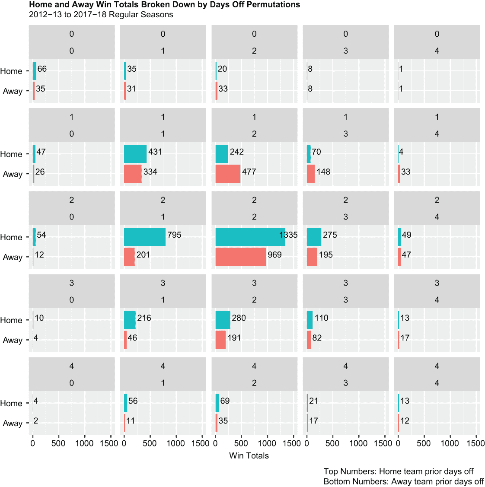
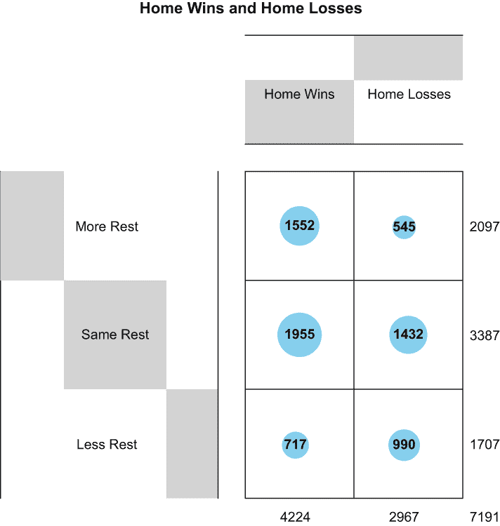
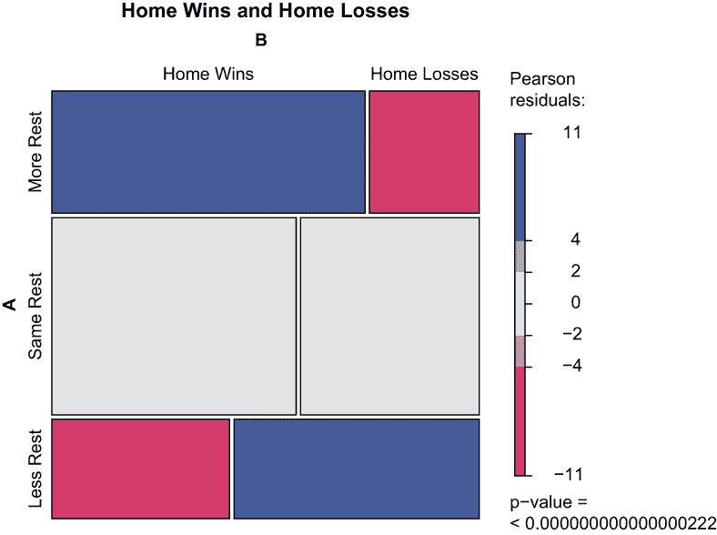

# 卡方检验和更多效应量检验

本章涵盖

+   在分类数据上运行和解释显著性检验

+   在分类数据上运行和解释效应量检验

+   计算排列以及区分排列和组合

+   创建分面图、气球图和 mosaic 图

休息曾经被认为是工作和活动的对立面。今天，它被认为是实现最高生产力和表现的关键推动因素。我们的目的是通过可视化和统计检验来探索——首先通过可视化和然后通过统计检验——休息（在本文中定义为常规赛比赛前的休息日数）对 NBA 胜负的影响。

在第七章中，我们运行了 t 检验，因为我们正在处理数值依赖变量。在本章中，我们将处理一个分类依赖变量，因此我们将运行独立性卡方检验。但就像 t 检验一样，我们的进入假设，或零假设，是变量之间没有有意义的关系。同样，就像 t 检验一样，如果我们的卡方检验返回的 p 值小于 0.05，我们将拒绝我们的零假设；如果我们得到的 p 值大于 0.05，我们将无法拒绝我们的零假设。之后，我们将展示两种方法，你可以通过这些方法运行 Cramer’s V 效应量检验，这是一种补充卡方检验的效应量检验，就像 Cohen’s d 效应量检验补充 t 检验一样。再次强调，应该根据你的数据来决定运行哪些测试。

NBA 常规赛赛程本质上是一个约束优化问题。每个球队都要打 82 场比赛，主场和客场各占一半。每个球队必须与同分区的其他球队打 16 场比赛，与同一联盟的其他球队打 36 场比赛，与对立联盟的球队打 30 场比赛。最好的球队在圣诞节和其他日子里展示，以最大化电视观众；某些日子有场地可用，而其他日子则没有；还有黑名单日期。同时，联盟的目标是尽量减少空中旅行和与旅行相关的费用。

因此，球队会打不同的和不规则的赛程——一对对手球队在他们的比赛前可能会有相同或不同数量的休息日。我们的零假设是休息对胜负没有影响；因此，我们的备择假设是休息实际上确实影响谁赢谁输。

在我们完成加载我们的包、导入我们的数据集和整理数据之后，我们的后续步骤如下：

+   我们将首先简要检查组合和排列，并讨论如何区分它们；此外，我们还将演示如何使用 R 代码计算排列。

+   我们将基线我们的数据，并使用分面图可视化。

+   我们接下来将运行我们的统计检验，从独立性卡方检验开始，以一对 Cramer’s V 效应量检验结束。

+   卡方检验比其他统计显著性测试，如相关检验或 t 检验，更全面。我们首先必须创建一个列联表——一个表格或矩阵，有时也称为交叉表，它显示了涉及两个或更多变量的频率分布——然后我们将列联表传递给我们的卡方检验。有许多方法可以可视化列联表，但我们将演示其中的两种。

让我们开始吧。

## 9.1 加载包

运行我们的显著性统计测试并返回结果的函数是现成的；然而，处理数据、查询数据和创建我们的可视化需要一些基础 R 中不可用的函数。因此，我们通过一系列调用`library()`函数来加载允许我们超越基础安装的包。

到现在为止，你对`tidyverse`和`sqldf`包已经很熟悉了。我们将加载这两个包以及五个之前未加载或使用的其他包：

```
library(tidyverse)
library(sqldf)
library(gtools)
library(gplots)
library(vcd)
library(questionr)
library(rcompanion)
```

其中第一个是`gtools`，它包含几个实用函数，包括一些用于计算和打印排列和组合的函数。排列实际上是组合，其中我们关心顺序。例如，数字 24、16 和 31 如果顺序无关紧要，则等同于 16、31 和 24；如果是这样，这些数字可以被视为组合。但如果 24、16 和 31 是打开健身房储物柜的“组合”，那么它实际上是一个排列，因为 16、31、24 将不起作用。我们将在稍后详细介绍排列和组合。现在，了解计算可能排列的最大数量与计算可能组合的最大数量并不相同；在绘图和分析数据之前，我们需要首先区分这两者。

这两个包中的第二个和第三个是`gplots`和`vcd`。虽然我们的分面图将使用`ggplot2`函数创建，但我们还将使用`gplots`包中的`balloonplot()`函数创建气球图，以及`vcd`包中的`mosaic()`函数创建镶嵌图。气球图和镶嵌图只是可视化列联表的两种方式。

第四个和第五个包是`questionr`和`rcompanion`，我们将演示这两种包中的一种方法，分别运行 Cramer 的 V 效应量测试。接下来我们将导入我们的数据集。

## 9.2 导入数据

我们现在通过调用`readr`的`read_csv()`函数（记住`readr`是`tidyverse`的一部分）导入我们的数据，一个从 Kaggle 下载的.csv 文件。我们的*文件*之前以文件名 2012_18_officialBoxScore 保存，并存储在我们的默认工作目录中；我们的*数据集*名为 NBAboxscores，它包含了 2012-13 赛季至 2017-18 赛季之间每场常规赛 NBA 比赛的表格化结果。

然后我们调用基础 R 的`dim()`函数来返回 NBAboxscores 数据集的维度：

```
NBAboxscores <- read_csv("2012_18_officialBoxScore.csv")

dim(NBAboxscores) 
## [1] 44284   119
```

我们的数据有 44,284 行和 119 列。在接下来的部分，我们将运行一系列操作来将 NBAboxscores 数据集在长度和宽度上减少，以便我们更好地处理。

## 9.3 数据整理

首先，我们绝对不需要每个游戏分配的官员或裁判的姓氏 (`offLNm`) 和名字 (`offFNm`)。因此，我们调用 `dplyr select()` 函数从 NBAboxscores 中移除这两个变量。在这里，我们展示了 `select()` 函数的另一个应用；而不是指出变量名称或变量位置来取消选择，我们反而告诉 R 移除 NBAboxscores 数据集中以 `off` 开头的所有变量。然后我们再次调用 `dim()` 函数，只是为了确认我们的数据集确实已经从 119 列减少到 117 列：

```
NBAboxscores %>%
  select(-starts_with("off")) -> NBAboxscores
dim(NBAboxscores)
## [1] 44284   117
```

然而，仅仅通过从我们的数据集中移除这两个变量，我们现在有了重复的行。官员的姓氏和名字是区分一条记录与下一条记录的唯一变量，因为我们有一个垂直而不是水平的数据集，其中单场比赛的记录分布在多个观测值之间。因此，我们接下来调用基本的 R `unique()` 函数来从我们的数据集中移除每个重复的记录。

然后，我们第三次调用 `dim()` 函数来检查 NBAboxscores 数据集的减少维度。如果这个操作需要超过几秒钟才能完成，请不要惊慌：

```
NBAboxscores <- unique(NBAboxscores)
dim(NBAboxscores) 
## [1] 14758   117
```

由于大多数 NBA 比赛都是由三位官员判罚，我们应该预计 NBAboxscores 中的行数将减少大约三分之二，从而使我们的数据集从 44,284 行减少到 14,758 行。

虽然一切似乎都很顺利，但我们仍然会暂时暂停，对我们的数据集进行完整性检查。`dplyr` 包中的 `count()` 函数使得快速轻松地提取唯一值或条件的计数成为可能。变量 `teamPTS`（代表一支参赛队伍在比赛中得分的总和）大于变量 `opptPTS`（代表对方队伍得分的数量）的频率应该等于相反条件成立的频率：

```
NBAboxscores %>% 
  count(teamPTS > opptPTS) 
##   teamPTS > opptPTS    n
## 1             FALSE 7379
## 2              TRUE 7379
```

这看起来没问题，但为了确保，我们将通过反转条件进行第二次完整性检查：

```
NBAboxscores %>% 
  count(teamPTS < opptPTS) 
##   teamPTS < opptPTS    n
## 1             FALSE 7379
## 2              TRUE 7379
```

由于 R 返回了我们希望和预期的结果，我们现在可以自信地继续进一步整理 NBAboxscores 数据集。接下来，我们调用 `dplyr filter()` 函数来对 NBAboxscores 进行子集化，其中 `teamPTS` 变量大于 `opptPTS` 变量。

再次调用 `dim()` 函数确认我们已经有效地将 NBAboxscores 的行数减少了正好 50%——我们的数据集现在包含 7,379 条记录，至少到目前为止，有 117 列：

```
NBAboxscores %>%
  filter(teamPTS > opptPTS) -> NBAboxscores
dim(NBAboxscores) 
## [1] 7379  117
```

让我们保存 NBAboxscores 并创建一个名为 mydata 的副本。再次调用`dim()`函数确认 mydata 与 NBAboxscores 具有相同的维度：

```
mydata <- NBAboxscores
dim(mydata)
## [1] 7379  117
```

然后，我们再次调用`select()`函数，对 mydata 进行子集化，只保留六个变量。基础 R 的`head()`和`tail()`函数分别打印 mydata 数据集中的前六个和最后六个观察值：

```
mydata %>%
  select(teamLoc, teamRslt, teamDayOff, opptLoc, opptRslt, 
         opptDayOff) -> mydata
head(mydata) 
##   teamLoc teamRslt teamDayOff opptLoc opptRslt opptDayOff
##   <chr>   <chr>         <dbl> <chr>   <chr>         <dbl>
## 1    Home      Win          0    Away     Loss          0
## 2    Home      Win          0    Away     Loss          0
## 3    Away      Win          0    Home     Loss          0
## 4    Home      Win          0    Away     Loss          0
## 5    Away      Win          0    Home     Loss          0
## 6    Away      Win          0    Home     Loss          0
tail(mydata)
##      teamLoc teamRslt teamDayOff opptLoc opptRslt opptDayOff
##      <chr>   <chr>         <dbl> <chr>   <chr>         <dbl>
## 7374    Home      Win          2    Away     Loss          2
## 7375    Home      Win          2    Away     Loss          1
## 7376    Home      Win          1    Away     Loss          2
## 7377    Away      Win          1    Home     Loss          2
## 7378    Home      Win          2    Away     Loss          1
## 7379    Home      Win          2    Away     Loss          1
```

这里是我们“幸存”变量的分解：

+   `teamLoc`—等于`Home`或`Away`，但始终等于变量`opptLoc`的相反值

+   `teamRslt`—等于所有观察值中的`Win`

+   `teamDayOff`—等于比赛前赢得球队的休息日天数，最小值为 0，最大值为 11

+   `opptLoc`—等于`Home`或`Away`，但始终等于`teamLoc`的相反值

+   `opptRslt`—等于所有观察值中的`Loss`

+   `opptDayOff`—等于比赛前输掉球队的休息日天数，最小值为 0，最大值为 11

通过调用基础 R 的`min()`和`max()`函数，提取了变量`teamDayOff`和`opptDayOff`的最小值和最大值：

```
min(mydata$teamDayOff)
## [1] 0
max(mydata$teamDayOff)
## [1] 11
min(mydata$opptDayOff)
## [1] 0
max(mydata$opptDayOff)
## [1] 11
```

为了使这个练习易于管理并避免在主队和客队之间有太多不合理的休息日排列，其中大多数观察值非常少，我们两次调用`filter()`函数，以保留变量`teamDayOff`小于或等于 4 的观察值，然后再次保留变量`opptDayOff`小于或等于 4 的观察值。

然后，我们再次调用`dim()`函数，发现现在我们的工作数据集有 7,191 行和六列。因此，我们仅仅从 mydata 中移除了 188 行，或者说不到总记录数的 3%：

```
mydata %>%
  filter(teamDayOff <= 4,
         opptDayOff <= 4) -> mydata
dim(mydata) 
## [1] 7191    6
```

接下来，我们调用`purrr`包中的`map_df()`函数，它是`tidyverse`包宇宙的一部分，以返回我们六个变量的类别。（我们在加载`tidyverse`时自动加载了`purrr`包。）它们都是字符字符串或整数，但都应该被转换为因子，因此我们通过调用基础 R 的`as.factor()`函数相应地转换它们：

```
map_df(mydata, class)
## # A tibble: 1 × 6
##   teamLoc   teamRslt  teamDayOff opptLoc   opptRslt  opptDayOff
##   <chr>     <chr>     <chr>      <chr>     <chr>     <chr>     
## 1 character character integer    character character integer

mydata$teamLoc <- as.factor(mydata$teamLoc)
mydata$teamRslt <- as.factor(mydata$teamRslt)
mydata$teamDayOff <- as.factor(mydata$teamDayOff)
mydata$opptLoc <- as.factor(mydata$opptLoc)
mydata$opptRslt <- as.factor(mydata$opptRslt)
mydata$opptDayOff <- as.factor(mydata$opptDayOff)
```

然后，我们将 mydata 数据集管道传输到`dplyr group_by()`和`tally()`函数，以计算主队和客队的胜利次数：

```
mydata %>%
  group_by(teamLoc, teamRslt) %>%
tally()
## # A tibble: 2 × 3
## # Groups:   teamLoc [2]
##   teamLoc teamRslt     n
##   <fct>   <fct>    <int>
## 1 Away    Win       2967
## 2 Home    Win       4224
```

结果表明，主队赢得了 4,224 场比赛，客队赢得了 2,967 场比赛。因此，在 2012-13 赛季至 2017-18 赛季的常规赛中，主队赢得了 58.7%的比赛——这就是我们的基准。

在我们开始分析之前，让我们谈谈我们最初承诺的排列和组合问题。

## 9.4 计算排列

关于排列，首先需要理解的是，它们与组合不是同义的。金州勇士队的首发阵容可能由奥托·波特小、安德鲁·威金斯、德拉蒙德·格林、克莱·汤普森和斯蒂芬·库里组成。这是一个组合而不是排列，因为宣布这些球员的顺序并不重要；无论哪种方式，金州勇士队的首发阵容都不会改变。

另一方面，如果我们关心 2021-22 赛季结束时的分区排名，那么这是一个排列而不是组合，因为顺序至关重要——每个队伍最终的位置绝对重要。

因此，首先需要理解的是，如果顺序不重要，那么它是组合；但如果顺序重要，那么它是排列。关于排列的第二个理解是带替换与不带替换的概念。主教练为球队接下来的两次进攻叫出的两个战术是带替换的排列，因为同一个球员可能是零次、一次或两次进攻的主要选择。NBA 抽签是不带替换的排列，因为同一个队伍不能被选中超过一次。

所有这些有什么意义？在下一刻，我们将计算并可视化主队和客队之间基于前一天休息日的排列数量的胜负。事实上，这些是带替换的排列，原因如下：

+   顺序很重要。对于任何一场比赛，主队可能有两个前一天休息日，而客队只有一个前一天休息日；当然，这与主队只有一个休息日而客队有两个休息日的情况非常不同。因此，这些都是排列而不是组合。

+   主队和客队的前一天休息日数量可能完全相同；事实上，这种情况很常见。例如，一对主客场球队可能都有两个前一天休息日。这意味着我们可以在排列中使用相同的数字（在这个例子中是 2）两次，而不仅仅是一次。因此，这些是带替换的排列。

就我们的目的而言，我们有五个前一天休息日可供选择（0-4），并且每个排列将包含其中两个。计算我们需要考虑的排列数量很容易；公式是 *n*^r，其中 *n* 代表潜在选择数量（5）和 *r* 代表每个排列的选择数量（2）。

我们可以在 R 中执行此操作或任何其他数学运算。我们将 5 平方并将输出设置为等于一个名为 permutationsCount 的对象。来自基础 R 的 `paste0()` 函数是 `print()` 函数的一种增强版本；在这里，它将一个字符串与 permutationsCount 连接并打印完整的字符字符串结果。`^` 运算符将第一个数字提升为第二个数字的指数：

```
n = 5
r = 2
permutationsCount = n^r
paste0("The permuation count equals: ", permutationsCount)
## [1] "The permuation count equals: 25"
```

我们还可以调用 `gtools` 包中的 `permutations()` 函数来计算排列计数，其中 *n* 等于可供选择的先前休息日数，*r* 等于每个排列的休息日数，而 `repeats.allowed` 设置为 `TRUE` 因为允许重复。我们在 `permutations()` 函数前面使用基本的 R `nrow()` 函数来返回排列计数：

```
nrow(permutations(n = 5, r = 2, repeats.allowed = TRUE))
## [1] 25
```

然后，我们再次调用 `permutations()` 函数，这次没有使用 `nrow()` 函数，以打印出我们的 25 种排列。我们方便地减去我们的结果，这样 R 就返回了 0 到 4 之间的先前休息日，而不是 1 到 5 之间：

```
permutations(n = 5, r = 2, repeats.allowed = TRUE) - 1
##       [,1] [,2]
##  [1,]    0    0
##  [2,]    0    1
##  [3,]    0    2
##  [4,]    0    3
##  [5,]    0    4
##  [6,]    1    0
##  [7,]    1    1
##  [8,]    1    2
##  [9,]    1    3
## [10,]    1    4
## [11,]    2    0
## [12,]    2    1
## [13,]    2    2
## [14,]    2    3
## [15,]    2    4
## [16,]    3    0
## [17,]    3    1
## [18,]    3    2
## [19,]    3    3
## [20,]    3    4
## [21,]    4    0
## [22,]    4    1
## [23,]    4    2
## [24,]    4    3
## [25,]    4    4
```

由于 *n* 和 *r* 都是较小的数字，我们当然可以手动执行此操作，但这并不是统计学家、数据科学家和数据分析师应该采取的方式。此外，我们并不总是可以依赖 *n* 和 *r* 是较小的数字；因此，了解排列与组合的区别以及进一步了解有放回和无放回之间的差异——公式根据问题类型的不同而有很大差异——是至关重要的。

我们现在可以继续计算和可视化我们的结果。

## 9.5 可视化结果

我们的计划是在单张分面图中显示主队和客队胜利的计数，按每个可能的排列进行。我们将创建一个数据源，绘制我们的结果，并总结关键要点。

### 9.5.1 创建数据源

我们首先通过再次调用 `group_by()` 和 `tally()` 函数来恢复并完成我们的数据处理操作；然而，这一次，我们的目标是计算我们 25 种排列中的主队和客队胜利总数。由于每个排列都有主队胜利和客队胜利，我们的结果被转换成一个名为 finaldf 的 tibble，长度为 50 行而不是 25 行。因为 R 默认只打印 tibble 的前 10 行，所以我们向 `print()` 函数添加了参数 `n = 50`，这样 R 就会完整地打印出 finaldf：

```
mydata %>%
  group_by(teamLoc, teamDayOff, opptLoc, opptDayOff) %>%
tally() -> finaldf
print(finaldf, n = 50) 
## # A tibble: 50 × 5
## # Groups:   teamLoc, teamDayOff, opptLoc [10]
##    teamLoc teamDayOff opptLoc opptDayOff     n
##    <fct>   <fct>      <fct>   <fct>      <int>
##  1 Away    0          Home    0             35
##  2 Away    0          Home    1             31
##  3 Away    0          Home    2             33
##  4 Away    0          Home    3              8
##  5 Away    0          Home    4              1
##  6 Away    1          Home    0             26
##  7 Away    1          Home    1            334
##  8 Away    1          Home    2            477
##  9 Away    1          Home    3            148
## 10 Away    1          Home    4             33
## 11 Away    2          Home    0             12
## 12 Away    2          Home    1            201
## 13 Away    2          Home    2            969
## 14 Away    2          Home    3            195
## 15 Away    2          Home    4             47
## 16 Away    3          Home    0              4
## 17 Away    3          Home    1             46
## 18 Away    3          Home    2            191
## 19 Away    3          Home    3             82
## 20 Away    3          Home    4             17
## 21 Away    4          Home    0              2
## 22 Away    4          Home    1             11
## 23 Away    4          Home    2             35
## 24 Away    4          Home    3             17
## 25 Away    4          Home    4             12
## 26 Home    0          Away    0             66
## 27 Home    0          Away    1             35
## 28 Home    0          Away    2             20
## 29 Home    0          Away    3              8
## 30 Home    0          Away    4              1
## 31 Home    1          Away    0             47
## 32 Home    1          Away    1            431
## 33 Home    1          Away    2            242
## 34 Home    1          Away    3             70
## 35 Home    1          Away    4              4
## 36 Home    2          Away    0             54
## 37 Home    2          Away    1            795
## 38 Home    2          Away    2           1335
## 39 Home    2          Away    3            275
## 40 Home    2          Away    4             49
## 41 Home    3          Away    0             10
## 42 Home    3          Away    1            216
## 43 Home    3          Away    2            280
## 44 Home    3          Away    3            110
## 45 Home    3          Away    4             13
## 46 Home    4          Away    0              4
## 47 Home    4          Away    1             56
## 48 Home    4          Away    2             69
## 49 Home    4          Away    3             21
## 50 Home    4          Away    4             13
```

胜利总数在右侧的列 `n` 中表示。例如，看看第一行。当客队和主队都没有先前休息日时，客队赢了 35 次。现在看看第 26 行；同样，当客队和主队都没有先前休息日时，主队赢了 66 次。

然后，我们对 finaldf 调用基本的 R `sum()` 函数来返回 `n` 的总和——它等于 7,191，当然，一旦我们将 mydata 子集化，使得变量 `teamDayOff` 和 `opptDayOff` 都等于或小于 4，这个数字就与 mydata 的行数相同：

```
sum(finaldf$n) 
## [1] 7191
```

我们现在有了分面图的数据源。

### 9.5.2 可视化结果

我们的`ggplot2`面图可视化在 finaldf 中每个可能的休息日排列组合的主队和客队胜负次数。（再次强调，面图是由多个子图组成的可视化类型，每个子图具有相同的坐标轴，每个子图代表数据的一个互斥子集。）由于有五种休息日可能性（0-4）和两支球队（主队和客队），休息日排列组合的数量等于 5²，即 25。因此，我们的面图有 25 个面板。每个面板顶部都附有前一天休息日的排列组合，其中顶部数字适用于主队，底部数字适用于客队。创建我们的面图的具体说明如下：

+   我们将`n`设置为 x 轴变量，将`teamLoc`设置为 y 轴变量；因此，我们的结果将以水平而不是垂直的方式可视化。

+   调用`geom_bar()`函数在每个面板中以条形图的形式可视化结果；`stat` `=` `identify`参数告诉 R 将条形的长度与变量`n`匹配。

+   `facet_wrap()`函数指示 R 将`teamDayOff`/`opptDayOff`排列组合与 25 个面板匹配。R 将自动将 25 个面板排列成 5×5 的网格，但可以通过向`facet_wrap()`函数添加`ncol`参数并指定列数来自定义布局，这样就会相应地增加或减少行数以保持 25 个面板不变。此外，x 轴刻度默认固定，以在整个面板中保持一致。但这也可以通过使用`scales`包与`facet_wrap()`函数一起使用并设置为`free`来自定义；R 将根据每个排列的结果独立缩放每个面板或 x 轴。我们尝试了这两种选项，但可以肯定的是，默认设置有其原因。

+   添加了`xlim()`函数来延长 x 轴的长度。我们这样做是为了确保我们附加在水平条形图“顶部”的标签能够适应所有面板，尤其是在记录计数最高的地方。

+   这些标签是通过添加`geom_text()`函数实现的；`vjust`和`hjust`参数调整标签的垂直和水平位置。

我们通过首先调用`ggplot()`函数来创建我们的面图（实际上任何`ggplot2`对象）——然后通过交替调用加号（`+`）运算符和其他`ggplot2`函数来逐步添加功能。请注意，R 可能不会仅仅跳过没有加号（`+`）运算符的前置的`ggplot()`函数；相反，R 可能会抛出一个错误或返回`NULL`。这完全取决于没有加号（`+`）运算符的前置函数。以下是对象的调用：

```
ggplot(data = finaldf, aes(x = n, y = teamLoc, fill = teamLoc)) +
  geom_bar(stat = "identity") +
  facet_wrap(teamDayOff~opptDayOff) +
  labs(title = 
         "Home and Away Win Totals Broken Down by Days Off Permutations", 
       subtitle = "2012-13 to 2017-18 Regular Seasons", 
       caption = "Top Numbers: Home team prior days off
       Bottom Numbers: Away team prior days off",
       x = "Win Totals",
       y = "") +
  xlim(0,1500) +
  geom_text(aes(label = n, vjust = 0.1, hjust = -0.1)) +
  theme(plot.title = element_text(face = "bold")) +
  theme(legend.position = "none")
```



图 9.1 将面图分为 25 个面板，通过一系列条形图展示了通过前一天休息日的排列组合来分解主队和客队胜负情况。

### 9.5.3 结论

看到这些结果非常令人着迷，因为休息似乎对胜负有巨大的影响。仅举一个例子，当主队休息两天而客队只休息一天时，主队赢得了 996 场比赛中的 795 场，或者说接近 80%。但当客队休息两天而主队只休息一天时，客队赢得了大约三分之二的比赛。记住，我们的参考点是 58.7%——这是无论主队和客队之间前一天休息日多少，主队胜率。

在下面展示的 `dplyr` 代码块中，我们计算了当两支球队都有相同数量的前一天休息日时，主队和客队的胜利次数。随后是一对 `SELECT` 语句，我们在这里调用 `sqldf()` 函数，仅用于比较目的；`sqldf` 代码在其他方面与上面的 `dplyr` 代码相同：

```
finaldf %>%
  filter(teamDayOff == opptDayOff) %>%
  group_by(teamLoc) %>%
  summarize(wins = sum(n))
## # A tibble: 2 × 2
##   teamLoc  wins
##   <fct>   <int>
## 1 Away     1432
## 2 Home     1955

sqldf("select SUM(n) FROM finaldf WHERE teamLoc ='Home' and 
      teamDayOff = opptDayOff")
##   SUM(n)
## 1   1955

sqldf("select SUM(n) FROM finaldf WHERE teamLoc ='Away' 
      and teamDayOff = opptDayOff")
##   SUM(n)
## 1   1432
```

当主队和客队在前一天休息日数量相等时，主队赢得了 57.7% 的比赛，这非常接近他们在 2012-13 赛季和 2017-18 赛季常规赛中的整体胜率。

在下一个 `dplyr` 代码块中，我们计算了当主队比客队有更多前一天休息日时，主队胜利次数和客队胜利次数。注意，我们临时将变量 `teamDayOff` 和 `opptDayOff` 从因子转换为数值变量，因为大多数数学运算符不适用于因子。同样，我们再次调用 `sqldf()` 函数两次，并编写另一对 `SELECT` 语句，提供与我们的 `dplyr` 代码相同的输出：

```
finaldf %>%
  filter(as.numeric(teamDayOff) > as.numeric(opptDayOff)) %>%
  group_by(teamLoc) %>%
  summarize(wins = sum(n))
## # A tibble: 2 × 2
##   teamLoc  wins
##   <fct>   <int>
## 1 Away      545
## 2 Home     1552

sqldf("select SUM(n) FROM finaldf WHERE teamLoc ='Home' 
      and teamDayOff > opptDayOff")
##   SUM(n)
## 1   1552

sqldf("select SUM(n) FROM finaldf WHERE teamLoc ='Away' 
      and teamDayOff > opptDayOff")
##   SUM(n)
## 1    545
```

当主队比客队多休息一天或以上时，主队赢得了 74% 的比赛。

在下一个也是最后的 `dplyr` 代码块中，我们计算了当客队比主队有更多前一天休息日时，主队胜利次数和客队胜利次数。随后，我们再次调用 `sqldf()` 函数以返回相同的输出：

```
finaldf %>%
  filter(as.numeric(teamDayOff) < as.numeric(opptDayOff)) %>%
  group_by(teamLoc) %>%
  summarize(wins = sum(n))
## # A tibble: 2 × 2
##   teamLoc  wins
##   <fct>   <int>
## 1 Away      990
## 2 Home      717

sqldf("select SUM(n) FROM finaldf WHERE teamLoc ='Home' 
      and teamDayOff < opptDayOff")
##   SUM(n)
## 1    717

sqldf("select SUM(n) FROM finaldf WHERE teamLoc ='Away' 
      and teamDayOff < opptDayOff")
##   SUM(n)
## 1    990
```

客队在它比主队多休息一天或以上的比赛中赢得了 58% 的比赛。这些结果似乎很显著，但让我们进行统计检验来确认（或发现其他情况）。

## 9.6 显著性统计检验

现在我们将进行所谓的卡方检验，以确定这些差异是否具有统计学意义。当因变量是数值时，t 检验用于计算统计显著性或缺乏显著性，而当因变量是分类变量时，使用卡方检验。与 t 检验一样，我们的零假设是两个变量之间没有有意义的关系，并且一个变量的值不能帮助预测另一个变量的值。因此，我们需要一个等于或小于我们预定义的 0.05 显著性阈值的 p 值，以拒绝零假设，并得出结论，休息对胜负有影响。

这里是三个假设但却是现实世界的卡方检验例子：

+   我们想确定选民对增加公立学校资金法案的情感与婚姻状况之间是否存在关系。零假设，或*H*[0]，是情感和婚姻状况彼此独立；备择假设，或*H*[1]，是情感和婚姻状况并不独立。这类数据通常通过调查收集。研究人员在研究调查回答时经常使用卡方检验来检验独立性。

+   我们对测试性别与政治信仰之间潜在关系感兴趣。零假设是性别与一个人是否将自己视为自由派或保守派之间不存在关系；备择假设是性别与政治相关。

+   我们希望通过星期几来衡量餐厅的顾客数量。零假设是，无论星期几，餐厅提供的顾客数量相同或大致相同；备择假设是，顾客数量按星期几变化，可能变化很大。

考虑到所有因素，我们正在比较卡方检验的 p 值与预先定义的 5%统计显著性阈值——就像我们之前在 t 检验中所做的那样。如果 p 值小于 5%，我们将拒绝零假设，即任何差异更多或更少是由于偶然性造成的；如果大于 5%，我们将无法拒绝那个相同的零假设——再次，就像我们在 t 检验中所做的那样。我们现在运行的是卡方检验的独立性，而不是 t 检验，因为我们现在处理的是分类数据，而回想起第六章，我们当时处理的是数值数据。这就是为什么我们将在之后运行 Cramer’s V 效应量测试而不是 Cohen’s d 效应量测试的原因。

### 9.6.1 创建列联表和气球图

在上一节中我们计算出的输出被放入了一个 3 × 2 的列联表，称为 chisq_table。列联表是一种通过水平（或按行）显示一个分布，而垂直（或按列）显示另一个分布的方式来总结分类数据的方法；简而言之，我们将我们的列联表传递给卡方检验。我们通过调用基础 R 的`matrix()`函数来初始化列联表；因此，至少在目前，我们的列联表实际上是一个矩阵而不是一个表格。三行分别标记为“更多休息”、“相同休息”和“较少休息”（毕竟，每个队伍的休息时间都比对方队伍多、少或相同）而两列分别标记为“主场胜利”和“主场失利”（所有比赛都以这两种结果之一结束，但显然在标签上还有其他选择）：

```
chisq_table <- matrix(c(1552, 545, 1955, 1432, 717, 990), 
                      ncol = 2, byrow = TRUE)
rownames(chisq_table) <- c("More Rest", "Same Rest", "Less Rest")
colnames(chisq_table) <- c("Home Wins", "Home Losses")
print(chisq_table)
##           Home Wins Home Losses
## More Rest      1552         545
## Same Rest      1955        1432
## Less Rest       717         990
```

可视化列联表的一种方法是通过气球图（见图 9.2），在 R 中创建气球图的一种方法是通过调用`gplots`包中的`balloonplot()`函数，并结合基础 R 中的`t()`函数。`t()`函数通过交换行和列来转置矩阵或数据框。这不是绝对必要的，但`balloonplot()`函数本身会自动转置我们的列联表。因此，`t()`函数仅仅是将列联表恢复到其原始维度。



图 9.2 气球图是可视化 R 中列联表的一种方法。

`balloonplot()`函数需要一个表格作为数据源，因此我们首先通过将`chisq_table`作为矩阵传递给基础 R 的`as.table()`函数，将`chisq_table`从矩阵转换为表格，然后创建我们的可视化：

```
chisq_table <- as.table(as.matrix(chisq_table))
balloonplot(t(chisq_table), main = "Home Wins and Home Losses", 
            xlab = "", ylab = "",
            label = TRUE, show.margins = TRUE)
```

我们的气球图可能不是我们迄今为止创建的最优雅的视觉化图表，但它确实完成了任务。它基本上是一个图形化的列联表或矩阵，其中点的大小反映了记录数。我们可以清楚地看到，当主队比客队有更多休息时间时，主队的表现更加成功；而当对手反而有更多休息时间时，主队的表现则不那么成功。

当`label`等于`TRUE`时，R 会在点内添加记录数；当`show.margins`等于`TRUE`时，R 会汇总每一行和每一列，并将总数打印在表格的外面。

### 9.6.2 运行卡方检验

我们通过调用基础 R 的`chisq.test()`函数并传递我们的列联表（现在实际上是一个表格）作为唯一参数来运行我们的独立性卡方检验。这和运行 t 检验一样简单直接：

```
options(scipen = 999)

test <- chisq.test(chisq_table)
test
## 
##  Pearson's Chi-squared test
## 
## data:  chisq_table
## X-squared = 400.5, df = 2, p-value < 0.00000000000000022
```

我们的结果以完整的数字形式返回，因为我们通过禁用基础 R 中的`options()`函数的指数表示法并通过传递`scipen` `=` `999`参数来提前处理我们的代码。因为 p 值小于显著性阈值 0.05（实际上要小得多），因此我们可以拒绝零假设，并得出结论，休息时间和胜负之间存在显著的统计关系。我们的零假设——在这里以及总是——是变量之间相互独立，因此一个变量的值不能也不应该预测另一个变量的值。只有当证据表明我们的结果几乎完全不可能随机时，我们才能并且应该拒绝零假设，并接受备择假设。这就是为什么我们通常要求 p 值在 5%或以下才能拒绝任何零假设。

### 9.6.3 创建 mosaic 图

空间拼图是列联表的另一种图形表示方法（见图 9.3）。然而，`vcd`包中的`mosaic()`函数更进一步——除了绘制表示分类变量之间关系的图片外，`mosaic()`函数还通过独立计算 p 值并将结果返回到右下角，添加了我们关于独立性的卡方检验结果。



图 9.3 空间拼图是另一种在 R 中可视化列联表的方法。完全没有必要创建气球图和空间拼图——推荐选择其中一个——你应该选择最适合你的图表。

我们调用`mosaic()`函数并将我们的列联表作为第一个参数。当`shade`等于`TRUE`时，R 会在实际结果与预期结果不一致的地方添加颜色到图中；当`legend`也等于`TRUE`时，R 会在图的右侧添加一个图例，以皮尔逊残差的形式。皮尔逊残差表示实际结果与预期结果之间的标准化距离：

```
mosaic(chisq_table, shade = TRUE, legend = TRUE,
       main = "Home Wins and Home Losses")
```

矩形的尺寸或长度代表比例值。与休息时间相等的情况相比，当主队至少有额外一天的休息时间时，主队获胜的频率更高，而当情况相反时，获胜的频率更低。

## 9.7 效应量测试

Cramer’s V 测试对于分类数据就像 Cohen’s d 测试对于连续数据；因此，Cohen’s d 测试补充了 t 检验，而 Cramer’s V 测试补充了独立性卡方检验。我们在这里的目的是要展示两种计算 Cramer’s V 效应量测试的方法，我们将我们的列联表 chisq_table 传递给一对类似的功能，它们返回相似的结果。

从我们的卡方检验中，我们了解到休息时间和胜负之间存在统计显著的关联；然而，卡方检验并没有提供关于这种关联可能“如何”显著的任何见解。无论从哪个包中调用哪个函数，Cramer’s V 测试都会返回一个介于 0 到 1 之间的数字，其中 0 表示两个变量之间完全没有关联，而 1 表示两个变量之间有强烈的关联。

我们首先调用`questionr`包中的`cramer.v()`函数：

```
cramer.v(chisq_table)
## [1] 0.2359978
```

然后，我们调用`rcompanion`包中的`cramerV()`函数：

```
cramerV(chisq_table)
## Cramer V 
##    0.236
```

因此，我们得到了两个操作相同的结果；基于结果等于 0.24，我们可以得出结论，效应量较小。在第六章中，我们强调了像 Cohen’s d 这样的效应量测试是补充而不是取代统计显著性测试，如 t 检验，并且我们不应该将两个结果相关联。在这里，我们的卡方检验和随后的 Cramer’s V 效应量测试也是如此。

在下一章中，我们将探讨球队工资、常规赛胜利、季后赛出场和联赛冠军之间可能存在的关系。

## 摘要

+   休息显然是胜负的重要因素。我们的卡方检验独立性证实了我们之前计算和可视化的结果——主客场之间的胜负会随着之前的休息日而翻转。在 R 中，你可以用一行或两行内置代码编写和运行显著性检验。

+   对于分类数据的效应量测试也是如此；在 R 中运行 Cramer 的 V 测试只需要一行代码，无论你选择哪个包的哪个函数。

+   理解排列组合以及有放回和无放回之间的区别至关重要。根据问题类型，公式可能会有根本性的不同；恰好排列组合有放回的情况可能是最简单的。

+   虽然脑力必须来自你，但 R 可以完成繁琐的工作和重活。计算排列几乎不是日常任务，但 R 包含多个包和多个函数来完成这项任务。此外，计算排列计数只需一行代码，打印所有排列只需额外一行代码。

+   将条形图转换为`ggplot2`分面图只需额外一行代码。我们的气球图和马赛克图可能不是我们迄今为止创建的最复杂的图表，但它们仍然像以前一样引人入胜，而且制作起来也很容易。

+   由于休息的重要性及其带来的益处，NBA 在生成常规赛日程时，如果可能的话，应考虑安排休息日。此外，如果拉斯维加斯的体育博彩公司还没有这样做，它们应该将之前的休息日纳入其算法中。
