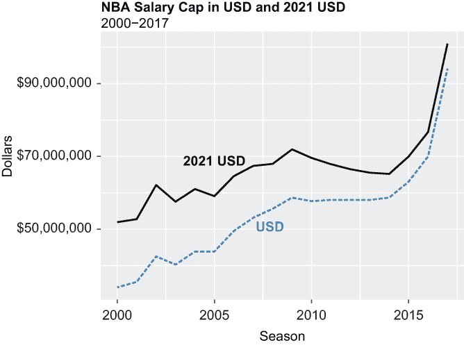
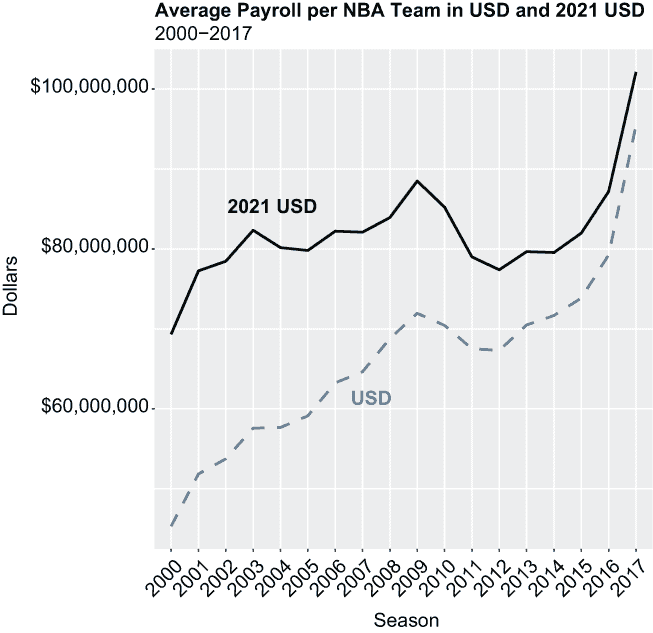
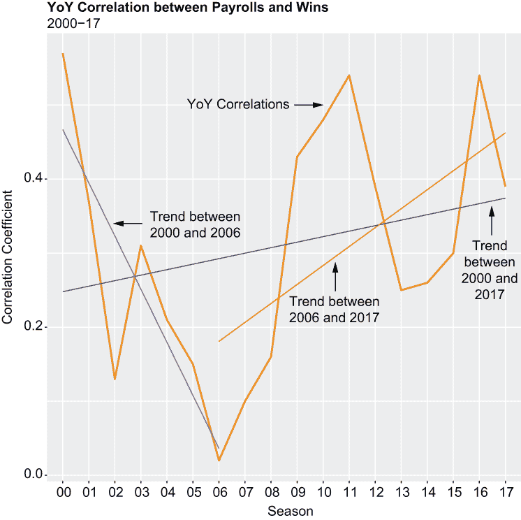
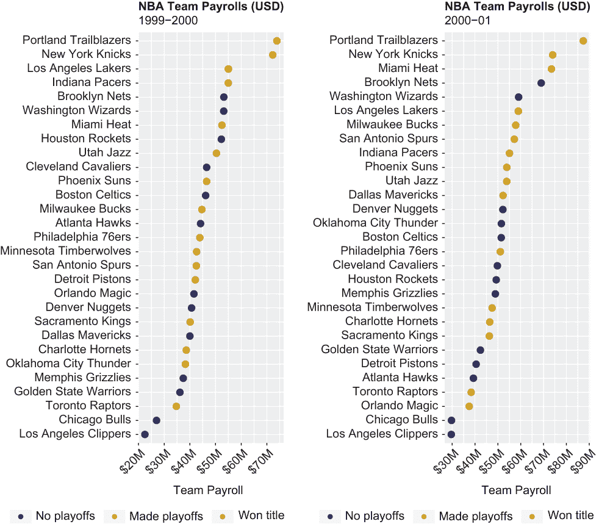
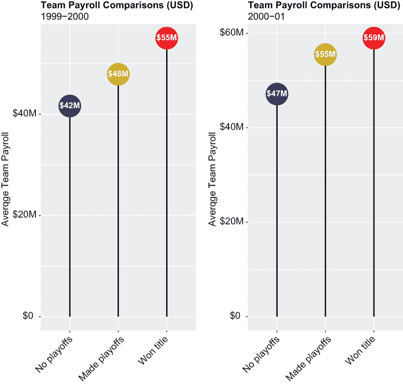
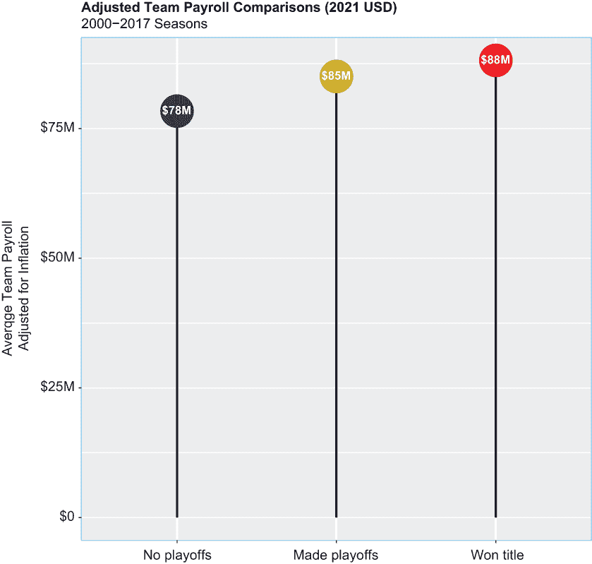

# 10 使用 ggplot2 做更多操作

本章涵盖

+   创建相关图、点图和棒棒糖图

+   通过转换和连接修改`ggplot2`标签

+   通过图例、注释和形状增强`ggplot2`可视化

+   根据组别更改`ggplot2`颜色

+   揭示辛普森悖论

本章的目的是量化并可视化 NBA 中球队工资和球队成就之间的关系。在这个过程中，我们将展示如何通过`ggplot2`图形包进行超越——通过实验非传统类型的图表；通过转换和增强轴标签；通过添加图例、注释和形状；以及通过颜色分段分组。当我们可视化数据而不是将其限制在表格的行和列中时，我们加快了从数据中学习的能力和采取行动的能力。我们能够轻松地看到变量之间的相关性、时间趋势、异常模式、频率、分布和异常值，这些在电子表格或其他类似输出中几乎无法发现。有时，一些小的改动可以对您的视觉内容产生重大影响。

话虽如此，在继续之前，我们需要考虑几个注意事项。首先，球队工资总额等于球员工资的总和，因此不包括通常补充球员工资的代言费和其他收入来源。我们只计算球队支付给员工的资金。其次，从现在开始，球队成就将以三种方式衡量：常规赛胜利、季后赛出场和联赛冠军。我们的旅程将涵盖几条路径：

+   量化并可视化球队工资和常规赛胜利之间的年度相关性（见第 10.4.1 节）

+   按赛季对球队工资进行排名排序，并将赛季末的结果分类到三个级别的因子变量中（见第 10.4.2 节）

+   通过一系列棒棒糖图比较平均球队工资和不同的赛季结束结果（见第 10.4.3 节）

但首先，让我们处理一些清理任务。

## 10.1 加载包

为了实现这些目标，我们需要超越基本的 R 语言；因此，我们三次调用`library()`函数来加载之前使用过的三个包。作为提醒，我们之前在第四章中介绍的`scales`包包括用于转换`ggplot2`标签格式的函数：

```
library(tidyverse)
library(scales)
library(patchwork)
```

接下来，我们将导入我们的数据集。

## 10.2 导入和查看数据

本章我们将使用两个数据集。第一个数据集，称为 cap，只有 18 行，3 列宽。它包含了 2000 年至 2017 年每个赛季的真实 NBA 工资帽，以及 2021 年的工资帽，使用[www.usinflationcalculator.com](https://www.usinflationcalculator.com/)的工具进行了通货膨胀调整，数据来源于[www.basketball-reference.com](https://www.basketball-reference.com/)。

我们的第二个数据集，称为薪资，包含了 2000 年至 2017 年间每个 NBA 球队的实付和通胀调整后的工资总额；实付工资是从一个名为 Celtics Hub 的波士顿凯尔特人球迷网站获得的（[www.celticshub.com](https://www.celticshub.com/)；打印时网站处于维护状态），调整后的工资是通过[www.usinflationcalculator.com](https://www.usinflationcalculator.com/)计算得出的。此外，薪资数据集还包含了每个球队和赛季组合的常规赛胜利总数和季后赛结果，这些数据是从[www.basketball-reference.com](https://www.basketball-reference.com/)抓取的。

这两个数据集都是存储在我们默认工作目录中的.csv 文件。因此，我们调用`readr`的`read_csv()`函数两次来导入它们：

```
cap <- read_csv("salary_cap.csv")

salaries <- read_csv("salaries.csv")
```

以下是一些关于薪资数据集的简短说明：

+   NBA 在 1999-2000 赛季至 2003-2004 赛季之间有 29 支球队，此后每年有 30 支球队；因此，我们的薪资数据集中包含几个“不可用”（NA）值。我们将展示如何处理 NA 值，以确保缺失值不会妨碍我们的分析。

+   我们在整个文档中使用了当前的球队名称，尽管一些球队之前曾在另一个城市甚至另一个州进行主场比赛。例如，篮网队只被称为布鲁克林篮网，尽管他们之前在泽西州比赛时被称为新泽西篮网；雷霆队，当他们在西雅图比赛时被称为超音速，现在只被称为俄克拉荷马城雷霆。球队有时会搬迁并因此更改名称，但它们仍然是同一个特许经营，通常由同一个所有权集团拥有。

调用`dplyr`的`glimpse()`函数会返回薪资行的数量和列的数量，以及数据的转置视图。然而，我们首先调用`options()`函数，以确保`glimpse()`函数以及当然，几乎之后的每一个操作，都以原始或原始格式返回结果，而不是以科学记数法。你应该预期，除非事先禁用，否则在处理包含大量数字的数字时，科学记数法会自动生效。即使是 NBA 中最边缘的球员也是百万富翁多次；因此，我们所有的薪资或工资数据都包含*很多*零。我们更喜欢以全数字形式返回工资数据，然后，如有必要，用智能和可读的转换覆盖结果：

```
options(scipen = 999)
```

科学记数法和 tibbles

我们在前面一章提到，tibbles 并不总是与基础 R 函数一起工作。事实证明，在某些时候禁用科学记数法对 tibbles 有效，但有时则无效。然而，我们将在第 10.3 节中展示一个非常简单的解决方案。

考虑到空间，我们将薪资传递给`dplyr select()`函数以减少我们的数据，这样`glimpse()`函数就只返回变量`Team`和 2017 数据的子集：

```
salaries %>%
  select(Team, s2017, sa2017, w2017, pc2017) %>%
  glimpse()
## Rows: 30
## Columns: 5
## $ Team   <chr> "Atlanta Hawks", "Boston Celtics", "Brooklyn Nets", ...
## $ s2017  <dbl> 95471579, 87272327, 72926799, 99780303, 94291373, 13...
## $ sa2017 <dbl> 102154590, 93381390, 78031675, 106764924, 100891769,...
## $ w2017  <dbl> 43, 53, 20, 36, 41, 51, 33, 40, 37, 67, 55, 42, 51, ...
## $ pc2017 <dbl> 10, 10, 0, 0, 10, 10, 0, 0, 0, 11, 10, 10, 10, 0, 10...
```

对`dim()`函数的后续调用为我们提供了薪资数据集的完整维度：

```
dim(salaries)
## [1] 30 73
```

薪资数据集的宽度几乎是长度的两倍半。以下是您需要立即了解的数据信息：

+   s2017 至 s2000 列代表年度球队实际薪资，例如，s2017 等于 2016-17 赛季。

+   sa2017 至 sa2000 列代表按通货膨胀调整后的年度球队薪资。

+   w2017 至 w2000 列代表年度常规赛胜利总数（所有 NBA 球队都参加 82 场比赛的赛程，减去因罢工和流行病等意外事件造成的破坏）。

+   pc2017 至 pc2000 列代表年度赛季结束时的结果，其中 0 表示球队未能进入季后赛，10 表示球队有资格参加季后赛但途中输掉了比赛，11 表示赢得了联赛冠军。

现在来分析一下球员薪资和薪资上限的时间序列。薪资上限是球队在球员薪资上允许花费的最高限额；联盟几乎每年都会调整薪资上限，至少是为了应对通货膨胀。

## 10.3 薪资和薪资上限分析

本章中的第一个可视化是一个`ggplot2`折线图，显示了 2000 年至 2017 年 NBA 薪资上限的实值美元（USD）和通货膨胀调整后的美元（2021 USD）。我们导入的第一个数据集，cap，是我们的数据源（见图 10.1）：

+   因此，我们两次调用`geom_line()`函数来绘制两条线，一条实线，一条虚线。R 默认所有线都是实线，除非另有说明；除了虚线之外，还有其他几种选择。

+   为了将我们的 y 轴标签从，比如说，90000000 转换为更易读的$90,000,000，我们两次调用`scale_y_continuous()`函数——首先，为这些大（有些人可能会说是过分的）薪资数字添加逗号，其次，在这些数字前加上美元符号。这两个操作都是通过`scales`包一起完成的。虽然`scales`包是`tidyverse`的一部分，通过`ggplot2`包实现，但 R 在调用未单独和独立于`tidyverse`或`ggplot2`加载的`scales`函数时抛出错误并不罕见。

+   由于我们没有添加图例，我们还两次调用`annotate()`函数，在指定的 x 和 y 坐标相遇的位置添加一对标签；我们的标签通过指定哪些线代表哪些数据系列来代替图例。



图 10.1 2000 年至 2017 年 NBA 薪资上限（美元）和 2021 年美元。例如，2010 年的薪资上限略低于 6000 万美元。将这个数字转换为 2021 年美元，上限变为大约 7000 万美元，这就是为什么两条线最终会汇合。无论我们是以实际美元还是调整通货膨胀后的美元来查看上限，球员薪资自 2000 年以来或多或少都急剧上升。

再次，我们通过首先调用`ggplot()`函数来初始化一个`ggplot2`对象。然后我们指定 R 要绘制的图表类型，并通过随后调用其他`ggplot2`函数来装饰它：

```
p1 <- ggplot(cap, aes(x = year, y = real, group = 1)) + 
  geom_line(aes(y = real), color = "steelblue", size = 1.5, 
            linetype = "dashed") +
  geom_line(aes(y = adjusted), color = "black", size = 1.5) +
  labs(title = "NBA Salary Cap in USD and 2021 USD", 
       subtitle = "2000-2017", 
       x = "Season", 
       y = "Dollars") +
  theme(plot.title = element_text(face = "bold")) +
  scale_y_continuous(labels = comma) +
  scale_y_continuous(labels = dollar) +
  annotate("text", x = 2005, y = 68000000, label = "2021 USD", 
           fontface = "bold", color = c("black")) +
  annotate("text", x = 2008, y = 50000000, label = "USD", 
           fontface = "bold", color = c("steelblue")) 
print(p1)
```

根据我们的第一个图表，NBA 薪资上限在 2017 年接近了 1 亿美元。薪资上限代表了一年中球队在球员薪资上允许花费的最高金额（尽管有一些允许的例外）。大多数球队在任何时候都会在其活跃名单上拥有大约 15 名球员，这表明平均球员每年可以赚取高达 700 万美元的薪资。

使用`ggplot2`线型和线宽

默认情况下，`ggplot2`折线图以实线绘制；换句话说，如果你想要实线，`ggplot2`会自动为你处理。但`ggplot2`也支持其他线型：虚线、点线、点划线、长划线和双划线。你只需将`linetype`参数传递给`geom_line()`函数，并在单引号或双引号内指定你想要或需要`ggplot2`绘制的线型即可，而不是默认的线型。

此外，你可以调整任何线的宽度，无论其类型如何。例如，当传递给`geom_line()`的大小参数等于`1.5`时，你是在告诉`ggplot2`绘制比默认值宽 50%的线。当大小参数设置为，比如说，`0.8`时，你是在告诉`ggplot2`绘制默认值的 80%宽度的线。

我们的第二个可视化是另一个需要一些数据整理的`ggplot2`折线图。我们首先从薪资数据创建一个新的数据集，称为`mean_salaries_real`。`summarize()`函数计算实际美元的平均团队薪资，而`dplyr across()`函数将计算应用于薪资变量的连续子集。`na.rm`参数设置为`TRUE`，以便平均计算实际上忽略了薪资数据集中的 NA 值；否则 R 会出错。

此外，请注意，我们在打印时通过调用基础 R 的`as.data.frame()`函数，将`mean_salaries_real`从`tibble`转换为经典数据框。这是因为 R 否则会以科学记数法返回结果；解决方案是将对象从`tibble`转换为数据框：

```
salaries %>%
  summarize(across(s2017:s2000, mean, na.rm = TRUE)) -> mean_salaries_real
print(as.data.frame(mean_salaries_real))
##      s2017    s2016    s2015    s2014    s2013    s2012
## 1 95461491 79261793 73862841 71669986 70503755 67299568
##      s2011    s2010    s2009    s2008    s2007    s2006
## 1 67529008 70437138 71950425 68796241 64645788 63248999
##      s2005    s2004    s2003    s2002    s2001    s2000
## 1 59122201 57676465 57580407 53744919 51853886 45314984
```

我们的新数据集有一个行和一个 18 列的维度。接下来，我们调用 `tidyr` 包中的 `pivot_longer()` 函数将 mean_salaries_real 转换为一个包含 18 行和两列（year 和 real）的长而精简的数据集。之前的列 s2017 到 s2000 转换为 year 列的值，薪资转换为 real 列的值。我们得到一个新的对象，称为 new_mean_salaries_real：

```
mean_salaries_real %>%
  pivot_longer(col = c(s2017:s2000),
               names_to = "year",
               values_to = "real") -> new_mean_salaries_real
print(new_mean_salaries_real)
## # A tibble: 18 × 2
##    year       real
##    <chr>     <dbl>
##  1 s2017 95461491.
##  2 s2016 79261793.
##  3 s2015 73862841.
##  4 s2014 71669986.
##  5 s2013 70503755.
##  6 s2012 67299568.
##  7 s2011 67529008.
##  8 s2010 70437138.
##  9 s2009 71950425.
## 10 s2008 68796241.
## 11 s2007 64645788.
## 12 s2006 63248999.
## 13 s2005 59122201.
## 14 s2004 57676465.
## 15 s2003 57580407.
## 16 s2002 53744919.
## 17 s2001 51853886.
## 18 s2000 45314984
```

这两个步骤随后被重复执行：

+   首先，调整薪资变量替代了实际薪资，并计算了 2000 年至 2017 年间平均调整后的球队工资。

+   然后，调用 `pivot_longer()` 函数将数据从宽格式转换为长格式。这产生了一个 18 × 2 的数据集，称为 new_mean_salaries_adjusted，其中 year_temp 中的单元格填充了之前的列 sa2017 到 sa2000，而这些列中的值现在变为调整列中的值。

我们的代码块和结果如下：

```
salaries %>%
  summarize(across(sa2017:sa2000, mean, 
                   na.rm = TRUE)) -> mean_salaries_adjusted

mean_salaries_adjusted %>%
  pivot_longer(col = c(sa2017:sa2000),
               names_to = "year_temp",
               values_to = "adjusted") -> new_mean_salaries_adjusted
print(new_mean_salaries_adjusted)
## # A tibble: 18 × 2
##    year_temp   adjusted
##    <chr>          <dbl>
##  1 sa2017    102143796.
##  2 sa2016     87187972.
##  3 sa2015     81987754.
##  4 sa2014     79553685.
##  5 sa2013     79669243.
##  6 sa2012     77394503.
##  7 sa2011     79008939.
##  8 sa2010     85228938.
##  9 sa2009     88499022.
## 10 sa2008     83931414.
## 11 sa2007     82100151 
## 12 sa2006     82223699.
## 13 sa2005     79814972.
## 14 sa2004     80170286.
## 15 sa2003     82339982.
## 16 sa2002     78467582.
## 17 sa2001     77262290.
## 18 sa2000     69331926.
```

我们通过调用基础 R 的 `cbind()` 函数，或列绑定函数，将 new_mean_salaries_real 和 new_mean_salaries_adjusted 结合起来创建一个新的对象或数据集，称为 salaries_temp：

```
salaries_temp <- cbind(new_mean_salaries_real, new_mean_salaries_adjusted)
print(salaries_temp)
##     year     real year_temp  adjusted
## 1  s2017 95461491    sa2017 102143796
## 2  s2016 79261793    sa2016  87187972
## 3  s2015 73862841    sa2015  81987754
## 4  s2014 71669986    sa2014  79553685
## 5  s2013 70503755    sa2013  79669243
## 6  s2012 67299568    sa2012  77394503
## 7  s2011 67529008    sa2011  79008939
## 8  s2010 70437138    sa2010  85228938
## 9  s2009 71950425    sa2009  88499022
## 10 s2008 68796241    sa2008  83931414
## 11 s2007 64645788    sa2007  82100151
## 12 s2006 63248999    sa2006  82223699
## 13 s2005 59122201    sa2005  79814972
## 14 s2004 57676465    sa2004  80170286
## 15 s2003 57580407    sa2003  82339982
## 16 s2002 53744919    sa2002  78467582
## 17 s2001 51853886    sa2001  77262290
## 18 s2000 45314984    sa2000  69331926
```

由于我们不需要变量 year 和 year_temp，我们通过将 salaries_temp 数据集传递给 `dplyr select()` 函数并实质上取消选择它来移除 year_temp：

```
salaries_temp %>% 
  select(-c(year_temp)) -> salaries_temp
```

然后，我们通过调用基础 R 的 `as.factor()` 函数将变量 year 转换为因子。同时，我们将值 2017 通过 2000 传递给 `as.factor()`，作为 s2017 通过 s2000 的完全替换：

```
salaries_temp$year <- as.factor(2017:2000)
print(salaries_temp)
##    year     real  adjusted
## 1  2017 95461491 102143796
## 2  2016 79261793  87187972
## 3  2015 73862841  81987754
## 4  2014 71669986  79553685
## 5  2013 70503755  79669243
## 6  2012 67299568  77394503
## 7  2011 67529008  79008939
## 8  2010 70437138  85228938
## 9  2009 71950425  88499022
## 10 2008 68796241  83931414
## 11 2007 64645788  82100151
## 12 2006 63248999  82223699
## 13 2005 59122201  79814972
## 14 2004 57676465  80170286
## 15 2003 57580407  82339982
## 16 2002 53744919  78467582
## 17 2001 51853886  77262290
## 18 2000 45314984  69331926
```

最后，我们现在可以创建第二个 `ggplot2` 线形图（见图 10.2）。在这里，我们展示了从 2000 年至 2017 年平均每支球队工资（实际和调整后）的变化趋势；否则，我们的第二个线形图与第一个可视化（p1）的拟合、形式和功能完全相同，只是我们通过第二次调用 `theme()` 函数将 x 轴标签旋转了 45 度：

```
p2 <- ggplot(salaries_temp, aes(x = year, y = real, group = 1)) + 
  geom_line(aes(y = real), color = "steelblue", 
            size = 1.5, linetype = "dashed") +
  geom_line(aes(y = adjusted), color = "black", size = 1.5) +
  labs(title = "Average Payroll per NBA Team in USD and 2021 USD", 
       subtitle = "2000-2017", 
       x = "Season", 
       y = "Dollars") +
  theme(plot.title = element_text(face = "bold")) + 
  scale_y_continuous(labels = comma) +
  scale_y_continuous(labels = dollar) +
  annotate("text", x = "2003", y = 85000000, 
           label = "2021 USD", fontface = "bold", color = c("black")) +
  annotate("text", x = "2007", y = 61000000, 
           label = "USD", fontface = "bold", color = c("steelblue")) +
  theme(axis.text.x = element_text(angle = 45, hjust = 1)) 
print(p2)
```



图 10.2 2000 年至 2017 年间实际和调整后的平均球队工资

考虑到通货膨胀的调整，平均球队工资实际上在 2001 年至 2014 年间非常稳定。从那时起，它以递增的速度增长。现在我们已经提供了一些背景信息，接下来我们将进行深入分析。

## 10.4 分析

在 NBA 中，更成功的球队——即赢得更多常规赛比赛、晋级季后赛并赢得冠军的球队——在球员薪资上的支出比赢得较少常规赛比赛且未能进入季后赛的球队要多。为了提供一些额外的背景信息，特别是对于那些不熟悉典型 NBA 赛季的各位，请考虑以下内容：

+   NBA 的 30 支球队分为两个 15 支球队的联盟；常规赛结束时每个联盟的前八名球队有资格进入季后赛。

+   NBA 常规赛通常在十月中旬开始，并在下一年四月中旬结束。引用一个从 10 月 2021 年开始并在 4 月 2022 年结束的 NBA 赛季，无论是作为 2021-22 赛季、2022 赛季还是 2022 年，都是同样正确的。所有这些意思相同，都是正确的，因此我们将交替使用这些术语。

+   季后赛紧随常规赛结束之后开始，通常在六月初结束。季后赛和赛季后赛是同义的，因此我们将交替使用这些额外术语。

尽管几乎每条规则都有例外，但我们将看看是否可以证明，至少在 2000 年至 2017 年之间，高薪 NBA 球队比低薪球队更成功。我们将主要通过总结和可视化我们的数据来完成这项工作：显示球队工资与常规赛胜利之间正的、显著年度关系的相关图；显示球队工资排名顺序并将赛季结束情况分类为三个离散的类别或箱子的点图；以及显示按这些相同类别分解的年度平均球队工资的棒棒图。

### 10.4.1 绘制球队工资与常规赛胜利之间的相关图和计算相关系数

我们的旅程从计算和绘制球队工资与常规赛胜利之间的年度相关系数，并在我们的数据中执行相关测试开始。

计算相关系数和执行相关测试

在 R 中，你可以以多种方式计算数值变量之间的相关系数。计算两个数值变量之间相关系数的最常见和直接方法是通过调用基础 R 的`cor()`函数。在下面的代码中，我们调用`cor()`函数来计算 2000 赛季的工资和胜利之间的相关系数。通过添加`use = "complete.obs"`参数，我们告诉 R 忽略工资数据集中的 NA 值并返回相关系数；否则，R 会返回 NA 而不是相关系数。

```
cor(salaries$s2000, salaries$w2000, use = "complete.obs")
## [1] 0.5721255
```

默认情况下，R 返回*皮尔逊*相关系数，它评估两个数值或连续变量之间的线性关系。如果你希望或需要 R 返回*斯皮尔曼*相关系数，它基于每个变量的排名值而不是原始数据，只需将`method = "spearman"`参数添加到`cor()`函数中：

```
cor(salaries$s2000, salaries$w2000, method = 'spearman',
    use = "complete.obs")
## [1] 0.4988909
```

由于我们处理的是区间数据（即，沿数值尺度测量的数据，其中相邻值之间的距离始终相同）而不是有序数据（即，在其类别之间具有自然顺序或层级的分类数据），我们将始终计算皮尔逊相关系数。如果你认为计算斯皮尔曼相关系数是合适的，请注意，与皮尔逊相关系数一样，它们总是等于介于-1 和+1 之间的某个数字，因此应该以相同的方式进行解释。

当然，我们对数据集中所有 18 个赛季的球队工资和胜利之间的相关性感兴趣，而不仅仅是 2000 年的赛季。因此，虽然这种方法简单直接，但它并不是最可扩展的解决方案。另一种方法是只对 salaries 数据集的相关变量进行子集化，然后通过一行代码计算每对变量的相关系数。

首先，我们调用`dplyr select()`函数，对 salaries 数据集进行子集化，只保留 s2017 到 s2000 之间的 18 个变量和 w2017 到 w2000 之间的 18 个附加变量。然后我们调用基础 R 的`dim()`函数来返回维度：

```
salaries %>%
  select(s2017:s2000, w2017:w2000) -> salaries_cor
dim(salaries_cor)
## [1] 30 36
```

我们的新数据集 salaries_cor 与 salaries 的行数相同，但在宽度上已经有效减少到 36 列。

我们现在可以通过再次调用`cor()`函数来计算 salaries_cor 中每对变量的相关系数；然而，这次不是传递两个变量作为参数，而是将整个数据集传递。

为了限制结果集，我们首先调用`options()`函数，其中`"max.print"`参数等于`100`；我们不希望给 R 返回每对 36 个变量的相关系数的选项。此外，我们使用基础 R 的`round()`函数限制了`cor()`函数，使得 R 只返回小数点后两位的相关系数，而不是默认的七位。尽管如此，我们只打印了完整结果集的一部分：

```
options("max.print" = 100)

round(cor(salaries_cor, use = "complete.obs"), digits = 2)
##       s2017 s2016 s2015 s2014 s2013 s2012 s2011 s2010 s2009 s2008
## s2017  1.00  0.42  0.41  0.09 -0.09  0.20  0.01  0.20  0.34  0.11
## s2016  0.42  1.00  0.49  0.16 -0.14 -0.20 -0.48 -0.07 -0.04 -0.07
##       s2007 s2006 s2005 s2004 s2003 s2002 s2001 s2000 w2017 w2016
## s2017  0.08  0.04  0.16  0.00  0.10 -0.16 -0.06 -0.02  0.40  0.59
## s2016 -0.21 -0.32 -0.35 -0.38 -0.46 -0.44 -0.22 -0.34  0.48  0.56
##       w2015 w2014 w2013 w2012 w2011 w2010 w2009 w2008 w2007 w2006
## s2017  0.48  0.23 -0.10 -0.10 -0.05  0.21  0.06 -0.07  0.11  0.11
## s2016  0.53  0.43  0.30 -0.03 -0.15 -0.13 -0.16 -0.17  0.16  0.33
##       w2005 w2004 w2003 w2002 w2001 w2000
## s2017 -0.09 -0.11 -0.21 -0.10 -0.21 -0.25
## s2016  0.29 -0.05 -0.38 -0.33 -0.54 -0.57
```

当每个变量都是数值类型时，这种方法才有效，这也是我们首先对 salaries 数据集进行子集化的原因；如果不是这样，R 会抛出一个错误。但是数据量太大。例如，我们并不关心 2017 年和 2016 年工资之间的相关性；同样，我们也不关心 2017 年工资和 2014 年胜利之间的关系。这使得找到有意义的关联（例如，s2017 和 w2017 之间的相关系数，例如，等于 0.40）变得困难。

让我们尝试另一种方法。在我们的下一个代码块中，以下情况发生：

+   我们首先调用`dplyr select()`函数，对 salaries_cor 数据集进行子集化，只保留 s2017 和 s2000 之间的变量。

+   接下来，我们调用`tidyr`包中的`pivot_longer()`函数，将 salaries_cor 从宽布局转换为薄布局，其中剩下的两列假设变量名为`year1`和`salary`。结果被转换为名为 salaries_sals 的 tibble。

最后，我们对 salaries_sals 运行一系列熟悉的 base R 命令来检查结果：

```
salaries_cor %>%
  select(s2017:s2000) %>%
  pivot_longer(col = c(s2017:s2000),
               names_to = "year1",
               values_to = "salary") -> salaries_sals
dim(salaries_sals)
## [1] 540   2

head(salaries_sals, n = 3)
## # A tibble: 3 × 2
##   year1   salary
##   <chr>    <dbl>
## 1 s2017 95471579
## 2 s2016 72902950
## 3 s2015 58470278

tail(salaries_sals, n = 3)
## # A tibble: 3 × 2
##   year1    salary
##   <chr>     <int>
##   year1   salary
##   <chr>    <dbl>
## 1 s2002 54776087
## 2 s2001 59085969
## 3 s2000 53194441
```

接下来，我们重复这个练习，以下条件成立：

+   salaries_cor 数据集在变量`w2017`到`w2000`上进行了子集化，而不是在`s2017`到`s2000`上。

+   然后将数据集从宽布局转换为长布局，变量名为`year2`和`wins`。

结果被转换为一个名为 `salaries_wins` 的 tibble，然后我们调用基础 R 的 `dim()`、`head()` 和 `tail()` 函数来检查我们工作的结果：

```
salaries_cor %>%
  select(w2017:w2000) %>%
  pivot_longer(col = c(w2017:w2000),
               names_to = "year2",
               values_to = "wins") -> salaries_wins
dim(salaries_wins)
## [1] 540   2

head(salaries_wins, n = 3)
## # A tibble: 3 × 2
##   year2  wins
##   <chr> <dbl>
## 1 w2017    43
## 2 w2016    48
## 3 w2015    60

tail(salaries_wins, n = 3)
## # A tibble: 3 × 2
##   year2  wins
##   <chr> <dbl>
## 1 w2002    37
## 2 w2001    19
## 3 w2000    29
```

然后，我们调用基础 R 的 `cbind()` 函数将 `salaries_sals` 和 `salaries_wins` 合并到一个新的数据集中，称为 `salaries_cor2`：

```
salaries_cor2 <- cbind(salaries_sals, salaries_wins)
dim(salaries_cor2)
## [1] 540   4

head(salaries_cor2, n = 3)
##   year1   salary year2 wins
## 1 s2017 95471579 w2017   43
## 2 s2016 72902950 w2016   48
## 3 s2015 58470278 w2015   60

tail(salaries_cor2, n = 3)
##     year1   salary year2 wins
## 538 s2002 54776087 w2002   37
## 539 s2001 59085969 w2001   19
## 540 s2000 53194441 w2000   29
```

`salaries_cor2` 数据集共有 540 行，4 列，具有以下特征：

+   每个球队的每份薪资现在都合并到一个列中。

+   每个球队的常规赛胜利总数合并到一个列中。

+   变量 `year1` 或 `year2` 可以用作分组标识符。

这意味着我们可以编写一段 `dplyr` 代码，在其中调用 `group_by()` 和 `summarize()` 函数来计算变量 `salary` 和 `wins` 之间的相关系数，对于变量 `year1`（或如果我们希望，`year2`）中的每个因子或唯一标识符。结果被转换为一个名为 `tbl1` 的 tibble：

```
salaries_cor2 %>%
  group_by(year1) %>%
  summarize(cor = round(cor(salary, wins, use = "complete.obs"), 
    digits = 2)) -> tbl1
print(tbl1)
## # A tibble: 18 × 2
##    year1   cor
##    <chr> <dbl>
##  1 s2000  0.57
##  2 s2001  0.37
##  3 s2002  0.13
##  4 s2003  0.31
##  5 s2004  0.21
##  6 s2005  0.15
##  7 s2006  0.02
##  8 s2007  0.1 
##  9 s2008  0.16
## 10 s2009  0.43
## 11 s2010  0.48
## 12 s2011  0.54
## 13 s2012  0.39
## 14 s2013  0.25
## 15 s2014  0.26
## 16 s2015  0.3 
## 17 s2016  0.54
## 18 s2017  0.39
```

在所有这些之后，我们现在有了 18 个相关系数打包在一个单一的数据对象中，我们将从中提取以进行绘图和分析。

同时，让我们运行一次薪资和胜利之间的相关性测试。我们调用基础 R 的 `cor.test()` 函数来确定变量 `payrolls` 和 `wins` 之间是否存在任何有意义或统计上显著的关系。我们的零假设是没有，但如果我们的测试返回的 p 值或显著性水平等于或低于我们预定义的阈值 0.05，我们将得出结论，实际上这两个变量之间确实存在有意义的关系：

```
cor.test(salaries_cor2$salary, salaries_cor2$wins)
## 
##  Pearson's product-moment correlation
## 
## data:  salaries_cor2$salary and salaries_cor2$wins
## t = 4.9844, df = 533, p-value = 0.0000008417
## alternative hypothesis: true correlation is not equal to 0
## 95 percent confidence interval:
##  0.1285648 0.2906084
## sample estimates:
##       cor 
## 0.2110361
```

p 值远低于 0.05 的显著性阈值；因此，我们可以拒绝零假设，并接受备择假设，即 2000 年至 2017 年 NBA 赛季之间球队薪资和常规赛胜利之间的关联在统计上是显著的。区分关联和因果关系也很重要；我们的相关性测试结果，特别是在孤立于其他结果和推论的情况下，是前者的证据，而不一定是后者的证据。

可视化年度相关性

现在，让我们可视化变量 `s2000` 和 `w2000` 之间的相关性，或者从 2000 赛季开始的真实薪资和常规赛胜利之间的相关性。我们首先调用 `select()` 函数来对 `Team`、`s2000`、`w2000` 和 `pc2000` 变量进行子集化，从而创建一个名为 `salaries2000` 的新数据集。然后我们调用基础 R 的 `na.omit()` 函数来忽略 `salaries2000` 中等于 NA 的任何和所有值。

这里是额外的参数：

+   我们的 x 轴是球队薪资（s2000）。我们两次将 `scale_x_continuous()` 函数与 `scales` 包结合使用，重新格式化 x 轴标签，以便它们包含逗号和美元符号。

+   我们的 y 轴是胜利（w2000）。

+   通过在 `geom_point()` 函数中添加 `size = 3` 参数，数据点的大小增加到默认大小的三倍。

+   所有 NBA 球队根据各自 2000 赛季的结束情况被分为三个组。换句话说，变量`pc2000`中的三个级别——`0`、`10`和`11`——大致转换为`无季后赛`、`进入季后赛`和`赢得冠军`。

+   我们两次调用`geom_smooth()`函数来绘制三条趋势线，不包含置信区间。我们第一次调用`geom_smooth()`为三个因素中的两个绘制趋势线；第二次调用`geom_smooth()`在整个数据系列上绘制第三条趋势线，不考虑因素。

+   在图上添加了一个图例并固定在底部。

+   我们将 x 轴标签旋转了 45 度以适应。

这是我们的第一个图的代码：

```
salaries2000 <- select(salaries, Team, s2000, w2000, pc2000)
salaries2000 <- na.omit(salaries2000)

cor1 <- ggplot(salaries2000, aes(x = s2000, y = w2000, 
                                 color = factor(pc2000))) + 
  geom_point(size = 3) +
  labs(title = " Team Payrolls vs. Wins (1999-2000)",
       subtitle = "correlation coefficient = 0.57",
       x = "Team Payrolls", 
       y = "Wins") + 
  scale_x_continuous(labels = comma) +
  scale_x_continuous(labels = dollar) +
  geom_smooth(method = lm, se = FALSE) +
  geom_smooth(method = lm, color = "green4",
              data = salaries2000[salaries2000$s2000 > 20000000,], 
              se = FALSE) +
  theme(plot.title = element_text(face = "bold")) +
  scale_color_manual(name = "", 
                     labels = c("No playoffs", 
                                "Made playoffs", 
                                "Won title"), 
                     values = c("0" = "navy", 
                                "10" = "gold3", 
                                "11" = "red")) +
  theme(legend.position = "bottom") +
  theme(axis.text.x = element_text(angle = 45, hjust = 1))
```

现在让我们通过将 2000 年的变量替换为 2001 年，但保持之前的语法，为 2001 年创建一个类似的图：

```
salaries2001 <- select(salaries, Team, s2001, w2001, pc2001)
salaries2001 <- na.omit(salaries2001)

cor2 <- ggplot(salaries2001, aes(x = s2001, y = w2001, 
                                 color = factor(pc2001))) + 
  geom_point(size = 3) +
  labs(title = " Team Payrolls vs. Wins (2000-01)",
       subtitle = "correlation coefficient = 0.37",
       x = "Team Payrolls", y = "Wins") + 
  scale_x_continuous(labels = comma) +
  scale_x_continuous(labels = dollar) +
  geom_smooth(method = lm, se = FALSE) +
  geom_smooth(method = lm, color = "green4",
              data = salaries2001[salaries2001$s2001 > 20000000,], 
              se = FALSE) +
  theme(plot.title = element_text(face = "bold")) +
  scale_color_manual(name = "", 
                     labels = c("No playoffs", 
                                "Made playoffs", 
                                "Won title"), 
                     values = c("0" = "navy", 
                                "10" = "gold3", 
                                "11" = "red")) +
  theme(legend.position = "bottom") +
  theme(axis.text.x = element_text(angle = 45, hjust = 1))
```

我们随后从`patchwork package`包中调用`plot_layout()`函数，将我们的两个相关图合并为一个单一的图形对象（见图 10.3）：

```
cor1 + cor2 + plot_layout(ncol = 2)
```


图 10.3 两个相关图，一个针对 2000 年，另一个针对 2001 年，可视化球队工资和常规赛胜利之间的关系。

剩余的相关图，涵盖 2002 年至 2017 赛季，显示在本书的附录中。总的来说，除了工资和胜利之间的统计显著性外，考虑到相关系数始终等于-1 和+1 之间的某个数字，并且接近这些极端的结果表明存在强烈的负相关或正相关关系，我们可以得出以下结论：

+   年复一年，或者说赛季复赛季，球队工资和常规赛胜利之间存在正相关关系。换句话说，随着工资的增加，常规赛胜利也会增加。

+   相关系数在年度间似乎没有一致性，实际上，我们的结果中存在大量的变异性。例如，2006 年球队工资和常规赛胜利之间的相关系数低至 0.02，而 2000 年高达 0.57。

+   此外，我们甚至看到连续赛季之间的相关系数缺乏连续性。以 2008 年和 2009 年为例，球队工资和常规赛胜利之间的相关系数从 0.16 跃升至 0.43。

+   几乎每年都有最高工资的球队进入季后赛，而工资最低的球队几乎无法进入季后赛。

+   赢得冠军的球队通常在常规赛胜利和工资总额方面都接近顶端。

此外，让我们简要介绍并讨论一下被称为辛普森悖论（Simpson’s Paradox）的统计现象。当两个变量之间的关联，在分割成多个子群体时，与在考察整个数据系列时相同对变量的关联相矛盾时，辛普森悖论就出现了。2012-13 赛季的结果可能是最好的例子（见附录）。总体而言，工资与常规赛胜利之间存在正相关。然而，当数据按赛季结束因素子集时，这些相同变量之间的关系是平的。我们通过分割数据并为不同的因素分配不同的颜色来获得这种见解；如果我们保持数据完整并未应用颜色方案，我们绝对看不到这种情况。

绘制随时间变化的关联性

我们接下来的可视化显示了使用我们之前创建的 tibble 作为数据源，团队工资与常规赛胜利之间逐年相关系数。但首先，我们调用 `dplyr mutate()` 函数和内置的 `replace()` 和 `sprintf()` 函数，有效地覆盖 `tbl1` 变量 `year1` 中的所有值，例如，将 `s2014` 替换为 `14`：

+   我们之前调用 `mutate()` 函数来创建新的或派生变量；这里，它是被调用以帮助更改现有变量的值。

+   `replace()` 函数接受三个参数：我们正在修改的向量名称（`year1`）、我们要替换的元素（所有 18 个），以及替换值（从 `00` 到 `17`）。

+   `sprintf()` 函数格式化字符字符串；这里，我们指示 R 以两位小数点左边的数字和零位小数点右边的数字格式化替换值。否则，R 会将 `00` 到 `09` 返回为 0, 1, 2, 3 等等。

然后，我们调用 `as.factor()` 函数将 `year1` 从字符字符串转换为因子变量：

```
tbl1 %>%
  mutate(year1 = replace(year1, 1:18, sprintf("%02.0f", 00:17))) -> tbl1
tbl1$year1 <- as.factor(tbl1$year1)
print(tbl1)
## # A tibble: 18 × 2
##    year1   cor
##    <fct> <dbl>
##  1 00     0.57
##  2 01     0.37
##  3 02     0.13
##  4 03     0.31
##  5 04     0.21
##  6 05     0.15
##  7 06     0.02
##  8 07     0.1 
##  9 08     0.16
## 10 09     0.43
## 11 10     0.48
## 12 11     0.54
## 13 12     0.39
## 14 13     0.25
## 15 14     0.26
## 16 15     0.3 
## 17 16     0.54
## 18 17     0.39
```

现在，我们可以继续创建我们的可视化，一个包含多个趋势线的 `ggplot2` 线形图，如下所示：

+   tibble tbl1 是我们的数据源，其中变量 `year1` 占据 x 轴，变量 `cor` 占据 y 轴。

+   我们对 `geom_smooth()` 函数的第一次调用在完整的数据系列上绘制了一条趋势线。参数 `se = FALSE` 告诉 R 不要在趋势线周围绘制置信区间。

+   我们对 `geom_smooth()` 函数的下一个也是最后的两次调用，绘制了覆盖数据中互斥子集的其他趋势线，以强调从 2006 年开始趋势的急剧变化。

+   最后，我们连续四次调用`geom_segment()`和`annotate()`函数来绘制两条垂直箭头和两条水平箭头，然后添加补充文本。箭头是从提供的 x 和 y 坐标*到*提供的 xend 和 yend 坐标绘制的。请注意，箭头的尖端是终点。箭头可以是垂直的、水平的、对角线的，也可以是向上的或向下的。x 和 xend 坐标等于 x 轴刻度的位置，而 y 和 yend 坐标等于相关系数。可以通过使用`unit()`函数来调整箭头尖的大小。

+   通过调用`annotate()`函数，我们在给定的 x 和 y 坐标处添加文本，这些坐标是集合中心点。当向`ggplot2`对象添加形状和文本层时，请准备好在锁定代码之前进行大量的实验。

我们在这里展示了`ggplot`代码块：

```
p3 <- ggplot(tbl1, aes(x = year1, y = cor, group = 1)) + 
  geom_line(aes(y = cor), color = "orange2", size = 2.5) +
  labs(title ="YoY Correlation between Payrolls and Wins",
       subtitle = "2000-17", 
       x = "Season", 
       y = "Correlation Coefficient") +
  geom_smooth(method = lm, color = "blue", se = FALSE) +
  geom_smooth(method = lm, color = "purple", se = FALSE,
            data = tbl1[as.numeric(tbl1$year1) < 08,]) +
  geom_smooth(method = lm, color = "red", se = FALSE,
            data = tbl1[as.numeric(tbl1$year1) > 06,]) +
  theme(plot.title = element_text(face = "bold")) +
  geom_segment(aes(x = 10,
                   y = 0.5,
                   xend = 11,
                   yend = 0.5),
               arrow = arrow(length = unit(0.3, "cm"))) +
  annotate("text", x = 8.7, y = 0.5, 
           label = "YoY Correlations", size = 3) +
  geom_segment(aes(x = 4,
                   y = 0.34,
                   xend = 3,
                   yend = 0.34),
               arrow = arrow(length = unit(0.3, "cm"))) +
  annotate("text", x = 6.3, y = 0.34, 
           label = "Trend between\n2000 and 2006", size = 3) +
  geom_segment(aes(x = 11.5,
                   y = 0.24,
                   xend = 11.5,
                   yend = 0.29),
               arrow = arrow(length = unit(0.3, "cm"))) +
  annotate("text", x = 11.5, y = 0.22, 
           label = "Trend between\n2006 and 2017", size = 3) +
  geom_segment(aes(x = 17.5,
                   y = 0.31,
                   xend = 17.5,
                   yend = 0.36),
               arrow = arrow(length = unit(0.3, "cm"))) +
  annotate("text", x = 17.5, y = 0.27, 
           label = "Trend\nbetween\n2000 and\n2017", size = 3)
print(p3)
```

下一个输出结果（见图 10.4）。在 2000 年至 2017 年之间，相关系数略有上升趋势。然而，更重要的是，存在两种趋势：首先，在 2000 年至 2006 年之间，我们看到一个急剧的*下降*趋势；其次，从 2006 年至 2017 年，我们看到一个同样急剧的*上升*趋势。因此，尽管相关系数每年都有波动，有时幅度很大，但我们的最重要的启示是，2006 年之后的薪资与胜利之间的关系比 2006 年之前更强。



图 10.4 团队薪资与常规赛胜利之间的年度相关系数，数据上方叠加了三条趋势线。相关系数在 2006 赛季之前呈下降趋势，然后从 2006 年开始急剧上升。

让我们通过探索团队薪资与球队完成赛季的方式或地点之间的可能联系来进行数据透视，无论他们在常规赛中赢得多少场比赛。

### 10.4.2 薪资与赛季末结果对比

我们继续通过检查每个球队的三个赛季结束分类之一来绘制团队薪资：

+   有资格参加季后赛但未能赢得冠军

+   有资格参加季后赛并赢得联赛冠军

+   赢得的常规赛比赛不够多，因此没有进入季后赛

我们将使用一系列点图来可视化我们的结果，每个 NBA 赛季一个点图，每个点图的数据来源是薪资数据集的临时子集。以下是关于我们的点图的几点额外说明：

+   我们绘制的是实际团队薪资或薪水，而不是调整后的薪资；因此，在我们的第一个点图中，x 轴变量是`s2000`而不是`sa2000`，前者包含 2000 年的实际薪资，后者包含调整后的 2000 年薪资。

+   如前所述，我们为了保持一致性和简单性，在整个文档中使用当前球队名称。例如，在 2000 年，布鲁克林篮网队曾是新泽西篮网队——同一支球队，不同的名称，但工资数据集只提到了布鲁克林篮网队。

+   球队根据各自的工资按降序排名，因此 aesthetic 中添加了 `reorder()` 函数。

+   就像我们的相关图一样，每个球队都被归入三个类别之一，或称为分类，这些分类与三个级别的变量`pc2000`到`pc2017`相对应，其中因素`0`、`10`和`11`基本上被转换为`No playoffs`（无季后赛）、`Made playoffs`（进入季后赛）和`Won title`（赢得冠军）。

+   我们点的尺寸与相关图中的数据点尺寸相同：默认尺寸的三倍。

+   我们已经格式化了 x 轴标签（再次旋转 45 度以适应），例如，我们显示的是更易读的$20 M 而不是 20000000\. 我们通过调用`ggplot2 scale_x_continuous()`函数以及来自`scales`包的`label_dollar``()`和`cut_short_scale()`函数来实现这一点，其中前者在 x 轴标签前添加美元符号，后者将相同的标签转换为百万并添加 M 作为后缀。

+   每个点图的底部都附有图例。

+   最后，在调用`ggplot()`函数并创建我们的点图之前，我们通过子集工资数据集仅包含后续图所需的变量，并在必要时调用基础 R 的`na.omit()`函数来删除任何包含 NAs 的行。我们不希望永久删除可能包含一些 NAs 的工资数据集中的所有行，所以我们创建了一个临时子集，然后应用`na.omit()`函数。这是由于 2000 年至 2004 年间的球队增加、搬迁和变更所必需的。

话虽如此，我们的第一个点图是用以下代码块创建的：

```
salaries2000 <- select(salaries, Team, s2000, pc2000)
salaries2000 <- na.omit(salaries2000)

dot1 <- ggplot(salaries2000) +
  geom_point(aes(x = s2000, y = reorder(Team, s2000), 
                 color = factor(pc2000)), size = 3) +
  labs(title= "NBA Team Payrolls (USD)", 
       subtitle = "1999-2000", 
       x = "Team Payroll", 
       y = "") +
  scale_x_continuous(labels = label_dollar(scale_cut = cut_short_scale())) +
  theme(plot.title = element_text(face = "bold")) + 
  scale_color_manual(name = "", 
                     labels = c("No playoffs", 
                                "Made playoffs", 
                                "Won title"), 
                     values = c("0" = "navy", 
                                "10" = "gold3", 
                                "11" = "red")) +
  theme(legend.position = "bottom") +
  theme(axis.text.x = element_text(angle = 45, hjust = 1))
```

我们通过更改变量并创建一个新的、临时的工资数据集子集`salaries2001`来创建我们的第二个点图——这是 2000-01 赛季的点图。其他所有内容都与我们的第一个点图保持一致：

```
salaries2001 <- select(salaries, Team, s2001, pc2001)
salaries2001 <- na.omit(salaries2001)

dot2 <- ggplot(salaries2001) +
  geom_point(aes(x = s2001, y = reorder(Team, s2001), 
                 color = factor(pc2001)), size = 3) +
  labs(title= "NBA Team Payrolls (USD)", 
       subtitle = "2000-01", 
       x = "Team Payroll", 
       y = "") +
  scale_x_continuous(labels = label_dollar(scale_cut = cut_short_scale())) +
  theme(plot.title = element_text(face = "bold")) + 
  scale_color_manual(name = "", 
                     labels = c("No playoffs", 
                                "Made playoffs", 
                                "Won title"), 
                     values = c("0" = "navy", 
                                "10" = "gold3", 
                                "11" = "red")) +
  theme(legend.position = "bottom") +
  theme(axis.text.x = element_text(angle = 45, hjust = 1))
```

我们通过再次调用`plot_layout()`函数从`patchwork`包中，并将两个点图作为单个图形对象打印出来，将我们的两个点图放在一起（见图 10.5）：

```
dot1 + dot2 + plot_layout(ncol = 2)
```



图 10.5 1999-2000 和 2000-01 赛季的 NBA 球队工资排名，点图的阴影与赛季结束结果相对应

我们数据集中剩余的 NBA 赛季的点图在附录中。以下是这些图从我们的数据中显著揭示的内容：

+   联赛冠军很少拥有 NBA 最高的工资。事实上，在我们的数据集中 18 个赛季中，只有两次——2010 年和 2016 年——联赛冠军拥有最高的工资。

+   然而，这些球队通常的薪资高于剩余 50%以上的球队，并且经常拥有 NBA 中最高的薪资之一。

+   薪资最高的球队通常能进入季后赛；实际上，这些球队的薪资通常显著高于所有其他球队。

+   薪资最低的球队——其薪资明显低于其他所有球队的薪资——通常无法进入季后赛。

+   与成功球队相关的高薪资和与不太成功球队相关的低薪资在近年来比在 21 世纪初更为明显和普遍。

接下来，我们将计算年度平均薪资，比较和对比有资格进入季后赛的球队与其他没有进入季后赛的球队以及联赛冠军。我们将通过一系列棒棒糖图来可视化这些结果。

### 10.4.3 薪资比较

让我们再次转换视角，从年度对比的角度来审视平均球队薪资，就像之前那样，分为三个部分，每个球队都执行以下其中一项：

+   有资格进入季后赛但最终未能赢得冠军

+   赢得联赛冠军

+   连季后赛资格都没有获得

我们将使用棒棒糖图来可视化 2000 年至 2017 年每个 NBA 赛季的结果，棒棒糖图是条形图的现代替代品。在第二章中提出的条形图用例同样适用于棒棒糖图。

首先，我们创建一个 tibble，通过执行以下命令来为每个棒棒糖图提供数据源：

+   告诉 R 忽略薪资数据集中任何赛季子集中的 NA 值。

+   通过调用`dplyr group_by()`和`summarize()`函数，并将结果转换为名为`mean`的变量，计算每个赛季结束分类的平均薪资。

+   调用`mutate()`函数创建一个名为`mean2`的新变量，其中值本质上是对变量`mean`中其他内容的转换版本。使用基础 R 中的`paste()`函数将三个术语——一个美元符号、变量`mean`中相应的值四舍五入到最近的百万分之一，以及一个大写 M——连接起来，每个术语之间没有空格。因此，`mean`中的`41611202`这样的值在`mean2`中转换为`$42M`。

+   将变量`pc2000`、`pc2001`等中的因素`0`、`10`和`11`转换为`No playoffs`（无季后赛）、`Made playoffs`（进入季后赛）和`Won title`（赢得冠军）。

我们的棒棒糖图具有以下特点：

+   我们三个赛季结束的分类沿着 x 轴展开。

+   平均球队薪资位于 y 轴上。

+   `geom_segment()`函数为 x 轴变量中的每个因素绘制三个棒棒糖，茎从 y 等于 0 开始，到 y 等于平均薪资结束。

+   `geom_point()`函数根据我们的大小、颜色和填充规格在每根茎上绘制圆圈。

+   我们 y 轴的标签——它们是从变量 `mean` 而不是 `mean2` 中提取的——通过调用 `ggplot2 scale_y_continuous()` 函数和 `scales label_dollar()` 以及 `cut_short_scale()` 函数进行转换。

+   `geom_text()` 函数在棒棒糖图的顶部添加了与变量 `mean2` 相关的文本。

我们第一个棒棒糖图的数据处理和可视化代码如下：

```
salaries2000 <- na.omit(salaries2000)

salaries2000 %>%
  group_by(pc2000) %>%
  summarize(mean = mean(s2000)) %>%
  mutate(mean2 = paste("$", round(mean/1000000),
                       "M", sep = "")) -> tbl2
  tbl2$pc2000 <- c("No playoffs", "Made playoffs", "Won title")

lol1 <- ggplot(tbl2, aes(x = pc2000, y = mean)) +
  geom_segment(aes(x = pc2000, xend = pc2000, 
                   y = 0, yend = mean)) +
  geom_point(size = 15, color = c("navy", "gold3", "red"), 
             fill = c("navy", "gold3", "red")) +
    labs(title = "Team Payroll Comparisons (USD)", 
         subtitle = "1999-2000",
         x = "", 
         y = "Averqge Team Payroll") +
  scale_y_continuous(labels = 
                       label_dollar(scale_cut = cut_short_scale())) +
  scale_x_discrete(limits = c("No playoffs", "Made playoffs", 
                              "Won title")) +
  geom_text(aes(label = mean2), color = "white", 
            fontface = "bold", size = 3) +
  theme(plot.title = element_text(face = "bold")) +
  theme(axis.text.x = element_text(angle = 45, hjust = 1))
```

下面的代码块是第二个棒棒糖图的数据处理和可视化代码，我们只是将 2000 年的变量替换为它们的 2001 年等价物：

```
salaries2001 <- na.omit(salaries2001)

salaries2001 %>%
  group_by(pc2001) %>%
  summarize(mean = mean(s2001)) %>%
  mutate(mean2 = paste("$", round(mean/1000000),
                       "M", sep = "")) -> tbl2
  tbl2$pc2001 <- c("No playoffs", "Made playoffs", "Won title")

lol2 <- ggplot(tbl2, aes(x = pc2001, y = mean)) +
  geom_segment(aes(x = pc2001, xend = pc2001, y = 0, yend = mean)) +
  geom_point(size = 15, color = c("navy", "gold3", "red"), 
             fill = c("navy", "gold3", "red")) +
    labs(title = "Team Payroll Comparisons (USD)",
         subtitle = "2000-01",
         x = "", 
         y = "Averqge Team Payroll") +
  scale_y_continuous(labels = 
                       label_dollar(scale_cut = cut_short_scale())) +
  scale_x_discrete(limits = c("No playoffs", "Made playoffs", 
                              "Won title")) +
  geom_text(aes(label = mean2), color = "white", 
            fontface = "bold", size = 3) +
  theme(plot.title = element_text(face = "bold")) +
  theme(axis.text.x = element_text(angle = 45, hjust = 1))
```

再次，我们通过调用 `plot_layout()` 函数从 `patchwork` 包中合并我们的两个图表，并将两个可视化作为单个对象打印出来（见图 10.6）：

```
lol1 + lol2 + plot_layout(ncol = 2)
```



图 10.6 NBA 1999-2000 和 2000-01 赛季的球队薪资比较，按三个赛季结束分类细分。无季后赛和进入季后赛的数字代表达到相应分类的所有球队的平均薪资总额，当然，夺冠的数字是赢得联赛冠军的那一支球队的薪资总额。

我们的一系列棒棒糖图告诉我们关于数据的信息（这些信息，如我们的相关图和点图，都在附录中）：

+   比较常见的是，夺冠球队的薪资总额等于或大于所有其他进入季后赛的球队的平均薪资总额。同样常见的是，进入季后赛但未夺冠的球队的薪资总额等于或大于未能进入季后赛的球队的平均薪资总额。

+   在我们的数据集中，有 18 个赛季中的 11 个赛季，包括最后 11 个赛季中的 9 个赛季，*两个*条件都是成立的。

+   在 2000 年到 2017 年之间的 *每一* 年，进入季后赛但未能夺冠的球队的平均薪资总额等于或（通常是）大于未能进入季后赛的球队的平均薪资总额。

现在，我们将之前运行的一些数据处理操作重新定向到调整后的薪资上，以便通过一个快照来总结和可视化我们三个赛季结束分类之间的平均薪资支出以及薪资数据集的全面情况。首先，我们调用 `dplyr select()` 函数来对 `sa2017` 和 `sa2000` 之间的变量进行子集化薪资数据集。然后，我们调用 `tidyr pivot_longer()` 函数将我们的结果从宽格式转换为长格式。结果被转换为一个名为 salaries_mean 的 tibble，我们可以通过检查 `dim()`、`head()` 和 `tail()` 函数的返回值来查看：

```
salaries %>%
  select(sa2017:sa2000) %>%
  pivot_longer(col = c(sa2017:sa2000),
               names_to = "year1",
               values_to = "salary") -> salaries_mean
dim(salaries_mean)
## [1] 540   2

head(salaries_mean, n = 3)
## # A tibble: 3 × 2
##   year1     salary
##   <chr>      <dbl>
## 1 sa2017 102154590
## 2 sa2016  80193245
## 3 sa2015  64902009

tail(salaries_mean, n = 3)
## # A tibble: 3 × 2
##   year1    salary
##   <chr>     <dbl>
## 1 sa2002 79973087
## 2 sa2001 88038094
## 3 sa2000 81387495
```

我们重复执行这些完全相同的操作，只是这次我们用变量 `pc2017` 到 `pc2000` 替换了调整后的薪资变量，从而创建了另一个 tibble，名为 salaries_flag：

```
salaries %>%
  select(pc2017:pc2000) %>%
  pivot_longer(col = c(pc2017:pc2000),
               names_to = "year2",
               values_to = "flag") -> salaries_flag
dim(salaries_flag)
## [1] 540   2

head(salaries_flag, n = 3)
## # A tibble: 3 × 2
##   year2   flag
##   <chr>  <dbl>
## 1 pc2017    10
## 2 pc2016    10
## 3 pc2015    10

tail(salaries_flag, n = 3)
## # A tibble: 3 × 2
##   year2   flag
##   <chr>  <dbl>
## 1 pc2002     0
## 2 pc2001     0
## 3 pc2000     0
```

然后，我们调用基础 R 的`cbind()`函数将`salaries_mean`和`salaries_flag`合并成一个名为`salaries2`的单个数据集：

```
salaries2 <- cbind(salaries_mean, salaries_flag)
dim(salaries2)
## [1] 540   4

head(salaries2, n = 3)
##    year1    salary  year2 flag
## 1 sa2017 102154590 pc2017   10
## 2 sa2016  80193245 pc2016   10
## 3 sa2015  64902009 pc2015   10

tail(salaries2, n = 3)
##      year1   salary  year2 flag
## 538 sa2002 79973087 pc2002    0
## 539 sa2001 88038094 pc2001    0
## 540 sa2000 81387495 pc2000    0
```

最后，我们通过调用基础 R 的`na.omit()`函数来告诉 R 忽略`salaries2`中的 NAs，然后编写一段`dplyr`代码。我们调用`group_by()`和`summarize()`函数来计算 2000 年至 2017 年间每个`salaries2`变量中的`flag`因素的平均调整薪资，该因素与我们的三个赛季结束分类相匹配。然后，我们调用`mutate()`函数创建一个名为`mean2`的变量，它是变量`mean`的转换且更简洁的版本。我们的结果被转换为一个名为`tbl3`的 tibble：

```
salaries2 <- na.omit(salaries2)

salaries2 %>%
  group_by(flag) %>%
  summarize(mean = mean(salary, na.rm = TRUE)) %>%
  mutate(mean2 = paste("$", round(mean/1000000),"M", sep = "")) -> tbl3
print(tbl3)
## # A tibble: 3 × 3
##    flag      mean mean2
##   <int>     <dbl> <chr>
## 1     0 78363267\. $78M 
## 2    10 85059950\. $85M 
## 3    11 88149764\. $88M
```

接下来，我们创建了一个额外的棒棒糖图，这次显示了 2000 年至 2017 赛季之间按我们的三个赛季结束分类调整后的平均球队薪资。这个棒棒糖图与之前创建的其他棒棒糖图之间的美学差异在于，我们通过第二次调用`theme()`函数在图表周围添加了一个浅蓝色边框：

```
tbl3$flag <- c("No playoffs", "Made playoffs", "Won title")
p4 <- ggplot(tbl3, aes(x = flag, y = mean)) +
  geom_segment(aes(x = flag, xend = flag, 
                   y = 0, yend = mean)) +
  geom_point(size = 15, color = c("navy", "gold3", "red"), 
             fill = c("navy", "gold3", "red")) +
  labs(title = "Adjusted Team Payroll Comparisons (2021 USD)", 
       subtitle = "2000-2017 Seasons",
       x = "", 
       y = "Averqge Team Payroll\nAdjusted for Inflation") +
  scale_y_continuous(labels = 
                       label_dollar(scale_cut = cut_short_scale())) +
  scale_x_discrete(limits = c("No playoffs", "Made playoffs", 
                              "Won title")) +
  geom_text(aes(label = mean2), color = "white", 
            fontface = "bold", size = 3) +
  theme(plot.title = element_text(face = "bold")) + 
  theme(panel.border = element_rect(fill = "transparent", 
                                    color = "lightskyblue", size = 2))
print(p4)
```



图 10.7 调整通货膨胀后的薪资比较

平均而言，赢得冠军的球队在球员薪资上的支出比那些进入季后赛但未赢得冠军的球队要多；而进入季后赛的球队在球员薪资上的平均支出也比未能进入季后赛的球队要多。此外，赢得冠军的球队与其他进入季后赛的球队之间的平均薪资差异很小（只有 300 万美元），而季后赛球队与未能进入季后赛的球队之间的后续差异则更为显著（800 万美元）。

在第十一章中，我们将使用相同的数据集，首先通过量化并可视化每个常规赛胜利的球队薪资，其次通过构建一个无监督学习算法，根据薪资支出和常规赛胜利总数将 NBA 的 30 支球队分成类似集群。

## 摘要

+   在本章中，我们展示了 R 的强大功能。例如，我们调用了基础 R 函数如`cor()`和`cor.test()`来提供我们一些最显著和巧妙的成果。

+   我们随后超越了基础 R，创建了引人入胜但并不常见的可视化，例如点图和棒棒糖图。我们甚至调用其他包装函数来转换我们的`ggplot2`标签，使我们的可视化更加美观。敢于超越传统可视化，并且不要犹豫在为读者增加价值时添加或修改美学元素，例如将 x 轴和 y 轴标签转换为更易读的格式。

+   当你的数据中出现缺失值（NAs）时，了解你的选项。在这里，我们通过忽略 NAs 执行了几个操作。在第二章和第三章中，我们移除了包含多个 NAs 的记录，但在其他情况下，你可能想要进行数据插补。

+   当有两个或更多测试可以讲述一个更有说服力的故事时，不要只依赖一个测试。

+   基于我们团队薪资与常规赛胜利之间的相关性测试，两者之间存在统计学上的显著关系。当然，相关性并不一定意味着因果关系，但当与其他证据相冲突时，很难避免得出薪资影响胜利的结论。

+   薪资与常规赛胜利之间的年度相关性系数在 2006 年之前和之后趋势截然不同。虽然相关性系数每年并不完全一致，但趋势是先下降后上升，这表明薪资在最近几年对胜负的影响比以前更大。努力在你的时间序列图中插入多条趋势线，以讲述一个完整的故事。

+   我们的点图和棒棒糖图也表明，薪资与是否进入季后赛之间的关联性更加明确，尤其是在 2006 年之后。

+   薪资绝对最高的球队，几乎没有例外，都能进入季后赛。

+   薪资绝对最低的球队，几乎没有例外，未能进入季后赛。

+   获得冠军的球队几乎总是拥有联盟中最高的薪资之一，尤其是最近几年。

+   在此过程中，我们展示了几个可以提高你的`ggplot2`可视化效果的技巧——无需更改数据源即可转换轴标签，添加图例，插入注释和形状，以及按因子水平对数据点进行着色。这些细节可以避免人们对数据的疑问，并让人们专注于分析。

+   最后，我们介绍了辛普森悖论，并展示了如何揭示它。虽然辛普森悖论可能有些过度，并不十分普遍，但它仍然是一个需要熟悉的临界统计现象。对整个数据系列得出的结论实际上可能正好与每个相同子群体的真相相反。
