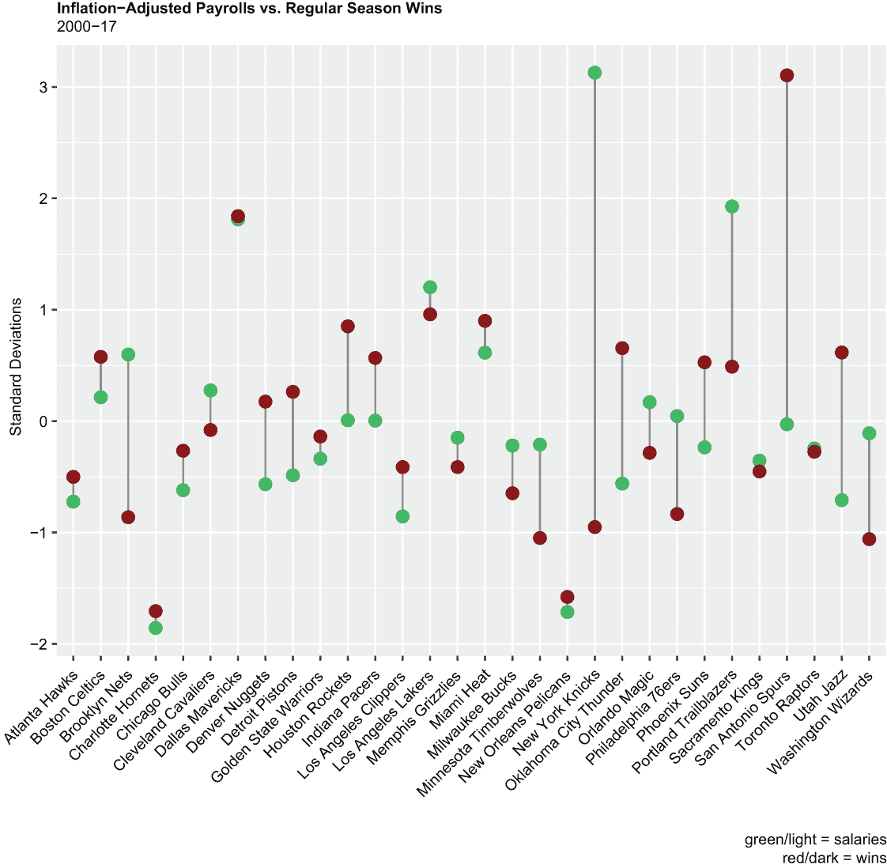
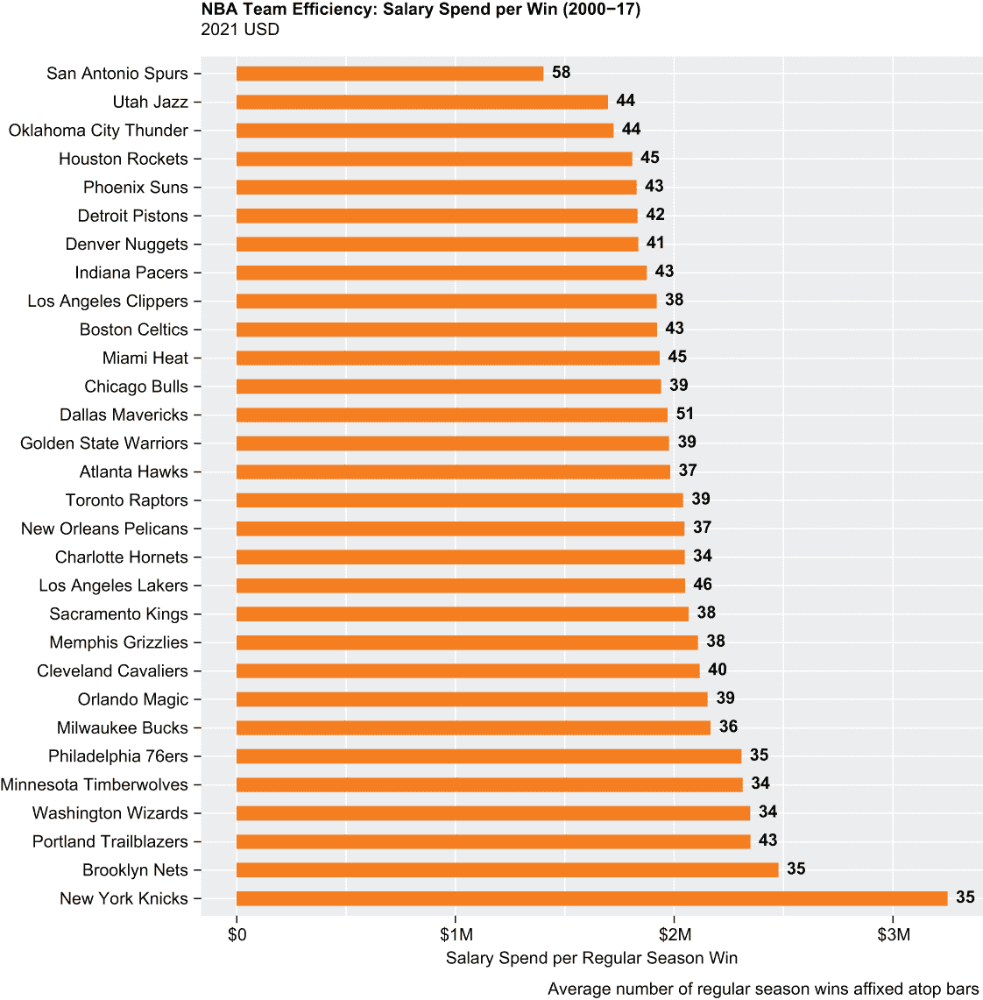
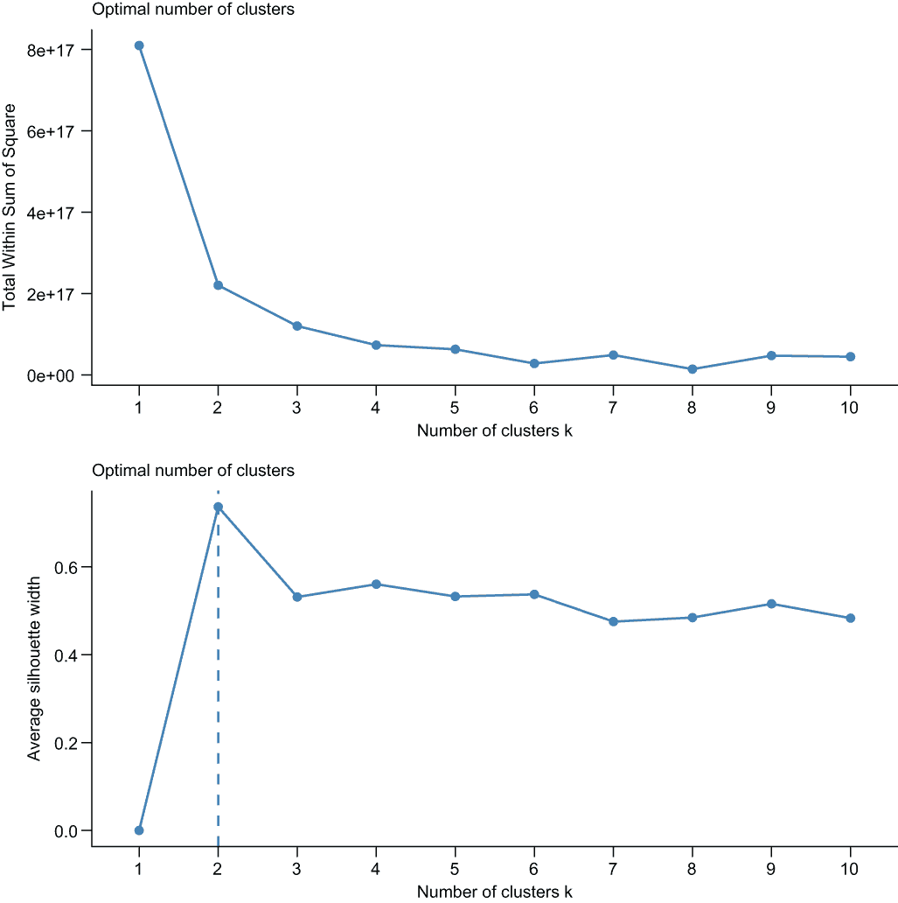
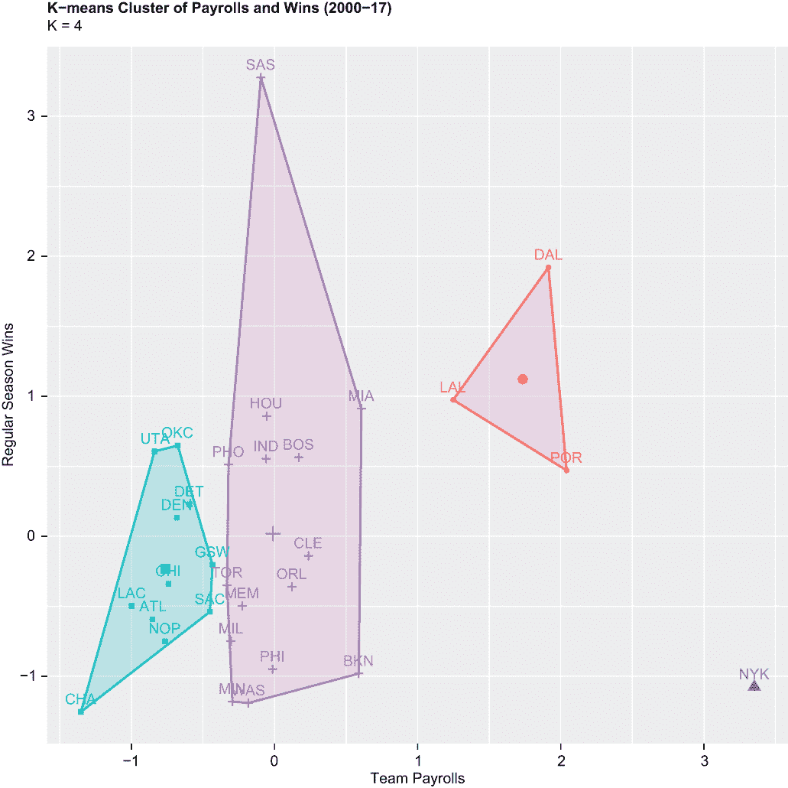
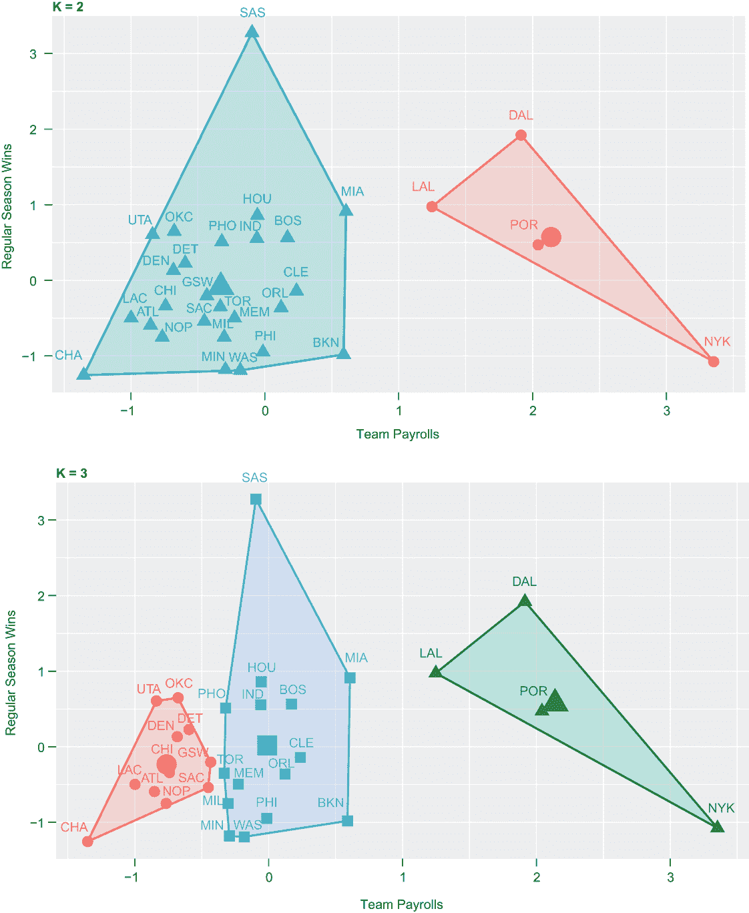
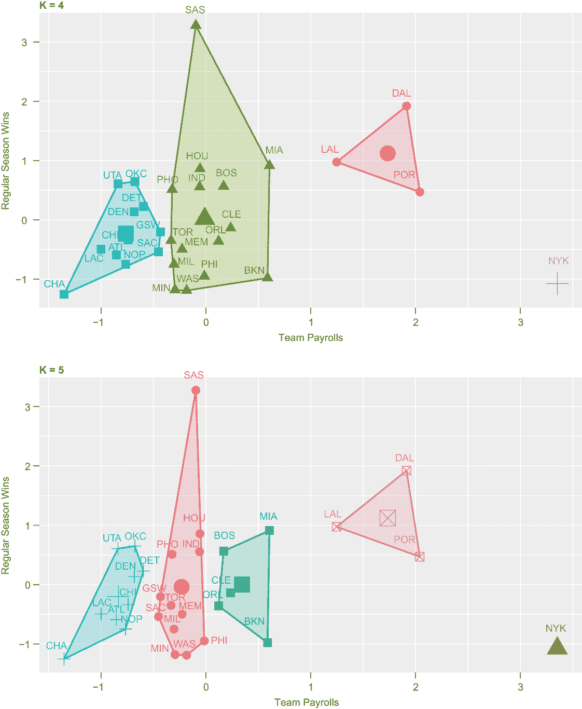
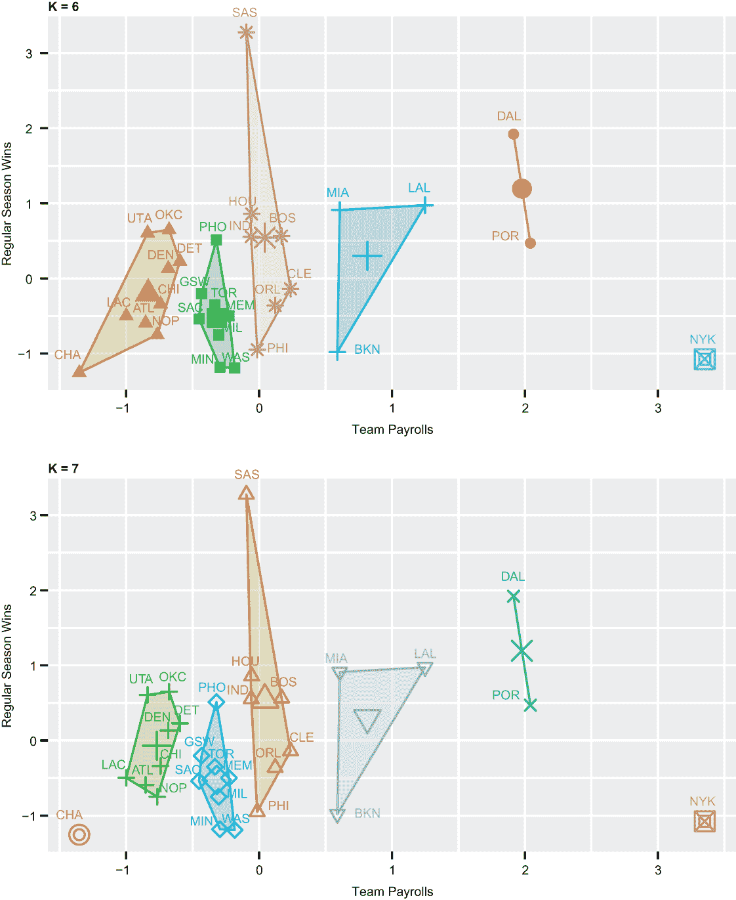

# 11 K-means 聚类

本章涵盖

+   开发 K-means 聚类算法

+   计算和可视化最佳聚类数量

+   理解标准差和计算 z 分数

+   创建克利夫兰点图

本章的主要目的是演示如何开发 K-means 聚类算法。K-means 聚类是一种流行的无监督学习方法，也是多变量分析技术，它允许围绕从数据中切割出的智能聚类或群体制定有目的的定制策略。无监督学习是一种学习方法，其目标是仅使用输入变量（因此没有目标或输出数据）在数据中找到模式、结构或关系。相比之下，监督学习方法使用输入和输出变量，通常用于做出预测。在前者中，你不知道你可能会寻找什么；在后者中，你已经弄清楚了。多变量分析是指用于同时分析和理解两个或更多变量之间关系的统计技术和方法。

K-means 聚类的最明显应用——也许是最被证实的应用——是客户细分。K-means 用于根据例如以前的购买、人口统计变量（如年龄、性别和家庭地址）和其他属性来细分客户。具有这种洞察力的公司可以为不同的客户群体开发不同的营销策略，这反过来可以推动销售并提高客户满意度评分。

K-means 聚类与层次聚类的最显著区别在于，K-means 需要预先确定聚类数量，用 *K* 表示，才能运行。尝试不同的聚类数量，甚至在一个固定的聚类数量上运行算法都是完全可以接受的。然而，有一些方法可以根据数据中的差异来确定最佳聚类数量。我们将演示其中两种方法，然后运行 K-means 算法并分析结果。我们甚至将尝试不同的 *K* 值，并评估结果的变化。

在此之前，我们将通过介绍标准差和 z 分数（K-means 聚类在二维平面上可视化，其中原始数据已被标准化）以及绘制一对不同数值变量（已转换为相同尺度）来为您打下基础。

在第十章中，我们考察了球队工资与常规赛胜利、季后赛出场和联赛冠军之间的关系，是在一个综合水平上的。而在本章中，我们将专注于球队层面的工资和胜利。首先，我们将加载与上一章开头相同的一组包，再加上一个用于 K-means 聚类的包。

## 11.1 加载包

我们的一个新包是`factoextra`，这是一个流行的包，用于提取和绘制多变量数据分析的结果，包括 K-means 聚类。我们将调用`factoextra`中的一个函数来计算和可视化最佳聚类数量，然后调用第二个函数来绘制我们的聚类。否则，我们的首要任务是连续调用四次`library()`函数来加载`factoextra`以及您已经熟悉的三个其他包：

```
library(tidyverse)
library(scales)
library(patchwork)
library(factoextra)
```

接下来，我们将导入并浏览我们的数据。

## 11.2 导入数据

在上一章中，我们简要地处理了一个名为 cap 的数据集，然后相当深入地处理了另一个名为 salaries 的数据集。在本章中，我们将仅使用 salaries 数据集。因此，我们的第二项任务是调用`readr read_csv()`函数（再次）导入薪资数据集：

```
salaries <- read_csv("salaries.csv")
```

关于薪资数据集，这里有一些提醒：

+   数据集包含 30 行——每行代表一个 NBA 球队。一些球队在 2000 年至 2017 年赛季之间（这是我们的数据的时间范围）搬迁并因此更改了名称。超音速队从西雅图搬到俄克拉荷马城，现在是俄克拉荷马城雷霆队；篮网队从新泽西搬到布鲁克林，现在被称为布鲁克林篮网而不是新泽西篮网。但数据仍然只对应每个球队的一个观测值；薪资数据集只包含当前球队名称。

+   数据集包含 73 列。除了变量`Team`外，薪资数据大致分为四个 18 列的部分，每个部分代表 2000 年至 2017 年间的 NBA 赛季：实际薪资（数值）、通货膨胀调整后的薪资（数值）、常规赛胜利（数值）和赛季结束状态（分类）。在本章中，我们将只关注调整后的薪资（这些是当按`Team`变量中的每个因素求和并按赛季分组时，等于一支球队的工资总额的球员薪资）和常规赛胜利。

+   由于夏洛特黄蜂队和新奥尔良鹈鹕队与 NBA 的其他球队不同，在 2000 年至 2017 年之间分别只打了 16 个和 15 个赛季，因此我们被迫整理薪资数据集并进行其他调整，否则这些调整是不必要的。您将很快看到这些调整。

在以下代码中，我们将薪资数据集通过两个`dplyr`函数进行管道处理——首先是通过`select()`函数来选择变量`Team`、`sa2017`（等于 2017 年的调整后薪资）和`w2017`（等于 2017 年的常规赛胜利）；其次是通过`glimpse()`函数，它返回薪资子集的转置视图：

```
salaries %>%
  select(Team, sa2017, w2017) %>%
  glimpse 
## Rows: 30
## Columns: 3
## $ Team   <chr> "Atlanta Hawks", "Boston Celtics", "Brooklyn Nets", "Ch...
## $ sa2017 <dbl> 102154590, 93381390, 78031675, 106764924, 100891769, 13...
## $ w2017  <dbl> 43, 53, 20, 36, 41, 51, 33, 40, 37, 67, 55, 42, 51, 26,...
```

在我们开始整理和分析数据之前，首先了解标准差和 z 分数是很重要的。

## 11.3 标准差和 z 分数的基础知识

理解标准差和 z 分数的基本知识将在这个章节以及更远的地方对我们大有裨益。在第二章中，我们提到，当数据呈正态分布时，大约 68% 的数据将位于均值的一个标准差范围内，正负；95% 将位于均值的两个标准差范围内；除了少数异常值外，所有数据都将位于均值的三个标准差范围内。在第七章中，我们进行了 Cohen 的 d 效应大小测试，它通过合并标准差来衡量两个均值之间的差异。因此，我们至少对标准差有一些先前的了解，但让我们更深入地探讨一下。

标准差是一种统计量，它量化了数值向量中的变异量或分散度。低标准差表明数据紧密围绕均值聚集；另一方面，高标准差表明数据，或大部分数据，分布较广。z 分数是一种统计量，它表示单个数据点与其分布均值的距离标准差数。

让我们创建一个小型数据框来演示。我们首先调用基础 R 的 `c()` 函数两次，创建包含五个值的两个数值向量 `var1` 和 `var2`。然后，我们将 `var1` 和 `var2` 传递给基础 R 的 `data.frame()` 函数，创建一个名为 df 的数据框——简单直接：

```
var1 <- c(2, 4, 6, 8, 10)
var2 <- c(1, 2, 3, 10, 14)
df <- data.frame(var1, var2)
print(df)
##   var1 var2
## 1    2    1
## 2    4    2
## 3    6    3
## 4    8   10
## 5   10   14
```

但通过手工计算或使用 Microsoft Excel 或 Google Sheets 等电子表格应用程序来计算标准差实际上需要六个步骤。让我们以 `var1` 为例：

1.  通过将 `var1` 中的值相加并除以观测值的数量来找到均值。这等于 6。

1.  通过从每个值中减去均值来找到每个值与均值的偏差。对于 `var1` 中的第一个值，偏差等于 2 - 6，或 -4。

1.  将每个偏差从均值平方，例如，-4 变为 16。

1.  通过将平方偏差相加来找到平方和。这等于 40。

1.  计算方差，它等于平方和除以 *n* - 1，其中 *n* 等于观测值的数量。这等于 40 ÷ 4，或 10。

1.  计算方差，取平方根得到标准差。这等于 3.16。

幸运的是，我们只需将 `var1` 和 `var2` 传递给基础 R 的 `sd()` 函数，即可得到标准差：

```
sd(df$var1)
## [1] 3.162278
sd(df$var2)
## [1] 5.700877
```

两个向量具有相同的均值，但 `var2` 的标准差几乎是 `var1` 的两倍。换句话说，当标准差较低时，均值可以指示样本或总体，但当标准差较高时，均值实际上可能是误导性的。

现在我们来计算`var1`和`var2`中每个值的 z 分数。要得到任何数据点的 z 分数，我们从值中减去平均值，然后将差值除以标准差。在 R 中，我们只需将`df`传递给`dplyr mutate()`函数，以创建一对新的变量`zvar1`和`zvar2`，并将它们附加到我们的数据框中：

```
df %>%
  mutate(zvar1 = (var1 - mean(var1)) / sd(var1),
         zvar2 = (var2 - mean(var2)) / sd(var2)) -> df
print(df) 
##   var1 var2      zvar1      zvar2
## 1    2    1 -1.2649111 -0.8770580
## 2    4    2 -0.6324555 -0.7016464
## 3    6    3  0.0000000 -0.5262348
## 4    8   10  0.6324555  0.7016464
## 5   10   14  1.2649111  1.4032928
```

例如，`var1`中的中间值等于`var1`的平均值，因此它的 z 分数等于 0；`var2`中的中间值 z 分数等于-0.53，这意味着它大约低于`var2`平均值的半个标准差。

标准差和 z 分数提供了我们从原始数据中无法总是获得的信息。波士顿凯尔特人在 2000 年至 2017 年赛季期间仅花费了超过 15 亿美元（B）的球员工资。这是一笔巨大的金额——或者不是吗？当我们计算 z 分数时，我们得到 0.21；换句话说，波士顿在 2000 年至 2017 年期间在球员工资上的总支出仅比联盟平均水平高出 0.21 个标准差——也就是说，几乎就是平均水平。

标准差对于进行无偏的多变量分析也非常关键。当评估一对数值变量之间的关联，而这些变量处于非常不同的尺度上——例如球队工资和常规赛胜利——在完成分析之前将两个变量放在同一尺度上绝对至关重要，以避免得到偏向于一个变量而牺牲另一个变量的结果。我们通过标准化数据和计算 z 分数来实现这一点。这正是我们分析的前半部分将要做的，再次计算我们的 K-means 聚类时也是如此。

## 11.4 分析

我们在第十章中已经确定，球队工资和常规赛胜利之间存在正相关关系，至少在 2000 年至 2017 年的 NBA 赛季之间是这样的；事实上，这种相关性是逐渐增加的——不是线性的，但总体上还是在增加——从 2006 年到 2017 年。此外，我们还进行了一次相关性测试，其 p 值低于 5%的阈值，因此表明球队工资和常规赛胜利之间的关联实际上在统计学上是显著的。

我们在这里的目的是进一步调查工资数据集，并两次可视化，直到球队层面，工资和胜利之间的关系。我们首先将展示如何创建所谓的`ggplot2`克利夫兰点图，其中工资和胜利通过点在同一标准化尺度上显示。然后，我们将向您展示如何创建`ggplot2`水平条形图，按常规赛每场胜利的工资金额排序，其中数据以原始格式呈现。

如您现在可能猜到的，我们的数据必须首先进行一些整理，以支持我们正在进行的分析。我们将在下一部分处理这些需求。

### 11.4.1 数据整理

如前所述，NBA 在 2000 年至 2004 年之间是一个 29 支球队的联赛，此后每个赛季都是 30 支球队；因此，需要对数据进行一些小的调整，以抵消缺失或不可用（NA）值，并确保我们返回公平和准确的结果。此外，原始数据本身不足以进行我们心中的分析，所以我们别无选择，只能以先前章节中不需要的方式转换和增强薪资。

夏洛特黄蜂队和新奥尔良鹈鹕队是薪资数据集中有两个缺失数据的球队，因为这两个球队在 2000 年至 2004 年之间并不是每年都存在。因此，我们即将创建三个主要相似的数据集子集从薪资：一个固定用于黄蜂队，另一个固定用于鹈鹕队，第三个固定用于剩余的 28 支球队。最后，我们将这些合并成一个数据集用于绘图和分析。

我们将从黄蜂队开始，它在我们的数据集中活跃在 18 个 NBA 赛季中的 16 个赛季。因此，我们调用 `dplyr filter()` 函数来对薪资数据集进行子集化，其中变量 `Team` 等于夏洛特黄蜂队，从而创建一个名为 cha 的新对象。

然而，在继续进行这些和其他数据处理操作之前，让我们通过将 `scipen = 999` 参数传递给基础 R 的 `options()` 函数来禁用科学记数法：

```
options(scipen = 999)
```

之后，我们将实际上重新启用科学记数法：

```
salaries %>%
  filter(Team == "Charlotte Hornets") -> cha
```

然后，我们调用 `dplyr select()` 函数来减少 cha 数据集，使其仅包括我们绝对需要的 33 列或变量——这些是 `Team`、16 个 *调整后* 薪资变量和 16 个常规赛胜利变量。我们故意排除了 2003 年和 2004 个赛季以及数据中的 NA 值：

```
cha %>%
  select(Team, sa2017:sa2005, sa2002:sa2000, w2017:w2005, 
         w2002:w2000) -> cha
```

接下来，我们调用 `mutate()` 函数来创建四个派生变量：

+   第一个变量 `sumSalaries` 等于第 2 至 17 个位置调整后薪资变量的总和。

+   第二个变量 `sumWins` 等于第 18 至 33 个位置常规赛胜利变量的总和。

+   第三个变量 `efficiency` 等于变量 2 至 17 的总和除以变量 18 至 33 的总和。因此，我们正在对 16 个赛季的调整后薪资进行求和，然后除以黄蜂队在相同 16 个赛季中的常规赛胜利次数。

+   第四个也是最后一个变量 `meanWins` 等于变量 18 至 33 的总和除以 16 个赛季，四舍五入到最接近的整数。因此，它正在计算并返回每个常规赛黄蜂队胜利的平均数。

以下是对以下代码块的一些说明：

+   `rowSums()` 函数是 R 的一个内置函数，它按行在数据集中对数值变量进行求和（cha 数据集只包含一行数据）。还有一个基础 R 的 `colSums()` 函数，它对列执行相同的操作。

+   方括号用于索引向量、矩阵、数组、列表或数据框；当它们专门用于从同一数据集中提取元素子集时，有时被称为提取运算符。

+   点 (`.`) 用作 cha 的替代，因此它们代表 cha 数据集的指针：

```
cha %>%
  mutate(sumSalaries = rowSums(.[2:17]),
         sumWins = rowSums(.[18:33]),
         efficiency = rowSums(.[2:17]) / rowSums(.[18:33]),
         meanWins = round(rowSums(.[18:33]) / 16)) -> cha
```

最后，我们将 cha 数据集通过管道传递给 `dplyr select()` 函数，创建一个新的对象 cha_final，它只包含变量 `Team` 以及我们刚刚创建的四个派生变量：

```
cha %>%
  select(Team, sumSalaries, sumWins, efficiency, meanWins) -> cha_final
print(cha_final)
##                Team sumSalaries sumWins efficiency meanWins
## 1 Charlotte Hornets  1124300389     549    2047906       34
```

然后，我们重复这个练习两次，一次用于新奥尔良鹈鹕队，再次用于 NBA 的其余部分，在这个过程中创建了两个新的数据集，nop_final 和 league_final。

league_final 数据集应包括每个 NBA 球队的记录，*除了*夏洛特黄蜂队和新奥尔良鹈鹕队。因此，我们调用逻辑运算符不等于 (`!=`) 来提取薪资数据集中变量 `Team` 不等于夏洛特黄蜂队或新奥尔良鹈鹕队的每个记录：

```
salaries %>%
  filter(Team == "New Orleans Pelicans") -> nop

nop %>%
  select(Team, sa2017:sa2003, w2017:w2003) -> nop

nop %>%
  mutate(sumSalaries = rowSums(.[2:16]),
         sumWins = rowSums(.[17:31]),
         efficiency = rowSums(.[2:16]) / rowSums(.[17:31]),
         meanWins = round(rowSums(.[17:31]) / 15)) -> nop

nop %>%
  select(Team, sumSalaries, sumWins, efficiency, meanWins) -> nop_final
print(nop_final)
##                   Team sumSalaries sumWins efficiency meanWins
## 1 New Orleans Pelicans  1150489652     562    2047135       37

salaries %>%
  filter(Team != "Charlotte Hornets" & 
           Team != "New Orleans Pelicans") -> league

league %>%
  select(Team, sa2017:sa2000, w2017:w2000) -> league

league %>%
  mutate(sumSalaries = rowSums(.[2:19]),
         sumWins = rowSums(.[20:37]),
         efficiency = rowSums(.[2:19]) / rowSums(.[20:37]),
         meanWins = round(rowSums(.[20:37]) / 18)) -> league

league %>%
  select(Team, sumSalaries, sumWins, efficiency, meanWins) -> league_final
print(league_final)
##                      Team sumSalaries sumWins efficiency meanWins
## 1           Atlanta Hawks  1331370577     672    1981206       37
## 2          Boston Celtics  1502338683     782    1921149       43
## 3           Brooklyn Nets  1572394745     635    2476212       35
## 4           Chicago Bulls  1350128086     696    1939839       39
## 5     Cleveland Cavaliers  1513579016     715    2116894       40
## 6        Dallas Mavericks  1793863099     911    1969114       51
## 7          Denver Nuggets  1359921484     741    1835252       41
## 8         Detroit Pistons  1374565213     750    1832754       42
## 9   Golden State Warriors  1401640477     709    1976926       39
## 10        Houston Rockets  1464712564     810    1808287       45
## 11         Indiana Pacers  1464126069     781    1874681       43
## 12   Los Angeles Clippers  1307071048     681    1919341       38
## 13     Los Angeles Lakers  1682631996     821    2049491       46
## 14      Memphis Grizzlies  1436199380     681    2108957       38
## 15             Miami Heat  1575463391     815    1933084       45
## 16        Milwaukee Bucks  1423272015     657    2166320       36
## 17 Minnesota Timberwolves  1424852176     616    2313072       34
## 18        New York Knicks  2034231301     626    3249571       35
## 19  Oklahoma City Thunder  1360935249     790    1722703       44
## 20          Orlando Magic  1494331249     694    2153215       39
## 21     Philadelphia 76ers  1471662937     638    2306682       35
## 22           Phoenix Suns  1420327702     777    1827964       43
## 23  Portland Trailblazers  1815095481     773    2348118       43
## 24       Sacramento Kings  1398565630     677    2065828       38
## 25      San Antonio Spurs  1458067975    1040    1401988       58
## 26        Toronto Raptors  1418504110     695    2041013       39
## 27              Utah Jazz  1333886430     786    1697057       44
## 28     Washington Wizards  1443384399     615    2346967       34
```

然后，我们调用内置的 `rbind()` 函数，通过行将 cha_final、nop_final 和 league_final 数据集组合成一个名为 final 的单一对象。`head()` 函数返回前六个观测值：

```
final <- rbind(cha_final, nop_final, league_final)
head(final)
##                   Team sumSalaries sumWins efficiency meanWins
## 1    Charlotte Hornets  1124300389     549    2047906       34
## 2 New Orleans Pelicans  1150489652     562    2047135       37
## 3        Atlanta Hawks  1331370577     672    1981206       37
## 4       Boston Celtics  1502338683     782    1921149       43
## 5        Brooklyn Nets  1572394745     635    2476212       35
## 6        Chicago Bulls  1350128086     696    1939839       39
```

现在我们已经将数据合并到一个单一的对象中，我们将调用 `mutate()` 函数两次来创建一对额外的派生变量，这两个变量都需要在数值向量中进行计算。变量 `zSalaries` 等于变量 `sumSalaries` 的 z 分数，有时也称为标准分数。z 分数表示数据点高于或低于分布平均值的多少个标准差；它是通过从原始数据中减去分布平均值并除以标准差来计算的。*如果*变量 `sumSalaries` 是正态分布的，我们可以预计大约 20 支 NBA 球队，即三分之二的联赛，将位于平均值的一个标准差内，也许除了一个或两个球队外，所有球队都位于两个标准差内。变量 `zWins` 等于变量 `sumWins` 的 z 分数。

后续对 `head()` 和 `tail()` 函数的调用返回前三个和最后三个观测值：

```
final %>%
  mutate(zSalaries = (sumSalaries - mean(sumSalaries)) / sd(sumSalaries),
         zWins = (sumWins - mean(sumWins)) / sd(sumWins)) -> final

head(final, n = 3)
## # A tibble: 3 × 7
##   Team                 sumSalaries sumWins efficiency meanWins 
##   <chr>                      <dbl>   <dbl>      <dbl>    <dbl>     
## 1 Charlotte Hornets     1124300389     549   2047906\.       34    
## 2 New Orleans Pelicans  1150489652     562   2047135\.       37    
## 3 Atlanta Hawks         1331370577     672   1981206\.       37    
##   zSalaries  zWins
##       <dbl>  <dbl>
## 1     -1.86  -1.71 
## 2     -1.71  -1.58 
## 3    -0.723 -0.501

tail(final, n = 3)
## # A tibble: 3 × 7
##   Team               sumSalaries sumWins efficiency meanWins 
##   <chr>                    <dbl>   <dbl>      <dbl>    <dbl>     
## 1 Toronto Raptors     1418504110     695   2041013\.       39    
## 2 Utah Jazz           1333886430     786   1697057\.       44    
## 3 Washington Wizards  1443384399     615   2346967\.       34    
##   zSalaries  zWins
##       <dbl>  <dbl>
## 1    -0.246 -0.276
## 2    -0.710  0.616
## 3     -0.110 -1.06
```

以犹他爵士队为例。顺便说一下，犹他爵士队曾经在新奥尔良进行主场比赛；当他们搬到盐湖城时，他们决定保留他们的名字“爵士”，这是大多数 NBA 球队在搬迁时所做的。犹他爵士队在 2000 年至 2017 年间在球员薪资上花费了超过 13 亿美元。在这 18 个赛季中，他们赢得了 786 场常规赛，平均每个赛季 44 场胜利。因此，他们为每场常规赛胜利花费了大约 170 万美元的球员薪资。他们在薪资上的总支出比联赛平均值低 0.71 个标准差，他们的常规赛胜利比平均值高 0.62 个标准差。

### 11.4.2 评估薪资和胜利

我们计划通过创建克利夫兰点图和水平条形图来评估 2000 年至 2017 年 NBA 赛季之间的球队工资和常规赛胜利。我们的分析将为我们下一步做好准备：K-means 聚类。

克利夫兰点图

我们的第一幅可视化，一个`ggplot2`克利夫兰点图，显示了所有 30 支 NBA 球队标准化变量之间的差异；换句话说，它显示了投资与回报之间的接近程度或距离（见图 11.1）。本书的一个目标是通过`ggplot2`图形包介绍一些可能不在主流之外的可视化，讨论它们何时最好展示，并演示如何创建它们。由著名统计学家和数据可视化专家威廉·S·克利夫兰设计的克利夫兰点图是下一个可视化，如下所述：

+   NBA 的 30 支球队按字母顺序排列在 x 轴上。标签以 45 度角倾斜，并水平对齐在图表下方。

+   我们的 y 轴度量是标准差，或 z 分数。

+   `geom_segment()`函数绘制了 30 条垂直于 x 轴的线，每条线连接由两个`geom_point()`函数调用创建的一对点或点，从 y 等于`zSalaries`开始，到 y 等于`zWins`结束。

+   代表变量`zSalaries`的点以深色调绘制，而代表变量`zWins`的点以浅色调绘制。所有点的大小都增加了`ggplot2`默认值的 3 倍。

+   标题中的 `\n` 作为一个换行符。默认情况下，标题放置在右下角，并且是右对齐的。



图 11.1 在标准化两个变量后，比较通货膨胀调整后的工资和常规赛胜利

下面是我们克利夫兰点图的代码块：

```
p1 <- ggplot(final) +
  geom_segment(aes(x = Team, xend = Team, 
                   y = zSalaries, yend = zWins), color = "grey50") +
  geom_point(aes(x = Team, y = zSalaries), color = "springgreen3", 
             size = 3) +
  geom_point(aes(x = Team, y = zWins), color = "darkred", size = 3) +
  labs(title = "Inflation-Adjusted Payrolls vs. Regular Season Wins",
       subtitle = "2000-17", 
       x = "", 
       y = "Standard Deviations", 
       caption = "green/light = salaries\nred/dark = wins") + 
  theme(plot.title = element_text(face = "bold")) +
  theme(axis.text.x = element_text(angle = 45, hjust = 1))
print(p1)
```

显然，如果没有首先对非常不同的度量进行标准化，我们就无法绘制克利夫兰点图。茎的长度表示球员薪资与胜利之间的匹配程度如何；这是正确解读我们图表的第一个线索。

第二个线索是理解每个茎的绘制方向；提醒一下，茎是从`zSalaries`绘制到`zWins`的。因此，当茎是上升的，这意味着常规赛胜利的回报超过了球队在球员薪资上的投资。当茎相反地下降时，当然意味着正好相反。

结果表明，17 支球队从各自的投资中获得了回报，但 13 支球队没有。这些总数很容易通过将最终数据集两次传递到`dplyr tally()`函数来计算，一次是返回`zWins`大于`zSalaries`的 NBA 球队数量，再次是`zWins`小于`zSalaries`。

```
final %>%
  tally(zWins > zSalaries)
##    n
## 1 17
final %>%
  tally(zWins < zSalaries)  
##    n
## 1 13
```

当调用`dplyr filter()`函数对最终数据集进行子集化，以 17 个观察值中`zWins`大于`zSalaries`的情况，以及调用`dplyr summarize()`函数来计算`zWins`和`zSalaries`之间的均值和中位数差异时，我们看到平均差异等于 0.68 个标准差，而中位数差异等于 0.44 个标准差：

```
final %>%
  filter(zWins > zSalaries) %>%
  summarize(mean = mean(zWins - zSalaries),
            median = median(zWins - zSalaries))
##        mean    median
## 1 0.6776743 0.4434517
```

平均值大于中位数，这是因为像休斯顿火箭队、犹他爵士队以及尤其是圣安东尼奥马刺队这样的队伍；在 2000 年至 2017 年期间，圣安东尼奥在球员薪资上的投资大致等于联盟平均水平，但他们的常规赛总胜场数比平均水平高出三个标准差以上。

当我们翻转变量`zWins`和`zSalaries`时，我们看到均值和中位数几乎相差半个标准差，均值大于中位数：

```
final %>%
  filter(zSalaries > zWins) %>%
  summarize(mean = mean(zSalaries - zWins),
            median = median(zSalaries - zWins))
##        mean    median
## 1 0.8861895 0.4552426
```

这在一定程度上也适用于布鲁克林篮网队，而在很大程度上适用于纽约尼克斯队。尼克斯队与马刺队正好相反——他们的年度工资总额比 NBA 平均水平高出三个标准差以上，而他们的常规赛总胜场数比平均值低大约一个标准差。

否则，仅通过查看我们的图表，我们可以看到投资和回报非常一致——变量`zWins`和`zSalaries`之间的绝对差异小于 0.5 个标准差，对于大约一半的 NBA 球队来说。除去明显的异常值（马刺队和尼克斯队），我们第十章的结论无疑会更加明确。

水平条形图

在我们的第二次审视中，总薪资除以胜场数在`ggplot2`水平条形图中可视化，效率，即 2000 年至 2017 年每场常规赛投入球员薪资的效率，从上到下递减（见图 11.2）：

+   `reorder()`和`coord_flip()`函数在这里几乎是协同工作的。如果我们原本的意图是创建一个*垂直*条形图，我们的结果将按照效率变量从左到右递减的顺序排序，但通过将我们的图表翻转成水平布局，我们得到顶部（较低且较好）的效率数值和底部（较高且较差）的效率数值。注意，x 轴和 y 轴是图表的一部分；因此，它们也会翻转。

+   `scale_y_continuous()`函数加上`scales`包中的`label_dollar()`和`cut_short_scale()`函数将我们的 y 轴标签从七位数转换为$1M、$2M 和$3M。

+   `geom_text()`函数将变量`meanWins`的值附加到条形旁作为标签；这些标签可以通过`vjust`和`hjust`参数分别垂直或水平调整。此外，我们还在`labs()`函数中添加了一个标题作为另一个参数，以指出这些数字代表每个球队常规赛平均胜场数的计数。



图 11.2：2000 年至 2017 年间，每场常规赛胜利的球员薪资支出，从最高效到最低效进行排序

现在，这是代码：

```
p2 <- ggplot(final, aes(x = reorder(Team, -efficiency), y = efficiency)) + 
  geom_bar(stat = "identity", width = .5, fill = "darkorange1") + 
  coord_flip() +
  labs(title = "NBA Team Efficiency: Salary Spend per Win (2000-17)", 
       subtitle = "2021 USD", 
       x = "", 
       y = "Salary Spend per Regular Season Win", 
       caption = "Average number of regular season wins 
       affixed atop bars") + 
  scale_y_continuous(labels = 
                       label_dollar(scale_cut = cut_short_scale())) +
  geom_text(aes(label = meanWins, fontface = "bold", 
                vjust = 0.3, hjust = -0.4)) +
  theme(plot.title = element_text(face = "bold"))
print(p2)
```

从我们的排序条形图中，我们可以得出以下结论：

+   圣安东尼奥马刺平均每赛季的常规赛胜利数显著高于其他任何球队，并且每场胜利的球员薪资支出不到 150 万美元。顺便说一句，马刺在 2003 年至 2014 年期间赢得了四次联赛冠军。

+   另一方面，纽约尼克斯为每场常规赛胜利支付的球员薪资是圣安东尼奥马刺的两倍多，但平均每赛季只赢得 35 场比赛。尼克斯自 1973 年以来就没有赢得过 NBA 冠军。

+   再次强调，除去我们数据中的这两个相当明显的异常值，我们关于薪资和胜利的第十章结论将更加令人信服。

+   在圣安东尼奥马刺和纽约尼克斯之间，我们在效率和平均每赛季胜利数上并没有看到太大的差异。

+   然而，在我们的图表上半部分的球队，大部分情况下，平均每赛季的常规赛胜利数比下半部分的球队多。上半部分的 15 支球队中只有 4 支每赛季平均胜场数少于 40 场，下半部分的球队中只有 3 支每赛季平均胜场数至少为 40 场。

毫无疑问，薪资会影响胜利，但当你看到这样的结果时，你也必须考虑到其他因素，例如合格的管理（或不合格的管理）以及可能的好运（或坏运），这些也是相关的。

接下来，我们将根据球队的薪资和常规赛胜利数将 NBA 的 30 支球队划分为类似和不同的聚类。

## 11.5 K 均值聚类

K 均值聚类是一种流行的无监督学习算法，用于数据分段。以下是基本原理：

+   目标是将整个数据集划分为不同的且因此非重叠的聚类，其中每个数据点都被分配到具有最近平均值的聚类中，即质心。聚类的数量等于*K*。因此，它的目标是使簇内方差最小化，使簇间方差最大化。

+   K 均值算法通过迭代方式运行，随机初始化*K*个质心，然后交替进行两个步骤——(1)将每个数据点分配或重新分配到最近的质心，以及(2)重新计算质心，作为所有分配和重新分配给它们的点的平均值——直到收敛。收敛发生在质心变得固定或达到预定义的最大迭代次数时。虽然不是强制要求设置最大迭代次数，但这是一个良好的实践。

+   与层次聚类类似，数据点和质心之间的距离通常是通过应用欧几里得距离度量来计算的，它衡量的是二维空间中一对数据点之间的直线距离（详细信息请参阅第三章）。

+   与层次聚类不同，簇的数量，或 *K*，必须提前确定。选择 *K* 并非总是直截了当。例如，如果你是一家百货公司的营销团队负责人，而且你只有足够的资源来开发和维护两个广告活动，那么对于 *K* 来说只有一个选择。同样，如果你在一家债务收集机构工作，并且一开始就决定超过三个策略来处理三个违约客户细分是不可行的，那么 *K* 不能超过三个。但如果 *K* 可以是几乎任何合理和逻辑的数字，那么有几种方法可以用来计算可能最优的簇数量。我们将演示其中两种方法。总的来说，簇太少可能会过度简化数据，不会增加太多价值，但簇太多可能会导致过度拟合。

+   K-means 算法快速、简单且可扩展，并且有大量的应用场景。警察局可以将犯罪行为类别（暴力犯罪、财产犯罪、白领犯罪、有组织犯罪和同意或无受害者犯罪）与地理空间点关联起来，识别任何模式，并据此部署警力；百货公司可以利用人口统计属性和购买历史来分析其客户，以制定定制化的营销策略；债务收集机构可以根据客户的未偿还余额和信用历史来细分客户，以实施定制化的收集策略；或者国家档案馆的职员可以使用 K-means 算法，通过标签、主题和内容对文档进行分类。

+   但是，通常认为 K-means 在变量呈正态分布时返回最佳结果。然而，NBA 的薪资和常规赛胜利并不呈正态分布，所以我们将测试这一点，并在稍后展示。

我们的结果将被绘制在一个单一的可视化中，以球队薪资作为 x 轴变量，常规赛胜利作为 y 轴变量。K-means 算法自动将原始数字转换为 z 分数。你会看到结果与我们的克利夫兰点图非常吻合，除了所有 30 支 NBA 球队都被分配到一个或另一个簇中。但首先，我们还有一些进一步的数据处理要处理。

### 11.5.1 更多数据处理

回到夏洛特黄蜂队。我们首先将之前创建的 cha 数据集通过 `dplyr mutate()` 函数处理两次，以创建一对派生变量。第一个派生变量被称为 `salarytotal`，它仅仅是夏洛特队 2000 年至 2002 年和 2005 年至 2017 年间调整后的工资总和，从第 2 列到第 17 列。第二个派生变量被称为 `wintotal`，它是夏洛特队常规赛胜利总数的总和，从第 18 列到第 33 列。结果被转换到一个新的对象 cha_kmeans 中：

```
cha %>%
  mutate(salarytotal = rowSums(.[2:17]),
         wintotal = rowSums(.[18:33])) -> cha_kmeans
```

为了使夏洛特黄蜂队与在 2000 年至 2017 年之间每个赛季都参加的 NBA 球队保持一致，我们将派生的变量`salarytotal`和`wintotal`增加 11%（黄蜂队“错过了”两个赛季，即大约 11%的包含在薪资数据集中的 18 个 NBA 赛季）。这绝对不是一门精确的科学，但它将比什么都不做产生更合理、更准确的结果；再次看看我们的克利夫兰点图，我们在那里保留了黄蜂队和鹈鹕队。由于`wintotal`不应包含任何分数或小数部分，我们调用基础 R 的`round()`函数将`wintotal`结果四舍五入到最接近的整数：

```
cha_kmeans$salarytotal <- cha_kmeans$salarytotal * 1.11 
cha_kmeans$wintotal <- round(cha_kmeans$wintotal * 1.11)
```

然后，我们通过调用`select()`函数来降低`cha_kmeans`的维度，只包括我们绝对需要的三个变量，以启用我们即将到来的 K-means 聚类算法——`Team`、`salarytotal`和`wintotal`：

```
cha_kmeans %>%
  select(Team, salarytotal, wintotal) -> cha_kmeans
```

然后，我们重复这个完全相同的练习两次，首先针对新奥尔良鹈鹕队，然后针对剩余的 NBA 球队。由于鹈鹕队“错过了”三个赛季，我们将它们的`salarytotal`和`wintotal`总和增加了 17%。因此，我们有了两个新的数据对象，`nop_kmeans`和`league_kmeans`：

```
nop %>%
  mutate(salarytotal = rowSums(.[2:16]),
         wintotal = rowSums(.[17:31])) -> nop_kmeans

nop_kmeans$salarytotal <- nop_kmeans$salarytotal * 1.17
nop_kmeans$wintotal <- round(nop_kmeans$wintotal) * 1.17

nop_kmeans %>%
  select(Team, salarytotal, wintotal) -> nop_kmeans

league %>%
  mutate(salarytotal = rowSums(.[2:19]),
         wintotal = rowSums(.[20:37])) -> league_kmeans

league_kmeans %>%
  select(Team, salarytotal, wintotal) -> league_kmeans
```

在接下来的代码块中，我们首先调用基础 R 的`rbind()`函数，将`cha_kmeans`、`nop_kmeans`和`league_kmeans`数据集合并成一个名为`final_kmeans`的单个对象。然后，我们调用`select()`函数对`final_kmeans`进行子集化，基于变量`salarytotal`和`wintotal`，从而删除`Team`变量。紧接着，我们调用基础 R 的`trunc()`函数，将变量`wintotal`从浮点数转换为整数。最后，我们调用`print()`函数来返回整个`final_kmeans`数据集：

```
final_kmeans <- rbind(cha_kmeans, nop_kmeans, league_kmeans)

final_kmeans %>%
  select(salarytotal, wintotal) %>%
  trunc(final_kmeans$wintotal) -> final_kmeans
print(final_kmeans)
##    salarytotal wintotal
## 1   1247973431      609
## 2   1346072892      657
## 3   1331370577      672
## 4   1502338683      782
## 5   1572394745      635
## 6   1350128086      696
## 7   1513579016      715
## 8   1793863099      911
## 9   1359921484      741
## 10  1374565213      750
## 11  1401640477      709
## 12  1464712564      810
## 13  1464126069      781
## 14  1307071048      681
## 15  1682631996      821
## 16  1436199380      681
## 17  1575463391      815
## 18  1423272015      657
## 19  1424852176      616
## 20  2034231301      626
## 21  1360935249      790
## 22  1494331249      694
## 23  1471662937      638
## 24  1420327702      777
## 25  1815095481      773
## 26  1398565630      677
## 27  1458067975     1040
## 28  1418504110      695
## 29  1333886430      786
## 30  1443384399      615
```

我们最终的数据处理操作是调用基础 R 的`rownames()`函数，将`final_kmeans`数据集中的数字行名替换为表示所有 30 支 NBA 球队的三个字母缩写。我们的数据按夏洛特（CHA）和纽奥尔良（NOP）排在最前面，然后按剩余的 28 支球队进行字母排序。当然，如果结果包含球队缩写而不是数字，那么它们将更容易解释：

```
rownames(final_kmeans) <- c("CHA", "NOP", "ATL", "BOS", "BKN", "CHI",
                            "CLE", "DAL", "DEN", "DET", "GSW", "HOU",
                            "IND", "LAC", "LAL", "MEM", "MIA", "MIL",
                            "MIN", "NYK", "OKC", "ORL", "PHI", "PHO",
                            "POR", "SAC", "SAS", "TOR", "UTA", "WAS")
```

现在，让我们继续进行我们的分析。

### 11.5.2 K-means 聚类

与我们在第三章中创建的层次聚类算法不同，K-means 算法首先要求我们指定要生成的聚类数量。随机指定一个聚类数量，称为*K*，或者尝试不同的聚类数量并不罕见；然而，我们将演示两种生成最佳聚类数量的方法，并在完成这两种方法之后决定*K*：

计算最佳聚类数量

第一种方法通常被称为肘部方法，或者更技术性地，称为簇内平方和法。我们绘制一种称为碎石图的线形图，它在 x 轴上显示簇数，在 y 轴上显示簇内平方和（也称为簇内方差）。它计算并重新计算每个数据点与其分配的簇之间的距离平方和，通过增加簇数来最小化每次迭代的和。方差通常以递减的速度下降，直到出现递减回报，这时增加 *K* 的额外增加无法进一步降低簇内方差。通常，这就是图表弯曲的地方——肘部点——我们应该接受这个作为最优簇数。

然而，肘部方法比客观方法更为主观；不幸的是，碎石图并不总是显示一个明确的肘部点。事实上，肘部点和我们观察到对于 *K* 的递减回报可能并不相同。这就是第二种方法，被称为平均轮廓方法，发挥作用的地方。它首先计算每个数据点的轮廓系数，这是一个介于 -1 和 +1 之间的数字，基于数据点与其所在簇内其他数据点的相似度，以及数据点与最近簇中每个数据点的平均相似度。轮廓系数是通过取这些相似度的差值，并将其除以这两个数中的最大值来计算的。当大多数数据点具有高，或者至少是正的轮廓系数时，聚类配置停止；相反，低轮廓系数表明簇计数过低或过高，从而触发额外的迭代。我们得到一个显示 x 轴上的簇数和 y 轴上的轮廓系数的图。它还揭示了 *K* 的一个 *精确* 的最优值。

在下一个代码块中，我们两次调用 `factoextra` 包中的 `fviz_nbclust()` 函数来计算和可视化最优簇计数，首先使用簇内平方和法，然后使用轮廓法。`fviz_nbclust()` 函数接受以下三个参数：数据源、聚类算法（它不一定是 K-means）和方法，这些都是相当简单的。事实上，`fviz_nbclust()` 函数自动为两个图插入标签，并将第二个图的 y 轴刻度默认设置为基于我们偏好全数字数值而不是科学记数法。由于平方和值是很大的数字，我们首先通过将 `scipen` 参数设置为 `000` 重新启用科学记数法，然后连续调用 `fviz_nbclust()`：

```
options(scipen = 000)
p3 <- fviz_nbclust(final_kmeans, kmeans, method = "wss") 
p4 <- fviz_nbclust(final_kmeans, kmeans, method = "silhouette") 
```

`patchwork`包与这些图表的配合效果与`ggplot2`可视化一样好。因此，我们调用`plot_layout()`函数将这两个图表组合成一个单一的图形对象，将图表`p3`显示在`p4`之上（见图 11.3）：

```
p3 + p4 + plot_layout(ncol = 1)
```



图 11.3 展示了两种关于最优聚类数量的解决方案，其中顶部的图表是碎石图，代表簇内平方和法，底部的图表代表轮廓法

当轮廓法（图 11.3 底部）返回一个明确的、或无歧义的、最优聚类数量时，簇内平方和法（图 11.3 顶部的碎石图）返回的聚类数量则开放于解释。一方面，平方和的最陡下降出现在一和两个聚类之间，因此表明两个聚类将是最佳选择；另一方面，图表弯曲，五和六个聚类之间的斜率接近 0，这更有说服力地表明六个聚类可能才是最佳选择。

运行算法

我们将折中处理，并继续使用四个聚类，同时考虑到小聚类数量有时会存在过度简化的风险。然后我们调用`kmeans()`函数，这是 R 基础包的一部分，来构建我们的四个聚类，并根据最终`kmeans`变量`salarytotal`和`wintotal`将 NBA 的 30 支球队分组。`kmeans()`函数*需要*两个参数：数据集（final_kmeans）和期望的聚类数量（4），也称为*K*。

我们还将向`kmeans()`函数传递两个*可选*参数：`iter.max`和`nstart`。`iter.max`参数表示算法在返回任何结果之前应该运行的次数。请记住，如果允许，`kmeans()`函数会经历几个迭代步骤，并返回一个配置，其中数据与各自质心的总平方和最小化——即聚类的中心位置。最佳配置可能在仅运行一次后就能获得，也可能不会——仅运行一次算法可能会留下更多最佳配置。因此，最好启用多次迭代，这是默认设置；在这里，我们告诉 R 迭代算法 25 次。

`nstart`参数表示用于初始化算法的随机数据集的数量。我们指定了四个聚类，并将`nstart`参数设置为`25`。因此，每次算法运行时，R 将提取四组数据，每组一个聚类，总共 25 次。`print()`函数返回结果：

```
k <- kmeans(final_kmeans, 4, iter.max = 25, nstart = 25) 
print(k)
## K-means clustering with 4 clusters of sizes 15, 1, 3, 11
##
## Cluster means:
##   salarytotal wintotal
## 1  1366605768 700.8667
## 2  2034231301 626.0000
## 3  1763863525 835.0000
## 4  1490569128 746.0000
##
## Clustering vector:
## CHA NOP ATL BOS BKN CHI CLE DAL DEN DET GSW HOU IND LAC LAL MEM MIA MIL 
##   1   1   1   4   4   1   4   3   1   1   1   4   4   1   3   4   4   1 
## MIN NYK OKC ORL PHI PHO POR SAC SAS TOR UTA WAS 
##   1   2   1   4   4   1   3   1   4   1   1   4 
##
## Within cluster sum of squares by cluster:
## [1] 3.519544e+16 0.000000e+00 1.012325e+16 2.254863e+16
## (between_SS / total_SS =  91.6 %)
##
## Available components:
## 
## [1] "cluster"      "centers"      "totss"        "withinss"    
## [5] "tot.withinss" "betweenss"    "size"         "iter"        
## [9] "ifault"   
```

这给我们以下信息：

+   分配给每个聚类的球队数量（1，15，11，3）。

+   每个聚类的`salarytotal`和`wintotal`均值，这些也代表了每个聚类的中心点。返回的数据按`wintotal`变量升序排序。

+   每个球队的聚类分配，其中每个聚类由 1 到 4 之间的数字标识。每个 NBA 球队都被分配到一个聚类中。

我们通过调用`factoextra`包中的`fviz_cluster()`函数，以`ggplot2`的外观和感觉可视化这些结果（见图 11.4）。除非另有说明，否则图例会自动添加到图的右侧（我们决定不包含图例）。我们还可以选择添加自己的标题和副标题、x 轴和 y 轴标签，以及将字体改为粗体：

```
p5 <- fviz_cluster(k, data = final_kmeans,
             main = "K-means Cluster of Payrolls and Wins (2000-17)",
             subtitle = "k = 4",
             xlab = "Team Payrolls",
             ylab = "Regular Season Wins",
             font.main = "bold") + 
      theme(legend.position = "none")
print(p5)
```



图 11.4 我们 K-means 聚类的可视化，其中 K 等于 4。聚类基于球队工资和常规赛胜利次数的组合，其中每个变量都已标准化。

x 轴和 y 轴上的标签表示分布均值的标准差数（你可以通过我们的克利夫兰点图进行交叉验证）。以下是我们从 K-means 算法及其可视化中可以得出的结论：

+   圣安东尼奥马刺队（SAS），据我们估计，在 2000 年至 2017 年期间是 NBA 最有效的球队，其常规赛胜利次数比联赛平均水平高出三个标准差以上，而其实际总工资却低于平均水平。然而，他们与篮网队而不是湖人队或小牛队聚集在一起。

+   纽约尼克斯队（NYK）独自在一个“聚类”中，因为他们的常规赛胜利次数比联赛平均水平低一个标准差以上，而他们的工资却比平均水平高三个标准差以上。你可能认为篮网队应该与尼克斯队对齐，而不是与圣安东尼奥队。

+   波士顿凯尔特人队（BOS）、迈阿密热火队（MIA）、洛杉矶湖人队（LAL）和达拉斯小牛队（DAL）在胜利次数和工资方面与联赛平均水平大致相等。这四支球队在 2000 年至 2013 年之间共赢得了 10 个 NBA 总冠军。

+   在 2000 年至 2017 赛季期间常规赛胜利次数最少的球队——夏洛特黄蜂队（CHA）、明尼苏达森林狼队（MIN）、华盛顿奇才队（WAS）、费城 76 人队（PHI）、布鲁克林篮网队（BKN）和密尔沃基雄鹿队（MIL）——总的来说，他们的工资与联赛平均水平非常接近，当然，他们的常规赛胜利次数在联赛平均水平或以下一个标准差。

+   我们的数据聚类在垂直方向上比在水平方向上更密集；也就是说，可以说在变量“球队工资”等于均值以上一个标准差的地方画了一条线。

请记住，`salarytotal` 和 `wintotal` 都不是正态分布的。当绘制的变量均匀地分布在它们的平均数周围时，K-means 算法工作得最好——它仍然可以正常工作。Shapiro-Wilk 测试返回一个 p 值，告诉我们一个数值变量是否服从正态分布。我们的零假设是正态分布；因此，如果 Shapiro-Wilk 返回的 p 值低于 5%，我们会拒绝该假设。话虽如此，我们将变量 `salarytotal` 和 `wintotal` 传递给基础 R 的 `shapiro.test()` 函数：

```
shapiro.test(final_kmeans$salarytotal) 
##  Shapiro-Wilk normality test
##
## data:  final_kmeans$salarytotal
## W = 0.82724, p-value = 0.0002144

shapiro.test(final_kmeans$wintotal)
##  Shapiro-Wilk normality test
##
## data:  final_kmeans$wintotal
## W = 0.89706, p-value = 0.007124
```

两次测试的 p 值都低于 5% 的显著性阈值；因此我们会两次拒绝零假设，并得出结论，这两个变量都不服从正态分布。这或许可以解释结果中的异常。

尝试其他 *K* 值的实验

而不是仅仅以一个 *K* 等于 4 的 K-means 算法结束，接下来让我们迭代我们的代码并测试 *K* 从 2 到 7 的情况。我们的结果——仅仅是结果，没有代码——将在接下来的几页中展示（见图 11.5a 至 11.5c）。



图 11.5a 当聚类数量，即 *K*，从 2 开始到 7 结束时的 K-means 聚类



图 11.5b 当聚类数量，即 *K*，从 2 开始到 7 结束时的 K-means 聚类



图 11.5c 当聚类数量，即 *K*，从 2 开始到 7 结束时的 K-means 聚类

在结果中，请注意以下几点：

+   当 *K* 等于 2 时，K-means 将工资总额低于 NBA 平均数一个标准差以下的所有数据点投入一个聚类，而工资总额高于联盟平均数一个标准差以上的所有数据点投入另一个聚类。

+   当 *K* 等于 3 时，之前两个较大的聚类中的最大一个被分为两组。在新聚类中，每个数据点的 `salarytotal` z 分数都低于平均数，而 `wintotal` z 分数低于联盟平均数一个标准差。

+   当 *K* 等于 4 时，算法仅仅将纽约尼克斯队放入了自己的一个组中。

+   当 *K* 等于 5 时，之前绘制的工资总额低于平均数一个标准差以下的两个聚类被划分为三个聚类。这三个聚类中的每一个数据点的 `wintotal` z 分数都低于平均数一个标准差。

+   当 *K* 等于 6 时，洛杉矶湖人队（LAL）与达拉斯小牛队（DAL）和波特兰开拓者队（POR）分开，并被放入一个包含两支工资总额低于平均数一个标准差以下的球队的聚类中。

+   当 *K* 等于 7 时，夏洛特黄蜂队，其工资水平低于联赛平均值的超过一个标准差，常规赛胜利次数也低于平均值超过一个标准差，被放入他们自己的组中。总的来说，K-means 算法在指令迭代添加一个新簇时，主要通过工资而不是胜利次数来分割数据。

K-means 算法绝对可以包括不止两个属性；然而，你一次只能可视化两个变量。

在下一章中，我们将进一步通过衡量团队层面的不平等程度来探索球员工资，并将这些结果与胜利和失败相关联。

## 摘要

+   无论你的用例是什么，无论你处理的是什么类型的数据——客户、犯罪行为、文件，无论什么——你都可以通过遵循这些确切步骤来创建一个 K-means 算法。

+   我们通过引入一对称为簇内平方和与平均轮廓的方法，展示了如何首先根据数据中的差异生成最佳簇数量。前者是这两种方法中最受欢迎的，但后者没有留下任何解释的空间。两者都是可以接受的。

+   K-means 的优点是它速度快、容易使用，并且可以扩展到大型数据集；缺点是它最好在变量围绕其各自均值呈正态分布时工作——而我们处理的这对变量并不符合这种情况。

+   我们对标准差和 z 分数的分析旨在为你准备随后的分析。再次强调，标准差是数值向量的变异性的定量度量，或称为分散度；z 分数是一个度量，等于任何数值向量中的数据点相对于其分布均值的上方或下方标准差的数目。

+   我们之前已经指出，R 是数据可视化（以及其他方面）中的最佳编程语言。其中一个原因是它可以创建的图表范围广泛，尤其是在 `ggplot2` 图形包的帮助下。我们在前面的章节中展示了如何开发主流之外的图表，例如桑基图和棒棒糖图。在这里，我们展示了如何创建克利夫兰点图，它不仅外观和感觉都很流畅，而且包含大量易于理解的信息。

+   至于我们的结果，工资和胜利在联赛中几乎一半的球队中相当好地或非常好地一致。

+   我们发现了进一步的支持我们第十章结论的证据，即工资对常规赛胜利有显著影响。

+   我们 K-means 算法产生的簇既有趣又令人惊讶。“最佳”球队，拥有最聪明的球团——湖人队、小牛队、马刺队、火箭队、凯尔特人队、热火队和爵士队——散布在我们四个簇中的三个中。你也可以考虑将马刺队和篮网队放在同一个簇中，或者犹他队与黄蜂队混合。

+   然而，纽约尼克斯队处于他们自己的集群（至少当 *K* 等于 4 时是这样），这完全说得通。
