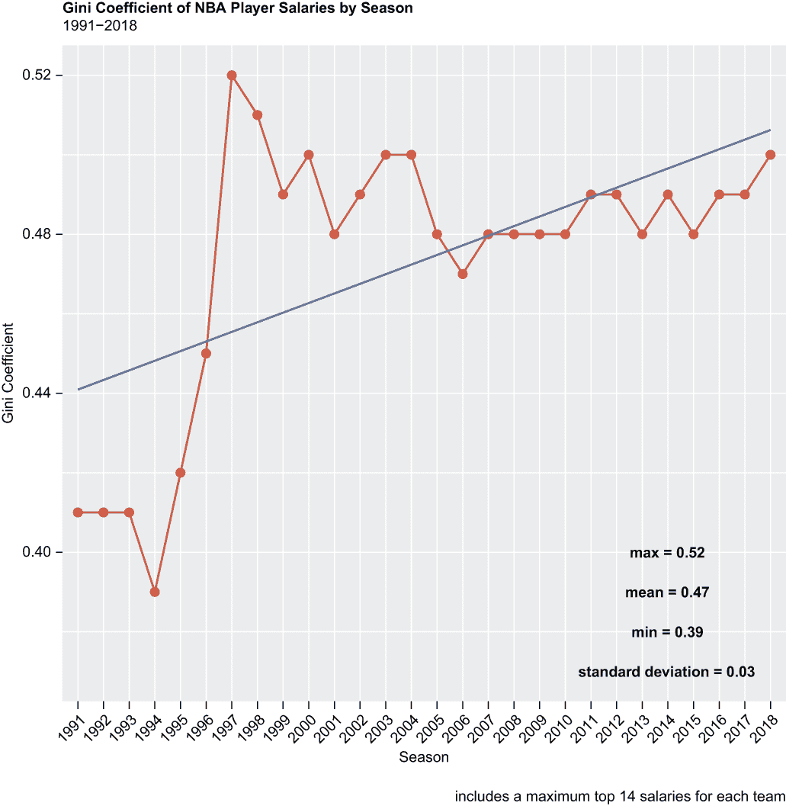
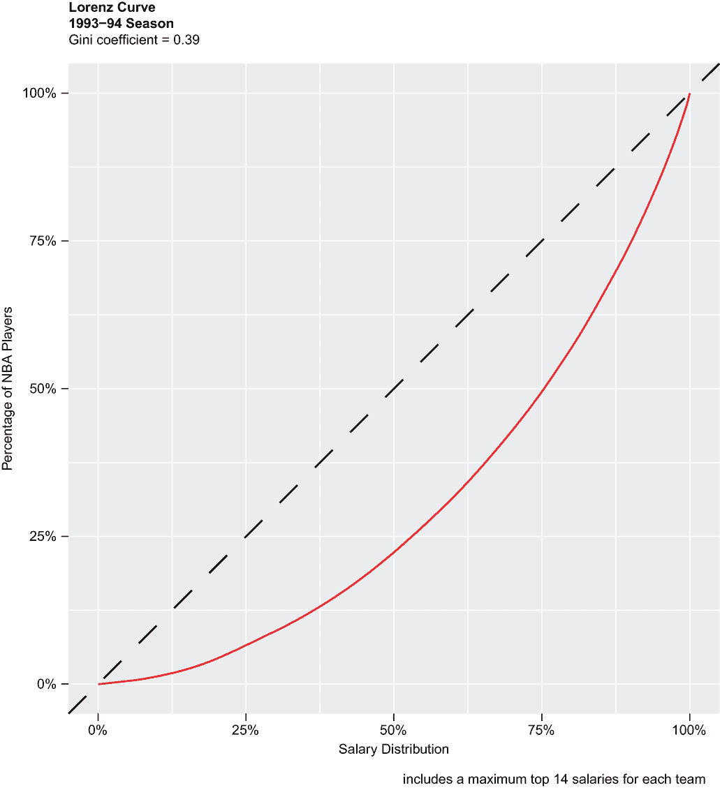
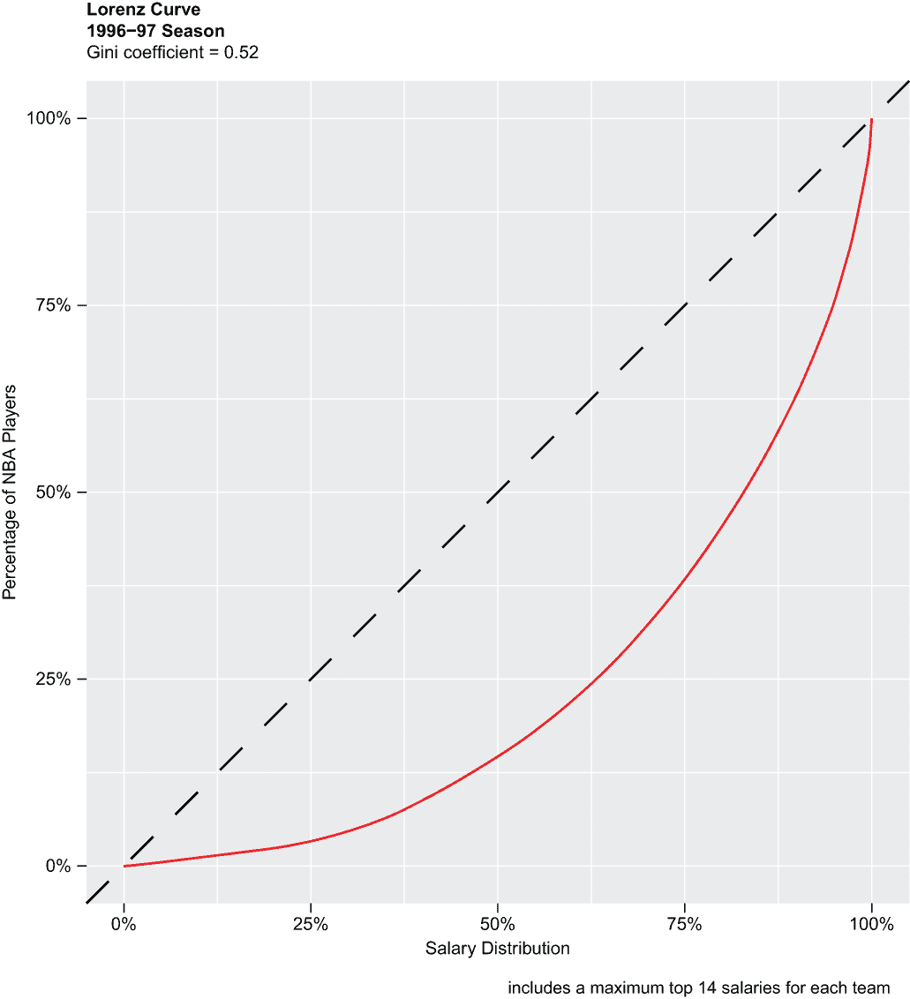
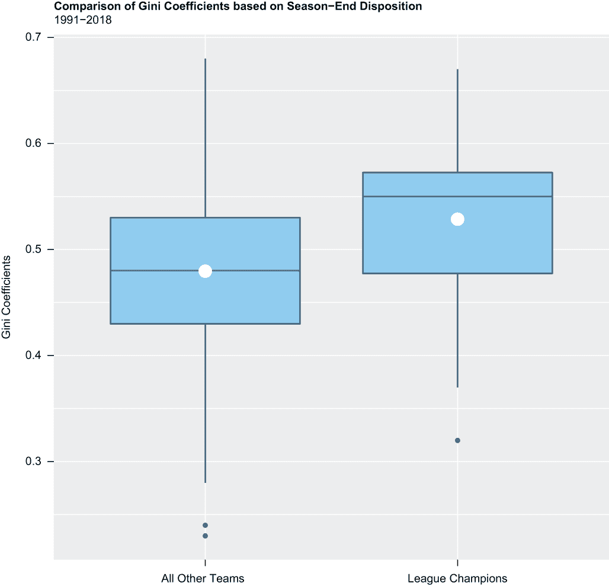
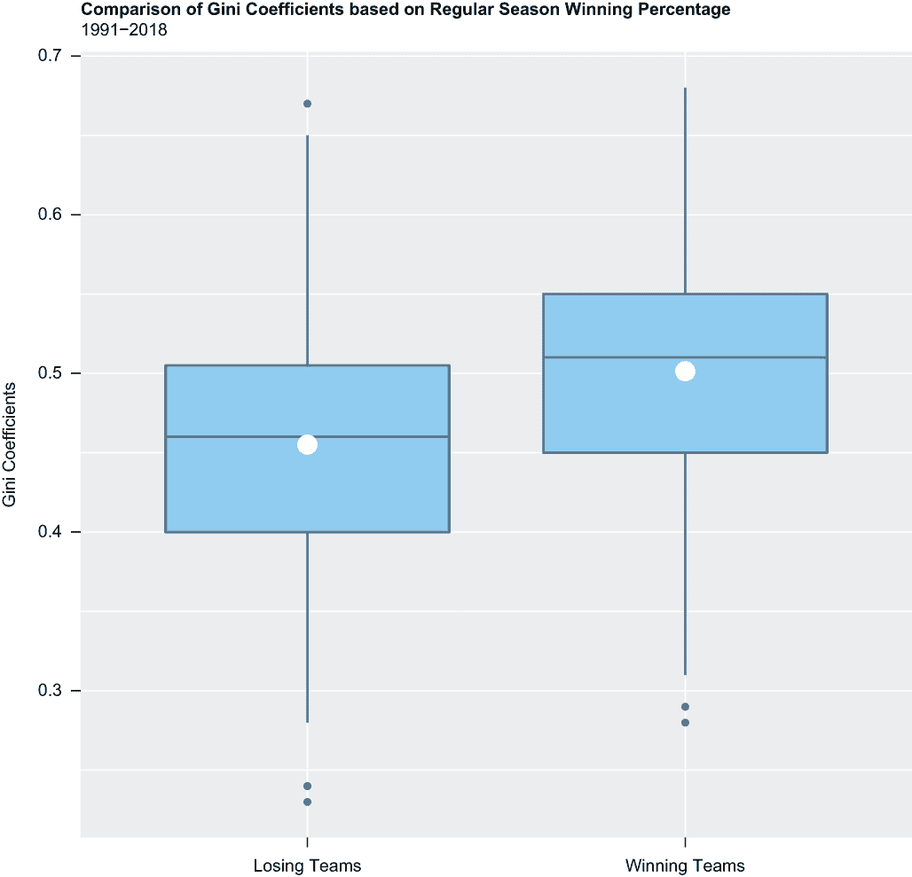
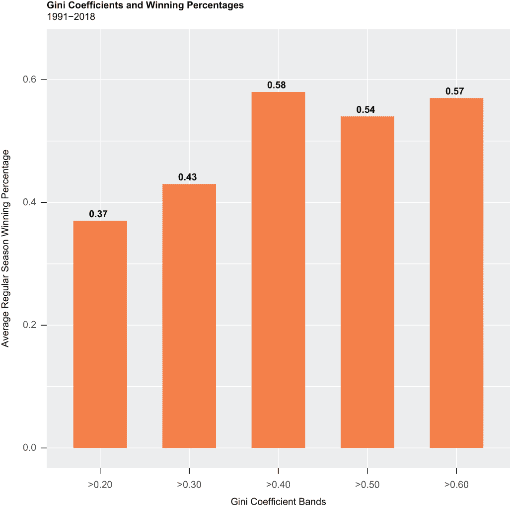

# 12 计算和绘制不平等

本章涵盖

+   计算和理解基尼系数

+   创建和解读洛伦兹曲线

+   进行显著性检验

+   进行效应量检验

社会学家、经济学家、哲学家和其他人多年来一直声称，收入不平等加剧了犯罪和其他社会问题。这就是为什么他们说，税收、收入再分配和其他国家层面的纠正措施不是零和游戏，而是对公共利益的至关重要。一个平等的社会是一个繁荣的社会，一个不平等的社会是一个衰落的社会。

这种想法如何转化为 NBA 呢？NBA 是一个极其不平等的社会，“社会”中大部分的薪资支出都分配给了少数球员。事实上，你很快就会发现，整个联盟的薪资不平等程度最近比以前要高得多。但与此同时，薪资不平等在不同球队或“社区”之间差异显著。

是否可能相对*平等*薪资分配的球队比其他球队更繁荣？也就是说，这样的球队是否赢得更多常规赛和更多联赛冠军，而相对*不平等*薪资分配的球队则不然？无论如何，这是我们进入时的假设。

你可以从本章中获得以下内容：

+   你将了解有关基尼系数的所有必要知识，基尼系数是不平等的统计指标。我们将讨论基尼系数的确切含义，如何手动计算它，如何在 R 中执行相同的操作，以及如何解读结果。

+   你将学习如何创建洛伦兹曲线，这是一种不平等的图形表示，以及如何从同一数据中估算基尼系数。

+   你将对 t 检验和 Cohen 的 d 效应量检验进行复习。

+   你将学习一些我们尚未有机会介绍的数据处理操作——直到现在。

由于本章的大部分内容都依赖于基尼系数和洛伦兹曲线，在我们加载包、导入数据并进行分析之前，让我们先对这两个主题进行简要介绍。

## 12.1 基尼系数和洛伦兹曲线

基尼系数是衡量一个群体收入不平等的统计指标，通常应用于国家层面，其中 0 代表完全平等（即，每个人都获得相同的收入或拥有相同数量的财富），而 1 代表完全不平等（只有一个人拥有所有收入或财富，其他人则一无所获）。一般来说，以下情况是正确的：

+   低不平等对应于小于 0.3 的基尼系数。

+   中等不平等程度对应于 0.3 到 0.4 之间的基尼系数。

+   显著不平等对应于 0.4 到 0.6 之间的基尼系数。

+   高不平等对应于大于 0.6 的基尼系数。

基尼系数是由意大利统计学家科拉多·基尼在 1912 年开发的，尽管基尼的世界观早已不再受到青睐（基尼是一位优生学家），但他的衡量收入不平等系数的方法至今仍由世界银行、联合国和其他许多组织定期计算和发布。这就是为什么我们在一系列替代方案中选择了基尼系数作为我们的不平等度量标准，例如标准差（参见上一章）。

关于基尼系数，以下几点至关重要：

+   基尼系数是一个*相对*度量，而不是*绝对*度量，它掩盖了分布和其他细节；例如，两个国家可能具有相同的基尼系数，但生活水平却截然不同。从统计学的角度来看，这意味着一个国家可能有一个负偏斜的收入分布，左尾较长，而另一个国家可能有一个正偏斜的收入分布，右尾较长。

+   基尼系数可能在产品和服务部分或全部由政府补贴的地方失去一些准确性；毕竟，将社会主义或混合经济的好处，如医疗、住房和教育，转化为个人收入或财富并不容易。

洛伦兹曲线是 1905 年由一位名叫马克斯·洛伦兹的美国博士生开发的，它是一种图形表示人口内累积收入或财富分布的方法，有趣的是，这比基尼系数的提出早了七年。绘制洛伦兹曲线涉及绘制一对数值变量：沿任一轴的累积收入或财富份额以及沿相对轴的累积人口份额。（我们将累积薪酬分布作为我们的 x 轴变量，累积 NBA 球员份额作为我们的 y 轴变量。）绘制一条对角线来表示完全平等的状态，例如，一半的收入由一半的人口赚取，然后在对角线下绘制洛伦兹曲线，以显示，比如说，一半的收入或财富实际上只由 25%的人口拥有。当存在完全不平等时，洛伦兹曲线将呈现出类似倒 C 的形状。

我们可以从洛伦兹曲线中估计或计算基尼系数；基尼系数是洛伦兹曲线与完全平等线之间的面积与完全平等线下总面积的比率。因此，洛伦兹曲线与完全平等线之间的面积越大，不平等程度就越大。

现在我们已经处理好了基尼系数和洛伦兹曲线，至少暂时如此，我们将加载我们的包，导入我们的数据，然后开始我们的分析。

## 12.2 加载包

我们将超越内置的 R 函数，进行数据整理、提取、测试，以及其他计算和可视化结果。这次，我们将调用`library()`函数六次来加载扩展 R 功能范围的包：

```
library(tidyverse)
library(sqldf)
library(ineq)
library(gglorenz)
library(scales)
library(effsize)
```

这四个包——`tidyverse`、`sqldf`、`scales`和`effsize`——我们之前已经加载过；另外两个包，`ineq`和`gglorenz`，这次是首次使用。`ineq`包包含`ineq()`函数，该函数接受一个数字向量并计算基尼系数；`gglorenz`包是`ggplot2`的扩展，用于绘制洛伦兹曲线。

作为友好的提醒，在导入之前必须安装包，并且在调用它们的函数之前必须导入包。例如，如果`ineq`包尚未安装，我们首先会调用`install.packages()`函数，并将`ineq`包作为参数传递，用一对单引号或双引号括起来：

```
install.packages("ineq")
```

我们将导入我们的第一个数据集。

## 12.3 导入和查看数据

我们的第一份数据集是以.csv 文件的形式，之前从[`data.world`](https://data.world)下载的。因此，我们调用`read_csv()`函数从`readr`包中导入存储在我们默认工作目录中的数据。在这个过程中，我们创建了一个名为 gini 的对象：

```
gini <- read_csv("salaries_1985to2018.csv")
```

我们的数据集包含了 1985 年至 2018 年间每位 NBA 球员的年薪。

然后，我们调用`dplyr`包中的`glimpse()`函数来对我们的数据进行快速评估：

```
glimpse(gini) 
## Rows: 14,163
## Columns: 7
## $ league       <chr> "NBA", "NBA", "NBA", "NBA", "NBA", "NBA", "NB...
## $ player_id    <chr> "abdelal01", "abdelal01", "abdelal01", "abdel...
## $ salary       <dbl> 395000, 494000, 500000, 805000, 650000, 15300...
## $ season       <chr> "1990-91", "1991-92", "1992-93", "1993-94", "...
## $ season_end   <dbl> 1991, 1992, 1993, 1994, 1995, 1985, 1986, 198...
## $ season_start <dbl> 1990, 1991, 1992, 1993, 1994, 1984, 1985, 198...
## $ team         <chr> "Portland Trail Blazers", "Portland Trail Bla...
```

基尼数据集有 14,163 行，七列宽；它包含数字变量（`int`）和字符字符串（`chr`）的组合。一些粗略的计算——考虑到我们数据集中包含的 NBA 赛季数量、球队数量以及球队通常在其活跃阵容中携带的球员数量——表明 14,163 条记录相当高。这*可能*是由于许多球员在短期或临时合同中进出联盟，或者可能是其他完全不同的事情的结果。

由于球员在赛季中经常转会——他们可以被交易到另一支球队，或者在被放弃后被另一支球队签下，这相当于被解雇或裁员——因此，检查和标记`player_id`（一个唯一标识符）和`season_end`（NBA 常规赛结束的日历年份）之间的重复记录是合适的。这是一个理解数据所在生态系统中重要性的好例子；缺乏关于变量潜在移动或交互的上下文的无视分析可能会破坏分析的整体性。

如果有一种快速简单的方法来检测或确认重复记录的存在，那将很理想，但不幸的是，伴随我们的数据的数据字典没有提及赛季内球员的移动或在这种情况下工资是否被重复计算，这意味着我们不得不自己应对。但在现实世界中，这通常是这种情况。

在下面的`dplyr`代码块中，我们首先将 gini 数据集传递给`group_by()`函数，其中`player_id`和`season_end`是额外的参数，然后我们调用`mutate()`函数创建一个名为`duplicate`的逻辑变量。如果 gini 包含一个或多个`player_id`和`season_end`相同的记录，则`duplicate`变量将等于`TRUE`；否则，`duplicate`将等于`FALSE`。我们的结果被转换为一个名为 gini2 的 tibble，我们只临时使用它：

```
gini %>%
  group_by(player_id, season_end) %>%
  mutate(duplicate = n() > 1) -> gini2
```

然后，我们将`gini2`传递给`group_by()`和`tally()`函数，以返回变量`duplicate`等于`TRUE`或`FALSE`时的行计数，以获取数据中（可能）重复记录的数量：

```
gini2 %>%
  group_by(duplicate) %>%
  tally()
## # A tibble: 2 × 2
##   duplicate     n
##   <lgl>     <int>
## 1 FALSE     13367
## 2 TRUE        796
```

我们的数据集中确实包含重复项——很多，如果我们在这里停下来，这似乎就是如此。

接下来，我们从`sqldf`包中调用`sqldf()`函数，从基础 R 中调用`head()`函数，以返回`gini2`中变量`duplicate`等于`TRUE`的前六个观测值。这让我们对一些重复记录有了了解，并为我们进行一些额外研究提供了一个起点：

```
head(sqldf("SELECT * FROM gini2 WHERE duplicate = TRUE"))
##   league player_id  salary  season season_end season_start                 
## 1    NBA   acyqu01 1914544 2016-17       2017         2016        
## 2    NBA   acyqu01 1050961 2016-17       2017         2016     
## 3    NBA afflaar01 1500000 2017-18       2018         2017     
## 4    NBA afflaar01 1471382 2017-18       2018         2017        
## 5    NBA aguirma01 1471000 1993-94       1994         1993      
## 6    NBA aguirma01  150000 1993-94       1994         1993 
##                     team  duplicate
## 1    Brooklyn Nets             TRUE
## 2    Dallas Mavericks          TRUE
## 3    Sacramento Kings          TRUE
## 4    Orlando Magic             TRUE
## 5    Detroit Pistons           TRUE
## 6    Los Angeles Clippers      TRUE
```

经过进一步调查，我们发现我们的重复项根本不是重复项。Quincy Acy 是一个典型的例子（参见我们的`sqldf`输出中的`player_id acyqu01`）。Acy 是一个边缘化和被遗忘的球员，但他在一个七年的职业生涯中赚了超过 800 万美元的薪水。根据他的[www.basketball-reference.com](https://www.basketball-reference.com/)个人资料，Acy 在 2016-17 赛季开始时是达拉斯小牛队的一员。在赛季开始大约一个月后，他只参加了六场比赛，Acy 被放弃，两个月后被布鲁克林篮网队签下。对我们来说最重要的是，小牛队支付给 Acy 超过 100 万美元，*并且*篮网队额外支付给他 190 万美元；因此，Acy 在 2016-17 赛季赚了超过 290 万美元。对其他“重复项”的其他检查揭示了相同的模式；在变量`player_id`和`season_end`上确实存在重复，但薪水是唯一的。对我们来说，最后这部分是关键：对于每个`player_id`、`season`和`team`组合，薪水是唯一的或互斥的。现在我们已经解决了这个问题，我们就知道从数据处理的角度需要做什么，以及不需要做什么。

## 12.4 数据处理

从现在开始，我们只需要 gini 中的八个变量中的三个——这些是 `salary`、`season_end` 和 `team`。没有必要保留不必要的数据，因此我们将通过调用 `dplyr` 包中的 `select()` 函数来减少 gini 数据集，只包括这三个变量：

```
gini %>%
  select(salary, season_end, team) -> gini
```

接下来，我们通过两次调用基础 R 的 `as.factor()` 函数将变量 `season_end` 和 `team` 转换为因子：

```
gini$season_end <- as.factor(gini$season_end)
gini$team <- as.factor(gini$team)
```

然后，我们运行基础 R 的 `summary()` 函数，以返回 gini 中剩余三个变量的描述性统计信息；`maxsum` 参数告诉 R 返回最多但不超过 40 个级别的因子。变量 `season_end` 包含 34 个级别，每个赛季或年份一个，而变量 `team` 因为我们的数据识别了队名迭代，包含 39 个级别。

对于数值变量，例如 `salary`，`summary()` 函数返回平均值、中位数、最小值和最大值，以及第一和第三四分位数；对于因子变量，例如 `season_end` 和 `team`，`summary()` 则返回每个组的观测计数：

```
summary(gini, maxsum = 40)
##      salary         season_end                                team    
##  Min.   :    2706   1985:210                                    :  4  
##  1st Qu.:  630000   1986:296   Atlanta Hawks                    :494  
##  Median : 1500000   1987: 40   Boston Celtics                   :502  
##  Mean   : 3164870   1988:303   Brooklyn Nets                    :103  
##  3rd Qu.: 3884239   1989:321   Charlotte Bobcats                :156  
##  Max.   :34682550   1990: 64   Charlotte Hornets                :253  
##                     1991:353   Chicago Bulls                    :496  
##                     1992:387   Cleveland Cavaliers              :491  
##                     1993:404   Dallas Mavericks                 :519  
##                     1994:394   Denver Nuggets                   :490  
##                     1995:418   Detroit Pistons                  :481  
##                     1996:388   Golden State Warriors            :491  
##                     1997:413   Houston Rockets                  :509  
##                     1998:444   Indiana Pacers                   :484  
##                     1999:432   Kansas City Kings                : 11  
##                     2000:526   Los Angeles Clippers             :503  
##                     2001:464   Los Angeles Lakers               :475  
##                     2002:459   Memphis Grizzlies                :298  
##                     2003:459   Miami Heat                       :453  
##                     2004:458   Milwaukee Bucks                  :491  
##                     2005:478   Minnesota Timberwolves           :436  
##                     2006:494   New Jersey Nets                  :413  
##                     2007:511   New Orleans Hornets              :143  
##                     2008:486   New Orleans Pelicans             : 95  
##                     2009:471   New Orleans/Oklahoma City Hornets: 31  
##                     2010:472   New York Knicks                  :499  
##                     2011:467   Oklahoma City Thunder            :163  
##                     2012:468   Orlando Magic                    :463  
##                     2013:496   Philadelphia 76ers               :519  
##                     2014:410   Phoenix Suns                     :509  
##                     2015:543   Portland Trail Blazers           :487  
##                     2016:527   Sacramento Kings                 :482  
##                     2017:556   San Antonio Spurs                :488  
##                     2018:551   Seattle SuperSonics              :308  
##                                Toronto Raptors                  :375  
##                                Utah Jazz                        :456  
##                                Vancouver Grizzlies              : 93  
##                                Washington Bullets               :153  
##                                Washington Wizards               :346
```

`summary()` 函数的输出揭示了一些问题——一个相对较小，另一个则不然。首先，我们在 gini 中有四个观测值，其中变量 `team` 为空。这可能是在创建数据集时的疏忽，也许这些是签订了保证合同但因为没有受伤而未为任何球队出场的球员，或者完全是其他原因。以下 `SELECT` 语句从 gini 数据集中返回了这四个记录：

```
sqldf("SELECT * FROM gini WHERE team == ''")
##   salary season_end team
## 1  65000       1985     
## 2 600000       1985     
## 3 450000       1985     
## 4 120000       1985
```

很有趣的是，所有这些数据都来自 1984-85 赛季。

第二个问题是记录计数较低——在某些情况下非常低——当变量 `season_end` 小于或早于 1991 年时。这很可能是由于当时薪水并不总是那么公开。以下两个 `SELECT` 语句返回了两个随机队伍的每条记录，一个来自 1987 年，另一个来自 1990 年，结果发现记录计数特别低：

```
sqldf("SELECT * FROM gini WHERE team == 'Boston Celtics' AND 
      season_end == 1987")
##    salary season_end           team
## 1 1800000       1987 Boston Celtics
## 2  200000       1987 Boston Celtics
## 3  425000       1987 Boston Celtics

sqldf("SELECT * FROM gini WHERE team == 'Los Angeles Lakers' AND 
      season_end == 1990")
##    salary season_end               team
## 1 1500000       1990 Los Angeles Lakers
## 2 3100000       1990 Los Angeles Lakers
## 3 1100000       1990 Los Angeles Lakers
## 4 1500000       1990 Los Angeles Lakers
```

有可能用相同的数据，当然，通过用 `dplyr` 代码替换 `WHERE` 子句来返回相同的结果，以使用 `filter()` 函数。这取决于你。只是要注意，`dplyr` 和 `sqldf` 通常不使用相同的语法；例如，`sqldf` 使用 `AND`，而 `dplyr` 使用 `&`：

```
gini %>%
  filter(team == "Boston Celtics" & season_end == 1987)
##    salary season_end           team
## 1 1800000       1987 Boston Celtics
## 2  200000       1987 Boston Celtics
## 3  425000       1987 Boston Celtics

gini %>%
  filter(team == "Los Angeles Lakers" & season_end == 1990)
##    salary season_end               team
## 1 1500000       1990 Los Angeles Lakers
## 2 3100000       1990 Los Angeles Lakers
## 3 1100000       1990 Los Angeles Lakers
## 4 1500000       1990 Los Angeles Lakers
```

gini 数据集只包含 1987 年波士顿凯尔特人队的三个记录和 1990 年洛杉矶湖人队的四个记录。

由于这些发现，我们随后通过删除所有 `factor` 变量 `season_end` 等于 `1985`、`1986`、`1987`、`1988`、`1989` 或 `1990` 的行来对 gini 数据集进行子集化，以删除数据不完整的 NBA 赛季。然后我们有一个新的工作数据集，称为 gini3。

为了实现这一点，我们调用基础 R 的`c()`函数来创建一个包含 1985 年至 1990 年`season_end`级别的向量的向量。接下来，因为我们通过向量进行过滤，所以我们使用`%in%`运算符，该运算符指示 R 通过变量`season_end`筛选并移除（而不是保留，因为我们的代码前面有表示逻辑否定运算符的`!`运算符）那些级别等于我们向量中值的记录：

```
gini[!(gini$season_end %in% c(1985, 1986, 1987, 1988, 
                              1989, 1990)),] -> gini3
```

然后，我们调用`dim()`函数来返回 gini3 数据集的维度：

```
dim(gini3)
## [1] 12929     3
```

因此，我们的工作数据集已从原始的 14,163 行减少到 12,929 行，相差 1,234 行。

以下是我们数据中的两个快速要点：

+   NBA 常规赛通常在十月中旬开始，在四月中旬结束，因此开始于一个日历年份，结束于另一个日历年份。所以，例如，因为 2018 赛季实际上是在 2017 年 10 月开始，有时被称为 2017-18 赛季。我们之前从 gini 数据集中删除了变量`season`和`season_start`，因为它们（甚至两个一起）比单独的变量`season_end`本身增加的价值不多。

+   与我们在前两章中使用的薪资数据集不同，gini 数据集识别了 1985 年至 2018 赛季之间的特许经营变动和随后的球队名称变更。这就是为什么变量`team`包含的级别比 30 多个级别显著更多。

在以下代码块中，我们进一步通过仅保留每个`team`和`season_end`组合中排名前 14 位的球员薪资来减少 gini3 数据集。否则，包括联赛最低薪资球员的结果可能会不公平或不准确，这些球员通常在短期或临时合同上打球。我们通过以下步骤实现这一点：

1.  我们首先通过管道运算符将 gini3 数据集传递给`dplyr arrange()`函数，该函数按 gini 的每个三个变量进行排序。

1.  然后，我们调用`dplyr group_by()`和`mutate()`函数以及基础 R 的`rank()`函数来创建一个名为`rank`的新变量，其中变量薪资按每个`team`和`season_end`组合的降序排列，1 到*n*。`rank()`函数中的负号或负号对变量薪资进行排序或排名。`ties.method`参数指定如何处理平局；当等于`first`时，R 将平局元素分配为连续的、因此不同的排名。

1.  最后，我们调用`dplyr filter()`函数，仅包括变量排名小于或等于 14 的记录。结果被放入一个名为 gini4 的 tibble 中：

```
gini3 %>%
  arrange(season_end, team, salary) %>%
  group_by(season_end, team) %>%
  mutate(rank = rank(-salary, ties.method = "first")) %>%
  filter(rank <= 14) -> gini4
```

这使得我们拥有一个工作数据集，其中每个`season_end`和`team`组合的记录数最多为 14。但让我们进行一系列完整性检查以验证这一点。

在下一个代码块中，我们两次调用`sqldf()`函数，该函数来自`sqldf`包，编写`SELECT`语句从 gini3 数据集和 gini4 tibble 中提取数据，其中变量`season_end`等于`2012`且变量`team`等于丹佛掘金队。注意我们在外面使用双引号，在内部使用单引号；这种风格使 R 更容易阅读和解释代码：

```
sqldf("SELECT * FROM gini3 WHERE season_end = 2012 AND 
      team = 'Denver Nuggets'")
##      salary season_end           team
## 1   7562500       2012 Denver Nuggets
## 2   4234000       2012 Denver Nuggets
## 3   3059000       2012 Denver Nuggets
## 4    289382       2012 Denver Nuggets
## 5   1254720       2012 Denver Nuggets
## 6   2180443       2012 Denver Nuggets
## 7   4190182       2012 Denver Nuggets
## 8   1073286       2012 Denver Nuggets
## 9   6226200       2012 Denver Nuggets
## 10 13000000       2012 Denver Nuggets
## 11  2203792       2012 Denver Nuggets
## 12  1654440       2012 Denver Nuggets
## 13  7807728       2012 Denver Nuggets
## 14  3343896       2012 Denver Nuggets
## 15   473604       2012 Denver Nuggets

sqldf("SELECT * FROM gini4 WHERE season_end = 2012 AND 
      team = 'Denver Nuggets'")
##      salary season_end           team rank
## 1    473604       2012 Denver Nuggets   14
## 2   1073286       2012 Denver Nuggets   13
## 3   1254720       2012 Denver Nuggets   12
## 4   1654440       2012 Denver Nuggets   11
## 5   2180443       2012 Denver Nuggets   10
## 6   2203792       2012 Denver Nuggets    9
## 7   3059000       2012 Denver Nuggets    8
## 8   3343896       2012 Denver Nuggets    7
## 9   4190182       2012 Denver Nuggets    6
## 10  4234000       2012 Denver Nuggets    5
## 11  6226200       2012 Denver Nuggets    4
## 12  7562500       2012 Denver Nuggets    3
## 13  7807728       2012 Denver Nuggets    2
## 14 13000000       2012 Denver Nuggets    1
```

第一个`SELECT`语句返回 gini3 中`season_end`等于`2012`且`team`等于`Denver Nuggets`的每条记录和每个变量；返回了 15 条记录，每条记录代表那个赛季在丹佛掘金队工资名单上的每位球员。

第二个`SELECT`语句返回 gini4 中`season_end`也等于`2012`且`team`也等于`Denver Nuggets`的每条记录和每个变量；然后返回了 14 条记录，其中工资变量按升序排序，排名变量按降序排序。这正是我们预期的。

让我们再次尝试，这次用 2012 年的丹佛掘金队替换为 2018 年的芝加哥公牛队：

```
sqldf("SELECT * FROM gini3 WHERE season_end = 2018 AND 
      team = 'Chicago Bulls'")
##      salary season_end          team
## 1   1471382       2018 Chicago Bulls
## 2  10595505       2018 Chicago Bulls
## 3    200000       2018 Chicago Bulls
## 4   4046760       2018 Chicago Bulls
## 5    100353       2018 Chicago Bulls
## 6   7843500       2018 Chicago Bulls
## 7   1713840       2018 Chicago Bulls
## 8   4615385       2018 Chicago Bulls
## 9   2163006       2018 Chicago Bulls
## 10  3202217       2018 Chicago Bulls
## 11 13788500       2018 Chicago Bulls
## 12  3821640       2018 Chicago Bulls
## 13  1312611       2018 Chicago Bulls
## 14  2203440       2018 Chicago Bulls
## 15  3853931       2018 Chicago Bulls
## 16  1516320       2018 Chicago Bulls
## 17  1471382       2018 Chicago Bulls
## 18  3000000       2018 Chicago Bulls
## 19    50000       2018 Chicago Bulls
## 20  2186400       2018 Chicago Bulls
## 21  3505233       2018 Chicago Bulls
## 22 15550000       2018 Chicago Bulls
## 23  1312611       2018 Chicago Bulls

sqldf("SELECT * FROM gini4 WHERE season_end = 2018 AND 
      team = 'Chicago Bulls'")
##      salary season_end          team rank
## 1   2163006       2018 Chicago Bulls   14
## 2   2186400       2018 Chicago Bulls   13
## 3   2203440       2018 Chicago Bulls   12
## 4   3000000       2018 Chicago Bulls   11
## 5   3202217       2018 Chicago Bulls   10
## 6   3505233       2018 Chicago Bulls    9
## 7   3821640       2018 Chicago Bulls    8
## 8   3853931       2018 Chicago Bulls    7
## 9   4046760       2018 Chicago Bulls    6
## 10  4615385       2018 Chicago Bulls    5
## 11  7843500       2018 Chicago Bulls    4
## 12 10595505       2018 Chicago Bulls    3
## 13 13788500       2018 Chicago Bulls    2
## 14 15550000       2018 Chicago Bulls    1
```

第一个`SELECT`语句返回 23 条记录，第二个返回从最低到最高排序的前 14 位球员工资。这很完美。

最后，让我们运行两个额外的`SELECT`语句，计算`gini4`行数，其中变量`team`等于`Denver Nuggets`，然后当变量`team`等于`Chicago Bulls`时。行数应该等于最大值 392，这是 28 个赛季乘以每个赛季最多 14 位球员工资的结果（有些队伍在某些赛季的工资名单上球员人数少于 14 人）：

```
sqldf("SELECT COUNT (*) FROM gini4 WHERE team = 'Denver Nuggets'") 
##   COUNT(*)
## 1      388

sqldf("SELECT COUNT (*) FROM gini4 WHERE team = 'Chicago Bulls'")
##   COUNT(*)
## 1      387
```

因为掘金队的行数是 388，公牛队的行数是 387，这两个检查进一步验证了我们的数据完整性。

验证那些并非每天都必须执行的操作，始终是时间和精力的值得投资。现在，让我们通过计算基尼系数来开始我们的分析。

## 12.5 基尼系数

再次强调，基尼系数是衡量*不平等*的指标，因此系数越高意味着差异越大。让我们通过一系列非常简单的例子来演示基尼系数。

首先，假设我们有一组 10 个人，每人每月收入 50 美元。我们通过调用`rep()`和`c()`函数并告诉 R 重复 50 十次来创建一个包含 10 个相同元素的向量。然后，我们将我们的向量传递给`ineq()`函数，该函数来自`ineq`包，以计算基尼系数：

```
a <- rep(c(50), each = 10)
print(a)
##  [1] 50 50 50 50 50 50 50 50 50 50

ineq(a)
## [1] 0
```

因为每个人的收入都完全相同，所以存在完美的平等，因此基尼系数等于 0。

在我们的第二个例子中，有五个人每月赚 50 美元，另外五个人赚两倍于此；因此，三分之二的收入仅由一半的人赚取：

```
b <- rep(c(50, 100), each = 5)
print(b)
##  [1]  50  50  50  50  50 100 100 100 100 100

ineq(b)
## [1] 0.1666667
```

因此，我们得到的基尼系数等于 0.17。

在我们的第三个例子中，一半的人每月赚取 150 美元，另一半的人每月赚取 300 美元：

```
c <- rep(c(150, 300), each = 5)
print(c)
##  [1] 150 150 150 150 150 300 300 300 300 300

ineq(c)
## [1] 0.1666667
```

与先前的例子相比，月收入普遍较高；然而，基尼系数也等于 0.17，因为总收入的三分之二再次仅由一半的人赚取。正如之前提到的，我们可以有右偏和左偏的分布，但基尼系数相等。

在我们的第四个例子中，我们有一个完美的月收入分布，平均值和中位数都是 80，标准差最小：

```
d <- rep(c(60, 70, 80, 90, 100), each = 2)
print(d)
##  [1]  60  60  70  70  80  80  90  90 100 100

ineq(d)
## [1] 0.1
```

几乎一半的月收入是由仅四个人赚取的；因此，我们有一个基尼系数等于 0.10。

在我们的第五个例子中，我们再次有一个完美的正常收入分布；这次，平均值和中位数都是 100，标准差是之前的两倍：

```
e <- rep(c(50, 75, 100, 125, 150), each = 2)
print(e)
##  [1]  50  50  75  75 100 100 125 125 150 150

ineq(e)
## [1] 0.2
```

因此，10 个人中有 4 个人的月收入占 55%，我们的基尼系数翻倍至 0.20。

在我们的第六个和最后一个例子中，九个人每月仅赚取 10 美元，而第十个人每月赚取 100 美元：

```
f <- rep(c(10, 100), times = c(9, 1))
print(f)
##  [1]  10  10  10  10  10  10  10  10  10 100

ineq(f)
## [1] 0.4263158
```

因此，最后这个人的收入是其他所有人收入的两倍多，因此基尼系数因此大幅上升至 0.43。

现在，在下面的代码块中，我们将我们工作数据集的最新版本 gini4 传递给`dplyr::group_by()`和`summarize()`函数以及`ineq()`函数，以根据变量`season_end`中的每个剩余因素计算基尼系数。结果被转换成一个名为 gini_summary 的 tibble。通过调用基础 R 的`round()`函数，我们限制结果只包含小数点后两位数字：

```
gini4 %>%
  group_by(season_end) %>%
  summarize(gc = round(ineq(salary), digits = 2)) -> gini_summary
print(gini_summary)
## # A tibble: 28 × 2
##    season_end    gc
##    <fct>      <dbl>
##  1 1991        0.41
##  2 1992        0.41
##  3 1993        0.41
##  4 1994        0.39
##  5 1995        0.42
##  6 1996        0.45
##  7 1997        0.52
##  8 1998        0.51
##  9 1999        0.49
## 10 2000        0.5 
## # ... with 18 more rows
```

这些结果随后在`ggplot2`线图或时间序列图中进行可视化（见图 12.1）。以下是关于被调用的关键`ggplot2`函数的一些提示：

+   `geom_line()`函数绘制了一条宽度为默认`ggplot2`宽度的 1.5 倍的线条。

+   `geom_point()`函数在沿线添加了大小为默认大小的三倍的点。

+   `geom_smooth()`函数在整个数据系列上绘制了一条细的回归线，没有置信区间，因为我们向`geom_smooth()`添加了`se = FALSE`参数来覆盖默认功能。

+   第二次调用`theme()`函数将 x 轴标签旋转至 45 度，并将它们水平对齐在图表下方。

+   通过连续调用`annotate()`函数，在图表的右下角标注描述性统计信息。



图 12.1 NBA 年薪分布的年度或季节性基尼系数

话虽如此，以下是我们的代码块：

```
ggplot(gini_summary, aes(x = season_end, y = gc, group = 1)) + 
  geom_line(aes(y = gc), color = "coral3", size = 1.5) + 
  geom_point(size = 3, color = "coral3") +
  geom_smooth(method = lm, se = FALSE) +
  labs(title = "Gini Coefficient of NBA Player Salaries by Season", 
       subtitle = "1991-2018",
       x = "Season", 
       y = "Gini Coeffiicient",
       caption = "includes a maximum top 14 salaries for each team") +
  annotate("text", x = "2014", y = .38, label = "min = 0.39", 
           fontface = "bold") +
  annotate("text", x = "2014", y = .40, label = "max = 0.52", 
           fontface = 'bold') +
  annotate("text", x = "2014", y = .39, label = "mean = 0.47", 
           fontface = 'bold') +
  annotate("text", x = "2014", y = .37, 
           label = "standard deviation = 0.03", fontface = 'bold') +
  theme(plot.title = element_text(face = "bold")) +
  theme(axis.text.x = element_text(angle = 45, hjust = 1))
```

这些结果真的很令人着迷：

+   在 1991 年至 1995 年之间，基尼系数每年都是 0.41 或 0.42，除了 1994 年，当时它达到了 gini_summary 的最小值 0.39。

+   基尼系数在 1995 年激增，在 1996 年再次激增，特别是在 1997 年，尽管人口保持静态，基尼系数达到了 0.52，这是基尼系数的最大值。

+   系数在 1998 年适度下降，并在 1999 年再次下降。

+   1999 年建立了一个新的标准，并在 2018 年维持了这个标准，其中基尼系数在 0.47（1991-2018 年的平均值）和 0.50 之间“弹跳”。

+   所有这些都表明，尽管 NBA 薪资分布在过去是*适度*不平等的，但毫无疑问现在是*显著*不平等的。

不平等性通过洛伦兹曲线进行可视化，正如我们在本章前面讨论的那样。接下来，我们将演示如何使用`ggplot2`扩展构建洛伦兹曲线，展示如何估计或甚至计算基尼系数，然后讨论如何正确解释结果。

## 12.6 洛伦兹曲线

再次，洛伦兹曲线是收入或财富分布的图形表示，其中收入或薪资分布的百分比通常是 x 轴变量，而获得该收入或领取该薪资的个人百分比则是 y 轴变量（尽管翻转变量也是完全可以接受的）。

使用内置的 R 函数可以创建洛伦兹曲线；然而，我们将使用`ggplot2`包以及一个名为`gglorenz`的`ggplot2`扩展。我们的第一条洛伦兹曲线可视化了 1993-94 赛季的薪资分布，基尼系数为 0.39，这是我们的数据集中的最小值（见图 12.2）：

+   我们首先调用`dplyr filter()`函数，对 gini4 数据集进行子集化，其中变量`season_end`等于`1994`。在这个过程中，我们创建了一个名为 gini1994 的新数据集。

+   由于我们的洛伦兹曲线在本质上与其他任何`ggplot2`对象没有区别，因此我们通过调用`ggplot()`函数并传递 gini1994 数据集作为参数以及变量`salary`作为唯一的美学映射来初始化我们的绘图。

+   来自`gglorenz`包的`stat_lorenz()`函数绘制洛伦兹曲线。当设置为`TRUE`时，人口按降序排列；当设置为`FALSE`时，人口则按升序排列。由于大多数洛伦兹曲线都是按人口升序排列创建的，而不是相反，因此我们将`desc`参数（表示降序）设置为`FALSE`。此外，我们指示 R 用实线红色绘制线条，并将其宽度增加到默认宽度的两倍。

+   `ggplot2 coord_fixed()`函数固定了 x 轴和 y 轴的比率，使它们的刻度相等。这并不是绝对必要的，但对于洛伦兹曲线来说，这是高度推荐的，因为保持 x 轴和 y 轴对齐以及相同的纵横比非常重要。否则，解释结果将很困难。

+   `geom_abline()`函数绘制了一条虚线对角线，它代表了一种完美的平等状态，我们可以将其与我们的不平等曲线进行比较。

+   `scale_x_continuous()` 和 `scale_y_continuous()` 函数，结合 `scales` 包——它是 `ggplot2` 包的一部分，而 `ggplot2` 包当然又是 `tidyverse` 的一部分——将我们的 x 轴和 y 轴标签从小数转换为百分比。



图 12.2 1993-94 赛季的洛伦兹曲线，当吉尼系数等于 0.39 时

我们的数据整理和数据处理代码如下：

```
gini1994 <- filter(gini4, season_end == 1994)

ggplot(gini1994, aes(salary)) +
  stat_lorenz(desc = FALSE, color = "red", lwd = 2) +
  coord_fixed() +
  geom_abline(linetype = "dashed", lwd = 1.5) +
  labs(title = "Lorenz Curve\n1993-94 Season", 
       subtitle = "Gini coefficient = 0.39",
       x = "Salary Distribution",
       y = "Percentage of NBA Players",
       caption = "includes a maximum top 14 salaries for each team") +
  scale_x_continuous(labels = percent) +
  scale_y_continuous(labels = percent) +
  theme(plot.title = element_text(face = "bold")) 
```

这是我们如何解释我们的洛伦兹曲线：

+   x 轴代表球员薪水的美元支付百分比。

+   y 轴代表 NBA 球员的百分比。

+   虚线线代表完全平等的状态，例如，50%的所有薪水都分给了联赛中 50%的球员。

+   洛伦兹曲线代表薪资不平等的程度；它与虚线之间的面积越大，不平等越严重，反之亦然。在 1994 年，75%的所有薪水都由 50%的球员获得。

+   吉尼系数可以通过计算洛伦兹曲线与完全平等线之间的面积，并将其除以完全平等线下方的总面积来得出（你将在第十三章中了解更多关于这一点）。

让我们再画一条洛伦兹曲线，仅为了比较目的（见图 12.3）。这最好通过子集化 gini4 数据集来完成，其中变量 `season_end` 等于 `1997`，此时吉尼系数达到了最大值 0.52。你会看到洛伦兹曲线与完全平等线之间的额外面积与之前的图表相比有多大。洛伦兹曲线与完全平等线之间的差距越大，意味着不平等越严重：

```
gini1997 <- filter(gini4, season_end == 1997)

ggplot(gini1997, aes(salary)) +
  stat_lorenz(desc = FALSE, color = "red", lwd = 2) +
  coord_fixed() +
  geom_abline(linetype = "dashed", lwd = 1.5) +
  labs(title = "Lorenz Curve\n1996-97 Season", 
       subtitle = "Gini coefficient = 0.52",
       x = "Salary Distribution", 
       y = "Percentage of NBA Players",
       caption = "includes a maximum top 14 salaries for each team") +
  scale_x_continuous(labels = percent) +
  scale_y_continuous(labels = percent) +
  theme(plot.title = element_text(face = "bold")) 
```



图 12.3 1996-97 赛季的洛伦兹曲线，当吉尼系数等于 0.53 时

而 1994 年，75%的薪水发放给了 50%的球员，而到了 1997 年，75%的薪水只发放给了 38%的球员；这就是吉尼系数从 0.39 变为 0.52 的差异。

现在你已经很好地理解了吉尼系数和洛伦兹曲线，让我们通过探索薪资不平等可能与胜负的关系来应用我们刚刚学到的知识。

## 12.7 薪资不平等与冠军

我们将从比较和对比冠军球队与其他所有球队开始。回想一下，我们的假设是，薪资分配更平等的球队通常比薪资分配不平等的球队更成功。

然而，我们首先需要整理我们的数据。

### 12.7.1 数据整理

以下代码块将 gini4 数据集重塑，使得每个 `team` 和 `season_end` 组合的球员薪水都是其自己的列：

1.  然而，首先，我们调用 `dplyr select()` 函数从 gini4 中移除变量 `rank`。

1.  然后，我们将 gini4 数据集传递给 `dplyr` 的 `group_by()`、`mutate()` 和 `row_number()` 函数，以创建一个名为 `id` 的新变量，它仅是一个连续数字的列，每个 `team` 和 `season_end` 组合都有独立的序列。

1.  最后，我们调用 `tidyr` 的 `pivot_wider()` 函数，该函数将 gini4 从长格式转换为宽格式，其中变量 `id` 被拆分为列，变量 `salary` 的值用于填充这些新列中的单元格。

结果是一个名为 gini5 的新 tibble。调用基础 R 的 `head()` 函数返回前六个观测值（注意 R 自动将一些值以科学记数法返回）：

```
gini4 <- select(gini4, -c(rank))

gini4 %>%
  group_by(team, season_end) %>%
  mutate(id = row_number(salary)) %>%
  pivot_wider(names_from = id, values_from = salary) -> gini5
head(gini5)
## # A tibble: 6 × 16
## # Groups:   team, season_end [6]
##   season_end team       `1`    `2`    `3`    `4`    `5`    `6`    
##   <fct>      <fct>    <dbl>  <dbl>  <dbl>  <dbl>  <dbl>  <dbl>  
## 1 1991       Atlant... 125000 200000 510000 510000 590000 650000 
## 2 1991       Boston...  80000 222000 315000 375000 400000 525000 
## 3 1991       Charlo...  75000 200000 322000 355000 485000 675000 
## 4 1991       Chicag... 150000 385000 425000 450000 600000 750000 
## 5 1991       Clevel... 100000 120000 200000 350000 525000 525000 
## 6 1991       Dallas...  30000 115000 150000 250000 600000 730000 
##   `7`    `8`    `9`   `10`   `11`
##    <dbl>  <dbl>  <dbl>  <dbl>  <dbl>
## 1 685000 775000 8   e5 8.95e5 1.55e6
## 2 547000 550000 7.5 e5 8.5 e5 1.21e6
## 3 805000 900000 1   e6 1.2 e6 1.25e6
## 4 765000 915000 1   e6 1   e6 1.1 e6
## 5 548000 630000 9.25e5 1.26e6 1.32e6
## 6 765000 880000 9.85e5 1   e6 1.5 e6
```

注意，第 1 至 14 列现在只是列名，而不是排名；实际上，薪资现在是按从左到右的顺序水平排序。这是可以接受的——我们之前对薪资进行排名只是为了对每个 `team` 和 `season_end` 组合的前 14 个薪资进行子集化。薪资如何排列不再重要。

然后，我们调用基础 R 的 `names()` 函数来重命名 gini5 的大多数列名；`season_end` 和 `team` 将保持不变，但来自先前变量 `rank` 的其余列将被重命名，例如，`1` 被转换为 `s1`（`s` 是 salaries 的缩写），`2` 被转换为 `s2`，依此类推。

再次注意，当我们再次调用 `head()` 函数以获取前六个观测值时，R 会以科学记数法返回较大的值，这对于我们的目的来说完全没问题：

```
names(gini5) = c("season_end", "team", "s1", "s2", "s3", "s4", "s5", 
                 "s6", "s7", "s8", "s9", "s10", "s11", "s12", "s13", "s14")

head(gini5)
## # A tibble: 6 × 16
## # Groups:   team, season_end [6]
##   <fct>      <fct>           <dbl>  <dbl>  <dbl>  <dbl>  
## 1 1991       Atlanta Hawks  125000 200000 510000 510000 
## 2 1991       Boston Celtics  80000 222000 315000 375000 
## 3 1991       Charlotte Hor...  75000 200000 322000 355000 
## 4 1991       Chicago Bulls  150000 385000 425000 450000 
## 5 1991       Cleveland Cav... 100000 120000 200000 350000
## 6 1991       Dallas Maveri...  30000 115000 150000 250000 
##    <dbl>  <dbl>  <dbl>  <dbl>  <dbl>  
## 1 90000  650000 685000 775000 8   e5 
## 2 400000 525000 547000 550000 7.5 e5 
## 3 485000 675000 805000 900000 1   e6 
## 4 600000 750000 765000 915000 1   e6 
## 5 525000 525000 548000 630000 9.25e5 
## 6 600000 730000 765000 880000 9.85e5 
##    <dbl>  <dbl>  <dbl>   <dbl>   <dbl>
## 1 8.95e5 1.55e6 2.06e6 2406000      NA
## 2 8.5 e5 1.21e6 1.4 e6 1500000 2500000
## 3 1.2 e6 1.25e6 1.5 e6 1650000      NA
## 4 1   e6 1   e6 1.1 e6 2.5 e6       NA  
## 5 1.26e6 1.32e6 1.4 e6 2640000 3785000
## 6 1   e6 1.5 e6 1.52e6 1519000 1650000
```

然后，我们调用 `dplyr` 包中的 `mutate()` 函数来创建一个名为 `gini_index` 的新变量，该变量等于 gini5 数据集中每个 `team` 和 `season_end` 组合的 Gini 系数，四舍五入到小数点后两位。Gini 系数再次通过调用 `ineq` 包中的 `ineq()` 函数来计算，该函数将变量 `s1` 到 `s14` 作为参数。通过将 `na.rm` 参数设置为 `TRUE`，我们指示 `ineq()` 函数跳过数据中的不可用（NA）值；如果我们将其设置为 `FALSE`，则 `ineq()` 函数将为每个 `team` 和 `season_end` 组合中少于 14 个薪资的情况返回 NA。 （记住，我们将 14 名球员/薪资设定为每个团队每个赛季的最大值，而不是最小值。）

结果是一个名为 gini6 的新数据集。`head()` 函数打印出前六个观测值：

```
gini5 %>%
  mutate(gini_index = round(ineq(c(s1, s2, s3, s4, s5, s6, s7, s8, 
                                   s9, s10, s11, s12, s13, s14, 
                                   na.rm = TRUE)), digits = 2)) -> gini6
head(gini6)
## # A tibble: 6 × 17
## # Groups:   team, season_end [6]
##   season_end team                    s1     s2     s3     s4     
##   <fct>      <fct>                <dbl>  <dbl>  <dbl>  <dbl>  
## 1 1991       Atlanta Hawks       125000 200000 510000 510000 
## 2 1991       Boston Celtics       80000 222000 315000 375000 
## 3 1991       Charlotte Hornets    75000 200000 322000 355000 
## 4 1991       Chicago Bulls       150000 385000 425000 450000 
## 5 1991       Cleveland Cavaliers 100000 120000 200000 350000 
## 6 1991       Dallas Mavericks     30000 115000 150000 250000 
##       s5     s6     s7     s8      s9     s10    
##    <dbl>  <dbl>  <dbl>  <dbl>   <dbl>   <dbl>
## 1 590000 650000 685000 775000  800000  895000 
## 2 400000 525000 547000 550000  750000  850000 
## 3 485000 675000 805000 900000 1000000 1200000 
## 4 600000 750000 765000 915000 1000000 1000000 
## 5 525000 525000 548000 630000  925000 1260000 
## 6 600000 730000 765000 880000  985000 1000000 
##       s11    s12     s13     s14 gini_index
##     <dbl>  <dbl>   <dbl>   <dbl>      <dbl>
## 1 1550000 2.06e6 2406000      NA       0.42
## 2 1212000 1.4 e6 1500000 2500000       0.45
## 3 1250000 1.5 e6 1650000      NA       0.39
## 4 1100000 2.5 e6      NA      NA       0.38
## 5 1320000 1.4 e6 2640000 3785000       0.52
## 6 1500000 1.52e6 1519000 1650000       0.41
```

接下来，我们再次调用 `read_csv()` 函数来导入第二个数据集，称为 records：

```
records <- read_csv("records.csv")
```

调用 `dplyr` 的 `glimpse()` 函数的后续操作会返回记录的行数和列数，以及数据的一个小样本：

```
glimpse(records)
## Rows: 816
## Columns: 6
## $ season_end <dbl> 1991, 1991, 1991, 1991, 1991, 1991, 1991, 199...
## $ team       <chr> "Atlanta Hawks", "Boston Celtics", "Charlotte...
## $ wins       <dbl> 43, 56, 26, 61, 33, 28, 20, 50, 44, 52, 41, 3...
## $ losses     <dbl> 39, 26, 56, 21, 49, 54, 62, 32, 38, 30, 41, 5...
## $ pct        <dbl> 0.52, 0.68, 0.32, 0.74, 0.40, 0.34, 0.24, 0.6...
## $ champ      <dbl> 0, 0, 0, 1, 0, 0, 0, 0, 0, 0, 0, 0, 0, 0, 0, ...
```

records 数据集包括名为 `season_end` 和 `team` 的变量，它们与 gini6 中的相同变量完全匹配。它还包含以下变量：

+   `wins`——等于常规赛的胜利次数。作为提醒，球队参加 82 场比赛的常规赛。但在 1999 年和 2012 年，由于所有者和球员之间关于金钱的分歧而发生的停摆，赛季都被缩短了。因此，1999 赛季缩短到只有 50 场比赛，2012 赛季减少到 66 场比赛。

+   `losses`——等于常规赛的失败次数。

+   `pct`——代表胜率，是一个派生变量，等于胜利次数除以胜利次数和失败次数的总和。

+   `champ`——一个等于`0`或`1`的二元变量，其中`0`表示一支球队没有赢得冠军，而`1`表示否则。

然后我们将变量`season_end`、`team`和`champ`转换为因子变量：

```
records$season_end <- as.factor(records$season_end)
records$team <- as.factor(records$team)
records$champ <- as.factor(records$champ)
```

接下来，我们通过调用`dplyr`包中的`left_join()`函数在 gini6 和 records 数据集上执行左连接。两个数据集在变量`season_end`和`team`上连接；否则，`left_join()`返回一个新数据集，gini_records，它包含 gini6 和 records 中的每一行和每一列：

```
gini_records <- left_join(gini6, records, by = c("season_end", "team"))
```

我们的新数据集有 816 行和 21 列——816 行是因为来自 gini6 和 records 的行数，21 列是因为 gini6 和 records 之间相互排斥的变量数量，加上两个共享变量`season_end`和`team`：

```
dim(gini_records)
## [1] 816  21
```

`head()`函数返回 gini_records 的前三个观测值：

```
head(gini_records, n = 3)
## # A tibble: 3 × 21
## # Groups:   team, season_end [3]
##   season_end team                  s1     s2     s3     s4     s5     
##   <fct>      <fct>              <dbl>  <dbl>  <dbl>  <dbl>  <dbl>  
## 1 1991       Atlanta Hawks     125000 200000 510000 510000 590000 
## 2 1991       Boston Celtics     80000 222000 315000 375000 400000 
## 3 1991       Charlotte Hornets  75000 200000 322000 355000 485000 
##       s6     s7      s8      s9     s10     s11     s12     
##    <dbl>  <dbl>   <dbl>   <dbl>   <dbl>   <dbl>   <dbl>   
## 1 650000 685000  775000   800000 895000 1550000 2065000
## 2 525000 547000  550000  750000  850000 1212000 1400000
## 3 675000 805000  900000 1000000 1200000 1250000 1500000
##       s13     s14 gini_index  wins losses   pct champ
##     <dbl>   <dbl>      <dbl> <dbl>  <dbl> <dbl> <fct>
## 1 2406000      NA       0.42    43     39  0.52 0  
## 2 1500000 2500000       0.45    56     26  0.68 0  
## 3 1650000      NA       0.39    26     56  0.32 0
```

现在，由于 gini6 和 records 数据集已经合并成一个单一的对象，我们可以执行那些在其他情况下不可能的操作，然后执行我们的分析目标。

### 12.7.2 t-test

因为我们是首先评估赢得冠军的球队与所有其他球队，我们将计算按 gini_records 二元变量`champ`分组的平均基尼系数，然后执行 t-test 以确定任何方差是否在统计上显著。变量`champ`对于未能赢得联赛冠军的球队等于`0`，对于每个赛季赢得冠军的那支球队等于`1`。以下是两个注意事项：

+   我们的预期是，薪酬分配更平均的团队比薪酬分配不平均的团队更成功。换句话说，我们应该预期赢得冠军的团队的平均基尼系数低于没有赢得冠军的平均团队。

+   从纯粹统计的角度来看，我们的零假设是任何方差，无论是一方还是另一方，都是由于偶然性造成的。因此，我们需要我们的 t-test 返回一个低于 5%显著性阈值的 p-value，以拒绝零假设并接受备择假设，即薪酬分配的差异是有意义的。

我们从一段`dplyr`代码开始，通过这段代码将`gini_records`数据集传递给`group_by()`和`summarize()`函数；再次，我们通过二元变量`champ`计算变量`gini_index`的平均值。我们的结果被转换成一个名为`gini_summary2`的 tibble：

```
gini_records %>%
  group_by(champ) %>%
  summarize(mean = round(mean(gini_index), digits = 2)) -> gini_summary2
print(gini_summary2)
## # A tibble: 2 × 2
##   champ  mean
##   <fct> <dbl>
## 1 0      0.48
## 2 1      0.53
```

因此，在我们的数据集中有 28 支冠军球队——从 1991 年到 2018 年每赛季一支——平均基尼系数等于 0.53，而未赢得联赛冠军的球队的平均基尼系数等于 0.48。换句话说，1991 年到 2018 年间，冠军球队比其他球队的工资分布更加不平等。

这种方差在统计学上是否显著？让我们进行 t 检验来找出答案。t 检验是一种统计检验，它比较两个（且仅两个）数据系列的均值。它考虑均值差异、组方差和记录数，以确定方差是否本质上等于零或不同于零。如果前者，我们将无法拒绝我们的零假设或进入假设，即均值相等；如果后者，我们将拒绝零假设，并接受备择假设，即均值不同。

在这个前提下，我们建立了两个新的数据集，giniX，它是通过变量 `champ` 等于 `0` 过滤的 gini_records，而 giniY，它是通过变量 `champ` 而不是等于 `1` 过滤的 gini_records。t 检验是通过从基础 R 调用 `t.test()` 函数对 gini_records 变量 `gini_index` 进行的：

```
gini_records %>%
  filter(champ == 0) -> giniX
gini_records %>%
  filter(champ == 1) -> giniY

t.test(giniX$gini_index, giniY$gini_index)
## 
##  Welch Two Sample t-test
## 
## data:  giniX$gini_index and giniY$gini_index
## t = -2.9526, df = 28.54, p-value = 0.006245
## alternative hypothesis: true difference in means is not equal to 0
## 95 percent confidence interval:
##  -0.08297073 -0.01503507
## sample estimates:
## mean of x mean of y 
## 0.4795685 0.5285714
```

t 检验的 p 值，定义为统计量大于或等于观察结果的概率，基本上等于 0。因为它低于预定义的通常接受的 5% 显著性阈值，所以我们拒绝均值在统计学上相等的零假设。这意味着方差在统计学上是显著的：冠军球队比所有其他球队有更多 *不平等* 的工资分布是一个具有统计学意义的差异。这可能是由于冠军球队在其阵容中有超级明星和高价人才，由于工资帽的限制，这为其他球员留下了更少的资金。

我们将使用配对的 `ggplot2` 箱线图来可视化这些结果。首先，关于我们的代码有一些注意事项：

+   我们首先从基础 R 调用 `rbind()` 函数将 giniX 和 giniY 数据集按行连接，从而在过程中创建了一个名为 giniXY 的新对象。

+   因此，我们的数据源是 giniXY 数据集。

+   我们的自变量是二元变量 `champ`，而我们的因变量是 `gini_index`。

+   `ggplot()` 函数自动绘制水平线来表示中位数。`stat_summary()` 函数添加了轻点来表示均值。

+   `scale_x_discrete()` 函数将二元变量 `champ` 的标签 `1` 和 `0` 分别替换为 `League Champions` 和 `All Other Teams`。

ggplot2 的形状选项

在前一章中，我们简要提到了可以使用 `ggplot2` 图形包绘制不同类型的线条，因此现在是时候对形状进行同样的介绍了。因为有很多选项，形状通过数字进行引用：

圆形：1，10，13，16，19，20，21

三角形：2，6，17，24，25

方形：5，9，18，23

正方形：0，7，12，14，15，22

其他：3，4，8，11

所有这些都可以通过添加或更改颜色、填充和大小来调整。一如既往，您会想尝试不同的形状、颜色、填充和大小的组合。

下面是我们的数据处理和可视化代码；其成果，即我们的配对箱线图，如下所示（见图 12.4）：

```
giniXY <- rbind(giniX, giniY)
ggplot(giniXY, aes(x = champ, y = gini_index)) +
  geom_boxplot() +
  labs(title = "Comparison of Gini Coefficients based on 
       Season-End Disposition ",
       subtitle = "1991-2018",
       x = "", 
       y = "Gini Coefficients") +
  geom_boxplot(color = "skyblue4", fill = "skyblue1") +
  stat_summary(fun = mean, geom = "point", shape = 20, size = 8, 
               color = "white", fill = "white") + 
  theme(plot.title = element_text(face = "bold")) +
  scale_x_discrete(breaks = c("1", "0"),
                   labels = c("League Champions", "All Other Teams")) 
```



图 12.4 配对箱线图，可视化冠军队伍与其他所有队伍之间的均值、中位数和基尼系数分布。方差具有统计学意义。

当然，我们已经知道冠军队伍的基尼系数平均值大于其他所有队伍。箱线图显示，中位数也相当不同，联赛冠军的分布比其他队伍的分布更分散。回想一下，箱线图将数据系列的分布分解为四分位数范围（IQR），代表数据的中间 50%；分别代表数据的下 25%和上 25%的 IQR 延伸到四分位数范围以下和以上的触须；以及代表超出触须的异常值，由实心点表示。

接下来，我们将用 Cohen’s d 效应量测试来补充我们的 t 检验。

### 12.7.3 效应量测试

现在我们进行 Cohen’s d 测试，这是一种基于总体均值和标准差的效果量测试。与 t 检验不同，Cohen’s d 测试不受记录计数的影响。语法类似于 t 检验，甚至可以说类似于相关测试；我们只是用`effsize`包中的`cohen.d()`函数替换了`t.test()`函数或`cor.test()`函数，如下所示：

```
cohen.d(giniX$gini_index, giniY$gini_index)
## 
## Cohen's d
## 
## d estimate: -0.6331437 (medium)
## 95 percent confidence interval:
##      lower      upper 
## -1.0118781 -0.2544094
```

与 t 检验返回一个 p 值，从而我们拒绝或未能拒绝零假设相比，Cohen’s d 检验则返回一个表示效应量或方差大小的分类指标，范围从可忽略到很大，这与 d 估计值相关联，d 估计值定义为两个均值之间分离的标准差数。d 估计值将根据我们传递给`cohen.d()`函数的参数顺序是正数还是负数。由于`gini_index`在 giniX 中的平均值低于在 giniY 中的平均值，我们的 Cohen’s d 检验返回了一个负的 d 估计值。结果在 0.40 到 0.70 标准差之间，正负波动，将转化为中等效应量，这正是我们所看到的。

## 12.8 薪酬不平等与胜负

因此，我们确定，在赢得或未赢得 NBA 总冠军时，薪资分布很重要，但可能并非我们开始这段旅程时所想象的那样。不需要进行太多额外的数据处理，所以我们将直接进行第二次 t 检验和第二次 Cohen’s d 效应量测试；这次，我们将比较和对比常规赛中的获胜和失败队伍。

### 12.8.1 t 检验

在本节和以下章节中，我们将关注派生变量`pct`，它等于常规赛胜率。我们首先将 gini_records 数据集传递给`dplyr group_by()`和`summarize()`函数；`summarize()`函数计算基尼系数，四舍五入到小数点后两位，而`group_by()`函数将结果分为胜率等于或大于 0.50 的队伍与胜率小于 0.50 的队伍。因为我们已经在`group_by()`函数的参数中包含了一个逻辑运算符，所以我们的结果将在`TRUE`和`FALSE`之间分割：

```
gini_records %>%
  group_by(pct >= 0.50) %>%
  summarize(mean = round(mean(gini_index), digits = 2)) -> gini_summary3
print(gini_summary3)
## # A tibble: 2 × 2
##   `pct >= 0.5`  mean
##   <lgl>        <dbl>
## 1 FALSE         0.46
## 2 TRUE          0.5
```

获胜队伍的平均基尼系数高于战绩不佳的队伍，至少在 1991 年至 2018 年赛季之间是这样的。这些结果可能具有统计学意义，但让我们确保这一点。

因此，我们创建了另外两个数据集，giniA，它是 gini_records 的子集，其中变量`pct`等于或大于`0.50`，以及 giniB，它是 gini_records 的子集，其中变量`pct`小于`0.50`。我们的 t 检验比较了 giniA 和 giniB 数据集中的 gini_index 均值：

```
gini_records %>%
  filter(pct >= 0.50) -> giniA
gini_records %>%
  filter(pct < 0.50) -> giniB

t.test(giniA$gini_index, giniB$gini_index)
## 
##  Welch Two Sample t-test
## 
## data:  giniA$gini_index and giniB$gini_index
## t = 8.8145, df = 767.61, p-value < 0.00000000000000022
## alternative hypothesis: true difference in means is not equal to 0
## 95 percent confidence interval:
##  0.03594185 0.05653782
## sample estimates:
## mean of x mean of y 
## 0.5013666 0.4551268
```

p 值不出所料，再次几乎为 0；因此，我们再次拒绝零假设，并接受备择假设，即均值方差在统计上具有显著性。

在以下代码块中，我们调用基础 R 的`rbind()`函数将 giniA 和 giniB 合并到一个新的数据集 giniAB 中。然后，我们调用`dplyr mutate()`函数创建一个名为`win_pct`的新变量，根据球队的常规赛胜率将球队分为两个群体。接下来的`ggplot2`代码的语法与我们的第一组箱线图类似（见图 12.5）：

```
giniAB <- rbind(giniA, giniB)
mutate(giniAB, win_pct = ifelse(pct >= 0.50, "y", "n")) -> giniAB
ggplot(giniAB, aes(x = win_pct, y = gini_index)) + 
  geom_boxplot() +
  labs(title = "Comparison of Gini Coefficients based on 
       Regular Season Winning Percentage",
       subtitle = "1991-2018",
       x = "", 
       y = "Gini Coefficients") +
  geom_boxplot(color = "skyblue4", fill = "skyblue1") +
  stat_summary(fun = mean, geom = "point", shape = 20, size = 8, 
               color = "white", fill = "white") + 
  theme(plot.title = element_text(face = "bold")) +
  scale_x_discrete(breaks = c("y", "n"),
                   labels = c("Winning Teams", "Losing Teams")) 
```



图 12.5 展示了获胜和失败队伍之间均值、中位数和基尼系数分布的配对箱线图。再次强调，方差在统计上具有显著性。

虽然我们的测试结果相当直接，但它们在可视化后变得更加引人注目。我们几乎可以（如果不是因为记录计数的相关性）将 t 检验放在一边，而是完全信任这些配对箱线图，它们清楚地显示了均值、中位数和分布之间的显著差异。让我们运行第二次 Cohen’s d 测试来了解效应量。

### 12.8.2 效应量测试

我们调用 `cohen.d()` 函数，并传递与最初为我们的 t-test 传递的相同的一对参数：

```
cohen.d(giniA$gini_index, giniB$gini_index)
## 
## Cohen's d
## 
## d estimate: 0.6210674 (medium)
## 95 percent confidence interval:
##     lower     upper 
## 0.4792167 0.7629181
```

因为 d 估计值为 0.62，我们的 Cohen’s d 测试返回了一个中等效应大小。这次我们的 d 估计值是正的，因为传递给 `cohen.d()` 函数的第一个参数的平均值大于第二个参数的平均值；也就是说，赢得至少一半常规赛比赛的球队的薪酬分布的平均基尼系数高于赢得少于一半比赛的球队。因此，到目前为止，我们的分析得到了一些我们并不一定预期的结果，如下所述：

+   1991 年至 2018 年 NBA 赛季的冠军球队，根据基尼系数至少，比没有赢得冠军的球队具有更不平等的薪酬分布。

+   这些差异在统计学上是显著的，根据我们的 Cohen’s d 效应大小测试，它衡量的是实际意义而不是统计意义，平均值的差异被评定为中等（这小于大型，但大于可忽略或小型）。

+   在 1991 年至 2018 年间，至少赢得一半常规赛比赛的球队，平均而言，比那些常规赛以失利结束的球队具有更不平等的薪酬分布。

+   这些差异同样在统计学上是显著的，我们随后的 Cohen’s d 测试返回的结果与我们的第一次效应大小测试大致相同。

我们将把这些最后的结果进一步深入，通过将数据集中的每个 NBA 球队分类到五个区间之一，或称为档位，并计算每个档位的平均基尼系数。

## 12.9 基尼系数档位与胜率对比

最后，我们将创建一个 `ggplot2` 条形图，该图将基尼系数与常规赛胜率进行对比。我们将看到不平等的薪酬分布和较高的常规赛胜率之间是如何相互关联的。然而，这首先需要一些额外的数据处理。

我们首先将 `gini_records` 数据集传递给 `dplyr mutate()` 和 `case_when()` 函数，以创建一个名为 `gini_band` 的分类变量，该变量是从数值变量 `gini_index` 派生出来的。当变量 `gini_index`，例如，等于或大于 `0.60` 时，`gini_band` 将等于 `>0.60`；当 `gini_index` 大于或等于 `0.50` 且小于 `0.60` 时，`gini_band` 将等于 `>0.50`；依此类推。我们想看看基尼系数是如何随着常规赛胜率从一档增加到下一档而变化的。

然后，我们的新变量被转换为因子变量。`head()` 函数返回前三个观测值：

```
gini_records %>%
  mutate(gini_band = 
           case_when(gini_index >= .60 ~ ">0.60",
                     gini_index >= .50 & gini_index < .60 ~ ">0.50",
                     gini_index >= .40 & gini_index < .50 ~ ">0.40",
                     gini_index >= .30 & gini_index < .40 ~ ">0.30",
                     gini_index < .30 ~ ">0.20")) -> gini_records

gini_records$gini_band <- as.factor(gini_records$gini_band)

head(gini_records, n = 3)
## # A tibble: 3 × 22
## # Groups:   team, season_end [3]
##   season_end team                  s1     s2     s3     s4     s5     
##   <fct>      <fct>              <dbl>  <dbl>  <dbl>  <dbl>  <dbl>  
## 1 1991       Atlanta Hawks     125000 200000 510000 510000 590000 
## 2 1991       Boston Celtics     80000 222000 315000 375000 400000 
## 3 1991       Charlotte Hornets  75000 200000 322000 355000 485000 
##       s6     s7     s8     s9    s10    s11    s12
##    <dbl>  <dbl>  <dbl>  <dbl>  <dbl>  <dbl>  <dbl> 
## 1 650000 685000 775000  8  e5 8.95e5 1.55e6 2.06e6
## 2 525000 547000 550000  7.5e5 8.5 e5 1.21e6 1.4 e6
## 3 675000 805000 900000  1  e6 1.2 e6 1.25e6 1.5 e6 
##      s13    s14 gini_index  wins losses   pct champ gini_band
##    <dbl>  <dbl>      <dbl> <dbl>  <dbl> <dbl> <fct> <fct> 
## 1 2.41e6  NA          0.42    43     39  0.52 0     >0.40  
## 2 1.5 e6  2.5e6       0.45    56     26  0.68 0     >0.40  
## 3 1.65e6  NA          0.39    26     56  0.32 0     >0.30
```

然后，我们将 gini_records 传递给`dplyr group_by``()`和`summarize()`函数，通过`summarize()`函数计算变量`pct`的平均值，保留两位小数，而`group_by()`函数将变量`gini_band`中的每个因素的结果分开。结果被转换为名为 gini_summary3 的 tibble：

```
gini_records %>%
  group_by(gini_band) %>%
  summarize(mean_pct = round(mean(pct), digits = 2)) -> gini_summary3
print(gini_summary3)
## # A tibble: 5 × 2
##   gini_band mean_pct
##   <fct>        <dbl>
## 1 >0.20         0.37
## 2 >0.30         0.43
## 3 >0.40         0.58
## 4 >0.50         0.54
## 5 >0.60         0.57
```

这是我们使用`ggplot2`绘制的条形图，以 gini_summary3 作为数据源，并将变量`gini_band`沿 x 轴绘制，变量`mean_pct`沿 y 轴绘制（见图 12.6）：

```
ggplot(gini_summary3, aes(x = gini_band, y = mean_pct)) + 
  geom_bar(stat = "identity", width = .6, fill = "sienna1") + 
  labs(title = "Gini Coefficients and Winning Percentages",
       subtitle = "1991-2018", 
       x = "Gini Coefficient Bands", 
       y = "Average Regular Season Winning Percentage") + 
  ylim(0, 0.65) +
  geom_text(aes(x = gini_band, y = mean_pct, label = mean_pct,
                vjust = -0.3, fontface = "bold")) +
  theme(plot.title = element_text(face = "bold"))
```



图 12.6 一个条形图显示了更高的基尼系数——即更不平等的工资分布——与更高的常规赛胜率非常一致

随着工资分布变得更加不平等，常规赛胜率显著增加。基尼系数等于或大于 0.40 的球队平均至少赢得常规赛比赛的 54%。相比之下，基尼系数小于 0.40 的球队平均只赢得常规赛比赛的 43%或更少。这是赢得联赛冠军的可能性和连季后赛资格都拿不到之间的区别。

因此，至少在 1991 年至 2018 年间的 NBA 中，工资不平等实际上*创造了*繁荣。这是因为超级巨星——他们的收入（基于表现）每年比其他球员多出数百万美元——是推动 NBA 的动力。我们在第三章中了解到，球队甚至不能考虑赢得冠军的想法，除非他们的阵容中有一名或可能两名真正的超级巨星。

在下一章中，我们将探讨围绕胜利份额分布的不平等，以及这可能与胜负有何关联。

## 摘要

+   关于 t 检验，可能最值得理解的重要观点是，其结果取决于均值差异和记录数。在小数据集上，小的方差不会显示出统计显著性，但在大数据集上，小的方差可能会得到不同的结果。同样，在大数据集上，大的方差绝对会显示出统计显著的结果，而在小数据集上可能或可能不会得到相同的结果。

+   与此相反，效应量测试并不考虑记录数。因此，当方差相等但记录数不相等时，你可能会得到一对效应量测试的类似回报。因此，效应量测试应该补充 t 检验或其他“类似”的统计测试，而不应该作为替代。你根据 t 检验或卡方检验等统计测试的结果拒绝或未能拒绝零假设；你永远不会根据效应量测试的结果做同样的事情。此外，当记录数差异很大时，你永远不应该从类似方差中得出类似结论。

+   在探索你的数据上投资。不仅彻底的数据探索练习能带来宝贵的见解，而且它通常会帮助你指导后续的数据整理和分析操作。如果我们不假思索地移除数据集中所谓的重复记录，我们的结果会有所不同吗？

+   在你的数据整理活动中进行额外的投资，定期检查和验证操作的完整性，尤其是在这些操作不典型且相对复杂时。如果可以称之为“重复”，那么它应该始终让位于定期甚至频繁的完整性检查。

+   关于我们的结果，冠军球队的平均薪资分布不平等程度比其他球队更高，获胜球队的平均薪资分布不平等程度比输球球队更高。我们的 t 检验证明，这些差异实际上在统计学上是显著的。我们的 Cohen's d 检验进一步证实，这些相同的差异在幅度上实际上是微不足道的。

+   从前面的章节中我们知道，获胜的球队，尤其是冠军球队，通常在其阵容中有一到多个超级巨星，他们当然拥有最高的薪资。这留给其他球员的薪资就少了，这无疑有助于解释我们的结果。

+   自从 1997 年以来，球员薪资的联赛范围内基尼系数已经显著上升——比 1997 年之前高出大约八个百分点。其中一部分原因无疑是由于多年来联赛的扩张和阵容规模的增加。但剩余的部分可能非常可能是由于对超级巨星人才更大投资的效益的认识增加。
