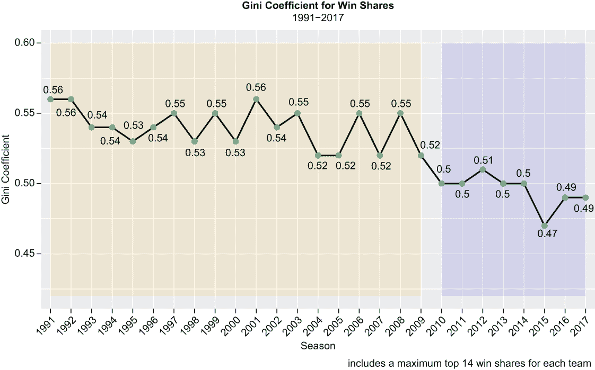
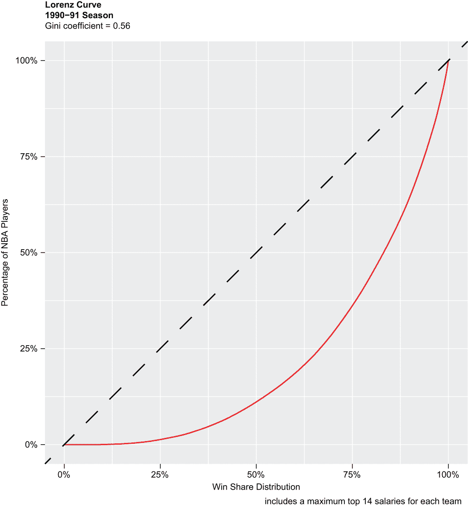
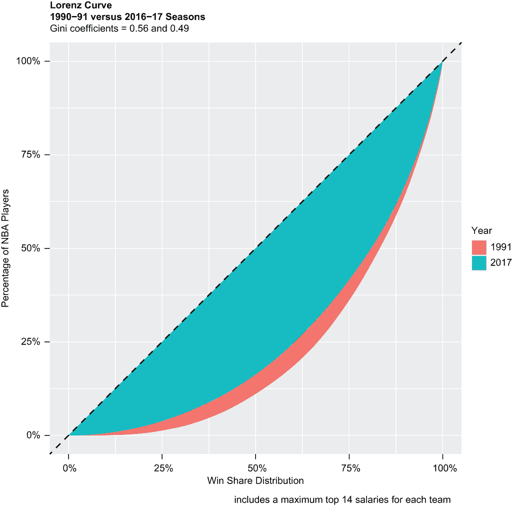
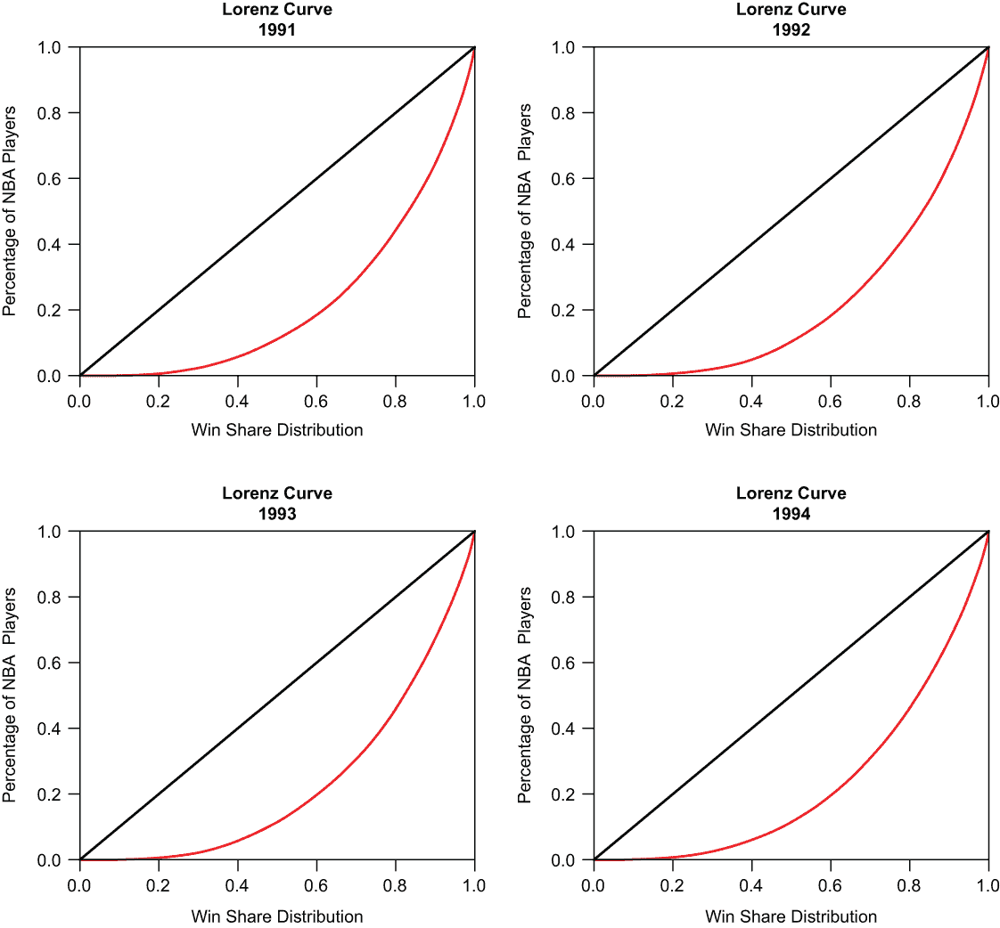
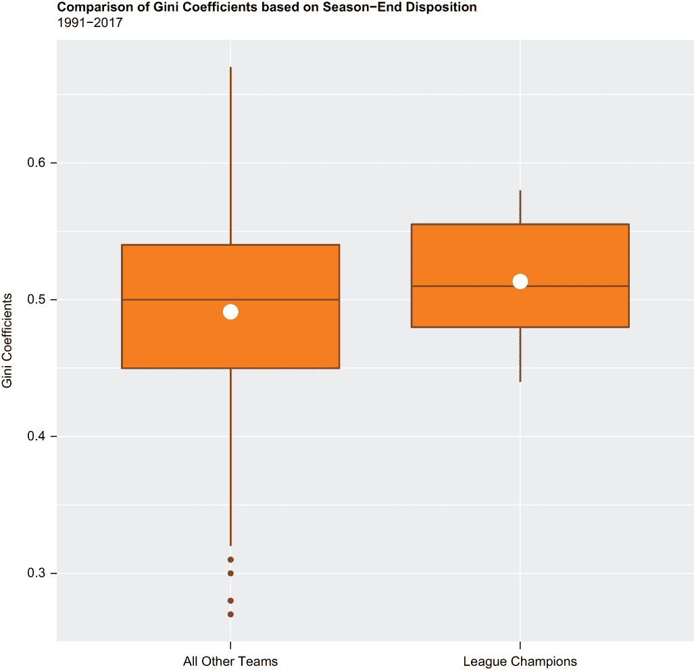
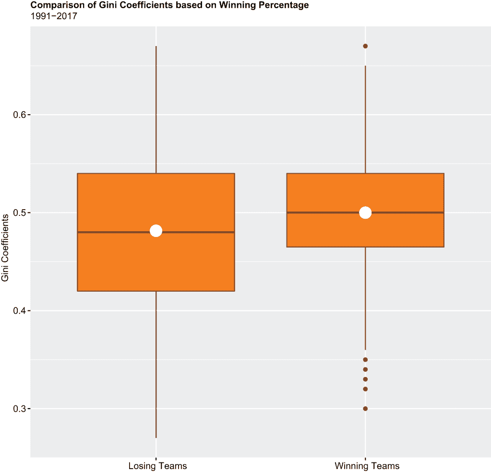
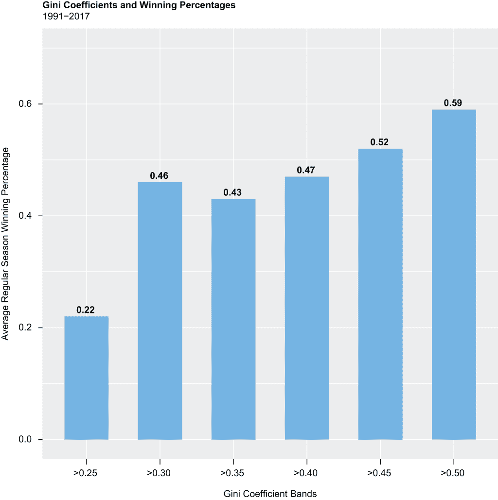

# 13 使用基尼系数和洛伦兹曲线的更多内容

本章涵盖

+   （再次）使用基尼系数

+   创建替代洛伦兹曲线

+   运行显著性检验（t 检验和 F 检验）

+   运行其他效应量检验（除了 Cohen’s d）

+   编写`for`循环

+   编写用户自定义函数

的确，我们将再次计算基尼系数，通过绘制洛伦兹曲线来描绘不平等，进行更多的显著性检验，以及进行额外的效应量检验以补充我们的 t 检验——但本章也包含了大量新的内容：

+   我们将演示如何用最少的代码智能地绘制多个洛伦兹曲线。你将学习如何在同一张图上绘制两条洛伦兹曲线，以比较一个对象中的两个基尼系数，而不是两个。

+   此外，我们将演示如何创建一个简单的`for`循环，作为编写可重复代码行的替代方案，然后通过用一段简短的代码绘制四条洛伦兹曲线来展示我们所学的内容。

+   因为我们将演示如何创建`for`循环，所以我们将展示如果你需要的 R 还没有相应的函数，你可以如何创建自己的函数。我们将首先演示如何创建一对简单的函数，然后提供创建可以估计基尼系数的函数的进一步指导。

+   在前面的章节中，包括第十二章，我们已经进行了 Cohen’s d 效应量测试，以定量和定性测量两个变量在数值尺度上的统计关系。实际上，还有其他效应量测试，除了 Cohen’s d 之外，也能做同样的事情。我们将演示如何运行这些测试，然后讨论在什么情况下哪种测试最好。

+   最后，我们将演示如何运行 F 检验，这是一种用于比较两个或更多组方差的另一种统计检验。F 检验实际上评估的是两个方差比率的统计显著性，或者仅仅是偶然的结果。我们将简要讨论 F 检验何时以及如何最适合你的分析。

在此过程中，我们将计算胜利份额分布的基尼系数，这是我们在第二章和第三章分析的核心球员级高级统计指标。虽然基尼系数主要用于衡量收入或财富的不平等，但实际上可以用来衡量任何类型的不平等，正如我们在上一章所展示的。在本章中，我们的目的是确定胜利份额分布的基尼系数是否与胜负有关，以及是否有任何方差具有统计学意义。我们的零假设是，无论基尼系数是低、高还是介于两者之间，都不会对胜负产生影响。然而，如果球员的薪水确实与生产力相匹配，我们不应该对看到与第十二章类似的结果感到惊讶，但让我们找出一种或另一种方式。我们将首先加载我们所需的包。

## 13.1 加载包

我们在上一章中加载并使用的相同包集——`tidyverse`、`sqldf`、`ineq`、`gglorenz`、`scales`和`effsize`——再次是必需的，另外还需要两个包，`effectsize`和`car`：

+   在前面的章节中，包括第十二章，我们通过`effsize`包执行了一种类型的效果量测试，即 Cohen's d。在本章中，我们再次将通过`effsize`包计算 Cohen's d 估计值，然后我们将通过`effectsize`包执行其他效果量测试。

+   在第五章中，我们从`car`包中调用了`vif()`函数来检查我们的多元线性回归中的多重共线性；在这里，我们将加载`car`包，然后调用它的`recode()`函数来重新编码或重命名字符向量中的元素。

我们通过依次调用基础 R 的`library()`函数来加载八个包：

```
library(tidyverse)
library(sqldf)
library(ineq)
library(gglorenz)
library(scales)
library(effsize)
library(effectsize)
library(car)
```

接下来，我们将导入我们的数据集，并快速浏览我们将要处理的内容。

## 13.2 导入和查看数据

我们的数据集是一个从 Kaggle 下载的.csv 文件，然后存储在我们的默认工作目录中；它包含了从 1950 年到 2017 年每个 NBA 赛季的球员统计数据，包括胜利份额。因此，我们调用`readr read_csv()`函数来导入我们的数据，并在过程中创建一个名为 ws_gini 的对象：

```
ws_gini <- read_csv("seasons_stats.csv")
```

基础 R 的`dim()`函数返回 ws_gini 数据集的维度，即行和列的数量：

```
dim(ws_gini)
## [1] 24624    53
```

我们的数据集有 24,624 个观测值和 53 列宽，其中每个球员/年份/球队组合在 ws_gini 数据集中都占据一个唯一的记录。始终是一个最佳实践，通过消除不必要的或不受欢迎的变量和记录来降低数据的维度，即使没有其他原因，也能让查询和其他代码行运行得更快，并让你在最需要的地方保持专注。因此，我们将从减少数据的宽度开始，然后是长度，来开始我们的数据整理操作。

## 13.3 数据整理

我们首先调用`dplyr select()`函数来筛选 ws_gini 中的三个变量：`Year`（例如，2012 年，代表 2011-12 赛季），`Tm`（例如，CLE 代表克利夫兰骑士队或 DAL 代表达拉斯小牛队），以及`WS`（代表赢球份额）：

```
ws_gini %>%
  select(Year, Tm, WS) -> ws_gini 
```

然后，我们调用`dplyr filter()`函数来筛选 ws_gini 中变量`Year`等于或大于`1991`的部分。从现在起，我们的数据集将包含 1991 年到 2017 年的 NBA 赛季，这与第十二章中的数据紧密相关：

```
ws_gini %>%
  filter(Year >= 1991) -> ws_gini 
```

接下来，我们再次调用`filter()`函数，通过只包括变量`Tm`不等于`TOT`的记录来进一步减少 ws_gini 数据集。因此，我们添加了逻辑运算符不等于`(!=)`来排除未来的这些记录。结果发现，在一个 NBA 赛季中为不止一支球队效力的球员在从 Kaggle 下载的数据中多次出现。例如，现在已经退役的斯宾塞·霍华德（Spencer Hawes）在 2017 年为夏洛特黄蜂队和密尔沃基雄鹿队效力；因此，ws_gini 中 2017 年有斯宾塞·霍华德的三条记录，一条是变量`Tm`等于`CHO`（代表夏洛特），一条是变量`Tm`等于`MIL`（代表密尔沃基），还有一条是变量`Tm`等于`TOT`，这是`CHO`和`MIL`的汇总：

```
ws_gini %>%
  filter(Tm != "TOT") -> ws_gini 
```

再次调用`dim()`函数可以得到 ws_gini 数据集的降维维度：

```
dim(ws_gini)
## [1] 13356     3
```

现在数据集只有 13,356 行长，当然，三列宽。

我们通过两次调用基础 R 的`as.factor()`函数，将变量`Year`和`Tm`转换为因子变量：

```
ws_gini$Year <- as.factor(ws_gini$Year)
ws_gini$Tm <- as.factor(ws_gini$Tm)
```

连续调用基础 R 的`head()`和`tail()`函数分别返回 ws_gini 中的前六个和最后六个观测值——这样你可以看到一些记录的实际样子：

```
head(ws_gini)
##   Year  Tm    WS
##   <fct> <fct> <dbl>
## 1 1991  POR  0.5
## 2 1991  DEN -1.0
## 3 1991  ORL  2.5
## 4 1991  DEN  6.3
## 5 1991  DET  5.5
## 6 1991  POR  6.2

tail(ws_gini)
##       Year  Tm    WS
##       <fct> <fct> <dbl>
## 13351 2017  IND   4.6
## 13352 2017  CHO   5.6
## 13353 2017  BOS   1.0
## 13354 2017  ORL   0.0
## 13355 2017  CHI   0.5
## 13356 2017  LAL   1.1
```

然后，我们调用基础 R 的`summary()`函数，它返回 ws_gini 中剩余三个变量的描述性统计。通过添加`maxsum`参数，我们指示 R 返回最多 40 个水平（因子）但不超过 40 个。变量`Year`包含 26 个水平，变量`Tm`包含 38 个水平（我们的数据包括多个水平或因子，即使特许经营保持不变，球队名称的多个迭代也有不同的水平）。

提醒一下，对于像`WS`这样的数值变量，`summary()`函数返回均值、中位数、最小值、最大值以及第一和第三四分位数。对于像`Year`和`Tm`这样的因子变量，`summary()`函数则返回每个组的观测计数：

```
summary(ws_gini, maxsum = 40)
##    Year       Tm            WS        
##  1991:415   ATL:464   Min.   :-2.100  
##  1992:425   BOS:465   1st Qu.: 0.200  
##  1993:421   BRK: 93   Median : 1.300  
##  1994:444   CHA:183   Mean   : 2.422  
##  1995:430   CHH:207   3rd Qu.: 3.700  
##  1996:489   CHI:445   Max.   :20.400  
##  1997:511   CHO: 53                   
##  1998:494   CLE:473                   
##  1999:474   DAL:477                   
##  2000:468   DEN:474                   
##  2001:490   DET:428                   
##  2002:470   GSW:480                   
##  2003:456   HOU:471                   
##  2004:517   IND:422                   
##  2005:526   LAC:457                   
##  2006:512   LAL:425                   
##  2007:487   MEM:288                   
##  2008:527   MIA:458                   
##  2009:515   MIL:452                   
##  2010:512   MIN:440                   
##  2011:542   NJN:394                   
##  2012:515   NOH:161                   
##  2013:523   NOK: 34                   
##  2014:548   NOP: 89                   
##  2015:575   NYK:452                   
##  2016:528   OKC:163                   
##  2017:542   ORL:455                   
##             PHI:481                   
##             PHO:459                   
##             POR:439                   
##             SAC:449                   
##             SAS:456                   
##             SEA:280                   
##             TOR:402                   
##             UTA:416                   
##             VAN: 98                   
##             WAS:351                   
##             WSB:122
```

如果你已经阅读了第十二章，接下来的代码块应该很熟悉。我们的目的是通过在`Year`和`Tm`组合中筛选出每个组合的前 14 个最高赢球份额来进一步缩短数据集的长度。NBA 中有许多球员因为短期合同而来来去去；通过筛选 ws_gini 数据集，我们可以公平准确地排除 NBA 的临时合同球员，并专注于全职和永久员工：

+   我们首先将数据传递给`dplyr arrange()`函数，该函数按 ws_gini 中的每个 ws_gini 变量对 ws_gini 进行排序。

+   然后，我们调用`dplyr group_by()`和`mutate()`函数以及基本的 R `rank()`函数来创建一个名为`rank`的新变量，其中变量`WS`按降序排序，从 1 到*n*，按我们数据中的每个`Year`和`Tm`组合排序。`rank()`函数内部的负号或负号指示 R 按降序排序或排名变量`WS`。`ties.method`参数指定如何处理平局；当等于`first`时，R 将平局元素分配给连续的、因此不同的排名。

+   最后，我们调用`dplyr filter()`函数，只包括变量`rank`小于或等于`14`的记录。

结果被放入一个名为 ws_gini2 的 tibble 中：

```
ws_gini %>%
  arrange(Year, Tm, WS) %>%
  group_by(Year, Tm) %>%
  mutate(rank = rank(-WS, ties.method = "first")) %>%
  filter(rank <= 14) -> ws_gini2
```

然后，我们调用基本的 R `head()`函数，这次是为了返回 ws_gini2 数据集中的前 14 条记录，以显示这些最后几个操作的输出：

```
head(ws_gini2, n = 14)
## # A tibble: 14 × 4
## # Groups:   Year, Tm [1]
##    Year  Tm       WS  rank
##    <fct> <fct> <dbl> <int>
##  1 1991  ATL    -0.5    14
##  2 1991  ATL    -0.1    13
##  3 1991  ATL     0      11
##  4 1991  ATL     0      12
##  5 1991  ATL     1.1    10
##  6 1991  ATL     1.8     9
##  7 1991  ATL     1.9     8
##  8 1991  ATL     2.5     7
##  9 1991  ATL     4       6
## 10 1991  ATL     4.4     5
## 11 1991  ATL     5.4     4
## 12 1991  ATL     5.6     3
## 13 1991  ATL     6.3     2
## 14 1991  ATL    11.4     1
```

这里有一些观察结果（顺便说一下，ATL 是亚特兰大老鹰队的缩写）：

+   变量`WS`显然是按升序排序的，同样明显的是，我们看到变量`rank`是按降序排序的。这使得我们可以对每个`Year`和`Tm`组合进行子集化，不超过前 14 个胜利贡献值。

+   亚特兰大老鹰队有两名球员在 1991 赛季“获得”了 0.0 胜利贡献值。按照设计，他们被分配了不同但连续的排名；否则，我们就有可能将我们的`Year`和`Tm`组合的子集扩展到超过 14 条记录的风险。

虽然看起来很完美，但我们仍然要执行一系列与上一章中执行的那些类似的完整性检查。我们首先两次调用`sqldf()`函数，来自`sqldf`包，以（1）返回变量`Year`等于`2012`且变量`Tm`等于`GSW`（即金州勇士队）的 ws_gini 中的每条记录；（2）返回变量`Year`也等于`2012`且变量`Tm`也等于`GSW`的 ws_gini2 中的每条记录：

```
sqldf("SELECT * FROM ws_gini WHERE Year = 2012 AND Tm = 'GSW'")
##    Year  Tm   WS
## 1  2012 GSW  0.0
## 2  2012 GSW  0.0
## 3  2012 GSW  1.3
## 4  2012 GSW  0.1
## 5  2012 GSW  2.2
## 6  2012 GSW  1.5
## 7  2012 GSW  0.2
## 8  2012 GSW  0.7
## 9  2012 GSW  0.5
## 10 2012 GSW  5.0
## 11 2012 GSW  1.5
## 12 2012 GSW  0.1
## 13 2012 GSW  2.8
## 14 2012 GSW  3.5
## 15 2012 GSW  0.1
## 16 2012 GSW  1.7
## 17 2012 GSW -0.2
## 18 2012 GSW  0.9
## 19 2012 GSW  0.6
## 20 2012 GSW  3.4

sqldf("select * FROM ws_gini2 WHERE Year = 2012 AND Tm = 'GSW'")
##    Year  Tm  WS rank
## 1  2012 GSW 0.2   14
## 2  2012 GSW 0.5   13
## 3  2012 GSW 0.6   12
## 4  2012 GSW 0.7   11
## 5  2012 GSW 0.9   10
## 6  2012 GSW 1.3    9
## 7  2012 GSW 1.5    7
## 8  2012 GSW 1.5    8
## 9  2012 GSW 1.7    6
## 10 2012 GSW 2.2    5
## 11 2012 GSW 2.8    4
## 12 2012 GSW 3.4    3
## 13 2012 GSW 3.5    2
## 14 2012 GSW 5.0    1
```

我们的第一条`SELECT`语句返回了 20 条记录，没有特定的排序顺序，而我们的第二条`SELECT`语句返回了 14 条记录，其中变量`WS`按升序排序，变量`rank`按降序排序。这是正确的。

接下来，我们通过用波士顿凯尔特人队（BOS）替换金州勇士队，并编写两个简短的`dplyr`代码块而不是`sqldf`代码来执行相同的操作。我们将 ws_gini 和 ws_gini2 数据集传递给`filter()`函数，以子集化变量`Year`等于`2017`且变量`Tm`等于`BOS`的结果：

```
ws_gini %>%
  filter(Year == 2017 & Tm == "BOS")
##    Year  Tm   WS
## 1  2017 BOS  3.1
## 2  2017 BOS  1.5
## 3  2017 BOS  6.7
## 4  2017 BOS  0.6
## 5  2017 BOS  6.3
## 6  2017 BOS  0.1
## 7  2017 BOS  2.1
## 8  2017 BOS  5.0
## 9  2017 BOS  0.1
## 10 2017 BOS  4.1
## 11 2017 BOS  1.4
## 12 2017 BOS  3.2
## 13 2017 BOS 12.6
## 14 2017 BOS  0.3
## 15 2017 BOS  1.0

ws_gini2 %>%
  filter(Year == 2017 & Tm == "BOS")
## # A tibble: 14 × 4
## # Groups:   Year, Tm [1]
##    Year  Tm       WS  rank
##    <fct> <fct> <dbl> <int>
##  1 2017  BOS     0.1    14
##  2 2017  BOS     0.3    13
##  3 2017  BOS     0.6    12
##  4 2017  BOS     1      11
##  5 2017  BOS     1.4    10
##  6 2017  BOS     1.5     9
##  7 2017  BOS     2.1     8
##  8 2017  BOS     3.1     7
##  9 2017  BOS     3.2     6
## 10 2017  BOS     4.1     5
## 11 2017  BOS     5       4
## 12 2017  BOS     6.3     3
## 13 2017  BOS     6.7     2
## 14 2017  BOS    12.6     1
```

我们的第一段`dplyr`代码返回了 15 条未排序的记录，而我们的第二段代码通过过滤掉 2017 赛季获得 0.1 胜利贡献值的两名球员中的一名，只返回了 14 条记录。这是正确的。

最后，让我们运行两个额外的`SELECT`语句，计算变量`Tm`等于`GSW`和`Tm`等于`BOS`时的 ws_gini2 行数。行数应等于最多 378，这是 27 个赛季乘以每个赛季最多 14 名球员/赢分份额的乘积（有些赛季的某些球队在其阵容中少于 14 名球员）：

```
sqldf("select COUNT(*) FROM ws_gini2 WHERE Tm = 'GSW'") 
##   COUNT(*)
## 1      377

sqldf("select COUNT(*) FROM ws_gini2 WHERE Tm = 'BOS'")
##   COUNT(*)
## 1      378
```

行数分别等于 377 和 378。这也检查无误。

现在我们知道数据处于良好状态，我们可以通过计算基尼系数来开始我们的分析。

## 13.4 基尼系数

再次强调，基尼系数是经常报道的不平等度量，通常是在某些人口中的收入不平等，其中系数等于 0 表示完全平等的状态，系数等于 1 表示完全不平等的状态。在第十二章中，我们计算基尼系数来衡量薪酬不平等；在这里，我们将计算基尼系数来衡量赢分不平等。

在下一块代码中，我们将 ws_gini2 传递给`dplyr group_by()`和`summarize()`函数，以计算变量`Year`中每个级别的联赛基尼系数。`ineq`包中的`ineq`函数否则正在做我们的重活，通过一个名为`gc`的新变量返回年度基尼系数，四舍五入到小数点后两位。我们的结果被转换为一个名为 ws_gini_summary 的 tibble。

```
ws_gini2 %>%
  group_by(Year) %>%
  summarize(gc = round(ineq(WS), digits = 2)) -> ws_gini_summary
print(ws_gini_summary)
## # A tibble: 27 × 2
##    Year     gc
##    <fct> <dbl>
##  1 1991   0.56
##  2 1992   0.56
##  3 1993   0.54
##  4 1994   0.54
##  5 1995   0.53
##  6 1996   0.54
##  7 1997   0.55
##  8 1998   0.53
##  9 1999   0.55
## 10 2000   0.53
## # ... with 17 more rows
```

然后我们将结果绘制在`gpplot2`折线图中（见图 13.1）。我们改变了一些之前折线图的美学设置：

+   `geom_line()`函数绘制一条宽度为`ggplot2`默认宽度一半的黑色线。

+   `geom_point()`函数在沿线添加五倍于默认大小的点。因此，我们的图表假定看起来像一个连接的散点图。

+   `geom_text()`函数在连接到 ws_gini_summary 变量`gc`的点上方添加标签。`nudge_x`和`nudge_y`参数用于将标签定位到点相对的位置——数字越小，标签越靠近。如果为负数，R 将数字放置在点下方而不是上方。`check_overlap`参数是 R 避免尽可能重叠标签的指令。

+   `theme()`函数的第一和第二次调用将标题和副标题居中，从而覆盖了`ggplot2`的默认设置，即左对齐两者。通过将`hjust`参数（代表水平调整）设置为`0.5`，我们将标题和副标题移至图表宽度的中点。或者，我们可以通过将`hjust`参数设置为`1`来右对齐标题和副标题。

+   `theme()`函数的第三次调用将 x 轴标签旋转 45 度，并将它们水平对齐在图表下方。

+   `annotate()`函数被调用了两次，以添加一对透明的矩形形状，其中`xmin`、`xmax`、`ymin`和`ymax`参数确定了水平和垂直边界。这是一个很好的细节，立即暗示了图表有两个不同的故事要讲述。



图 13.1 NBA 赢分分布的年度或赛季基尼系数

最后，这是我们的第一个图表的代码块：

```
ggplot(ws_gini_summary, aes(x = Year, y = gc, group = 1)) + 
  geom_line(aes(y = gc), color = "black", size = .5) + 
  geom_point(size = 5, color = "seagreen3") +
  geom_text(aes(label = gc),
            nudge_x = 0.01, nudge_y = 0.01,
            check_overlap = TRUE, size = 2.5) +
  labs(title = "Gini Coefficient for Win Shares", 
       subtitle = "1991-2017",
       x = "Season", 
       y = "Gini Coeffiicient",
       caption = "includes a maximum top 14 win shares for each team") +
  ylim(0.42, 0.60) +
  theme(plot.title = element_text(hjust = 0.5, face = "bold")) +
  theme(plot.subtitle = element_text(hjust = 0.5)) +
  theme(axis.text.x = element_text(angle = 45, hjust = 1)) +
  annotate("rect", xmin = "1991", xmax = "2009", 
           ymin = 0.42, ymax = 0.60, alpha = 0.1, fill = "orange") +
  annotate("rect", xmin = "2010", xmax = "2017", 
           ymin = 0.42, ymax = 0.60, alpha = 0.1, fill = "blue") 
```

我们立即得出的结论如下：

+   这些是高基尼系数：在 1991 年至 2017 年之间，基尼系数两次达到峰值 0.56，并且从未低于 0.47。再次强调，基尼系数等于或大于 0.40 表明存在显著的不平等，无论测量的是什么。

+   我们在图表中添加了一对阴影矩形来突出结果之间的对比。在 1991 年至 2009 年之间，基尼系数从未低于 0.52，但在 2010 年至 2017 年之间，基尼系数达到峰值 0.51 一次，并且在此之后从未高于 0.50。再次强调，这是一个相当简单的技术，可以清楚地表明我们有两个不同的结果集。

+   因此，从 1991 年到 2017 年，联赛的基尼系数在赢分方面呈下降趋势；相比之下，我们在第十二章中探讨的工资基尼系数在 1990 年代中期急剧上升，并从那时起稳定到 2018 年。因此，在 1990 年代，工资和赢分之间的基尼系数不匹配，而在 2010 年至 2017 年之间，它们每年都是相同的，或者几乎是相同的；换句话说，它们随着时间的推移逐渐趋同。

在接下来的几节中，我们将展示不同的方法来可视化球员生产力的不平等，使用洛伦兹曲线。

## 13.5 洛伦兹曲线

首先，如果我们尝试从一个包含负元素的向量创建洛伦兹曲线，R 将抛出一个错误，因此我们需要查询我们的数据并采取纠正措施。我们在第二章和第三章中学到，球员在职业生涯中可能会“累积”负的赢分。在以下代码中，我们调用`sqldf()`函数来返回 ws_gini2 中变量`WS`小于 0 的记录数：

```
sqldf("SELECT COUNT(*) FROM ws_gini2 WHERE WS < 0") 
##   COUNT(*)
## 1      227
```

果然，我们有 227 条记录，其中变量`WS`等于某个小于 0 的数字。至少有两个明显的解决方案。一个是调用`filter()`函数并从我们的数据集中删除这 227 条记录；另一个是将负的赢分调整为等于 0。我们将采取后一种方法。

在以下代码行中，我们应用了方括号，也称为提取运算符，来索引 ws_gini2 数据集中值小于 0 的`WS`向量，然后修改这些元素，使它们等于 0。然后，我们调用基本的 R `min()`函数来返回变量`WS`中的最小值；正如预期的那样，它现在等于 0：

```
ws_gini2$WS[ws_gini2$WS < 0] = 0.0
min(ws_gini2$WS)
## [1] 0
```

我们使用下一代码块创建了第一个洛伦兹曲线（见图 13.2）：

+   我们首先从 `dplyr` 包中调用 `filter()` 函数，对 ws_gini2 数据集进行子集化，其中变量 `Year` 等于 `1991`。最终结果是名为 gini91 的新数据集。

+   尽管我们的洛伦兹曲线本质上是对 `ggplot2` 的扩展，不仅需要 `ggplot()` 函数，还需要 `gglorenz` 的 `stat_lorenz()` 函数，但其语法与其他任何 `ggplot2` 对象完全一致。因此，我们的图表是通过调用 `ggplot()` 函数初始化的，将 gini91 作为我们的数据源，然后将变量 `WS` 作为唯一的美学映射传递。

+   `gglorenz` 包中的 `stat_lorenz()` 函数绘制洛伦兹曲线。当设置为 `TRUE` 时，人口按降序排列；当设置为 `FALSE` 时，人口则按升序排列。由于大多数洛伦兹曲线都是按人口升序排列创建的，而不是相反，我们将 `desc` 参数（表示降序）设置为 `FALSE`。此外，我们指示 R 用实线绘制线条，并将其宽度设置为默认宽度的两倍。

+   `ggplot2 coord_fixed()` 函数固定 x 轴和 y 轴的比率，使它们的刻度相等。

+   `geom_abline()` 函数绘制一条虚线对角线，代表完全相等的状态。

+   `scale_x_continuous()` 和 `scale_y_continuous()` 函数，结合 `scales` 包，分别将 x 轴和 y 轴的标签从小数转换为百分比。



图 13.2 1990-91 赛季 NBA 赛季的联赛范围内胜利份额分布的洛伦兹曲线，基尼系数等于 0.56

下面是我们的 `dplyr` 和 `ggplot2` 代码：

```
ws_gini2 %>%
  filter(Year == 1991) -> gini91

ggplot(gini91, aes(WS)) +
  stat_lorenz(desc = FALSE, color = "red", lwd = 2) +
  coord_fixed() +
  geom_abline(linetype = "dashed", lwd = 1.5) +
  labs(title = "Lorenz Curve\n1990-91 Season", 
       subtitle = "Gini coefficient = 0.56",
       x = "Win Share Distribution",
       y = "Percentage of NBA Players",
       caption = "includes a maximum top 14 salaries for each team") +
  scale_x_continuous(labels = percent) +
  scale_y_continuous(labels = percent) +
  theme(plot.title = element_text(face = "bold")) 
```

在 1990-91 赛季的 NBA 赛季中，大约 25% 的胜利份额是由大约 1% 的球员产生的；大约 50% 的所有胜利份额是由大约 12% 的球员产生的；大约 75% 的胜利份额是由大约 37% 的球员产生的。这正是我们创建第十二章洛伦兹曲线的方式。但假设我们想要在单个图形表示中比较和可视化两个赛季之间的基尼系数，并且同时创建一个比我们之前的洛伦兹曲线更美观的图表。

我们的第一步是调用 `dplyr filter()` 函数，对 ws_gini2 数据集进行子集化，其中变量 `Year` 等于 `1991` 或 `2017`，基尼系数分别为 0.56 和 0.49。管道 (`|`) 是一个逻辑运算符，表示“或”。我们将结果转换到一个名为 gini9117 的新对象中：

```
ws_gini2 %>%
  filter(Year == 1991 | Year == 2017) -> gini9117 
```

然后我们调用基础 R 的 `head()` 和 `tail()` 函数，以返回 gini9117 中的前三个和最后三个记录：

```
head(gini9117, n = 3)
## # A tibble: 3 × 4
## # Groups:   Year, Tm [1]
##   Year  Tm       WS  rank
##   <fct> <fct> <dbl> <int>
## 1 1991  ATL       0    14
## 2 1991  ATL       0    13
## 3 1991  ATL       0    11

tail(gini9117, n = 3)
## # A tibble: 3 × 4
## # Groups:   Year, Tm [1]
##   Year  Tm       WS  rank
##   <fct> <fct> <dbl> <int>
## 1 2017  WAS     8.5     3
## 2 2017  WAS     8.8     2
## 3 2017  WAS     9.4     1
```

变量 `Tm` 中的因素按字母顺序排列。也就是说，我们的数据集从 1991 年的亚特兰大老鹰队开始，以 2017 年的华盛顿奇才队结束。所以这是正确的。

我们接下来的代码块绘制了一个新的、改进的洛伦兹曲线（见图 13.3）。语法与之前相同，但有两大例外——（1）我们添加了一个美学参数`fill`，其值等于变量`Year`，（2）我们用额外的`geom`等于`polygon`替换了`stat_lorenz()`函数内的单个洛伦兹曲线或线条，这绘制了一对填充区域曲线：

```
ggplot(gini9117, aes(WS, fill = Year)) +
  stat_lorenz(geom = "polygon", desc = FALSE) +
  coord_fixed() +
  geom_abline(linetype = "dashed") +
  labs(title = "Lorenz Curve\n1990-91 versus 2016-17 Seasons", 
       subtitle = "Gini coefficients = 0.56 and 0.49",
       x = "Win Share Distribution", 
       y = "Percentage of NBA Players",
       caption = "includes a maximum top 14 salaries for each team") +
  scale_x_continuous(labels = percent) +
  scale_y_continuous(labels = percent) +
  theme(plot.title = element_text(face = "bold")) 
```



图 13.3 1991 年和 2017 年联赛范围内的赢分分布洛伦兹曲线合并为一个单一图形对象

较小的曲线代表 2017 年赢分分布的基尼系数，而较大的曲线代表 1991 年的基尼系数。不要被阴影所迷惑——我们仍在测量每条洛伦兹曲线与虚线对角线之间的距离。这是一种比创建成对的并排图表更有效、更高效的方式来直观比较两个基尼系数。

我们将在下一节中展示创建洛伦兹曲线的另一种方法——实际上，是一系列洛伦兹曲线。

## 13.6 循环

到目前为止，我们已经展示了两种创建`ggplot2`洛伦兹曲线的方法。但假设我们想要或需要为数据集中的 27 个 NBA 赛季中的每一个创建一个单独的洛伦兹曲线。一种方法是创建一个洛伦兹曲线，复制粘贴代码 26 次，然后在每次迭代中可能更改几个参数。是的，这很繁琐，但并不困难。另一种方法是编写一个`for`循环。

### 13.6.1 简单演示

当同一个任务必须重复有限次数时，`for`循环是一种高效且常见的选择。代码量更少，这最小化了开发阶段中人为错误的可能性，并在之后最大化了可维护性，因为修复和其他更改只需要应用一次，而不是，比如说，27 次。

下面是最简单的`for`循环：

```
for (i in 1:5)  {
  print(i * 2)
}
## [1] 2
## [1] 4
## [1] 6
## [1] 8
## [1] 10
```

下面是刚刚发生的事情：索引`i`被迭代地替换为向量 1:5 中的每个值。因为我们的向量中的第一个值等于`1`，所以我们的`for`循环首先将`i`替换为数字`1`，然后执行花括号之间的代码。通常，`for`循环以`i`作为计数器初始化，这是迭代的简称，但`for`循环也可以用任何字母或字符字符串初始化。然后`for`循环遍历向量，直到达到最终值，此时它停止并退出。

我们用一小段代码返回了五个值，而如果用其他方法，我们需要依次将五个数字乘以二。如果我们应该将这五个相同的数字乘以三而不是二，那么我们就需要五次而不是一次地实施更改。

### 13.6.2 应用所学知识

现在，对于我们的洛伦兹曲线，我们首先整理数据，以最好地展示使用`for`循环创建多个图的使用方法。我们首先调用`dplyr ungroup()`函数来解耦，或取消组合，之前通过调用`group_by()`函数组合的两个变量，`Year`和`Tm`。我们只想对变量`Year`和`WS`进行子集操作，但由于`Year`和`Tm`目前是组合的，否则 R 将强制我们保留变量`Tm`：

```
ws_gini2 %>%
  ungroup(Tm, Year) -> ws_gini2
```

接下来，我们调用`dplyr filter()`函数来缩短 ws_gini2 的长度，只包括变量`Year`等于`1991`、`1992`、`1993`或`1994`的记录。我们可以用 4 年的数据同样有效地展示`for`循环的价值，就像我们用 27 年的数据一样。然后，我们将结果转换成一个新的 tibble，称为 ws9194。`head()`和`tail()`函数返回前六个和后六个观测值：

```
ws_gini2 %>%
  filter(Year == 1991 | Year == 1992 | Year == 1993 | 
           Year == 1994) -> ws9194

head(ws9194)
## # A tibble: 6 × 4
##   Year  Tm       WS  rank
##   <fct> <fct> <dbl> <int>
## 1 1991  ATL     0      14
## 2 1991  ATL     0      13
## 3 1991  ATL     0      11
## 4 1991  ATL     0      12
## 5 1991  ATL     1.1    10
## 6 1991  ATL     1.8     9

tail(ws9194)
## # A tibble: 6 × 4
##   Year  Tm       WS  rank
##   <fct> <fct> <dbl> <int>
## 1 1994  WSB     1.3     6
## 2 1994  WSB     1.9     5
## 3 1994  WSB     3.1     4
## 4 1994  WSB     3.8     3
## 5 1994  WSB     3.9     2
## 6 1994  WSB     5.6     1
```

然后，我们通过调用`tidyr`包中的`pivot_wider()`函数将 ws9194 从长格式转换为宽格式。这样做后，变量`Year`被拆分为四个列，从`1991`到`1994`，用变量`WS`的元素填充。然后`head()`函数返回前六个记录：

```
ws9194 %>%
  pivot_wider(names_from = Year, values_from = WS) -> ws9194
head(ws9194)
## # A tibble: 6 × 6
##   Tm     rank `1991` `1992` `1993` `1994`
##   <fct> <int>  <dbl>  <dbl>  <dbl>  <dbl>
## 1 ATL      14    0      0      0      0  
## 2 ATL      13    0      0.1    0.1    0  
## 3 ATL      11    0      1.1    0.2    1.3
## 4 ATL      12    0      0.2    0.2    0.2
## 5 ATL      10    1.1    1.1    0.3    1.4
## 6 ATL       9    1.8    2.1    1.1    2.2
```

我们不需要变量`Tm`和`rank`来创建我们的洛伦兹曲线，所以我们接下来调用`dplyr select()`函数来对 ws9194 进行子集操作，除了`Tm`和`rank`之外的所有变量（注意`c()`函数调用之前的前导减号）：

```
ws9194 %>%
  select(-c(Tm, rank)) -> ws9194 
```

然后，我们通过调用基础 R 的`as.data.frame()`函数将 ws9194 从 tibble 转换为数据框。当我们第一次创建 tibble 时，我们提到 tibbles 与数据框有许多相同的属性，但至少有三个重要的区别。第一个是，当调用`print()`函数时，tibbles 只返回前 10 行和屏幕上能容纳的任意数量的列（我们之前已经看到过）。当处理大型数据集时这通常很方便，但有时也会令人沮丧。第二个是，当对数据进行子集操作时，tibbles 有时需要“解决方案”（我们之前也看到过）。

第三个区别更为重要——tibbles 并不总是与旧代码兼容。结果是，我们即将创建的洛伦兹曲线，部分使用基础 R 代码创建，不能将 ws9194 作为 tibble 读取，但当 ws9194 是数据框时可以。因此，我们调用`as.data.frame()`函数将 ws9194 从 tibble 转换为数据框。然后，我们调用基础 R 的`class()`函数，它返回 ws9194 的类，并确认它现在是一个数据框：

```
ws9194 <- as.data.frame(ws9194)
class(ws9194)
## [1] "data.frame"
```

最后，我们从基础 R 中调用`names()`函数来重命名 ws9194 中剩余的四列，分别为`a`、`b`、`c`和`d`：

```
names(ws9194) <- c("a", "b", "c", "d")
head(ws9194)
##     a   b   c   d
## 1 0.0 0.0 0.0 0.0
## 2 0.0 0.1 0.1 0.0
## 3 0.0 1.1 0.2 1.3
## 4 0.0 0.2 0.2 0.2
## 5 1.1 1.1 0.3 1.4
## 6 1.8 2.1 1.1 2.2
```

现在，我们可以开始编写一个 `for` 循环，并使用它来创建四个洛伦兹曲线，每个曲线对应于 ws9194 数据集中的四个年份。首先，我们调用基础 R 的 `par()` 函数来将我们的四个洛伦兹曲线排列在一个 2 × 2 矩阵中。`mfrow` 参数告诉 R 将图表排列为 1991 年和 1992 年在上部，1993 年和 1994 年在底部；如果我们调用 `mfcol` 参数，R 将将 1991 年和 1992 年排列在左侧，1993 年和 1994 年排列在右侧。

在剩余的代码块中，发生以下情况：

+   我们首先创建一个循环向量，称为 `loop.vector`，它最终将迭代四次，或者在其他情况下循环遍历 ws9194 数据集中的每一列或向量。

+   循环对象随后被初始化为 `i`。

+   开括号和闭括号内的代码将被执行四次，每次对应于一列或向量，从而生成四个相应的图表。

+   数据被存储为 x，然后用于生成我们的洛伦兹曲线，这些曲线是通过基础 R 的 `plot()` 函数和 `ineq` 包中的 `Lc()` 函数的组合来创建的（见图 13.4）。

+   `paste0()` 函数是一个内置的 R 函数，它可以将元素连接起来，而不需要分隔符。我们每个洛伦兹曲线的标题实际上是一个顶部标题和底部副标题，其中洛伦兹曲线打印在顶部，适用的年份打印在底部；在 R 中，`\n` 在字符字符串中使用时类似于回车符。年份是通过附加或连接 `199` 和 `i`（或 `1`、`2`、`3`、`4`，每个循环依次进行）来返回的。



图 13.4 从 `for` 循环和基础 R 创建的 1991 年至 1994 年联赛洛伦兹曲线

结果是四个洛伦兹曲线合并成一个单一的图形对象：

```
par(mfrow = c(2, 2)) 

loop.vector <- 1:4

for (i in loop.vector) {
x <- ws9194[,i]

plot(Lc(x), col = "red", lwd = 2,
      main = paste0("Lorenz Curve\n", "199", i),
      xlab = "Win Share Distribution",
      ylab = "Percentage of NBA Players")
}
```

如果我们不知道其他情况，我们可能会估计基尼系数大约等于 0.50。 (根据我们显示的年度联赛 Gini 系数的时间序列图，实际的系数在 1991 年和 1992 年为 0.56，在 1993 年和 1994 年为 0.54。) 但更重要的是，我们已经展示了如何编写一个 `for` 循环，在这种情况下，用不到四分之一的代码就能创建四个图表。

在下一节中，我们将假设 R 中不包含任何内置或包装的函数来计算基尼系数，因此我们将创建一个自己的函数。

## 13.7 用户自定义函数

R 实质上是一种 *函数式* 编程语言，这意味着 R 中的几乎所有内容都源自内置或包装的函数。仅在这一章中，我们就已经调用了近 40 个独特的函数。每个函数都包含以下组件：

+   *函数名称*—函数的实际名称。函数名称通常是唯一的，但考虑到新包和函数的激增，这并不一定。非常简单，`pivot_wider()` 函数的函数名称是 `pivot_wider`。

+   *参数*—函数运行所需的一个或多个参数或输入。例如，当我们调用 `pivot_wider()` 函数时，我们随后在括号内传递两个参数，这些参数通过逗号分隔，告诉 R 从哪个数据集的哪个变量中提取新列，以及从哪个其他变量中填充这些新列。

+   *函数体*—大致包含一组定义函数应该做什么的语句。与函数名称和函数参数不同，函数体对我们来说是不可见的；我们通过经验或阅读了解函数应该做什么。

+   *返回值*—函数运行时预期的输出。例如，当我们对连续变量调用 `mean()` 函数时，我们期望 R 返回一个表示平均数或均值的数值。

当我们说 R 是一种函数式编程语言时，这也是因为我们能够编写自己的函数，这些函数通常被称为用户定义函数。它们包含与内置或打包函数相同的组件，并且采用相同的语法。

让我们编写一个函数，将 r，即一对连续变量之间的相关系数，转换为 r²，如果我们对其中一个连续变量进行回归，它代表可以由预测变量解释的目标变量的方差比例。

我们函数的名称，位于赋值运算符的左侧，被称为 `r_to_ rsquared()`。函数名称应该比创意性更强，更直观。我们的函数只需要一个参数，或者输入，那就是 `r`。函数体和返回值位于一对开括号和闭括号内。我们的 `r_to_ rsquared()` 函数通过平方 `r` 并返回结果，将 `r` 转换为 `r²`。我们的第一个用户定义函数如下：

```
r_to_rsquared <- function(r) {
   rsquared <- r²
   return(rsquared)
 }
```

然后，我们调用该函数，并将 `.42` 作为 `r` 的值传递。我们的函数返回 r²，即 0.1764。

```
r_to_rsquared(.42)
## [1] 0.1764
```

现在让我们编写第二个用户定义函数，它将 `r²` 转换为 `r`：

+   我们的新函数被称为 `rsquared_to_r()`。

+   它需要一个参数，即 `r²` 的值，才能运行。

+   然后，它通过计算平方根并将结果返回，将 `r²` 转换为 `r`。

我们的第二个用户定义函数“看起来”和第一个完全一样：

```
rsquared_to_r <- function(rsquared) {
   r <- sqrt(rsquared)
   return(r)
 }
```

我们随后调用该函数，并将 0.1764 作为参数传递，以获得 0.42 的返回值：

```
rsquared_to_r(.1764)
## [1] 0.42
```

接下来，我们将创建一个函数来*估计*洛伦兹曲线的基尼系数：

+   我们的函数采用 `gini.est()` 的名称。

+   它需要恰好传递三个参数：

    +   `a` 代表当累积赢分分布等于 40% 时估计的累积人口百分比。

    +   `b` 代表当累积赢分分布等于 60% 时估计的累积人口百分比。

    +   `c` 代表当累积赢分分布等于 80% 时估计的累积人口百分比。换句话说，给定三个 x 轴坐标——40%、60% 和 80%——我们通过洛伦兹曲线估计相应的 y 轴坐标。当 x 等于 0% 或 100% 时，我们已知 y 的值。

+   函数体计算估计的基尼系数，简称为 gini，并返回结果。估计的基尼系数首先通过将洛伦兹曲线下方的面积分成互斥的三角形，估计每个三角形的面积，并将估计值相加；然后将这个总和乘以 2，然后将这个乘积减去 1。关于 1991 年至 1994 年 NBA 赛季，我们应该得到等于或略大于 0.50 的基尼系数。

每个洛伦兹曲线下方的面积被分成四个三角形，其中估计的面积等于宽度（x 轴上两点之间的距离）乘以高度（y 轴上两点之间的距离，其中必须提供 `a`、`b` 和 `c` 的估计）乘以 0.5：

```
gini.est <- function(a, b, c) {
  gini <- 1 - 2 * ((0.4 - 0.0) * (a + 0) * 0.5 +
                   (0.6 - 0.4) * (b + a) * 0.5 +
                   (0.8 - 0.6) * (c + b) * 0.5 +
                   (1.0 - 0.8) * (1 + c) * 0.5)
  return(gini)
}
```

现在我们来运行 `gini.est()` 函数，但只传递所需的三个参数中的两个：

```
gini.est(.05, .18)
## Error in gini.est(0.05, 0.18): argument "c" is missing, with no default
```

R 抛出错误，因为我们提供了 `a` 和 `b`，但没有提供 `c`。

让我们这次做对。根据我们为 1991 年 NBA 赛季创建的洛伦兹曲线，我们估计 40% 的赢分由我们数据集中那一年 5% 的球员获得，60% 的赢分由 18% 的球员获得，80% 的赢分由 44% 的球员获得：

```
gini.est(.05, .18, .44)
## [1] 0.522
```

我们的功能返回一个估计的基尼系数等于 0.522；1991 年的实际基尼系数为 0.56。所以虽然我们的函数并不完美，但它仍然返回了一个足够合理的估计。

现在我们为 1992 年、1993 年和 1994 年 NBA 赛季运行 `gini.est()` 函数：

```
gini.est(.05, .19, .44)
## [1] 0.518
gini.est(.06, .20, .44)
## [1] 0.508
gini.est(.06, .20, .44)
## [1] 0.508
```

我们一直在低估我们的估计——基尼系数当然在 1992 年等于 0.56，在 1993 年和 1994 年等于 0.54。如果我们进一步分解曲线下方的面积并进行额外的几何计算，我们的函数可能会证明更准确。但更重要的是，我们已经展示了如何在 R 中创建用户定义的函数。现在让我们看看实际的基尼系数如何与胜负相关。

## 13.8 赢分不平等和冠军

我们在这里的目的是通过按冠军球队与其他所有球队分组来衡量赢分不平等，进行 t 检验以确定两组之间平均基尼系数的方差在统计上是否显著，然后围绕同一组进行成对效应量测试。换句话说，我们将在过程中进行“旧”和“新”测试的混合。然而，必须首先执行一系列数据处理操作。

### 13.8.1 数据整理

我们接下来的代码块重新排列了`ws_gini2`，这是我们演示`for`循环和用户定义函数之前的工作数据集，以便每个年份（`Year`）和团队（`Tm`）组合的单独胜利份额（`WS`）成为它们自己的列：

+   变量`rank`并不在我们的分析中起作用；它仅被创建来帮助我们子集最初导入的数据。因此，我们调用`dplyr select()`函数来子集`ws_gini2`中的所有变量，除了`rank`。

+   然后，我们将`ws_gini2`数据集传递给`dplyr group_by()`、`mutate()`和`row_number()`函数，以创建一个名为`id`的新变量，它仅是一个连续数字的列，每个`Year`和`Tm`组合都有独立的序列。

+   然后，我们调用`tidyr pivot_wider()`函数将`ws_gini2`数据集从长格式转换为宽格式，其中变量`id`被拆分为列，然后变量`WS`的值用于填充这些新列中的单元格。

结果是一个名为`ws_gini3`的新 tibble。对基础 R 的`head()`函数的调用返回前六个观测值，以便你了解刚刚创建的内容。这是将我们的数据准备与另一个数据集合并的第一步：

```
ws_gini2 %>%
  select(-c(rank)) -> ws_gini2

ws_gini2 %>%
  group_by(Tm, Year) %>%
  mutate(id = row_number(WS)) %>%
  pivot_wider(names_from = id, values_from = WS) -> ws_gini3
head(ws_gini3)
## # A tibble: 6 × 16
## # Groups:   Tm, Year [6]
##   Year  Tm      `1`   `2`   `3`   `4`   `5`   `6`
##   <fct> <fct> <dbl> <dbl> <dbl> <dbl> <dbl> <dbl>
## 1 1991  ATL     0     0     0     0     1.1   1.8
## 2 1991  BOS     0     0     0     0     0.3   1.2
## 3 1991  CHH     0     0.1   0.3   0.6   1.8   1.8
## 4 1991  CHI     0.5   0.9   1.5   1.7   2     2.3
## 5 1991  CLE     0     0     0.2   0.6   1     1.3
## 6 1991  DAL     0.1   0.4   0.6   0.6   0.6   0.7
##    `7`   `8`   `9`  `10`  `11`  `12`  `13`  `14`
##   <dbl> <dbl> <dbl> <dbl> <dbl> <dbl> <dbl> <dbl>
## 1 1.9   2.5   4     4.4   5.4   5.6   6.3  11.4
## 2 3.5   4.7   5.9   6.6   7.5   7.9   8.3  10
## 3 2     2     2.1   2.7   3     3     4.1   4.8
## 4 4.1   4.2   5.7  10.3  11.2  20.3  NA    NA  
## 5 1.5   1.6   2     2.4   3.1   3.4   9     9.8
## 6 0.7   1     1.6   1.7   4.3   5.3   5.5   7.6
```

编号列根本不与变量`rank`相关联；事实上，胜利份额现在是按升序从左到右排序的。这是可以的，因为排序或顺序不再重要。

我们随后从基础 R 中调用`names()`函数来重命名所有`ws_gini3`列名。当然，这包括变量`Year`和`Tm`，它们将被分别重命名为`season_end`和`team`，以与我们的第十二章数据保持一致。`head()`函数当然返回前六个观测值：

```
names(ws_gini3) = c("season_end", "team", "ws1", "ws2", "ws3", "ws4", 
                    "ws5", "ws6", "ws7", "ws8", "ws9", "ws10", "ws11", 
                    "ws12", "ws13", "ws14")

head(ws_gini3)
## # A tibble: 6 × 16
## # Groups:   team, season_end [6]
##   season_end team    ws1   ws2   ws3   ws4   ws5   ws6   
##   <fct>      <fct> <dbl> <dbl> <dbl> <dbl> <dbl> <dbl> 
## 1 1991       ATL     0     0     0     0     1.1   1.8   
## 2 1991       BOS     0     0     0     0     0.3   1.2   
## 3 1991       CHH     0     0.1   0.3   0.6   1.8   1.8   
## 4 1991       CHI     0.5   0.9   1.5   1.7   2     2.3   
## 5 1991       CLE     0     0     0.2   0.6   1     1.3   
## 6 1991       DAL     0.1   0.4   0.6   0.6   0.6   0.7  
##  ws7   ws8   ws9  ws10  ws11  ws12  ws13  ws14
## <dbl> <dbl> <dbl> <dbl> <dbl> <dbl> <dbl> <dbl>
## 1 1.9   2.5   4     4.4   5.4   5.6   6.3  11.4
## 2 3.5   4.7   5.9   6.6   7.5   7.9   8.3  10  
## 3 2     2     2.1   2.7   3     3     4.1   4.8
## 4 4.1   4.2   5.7  10.3  11.2  20.3  NA    NA  
## 5 1.5   1.6   2     2.4   3.1   3.4   9     9.8
## 6 0.7   1     1.6   1.7   4.3   5.3   5.5   7.6
```

接下来，我们调用`mutate()`函数来创建一个名为`gini_index`的新变量，它等于 ws_gini3 数据集中每个`team`和`season_end`组合计算的基尼系数，四舍五入到小数点后两位。基尼系数是通过再次调用`ineq()`函数从`ineq`包中计算的，该函数将变量`ws1`到`ws14`作为参数。通过将`na.rm`参数设置为`TRUE`，我们指示`ineq()`函数跳过数据中的不可用（NA）值；如果我们将其设置为`FALSE`，则`ineq()`函数将为每个具有少于 14 个胜利份额的`team`和`season_end`组合返回`NA`。

结果是一个名为`ws_gini4`的新 tibble。`head()`函数打印出前六个记录：

```
ws_gini3 %>%
  mutate(gini_index = round(ineq(c(ws1, ws2, ws3, ws4, ws5, ws6, ws7, 
                                   ws8, ws9, ws10, ws11, ws12, ws13, 
                                   ws14, na.rm = TRUE)), 
                                   digits = 2)) -> ws_gini4

head(ws_gini4)
## # A tibble: 6 × 17
## # Groups:   team, season_end [6]
##   season_end team    ws1   ws2   ws3   ws4   ws5   ws6   
##   <fct>      <fct> <dbl> <dbl> <dbl> <dbl> <dbl> <dbl> 
## 1 1991       ATL     0     0     0     0     1.1   1.8   
## 2 1991       BOS     0     0     0     0     0.3   1.2   
## 3 1991       CHH     0     0.1   0.3   0.6   1.8   1.8   
## 4 1991       CHI     0.5   0.9   1.5   1.7   2     2.3   
## 5 1991       CLE     0     0     0.2   0.6   1     1.3   
## 6 1991       DAL     0.1   0.4   0.6   0.6   0.6   0.7   
##   ws7   ws8   ws9  ws10  ws11  ws12  ws13  ws14 gini_index
## <dbl> <dbl> <dbl> <dbl> <dbl> <dbl> <dbl> <dbl>      <dbl>
## 1 1.9   2.5   4     4.4   5.4   5.6   6.3  11.4       0.54
## 2 3.5   4.7   5.9   6.6   7.5   7.9   8.3  10         0.52
## 3 2     2     2.1   2.7   3     3     4.1   4.8       0.39
## 4 4.1   4.2   5.7  10.3  11.2  20.3  NA    NA         0.53
## 5 1.5   1.6   2     2.4   3.1   3.4   9     9.8       0.56
## 6 0.7   1     1.6   1.7   4.3   5.3   5.5   7.6       0.53
```

然后，我们再次调用`read_csv()`函数来导入存储在我们默认工作目录中的`records.csv`文件；这是我们在第十二章中导入的相同.csv 文件。我们再次将其称为`records`：

```
records <- read_csv("records.csv")
```

records 数据集包括常规赛的胜负记录、常规赛胜率以及一个等于 0 或 1 的二进制变量，其中 0 表示一支球队没有赢得冠军，而 1 表示相反。该数据集包含了 1991 年至 2018 年间每个 NBA 赛季的这些记录。因为从 Kaggle 下载的数据集截止到 2017 年，所以我们调用 `dplyr filter()` 函数来筛选出变量 `season_end`（现在为数值型）小于 2018 的 records 数据集子集：

```
records %>%
  filter(season_end < 2018) -> records 
```

然后，我们通过三次调用基础 R 的 `as.factor()` 函数将变量 `season_end`、`team` 和 `champ`（这是之前提到的二进制变量）转换为因子变量。提醒一下，如果变量只能取有限个值，它们应该被转换为因子：

```
records$season_end <- as.factor(records$season_end)
records$team <- as.factor(records$team)
records$champ <- as.factor(records$champ)
```

我们即将在类似变量 `season_end` 和 `team` 上连接 ws_gini4 和 records。然而，ws_gini4 中的变量 `team` 被填充了每个队伍的三字母缩写（例如，ATL），而 records 中的变量 `team` 被填充了完整的队伍名称（例如，亚特兰大老鹰）。两次调用基础 R 的 `levels()` 函数允许我们交叉检查这两个变量：

```
levels(ws_gini4$team)
[1] "ATL" "BOS" "BRK" "CHA" "CHH" "CHI" "CHO" "CLE" "DAL" "DEN"
[11] "DET" "GSW" "HOU" "IND" "LAC" "LAL" "MEM" "MIA" "MIL" "MIN"
[21] "NJN" "NOH" "NOK" "NOP" "NYK" "OKC" "ORL" "PHI" "PHO" "POR"
[31] "SAC" "SAS" "SEA" "TOR" "UTA" "VAN" "WAS" "WSB"

levels(records$team)
##  [1] "Atlanta Hawks"                     "Boston Celtics"                   
##  [3] "Brooklyn Nets"                     "Charlotte Bobcats"                
##  [5] "Charlotte Hornets"                 "Chicago Bulls"                    
##  [7] "Cleveland Cavaliers"               "Dallas Mavericks"                 
##  [9] "Denver Nuggets"                    "Detroit Pistons"                  
## [11] "Golden State Warriors"             "Houston Rockets"                  
## [13] "Indiana Pacers"                    "Los Angeles Clippers"             
## [15] "Los Angeles Lakers"                "Memphis Grizzlies"                
## [17] "Miami Heat"                        "Milwaukee Bucks"                  
## [19] "Minnesota Timberwolves"            "New Jersey Nets"                  
## [21] "New Orleans Hornets"               "New Orleans Pelicans"             
## [23] "New Orleans/Oklahoma City Hornets" "New York Knicks"                  
## [25] "Oklahoma City Thunder"             "Orlando Magic"                    
## [27] "Philadelphia 76ers"                "Phoenix Suns"                     
## [29] "Portland Trail Blazers"            "Sacramento Kings"                 
## [31] "San Antonio Spurs"                 "Seattle SuperSonics"              
## [33] "Toronto Raptors"                   "Utah Jazz"                        
## [35] "Vancouver Grizzlies"               "Washington Bullets"               
## [37] "Washington Wizards"
```

然后，我们调用 `car` 包中的 `recode()` 函数将 ws_gini4 中每个 ATL 实例重命名为亚特兰大老鹰，每个 BOS 实例重命名为波士顿凯尔特人，等等，以使变量 `team` 与 records 数据集中的相同变量对齐：

```
ws_gini4$team <- recode(ws_gini4$team, "'ATL' = 'Atlanta Hawks';
                        'BOS' = 'Boston Celtics';
                        'BRK' = 'Brooklyn Nets';
                        'CHA' = 'Charlotte Bobcats';
                        'CHH' = 'Charlotte Hornets';
                        'CHI' = 'Chicago Bulls';
                        'CHO' = 'Charlotte Hornets';
                        'CLE' = 'Cleveland Cavaliers';
                        'DAL' = 'Dallas Mavericks';
                        'DEN' = 'Denver Nuggets';
                        'DET' = 'Detroit Pistons';
                        'GSW' = 'Golden State Warriors';
                        'HOU' = 'Houston Rockets';
                        'IND' = 'Indiana Pacers';
                        'LAC' = 'Los Angeles Clippers';
                        'LAL' = 'Los Angeles Lakers';
                        'MEM' = 'Memphis Grizzlies';
                        'MIA' = 'Miami Heat';
                        'MIL' = 'Milwaukee Bucks';
                        'MIN' = 'Minnesota Timberwolves';
                        'NJN' = 'New Jersey Nets';
                        'NOH' = 'New Orleans Hornets';
                        'NOK' = 'New Orleans/Oklahoma City Hornets';
                        'NOP' = 'New Orleans Pelicans';
                        'NYK' = 'New York Knicks';
                        'OKC' = 'Oklahoma City Thunder';
                        'ORL' = 'Orlando Magic';
                        'PHI' = 'Philadelphia 76ers';
                        'PHO' = 'Phoenix Suns';
                        'POR' = 'Portland Trail Blazers';
                        'SAC' = 'Sacramento Kings';
                        'SAS' = 'San Antonio Spurs';
                        'SEA' = 'Seattle SuperSonics';
                        'TOR' = 'Toronto Raptors';
                        'UTA' = 'Utah Jazz';
                        'VAN' = 'Vancouver Grizzlies';
                        'WAS' = 'Washington Wizards';
                        'WSB' = 'Washington Bullets'")
```

现在，变量 `team` 在 ws_gini4 和 records 之间已经对齐，我们可以通过调用 `dplyr` 包中的 `left_join()` 函数将这两个对象合并成一个单一的数据集，即 ws_gini_records：

```
left_join(ws_gini4, records, 
          by = c("season_end", "team")) -> ws_gini_records
```

然后，我们调用 `dplyr glimpse()` 函数以返回 ws_gini_records 数据集的转置视图：

```
glimpse(ws_gini_records) 
## Rows: 786
## Columns: 21
## Groups: team, season_end [786]
## $ season_end <fct> 1991, 1991, 1991, 1991, 1991, 1991, 1991, 19...
## $ team       <fct> Atlanta Hawks, Boston Celtics, Charlotte Hor...
## $ ws1        <dbl> 0.0, 0.0, 0.0, 0.5, 0.0, 0.1, 0.1, 0.1, 0.1,...
## $ ws2        <dbl> 0.0, 0.0, 0.1, 0.9, 0.0, 0.4, 0.3, 0.1, 0.2,...
## $ ws3        <dbl> 0.0, 0.0, 0.3, 1.5, 0.2, 0.6, 0.3, 0.5, 0.2,...
## $ ws4        <dbl> 0.0, 0.0, 0.6, 1.7, 0.6, 0.6, 0.3, 0.5, 0.3,...
## $ ws5        <dbl> 1.1, 0.3, 1.8, 2.0, 1.0, 0.6, 0.5, 0.5, 1.0,...
## $ ws6        <dbl> 1.8, 1.2, 1.8, 2.3, 1.3, 0.7, 0.6, 1.3, 1.3,...
## $ ws7        <dbl> 1.9, 3.5, 2.0, 4.1, 1.5, 0.7, 0.7, 3.4, 1.7,...
## $ ws8        <dbl> 2.5, 4.7, 2.0, 4.2, 1.6, 1.0, 0.9, 3.5, 1.9,...
## $ ws9        <dbl> 4.0, 5.9, 2.1, 5.7, 2.0, 1.6, 1.0, 3.8, 2.1,...
## $ ws10       <dbl> 4.4, 6.6, 2.7, 10.3, 2.4, 1.7, 1.3, 4.8, 2.5...
## $ ws11       <dbl> 5.4, 7.5, 3.0, 11.2, 3.1, 4.3, 1.7, 5.5, 5.3...
## $ ws12       <dbl> 5.6, 7.9, 3.0, 20.3, 3.4, 5.3, 2.2, 8.0, 7.1...
## $ ws13       <dbl> 6.3, 8.3, 4.1, NA, 9.0, 5.5, 3.9, 8.7, 9.9, ...
## $ ws14       <dbl> 11.4, 10.0, 4.8, NA, 9.8, 7.6, 6.3, 9.9, 12....
## $ gini_index <dbl> 0.54, 0.52, 0.39, 0.53, 0.56, 0.53, 0.53, 0....
## $ wins       <dbl> 43, 56, 26, 61, 33, 28, 20, 50, 44, 52, 41, ...
## $ losses     <dbl> 39, 26, 56, 21, 49, 54, 62, 32, 38, 30, 41, ...
## $ pct        <dbl> 0.52, 0.68, 0.32, 0.74, 0.40, 0.34, 0.24, 0....
## $ champ      <fct> 0, 0, 0, 1, 0, 0, 0, 0, 0, 0, 0, 0, 0, 0, 0,...
```

ws_gini_records 数据集包含 786 行和 21 列——786 行是因为从 ws_gini4 和 records 中得到的行数，而 21 列是因为 ws_gini4 和 records 之间变量的总和减去变量 `season_end` 和 `team`。然而，我们只需要这些变量的一部分。因此，我们调用 `dplyr select()` 函数将 ws_gini_records 数据集缩减到 `season_end`、`team`、`gini_index`、`wins`、`losses`、`pct` 和 `champ` 这些变量。变量 `gini_index` 到 `champ` 占据 ws_gini_records 的最后五个位置：

```
ws_gini_records %>%
  select(season_end, team, gini_index:champ) -> ws_gini_records 
```

接下来，我们将根据变量 champ 对赢分分布进行分组，并计算基尼系数，然后执行我们的第一次 t 检验。

### 13.8.2 t 检验

现在我们有一个包含 1991 年至 2017 年间每个 `team` 和 `season_end` 组合的赢分基尼系数以及这些相同 `team` 和 `season_end` 组合的记录的单个数据集，我们可以开始我们的测试和分析工作。仅仅计算一对组均值、记录结果并突出任何差异是不够的。平均值之间的差异可能或可能不具有意义；因此，我们进行统计检验以确定方差是否可能由偶然因素引起，或者是否比这更重要。

我们首先使用一段 `dplyr` 代码，通过该代码将 ws_gini_records 数据集传递给 `group_by()` 和 `summarize()` 函数。`summarize()` 函数计算二进制变量 `champ` 中每个级别或因子的 `gini_index` 均值，并四舍五入到小数点后两位。我们的结果被转换成一个名为 ws_gini_summary2 的 tibble：

```
ws_gini_records %>%
  group_by(champ) %>%
  summarize(mean = round(mean(gini_index), digits = 2)) -> ws_gini_summary2
print(ws_gini_summary2)
## # A tibble: 2 × 2
##   champ  mean
##   <fct> <dbl>
## 1 0      0.49
## 2 1      0.51
```

在我们的数据集中，冠军球队——1991 年至 2017 年每赛季一支，共 27 支——的平均基尼系数为 0.51，而未赢得联赛冠军的球队的基尼系数平均为 0.49。换句话说，1991 年至 2017 年间，冠军球队的赢分分布比其他球队更不平等。

我们将进行 t 检验以确定这是否构成统计上显著的变化。再次强调，t 检验是一种统计检验，它比较两个数据系列的平均值。它考虑了平均值之间的差异以及组方差，并结合记录数来确定方差是否由偶然因素引起，因此基本上等于零，或者，方差是否有意义，因此与零不同。如果前者，我们将无法拒绝零假设；在后者的情况下，我们将拒绝零假设，并接受备择假设。在这里，我们的零假设是基尼系数对谁赢得或未赢得 NBA 锦标赛没有影响。如果我们从 t 检验中获得一个高 p 值，大于我们预定义的 5% 阈值，我们将无法拒绝零假设；否则，我们将拒绝零假设，接受备择假设，并得出结论：更高的基尼系数——即更不平等球员生产力——有助于 NBA 锦标赛。

在此基础上，我们建立了两个新的数据集，ws_giniX，它是基于变量 `champ` 等于 `0` 的 ws_gini_records 过滤后的结果，以及 ws_giniY，它是基于变量 `champ` 相反等于 `1` 的 ws_gini_records 过滤后的结果。t 检验是对 ws_gini_records 变量的 `gini_index` 进行的：

```
ws_gini_records %>%
  filter(champ == 0) -> ws_giniX
ws_gini_records %>%
  filter(champ == 1) -> ws_giniY

t.test(ws_giniX$gini_index, ws_giniY$gini_index)
## 
##  Welch Two Sample t-test
## 
## data:  ws_giniX$gini_index and ws_giniY$gini_index
## t = -2.5402, df = 31.156, p-value = 0.01628
## alternative hypothesis: true difference in means is not equal to 0
## 95 percent confidence interval:
##  -0.039949859 -0.004371617
## sample estimates:
## mean of x mean of y 
## 0.4911726 0.5133333
```

我们的 t 检验的 p 值等于 0.02，因为它低于我们预定义的通常接受的显著性阈值 0.05，所以我们拒绝均值在统计上相等的零假设，这意味着方差在统计上是显著的。换句话说，冠军队伍比所有其他队伍拥有更多的不平等赢分分布的事实，至少在 1991 年至 2017 年之间是有意义的。坦白说，这与传统观念相悖；人们一直认为最“平衡”和“全面”的队伍也是最成功的队伍。

这些结果最好用一对箱线图来可视化（见图 13.5）。但首先，我们调用基础 R 的`rbind()`函数，通过行将 ws_giniX 和 ws_giniY 数据集连接起来，从而在过程中创建了一个名为 ws_giniXY 的新对象。ws_giniXY 对象然后成为我们的数据源。我们的 x 轴变量是二元变量`champ`，我们的 y 轴变量是`gini_index`。`scale_x_discrete()`函数将 x 轴标签`League Champions`和`All Other Teams`添加到变量`champ`的`1`和`0`代替。



图 13.5 对冠军队伍和所有其他队伍之间的均值、中位数和基尼系数分布进行可视化的成对箱线图

`ggplot()`函数自动绘制水平线来表示中位数；`stat_summary()`函数添加轻点来表示均值。

以下是我们数据处理和数据处理代码：

```
ws_giniXY <- rbind(ws_giniX, ws_giniY)
ggplot(ws_giniXY, aes(x = champ, y = gini_index)) +
  geom_boxplot() +
  labs(title = 
         "Comparison of Gini Coefficients based on Season-End Disposition",
       x = "", 
       y = "Gini Coefficients", subtitle = "1991-2017") +
  geom_boxplot(color = "darkorange4", fill = "darkorange1") +
  stat_summary(fun = mean, geom = "point", shape = 20, size = 8, 
               color = "white", fill = "white") + 
  theme(plot.title = element_text(face = "bold")) +
  scale_x_discrete(breaks = c("1", "0"),
                   labels = c("League Champions", "All Other Teams")) 
```

在显示一个总体均值与另一个总体均值之间的差异方面，并没有什么特别值得注意的；然而，我们的箱线图显示了总体中位数以及分布之间的差异，其中一个的分散程度明显小于另一个。

当 t 检验告诉我们两个均值之间的方差是否等于零或非零，从而确定我们是否应该拒绝零假设时，效应大小测试告诉我们两个分布之间的标准化差异有多大或有多小。我们将在下一节转向效应大小测试。其中一些测试直到现在才被介绍。

### 13.8.3 效应大小测试

最流行或最常见的效应大小测试是 Cohen 的 d，它计算两个均值之间的差异，并将其除以相同两个总体之间的平均标准差。我们在之前章节中已经执行了 Cohen 的 d 测试，其中我们也运行了 t 检验。

接下来，我们调用`effsize`包中的`cohen.d()`函数，传递与最初分配给我们的 t 检验相同的参数对，并得到一个 d 估计值，该估计值量化了一个均值相对于另一个均值是大于还是小于多少个标准差。`cohen.d()`函数将这个 d 估计值转换为一个定性效应大小评级，等于可忽略、小、中或大：

```
cohen.d(ws_giniX$gini_index, ws_giniY$gini_index)
## 
## Cohen's d
## 
## d estimate: -0.3165796 (small)
## 95 percent confidence interval:
##       lower       upper 
## -0.70133815  0.06817886
```

根据我们的 Cohen’s d 检验，变量`gini_index`在 ws_giniX 与 ws_giniY 中的效应量等于-0.32，这表示效应量较小。Cohen’s d 的估计值将根据我们调用`cohen.d()`函数时参数的顺序是正还是负。在这里，它是负的，因为 ws_giniX 中的`gini_index`平均值小于 ws_giniY 中的`gini_index`平均值，而 Cohen’s d 是从后者减去前者。

将分子视为等于效应量的均值差异，这反过来等于信号，将分母视为平均（合并）标准差，这等于噪声。从某种意义上说，Cohen’s d 返回一个信号与噪声的比率，其中系数或 d 估计值越远离 0，效应量就越大。

接下来，我们将从`effectsize`包中运行 Cohen’s d 测试，以及该包中的另外两个效应量测试，Hedges’ g 和 Glass’s delta，并比较和对比结果。但首先，这里有一些关于效应量测试的附加背景信息：

+   再次强调，Cohen’s d 通过计算两个均值之间的差异，然后除以两个总体之间的合并标准差来返回效应量。因此，Cohen’s d 不考虑记录数，这就是我们之前说 Cohen’s d 是补充 t 检验的适当统计检验，而不是相同检验的替代品的原因。毕竟，当我们只有 50 条记录来评估时，结果更有可能是由于偶然性，而当我们有 5,000 条记录时，Cohen’s d 效应量测试是不会识别出这一点的。

+   提及 Cohen’s d 忽略总体大小或记录数的另一个原因是，当总体大小较小或两个总体大小不同时，Cohen’s d 可能向其分母提供一个膨胀的标准化均值差异估计。为了解决这个问题，Hedges’ g 被引入作为对 Cohen’s d 的调整。Hedges’ g 通过在分母中包含一个校正因子来考虑小记录数的潜在偏差，从而提供对效应量的更准确估计。当记录数少于 20 条时，它是一个合适的替代品；否则，Hedges’ g 的工作方式与 Cohen’s d 相同；例如，如果 Hedges’ g 也返回一个效应量等于-0.32，我们将评估该估计为小效应。

+   Glass’s delta 将两组均值之差除以传递给`glass_delta()`函数的第二个组的标准差，而不是两组之间的合并或平均标准差。这意味着如果两个标准差不同，我们应该预期得到不同的结果。我们仍然会得到一个介于-1 和+1 之间的效应量，这将被类似于 Cohen’s d 或 Hedges’ g 的方式进行评估。

+   可能不用说，但 Hedges 的 g 和 Glass 的 delta 都不应该取代 t-test；就像 Cohen 的 d 一样，它们都是 t-test 的补充。

话虽如此，我们接下来依次调用`cohens_d``()`, `hedges_g``()`, 和 `glass_ delta()`函数：

```
cohens_d(ws_giniX$gini_index, ws_giniY$gini_index)
## Cohen's d |        95% CI
## -------------------------
## -0.32     | [-0.70, 0.07]
## 
## - Estimated using pooled SD.
hedges_g(ws_giniX$gini_index, ws_giniY$gini_index)
## Hedges' g |        95% CI
## -------------------------
## -0.32     | [-0.70, 0.07]
## 
## - Estimated using pooled SD.
glass_delta(ws_giniX$gini_index, ws_giniY$gini_index)
## Glass' delta |         95% CI
## -----------------------------
## -0.51        | [-0.93, -0.09]
```

我们的第一点，也许是最明显的收获是，Cohen 的 d 测试返回的结果与我们的第一个 Cohen 的 d 测试结果相同——正如它应该的那样。

我们的第二个收获是，Hedges 的 g 的结果与 Cohen 的 d 的结果相匹配。这并不令人惊讶，因为 Hedges 的 g 效应量计算方法与 Cohen 的 d 相似，即总体均值之差除以平均或合并的标准差——只不过 Hedges 的 g 通过在分母中考虑计数来添加一个“校正”。因此，当总体大小小于 20 时，通常推荐使用 Hedges 的 g 而不是 Cohen 的 d。当两者都大于 20（如这里所示）时，Hedges 的 g 通常返回与 Cohen 的 d 相同的结果。

我们的第三个，也许是最重要的收获是，Glass 的 delta 效应量方法返回的结果与我们的 Cohen 的 d 和 Hedges 的 g 测试非常不同。仅基于 Glass 的 delta 效应量估计，我们就会得出结论说变量`gini_index`在 ws_giniX 和 ws_giniY 之间的差异是中等，而不是小，因此比 Cohen 的 d 和 Hedges 的 g 测试所暗示的更为显著。

我们被告知，当两组数据之间的标准差显著不同时，应该接受 Glass 的 delta 估计而不是 Cohen 的 d 和 Hedges 的 g。基础 R 的`sd()`函数返回标准差；在这里，我们在`sd()`函数前面加上`round()`函数，以便返回的标准差包括小数点后两位，而不是默认的七位：

```
round(sd(ws_giniX$gini_index), digits = 2)
## [1] 0.07
round(sd(ws_giniY$gini_index), digits = 2)
## [1] 0.04
```

标准差等于方差的平方根，因此我们也可以通过调用基础 R 的`sqrt``()`和`var()`函数来计算标准差：

```
round(sqrt(var(ws_giniX$gini_index)), digits = 2)
## [1] 0.07
round(sqrt(var(ws_giniY$gini_index)), digits = 2)
## [1] 0.04
```

我们接着调用基础 R 中的`var.test()`函数来运行所谓的 F-test。F-test 计算 F 统计量，即两个方差的比率，并返回一个 p 值。p 值应该像其他统计测试的 p 值一样进行评估：

```
var.test(ws_giniX$gini_index, ws_giniY$gini_index)
## 
##  F test to compare two variances
## 
## data:  ws_giniX$gini_index and ws_giniY$gini_index
## F = 2.6659, num df = 758, denom df = 26, p-value = 0.003528
## alternative hypothesis: true ratio of variances is not equal to 1
## 95 percent confidence interval:
##  1.410118 4.349496
## sample estimates:
## ratio of variances 
##           2.665942
```

因为 p 值本质上等于零，我们应该拒绝零假设，并得出结论说方差，因此标准差，在统计上是不同的。因此，我们应该接受 Glass 的 delta 效应量结果而不是 Cohen 的 d 和 Hedges 的 g 结果，并得出结论说效应量是中等而不是小。

或者我们应该这样做吗？虽然 Cohen 的 d 和 Hedges 的 g 平均或合并了两组数据的标准差，但 Glass 的 delta 只将第二个参数的标准差作为分母。那么，我们重新运行我们的效应量测试，这次反转参数的顺序：

```
cohens_d(ws_giniY$gini_index, ws_giniX$gini_index)
## Cohen's d |        95% CI
## -------------------------
## 0.32      | [-0.07, 0.70]
## 
## - Estimated using pooled SD.
hedges_g(ws_giniY$gini_index, ws_giniX$gini_index)
## Hedges' g |        95% CI
## -------------------------
## 0.32      | [-0.07, 0.70]
## 
## - Estimated using pooled SD.
glass_delta(ws_giniY$gini_index, ws_giniX$gini_index)
## Glass' delta |       95% CI
## ---------------------------
## 0.31         | [0.07, 0.56]
```

这次，我们在所有三个效应量测试中都得到了相同的结果。因此，我们可以自信地得出结论，变量`gini_index`在 ws_giniX 和 ws_giniY 数据集之间的效应量是小的，这当然比可以忽略不计更为重要，但也不如中等重要。

在下一节中，我们将重复这些相同的测试，并比较胜败球队的胜率之间的基尼系数。

## 13.9 胜率不平等以及胜负情况

没有必要进行进一步的数据整理，所以我们将直接进行另一个 t 检验。在这里，我们将测试确定胜率基尼系数在常规赛胜率中是否重要。

### 13.9.1 t 检验

我们首先将 ws_gini_records 数据集传递给`dplyr group_by()`和`summarize()`函数，其中`summarize()`计算平均基尼系数，四舍五入到小数点后两位，而`group_by()`根据胜率分离结果。因为我们已经在`group_by()`函数的参数中包含了一个逻辑运算符，所以当结果传递给一个名为 ws_gini_summary3 的 tibble 时，因此结果将在`TRUE`和`FALSE`之间分割：

```
ws_gini_records %>%
  group_by(pct >= 0.50) %>%
  summarize(mean = round(mean(gini_index), digits = 2)) -> ws_gini_summary3
print(ws_gini_summary3)
## # A tibble: 2 × 2
##   `pct >= 0.5`  mean
##   <lgl>        <dbl>
## 1 FALSE         0.48
## 2 TRUE          0.5
```

胜利球队的平均基尼系数高于输球球队，因此胜率分布更不平等，至少在 1991 年至 2017 赛季之间是这样的。差异相对较小，但考虑到记录数量，可能具有统计学意义。我们将运行 t 检验以确定这一点。

因此，我们建立了另外两个数据集：ws_giniA，它是 ws_gini_records 子集，其中变量`pct`等于或大于`0.50`，以及 ws_giniB，它是 ws_gini_records 子集，其中变量`pct`小于`0.50`。我们的 t 检验比较了 ws_giniA（1991 年至 2017 年间至少赢得一半常规赛比赛的球队子集）和 ws_giniB（常规赛比赛中赢得少于一半比赛的球队子集）之间的`gini_index`平均值：

```
ws_gini_records %>%
  filter(pct >= 0.50) -> ws_giniA
ws_gini_records %>%
  filter(pct < 0.50) -> ws_giniB

t.test(ws_giniA$gini_index, ws_giniB$gini_index)
## 
##  Welch Two Sample t-test
## 
## data:  ws_giniA$gini_index and ws_giniB$gini_index
## t = 3.5935, df = 641.1, p-value = 0.0003513
## alternative hypothesis: true difference in means is not equal to 0
## 95 percent confidence interval:
##  0.008383264 0.028584666
## sample estimates:
## mean of x mean of y 
##  0.500000  0.481516
```

p 值基本上等于 0，因此，我们再次应该拒绝零假设，并得出结论，基尼系数的方差因此具有统计学意义。

然后，我们通过一对`ggplot2`箱形图来可视化我们的结果（见图 13.6）：

```
ws_giniAB <- rbind(ws_giniA, ws_giniB)
mutate(ws_giniAB, win_pct = ifelse(pct >= 0.50, "y", "n")) -> ws_giniAB
ggplot(ws_giniAB, aes(x = win_pct, y = gini_index)) + 
  geom_boxplot() +
  labs(title = 
         "Comparison of Gini Coefficients based on Winning Percentage",
       subtitle = "1991-2017",
       x = "", 
       y = "Gini Coefficients") +
  geom_boxplot(color = "darkorange4", fill = "darkorange1") +
  stat_summary(fun = mean, geom = "point", shape = 20, size = 8, 
               color = "white", fill = "white") + 
  theme(plot.title = element_text(face = "bold")) +
  scale_x_discrete(breaks = c("y", "n"),
                   labels = c("Winning Teams", "Losing Teams")) 
```



图 13.6 显示胜败球队之间均值、中位数和基尼系数分布的成对箱形图

接下来，我们将运行一系列效应量测试。

### 13.9.2 效应量测试

在我们接下来的代码块中，我们调用来自`effectsize`包的`cohens_d()`、`hedges_g()`和`glass_delta()`函数：

```
cohens_d(ws_giniA$gini_index, ws_giniB$gini_index)
## Cohen's d |       95% CI
## ------------------------
## 0.27      | [0.12, 0.41]
## 
## - Estimated using pooled SD.
hedges_g(ws_giniA$gini_index, ws_giniB$gini_index)
## Hedges' g |       95% CI
## ------------------------
## 0.27      | [0.12, 0.41]
## 
## - Estimated using pooled SD.
glass_delta(ws_giniA$gini_index, ws_giniB$gini_index)
## Glass' delta |       95% CI
## ---------------------------
## 0.24         | [0.11, 0.37]
```

Cohen 的 d 和 Hedges 的 g 估计值彼此匹配，但 Glass 的 delta 估计值略有不同。无论如何，这些结果表明，在这种情况下，效应量是小的。

最后，我们将创建与第十二章中相同的胜率区间，然后绘制每个区间的基尼系数。我们的目的是确定常规赛胜率如何随着球员生产力的不平等增加而变化趋势。

## 13.10 基尼系数区间与胜率对比

我们的第一步是将 ws_gini_records 数据集传递给 `dplyr mutate()` 和 `case_when()` 函数，以创建一个名为 `ws_gini_band` 的分类变量，该变量是从数值变量 `gini_index` 派生出来的。例如，当变量 `gini_index` 等于或大于 `0.50` 时，派生变量 `ws_gini_band` 将等于 `>0.50`；当 `gini_index` 大于或等于 `0.45` 且小于 `0.50` 时，派生变量 `ws_gini_band` 则等于 `>0.45`，依此类推。

我们随后调用 `as.factor()` 函数将 `ws_gini_band` 转换为因子变量。`head()` 函数返回前三个观测值。

```
ws_gini_records %>%
  mutate(ws_gini_band = 
           case_when(gini_index >= .50 ~ ">0.50",
                     gini_index >= .45 & gini_index < .50 ~ ">0.45",
                     gini_index >= .40 & gini_index < .45 ~ ">0.40",
                     gini_index >= .35 & gini_index < .40 ~ ">0.35",
                     gini_index >= .30 & gini_index < .35 ~ ">0.30",
                     gini_index >= .25 & gini_index < .30 ~ ">0.25",
                     gini_index < .25 ~ "<0.25")) -> ws_gini_records

ws_gini_records$ws_gini_band <- as.factor(ws_gini_records$ws_gini_band)
head(ws_gini_records, n = 3)
## # A tibble: 3 × 8
## # Groups:   team, season_end [3]
##   season_end team              gini_index  wins losses   pct 
##   <fct>      <fct>                  <dbl> <dbl>  <dbl> <dbl> 
## 1 1991       Atlanta Hawks           0.54    43     39  0.52 
## 2 1991       Boston Celtics          0.52    56     26  0.68 
## 3 1991       Charlotte Hornets       0.39    26     56  0.32 
##  champ  ws_gini_band
##  <fct>  <fct>       
## 1 0     >0.50       
## 2 0     >0.50       
## 3 0     >0.35  
```

然后，我们将 ws_gini_records 传递给 `dplyr group_by()` 和 `summarize()` 函数，其中 `summarize()` 函数计算变量 `pct` 的平均值，保留小数点后两位，而 `group_by()` 函数则根据变量 `ws_gini_band` 的每个级别或因子来分隔结果。结果被转换为名为 gini_summary4 的 tibble。

```
ws_gini_records %>%
  group_by(ws_gini_band) %>%
  summarize(mean_pct = round(mean(pct), digits = 2)) -> ws_gini_summary4
print(ws_gini_summary4)
## # A tibble: 6 × 2
##   ws_gini_band mean_pct
##   <fct>           <dbl>
## 1 >0.25            0.22
## 2 >0.30            0.46
## 3 >0.35            0.43
## 4 >0.40            0.47
## 5 >0.45            0.52
## 6 >0.50            0.59
```

注意，当派生变量 `ws_gini_band` 等于 `<0.25` 时，没有返回任何结果。

这是我们使用 gini_summary4 作为数据源并绘制变量 `ws_gini_band` 沿 x 轴和变量 `mean_pct` 沿 y 轴的 `ggplot2` 条形图（见图 13.7）：

```
ggplot(ws_gini_summary4, aes(x = ws_gini_band, y = mean_pct)) + 
  geom_bar(stat = "identity", width = .6, fill = "steelblue1") + 
  labs(title = "Gini Coefficients and Winning Percentages",
       subtitle = "1991-2017", 
       x = "Gini Coefficient Bands", 
       y = "Average Regular Season Winning Percentage") + 
  ylim(0, 0.7) +
  geom_text(aes(x = ws_gini_band, y = mean_pct, 
                label = mean_pct, vjust = -0.3, fontface = "bold")) +
  theme(plot.title = element_text(face = "bold")) 
```



图 13.7 一条条形图显示，更高的基尼系数——即更不平等的赢分分布——主要与更高的常规赛胜率相一致。

我们的条形图显示，1991 年至 2017 年间的 NBA 球队，随着基尼系数区间的每个连续增加，常规赛胜率主要呈递增到显著增加的趋势——这些区间代表了球员生产力的不平等。我们有一个异常值，基尼系数大于 0.35 且小于 0.40，这是由于相对较低的记录计数。

因此，我们已经证明，至少在 1991 年至 2017 年间，最成功的 NBA 球队并不是最“平衡”和“全面”的球队。事实上，恰恰相反。换句话说，我们两次拒绝了关于赢分中的基尼系数对结果没有影响的零假设，首先是在联赛冠军方面，然后是在常规赛胜率方面。换句话说，我们再次挑战并反驳了传统智慧。在第十四章中，我们将挑战“防守赢得冠军”的观点。

同时，我们希望我们保持了承诺，尽管再次（也是最后一次）与基尼系数和洛伦兹曲线一起工作，但仍有足够的新的统计、数据可视化和编程材料来保持你的兴趣。例如，我们了解到除了 Cohen 的 d 值之外，还有其他效应量测试可以补充 t 检验；我们展示了如何运行这些测试，并讨论了在什么情况下这些测试可能最适合。我们进行了第一次 F 检验，并回顾了何时以及如何从你的统计测试工具箱中提取这样的测试。我们还展示了如何创建`for`循环以避免编写可重复的代码块，然后如何编写自己的函数，如果 R 已经有了你需要的功能，那么就不需要这样做。虽然这本身不是统计学的，但如果你想将 R 技能提升到最高水平，你需要熟悉`for`循环和用户定义的函数。

## 摘要

+   统计分散性，尤其是基尼系数，是理解的重要概念，因为它们有众多关键应用。城市层面的收入不平等与学校表现之间是否存在关联，这应该纳入资金和资源配置的考量？高收入不平等是否与传染病的暴露相关，如果是这样，基尼系数是否应该驱动预防策略？从账单角度来看，是否存在某些医疗程序比其他程序具有更高的基尼系数，如果是这样，是否需要额外的法规？基尼系数在证券回报中是否应该触发风险和收益的计算并影响投资决策？

+   此外，我们展示了`for`循环只是 R 让我们以无重复的方式执行可重复任务的一种方式，从而从开发角度减轻单调性，从支持角度减轻维护性。对于任何严肃的 R 程序员来说，这里绝对有巨大的投资回报。

+   我们还展示了如何创建用户定义的函数。尽管 R 似乎为几乎所有操作都提供了多个函数，但我们仍然有能力在需要时在 R 中编写自己的函数。

+   虽然效应量测试应该仅补充 t 检验（或我们可能会拒绝或未能拒绝零假设的其他类似测试，例如独立性卡方检验），但它们的意义和结果实际上可能更符合你听众中的外行人的理解。

+   本章中展示的效应量测试（不考虑第九章中的 Cramer’s V 测试），Cohen’s d 是最常见且最稳健的。在大多数情况下，Hedges’ g 和 Cohen’s d 会返回相似的结果；然而，当你只处理少量记录时，你可能想要运行一个 Hedges’ g 测试。Glass’s delta 测试只有在你想控制两个标准差中的哪一个应该成为你的效应量分母，而不是两个组中两个标准差的平均值时才有意义。

+   在联赛中，关于胜利份额分布的 Gini 系数最近已经从 20 世纪 90 年代初的水平下降。

+   尽管如此，不平等的胜利份额分布主要与夺冠球队和常规赛胜场数多于败场数的球队相关。相反，不那么不平等的胜利份额分布（它们并不真正相等）主要与输球球队相关。这些结果得到了我们的 t 检验特别是效应量测试的支持。这些结果与第十二章中的结果相似，表明薪资和生产力是良好匹配的。
