# 14 中级和高级建模

本章涵盖

+   拟合和评估方差分析和逻辑回归模型

+   计算概率、优势比和对数优势

+   计算和绘制敏感性和特异性

+   运行相关测试

+   创建新的和改进的箱线图

“防守赢得冠军”这一理念可能源自传奇大学橄榄球教练保罗·“熊”布莱恩特，他在 20 世纪 60 年代和 70 年代带领阿拉巴马红潮队赢得了六次全国冠军。同样的理念随后扩展到篮球领域，尤其是 NBA。尽管 NBA 球队大约一半的时间和精力用于进攻，另一半用于防守，但防守比进攻更重要的观点占据了主导地位，并成为体育界传统智慧的一部分。

我们在这里的目的就是要反复测试这样一个观点：在 NBA 中，防守比进攻更能影响常规赛的胜利和季后赛的出场。我们将计算相关系数；运行相关测试；展示如何拟合和评估方差分析（ANOVA）模型，这是一种用于分析三个或更多组均值差异的统计模型，并确定这些差异的显著性；以及展示如何拟合和评估逻辑回归，这是解决分类问题最流行的方法——同时比较和对比防守与进攻的影响。

我们有多个包需要加载，包括许多我们尚未使用的包。我们将从这里开始。

## 14.1 加载包

如同往常，我们将使用内置和包装函数的组合来实现我们的目标；毫无疑问，你现在应该已经熟悉了`tidyverse`和`patchwork`包，但以下是我们将在本章中需要的其他包：

+   模型输出的图形展示——来自 ANOVA 的诊断图和来自逻辑回归的一对受试者工作特征（ROC）曲线——将使用基础 R 功能创建。其余的图形将使用`ggplot2`包创建，它是`tidyverse`的一部分。此外，我们将通过调用`ggpubr`包中的`ggpaired()`函数来扩展`ggplot2`，以创建与之前的箱线图非常不同的成对箱线图。你可能还记得，我们在第七章中加载了`ggpubr`包，并从中调用了`stat_compare_means()`函数，以自动将 p 值添加到成对的`ggplot2`箱线图中。

+   我们将从基础 R 的`glm()`函数拟合逻辑回归。然后我们将调用`pscl`、`SciViews`、`questionr`、`caret`和`pROC`包中的函数来返回模型结果并提供其他见解。

我们不会通过连续调用基础 R 的`library()`函数来逐步加载这些包，而是创建一个名为`packages`的向量，然后将其传递给基础 R 的`lapply()`函数（你可能还记得我们第一次在第三章中调用`lapply()`函数）：

```
packages <- c("tidyverse", "patchwork", "ggpubr", "pscl", "SciViews", 
              "questionr", "caret", "pROC")

lapply(packages, library, character.only = TRUE)
```

我们将导入并处理我们的数据，从第十章中首次介绍的工作薪资数据集开始。记住，薪资数据集包含的不仅仅是 2000 年至 2017 年间每个 NBA 球队球员薪资的总和；它还包括常规赛胜利和赛季结束情况。

## 14.2 导入和数据处理

薪资数据集是一个保存在我们默认工作目录的 .csv 文件；文件包含以下内容：

+   2000 年至 2017 年间每个 NBA 球队的实付和通胀调整后的薪资。实付薪资是从波士顿凯尔特人球迷网站获得的，而通胀调整后的薪资是使用 [www.usinflationcalculator.com](https://www.usinflationcalculator.com/) 的工具计算的。

+   在这些相同赛季间每个球队的常规赛胜利总数和季后赛结果。这些数据是从 [www.basketball-reference.com](https://www.basketball-reference.com/) 爬取的。

我们调用 `read_csv()` 函数从 `readr` 包中导入薪资数据集：

```
salaries <- read_csv("salaries.csv")
```

薪资数据集包含比我们所需更多的数据，同时也不够用；此外，它甚至没有以最适合我们需求的方式格式化。因此，在我们能够运行任何统计测试和拟合任何模型之前，我们需要运行一系列数据处理操作——数据子集、数据集重塑、创建派生变量以及将薪资与其他数据集合并。

### 14.2.1 数据子集和重塑

我们首先调用 `dplyr` 包中的 `select()` 函数，对薪资进行子集化，创建两个新的数据集，分别命名为 first_salaries 和 second_salaries：

+   第一份薪资数据集包含变量 `Team` 以及变量 `w2017` 到 `w2008`。`Team` 是一个包含每个 NBA 球队全名的字符串，而 `w2017` 到 `w2008` 是包含它们常规赛胜利总数的数值变量。

+   第二份薪资数据集包含变量 `Team` 以及变量 `pc2017` 到 `pc2008`。目前，`pc2017` 到 `pc2008` 是数值变量，但它们的单元格实际上填充了三种季节结束或季后赛结果因素之一。

```
salaries %>%
  select(Team, w2017:w2008) -> first_salaries

salaries %>%
  select(Team, pc2017:pc2008) -> second_salaries
```

接下来，我们调用 `tidyr pivot_longer()` 函数，将 first_salaries 和 second_salaries 数据集从宽格式转换为长格式。

在以下代码的第一个代码块中，我们将 first_salaries 传递给 `pivot_longer()` 函数，其中 `w2017` 到 `w2008` 变量被转换成名为 `year` 的新变量中的因素，并且它们的旧值汇总到另一个名为 `wins` 的新变量中。结果被转换成名为 first_stats 的 tibble。

在第二个代码块中，second_salaries 数据集被传递给 `pivot_longer()` 函数，其中新的变量 `season` 和 `playoffs` 取代了 `pc2017` 到 `pc2008`。然后，这些结果被转换成另一个名为 second_stats 的 tibble。

```
first_salaries %>%
  pivot_longer(col = c(w2017:w2008),
               names_to = "year",
               values_to = "wins") -> first_stats

second_salaries %>%
  pivot_longer(col = c(pc2017:pc2008),
               names_to = "season",
               values_to = "playoffs") -> second_stats
```

基础 R 的`dim()`函数返回`first_stats`的行和列数；它包含 300 行，即每个独特的队伍和年份组合一行，以及三列。`head()`和`tail()`函数，同样来自基础 R，分别返回`first_stats`中的前三个和最后三个观测值。默认情况下，R 返回六条记录，但你可以告诉 R 返回你想要的任何数量的记录。在这里，我们指示 R 每次只返回三条记录：

```
dim(first_stats)
## [1] 300   3

head(first_stats, n = 3)
## # A tibble: 3 × 3
##   Team           year  wins
##   <chr>         <chr> <int>
## 1 Atlanta Hawks w2017    43
## 2 Atlanta Hawks w2016    48
## 3 Atlanta Hawks w2015    60

tail(first_stats, n = 3)
## # A tibble: 3 × 3
##   Team                year  wins
##   <chr>              <chr> <int>
## 1 Washington Wizards w2010    26
## 2 Washington Wizards w2009    19
## 3 Washington Wizards w2008    43
```

我们接着再次运行这三个相同的命令，但在过程中用第二个 _stats 替换了第一个 _stats：

```
dim(second_stats)
## [1] 300   3

head(second_stats, n = 3)
## # A tibble: 3 × 3
##   Team          season  playoffs
##   <chr>         <chr>      <int>
## 1 Atlanta Hawks X2017pc       10
## 2 Atlanta Hawks X2016pc       10
## 3 Atlanta Hawks X2015pc       10

tail(second_stats, n = 3)
## # A tibble: 3 × 3
##   Team               season  playoffs
##   <chr>              <chr>      <int>
## 1 Washington Wizards X2010pc        0
## 2 Washington Wizards X2009pc        0
## 3 Washington Wizards X2008pc       10
```

因此，我们现在有两个比前辈更长的有效数据集；每个对象中的每条记录现在都包含一个独特的队伍和赛季组合，并辅以常规赛胜利（在`first_stats`的情况下）或赛季结束结果（在`second_stats`的情况下）。这些是从中可以创建派生变量、与其他数据集合并，然后最终用于统计测试和统计模型的对象。

### 14.2.2 提取子字符串以创建新变量

在我们即将到来的代码块中，我们同时调用`dplyr mutate()`函数和`stringr`包中的`str_sub()`函数，后者是`tidyverse`的一部分，将变量`year`中的所有元素转换为更易读和实用的格式，例如，`w2017`变为简单的`2017`。如果只是为了这个原因，我们的图表如果只包含年份而不是前面跟着一个单字节字符的年份，那么它们就会更有意义，这个字符曾经表示常规赛胜利，但现在已经重新分配了用途。

调用`mutate()`函数创建一个名为`season`的新变量，该变量是从字符字符串变量`year`派生出来的。然后，我们调用`str_sub()`函数，使我们的新变量成为一个字符向量，同时也是`year`的子字符串。`str_sub()`函数接受三个参数：第一个是需要操作的字符字符串的名称；第二个和第三个参数是需要从右到左提取的起始和结束位置。我们提取的是第一个到第四个字符，因此`-4`和`-1`是我们的下一个两个参数。然后我们调用`select()`函数，对除了`year`之外的所有变量对`first_stats`数据集进行子集化。

最后，我们调用基础 R 的`as.factor()`函数将我们的新变量从字符字符串转换为因子变量。`head()`函数返回新改进的`first_stats`数据集中的前三条记录：

```
first_stats %>%
  mutate(season = str_sub(year, -4, -1)) -> first_stats

first_stats %>%
  select(-year) -> first_stats

first_stats$season <- as.factor(first_stats$season)

head(first_stats, n = 3)
## # A tibble: 3 × 3
##   Team           wins season
##   <chr>         <int> <fct> 
## 1 Atlanta Hawks    43 2017  
## 2 Atlanta Hawks    48 2016  
## 3 Atlanta Hawks    60 2015
```

在所有这些之后，我们仅仅将变量`year`（例如，`w2017`、`w2016`等，是一个字符字符串）替换为变量`season`（例如，`2017`、`2016`等，是一个因子变量）。

### 14.2.3 合并数据

对于`second_stats`，我们再次调用`dplyr select()`函数，将其缩减为只包含`playoffs`变量：

```
second_stats %>%
  select(playoffs) -> second_stats
```

现在我们可以通过调用基础 R 的`cbind()`函数将 first_stats 和 second_stats 连接起来，并通过调用`cbind()`函数创建一个新的数据集。由于 first_stats 具有 300 × 3 的维度，而 second_stats 现在具有 300 × 1 的维度，我们的新数据集 stats 包含 300 行和四列。然后我们调用`head()`函数，以便 R 返回前三条记录：

```
stats <- cbind(first_stats, second_stats)
head(stats, n = 3)
##            Team wins season playoffs
## 1 Atlanta Hawks   43   2017       10
## 2 Atlanta Hawks   48   2016       10
## 3 Atlanta Hawks   60   2015       10
```

现在我们有一个包含每个独特球队和赛季组合常规赛胜利和赛季末结果的单一数据集。

### 14.2.4 导入和整理额外的数据集

我们有 10 个额外的.csv 文件需要导入。每个.csv 文件包含一个赛季的团队级统计数据，例如胜负、每场比赛得分以及得分与失分的平均差。数据是从 NBA 官方网站抓取并复制到 Microsoft Excel 中的；然后文件以.csv 扩展名保存，并随后存储在我们的默认工作目录中。因此我们调用`read_csv()`函数 10 次来导入这 10 个文件：

```
nba2017 <- read_csv("nba2017.csv")
nba2016 <- read_csv("nba2016.csv")
nba2015 <- read_csv("nba2015.csv")
nba2014 <- read_csv("nba2014.csv")
nba2013 <- read_csv("nba2013.csv")
nba2012 <- read_csv("nba2012.csv")
nba2011 <- read_csv("nba2011.csv")
nba2010 <- read_csv("nba2010.csv")
nba2009 <- read_csv("nba2009.csv")
nba2008 <- read_csv("nba2008.csv")
```

这些文件中的每一个都包含 30 行，即每个球队一行，以及 27 列的数据。然后我们调用基础 R 的`rbind()`函数将这些 10 个数据集合并成一个名为 nba 的数据集：

```
nba <- rbind(nba2017, nba2016, nba2015, nba2014, nba2013, nba2012, 
             nba2011, nba2010, nba2009, nba2008)
```

调用`dim()`函数后返回行和列计数。这证实了（1）虽然我们之前每个数据集都有 30 条记录，但我们现在有一个包含 300 行（30 条记录 × 10 个数据集）的数据集；并且（2）我们仍然有 27 列，或变量：

```
dim(nba)
## [1] 300  27
```

然后我们调用`mutate()`函数来创建一个新的名为`season`的 nba 变量。`rep()`和`c()`函数从顶部开始填充我们的新变量，首先是 30 个 2017 年的实例，然后是 30 个 2016 年的实例，接着是 30 个 2015 年的实例，以此类推，直到 2008 年。随后的调用`as.factor()`函数将`season`转换为因子变量。

如前几章所述，在调用其他数据处理函数之前验证不频繁操作的完整性总是一个好的做法。首先，我们调用`head()`和`tail()`函数来打印变量`season`中的前三个和最后三个值；我们应该得到三个 2017 年的实例，然后是三个 2008 年的实例。然后，我们调用基础 R 的`summary()`函数，其中`season`而不是整个 NBA 数据集作为参数传递。因为`season`是一个因子变量，R 将返回每个级别的行数。我们当然应该得到 30 行的 10 个计数：

```
nba %>%
  mutate(season = rep(c(2017:2008), each = 30)) -> nba
nba$season <- as.factor(nba$season)

head(nba$season, n = 3)
## [1] 2017 2017 2017
## Levels: 2008 2009 2010 2011 2012 2013 2014 2015 2016 2017

tail(nba$season, n = 3)
## [1] 2008 2008 2008
## Levels: 2008 2009 2010 2011 2012 2013 2014 2015 2016 2017

summary(nba$season)
## 2008 2009 2010 2011 2012 2013 2014 2015 2016 2017 
##   30   30   30   30   30   30   30   30   30   30
```

一切都检查无误，这意味着我们可以继续进行进一步的数据整理操作。

我们再次调用`mutate()`函数来创建一个名为`O_PTS`的派生变量，它表示每场比赛允许的平均得分。我们的数据集中有一个名为`PTS`的变量，表示每场比赛的平均得分，还有一个名为`PTS_DIFF`的变量，表示得分和允许得分的差值。因此`O_PTS`等于`PTS`和`PTS_DIFF`之间的差值：

```
nba %>%
  mutate(O_PTS = PTS - PTS_DIFF) -> nba
```

然后我们调用`select()`函数对变量`Team`、`PTS`、`PTS_DIFF`、`season`和`O_PTS`进行子集化 nba：

```
nba %>%
  select(Team, PTS, PTS_DIFF, season, O_PTS) -> nba
```

调用`dplyr glimpse()`函数会返回 nba 数据集的降维视图以及数据的转置视图：

```
glimpse(nba)
## Rows: 300
## Columns: 5
## $ Team     <chr> "Golden State Warriors", "San Antonio Spurs", "Houst...
## $ PTS      <dbl> 115.9, 105.3, 115.3, 108.0, 110.3, 108.7, 106.9, 100...
## $ PTS_DIFF <dbl> 11.6, 7.2, 5.8, 2.6, 3.2, 4.3, 4.2, 3.9, 1.8, 0.8, -...
## $ season   <fct> 2017, 2017, 2017, 2017, 2017, 2017, 2017, 2017, 2017...
## $ O_PTS    <dbl> 104.3, 98.1, 109.5, 105.4, 107.1, 104.4, 102.7, 96.8...
```

因为 nba 中剩余的列不一定按照最合理的顺序排列，所以我们将演示在 R 中重新排列列的一种方法。我们之前已经调用过`dplyr`包中的`select()`函数来对数据集进行子集化；在这里，通过传递 nba 数据集中剩余的所有列，`select()`函数按照传递的顺序重新排列列。再次调用`glimpse()`函数返回结果：

```
nba %>%
  select(Team, season, PTS, O_PTS, PTS_DIFF) -> nba

glimpse(nba)
## Rows: 300
## Columns: 5
## $ Team     <chr> "Golden State Warriors", "San Antonio Spurs", "Houst...
## $ season   <fct> 2017, 2017, 2017, 2017, 2017, 2017, 2017, 2017, 2017...
## $ PTS      <dbl> 115.9, 105.3, 115.3, 108.0, 110.3, 108.7, 106.9, 100...
## $ O_PTS    <dbl> 104.3, 98.1, 109.5, 105.4, 107.1, 104.4, 102.7, 96.8...
## $ PTS_DIFF <dbl> 11.6, 7.2, 5.8, 2.6, 3.2, 4.3, 4.2, 3.9, 1.8, 0.8, -...
```

`glimpse()`函数总是从上到下返回完整的变量列表，否则这些变量从左到右排列。

### 14.2.5 再次进行数据连接

回到 stats 数据集，我们调用`as.factor()`函数将变量`playoffs`转换为因子变量。当球队未能晋级季后赛时，`playoffs`等于`0`；当球队晋级季后赛但随后被淘汰时，`playoffs`等于`10`；当球队赢得 NBA 冠军时，`playoffs`等于`11`：

```
stats$playoffs <- as.factor(stats$playoffs)
```

然后，我们调用`dplyr left_join()`函数，通过两个变量`Team`和`season`（它们在两个数据集中都有）来连接 nba 和 stats 数据集：

```
nba_stats <- left_join(stats, nba, by = c("Team", "season"))
```

因此，nba_stats 包含七个列，或者说 nba 和 stats 数据集之间每个唯一的列。

虽然这里使用了左连接，但以下列表中描述的任何连接操作都可以与 nba 和 stats 一起使用并产生相同的结果：

+   左连接或左外连接（如前述代码所示）将一个数据集中的每一行与另一个数据集中匹配的行合并。

+   右连接或右外连接做的是同样的事情，但数据集的顺序被交换了。

+   外连接或全外连接保留两个数据集中的每一行。

+   自然连接或内连接只保留两个数据集中匹配的行。

我们将通过依次调用`dplyr right_join()`、`inner_join()`和`full_join`函数，然后四次调用`head()`函数来返回每个操作的顶部三条记录：

```
nba_stats_right <- right_join(stats, nba, by = c("Team", "season"))
nba_stats_full <- inner_join(stats, nba, by = c("Team", "season"))
nba_stats_inner <- full_join(stats, nba, by = c("Team", "season"))

head(nba_stats, n = 3)
##            Team wins season playoffs   PTS O_PTS PTS_DIFF
## 1 Atlanta Hawks   43   2017       10 103.2 104.1     -0.9
## 2 Atlanta Hawks   48   2016       10 102.8  99.2      3.6
## 3 Atlanta Hawks   60   2015       10 102.5  97.1      5.4
head(nba_stats_right, n = 3)
##            Team wins season playoffs   PTS O_PTS PTS_DIFF
## 1 Atlanta Hawks   43   2017       10 103.2 104.1     -0.9
## 2 Atlanta Hawks   48   2016       10 102.8  99.2      3.6
## 3 Atlanta Hawks   60   2015       10 102.5  97.1      5.4
head(nba_stats_full, n = 3)
##            Team wins season playoffs   PTS O_PTS PTS_DIFF
## 1 Atlanta Hawks   43   2017       10 103.2 104.1     -0.9
## 2 Atlanta Hawks   48   2016       10 102.8  99.2      3.6
## 3 Atlanta Hawks   60   2015       10 102.5  97.1      5.4
head(nba_stats_inner, n = 3)
##            Team wins season playoffs   PTS O_PTS PTS_DIFF
## 1 Atlanta Hawks   43   2017       10 103.2 104.1     -0.9
## 2 Atlanta Hawks   48   2016       10 102.8  99.2      3.6
## 3 Atlanta Hawks   60   2015       10 102.5  97.1      5.4
```

如您所见，无论调用的是哪种连接操作，结果都是完全相同的。

### 14.2.6 创建标准化变量

最后，我们连续三次调用`dplyr group_by()`和`mutate()`函数，以标准化`nba_stats`数据集中的四个数值变量中的三个。再次强调，标准化是将变量转换为相同尺度的过程；当这些相同的变量还跨越几个年份——在我们的案例中，是 10 个 NBA 赛季，其中周期性规则变化和比赛风格的变化使得跨年度比较变得困难，甚至不切实际——标准化就变得很有意义。此外，通过标准化关键指标，我们可以获得从原始数据中无法获得的信息。从更实际的角度来看，标准化纠正了 2012 年常规赛的胜利总数，因为那年由于球员罢工，球队没有进行 82 场常规赛。

通过计算数据点的 z 分数来标准化变量，这些 z 分数等于数据点相对于总体平均值的正负标准差数。让我们以变量`wins`为例。通过调用`mutate()`函数，我们创建了一个名为`z_wins`的新变量，它是常规赛胜利的 z 分数。z 分数是通过从胜利的平均值中减去实际胜利数，然后除以这个差值来计算的。通过首先调用`group_by()`函数，我们指示 R 每年计算 z 分数。随后的`round()`函数调用从基础 R 中将我们的 z 分数减少到小数点后两位。

```
nba_stats %>%
  group_by(season) %>%
  mutate(z_wins = (wins - mean(wins)) / sd(wins)) -> nba_stats
  nba_stats$z_wins <- round(nba_stats$z_wins, digits = 2)

nba_stats %>%
  group_by(season) %>%
  mutate(z_pts = (PTS - mean(PTS)) / sd(PTS)) -> nba_stats
  nba_stats$z_pts <- round(nba_stats$z_pts, digits = 2)  

nba_stats %>%
  group_by(season) %>%
  mutate(z_o_pts = (O_PTS - mean(O_PTS)) / sd(O_PTS)) -> nba_stats
  nba_stats$z_o_pts <- round(nba_stats$z_o_pts, digits = 2) 
```

`head()`函数返回前三条记录：

```
head(nba_stats, n = 3)
## # A tibble: 3 × 10
## # Groups:   season [3]
##   Team           wins season playoffs   PTS O_PTS PTS_DIFF 
##   <chr>         <dbl> <fct>  <fct>    <dbl> <dbl>    <dbl>  
## 1 Atlanta Hawks    43 2017   10        103\. 104\.      -0.9   
## 2 Atlanta Hawks    48 2016   10        103\.  99.2      3.6   
## 3 Atlanta Hawks    60 2015   10        102\.  97.1      5.4   
## z_wins z_pts z_o_pts
##  <dbl> <dbl>   <dbl>
## 1 0.18 -0.58   -0.37
## 2 0.5   0.04   -0.93
## 3 1.41  0.58   -0.97
```

现在，让我们以 2017 年的亚特兰大老鹰队为例。他们的 43 场常规赛胜利比 2017 年的平均值高出 0.18 个标准差，这在当年每个球队都进行了 82 场常规赛的情况下是有道理的。他们的每场比赛得分 103.2 分，比 2017 年的平均值低 0.58 个标准差，因此老鹰队在 2016-17 赛季以胜利结束，但每场比赛的得分低于联盟平均水平。但老鹰队是一支防守更好的球队；他们每场比赛允许得 104.1 分，比 2017 年的平均值低 0.37 个标准差。这意味着 2017 年的老鹰队每场比赛允许的得分几乎比他们自己得分多一个。

接下来，我们将创建一个`ggplot2`条形图和一个`ggplot2`直方图，以提供对我们数据的初步洞察。

## 14.3 探索数据

要创建条形图，我们首先需要总结我们的数据。因此，我们调用`dplyr`包中的`group_by()`和`summarize()`函数，计算`nba_stats`数据集中每个 10 个 NBA 赛季的数值变量`PTS`的平均值。我们的目的是显示数据集中每个 NBA 赛季每场比赛的平均得分，并发现任何趋势。结果四舍五入到小数点后两位，然后转换为名为`first_tibble`的 tibble：

```
nba_stats %>%
  group_by(season) %>%
  summarize(pts_avg = round(mean(PTS), digits = 2)) -> first_tibble
print(first_tibble)
## # A tibble: 10 × 2
##    season pts_avg
##    <fct>    <dbl>
##  1 2008      99.9
##  2 2009      99.9
##  3 2010     100\. 
##  4 2011      99.6
##  5 2012      96.3
##  6 2013      98.1
##  7 2014     101\. 
##  8 2015     100\. 
##  9 2016     103\. 
## 10 2017     106.
```

我们的`ggplot2`条形图以 first_tibble 作为数据源，并在 x 轴上绘制变量`season`，在 y 轴上绘制变量`pts_avg`（见图 14.1）。

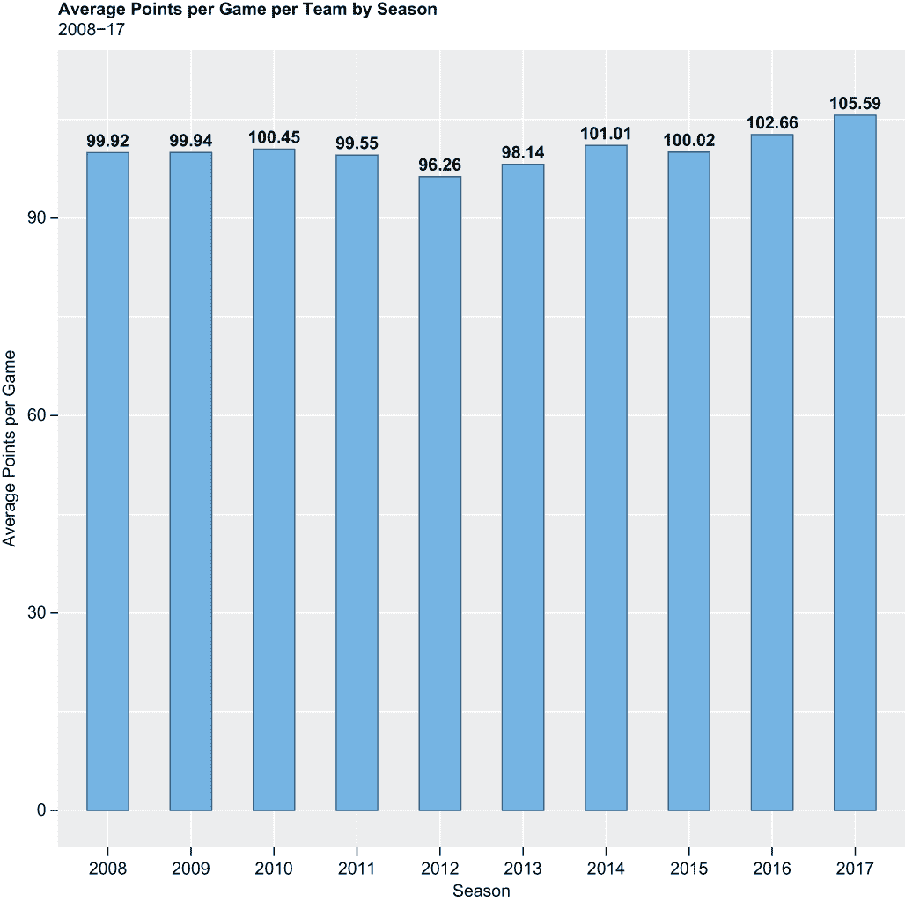

图 14.1 2008 年至 2017 年间每个 NBA 赛季每场比赛和每支球队的平均得分

`geom_bar()`函数指示 R 创建一个条形图。默认情况下，R 将为每个 x 值的行计数进行计算和可视化；我们覆盖了这一点，并在过程中通过添加`stat = "identity"`参数告诉 R 将每个 x 值与我们的 y 轴变量绑定。否则，条形图的宽度是默认宽度的一半，并且用不同深度的钢蓝色着色和填充。

`geom_text()`函数将 y 值附加到条形图的顶部。由于这个添加，我们随后需要调用`ylim()`函数来扩展 y 轴的长度：

```
ggplot(first_tibble, aes(x = season, y = pts_avg)) +
  geom_bar(stat = "identity", width = .5, 
           color = "steelblue4", fill = "steelblue1") +
  labs(title = "Average Points per Game per Team by Season", 
       subtitle = "2008-17",
       x = "Season", 
       y = "Average Points per Game") +
  geom_text(aes(label = (pts_avg), vjust = -0.3, fontface = "bold")) +
  ylim(0, 110) +
  theme(plot.title = element_text(face = "bold"))
```

一方面，我们没有看到每场比赛得分在年与年之间的巨大变化——当然，这也必须等于每场比赛的失分。另一方面，然而，我们看到 2012 年的最低得分是 96.26，2017 年的最高得分是 105.59，这种差异是显著的。

接下来，我们绘制一个直方图来可视化整个 nba_stats 数据集中变量`PTS`的分布（见图 14.2）。因此，nba_stats 是我们的数据源，`PTS`是我们的 x 轴变量。

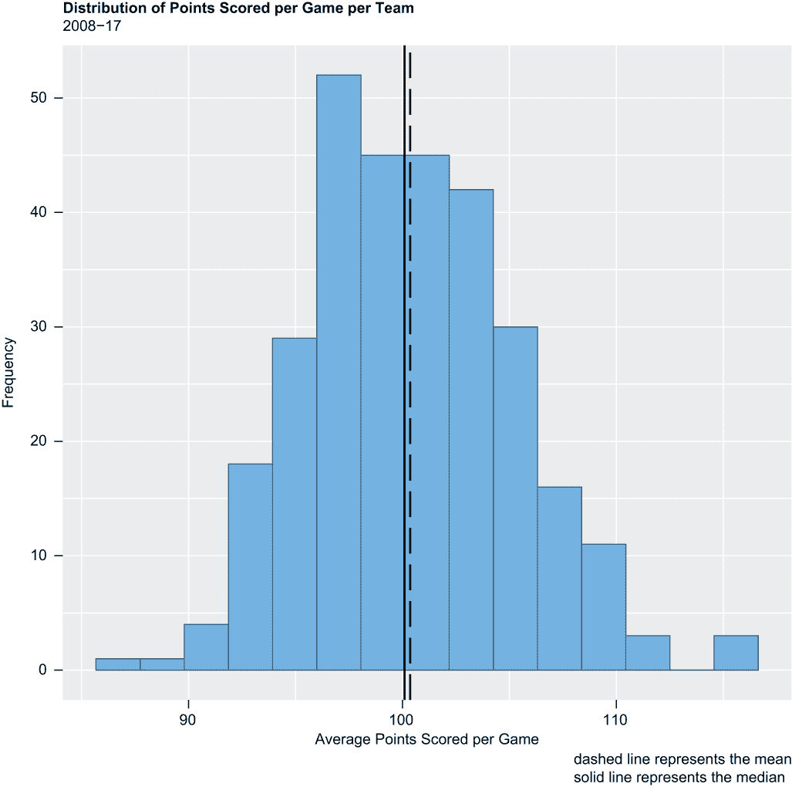

图 14.2 2008 年至 2017 年间每个 NBA 球队的每场比赛得分分布

我们的历史图将包含 15 个箱。箱的数量应该与你的数据中的记录数成比例。一个经验法则建议箱的数量应该大约等于记录数的平方根，不超过 20。我们在 nba_stats 数据集中有 300 个观测值；300 的平方根等于 17.3，所以按照这个规则，15 个箱似乎足够合适。

调用`geom_line()`函数两次指示 R 绘制两条垂直线，一条表示人口平均值的虚线，另一条表示人口中位数——`ggplot2`的线条默认为实线：

```
ggplot(nba_stats, aes(x = PTS)) +
  geom_histogram(fill = "steelblue1", color = "steelblue4", bins = 15) + 
    geom_vline(aes(xintercept = mean(PTS)),
             color = "black", linetype = "longdash", size = .8) +
    geom_vline(aes(xintercept = median(PTS)),
             color = "black", size = .8) +
  labs(title = "Distribution of Points Scored per Game per Team",
       subtitle = "2008-17",
       caption = "dashed line represents the mean
          solid line represents the median",
       x = "Average Points Scored per Game",
       y = "Frequency") +
  theme(plot.title = element_text(face = "bold"))
```

看起来变量`PTS`具有正态分布，或者说高斯分布。换句话说，分布关于平均值对称，数据中最频繁出现的值接近平均值，最不频繁出现的值离平均值最远。

但视觉检查并不总是可靠的。因此，我们接下来调用基础 R 中的`shapiro.test()`函数来运行 Shapiro-Wilk 测试，这可能是最常见的正态性测试。在 Shapiro-Wilk 测试的情况下，我们寻找的 p 值高于 0.05 以假设正态性：

```
shapiro.test(nba_stats$PTS)
## 
##  Shapiro-Wilk normality test
## 
## data:  nba_stats$PTS
## W = 0.99016, p-value = 0.04124
```

由于 p 值小于 0.05 的显著性阈值，我们应该假设来自 nba_stats 数据集的变量`PTS`的分布不是（相当）正态分布，尽管表面上看起来相反。这是我们进行测试时需要注意的事情，我们将在下一部分进行讨论。

## 14.4 相关性

我们首先计算并比较`z_wins`和`z_o_pts`与`z_wins`和`z_pts`之间的相关系数。因此，我们首先计算常规赛胜利和让分标准化的相关系数，然后计算胜利和得分的标准化版本之间的相同系数。如果让分在常规赛胜利方面比得分更重要，或者如果防守比进攻更重要，`z_o_pts`与`z_wins`的相关性应该比`z_pts`与`z_wins`的相关性更强。然后，我们将运行一对相关系数测试，使用相同的变量组合，并基于 p 值的比较做出类似的假设。

### 14.4.1 计算和绘制相关系数

在 R 中计算相关系数足够简单；我们只需从基础 R 调用`cor()`函数，并传递两个数值变量：

```
cor(nba_stats$z_wins, nba_stats$z_o_pts)
## [1] -0.5844698

cor(nba_stats$z_wins, nba_stats$z_pts)
## [1] 0.5282497
```

因此，让分与胜利的相关性（-0.58）确实比得分（0.53）更强，但这两个相关系数的差异是可以忽略不计的。实际上，它们几乎同样远离完全中性的状态，这根本不表明防守在物质上比进攻更重要，至少就 2008 年至 2017 年间的常规赛胜利而言。

相关系数可以通过相关图（通常称为散点图）很好地可视化。这些图在`ggplot2`中通过将数据源和两个数值变量作为参数传递给`ggplot()`函数，然后调用`geom_point()`函数来构建（见图 14.3）。

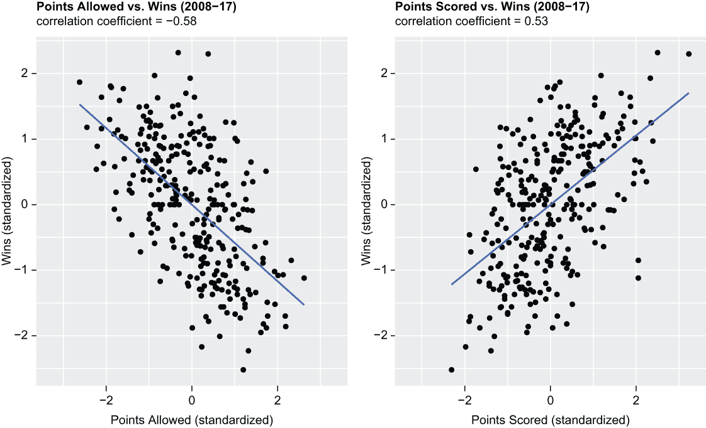

图 14.3 左侧可视化展示了让分与胜利的相关性；右侧可视化展示了得分与胜利的相关性。

`geom_smooth()`函数添加了一条线性回归线，并且默认情况下，在线上和线下添加了 95%的置信区间——我们通过向`geom_smooth()`添加参数`se = FALSE`来覆盖这些置信区间。`xlim()`函数确保两个图表的 x 轴相互匹配。我们两个相关系数图表中的第一个，p1，可视化展示了让分与胜利的相关性，而我们的第二个相关系数图表，p2，可视化展示了得分与胜利的相关性：

```
p1 <- ggplot(nba_stats, aes(x = z_o_pts, y = z_wins)) + 
  geom_point() +
  labs(title = " Points Allowed vs. Wins (2008-17)",
       subtitle = "correlation coefficient = -0.58",
       x = "Points Allowed (standardized)", y = "Wins (standardized)") + 
  geom_smooth(method = lm, se = FALSE) +
  xlim(-3.3, 3.3) +
  theme(plot.title = element_text(face = "bold"))

p2 <- ggplot(nba_stats, aes(x = z_pts, y = z_wins)) + 
  geom_point() +
  labs(title = "Points Scored vs. Wins (2008-17)",
       subtitle = "correlation coefficient = 0.53",
       x = "Points Scored (standardized)", y = "Wins (standardized)") + 
  geom_smooth(method = lm, se = FALSE) +
  xlim(-3.3, 3.3) +
  theme(plot.title = element_text(face = "bold"))
```

我们随后从`patchwork`包中调用`plot_layout()`函数，将 p1 和 p2 组合成一个单一的对象，这样两个图表就可以并排放置，便于比较（见图 14.3）：

```
p1 + p2 + plot_layout(ncol = 2)
```

这两个图表基本上是彼此的镜像。

让我们按赛季绘制`O_PTS`和`wins`以及`PTS`和`wins`之间的净相关系数。首先，我们需要创建 nba_stats 数据集的另一个汇总。因此，我们再次调用`dplyr group_by()`和`summarize()`函数，这两个函数一起计算了每个 NBA 赛季在 nba_stats 数据集中`PTS`和`wins`的相关系数与`O_PTS`和`wins`的相关系数之间的绝对差异——注意调用基础 R 的`abs()`函数。由于我们按赛季子集化这些结果，使用原始数据而不是它们的标准化等效值（例如，`wins`而不是`z_wins`）是完全可以接受的。

结果四舍五入到小数点后两位，然后转换为一个名为 second_tibble 的 tibble：

```
nba_stats %>%
  group_by(season) %>%
  summarize(cor_dif = round(cor(PTS, wins) - abs(cor(O_PTS, z_wins)), 
                            digits = 2)) -> second_tibble
print(second_tibble)
## # A tibble: 10 × 2
##    season cor_dif
##    <fct>    <dbl>
##  1 2008     -0.03
##  2 2009     -0.36
##  3 2010     -0.16
##  4 2011     -0.35
##  5 2012      0.08
##  6 2013      0.08
##  7 2014     -0.06
##  8 2015      0.23
##  9 2016      0.01
## 10 2017     -0.01

```

然后，我们使用第二个`ggplot2`柱状图可视化这些结果（见图 14.4）。再次调用`geom_text()`函数，在柱子“高度”之外添加标签，这些标签与我们的 y 轴变量`cor_dif`相关，这是我们刚刚创建并放入 second_tibble 中的。

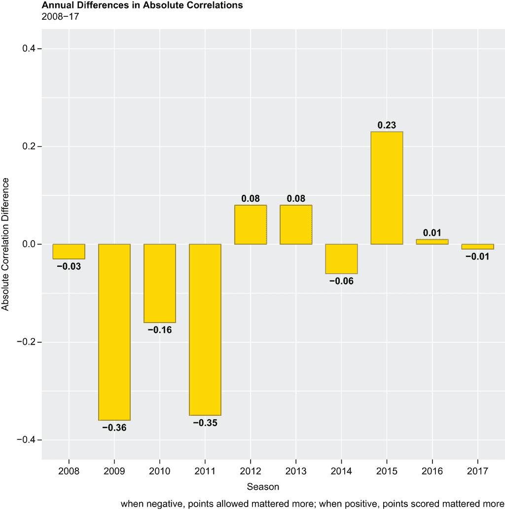

图 14.4 得分与胜利以及得分允许与胜利之间的相关系数的年度差异

由于我们的柱状图包含正负结果组合，我们通过调用`vjust()`和`hjust()`函数来控制的标签对齐，需要一些额外的逻辑。因此，我们调用两次基础 R 的`ifelse()`函数来控制或自定义标签的对齐，这取决于变量`cor_dif`是否为非负数或负数。如果`cor_dif`等于或大于`0`，我们标签的垂直调整应等于`-0.5`，而水平调整应等于`0.5`；如果该条件不满足，垂直和水平调整应分别等于`1.3`和`0.5`。

为了将标签放入我们的柱状图中，我们需要调用`ylim()`函数，从而延长 y 轴的长度：

```
ggplot(second_tibble, aes(x = season, y = cor_dif)) +
  geom_bar(stat = "identity", width = .7, color = "gold4", 
           fill = "gold1") +
  labs(title = "Annual Differences in Absolute Correlations",
       subtitle = "2008-17",
       caption = "when negative, points allowed mattered more;
            when positive, points scored mattered more",
       x = "Season", 
       y = "Absolute Correlation Difference") +
  geom_text(aes(label = cor_dif, y = cor_dif, fontface = "bold",
               vjust = ifelse(cor_dif >= 0, -0.5, 1.3),
               hjust = ifelse(cor_dif >= 0, 0.5, 0.5))) +
  ylim(-.4, .4) +
  theme(plot.title = element_text(face = "bold"))
```

每个柱子代表`PTS`和`wins`以及`O_PTS`和`wins`之间的相关系数的绝对差异。以 2010 赛季为例——`PTS`和`wins`之间的相关系数减去`O_PTS`和`wins`之间的相关系数等于`-0.16`。换句话说，在 2010 年，`O_PTS`与`wins`的相关性比`PTS`更强，这表明当时的防守比进攻更重要。事实上，从 2008 年到 2011 年，每年允许的得分与常规赛胜利的相关性都更强，但在接下来的六个 NBA 赛季中，得分与胜利的相关性比允许的得分与胜利的相关性更强。

我们的条形图给出了得分与允许得分相对于常规赛胜利的相对重要性的年度视图；这是仅仅通过在整个数据系列中计算相关系数所无法获得的视角。我们的结果表明，最近，进攻实际上比防守更重要。但差异通常是可以忽略不计的；至少在 2012 年至 2017 年之间，我们没有看到像 2009 年和 2011 年那样的相关系数差异。

### 14.4.2 运行相关测试

即使相关系数等于除 0 以外的某个数字，它可能或可能不显著地不同于 0，至少在统计意义上是这样，这就是为什么相关测试能增加价值。与其它统计测试一样，相关测试返回一个 p 值，基于预定义的 5%显著性水平，我们可以拒绝或无法拒绝无相关性的零假设。我们的零假设是没有任何有意义的关系或相关性；如果返回的 p 值小于或等于 0.05，我们将拒绝这个假设；否则，我们将无法拒绝它。

因此，我们调用基础 R 的`cor.test()`函数两次来运行一对相关测试，第一次是`z_wins`和`z_o_pts`之间的相关测试，第二次是`z_wins`和`z_pts`之间的相关测试。我们的目的是比较和对比允许得分与得分以及常规赛胜利之间的结果。如果防守比进攻更重要，我们预计我们的第一次相关测试将返回比第二次相关测试更低的 p 值。

但首先，我们调用基础 R 的`options()`函数，并传递`scipen = 999`参数来禁用科学记数法：

```
options(scipen = 999)

cor.test(nba_stats$z_wins, nba_stats$z_o_pts)
## 
##  Pearson's product-moment correlation
## 
## data:  nba_stats$z_wins and nba_stats$z_o_pts
## t = -12.434, df = 298, p-value < 0.00000000000000022
## alternative hypothesis: true correlation is not equal to 0
## 95 percent confidence interval:
##  -0.6543987 -0.5046282
## sample estimates:
##        cor 
## -0.5844698

cor.test(nba_stats$z_wins, nba_stats$z_pts)
## 
##  Pearson's product-moment correlation
## 
## data:  nba_stats$z_wins and nba_stats$z_pts
## t = 10.74, df = 298, p-value < 0.00000000000000022
## alternative hypothesis: true correlation is not equal to 0
## 95 percent confidence interval:
##  0.4414140 0.6052828
## sample estimates:
##       cor 
## 0.5282497
```

由于这两个测试的 p 值都小于 0.05 的显著性阈值，因此两个相关测试都是统计显著的；事实上，两个相关测试之间的 p 值完全相同，这表明允许得分与得分以及常规赛胜利之间没有实质性的差异。

基于这些结果——仅基于这些结果，因为我们还有额外的测试要执行——我们不能得出结论说允许得分比得分更重要，或者防守在常规赛胜利中比进攻更重要。接下来，我们将拟合一对单因素 ANOVA 模型。

## 14.5 方差分析模型

而 t 测试是一种统计测试，用于确定两个数据系列的平均值是否有显著差异，方差分析（ANOVA）是一种方法，用于确定三个或更多数据系列的平均值是否在统计上彼此不同。我们首先整理数据，进行可视化，然后拟合并评估一对 ANOVA 模型。否则，我们将继续评估常规赛胜利与得分以及允许得分。

### 14.5.1 数据处理和可视化

ANOVA 需要分类预测变量和定量目标变量。我们在`z_wins`中有一个定量因变量，但我们还没有*任何*分类预测变量。在下面的代码块中，我们调用`dplyr mutate()`和`case_when()`函数来创建一个新分类变量`o_pts_cat`，该变量是从`z_o_points`变量派生出来的。当`z_o_pts`小于-1 时，`o_pts_cat`等于`A`；当`z_o_pts`大于或等于-1 且小于 0 时，`o_pts_cat`等于`B`；当`z_o_pts`等于或大于 0 且小于或等于 1 时，`o_pts_cat`等于`C`；当`z_o_pts`大于 1 时，`o_pts_cat`等于`D`。然后，我们通过调用基础 R 的`as.factor()`函数将新变量转换为因子：

```
nba_stats %>%
  mutate(o_pts_cat = case_when(z_o_pts < -1 ~ "A",
                               z_o_pts >= -1 & z_o_pts < 0 ~ "B",
                               z_o_pts >= 0 & z_o_pts <= 1 ~ "C",
                               z_o_pts > 1 ~ "D")) -> nba_stats
nba_stats$o_pts_cat <- as.factor(nba_stats$o_pts_cat)
```

然后，我们再次调用`mutate()`和`case_when()`函数，从`z_pts`创建一个类似变量。这个变量也是通过再次调用`as.factor()`函数转换为因子的：

```
nba_stats %>%
  mutate(pts_cat = case_when(z_pts < -1 ~ "A",
                             z_pts >= -1 & z_pts < 0 ~ "B",
                             z_pts >= 0 & z_pts <= 1 ~ "C",
                             z_pts > 1 ~ "D")) -> nba_stats
nba_stats$pts_cat <- as.factor(nba_stats$pts_cat)
```

然后，我们调用基础 R 的`summary()`函数两次，以返回变量`o_pts_cat`和`pts_cat`中每个因子级别或类别的记录数。对于数值变量，`summary()`函数返回一系列基本或描述性统计量，但对于我们刚刚创建的两个因子变量，`summary()`函数则返回记录数：

```
summary(nba_stats$o_pts_cat)
##   A   B   C   D 
##  43 103 105  49
summary(nba_stats$pts_cat)
##   A   B   C   D 
##  49 109  97  45
```

最重要的是，没有不可用（NAs，或缺失数据），因此我们已经成功地为`nba_stats`数据集中的每个记录分配了`o_pts_cat`和`pts_cat`类别。否则，这些变量在 300 个观测值中的三分之二以上等于`B`或`C`，这意味着在 2008 年至 2017 赛季之间，超过三分之二的 NBA 球队在得分和失分上与联盟平均值的±一个标准差范围内。

让我们通过两个系列的箱线图来绘制`o_pts_cat`和`pts_cat`与变量`z_wins`的相关性，或者不相关性。但首先，这里有一个关于箱线图的快速复习，箱线图有时也被称为箱线和胡须图：

+   箱子代表四分位距（IQR），或位于第 25 百分位数和第 75 百分位数之间的每个数据点；因此，IQR 包含了数据中间的 50%。

+   胡须，或从箱子顶部和底部延伸出的线条，代表上四分位数和下四分位数。

+   任何超出胡须的数据点都被认为是异常值；这些数据点与总体中位数相比大约有三个标准差或更多。

+   每个箱子中的水平线代表总体中位数；R 会自动为我们绘制这条线。

我们的第一系列箱线图，p3，指向`nba_stats`数据集。这些箱线图与我们之前创建的不同；在我们介绍代码之前，你需要了解以下内容：

+   在`aes()`函数内部，我们传递`o_pts_cat`作为我们的 x 轴变量，`z_wins`作为我们的 y 轴变量，因此我们正在通过`o_pts_cat`中的每个因素水平可视化标准化的常规赛胜利数的分布。

+   此外，我们将`o_pts_cat`传递给填充，这意味着我们的箱线图将采用默认的`ggplot2`调色板，而不是指定的或统一的填充。回想一下，`fill`通过几何形状的填充颜色来定义，而颜色参数定义了边界颜色。

+   我们向`geom_boxplot()`函数添加了两个可选参数：

    +   当`notch`等于`TRUE`（默认为`FALSE`）时，我们指示 R 绘制带凹槽的箱线图而不是标准箱线图。从视觉角度来看，凹槽“挤压”了中位数周围的箱子；从统计角度来看，凹槽是中位数周围置信区间的显示。其附加价值在于凹槽用于比较组别；如果两个或更多箱子的凹槽没有重叠，我们就有了强有力的证据表明中位数有显著差异。尽管我们更感兴趣的是组均值而不是中位数，但这两个度量实际上非常接近，无论`o_pts_cat`因素水平如何。

    +   `boxplot()`函数中的第二个参数`alpha`调整了箱子的不透明度；实际上，`alpha`参数可以被传递来调整任何几何形状的不透明度。值必须在`0`到`1`之间，其中较低的值等于更高的不透明度。

+   通过调用`stat_summary()`函数，我们在每个代表均值的箱中添加了一个实心白色点。

+   我们添加了一个图例并将其放置在每个图的底部。图例几乎可以放置在任何地方，包括在图内部。

+   最后，调用`scale_fill_discrete()`函数允许我们自定义图例名称和图例标签。默认情况下，我们的图例将被命名为`o_pts_cat`，标签将与`o_pts_cat`因素水平相等——这两者都不太直观。

正如之前描述的代码块所示：

```
p3 <- ggplot(nba_stats, aes(x = o_pts_cat, y = z_wins, fill = o_pts_cat)) +
  geom_boxplot(notch = TRUE, alpha = 0.5) +
  labs(title = "Points Allowed vs. Wins", 
       subtitle = "2008-17",
       x = "Standardized Points Allowed Category", 
       y = "Standardized Regular Season Wins") +
  stat_summary(fun = mean, geom = "point", 
               shape = 20, size = 8, color = "white", fill = "white") + 
  theme(legend.position = "bottom") +
  scale_fill_discrete(name = "Points\nAllowed\nZ-Score", 
                      labels = c("< -1", "-1 to 0", "0 to 1","> 1")) +
  theme(plot.title = element_text(face = "bold")) 
```

我们的第二个箱线图系列，p4，与 p3 相似，除了我们将`o_pts_cat`替换为`pts_cat`作为我们的 x 轴变量和填充。因此，在这里，我们正在绘制标准化的常规赛胜利数的分布与`pts_cat`中的每个因素水平的对比：

```
p4 <- ggplot(nba_stats, aes(x = pts_cat, y = z_wins, fill = pts_cat)) +
  geom_boxplot(notch = TRUE, alpha = 0.5) +
  labs(title = "Points Scored vs. Wins", 
       subtitle = "2008-17",
       x = "Standardized Points Scored Category", 
       y = "Standardized Regular Season Wins") +
  stat_summary(fun = mean, geom = "point", 
               shape = 20, size = 8, color = "white", fill = "white") + 
  theme(legend.position = "bottom") +
  scale_fill_discrete(name = "Points\nScored\nZ-Score", 
                      labels = c("< -1", "-1 to 0", "0 to 1", "> 1")) +
  theme(plot.title = element_text(face = "bold"))
```

我们的两个图已经被保存在内存中。然后我们通过调用`patchwork`包中的`plot_layout()`函数将 p3 和 p4 捆绑在一起，并将我们的箱线图打印为一个图形对象（见图 14.5）：

```
p3 + p4 + plot_layout(ncol = 2)
```

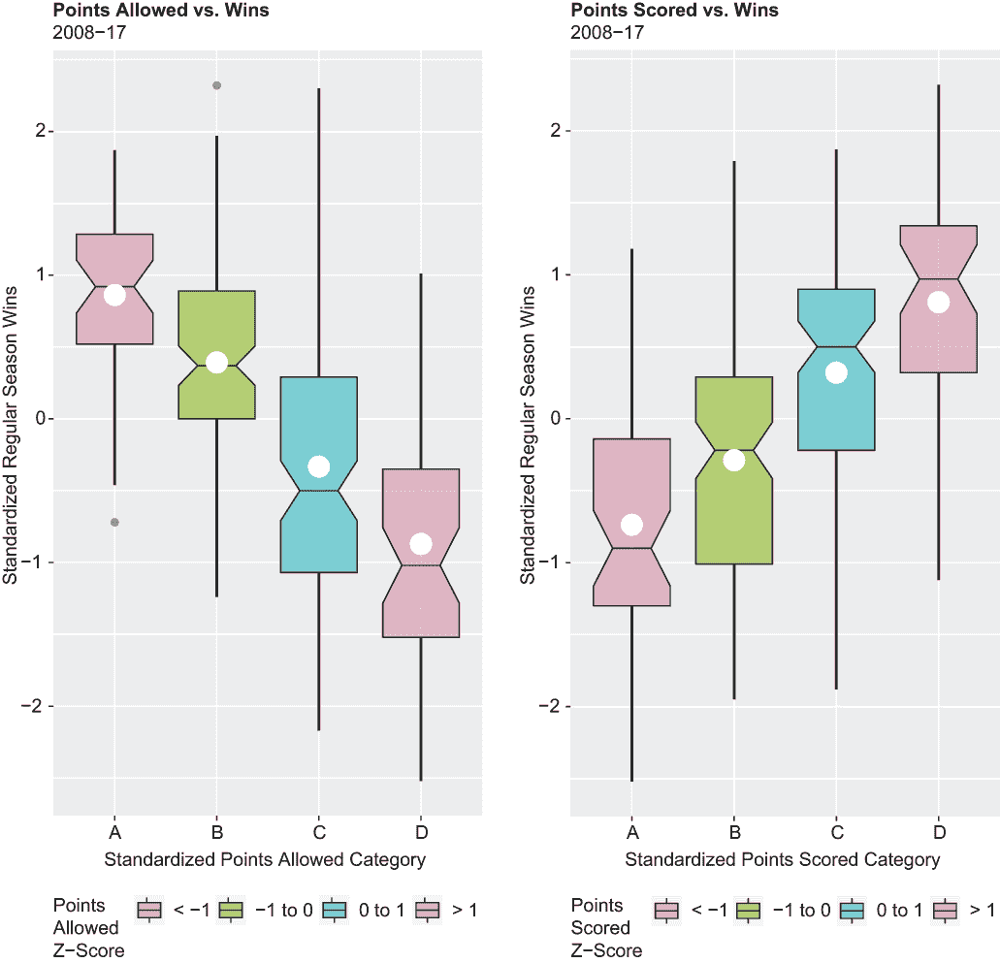

图 14.5 在左侧，四个标准化的允许类别点与标准化的常规赛胜利数进行对比；在右侧，四个标准化的得分类别点与标准化的常规赛胜利数进行对比。

显然，在 2008 年至 2017 年 NBA 赛季中防守或进攻表现更成功的队伍在常规赛中通常也表现更出色。此外，两个图中似乎都没有重叠的凹槽，这表明可能存在统计上显著的方差。

### 14.5.2 单因素 ANOVA

现在，让我们进行一对单因素 ANOVA——“单因素”是因为我们正在分析只有一个预测变量 `o_pts_cat` 以及随后 `pts_cat` 对目标变量 `z_wins` 的影响。我们的目的是确定 `o_pts_cat` 和 `pts_cat` 的因子水平之间是否存在统计上的显著差异，并且确定一个因子水平组对 `z_wins` 的影响是否比另一个因子水平组更大。

我们拟合单因素 ANOVA 的方式与拟合简单线性回归类似，只是我们调用基础 R 的 `aov()` 函数而不是 `lm()` 函数。然后我们通过一个波浪线分隔目标变量和预测变量，并将指向我们的数据源 nba_stats 的指针作为参数传递：

```
fit1 <- aov(z_wins ~ o_pts_cat, data = nba_stats)
```

然后，我们调用 `summary()` 函数以返回结果：

```
summary(fit1)
##              Df Sum Sq Mean Sq F value              Pr(>F)    
## o_pts_cat     3  96.56   32.19   49.32 <0.0000000000000002 ***
## Residuals   296 193.16    0.65                                
## ---
## Signif. codes:  0 '***' 0.001 '**' 0.01 '*' 0.05 '.' 0.1 ' ' 1
```

p 值基本上等于 0，这意味着 `z_wins` 的均值在统计上存在显著差异，这与变量 `o_pts_cat` 的四个因子水平相关联。

现在，我们通过调用基础 R 的 `plot()` 函数来检查一对诊断图（见图 14.6）。诊断图用于评估模型完整性。默认情况下，R 返回最多四个诊断图，但我们只对检查组间方差相等和残差正态性感兴趣，因此只需要两个诊断图（Residuals vs. Fitted 和 Normal QQ），所以我们将 `which` 参数传递给基础 R 的 `plot()` 函数，只打印两个图（在一列中）而不是四个：

```
plot(fit1, which = c(2, 1))
```

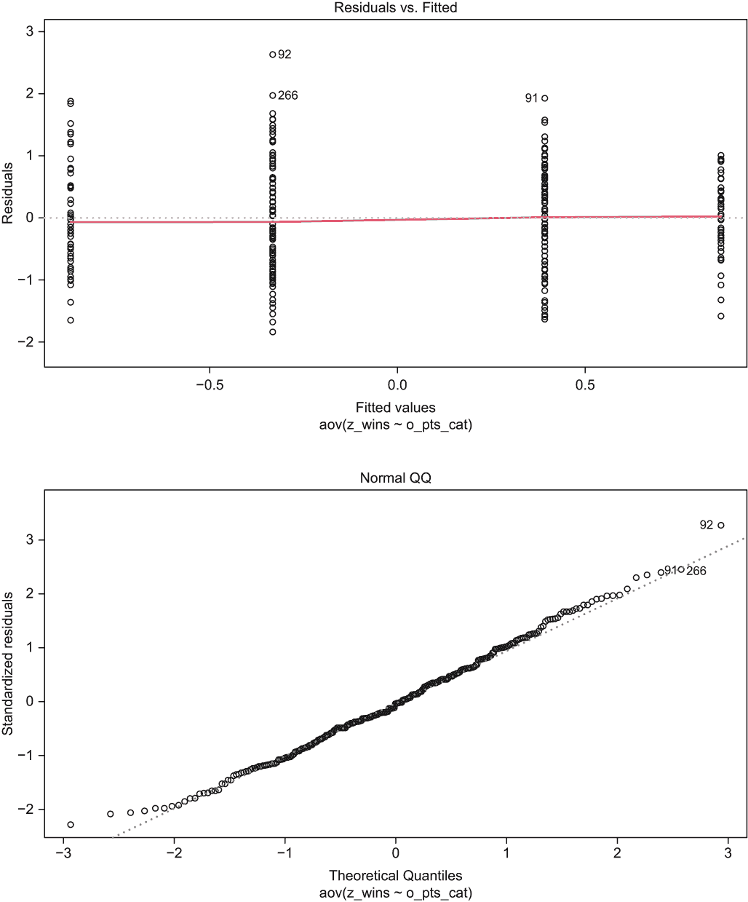

图 14.6 我们第一个 ANOVA 模型的诊断图

Residuals vs. Fitted plot 展示了残差与拟合值之间的关系，即每个队伍标准化的常规赛胜利数与各自 `o_pts_cat` 因子水平的 `z_wins` 均值之间的关系。那些常规赛胜利数超过其组或类别平均值的队伍有正残差；那些常规赛胜利数少于其组或类别平均值的队伍有负残差。

为了使 fit1 完全满足单因素 ANOVA 对组间方差相等的假设，残差应该在每个拟合值水平上均匀分散。然而，我们可以清楚地看到，残差在最高拟合值水平上比其他水平分散得更少，因此组间方差相等的假设可能已被违反，尽管不是显著违反。

正态 Q-Q 图本身并不显示残差的分布，但它确实提供了一个视觉线索，说明残差是否呈正态分布。如果残差呈正态分布，正态 Q-Q 点将重叠在对角线上；如果不呈正态分布，我们将会看到严重的偏离对角线，最可能出现在一个或两个尾部。在我们的案例中，点在两个尾部都有轻微的偏离，但总体上，它们很好地重叠在对角线上。结论是，虽然 fit1 可能是一个不太完美的模型，但它**并不**是一个需要纠正行动和重做的“坏”模型。

现在，让我们通过交换预测变量来拟合第二个 ANOVA：因此，fit2 测试了分类变量`pts_cat`对数值变量`z_wins`的影响。我们调用`aov()`函数来运行我们的 ANOVA，然后调用`summary()`函数来返回结果：

```
fit2 <- aov(z_wins ~ pts_cat, data = nba_stats)
summary(fit2)
##              Df Sum Sq Mean Sq F value              Pr(>F)    
## pts_cat       3  75.04  25.014   34.49 <0.0000000000000002 ***
## Residuals   296 214.68   0.725                                
## ---
## Signif. codes:  0 '***' 0.001 '**' 0.01 '*' 0.05 '.' 0.1 ' ' 1
```

再次，p 值基本上等于 0，这意味着对于`z_wins`的均值差异也可以归因于`pts_cat`的四个因素水平，这在统计上也是显著的。

让我们再次调用`plot()`函数来打印 fit2 诊断结果，并与我们的第一次方差分析进行比较（见图 14.7）：

```
plot(fit2, which = c(2, 1))
```

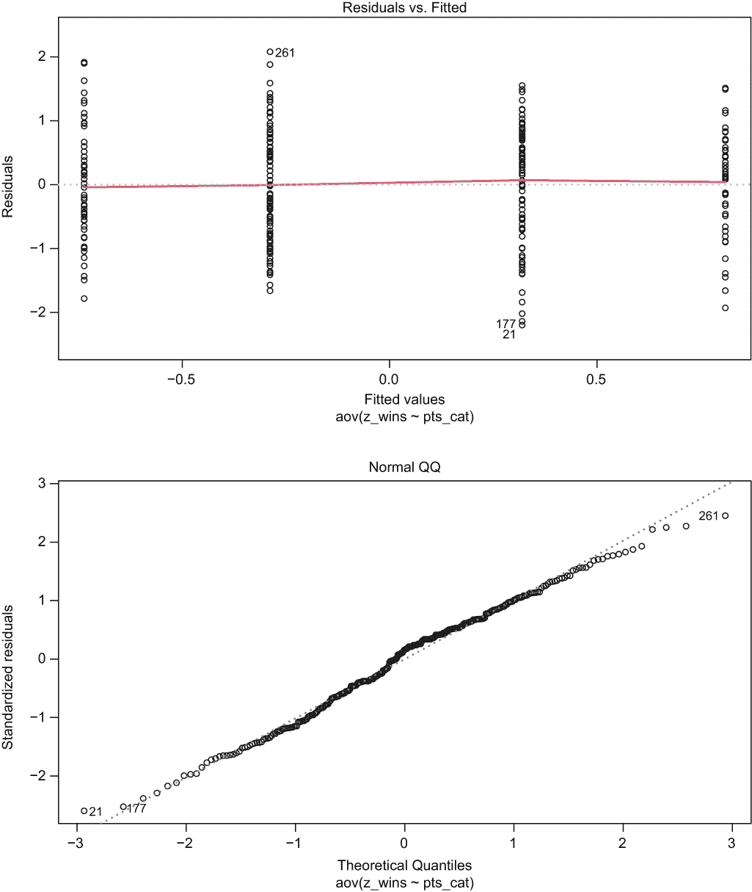

图 14.7 第二次方差分析的诊断图

首先，关于残差与拟合值图，fit2 的残差似乎在拟合值每个水平上的分布比 fit1 更均匀，这表明组间方差相等。其次，关于正态 Q-Q 图，点似乎比 fit1 的残差更多地重叠在对角线上，这表明分布更接近正态分布。

最后，我们将 fit1 和 fit2 传递给基础 R 的`AIC()`函数，以便计算两个 ANOVA 的赤池信息准则（AIC）。AIC 权衡了解释的变异与预测变量的数量，并返回一个分数。对于单个模型，AIC 没有意义，但为了模型选择的目的——特别是 fit1 与 fit2 的比较，其中我们具有相同的 p 值——AIC 是一个流行的最佳拟合度量，其中 AIC 分数越低越好：

```
AIC(fit1, fit2)
##      df      AIC
## fit1  5 729.2831
## fit2  5 760.9676
```

至少基于这两个 AIC 分数，fit1 似乎比 fit2 更好地解释了`z_wins`的变化；换句话说，防守比进攻更好地解释了常规赛的方差。这当然可能是真的，但优势至多微不足道，因此几乎不具有压倒性。

因此，基于相关性测试和方差分析模型，我们可以自信地得出结论，在影响常规赛胜利方面，防守至多只有微小的优势。接下来，我们将运行一对逻辑回归，以确定防守或进攻哪个更好地预测哪些球队能进入或不能进入季后赛。

## 14.6 逻辑回归

回到第五章，我们拟合了一对 *线性* 回归，以确定哪些 hustle 统计量可能对胜利有统计学上的显著影响以及影响的程度；换句话说，我们回归了一个连续变量与其他连续变量。另一方面，逻辑回归是一种通过将二元目标变量与一个或多个（通常是）连续预测变量回归的方法。我们在这里的目的是通过运行一对简单的逻辑回归来实现这一点——简单是因为每个模型将只包含一个预测变量，即 `z_o_pts` 或 `z_pts`，而不是多个预测变量，以便比较和对比进攻和防守对季后赛资格的影响。

在我们深入探讨逻辑回归的细节之前——警告：逻辑回归比线性回归更复杂——让我们通过创建一个派生目标变量来整理 `nba_stats` 数据集，然后将其拆分为两个互斥的子集，用于训练和预测。

### 14.6.1 数据整理

首先，我们将 `nba_stats` 传递给 `dplyr mutate()` 函数和基础 R 的 `ifelse()` 函数，创建一个名为 `playoffs2` 的新变量。如果变量 `playoffs`（它是一个具有水平 `0`、`10` 和 `11` 的因子变量）等于 `0`，则 `playoffs2` 也应等于 `0`；如果 `playoffs` 等于除 `0` 以外的任何值，则 `playoffs2` 应该改为等于 `1`。

基础 R 的 `head()` 和 `tail()` 函数分别返回 `nba_stats` 中的前 10 个和最后 10 个观测值，但略有不同。我们不是返回 `nba_stats` 中的每一列，而是指示 R 只返回位置 1、3、4 和 13 的变量。请注意，我们必须包含位置编号，以便此代码能够运行；如果我们使用变量名而不是位置编号，R 将引发错误：

```
nba_stats %>%
  mutate(playoffs2 = ifelse(playoffs == 0, 0, 1)) -> nba_stats
head(nba_stats[,c(1, 3, 4, 13)], 10)
## # A tibble: 10 × 4
## # Groups:   season [10]
##    Team          season playoffs playoffs2
##    <chr>         <fct>  <fct>        <dbl>
##  1 Atlanta Hawks 2017   10               1
##  2 Atlanta Hawks 2016   10               1
##  3 Atlanta Hawks 2015   10               1
##  4 Atlanta Hawks 2014   10               1
##  5 Atlanta Hawks 2013   10               1
##  6 Atlanta Hawks 2012   10               1
##  7 Atlanta Hawks 2011   10               1
##  8 Atlanta Hawks 2010   10               1
##  9 Atlanta Hawks 2009   10               1
## 10 Atlanta Hawks 2008   10               1

tail(nba_stats[,c(1, 3, 4, 13)], 10)
## # A tibble: 10 × 4
## # Groups:   season [10]
##    Team               season playoffs playoffs2
##    <chr>              <fct>  <fct>        <dbl>
##  1 Washington Wizards 2017   10               1
##  2 Washington Wizards 2016   0                0
##  3 Washington Wizards 2015   10               1
##  4 Washington Wizards 2014   10               1
##  5 Washington Wizards 2013   0                0
##  6 Washington Wizards 2012   0                0
##  7 Washington Wizards 2011   0                0
##  8 Washington Wizards 2010   0                0
##  9 Washington Wizards 2009   0                0
## 10 Washington Wizards 2008   10               1
```

然后，我们将 `nba_stats` 传递给 `dplyr filter()` 和 `row_number()` 函数，将大约每四条记录中的一条转移到名为 test 的子集中。接下来，通过调用 `dplyr anti_join()` 函数，我们将不在 test 中的所有 `nba_stats` 记录抛入另一个名为 train 的子集中：

```
nba_stats %>%
  filter(row_number() %% 4 == 1) -> test
train <- anti_join(nba_stats, test)
```

我们将在 train 上训练我们的逻辑回归，然后在 test 上进行预测。这正是我们在第五章中针对我们的多元线性回归所采取的方法；事实上，这正是我们在那一章中首次使用来将我们的数据拆分为 train 和 test 的相同代码。

连续调用基础 R 的 `dim()` 函数返回 train 和 test 的行数和列数：

```
dim(train)
## [1] 220  13
dim(test)
## [1] 80 13
```

我们可以看到，train 包含了 `nba_stats` 中的 300 条记录中的 220 条，即大约 73% 的总记录数，而 test 包含剩余的 80 条记录。

### 14.6.2 模型开发

首先，让我们考虑关于逻辑回归的一些关键细节：

+   响应变量或目标变量必须是二元的，其中因素水平通常等于 0 或 1，或者 0 代表否，1 代表是。实际上，我们刚刚创建了一个名为`playoffs2`的二值目标变量，其中`0`表示一支球队未能晋级季后赛，`1`表示一支球队确实晋级了季后赛。

+   逻辑回归是一种预测目标变量等于 1 的概率的方法。例如，我们可以运行逻辑回归来预测一名高中生被哈佛大学录取的概率、明天下雨的概率，或者一支 NBA 球队进入季后赛的概率。

+   我们的逻辑回归将根据允许得分和得分之间的标准化分数来建模晋级季后赛的概率。例如，给定预测变量`z_o_pts`的值的晋级季后赛的概率可以写成 Pr(playoffs2 = Yes|z_o_pts)，或简称为*p*(playoffs2)。

+   概率始终等于 0 和 1 之间的某个数字。然后，我们将预测任何*p*(playoffs2)等于或大于 0.50 的球队的 playoffs2 = 是。

+   这也是为什么我们不能用线性回归来解决分类问题；当预测变量等于相对极端值时，线性模型实际上能够预测小于 0 和大于 1 的概率。为了避免数学上不可能的结果，逻辑回归使用一种称为*最大似然估计*的方法来预测始终介于 0 和 1 之间的概率。

+   最大似然估计从以下方程预测概率：log[p(X) / (1 - p(X))] = *B*[0] + *B*[1]X[1]。这个方程的左边称为对数几率，或 logit；因此，右边是我们计算对数几率的方法，其中*X*[1]等于预测变量，*B*[1]等于预测变量的系数。当我们开始评估第一个模型的结果时，我们将对此进行更多讨论。

现在我们来拟合我们两个回归模型中的第一个。

拟合我们两个模型中的第一个

要拟合逻辑回归，我们调用基础 R 的`glm()`函数，即广义线性模型，它代表一类包括逻辑回归的模型。逻辑回归的语法与线性模型和基础 R 的`lm()`函数类似，除了我们需要传递`family = "binomial"`参数来告诉 R 运行逻辑回归而不是其他广义线性模型。请注意，我们是在 train 上拟合模型，而不是在 nba_stats 上。

我们将目标二值变量`playoffs2`对连续预测变量`z_o_pts`进行回归。然后，我们调用基础 R 的`summary()`函数并传递模型名称 fit3，以返回结果：

```
fit3 <- glm(playoffs2 ~ z_o_pts, family = "binomial", data = train)
summary(fit3)
## 
## Call:
## glm(formula = playoffs2 ~ z_o_pts, family = "binomial", data = train)
## 
## Deviance Residuals: 
##      Min        1Q    Median        3Q       Max  
## -2.17428  -0.77250  -0.01473   0.76694   2.13669  
## 
## Coefficients:
##             Estimate Std. Error z value         Pr(>|z|)    
## (Intercept)   0.1998     0.1727   1.157            0.247    
## z_o_pts      -1.7210     0.2317  -7.428 0.00000000000011 ***
## ---
## Signif. codes:  0 '***' 0.001 '**' 0.01 '*' 0.05 '.' 0.1 ' ' 1
## 
## (Dispersion parameter for binomial family taken to be 1)
## 
##     Null deviance: 304.98  on 219  degrees of freedom
## Residual deviance: 210.91  on 218  degrees of freedom
## AIC: 214.91
## 
## Number of Fisher Scoring iterations: 5
```

让我们交替回顾这些结果的一部分并获取一些额外的指标。首先，`z_o_pts` 的 p 值几乎等于 `0`，这意味着它对 `playoffs2` 有统计学上的显著影响；也就是说，允许的得分确实对 NBA 球队是否进入季后赛有影响。

其次，虽然线性回归返回 R² 和调整 R² 统计量，这些量度模型预测因子解释的集体方差，但逻辑回归没有这样的等效量度。然而，`pscl` 包中的 `pR2()` 函数返回广义线性模型中所谓的 McFadden 伪 R² 测量值。它否则测量逻辑回归模型中的拟合优度。它通过比较拟合模型的似然值与零模型（null model）的似然值来量化模型解释的方差比例，返回介于 0 和 1 之间的某个值，数值越高，预测能力越强。伪 R² 低至 0.4 或甚至 0.2 通常被认为表示拟合良好。在下面的代码中，我们将模型名称 fit3 传递给 `pR2()` 函数以获取 McFadden 伪 R²：

```
pR2(fit3)["McFadden"]
## fitting null model for pseudo-r2
##  McFadden 
## 0.3084425
```

因为 McFadden 伪 R² 等于 0.31，因此我们可以得出结论，`z_o_pts` 对数据是一个良好的拟合。

第三，`caret` 包包含一个名为 `varImp()` 的函数，该函数定量测量模型预测因子的重要性或相关性。这个度量本身没有意义，但当我们将其与同一模型中的其他预测因子或竞争简单回归中的另一个预测因子进行比较时，它允许我们比较和对比它们对同一目标变量的影响。我们只需要将 fit3 传递给 `varImp()` 函数。我们将在运行第二个逻辑回归后返回这些结果：

```
varImp(fit3)
##          Overall
## z_o_pts 7.428127
```

第四，fit3 的 AIC 等于 214.91；`summary()` 函数为广义线性模型返回此度量，而对于线性回归和方差分析（ANOVA），我们需要运行 `AIC()` 函数来获取 AIC。同样，AIC 在比较竞争模型之前没有任何意义，所以我们将 AIC 放在一边暂时不谈。

第五，我们现在需要继续讨论预测变量系数的话题；在 fit3 中，`z_o_pts` 系数等于 `-1.72`。首先，重要的是要理解概率是如何转换为对数几率以及反过来：

+   概率是某个事件发生的可能性。例如，从纽约到伦敦的航班准时起飞的概率可能是 70%。

+   几率，或者更准确地说，成功的几率，等于成功的概率除以失败的概率。因此，我们的航班准时起飞的几率等于几率比，即 0.70 除以 0.30，等于 2.33。

+   对数几率仅仅是几率比的自然对数。在 R 中计算自然对数的一种方法是通过调用 `SciViews` 包中的 `ln()` 函数并将几率比传递给它：

```
ln(2.33)
## [1] 0.8458683
```

对于我们的目的来说更为重要的是，以下是如何将对数优势转换为优势比，以及如何将优势比转换为我们可以理解的概率：

+   优势比等于自然对数的指数，其中*e*是一个数学常数，等于 2.72，在我们的例子中，对数优势等于 0.85。R 使我们很容易做到这一点——我们只需调用基础 R 的`exp()`函数并将对数优势传递给它以将其转换为优势比：

```
exp(0.85)
## [1] 2.339647
```

+   概率等于优势比，即我们的例子中的 2.34，除以 1 和 2.34 之和，即 3.34：

```
2.34 / 3.34
## [1] 0.7005988
```

经过这一切，我们回到了 70%的概率，即我们的纽约至伦敦航班准时起飞。

现在，关于我们的逻辑回归模型，我们可以将`z_o_pts`系数从对数优势转换为概率，然后评估当`z_o_pts`系数增加或减少一个单位时，我们的因变量`playoffs2`的平均变化。

而不是将对数优势转换为优势比，然后再将优势比转换为概率，我们只需将对数优势传递给基础 R 的`plogis()`函数，直接从对数优势计算概率：

```
plogis(-1.72)
## [1] 0.1518712
```

因此，`z_o_pts`的一个单位增加或减少将对应于季后赛资格概率的大约 15%的变化。

现在我们已经在训练数据集上拟合了逻辑回归模型，我们可以使用它来对测试数据集进行预测。因此，我们将我们的模型和数据传递给基础 R 的`predict()`函数。通过将`type = "response"`作为`predict()`函数的第三个参数添加，我们指示 R 以 Pr(playoffs2 = Yes|z_o_pts)的形式返回预测概率。

```
predicted_fit3 <- predict(fit3, test, type = "response")
```

如果我们调用`print()`函数，R 将返回一个概率矩阵，其中所有概率都在 0 到 1 之间，对应于测试中的 80 条记录。相反，我们将测试传递给`dplyr select()`函数以创建一个名为 actuals 的子集，它仅包括变量`playoffs2`。然而，我们首先调用`dplyr ungroup()`函数来解除`playoffs2`和`season`变量之间的耦合；否则，actuals 将不必要地包含这两个变量：

```
test %>%
  ungroup(season) %>%
  select(playoffs2) -> actuals
```

然后，我们将 actuals 传递给`dplyr`的`rename()`函数；`rename()`函数将赋值运算符右侧的变量重命名为左侧的内容：

```
actuals %>%
  rename(actual_values = playoffs2) -> actuals
```

转换话题，我们接下来创建一个新的对象，称为 predictions，它等于通过调用基础 R 的`as.data.frame()`函数将 predicted_fit3 从矩阵转换为数据框的 predicted_fit3：

```
predictions <- as.data.frame(predicted_fit3)
```

然后，我们将 predictions 传递给`rename()`函数；作为一个矩阵和一个数据框，predicted_fit3 中的单个变量实际上是`predicted_fit3`。通过调用`rename()`函数，我们将它改为等于`predicted_values`：

```
predictions %>%
  rename(predicted_values = predicted_fit3) -> predictions
```

接下来，我们将预测值传递给`dplyr mutate()`和基础 R 的`ifelse()`函数，根据条件逻辑创建一个派生变量。当变量`predicted_values`等于或大于`0.50`时，`predicted_values2`应等于`1`；否则，它应等于`0`：

```
predictions %>%
  mutate(predicted_values2 = 
           ifelse(predicted_values >= 0.50, 1, 0)) -> predictions
```

现在我们有一对单变量对象，它们都与测试相关联——`actual_values`包含一个二进制变量，表示 NBA 球队是否进入季后赛，而`predictions`包含一个二进制变量`predicted_values`，表示预测拟合 3 是否预测这些球队进入季后赛。

然后，我们将这两个变量传递给基础 R 的`table()`函数，创建所谓的混淆矩阵。`print()`函数返回结果。传递的变量必须绝对为二进制，才能使此操作运行：

```
confusion_matrix <- table(actuals$actual_values,     predictions$predicted_values2)
print(confusion_matrix)
##    0  1
## 0 19 11
## 1 10 40
```

我们的混淆矩阵既类似于我们在第九章创建的列联表，又不同于它，正如以下解释所示：

+   混淆矩阵是一个表格，通过显示真正例（TP）、真正负（TN）、假正例（FP）和假负例（FN）的计数来总结分类模型的性能。混淆矩阵是我们从中可以推导出关键预测拟合 3 性能指标的来源。

+   真阳性指的是模型正确预测了正面结果的情况。当一个正面结果相当于一支 NBA 球队进入季后赛时，我们有 40 个这样的实例。

+   真阴性指的是模型正确预测了负面结果的情况。当一个负面结果相当于一支 NBA 球队未能进入季后赛时，我们有 19 个这样的实例。

+   假阳性指的是模型错误地预测了正面结果的情况。我们有 11 个这样的实例。

+   假阴性指的是模型错误地预测了负面结果的情况。我们有 10 个这样的实例。

+   敏感性，也称为真正率，是衡量分类模型在所有正例中正确识别的真正例比例的指标。

    +   敏感性 = TP / (TP + FN)

+   特异性，也称为真正负率，是衡量分类模型在所有负例中正确识别的真正负例比例的指标。

    +   特异性 = TN / (TN + FP)

+   敏感性相对于特异性的相对重要性通常取决于上下文。考虑对一种罕见但高度侵袭性的癌症进行的检测。假阴性可能导致严重后果，因为它们可能会延迟或甚至阻止治疗，导致致命结果。最大化真阳性并最小化假阴性比最小化假阳性更为重要。另一个需要考虑的例子是法律和秩序，特别是在民主国家，在那里最大限度地减少错误定罪，或假阳性，非常重要。在其他情况下，例如，NBA 球队是否成功晋级季后赛，敏感性和特异性可能具有同等的重要性。

+   误分类错误率，有时也称为分类错误或只是错误率，是分类模型中误分类实例的度量。因此，它代表了错误预测的百分比。

    +   误分类错误率 = (FP + FN) / *n*

+   模型准确率是错误率的倒数；因此，它代表了正确预测的百分比。

    +   模型准确率 = (TP + TN) / *n* 或 1 - (FP + FN) / *n*

在 R 中计算敏感性和特异性率很容易；我们只需将我们的二元变量`actual_values`和`predicted_values2`传递给`caret`包中的`sensitivity()`和`specificity()`函数。为了得到正确的结果，你必须以与之前传递给`table()`函数相同的顺序传递变量：

```
sensitivity(actuals$actual_values, predictions$predicted_values2)
## [1] 0.8
specificity(actuals$actual_values, predictions$predicted_values2)
## [1] 0.6333333
```

由于敏感性率高于特异性率，因此我们可以得出结论，我们的第一个逻辑回归，predicted_fit3，在识别真阳性方面比识别真阴性更好。

然后，我们使用算术运算来计算错误率并推导出模型准确率。再次强调，误分类错误率，或简称为错误率，等于假阳性和假阴性之和除以记录数：

```
print(misclassification_error <- (11 + 10) / 80)
## [1] 0.2625
```

模型准确率仅仅是错误率的倒数：

```
print(accuracy <- 1 - misclassification_error)
[## 1] 0.7375
```

如此高的准确率表明 predicted_fit3 具有相当强的预测能力。

最后，我们将结合`pROC`包中的`roc()`函数和基础 R 中的`plot()`函数来计算所谓的曲线下面积（AUC），然后绘制 ROC 曲线，这在本章前面已经讨论过。AUC 通过同等考虑敏感性和特异性率来量化分类模型的预测能力。当 AUC 等于 1 的最大值时，模型可以完美地区分正例和负例；当等于 0.5 时，模型的性能不比随机机会更好。因此，AUC 越高，越好。ROC 曲线通过在 x 轴上绘制特异性率，在 y 轴上绘制敏感性率来可视化这一点。

而错误率衡量的是从总记录数中误分类实例的比例，因此关注的是单个预测，而 AUC 衡量的是分类模型的整体判别能力，即它区分正例和负例的能力。尽管这两个度量不同，但它们通常非常一致。

在以下代码中，我们按照顺序将`actual_values`和`predicted_values2`传递给`roc()`函数和`print()`函数以获取 AUC：

```
roc_curve <- roc(actuals$actual_values, predictions$predicted_values2)
print(roc_curve)
## Call:
## roc.default(response = actuals$actual_values, 
##     predictor = predictions$predicted_values2)
##
## Data: predictions$predicted_values2 in 30 controls
##    (actuals$actual_values 0) < 50 cases (actuals$actual_values 1).
## Area under the curve: 0.73
```

AUC 等于 0.73 表明模型相当强大。

我们通过调用`plot()`函数来得到 ROC 曲线（见图 14.8）。Base R 的绘图功能比其优雅性更实用，但我们仍然可以给曲线着色并自定义标题和轴标签：

```
plot(roc_curve, 
     col = "red", 
     main = "ROC Curve: AUC = 0.73",
     xlab = "Specificity: TN / (TN + FP)",
     ylab = "Sensitivity: TP / (TP + FN)") 
```

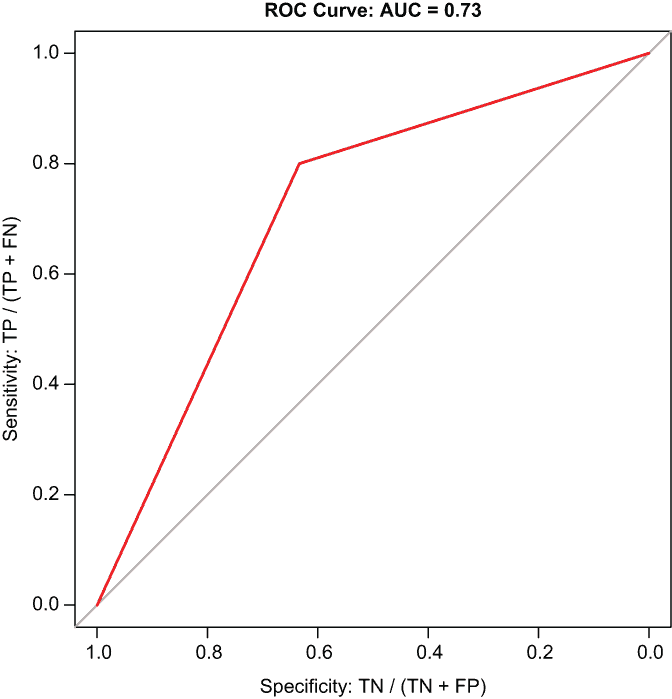

图 14.8 展示了我们的第一个逻辑回归的 ROC 曲线，其中 x 轴表示真正的负例，y 轴表示真正的正例。

让我们拟合第二个回归，然后比较和对比我们的两个模型。

拟合我们的第二个模型

我们第二个也是最后一个模型 fit4，将`playoffs2`对`z_pts`进行回归。我们在最后绘制了第二个 ROC 曲线（见图 14.9）：

```
fit4 <- glm(playoffs2 ~ z_pts, family = "binomial", data = train)
summary(fit4)
## 
## Call:
## glm(formula = playoffs2 ~ z_pts, family = "binomial", data = train)
## 
## Deviance Residuals: 
##     Min       1Q   Median       3Q      Max  
## -1.8007  -1.0788  -0.0708   1.1246   1.5395  
## 
## Coefficients:
##             Estimate Std. Error z value  Pr(>|z|)    
## (Intercept) -0.02059    0.14104  -0.146     0.884    
## z_pts        0.63463    0.15263   4.158 0.0000321 ***
## ---

## Signif. codes:  0 '***' 0.001 '**' 0.01 '*' 0.05 '.' 0.1 ' ' 1
## 
## (Dispersion parameter for binomial family taken to be 1)
## 
##     Null deviance: 304.98  on 219  degrees of freedom
## Residual deviance: 285.32  on 218  degrees of freedom
## AIC: 289.32
## 
## Number of Fisher Scoring iterations: 4

plogis(0.63)
## [1] 0.6524895

pR2(fit4)["McFadden"]
## fitting null model for pseudo-r2
##  McFadden 
## 0.06446806

varImp(fit4)
##        Overall
## z_pts 4.157984

predicted_fit4 <-predict(fit4, test, type = "response")

predictions <- as.data.frame(predicted_fit4)

predictions %>%
  rename(predicted_values = predicted_fit4) -> predictions

predictions %>%
  mutate(predicted_values2 = 
           ifelse(predicted_values >= 0.50, 1, 0)) -> predictions

confusion_matrix <- table(actuals$actual_values, 
                          predictions$predicted_values2)
print(confusion_matrix)
##    0  1
## 0 27  3
## 1 22 28

sensitivity(actuals$actual_values, predictions$predicted_values2)
## [1] 0.56
specificity(actuals$actual_values, predictions$predicted_values2)
## [1] 0.9

print(misclassification_error <- (3 + 22) / 80)
## [1] 0.3125

print(accuracy <- 1 - misclassification_error)
## [1] 0.6875

roc_curve <- roc(actuals$actual_values, predictions$predicted_values2)
print(roc_curve)
## Call:
## roc.default(response = actuals$actual_values,
##     predictor = predictions$predicted_values2)
##
## Data: predictions$predicted_values2 in 30 controls
##    (actuals$actual_values 0) < 50 cases (actuals$actual_values 1).
## Area under the curve: 0.73

plot(roc_curve, 
     col = "blue", 
     main = " ROC Curve: AUC = 0.73",
     xlab = "Specificity: TN / (TN + FP)",
     ylab = "Sensitivity: TP / (TP + FN)")
```

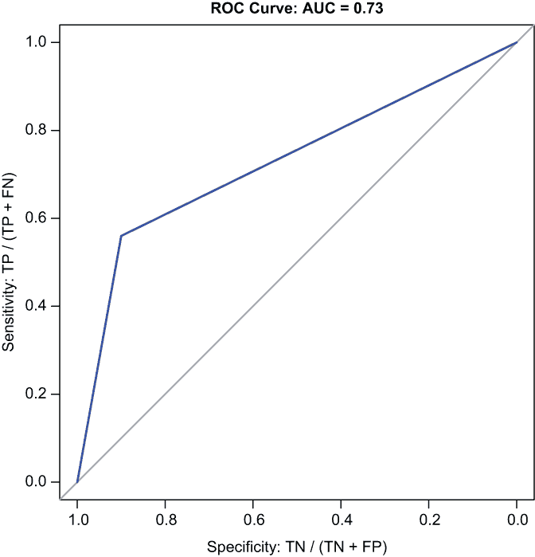

图 14.9 展示了我们的第二个逻辑回归的 ROC 曲线，其中 x 轴表示真正的负例，y 轴表示真正的正例。虽然我们的第一个模型返回的灵敏度率高于特异性率，但第二个模型返回的正好相反。然而，相应的 AUC 基本相等。

让我们回顾一下结果，并将它们与 fit3 和 predicted_fit3 进行比较（见表 14.1）。

表 14.1 展示了我们的逻辑回归模型的并列结果

| 度量 | fit3 | fit4 | 备注 |
| --- | --- | --- | --- |
| 预测因子 p 值 | 0.00000000000011 | 0.0000321 | `z_o_pts`和`z_pts`都对`playoffs2`有显著的统计影响。然而，`z_o_pts`的 p 值低于`z_pts`。 |
| 伪 R² | 0.31 | 0.06 | `z_o_pts`是两个预测因子中更好的。 |
| AIC | 214.91 | 289.32 | AIC 根据拟合和复杂性的组合来评估模型，AIC 越低，越好。由于这两个模型都是简单的回归，AIC 分数否则表明 fit3 是更好的数据拟合。 |
| 变量重要性 | 7.43 | 4.16 | `z_o_pts`是目标变量`playoffs2`差异中更重要的贡献者。 |
| 灵敏度 | 0.80 | 0.56 | predicted_fit3 在真正例率方面是两个模型中更强的。 |
| 特异性 | 0.63 | 0.90 | predicted_fit4 在真正例率方面是两个模型中更强的。 |
| 错误率 | 0.26 | 0.31 | predicted_fit3 的错误率更低。 |
| 模型准确率 | 0.74 | 0.69 | 因此，predicted_fit3 具有更高的模型准确率。 |
| AUC | 0.73 | 0.73 | predicted_fit4 的 AUC 略高。 |

考虑到我们的逻辑回归，我们必须得出结论，失分对 NBA 球队是否至少在 2007 年至 2018 年赛季期间进入季后赛有更大的影响。

但正如我们的相关性和 ANOVA 模型测试一样，`z_o_pts` 可能比 `z_pts` 具有的任何优势至多是可以忽略不计的。事实上，最好的总体结论是，失分和得分对常规赛胜利以及球队是否进入季后赛的影响大致相等。换句话说，防守并不比进攻重要得多。

话虽如此，为什么那么多人——包括球员、教练和总经理——仍然坚持认为防守显然且毫无疑问比进攻更重要？我们可能真的有下一个答案。

## 14.7 配对数据前后

答案可能追溯到常规赛和季后赛中大多数 NBA 冠军球队的得分和失分差异。让我们探索这个可能性。

我们首先将 nba_stats 数据集传递给 `dplyr filter()` 函数，以子集化 `playoffs` 因子变量等于 `11` 的 10 条记录。因子级别等于 11 仅适用于联赛冠军。然后，将 nba_stats 传递给 `dplyr select()` 函数，以 `Team`、`season`、`PTS` 和 `O_PTS` 变量对其进行子集化。最后，我们调用 dplyr 的 `arrange()` 函数按 `season` 变量对 nba_stats 进行排序。结果被转换为一个 10 × 3 的 tibble，称为 df1：

```
nba_stats %>%
  filter(playoffs == 11) %>%
  select(Team, season, PTS, O_PTS) %>%
  arrange(season) -> df1
```

然后，我们再次调用 `select()` 函数，对 df1 中的除 `Team` 之外的所有变量进行子集化：

```
df1 %>%
  select(-Team) -> df1
```

现在，我们有一个整洁的对象，其中包含了 nba_stats 中 10 个 NBA 冠军球队的常规赛得分和失分平均数。接下来，我们调用基础 R 的 `data.frame()` 函数来创建 df1 的季后赛等价物。

我们的新对象 df2 包含三个向量：一个名为 `season` 的因子变量，等于 2008 年至 2017 年；一个名为 `PTS` 的数值变量，等于每场比赛的得分；以及一个名为 `O_PTS` 的数值变量，等于每场比赛的失分（季后赛结果是从 [www.basketball-reference.com](https://www.basketball-reference.com/) 获取的）：

```
df2 <- data.frame(season = as.factor(c(2008:2017)),
                     PTS = c(94.0, 102.4, 101.1, 98.2, 97.3, 97.1, 
                             106.3, 103.3, 104.8, 119.3),
                     O_PTS = c(88.8, 95.2, 97.3, 92.4, 90.2, 90.7, 
                               97.0, 95.5, 96.2, 105.8))
```

我们然后将 df1 和 df2 传递给 `rbind()` 函数，该函数通过行将数据对象连接起来。在这个过程中，我们创建了一个 20 × 4 的 tibble，称为 df3：

```
df3 <- rbind(df1, df2)
```

最后，我们在 df3 中添加一个新的变量 `Season`（再次强调，R 是一个区分大小写的编程语言，所以 `Season` 与 `season` 不同），其中前 10 条记录等于 `Regular Season`，后 10 条记录等于 `Playoffs`。然后我们调用 `print()` 函数以完整的形式返回 df3：

```
df3$Season <- rep(c("Regular Season", "Playoffs"), each = 10)
print(df3)
## # A tibble: 20 × 4
## # Groups:   season [10]
##    season   PTS O_PTS Season        
##    <fct>  <dbl> <dbl> <chr>         
##  1 2008   100\.   90.2 Regular Season
##  2 2009   107\.   99.2 Regular Season
##  3 2010   102\.   97   Regular Season
##  4 2011   100\.   96   Regular Season
##  5 2012    98.5  92.5 Regular Season
##  6 2013   103\.   95   Regular Season
##  7 2014   105\.   97.7 Regular Season
##  8 2015   110    99.9 Regular Season
##  9 2016   104\.   98.3 Regular Season
## 10 2017   116\.  104\.  Regular Season
## 11 2008    94    88.8 Playoffs      
## 12 2009   102\.   95.2 Playoffs      
## 13 2010   101\.   97.3 Playoffs      
## 14 2011    98.2  92.4 Playoffs      
## 15 2012    97.3  90.2 Playoffs      
## 16 2013    97.1  90.7 Playoffs      
## 17 2014   106\.   97   Playoffs      
## 18 2015   103\.   95.5 Playoffs      
## 19 2016   105\.   96.2 Playoffs      
## 20 2017   119\.  106\.  Playoffs
```

然后，我们将 df3 以及特定的变量`Season`和`O_PTS`传递给`ggpubr`包中的`ggpaired()`函数来绘制常规赛和季后赛允许的得分图。`ggpaired()`函数创建了一对前后箱线图，显示了常规赛和季后赛允许的得分分布，并在相同的球队之间绘制连接线，以便我们可以比较每支球队的业绩（见图 14.10）。

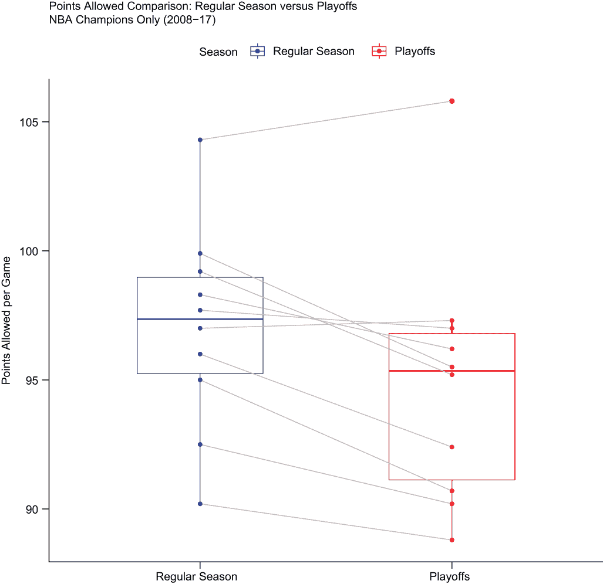

图 14.10 展示了 2008 年至 2017 赛季所有 NBA 冠军球队在常规赛和季后赛期间每场比赛允许的得分对比的配对箱线图。大多数球队在季后赛中每场比赛允许的得分比常规赛中要少。

我们还可以自定义连接线的颜色和宽度，并从几个`ggplot2`调色板（`aaas`，代表美国科学促进会，是众多科学期刊调色板之一）中选择颜色方案：

```
ggpaired(df3, x = "Season", y = "O_PTS",
         color = "Season", line.color = "gray", line.size = 0.4,
         palette = "aaas",
         main = "Points Allowed Comparison: Regular Season versus Playoffs
            NBA Champions Only (2008-17)", 
         xlab = "",
         ylab = "Points Allowed per Game")
```

这里是关键要点：在 2008 年至 2017 赛季的 10 支 NBA 冠军球队中，有 8 支球队在季后赛中允许的得分比常规赛中要少。

但大多数这些球队在季后赛中每场比赛的得分也比常规赛中要少（见图 14.11）；这因此表明他们的对手在季后赛中防守也更好：

```
ggpaired(df3, x = "Season", y = "PTS",
         color = "Season", line.color = "gray", line.size = 0.4,
         palette = "aaas",
         main = "Points Scored Comparison: Regular Season versus Playoffs
            NBA Champions Only (2008-17)",
         xlab = "",
         ylab = "Points Scored per Game")
```

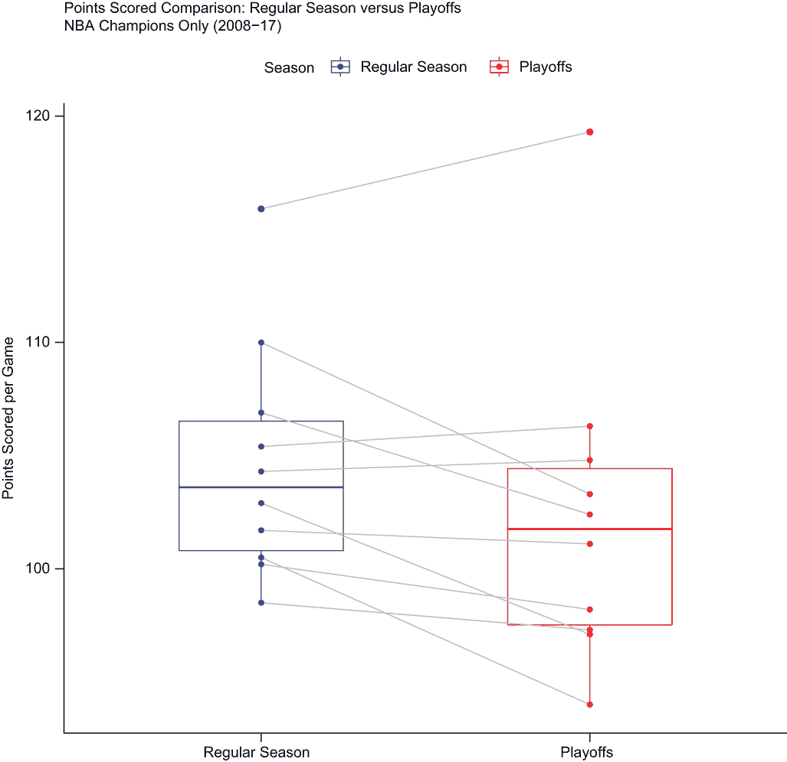

图 14.11 展示了 2008 年至 2017 赛季所有 NBA 冠军球队在常规赛和季后赛期间每场比赛得分的配对箱线图。大多数球队在季后赛中每场比赛的得分也比常规赛中要少。

在大多数季后赛比赛中得分的数量比大多数常规赛比赛中要少，这很可能导致了这样的印象：防守，而不是进攻，赢得了冠军。但最终，防守并不能赢得冠军；根据我们的测试结果系列，防守最多只是比进攻略多一点区分度，而这远远不能等同于今天的传统智慧。我们基于计算相关系数、运行相关测试、拟合方差分析模型，然后拟合一对逻辑回归的一致性得出这个结论。

在下一章中，我们将探讨 80-20 法则，并展示如何创建包含两个 y 轴的图表，即帕累托图。

## 摘要

+   我们应用了三种统计技术——相关性测试、方差分析和逻辑回归——交替测试了允许的得分和得分的效应，对常规赛胜利和季后赛资格的影响，针对 10 个赛季的 NBA 数据集。我们所有的测试都返回了具有统计学意义的成果，并且所有测试都强烈表明防守可能*略微*比进攻更重要，这几乎与传统的观点——防守比进攻更重要——不相符。

+   每场比赛允许的得分和每场比赛的得分几乎与常规赛的胜利数同样*相关*。此外，与胜利数配对的两个变量之间的相关性测试结果显示，p 值远低于预定义的 5%显著性阈值。

+   根据我们的单因素方差分析，允许的得分和得分的效应对常规赛胜利相似，我们的模型再次返回了低于显著性阈值的相等 p 值。

+   根据我们的逻辑回归分析，每场常规赛允许的得分和每场常规赛的得分总体上都是同等有效的预测因子（或者至少大致如此），用于预测谁将或不会获得季后赛资格。一个预测模型的错误率较低，因此模型准确率较高，但另一个模型的 AUC 值更高。

+   再次强调，我们所有的测试都产生了具有统计学意义的成果，但没有证据表明防守*明显且无疑*比进攻更重要。

+   否则，当变量处于不同尺度时，标准化变量绝对是必要的；在其他时候，当数据跨越数年时，标准化相同的变量是一种最佳实践。将原始数据转换为 z 分数可能是最常见的标准化方法，但我们在第十九章中还将介绍其他标准化技术。

+   理解在何种条件下运行哪种统计测试是至关重要的。在前几章中，我们运行了 t 检验和卡方检验；然而，当比较三个或更多数据系列，并且存在定量目标变量和分类预测变量时，方差分析应该是你的首选方法。当处理连续目标变量时，应拟合线性回归；当处理二元目标变量时，应拟合逻辑回归。

+   逻辑回归可能是最常见的分类模型。为了正确理解和应用结果，了解概率、优势比和 log odds 之间的差异，以及如何将值从一种转换为另一种，是绝对关键的。同样关键的是了解如何创建和解释混淆矩阵，以及如何从中推导出关键指标以准确评估模型拟合度。
