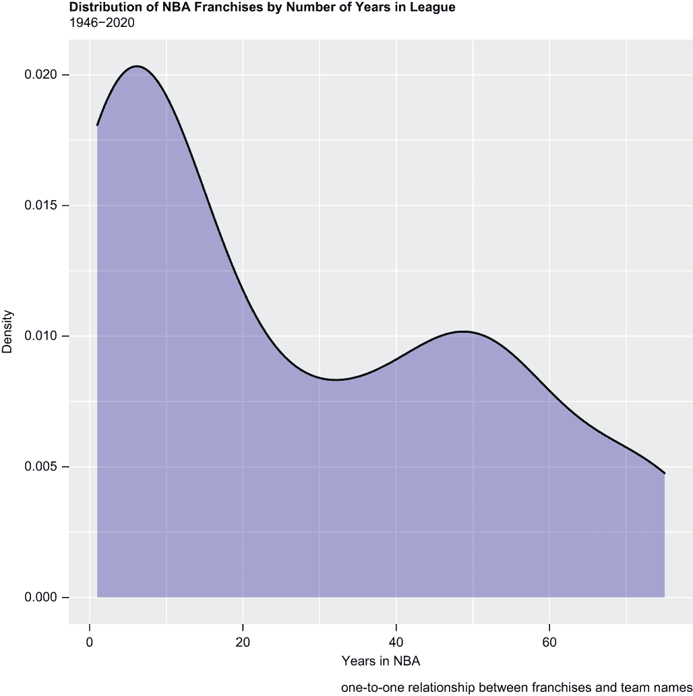
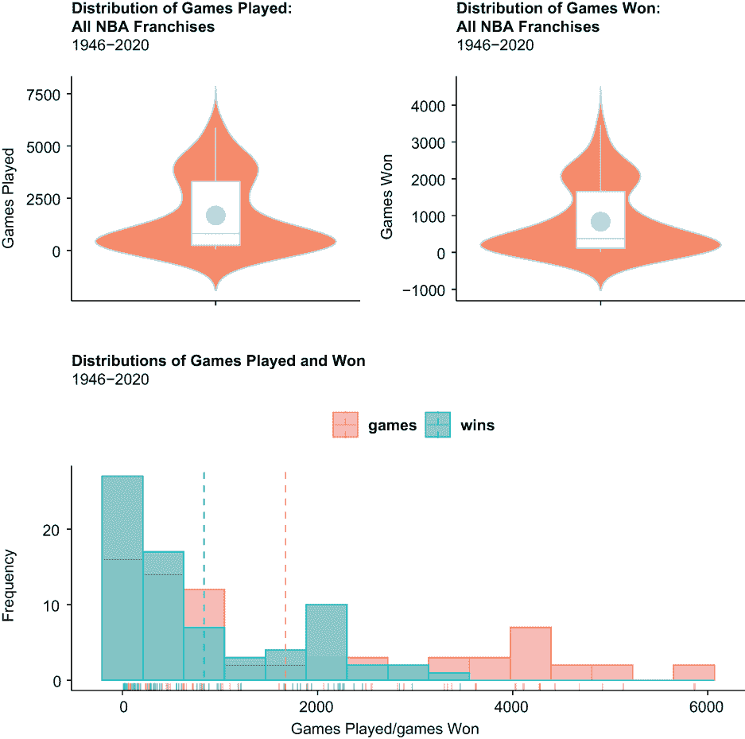
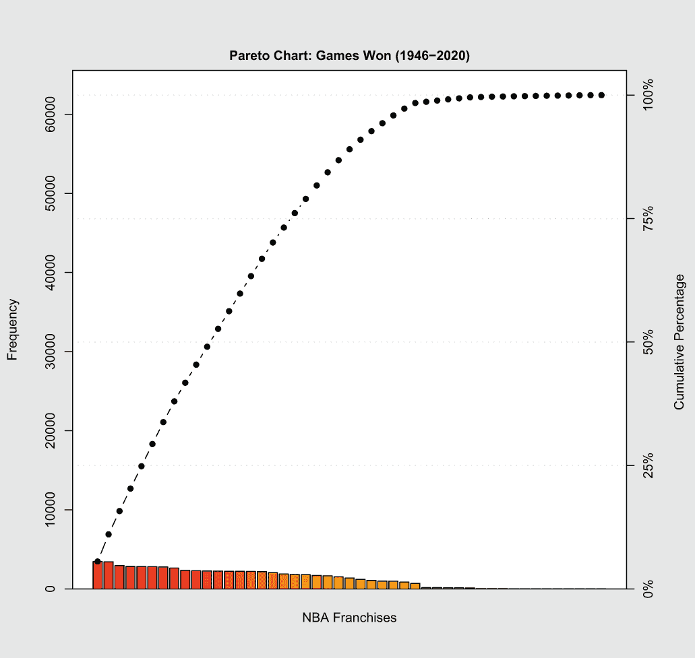

# 15 林迪效应

本章涵盖

+   检验 80-20 法则

+   使用帕累托图可视化 80-20 法则

+   创建小提琴图

+   创建成对直方图

林迪效应，或称林迪定律，表明非易腐物品，如印刷书籍或企业，其预期寿命等于其当前年龄。例如，如果《了不起的盖茨比》已经印刷了 100 年，我们可以预期它还会再印刷 100 年。基本上，某物存在的时间越长，它继续存在的机会就越大。这个概念是以纽约市一家名为林迪的*前*熟食店的名字命名的，尽管如此，它还是开业了近一个世纪。林迪效应不适用于人类、水果或其他易腐物品；毕竟，我们无法期望一个 75 岁的男人再活 75 年，或者香蕉永远保持新鲜。

从统计学的角度来看，林迪效应遵循右偏态，或正偏态，的概率分布；也就是说，一个数值变量在连续区间上的分布，当 x 接近 0 时达到峰值，然后随着 x 的增加而逐渐变薄。我们的第一个可视化（见图 15.1）展示了这一效应；它是一个`ggplot2`密度图，显示了从 1946 年 NBA 成立到 2020 年（各城市、各州和昵称之间的独特球队名称数量等于球队数量）NBA 球队的年数分布。简单来说，它显示大多数 NBA 球队只存在了几年的时间，而较少的球队存在了很长时间。



图 15.1 NBA 球队在联盟中的年数分布可视化；当林迪效应适用时，我们会看到一个右偏态，或正偏态，的分布。因此，林迪效应对应于与 80-20 法则紧密相关的帕累托概率分布。

分布明显呈右偏态；分布的左侧尾部聚集的值比其他任何地方都多，而分布的右侧尾部则显著更长。这种分布与帕累托概率分布非常吻合。帕累托分布是以意大利土木工程师、经济学家和社会学家维弗雷多·帕累托的名字命名的，它是一种幂律分布，因此是非线性概率分布。至少在精神上，如果不是在字面上，它暗示了 80%的所有结果都只是由 20%的原因造成的。例如，一家公司的 80%的销售额来自其 20%的客户，或者所有 R 代码的 80%都是由 20%的库驱动的。反之亦然：你可能只有 80%的时间穿 20%的衣服，或者你可能只有 80%的时间观看 20%的电视频道。我们把这称为 80-20 法则。

在这里，我们的目的是测试 1946 年至 2020 年间所有 NBA 球队在比赛和胜利方面的 80-20 法则。是否可能的情况是，所有 NBA 球队中 20%的球队——这些球队不断涌现和消失——占所有比赛和胜利的 80%？在这个过程中，我们将展示两种创建帕累托图的方法，帕累托图是一种组合条形图和折线图，分别显示主要和次要 y 轴上的单元和增量频率。我们将像往常一样，首先加载我们所需的包。

## 15.1 加载包

我们将再次使用熟悉和不那么熟悉的包的组合：

+   我们的数据将通过 `dplyr` 和 `tidyr` 函数的混合进行整理，并且一些可视化将在 `ggplot2` 中创建，因此我们首先加载 `tidyverse` 包。

+   我们的一些可视化将捆绑成一个单独的图形对象，用于打印和展示目的，因此我们随后加载 `patchwork` 包。

+   我们将再次调用 `car` 包中的 `recode()` 函数来重命名向量中的元素。

+   通过 `ggpubr` 包，我们将介绍两种新的可视化类型：小提琴图和成对直方图。

+   `ggQC` 和 `gcc` 包是新的。我们的第一个帕累托图将通过 `ggplot2` 和 `ggQC` 函数的组合创建；我们的第二个帕累托图将使用 `gcc` 包创建。

因此，我们调用 `library()` 函数六次，依次加载这六个包：

```
library(tidyverse)
library(patchwork)
library(car)
library(ggpubr)
library(ggQC)
library(qcc)
```

接下来，我们将导入我们的数据集。

## 15.2 导入和查看数据

我们的数据集是一个保存在我们默认工作目录中的 Microsoft Excel 电子表格，以.csv 扩展名保存；它包含 1946 年至 2020 赛季每个 NBA 球队的比赛和胜利次数，从 [www.nba.com](https://www.nba.com/) 和 [www.basketball-reference.com](https://www.basketball-reference.com/) 爬取而来。我们调用 `readr` 的 `read_csv()` 函数来导入我们的数据：

```
df1 <- read_csv("nba_lindy.csv") 
```

然后，我们从 `dplyr` 包中调用 `glimpse()` 函数来返回我们数据集的转置视图：

```
glimpse(df1)
## Rows: 89
## Columns: 8
## $ franchise       <chr> "Atlanta Hawks", "Atlanta Hawks", "St. Louis ...
## $ parent_child    <chr> "parent", "child", "child", "child", "child",...
## $ active_inactive <chr> "active", "active", "inactive", "inactive", "...
## $ start           <dbl> 1949, 1968, 1955, 1951, 1949, 1946, 1976, 201...
## $ end             <dbl> 2020, 2020, 1967, 1954, 1950, 2020, 2020, 202...
## $ years           <dbl> 72, 53, 13, 4, 2, 75, 45, 9, 35, 1, 31, 21, 1...
## $ games           <dbl> 5693, 4273, 1008, 280, 132, 5869, 3622, 718, ...
## $ wins            <dbl> 2808, 2109, 555, 90, 54, 3462, 1533, 325, 118...
```

我们的数据集，df1，包含 89 行，即每个 NBA 球队一行，以及八个列。请注意，尽管 NBA 现在由 30 支球队或球队组成，但 NBA 在 1946 年至 1965 年期间通常只有八支球队，直到 1977 年不超过 20 支球队，直到 2004 赛季才有 30 支球队。以下是按变量分解的说明：

+   `franchise`—自 1946 年以来 NBA 历史上每个特许经营的全名。让我们通过两个例子来了解一下。亚特兰大老鹰队是 30 支活跃的 NBA 球队（特许经营）之一。他们的根源可以追溯到 1949 年，当时他们在伊利诺伊州和爱荷华州的三座小城镇之间交替进行主场比赛，当时被称为三城老鹰队。1951 年，他们搬迁到了密尔沃基，并成为了密尔沃基老鹰队；1955 年，他们再次搬迁，这次搬到了圣路易斯，因此成为了圣路易斯老鹰队。最后，在 1968 年，他们搬到了亚特兰大。因此，df1 中有五个“老鹰”记录——每个独特的球队或子记录一个，还有一个汇总记录，即父记录，它汇总了所有子记录的总和。或者以波士顿凯尔特人队为例。他们一直都在波士顿打球，并且一直被称为凯尔特人队，所以 df1 中只包含一个波士顿凯尔特人特许经营的记录。现在这是一个字符字符串，但很快我们就会将其转换为因子变量。

+   `parent_child`—现在是一个字符字符串，很快将被转换为因子变量。该变量等于`parent`、`parent_only`或`child`。就 df1 中唯一的波士顿凯尔特人记录而言，`parent_child`等于`parent_only`，因为没有子记录。对于五个“老鹰”记录，`parent_child`对于汇总记录等于`parent`，而对于剩余的四个记录等于`child`。

+   `active_inactive`—也是一个字符变量，将被转换为因子；如果球队（特许经营）目前处于 NBA 中，则该变量对所有父记录和子记录等于`active`；如果不处于 NBA 中，则等于`inactive`。

+   `start`—等于任何特许经营或特许经营名称的第一个赛季，例如，1949 年等于 1948-49 赛季。现在这是一个整数，并将保持为整数。

+   `end`—等于任何特许经营或特许经营名称的最后一个赛季；这也是一个整数。

+   `years`—等于存在的年数或赛季数；这也是一个整数。

+   `games`—一个整数，等于所玩的总比赛数。

+   `wins`—一个整数，等于赢得的总比赛数。

现在我们通过三次调用基础 R 的`as.factor()`函数将变量`franchise`、`parent_child`和`active_inactive`转换为因子。再次强调，当变量只能取有限集合的值时，它们最好被转换为因子：

```
df1$franchise <- as.factor(df1$franchise)
df1$parent_child <- as.factor(df1$parent_child)
df1$active_inactive <- as.factor(df1$active_inactive)
```

我们随后调用基础 R 的`summary()`函数，该函数返回关于 df1 数值变量的描述性统计信息以及关于因子变量的按层级的记录计数：

```
summary(df1)
##                  franchise       parent_child active_inactive
##  Atlanta Hawks        : 2   child      :42    active  :46    
##  Baltimore Bullets    : 2   parent     :16    inactive:43    
##  Brooklyn Nets        : 2   parent_only:31                   
##  Charlotte Hornets    : 2                                    
##  Detroit Pistons      : 2                                    
##  Golden State Warriors: 2                                    
##  (Other)              :77                                    
##      start           end           years           games     
##  Min.   :1946   Min.   :1946   Min.   : 1.00   Min.   :  60  
##  1st Qu.:1949   1st Qu.:1962   1st Qu.: 5.00   1st Qu.: 328  
##  Median :1967   Median :2020   Median :19.00   Median :1522  
##  Mean   :1968   Mean   :1995   Mean   :26.94   Mean   :2140  
##  3rd Qu.:1978   3rd Qu.:2020   3rd Qu.:50.00   3rd Qu.:4025  
##  Max.   :2015   Max.   :2020   Max.   :75.00   Max.   :5869  
##                                                            
##      wins     
##  Min.   :  11  
##  1st Qu.: 147  
##  Median : 704  
##  Mean   :1062  
##  3rd Qu.:1938  
##  Max.   :3462  
```

下面是`summary()`函数刚刚告诉我们关于数据集的概要：

+   有 31 个特许经营，包括波士顿凯尔特人队，没有子记录。这些球队从未搬迁或更改名称，但它们不一定活跃。

+   有 16 个额外的特许经营商（总共 47 个），它们要么是从现在所在城市以外的其他城市开始比赛的，要么至少在联盟的第一年就更改了名称一次或多次。

+   有 30 个活跃的特许经营商，这是通过减去 46 个活跃特许经营商的数量和 16 个记录（其中 `parent_child` 变量等于 `parent`）得到的。

+   至少有一支球队只打了一年，而至少有一支球队已经存在了 75 年。

+   至少有一支球队在解散前只打了 60 场比赛，而有一支球队参加了 5,869 场比赛。

+   至少有一支球队只赢了 11 场比赛，而至少有一支球队赢得了 3,462 场比赛。

+   关于变量 `years`、`games` 和 `wins`，平均值始终大于中位数；这当然很好地对应了右偏斜，或正偏斜的分布。

现在我们对数据有一些好的，但主要是表格式的洞察，我们将通过创建两个小提琴图和成对直方图来可视化大部分相同的内容。你会看到小提琴图与箱线图有许多相同的属性；然而，小提琴图还显示了沿 y 轴不同值处的数值变量的密度。成对直方图，有时被称为叠加直方图（你很快就会明白为什么），提供了一种可视化方式，通过这种方式，两个分布是并排比较的，而不是在单独的图表中，这当然使得同时比较和对比两个数值变量的分布变得容易得多。本书的一个目标就是介绍主流之外的可视化，讨论它们使用的最佳案例，并演示如何创建它们。特别是这一章包括了一些这样的图表。

## 15.3 可视化数据

我们接下来的任务是调用 `dplyr` 包中的 `filter()` 函数来对 df1 进行子集化，其中变量 `parent_child` 不等于 `parent`；再次强调，R 中的 `!=` 运算符表示不等于。换句话说，我们正在对 df1 进行子集化——创建一个名为 f2 的新对象——其中变量 `parent_child` 等于 `parent_only` 或 `child`。因此，我们在创建 df2 的同时有效地消除了 df1 的汇总记录：

```
df1 %>%
  filter(parent_child != "parent") -> df2
```

然后，我们调用基础 R 中的 `dim()` 函数，它返回 df2 的维度，即行和列计数：

```
dim(df2)
## [1] 73  8
```

当然，我们仍然有原始的八个变量，但 df2 只包含 73 条记录，而 df1 包含 89 条。

### 15.3.1 创建和评估小提琴图

现在让我们创建我们的成对小提琴图。小提琴图是箱线图和密度图的混合体，它可视化数值数据系列的分布。我们的第一个图可视化变量 `games` 的分布，第二个图可视化变量 `wins` 的分布：

+   两个图表都是通过调用 `ggpubr` 包中的 `ggviolin()` 函数创建的，而 `ggpubr` 只是众多 `ggplot2` 扩展之一。如果遇到 `ggpubr` 和其他 `ggplot2` 扩展的问题，通常是语法问题；它们倾向于使用 `ggplot2`、基础 R 和其他杂项命令的随机组合。但如果你能克服代码的怪癖，那么回报将是值得努力的。

+   我们刚刚创建的对象，df2，是两个图表的数据源。这意味着我们正在可视化每个独特的特许经营或团队名称的游戏和胜利分布，并忽略那些在 df1 中变量 `parent_child` 等于 `parent` 的记录。

+   小提琴图只需要一个 y 轴变量；在我们的第一个图中，y 等于 `games`，在第二个图中，y 等于 `wins`。

+   我们的小提琴图每个都包含一个嵌入的箱线图；这样我们仍然可以识别出四分位数范围 (IQR)、均值和中位数、下四分位数和上四分位数以及任何异常值。与之前章节中的箱线图一样，R 自动在 IQR 内部用水平线表示中位数；在 `ggviolin()` 函数之后，我们 *添加* `stat_summary()` 函数，就像我们之前多次做的那样，以添加一个代表均值的实心点。

+   `ggplot2 theme()` 函数将粗体字体应用于两个标题。

两个图表，p2 和 p3 的代码块如下所示：

```
p2 <- ggviolin(df2, y = "games",
               color = "darkslategray1", fill = "salmon1",
               add = "boxplot", add.params = list(fill = "white"),
               main = "Distribution of Games Played:\nAll NBA Franchises",
               font.main = "bold",
               subtitle = "1946-2020", 
               xlab = "", 
               ylab = "Games Played") +
  stat_summary(fun = mean, geom = "point", shape = 20, size = 8, 
               color = "darkslategray1", fill = "darkslategray1") + 
  theme(axis.text.x = element_blank())

p3 <- ggviolin(df2, y = "wins",
               color = "darkslategray1", fill = "salmon1",
               add = "boxplot", add.params = list(fill = "white"),
               main = "Distribution of Games Won:\nAll NBA Franchises",
               font.main = "bold",
               subtitle = "1946-2020", 
               xlab = "", 
               ylab = "Games Won") +
  stat_summary(fun = mean, geom = "point", shape = 20, size = 8, 
               color = "darkslategray1", fill = "darkslategray1") + 
  theme(axis.text.x = element_blank())
```

我们不会立即打印出小提琴图，而是将它们保存在内存中，同时我们继续创建 `ggpubr` 配对直方图。但首先，我们需要做一些数据处理。

### 15.3.2 创建配对直方图

我们通过管道操作符将 df2 数据集传递给 `tidyr` 包中的 `pivot_longer()` 函数。`pivot_longer()` 函数将 df2 中的 `games` 和 `wins` 变量转换为新变量 `games` 中的级别，并将它们的值投掷到另一个新变量 `counts` 中。最终结果是名为 df3 的 tibble。然后我们调用 `as.factor()` 函数将变量 `games` 从字符字符串转换为因子；`counts` 变量是整数。

接下来，我们调用 `car` 包中的 `recode()` 函数，将 `games` 变量中的 `games` 和 `wins` 元素分别重命名为 `Played` 和 `Won`。通常，`recode()` 函数用于修改变量中的值，但正如我们在这里所展示的，当需要重命名变量时也可以调用它。因此，它适合作为 `rename()` 函数的替代品。

R 基础函数 `head()` 返回 df3 中的前 10 条记录，但在此代码的最后部分对变量 `franchise`、`games` 和 `counts` 进行了子集操作。为了使此代码行运行，你必须包含变量位置而不是变量名称：

```
df2 %>%
  pivot_longer(cols = c("games", "wins"),
               names_to = "games",
               values_to = "counts") -> df3

df3$games <- as.factor(df3$games)

df3$games <- recode(df3$games, "games" = "Played",
                        "wins" = "Won")
head(df3[,c(1, 7, 8)], 10)
## # A tibble: 10 × 3
##    franchise             games  counts
##    <fct>                 <fct>   <int>
##  1 Atlanta Hawks         Played   4273
##  2 Atlanta Hawks         Won      2109
##  3 St. Louis Hawks       Played   1008
##  4 St. Louis Hawks       Won       555
##  5 Milwaukee Hawks       Played    280
##  6 Milwaukee Hawks       Won        90
##  7 Tri-Cities Blackhawks Played    132
##  8 Tri-Cities Blackhawks Won        54
##  9 Boston Celtics        Played   5869
## 10 Boston Celtics        Won      3462
```

现在我们可以通过调用 `ggpubr` 包中的 `gghistogram()` 函数来创建我们的成对直方图。通过调用 `gghistogram()` 函数，我们在同一个图形对象中创建两个直方图。我们能够在同一个可视化中叠加两个图表，因为 `gghistogram()` 自动以不透明的色调打印两个直方图，从而使得即使在它们重叠的地方也能查看两个分布：

+   我们刚刚创建的 tibble，df3，是我们的数据源。

+   与箱线图只需要 y 轴变量不同，直方图只需要 x 轴变量；在这里，我们的 x 轴变量是 `counts`。因为 `counts` 与因子变量 `games` 相关联，其水平等于 `games` 和 `wins`，因此我们的一个直方图因此可视化游戏的分布，或所玩的游戏，而我们的另一个直方图可视化胜利的分布。

+   与 `ggplot2` 箱线图一样，我们控制箱的数量。我们的两个箱线图都包含 15 个箱，这接近于 df3 记录数的平方根。

+   `add` 参数插入代表每个分布均值的垂直虚线。

+   通过将 `rug` 参数设置为 `TRUE`，R 在 x 轴边缘添加一个 rug 图。Rug 图是以标记形式显示数据分布的一维展示，通常与同一数据系列的二维展示相辅相成。当你的数据集包含相对较少的记录时，rug 图才实用。

我们成对直方图 p4 的代码块如下：

```
p4 <- gghistogram(df3, x = "counts", bins = 15,
   add = "mean", rug = TRUE,
   main = "Distributions of Games Played and Won",
   font.main = "bold", 
   subtitle = "1946-2020", 
   xlab = "Games Played / Games Won", 
   ylab = "Frequency",
   legend.title = "", font.legend = "bold",
   legend = "top",
   color = "games", fill = "games") 
```

### 15.3.3 打印我们的图表

我们暂时将 p4 保存在内存中，然后通过调用 `patchwork` 包中的 `plot_layout()` 函数将其与 p2 和 p3 合并成一个单一的对象（见图 15.2）。p2 和 p3 在顶部行并排打印，而 p4（其宽度等于 p2 加 p3）在底部行显示（注意我们代码中的减号运算符）：

```
p2 + p3 - p4 + plot_layout(ncol = 1)
```



图 15.2 顶部显示的是 1946 年至 2020 年间所有当前和过去 NBA 联盟的球队所玩和赢得的比赛的分布。底部，成对直方图可视化相同的数据系列。

尽管小提琴图比箱线图少见或不受欢迎，因此在随机样本的最终用户中可能不会引起太大的共鸣，但至少有一个原因让你应该更喜欢小提琴图：它们显示了数据系列的完整分布，而箱线图仅仅显示了汇总统计量。（当然，我们选择提供两者的最佳结合，通过在小提琴图中添加嵌入的箱线图来实现。）你可能根据受众的复杂程度选择其中之一。

小提琴图也通过使用概率密度函数（PDF）来显示数据系列的形状，就像密度图一样。事实上，如果可能的话，我们可以垂直切割我们的小提琴图中间，然后旋转左半部分 90 度，它们看起来会非常像我们之前创建的密度图（参见图 15.1）。PDF 的宽度表示对应值在数据中观察到的频率，其中较宽的区域表示较高的频率，而细长的区域表示较低的频率。

数据呈右偏态。我们知道这一点，因为在我们两个小提琴图中，最宽的区域是 y 值接近 0 的一些数字。我们也知道这一点，因为在我们嵌入的箱线图中，代表均值（用实心点表示）的线条都高于代表中位数（用相同图中的水平线表示）的线条。数据呈右偏态这一点可能通过我们的配对直方图变得更加明显。在同一个可视化中绘制两个直方图是一种很好的技术，当你想要或需要比较和对比两个分布到因子级别时。

然而，我们的小提琴图和配对直方图并没有告诉我们 80-20 规则是否生效；换句话说，我们还没有弄清楚当前和过去的 NBA 球队中，是否有 20%的球队占据了 80%的比赛或胜利。数据肯定是非线性的，但我们还没有弄清楚非线性到什么程度。这就是为什么我们需要帕累托图。

## 15.4 帕累托图

在我们演示如何创建和解释帕累托图之前，让我们先谈谈帕累托图。帕累托图既是柱状图也是线形图，具有主要和次要的 y 轴。柱状图的长度通常代表频率，但它也可以代表时间、金钱或某种其他成本函数。柱状图通常垂直排列，并且必须按降序排列。而柱状图代表单位频率，线代表按百分比测量的累积频率；因此，线上的点对应于柱状图。

帕累托图本质上是一种质量控制工具，它提供了一个视觉提示，揭示了原因和效果，这些原因和效果往往遵循 80-20 规则或至少是非线性的。例如，帕累托图可能显示 80%的应用程序故障是由 20%已知的错误引起的。对于一个优先考虑团队工作负载的应用程序开发经理来说，这不仅仅是一个有趣的信息片段——这是一个可操作的见解。以下是一些需要考虑的更多例子：

+   一个客户服务经理正在分析投诉。帕累托图可能显示 80%的店内投诉与员工行为和照明不佳有关，这两者加起来只占所有投诉类型的 20%。这表明，仅通过解决这两个领域，投诉量可以减少多达 80%。

+   一位呼叫中心主管正在审查平均应答速度数据，该数据显示了每日违反自我设定的服务水平。随后进行的帕累托分析显示，80%的平均应答速度不达标的来电发生在 30 分钟时间间隔的 20%内。主管随后知道何时或何地增派人员。

+   一家汽车经销商的经理被展示了一个帕累托图，显示 80%的车辆是由 20%的销售人员销售的。现在经理知道哪些员工值得奖励，哪些员工可能需要额外的销售培训。

+   一位电子商务经理发现，他们的客户 80%的浏览时间花在了网站的 20%页面上；这告诉经理在哪里放置大部分广告以及如何收费。

帕累托图不一定总是显示 80-20 的比例，这是可以的。真正重要的是 80-20 法则的*精神*，它仅仅建议大多数结果都有少数几个原因。这意味着许多问题可以通过较低的努力水平得到解决，或者至少得到缓解。

现在，我们将创建一对帕累托图，显示 NBA 球队和所玩游戏以及所赢游戏的相对无害的关系。我们的帕累托图将使用不同的 R 包创建，这样您可以选择最适合您的包和方法。

### 15.4.1 ggplot2 和 ggQC 包

我们的两个帕累托图中的第一个是由`ggplot2`和名为`ggQC`的包组合构建的，这个包可以用来创建多种质量控制图。我们首先为两个帕累托图创建数据源。我们调用`dplyr filter()`函数来对 df1 进行子集化，其中变量`parent_child`不等于`child`，这也意味着我们在对 df1 进行子集化，其中相同的变量等于`parent`或`parent_only`：

```
df1 %>%
  filter(parent_child != "child") -> df4
```

然后，我们运行基础 R 中的`dim()`函数来获取我们刚刚创建的数据集 df4 的行数：

```
dim(df4)
## [1] 47  8
```

我们的数据集包含 47 行。以下`dplyr`代码块统计了变量`active_inactive`的记录数：

```
df4 %>%
  group_by(active_inactive) %>%
  tally()
## # A tibble: 2 × 2
##   active_inactive     n
##   <fct>           <int>
## 1 active             30
## 2 inactive           17
```

这些结果完全合理——NBA 现在由 30 支球队或分支机构组成，因此 df4 包含 30 个活跃的分支机构以及 17 个非活跃的分支机构是我们应该预期的结果。

我们的第一张帕累托图（见图 15.3）显示了 47 个过去和现在的 NBA 球队（条形图）所玩游戏的数量以及总游戏量的累积百分比（折线图）。


图 15.3 使用`ggplot2`和`ggQC`构建的帕累托图，显示了 NBA 球队和所玩游戏之间的非线性关系

因为我们正在创建`ggplot2`可视化，所以我们使用 df4 初始化我们的绘图，其中变量`games`按变量`franchise`分组，作为数据源。如果我们不先将`dplyr`代码通过管道传递到`ggplot()`函数，我们的 x 轴标签就不会正确排序。

我们的自变量是`franchise`，而我们的主要 y 轴变量是`games`。`ggQC`包中的`stat_pareto()`函数会自动绘制一条映射到次要 y 轴的线。x 轴标签以 90 度角倾斜以便于适配：

```
df4 %>%
  group_by(franchise) %>%
  summarize(games) %>%
ggplot(aes(x = franchise, y = games)) +
        theme(axis.text.x = element_text(angle = 90, 
                                         hjust = 1, vjust = 0.5)) +
        stat_pareto() +
  ggtitle("Pareto Chart: Games Played (1946-2020)") +
  xlab("") +
  ylab("Games Played") +
  theme(plot.title = element_text(face = "bold"))  
```

有几点需要提及：

+   我们的主要 y 轴（在左侧）代表所有 NBA 球队所进行的所有比赛；如果我们的 47 个条形堆叠在一起而不是代表 x 轴上的不同刻度，那么一个条形将达到与线相同的精确高度。

+   如果我们将 47 个 NBA 球队分成，比如说，8 或 10 组，我们当然会有更少的条形，但条形会更高。虽然这种操作无疑会通过消除大部分空白空间来改善美观，但它也会掩盖结果。想想我们虚构的呼叫中心主管的帕累托图——将 30 分钟的增量合并为一小时的增量可能会隐藏结果，更重要的是，使得实施纠正行动计划变得更加困难。

+   80-20 法则并不适用——在 1946 年至 2020 赛季之间，活跃和停用的 20%的球队参加了不到 50%的所有 NBA 比赛，而 80%的比赛都与大约 45%的所有 NBA 球队有关，无论是过去还是现在。但尽管 80-20 法则并不适用，NBA 球队和比赛之间的关系仍然是非线性的。

+   我们的帕累托图——或者任何帕累托图——类似于递减回报的图表。递减回报定律指出，例如，将额外的人手投入到进度落后的项目中，将带来递减的收益，直到补充的新员工不再带来任何价值。另一个例子是多元线性回归：我们可以将更多的独立变量投入模型中，从而提高 R²，但与此同时，随着每个添加零预测价值的后续变量，调整后的 R²会递减。活跃的 NBA 球队在 1946 年至 2020 年之间占所有 NBA 比赛的 98%以上；因此，我们并不一定需要其他 17 个球队来全面了解总比赛数。

+   帕累托图是洛伦兹曲线的镜像（参见第十二章和第十三章）。一个显示了非线性，另一个显示了不平等，但最终，这两个是或多或少同义的。非线性和不平等都代表了与均匀性或线性的偏离。非线性涉及对直线、比例或线性关系的偏离，而不平等则是指对平等分布或处理的偏离。

现在，让我们继续我们的第二个帕累托图。

### 15.4.2 qcc 包

我们的第二个也是最后一个帕累托图使用 `qcc` 包中的 `pareto.chart()` 函数，这是一个允许构建质量控制图的另一个包。这次，我们的目的是可视化过去和现在 NBA 联盟之间通过赢得的比赛建立的关系。`pareto.chart()` 函数的优点是它不仅绘制了帕累托图，还返回了数据的表格视图。否则，请注意以下操作来修剪我们的图形（见图 15.4）：

+   我们添加了 x 轴标签，并默认了两个 y 轴标签。

+   我们已经修改了条形图的颜色方案，至少在线上看起来，使其类似于热指数。

+   `pareto.chart()` 函数接受一个数据集和一个数值变量作为参数；与 `ggplot()` 不同，它不允许我们设置 x 轴变量。因此，`pareto.chart()` 函数插入了一个字母和数字方案，用于 x 轴标签，这些标签与表格结果相关联。然后我们选择使用 `xaxt` 参数来移除这些标签：

```
pareto.chart(df4$wins, 
  main = "Pareto Chart: Games Won (1946-2020)", 
  xlab = "NBA Franchises",
  col = heat.colors(length(df4$wins)),
  xaxt = "n")
##     
## Pareto chart analysis for df4$wins
  Frequency      Cum.Freq.     Percentage   Cum.Percent.
## B   3462.00000000  3462.00000000     5.54612156     5.54612156
## N   3429.00000000  6891.00000000     5.49325558    11.03937714
## W   2950.00000000  9841.00000000     4.72589792    15.76527506
## T   2840.00000000 12681.00000000     4.54967800    20.31495306
## J   2826.00000000 15507.00000000     4.52725001    24.84220307
## A   2808.00000000 18315.00000000     4.49841402    29.34061709
## I   2774.00000000 21089.00000000     4.44394604    33.78456313
## Z   2624.00000000 23713.00000000     4.20364615    37.98820929
## U   2349.00000000 26062.00000000     3.76309634    41.75130563
## K   2286.00000000 28348.00000000     3.66217039    45.41347602
## X   2271.00000000 30619.00000000     3.63814040    49.05161642
## E   2258.00000000 32877.00000000     3.61731441    52.66893083
## Q   2231.00000000 35108.00000000     3.57406043    56.24299125
## A1  2227.00000000 37335.00000000     3.56765243    59.81064368
## Y   2211.00000000 39546.00000000     3.54202044    63.35266412
## D1  2187.00000000 41733.00000000     3.50357246    66.85623658
## C1  2060.00000000 43793.00000000     3.30011855    70.15635513
## F   1889.00000000 45682.00000000     3.02617667    73.18253180
## L   1823.00000000 47505.00000000     2.92044472    76.10297651
## H   1796.00000000 49301.00000000     2.87719073    78.98016725
## M   1706.00000000 51007.00000000     2.73301080    81.71317805
## G   1657.00000000 52664.00000000     2.65451283    84.36769088
## C   1533.00000000 54197.00000000     2.45586492    86.82355580
## P   1378.00000000 55575.00000000     2.20755503    89.03111083
## V   1212.00000000 56787.00000000     1.94162315    90.97273397
## D   1083.00000000 57870.00000000     1.73496524    92.70769921
## R   1003.00000000 58873.00000000     1.60680529    94.31450450
## B1   982.00000000 59855.00000000     1.57316331    95.88766781
## O    864.00000000 60719.00000000     1.38412739    97.27179520
## S    704.00000000 61423.00000000     1.12780750    98.39960270
## H1   158.00000000 61581.00000000     0.25311589    98.65271859
## T1   157.00000000 61738.00000000     0.25151389    98.90423248
## I1   147.00000000 61885.00000000     0.23549390    99.13972638
## N1   132.00000000 62017.00000000     0.21146391    99.35119029
## R1   122.00000000 62139.00000000     0.19544391    99.54663420
## P1    46.00000000 62185.00000000     0.07369197    99.62032617
## G1    37.00000000 62222.00000000     0.05927397    99.67960014
## J1    30.00000000 62252.00000000     0.04805998    99.72766012
## E1    25.00000000 62277.00000000     0.04004998    99.76771010
## Q1    22.00000000 62299.00000000     0.03524398    99.80295409
## S1    22.00000000 62321.00000000     0.03524398    99.83819807
## L1    20.00000000 62341.00000000     0.03203999    99.87023806
## U1    19.00000000 62360.00000000     0.03043799    99.90067604
## F1    18.00000000 62378.00000000     0.02883599    99.92951203
## M1    18.00000000 62396.00000000     0.02883599    99.95834802
## O1    15.00000000 62411.00000000     0.02402999    99.98237801
## K1    11.00000000 62422.00000000     0.01762199   100.00000000  
```



图 15.4 使用 `gcc` 包构建的帕累托图，显示了与赢得的比赛相关的类似非线性关系，随后是数据的表格视图，这两者都是使用相同的代码库同时生成的

虽然美学上显然与我们的第一个帕累托图不同，但结果并没有那么不同——在 1946 年和 2020 年 NBA 赛季之间，大约 20% 的活跃和非活跃联盟赢得了所有比赛的 45%，而赢得的 80% 的比赛都与大约 42% 的过去和现在联盟相关联。再次强调，没有 80-20 规则，但仍然存在更多的非线性。

在下一章中，我们将考虑当其他人看到因果关系时，随机性可能实际上确实存在的可能性。

## 摘要

+   在理解 80-20 规则之前，很难理解大多数因果关系。

+   80-20 规则实际上是对非线性的一种委婉说法；毕竟，80% 的结果并不总是映射到 20% 的根本原因。然而，世界上的许多方面在某种程度上是非线性的，因此是杂乱的，必须理解和接受，然后才能触发正确的分析类型。

+   帕累托图是可视化原因和效果以及实现“物有所值”的纠正措施的最佳解决方案。

+   R 提供了大量创建帕累托图的选项，包括内置函数和`ggplot2`（无需扩展）。我们仅展示了其中两种最佳选项。

+   在此过程中，我们还证明了 NBA 球队与比赛进行和赢得的关系都是非线性的。

+   我们介绍了新的可视化技术：小提琴图作为图形显示连续数据分布的另一种选择，然后在同一图表中配对直方图。
