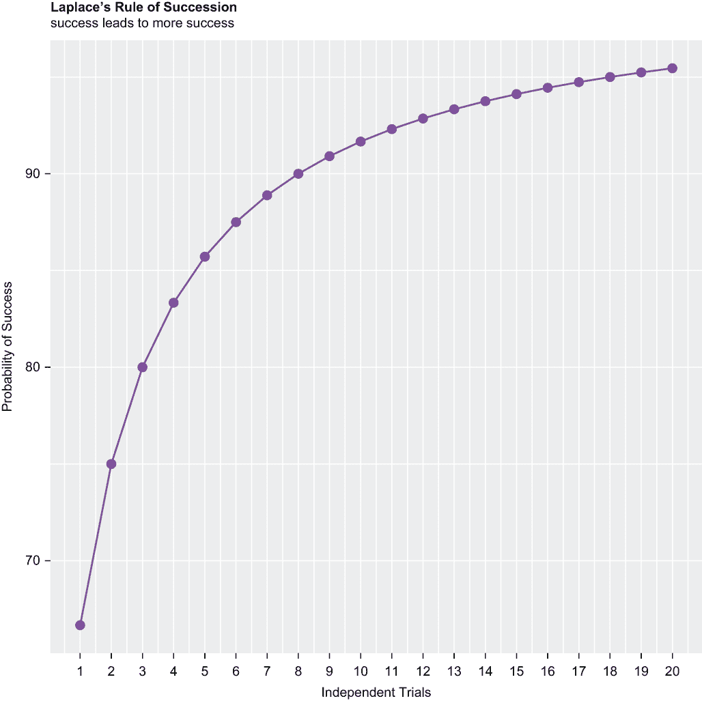
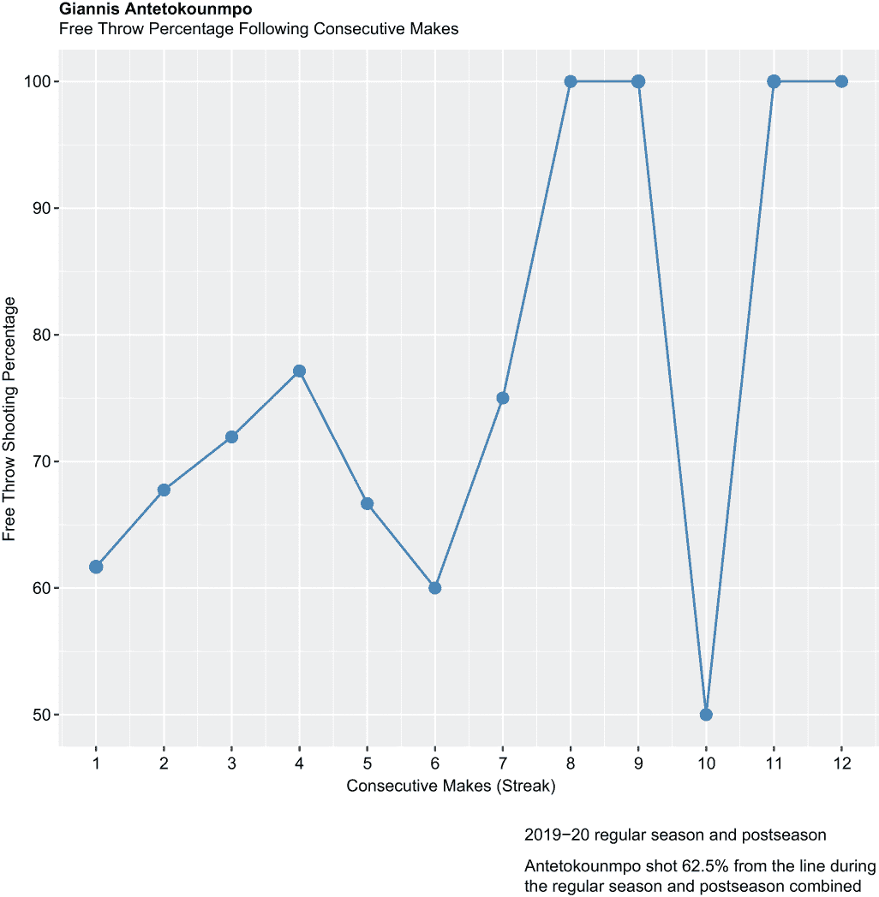
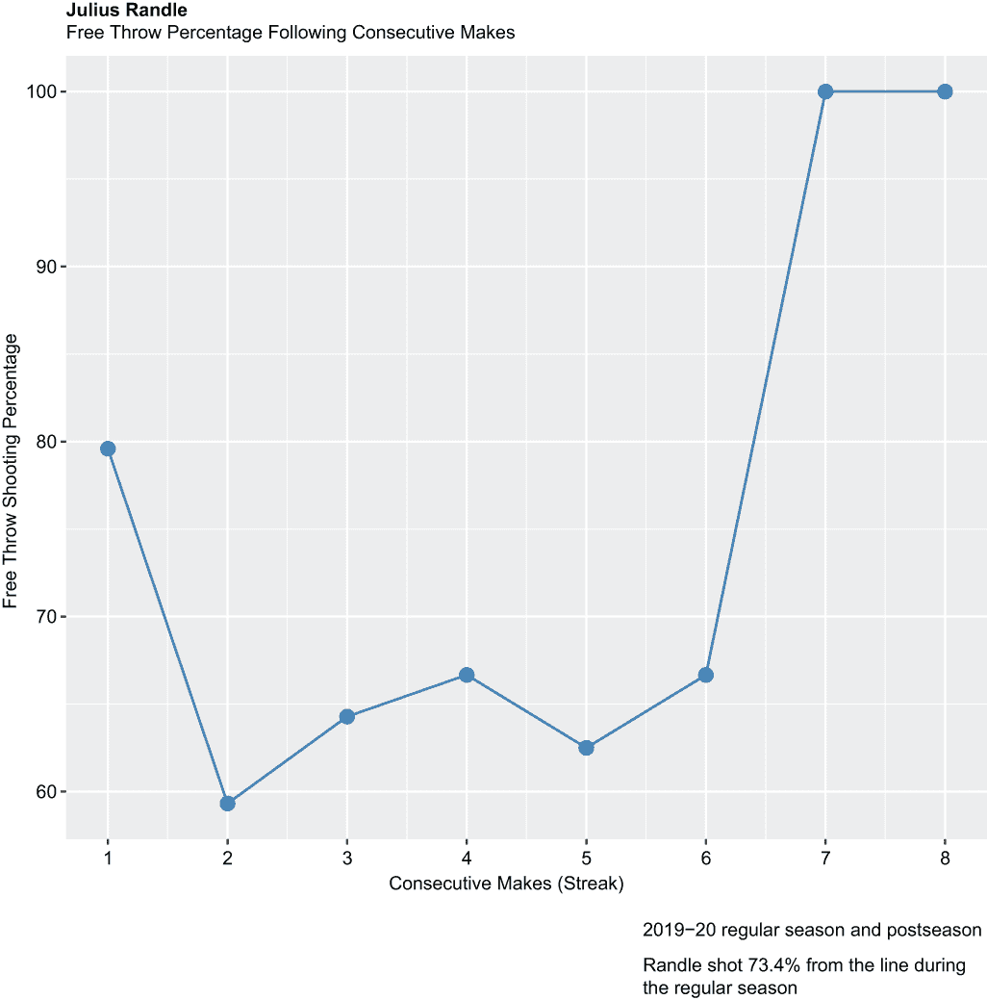
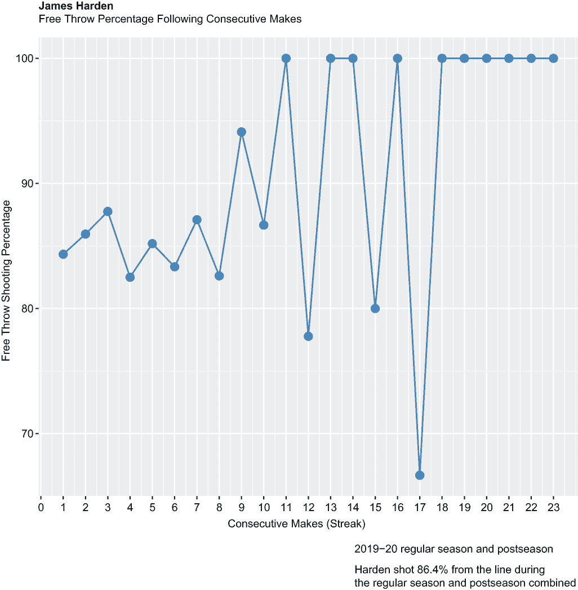
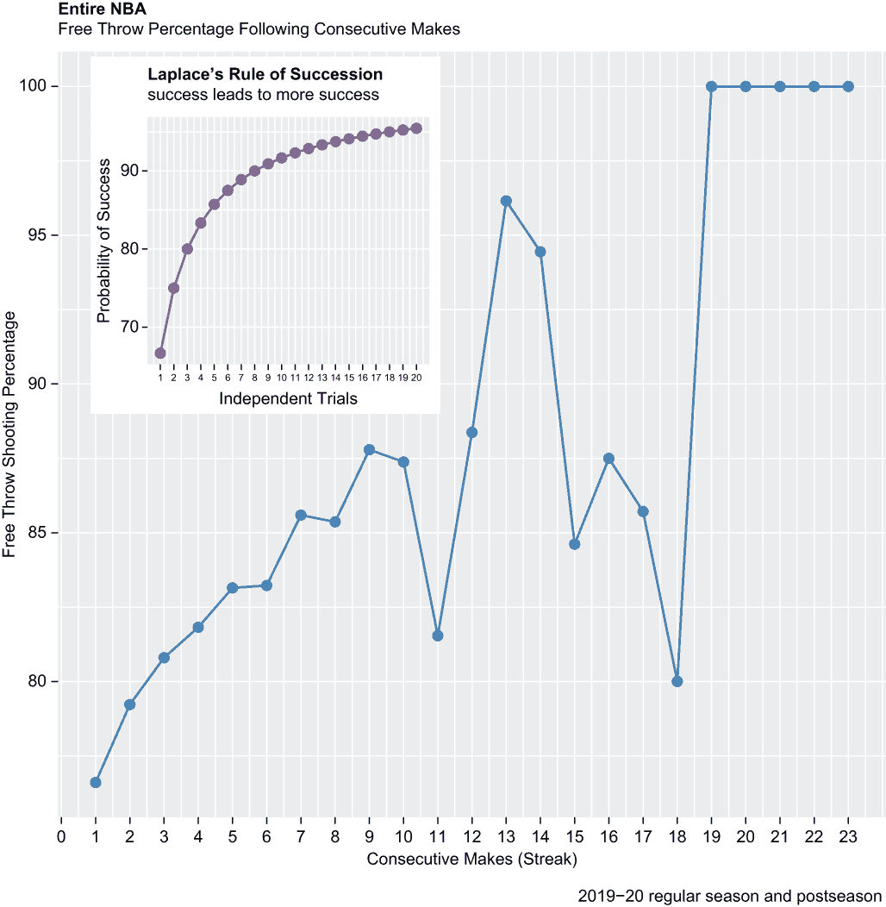

# 16 随机性 versus 因果关系

本章涵盖了

+   拉普拉斯的成功法则

+   热手

+   识别随机性、顺序和因果关系

+   模拟抛硬币

+   将 `ggplot2` 对象插入到其他 `ggplot2` 对象中

在 18 世纪早期，一位名叫皮埃尔-西蒙·拉普拉斯的法国学者和博学家开发了一个公式，用于从低观察计数开始计算概率。假设有 *n* 次独立的试验，只能导致成功或失败；我们可能通过应用以下公式来计算下一次试验成功的概率 (*p*) (*s*) (*n*)：*p = s / n*。然而，假设只有五次独立的试验和五次成功。因此，第六次试验成功的概率将是 100%；或者，如果前五次都失败了，成功的概率将是 0%。传统的或习惯的计算概率的方法没有考虑到在观察计数低和方差机会相对最小的情况下，不同结果的可能性，因此并不十分有意义。

介绍拉普拉斯。具有讽刺意味的是，拉普拉斯并非通过观察某些罕见现象，而是通过估计太阳升起的概率来发展了后来成为成功法则的东西。如果 *p* 等于成功的概率，*s* 等于先前的成功次数，*n* 等于完成的试验次数，那么拉普拉斯的成功法则估计 *p = (s + 1) / (n + 2)*。因此，如果在五个独立的试验中都有成功，第六次试验成功的概率将不会是 100%，而是 86%。如果前五次试验都失败了，拉普拉斯的成功法则估计第六次试验成功的概率为 14%。

一系列独立的试验通常会导致成功和失败的一些混合。但拉普拉斯的成功法则最流行的用例是估计一系列先前的成功之后的成功率，无论先前的独立试验数量是多少。

正因如此，我们才在这里。我们的目的是了解拉普拉斯概率曲线，并探讨在一系列先前的成功之后，是否自由投篮命中率遵循这样的曲线，至少在精神上如此。我们的问题将包括以下内容：

+   自由投篮命中率是否会随着每一次后续的成功而增加，或者自由投篮命中率根本不遵循任何模式？

+   是否可以从先前的尝试中估计自由投篮尝试的成功率，或者命中和失球是否类似于一系列的抛硬币？

+   当我们分析一系列的自由投篮命中和失球时，是否存在顺序和因果关系，或者只是随机性？

+   是否存在“手感热”这样的东西，或者“手感热”仅仅是一种认知错觉？

我们将加载我们的包，导入我们的数据，运行一系列数据整理操作，进一步讨论继起规则和热手现象，然后进行我们的分析。我们的分析将分为两部分：我们将检查三名联赛领先者的罚球射击，然后我们将评估单个数据系列中每位球员的相同表现。准备好迎接一个严重的剧情转折。

## 16.1 加载包

除了`tidyverse`（我们将使用`dplyr`函数整理数据，并使用`ggplot2`函数创建可视化）之外，我们只需要加载一个相对不为人知的包，名为`runner`，它包含用于范围和大小连串的函数。因此，我们调用`library()`函数加载`tidyverse`和`runner`包：

```
library(tidyverse)
library(runner)
```

接下来，我们将导入或重新导入我们在第八章中使用过的相同数据集。

## 16.2 导入和整理数据

然后，我们调用`read_csv()`函数来导入一个从[www.bigdataball.com](https://www.bigdataball.com/)下载并保存在我们默认工作目录中的.csv 文件。我们的数据集——即我们在第八章探索最优停止规则时首次导入的数据——包含了 2019-20 NBA 常规赛和季后赛几乎每一场比赛的详细信息。在这个过程中，我们创建了一个名为 ft 的对象。

我们已经知道我们的数据有 543,149 行长和 44 列宽；因此，如果你在个人电脑上工作而不是服务器上，加载比赛数据集可能需要几秒钟：

```
ft <- read_csv("pbp.csv")
```

我们的数据比我们需要的更宽更长。因此，我们接下来调用`dplyr`包中的`select()`函数来仅对几个变量进行数据子集：

```
ft %>%
  select(date, event_type, player, points, result, type) -> ft
```

我们将 ft 缩减到以下变量：

+   `date`——每个比赛发生的日期，格式为 yyyy-mm-dd。这是一个字符字符串，将很快被转换为日期类型。

+   `event_type`——比赛的类型（例如，跳球、犯规、失误）。在第八章中，我们将`event_type`从字符字符串转换为因子变量，然后最终将数据子集为`event_type`等于`shot`（代表投中三分）或`miss`（代表投篮未命中）。

+   `player`——负责事件类型或比赛的球员的名字，格式为“姓 名”。这是一个字符字符串，将保持为字符字符串。

+   `points`——任何比赛直接导致得分的数量。在可以直接导致得分的场合和地方，这个值至少为 0，最多为 3；当比赛不可能导致任何得分——例如，篮板、驱逐或暂停——得分等于 NA。这是一个整数，现在并将保持为整数。

+   `result`——在投篮或罚球尝试之后得分或失分；否则等于 NA。这是一个字符字符串，将被转换为因子变量。

+   `type`——与`event_type`类似，但描述得稍微详细一些。例如，当`event_type`等于`rebound`时，`type`可能等于`rebound offensive`；或者当`event_type`等于`miss`时，`type`可能等于`Floating Jump Shot`。现在这是一个将被转换为因子变量的字符字符串。

然后，我们调用来自`dplyr`的`filter()`函数，以缩短我们的数据长度：

```
ft %>%
  filter(event_type == "free throw", type != "Free Throw Technical") -> ft
```

我们对`ft`进行了子集处理，其中`event_type`等于`free throw`且`type`不等于`Free Throw Technical`。这里需要一些解释。

在第八章中，我们对所有投篮尝试的逐场数据进行了子集处理，这要求我们应用`filter()`函数，其中`event_type`等于`shot`或`miss`——因为`shot`代表成功的投篮尝试，而`miss`代表不成功的投篮尝试。相反，每次罚球尝试——无论是命中还是未命中——都会在`event_type`等于`free throw`的情况下被计算在内；然后我们必须将`event_type`与变量`result`结合，`result`等于`made`或`missed`，以确定任何尝试的罚球是否成功。

如果你对篮球不熟悉，你可能想知道罚球究竟是什么。许多防守犯规会导致进攻球员被允许投掷一次或通常两次罚球——有时，根据情况，甚至可以投掷三次罚球。罚球是从距离篮筐 15 英尺的线后进行的无干扰或未受保护的投篮。比赛计时器暂停，场上的每位球员都必须站在射手的一侧或其后，直到最后一次罚球尝试完成。成功的罚球，通常被称为罚球，总是值一分。一个好的射手或得分手可能在他的投篮尝试中命中 45%，但他的罚球命中率可能达到 80%或更高。

我们排除了技术罚球，因为它们只占所有尝试罚球的一小部分，这样做简化了我们对成功尝试连串的规模和范围的评估工作。为了提供一些背景信息，Giannis Antetokounmpo，密尔沃基雄鹿队的前锋，昵称希腊怪物，在 2019-20 赛季常规赛中尝试了 629 次罚球，位列联盟第二，然后在随后的季后赛中又尝试了额外的 81 次罚球。在这 710 次总尝试中，只有 3 次是技术罚球，即对方球队被吹罚技术犯规而产生的罚球。关于 Antetokounmpo 的更多内容，你很快就会听到。

与此同时，我们将自由投篮与投篮尝试进行对比，投篮尝试可以从距离篮筐 25 英尺的激烈跳投到开放的轻松上篮不等。这就是为什么我们选择了自由投篮而不是投篮来与拉普拉斯概率曲线进行比较，并确定是否存在“热手”这种东西。自由投篮是在一个主要受控的环境中尝试的，而投篮则经常在混乱的情况下尝试。

话虽如此，我们接下来调用基础 R 的`as.Date()`函数，将 ft 变量`date`从字符字符串转换为日期类别。当格式等于%Y-%m-%d（如这里所示）或%Y/%m/%d 时，`as.Date()`函数特别简单。然后，我们调用也来自基础 R 的`class()`函数，以返回并确认转换后的类别：

```
ft$date <- as.Date(ft$date, "%Y-%m-%d")
class(ft$date)
## [1] "Date"
```

接下来，我们调用基础 R 的`as.factor()`函数三次，将剩余的四个 ft 字符字符串中的三个转换为因子：

```
ft$event_type <- as.factor(ft$event_type)
ft$result <- as.factor(ft$result)
ft$type <- as.factor(ft$type)
```

最后，我们调用`dplyr glimpse()`函数，它返回我们数据的转置、但截断的视图。此外，`glimpse()`函数还返回 ft 的行和列计数以及每个存活变量的类别。因此，在单一快照中，我们可以公平地了解我们的数据处理操作的结果：

```
glimpse(ft)
## Rows: 51,722
## Columns: 6
## $ date       <date> 2019-10-22, 2019-10-22, 2019-10-22, 2019-10-22,...
## $ event_type <fct> free throw, free throw, free throw, free throw, ...
## $ player     <chr> "Kyle Lowry", "Kyle Lowry", "Pascal Siakam", "Pa...
## $ points     <dbl> 1, 0, 1, 1, 1, 1, 1, 1, 1, 2, 0, 1, 1, 0, 1, 1, ...
## $ result     <fct> made, missed, made, made, made, made, made, made...
## $ type       <fct> Free Throw 1 of 2, Free Throw 2 of 2, Free Throw...
```

接下来，我们将详细阐述拉普拉斯的连续性规则。

## 16.3 连续性和热手规则

如果投篮命中率至少大致遵循拉普拉斯概率曲线，当成功（*s*）等于试验（*n*）时，那么得出“热手”这种东西存在的结论可能是合理的。这广泛地表明，成功不可避免地导致进一步的成功，这意味着从统计学的角度来看，幂律是从一系列早期成功中演变而来，而不是立即回归到平均值。为了明确，幂律通过一个变量与另一个变量的幂的比例来描述数学关系；结果不是线性的，而是指数的。相比之下，回归到平均值是一种现象，其中极端结果被更温和的结果或同等极端的结果所跟随，这些结果相互抵消。

另一方面，我们必须接受这样一个事实，即世界上很大一部分是盲目无序的，因此不是整洁或可预测的，并避免混淆随机性和秩序、因果关系的陷阱。以一系列抛硬币为例，我们可以通过调用内置的`sample()`函数在 R 中模拟。`sample()`函数接受以下四个参数：

+   `x`——包含要从中选择的元素的向量。因为我们是在抛两面硬币，所以我们分配一对整数来表示正面（0）和反面（1）。然后，这些整数被传递给基础 R 的`c()`函数作为参数，以形成向量。

+   `size`——等于所需的抛硬币次数。因为我们可以用 10 次抛硬币同样容易地演示`sample()`函数，所以我们设置`size`等于`10`。

+   `prob`—一个包含单次抛硬币出现正面或反面的概率的第二个向量。因为我们模拟的是公平硬币的抛掷，而不是加权硬币，所以`prob`必须因此包含`0.5`和`0.5`作为元素。

+   `replace`—在带替换采样时等于`TRUE`，否则为`FALSE`。抛硬币意味着是独立的试验，其中每次抛掷有相等的机会产生正面或反面，无论之前的抛掷结果如何。这就是为什么我们必须带替换采样。（顺便说一句，只能产生两种结果之一的独立试验通常被称为伯努利试验或二项试验。）

`sample()`函数返回一系列 10 个值，每个值都将等于`0`或`1`。当然，每次调用`sample()`函数的结果都会不同；这里显示的是第一次调用`sample()`函数时返回的结果：

```
sample(x = c(0, 1), size = 10, prob = c(0.5, 0.5), replace = TRUE)
##  [1] 0 1 1 1 1 1 1 0 1 0
```

我们第一次模拟的抛硬币结果是正面，接下来的六次抛硬币结果是反面，最后三次中有两次结果是正面。我们的代码没有问题，`sample()`函数也没有缺陷——我们公正地模拟了 10 次抛硬币，其中正面和反面的概率是相等的。

概率并不等同于保证的结果，尤其是在小样本中。如果我们模拟 10,000 次抛硬币，我们不太可能得到 70%的正面；然而，我们同样不太可能得到正好 5,000 次正面和 5,000 次反面。

如果我们再次运行我们的代码，我们可能会得到相同的结果，因此我们两次抛硬币的结果在效果上会类似于幂律。我们可能会得到七个正面和三个反面，或者至少五个正面和五个反面，因此我们两次抛硬币的结果会显示出回归到平均值。

当然，我们的模拟硬币连续六次抛出反面并不意味着它变热了。每次抛硬币代表一个独立的试验，其中结果与过去或未来的事件没有联系。那么，NBA 球员罚球的情况呢？每次罚球也是一个独立的试验吗，还是因为一系列尝试的罚球实际上是相关事件，所以连续六次命中因此构成“手感热”？

换句话说，手感热是一种认知错觉，就像臭名昭著的蒙提霍尔问题吗？还是它是一个真实的现象？

蒙提霍尔问题

蒙提霍尔是电视游戏节目《让我们来交易》的原始主持人。参赛者经常被展示三个隐藏在三个关闭的门后的奖品，并被要求选择其中之一。其中一扇门后面是一辆车；其他两扇门后面是农场动物。你作为参赛者，选择了 1 号门。

蒙提·霍尔，他知道每扇门后面是什么，然后打开了编号为 3 的门，门后面是一只山羊。然后他问你是否想坚持选择编号为 1 的门，还是切换到编号为 2 的门。你可能会得出结论，这无关紧要——剩下两扇门，几率必须是一半。然而，实际上，通过切换到编号为 2 的门，你实际上将赢得汽车的机会翻倍。这是因为有 33.3%的概率汽车在编号为 1 的门后面，有 66.7%的概率汽车在另外两扇门中的一扇后面。而且因为蒙提·霍尔已经打开了编号为 3 的门，汽车在编号为 2 的门后面而不是编号为 1 的门后面的概率是两倍。切换门的参赛者大约有三分之二的时间赢得了汽车。

如果“手感热”是一个真实的现象，那么罚球命中率将大约遵循拉普拉斯概率曲线，其中试验次数（投篮）和成功次数（罚球命中）是相同的。现在让我们用 20 次成功和 20 次试验来具体展示拉普拉斯概率曲线的形状。

我们首先创建了一对向量，`prior_successes`和`independent_trials`，它们都包含 1 到 20 的整数作为元素。R 的基础`seq()`函数通过一个传递的参数生成另一个传递的参数的数字序列；默认情况下，R 按默认值递增序列。然后，我们通过将两个向量传递给 R 的基础`data.frame()`函数来创建一个数据框 df：

```
prior_successes <-seq(1, 20)
independent_trials <- seq(1, 20)

df <- data.frame(prior_successes, independent_trials)
print(df)
##    prior_successes independent_trials
## 1                1                  1
## 2                2                  2
## 3                3                  3
## 4                4                  4
## 5                5                  5
## 6                6                  6
## 7                7                  7
## 8                8                  8
## 9                9                  9
## 10              10                 10
## 11              11                 11
## 12              12                 12
## 13              13                 13
## 14              14                 14
## 15              15                 15
## 16              16                 16
## 17              17                 17
## 18              18                 18
## 19              19                 19
## 20              20                 20
```

接下来，我们通过管道操作符将 df 传递给`dplyr mutate()`函数来创建一个新变量。我们的新变量`laplace`等于拉普拉斯的后继法则公式，然后乘以 100 将小数转换为百分比：

```
df %>%
  mutate(laplace = (prior_successes + 1) / 
           (independent_trials + 2) * 100) -> df
print(df)
##    prior_successes independent_trials  laplace
## 1                1                  1 66.66667
## 2                2                  2 75.00000
## 3                3                  3 80.00000
## 4                4                  4 83.33333
## 5                5                  5 85.71429
## 6                6                  6 87.50000
## 7                7                  7 88.88889
## 8                8                  8 90.00000
## 9                9                  9 90.90909
## 10              10                 10 91.66667
## 11              11                 11 92.30769
## 12              12                 12 92.85714
## 13              13                 13 93.33333
## 14              14                 14 93.75000
## 15              15                 15 94.11765
## 16              16                 16 94.44444
## 17              17                 17 94.73684
## 18              18                 18 95.00000
## 19              19                 19 95.23810
## 20              20                 20 95.45455
```

当然，与阅读一排排数字相比，可视化结果总是更有效，你可以在图 16.1 中这样做：

+   因此，我们将我们的模拟数据传递给`ggplot()`函数，该函数来自`ggplot2`包。

+   我们的自变量是`independent_trials`，因变量是`laplace`。

+   我们的视觉化将是一个带有线条上层的点状图；因此，我们调用一对几何对象来绘制我们的图表，`geom_line()`和`geom_point()`。我们的线条宽度是默认宽度的 1.5 倍，点的大小是默认大小的三倍。

+   `scale_x_continuous()`函数与`seq()`函数一起使用，使我们能够操纵 x 轴刻度，从而覆盖`ggplot2`的默认设置。我们的 x 轴将包含 20 个刻度，每次增加 1，而不是 5 个刻度每次增加 5。



图 16.1 当成功次数等于相对较小的独立试验次数时的拉普拉斯概率曲线

精确的 y 轴值对我们来说大多没有意义。我们只是对随着试验次数和成功次数的增加概率曲线的弧线感兴趣：

```
p1 <- ggplot(df, aes(x = independent_trials, y = laplace, group = 1)) + 
      geom_line(aes(y = laplace), color = "purple", size = 1.5) +
      geom_point(size = 3, color = "purple") +
      labs(title = "Laplace's Rule of Succession", 
           subtitle = "success leads to more success", 
           x = "Independent Trials",
           y = "Probability of Success") +
     scale_x_continuous(breaks = seq(0, 20)) +
     theme(plot.title = element_text(face = "bold")) 
print(p1)
```

随着独立试验（和成功）数量的增加，成功的概率以递减的速度增加，但它永远不会达到 100%。拉普拉斯的后继规则考虑到了不同结果的可能性，无论之前进行了多少次成功的试验。

让我们从检查球员特定的罚球命中率开始，按连续尝试和得分进行细分。然后我们将比较结果与我们的拉普拉斯概率曲线。

## 16.4 球员级别分析

我们为分析挑选了三名球员。他们三人都曾是 2019-20 赛季尝试罚球次数的领跑者；然而，他们各自成功尝试的百分比差异很大。因此，支持我们分析的大量观察结果分散在三位具有不同罚球技巧的球员身上。

### 16.4.1 第 3 位球员：扬尼斯·安特托昆博

我们将从扬尼斯·安特托昆博开始，他效力于密尔沃基雄鹿队的强力前锋位置。安特托昆博在 2019-20 赛季常规赛和季后赛中尝试了 707 次罚球（不包括技术罚球），根据[www.basketball-reference.com](https://www.basketball-reference.com/)的数据，成功 442 次，成功率达到了 62.5%。安特托昆博是 NBA 最优秀和得分能力最强的球员之一，但罚球并不是他的强项。

我们的第一步操作是调用`filter()`函数，对 ft 数据集进行子集化，其中变量`player`等于`Giannis Antetokounmpo`。最终结果是名为 giannis 的新数据集。

我们可以通过运行一对基础 R 函数来确认我们数据的完整性——或者至少用我们从[www.basketball-reference.com](https://www.basketball-reference.com/)获取的统计数据来证实它。`dim()`函数返回 giannis 的行和列计数；giannis 包含 707 条记录，这与他在常规赛和季后赛中尝试的罚球次数相匹配。`sum()`函数将变量 points 中包含的整数相加，其中`0`代表未命中的罚球，`1`代表命中的罚球；总和为 442，确实等于成功罚球次数：

```
ft %>%
  filter(player == "Giannis Antetokounmpo") -> giannis

dim(giannis)
## [1] 707   6
sum(giannis$points)
## [1] 442
```

然后我们将 giannis 数据集通过管道传递给`dplyr group_by()`和`mutate()`函数。从`mutate()`中，我们得到一个名为`streak`的新变量，而`group_by()`则按变量 date 对结果进行分组。

我们的新变量是通过从`runner`包中调用`streak_run()`函数得到的。`dplyr-streak_run()`中的`lag()`函数计算一系列连续元素，并告诉`streak_run()`在处理数据之前先从*上一条*记录中摄取变量 points。(`dplyr`包还包含一个`lead()`函数，它是`lag()`的相反操作；此外，还可以通过两条或更多记录来回顾或前瞻。)

我们按变量日期分割这些结果，因为如果存在所谓的“手感热”现象，它肯定只存在于单场比赛中，因此不会从一个游戏延续到下一个游戏。这种方法也使记录数保持在最低，因此符合拉普拉斯继起法则的最佳拟合。

我们的结果被转换为一个名为 giannis_final 的 tibble。基本的 R `head()` 函数返回前 10 个观察值：

```
giannis %>%
  group_by(date) %>%
  mutate(streak = streak_run(lag(points))) -> giannis_final

head(giannis_final, n = 10)
## # A tibble: 10 × 7
## # Groups:   date [1]
##    date       event_type player                points result            
##    <date>     <fct>      <chr>                  <dbl> <fct>
##  1 2019-10-24 free throw Giannis Antetokounmpo      0 missed 
##  2 2019-10-24 free throw Giannis Antetokounmpo      1 made   
##  3 2019-10-24 free throw Giannis Antetokounmpo      0 missed 
##  4 2019-10-24 free throw Giannis Antetokounmpo      0 missed 
##  5 2019-10-24 free throw Giannis Antetokounmpo      0 missed 
##  6 2019-10-24 free throw Giannis Antetokounmpo      1 made   
##  7 2019-10-24 free throw Giannis Antetokounmpo      1 made   
##  8 2019-10-24 free throw Giannis Antetokounmpo      1 made   
##  9 2019-10-24 free throw Giannis Antetokounmpo      1 made   
## 10 2019-10-24 free throw Giannis Antetokounmpo      1 made   
##    type              streak
##    <fct>              <int>
##  1 Free Throw 1 of 2      0
##  2 Free Throw 2 of 2      1
##  3 Free Throw 1 of 2      1
##  4 Free Throw 2 of 2      1
##  5 Free Throw 1 of 2      2
##  6 Free Throw 2 of 2      3
##  7 Free Throw 1 of 1      1
##  8 Free Throw 1 of 2      2
##  9 Free Throw 2 of 2      3
## 10 Free Throw 1 of 2      4
```

让我们浏览一下数据——至少是前几条记录——以进一步解释 `streak_run()` 函数是如何工作的：

+   当日期翻转时，变量 `streak` 总是等于 `0`；并且无论第一次尝试是命中还是未命中，它总是等于 `1`。

+   安特托昆博在 2019 年 10 月 24 日错过了他的第一次罚球尝试，然后命中了他的第二次尝试。因此，他的第三次尝试罚球时 `streak` 等于 `1`。因为安特托昆博错过了那次尝试，他的第四次罚球尝试时 `streak` 也等于 `1`。

+   最终，安特托昆博连续投中五个罚球；因此，对于每一次连续尝试，变量 `streak` 都会增加一。

然后，我们将 giannis_final 传递给 `dplyr group_by()` 和 `slice()` 函数，以有效地删除每个独特日期的第一个记录。连串在每场比赛结束时自动停止；因此，我们只对每个独特日期或游戏的第二次罚球尝试 onward 感兴趣：

```
giannis_final %>%
  group_by(date) %>%
  slice(-1) -> giannis_final
```

调用 `dim()` 函数返回新的 giannis_final 维度：

```
dim(giannis_final)
## [1] 635   7
```

由于移除了每个独特日期或游戏的第一个记录（再次强调，我们按日期分割记录，因为连串不会从一个游戏延续到下一个游戏，所以每个游戏的第一次罚球尝试是多余的），giannis_final 现在包含 635 条记录，比之前少了 72 条记录。这很合理，因为安特托昆博在 2019-20 赛季参加了 72 场常规赛和季后赛比赛。（注意，2019-20 NBA 赛季因 COVID-19 而缩短。）

我们还没有完成对 giannis_final 记录数的减少，因为在这个时候，我们正在跟踪命中和未命中的连串，但我们只关心在命中罚球之后的成功和未成功的罚球尝试。因此，在我们的下一块代码中，我们将 giannis_final 传递给 `filter()` 函数，以子集我们的数据，其中变量 `points` 的一个记录滞后等于 `1`。

然后，我们调用 `dplyr group_by()` 和 `summarize()` 函数来按变量 `streak` 计算命中和未命中的次数。我们的结果被转换为一个名为 giannis_tbl1 的 tibble：

```
giannis_final %>%
  filter(lag(points) == 1) %>%
  group_by(streak) %>%
  summarize(makes = sum(points == 1), 
            misses = sum(points == 0)) -> giannis_tbl1
print(giannis_tbl1)
## # A tibble: 12 × 3
##    streak makes misses
##     <int> <int>  <int>
##  1      1    74     46
##  2      2    63     30
##  3      3    41     16
##  4      4    27      8
##  5      5    14      7
##  6      6     6      4
##  7      7     3      1
##  8      8     3      0
##  9      9     2      0
## 10     10     1      1
## 11     11     1      0
## 12     12     1      0
```

最后，我们再次调用 `mutate()` 函数来创建一个新的变量，`pct`，它等于命中次数除以总罚球尝试次数。因此，变量 `pct` 代表了变量 `streak` 中每个整数值所对应的吉安尼斯·安特托昆博的罚球命中率：

```
giannis_tbl1 %>%
  mutate(pct = makes / (makes + misses) * 100) -> giannis_tbl2
print(giannis_tbl2)
## # A tibble: 12 × 4
##    streak makes misses   pct
##     <int> <int>  <int> <dbl>
##  1      1    74     46  61.7
##  2      2    63     30  67.7
##  3      3    41     16  71.9
##  4      4    27      8  77.1
##  5      5    14      7  66.7
##  6      6     6      4  60  
##  7      7     3      1  75  
##  8      8     3      0 100  
##  9      9     2      0 100  
## 10     10     1      1  50  
## 11     11     1      0 100  
## 12     12     1      0 100
```

这些结果随后通过 `ggplot2` 线形图进行可视化，每个 x 轴刻度上都有点叠加在线上（见图 16.2）：

```
p2 <- ggplot(giannis_tbl2, aes(x = streak, y = pct, group = 1)) + 
  geom_line(aes(y = pct), color = "steelblue", size = 1.5) +
  geom_point(size = 3, color = "steelblue") +
  labs(title = "Giannis Antetokounmpo", 
       subtitle = "Free Throw Percentage Following Consecutive Makes", 
       x = "Consecutive Makes (Streak)", 
       y = "Free Throw Shooting Percentage", 
       caption = "2019-20 regular season and postseason\n
              Antetokounmpo shot 62.5% from the line during
       the regular season and postseason combined") +
  scale_x_continuous(breaks = seq(0, 12, 1)) +
  theme(plot.title = element_text(face = "bold"))
print(p2) 
```



图 16.2 2019-20 赛季吉安尼斯·安特托昆博连续命中罚球的成功率

我们的图表与拉普拉斯概率曲线完全不相似，因此我们无法得出存在“热手”效应的结论。是的，当安特托昆博连续命中一到四个罚球时，他的罚球成功率确实提高了，但当他连续命中五个成功尝试时，罚球成功率下降到大约 67%，当他连续命中六个罚球时，又下降到 60%。而且，是的，当安特托昆博连续成功罚球尝试达到并超过八个时，他通常从罚球线投篮 100%，但那些数字的记录计数如此之低，以至于使得结果在统计学上没有意义。

然而，更重要的是，那些最后的结果忽略了即使是在公平概率下抛硬币也可能连续多次出现正面或反面的事实。我们之前模拟的抛硬币在 10 次抛掷中就出现了六次连续出现反面的情况。让我们看看在 700 次抛掷中我们可能会得到什么样的连击，这大约等于安特托昆博在 2019-20 赛季尝试的罚球次数。

我们再次调用 `sample()` 函数（再次强调，每次调用 `sample()` 时结果都会不同）：

+   由于我们现在模拟的是 700 次抛硬币，而不是仅仅 10 次，我们改变 `sample()` 函数的大小参数为 `700`。

+   我们的结果保存在一个名为 coin_flips 的数据框中，具体是一个名为 heads_tails 的列，其中 `0` 再次表示正面，`1` 表示反面。我们也可以认为 `0` 表示失手的罚球，而 `1` 表示成功的罚球。

+   然后，我们将 coin_flips 传递给 `mutate()` 函数，创建一个名为 `streak` 的变量，该变量等于连续出现正面和反面的累计数，这要归功于 `runner` 包中的 `streak_run()` 函数。

+   然后，我们通过调用 `dplyr` 的 `filter()` 函数来对 heads_tails 等于 `1` 的 coin_flips 进行子集化。

+   最后，我们调用基础 R 的 `max()` 函数，该函数返回变量 `streak` 的最大值。

我们不会费心打印所有或部分 coin_flips；我们只需在这里分享结果：

```
coin_flips <- sample(x = c(0, 1), size = 700, prob = c(0.5, 0.5), 
                     replace = TRUE)
coin_flips <- as.data.frame(coin_flips)
colnames(coin_flips) <- c("heads_tails")

coin_flips %>%
  mutate(streak = streak_run(heads_tails)) %>%
  filter(heads_tails == 1) -> coin_flips

max(coin_flips$streak)
## [1] 11
```

因此，在模拟了 700 次抛硬币之后，我们得到了最多 11 次连续出现反面的情况。这与安特托昆博的最佳连击相当，特别是考虑到我们模拟的是公平的、没有加权的抛硬币，其概率是 50/50。

### 16.4.2 第 3 名球员：朱利叶斯·兰德尔

我们的下一位球员是朱利叶斯·兰德尔，他是纽约尼克斯队的前锋和中锋。在 2019-20 赛季常规赛中（尼克斯队没有晋级季后赛），兰德尔尝试了 350 次罚球，不包括两次技术罚球；他命中了 257 次，占这些尝试的 73.4%。再次强调，这些统计数据是从[www.basketball-reference.com](https://www.basketball-reference.com/)获得的。

我们首先调用`filter()`函数，并子集 ft 数据集，其中变量`player`等于`Julius Randle`。随后的`dim()`和`sum()`函数调用确认我们的数据与篮球参考网站上的类似统计数据完全一致——`dim()`返回记录数，即尝试的罚球次数，而`sum()`通过变量`points`中的整数相加返回命中的罚球次数，其中`0`表示未命中，`1`表示命中：

```
ft %>%
  filter(player == "Julius Randle") -> randle

dim(randle)
## [1] 350   6
sum(randle$points)
## [1] 257
```

然后，我们创建了一个名为`streak`的变量，这个变量与之前的同名变量类似，按`date`变量分组。我们的结果被转换成一个新的对象，称为 randle_final。

我们通过调用`head()`函数获取 randle_final 返回的前 10 个观测值：

```
randle %>%
  group_by(date) %>%
  mutate(streak = streak_run(lag(points))) -> randle_final

head(randle_final, n = 10)
## # A tibble: 10 × 7
## # Groups:   date [2]
##    date       event_type player        points result 
##    <date>     <fct>      <chr>          <dbl> <fct>  
##  1 2019-10-23 free throw Julius Randle      1 made   
##  2 2019-10-23 free throw Julius Randle      0 missed 
##  3 2019-10-23 free throw Julius Randle      1 made   
##  4 2019-10-23 free throw Julius Randle      1 made   
##  5 2019-10-23 free throw Julius Randle      0 missed 
##  6 2019-10-23 free throw Julius Randle      1 made   
##  7 2019-10-25 free throw Julius Randle      0 missed 
##  8 2019-10-25 free throw Julius Randle      0 missed 
##  9 2019-10-25 free throw Julius Randle      1 made   
## 10 2019-10-25 free throw Julius Randle      1 made   
##    type              streak
##    <fct>              <int>
##  1 Free Throw 1 of 1      0
##  2 Free Throw 1 of 2      1
##  3 Free Throw 2 of 2      1
##  4 Free Throw 1 of 1      1
##  5 Free Throw 1 of 2      2
##  6 Free Throw 2 of 2      1
##  7 Free Throw 1 of 2      0
##  8 Free Throw 2 of 2      1
##  9 Free Throw 1 of 2      2
## 10 Free Throw 2 of 2      1
```

然后，我们通过管道操作符将 randle_final 传递给`group_by()`和`slice()`函数，删除每个唯一日期或比赛的第一个 randle_final 记录：

```
randle_final %>%
  group_by(date) %>%
  slice(-1) -> randle_final
```

这将 randle_final 的长度减少到 289 条记录：

```
dim(randle_final)
## [1] 289   7
```

再次调用`filter()`函数进一步减少 randle_final，这次通过子集变量`points`中一个记录的滞后等于`1`。然后将这些结果传递给`group_by()`和`summarize()`函数，对变量`streak`中的每个整数进行命中和未命中的计数。我们的汇总结果被转换成名为 randle_tbl1 的 tibble：

```
randle_final %>%
  filter(lag(points) == 1) %>%
  group_by(streak) %>%
  summarize(makes = sum(points == 1), 
            misses = sum(points == 0)) -> randle_tbl1
print(randle_tbl1)
## # A tibble: 8 × 3
##   streak makes misses
##    <int> <int>  <int>
## 1      1    39     10
## 2      2    35     24
## 3      3    18     10
## 4      4    10      5
## 5      5     5      3
## 6      6     2      1
## 7      7     2      0
## 8      8     1      0
```

然后将这个对象传递给`mutate()`函数，创建一个新的变量，等于 Randle 在连续命中次数中的罚球命中率：

```
randle_tbl1 %>%
  mutate(pct = makes / (makes + misses) * 100) -> randle_tbl2

print(randle_tbl2)
## # A tibble: 8 × 4
##   streak makes misses   pct
##    <int> <int>  <int> <dbl>
## 1      1    39     10  79.6
## 2      2    35     24  59.3
## 3      3    18     10  64.3
## 4      4    10      5  66.7
## 5      5     5      3  62.5
## 6      6     2      1  66.7
## 7      7     2      0 100  
## 8      8     1      0 100
```

最后，我们通过绘制来自我们刚刚创建的 randle_tbl2 tibble 的`ggplot2`线图来可视化朱利叶斯·兰德尔（Julius Randle）的罚球命中率（见图 16.3）：

```
p3 <- ggplot(randle_tbl2, aes(x = streak, y = pct, group = 1)) + 
  geom_line(aes(y = pct), color = "steelblue", size = 1.5) +
  geom_point(size = 3, color = "steelblue") +
  labs(title = "Julius Randle", 
       subtitle = "Free Throw Percentage Following Consecutive Makes", 
       x = "Consecutive Makes (Streak)", 
       y = "Free Throw Shooting Percentage", 
       caption = "2019-20 regular season and postseason\n
                  Randle shot 73.4% from the line during
       the regular season") +
  scale_x_continuous(breaks = seq(0, 8, 1)) +
  theme(plot.title = element_text(face = "bold")) 
print(p3)
```



图 16.3 2019-20 赛季连续命中后朱利叶斯·兰德尔的罚球命中率

在一次成功的罚球尝试之后，Randle 的罚球命中率接近 80%，但当他之前在两次到六次连续罚球命中之间时，命中率则低于 70%。再次强调，这与拉普拉斯概率曲线没有相似之处，所以我们再次没有看到任何“手感热”的证据。

### 16.4.3 第 3 位球员：詹姆斯·哈登

我们的第三位和最后一位球员是詹姆斯·哈登，他在 2019-20 赛季为休斯顿火箭队效力（他后来为其他三支球队效力过）。年复一年，哈登是 NBA 顶级得分手之一，这在很大程度上是因为他吸引了大量的投篮犯规，因此尝试了大量的罚球。在 2019-20 赛季，哈登尝试的罚球比任何其他球员都多出近 200 次。根据他的[www.basketball-reference.com](https://www.basketball-reference.com/)统计数据，哈登在常规赛和季后赛中尝试了 873 次罚球，不包括技术犯规罚球，命中了 754 次，即 86.4%。

我们将詹姆斯·哈登的数据处理操作系列压缩到一个代码块中：

```
ft %>%
  filter(player == "James Harden") -> harden

dim(harden)
## [1] 873   6
sum(harden$points)
## [1] 754

harden %>%
  group_by(date) %>%
  mutate(streak = streak_run(lag(points))) -> harden_final

head(harden_final, n = 10)
## # A tibble: 10 × 7
## # Groups:   date [1]
##    date       event_type player       points result 
##    <date>     <fct>      <chr>         <dbl> <fct>  
##  1 2019-10-24 free throw James Harden      1 made   
##  2 2019-10-24 free throw James Harden      1 made   
##  3 2019-10-24 free throw James Harden      1 made   
##  4 2019-10-24 free throw James Harden      1 made   
##  5 2019-10-24 free throw James Harden      1 made   
##  6 2019-10-24 free throw James Harden      1 made   
##  7 2019-10-24 free throw James Harden      1 made   
##  8 2019-10-24 free throw James Harden      1 made   
##  9 2019-10-24 free throw James Harden      1 made   
## 10 2019-10-24 free throw James Harden      1 made   
##    type              streak
##    <fct>              <int>
##  1 Free Throw 1 of 2      0
##  2 Free Throw 2 of 2      1
##  3 Free Throw 1 of 3      2
##  4 Free Throw 2 of 3      3
##  5 Free Throw 3 of 3      4
##  6 Free Throw 1 of 3      5
##  7 Free Throw 2 of 3      6
##  8 Free Throw 3 of 3      7
##  9 Free Throw 1 of 2      8
## 10 Free Throw 2 of 2      9

harden_final %>%
  group_by(date) %>%
  slice(-1) -> harden_final

dim(harden_final)
## [1] 793   7

harden_final %>%
  filter(lag(points) == 1) %>%
  group_by(streak) %>%
  summarize(makes = sum(points == 1), 
            misses = sum(points == 0)) -> harden_tbl1
print(harden_tbl1)
## # A tibble: 23 × 3
##    streak makes misses
##     <int> <int>  <int>
##  1      1    70     13
##  2      2   104     17
##  3      3    86     12
##  4      4    66     14
##  5      5    46      8
##  6      6    35      7
##  7      7    27      4
##  8      8    19      4
##  9      9    16      1
## 10     10    13      2
## # ... with 13 more rows

harden_tbl1 %>%
  mutate(pct = makes / (makes + misses) * 100) -> harden_tbl2
print(harden_tbl2)
## # A tibble: 23 × 4
##    streak makes misses   pct
##     <int> <int>  <int> <dbl>
##  1      1    70     13  84.3
##  2      2   104     17  86.0
##  3      3    86     12  87.8
##  4      4    66     14  82.5
##  5      5    46      8  85.2
##  6      6    35      7  83.3
##  7      7    27      4  87.1
##  8      8    19      4  82.6
##  9      9    16      1  94.1
## 10     10    13      2  86.7
## # ... with 13 more rows
```

在前面的代码块中，通过 tibble harden_tbl2 以表格格式表示变量`streak`中每个整数的哈登罚球命中率，在接下来的代码块中，通过图 16.4 中的另一个`ggplot2`折线图以图形格式表示：

```
p4 <- ggplot(harden_tbl2, aes(x = streak, y = pct, group = 1)) + 
  geom_line(aes(y = pct), color = "steelblue", size = 1.5) +
  geom_point(size = 3, color = "steelblue") +
  labs(title = "James Harden", 
       subtitle = "Free Throw Percentage Following Consecutive Makes", 
       x = "Consecutive Makes (Streak)", 
       y = "Free Throw Shooting Percentage", 
       caption = "2019-20 regular season and postseason\n
                  Harden shot 86.4% from the line during
       the regular season and postseason combined") +
  scale_x_continuous(breaks = seq(0, 23, 1)) +
  theme(plot.title = element_text(face = "bold")) 
print(p4)
```



图 16.4 2019-20 赛季詹姆斯·哈登连续命中后的罚球命中率

再次，我们只看到了随机性——没有拉普拉斯概率曲线，没有幂律，没有热手。然而，接下来，我们将揭示我们在开始时坦率地加入的剧情转折。

## 16.5 全联盟分析

我们最后通过一个单一的数据系列来绘制和分析整个 NBA。我们的数据处理操作再次被压缩到一个代码块中；这里没有新的内容，只是当需要时，我们按日期和球员分组数据操作：

```
ft %>%
  group_by(date, player) %>%
  mutate(streak = streak_run(lag(points))) -> ft_final

head(ft_final, n = 10)
## # A tibble: 10 × 7
## # Groups:   date, player [4]
##    <date>     <fct>      <chr>          <dbl> <fct>  
##  1 2019-10-22 free throw Kyle Lowry         1 made   
##  2 2019-10-22 free throw Kyle Lowry         0 missed 
##  3 2019-10-22 free throw Pascal Siakam      1 made   
##  4 2019-10-22 free throw Pascal Siakam      1 made   
##  5 2019-10-22 free throw Pascal Siakam      1 made   
##  6 2019-10-22 free throw Pascal Siakam      1 made   
##  7 2019-10-22 free throw Fred VanVleet      1 made   
##  8 2019-10-22 free throw Kyle Lowry         1 made   
##  9 2019-10-22 free throw Kyle Lowry         1 made   
## 10 2019-10-22 free throw Josh Hart          2 made   
##    <fct>              <int>
##  1 Free Throw 1 of 2      0
##  2 Free Throw 2 of 2      1
##  3 Free Throw 1 of 2      0
##  4 Free Throw 2 of 2      1
##  5 Free Throw 1 of 2      2
##  6 Free Throw 2 of 2      3
##  7 Free Throw 1 of 1      0
##  8 Free Throw 1 of 2      1
##  9 Free Throw 2 of 2      1
## 10 Free Throw 1 of 2      0

ft_final %>%
  group_by(date, player) %>%
  slice(-1) -> ft_final

ft_final %>% 
  filter(lag(points) == 1) %>%
  group_by(streak) %>%
  summarize(makes = sum(points == 1), 
            misses = sum(points == 0)) -> ft_tbl1
print(ft_tbl1)
## # A tibble: 23 × 3
##    streak makes misses
##     <int> <int>  <int>
##  1      1  3209    980
##  2      2  5285   1386
##  3      3  3257    774
##  4      4  1796    399
##  5      5  1110    225
##  6      6   645    130
##  7      7   404     68
##  8      8   245     42
##  9      9   151     21
## 10     10    90     13
## # ... with 13 more rows

ft_tbl1 %>%
  mutate(pct = makes / (makes + misses) * 100) -> ft_tbl2
print(ft_tbl2)
## # A tibble: 23 × 4
##    streak makes misses   pct
##     <int> <int>  <int> <dbl>
##  1      1  3209    980  76.6
##  2      2  5285   1386  79.2
##  3      3  3257    774  80.8
##  4      4  1796    399  81.8
##  5      5  1110    225  83.1
##  6      6   645    130  83.2
##  7      7   404     68  85.6
##  8      8   245     42  85.4
##  9      9   151     21  87.8
## 10     10    90     13  87.4
## # ... with 13 more rows
```

这导致了我们的最终可视化，另一个`ggplot2`折线图，显示了从罚球线出发的每个可能的连续命中连串的全联盟罚球命中率（见图 16.5）。请注意，安特托昆博、兰德尔和哈登的数据包括在这些结果中；事实上，任何在 2019-20 赛季常规赛或季后赛中至少尝试过一次罚球的球员都被纳入了这些结果。



图 16.5 2019-20 赛季全联盟连续命中后的罚球命中率。与我们在球员层面的结果不同，这些结果近似于拉普拉斯概率曲线。

然而，我们在最后一个图表中添加了一个非常酷的功能——我们在左上角插入了 p1，这样我们就可以方便地比较（不完美）全联盟的结果与（完美）拉普拉斯概率曲线。我们通过调用`ggplot2 annotation_custom()`函数来实现这一点。传递给`annotation_custom()`的第一个参数是`ggplotGrob()`函数，它从一个现有的图表生成一个`ggplot2`网格图形对象。剩余的四个参数确定了内嵌图的 x 和 y 坐标：

```
p5 <- ggplot(ft_tbl2, aes(x = streak, y = pct, group = 1)) + 
  geom_line(aes(y = pct), color = "steelblue", size = 1.5) +
  geom_point(size = 3, color = "steelblue") +
  labs(title = "Entire NBA", 
       subtitle = "Free Throw Percentage Following Consecutive Makes", 
       x = "Consecutive Makes (Streak)",
       y = "Free Throw Shooting Percentage", 
       caption = "2019-20 regular season and postseason") +
  scale_x_continuous(breaks = seq(0, 23, 1)) +
  theme(plot.title = element_text(face = "bold")) +
  annotation_custom(ggplotGrob(p1), xmin = 1, xmax = 11, 
                    ymin = 89, ymax = 101)
print(p5)
```

现在我们正在绘制数千个数据点而不是仅仅几百个，我们实际上得到了一个近似拉普拉斯概率曲线的视觉化。当然，它并不完美，但我们确实看到随着连续命中次数的增加，罚球命中率逐渐提高；我们甚至看到一系列以递减速率增加的情况，至少直到连续命中的罚球次数达到 9 次。然后我们看到当连续命中次数等于 11 次、15 次以及再次等于 18 次时出现回归；然而，总的来说，当先前命中的罚球次数增加时，我们看到的罚球命中率更高。因此，当我们从整体上审视 NBA 而不是几个选定的球员时，我们似乎看到了一种“手感热”的现象。然而，这次，将拉普拉斯概率曲线与“手感热”分开是有意义的。毕竟，尽管 NBA 整体的结果近似于拉普拉斯概率曲线，但“手感热”只适用于有限时间段内的单个球员水平。

在下一章中，我们将通过比较拉斯维加斯体育博彩公司发布的开盘赔率和最终得分，来调查是否存在群体智慧。

## 摘要

+   即使在大数据时代，小数据无处不在。拉普拉斯成功法则是在处理少量观察结果以及/或者当独立试验次数和成功次数相同时，作为传统概率公式的最佳替代方案。

+   当其他人可能看到（或希望）秩序时，强调（并接受）随机性的重要性是不够的。我们展示了模拟的硬币抛掷可能（或将会）包含连续出现正面或反面，以及现实生活中的事件，如罚球射击，实际上更像是随机且独立的硬币抛掷，而不是有序且可预测的过程。

+   因此，不，罚球命中率，至少在球员水平上，并不随着每一次后续成功而持续增加；命中和失误更像是硬币抛掷，而不是近似拉普拉斯概率曲线；存在其他人误认为是秩序和因果关系的随机性；而且，至少基于 2019-20 赛季和季后赛期间的罚球射击情况，NBA 中没有“手感热”。

+   `runner` 包被介绍为一个“相对冷门”的包，这是真的。在 2022 年期间，它平均每月下载约 2,000 次。相反，`ggplot2` 在 2022 年全年每月下载量约为 3,000,000 次。但即便如此，`runner` 包仍然是 R 编程语言如何灵活和可扩展的一个很好的例子——无论你想要在 R 中做什么，都有很高的可能性，其他人已经完成了完全相同的任务并且发布了一个包来帮助你完成繁重的工作。

+   关于“手感热”的一个要点必须绝对明确，尤其是在考虑到这里呈现的不一致结果时：特定球员的结果比整个联赛的结果更有意义。这是因为“手感热”适用于在离散时间段内行动的个体，而不是在时间不同、空间不同的多个个体。因此，根据证据的平衡，我们最好的结论是，罚球射击更像抛硬币，而不是“手感热”现象。

+   同时，我们演示了如何仅用一行 R 代码来模拟抛硬币。这不必一定是公平的硬币。如果你想模拟一个有，比如说，70/30 的概率而不是 50/50 的事件，只需通过改变 `sample()` 函数的 `probs` 参数即可完成。

+   最后，我们展示了如何将一个 `ggplot2` 对象插入到另一个 `ggplot2` 对象中。这是一个当你想要比较一个新图表与“较老”的图表时，非常棒的数据可视化技术。
