# 17 集体智慧

本章涵盖

+   自动化探索性数据分析

+   使用`tableone`包执行基线 EDA 任务

+   使用`DataExplorer`和`SmartEDA`包执行高级 EDA 操作

+   将新的功能和美学技术应用于`ggplot2`条形图

我们在这里的第一个目的是确定谁可能更聪明——是那些拥有高级数据科学学位的少数拉斯维加斯赔率分析师，他们使用非常复杂的算法来设定*开盘*赔率，而这些赔率涉及他们为赌场工作的数百万美元，还是那些有切身利益的数千名赌徒、专业人士和业余爱好者，他们随后押注他们辛苦赚来的钱，并在这一过程中影响*收盘*赔率。

例如，2018 年 10 月 17 日，孟菲斯灰熊队在印第安纳活塞队的主场进行了比赛。拉斯维加斯赔率分析师的开盘总分——即灰熊队和活塞队预计的总得分——为 209 分。然后投注者对通常被称为上下盘的投注进行了投注，直到投注线关闭。投注在上盘的资金来自认为灰熊队和活塞队将得分超过 209 分的赌徒；投注在下盘的资金来自认为两队总得分将少于 209 分的赌徒。无论谁赢，谁输，或最终差距是多少；唯一重要的是总得分是否大于或小于 209 分。

开盘总分旨在鼓励投注在上下盘的金额相等。当这种情况*不是*发生时，开盘总分随后会上升或下降——上升以鼓励更多的下盘投注，下降以鼓励更多的上盘投注。就灰熊队与活塞队的比赛而言，总分收盘价为 204.5（这也被称为收盘总分），这意味着大部分投注资金都投在了下盘，而不是上盘。

开盘点差——通常被称为开盘差分，或简称差分——是印第安纳-7，或孟菲斯+7。换句话说，同样的拉斯维加斯赔率分析师估计印第安纳将赢得七分（或者说孟菲斯将输掉七分）。因此，投注在活塞队上的钱来自认为活塞队将赢得*并且*赢得超过七分的赌徒；而投注在灰熊队上的钱来自认为灰熊队将输掉少于七分或可能直接赢得比赛的赌徒。

与上下盘类似，开盘差分旨在鼓励在两支球队上投注的金额相等——印第安纳队覆盖或孟菲斯队覆盖。并且与上下盘类似，差分随后会根据实际投注进行调整。就灰熊队与活塞队的比赛而言，差分收盘价为印第安纳-7.5，这意味着大部分投注资金（可能不会超过一半）都投在了活塞队赢得比赛并赢得超过七分。

比赛者队以 111-83 击败了灰熊队，这意味着收盘总比分和收盘盘口比分比开盘总比分和开盘盘口比分更接近最终结果。至少就这场比赛而言，赌徒们比博彩公司知道得更多。我们将检查 2018-19 赛季的每一场 NBA 比赛，看看这是否是规则还是规则的例外。

我们的第二个目的是介绍 R 使探索性数据分析（EDA）变得快速和简单的方法；我们将介绍并回顾三个自动化的 EDA 包，并讨论它们与更系统化的 EDA 方法的优缺点。我们将从加载我们的包开始。

## 17.1 加载包

我们将使用`dplyr`和`tidyr`函数的组合来整理我们的数据，并用`ggplot2`条形图和分面图来可视化我们的结果。否则，我们将通过三个自动化的 EDA 包——`tableone`、`DataExplorer`和`SmartEDA`——按顺序探索我们的数据，如下所示：

```
library(tidyverse)
library(tableone)
library(DataExplorer)
library(SmartEDA)
```

接下来，我们将导入我们的一个数据集。

## 17.2 导入数据

我们通过调用`readr`包中的`read_csv()`函数并传递一个名为 2018-2019 NBA_Box_Score_Team-Stats.csv 的文件来导入我们的数据，该文件是从[www.bigdataball.com](https://www.bigdataball.com/)下载的，并随后存储在我们的默认工作目录中。我们的数据集，至少目前，被称为 oddsdf1：

```
oddsdf1 <- read_csv("018-2019_NBA_Box_Score_Team-Stats.csv")
```

然后，我们将 oddsdf1 传递给基础 R 的`dim()`函数以返回行和列计数：

```
dim(oddsdf1)
## [1] 2624   57
```

我们的数据集包含 2,624 条记录和 57 个变量，这既比我们分析所需的要多，又比我们需要的要少。换句话说，它包含不会影响我们分析的行和列，但（目前）它不包含我们将不得不自己推导的其他变量。因此，我们将运行几个数据整理操作，将我们的原始数据转换成一个对我们更有用的对象。

## 17.3 数据整理

我们首先通过减少数据的长度开始。oddsdf1 数据集包含 2018-19 NBA 常规赛（我们想要的）和 2019 季后赛（我们不想要的）的记录。因此，我们调用`dplyr`包中的`filter()`函数来对 oddsdf1 进行子集化，选择那些变量`DATASET`不等于 NBA 2019 Playoffs 的观测值（`!=`运算符表示不等于）：

```
oddsdf1 %>%
  filter(DATASET != "NBA 2019 Playoffs") -> oddsdf1
```

然后，我们减少数据宽度。尽管 oddsdf1 中的大部分数据很有趣，但对于我们的目的来说几乎不是必要的，所以我们调用`dplyr`的`select()`函数来对 oddsdf1 进行子集化，只保留我们绝对需要的少数变量：

```
oddsdf1 %>%
  select(GAME_ID, DATE, TEAM, VENUE, PTS, OPENING_SPREAD, OPENING_TOTAL,
         CLOSING_SPREAD, CLOSING_TOTAL) -> oddsdf1
```

我们保留的变量包括以下内容：

+   `GAME_ID`——每个比赛的唯一和按时间顺序递增的标识符，使用日期和开始时间递增。

+   `DATE`——每场比赛的日期，格式为 mm/dd/yy。现在这是一个字符字符串。

+   `TEAM`——简化的队伍名称（例如，费城而不是费城 76 人，或波士顿而不是波士顿凯尔特人）；洛杉矶的两支队伍，洛杉矶快船队和洛杉矶湖人队，是例外。现在是一个字符串。

+   `VENUE`——对于客队等于`R`，对于主队等于`H`。现在是一个字符串。

+   `PTS`——等于每个参与队伍的总得分。现在它是数字，并将保持数字。

+   `OPENING_SPREAD`——等于任何投注都已下注之前的预测点差。当点差为例如 4.5 时，弱队必须直接获胜或以 4 分或更少的差距输掉比赛才能覆盖；当点差为-4.5 时，强队必须以 5 分或更多的差距获胜才能覆盖。现在它是数字，并将保持数字。

+   `OPENING_TOTAL`——等于参与队伍预测的总得分；也称为总分上下。赌徒们根据他们预期的总得分来下注总分上下。现在它是数字，并将保持数字。

+   `CLOSING_SPREAD`——等于所有投注都已下注并且投注线已关闭后的预测点差。现在它是数字，并将保持数字。

+   `CLOSING_TOTAL`——等于所有投注都已下注并且投注线已关闭后的预测总得分。现在它是数字，并将保持数字。

你可能已经发现，oddsdf1 实际上每场比赛包含两条记录。上面的记录属于客队，下面的记录属于主队。以下是具体信息：

+   变量`GAME_ID`和`DATE`对于每对记录都是相同的。2018-19 赛季常规赛的第一场比赛是费城 76 人对阵波士顿凯尔特人队。因此，`GAME_ID`等于`21800001`，`DATE`等于`10/16/18`对于前两条 oddsdf1 记录。

+   变量`TEAM`、`VENUE`和`PTS`对于客队和主队是唯一的。因此，最终得分反映在`PTS`下的两个值中。

+   变量`OPENING_SPREAD`和`CLOSING_SPREAD`是彼此的相反数。例如，如果`OPENING_SPREAD`或`CLOSING_SPREAD`对于客队等于`4.5`，那么对于主队就等于`-4.5`。

+   变量`OPENING_TOTAL`和`CLOSING_TOTAL`对于每对记录都是相同的。

然而，这不是我们想要的或需要的结构；我们的分析需要我们的数据集对于每场比赛只包含一条记录，而不是两条。因此，我们接下来的任务是将 oddsdf1 拆分为两个相等的部分，然后通过行将这两部分连接起来。

为了实现这一点，我们首先再次调用`filter()`函数，这次是为了对 oddsdf1 进行子集化，其中变量`VENUE`等于`R`；我们新的对象称为 roadodds：

```
oddsdf1 %>%
  filter(VENUE == "R") -> roadodds
```

然后，我们通过管道操作符将 roadodds 传递给`rename()`函数，以重命名每个变量。`rename()`函数要求将*新*变量名放在赋值运算符的左边，将*旧*变量名放在右边。例如，我们将`PTS`重命名为`ptsR`：

```
roadodds %>%
  rename(ID = GAME_ID, date = DATE, teamR = TEAM, venueR = VENUE,        
         ptsR = PTS, openspreadR = OPENING_SPREAD, 
         opentotal = OPENING_TOTAL, closespreadR = CLOSING_SPREAD,
         closetotal = CLOSING_TOTAL) -> roadodds
```

接下来，将变量`VENUE`等于`H`的剩余 oddsdf1 记录扔进一个新的对象中，称为 homeodds：

```
oddsdf1 %>%
  filter(VENUE == "H") -> homeodds
```

我们首先将 homeodds 子集化，使其仅包括变量`TEAM`、`VENUE`、`PTS`、`OPENING_SPREAD`和`CLOSING_SPREAD`。变量`GAME_ID`、`DATE`、`OPENING_TOTAL`和`CLOSING_TOTAL`在每个 oddsdf1 记录对中都是相同的，包含在 roadodds 中，因此不需要在 homeodds 中重复：

```
homeodds %>%
  select(TEAM, VENUE, PTS, OPENING_SPREAD, CLOSING_SPREAD) -> homeodds
```

然后将幸存下来的 homeodds 变量重命名，以区分它们与道路队伍等价物的变量：

```
homeodds %>%
  rename(teamH = TEAM, venueH = VENUE, ptsH = PTS,                
         openspreadH = OPENING_SPREAD, 
         closespreadH = CLOSING_SPREAD) -> homeodds
```

最后，我们通过调用基础 R 的`cbind()`函数创建一个新的对象，称为 oddsdf2，该函数通过行将 roadodds 和 homeodds 合并成一个单一的数据集：

```
oddsdf2 <- cbind(roadodds, homeodds)
```

接着，我们调用`dim()`函数——oddsdf2 包含 1,230 行和 14 列。一个 NBA 常规赛赛程，其中所有 30 支球队各打 82 场比赛，等于 1,230 场比赛，所以这是正确的：

```
dim(oddsdf2)
## [1] 1230   14
```

然后，我们调用基础 R 的`as.factor()`函数将 oddsdf2 中的五个字符字符串中的四个（除了变量`date`）转换为因子变量：

```
oddsdf2$teamR <- as.factor(oddsdf2$teamR)
oddsdf2$teamH <- as.factor(oddsdf2$teamH)
oddsdf2$venueR <- as.factor(oddsdf2$venueR)
oddsdf2$venueH <- as.factor(oddsdf2$venueH)
```

我们通过调用基础 R 的`as.Date()`函数将`date`从字符字符串转换为日期类。`as.Date()`函数的第二个参数是 R 保持当前 mm/dd/yy 格式的指令——目前是这样：

```
oddsdf2$date <- as.Date(oddsdf2$date, "%m/%d/%Y")
```

然后，我们通过将 oddsdf2 传递给`dplyr mutate()`函数创建一个新变量；我们的新变量称为`month`，是从变量`date`派生出来的。例如，当`date`等于`10/27/18`时，`month`等于`October`；同样，当`date`等于`2/9/19`时，`month`等于`February`：

```
oddsdf2 %>%
  mutate(month = format(date, "%B")) -> oddsdf2
```

2018-19 NBA 常规赛于 10 月 16 日开始，并于 4 月 10 日结束。因此，10 月是 2018-19 常规赛赛程的第一个月，11 月是第二个月，12 月是第三个月，依此类推。话虽如此，我们将 oddsdf2 传递给`dplyr mutate()`和`case_when()`函数——`mutate()`创建另一个新变量，而`case_when()`将条件值分配给单元格。当变量`month`等于`October`时，我们的新变量`month2`应该等于`1`；当`month`等于`November`时，`month2`应该改为`2`；以此类推。

然后，我们将新变量通过调用基础 R 的`as.factor()`函数转换为因子：

```
oddsdf2 %>%
  mutate(month2 = case_when(month == "October" ~ 1,
                            month == "November" ~ 2,
                            month == "December" ~ 3,
                            month == "January" ~ 4,
                            month == "February" ~ 5,
                            month == "March" ~ 6,
                            month == "April" ~ 7)) -> oddsdf2

oddsdf2$month2 <- as.factor(oddsdf2$month2)
```

接着，我们调用`select()`函数从 oddsdf2 中删除变量`ID`、`date`和`month`（注意变量名前的减号）：

```
oddsdf2 %>%
  select(-ID, -date, -month) -> oddsdf2
```

现在，让我们开始探索我们的数据，立即从`tableone`包开始。这个包被设计用来在一个表中返回连续和分类变量的摘要数据。

## 17.4 自动化探索性数据分析

探索性数据分析（EDA）是计算基本统计信息和创建视觉内容相结合，以对数据集进行初步了解并确定进一步分析的范畴。有几个 R 包允许我们自动化 EDA 任务，或者至少与手动和更系统化的 EDA 方法相比，用更少的代码创建更多内容（例如，参见第二章）。

我们将演示这三个包中的三个。第一个包被称为 `tableone`。

### 17.4.1 使用 tableone 进行基线 EDA

`tableone` 包的灵感来源于许多研究出版物中常见的典型 *表 1*，通常包括几行汇总统计信息；因此，`tableone`，正如你可能猜到的，只以表格格式返回结果，并且因此不会产生任何数据的视觉表示。

可能最简单直接的 EDA 任务就是总结整个数据集。使用 `tableone`，我们可以通过传递一个数据集，在这个例子中是 oddsdf2，到 `CreateTableOne()` 函数中来实现这一点。随后，当我们调用基本的 R `print()` 函数时（由于空间考虑，一些输出没有包括在内），我们得到一系列的汇总统计信息：

```
tableOne <- CreateTableOne(data = oddsdf2)
print(tableOne)
##                           
##                            Overall        
##   n                          1230         
##   teamR (%)                               
##      Atlanta                   41 (  3.3) 
##      Boston                    41 (  3.3) 
##      Brooklyn                  41 (  3.3) 

##      Toronto                   41 (  3.3) 
##      Utah                      41 (  3.3) 
##      Washington                41 (  3.3) 
##   venueR = R (%)             1230 (100.0) 
##   ptsR (mean (SD))         109.85 (12.48) 
##   openspreadR (mean (SD))    2.49 (6.45)  
##   opentotal (mean (SD))    221.64 (8.62)  
##   closespreadR (mean (SD))   2.62 (6.59)  
##   closetotal (mean (SD))   221.69 (8.79)  
##   teamH (%)                               
##      Atlanta                   41 (  3.3) 
##      Boston                    41 (  3.3) 
##      Brooklyn                  41 (  3.3) 

##      Toronto                   41 (  3.3) 
##      Utah                      41 (  3.3) 
##      Washington                41 (  3.3) 
##   venueH = H (%)             1230 (100.0) 
##   ptsH (mean (SD))         112.57 (12.68) 
##   openspreadH (mean (SD))   -2.49 (6.45)  
##   closespreadH (mean (SD))  -2.62 (6.59)  
##   month2 (%)                              
##      1                        110 (  8.9) 
##      2                        219 ( 17.8) 
##      3                        219 ( 17.8) 
##      4                        221 ( 18.0) 
##      5                        158 ( 12.8) 
##      6                        224 ( 18.2) 
##      7                         79 (  6.4)
```

因此，我们只需运行单个 `tableone` 函数就能得到以下信息：

+   oddsdf2 数据集包含 1,230 条记录。

+   所有 30 支球队在 2018-19 赛季中进行了 41 场客场比赛和 41 场主场比赛。

+   因此，每支球队在所有 2018-19 赛季比赛中作为客场球队的比例为 3.3%，另外 3.3% 的比赛作为主队。

+   那一年，客场球队平均每场比赛得分为 109.85 分，而主队平均每场比赛得分为 112.57 分。

+   得分分布的离散程度，由变量 `ptsR` 和 `ptsH` 中的标准差（`SD`）表示，客场和主队之间大致相同。这意味着在 2018-19 赛季的比赛中，大约三分之二的情况下，客场球队得分大约为 110 加减 13 分，而主队得分大约为 113 加减 13 分。

+   开盘差值和尤其是收盘差值准确地代表了客场和主队之间每场比赛平均得分差。

+   平均来看，收盘差值略大于开盘差值；主队比客场队更受青睐。

+   平均来看，开盘和收盘之间的移动几乎为零；但这可能不是比赛间变化的准确反映。

+   最后，我们得到了按月份划分的常规赛比赛次数的细分。去掉十月份和四月份的部分月份以及二月份，因为当然，二月只有 28 天，并且由于全明星赛而进一步缩短，常规赛赛程似乎均匀分布。

`summary()` 函数返回更多细节。连续变量的汇总统计量，包括均值、中位数、最小值、最大值以及第一和第三四分位数，总是首先返回，然后是 `oddsdf2` 分类变量的观测计数。

但首先，我们通过将 `scipen = 999` 参数传递给基础 R 的 `options()` 函数来禁用科学记数法（再次提醒，由于空间考虑，一些结果未包括在内）：

```
options(scipen = 999)
summary(tableOne)
## 
##      ### Summary of continuous variables ###
## 
## strata: Overall
##                 n miss p.miss mean sd median p25 p75 min max skew kurt
## ptsR         1230    0      0  110 12    110 101 118  68 168  0.1  0.2
## openspreadR  1230    0      0    2  6      3  -2   8 -16  18 -0.2 -0.6
## opentotal    1230    0      0  222  9    222 216 228 196 243 -0.2 -0.4
## closespreadR 1230    0      0    3  7      4  -2   8 -17  18 -0.2 -0.7
## closetotal   1230    0      0  222  9    222 216 228 194 244 -0.1 -0.3
## ptsH         1230    0      0  113 13    112 104 121  77 161  0.2  0.1
## openspreadH  1230    0      0   -2  6     -3  -8   2 -18  16  0.2 -0.6
## closespreadH 1230    0      0   -3  7     -4  -8   2 -18  17  0.2 -0.7
## 
## ======================================================================
## 
##      ### Summary of categorical variables ### 
## 
## strata: Overall
##     var    n miss p.miss         level freq percent cum.percent
##   teamR 1230    0    0.0       Atlanta   41     3.3         3.3
##                                 Boston   41     3.3         6.7
##                               Brooklyn   41     3.3        10.0

##                                Toronto   41     3.3        93.3
##                                   Utah   41     3.3        96.7
##                             Washington   41     3.3       100.0
##                                                                
##  venueR 1230    0    0.0             R 1230   100.0       100.0
##                                                                
##   teamH 1230    0    0.0       Atlanta   41     3.3         3.3
##                                 Boston   41     3.3         6.7
##                               Brooklyn   41     3.3        10.0

##                                Toronto   41     3.3        93.3
##                                   Utah   41     3.3        96.7
##                             Washington   41     3.3       100.0
##                                                                
##  venueH 1230    0    0.0             H 1230   100.0       100.0
##                                                                
##  month2 1230    0    0.0             1  110     8.9         8.9
##                                      2  219    17.8        26.7
##                                      3  219    17.8        44.6
##                                      4  221    18.0        62.5
##                                      5  158    12.8        75.4
##                                      6  224    18.2        93.6
##                                      7   79     6.4       100.0
## 
```

`summary()` 函数在 `oddsdf2` 的分类变量方面没有返回任何新的有趣内容，但它确实为我们的一些连续变量提供了一些额外的见解。例如，我们得到了每个变量的偏度（`skew`）和峰度（`kurt`）。偏度表示从正态分布或高斯分布的扭曲程度；因此，它衡量数据分布中的不对称性。当为负时，分布是负偏或左偏；当为正时，分布是正偏或右偏；当等于 0 时，分布实际上是对称的。因此，偏度可以补充甚至取代 Shapiro-Wilk 测试，其中任何大于 2 或小于 -2 的结果都视为非正态分布。

另一方面，峰度是衡量分布中尾部长度或不是那么长的度量。当等于或接近 0 时，分布是正态的；当为负时，分布有瘦尾；当为正时，分布有胖尾。

接下来，我们将绘制一些相同的分布，作为更广泛练习的一部分，以通过另一个名为 `DataExplorer` 的自动化 EDA 包进一步探索我们的数据。

### 17.4.2 使用 DataExplorer 进行盈亏 EDA

我们进一步 EDA 的范围，至少目前，将围绕开盘和收盘总点数，或盈亏；我们将把开盘和收盘点差保存为后续 EDA 练习，使用另一个包。话虽如此，我们将通过子集化 `oddsdf2` 创建一个新的数据集 `oddsdf3`，添加五个新的 `oddsdf3` 变量，然后介绍 `DataExplorer` 包的功能，以了解更多关于我们的数据。

数据整理

我们通过将 `oddsdf2` 传递给 `dplyr select()` 函数并对 `oddsdf2` 的 13 个变量中的 9 个进行子集化来创建 `oddsdf3`：

```
oddsdf2 %>%
  select(teamR, venueR, ptsR, opentotal, closetotal, teamH, venueH,
         ptsH, month2) -> oddsdf3
```

然后，我们着手创建新的变量。其中第一个，`ptsT`，是客场和主队每场比赛的总得分；因此，我们将 `oddsdf3` 传递给 `dplyr mutate()` 函数，并将变量 `ptsR` 和 `ptsH` 求和等于 `ptsT`：

```
oddsdf3 %>%
  mutate(ptsT = ptsR + ptsH) -> oddsdf3
```

我们的第二个变量 `diff_ptsT_opentotal` 是变量 `ptsT` 和 `opentotal` 之间的绝对差值。`abs()` 函数是一个基础 R 函数，它保持正数不变，并将负数转换为正数：

```
oddsdf3 %>%
  mutate(diff_ptsT_opentotal = abs(ptsT - opentotal)) -> oddsdf3
```

我们的第三个变量 `diff_ptsT_closetotal` 是变量 `ptsT` 和 `closetotal` 之间的绝对差值：

```
oddsdf3 %>%
  mutate(diff_ptsT_closetotal = abs(ptsT - closetotal)) -> oddsdf3
```

我们的第四个变量要求我们将 `mutate()` 函数与 `case_when()` 函数结合使用。当 `closetotal` 大于 `opentotal` 时，我们的新变量 `totalmove` 应等于 `up`；当 `closetotal` 小于 `opentotal` 时，`totalmove` 应等于 `down`；当 `closetotal` 等于 `opentotal` 时，`totalmove` 应等于 `same`。然后，我们调用 `as.factor()` 函数将 `totalmove` 转换为因子变量；毕竟，它只能假设三个潜在值中的一个：

```
oddsdf3 %>%
  mutate(totalmove = case_when(closetotal > opentotal ~ "up",
                               closetotal < opentotal ~ "down",
                               closetotal == opentotal ~ "same")) -> oddsdf3

oddsdf3$totalmove <- as.factor(oddsdf3$totalmove)
```

我们的第五个变量 `versusPTS` 也需要 `mutate()` 与 `case_when()` 结合使用。当 `diff_ptsT_opentotal` 大于 `diff_ptsT_closetotal`，或者当总得分与开盘总得分之间的绝对差值大于总得分与收盘总得分之间的绝对差值时，`versusPTS` 应等于 `closetotal`。当相反的条件成立时，`versusPTS` 应该等于 `opentotal`。当 `diff_ptsT_opentotal` 与 `diff_ptsT_closetotal` 之间没有差异时，新的变量 `versusPTS` 应等于 `same`。然后，我们再次通过调用 `as.factor()` 函数将 `versusPTS` 转换为因子变量：

```
oddsdf3 %>%
  mutate(versusPTS = 
           case_when(diff_ptsT_opentotal > 
                     diff_ptsT_closetotal ~ "closetotal",
                     diff_ptsT_closetotal > 
                     diff_ptsT_opentotal ~ "opentotal",
                     diff_ptsT_opentotal == 
                     diff_ptsT_closetotal ~ "same")) -> oddsdf3

oddsdf3$versusPTS <- factor(oddsdf3$versusPTS)
```

由于所有这些处理，`oddsdf3` 变量不一定按逻辑顺序从左到右排序。在 R 中重新排列变量顺序的一种方法就是简单地调用 `select()` 函数。我们不会指示 `select()` 对我们的数据进行子集化，而是将 *所有* 的 `oddsdf3` 变量——实际上，它们的当前位置编号——传递给 `select()` 函数，通过这样做，R 将根据变量作为参数传递的顺序重新排列变量。

从基础 R 调用 `head()` 函数返回前六条记录：

```
oddsdf3 %>%
  select(9, 1, 2, 3, 6, 7, 8, 10, 4, 5, 11, 12, 13, 14) -> oddsdf3
head(oddsdf3)
##   month2         teamR venueR ptsR        teamH 
## 1      1  Philadelphia      R   87       Boston      
## 2      1 Oklahoma City      R  100 Golden State      
## 3      1     Milwaukee      R  113    Charlotte      
## 4      1      Brooklyn      R  100      Detroit      
## 5      1       Memphis      R   83      Indiana      
## 6      1         Miami      R  101      Orlando      
##   venueH ptsH ptsT opentotal closetotal diff_ptsT_opentotal
## 1      H  105  192     208.5      211.5                16.5            
## 2      H  108  208     223.5      220.5                15.5            
## 3      H  112  225     217.0      222.0                 8.0            
## 4      H  103  203     212.0      213.0                 9.0            
## 5      H  111  194     209.0      204.5                15.0            
## 6      H  104  205     210.5      208.0                 5.5            
##   diff_ptsT_closetotal totalmove  versusPTS
## 1                 19.5        up  opentotal
## 2                 12.5      down closetotal
## 3                  3.0        up closetotal
## 4                 10.0        up  opentotal
## 5                 10.5      down closetotal
## 6                  3.0      down closetotal
```

我们现在有一个数据集，我们可以用它轻松地比较和对比开盘和收盘总得分与总得分。

创建数据概要报告

现在让我们介绍 `DataExplorer` 包。我们之前建议，最全面的 EDA 活动——总结整个数据集——可能也是最基础的。通过将 `oddsdf3` 数据集传递给 `DataExplorer create_report()` 函数，我们实际上得到了一个综合的数据概要报告，形式为一个交互式 HTML 文件（见图 17.1）。`create_report()` 函数自动运行许多 `DataExplorer` EDA 函数，并将结果堆叠，不是在 RStudio 控制台中，而是在一个可以保存和共享的独立报告中：

```
create_report(oddsdf3)
```

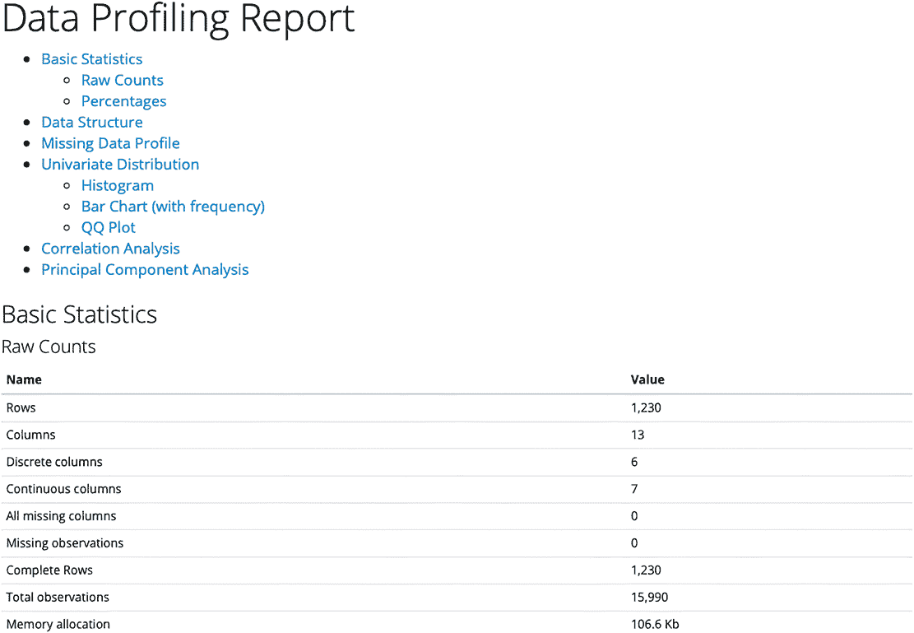

图 17.1 由 `DataExplorer` 包中的简单函数通过传递数据集作为唯一参数创建的数据概要报告的屏幕截图

如果说 *酷* 是指轻松的风格，那么 `DataExplorer` 包绝对是一个引人注目的选择。虽然我们确实以更少的代码（即更多的内容，大部分是视觉的，更少的代码，因此需要更少的时间和精力）创造了更多内容，但其中一些内容（其中大部分我们即将分享）实际上并没有增加任何价值——这就是权衡。你是在压力下向老板展示一些内容，即使这些内容既有相关的也有不那么相关的吗？或者你和你老板是否更倾向于一种更精确的方法？

考虑第二章中的 EDA。这需要大量的脑力劳动和大量的代码，但每个图表都传达了一个相关的信息。没有一点噪音。这里的信息是，手动和自动 EDA 方法都有其优缺点；根据项目和缓解因素，你将不得不决定哪种最适合你。

现在我们来探索从数据概览报告中获得的内容。

基本统计信息

数据概览报告首先显示一些基本统计信息的图形表示：我们的数据集在分类变量和连续变量之间的分布情况以及可能存在的缺失数据量。我们可以通过将 `oddsdf3` 传递给 `plot_intro()` 函数来生成这种可视化（见图 17.2）：

```
plot_intro(oddsdf3)
```

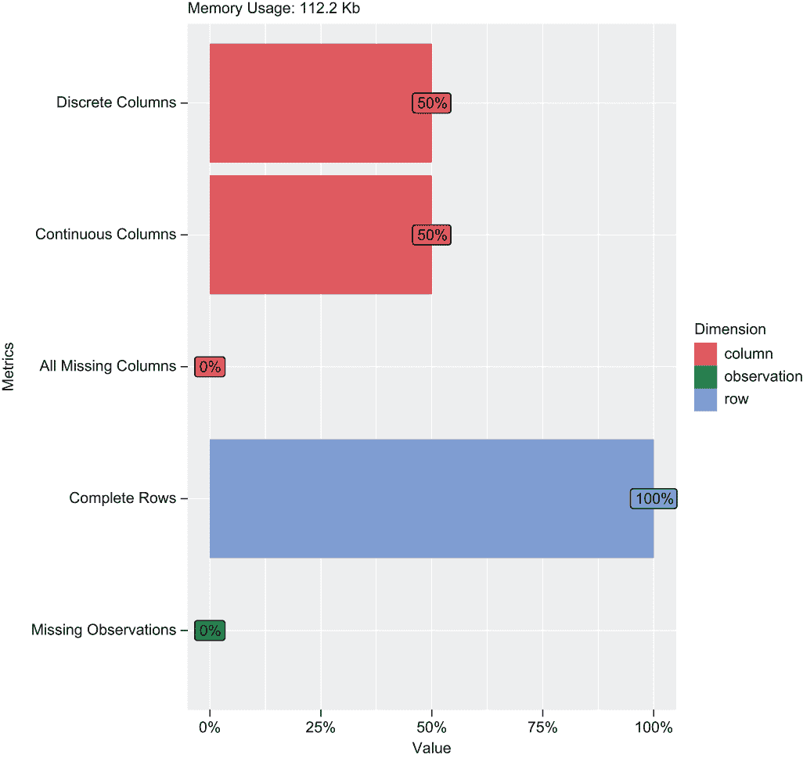

图 17.2 `DataExplorer` 包中数据集的基本统计信息的图形显示

注意，只有 `create_report()` 会发布独立的报告；当你运行 `plot_intro()` 等单独的命令，这些命令通常打包在 `create_report()` 函数中时，结果会在 RStudio 中显示。

我们也可以通过将 `oddsdf3` 传递给 `introduce()` 函数来以表格格式获取相同信息：

```
introduce(oddsdf3)
##   rows columns discrete_columns continuous_columns all_missing_columns
## 1 1230      14                7                  7                   0
##   total_missing_values complete_rows total_observations memory_usage
## 1                    0          1230              17220       114856
```

在 14 个 `oddsdf3` 变量中，有一半是连续的，另一半是分类的（或离散的）。此外，我们没有缺失数据。

数据结构

获取数据集结构的图形表示有两种方式——基本上，是 `dplyr glimpse()` 函数的视觉替代。一种方式是调用 `plot_str()` 函数（见图 17.3）：

```
plot_str(oddsdf3)
```

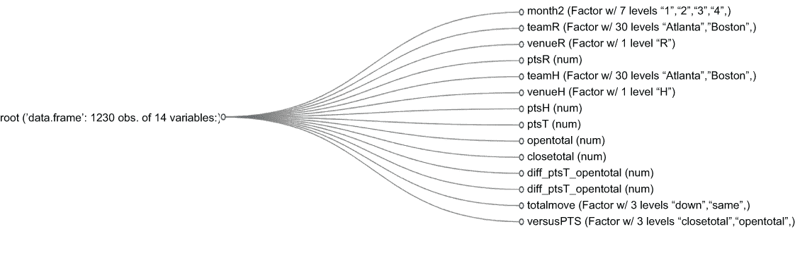

图 17.3 数据集结构的视觉表示。基本的 R `str()` 函数和 `dplyr` `glimpse()` 函数都返回类似的信息，但不是以图形格式。

第二种方式是再次调用 `plot_str()`，但添加 `type = "r"` 参数，这告诉 R 以径向网络的形式绘制数据结构（见图 17.4）：

```
plot_str(oddsdf3, type = "r")
```

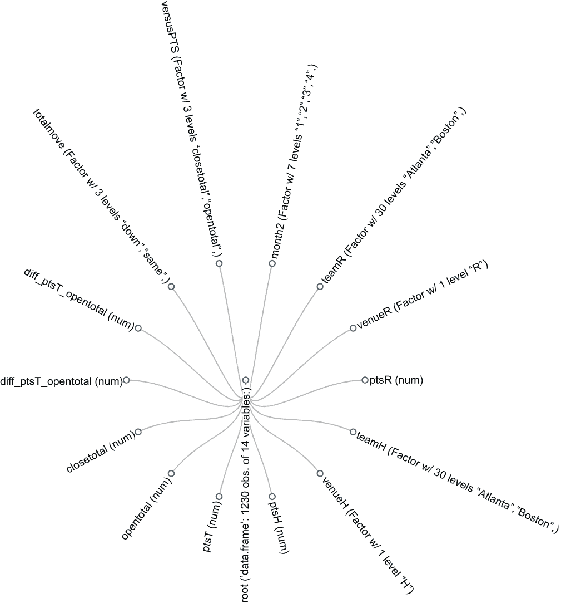

图 17.4 以径向网络的形式展示了相同的数据结构。这两种视图都是通过 `DataExplorer` 包实现的。

无论哪种方式，我们都可以看到例如 `month2` 是一个有七个级别的因子变量，而 `closetotal` 是七个连续（或数值）变量之一。

缺失数据概览

通过之前运行 `plot_intro()` 和 `introduce()` 函数，我们已经知道 oddsdf3 不包含任何缺失数据。但如果情况相反，那么这些函数都不会告诉我们关于数据集中不可用（NAs）或不完整观测的任何具体信息。但 `plot_missing()` 函数返回一个可视化，显示每个变量的缺失值概览（见图 17.5）：

```
plot_missing(oddsdf3)
```

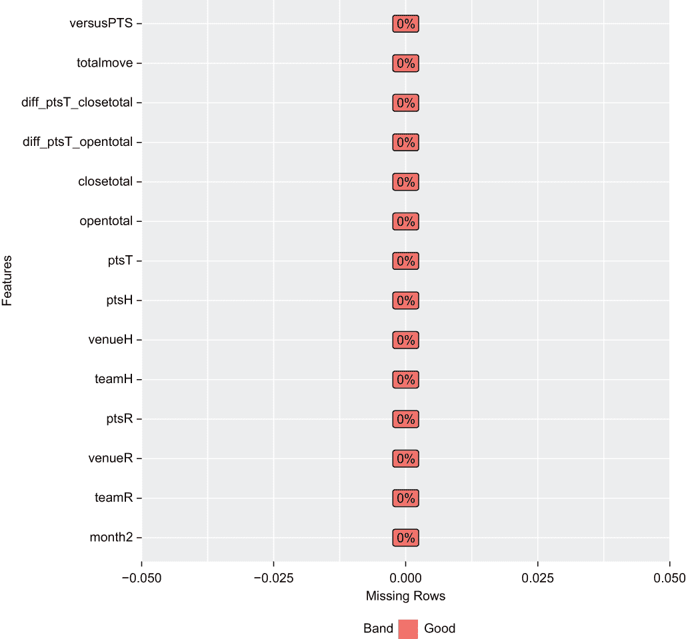

图 17.5 `DataExplorer` 绘制的提供缺失值概览的图

单变量分布

使用 `DataExplorer` 有三种方法来绘制连续数据的分布。当我们运行 `create_report()` 函数时，`DataExplorer` 会自动检测哪些变量是连续的，然后为每个变量返回直方图和分位数-分位数（QQ）图。此外，我们还可以选择告诉 `DataExplorer` 在直方图或 QQ 图之外或与之一起打印密度图。

`plot_histogram()` 函数返回一个直方图矩阵，显示我们每个连续变量的频率分布（见图 17.6）。默认情况下，`DataExplorer` 通常按变量名字母顺序返回绘图：

```
plot_histogram(oddsdf3)
```

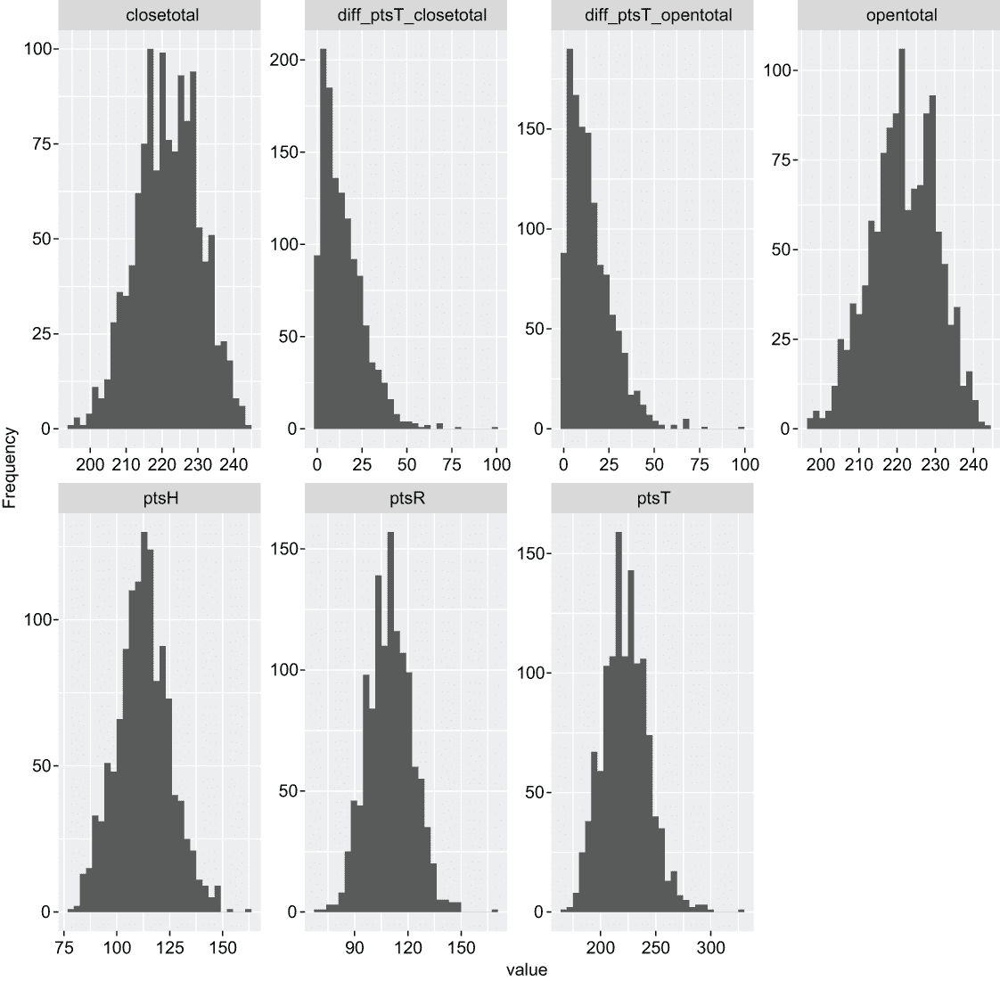

图 17.6 `DataExplorer` 包的直方图矩阵

我们的一些连续变量似乎呈正态分布，或者至少足够接近，但变量 `diff_ptsT_closetotal` 和 `diff_ptsT_opentotal` 明显是右偏斜的。

`plot_qq()` 函数返回一个 QQ 图矩阵（见图 17.7）。当数据呈正态分布，或者至少足够接近假设高斯分布时，点将落在 QQ 图的对角线上或非常接近对角线；否则，我们会在 QQ 图的一侧或两侧观察到偏离对角线的点，有时偏离程度很大（例如，参见 `diff_ptsT_closetotal` 和 `diff_ptsT_opentotal`）：

```
plot_qq(oddsdf3)
```

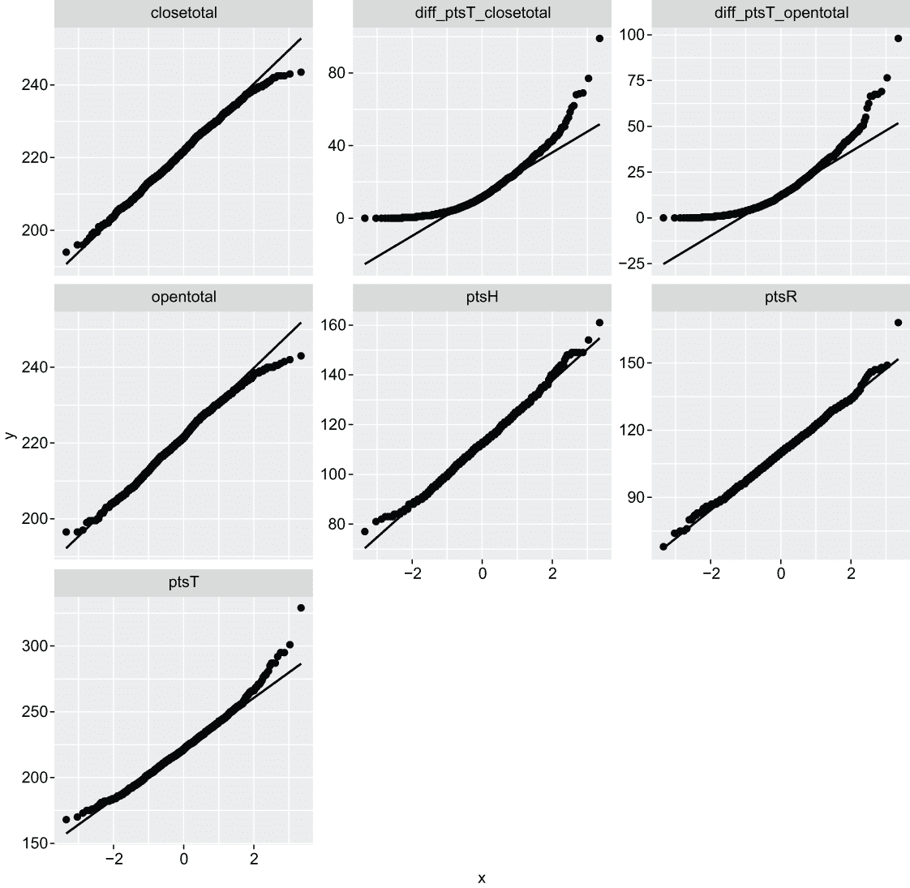

图 17.7 `DataExplorer` 包的 QQ 图矩阵

最后，`plot_density()` 函数返回一系列密度图（见图 17.8）。

```
plot_density(oddsdf3)
```

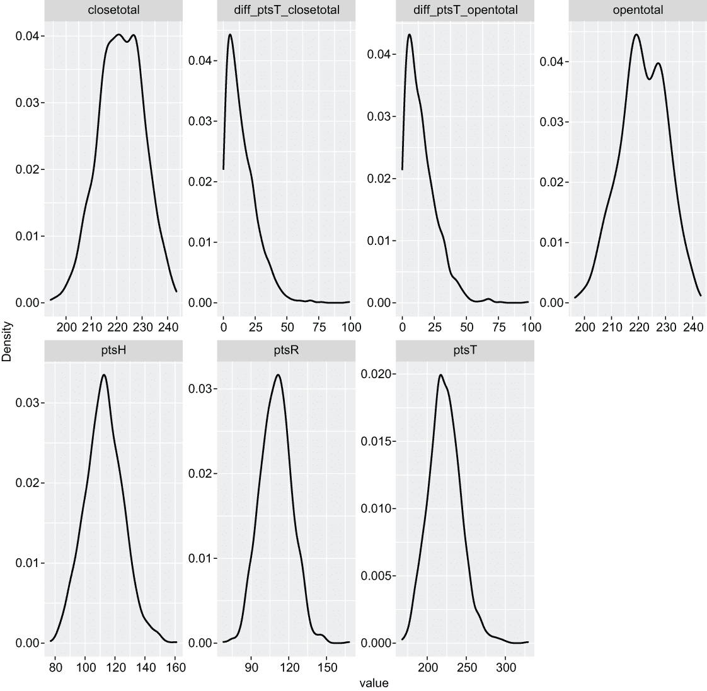

图 17.8 `DataExplorer` 包的密度图矩阵

默认情况下，数据概览报告会调用`plot_histogram()`、`plot_qq()`和`plot_density()`函数，因此对于同一变量返回三个类似的可视化系列，所以我们得到了三个关于频率分布的视角，而通常一个就足够了。尽管如此，许多统计测试，例如线性回归（见第五章），假设数值数据是正态分布的，因此首先理解频率分布是绝对关键的。

相关性分析

当我们调用`DataExplorer plot_correlation()`函数时，我们得到一个相关矩阵，或热图，其中包含计算出的相关系数作为数据标签（见图 17.9）。默认情况下，`create_report()`函数会将相关热图添加到数据概览报告中，包括连续和分类变量。通过将`type = "c"`作为第二个参数添加，我们手动将结果限制为仅包含 oddsdf3 连续变量：

```
plot_correlation(oddsdf3, type = "c")
```

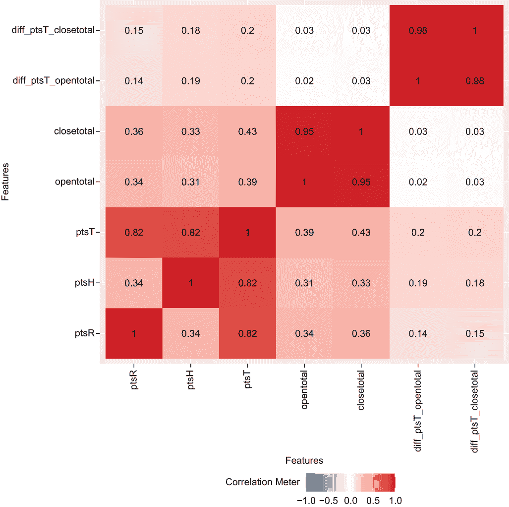

图 17.9 来自`DataExplorer`包的相关矩阵或热图；默认情况下，相关热图包括所有变量，无论是连续的还是分类的。在这里，我们已将结果限制为仅包含 oddsdf3 连续变量。

`plot_correlation()`函数特别令人满意的是，`DataExplorer`会自动忽略任何缺失值，然后仍然生成热图。请注意，`closetotal`与`ptsR`、`ptsH`和`ptsT`之间的相关系数（略微）高于`opentotal`与这三个相同变量的相关系数。

分类变量分析

最后，让我们转换一下思路，告诉`DataExplorer`提供一些关于 oddsdf3 分类变量的可视化洞察。通过调用`create_report()`函数生成的数据概览报告自动包含每个分类变量的条形图，作为可视化频率或计数的手段。我们可以通过将 oddsdf3 数据集传递给`plot_bar()`函数来复制这种自动化（见图 17.10）：

```
plot_bar(oddsdf3)p
```

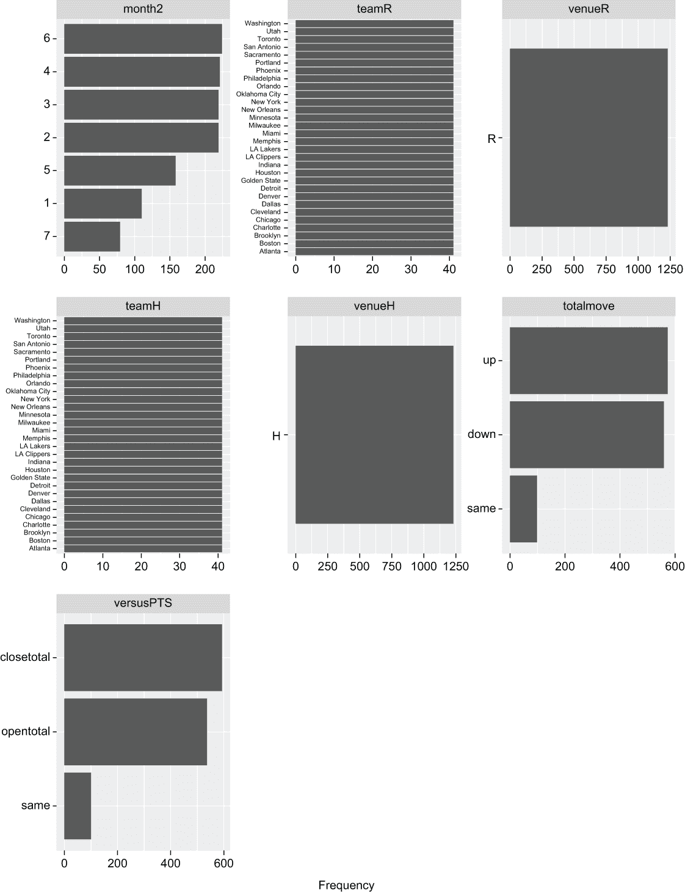

图 17.10 `DataExplorer`为每个 oddsdf3 分类变量生成的条形图

但是，正如你所见，其中一些图表毫无意义，当然，如果不是自动化，这些图表根本就不会生成。然而，在筛选掉噪音之后，有几个有趣的发现：

+   在我们的数据集中，开盘总价比收盘总价更高的频率几乎与收盘总价比开盘总价更高的频率相同。否则，它们在大约 1,230 场比赛中有大约 100 次是相同的。

+   对于我们的目的来说，收盘总分数（在投注线关闭时的总分上下）与总得分之间的差距通常小于开盘总分数（在投注线开盘时的总分上下）与总得分之间的差距。这表明收盘总分数（受赌徒影响）比开盘总分数（由赔率制定者和他们的算法生成）更频繁地表现更好。

还可以通过按离散变量分组创建一系列条形图。在下面的代码行中，我们通过变量`month2`创建了六个堆叠条形图（见图 17.11）：

```
plot_bar(oddsdf3, by = "month2") 
```

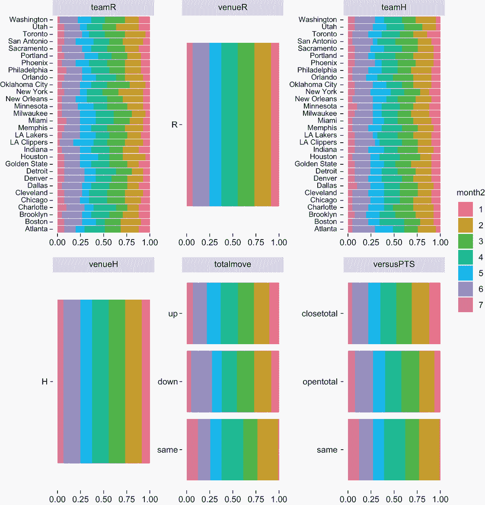

图 17.11 另一系列`DataExplorer`条形图，但这些由于按 oddsdf3 变量`month2`分组而堆叠

对`totalmove`和`versusPTS`堆叠条形图的仔细观察表明，这两个变量的因素水平之间存在或跨月度的性能差异。

除了我们故意将其排除在范围之外的成分分析之外，我们几乎演示了几乎所有的`DataExplorer`函数；在这个过程中，我们获得了对数据的洞察，并为进一步分析建立了一个范围。我们将很快进行这项额外分析，但在此期间，我们将借助另一个自动化的 EDA 包来探索开盘和收盘点差。

### 17.4.3 使用 SmartEDA 进行点差 EDA

我们的新范围将围绕开盘和收盘点差以及它们与最终得分的比较。我们首先从 oddsdf2 创建一个新的数据集子集，添加一些派生变量，然后使用名为`SmartEDA`的包来探索数据。

数据整理

通过调用`dplyr select()`函数，我们选取了 oddsdf2 数据集的子集，并将结果传递给一个新的数据集，称为 oddsdf4：

```
oddsdf2 %>%
  select(teamR, venueR, ptsR, openspreadR, closespreadR, teamH, 
         venueH, ptsH, openspreadH, closespreadH, month2) -> oddsdf4
```

然后，我们着手创建新的变量，并将它们逐一附加到 oddsdf4 上。其中第一个，称为`margin`，是一个连续变量，等于`ptsR`和`ptsH`之间的差值，或者说是客场和主队得分之间的差值：

```
oddsdf4 %>%
  mutate(margin = ptsR - ptsH) -> oddsdf4
```

我们的第二个新变量`diff_margin_openspreadH`等于变量`margin`和`openspreadH`之间的绝对差值：

```
oddsdf4 %>%
  mutate(diff_margin_openspreadH = abs(margin - openspreadH)) -> oddsdf4
```

我们的第三个变量`diff_margin_closespreadH`等于变量`margin`和`closespreadH`之间的绝对差值：

```
oddsdf4 %>%
  mutate(diff_margin_closespreadH = abs(margin - closespreadH)) -> oddsdf4
```

我们的第四个也是最后一个变量`spreadmove`再次要求我们同时调用`mutate()`函数和`case_when()`函数。当`closespreadH`的绝对值大于`openspreadH`的绝对值时，`spreadmove`应等于`up`；从主队的角度来看，当收盘价差值的绝对值大于开盘价差值的绝对值（例如，从 6 变为 7 或从-6 变为-7）时，`spreadmove`应等于`up`。当条件相反时，`spreadmove`应改为等于`down`。当开盘价差和收盘价差的绝对值没有差异时，`spreadmove`应等于`same`。因为`spreadmove`应该是一个分类变量，所以我们调用`as.factor()`函数使其成为那样：

```
oddsdf4 %>%
  mutate(spreadmove = case_when(abs(closespreadH) > 
                                abs(openspreadH) ~ "up",
                                abs(closespreadH) < 
                                abs(openspreadH) ~ "down",
                                abs(closespreadH) == 
                                abs(openspreadH) ~ "same")) -> oddsdf4

oddsdf4$spreadmove <- factor(oddsdf4$spreadmove)
```

我们随后调用`select()`函数来重新排列 oddsdf4 变量，使其更有逻辑性。随后调用`head()`函数返回前六个 oddsdf4 记录：

```
oddsdf4 %>%
  select(11, 1, 2, 3, 6, 7, 8, 4, 5, 9, 10, 12, 13, 14, 15) -> oddsdf4

head(oddsdf4)
##   month2         teamR venueR ptsR        teamH venueH ptsH openspreadR
## 1      1  Philadelphia      R   87       Boston      H  105         5.0
## 2      1 Oklahoma City      R  100 Golden State      H  108        11.5
## 3      1     Milwaukee      R  113    Charlotte      H  112        -1.5
## 4      1      Brooklyn      R  100      Detroit      H  103         4.5
## 5      1       Memphis      R   83      Indiana      H  111         7.0
## 6      1         Miami      R  101      Orlando      H  104        -2.0
##   closespreadR openspreadH closespreadH margin diff_margin_openspreadH
## 1          4.5        -5.0         -4.5    -18                    13.0
## 2         12.0       -11.5        -12.0     -8                     3.5
## 3         -3.0         1.5          3.0      1                     0.5
## 4          6.0        -4.5         -6.0     -3                     1.5
## 5          7.5        -7.0         -7.5    -28                    21.0
## 6         -2.5         2.0          2.5     -3                     5.0
##   diff_margin_closespreadH spreadmove
## 1                     13.5       down
## 2                      4.0         up
## 3                      2.0         up
## 4                      3.0         up
## 5                     20.5         up
## 6                      5.5         up
```

创建 EDA 报告

`SmartEDA`包是`tableone`和`DataExplorer`的某种结合，因为它以表格和图形两种格式返回结果。但综合考虑，`SmartEDA`更类似于`DataExplorer`；一个原因是我们像使用`DataExplorer`一样，也可以创建一个交互式的 HTML 报告，该报告会自动将其他`SmartEDA` EDA 函数聚合到一个函数中。

然而，你会很快注意到，`SmartEDA`函数并不像它们的`DataExplorer`等价函数那样直观或简单。此外，许多这些相同的函数在手动运行时，最好首先拆分你的数据集或让`SmartEDA`输出一个随机样本；我们不需要使用`DataExplorer`包，甚至`tableone`包也不需要这样做。

不论如何，我们通过向`ExpReport()`函数（参见图 17.12）传递两个必填参数，即 oddsdf4 数据集和输出文件名，来获取`SmartEDA` HTML 报告。这需要几秒钟的时间来运行：

```
ExpReport(oddsdf4, op_file = "oddsdf4.xhtml")
```

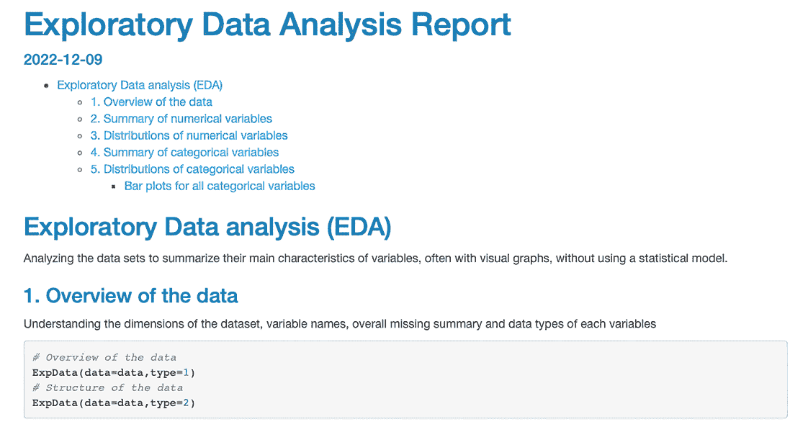

图 17.12 `SmartEDA`包的交互式 HTML EDA 报告的顶部

数据概述

`SmartEDA`聚合以下功能，并将输出捆绑在我们刚刚创建的独立 HTML 文件中。否则，当我们向`ExpData()`函数传递 oddsdf4 和`type = 1`参数时，`SmartEDA`会以表格的形式返回我们数据的高级概述。我们得到维度、每个类的变量数量以及 RStudio 中发布的关于缺失案例的信息：

```
ExpData(oddsdf4, type = 1)
##                                           Descriptions     Value
## 1                                   Sample size (nrow)      1230
## 2                              No. of variables (ncol)        15
## 3                    No. of numeric/interger variables         9
## 4                              No. of factor variables         6
## 5                                No. of text variables         0
## 6                             No. of logical variables         0
## 7                          No. of identifier variables         0
## 8                                No. of date variables         0
## 9             No. of zero variance variables (uniform)         2
## 10               %. of variables having complete cases 100% (15)
## 11   %. of variables having >0% and <50% missing cases    0% (0)
## 12 %. of variables having >=50% and <90% missing cases    0% (0)
## 13          %. of variables having >=90% missing cases    0% (0)
```

当我们向`ExpData()`函数传递`type = 2`参数时，`SmartEDA`返回我们数据的结构，即 oddsdf4 变量名、它们的类型、行数以及更多关于缺失数据的信息（当然，没有缺失数据）：

```
ExpData(oddsdf4, type = 2)
##    Index            Variable_Name Variable_Type Sample_n Missing_Count
## 1      1                   month2        factor     1230             0
## 2      2                    teamR        factor     1230             0
## 3      3                   venueR        factor     1230             0
## 4      4                     ptsR       numeric     1230             0
## 5      5                    teamH        factor     1230             0
## 6      6                   venueH        factor     1230             0
## 7      7                     ptsH       numeric     1230             0
## 8      8              openspreadR       numeric     1230             0
## 9      9             closespreadR       numeric     1230             0
## 10    10              openspreadH       numeric     1230             0
## 11    11             closespreadH       numeric     1230             0
## 12    12                   margin       numeric     1230             0
## 13    13  diff_margin_openspreadH       numeric     1230             0
## 14    14 diff_margin_closespreadH       numeric     1230             0
## 15    15               spreadmove        factor     1230             0
##    Per_of_Missing No_of_distinct_values
## 1               0                     7
## 2               0                    30
## 3               0                     1
## 4               0                    74
## 5               0                    30
## 6               0                     1
## 7               0                    71
## 8               0                    63
## 9               0                    63
## 10              0                    63
## 11              0                    63
## 12              0                    81
## 13              0                    82
## 14              0                    79
## 15              0                     3
```

连续变量摘要

通过调用 `ExpNumStat()` 函数，我们可以得到 oddsdf4 连续变量的摘要。通过添加 `Outlier = TRUE` 参数，我们指示 `SmartEDA` 返回除了默认获取的其他度量之外的数据的较低枢纽、较高枢纽和异常值数量。较低枢纽（LB.25%）是数据下半部分的中位数，包括中位数本身；较高枢纽（UB.75%）是数据上半部分的中位数，包括中位数本身；我们通常将这些称为下四分位数和上四分位数。此外，通过添加 `round = 2` 作为第二个参数，我们告诉 `SmartEDA` 只返回小数点后两位的所有结果。

这里还有更多内容需要解析，但让我们来看看 nNeg、nZero 和 nPos 度量——这些分别代表每个变量等于负数、零或正数的记录数量。变量 `openspreadH` 和 `closespreadH` 在 1,230 条 oddsdf4 记录中几乎三分之二的情况下等于负数，这意味着在 2018-19 NBA 常规赛季的比赛中，主队几乎在 66% 的情况下开盘或收盘作为热门。现在来看看这些相同的度量与派生变量 `margin` 的关系，`margin` 等于 `ptsR` 减去 `ptsH`：`margin` 只有 729 次为负，对应大约 59% 的记录。这与我们在第九章中学到的非常吻合——主队赢得大约 58% 到 59% 的所有常规赛季比赛：

```
ExpNumStat(oddsdf4, Outlier = TRUE, round = 2)
##                      Vname Group   TN nNeg nZero nPos NegInf PosInf
## 6             closespreadH   All 1230  804     1  425      0      0
## 4             closespreadR   All 1230  425     1  804      0      0
## 9 diff_margin_closespreadH   All 1230    0    22 1208      0      0
## 8  diff_margin_openspreadH   All 1230    0    20 1210      0      0
## 7                   margin   All 1230  729     0  501      0      0
## 5              openspreadH   All 1230  790    30  410      0      0
## 3              openspreadR   All 1230  410    30  790      0      0
## 2                     ptsH   All 1230    0     0 1230      0      0
## 1                     ptsR   All 1230    0     0 1230      0      0
##   NA_Value Per_of_Missing      sum   min   max   mean median    SD
## 6        0              0  -3222.5 -18.5  17.0  -2.62   -3.5  6.59
## 4        0              0   3222.5 -17.0  18.5   2.62    3.5  6.59
## 9        0              0  12201.5   0.0  55.0   9.92    8.0  8.12
## 8        0              0  12365.0   0.0  53.5  10.05    8.0  8.22
## 7        0              0  -3351.0 -50.0  56.0  -2.72   -4.0 14.41
## 5        0              0  -3066.0 -18.5  16.0  -2.49   -3.0  6.45
## 3        0              0   3066.0 -16.0  18.5   2.49    3.0  6.45
## 2        0              0 138462.0  77.0 161.0 112.57  112.0 12.68
## 1        0              0 135111.0  68.0 168.0 109.85  110.0 12.48
##      CV  IQR Skewness Kurtosis LB.25% UB.75% nOutliers
## 6 -2.52 10.0     0.20    -0.74 -22.50  17.50         0
## 4  2.52 10.0    -0.20    -0.74 -17.50  22.50         0
## 9  0.82  9.5     1.35     2.26 -10.25  27.75        49
## 8  0.82 10.0     1.37     2.32 -11.00  29.00        40
## 7 -5.29 19.0     0.06     0.23 -40.50  35.50        11
## 5 -2.59  9.5     0.18    -0.63 -21.75  16.25         0
## 3  2.59  9.5    -0.18    -0.63 -16.25  21.75         0
## 2  0.11 17.0     0.17     0.10  78.50 146.50        12
## 1  0.11 17.0     0.14     0.24  75.50 143.50        13
```

连续变量的分布

大部分剩余的 `SmartEDA` 内容是视觉的。调用 `ExpOutQQ()` 函数会返回所有连续变量的 QQ 图（见图 17.13）：

```
ExpOutQQ(oddsdf4, Page = c(2, 2), sample = 4)
```

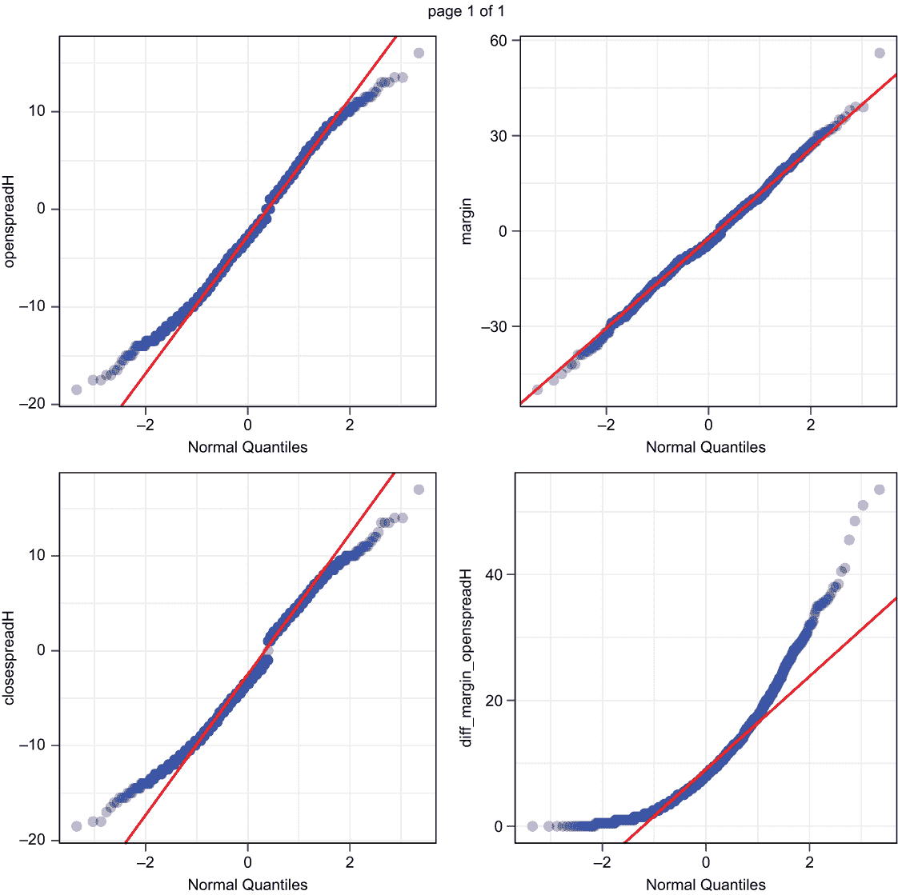

图 17.13 `SmartEDA` 包的四个随机样本 QQ 图

发现 `DataExplorer` 包，以及现在的 `SmartEDA` 包，首先提供 QQ 图来图形化表示连续数据的分布，这非常有趣；毕竟，虽然 QQ 图在运行回归诊断时通常会返回，但在 EDA 中却很少被提及。在这里，我们指导 `SmartEDA` 返回四个随机样本的图，并将它们排列成一个 2 × 2 矩阵。再次强调，当绘制的数据落在 QQ 图的对角线上时，这些数据是正态分布的；如果不是，数据则存在某种偏斜。

然后，我们调用 `ExpNumViz()` 函数来获取四个随机样本的密度图，也排列成一个 2 × 2 矩阵（见图 17.14）：

```
ExpNumViz(oddsdf4, Page = c(2,2), sample = 4)
```

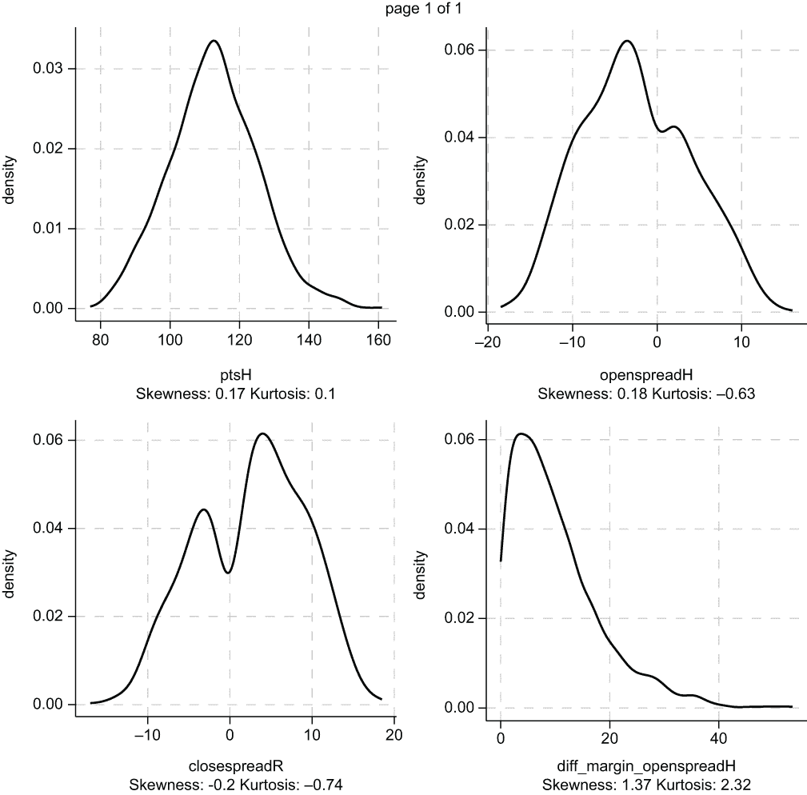

图 17.14 `SmartEDA` 包的四个随机样本密度图

恰好`SmartEDA`为变量`openspreadH`和`diff_margin_closespreadH`返回了 QQ 图和密度图；`openspreadH`是正态分布的，而`diff_margin_closespreadH`则不是。注意它们各自的密度图中的概率分布，并将这些与它们相应的 QQ 图进行比较。此外，这些密度图的一个优点是`SmartEDA`会打印出偏度和峰度的数值。当数据是正态分布的，就像变量`openspreadH`那样，偏度和峰度都会接近于 0 的某个数值；相反，当数据是其他形式的偏斜，就像变量`diff_margin_closespreadH`那样，偏度和峰度将分别等于远离 0 的正负数值。实际上，偏度和峰度是正负的，这取决于数据是如何偏斜的；当正偏斜时，这些度量值是正的，而当负偏斜时，这两个度量值都是负的。

最后，再次调用`ExpNumVix``()`函数，这次通过额外的参数传递了`scatter = TRUE`，返回了一个由四个散点图组成的 2 × 2 矩阵的随机样本（见图 17.15）：

```
ExpNumViz(oddsdf4, Page = c(2,2), scatter = TRUE, sample = 4)p
```

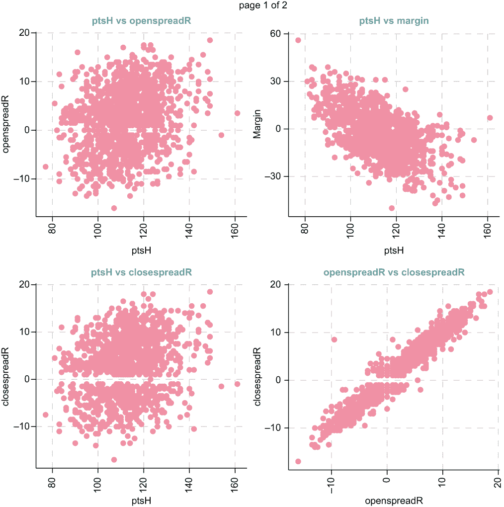

图 17.15 `SmartEDA`包中的四个随机散点图的样本

不幸的是，使用`SmartEDA`无法创建相关矩阵；因此，可视化成对连续变量之间关系的方法只能是创建一系列散点图。我们之前通过调用`ExpReport()`函数创建的输出文件实际上包含了 36 个散点图。

分类型变量分析

这就是我们的连续数据的全部内容。至于我们的分类型变量，我们首先调用`ExpTable()`函数，该函数以表格格式返回`month2`和`spreadmove`的基本统计数据。真正令人高兴的是`ExpTable()`按因素水平分解我们的分类型数据，并为每个因素水平提供汇总。有趣的是，开盘点差价有 52%的时间增加，只有 32%的时间减少（其余时间几乎以相同的价格开盘，占 16%）：

```
ExpCTable(oddsdf4)
##      Variable Valid Frequency Percent CumPercent
## 1      month2     1       110    8.94       8.94
## 2      month2     2       219   17.80      26.74
## 3      month2     3       219   17.80      44.54
## 4      month2     4       221   17.97      62.51
## 5      month2     5       158   12.85      75.36
## 6      month2     6       224   18.21      93.57
## 7      month2     7        79    6.42      99.99
## 8      month2 TOTAL      1230      NA         NA
## 9  spreadmove  down       397   32.28      32.28
## 10 spreadmove  same       194   15.77      48.05
## 11 spreadmove    up       639   51.95     100.00
## 12 spreadmove TOTAL      1230      NA         NA
```

最后，我们对每个分类型变量进行了两次子集划分，然后调用`ExpCatViz()`函数。我们得到了一对柱状图，这些柱状图以图形方式表示了之前通过调用`ExpTable()`函数返回的数据（见图 17.16）：

```
select(oddsdf4, month2) -> temp1
ExpCatViz(temp1, Page = c(1, 1))

select(oddsdf4, spreadmove) -> temp2
ExpCatViz(temp2, Page = c(1, 1))
```

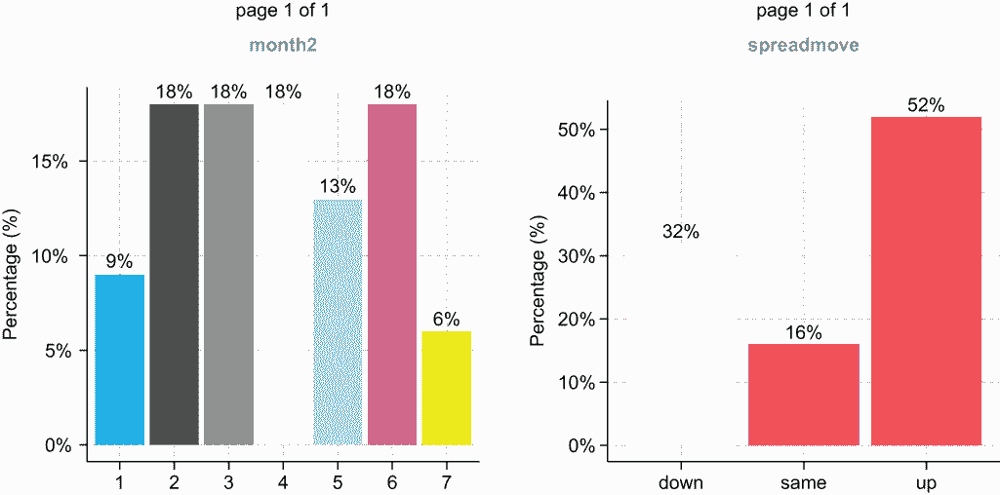

图 17.16 在左侧，柱状图显示了按因素水平显示的`month2`频率，而在右侧，柱状图显示了按因素水平显示的`spreadmove`频率。

记住，EDA 的目的是对数据集进行初步了解——它不是一切和结束。接下来，我们将把所有这些内容整合在一起。

## 17.5 结果

无论我们随后如何切割和切片数据，收盘总价比开盘总价表现更好，收盘点差也优于开盘点差——至少就 2018-19 赛季而言。也就是说，收盘总价和收盘点差比开盘总价和开盘点差更接近比赛结果。这表明大众——至少是那些关注 NBA 并愿意冒险的人——在拉斯维加斯赔率专家的预测之上增加了价值。我们将首先分享胜负彩的结果。

### 17.5.1 胜负彩

使用`DataExplorer`包进行的 EDA 练习提供了一些有趣的见解，并为我们提供了一个良好的前进基础。其中一个条形图显示，变量`versusPTS`等于`closetotal`的频率高于等于`opentotal`，尽管没有提供计数。换句话说，在 2018-19 NBA 常规赛中，似乎有更多比赛的收盘胜负彩与总分的差异小于开盘胜负彩与总分的差异。

绘制开盘总价和收盘总价与总分的对比图

在下面的代码块中，我们首先将 oddsdf3 数据集传递给`dplyr summarize()`函数——`SUM1`等于`diff_ptsT_opentotal`大于`diff_ptsT_closetotal`的实例数量，`SUM2`等于相反条件成立的实例数量，而`SUM3`等于`diff_ptsT_opentotal`和`diff_ptsT_closetotal`相同的实例数量。

这些结果随后传递给`tidyr pivot_longer()`函数，该函数以牺牲列计数为代价增加行计数。在此过程中创建了两个新变量，`sum`和`total`；`SUM1`、`SUM2`和`SUM3`随后在`sum`中转换为因子，其值放置在`total`的单元格中。所有这些最终得到一个可以投入绘图和分析的对象。最终结果是名为 tblA 的 tibble。

```
oddsdf3 %>%
  summarize(SUM1 = sum(diff_ptsT_opentotal > diff_ptsT_closetotal),
            SUM2 = sum(diff_ptsT_closetotal > diff_ptsT_opentotal),
            SUM3 = sum(diff_ptsT_opentotal == diff_ptsT_closetotal)) %>%
  pivot_longer(cols = c("SUM1", "SUM2", "SUM3"),
             names_to = "sum",
             values_to = "total") -> tblA
```

然后我们调用`ggplot2 ggplot()`和`geom_bar()`函数，用条形图可视化 tblA（见图 17.17）：

+   我们的自变量是`sum`，因变量是`total`。通过添加`fill`参数，我们告诉 R 根据变量`sum`对条形图进行颜色编码，而不是以灰度打印。

+   通过将`stat`参数设置为`"identity"`传递给`geom_bar()`函数，我们指示 R 将条形图的高度映射到之前提供给`ggplot`美学的 y 轴变量。

+   为条形图添加与 y 轴变量相关的标签总是一个很好的增强；在这里，`geom_text()`函数将 y 轴总价放置在条形图上方，并以粗体字体打印。如果我们更喜欢将标签放置在条形图内部，我们只需将`vjust`参数（即垂直调整）修改为正数。

+   在柱状图上方添加标签通常需要从美学角度出发，通过调用`ylim()`函数并指定起始和结束点来延长 y 轴的长度。

+   通过调用`scale_x_discrete()`函数，我们将`SUM1`、`SUM2`和`SUM3`替换为更具描述性的标签，从而避免了使用图例占用空间的需求。

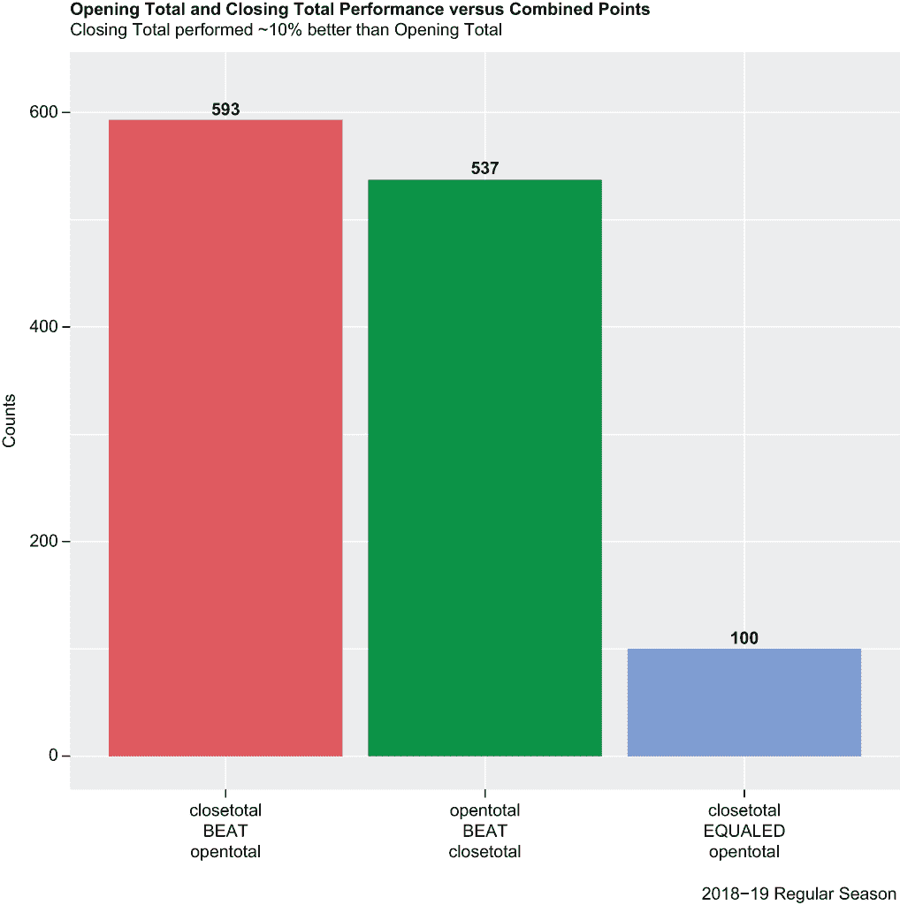

图 17.17 一个柱状图显示，收盘总点数相对于开盘总点数超出了大约 10%。

所有这些都在以下代码块中综合起来：

```
p1 <- ggplot(tblA, aes(x = sum, y = total, fill = sum)) + 
  geom_bar(stat = "identity") +
  geom_text(aes(label = total), vjust = -0.2, fontface = "bold") +
  labs(title = 
         "Opening Total and Closing Total Performance vs. Combined Points", 
       subtitle = "Closing Total performed ~10% better than Opening Total",
       caption = "2018-19 Regular Season",
       x = "",
       y = "Counts") +
  ylim(0, 625) +
  theme(plot.title = element_text(face = "bold")) +
  scale_x_discrete(labels = c("SUM1" = "closetotal\nBEAT\nopentotal",
                              "SUM2" = "opentotal\nBEAT\nclosetotal",
                              "SUM3" = "closetotal\nEQUALED\nopentotal")) +
  theme(legend.position = "none") 
print(p1) 
```

结果表明，收盘总点数比开盘总点数高出大约 10%。

按变动

下一个代码块是对生成 tblA 的`dplyr`和`tidyr`代码的复制——除了我们插入`dplyr group_by()`函数来按变量`totalmove`中的每个因素分组结果，并添加`filter()`函数来排除`diff_ptsT_opentotal`等于`diff_ptsT_closetotal`的 100 个实例。然后我们的结果被转换为一个名为 tblB 的 tibble：

```
oddsdf3 %>%
  group_by(totalmove) %>%
  summarize(SUM1 = sum(diff_ptsT_closetotal > diff_ptsT_opentotal),
            SUM2 = sum(diff_ptsT_opentotal > diff_ptsT_closetotal),
            SUM3 = sum(diff_ptsT_opentotal == diff_ptsT_closetotal)) %>%
  pivot_longer(cols = c("SUM1", "SUM2", "SUM3"),
             names_to = "sum",
             values_to = "total") %>%
filter(total > 100) -> tblB
```

在我们的下一个图表中，我们调用`ggplot2 facet_wrap()`函数为变量`totalmove`中的每个剩余因素创建一个面板。然后 R 在每一个面板内创建一个类似的柱状图（见图 17.18）：

```
p2 <- ggplot(tblB, aes(x = sum, y = total, fill = sum))+
  geom_bar(stat = "identity") +
  facet_wrap(~totalmove) +
  geom_text(aes(label = total), vjust = -0.2, fontface = "bold") +
  labs(title = 
         "Opening Total and Closing Total Performance by O/U Movement", 
       subtitle = 
         "Closing Total performed ~10% better than Opening Total",
       caption = "2018-19 Regular Season",
       x = "",
       y = "Counts") +
  ylim(0, 325) +
  theme(plot.title = element_text(face = "bold")) +
  scale_x_discrete(labels = c("SUM1" = "opentotal\nBEAT\nclosetotal",
                              "SUM2" = "closetotal\nBEAT\nopentotal")) +
  theme(legend.position = "none") 
print(p2)
```

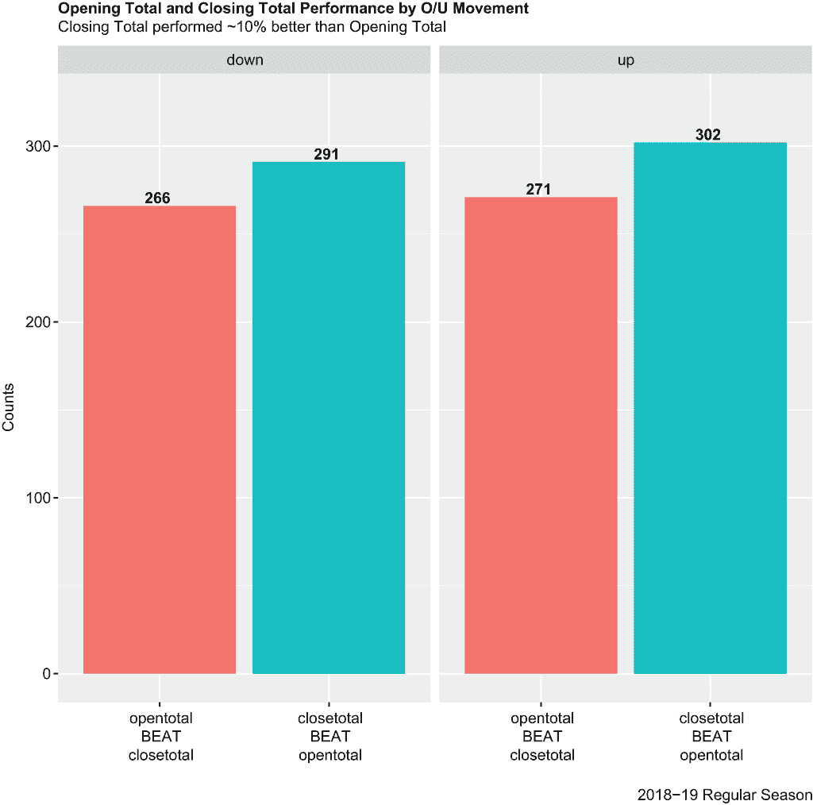

图 17.18 一个分解面板图，展示了开盘总点数与收盘总点数相对于变量`totalmove`中的因素的点数对比。结果是，收盘总点数比开盘总点数高出大约 10%，无论开盘总点数随后是上升还是下降。

开盘总点数在收盘前是上升还是下降在很大程度上并不重要。结果是，收盘总点数比开盘总点数高出 10%，无论随后的变动如何。

按月份

接下来，我们将 oddsdf3 传递给`group_by()`和`summarize()`函数，按变量`month2`中的每个因素计算`diff_ptsT_opentotal`小于`diff_ptsT_closetotal`和`diff_ptsT_closetotal`小于`diff_ptsT_opentotal`的实例数量。然后这些结果传递给`pivot_longer()`函数，以便我们为每个月份得到`SUM1`和`SUM2`的结果。我们的最终结果反映在一个名为 tblC 的 tibble 中：

```
oddsdf3 %>%
  group_by(month2) %>%
  summarize(SUM1 = sum(diff_ptsT_opentotal < diff_ptsT_closetotal),
            SUM2 = sum(diff_ptsT_closetotal < diff_ptsT_opentotal)) %>%
  pivot_longer(cols = c("SUM1", "SUM2"),
             names_to = "sum",
             values_to = "total") -> tblC
```

因此，我们的下一个`ggplot2`可视化是一个分组柱状图，每个月份我们得到两个结果，或者说两个柱状图（见图 17.19）。`geom_bar() position = "dodge"`参数将每对柱状图并排放置并连接它们。

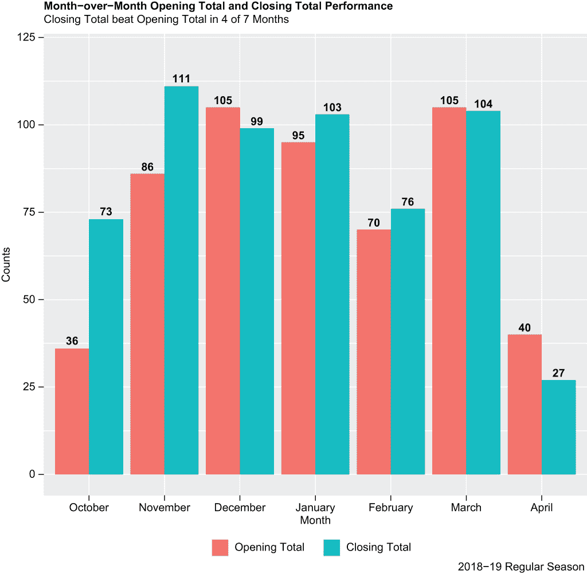

图 17.19 按月份的开盘总点数与收盘总点数的性能对比。2018-19 NBA 常规赛于 10 月开始，并于次年的 4 月结束。

为了防止我们的标签跨越每对条形，我们必须将`position_dodge()`函数添加到`geom_text()`函数中。通过指定宽度等于 0.9，标签被居中放置在条形上方；即使从 0.9 到 1 的微小调整也会使标签固定在中心左侧。

通过调用`scale_x_discrete()`函数，我们能够将每个`month2`因子映射到实际的月份，因此`1`等于十月，`2`等于十一月，以此类推。而且因为我们的 x 轴标签与变量`month2`相关联，而不是与变量`sum`相关联，所以需要在图表下方放置一个图例：

```
p3 <-ggplot(tblC, aes(x = month2, y = total, 
                      fill = factor(sum, levels = c("SUM1", "SUM2")))) + 
  geom_bar(position = "dodge", stat = "identity") +
  geom_text(aes(label = total), position = position_dodge(width = 0.9), 
            vjust = -0.2, fontface = "bold") +
  labs(title = 
         "Month-over-Month Opening Total and Closing Total Performance", 
       subtitle = "Closing Total beat Opening Total in 4 of 7 Months",
       caption = "2018-19 Regular Season",
       x = "Month",
       y = "Counts") +
  ylim(0, 120) +
  scale_fill_discrete(name = "", 
                      labels = c("Opening Total", "Closing Total")) +
  scale_x_discrete(labels = c("1" = "October", "2" = "November",
                              "3" = "December", "4" = "January", 
                              "5" = "February", "6" = "March", 
                              "7" = "April")) +
  theme(legend.position = "bottom") +
  theme(plot.title = element_text(face = "bold")) 
print(p3)
```

在七个月中有四个月的收盘总方差超过了开盘总方差。然而，最引人入胜，也许是最重要的结果来自 2018 年 10 月和 11 月。在这两个常规赛的第一个月，由于观察数据相对较少，收盘总方差显著超过了开盘总方差。

绘制开盘总方差和收盘总方差与综合点数的关系图

现在我们对开盘总和与收盘总和之间的平均方差以及对抗队伍之间的综合点数总和感兴趣。我们将 oddsdf3 传递给`summarize()`函数，该函数计算`diff_ptsT_opentotal`和`diff_ptsT_closetotal`的平均值。然后将初始结果传递给`pivot_longer()`函数，将`AVG1`和`AVG2`转换为名为`avg`的新变量中的因子，并将它们的值放置在另一个名为`value`的新变量中。最终结果被转换为名为 tblD 的 tibble：

```
oddsdf3 %>%
    summarize(AVG1 = mean(diff_ptsT_opentotal),
              AVG2 = mean(diff_ptsT_closetotal)) %>%
    pivot_longer(cols = c("AVG1", "AVG2"),
             names_to = "avg",
             values_to = "value") -> tblD
```

我们接下来的可视化是一个非常简单的条形图，显示了开盘总方差和收盘总方差与总得分（见图 17.20）。

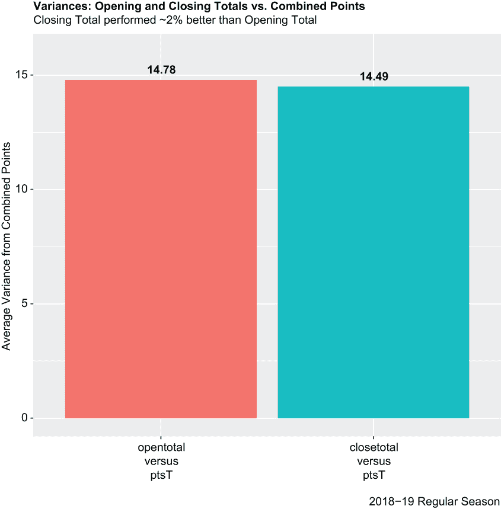

图 17.20 开盘总和与收盘总和以及对抗队伍所得分综合点数之间的平均方差

而不是调用`geom_bar()`函数并传递`stat = "identity"`参数，我们只是调用`geom_col()`函数。通过在`geom_text()`函数内插入基础 R 的`round()`函数，我们的标签保证只包含小数点后两位数字：

```
p4 <- ggplot(tblD, aes(x = avg, y = value, fill = avg)) + 
  geom_col() +
  geom_text(aes(label = round(value, 2)), vjust = -0.2,
            fontface = "bold") +
  labs(title = 
         "Variances: Opening and Closing Totals vs. Combined Points",
       subtitle = "Closing Total performed ~2% better than Opening Total",
       caption = "2018-19 Regular Season",
       x = "",
       y = "Average Variance from Combined Points") +
  ylim(0, 16) +
  theme(plot.title = element_text(face = "bold")) +
  scale_x_discrete(labels = c("AVG1" = "opentotal\nversus\nptsT",
                              "AVG2" = "closetotal\nversus\nptsT")) +
  theme(legend.position = "none") 
print(p4)
```

方差显然非常相似，但收盘总方差实际上确实比开盘总方差高出约 2%。

通过移动

然后，我们根据开盘总和在收盘前是上升还是下降来分解这些相同的结果；因此，我们将`group_by()`函数插入到我们的`dplyr`和`tidyr`代码的副本中，按变量`totalmove`中的每个因子分组结果。然后，我们调用`filter()`函数将最终结果限制在`totalmove`不等于`same`的地方。随后我们得到一个名为 tblE 的 tibble：

```
oddsdf3 %>%
  group_by(totalmove) %>%
  summarize(AVG1 = mean(diff_ptsT_opentotal),
            AVG2 = mean(diff_ptsT_closetotal)) %>%
  pivot_longer(cols = c("AVG1", "AVG2"),
             names_to = "avg",
             values_to = "value") %>%
filter(totalmove != "same") -> tblE
```

我们接下来的可视化是一个面图（见图 17.21），它为`totalmove`变量中剩余的每个因素包含一个面板。再次，我们将`geom_bar()`函数替换为`geom_col()`函数。此外，我们还修改了美学参数`vjust`，从`-0.2`改为`1.5`，这使得标签位于柱状图的顶部下方。因此，就不再需要调用`ylim()`函数来扩展 y 轴的长度：

```
p5 <- ggplot(tblE, aes(x = avg, y = value, fill = avg)) +
  geom_col() +
  facet_wrap(~totalmove) +
  geom_text(aes(label = round(value, 2)), vjust = 1.5,
            fontface = "bold") +
  labs(title = 
         "Opening Total and Closing Total Performance by O/U Movement", 
       subtitle = 
         "Closing Total performed ~2% better than Opening Total",
       caption = "2018-19 Regular Season",
       x = "",
       y = "Average Variance from Combined Points") +
  theme(plot.title = element_text(face = "bold")) +
  scale_x_discrete(labels = c("AVG1" = "opentotal",
                              "AVG2" = "closetotal")) +
  theme(legend.position = "none") 
print(p5)
```

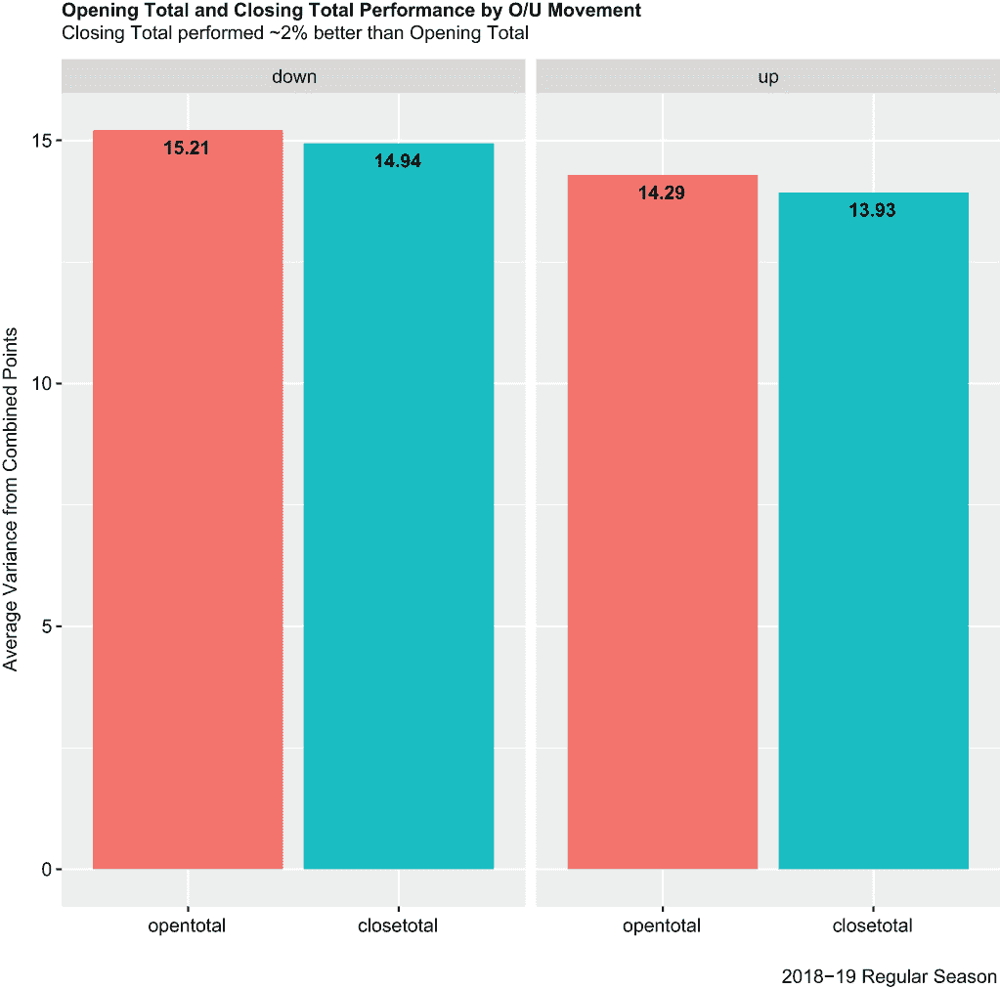

图 17.21 开盘和收盘总点数以及对方球队得分总和的平均方差，按`totalmove`变量中剩余的每个因素分开

无论开盘总点数在收盘前是上升还是下降，方差再次非常相似。尽管如此，收盘总点数在 2%的幅度上优于开盘总点数。

按月份

最后，我们将按月份绘制这些方差。因此，我们将 oddsdf3 数据集传递给`group_by()`和`summarize()`函数，以计算`month2`变量中每个因素的`diff_ptsT_opentotal`和`diff_ptsT_closetotal`平均值。随后调用`pivot_longer()`函数，将`AVG1`和`AVG2`从变量转换为新变量`avg`中的因素，并将它们的值放置在另一个新变量`value`中。我们的结果被转换为一个名为 tblF 的 tibble：

```
oddsdf3 %>%
  group_by(month2) %>%
  summarize(AVG1 = mean(diff_ptsT_opentotal),
            AVG2 = mean(diff_ptsT_closetotal)) %>%
  pivot_longer(cols = c("AVG1", "AVG2"),
             names_to = "avg",
             values_to = "value") -> tblF
```

我们对上个月月度图表进行了一些美学上的调整（见图 17.22）。这次，我们不是将`position`参数设置为`"dodge"`传递给`geom_bar()`函数，而是传递`position_dodge()`，并指定宽度为`0.5`，这实际上使得一个系列柱状图的一半宽度被另一个系列柱状图所遮挡。因此，我们随后将标签四舍五入到最接近的整数；否则，标签通常会混合在一起，难以辨认。为了将这些相同的标签居中放置在柱状图上方，我们也在`geom_text()`函数中添加了`position_dodge()`函数；然而，这次我们指定的宽度也等于`0.5`，而不是之前的`0.9`：

```
p6 <-ggplot(tblF, aes(x = month2, y = value, 
                      fill = factor(avg, levels = c("AVG1", "AVG2")))) + 
  geom_bar(position = position_dodge(width = 0.5), stat = "identity") +
  geom_text(aes(label = round(value, 0)), 
            position = position_dodge(width = 0.5), vjust = -0.2, 
            fontface = "bold") +
  labs(title = 
         "Month-over-Month Opening Total and Closing Total Performance", 
       subtitle = 
         "Closing Total beat or equaled Opening Total in 7 of 7 Months",
       caption = "2018-19 Regular Season",
       x = "Month",
       y = "Average Variance from Combined Points") +
  ylim(0,18) +
  scale_fill_discrete(name = "", labels = c("Opening Total", 
                                            "Closing Total")) +
  scale_x_discrete(labels = c("1" = "October", "2" = "November",
                              "3" = "December", "4" = "January", 
                              "5" = "February", "6" = "March",          
                              "7" = "April")) +
  theme(legend.position = "bottom") +
  theme(plot.title = element_text(face = "bold")) 
print(p6)
```

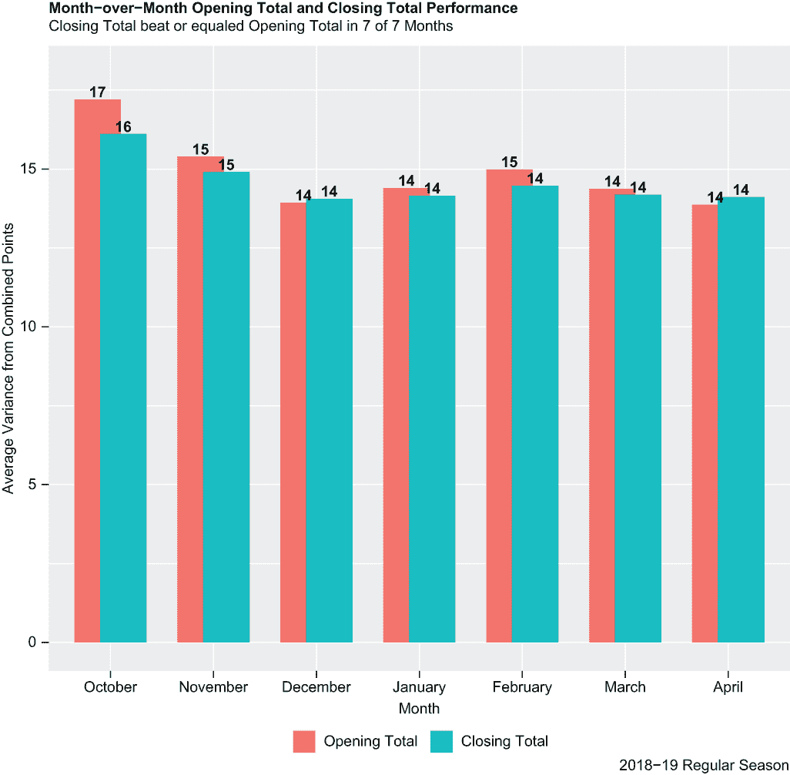

图 17.22 开盘和收盘总点数以及得分总和的月度平均方差。柱状图上方的标签已四舍五入到最接近的整数。

如果根据四舍五入的方差来看，2018-19 NBA 常规赛的七个月中，收盘总点数在所有七个月都击败或至少等于开盘总点数。如果我们根据相同结果的视觉表示来看，那么在七个月中有五个月收盘总点数优于开盘总点数。最显著的、有利于收盘总点数的方差出现在 2018 年 10 月和 11 月，当时相对较少的比赛已经进行，因此只有少数几个观察值可供分析。

现在，我们将旋转并报告开盘和收盘点数差异的表现。

### 17.5.2 点差

为了最小化重复代码的展示（尽管变量进行了交换），我们将通过打印 tibbles 并避免任何进一步的视觉呈现来展示我们的结果。我们将从计算收盘价比开盘价更接近最终利润率的次数、开盘价更接近最终利润率的次数以及收盘价和开盘价相同的次数开始。以下代码块与之前生成 tblA 的`dplyr`和`tidyr`代码匹配；在这里，我们将结果转换为名为 tblG 的 tibble：

```
oddsdf4 %>%
  summarize(SUM1 = sum(diff_margin_openspreadH > 
                         diff_margin_closespreadH),
            SUM2 = sum(diff_margin_closespreadH >
                         diff_margin_openspreadH),
            SUM3 = sum(diff_margin_openspreadH == 
                         diff_margin_closespreadH)) %>%
  pivot_longer(cols = c("SUM1", "SUM2", "SUM3"),
               names_to = "sum",
               values_to = "total") -> tblG
print(tblG)
## # A tibble: 3 × 2
##   sum   total
##   <chr> <int>
## 1 SUM1    553
## 2 SUM2    493
## 3 SUM3    184
```

收盘总价比开盘总价高出约 11%（等于`SUM2`的倒数除以`SUM1`）。

接下来，我们根据开盘价随后是上升还是下降来分解这些相同的成果；我们的最终结果不包括变量`spreadmove`等于`same`或变量`sum`等于`SUM3`的情况。以下生成名为 tblH 的 tibble 的代码行与生成 tblB 的代码相似：

```
oddsdf4 %>%
  group_by(spreadmove) %>%
  summarize(SUM1 = sum(diff_margin_closespreadH > 
                         diff_margin_openspreadH),
            SUM2 = sum(diff_margin_openspreadH > 
                         diff_margin_closespreadH),
            SUM3 = sum(diff_margin_openspreadH == 
                         diff_margin_closespreadH)) %>%
  pivot_longer(cols = c("SUM1", "SUM2", "SUM3"),
               names_to = "sum",
               values_to = "total") %>%
  filter(spreadmove != "same", sum != "SUM3") -> tblH
print(tblH)
## # A tibble: 4 × 3
##   spreadmove sum   total
##   <fct>      <chr> <int>
## 1 down       SUM1    185
## 2 down       SUM2    212
## 3 up         SUM1    303
## 4 up         SUM2    331
```

尽管开盘价在收盘前可能上升或下降，但收盘价的表现始终优于开盘价，但结果会因`spreadmove`因素水平的不同而有所变化。当开盘价下降时，收盘价比开盘价高出约 13%；当开盘价上升时，收盘价比开盘价高出约 8%。

然后，我们计算了开盘价和收盘价与最终利润率之间的表现，按变量`month2`中的每个因素进行。以下生成名为 tblI 的代码块与 tblC 代码非常匹配：

```
oddsdf4 %>%
  group_by(month2) %>%
  summarize(SUM1 = sum(diff_margin_openspreadH < 
                         diff_margin_closespreadH),
            SUM2 = sum(diff_margin_closespreadH < 
                         diff_margin_openspreadH)) %>%
  pivot_longer(cols = c("SUM1", "SUM2"),
               names_to = "sum",
               values_to = "total") -> tblI
print(tblI)
## # A tibble: 14 × 3
##    month2 sum   total
##    <fct>  <chr> <int>
##  1 1      SUM1     52
##  2 1      SUM2     43
##  3 2      SUM1     85
##  4 2      SUM2     90
##  5 3      SUM1     75
##  6 3      SUM2    110
##  7 4      SUM1     95
##  8 4      SUM2     94
##  9 5      SUM1     70
## 10 5      SUM2     71
## 11 6      SUM1     87
## 12 6      SUM2    108
## 13 7      SUM1     29
## 14 7      SUM2     37
```

在七个月中有五个月，收盘价的表现优于开盘价——包括 2018-19 NBA 常规赛前三个月中的两个月，以及令人好奇的最后三个月。

接下来，我们计算开盘价和收盘价与最终利润率之间的平均方差，并将结果转换为名为 tblJ 的 tibble（参见 tblD 代码以进行比较）：

```
oddsdf4 %>%
  summarize(AVG1 = mean(diff_margin_openspreadH),
            AVG2 = mean(diff_margin_closespreadH)) %>%
  pivot_longer(cols = c("AVG1", "AVG2"),
             names_to = "avg",
             values_to = "value") -> tblJ
print(tblJ)
## # A tibble: 2 × 2
##   avg   value
##   <chr> <dbl>
## 1 AVG1  10.1 
## 2 AVG2   9.92
```

收盘价比开盘价高出约 2%。

然后，我们根据开盘价是上升还是下降来计算这些相同的方差。我们的结果被推送到一个名为 tblK 的 tibble 中，不包括变量`spreadmove`等于`same`的情况（参见 tblE 代码以进行对比）：

```
oddsdf4 %>%
  group_by(spreadmove) %>%
  summarize(AVG1 = mean(diff_margin_openspreadH),
            AVG2 = mean(diff_margin_closespreadH)) %>%
  pivot_longer(cols = c("AVG1", "AVG2"),
             names_to = "avg",
             values_to = "value") %>%
  filter(spreadmove != "same") -> tblK
print(tblK)
## # A tibble: 4 × 3
##   spreadmove avg   value
##   <fct>      <chr> <dbl>
## 1 down       AVG1  10.8 
## 2 down       AVG2  10.6 
## 3 up         AVG1   9.79
## 4 up         AVG2   9.68
```

不论开盘价在收盘前是上升还是下降，收盘价的表现与开盘价的表现大致相当。

最后，我们计算了月度开盘和收盘表现与最终利润率之间的对比（参见 tblF 代码以进行对比）：

```
oddsdf4 %>%
  group_by(month2) %>%
  summarize(AVG1 = mean(diff_margin_openspreadH),
            AVG2 = mean(diff_margin_closespreadH)) %>%
  pivot_longer(cols = c("AVG1", "AVG2"),
             names_to = "avg",
             values_to = "value") -> tblL
print(tblL)
## # A tibble: 14 × 3
##    month2 avg   value
##    <fct>  <chr> <dbl>
##  1 1      AVG1   9.92
##  2 1      AVG2   9.98
##  3 2      AVG1  10.4 
##  4 2      AVG2  10.3 
##  5 3      AVG1  10.4 
##  6 3      AVG2  10.1 
##  7 4      AVG1   9.79
##  8 4      AVG2   9.75
##  9 5      AVG1   9.46
## 10 5      AVG2   9.33
## 11 6      AVG1  10.2 
## 12 6      AVG2   9.96
## 13 7      AVG1   9.80
## 14 7      AVG2   9.66
```

在 2018-19 NBA 常规赛的每个月份，除了（令人好奇的是）第一个月，收盘价的表现都优于开盘价。

虽然这些差异——不仅限于开盘和收盘差价，还包括开盘和收盘总金额——可能看起来很小，但它们绝不是无关紧要的。在赌博界，小的差异通常对赌场和赌徒都有重大的财务影响。在最终分析中，仅基于 2018-19 赛季的数据，受赌徒影响的收盘总金额和收盘差价，往往比拉斯维加斯博彩公司设定的开盘总金额和开盘差价更接近比赛结束的结果。此外，“赌徒的价值增加”在 2018-19 赛季早期更为普遍，当时可供工作的历史数据不多，而后期则较少。因此，相对缺乏训练数据似乎对博彩公司的影响比对赌徒集体智慧的影响更大。

在下一章中，我们将探讨 NBA 在 1983-84 赛季和 1984-85 赛季之间实施的薪资上限可能如何影响了赛季内和赛季间的平衡。我们将介绍几个用于量化 1985 年前后平衡的统计指标，以确定薪资上限是否真的像联盟所说的那样改善了平衡。

## 摘要

+   自动 EDA 的优点是你可以用更少的资源生产更多，也就是说，用更少的代码行生成更多内容。这也允许你专注于运行统计测试、开发预测模型、创建无监督算法等等。

+   自动 EDA 的缺点是，你可能不会得到最佳的内容返回；也就是说，你可能会得到一些无关紧要的结果，而不会得到其他应该重要的结果。

+   手动或系统的 EDA 方法迫使你思考你的数据，并在过程中提供巨大的学习机会。自动 EDA 类似于全球定位系统——你将到达预定的目的地，但你可能不知道你是如何到达那里的。

+   当涉及到自动或手动时，不一定是非此即彼；自动和手动 EDA 的某种组合可能对许多项目来说是一个很好的解决方案。此外，你可以挑选和选择你想要手动运行的 `tableone`、`DataExplorer` 和/或 `SmartEDA` 函数，以补充基础 R 和 `tidyverse` 函数。

+   关于自动 EDA 以及特别演示的三个包，还有一个观点：尽管 `tableone`、`DataExplorer` 和 `SmartEDA` 无疑是三个最受欢迎的自动 EDA 包，但这并不一定意味着它们已经得到了充分的审查。`SmartEDA` 的手动功能最多有些古怪，最坏的情况是存在错误。`DataExplorer` 输出相对精致和详尽的表格和图形结果组合，可以保存为独立文件并共享；因此，它是这三个自动 EDA 包中最好的。

+   我们的研究结果一致表明，结算总账和结算赔率比开盘总账和开盘赔率更接近最终结果。赌徒们增加了价值，尤其是在赛季早期，那时可供建立开盘赔率的比赛或结果相对较少。

+   因此，智慧存在于人群中；独立操作且对游戏有投入的人群比数量多得多的专家更聪明的观点可能非常正确。
