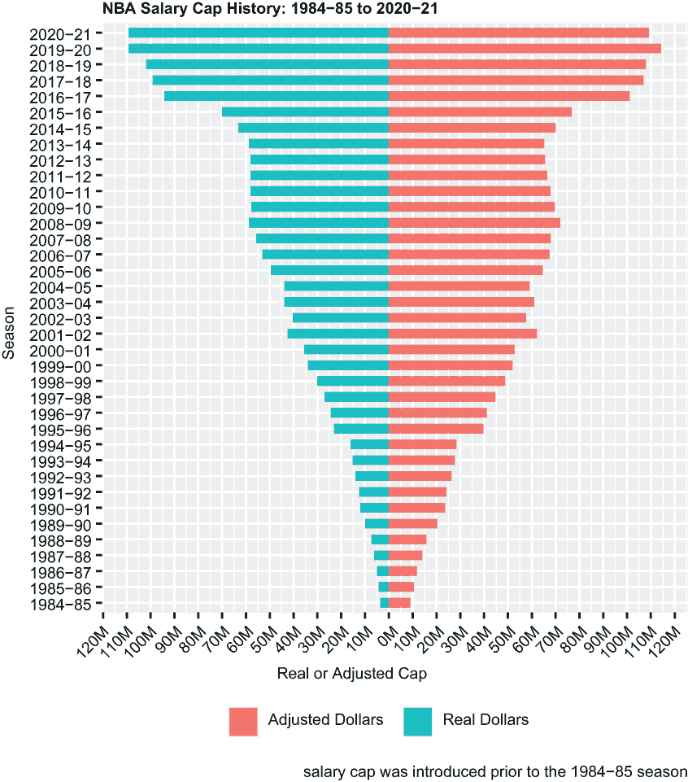
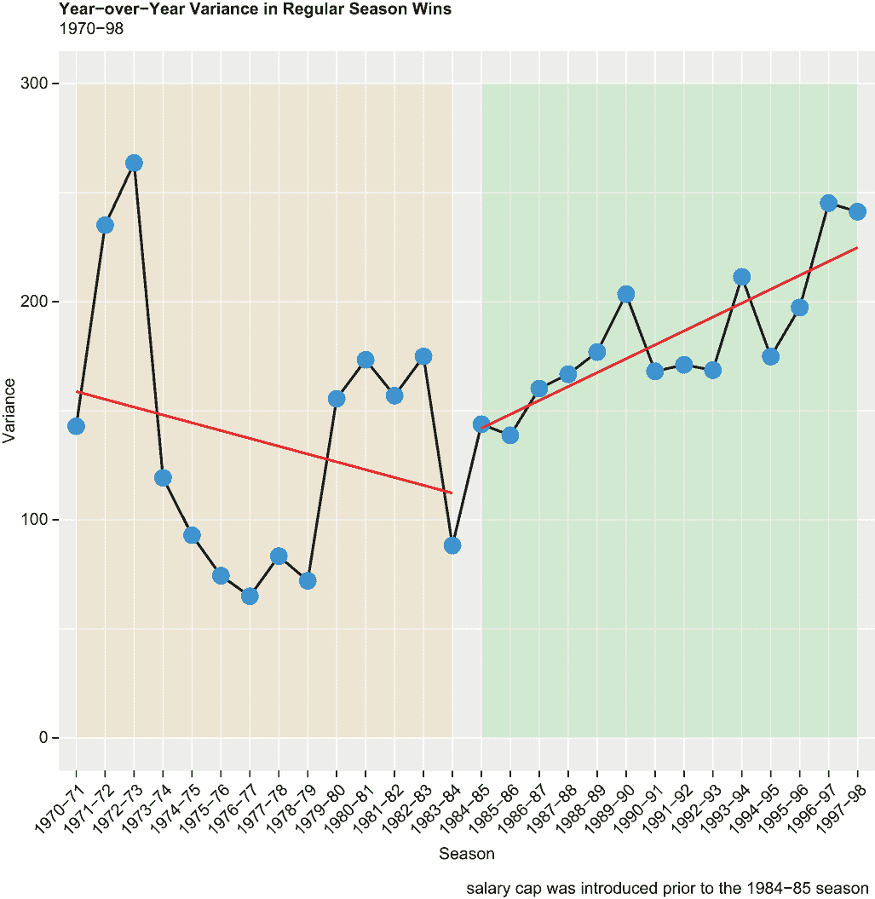
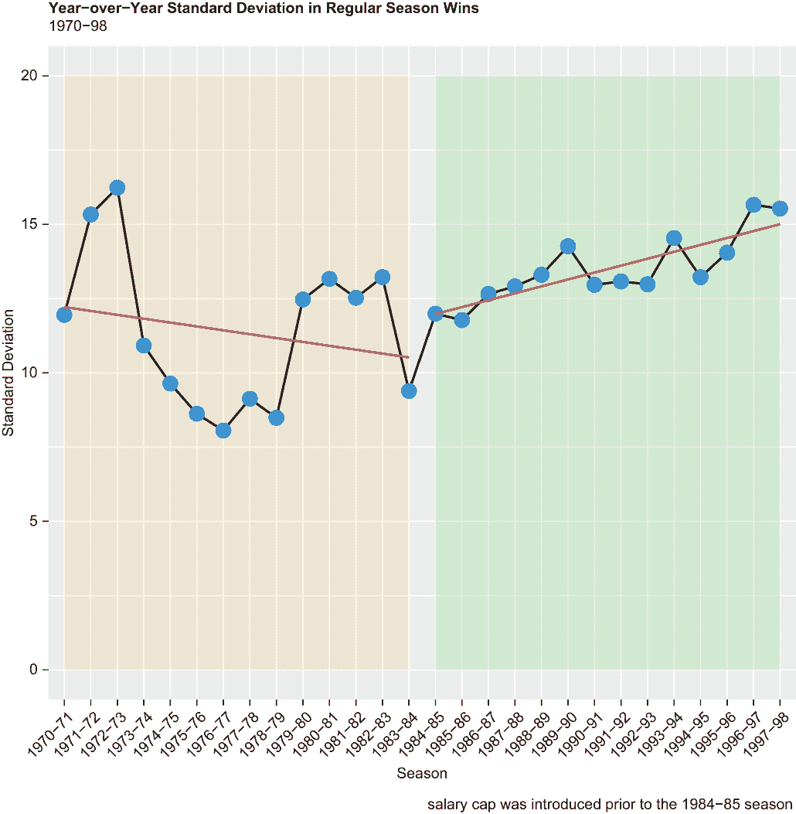
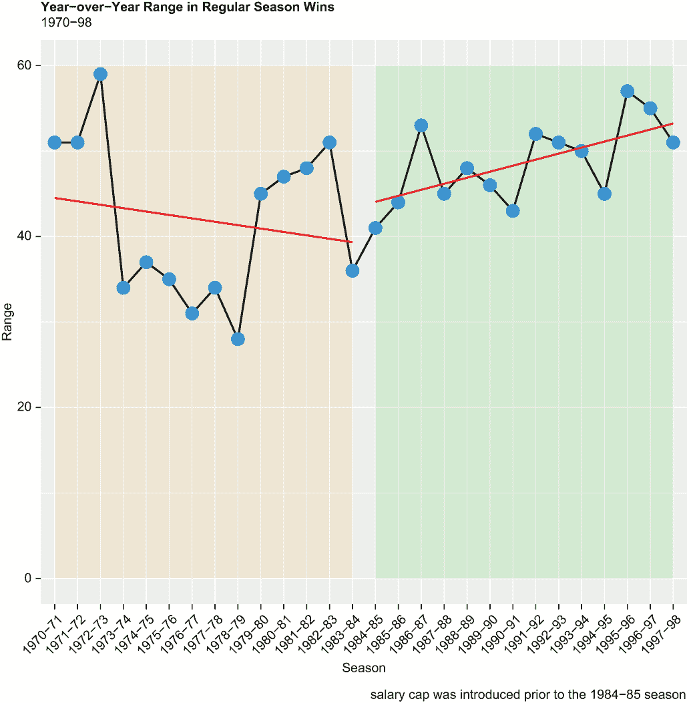
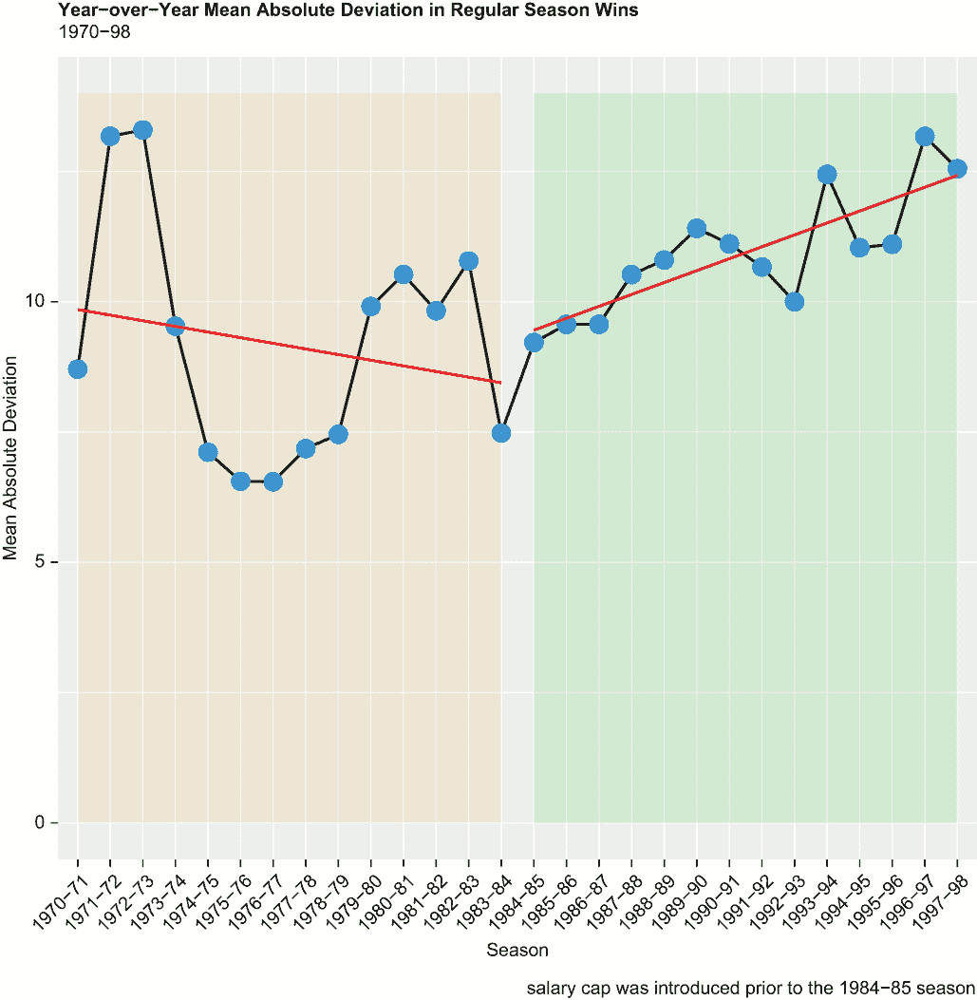
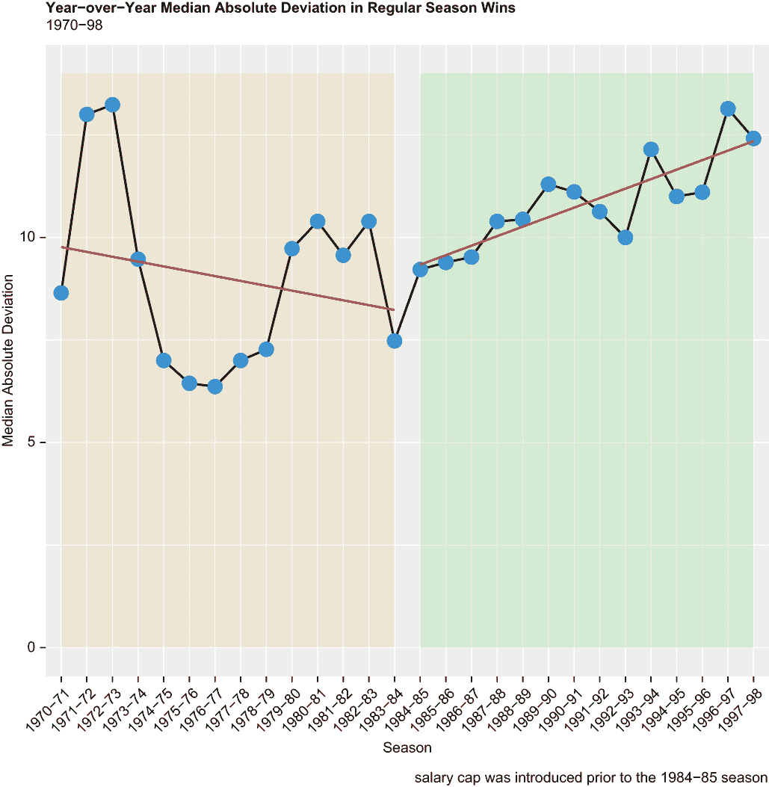
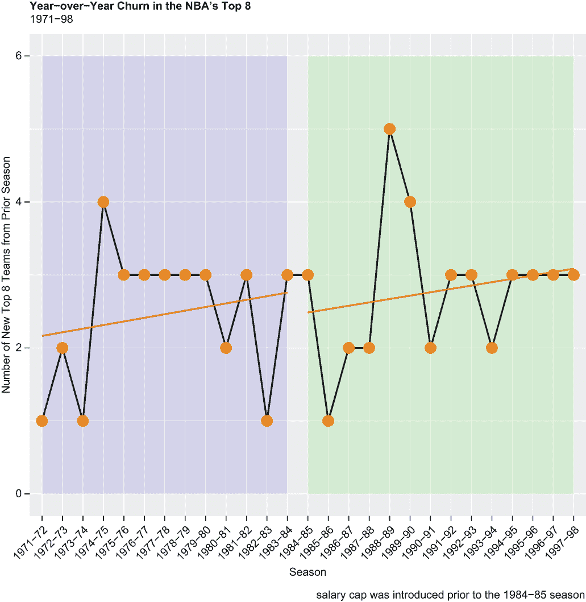

# 18 种统计离散度方法

本章涵盖

+   统计离散度度量

+   方差法

+   标准差法

+   范围法

+   均值绝对偏差法

+   中值绝对偏差法

+   计算客户流失率

+   创建金字塔图

我们在这里的主要目的是介绍几种统计离散度的方法。也称为统计变异性或分散度，统计离散度是衡量连续数据向量围绕中间值分散或散布的程度。仅仅知道平均值或中位数是不够的；了解计算统计离散度的方法对于真正理解数值数据至关重要，这在评估风险和衡量一致性和波动性方面具有实际意义。

这是我们所处的背景：在 1983-84 赛季和 1984-85 赛季之间，NBA 引入了薪资帽。这意味着球队每年在球员薪资上的支出是有限的，有一些允许的例外。（薪资帽仍然有效，并按通货膨胀、阵容规模增加和其他因素进行调整。）根据 NBA 的权力机构，薪资帽的所谓正当理由——或者更直白地说，限制球员收入的原因——是为了创造公平性，使球队拥有大致相当的人才，这将导致结果更不可预测。联盟说服了球员及其工会，认为公平性对联盟的财务健康和长期可持续性是有益的；球员（以及所有人，包括球迷）将受益于一个由薪资帽驱动的永恒公平性条件所支持的财务和其它方面安全的 NBA。

为了明确起见，我们现在讨论的是*季节内*公平性，即在整个赛季中，联盟中常规赛季胜利的离散度，在薪资帽之后应该小于在薪资帽之前的离散度。

在 1984-85 赛季之前，NBA 真的存在季节内公平性问题吗？如果是这样，薪资帽是否有效地解决了这个问题？我们的计划是通过逐步展示几种离散度的统计度量，计算按赛季分组的常规赛季胜利向量，并在薪资帽前后绘制结果来回答这些问题。

然而，也存在*季节间*公平性，即 NBA 最佳球队的年度更替率，在薪资帽之后应该大于在薪资帽之前。

薪资上限是否增加了联赛顶级球队的年度转会率，或者没有？因此，我们的次要目的是评估薪资上限对赛季间公平性的影响，如果有任何影响；我们将展示一种计算流动性的方法，并绘制薪资上限前后的年度对比图。当所有事情都结束时，我们希望验证薪资上限对赛季内和赛季间公平性的影响，或者对那些影响产生怀疑。剧透一下：我们将产生怀疑。

我们将首先加载一个包，以超越基本的 R 并实现这些目标。

## 18.1 加载包

我们将使用`dplyr`和`tidyr`函数处理我们的数据，并使用`ggplot2`函数可视化我们的赛季内和赛季间结果。我们第一次也是唯一一次调用`library()`函数加载了`tidyverse`包的宇宙；否则，基本的 R 函数将非常适合我们：

```
library(tidyverse)
```

我们将在下一部分导入我们的两个数据集。

## 18.2 导入数据

我们的两个数据集的第一个包含了从[www.basketball-reference.com](https://www.basketball-reference.com/)爬取的年度真实美元薪资上限数据，以及按通货膨胀调整后的 2021 美元薪资，使用[www.usinflationcalculator.com](https://www.usinflationcalculator.com/)的工具进行调整。而我们之前导入的类似文件覆盖了 2000 年到 2017 年的 NBA 赛季，这个文件——salary_cap2.csv，等于一个名为 cap 的对象——覆盖了 1985 年到 2021 年的赛季。

我们的两个数据集的第二个——team_records.csv（从 Kaggle 下载），等于一个名为 records 的对象——包含了 1961 年到 2018 年常规赛期间每个 NBA 球队的年度胜负记录。

我们通过两次调用`readr`的`read_csv()`函数导入两个数据集并将它们保存在我们的默认工作目录中：

```
cap <- read_csv("salary_cap2.csv")

records <- read_csv("team_records.csv")
```

关于这两个数据集的更多信息将在下一部分介绍。

## 18.3 探索和整理数据

我们之前使用时间序列图表可视化了 NBA 薪资上限数据，这里是真实和调整后的数据；这里，我们将使用所谓的金字塔图来可视化。金字塔图，有时也称为三角形图，在显示层次数据时是一个极好的选择，无论是正立还是倒置。

我们选择的可视化意味着我们首先必须整理薪资数据集。金字塔图在某种程度上类似于堆叠条形图——它显示两个或多个分类变量的数值——然后旋转了 90 度；金字塔或三角形效果是通过将每个条形的“一半”从 0 开始并朝相反方向绘制来创建的。这意味着我们必须将真实或调整后的美元转换为负数，所以我们将通过将每个单元格乘以-1 来简单地转换真实美元为负数。

调用基本 R 的`head()`函数然后返回 cap 中的前六个观测值：

```
cap$real <- cap$real * -1

head(cap)
##    season       real  adjusted
## 1 2020-21 -109140000 109140000
## 2 2019-20 -109140000 114267422
## 3 2018-19 -101869000 107970613
## 4 2017-18  -99093000 106931428
## 5 2016-17  -94143000 101015531
## 6 2015-16  -70000000  76710179
```

然后，我们将 `cap` 传递给 `tidyr pivot_longer()` 函数；原来的 `real` 和 `adjusted` 列成为名为 `type` 的新列中的因子，它们的值落在另一个名为 `cap` 的新列中。这些变化反映在名为 `new_cap` 的 tibble 中。对 `head()` 函数的另一个调用揭示了这一操作的后果：

```
cap %>%
  pivot_longer(cols = c("real", "adjusted"),
               names_to = "type",
               values_to = "cap") -> new_cap

head(new_cap)
## # A tibble: 6 × 3
##   season  type            cap
##   <chr>   <chr>         <dbl>
## 1 2020-21 real     -109140000
## 2 2020-21 adjusted  109140000
## 3 2019-20 real     -109140000
## 4 2019-20 adjusted  114267422
## 5 2018-19 real     -101869000
## 6 2018-19 adjusted  107970613
```

接下来，我们定义金字塔图表的断点和标签。断点是通过调用基础 R 的 `seq()` 函数并传递三个参数来定义的，这三个参数代表 y 轴的最小值和最大值以及刻度如何增加。标签是通过调用基础 R 的 `paste0()` 函数来定义的，该函数缩放刻度并将值与一个大写字母 `M` 连接起来；因此，一个如 120000000 的数字被转换为 120M：

```
breaks <- seq(-120000000, 120000000, 10000000)
labels <- paste0(as.character(c(seq(120, 0, -10), seq(10, 120, 10))), "M")
```

现在，这里是即将到来的 `ggplot2` 金字塔图表的细节（见图 18.1）：

+   我们通过调用 `ggplot()` 函数初始化绘图；`new_cap` 是我们的数据源，变量 `season` 是我们的 x 轴变量，变量 `cap` 是我们的 y 轴变量。`fill` 参数为图表中的 `type` 变量内的两个因子建立颜色方案；`scale_fill_discrete()` 函数告诉 R 创建一个指向同一内容的图例。默认情况下，图例被部署在 `ggplot2` 图表的右侧，但它们几乎可以放置在任何你喜欢的位置；在这里，我们决定将图例放置在图的底部。

+   `geom_col()` 函数是告诉 R 绘制条形图的一种方式（记住，金字塔图表，至少在某些方面，类似于条形图）。当将 `stat = "identity"` 参数传递给 `geom_bar()` 函数时，`geom_col()` 函数等于 `geom_bar()` 函数。否则，我们希望 R 将条形绘制在默认宽度的 60%处。

+   `scale_y_continuous()` 函数插入我们事先建立的断点和标签。

+   `coord_flip()` 函数将我们的图表旋转 90 度，包括 x 轴和 y 轴，从而生成一个倒置的金字塔图表（倒置是因为 x 轴从上到下是按时间顺序反向堆叠的）。



图 18.1 显示了 1984-85 赛季至 2020-21 赛季 NBA 薪资上限的年度增长，包括实际和通货膨胀调整后的美元。

下面是我们金字塔图表的 `ggplot2` 代码块：

```
p1 <- ggplot(new_cap, aes(x = season, y = cap, fill = type)) +   
  geom_col(width = .6) +
  scale_y_continuous(breaks = breaks,   
                     labels = labels) + 
  coord_flip() +  
  labs(title = "NBA Salary Cap History: 1984-85 to 2020-21",
       x = "Season", 
       y = "Real or Adjusted Cap",
       caption = "salary cap was introduced prior to the 1984-85 season") +
  scale_fill_discrete(name = "", 
                      labels = c("Adjusted Dollars", "Real Dollars")) +
  theme(plot.title = element_text(face = "bold")) +
  theme(axis.text.x = element_text(angle = 45, hjust = 1)) +
  theme(legend.position = "bottom")
print(p1)
```

再次强调，当你想要或需要可视化一个顺序或层次结构时，金字塔图表是理想的。例如，你可能会选择创建一个金字塔图表来显示按国家划分的销售情况，左侧是单位，右侧是（缩放后的）美元；显示按性别和年龄组的人口计数；或者表示每个到期阶段的单位之间的信用卡违约率。

现在，让我们从薪资数据集转向记录数据集。我们以两种方式减少记录的维度：首先是通过调用`dplyr select()`函数，仅选择我们绝对需要的少数变量来子集记录，其次是通过调用`dplyr filter()`函数，将记录减少到仅包括满足给定标准的观察值：

```
records %>%
  select(Season, Lg, Team, W, L) -> records

records %>%
  filter(Lg == "NBA" & Season > "1969-70" & Season < "1998-99") -> records
```

然后，我们调用`dplyr glimpse()`函数来返回记录维度以及数据的截断和转置视图：

```
glimpse(records)
## Rows: 650
## Columns: 5
## $ Season <chr> "1997-98", "1996-97", "1995-96", "1994-95", "1993-94", "...
## $ Lg     <chr> "NBA", "NBA", "NBA", "NBA", "NBA", "NBA", "NBA", "NBA", ...
## $ Team   <chr> "Boston Celtics", "Boston Celtics", "Boston Celtics", "B...
## $ W      <dbl> 36, 15, 33, 35, 32, 48, 51, 56, 52, 42, 57, 59, 67, 63, ...
## $ L      <dbl> 46, 67, 49, 47, 50, 34, 31, 26, 30, 40, 25, 23, 15, 19, ...
```

下面是记录数据现在的样子：

+   `赛季`——现在等于从`1970-71`到`1997-98`的最小值和最大值。因此，我们有 14 个赛季的数据在薪资上限之前，以及 14 个赛季的数据在薪资上限之后，这足以比较和对比在 1984-85 赛季之前和之后引入薪资上限之前和之后的结果。

+   `联盟`——现在等于所有剩余观察值中的`NBA`，但最初等于`NBA`或`ABA`。ABA，即美国篮球协会，是一个竞争对手职业联赛，早在 1976 年就倒闭了。由于我们的薪资上限分析仅适用于 NBA，我们过滤掉了所有 ABA 观察值。

+   `球队`——这等于完整的 NBA 球队名称（例如，底特律活塞，休斯顿火箭）。一个星号表示该队有资格参加季后赛。

+   `W`——这等于在 82 场比赛安排中的常规赛胜场数。

+   `L`——这等于常规赛的失利次数。胜场（`W`）加上失利（`L`）等于每个剩余记录的 82 场。

现在我们已经对数据有了很好的了解，让我们继续分析。我们将从赛季内公平性开始，展示我们如何通过不同的统计分散度度量来量化在薪资上限前后的情况。

## 18.4 统计分散度和赛季内公平性

统计分散度度量了围绕中心值的数值数据的分布或分布情况；换句话说，分散度度量描述了数据的可变性。随着可变性的增加，分散度也会增加。如果薪资上限实际上改善了赛季内公平性，那么我们应该在 1984-85 赛季之前看到比之后更高的分散度数字。

如果你是一个低风险投资者，正在考虑购买一只股票而不是另一只，那么计算两只股票价格随时间变化的分散度可能很明智，然后投资于分散度值较低的股票。作为另一个例子，你可能是一位人力资源经理，想要了解在调整薪资区间时同一行业薪酬的分散情况。你也可能正在为旅行做准备，想要在决定携带什么和多少行李之前计算目的地的温度分散情况。在这些场景中，仅仅计算平均值或中位数至多是不够的，在最坏的情况下是误导的。

要理解 NBA 的跨赛季公平性——在存在薪资上限之前和之后——我们需要计算常规赛胜利的年度分散度，并将这些值随时间绘制出来，这正是我们即将要做的事情。

我们的目的是介绍五种常见的统计分散度度量，计算记录数据集中每年或每个赛季的结果，将结果绘制在`ggplot2`折线图中，并将回归线插入我们的可视化中，以确定薪资上限前后跨赛季公平性的趋势。您将了解更多关于分散度和如何在 R 中计算这些度量的信息；同时，我们将确定 NBA 在 1984 年设立薪资上限时，是否确实存在跨赛季公平性问题，以及薪资上限是否产生了积极的影响。

在我们介绍方差方法之前，请注意，以下每种方法都有其自身的优缺点。考虑多个统计分散度度量以全面了解数据的分布是值得的。

### 18.4.1 方差方法

方差衡量每个数据点与组平均值的平均平方偏差；因此，方差考虑了各个数据点与单个平均值之间的差异。它是通过将每个数据点与平均值之间的平方差相加，然后除以记录数来计算的。在 R 中，我们只需调用基础 R 的`var()`函数。因此，方差方法考虑了*所有*数据点，但它可能对数据中的任何异常值较为敏感。

在下面的代码块中，我们将记录数据集传递给`dplyr`包中的`group_by()`和`summarize()`函数，以计算每个赛季的常规赛胜利的联赛方差。常规赛胜利的年度方差由名为`v_wins`的变量在名为 var_records 的 tibble 中表示。`head()`和`tail()`函数返回 var_records 中的前三个和最后三个观测值：

```
records %>%
  group_by(Season) %>%
  summarize(v_wins = var(W)) -> var_records

head(var_records, n = 3)
## # A tibble: 3 × 2
##   Season  v_wins
##   <chr>    <dbl>
## 1 1970-71   143.
## 2 1971-72   235.
## 3 1972-73   264.

tail(var_records, n = 3)
## # A tibble: 3 × 2
##   Season  v_wins
##   <chr>    <dbl>
## 1 1995-96   197.
## 2 1996-97   245.
## 3 1997-98   241.
```

这些结果随后被绘制在`ggplot2`折线图中（见图 18.2）：

+   我们刚刚创建的 tibble，var_records，是我们的数据源。一个变量`Season`是 x 轴变量，另一个变量`v_wins`是 y 轴变量。

+   `geom_line()`函数绘制了一条宽度为默认`ggplot2`宽度一半的线。`geom_point()`函数将数据点叠加到线上，这些数据点的尺寸是默认尺寸的五倍。

+   `ylim()`函数根据传递的参数绘制 y 轴的值。

+   `geom_smooth()`函数被调用两次，从 1970-71 赛季到 1983-84 赛季，以及从 1984-85 赛季到 1997-98 赛季绘制回归线。

+   `annotate()`函数被调用两次，添加了轻柔但独立的彩色块，以便容易地区分薪资上限前和薪资上限后的时代。因此，彩色块对应于我们的回归线的长度。

+   第二次调用`theme()`函数将 x 轴刻度倾斜到 45 度角。



图 18.2 基于方差法的常规赛胜利年度间分散情况

我们后续的折线图将使用这种相同的基本语法创建：

```
p2 <- ggplot(var_records, aes(x = Season, y = v_wins, group = 1)) + 
  geom_line(aes(y = v_wins), color = "black", size = .5) + 
  geom_point(size = 5, color = "dodgerblue") +
  labs(title = "Year-over-Year Variance in Regular Season Wins",
       subtitle = "1970-98",
       x = "Season", 
       y = "Variance",
       caption = "salary cap was introduced prior to the 1984-85 season") +
  ylim(0, 300) +
  theme(plot.title = element_text(face = "bold")) +
  theme(axis.text.x = element_text(angle = 45, hjust = 1)) +
  geom_smooth(method = lm, color = "red", se = FALSE, 
              data = var_records[as.character(var_records$Season) < 
                                   "1984-85",]) +
  geom_smooth(method = lm, color = "red", se = FALSE, 
              data = var_records[as.character(var_records$Season) > 
                                   "1983-84",]) +
  annotate("rect", xmin = "1970-71", xmax = "1983-84",
           ymin = 0, ymax = 300, alpha = 0.1, fill = "orange") +
  annotate("rect", xmin = "1984-85", xmax = "1997-98",
           ymin = 0, ymax = 300, alpha = 0.1, fill = "green")
print(p2)
```

基于方差法，1970-71 赛季到 1983-84 赛季期间，赛季内的公平性实际上呈**下降**趋势，然后在薪资上限时代又呈**上升**趋势。从联盟的立场来看，NBA 可能通过只考虑 1979-80 赛季到 1982-83 赛季，来缩减其历史视角，在这段时间里，常规赛胜利的分散程度高于前九年中的七年。即便如此，至少根据这种分析，薪资上限显然没有对赛季内的公平性产生积极影响。

### 18.4.2 标准差法

方差法的另一个缺点是它通常（包括在这个案例中）产生的分散值难以理解。相比之下，标准差法的优点是它仅仅是方差的平方根；在 R 中，标准差是通过在`var()`函数前加上基础 R 的`sqrt()`函数或调用基础 R 的`sd()`函数来计算的。

在下面的代码块中，我们再次将 records 传递给`group_by()`和`summarize()`函数，以计算常规赛胜利的年度间标准差。结果被转换为名为 sd_records 的 tibble。再次，`head()`和`tail()`函数返回前三和后三的观测值：

```
records %>%
  group_by(Season) %>%
  summarize(sd_wins = sd(W)) -> sd_records

head(sd_records, n = 3)
## # A tibble: 3 × 2
##   Season  sd_wins
##   <chr>     <dbl>
## 1 1970-71    12.0
## 2 1971-72    15.3
## 3 1972-73    16.2

tail(sd_records, n = 3)
## # A tibble: 3 × 2
##   Season  sd_wins
##   <chr>     <dbl>
## 1 1995-96    14.0
## 2 1996-97    15.7
## 3 1997-98    15.5
```

然后，我们将 sd_records 传递给`ggplot()`函数，并创建一个与第一个折线图外观和感觉相同的第二个折线图（见图 18.3）：

```
p3 <- ggplot(sd_records, aes(x = Season, y = sd_wins, group = 1)) + 
  geom_line(aes(y = sd_wins), color = "black", size = .5) + 
  geom_point(size = 5, color = "dodgerblue") +
  labs(title = "Year-over-Year Standard Deviation in Regular Season Wins",
       subtitle = "1970-98",
       x = "Season", 
       y = "Standard Deviation",
       caption = "salary cap was introduced prior to the 1984-85 season") +
  ylim(0, 20) +
  theme(plot.title = element_text(face = "bold")) +
  theme(axis.text.x = element_text(angle = 45, hjust = 1)) +
  geom_smooth(method = lm, color = "red", se = FALSE, 
              data = sd_records[as.character(sd_records$Season) < 
                                  "1984-85",]) +
  geom_smooth(method = lm, color = "red", se = FALSE, 
              data = sd_records[as.character(sd_records$Season) > 
                                  "1983-84",]) +
  annotate("rect", xmin = "1970-71", xmax = "1983-84",
           ymin = 0, ymax = 20, alpha = 0.1, fill = "orange") +
  annotate("rect", xmin = "1984-85", xmax = "1997-98",
           ymin = 0, ymax = 20, alpha = 0.1, fill = "green")
print(p3)
```



图 18.3 基于标准差法的常规赛胜利年度间分散情况

由于标准差是从方差派生出来的，因此这些结果与我们的先前结果相匹配并不令人惊讶——除了标准差法返回的分散度量是我们都能轻松相关联的事实。如果变量`wins`假设了一个正态分布，或者高斯分布——它确实如此——那么我们就可以推断，在 1976-77 赛季，大约三分之二的 NBA 球队赢得了 33 到 49 场常规赛（等于加减 8 场胜利，1976-77 年胜利的大约标准差，从平均数 41 开始）。我们还可以推断，在 1996-97 赛季，三分之二的球队赢得了 25 到 57 场常规赛。这表明分散程度显著增加，因此公平性减少。

### 18.4.3 范围法

范围法无疑是简单且直接的分散统计方法；然而，因为它只考虑最极端的值，而不是像方差和标准差方法那样考虑每一个数据点，所以它对异常值特别敏感，且不考虑整个分布。它等于数据集中最高值和最低值之间的差。在 R 中，我们通过调用基础 R 的`max()`和`min()`函数来获取这些值，然后通过从后者减去前者来得到范围。`group_by()`和`summarize()`函数否则指示 R 按变量`Season`中的每个因子计算范围，并将结果推送到名为`r_wins`的变量和一个名为 r_records 的 tibble 中。`head()`和`tail()`函数给我们提供了对结果的一瞥：

```
records %>%
  group_by(Season) %>%
  summarize(r_wins = max(W) - min(W)) -> r_records

head(r_records, n = 3)
## # A tibble: 3 × 2
##   Season  r_wins
##   <chr>    <int>
## 1 1970-71     51
## 2 1971-72     51
## 3 1972-73     59

tail(r_records, n = 3)
## # A tibble: 3 × 2
##   Season  r_wins
##   <chr>    <int>
## 1 1995-96     57
## 2 1996-97     55
## 3 1997-98     51
```

另一条`ggplot2`线形图可视化了相同的内容（见图 18.4）：

```
p4 <- ggplot(r_records, aes(x = Season, y = r_wins, group = 1)) + 
  geom_line(aes(y = r_wins), color = "black", size = .5) + 
  geom_point(size = 5, color = "dodgerblue") +
  labs(title = "Year-over-Year Range in Regular Season Wins",
       subtitle = "1970-98",
       x = "Season", 
       y = "Range",
       caption = "salary cap was introduced prior to the 1984-85 season") +
  ylim(0, 60) +
  theme(plot.title = element_text(face = "bold")) +
  theme(axis.text.x = element_text(angle = 45, hjust = 1)) +
  geom_smooth(method = lm, color = "red", se = FALSE, 
              data = r_records[as.character(r_records$Season) < 
                                 "1984-85",]) +
  geom_smooth(method = lm, color = "red", se = FALSE, 
              data = r_records[as.character(r_records$Season) > 
                                 "1983-84",]) +
  annotate("rect", xmin = "1970-71", xmax = "1983-84",
    ymin = 0, ymax = 60, alpha = 0.1, fill = "orange") +
  annotate("rect", xmin = "1984-85", xmax = "1997-98",
    ymin = 0, ymax = 60, alpha = 0.1, fill = "green")
print(p4)
```



图 18.4 基于范围法的常规赛季胜利的年度分散情况

即使按照范围法，NBA 的赛季内“公平性”问题在薪酬上限之前的 14 个赛季中逐步改善（尽管在每个随后的赛季中从 1978-79 赛季到 1982-83 赛季都有所增加）。从这个衡量标准来看，薪酬上限对进一步促进赛季内公平性没有产生积极影响；事实上，从 1984-85 赛季到 1997-98 赛季的每个赛季，常规赛胜利的分散程度都超过了 1983-84 赛季，这是薪酬上限时代 NBA 的最后赛季。

### 18.4.4 均值绝对偏差法

如果范围法是这里要展示的最简单、最直接的分散统计方法，那么均值和中位数偏差法（参见第 18.4.5 节）无疑是最复杂的（但只是在相对意义上，而不是在绝对意义上）。这两种方法对异常值比其他方法更不敏感。

我们需要两个步骤来计算基于均值偏差法的年度常规赛胜利的年度分散情况。首先，我们将 records 数据集传递给`dplyr group_by()`和`mutate()`函数；从`mutate()`中，我们创建了一个名为`mad_wins`的新变量，它等于胜利与胜利均值的差的绝对值，从`group_by()`中，我们计算了 records 中每个赛季的`mad_wins`。结果被转换为一个名为 mad_records 的 tibble。`head()`和`tail()`函数返回了前三个和最后三个 mad_records 观测值：

```
records %>%
  group_by(Season) %>%
  mutate(mad_wins = abs(W - mean(W))) -> mad_records

head(mad_records, n = 3)
## # A tibble: 3 × 6
## # Groups:   Season [3]
##   Season  Lg    Team               W     L mad_wins
##   <chr>   <chr> <chr>          <int> <int>    <dbl>
## 1 1997-98 NBA   Boston Celtics    36    46        5
## 2 1996-97 NBA   Boston Celtics    15    67       26
## 3 1995-96 NBA   Boston Celtics    33    49        8

tail(mad_records, n = 3)
## # A tibble: 3 × 6
## # Groups:   Season [3]
##   Season  Lg    Team                    W     L mad_wins
##   <chr>   <chr> <chr>               <int> <int>    <dbl>
## 1 1997-98 NBA   Vancouver Grizzlies    19    63       22
## 2 1996-97 NBA   Vancouver Grizzlies    14    68       27
## 3 1995-96 NBA   Vancouver Grizzlies    15    67       26
```

然后，我们将 mad_records 而不是 records 传递给`group_by()`和`summarize()`函数。在这里，我们正在计算变量`mad_wins`的总和，并将其除以变量`wins`大于 0 的观测值的总和。当然，因为每个 NBA 球队都有超过 0 的常规赛胜利，所以除数因此等于总观测计数。这正是关键——条件是这样的，我们以与`group_by()`和`summarize()`一起工作的方式得到*n*。

通过连续调用 `head()` 和 `tail()` 函数，打印出名为 mad_records2 的新 tibble 的前三个和最后三个观测值：

```
mad_records %>%
  group_by(Season) %>%
  summarize(mad_wins2 = sum(mad_wins) / sum(W > 0)) -> mad_records2

head(mad_records2, n = 3)
## # A tibble: 3 × 2
##   Season  mad_wins2
##   <chr>       <dbl>
## 1 1970-71      8.71
## 2 1971-72     13.2 
## 3 1972-73     13.3

tail(mad_records2, n = 3)
## # A tibble: 3 × 2
##   Season  mad_wins2
##   <chr>       <dbl>
## 1 1995-96      11.1
## 2 1996-97      13.2
## 3 1997-98      12.6
```

我们随后使用另一个 `ggplot2` 线形图来展示我们的结果（见图 18.5）：

```
p5 <- ggplot(mad_records2, aes(x = Season, y = mad_wins2, group = 1)) + 
  geom_line(aes(y = mad_wins2), color = "black", size = .5) + 
  geom_point(size = 5, color = "dodgerblue") +
  labs(title = 
         "Year-over-Year Mean Absolute Deviation in Regular Season Wins",
       subtitle = "1970-98",
       x = "Season", 
       y = "Mean Absolute Deviation",
       caption = "salary cap was introduced prior to the 1984-85 season") +
  ylim(0, 14) +
  theme(plot.title = element_text(face = "bold")) +
  theme(axis.text.x = element_text(angle = 45, hjust = 1)) +
  geom_smooth(method = lm, color = "red", se = FALSE, 
              data = mad_records2[as.character(mad_records2$Season) < 
                                    "1984-85",]) +
  geom_smooth(method = lm, color = "red", se = FALSE, 
              data = mad_records2[as.character(mad_records2$Season) > "1983-
              ➥ 84",]) +
  annotate("rect", xmin = "1970-71", xmax = "1983-84",
           ymin = 0, ymax = 14, alpha = 0.1, fill = "orange") +
  annotate("rect", xmin = "1984-85", xmax = "1997-98",
           ymin = 0, ymax = 14, alpha = 0.1, fill = "green")
print(p5)
```



图 18.5 基于平均值绝对偏差方法的常规赛胜场年际分散

尽管我们使用了不同的衡量方法和手段，但我们得到了相同的结果。看起来 NBA 在引入薪资上限之前的年份并没有内部赛季平衡性问题，或者如果有，通过这种方法和其他方法，问题基本上是自行解决的。也许更重要的是，根据这种方法和其他方法，薪资上限对提高内部赛季平衡性没有任何作用，至少在薪资上限时代的最初 14 个赛季是这样的。

### 18.4.5 中值绝对偏差方法

结果表明，年度常规赛平均胜场和中值胜场的年际差异并不重要。换句话说，中值绝对偏差方法——用中值替换了平均值——产生的结果几乎与来自平均值绝对偏差方法的结果相同。考虑到我们处理的是正态分布的数据，这并不令人惊讶。

从以下代码块中，我们得到以下内容——（1）一个名为 mdad_records 的 tibble，它等于 records 加上一个名为 `mdad_wins` 的新变量，该变量等于年度胜场与中值胜场的绝对差值；（2）另一个名为 mdad_records2 的 tibble，它包含以 `mdad_wins` 变量的形式呈现的中值绝对偏差方法结果；（3）第五个 `ggplot2` 线形图，用于展示结果（见图 18.6）：

```
records %>%
  group_by(Season) %>%
  mutate(mdad_wins = abs(W - median(W))) -> mdad_records

head(mdad_records, n = 3)
## # A tibble: 3 × 6
## # Groups:   Season [3]
##   Season  Lg    Team               W     L mdad_wins
##   <chr>   <chr> <chr>          <int> <int>     <dbl>
## 1 1997-98 NBA   Boston Celtics    36    46         7
## 2 1996-97 NBA   Boston Celtics    15    67        25
## 3 1995-96 NBA   Boston Celtics    33    49         8

tail(mdad_records, n = 3)
## # A tibble: 3 × 6
## # Groups:   Season [3]
##   Season  Lg    Team                    W     L mdad_wins
##   <chr>   <chr> <chr>               <int> <int>     <dbl>
## 1 1997-98 NBA   Vancouver Grizzlies    19    63        24
## 2 1996-97 NBA   Vancouver Grizzlies    14    68        26
## 3 1995-96 NBA   Vancouver Grizzlies    15    67        26

mdad_records %>%
  group_by(Season) %>%
  summarize(mdad_wins2 = sum(mdad_wins) / sum(W > 0)) -> mdad_records2

head(mdad_records2, n = 3)
## # A tibble: 3 × 2
##   Season  mdad_wins2
##   <chr>        <dbl>
## 1 1970-71       8.65
## 2 1971-72      13   
## 3 1972-73      13.2

tail(mdad_records2, n = 3)
## # A tibble: 3 × 2
##   Season  mdad_wins2
##   <chr>        <dbl>
## 1 1995-96       11.1
## 2 1996-97       13.1
## 3 1997-98       12.4

p6 <- ggplot(mdad_records2, aes(x = Season, y = mdad_wins2, group = 1)) + 
  geom_line(aes(y = mdad_wins2), color = "black", size = .5) + 
  geom_point(size = 5, color = "dodgerblue") +
  labs(title = 
         "Year-over-Year Median Absolute Deviation in Regular Season Wins",
       subtitle = "1970-98",
       x = "Season", 
       y = "Median Absolute Deviation",
       caption = "salary cap was introduced prior to the 1984-85 season") +
  ylim(0, 14) +
  theme(plot.title = element_text(face = "bold")) +
  theme(axis.text.x = element_text(angle = 45, hjust = 1)) +
  geom_smooth(method = lm, color = "red", se = FALSE, 
              data = mdad_records2[as.character(mdad_records2$Season) < 
                                     "1984-85",]) +
  geom_smooth(method = lm, color = "red", se = FALSE, 
              data = mdad_records2[as.character(mdad_records2$Season) >
                                     "1983-84",]) +
  annotate("rect", xmin = "1970-71", xmax = "1983-84",
    ymin = 0, ymax = 14, alpha = 0.1, fill = "orange") +
  annotate("rect", xmin = "1984-85", xmax = "1997-98",
    ymin = 0, ymax = 14, alpha = 0.1, fill = "green")
print(p6)
```



图 18.6 基于中值绝对偏差方法的常规赛胜场年际分散

几乎 40 年后，我们无法知道 NBA 如何得出它存在内部赛季平衡性问题的结论。然而，我们知道的是——无论 NBA 在薪资上限引入之前的赛季中存在什么样的内部赛季平衡性问题，这个问题（如果可以称之为问题的话）正在自行消散，至少根据这里展示的统计分散性衡量标准。此外，基于这些相同的衡量标准，薪资上限对减少联赛常规赛胜场年际分散没有任何影响；相反，分散性在薪资上限时代的最初 14 个赛季实际上呈上升趋势。

在下一节中，我们将计算联赛前八名球队的年度流失率——即，在上一赛季结束时不在前八的球队数量——作为检验跨赛季平衡性的方法。

## 18.5 流失率和跨赛季平衡性

因此，在 1984-85 赛季开始前，NBA 对球员薪资实施上限时，并不一定存在赛季内的公平性问题，即使存在，薪资上限也远未解决任何问题。但关于*跨赛季*的公平性问题又如何呢？

我们的目的在于探索 NBA 顶级球队在薪资上限前后年度流失情况，以确定球员薪资上限是否可能触发了联赛顶级球队更高的年度流失率。我们将按赛季排名常规赛胜场，根据排名将 NBA 分为两组，计算年度流失率，并在最终的`ggplot2`折线图中绘制：

### 18.5.1 数据整理

在我们能够分析和可视化任何结果之前，我们还需要进行一些数据整理操作。我们的首要任务是创建一个记录数据集的精确副本，我们将称之为`churn`：

```
records -> churn
```

你可能还记得，如果`Team`变量中的记录符合季后赛资格，则记录中的单元格末尾会有一个星号。我们需要移除这些星号，因为从现在开始，我们不希望 R 认为波士顿凯尔特人*与波士顿凯尔特人不同。

因此，我们调用基本的 R `gsub()`函数，该函数将替换字符串中的所有匹配模式，并用我们想要的或需要的任何内容替换。`gsub()`函数接受以下三个参数：（1）要匹配的字符串，（2）替换字符串，（3）要更改的对象和字符串。

在以下代码中，第一个参数指示 R 移除任何特殊字符，包括星号；第二个参数为空白，因为我们不想要或需要替换字符串；第三个参数是我们想要更改的对象和字符串：

```
churn$Team <- gsub('[^[:alnum:] ]', '', churn$Team) 
```

我们然后将流失数据集传递给`group_by()`和`mutate()`函数，创建一个名为`rank`的新变量，该变量是从原始变量`W`派生出来的。在每个流失赛季中，常规赛胜场最多的球队应获得 1 级排名，下一个最佳球队应获得 2 级排名，依此类推。因此，最佳球队应获得较低数字的排名，而最差的球队应获得较高数字的排名——这就是我们代码中变量`W`前面减号的原因。此外，来自同一赛季常规赛胜场总数相同的球队应获得相同的排名，因此我们使用`ties.method`参数将并列元素分配给平均值和相同排名：

```
churn %>%
  group_by(Season) %>%
  mutate(rank = rank(-W, ties.method = "average")) -> churn
```

接下来，我们再次调用`mutate()`函数，这次与`ifele()`函数结合使用，创建另一个派生变量，称为`topTeam`。如果变量`rank`大于`8`，则`topTeam`应等于`0`；如果不等于，则`topTeam`应改为等于`1`。换句话说，我们正在将前八名球队与其他 NBA 球队分开：

```
churn %>%
  mutate(topTeam = ifelse(rank > 8, 0, 1)) -> churn
```

然后，我们将`churn`传递给`arrange()`函数，首先按`Team`变量排序数据，然后按降序排序`Season`变量。我们再次调用`mutate()`函数来创建另一个派生变量`topTeam2`，它等于下一记录中的`topTeam`。例如，如果`topTeam`对于 1996-97 亚特兰大鹰队等于`1`，那么`topTeam2`对于 1997-98 亚特兰大鹰队也应该等于`1`。`dplyr lead()`函数指示 R 通过复制下一记录中的`topTeam`值来填充`topTeam2`，这就是为什么`n`等于`1`的原因；如果我们想用前一个`topTeam`值来填充`topTeam2`，我们就会调用`dplyr lag()`函数而不是`lead()`。这个操作是按`Team`变量分组的，因为例如，我们不希望亚特兰大鹰队从巴尔的摩子弹队提取结果：

```
churn %>%
  arrange(Team, desc(Season)) %>%
  group_by(Team) %>%
  mutate(topTeam2 = lead(topTeam, n = 1)) -> churn

head(churn, n = 30)
## # A tibble: 30 × 8
## # Groups:   Team [2]
##    Season  Lg    Team              W     L  rank topTeam topTeam2
##    <chr>   <chr> <chr>         <int> <int> <dbl>   <dbl>    <dbl>
##  1 1997-98 NBA   Atlanta Hawks    50    32  10         0        1
##  2 1996-97 NBA   Atlanta Hawks    56    26   7.5       1        0
##  3 1995-96 NBA   Atlanta Hawks    46    36  11.5       0        0
##  4 1994-95 NBA   Atlanta Hawks    42    40  14         0        1
##  5 1993-94 NBA   Atlanta Hawks    57    25   3.5       1        0
##  6 1992-93 NBA   Atlanta Hawks    43    39  12.5       0        0
##  7 1991-92 NBA   Atlanta Hawks    38    44  17.5       0        0
##  8 1990-91 NBA   Atlanta Hawks    43    39  13         0        0
##  9 1989-90 NBA   Atlanta Hawks    41    41  17         0        1
## 10 1988-89 NBA   Atlanta Hawks    52    30   5.5       1        1
```

因此，在`Season`变量等于 1970-71 的情况下，`topTeam2`变量包含不可用（NA）。我们不希望数据中存在 NA，所以接下来我们调用基础 R 中的`na.omit()`函数来删除包含 NA 的`churn`中的每一个观测值：

```
na.omit(churn) -> churn
```

现在我们已经准备好计算`churn`并可视化年度结果。

### 18.5.2 计算 和 可视化 `churn`

对于提供基于订阅服务的公司（例如，移动运营商、有线电视提供商、软件即服务供应商）来说，`churn`是一个特别关键的指标，因为客户可以无惩罚地选择退出。因此，公司开发`churn`模型——通常是决策树（见第五章）或逻辑回归（见第十四章）——以识别高风险客户，确定使他们成为高风险的因素（例如，年龄、性别、使用情况、合同长度），并制定细致的保留策略。其他公司开发类似模型以减少员工流失。

所以首先，`churn`几乎总是件坏事，无论是从财务上还是其他方面。其次，它通常是通过将失去的客户数量（但这也可能是失去的员工）除以某个先前定义的时间段（通常是月度、季度或年度）开始时的客户数量，然后将商乘以 100 来计算的。当情况相对流动时，这完全合理。

让我们现在考虑 NBA 以及所谓的薪资上限背后的动机。NBA 顶端的`churn`——即通过衡量联赛最佳八支球队的一年周转率来衡量的跨赛季`churn`——不仅是一件好事，而且可能是确保联赛长期可行性的必要事情。此外，由于我们的情况是固定的，而不是通过将数字插入正常公式来衡量`churn`，我们将通过仅仅计算上一赛季结束时不在前八的球队数量来计算`churn`。

我们首先将流动数据集传递给`group_by()`和`count()`函数，以统计我们数据中每个赛季`topTeam`中的值超过`topTeam2`中的值的记录数。换句话说，我们正在计算`topTeam`等于`1`且`topTeam2`等于`0`的记录数。我们的结果被转换为一个名为`churn_tbl`的 tibble。然后，我们调用`head()`函数来返回前六个`churn_tbl`记录：

```
churn %>%
  group_by(Season) %>%
  count(topTeam > topTeam2) -> churn_tbl

head(churn_tbl)
## # A tibble: 6 × 3
## # Groups:   Season [3]
##   Season  `topTeam > topTeam2`     n
##   <chr>   <lgl>                <int>
## 1 1971-72 FALSE                   14
## 2 1971-72 TRUE                     1
## 3 1972-73 FALSE                   14
## 4 1972-73 TRUE                     2
## 5 1973-74 FALSE                   15
## 6 1973-74 TRUE                     1
```

由于我们指示 R 执行逻辑运算，我们得到了条件等于`TRUE`和`FALSE`的年度计数。我们不需要也不需要任何逻辑条件等于`FALSE`的记录；下一块代码中的前两行提取了`churn_tbl`中的偶数行。

第一行代码创建了一个虚拟指示器，将每一行分解为偶数或奇数。`seq_len()`函数是一个基础 R 函数，它从 1 开始创建一个序列，在这个例子中，结束于 54，这等于`churn_tbl`行的数量；`%%`运算符是取模运算符，当`churn_tbl`行数除以 2 时，返回 1 或 0。第二行代码随后提取偶数行，或者`row_odd`等于 0 的行。

然后，我们调用`select()`函数来对`Season`和`n`变量进行子集化`churn_tbl`；`print()`函数打印出每个`churn_tbl`记录：

```
row_odd <- seq_len(nrow(churn_tbl)) %% 2 
churn_tbl[row_odd == 0, ] -> churn_tbl
churn_tbl %>%
  select(Season, n) -> churn_tbl
print(churn_tbl)
## # A tibble: 27 × 2
## # Groups:   Season [27]
##    Season      n
##    <chr>   <int>
##  1 1971-72     1
##  2 1972-73     2
##  3 1973-74     1
##  4 1974-75     4
##  5 1975-76     3
##  6 1976-77     3
##  7 1977-78     3
##  8 1978-79     3
##  9 1979-80     3
## 10 1980-81     2
## # ... with 17 more rows
```

接下来，我们使用另一个`ggplot2`折线图可视化结果，该图显示了薪资上限前后年度流动率的变化（见图 18.7）：

```
p7 <- ggplot(churn_tbl, aes(x = Season, y = n, group = 1)) + 
  geom_line(aes(y = n), color = "black", size = .5) + 
  geom_point(size = 5, color = "orange") +
  labs(title = "Year-over-Year Churn in the NBA's Top 8",
       subtitle = "1971-98",
       x = "Season", 
       y = "Number of New Top 8 Teams from Prior Season",
       caption = "salary cap was introduced prior to the 1984-85 season") +
  ylim(0, 6) +
  theme(plot.title = element_text(face = "bold")) +
  theme(axis.text.x = element_text(angle = 45, hjust = 1)) +
  geom_smooth(method = lm, color = "red", se = FALSE, 
              data = churn_tbl[as.character(churn_tbl$Season) <
                                 "1984-85",]) +
  geom_smooth(method = lm, color = "red", se = FALSE, 
              data = churn_tbl[as.character(churn_tbl$Season) > 
                                 "1983-84",]) +
  annotate("rect", xmin = "1971-72", xmax = "1983-84",
    ymin = 0, ymax = 6, alpha = 0.1, fill = "blue") +
  annotate("rect", xmin = "1984-85", xmax = "1997-98",
    ymin = 0, ymax = 6, alpha = 0.1, fill = "green") 
print(p7)
```



图 18.7 在常规赛中获胜的 NBA 前八名球队中，那些在上个赛季不是前八名的球队。再次强调，我们的图表通过彩色块分割，以表示薪资上限前后的情况。

显然，薪资上限对赛季间的公平性也没有影响，至少基于我们选择的方法来衡量它。我们的目的是测试 NBA 的薪资上限是否实现了其*声明的*目标，即通过多种分散度的衡量来引入赛季内的公平性，并通过衡量流动率来引入赛季间的公平性。虽然薪资上限确实带来了其他好处（毫无疑问，它有助于控制整体支出，从而提高利润），但实现公平性并不是其中之一。

在下一章中，我们将介绍数据标准化技术，并将其应用于获取对 NBA 得分王的不同历史视角。

## 摘要

+   统计分散度有许多衡量标准；我们只是展示了可能最流行或最常见的五种。

+   有内置函数可以计算这些衡量标准中的一些，例如方差和标准差；当 R 没有函数时，编写算术代码几乎不成问题。

+   在所展示的五个统计离散度度量方法——方差、标准差、极差、平均绝对偏差和中位数绝对偏差中，标准差方法可能在全面性、易用性和识别度之间取得了最佳平衡。

+   然而，正如之前所述，通常应用多种方法来更好地理解你的数据是有益的。

+   根据我们的分析，薪资上限对赛季内或赛季间的公平性几乎没有影响。
