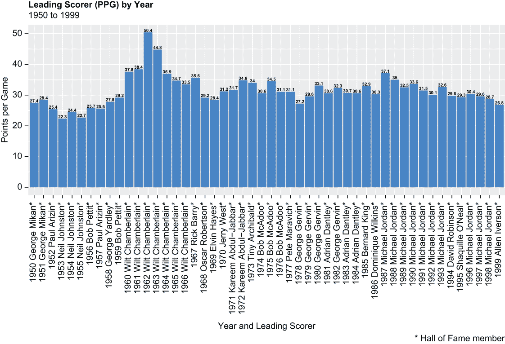
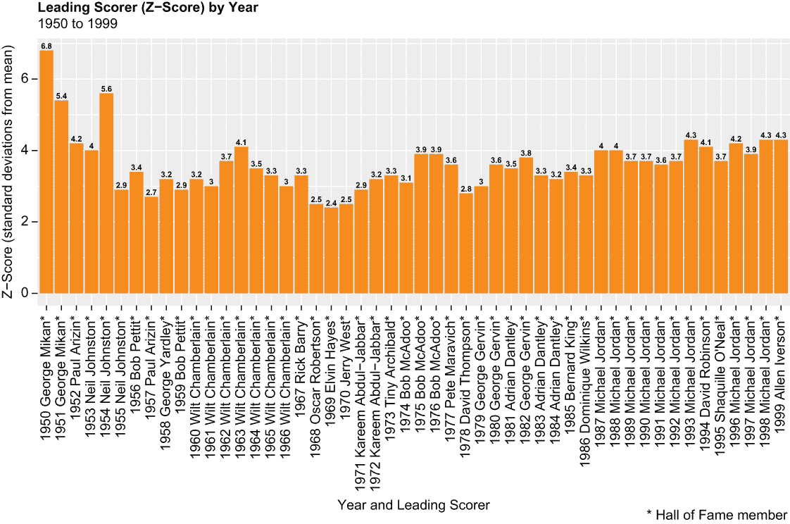
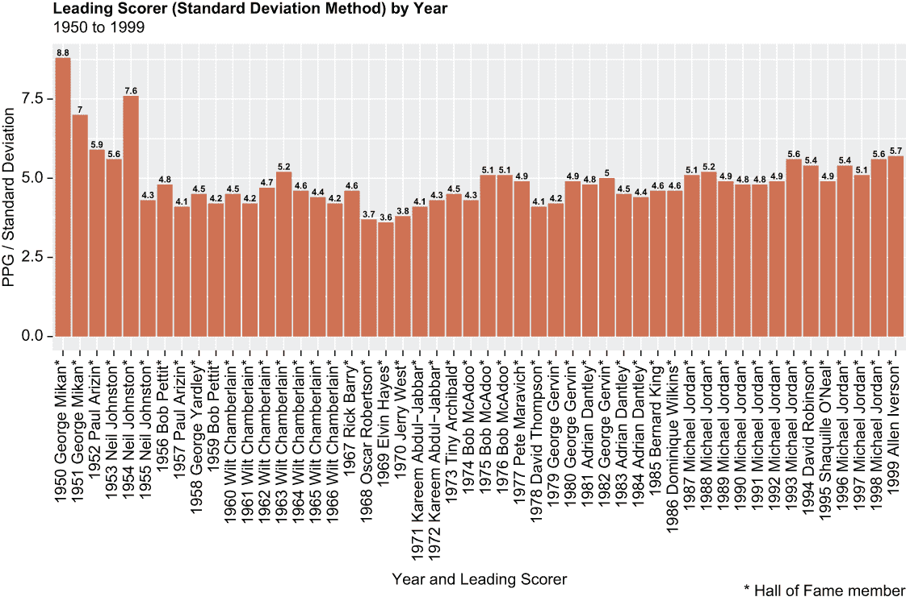
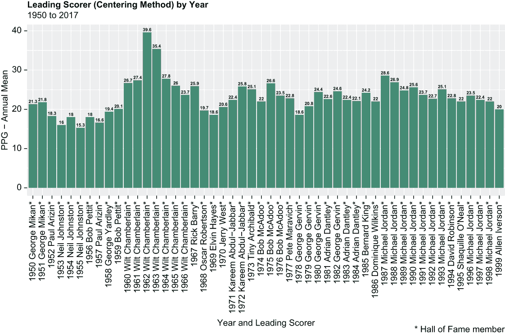

# 19 数据标准化

本章涵盖

+   数据标准化方法

+   Z 分数法

+   标准差法

+   中心化方法

+   范围法

+   为数据框着色并突出观察结果

+   比较数据集

在一场 NBA 比赛中，球员得到 50 分或以上的情况并不常见。实际上，在 2021-22 赛季的常规赛（1,230 场比赛）中，这种情况只发生了 12 次。NBA 历史上得分最高的五位球员——仍在比赛的勒布朗·詹姆斯、卡里姆·阿卜杜尔-贾巴尔、卡尔·马龙、科比·布莱恩特和迈克尔·乔丹——在他们总共 93 个赛季中，至少在常规赛比赛中得到 50 分的有 73 次。

但在 1961-62 赛季，当时为费城勇士队效力的威尔特·张伯伦平均每场比赛得到 50 分；然后他在下一年平均每场比赛得到近 45 分。自那以后，没有球员接近这些数据。六十年后，我们仍然对张伯伦的得分能力感到惊讶。然而，许多人忽略了规则变化和比赛风格转变经常改变比赛节奏的事实。在 1961-62 赛季，球队每场比赛尝试大约 110 次投篮，即投篮，以及每场比赛大约 25 次罚球；当尼尔·约翰斯顿在 1952-53 赛季带领 NBA 得分时，平均“只有”每场比赛 22.3 分，当时球队每场比赛只尝试 70 次投篮和 20 次罚球。如今，球队每场比赛尝试大约 85 次投篮，并尝试大约 20 次罚球。更多的投篮尝试意味着更多的得分；更少的投篮尝试意味着更少的得分。

你可能已经意识到，那么，查默林 1961-62 赛季的得分平均数与约翰斯顿 1952-53 赛季的得分平均数之间的差异实际上可能比原始数据所暗示的要小。我们有时会标准化数据——也就是说，我们将一个变量从其原始格式转换为简单和统一的尺度——以控制时代变化、季节性影响和其他外部因素。以汽油价格为例；如果不考虑通货膨胀，直接比较今天一加仑汽油的成本与 1980 年相同汽油的成本，既不公平也不准确。作为另一个例子，考虑一个收款代理；在许多客户不愿意或无法偿还债务的 11 月或 12 月评估代理的表现，与许多拖欠客户收到退税并因此有可支配收入的 3 月或 4 月相比，这显然是不公平的。

我们在这里的目的在于演示在包含年度得分王的 NBA 数据集上使用不同的标准化技术，并针对原始数据可视化结果。通过将每场比赛得分从其原始格式转换为标准等价物，我们消除了规则变化、比赛风格转变和其他外部因素的影响，这些因素在许多代人的过程中影响了基本统计数据。根据方法的不同，我们假设我们可能会看到与过去几十年报道的非常不同的结果。

让我们回到我们的收集代理，简要讨论为什么标准化如此重要，需要理解和欣赏。与同年 3 月和 4 月相比，节假日期间的原始业绩数字可能会让代理采取纠正措施。但标准化的业绩数字可能否则会显示代理的收集效率完全符合季节性的起伏。标准化数据不仅可能提供新的视角，还可能使最佳行动成为可能。

我们将首先加载我们需要的唯一包。

## 19.1 加载一个包

我们将使用`readr`来加载数据，使用`dplyr`函数来整理和获取数据，并仅使用`ggplot2`函数来可视化；因此，`tidyverse`包的宇宙将足够使用：

```
library(tidyverse)
```

否则，我们剩余的繁重工作将通过一系列简单的算术运算来标准化我们的数据。接下来，我们将导入我们的数据集并简要探索其内容。

## 19.2 导入和查看数据

我们的数据集是一个从 Kaggle 下载的.csv 文件，其中包含从[www.basketball-reference.com](https://www.basketball-reference.com/)抓取的数据；它具体包含了球员统计数据，包括比赛场次和总得分，涵盖了 1949-50 赛季至 2016-17 赛季的每一届 NBA 赛季。不久之后，我们将对数据进行裁剪，使得 1998-99 赛季成为最大赛季——因此我们留下了 50 个赛季的数据，对于我们的目的来说仍然相当充足。它已经被保存在我们的默认工作目录中，文件名为 season_stats.csv。

我们调用`readr read_csv()`函数来导入 season_stats.csv 文件，并在过程中创建一个名为 dat1 的数据集：

```
dat1 <- read_csv("seasons_stats.csv")
```

然后，我们调用基础 R 的`dim()`函数来返回 dat1 的维度：

```
dim(dat1)
## [1] 24624    53
```

我们的数据集包含 24,624 行和 53 列。

从现在开始，我们只需要 dat1 中的 53 个变量中的 6 个；因此，我们接下来调用`dplyr`包中的`select()`函数来对 dat1 进行子集化，基于这六个变量。此外，由于空间考虑多于其他任何原因，我们将分析限制在拥有数据的头 50 个赛季。然后，我们调用`dplyr filter()`函数来对 dat1 进行子集化，其中变量`Year`（现在是数值型）小于或等于`1999`：

```
dat1 %>%
  select(Year, Player, Pos, Tm, G, PTS) -> dat1

dat1 %>%
  filter(Year <= 1999) -> dat1
```

`glimpse()` 函数，同样来自 `dplyr`，打印出 dat1 的转置和截断快照。我们在之前调用 `select()` 和 `filter()` 之后，也得到了新的行数和列数：

```
glimpse(dat1)
## Rows: 14,420
## Columns: 6
## $ Year   <dbl> 1950, 1950, 1950, 1950, 1950, 1950, 1950, 1950, 195...
## $ Player <chr> "Curly Armstrong", "Cliff Barker", "Leo Barnhorst",...
## $ Pos    <chr> "G-F", "SG", "SF", "F", "F", "F", "G", "G-F", "F-C"...
## $ Tm     <chr> "FTW", "INO", "CHS", "TOT", "DNN", "NYK", "INO", "T...
## $ G      <dbl> 63, 49, 67, 15, 13, 2, 60, 3, 65, 36, 29, 57, 60, 5...
## $ PTS    <dbl> 458, 279, 438, 63, 59, 4, 895, 10, 661, 382, 279, 2...
```

以下是我们的六个存活变量的分解：

+   `Year`—相当于赛季，例如，1975 年相当于 1974-75 赛季；最小值为 1950 年（1950-51 赛季），最大值为 1999 年（1998-99 赛季）。现在这是一个整数，但它将被转换为因子变量。

+   `Player`—球员的全名，以名-姓格式。球员名字旁边的星号表示他是名人堂成员。现在和将来都将是一个字符字符串。

+   `Pos`—球员的位置或位置，例如，G 等于后卫，F 等于前锋，G-F 等于后卫-前锋。现在这是一个整数，但它将被转换为因子。

+   `Tm`—球员的队伍，以缩写格式表示，例如，BOS 等于波士顿凯尔特人队。这是一个字符字符串，但它将被转换为因子。

+   `G`—任何球员在任何一年常规赛中所打的比赛数。现在这是一个整数，并将保持为整数。

+   `PTS`—任何球员在任何一年常规赛中所得的总分。这是一个将保持为整数的另一个整数。

在我们创建标准化变量和分析结果之前，我们的数据需要进一步整理。

## 19.3 数据整理

我们的第一项任务现在相当平凡——通过三次调用基础 R 的 `as.factor()` 函数，将 `Year`、`Pos` 和 `Tm` 变量从字符字符串转换为因子：

```
dat1$Year <- as.factor(dat1$Year)
dat1$Pos <- as.factor(dat1$Pos)
dat1$Tm <- as.factor(dat1$Tm)
```

然而，我们的第二项任务并不那么简单。我们的数据集包含由于赛季中期的交易和其他交易导致的重复记录，这些交易使得一些球员在同一个 NBA 赛季为两支或更多球队效力。这些记录必须以某种方式处理，以不损害我们标准化方程的完整性。

### 19.3.1 处理重复记录

我们数据集最显著的挑战是它包含每个独特的年份、球员和队伍组合的一个记录。所以，比如说，在 1949-50 赛季为两支球队效力的球员实际上在 dat1 中占据了三个记录——他效力的两支球队各一个记录，以及一个额外的记录，该记录汇总了他的统计数据，其中变量 `Tm` 等于 `TOT`（可能是 `TOTAL` 的缩写）。

话虽如此，我们接下来调用 `dplyr` 包中的 `distinct()` 函数，对 dat1 中的每个独特的或不同的 `Year`/`Player`/`Pos` 组合进行子集化；然后，结果被转换成一个新的数据集，称为 test1。然后，我们调用 `dim()` 函数来返回记录数；test1 包含 12,239 条记录，比 dat1 少 2,181 个观测值：

```
dat1 %>%
  distinct(Year, Player, Pos) -> test1
dim(test1)
## [1] 12239     3
```

换个说法，这意味着 dat1 包含 2,181 条记录（不是唯一的球员）其中变量 `Tm` 等于 `TOT` 或重复的 `Year`/`Player`/`Pos` 组合，否则会汇总到变量 `Tm` 等于 `TOT` 的记录中。

我们随后编写一小段 `dplyr` 代码来从 dat1 中提取变量 `Tm` 等于 `TOT` 的记录计数。我们通过管道操作符将 dat1 传递给 `filter()` 函数，然后将结果传递给 `tally()` 函数，该函数返回 `Tm` 等于 `TOT` 的 dat1 观察值的数量：

```
dat1 %>%
  filter(Tm == "TOT") %>%
  tally()
##      n
## 1 1172
```

因此，dat1 中有 1,172 名球员在至少一个 NBA 赛季中更换过球队 *期间*。

让我们看看一个例子。Ed Bartels 是一名 6-5 的前锋，他在北卡罗来纳州立大学接受过大学篮球训练。在 1950 年，他为丹佛掘金队出场 13 场，得到 59 分，以及为纽约尼克斯队出场 2 场，得到 4 分。因此，他 1950 年的总生产力是 15 场比赛和 63 分。

我们再次调用 `filter()` 函数来对 dat1 进行子集化，其中变量 `Year` 等于 `1950` 且变量 `Player` 等于 `Ed Bartels`；我们的结果被转换成一个新的数据集，称为 test2。基本的 R `print()` 函数返回结果：

```
dat1 %>%
  filter(Year == 1950, Player == "Ed Bartels") -> test2
print(test2)
##   Year     Player Pos  Tm  G PTS
## 1 1950 Ed Bartels   F TOT 15  63
## 2 1950 Ed Bartels   F DNN 13  59
## 3 1950 Ed Bartels   F NYK  2   4
```

我们不希望我们的数据中包含超过一个记录，每个唯一的 `Year`/`Player`/`Pos` 组合。因此，我们将删除所有 `Tm` 等于 `TOT` 的 dat1 观察值，然后对每个幸存记录的变量游戏 (`G`) 和得分 (`PTS`) 进行汇总。这看起来可能有些反直觉；然而，这个步骤序列从执行角度来看比保留 `Tm` 等于 `TOT` 的观察值然后删除其下两个或更多观察值的替代方案更容易。

因此，我们再次调用 `filter()` 函数来对 dat1 进行子集化，其中 `Tm` 不等于 `TOT`（注意使用 `!=` 操作符）。`dim()` 函数返回行和列计数：

```
dat1 %>%
  filter(Tm != "TOT") -> dat1
dim(dat1)
## [1] 13248     6
```

我们的数据集现在包含 13,248 条记录，这等于原始记录数 14,420 减去在中途更换球队的 1,172 名球员。

然后，我们将 dat1 传递给 `dplyr group_by()` 和 `summarize()` 函数，以对每个 `Year`/`Player`/`Pos` 组合汇总游戏和得分。对于大多数 dat1 记录，此操作将没有影响；然而，当我们有重复的 `Year`/`Player`/`Pos` 组合时，`group_by()` 和 `summarize()` 函数实际上将两个或更多记录的统计数据合并为一条记录。这些结果被转换成一个名为 dat2 的 tibble。之后，我们调用 `dim()` 函数来获取 dat2 的维度：

```
dat1 %>%
  group_by(Year, Player, Pos) %>%
  summarize(G = sum(G), PTS = sum(PTS)) -> dat2
dim(dat2)
## [1] 12136     5
```

注意，我们已经丢失了变量 `Tm`；dat1 包含六个列，而 dat2 只有五个列。我们指示 R 对 dat1 的六个变量中的两个进行分组，并按剩余四个变量中的三个进行分组；因此，我们没有向 R 提供关于 `Tm` 的任何指令。这是可以的，因为从现在开始，我们不需要 `Tm` 来驱动任何进一步的数据整理操作或支持我们的分析。

现在，让我们再进行几项测试。首先，我们再次调用 `filter()` 函数，对 dat2 进行子集化，变量 `Year` 等于 `1950`，变量 `Player` 等于 `Ed Bartels`。我们的结果被转换成一个新的数据集，称为 test3，然后打印出来：

```
dat2 %>%
  filter(Year == 1950, Player == "Ed Bartels") -> test3
print(test3)
## # A tibble: 1 × 5
## # Groups:   Year, Player [1]
##   Year  Player     Pos       G   PTS
##   <fct> <chr>      <fct> <int> <int>
## 1 1950  Ed Bartels F        15    63
```

这个 dat2 记录类似于 dat1 的等效记录，其中 dat1 中的变量 `Tm` 等于 `TOT`；当然，dat2 中不包含名为 `Tm` 的变量，但更重要的是，变量 `G` 和 `PTS` 完美匹配。

其次，让我们确认那些在整个赛季中从未更换球队的球员的记录，例如乔治·米坎，他在球队位于明尼阿波利斯时为湖人队打中锋，没有受到影响（稍后会有更多关于米坎的介绍）。在这个过程中，我们将展示我们尚未介绍的两个操作。

看看下面代码块中的最后一行——`colorDF` 是一个包，可以为返回的数据框或 tibble 添加颜色，而 `highlight()` 函数在在线查看时将注意力吸引到满足给定条件的一个或多个记录上。我们之前没有通过调用 `library()` 函数来加载 `colorDF` 包；相反，我们通过在两个名称之间用一对冒号分隔来同时加载 `colorDF` 包并调用 `highlight()` 函数。`highlight()` 函数接受一个类似于数据框的对象作为第一个参数（test4，由前面的 `dplyr` 代码创建）和一个条件作为第二个参数（test4 中的变量 `Year` 等于 `1962`）。

注意，在执行此操作之前必须首先安装 `colorDF`。尽管在前面加载你的包仍然是一个好习惯，但当你调用跨包的函数时（`highlight()` 不是其中之一），这是一个非常有价值的技巧。如果你没有在同一行代码中将包和函数名称组合起来，R 会感到困惑。

```
dat2 %>%
  group_by(Year) %>%
  filter(Player == 'George Mikan*') -> test4
colorDF::highlight(test4, test4$Year == 1950)
## # Tibble (class tbl_df) 6 x 6:
## # Groups: Year [6]
##  │Year │Player       │Pos  │Tm   │G    │PTS  
## 1│1950 │George Mikan*│C    │MNL  │   68│ 1865
## 2│1951 │George Mikan*│C    │MNL  │   68│ 1932
## 3│1952 │George Mikan*│C    │MNL  │   64│ 1523
## 4│1953 │George Mikan*│C    │MNL  │   70│ 1442
## 5│1954 │George Mikan*│C    │MNL  │   72│ 1306
## 6│1956 │George Mikan*│C    │MNL  │   37│  390
```

然后，我们将 dat2 而不是 dat1 传递给一个类似的代码块，从而允许我们比较输出结果：

```
dat2 %>%
  group_by(Year) %>%
  filter(Player == 'George Mikan*') -> test5
colorDF::highlight(test5, test5$Year == 1950)
## # Tibble (class tbl_df) 5 x 6:
## # Groups: Year [6]
##  │Year │Player       │Pos  │G    │PTS  
## 1│1950 │George Mikan*│C    │   68│ 1865
## 2│1951 │George Mikan*│C    │   68│ 1932
## 3│1952 │George Mikan*│C    │   64│ 1523
## 4│1953 │George Mikan*│C    │   70│ 1442
## 5│1954 │George Mikan*│C    │   72│ 1306
## 6│1956 │George Mikan*│C    │   37│  390
```

除了 test4 包含名为 `Tm` 的变量而 test5 不包含之外——毕竟，test4 是从 dat1 衍生的，而 test5 是从 dat2 衍生的——输出结果相似。`arsenal` 包中的 `comparedf()` 函数接受两个数据集作为参数，比较这两个数据集，并返回发现摘要。当你需要比较两个维度远大于 test4 或 test5 的对象时，这特别有用：

```
arsenal::comparedf(test4, test5)
## Compare Object
## 
## Function Call: 
## arsenal::comparedf(x = test4, y = test5)
## 
## Shared: 5 non-by variables and 6 observations.
## Not shared: 1 variables and 0 observations.
## 
## Differences found in 0/5 variables compared.
## 0 variables compared have non-identical attributes.
```

我们数据整理的第三和最后一项任务——至少目前是这样——是创建一个新变量，然后从我们的工作数据集中删除多余的数据（行和列）。我们将在下一部分这样做。

### 19.3.2 最终修剪

在继续前进之前，由于我们的分析将针对每场比赛的得分点数，而不是总得分点数，我们调用`dplyr mutate()`函数创建一个名为`PPG`的新变量，该变量等于被除数`PTS`与除数`G`的商。来自基础 R 的`format()`函数将`PPG`限制为只包含小数点后一位数字。虽然我们通常将结果四舍五入或格式化为包含小数点后两位数字，但 NBA 历史上记录每场比赛的得分和其他指标时，只包含小数点后一位数字。`head()`函数返回前六条记录：

```
dat2 %>%
  mutate(PPG = format(PTS/G, digits = 1, nsmall = 1)) -> dat2
head(dat2)
## # A tibble: 6 × 6
## # Groups:   Year, Player [6]
##   Year  Player        Pos       G   PTS PPG  
##   <fct> <chr>         <fct> <int> <int> <chr>
## 1 1950  Al Cervi*     PG       56   573 10.2 
## 2 1950  Al Guokas     F-G      57   214 3.8  
## 3 1950  Al Miksis     C         8    27 3.4  
## 4 1950  Alex Groza    C        64  1496 23.4 
## 5 1950  Alex Hannum*  PF       64   482 7.5  
## 6 1950  Andrew Levane F-G      60   332 5.5
```

我们的数据集包含许多边缘球员的记录；如前所述，这些球员是板凳末端的球员，很可能在 NBA 担任兼职合同球员。总的来说，因此应该从我们的数据集中删除他们，以排除他们从我们的分析中。一个快速简单的方法是再次调用`filter()`函数，将 dat2 缩减为只包含每场比赛平均至少得两分的球员或至少参加了四分之一比赛的球员。如果一个球员未能每场比赛平均至少投中一个篮筐（篮筐相当于一次有效投篮，至少值两分）或在 80 场或 82 场常规赛安排中参加了超过 20 场比赛，那么很难将他标记为边缘球员：

```
dat2 %>%
  filter(PPG >= 2 & G >= 20) -> dat2
dim(dat2)
## [1] 6390    6
```

这些标准显著缩短了我们的数据长度——dat2 之前包含 12,136 条记录，现在只包含 6,390 个观测值。

到目前为止，我们不再需要变量`Pos`、`G`和`PTS`；因此，我们接下来调用`dplyr`包中的`select()`函数，对 dat2 进行子集化，选择变量`Year`、`Player`和`PPG`：

```
dat2 %>%
  select(Year, Player, PPG) -> dat2
```

最后，我们通过调用基础 R 的`as.numeric()`函数将派生变量`PPG`从字符字符串转换为数值：

```
dat2$PPG <- as.numeric(dat2$PPG)
```

在下一节中，我们将创建一个`ggplot2`条形图，可视化 NBA 主要得分手每年每场比赛的平均得分，展示不同的标准化数值向量的方法，并在标准化数据上创建类似条形图，以便我们可以比较和对比不同方法的结果以及与原始数据。

## 19.4 标准化数据

毫无疑问，我们中的大多数人已经使用数据来挑战那些在数据不可用或分析师无法挖掘时持续多年的先前的假设。标准化数据让我们在数据实际上已经存储、挖掘和包装供公众消费了很长时间后，敢于采取不同的视角。

我们首先通过创建一个名为 `Year_Player` 的新变量来对 `dat2` 数据集进行一次改进，这个变量简单地是现有变量 `Year` 和 `Player` 的拼接，这是通过内置的 `paste0()` 函数实现的。`paste0()` 函数将 `Year` 作为第一个参数，插入一个空格，然后将 `Player` 作为第二个参数。因此，当 `Year` 等于 `1999` 而 `Player` 等于 `Will Perdue` 时，我们新的变量 `Year_Player` 等于 `1999 Will Perdue`。基础 R 的 `head()` 和 `tail()` 函数返回前三个和最后三个观测值：

```
dat2$Year_Player <- paste0(as.character(dat2$Year)," ", 
                           as.character(dat2$Player))

head(dat2, n = 3)
## # A tibble: 3 × 4
## # Groups:   Year, Player [3]
##   Year  Player         PPG Year_Player      
##   <fct> <chr>        <dbl> <chr>            
## 1 1950  Al Guokas      3.8 1950 Al Guokas   
## 2 1950  Alex Groza    23.4 1950 Alex Groza  
## 3 1950  Alex Hannum*   7.5 1950 Alex Hannum*

tail(dat2, n = 3)
## # A tibble: 3 × 4
## # Groups:   Year, Player [3]
##   Year  Player           PPG Year_Player        
##   <fct> <chr>          <dbl> <chr>              
## 1 1999  Walt Williams    9.3 1999 Walt Williams 
## 2 1999  Walter McCarty   5.7 1999 Walter McCarty
## 3 1999  Will Perdue      2.4 1999 Will Perdue
```

我们的意图是使用 `Year_Player` 而不是 `Year` 或 `Player` 作为我们即将到来的 `ggplot2` 条形图的 x 轴变量——这样我们就可以显示和拟合这两个变量，而无需在两者之间做出选择。这将提高我们视觉内容的可读性和美观性。

然后，我们将 `dat2` 传递给 `dplyr group_by()` 和 `slice()` 函数——`slice()` 函数从 `dat2` 中提取每一年变量 `PPG`（每场比赛得分）为最大值的观测值。毕竟，我们的意图是仅显示每年的每场比赛得分领先者；因此，我们需要一个恰好满足这一要求的数据源。结果随后被转换为一个名为 `dat3` 的 tibble：

```
dat2 %>%
  group_by(Year) %>%
  slice(which.max(PPG)) -> dat3
```

接下来，我们创建我们的第一个 `ggplot2` 条形图，其中 `dat3` 是数据源，`Year_Player` 是我们的 x 轴变量，而 `PPG` 是我们的 y 轴变量（见图 19.1）。因此，我们正在可视化 1949-50 赛季至 1998-99 赛季之间每年 NBA 得分领先者及其每场比赛平均得分；这是我们后续结果将进行比较和对比的原始数据基线：

```
p1 <- ggplot(dat3, aes(x = Year_Player, y = PPG)) + 
  geom_bar(stat = "identity", color = "dodgerblue", fill = "dodgerblue") +
  geom_text(aes(label = PPG), 
            position = position_dodge(width = 0.8), vjust = -0.3,
            fontface = "bold", size = 2) +
  labs(title = "Leading Scorer (PPG) by Year", 
       subtitle = "1950 to 1999", 
       caption = "* Hall of Fame member",
       x = "Year and Leading Scorer",
       y = "Points per Game") +
  theme(plot.title = element_text(face = "bold")) +
  theme(axis.text.x = element_text(angle = 90)) 
print(p1)
```



图 19.1 1949-50 赛季至 1998-99 赛季每年 NBA 得分领先者及其每场比赛平均得分

威尔特·张伯伦在 1961-62 赛季每场比赛 50.4 分和在 1962-63 赛季的平均 44.8 分显然非常突出。接下来，我们将演示各种标准化技术，并将结果与我们刚刚显示的年度原始数值进行比较。如果我们的原始假设是正确的，那么以下方法之一应该会返回非常不同的结果。

### 19.4.1 z 分数法

z 分数法可能是最常见或最受欢迎的数据标准化方法。它表示原始数值高于或低于总体平均值的多少个标准差。z 分数是通过从原始数值中减去总体平均值，然后将差值除以标准差来计算的。

在下一块代码中，我们将 dat2 传递给 `group_by()` 和 `mutate()` 函数，以计算每个 dat2 记录的 z 分数，其中人口按变量 `Year` 分段。例如，乔治·米坎 1950 年的 PPG z 分数是从与威尔特·张伯伦 1962 年 z 分数不同的均值和标准差计算得出的。结果被放入一个名为 dat4a 的 tibble 中。`head()` 和 `tail()` 函数分别返回前三条和最后三条记录：

```
dat2 %>%
  group_by(Year) %>%
  mutate(z_ppg = round((PPG - mean(PPG)) / sd(PPG), digits = 1)) -> dat4a

head(dat4a, n = 3)
## # A tibble: 3 × 5
## # Groups:   Year [1]
##   Year  Player         PPG Year_Player       z_ppg
##   <fct> <chr>        <dbl> <chr>             <dbl>
## 1 1950  Al Guokas      3.8 1950 Al Guokas     -0.8
## 2 1950  Alex Groza    23.4 1950 Alex Groza     5.6
## 3 1950  Alex Hannum*   7.5 1950 Alex Hannum*   0.4

tail(dat4a, n = 3)
## # A tibble: 3 × 5
## # Groups:   Year [1]
##   Year  Player           PPG Year_Player         z_ppg
##   <fct> <chr>          <dbl> <chr>               <dbl>
## 1 1999  Walt Williams    9.3 1999 Walt Williams    0.5
## 2 1999  Walter McCarty   5.7 1999 Walter McCarty  -0.2
## 3 1999  Will Perdue      2.4 1999 Will Perdue     -0.9
```

在 1950 年，每场比赛平均得 3.8 分低于 1950 年均值的 0.8 个标准差，而每场比赛 23.4 分高于 1950 年均值的 5.6 个标准差。

验证我们刚刚创建的变量 `z_ppg` 的完整性的方法既快又简单——实际上，有两种既快又简单的方法。z 分数的向量应该具有均值为 0 和方差为 1；然后我们调用基础 R 的 `mean()` 和 `var()` 函数来检查这些：

```
mean(dat4a$z_ppg)
## [1] 0.0002503912

var(dat4a$z_ppg)
## [1] 0.9933541
```

当进行四舍五入时，`z_ppg` 的均值实际上等于 0，而 `z_ppg` 的方差，作为离散度的度量，等于标准差的平方，等于 1。我们不应该期望均值恰好等于 0 或方差恰好等于 1，简单的理由是我们通过变量 `Year` 中的每个因子创建了 `z_ppg`，而不是整体创建。

然后，我们将 dat4a 传递给 `group_by()` 和 `slice()` 函数，将变量 `Year` 中每个因子的最大 `z_ppg` 转换为名为 dat4b 的 tibble：

```
dat4a %>%
  group_by(Year) %>%
  slice(which.max(z_ppg)) -> dat4b
```

与 `summarize()` 函数相比，`slice()` 函数的优点在于 `slice()` 会提取每个适用记录的每个变量；如果我们调用 `summarize()` 函数，dat4b 将只包含变量 `z_ppg` 和 `Year`。然后我们将 dat4b 投入第二个 `ggplot2` 条形图，其中 `Year_Player` 再次是我们的 x 轴变量，而 `z_ppg`（而不是 `PPG`）是我们的 y 轴变量（见图 19.2）：

```
p2 <- ggplot(dat4b, aes(x = Year_Player, y = z_ppg)) + 
  geom_bar(stat = "identity", color = "darkorange", fill = "darkorange") +
  geom_text(aes(label = z_ppg), 
            position = position_dodge(width = 0.8), vjust = -0.3,
            fontface = "bold", size = 2) +
  labs(title = "Leading Scorer (Z-Score) by Year", 
       subtitle = "1950 to 1999", 
       caption = "* Hall of Fame member",
       x = "Year and Leading Scorer",
       y = "Z-Score (standard deviations from mean)") +
  theme(plot.title = element_text(face = "bold")) +
  theme(axis.text.x = element_text(angle = 90)) 
print(p2)
```



图 19.2 1949-50 赛季至 1998-99 赛季 NBA 年度得分领先者和他们每场比赛平均得分的 z 分数

这些结果对历史每场比赛平均分提供了全新的视角。威尔特·张伯伦在 1961-62 赛季每场比赛平均 50.4 分，相对于该年的均值“仅”高出 4.1 个标准差。同时，乔治·米坎 1950 年每场比赛平均 27.4 分，几乎比均值高出 7 个标准差。

### 19.4.2 标准差方法

标准化数据的另一种方法是标准差方法。与 z 分数方法从原始数据中减去总体均值然后除以标准差不同，标准差方法排除了均值，只是将原始数据除以标准差。

我们将 dat2 传递给`dplyr group_by()`和`mutate()`函数，通过变量`Year`中的每个因素来计算标准差方法，并将结果保存在一个名为`sd_ppg`的新变量中。我们得到一个新的 tibble，名为 dat5a，当然，它等于 dat2 加上变量`sd_ppg`。通过调用`head()`和`tail()`函数，我们可以查看 dat5a 中的前三条和最后三条记录：

```
dat2 %>%
  group_by(Year) %>%
  mutate(sd_ppg = round((PPG / sd(PPG)), digits = 1)) -> dat5a

head(dat5a, n = 3)
## # A tibble: 3 × 5
## # Groups:   Year [1]
##   Year  Player         PPG Year_Player       sd_ppg
##   <fct> <chr>        <dbl> <chr>              <dbl>
## 1 1950  Al Guokas      3.8 1950 Al Guokas       1.2
## 2 1950  Alex Groza    23.4 1950 Alex Groza      7.5
## 3 1950  Alex Hannum*   7.5 1950 Alex Hannum*    2.4

tail(dat5a, n = 3)
## # A tibble: 3 × 5
## # Groups:   Year [1]
##   Year  Player           PPG Year_Player         sd_ppg
##   <fct> <chr>          <dbl> <chr>                <dbl>
## 1 1999  Walt Williams    9.3 1999 Walt Williams     2  
## 2 1999  Walter McCarty   5.7 1999 Walter McCarty    1.2
## 3 1999  Will Perdue      2.4 1999 Will Perdue       0.5
```

`sd_ppg`的方差，就像`z_ppg`的方差一样，等于`1`：

```
var(dat5a$sd_ppg)
## [1] 1.018061
```

然后，我们将刚刚创建的 tibble，dat5a，传递给`dplyr group_by()`和`slice()`函数。这两个函数结合使用，有效地将 dat5a 减少到只包含每年变量`sd_ppg`为最大值的单条记录。这些结果被转换成另一个名为 dat5b 的 tibble：

```
dat5a %>%
  group_by(Year) %>%
  slice(which.max(sd_ppg)) -> dat5b
```

我们的结果随后通过一个`ggplot2`条形图进行可视化，其中 dat5b 是我们的数据源，`Year_Player`再次是我们的 x 轴变量，而 sd_ppg 是我们的 y 轴变量（见图 19.3）：

```
p3 <- ggplot(dat5b, aes(x = Year_Player, y = sd_ppg)) + 
  geom_bar(stat = "identity", color = "salmon3", fill = "salmon3") +
  geom_text(aes(label = sd_ppg), 
            position = position_dodge(width = 0.8), vjust = -0.3,
            fontface = "bold", size = 2) +
  labs(title = "Leading Scorer (Standard Deviation Method) by Year", 
       subtitle = "1950 to 1999", caption = "* Hall of Fame member",
       x = "Year and Leading Scorer",
       y = "PPG / Standard Deviation") +
  theme(plot.title = element_text(face = "bold")) +
  theme(axis.text.x = element_text(angle = 90)) 
print(p3)
```



图 19.3 基于标准差方法，1949-50 赛季至 1998-99 赛季每年 NBA 得分领先者和他们每场比赛的平均得分

这些结果看起来与我们之前的结果非常相似，这表明每场比赛平均得分（它影响 z 分数方法但不影响标准差方法）基本上是中性的，或者是不相关的。当这些结果与其他原始数据进行比较时，乔治·米坎（George Mikan）的 1950 赛季再次突出。尼尔·约翰斯顿（Neal Johnston）的 1954 赛季也突出，而艾伦·艾弗森（Allen Iverson）在费城 76 人队（Philadelphia 76ers）的 1998-99 赛季是过去 45 个 NBA 赛季中最显著的异常值。

### 19.4.3 中心化方法

中心化方法简单地从原始数据中减去某个常数——例如最小值或最大值，但通常是平均值。我们将减去每年的平均值，但如果我们对每场比赛平均得分的先验假设是正确的——它是中性的——那么我们的结果应该因此类似于原始数据。

首先，我们将 dat2 传递给`group_by()`和`summarize()`函数来计算每场比赛的平均得分。然后，这些结果被转换成一个名为 dat6a 的 tibble。我们通过调用`head()`和`tail()`函数来获取 dat6a 的前三条和最后三条记录：

```
dat2 %>%
  group_by(Year) %>%
  summarize(mean = round(mean(PPG), digits = 1)) -> dat6a

head(dat6a, n = 3)
## # A tibble: 3 × 2
##   Year   mean
##   <fct> <dbl>
## 1 1950    6.1
## 2 1951    6.6
## 3 1952    7.1

tail(dat6a, n = 3)
## # A tibble: 3 × 2
##   Year   mean
##   <fct> <dbl>
## 1 1997    7.2
## 2 1998    6.7
## 3 1999    6.8
```

第二，我们调用`dplyr`包中的`left_join()`函数，通过变量`Year`将 dat3 和 dat6a 合并或连接起来，这是这两个 tibble 共有的一个变量。而 dat3 有 68 × 4 的维度，dat6a 有 68 × 2 的维度，dat6b 有 68 × 5 的维度。`head()`和`tail()`函数返回 dat6b 的前三条和最后三条观测值：

```
left_join(dat3, dat6a, by = "Year") -> dat6b

head(dat6b, n = 3)
## # A tibble: 3 × 5
## # Groups:   Year [3]
##   Year  Player          PPG Year_Player         mean
##   <fct> <chr>         <dbl> <chr>              <dbl>
## 1 1950  George Mikan*  27.4 1950 George Mikan*   6.1
## 2 1951  George Mikan*  28.4 1951 George Mikan*   6.6
## 3 1952  Paul Arizin*   25.4 1952 Paul Arizin*    7.1

tail(dat6b, n = 3)
## # A tibble: 3 × 5
## # Groups:   Year [3]
##   Year  Player            PPG Year_Player           mean
##   <fct> <chr>           <dbl> <chr>                <dbl>
## 1 1997  Michael Jordan*  29.6 1997 Michael Jordan*   7.2
## 2 1998  Michael Jordan*  28.7 1998 Michael Jordan*   6.7
## 3 1999  Allen Iverson*   26.8 1999 Allen Iverson*    6.8
```

现在我们有一个单一的对象，其中包含了每年的最高 PPG 和每年的平均人口数。

第三，我们将 dat6b 传递给`mutate()`函数，创建一个名为`c_ppg`的新 dat6b 变量，该变量等于`PPG`减去平均值。现在你知道为什么我们刚刚执行了左连接——我们需要这两个变量在同一对象中派生`c_ppg`。为了继续提供对这些步骤的可见性，我们再次调用`head()`和`tail()`函数，在它们之间返回六个记录：

```
dat6b %>%
  mutate(c_ppg = PPG - mean) -> dat6b

head(dat6b, n = 3)
## # A tibble: 3 × 6
## # Groups:   Year [3]
##   Year  Player          PPG Year_Player         mean c_ppg
##   <fct> <chr>         <dbl> <chr>              <dbl> <dbl>
## 1 1950  George Mikan*  27.4 1950 George Mikan*   6.1  21.3
## 2 1951  George Mikan*  28.4 1951 George Mikan*   6.6  21.8
## 3 1952  Paul Arizin*   25.4 1952 Paul Arizin*    7.1  18.3

tail(dat6b, n = 3)
## # A tibble: 3 × 6
## # Groups:   Year [3]
##   Year  Player            PPG Year_Player           mean c_ppg
##   <fct> <chr>           <dbl> <chr>                <dbl> <dbl>
## 1 1997  Michael Jordan*  29.6 1997 Michael Jordan*   7.2  22.4
## 2 1998  Michael Jordan*  28.7 1998 Michael Jordan*   6.7  22  
## 3 1999  Allen Iverson*   26.8 1999 Allen Iverson*    6.8  20
```

第四，我们创建另一个`ggplot2`条形图，作为可视化结果的一种方式（见图 19.4）；dat6b 是我们的数据源，`Year_Player`沿着 x 轴运行，`c_ppg`沿着 y 轴运行：

```
p4 <- ggplot(dat6b, aes(x = Year_Player, y = c_ppg)) + 
  geom_bar(stat = "identity", color = "aquamarine4", 
           fill = "aquamarine4") +
  geom_text(aes(label = c_ppg), 
            position = position_dodge(width = 0.8), vjust = -0.3,
            fontface = "bold", size = 2) +
  labs(title = "Leading Scorer (Centering Method) by Year", 
       subtitle = "1950 to 2017", 
       caption = "* Hall of Fame member",
       x = "Year and Leading Scorer",
       y = "PPG - Annual Mean") +
  theme(plot.title = element_text(face = "bold")) +
  theme(axis.text.x = element_text(angle = 90)) 
print(p4)
```



图 19.4 1949-50 赛季至 1998-99 赛季 NBA 年度得分领先者和他们每场比赛平均得分的年度比较，基于中心化方法

这些结果几乎与原始数字相同，这并不令人惊讶。是的，附加在条形图顶部的总数当然比原始数字少，这是因为我们从`PPG`变量中减去了每年每场比赛得分的年度平均值。然而，更重要的是，年度间的比较与原始数据完全匹配。

### 19.4.4 范围法

在这个第四和最后的方法中，我们将原始数字除以年度范围，该范围等于`Year`中每个因子的每场比赛平均得分最大值减去最小值。

因此，我们将 dat2 传递给`group_by()`和`mutate()`函数，从而创建一个名为`r_ppg`的新变量，该变量等于`PPG`除以最大`PPG`减去最小`PPG`。然后，通过调用`head()`和`tail()`函数，我们获取了我们刚刚创建的 tibble（dat7a）中的前三个和最后三个记录：

```
dat2 %>%
  group_by(Year) %>%
  mutate(r_ppg = round((PPG) / (max(PPG) - min(PPG)), digits = 1)) -> dat7a

head(dat7a, n = 3)
## # A tibble: 3 × 5
## # Groups:   Year [1]
##   Year  Player         PPG Year_Player       r_ppg
##   <fct> <chr>        <dbl> <chr>             <dbl>
## 1 1950  Al Guokas      3.8 1950 Al Guokas      0.2
## 2 1950  Alex Groza    23.4 1950 Alex Groza     0.9
## 3 1950  Alex Hannum*   7.5 1950 Alex Hannum*   0.3

tail(dat7a, n = 3)
## # A tibble: 3 × 5
## # Groups:   Year [1]
##   Year  Player           PPG Year_Player         r_ppg
##   <fct> <chr>          <dbl> <chr>               <dbl>
## 1 1999  Walt Williams    9.3 1999 Walt Williams    0.4
## 2 1999  Walter McCarty   5.7 1999 Walter McCarty   0.2
## 3 1999  Will Perdue      2.4 1999 Will Perdue      0.1
```

接下来，我们切割一个名为 dat7b 的 tibble，它只包含那些记录，每个`Year`因子一个，其中我们派生的变量`r_ppg`是最大的。结果发现，对于每个 dat7b 记录，`r_ppg`都等于`1.1`。与其创建一个（相当不起眼的）条形图，我们不如展示前 10 个和最后 10 个结果：

```
dat7b %>%
  group_by(Year) %>%
  slice(which.max(r_ppg)) -> dat7b

head(dat7b, n = 10)
## # A tibble: 10 × 5
## # Groups:   Year [10]
##    Year  Player            PPG Year_Player          r_ppg
##    <fct> <chr>           <dbl> <chr>                <dbl>
##  1 1950  George Mikan*    27.4 1950 George Mikan*     1.1
##  2 1951  George Mikan*    28.4 1951 George Mikan*     1.1
##  3 1952  Paul Arizin*     25.4 1952 Paul Arizin*      1.1
##  4 1953  Neil Johnston*   22.3 1953 Neil Johnston*    1.1
##  5 1954  Neil Johnston*   24.4 1954 Neil Johnston*    1.1
##  6 1955  Neil Johnston*   22.7 1955 Neil Johnston*    1.1
##  7 1956  Bob Pettit*      25.7 1956 Bob Pettit*       1.1
##  8 1957  Bob Pettit*      24.7 1957 Bob Pettit*       1.1
##  9 1958  George Yardley*  27.8 1958 George Yardley*   1.1
## 10 1959  Bob Pettit*      29.2 1959 Bob Pettit*       1.1

tail(dat7b, n = 10)
## # A tibble: 10 × 5
## # Groups:   Year [10]
##    Year  Player              PPG Year_Player            r_ppg
##    <fct> <chr>             <dbl> <chr>                  <dbl>
##  1 1990  Michael Jordan*    33.6 1990 Michael Jordan*     1.1
##  2 1991  Michael Jordan*    31.5 1991 Michael Jordan*     1.1
##  3 1992  Michael Jordan*    30.1 1992 Michael Jordan*     1.1
##  4 1993  Michael Jordan*    32.6 1993 Michael Jordan*     1.1
##  5 1994  David Robinson*    29.8 1994 David Robinson*     1.1
##  6 1995  Shaquille O'Neal*  29.3 1995 Shaquille O'Neal*   1.1
##  7 1996  Michael Jordan*    30.4 1996 Michael Jordan*     1.1
##  8 1997  Michael Jordan*    29.6 1997 Michael Jordan*     1.1
##  9 1998  Michael Jordan*    28.7 1998 Michael Jordan*     1.1
## 10 1999  Allen Iverson*     26.8 1999 Allen Iverson*      1.1
```

虽然我们已经展示了四种标准化单个变量的方法，但有时有必要对两个或更多变量进行标准化，这些变量的原始数字在完全不同的尺度上。这是因为我们不想让一个变量，比如`交易金额`，其范围在数百甚至数千美元之间，在客户细分或其他类似分析中比另一个变量，比如`交易次数`，通常在个位数和两位数之间，有更大的权重。与跨越数十年的单个变量（如`PPG`）相比，范围法在标准化两个或更多变量时更有意义。

回到我们的分析，我们展示了标准化有可能以与我们通常习惯截然不同的方式呈现数据，因此挑战我们重新思考先前的惯例。几乎每个人都还在谈论威尔特·张伯伦，但几乎没有人关注乔治·米坎的成就。根据我们在这里展示的内容，这应该肯定会有所改变。

我们下一章和最后一章是对前 19 章的总结。

## 摘要

+   标准化是一个关键统计概念，当你有一个单一的连续变量，如每场比赛的平均得分，跨越长时间跨度时，了解并应用它是非常重要的。因此，由于外部因素的变化，原始数据在不同时间有不同的“含义”。想想通货膨胀以及为什么我们要将旧美元转换为当前美元。

+   当你拥有两个或更多连续变量，且原始数据处于非常不同的尺度时，为了防止其中一个变量产生不适当的影响，将变量转换为类似尺度——使用类似方法——然后将数据的标准版本纳入分析是很重要的。

+   我们展示了四种数据标准化方法，因为没有一种适合所有情况的数据标准化解决方案。这些方法中哪一个可能最适合你的用例主要取决于你的数据和你是标准化单个变量还是多个变量。测试不同的方法并不要仅仅依赖于一个预定义的方法是良好的实践。

+   我们还展示了如何给数据框对象添加颜色，甚至突出满足逻辑标准的记录。这些是值得了解的好技巧，可能有助于你的实时分析工作，或者当你打算直接将（尽管是粗略的）R 输出注入到 PowerPoint 演示文稿、RMarkdown 文件或其他文档类型时。

+   我们介绍了并演示了一些不同的数据处理技巧——使用 `slice()` 提取满足特定标准的观测值，使用 `distinct()` 从数据集中选择唯一或不同的记录，使用 `comparedf()` 比较两个对象并获取差异报告，以及使用 `paste0()` 连接字符串。

+   我们还演示了如何最好地调用跨包的函数。而不是分别加载这些包并调用它们的函数，实际上最好是在同一行代码中加载包并调用相应的函数。随着每年 R 函数和包数量的增加，实际上可能需要更多应用这种技术。
