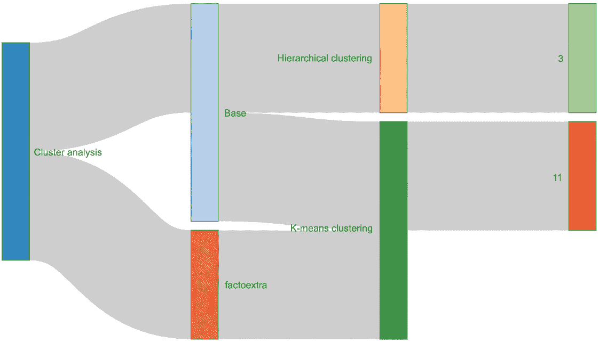
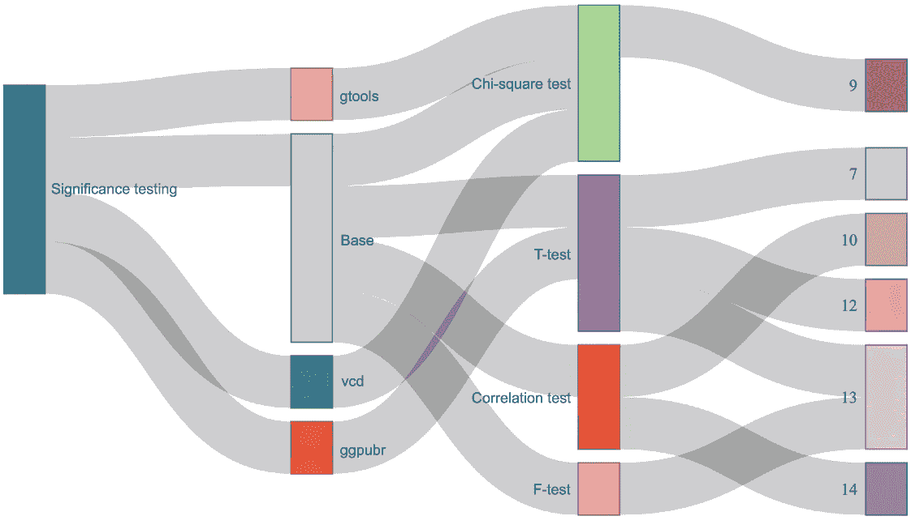
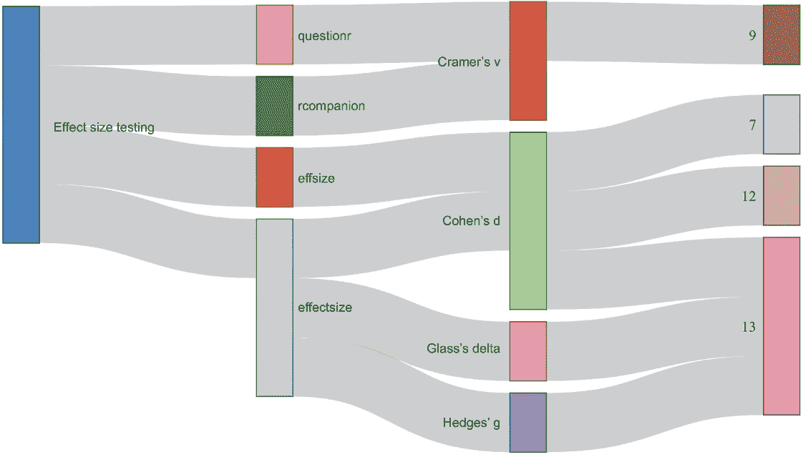
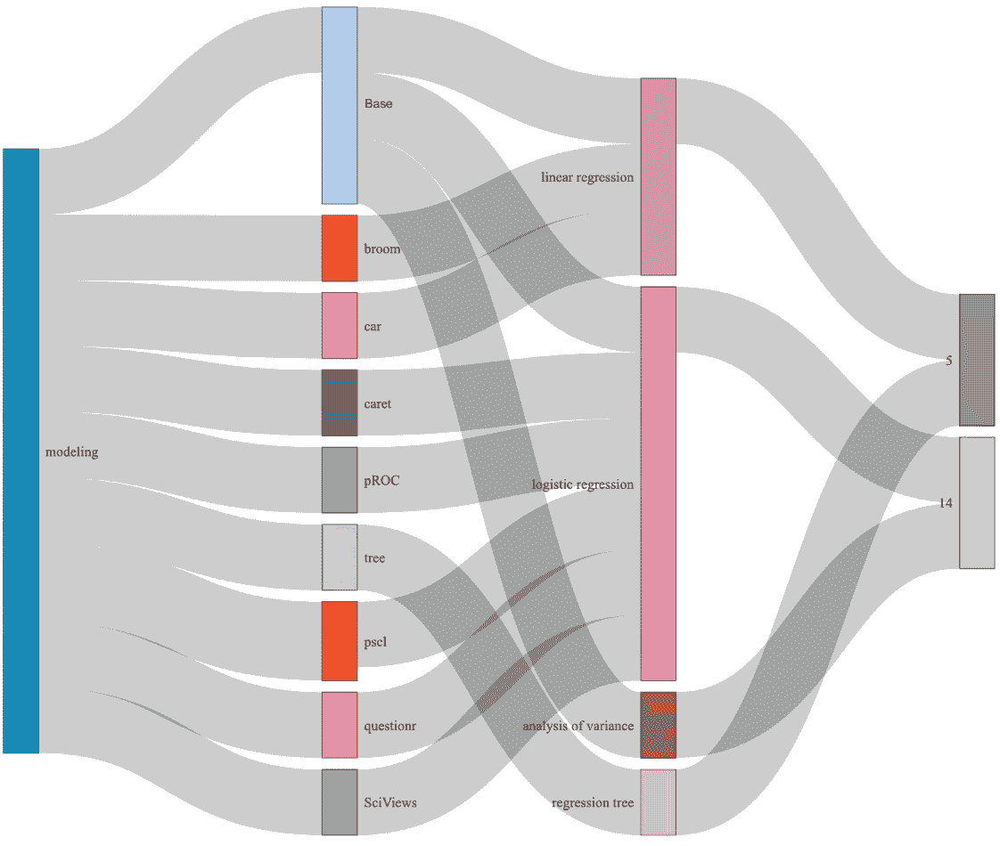
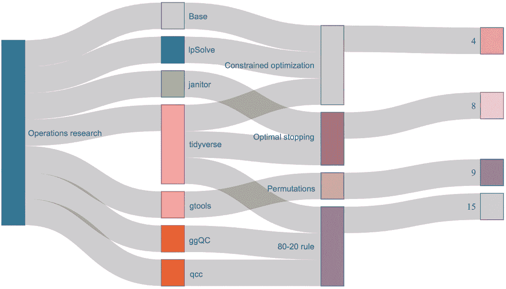
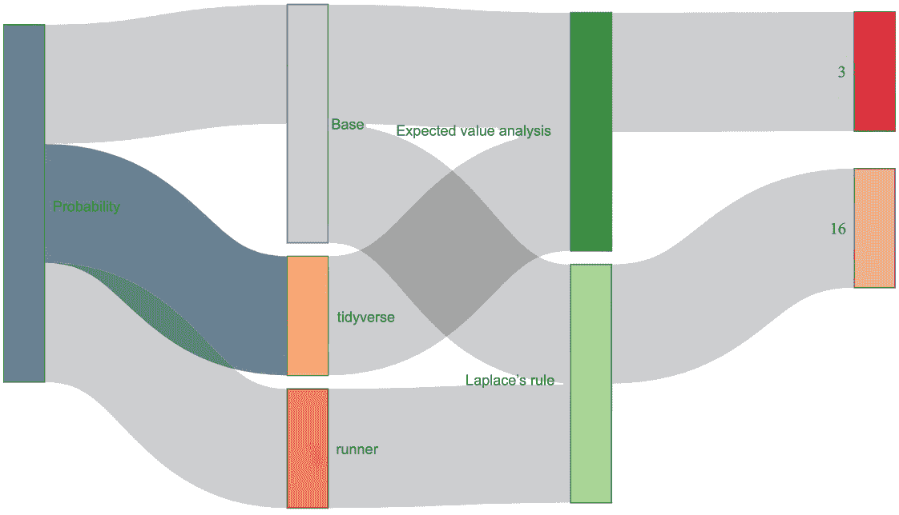
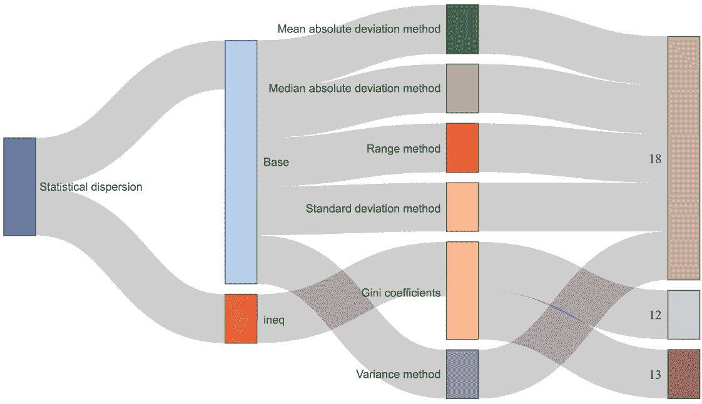
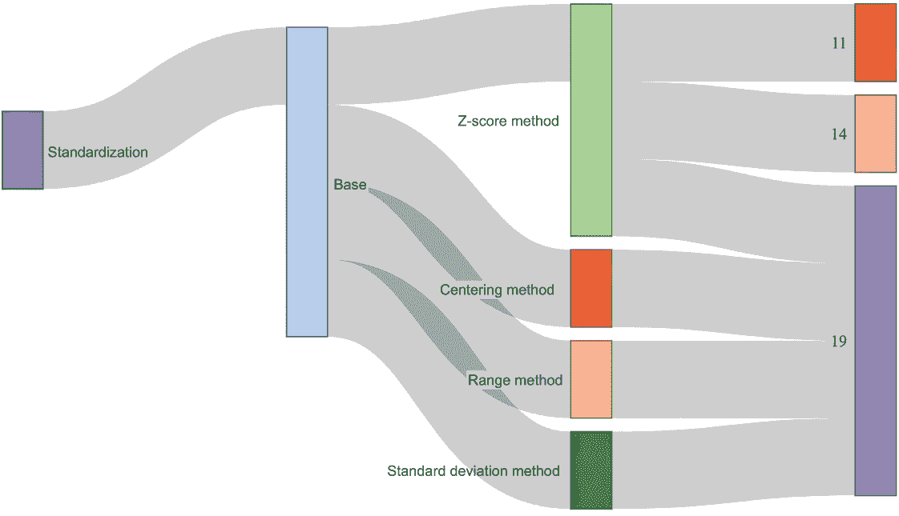
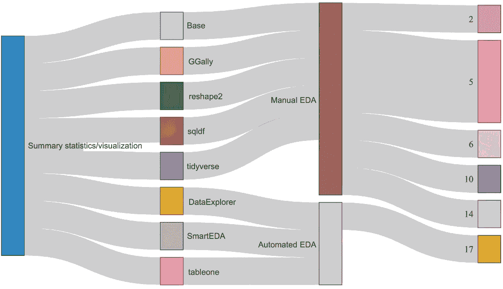

# 20 完成工作

在这些最后几页中，我们的目的是概述第二章至第十九章的结果，并回顾我们在过程中使用的技术。我们不会逐章进行，从而重复相同的旅程顺序，而是将我们的发现整合到九个“学习领域”中，这些领域进一步按包、应用技术和章节参考细分。例如，在第五章和第十四章之间，我们开发了四种类型的模型——线性回归、回归树、方差分析（ANOVA）和逻辑回归——使用基础 R 和包装函数的混合；因此，建模是我们九个学习领域之一。一旦我们到达第 20.4 节，我们将回顾哪些模型在哪里以及为了什么目的被应用。

以下学习领域按它们将呈现的顺序列出：

+   聚类分析 (20.1)

+   显著性测试 (20.2)

+   效应量测试 (20.3)

+   模型 (20.4)

+   运筹学 (20.5)

+   概率 (20.6)

+   统计分散 (20.7)

+   标准化 (20.8)

+   概率统计和可视化 (20.9)

此外，我们创建了一系列桑基图（见第三章），每个学习领域一个，这些图显示了学习领域、包和基础 R 函数、技术和章节编号之间的关系。因此，这些最终可视化是相同汇聚点的视觉快照。

## 20.1 聚类分析

聚类分析是一种无监督学习方法和多元分析技术，它根据对象的相似性将对象（例如，汽车、社区、几乎任何东西）分类到多个组或簇中。一家百货连锁店可能会根据人口统计数据和以前的购买记录来细分其客户，目的是随后根据簇来制定定制营销策略。毫无疑问，最常见或最受欢迎的聚类算法是层次聚类和 K-means 聚类。我们在第三章和第十一章分别介绍了这两种聚类技术。

我们开始这次旅程时，提出了一个论点，即摆烂是一种完全合乎逻辑（尽管令人厌恶）的策略，对于计划通过业余选秀重建阵容的处境不佳的 NBA 球队来说。这是因为联赛奖励其最差的球队以几个首轮选秀权，而选择未来超级巨星——那种可以扭转球队命运的球员——的唯一可能方式是在选秀中或接近最顶端进行选择。我们通过开发一系列基础 R 函数的层次聚类来结束我们的论点。

更重要的是，我们基于按第一轮选秀号码分组的第一轮选秀到 2000 年至 2009 年 NBA 选秀的平均职业生涯胜利份额创建了一个距离矩阵。层次聚类开始时，将每个对象或观察值视为其自己的簇。然后它通过每次合并两个相似的簇进行迭代，直到所有簇（在我们的案例中是 30 个，或每个首轮选秀一个簇）合并成一个。最终结果是树状图，或倒置的树，它在 x 轴上显示原始簇，在 y 轴上显示距离矩阵的结果。

在 R 中创建树状图特别好的是，我们有选项在图上绘制*K*个透明的框来进一步区分簇。我们将*K*设置为 2，看看 R 是否会绘制一个透明的框围绕选秀 1 到 5 的选秀，另一个框围绕 6 到 30 的选秀，从而返回与我们之前分析相似的结果。果然，这正是 R 为我们做的。

在第十章和第十一章中，我们探讨了球队薪资与常规赛胜利、季后赛出场和冠军之间的关系——得出结论，除了少数例外，球队薪资通常是球队轨迹的领先指标。我们以 K-means 聚类分析结束我们的分析。

K-means 聚类与层次聚类至少有两点不同——（1）我们必须提前告诉 R 要创建多少个簇，并且（2）我们根据两个或更多连续变量得到*K*个簇，为了绘图目的，这些变量会自动为我们标准化或缩放。我们在 2000 年至 2017 个赛季之间绘制了调整后的薪资和常规赛胜利。

我们首先演示了两种计算最佳簇数（与随机生成*K*）的方法，使用`factoextra`包中的函数。簇内平方和法，有时被称为肘部法，因为它建议在（不精确的）随后 scree 图弯曲的位置有一个最佳簇数，返回六个簇；轮廓法返回两个簇。

我们决定折中一下，并指示 R 将结果分割成四个集群。K-means 聚类通过（可能）几个迭代步骤来处理数字，直到数据与它们各自的质心或集群的中心位置之间的总平方和最小化，当然，不违反对*K*预定的要求。我们结果中最令人着迷的部分可能是 R 将纽约尼克斯队降级到了它自己的集群，该队的工资水平比联赛平均水平高出三个标准差以上，而常规赛的胜利次数比平均水平低一个标准差以上。与此同时，圣安东尼奥马刺队，在 2000 年至 2017 年之间赢得的常规赛比赛比任何其他工资水平低于平均水平的球队都要多，与 10 个其他球队聚类在一起。结果是通过基础 R 功能返回的，然后通过`factoextra`包进行可视化。

一般的无监督学习方法，特别是聚类分析，返回的结果比线性回归或 t 检验等更为主观。我们在第十一章进一步演示了，当我们对*K*应用不同的值时，结果可以并且会显著变化；因此，随着*K*的增加，聚类分析，尤其是 K-means 的个性特征会加剧。当*K*等于 2 时，看似具有相似轮廓并因此值得在类似营销活动中接受的一对客户，当*K*等于 3 或更多时，可能会被划分到不同的集群中。尽管如此，聚类分析是探索数据和评估群体的一种基本技术，也是应用不同治疗手段的关键推动者，这些手段通常比一揽子策略带来更好的回报。

我们的第一张桑基图——实际上，所有随后的桑基图——都应该从左到右阅读（见图 20.1）。最左边的节点是适用的学习区域；下一个节点或一系列节点代表被调用的包和/或内置函数；下一组节点代表应用的技术；最右边的节点组是章节引用。因此，层次聚类仅使用基础 R 函数开发，而我们的 K-means 聚类则是结合了基础 R 和`factoextra`函数开发的。层次聚类在第三章中进行了演示，K-means 聚类在第十一章中进行了演示。（顺便说一下，节点组之间连接线或链接的宽度没有任何意义。）

图 20.1 层次聚类在第三章中被展示为支持“摆烂”策略的最终证据；K-means 聚类在第十一章中被展示为基于各队工资和常规赛胜利的组合来划分类似队伍的方法。我们的层次聚类完全使用基础 R 函数开发和可视化；相反，我们的 K-means 聚类主要使用内置函数开发，但通过`factoextra`包进行可视化。

## 20.2 显著性检验

任何显著性检验——无论是 t 检验、独立性的卡方检验、相关性检验还是 F 检验——都应该围绕一个零假设（*H*[0]）及其对立面，备择假设（*H*[1]）。我们始终从零假设开始；也就是说，我们假设进入时任何方差都是由于偶然。然后我们运行一个显著性检验，告诉我们是拒绝零假设还是未能拒绝它。通过拒绝零假设，因此我们接受备择假设。

假设有两组类似的不良客户，他们接受了不同的催收处理。显著性检验告诉我们性能差异是由于偶然还是应该归因于处理方式的差异。如果前者，我们未能拒绝零假设；如果后者，我们拒绝零假设。如果结果是显著的，那么将获胜的处理方式应用于所有客户就变得有意义。

显著性检验的 p 值告诉我们是否拒绝零假设。我们一致地应用了一个预定义的 5%阈值，这是最常见的——当返回的 p 值大于 5%时，我们未能拒绝我们的零假设，而当它小于 5%时，我们拒绝那个零假设并接受备择假设。显著性阈值有时设定得非常低，如 1%，有时设定得非常高，如 10%。这意味着显著性检验本质上返回一个二元结果；也就是说，基于应用的意义阈值，观察到的方差要么是不重要的，要么是重要的。

请记住，显著性检验的结果，尤其是独立性的 t 检验和卡方检验，是基于方差以及数据的大小。如果你被要求设计一个测试和控制（有时被称为冠军/挑战者），你应该将测试和控制群体分开，并相应地确定测试的持续时间。

在第七章中，我们探讨了 NBA 中普遍存在的主场优势，至少部分可能归因于裁判的偏见。当然，裁判不会影响投篮是否命中或失误，或者哪个队伍夺回篮板球，但他们负责吹罚——或者不吹罚——个人犯规，这通常是酌情处理的。个人犯规的吹罚通常会导致对方队伍获得罚球机会——以及更多的分数。但从更广泛的角度来看，它们可以打乱换人模式，从而影响比赛的流畅性。

访问队伍比主场队伍受到更多的个人犯规吹罚，因此，主场队伍尝试的罚球次数比访问队伍多，至少根据 2018-19 赛季和 2019-20 赛季的数据来看是这样。然而，原始数据并不能告诉我们这些差异仅仅是由于偶然，还是背后有某种含义。这正是显著性检验的作用所在。

当我们想要比较两组——而且只有两组——的均值，并且我们有连续数据可供工作时，t 检验是一种适当的显著性或假设检验。我们的零假设，或初始假设，是两组的均值基本上是相等的；因此，我们需要一个非常低的 p 值来拒绝均值在统计上相等的零假设，并接受备择假设，即任何差异的根源不是偶然。在第七章中，我们进行了八次 t 检验；虽然原始数据始终偏向主场队伍——甚至在比赛在中立场地进行时，被指定为主场队伍的队伍——但我们的测试在记录数量大的情况下返回了统计上显著的结果，在其他情况下则没有显著结果。包括 t 检验在内的显著性检验通常从基本的 R 函数中运行，但在第七章中，我们还从`ggpubr`包中运行了 t 检验，这使得我们能够自动将结果插入到`ggplot2`箱线图中。

然后，在第十二章和第十三章中，我们发现 1991 年至 2018 年间获得冠军的队伍，其薪资分布和赢分分布比其他队伍更加不平等；同样，获胜队伍——不仅是指后来赢得联赛冠军的队伍，还包括常规赛胜率超过.500 的队伍——其薪资分布和赢分分布比输掉比赛的队伍更加不平等。我们进行了额外的 t 检验，以确定组间基尼系数均值差异是否具有统计显著性；每次 t 检验都返回了低于.05 显著性阈值的 p 值。用通俗的话说，薪资分布和赢分分布是决定胜负的关键因素，也是赢得冠军的关键。

相关性检验是另一种在连续数据上运行的显著性检验。我们在第十章运行了我们的第一个相关性检验，以确定至少在 2000 年至 2017 赛季之间，球队薪资和常规赛胜利之间是否存在统计学上显著的关联或关系。我们的零假设是它们之间没有关联，但我们的相关性检验返回的 p 值低于.05，因此我们拒绝了零假设，并得出结论，实际上薪资和胜利之间存在有意义的关系。

在第十四章，我们运行了另外两个相关性检验——第一个是胜利和允许得分之间的关系，第二个是胜利和得分之间的关系。我们的变量首先进行了缩放，以减轻时间的影响。你可能还记得，在第十四章中，我们的目的是衡量防守和进攻对胜利的相对影响。如果正如传统思维多年来所暗示的那样，防守比进攻更重要，那么我们的两个相关性检验应该返回非常不同的结果。然而，它们并没有——我们的两个测试返回了统计学上显著且相同的结果，这表明防守和进攻对胜利的影响是相等的。相关性检验是从基本的 R 功能运行的。

稍微转换一下话题，我们在第九章进行了一种不同类型的显著性检验，即独立性卡方检验。在这一章中，我们根据前一天休息日的不同排列组合，探讨了主队和客队之间的胜负情况。由于在第九章我们处理的是分类数据而非连续数据，因此使用卡方检验而不是 t 检验（或者当然也不是相关性检验）是更合适的显著性检验方法。

然而，我们还是从零假设开始，然后根据测试的 p 值拒绝或未能拒绝该零假设。我们最终拒绝了零假设，因此得出结论，休息日的排列组合对胜负有影响。我们的独立性卡方检验是从基本的 R 函数运行的，然后我们以两种方式可视化了结果，一次是从`gtools`包，另一次是从`vcd`包。

最后，我们在第十三章从基本的 R 函数运行了一个 F 检验，以帮助我们决定从三个相互竞争的效果量检验中接受哪些结果（参见第 20.3 节）。与 t 检验和卡方检验一样，我们的起点是零假设，终点是小于或等于.05 的 p 值。我们的第二个桑基图（见图 20.2）从视觉上总结了显著性检验的学习领域。

图 20.2 显著性检验从零假设开始，该假设随后根据 p 值和 5%的阈值被拒绝或未被拒绝。进行哪种显著性检验取决于数据（通常，但并非总是，是连续数据还是分类数据）。显著性检验通常从基本的 R 函数运行，并且结果通常通过包装函数进行可视化。

## 20.3 效果量检验

与显著性统计测试返回的 p 值告诉我们，通常在 5% 的阈值下，观察结果和预期结果之间的方差是否在统计上显著不同，效应量测试告诉我们这种相同的方差有多大或有多小。关于效应量测试的以下内容需要考虑：

+   效应量测试应该补充或补充显著性统计测试，而不是取代它们。我们不会根据效应量测试拒绝或未能拒绝零假设。

+   与其他统计测试一样，选择正确的效应量测试取决于数据。Cohen’s d、Hedges’ g 和 Glass’s delta 效应量测试是对连续数据进行运行的，因此它们补充了 t 测试。另一方面，Cramer’s V 效应量测试是对分类数据进行运行的，因此它补充了独立性卡方测试。

+   Cohen’s d 是连续数据的最受欢迎的效应量测试。我们在第 7、12 和 13 章中运行了 Cohen’s d 测试，并且只在第十三章中运行了 Hedges’ g 和 Glass’s delta 测试。

+   我们的 Cohen’s d 测试是在第 7、12 和 13 章中从 `effsize` 包中运行的，并且在第十三章中只从 `effectsize` 包中再次运行。因此，我们的 Hedges’ g 和 Glass’s delta 测试只从 `effectsize` 包中运行。

+   Cramer’s V 是分类数据的首选效应量测试。我们在第九章中两次运行了 Cramer’s V 效应量测试，一次来自 `questionr` 包，另一次来自 `rcompanion` 包。

+   显著性统计测试和效应量测试的结果可能并不总是吻合。例如，返回 p 值远低于 5% 阈值的 t 测试不一定转化为大的效应量；相反，返回 p 值高于 5% 的 t 测试或其他显著性测试实际上可能等同于大的效应量。再次强调，显著性测试考虑记录数，而效应量测试不考虑。

+   通常，当定量结果等于 0.2 或更少时，效应量被认为是小的；当结果在 0.5 或附近时，效应量被认为是中等的；当结果等于或高于 0.8 时，效应量被认为是大的。

我们接下来的桑基图（见图 20.3）展示了这些非常相同的关联。

图 20.3 效果量测试应该补充或补充，而不是取代，显著性测试。Cohens’ d、Hedges’ g 和 Glass’s delta 是作为 t 检验（数据连续）的补充运行的效果量测试；Cramer’s V 是作为独立性卡方检验（数据为分类而非连续）的补充运行的效果量测试。Cohens’ d 测试，连续数据的最受欢迎的效果量测试，在第 7、12 和 13 章以及第十三章的`effectsize`包中运行；Hedges’ g 和 Glass’s delta 测试仅在第十三章的`effectsize`包中运行。Cramer’s V 在第九章运行了两次，一次来自`questionr`包，一次来自`rcompanion`包。

在第七章中，我们通过量化客场和主队之间的个人犯规和罚球尝试次数，然后测试和测量方差，探讨了游戏官员可能偏向主队的可能性。无论前期的 t 检验结果如何，我们的 Cohens’ d 检验——其中计算组均值和标准差，而忽略记录计数——返回了可忽略的效果量。我们测试了 2018-19 赛季常规赛和季后赛以及 2019-20 赛季常规赛，包括和疫情前后的情况。

在第十二章中，我们使用涵盖 28 个 NBA 赛季的数据集，探讨了薪资不平等与胜利之间的关系。我们发现，常规赛胜率较高的球队比胜率较低的球队薪资分布更不平等；我们还发现，冠军球队比其他联盟球队的薪资分布更不平等。然后我们运行了两个 Cohens’ d 效果量测试来衡量薪资分布差异——在两种情况下，Cohens’ d 都返回了中等效果量。

在第十三章中，我们分析了球队之间的胜利份额分布（作为薪资不平等的一种替代）与胜利之间的关系。随后我们了解到，胜利份额分布不均等的球队是那些赢得更多常规赛比赛和冠军的球队。我们利用第十三章的机会，通过引入另一个包来进一步展示效果量测试，这使我们能够除了 Cohens’ d 测试外，还运行 Hedges’ g 和 Glass’s delta 效果量测试。这些其他测试的结果与我们的最终 Cohens’ d 测试相同，尽管在效果量计算方式上存在微小差异。无论方法如何，无论测试如何，效果量都相对较小。

至于我们第九章的 Cramer’s V 测试，我们旨在衡量休息与胜利与失败之间的效果量，我们的结果表明，至少基于 2012-13 赛季和 2017-18 赛季之间的常规赛比赛，休息对比赛结果有轻微到中等的影响。

## 20.4 模型

在 2016-17 赛季的常规赛季中，NBA 开始测量努力统计数据——例如封盖、干扰和捡回松散球等。我们在第五章中着手调查这些努力统计数据中，如果有的话，哪些在胜负大局中至关重要。

我们的起点是多重线性回归，其中常规赛季的胜利（一个连续变量）被回归到 NBA 的努力统计数据（其他连续变量）上，这之前包括以下详尽的数据探索和数据整理工作：

+   通过为每个变量绘制箱线图来识别异常值，并在存在异常值的情况下，通过增加其值以等于所谓的最小值或减少其值以等于最大值来消除它们——因为异常值可能会不成比例地偏模型结果。将值“封顶”的过程称为 winsorization。

+   通过绘制密度图和运行 Shapiro-Wilk 测试来检查正态分布，并在适用的情况下，移除具有非正态分布的变量作为候选预测因子——因为线性回归假设，甚至要求变量采用高斯分布。当 Shapiro-Wilk 测试返回的 p 值高于 0.05 时，我们假设正态性。

+   创建一个矩阵，显示每对剩余变量之间的相关性，并返回相同变量的相关系数——因为我们想确定那些最有希望作为预测因子的变量。

此外，我们在模型开发过程中遵循其他最佳实践，包括以下内容：

+   将数据分割成互斥的子集以进行开发和预测。

+   检查预测因子之间的多重共线性。

+   运行诊断。

+   配合第二个或竞争性模型，并比较我们的两个回归以获得数据的最佳拟合。

我们的最佳多重线性回归解释了常规赛季胜利中不到 20%的方差（总方差与 R2 相关，或者更好的是，调整 R2 统计量）；然而，我们的意图并不是解释胜利，而是隔离那些真正影响胜利的努力统计数据，并量化它们的总效应。来自挡拆的得分、防守端的传球干扰和捡回的松散球对常规赛季胜利的方差有统计学意义上的影响；也就是说，我们最佳回归的这三个变量的 p 值小于.05。

而线性回归绘制一条直线但斜线，以最小化其与数据之间的距离，回归树——通常被称为决策树回归——通过一系列的 if-else 语句在数据上绘制一条锯齿线。然后我们拟合一个回归树，看看不同类型的模型是否会返回相似或不同的结果。

此外，虽然线性模型的结果以表格格式返回（除了诊断信息外），但基于树的模型的结果仅以图形格式返回。我们得到一个倒置的树，其中最重要的预测变量和分割点位于树的“顶部”，而其余的预测变量和分割点位于“底部”。结果证明，我们的回归树将来自屏幕的得分、偏转和失球回收这三个变量隔离出来，认为它们对常规赛胜利的影响最大。

线性回归是从基础 R 语言中发展而来的。我们通过使用`car`包来检查多重共线性，并调用`broom`包中的函数——它是`tidyverse`包集合的一部分，以返回我们结果的一个子集。我们的回归树是由`tree`包开发的（尽管 R 提供了其他包装好的替代方案），并通过基础 R 进行可视化。

我们在第十四章中回到建模，作为我们努力建立或反驳“防守比进攻更重要”这一观点的一部分，使用的数据集涵盖了 2007 年至 2018 赛季。方差分析（ANOVA）需要一个连续的或定量的因变量和一个至少分为三个数据系列的分类预测变量。我们分别测试了常规赛胜利的标准化转换与允许的得分和得分的标准化转换；如果防守比进攻更重要，那么我们的第一个模型应该比第二个模型更好地解释胜利。然而，两个模型返回了相同的结果。ANOVA 使用基础 R 进行拟合。

逻辑回归需要一个二元因变量和一个或多个（通常是）连续的自变量。我们分别对等于`0`的因变量进行了回归，这些因变量代表未能晋级季后赛的球队，以及等于`1`的因变量，代表成功晋级季后赛的球队，这些因变量与我们投入 ANOVA 中的相同。再次强调，如果防守实际上比进攻更重要，那么我们的第一个逻辑回归应该更好地解释或预测球队是否晋级季后赛。事实上，我们的第一个回归模型比第二个模型更强，但差异微乎其微。总体而言，我们得出的最公平的结论是，防守和进攻对常规赛胜利以及球队是否晋级季后赛的影响大致相等。

逻辑回归也是从基础 R 语言中发展而来的；然而，我们随后调用了一系列包装好的函数来获取我们的结果。这些细节反映在下面的桑基图中（见图 20.4）。

图 20.4 在第五章中，我们开发了线性回归和回归树模型来隔离可能对胜负有统计学意义的 hustle 统计数据。从这两种模型类型中，我们发现来自挡拆得分的得分、防守端的传球干扰和捡回的 loose balls 比其他类似统计数据更重要，并且实际上确实对胜负有贡献。在第十四章中，我们开发了方差分析和逻辑回归模型来建立防守是否比进攻更重要，前者是常规赛的胜负，后者是季后赛的资格。我们的模型返回了具有统计学意义的成果，但并不明确和不可否认的是防守比进攻更重要。

## 20.5 运筹学

与之前的学习领域不同，运筹学包含了一个技术的大熔炉。再次，我们在第二章和第三章中为选择通过业余选秀重建的球队提出了“摆烂”的论点。然而，其他球队可以选择并通过自由球员收购来重建阵容。在第四章中，我们展示了虚构的 NBA 球队如何通过设置约束优化问题来优化他们的自由球员收购，并消除猜测。约束优化是一种运筹学技术，通过遵守一个或多个硬约束来最大化或最小化某个函数。我们的虚构球队寻求在其自由球员收购中最大化预期的赢分，同时遵守以下约束：

+   必须收购恰好五名自由球员。

+   每位自由球员必须担任一个独特的位置。

+   年薪不得超过 9000 万美元；薪资可以在五名自由球员之间以任何方式分配，但他们的累计年薪必须等于或低于 9000 万美元。

+   在签约时，五名自由球员的平均年龄不得超过 30 岁；每个自由球员没有年龄限制，但平均年龄必须等于或低于 30 岁。

重量级的工作来自 `lpSolve` 包——要最大化或最小化的函数必须是线性和连续的（赢分——检查）并且约束也必须是线性和连续的（精确的自由球员收购数量——检查，按位置精确的收购数量——检查，每年最大薪资分配——检查，签约时的最大平均年龄——检查）。从 24 名可用球员的短名单中，我们的约束优化问题返回了五名自由球员的收购名单：一名控球后卫，一名得分后卫，一名中锋，一名大前锋和一名小前锋，他们的年薪总额为 8950 万美元，平均年龄为 28.4 岁。

任何其他解决方案都会低于最佳方案，或者需要违反一个或多个硬约束。我们的约束优化问题可以通过简单地更换要最大化或最小化的函数以及更换约束来轻松地重新定位。

到我们到达第八章时，我们已经有效地从“前办公室”分析过渡到了“比赛”分析。在这里，我们探讨了当球队有 24 秒时间尝试投篮并避免失误时，最优停止规则适用得如何。最优停止也被称为 37%规则的原因是——理论上，NBA 球队应该在分配时间的头 37%内传球和运球，而不是投篮，然后选择第一个与先前投篮机会相比更有利的投篮。同样，如果你是面试你组织中的空缺职位的招聘经理，你应该自动淘汰前 37%的候选人，然后雇佣第一个与先前候选人相比更有利的申请人。最优停止专注于在几种替代方案中返回最高概率的最佳结果，同时避免浪费的努力——*当没有第二次机会时*。

我们的分析表明，最优停止的*原则*对密尔沃基雄鹿队和夏洛特黄蜂队适用得相当好，但对亚特兰大老鹰队则不一定适用；进一步的分析还表明，持续的或来回的回归均值比最优停止规则更为重要。然而，最优停止的*精神*对整个联赛适用得非常好；得分和投篮命中率都随着比赛时间的推移而急剧下降。在整个分析过程中，我们使用了`tidyverse`宇宙包中的函数以及`janitor`包中的函数的组合。

在第九章中，在我们探讨休息对胜负的影响之前，我们首先需要解决一个非常基本的问题：关于对抗主队和客队之间的先前休息日，我们是处理组合还是排列？最终，我们的意图是按每一种可能的先前休息日组合来统计和绘制结果，但由于组合和排列不是同义的，因此它们的计算方式不同，我们首先正确地确定哪一个是哪一个是至关重要的。

简而言之，我们处理的是排列问题，因为顺序很重要。（实际上，你的组合锁应该实际上被称为排列锁。）对于任何特定的比赛，主队可能在休息两天后进行比赛，而客队可能只在休息一天后进行比赛，这当然与主队休息一天而客队休息两天的情况不同。实际上，我们实际上处理的是带替换的排列，而不是不带替换的排列，因为主队和客队可能有相同数量的先前休息日，而且他们经常是这样。从`gtools`包中，我们计算了我们需要考虑的排列数量，然后提供了指令给 R 来打印实际的排列。

在第十五章中，我们探讨了林迪效应、右偏概率分布、非线性与 80-20 规则之间的相似性。我们的具体兴趣在于衡量 1946 年至 2020 年之间 NBA 各球队的比赛中获胜的比赛分布——是否可能有 20%的联赛球队占有了 80%的所有比赛和获胜？

没有创建帕累托图，就无法进行 80-20 分析。帕累托图是一种组合条形图和折线图，具有主要和次要 y 轴。条形长度可以代表*单位*频率，但也可以代表时间、金钱或其他成本函数的单位；它们通常垂直排列，必须绝对按降序排列，并回溯到主要 y 轴。线代表按百分比测量的*累积*频率，并回溯到次要 y 轴。目的是可视化，比如说，可以用多少更少的修复来解决多少问题。

帕累托图基本上是一种质量控制工具，它以视觉方式表示通常非线性，有时甚至像 80-20 那样极端的原因和效果。因此，我们使用了一对质量控制包来绘制两个帕累托图。其中第一个，来自`ggQC`包，显示了每个 NBA 球队每场比赛的数量，使用`ggplot2`美学，而第二个图表，来自`qcc`包，显示了每个球队的获胜比赛数量。帕累托图清楚地显示了非线性效果，但不是 80-20 的程度。

我们接下来的桑基图（见图 20.5）可视化了运筹学学习领域。

图 20.5 运筹学学习领域包含了一系列技术。在第四章中，我们展示了如何通过建立一个约束优化问题，一支 NBA 球队在自由球员市场上能够以最少的投入获得最大的回报；在第八章中，我们测试了最优停止规则，即通常所说的 37%规则，与 24 秒投篮钟的匹配效果；在第九章中，我们考察了排列与组合（在计算主队和客队之间前几天的休息日的排列之前）；在第十五章中，我们展示了 80-20 规则，通常称为帕累托原理，并可视化地展示了它如何适用于所有 NBA 球队的比赛中获胜的比赛。

## 20.6 概率

让我们再次回顾第三章，讨论一下期望值分析——这是一种将竞争结果乘以其概率，然后将它们的乘积相加以得到期望值的技巧。我们计算了前五顺位选秀权的期望值以及任何其他第一轮选秀权的期望值，预计 R 将返回非常不同的结果。

2000 年至 2009 年 NBA 选秀的第一轮选择被分配了五种状态之一，或职业生涯结果，根据他们随后的胜利份额；例如，如果一个首轮选秀球员随后获得了超过 100 个职业生涯胜利份额，则他被指定为超级巨星。然后，我们计算了每种职业生涯结果的概率，根据球员是否为前五名选择进行划分。在选秀中或在接近前五名选择时获得未来超级巨星的概率为 24%；在其他任何位置选择时，概率仅为 1%。

然后，我们计算了每个结果的平均胜利份额，再次根据球员是否为前五名选择进行划分。被选中为前五名的未来超级巨星平均获得了 127 个职业生涯胜利份额；被选中为前五名以下的前景超级巨星平均获得了 111 个职业生涯胜利份额。

预期值是通过将概率乘以中值胜利份额然后总计乘积来得到的。前五名选秀的预期值为 57.53 个胜利份额，而任何其他首轮选秀的预期值仅为 21.21 个胜利份额。这是获得长期首发球员与仅仅是一名边缘球员之间的区别——并进一步解释了为什么通过任何必要手段进入选秀榜首是完美的选择。我们调用了一组基础 R 和`dplyr`函数来获取这些结果，如我们下一个桑基图的上半部分所示（见图 20.6）。

图 20.6 第三章中的预期值分析清楚地表明，并非所有首轮 NBA 选秀球员都是相同的；球队应该根据他们从哪里选秀而有非常不同的期望。然后，在第十六章中，我们试图确定罚球投篮是否类似于拉普拉斯概率曲线，其中成功促进更多成功，或者它是否看起来更随机；我们最终得出结论，后者更符合。

在第十六章中，我们研究了罚球投篮——特别是成功的罚球尝试的连串——以确定这种投篮连串是否更类似于拉普拉斯概率曲线或硬币的翻转。如果“手感热”是一种真实现象，那么球员的连续罚球百分比——他下一次尝试成功的概率——应该随着每一次成功的投篮而增加。另一方面，如果球员按连续命中次数绘制的罚球百分比没有遵循拉普拉斯概率曲线，或者至少接近，那么我们应该摒弃“手感热”现象，并得出结论，罚球投篮更随机。

我们首先检查了三名球员的罚球命中率，这三位球员在 2019-20 赛季的罚球尝试中均位于领先者行列：Giannis Antetokounmpo（大约 63%的罚球命中率），Julius Randle（73%），和 James Harden（86%）。使用`runner`包，我们统计了成功罚球的连击次数，然后计算了连续命中每个整数的投篮命中率。最终，罚球命中率看起来是随机的。为了证明这一点，我们模拟了 700 次抛硬币（Antetokounmpo 在 2019-20 赛季尝试了 700 多次罚球）；我们的模拟返回的连击（反面）与 Antetokounmpo 的罚球百分比非常相似。

但然后，我们绘制了整个 NBA 的罚球命中率，并得到了非常不同的结果。通过将每个球员分组到一个单独的计算系列中，我们得到的罚球命中率，当绘制时，看起来比我们的球员级分析更像是拉普拉斯概率曲线。然而，我们的主要收获是，球员特定的结果比联赛范围内的结果更有意义，因为“手感”如果存在，是针对在离散时间段内进行单个球员的表现，而不是针对在不同时间和不同空间进行的不同球员的表现。

## 20.7 统计离散度

我们在第十二章和第十三章中使用了基尼系数，使用了`ineq`包（参见 20.2 节和 20.3 节），但实际上，我们最认真地考虑统计离散度措施是在第十八章。NBA 在 1984-85 赛季开始前引入了球员薪资上限，表面上是为了在整个联盟中创造或至少改善平等性。我们着手测量薪资上限前的赛季内平等性，以确定 NBA 在 1984 年之前是否真的存在需要采取纠正行动的平等性问题，以及薪资上限后的赛季内平等性，以确定薪资上限当时是否改善了情况。以下方法被应用：

+   *方差法*—等于将数据集中每个值与同一数据集中所有值的平均值之间的差值平方，然后除以观测值的数量

+   *标准差法*—等于方差的平方根

+   *范围法*—等于数据集中最高值和最低值之间的差

+   *平均绝对偏差法*—等于每个数据点与同一数据集中平均值之间的聚合绝对差值，除以记录数

+   *中值绝对偏差法*—等于每个数据点与同一数据集中中位数之间的聚合绝对差值，除以记录数

关于方差和标准差方法，我们调用了基础 R 函数；至于范围、平均绝对偏差和中位数绝对偏差方法，我们编写了也现成的算术运算。在考虑全面性、易用性和识别度时，标准差方法在所有测试方法中取得了最佳平衡。然而，没有一种统计分散度的通用度量标准；所有方法都应被应用，以获得对数据的最佳理解。我们的下一个桑基图（见图 20.7）捕捉了使用了哪些方法和在哪里使用。

图 20.7 我们在第十二章和第十三章中使用了基尼系数，并表明在薪资和赢分分布不均的球队，根据这一衡量标准，比其他球队更成功。然后在第十八章中展示了五个统计分散度的指标，以量化 NBA 在薪资上限前后的赛季内公平性。根据所有五个分散度指标，1970-71 赛季到 1983-84 赛季之间赛季内的公平性实际上有所改善，然后在 1984-85 赛季到 1997-98 赛季之间恶化。整个过程中使用了基础 R 函数。

我们的分析未能确定 NBA 在当年声称存在公平性问题时的想法。我们清楚地表明，通过相同的五个指标，薪资上限并没有产生预期的（或至少是声明的）效果。

## 20.8 标准化

我们在第十一章和第十四章中使用了 z 分数——z 分数告诉我们原始值相对于总体平均值的距离——但在第十九章中，我们更有目的地使用了 z 分数和其他数据标准化技术（见图 20.8）。

图 20.8 虽然我们在第十一章和第十四章中使用了 z 分数，但直到第十九章，我们才给予它们，连同其他标准化技术，充分的重视。在第十九章中，我们将每场比赛的历史平均得分标准化，以减轻规则变化和比赛风格转变的影响，在这个过程中，对过去提供了一个新的视角。

回到 1961-62 赛季，伟大的威尔特·张伯伦平均每场比赛得到 50.4 分，然后在 1962-63 赛季，他平均每场比赛得到 44.8 分。（张伯伦实际上在 1960 年至 1966 年连续七个赛季中领导 NBA 得分。）在此之前或之后，没有其他球员甚至平均每场比赛得到 40 分。

查尔斯·巴克利绝对是一位独一无二的球员，然而我们对他的得分能力的持续钦佩却忽略了这样一个事实：规则变化和比赛风格的变化已经影响了从 NBA 第一个赛季到现在的比赛节奏。在巴克利在 20 世纪 60 年代的统治之前和之后，球队尝试的投篮和罚球次数都减少了；因此，在 20 世纪 40 年代和 50 年代以及从 20 世纪 70 年代开始，得分都减少了。

我们通过标准化原始数据来控制时间上的变化；因此，我们通过将年度得分领袖与当时联盟的平均得分进行比较，而不是跨越几十年的时间跨度，对每场比赛的平均得分（或几乎所有其他事物）提出了新的视角。使用基本的 R 函数，我们测试了以下四种方法：

+   *Z 分数法*—等于原始数据减去总体均值，然后除以标准差

+   *标准差法*—等于原始数据除以标准差

+   *中心化法*—等于原始数据减去均值

+   *范围法*—等于原始数据除以最大值和最小值之间的差

Z 分数法和标准差法从传统角度来看，返回了非常不同的外观和结果。根据这两种方法，乔治·米坎在 1950 年可能非常有可能在那一年的 1999 年之间拥有联盟的最佳得分平均分。米坎 1950 年的得分平均分比联盟均值高出 6.8 个标准差；相比之下，查尔斯·巴克利在十多年后的 50.4 平均得分仅比联盟均值高出 3.7 个标准差。标准差法在米坎和巴克利之间返回了更大的差异。换句话说，米坎在他那个时代比巴克利在他那个时代表现得更好。

## 20.9 概率统计和可视化

我们最后一个学习领域，概率统计和可视化，是一种包罗万象的东西。这是因为前几章在某种程度上都包含了一些汇总（或描述性）统计，辅以各种可视化。为了避免与先前学习领域有任何重复，因此我们的范围被限制在以下内容：

+   第十七章中介绍过的自动化（探索性数据分析）EDA 包—`tableone`、`DataExplorer`和`SmartEDA`。

+   那些特别详尽或没有必然补充一个或多个统计技术的手动 EDA 练习。例如，第二章几乎完全是最佳 EDA 实践的演示；第五章展示了如何最好地探索数据集（然后根据需要对其进行整理）以准备拟合线性回归；尽管我们在第十章介绍了相关性测试，但我们否则仅依赖于计算汇总统计和绘图。

当然，所有这些都使我们的范围具有一定的主观性，但并不亚于我们的其他学习领域。我们接下来的最后一张桑基图（见图 20.9）提供了一个即将讨论的视觉快照。

图 20.9 我们在每一章都计算了总结性或描述性统计量，然后通过展示各种绘图技术来可视化这些统计量。然而，第 2、5、6、10 和 14 章中的手动 EDA 练习，以及第十七章中的自动化 EDA 演示，比其他章节的努力更为详尽。

在第十七章中，我们的目的是研究开盘总额与收盘总额，以及开盘点数差与收盘点数差。在调查过程中，我们介绍并演示了三个自动化的 EDA 包，这些包随后提供了第一个迹象，即受成千上万的赌徒冒险投入自己的收入影响的收盘总额和收盘点数差，通常比由拉斯维加斯赌场雇佣的少数赔率分析师和数据科学家建立的开盘总额和开盘点数差更准确。

下面是具体细节：

+   我们调用`tableone`包来建立我们的数据集基线，并以表格格式返回结果。

+   我们随后转向`DataExplorer`包，以深入了解开盘和收盘总额（也称为开盘和收盘上下波动），该包以表格和视觉格式返回了结果组合。

+   最后，当我们需要初步了解开盘和收盘点数差时，我们展示了`SmartEDA`包。

`DataExplorer`和`SmartEDA`包特别令人愉快的是，它们将我们随后手动演示的多个 EDA 命令聚合到一个单一操作中，然后将结果输出到一个独立的 HTML 文件。

然而，总的来说，如果我们只能选择其中之一，我们更喜欢手动 EDA 而不是自动化 EDA，因为手动 EDA 可以更好地控制内容，并且需要更多的脑力。在第二章中，我们计算了基本统计量，然后创建了一系列可视化——一个直方图、一个相关矩阵以及几个箱线图、条形图和分面图，以最好地理解我们的数据与职业生涯胜利份额之间的关联。

在第五章中，我们绘制了箱线图，覆盖散点图和直方图，以帮助我们识别（然后移除）数据中的异常值；密度图帮助我们确定我们的变量是否呈正态分布；以及一个相关矩阵来隔离最佳候选预测因子，为即将到来的线性模型做准备（也参见 20.4 节）。

在第六章中，我们完全依赖基本的数据分析和数据可视化技术来表明，比赛通常不是在第四季度赢得的，正如几十年来传统思维所暗示的那样，但实际上，比赛往往是在第三季度赢得的。

在第十章中，我们创建了相关性图（并计算了相关系数）来显示球队薪资和常规赛胜利之间存在正相关；按三个赛季结束分类进行分组的点图，以显示薪资最高的球队赢得冠军并通常有资格参加季后赛，而薪资最低的球队通常无法进入季后赛；以及棒棒糖图，作为条形图的替代品，它显示了薪资和赛季结束处置之间的更明确关联，尤其是在 2006 赛季之后。

在第十四章中，我们使用了多种 EDA 技术，甚至在运行统计测试之前就得到了结果，这表明防守和进攻在赢得比赛和冠军方面贡献几乎相等，而不是防守比进攻更重要。

最后，这让我们回到了第一章，特别是这本书的预期工作方式。从一开始，我们的目标就是通过 R 编程语言提供一种不同——但更有效、更有趣——的学习统计方法。尽管有数百个网站和几本书详细介绍了如何总结数据或创建`ggplot2`条形图或拟合线性回归，但*没有*一本书解释如何将非常不同、看似无关的技术结合起来，并提供可操作见解。没有数据总结项目、数据可视化项目或线性回归项目，但*每个*现实世界中的项目都需要你具有预见性和谨慎地逻辑和顺序地应用这些以及其他技术的组合。例如，你的数据首先必须被总结——也许还需要进行转置和整理——以精确的格式使用，然后作为固定图表的来源或运行合适的统计测试。

最有说服力的方式是将你的结果可视化，如果可能的话。我们的可视化旨在一方面保持低调，另一方面始终保持专业水准。创建能够让你的读者轻松得出至少两个或三个关键结论的图表，比用美学来眩惑他们要重要得多。我们展示了如何创建*大量*可视化，其中许多——如树状图、桑基图、金字塔图、分面图、克利夫兰点图和洛伦兹曲线，仅举几例——都属于非主流。我们的意图并不是要与众不同，而是要展示这些以及其他类型的可视化有合适的时间和空间。

最后，虽然你很可能不在分析篮球统计数据这一行，但希望使用 NBA 数据集让学习过程比我们导入打包的数据集或使用模拟数据更加引人入胜。尽管 NBA 数据集有共同的主题，但我们展示的每一项技术都可以完全转移到你的工作中——无论是专业、学术还是其他方面。甚至我们提出的概念，例如从约束优化到最优停止，再到 80-20 法则，几乎在任何一个领域都有无限的应用场景。

现在，让它成为现实吧！
