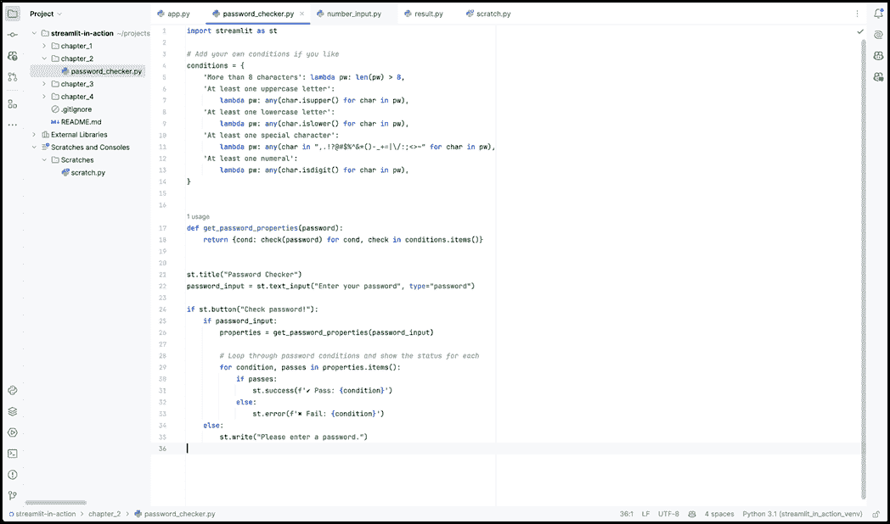
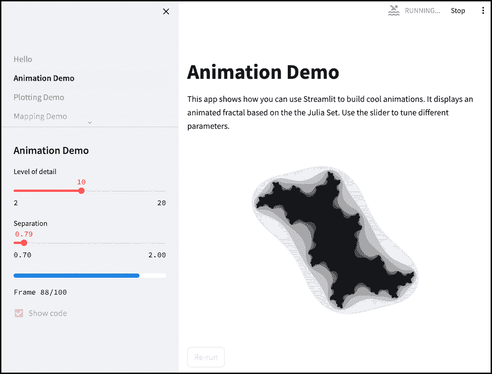
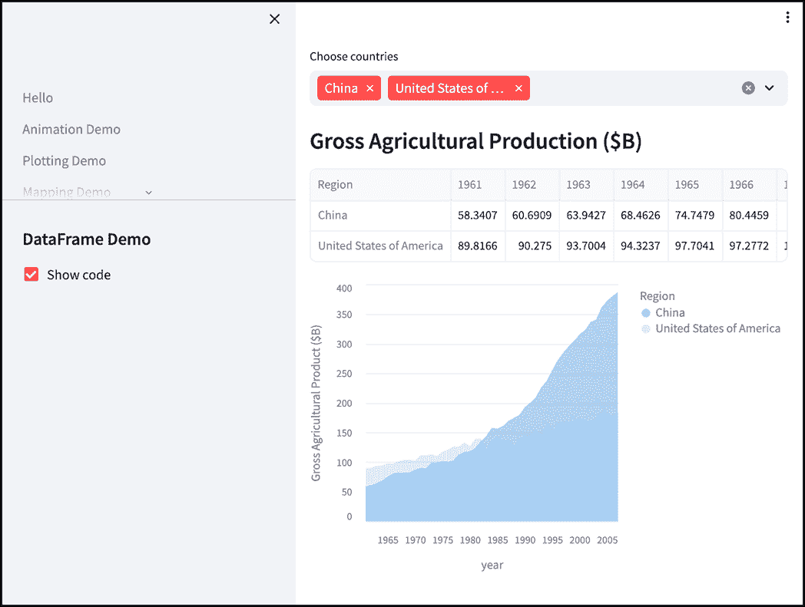
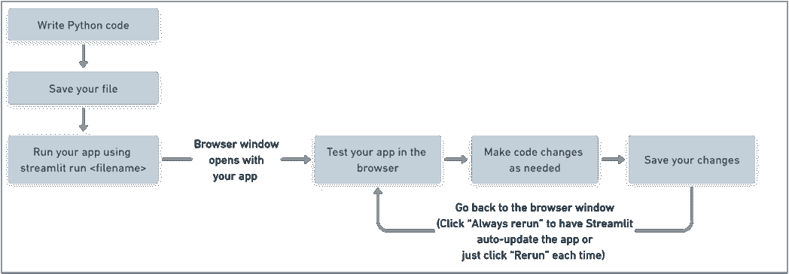
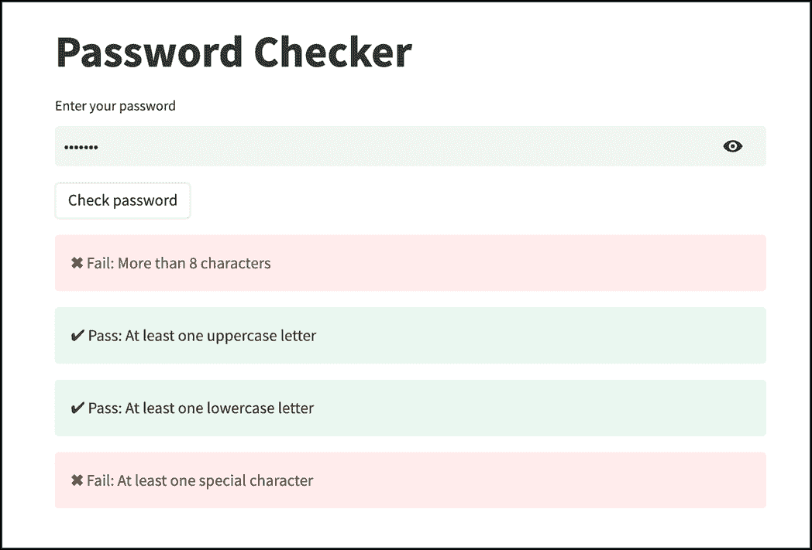
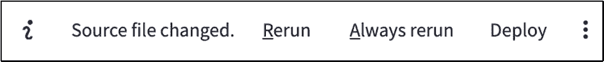
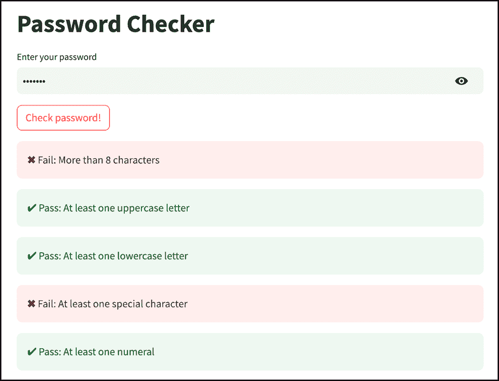
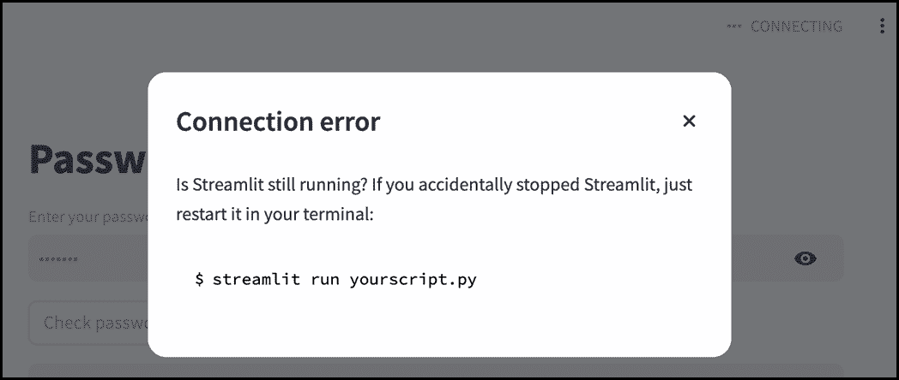

# 第二章：2 开始使用 Streamlit

### 本章涵盖

+   设置你的开发环境

+   Streamlit 的开发工作流程

+   构建和运行你的第一个 Streamlit 应用程序

欢迎来到第二章。这里是真正的挑战！在本章结束时，你将能够与你的第一个 Streamlit 应用程序进行交互！

本书不仅关于教你 Streamlit；还确保你能够高效地使用 Streamlit，并且为在现实世界中开发应用程序做好准备。因此，在我们开始编写代码之前，我们将花一些时间来设置你的开发环境。具体来说，我们将讨论你在设置过程中需要考虑的三件事：使用 Git 进行版本控制、代码编辑工具和虚拟环境。

然后，我们将检查你在使用 Streamlit 编码时将遵循的工作流程，这样你就可以在本书构建应用程序时知道期待什么。解决了这个问题之后，我将一步一步地引导你实际创建你的第一个应用程序，一个密码检查器。

激动了吗？让我们深入探讨吧！

## 2.1 将 Streamlit 设置为运行状态

首先！在你能够构建任何应用程序之前，你需要安装并准备好 Streamlit。这涉及两个步骤：

+   安装正确的 Python 版本（3.8 及以上），以及 `pip`（一个与 Python 一起提供的工具，可以轻松安装 Python 包）

+   使用 `pip` 安装 Streamlit（剧透：输入 `pip install streamlit`）

对于详细的安装指南，请参阅本书附录 A。

## 2.2 设置你的开发环境

你使用的工具以及你设置的应用程序编码环境的方式在很大程度上是个人偏好的问题。然而，随着时间的推移，这些问题可能会对你的开发效率产生不成比例的影响，因此花时间考虑这些问题是值得的。

在本节中，我将简要讨论你开发环境的一些重要方面，特别是版本控制、你的编辑工具和虚拟环境。

如果你是一位经验丰富的 Python 开发者并且已经有一个让你感到舒适的设置，那么请直接跳转到安装 Streamlit 的部分。

### 2.2.1 使用 Git 进行版本控制

如果你从未在专业环境中编写过代码，那么你之前可能没有使用过像 Git 这样的版本控制系统，或者可能并不完全理解它是用来做什么的。

*版本控制* 是一种结构化的方式，用于跟踪、管理、记录和实验性地对程序进行更改。把它想象成你代码的时间机器。

Git 是目前最受欢迎的版本控制系统，因此在本书中，我们将互换使用 *Git* 和 *版本控制* 这两个术语。

在开发应用程序的过程中，你可能会改变主意，决定以不同的方式设计某些内容。在这些情况下，Git 允许你“回到过去”，查看你的代码 *曾经* 是什么样子，并从那个点应用更改。

你还可以在测试多个设计选项的同时，对代码的不同版本进行实验，并使用 Git 轻松地在它们之间切换。也许 Git 最让我喜欢的一点是，它允许你记录代码的更改，为你提供了一个解释你为什么决定以某种方式做事的地方。相信我——六个月后，当你阅读自己的代码并试图理解它时，你会感谢自己的。

当你在处理大型项目或与他人协作时，所有这些情况都非常常见。即使目前这对你来说不适用，我也强烈建议你学习和将 Git 纳入你的开发工作流程，因为其提供的益处太多，不容忽视。

如果我已经向你展示了版本控制的益处，请查看第五章中名为“Git 快速入门”的部分，快速了解基础知识。它被设计为一个独立的章节，所以如果你愿意，你现在可以前往那里，完成后再回来。如果你（可以理解地）急于开始使用 Streamlit，请继续阅读。

### 2.2.2 代码编辑器

Streamlit 应用程序，就像所有 Python 脚本一样，只是文本文件，所以你实际上只需要一个简单的文本编辑器（比如 Windows 中的记事本）来编写代码。

然而，使用高级代码编辑器或 *集成开发环境*（IDE）可以使你更加高效——提供诸如语法高亮、易于调试的工具和代码导航等功能，因此很难不推荐使用。

有许多工具可以满足这一需求，但我想在这里提及两个最受欢迎的工具。

#### PyCharm

PyCharm 是由 JetBrains 公司开发的一个专为 Python 定制的多功能 IDE。它提供了开箱即用的全面支持，例如代码补全、错误检测、快速修复建议等。

如果你寻求在安装时直接获得高级功能，而不必过多地调整，PyCharm 是一个很好的选择。专业版需要付费，但 PyCharm 有一个免费的社区版，你可以在 [`www.jetbrains.com/pycharm/download`](https://www.jetbrains.com/pycharm/download) 获取（确保你滚动到“Community Edition”部分）。



##### 图 2.1 PyCharm Community Edition 的项目编辑窗口

#### Visual Studio Code

Visual Studio Code（简称 VS Code）是由微软维护的一个非常流行的代码编辑器。它支持多种语言。

VS Code 提供了一些基本功能，如语法高亮，但其真正的优势在于其插件生态系统，它可以扩展其功能。确实，有了正确的插件组合，你可以让 VS Code 做到 PyCharm 专业版（付费版本）几乎能做的一切。

由于 VS Code 完全免费，对于不介意花时间设置一切的学习者来说，这是一个有吸引力的提议。

注意：由于这两个（以及许多其他，如 Sublime Text 和 Notepad++）都是可行的代码编辑工具，我不会假设你使用的是任何特定的一个。只要你有可以输入命令的终端和一个可以编辑文本文件的程序，根据本书的要求，你就已经准备好了。

### 2.2.3 虚拟环境

你在工作的绝大多数实际 Python 项目中都将需要依赖各种库。这些库会不断更新，发布新版本，增加或删除功能，或修改现有功能。

随着你经验的积累和更复杂应用的创建，你经常会发现更新一个项目的库会导致另一个项目崩溃或导致不可预测的错误和冲突。

虚拟环境是解决这种困境的一种方法。虚拟环境由一个独立的 Python 实例和一组库及依赖项组成。你开始每个项目时都应该有一个自己的虚拟环境。这样，你可以修改任何项目的依赖项，而不会影响其他项目。

即使你刚开始学习并且还没有遇到依赖管理问题，熟悉虚拟环境也是一个很好的主意。目前有几种不同复杂程度的虚拟环境相关库和工具可供选择：你可能会遇到 `venv`、`pipenv`、`pyenv`、`poetry` 以及其他。

我们将在第十三章中更详细地讨论虚拟环境，同时探讨如何分发你的代码。

## 2.3 首次运行 Streamlit

这就是乐趣的开始！在本节中，我们将首次运行 Streamlit 应用程序，并亲自看看你可以用 Streamlit 做出什么。

如果你还没有安装，请转到附录 A 并确保你已经安装了 Streamlit。

如果你已经有了，请打开一个终端窗口，让我们开始吧！

我们将要运行的应用程序是 Streamlit 预先构建的 *hello* 应用程序。要在终端中查看其运行效果，请输入 `streamlit hello`。

这应该在终端上显示一些输出，你现在可以忽略它，几秒钟后，它会打开你的网络浏览器以显示实际的应用程序。

*hello* 应用通过演示各种功能展示了 Streamlit 的能力：动画、图形绘图、地图和表格。

图 2.2 展示了一个这样的示例：由数学可视化构建的动画。你可以使用左侧的侧边栏导航到其他示例。



##### 图 2.2 来自 streamlit hello 的动画示例

图 2.3 展示了一个与 Pandas 数据框相关的更实用的示例。我们将在本书的后续章节中深入了解这些内容。



##### 图 2.3 来自 streamlit hello 的 DataFrame 示例

希望查看这些示例能激发你的灵感！

侧边栏还有一个“显示代码”复选框，正如你可能想象的那样，它会在应用程序本身下方显示每个应用程序的源代码。在每种情况下，你会发现代码并不特别冗长。

显然，您现在不必理解所有这些是如何完成的，但希望您能对 Streamlit 能实现的功能有所欣赏。

## 2.4 Streamlit 开发工作流程

编写 Streamlit 应用程序——或者任何类型的编程——是一个迭代的过程，您编写一些代码，测试它是否工作，然后重复。如果您以前从未编写过图形应用程序，您可能会好奇这个过程看起来是什么样子。

图 2.4 描述了您很快就会习惯的开发工作流程。



##### 图 2.4 Streamlit 开发工作流程

让我们一步步来：

1.  **编写您的 Python 代码：** 在您的代码编辑器中的 Python 文件中创建应用程序的第一个草稿。这可以非常基础，也可以非常详细，根据您的喜好而定。有些人喜欢一开始就运行应用程序，以便在塑造它并可视化每一步的变化时，他们的第一个草稿可能只是一个带有标题的空应用程序。

1.  我个人觉得这很分散注意力，因为如果我一开始就看到它，我可能会倾向于花时间调整应用程序的外观。相反，我更喜欢在第一次运行之前先编写一个大致完整的应用程序版本。但这完全是个人的偏好。

1.  **保存您的文件：** 这应该是不言而喻的。像通常一样保存您的 Python 文件，使用`.py`扩展名。

1.  **使用** `streamlit run <filename>` **运行您的应用程序：** 在您的终端中运行此命令，并用您文件的路径替换`<filename>`。

1.  这将打开一个浏览器窗口，显示您的应用程序，正如您在运行*hello*应用程序时所看到的那样。

1.  **在浏览器中测试您的应用程序：** 与您的应用程序进行交互。通过输入值、点击按钮等方式进行操作，并查看输出是否符合您的预期。

1.  **根据需要修改代码：** 根据您的测试，回到您的 Python 代码并对其进行编辑。

1.  **保存您的更改：** 再次，不言而喻。

1.  切换回您的浏览器窗口：请记住，您不需要重新运行`streamlit run <filename>`来查看应用程序中的更改。

1.  **您在这里有两个选择：** 如果您希望 Streamlit 自动重新运行您的应用程序以应用更改，您可以在应用程序中点击“始终重新运行”。否则，您仍然可以每次都点击“重新运行”。

1.  重复步骤 4-7

您将在本书的整个过程中多次经历这些步骤，很快就会变得习以为常。但理论就到这里吧，让我们将其付诸实践！

## 2.5 构建您的第一个应用程序

在本节中，我们将构建我们的第一个应用程序！为此，我首先会介绍应用程序背后的概念，并概述逻辑流程。

接下来，我将逐步向您展示完整应用程序的代码，解释其每个部分。最后，我们将运行该应用程序并对其进行修改。

在我们深入之前，有一句话要提醒你：如果你在过程中积极参与，不断尝试和实验，你的学习体验将会更加丰富。保持好奇心，不要害怕在文本之外做出改变！你经常会发现，那些你记忆最深刻的部分，是你主动探索和理解的部分。

说到这里，是时候让我们动手实践了！

### 2.5.1 密码检查器

你可能访问过那些要求密码满足大量条件的网站，比如至少包含一个小写字母、一个特殊字符、偶数个下划线、最多两个来自《白雪公主》的矮人名字等等。

我们将要创建的应用程序允许用户输入他们正在考虑的密码，并显示哪些条件通过，哪些条件失败。

### 2.5.2 逻辑流程

图 2.5 展示了我们的应用程序逻辑的流程。

它从用户在输入文本框中输入密码并点击按钮开始检查过程。

在内部，应用维护一个要检查的条件列表（在代码中实际上是字典）以存储在内存中。我们遍历这个列表，根据输入的密码是否满足条件，将每个条件分类为“通过”或“失败”，并生成一个新的结果列表（或字典）。

接下来，我们遍历结果，在屏幕上显示结果。每个条件都由一个框表示，如果通过则显示绿色，如果失败则显示红色。


##### 图 2.5 我们密码检查器应用的逻辑流程

### 2.5.3 遍历代码

到现在为止，你 hopefully 应该已经清楚地理解了我们想要实现的逻辑，所以让我们直接跳进去开始构建吧！

要开始，请访问这本书的 GitHub 页面，将列表 2.1 中的代码复制到一个新文件中，并保存它。

##### 列表 2.1 我们密码检查器应用的代码

```py
import streamlit as st

# Add your own conditions if you like
conditions = {
    'More than 8 characters': lambda pw: len(pw) > 8,
    'At least one uppercase letter':
        lambda pw: any(char.isupper() for char in pw),
    'At least one lowercase letter':
        lambda pw: any(char.islower() for char in pw),
    'At least one special character':
        lambda pw: any(char in ",.!?@#$%^&*()-_+=|\/:;<>~" for char in pw),
}

def get_password_properties(password):
    return {cond: check(password) for cond, check in conditions.items()}

st.title("Password Checker")
password_input = st.text_input("Enter your password", type="password")

if st.button("Check password!"):
    if password_input:
        properties = get_password_properties(password_input)

        # Loop through password conditions and show the status for each
        for condition, passes in properties.items():
            if passes:
                st.success(f'✔ Pass: {condition}')
            else:
                st.error(f'✖ Fail: {condition}')
    else:
        st.write("Please enter a password.")

```

让我们逐部分分析：

我们的第一行导入 Streamlit 本身（你需要在每个应用程序中这样做），并注明我们稍后会将它称为 `st`：

```py
import streamlit as st
```

你实际上可以使用任何你喜欢的，但 `st` 的约定非常广泛，所以你经常会听到人们将 Streamlit 元素称为 `st.< whatever>`。

我们使用以下块来定义我们想要检查的条件：

```py
# Add your own conditions if you like
conditions = {
    'More than 8 characters': lambda pw: len(pw) > 8,
    'At least one uppercase letter':
        lambda pw: any(char.isupper() for char in pw),
    'At least one lowercase letter':
        lambda pw: any(char.islower() for char in pw),
    'At least one special character':
        lambda pw: any(char in ",.!?@#$%^&*()-_+=|\/:;<>~" for char in pw),
}
```

我们这样做是通过创建一个 Python 字典，其中键是条件本身，值是我们将用来检查该条件的相应函数。

在这种情况下，函数是 *lambdas* 或匿名内联函数。Lambda 是一种在 Python 中定义短的单行函数的好方法，而不必费心给它命名。每个函数接受一个参数——密码，`pw`——如果满足相应的条件，则返回 true 的布尔值，否则返回 false。

第一个 lambda 函数简单地检查密码长度是否超过 8 个字符。在其他的每个 lambda 函数中，我们遍历 `pw` 中的字符并对其应用测试（例如，`char.isupper()`，`char.islower()` 等）。

要评估上述定义的所有密码条件，我们将运行以下函数：

```py
def get_password_properties(password):
    return {cond: check(password) for cond, check in conditions.items()}

```

它返回一个新的 Python 字典，其中键是条件，值是对应于我们上面定义的每个条件的 lambda 函数的运行结果。

我们在这里使用的语法在 Python 中称为 *字典推导*，它是从一些输入创建新字典的简写。

接下来是我们第一个实际的 Streamlit 元素。它是一个简单的 `title` 元素：

```py
st.title("Password Checker")
```

它会做你预期的事情，即以大号字体显示传递的文本作为标题。

我们使用以下行向用户显示密码输入框：

```py
password_input = st.text_input("Enter your password", type="password")

```

Streamlit 的实现还提供了一个切换选项来显示/隐藏输入的文本。当用户输入一些文本时，它被保存在 `password_input` 变量中。

`st.button` 是 Streamlit 中最简单的元素之一，你将经常使用它。不出所料，在这里它显示了一个带有文本“检查密码”的按钮：

```py
if st.button("Check password"):
```

注意，这位于一个 `if` 子句中。当点击按钮时，会评估 `if` 内部嵌套的任何代码（见下文）。这个例子中有些有趣的细微差别，我们将在第四章中深入探讨。

一旦点击按钮，我们的应用程序会检查 `password_input` 是否有非空值，即用户是否实际上输入了密码。如果他们已经输入，它将调用 `get_password_properties` 来评估我们定义的条件：

```py
if password_input:
        properties = get_password_properties(password_input)

        # Loop through password conditions and show the status for each
        for condition, passes in properties.items():
            if passes:
                st.success(f'✔ Pass: {condition}')
            else:
                st.error(f'✖ Fail: {condition}')

```

然后，它遍历返回的字典，其中每个键是一个条件，相应的值是一个布尔值，指示条件是否通过。

如果条件通过，我们使用另一个 Streamlit 元素 `st.success` 来指示这一点，如果没有通过，我们使用 `st.error` 来显示它失败了。

`st.success` 和 `st.error` 都是带有一些语义样式的文本容器（即，`st.success` 主要是一个绿色的框，而 `st.error` 是红色的）。

这个 `else` 与之前的 `password_input` 相对应：

```py
else:
        st.write("Please enter a password.")
```

这里，我们使用另一个 Streamlit 元素，即通用的 `st.write`，来要求用户输入密码。

### 2.5.4 运行应用程序

要运行应用程序，在你的终端中，导航到你保存文件的目录，并输入以下内容：

```py
streamlit run <filename>
```

例如，如果你将你的代码保存在名为 `password_checker.py` 的文件中，你将输入以下内容：

```py
streamlit run password_checker.py
```

正如你在之前运行 `streamlit hello` 时所看到的，这将在你的终端窗口中显示一些输出，并打开你的网络浏览器，在那里你可以看到应用程序。

随意输入各种密码并在这个应用程序中玩玩！如果一切按计划进行，当你点击“检查密码”时，你应该会看到类似于图 2.6 的内容。



##### 图 2.6 我们的密码检查应用程序

不要关闭这个页面，因为我们很快就会看到当你更改代码时会发生什么。

在此之前，让我们将注意力转向终端输出：

```py
  You can now view your Streamlit app in your browser.

  Local URL: http://localhost:8503
  Network URL: http://192.168.50.68:8503

```

注意它说“本地 URL: http://localhost:8503”。

这是 Streamlit 告诉你，在你的电脑上有一个 Streamlit *服务器*正在运行（这就是`localhost`的意思）在端口 8503 上。你看到的输出中的端口可能不同，比如 8501；这是完全可以接受的。

我们将在第三章中更详细地探讨这是如何工作的，但就目前而言，你需要记住的是，你也可以通过访问输出中指定的“本地 URL”来访问你的应用。

如果你的网络上有其他电脑，`网络 URL`是那些其他机器可以使用来访问你的应用。

不要关闭终端窗口或取消它！

##### 注意

在某些情况下，你可能发现当你输入 `streamlit run` 时，浏览器窗口没有自动打开，或者浏览器窗口打开了但页面是空的。如果你遇到这种情况，这里有一些你可以尝试的方法：

1.  在你的浏览器中，手动输入终端输出中“本地 URL”下列出的地址，例如，`http://localhost:8503`

1.  确保你正在运行浏览器最新版本。

1.  在另一个浏览器中导航到 `http://localhost:8503`。我发现 Google Chrome 通常问题最少。

### 2.5.5 修改应用

现在我们知道我们的应用可以工作，让我们尝试对其进行修改。例如，假设我们想要添加一个检查，以确保输入的密码至少包含一个数字。

你可以通过向我们的 `conditions` 字典中添加一个新的条件来实现这一点：

##### 列表 2.2 添加新条件

```py
# Add your own conditions if you like
conditions = {
    'More than 8 characters': lambda pw: len(pw) > 8,
    'At least one uppercase letter':
        lambda pw: any(char.isupper() for char in pw),
    'At least one lowercase letter':
        lambda pw: any(char.islower() for char in pw),
    'At least one special character':
        lambda pw: any(char in ",.!?@#$%^&*()-_+=|\/:;<>~" for char in pw),
 'At least one numeral':
 lambda pw: any(char.isdigit() for char in pw),
}

```

我们的按钮听起来不够兴奋，所以让我们也在文本中添加一个感叹号：

```py
if st.button("Check password!"):
```

保存你的文件后，回到你打开应用的浏览器窗口。在右上角你应该会看到一个消息通知你源文件已更改（见图 1.5），以及“重新运行”或“始终重新运行”的选项。



##### 图 2.7 Streamlit 在源代码更改时在你的应用上显示消息

这是因为 Streamlit 会监控你的应用文件，以查看是否有对其所做的任何更改。点击“重新运行”以使用最新代码重新运行你的应用。

你会看到我们的按钮现在说“检查密码！”带有感叹号，如果你输入一个密码并点击它，你会看到我们添加的新数字测试。这个更新后的视图如图 2.8 所示。



##### 图 2.8 带有我们新添加更改的密码检查器应用

你也可以选择“始终重新运行”，这意味着每次你更改代码时，Streamlit 都会自动更新你的应用。这使得开发体验更加流畅，你可以在编辑代码后立即切换到浏览器，查看它产生了什么效果。

如果你想要禁用这种行为（有时当它开启时，在页面上很难发现变化），你可以点击右上角的汉堡菜单，进入“设置”并取消勾选“保存时运行”。

### 2.5.6 杀死和重启服务器

在所有这些过程中，请记住你一直保持终端窗口（你在这里输入`streamlit run …`的地方）开启。这个窗口是运行“服务”你的应用的 Streamlit 服务器的地方。

一旦你玩够了应用，你可能想要关闭服务器，以免它消耗资源。

要做到这一点，现在就去终端窗口，要么关闭它，要么按“Ctrl+C”。

如果你现在回到你的打开的浏览器窗口，你会发现你不能再与你的应用交互了。按钮被禁用，右上角显示“连接中”，并且如图 2.9 所示，出现连接错误。



##### 图 2.9 当你关闭 Streamlit 服务器时，前端应用无法运行

你可以通过再次运行`streamlit run <filename>`来使你的应用复活，这将重启你的服务器并重新建立前端与重新启动的服务器之间的连接。

这将打开一个新的浏览器窗口，其中包含你应用的*不同*实例。你会发现旧窗口现在也活跃起来，因为它能够重新建立与服务器的连接。

## 2.6 总结

+   Streamlit 需要 Python 3.8 或更高版本才能运行。

+   Git 是一种版本控制工具，它帮助你跟踪和管理代码的变更。

+   高级代码编辑器如 VS Code 和 IDE 如 PyCharm 通过语法高亮、调试工具、代码导航、自动完成等功能，使你更加高效。

+   虚拟环境允许你隔离你工作的每个项目的库和依赖。

+   你可以通过`streamlit run <file_name>`来运行 Streamlit 应用，这将打开一个包含你的应用的网页浏览器窗口。

+   你可以设置 Streamlit 在源代码变更时始终重新运行你的应用，以获得无缝的开发体验。
