# 第六章：6 适合 CEO 的仪表板

### 本章涵盖

+   构建一个交互式指标仪表板

+   使用 Pandas 库处理数据

+   缓存函数结果以改进 Streamlit 应用程序性能

+   在仪表板中创建过滤器、面板和其他小部件

+   使用 Plotly 开发数据可视化和图表

你是否曾想过大公司的高管是如何保持对所经营业务的掌控？想象一下像亚马逊、3M 或谷歌这样的公司提供的成千上万的产品和服务复杂性。一个人如何理解这一切？他们如何知道他们的业务是否达到预期，以及哪些领域需要他们的关注？

在管理良好的公司中，答案——或者部分答案——是指标。高管们依赖精心挑选的一套指标，即那些能给他们提供公司业绩高级概述的数字。指标帮助领导者做出明智的决策，在问题成为大问题之前识别潜在问题，并确定公司可以改进或创新的领域。

但仅仅有指标是不够的——它们需要以清晰、易于理解的方式呈现。这就是仪表板发挥作用的地方。一个好的仪表板允许用户探索各种数据切片，将原始数据转化为故事，突出重点，并帮助领导者专注于大局。

在本章中，我们将开发一个为 CEO 设计的仪表板，用于监控其业务的绩效关键指标（KPIs）。到本章结束时，你不仅将知道如何使用 Streamlit 构建一个强大、交互式的指标仪表板，还将了解如何以赋予决策者关注真正重要事情的方式呈现数据。

## 6.1 一个指标仪表板

Note n' Nib Inc.，这个大家最喜欢的虚构在线办公用品购物网站，正在发生变革！创始人兼首席执行官已经退休，去伊维萨岛享受他的百万财富，而他的继任者，一个来自硅谷的数据狂热大佬，为公司制定了宏伟的计划。

在他的第一次员工会议上，他询问销售副总裁在哪里可以查看最新的销售数字，而副总裁从他的手提箱里掏出一个*纸质*报告，那是两个月前的。他的热情受到了一点打击。

“我们不是有一个仪表板来跟踪每日销售数据吗？”CEO 问道，担心着答案。他的担忧在副总裁低声提到前任 CEO 拥有一种神奇的*直觉*，他经常依赖这种直觉来做决策——毕竟，纸笔是商业的核心。

一小时后，销售副总裁召唤你，部门中的新星（也是他处理不想亲自处理的事情的首选），并要求你为他老板构建“那些带有折线图的精美指标页面”。

你知道工程部门正忙于对网站进行大规模改造，所以你不想把这件事推给他们。幸运的是，你一直在尝试这个酷炫的新 Python 框架 Streamlit，你迫不及待想在工作中使用它。

### 6.1.1 陈述概念

副总裁没有给你太多可以工作的内容，但你已经在公司待了足够长的时间，对老板想要什么有了一个相当好的了解。一如既往，让我们先明确这一点：

##### 概念

一个仪表板，让高管能够查看销售数据的各种切割，并跟踪关键指标以做出决策。

### 6.1.2 定义需求

我们需要将概念转化为具体的需求。具体来说，需要扩展“销售数据”、“各种切割”和“关键指标”这些短语。

#### 探索数据

你设法让工程部门从他们的系统中导出你认为与你的项目相关的关键数据字段到逗号分隔值（CSV）文件中。你可以从本书的 GitHub 仓库中下载此文件（文件名为`sales_data.csv`，位于`chapter_6`目录中）。

下载后，在 Microsoft Excel 或 macOS 上的 Numbers 等电子表格程序中打开它，并检查前几行（如图 6.1 所示）

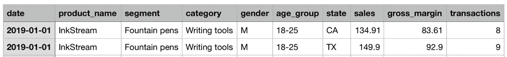

##### 图 6.1 我们将工作的 CSV 数据的头两行

数据代表了 Note n' Nib 销售的各种产品的销售额，按各种*维度*如细分市场和类别进行细分。它还包含了关于购买这些产品的顾客的人口统计信息——具体来说，包括他们的性别和年龄组，以及他们来自哪个州。该文件包含从 2019 年 1 月到 2024 年 8 月的数据，并包含*度量*，如销售额（Note n' Nib 创造了多少收入）、毛利率（销售额中有多少是利润，考虑到成本），以及每行覆盖的交易数量。

例如，这是我们对第一行的解释：2019 年 1 月 1 日，来自加利福尼亚州的 18-25 岁男性购买 Inkstream 钢笔（归类为“书写工具”）在 Note n' Nib 网站上进行了 8 笔交易，为公司带来了 134.91 美元的销售额，扣除成本后剩余 83.91 美元。

这里的*主键*（唯一标识一行的列集）是`date`、`product_name`、`segment`、`category`、`gender`、`age_group`和`state`的组合。

与首席执行官交谈后，你还确定他主要关心以下数字：**总销售额**、**毛利率**、**利润率**和**平均交易价值**。我们将在本章后面详细讨论这些数字的计算方法，但这些都是我们概念中提到的“关键指标”。

首席执行官希望能够看到这些数字在不同**产品**、**类别**、**年龄组**、**性别**和**州**之间的差异——即从概念中得出的“各种切割”，以及随时间的变化。

你也思考了数据应该如何表示，最终提出了一组初步的需求。

#### 需求

用户应该能够：

+   汇总查看 Note n' Nib 上销售产品的总销售额、毛利率、利润率和平均交易价值

+   查看这些数字在不同年份、产品、类别、年龄组、性别和州之间的差异

+   通过这些维度筛选数据以探索数据的横截面

+   可视化指标随时间的变化趋势和分解，按每个维度分解

您希望快速交付仪表板的初始版本，而不被额外的功能请求所困扰，因此您也清楚地定义了范围之外的内容。

#### 范围之外的内容

在首次发布时，仪表板将*不*支持：

+   深入数据以查看特定行

+   预测任何指标的未来的值

+   提供关于指标随时间变化原因的解释

其中一些可以是仪表板的未来扩展，但到目前为止，我们将尝试将其功能限制在*观察*数据，而不是积极*分析*或*预测*数据。

### 6.1.3 可视化用户体验

在第三章中我们探索的应用程序开发流程的下一步是可视化用户体验。从需求来看，四个关键指标至关重要，因此我们应该突出显示它们，理想情况下以这种方式吸引用户的注意力。需求还提到了基于我们讨论的维度和切割来筛选数据。似乎合理地包括一个用户可以执行此操作的面板。

一图胜千言，因此我们希望提供清晰的数据可视化；需求中指出的趋势和分解可以通过*时间序列图表*实现，这些图表显示了数字随时间的变化，以及*饼图*，它告诉您总量如何分解为其组成部分。

图 6.2 展示了基于上述内容设计的模拟界面。

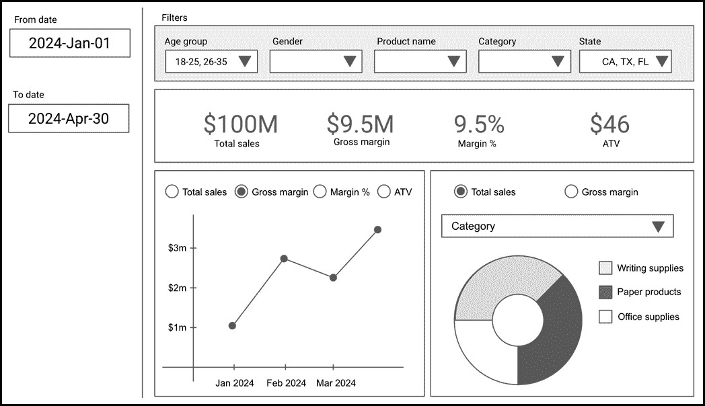

##### 图 6.2 仪表板的 UI 模拟

如您所见，此设计包含了我们讨论的所有内容：四个关键指标以大号字体展示，其值对应于由顶部筛选器和左侧日期范围选择器控制的数据切片。

有一个折线图显示了任何选定的指标随时间的变化，以及一个饼图，它根据选定的维度（如产品类别）分解总销售额或毛利润。

### 6.1.4 头脑风暴实现方案

在实际编写代码之前，让我们从高层次上绘制仪表板中逻辑和数据流的流程。图 6.3 显示了我们可能选择的一种结构方式。

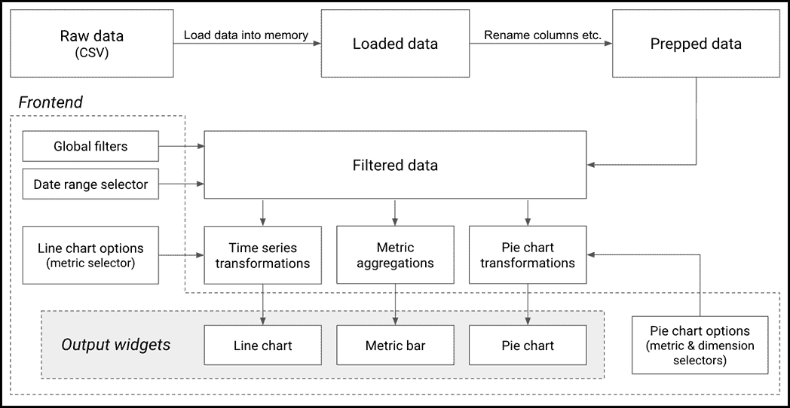

##### 图 6.3 仪表板中的逻辑和数据流

第一步是从我们的 CSV 文件中读取原始数据并将其加载到内存中。我们可能想要进行一些基本的数据“准备”或“清理”，例如为了方便而重命名列。

在图 6.2 中的模拟用户界面中，顶部的过滤器栏和侧边的日期范围选择器旨在是*全局的*，即它们影响仪表板中的所有小部件。因此，在将数据传递到仪表板的其它部分之前，我们应该先应用过滤器并选择所需的范围。

在仪表板中，我们将以某种形式显示数据的三个部分：包含总体指标值的指标栏、随时间变化的折线图和饼图。为了获取显示在每个部分中的内容，我们需要对过滤后的数据进行*转换*，这意味着我们需要对其进行分组、聚合以及其他*转换*。

线形图和饼图有额外的选项（你需要在两个图表中选择一个指标来显示，并在饼图中选择一个细分维度——例如产品类别或性别），这些选项将作为我们将要应用的转换的输入。

这应该为你提供了一个概述，我们将在本章的其余部分实现的设计。如果你对其中的一些部分还不是非常清楚，不要担心；我们即将更详细地探索每个部分。 

## 6.2 加载数据

在任何展示或可视化数据的程序中，第一步涉及从某个来源获取数据。有时这个来源是用户输入的信息，但通常它是一个外部来源，如数据库或文件。我们将在后面的章节中讨论如何连接到数据库，但现在我们将使用我们之前审查过的 CSV 文件。

在本节中，我们将介绍如何从外部文件加载数据到您的应用程序中，将其保存在内存中，并在 Streamlit 中显示它。在这个过程中，我们将介绍 Pandas，这是数据操作的典范 Python 库。我们还将讨论当需要加载数据非常大时，如何通过缓存来提高应用程序的性能。

### 6.2.1 Pandas 库

在第一章中，我提到了 Pandas，将其描述为处理表格数据的流行库。实际上，Pandas 已经成为数据生态系统中不可或缺的一部分，很难想象在没有它（或类似的东西）的情况下用 Python 处理数据（无论如何）。

#### 安装 Pandas

你可以像安装任何其他 Python 库一样安装 Pandas：使用`pip`。现在输入以下命令来设置它：

```py
pip install pandas
```

一旦运行完成，通过运行`pip show pandas`来验证一切设置正确，它应该显示有关库的一些信息。

#### 在 Pandas 中探索我们的销售数据

Pandas 围绕数据框的概念，这是一个类似于电子表格中表格的二维、表格式数据结构。它由行和列组成，其中每一列都包含特定类型的数据（例如整数、浮点数、字符串）。数据框允许高效的数据操作和分析，使它们成为处理结构化数据的通用工具。

要查看数据框的实际应用，让我们将我们的销售数据 CSV 文件加载到 Pandas 数据框中。

导航到您下载 `sales_data.csv` 的本地目录，打开 Python 命令行并输入以下命令：

```py
>>> import pandas as pd
>>> df = pd.read_csv('sales_data.csv')

```

`import pandas as pd` 是一个常规的 Python 导入语句。习惯上，我们将 Pandas 模块称为 `pd`（就像我们使用 `st` 一样用于 Streamlit）。

```py
>>> df = pd.read_csv('sales_data.csv')
```

这是我们实际加载 CSV 文件的地方。Pandas 使用 `read_csv` 方法使这一过程变得非常简单。`read_csv` 实际上有很多参数可以传递给它（例如，文件是否包含标题，要使用的列名和类型等），但由于所有这些都有合理的默认值，你也可以只传递文件的路径，而无需其他任何内容。

在这里，我们有一个变量 `df`，它包含一个 Pandas 数据框。

让我们使用 Python 内置的 `type` 函数来验证这一点，该函数返回特定变量所持有的对象的类型：

```py
>>> type(df)
<class 'pandas.core.frame.DataFrame'>
```

我们还可以使用数据框的 `info()` 方法获取更多关于数据框的信息：

```py
>>> df.info()
<class 'pandas.core.frame.DataFrame'>
RangeIndex: 1035000 entries, 0 to 1034999
Data columns (total 10 columns):
 #   Column        Non-Null Count    Dtype
---  ------        --------------    -----
 0   date          1035000 non-null  object
 1   product_name  1035000 non-null  object
 2   segment       1035000 non-null  object
 3   category      1035000 non-null  object
 4   gender        1035000 non-null  object
 5   age_group     1035000 non-null  object
 6   state         1035000 non-null  object
 7   sales         1035000 non-null  float64
 8   gross_margin  1035000 non-null  float64
 9   transactions  1035000 non-null  float64
dtypes: float64(3), object(7)
memory usage: 79.0+ MB

```

这告诉我们很多信息。数据框有超过一百万行，编号从 0 到 1034999。它有十个列，前七个是 `object` 类型（基本上是字符串）和最后三个是 `float64`（或浮点数）。

##### 注意

这些名称可能对你来说很困惑，因为它们不是你可能习惯的常规 Python 类型（如 str、float 等）。这是因为 Pandas 使用其自己的数据类型（或 dtypes），这些类型是从一个名为 `numpy` 的相关 Python 库派生出来的，用于高效计算。

你还可以选择让 Pandas 使用 Apache Arrow 格式，这对于大型数据集可能更高效。为此，在读取 CSV 时，添加一个 `dtype_backend` 参数，如下所示：

```py
pd.read_csv('sales_data.csv', dtype_backend='pyarrow')
```

如果你这样做，你会注意到 .info() 显示的数据类型是 `string[pyarrow]` 和 `double[pyarrow]`，而不是 `object` 和 `float64`。

让我们来看看数据框中的一些内容。由于我们在这页上没有足够的空间打印所有列，我们首先选择其中的一部分：

```py
>>> only_some_cols = df[['date', 'product_name', 'segment', 'state']]
```

你可以通过对另一个数据框执行某些操作来创建一个新的 Pandas 数据框。这里发生的事情本质上就是这样。当我们使用 Pandas 的用户友好方括号表示法（`df[<列名列表>]`）将列列表传递给数据框时，我们得到一个新的只包含我们传递的列的数据框，然后我们可以将其分配给另一个变量（在这种情况下为 `only_some_cols`）。

最后，为了查看前几行，我们在较小的数据框上使用 `.head()` 方法，这显示了前五行中的值。

```py
>>> only_some_cols.head()
         date product_name        segment state
0  2019-01-01    InkStream  Fountain pens    CA
1  2019-01-01    InkStream  Fountain pens    TX
2  2019-01-01    InkStream  Fountain pens    FL
3  2019-01-01    InkStream  Fountain pens    UT
4  2019-01-01    InkStream  Fountain pens    RI
```

我们将在学习过程中了解更多 Pandas 的知识，所以现在我们先停下来，回到构建我们的仪表板。

### 6.2.2 读取和显示数据框

我们的仪表板应用程序将比我们之前编写的一些应用程序涉及更多的代码，所以将其分散到多个模块或 `.py` 文件中是个好主意。

#### 从正确的文件路径加载数据

我们将从一个专门的 Python 脚本文件开始，用于从我们的 CSV 中读取数据。将 `sales_data.csv` 复制到你打算存放代码文件的文件夹中，然后创建 `data_loader.py` 并包含列表 6.1 中的内容。

##### 列表 6.1 data_loader.py

```py
import pandas as pd
from pathlib import Path

BASE_DIR = Path(__file__).resolve().parent
SALES_DATA_PATH = BASE_DIR / "sales_data.csv"

def load_data():
  return pd.read_csv(SALES_DATA_PATH)

```

`load_data` 函数简单地使用 Pandas 读取 CSV，就像我们在上一节中看到的那样，但这里似乎还有更多的事情发生。我们是如何填充 `SALES_DATA_PATH` 变量的？既然 `data_loader.py` 与 `sales_data.csv` 在同一目录中，为什么我们不能直接将其设置为 `"sales_data.csv"` 呢？

这里的问题是，Python 中的文件路径被认为是相对于**你执行脚本的当前工作目录**的，而不是当前执行行的文件所在的目录。

例如，如果你目前位于 `'/Users/alice/'`，你的 `.py` 文件和 CSV 文件在 `'/Users/alice/streamlit_project/'` 文件夹中，而你编写 `pd.read_csv('sales_data.csv')`，Python 将寻找 `'/Users/alice/sales_data.csv'` 的路径，这个路径是不存在的。

你可以将 CSV 的绝对路径硬编码为 `'/Users/alice/streamlit_project/sales_data.csv'` 并传递它，但显然这会在你的应用程序部署到不同的计算机上时产生问题，因为文件不会在那个确切的路径中。

不，我们需要的是一个可以引用当前 `.py` 文件并相对于该文件的路径构造路径的方法。

这就是顶部附近的两行所做的事情：

```py
BASE_DIR = Path(__file__).resolve().parent
SALES_DATA_PATH = BASE_DIR / "sales_data.csv"
```

`__file__` 是 Python 中一个特殊的变量，它包含当前正在执行的文件的路径。

`Path` 是 `pathlib` 模块（Python 内置）中的一个类，它允许你以用户友好的、面向对象的方式处理文件路径。`Path(__file__)` 创建了一个与当前 Python 脚本 `data_loader.py` 对应的 Path 对象，`.resolve()` 动态生成 `data_loader.py` 的绝对路径（无论它是在你的本地机器上还是在生产部署中）。然后 `.parent` 指的是 `data_loader.py` 所在的目录。

最后，我们使用 `'/'` 操作符与 `Path` 对象一起工作（在这个上下文中**不是**数学上的除法操作符）来生成我们 CSV 文件的最终路径，存储在 `SALES_DATA_PATH` 中。

值得注意的是，`SALES_DATA_PATH` 不是一个字符串，它仍然是一个 `Path` 对象。幸运的是，Pandas 的 `read_csv` 知道如何处理这些，所以我们可以直接将其传递给该函数。

#### 使用 st.write 显示数据框

现在我们来使用我们在 Streamlit 应用中刚刚创建的 `load_data` 函数。创建一个名为 `dashboard.py` 的应用程序入口点（我们将使用 `streamlit run` 命令的文件），如列表 6.2 所示。

##### 列表 6.2 dashboard.py

```py
import streamlit as st
from data_loader import load_data

data = load_data()
st.write(data.head(5))

```

这部分相当直接。`data` 是一个 Pandas 数据框，包含来自我们 CSV 的数据（因为这就是 `load_data` 返回的内容）。

最后这一行，`st.write(data.head(5))`很有趣。我们之前在第二章中简要接触过`st.write`。Streamlit 的文档将`st.write`描述为“Streamlit 命令的瑞士军刀”，这相当准确。

你基本上可以将任何类型的对象传递给`st.write`，并且它会以优雅和合理的方式显示传递的对象。这意味着你可以传递一个字符串，它会在屏幕上写入该字符串，但你也可以传递一个字典，并以良好的格式打印出字典的内容（试试看！）你甚至可以传递内部 Python 对象，如类或函数，并且它会显示有关它们的信息。

`st.write`在我们的用途中工作得很好，因为我们可以向它传递一个 Pandas 数据框，它会在屏幕上显示数据。`data.head(5)`返回一个只包含数据前 5 行的数据框，使用`st.write`来检查数据是否正确加载，如图 6.4 所示——这是执行`streamlit run dashboard.py`时你会得到的结果。

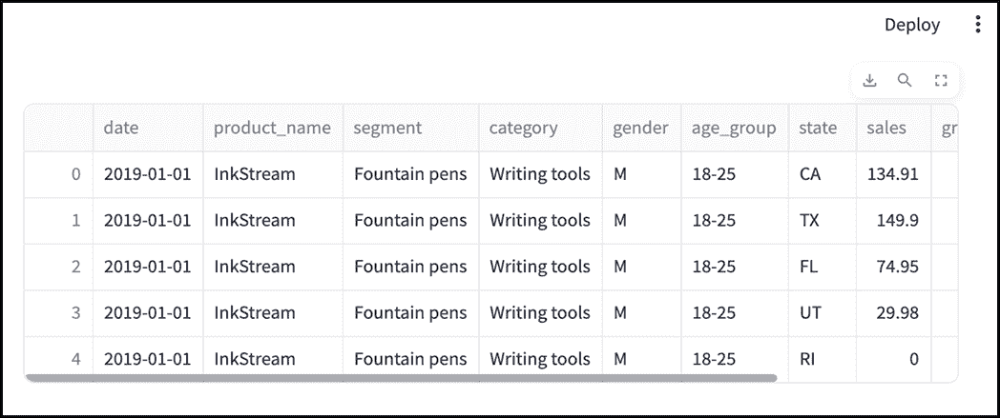

##### 图 6.4 Streamlit 可以原生显示 Pandas 数据框

你可能会注意到应用程序加载需要几秒钟。这是因为我们的 CSV 文件相当大（超过 90 兆字节），读取它需要一段时间。乍一看，这可能不算什么大问题，但请再次记住，Streamlit 每次屏幕上需要改变时都会重新运行你的**整个**脚本。

这意味着每次用户更改选择或从文本框中点击出来时，你的应用程序都会重新读取 CSV 文件，这会减慢整个应用程序的速度。除了非常浪费之外，这还会降低仪表板的用户体验，所以让我们接下来解决这个问题。

### 6.2.3 缓存数据

Streamlit 执行模型的一个影响是，如果没有干预，像读取文件或执行复杂计算这样的昂贵操作会反复执行以获得相同的结果。这对于我们正在构建的数据应用程序来说可能是个问题，因为它们经常依赖于这样的操作。

在前面的章节中，我们看到了一种处理问题的方法：我们可以将数据保存到`st.session_state`中。这样，数据就只需要在每个用户会话中读取一次，应用程序在用户交互期间就不会变慢。

这是一种**不错的**解决方案，但它没有解决几个问题：

+   数据仍然需要在每次网页刷新时加载。如果用户在多个标签页中打开仪表板——考虑到平均每个人在任何时候打开的浏览器标签页数量，他们很可能这么做——每次加载都会花费一些时间。

+   即使数据完全相同，仪表板也必须为**每个**用户重新读取数据。

Streamlit 提供了一种更好的方法来处理这种情况，即`st.cache_data`。

#### st.cache_data

`st.cache_data` 是 Streamlit 缓存或存储慢速函数调用结果的方式，以便下次以相同的参数调用该函数时，它可以直接查找上次调用的存储结果，而不是再次执行该函数。

对于我们的用例，我们可以简单地缓存我们之前编写的 `load_data` 函数的结果。Streamlit 将存储它返回的 Pandas 数据框，并且随后的应用程序重新运行或甚至页面刷新都不会再次执行该函数。

`st.cache_data` 使用了与迄今为止我们所见的 Streamlit 元素不同的 Python 构造：它是一个 *装饰器*，你可以将其视为一种可以接受一个函数或类并为其添加一些新功能，而无需重新编写函数或类的东西。

要在 `load_data` 函数（在 `data_loader.py` 中）上应用 `st.cache_data`，只需在其上方写 `@st.cache_data`，如下所示：

```py
@st.cache_data
def load_data():
  return pd.read_csv(SALES_DATA_PATH)
```

在这里，`st.cache_data` 正在 *装饰* `load_data` 函数，通过缓存功能将其转换，以便再次调用时，它将返回之前的缓存结果，而不是再次执行其逻辑。

由于我们现在在 `data_loader.py` 中引用了 Streamlit 元素，因此我们还需要在顶部包含 Streamlit 的导入：

```py
import streamlit as st
```

如果你现在运行应用程序，你将短暂地看到一个带有文本 "正在运行 `load_data().`" 的旋转图标（见图 6.5），然后你的数据框才会显示出来，但如果你重新加载页面，你的数据现在应该可以立即加载。


##### 图 6.5 默认情况下，st.cache_data 在实际运行函数时显示一个带有函数名的旋转图标

看起来缓存正在工作！不过这里有一个问题：当数据发生变化时会发生什么？CEO 想要一个包含 *最新* 销售数据的仪表板，因此我们可以假设源数据会定期变化——至少每天，甚至更频繁。在我们的例子中，让我们假设工程部门每天都会用包含新数据的版本覆盖现有的 CSV 文件。

如果数据以我们设置的方式缓存，Streamlit 不会在 CSV 更改时拉取更新的 CSV。它只会看到 `load_data` 的返回值是从第一次运行（可能是几天前）缓存的，并使用那个结果。

我们需要一种方法来设置缓存的 *过期日期*，本质上告诉它，如果缓存的数据超过某个阈值，则函数需要实际执行并重新缓存结果。

我们使用 `st.cache_data` 的 `ttl` 参数来实现这一点。`ttl` 代表 "存活时间"，它设置了缓存数据在 Streamlit 重新执行函数之前有效的时长。

如果我们假设我们的 CSV 数据每天都会变化，我们可以将 `ttl` 设置为 1 天，如下所示：

```py
@st.cache_data(ttl="1d")
```

这样，当用户每天运行应用程序时，加载的数据将每天被拉取一次。这次运行可能需要一段时间，但接下来的 24 小时内所有后续的运行都将使用新缓存的数据库，因此运行速度快。

图 6.6 说明了这是如何工作的。

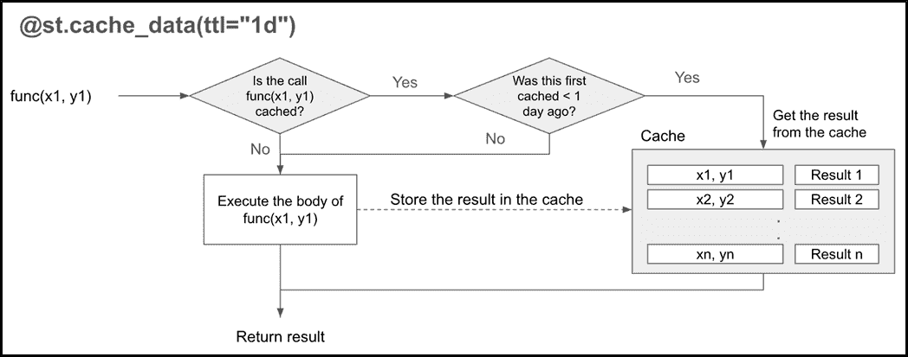

##### 图 6.6 st.cache_data 的工作原理

我们可能还想改变与旋转图标一起显示的消息。名称`load_data`是我们代码内部的，我们不希望它暴露给用户。我们可以使用`st.cache_data`的`show_spinner`参数来更改此消息，使我们的代码变为：

```py
@st.cache_data(show_spinner="Reading sales data...", ttl="1d")
def load_data():
  return pd.read_csv(SALES_DATA_PATH)
```

再次运行应用程序，你会注意到加载指示器已更改为图 6.7。


##### 图 6.7 在 st.cache_data 中设置 show_spinner 参数，当数据正在加载时显示一个用户友好的消息

有价值的是意识到，当用户运行应用程序并且数据被缓存时，缓存值对所有应用程序的用户都可用，而不仅仅是当前用户。有时这可能会导致意外结果（我们可能在后面的章节中遇到一些），但在这个案例中，因为我们想向所有用户显示相同的数据，所以这是一种理想的行为。

在数据加载并可在我们的应用中使用后，让我们继续构建仪表板本身。

## 6.3 准备和过滤数据

我们仪表板需要满足的一个关键要求是能够检查数据的各种*切片*，而不是其整体。这是非常合理的；我们的源数据跨越了 5 年以上。今天的用户可能对最近一年的数据更感兴趣，而不是旧年的数据。同样，用户可能只对与“纸制品”类别相关的销售感兴趣。

*过滤*数据表是只考虑我们关心的数据行，并排除其他所有内容的行为。我们设想中的仪表板有两个区域可以实现这一点：一个*过滤器面板*，用户可以选择他们想要考虑的每个字段的值，以及一个*日期范围选择器*。

在本节中，我们将可视化构建这两个组件，并执行使它们功能化的 Pandas 数据处理。

### 6.3.1 创建过滤器面板

让我们重新审视我们的 UI 原型，重点关注顶部显示的过滤器面板，如图 6.8 所示。

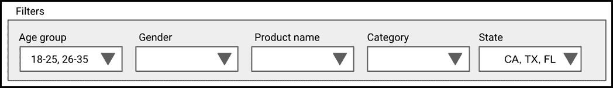

##### 图 6.8 我们 UI 原型中的过滤器面板

该面板基本上是每个我们想要筛选的字段的下拉菜单的集合。

每个菜单可能包含对应于每个字段的唯一值作为选项，用户可以选择多个选项（例如，在图 6.8 中，“州”过滤器选择了 CA、TX 和 FL）。此外，用户可以选择不选择*任何*选项（例如，图 6.8 中的“性别”），我们可能将此视为该字段没有筛选。

图 6.8 中显示的选择应将数据缩减到对应于 CA、TX 或 FL 的 18-25 岁和 26-35 岁年龄段的客户行。由于没有对“产品名称”进行筛选，数据应包括 Note n' Nib 销售的所有产品。

#### 获取字段唯一值的列表

显然，我们需要一种方法在创建下拉菜单时填充选项。一个可能的方法可能是为每个字段硬编码可能的值列表，但这会带来一些明显的问题：每次有新产品或类别，或者我们分组年龄的方式改变，或者有其他许多原因时，我们都需要更改我们的代码。

一个更好的方法是动态地从数据 *本身* 获取选项列表。开始一个新的 Python 文件，命名为 `data_wrangling.py`，并添加一个函数来完成此操作，如列表 6.3 所示。

##### 列表 6.3 data_wrangling.py

```py
def get_unique_values(df, column):
  return list(df[column].unique())

```

`get_unique_values` 函数接受一个 Pandas 数据框 `df` 和一个列名 `column`。它返回数据框中该列的唯一值列表。

当你在 Pandas 数据框中传递一个列名（称为 *列选择* 操作）并用方括号括起来时，你会得到一个 Pandas *序列*，这是一个类似于一维数组的对象（你可以将其视为单列数据框）。

例如，`df['age_group']` 会返回一个与 `df` 中行数相同数量的元素序列，每个元素对应于一行中的 `age_group`。

在它上面调用 `.unique()` 会去重元素，并给你一个新的序列，其中只包含数据中的五个或六个不同的年龄组。我们最终使用 `list` 函数将其转换为常规 Python 列表。

#### 使用 st.multiselect 添加下拉菜单

正如我们所见，用户应该能够选择每个过滤器中任何选项的组合。Streamlit 通过 `st.multiselect` 提供此功能，这与我们之前遇到的 `st.selectbox` 非常相似。与 `st.selectbox` 的情况一样，传递给 `st.multiselect` 的前两个参数（唯一必需的参数）是标签和选项列表。

例如，你可以编写 `st.multiselect('Color', ['blue', 'green', 'red'])` 来显示一个标记为 "Color" 的下拉菜单，你可以从中选择一个或多个颜色。

按照我们将代码分散到几个模块的方法，我们将创建一个新的模块用于过滤器面板，并将其命名为 `filter_panel.py`。

列表 6.4 显示了 `filter_panel.py` 的起始草稿。

##### 列表 6.4 dashboard.py

```py
import streamlit as st
from data_wrangling import get_unique_values

filter_dims = ["age_group", "gender", "category", "segment",
               "product_name", "state"]

def filter_panel(df):
  with st.expander("Filters"):
    filter_cols = st.columns(len(filter_dims))
    for idx, dim in enumerate(filter_dims):
      with filter_cols[idx]:
        unique_vals = get_unique_values(df, dim)
        st.multiselect(dim, unique_vals)
```

`filter_dims` 包含我们想要过滤的数据框中的字段列表。

`filter_panel` 函数实际上是显示下拉菜单的部分。它接受一个数据框作为输入，并使用每个字段的唯一值来渲染下拉菜单。

到目前为止，一些代码应该看起来很熟悉。我们希望并排显示下拉菜单，因此我们使用 `st.columns(len(filter_dims))` 来创建我们想要过滤的字段数那么多显示列。

对于每个字段，我们使用来自 `data_wrangling.py` 的 `get_unique_values` 函数获取唯一值，并使用它们来填充下拉菜单：

```py
with filter_cols[idx]:
    unique_vals = get_unique_values(df, dim)
    st.multiselect(dim, unique_vals)
```

列表 6.4 还展示了使用一个新的 Streamlit 小部件 `st.expander`，它是一个可折叠的框，用户可以根据需要展开或收缩。这很有意义，因为用户可能不想总是看到筛选器。隐藏它们的选项是个好主意，这样他们就可以专注于实际显示的数据。

让我们在 `dashboard.py` 中编辑主仪表板，包括 `filter_panel`：

```py
...
from filter_panel import filter_panel

data = load_data()
filter_panel(data)
st.write(data.head(5))

```

这应该会产生图 6.9 中的输出。


##### 图 6.9 默认情况下，我们的 Streamlit 应用布局是居中的，如果水平显示的内容很多，这可能会成问题

我们可以立即看到的一个问题是，有六个筛选字段时，每个单独的筛选器似乎都挤压在其邻居旁边。

此外，当前筛选字段的名称是来自 CSV 的原始列名，包括下划线。一个更精致的设计会展示为用户友好的标签，例如“年龄组”，而不是像“age_group”这样的技术标识符。

#### 解决宽度问题

注意图 6.9 中筛选面板两侧有很多未使用的空白空间。默认情况下，Streamlit 应用有一个“居中”布局，其中应用的主体在窗口中心水平渲染，两侧是空白。

这通常没问题，但鉴于我们正在构建的 UI 如此密集，屏幕空间变得非常宝贵。幸运的是，Streamlit 允许我们改变这一点，并使用更多的屏幕空间。我们可以通过在 `dashboard.py` 中使用 `st.set_page_config` 方法来实现这一点。

```py
st.set_page_config(layout='wide')
```

重要的是，这只有在它是应用程序中执行的第一个 Streamlit 命令时才有效，所以请确保它在 `dashboard.py` 的顶部，紧随导入之后。

#### 显示字段的用户友好标签

为了将原始字段名称替换为标签，我们可以在字典中保留原始名称及其相关标签之间的映射，并在需要显示字段名称时查找标签。但这听起来相当繁琐，所以让我们直接将数据框中的字段重命名为用户友好的名称。

很可能需要对数据进行一系列类似的“清理”修改。我们将把这些修改打包成一个名为 `prep_data` 的函数，放在 `data_wrangling.py` 文件中：

```py
...
from data_loader import load_data   #A

...
def clean_column_names(df):
  df.columns = df.columns.str.replace('_', ' ').str.capitalize()
  return df

@st.cache_data(show_spinner="Reading sales data...", ttl="1d")    #B
def prep_data():
  return clean_column_names(load_data())
```

#A 不要忘记从其他模块导入我们需要的函数

#B 将 st.cache_data 装饰器移动到 prep_data 而不是 load_data 上

这里我们定义了一个名为 `clean_column_names` 的函数，该函数将数据框中每个列名中的下划线替换为空格，并将其大写。`df.columns` 返回数据框的列名，`.str.replace()` 和 `.str.capitalize()` 是相应的字符串操作。我们使用 `.str` 将替换和大小写操作一次性应用于 `df.columns` 中的每个元素，这在 Pandas 中会经常看到。

目前，`prep_data`函数内部调用`load_data`，然后简单地返回对返回的数据帧应用`clean_column_names`的结果，但我们将稍后添加更多逻辑。

我们还将`st.cache_data`装饰器移动到`prep_data`函数中（从`data_loader.py`中的`load_data`中移除），因为`prep_data`应该包含我们对数据进行的基本操作。在此之后，Streamlit 将仅在准备数据后缓存结果，而不是在加载数据后立即缓存。

为了闭合循环，在`dashboard.py`中，将`data = load_data()`行替换为`data = prep_data()`。

最后，在`filter_panel.py`中，修改`filter_dims`以使用新抛光的字段名称：

```py
filter_dims = ["Age group", "Gender", "Category", "Segment",
               "Product name", "State"]
```

保存并重新运行以查看图 6.10 中所示的结果

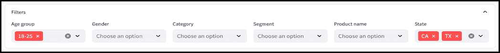

##### 图 6.10 带有用户友好字段名称和宽布局的过滤器面板

仪表板现在使用屏幕的全宽，我们正在使用标签作为过滤器。

##### 注意

由于本章代码量较大，且打印页面上可用的空间有限，因此在这里提供代码片段时，我们将主要关注特定文件中代码的*变化*，而不是像前几章那样重新生成整个文件。然而，在任何时候，如果您遇到困难并希望将您的代码与该点应具有的代码进行比较，您可以在本书的 GitHub 仓库（github.com/aneevdavis/streamlit-in-action）中查看代码的完整进度快照，在 chapter_6 文件夹下。例如，您应该比较的代码文件目前在 in_progress_4 目录中。

#### 应用过滤器到数据

到目前为止，我们已经创建了与过滤器对应的 UI 元素，但实际上还没有将它们应用到数据上。

为了做到这一点，让我们首先考虑我们应该如何表示从过滤器面板获得的输出。为了能够应用过滤器，我们需要查找用户在每个维度上选择的过滤器值。这是一个使用字典的好用例，其中每个字段名称作为键，所选选项列表作为键的值。

我们当前的`filter_panel`函数（来自`filter_panel.py`）只是简单地显示过滤器栏，但我们希望修改它，使其实际上返回一个我们可以用于进一步处理的字典。

```py
def filter_panel(df):
  filters = {}
  with st.expander("Filters"):
    filter_cols = st.columns(len(filter_dims))
    for idx, dim in enumerate(filter_dims):
      with filter_cols[idx]:
        unique_vals = get_unique_values(df, dim)
        filters[dim] = st.multiselect(dim, unique_vals)
  return filters

```

虽然我们之前没有利用这一点，但`st.multiselec`实际上返回了用户在 UI 中选择的选项列表。正如突出显示的行所示，我们现在使用`dim`（字段名称）作为键，将此返回值存储在`filters`字典中，并在最后返回过滤器。

接下来，我们需要使用字典来生成用户想要的数据切片。由于这涉及到数据操作操作，让我们将此功能放在`data_wrangling.py`中，在名为`apply_filters`的函数中。

```py
def apply_filters(df, filters):
  for col, values in filters.items():
    if values:
      df = df[df[col].isin(values)]
  return df

```

`apply_filters` 接受 `df`（一个 Pandas 数据框）和 `filter_panel` 返回的过滤器字典。它遍历过滤器中的每个键值对，并通过使用语句迭代修改数据框：

```py
df = df[df[col].isin(values)]

```

这值得稍微分解一下。在 Pandas 中，方括号非常灵活。当你将列名传递给数据框变量后面的方括号（如 `df['Age group']`）时，它返回一个 Pandas 系列如我们所见。

如果相反，你传递一个 Pandas 布尔系列（每个项目都是布尔值的系列），它将匹配系列编号元素与数据框的有序行，只返回对应布尔值为 `True` 的行。这被称为 *布尔索引*。

你可以在上面的行中看到这两种用法：

`df[col]` 进行列选择，在 df 中选择要过滤的列 col。

`.isin(values)` 对列执行逐元素操作，检查列中的每个值是否存在于用户选择的下拉选项列表 `values` 中。这返回另一个包含 `True`/`False` 值的系列，对应于 `df[col]` 中的每个项目。这是一个 *向量化* 计算的例子，这是 Pandas 性能的主要原因。

最后，我们使用前一步获得的布尔系列进行布尔索引，生成一个新的过滤后的数据框并将其分配给 df。

实际上，每次执行时，行 `df = df[df[col].isin(values)]` 都会过滤数据框，只包含当前查看的列包含用户选择的值的行。

`if values` 部分确保了如果用户没有为某个字段选择任何值，我们不会进行过滤，从而正确地实现了我们的要求。

要看到这个动作，请对 `dashboard.py` 进行必要的修改：

```py
...
from data_wrangling import apply_filters, prep_data
...

data = prep_data()
filters = filter_panel(data)    #A

main_df = apply_filters(data, filters)
st.write(main_df.head(5))
```

#A 我们现在将 filter_panel(data) 返回的字典放入一个变量中

我们现在正在捕获过滤器字典，使用 `apply_filters` 创建一个新的数据框 `main_df`，并显示该数据框而不是数据。这应该会给我们带来图 6.11 的结果。

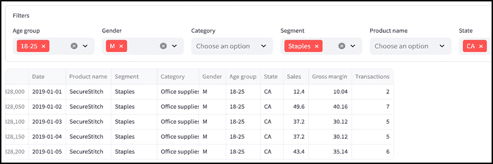

##### 图 6.11 过滤面板中的选择正确地过滤了显示的行（有关完整代码的快照，请参阅 GitHub 上的 chapter_6/in_progress_5）。

如你所见，显示的数据框只显示与过滤面板中用户选择对应的行（18-25, M, Staples, CA）。

还有另一种类型的过滤器需要应用：日期范围！让我们接下来处理这个问题。

### 6.3.2 创建日期范围选择器

与往常一样，Streamlit 提供了一种简单的方法来允许用户选择日期范围。按照其典型的直观命名方式，我们想要的部件被称为 `st.date_input`。

`st.date_input` 接受一个标签、默认值、最小值和最大值等。用户可以选择单个日期或日期范围。

例如，为了允许用户选择一个默认为今天的单日日期：

```py
date = st.date_input("Select a date", value=datetime.date.today())
```

为了在默认的开始和结束日期之间启用日期范围选择：

```py
range = st.date_input("Select a date range", value=(datetime.date(2023, 1, 1),
datetime.date(2023, 12, 31)))

```

我们将日期范围选择器放在一个名为 `date_range_panel.py` 的新文件中，如列表 6.5 所示。

##### 列表 6.5 date_range_panel.py

```py
import streamlit as st
from datetime import date, timedelta

# Hardcode this to the last date in dataset to ensure reproducibility
LATEST_DATE = date.fromisoformat("2024-08-31")
THIRTY_DAYS_AGO = LATEST_DATE - timedelta(days=30)

def date_range_panel():
  start = st.date_input("Start date", value=THIRTY_DAYS_AGO)
  end = st.date_input("End date", value=LATEST_DATE)
  return start, end

```

`date_range_panel` 函数显示两个日期选择器小部件——一个用于范围的开始，一个用于结束——并返回用户选择的日期。我们选择在这里使用两个单独的单日输入而不是单个范围输入，以防止在尚未选择范围的结束日期时出现临时错误。

对于默认日期范围值，我们显示了一个月前的开始日期和今天的结束日期，使用变量 `THIRTY_DAYS_AGO` 和 `LATEST_DATE`。由于我们处理的是一个静态数据集，我们将 `LATEST_DATE` 硬编码为 CSV 中可用的特定日期。如果我们处理的是实时或定期更新的数据，我们将用 `LATEST_DATE = date.today()` 替换它。`THIRTY_DAYS_AGO` 是通过从 `LATEST_DATE` 中减去 30 天，使用 `datetime` 模块中的 `timedelta` 类获得的。

`LATEST_DATE` 和 `THIRTY_DAYS_AGO` 的值是来自内置 `datetime` 模块的 `date` 类型。`st.date_input` 理解这种类型，甚至返回它。因此，`date_range_panel` 返回的 `start` 和 `end` 变量也都是 `date` 类型。

实际上，让我们现在利用这些值通过编辑 `data_wrangling.py` 来使用它们：

```py
import pandas as pd
import streamlit as st
...

@st.cache_data(show_spinner="Reading sales data...", ttl="1d")
def prep_data() -> pd.DataFrame:
  df = clean_column_names(load_data())
  df['Day'] = pd.to_datetime(df['Date'])
  return df

def get_data_within_date_range(df, start, end):
  if start is not None and end is not None:
    dt_start, dt_end = pd.to_datetime(start), pd.to_datetime(end)
    return df[(df['Day'] >= dt_start) & (df['Day'] <= dt_end)]
  return df

def get_filtered_data_within_date_range(df, start, end, filters):
  df_within_range = get_data_within_date_range(df.copy(), start, end)
  return apply_filters(df_within_range, filters)

```

我们在这里做了一些更改：

除了清理列名之外，`prep_data` 还添加了一个名为 'Day' 的新列，它是将 `pd.to_datetime()` 应用到现有的 'Date' 列的结果。回想一下，'Date' 列目前是一个不透明的 "object" 类型。`pd.to_datetime()` 将其转换为 `datetime[ns]` 类型，这可以通过 Pandas 进行优化。

我们在 `get_filtered_data_within_date_range` 函数中包装了对 `apply_filters` 的调用，该函数首先接受日期范围的开始和结束日期，并使用它们来调用 `get_data_within_date_range`。

`get_data_within_date_range` 是实际在我们的 dataframe 上应用日期范围过滤器的函数。该函数的第一行执行日期格式转换：

```py
dt_start, dt_end = pd.to_datetime(start), pd.to_datetime(end)

```

这是因为 Pandas 使用 `datetime[ns]` 类型来表示日期。这与 `start` 和 `end` 所在的 Python 的 `date` 类型不同，并且在 dataframe 操作中更有效。

```py
return df[(df['Day'] >= dt_start) & (df['Day'] <= dt_end)]

```

这又是布尔索引，类似于我们在 `apply_filters` 函数中遇到的，但我们使用两个条件（`df['Day'] >= dt_start and df['Day'] <= dt_end`）的组合来过滤 dataframe，并用 `&` 连接它们，这是 Pandas 的元素级逻辑 `AND` 运算符。

我们还需要再次更新 dashboard.py：

```py
import streamlit as st
from data_wrangling import get_filtered_data_within_date_range, prep_data
from filter_panel import filter_panel
from date_range_panel import date_range_panel

st.set_page_config(layout='wide')

with st.sidebar:
 start, end = date_range_panel()

data = prep_data()
filters = filter_panel(data)

main_df = get_filtered_data_within_date_range(data, start, end, filters)
st.write(main_df.head(5))

```

我们将日期范围面板放置在侧边栏中（你现在应该非常熟悉了）。

由于 `apply_data` 现在包含在 `get_filtered_data_within_date_range` 中，我们将这个包装函数的结果赋值给 `main_df`。

图 6.12 显示了我们的新日期范围面板。

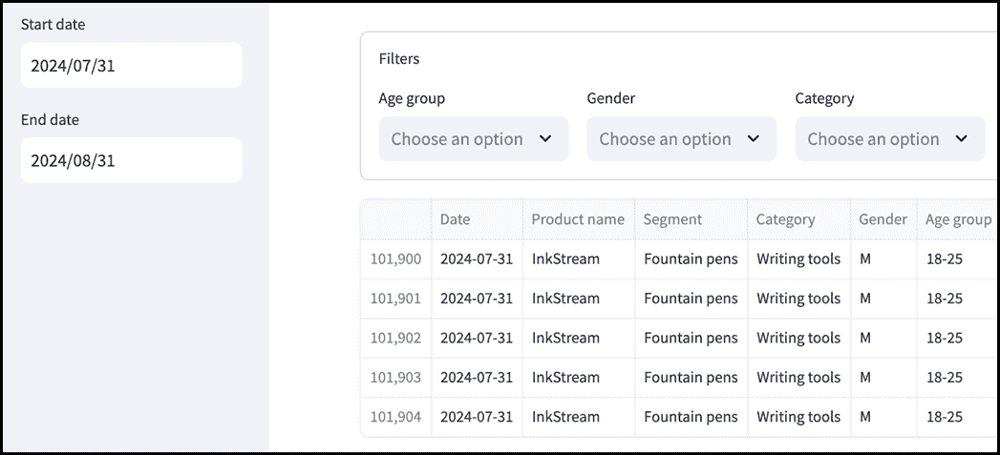

##### 图 6.12 显示在侧边栏中的日期范围输入（在 GitHub 仓库的 chapter_6/in_progress_6 中查看完整的代码快照）

我们的仪表板正在慢慢成形！然而，目前对 CEO 来说并不太有用，因为它没有显示任何总结信息或指标。接下来就是这些内容！

## 6.4 计算和显示指标

想象你正在经营一家企业。你怎么知道它是否繁荣或挣扎，它是否即将飞涨或崩溃？

一个明显的答案是你应该查看公司赚了多少钱以及它赚取的利润总额。你可能还想知道你的收入增长的速度。如果你是《鲨鱼坦克》中 Mr. Wonderful 的粉丝，你可能还会关注一些更专业的数字，比如获取一个客户需要花费你多少钱。

所有这些数字都被称为*指标*。指标是有用的，因为它们可以帮助你将一个庞大业务（或任何项目，实际上）的所有复杂性简化为几个数字。如果一个积极的指标（如利润）正在上升，或者一个消极的指标（如成本）正在下降，这意味着事情进展顺利。如果情况相反，可能需要做出一些改变。

在本节中，我们将计算并显示 Note n' Nib 的 CEO 关心的指标。为此，我们首先了解这些指标的含义以及如何计算它们。然后，我们将设置一种可扩展的方式来定义仪表板使用的新指标，并在仪表板中突出显示它们。

### 6.4.1 计算指标

回到我们的需求，我们有四个我们关心的指标：*总销售额*、*毛利率*、*利润率*和*平均交易价值*。

让我们尝试通过我们的数据来理解这些。回想一下，我们的源 CSV 文件为每个日期、产品（及其相关的细分和类别）、性别、年龄组和州组合创建一行。对于每一行，它给我们三个数值字段：*销售额*、*毛利率*和*交易*。

交易是指购买一定数量商品的单一购买，而“交易”这个数字指的是一行中代表它们的数量。销售额很容易理解：它是 Note n' Nib 从这些交易中收集到的美元金额。毛利率是指利润，即销售额减去公司为获取所售商品而支付的成本。

基于此，让我们弄清楚如何计算我们 CSV 文件中任何给定部分的指标：

+   **总销售额**仅仅是销售额列的总和。

+   同样，**毛利率**是毛利率列的总和。

+   **利润率**是将毛利率表示为总销售额的百分比，因此它被计算为总销售额除以毛利率乘以 100。

+   **平均交易价值**是指 Note n' Nib 每次交易赚取的金额，因此我们可以将其计算为总销售额除以交易列的总和。

让我们考虑一个快速示例来阐明这一点。假设您有以下行：

```py
| Date       | Product      | State |  Sales | Gross Margin | Transactions |
|------------|--------------|-------|--------|--------------|--------------|
| 2024-01-01 | Fountain Pen | CA    |    500 |          200 |           10 |
| 2024-01-01 | Notebook     | TX    |    300 |          120 |            5 |
| 2024-01-01 | Pencil       | NY    |    200 |           80 |            8 |

```

+   *总销售额* 是 $500 + $300 + $200 = $1000

+   *毛利润* 是 $200 + $120 + $80 = $400

+   *利润率百分比* 是 $400 / $1000 = 0.4 = 40%

+   *平均交易价值* 是 $1000 / (10 + 5 + 8) = $1000 / 23 = $43.48

### 6.4.2 设置指标配置

在软件开发中，您会遇到的一个反复出现的主题是，保持设计合理地 *通用* 是一个好主意。通过这种方式，我的意思是，如果您在以非常具体的方式（例如硬编码值列表）和以灵活的方式（从配置文件中填充列表）编写代码之间有选择，那么通常更好的做法是后者。

更通用的设计使您的代码更容易适应未来的变化，并且更容易维护。我们在第三章开发单位转换应用程序时看到了这一点，在那里我们选择使用配置文件而不是直接在我们的代码中放置转换系数。

这正是我们将要在我们的仪表板上设置指标的方式——定义一个配置文件，该文件定义了如何计算它们。

正如我们在第三章中所做的那样，我们将首先创建一个数据类——`Metric`——来保存我们想要配置的对象。让我们将其放入一个名为 `metric.py` 的新文件中（参见列表 6.6）。

##### 列表 6.6 metric.py

```py
from dataclasses import dataclass
@dataclass
class Metric:
  title: str
  func: callable
  type: str
```

`Metric` 类包含一个标题，这是我们将在界面上显示的标签，以及一个类型，它指示应该如何格式化（例如，类型为 "dollars" 将指示我们的应用程序在数字前加上一个 '$' 符号）。

它还有一个名为 `func` 的成员，显然是一个 *可调用对象*。可调用对象本质上只是函数，而 `func` 的意图是作为一个函数，它接受一个 Pandas 数据框对象并计算指标值。

为了真正理解这一点，让我们看看 `Metric` 类的对象是如何在我们的配置文件 `metric_config.py` 中定义的，如列表 6.7 所示。

##### 列表 6.7 metric_config.py

```py
from metric import Metric

def margin_percent(df):
  total_sales = df["Sales"].sum()
  return df["Gross margin"].sum() / total_sales if total_sales > 0 else 0

def average_transaction_value(df):
  total_sales = df["Sales"].sum()
  return total_sales / df["Transactions"].sum() if total_sales > 0 else 0

metrics = {
  "Total sales": Metric(
    title="Total sales",
    func=lambda df: df["Sales"].sum(),
    type="dollars"
  ),
  "Gross margin": Metric(
    title="Gross margin",
    func=lambda df: df["Gross margin"].sum(),
    type="dollars"
  ),
  "Margin %": Metric(
    title="Margin %",
    func=margin_percent,
    type="percent"
  ),
  "ATV": Metric(
    title="Average transaction value",
    func=average_transaction_value,
    type="dollars"
  )
}

display_metrics = ["Total sales", "Gross margin", "Margin %", "ATV"]

```

将您的注意力转向变量 `metrics`，它是一个字典，以我们每个指标的名称作为键，以及相应的 `Metric` 对象作为值。再次强调，这与第三章中的 `unit_config.py` 类似，在那里我们做了几乎同样的事情。

让我们检查字典中的第一个条目：

```py
metrics = {
  "Total sales": Metric(
    title="Total sales",
    func=lambda df: df["Sales"].sum(),
    type="dollars"
  ),
  ...
```

这是 "总销售额" 指标，它有一个合理的显示标签作为其 `title`，以及 "dollars" 作为其 `type`。这里的 `func` 是一个 lambda 表达式（您可能还记得，在第二章中，它是一个匿名的一行函数）。它接受一个参数——`df`，一个 Pandas 数据框，并使用表达式计算总销售额：

```py
df["Sales"].sum()

```

`df["Sales"]`，正如我们之前讨论的，从 `df` 中选择 "Sales" 列，而 `.sum()` 将其中的所有值加起来以获得指标的最终值。

字典中定义的其他指标相当相似，它们的计算应该在上一节的讨论之后有意义。"Margin %" 和 "ATV" 指标不使用 lambda 表达式作为它们的 `func`。

相反，在这些情况中，`func` 指向上面定义的常规函数（`margin_percent` 和 `average_transaction_value`）。由于这些指标都是比率，我们需要处理分母为零的可能性，以防止除以零错误：

```py
def margin_percent(df):
  total_sales = df["Sales"].sum()
  return df["Gross margin"].sum() / total_sales if total_sales > 0 else 0
```

我们配置文件的底部有如下一行：

```py
display_metrics = ["Total sales", "Gross margin", "Margin %", "ATV"]
```

变量旨在存储我们将在指标栏中实际显示的指标。这看起来可能有点无意义，因为我们只是在 `metrics` 字典中列出所有键。然而，如果我们决定包含更多指标而不想显示所有指标，或者想按特定顺序显示它们，这可能会很有用。我们稍后会看到 `display_metrics` 的实际用法。

### 6.4.3 格式化指标

在 `Metric` 类中捕获的信息之一是指标的“类型”，主要用于格式化。

在我们的配置文件中，我们的三个指标是“美元”类型，而“利润百分比”是“百分比”类型。

现在我们将定义格式化逻辑，并在其自己的模块 `formatting.py` 中实现（参见列表 6.8）。为此，我们将使用一个名为 `humanize` 的第三方库（按照常规方式安装，即运行 `pip install humanize`），它提供了一些不错的格式化功能。

##### 列表 6.8 formatting.py

```py
import humanize

def format_metric(value, metric_type):
  if metric_type == "dollars":
    return f'${humanize.metric(value)}'
  elif metric_type == "percent":
    return f'{round(value * 100, 1)}%'
  return f'{value}'

```

`format_metric` 函数接受一个数值和一个指标类型，并返回一个格式化的显示字符串。

我们刚刚安装的 `humanize` 库在格式化美元类型指标时发挥作用。由于 Note n' Nib 是如此受欢迎的零售商，其销售额以百万计。如果我们被要求显示的原始收入数字是 $25,125,367，我们宁愿不向首席执行官展示精确值。像 "$25.1m" 这样的缩写版本将起到作用，同时减少用户的认知负担。

这正是 `humanize.metric` 方法所做的事情。给定一个原始数字，它将返回一个经过四舍五入的数字，具有合理的低精度和后缀（“k”代表千，“m”代表百万等）。我们手动添加“$”符号以获得 f-string `f'${humanize.metric(value)}'`。

对于百分比指标，我们将实际值乘以 100，将其从分数转换为百分比，并在添加“%”符号之前将其四舍五入到一个小数点。

对于其他任何内容，我们不做任何格式化，只是按原样打印值。

### 6.4.4 显示指标

在所有构建块就绪后，我们现在可以继续在 Streamlit 中创建指标栏。为此，创建另一个名为 `metric_bar.py` 的 Python 模块，其中包含列表 6.9 中的代码。

##### 列表 6.9 metric_bar.py

```py
import streamlit as st
from metric_config import metrics, display_metrics
from formatting import format_metric

def get_metric(df, metric):
  return metric.func(df)

def metric_bar(main_df):
  with st.container(border=True):
    metric_cols = st.columns(len(display_metrics))
    for idx, metric_name in enumerate(display_metrics):
      metric = metrics[metric_name]
      with metric_cols[idx]:
        value = get_metric(main_df, metric)
        formatted_value = format_metric(value, metric.type)
        c1, c2, c3 = st.columns([1, 3, 1])
        with c2:
          st.metric(metric.title, formatted_value)

```

`metric_bar` 函数遍历我们标记用于显示的指标列表（来自 `metric_config.p`y 的 `display_metrics`），为每个指标在显示列中添加一个 `st.metric` 元素。

这就是它的核心内容，但这里有几个有趣的部分。

第一点是使用`st.container`，这是一个新的 Streamlit 元素。在这里，我们只是用它将指标条形图放入一个带有边框的框中：

```py
with st.container(border=True):
```

然而，`st.container`还有更多用途。其中一个用例是我们想要显示“顺序外”的元素，或者以不同于代码中编写的顺序显示。我们将在本书的后面遇到这种情况。

我们使用`get_metric`函数来提取一个指标值，给定一个数据框和一个指标对象。由于每个指标对象已经有一个`func`成员来定义如何进行这一操作，因此`get_metric`的主体非常简单，只需调用它即可：

```py
def get_metric(df, metric):
  return metric.func(df)
```

最后有趣的部分是这里：

```py
c1, c2, c3 = st.columns([1, 3, 1])
    with c2:
        st.metric(metric.title, formatted_value)
```

你可能会觉得这相当奇怪。我们已经为指标定义了一个列（`metric_cols[idx]`），但看起来我们似乎将那个列分成了三个*子*列，然后将`st.metric`小部件只放在第二个中！这有什么意义呢？

嗯，这实际上是一个布局技巧。不幸的是，截至写作时，Streamlit 没有提供一种在不使用 HTML 的情况下在列内水平居中项的出色方法。因此，在这里，我们在主列内创建了三个列，其中第一和第三个是等宽的空白列，第二个则包含实际内容。整体效果是，第二个子列的内容在主列中看起来是居中的。

因此，我们只需要快速更新`dashboard.py`，然后我们就可以继续前进：

```py
...
from metric_bar import metric_bar

...
main_df = get_filtered_data_within_date_range(data, start, end, filters)
if main_df.empty:
 st.warning("No data to display")
else:
 metric_bar(main_df)
```

我们已经从显示中移除了样本数据框的行，并用指标条形图替换了它们。重新运行仪表板以找到图 6.13 中的输出。


##### 图 6.13 指标条形图显示了关键指标的汇总（完整的代码请参阅 GitHub 仓库中的 chapter_6/in_progress_7）

接下来，让我们解决仪表板的一些可视化组件。

## 6.5 构建可视化

人类天生具有直观的视觉能力。当你试图通过数据传达信息时，使用图表而不是数字表格通常更容易记住，并且点击速度更快。这对于忙碌的执行者尤为重要，他们可能需要处理众多事务，并需要快速了解业务以便做出决策。

在本节中，我们将以折线图的形式将可视化添加到仪表板中，以显示我们跟踪的指标随时间的变化，以及以饼图的形式显示这些指标在所选维度上的分解。在每种情况下，我们将使用 Pandas 将数据整理成易于可视化的形式，使用名为 Plotly 的库生成实际图像，并使用 Streamlit 显示它们。

### 6.5.1 创建时间序列图

时间序列简单来说就是一系列在固定时间间隔记录的数据点，展示了特定指标或变量随时间的变化情况。这对于发现趋势、季节性和异常值至关重要，这些信息可以指导决策。

你可以将简单的时间序列视为具有两个变量的数据序列——一个代表日期或时间，另一个代表我们正在跟踪的度量。

例如，这是一个时间序列：

```py
+------------+-------+
|   Date     | Sales |
+------------+-------+
| 2024-01-01 |  120  |
| 2024-01-02 |  135  |
| 2024-01-03 |  142  |
| 2024-01-04 |  130  |
| 2024-01-05 |  155  |
+------------+-------+
```

#### 从我们的数据框中获取时间序列

回想一下，我们正在处理的数据有许多不同的字段——日期、产品名称、性别、销售额等等。在我们将数据传递给我们将要构建的可视化之前，我们必须将其转换成时间序列的特定形状。

在我们的数据中有一个 "Day" 字段，但数据框中特定的一行代表特定组合的性别、年龄组、产品名称等的值。我们需要的是，给定我们完整数据框的任何特定部分（这就是我们的过滤器给出的），能够将数据聚合到 "Day" 级别。

例如，一个用户可能应用了 "State = CA" 的过滤器，给我们以下数据片段（为了清晰起见简化，排除了其他字段）：

```py
+------------+-------+--------+-----------+------------+
|    Day     | State | Gender | Product   |   Sales    |
+------------+-------+--------+-----------+------------+
| 2024-08-01 |   CA  |   M    | RoyalQuill|   1500     |
| 2024-08-01 |   CA  |   M    | GripLink  |   1300     |
| 2024-08-02 |   CA  |   M    | RoyalQuill|   1600     |
| 2024-08-02 |   CA  |   M    | GripLink  |   1200     |
+------------+-------+--------+-----------+------------+

```

我们的时间序列应仅包含 "Day" 和 "Total sales"，因此我们需要将每个日期在州、性别和产品上的销售额加起来：

```py
+------------+--------+
|    Day     | Sales  |
+------------+--------+
| 2024-08-01 |  2800  |
| 2024-08-02 |  2800  |
+------------+--------+

```

在 Pandas 中做这个，假设我们的数据框名为 `df`，我们可以编写以下代码：

```py
grouped = df.groupby('Day')
data = grouped.apply(lambda df: df['Sales'].sum(), include_groups=False).reset_index()

```

让我们分解一下。`df.groupby('Day')` 会给我们一个分组后的数据框，你可以想象它内部表示如下：

```py
+------------+------------------------------------------------------+
|    Day     |                  Grouped Rows                        |
+------------+------------------------------------------------------+
| 2024-08-01 | (2024-08-01, CA, M, RoyalQuill, 1500)                |
|            | (2024-08-01, CA, M, GripLink, 1300)                  |
| 2024-08-02 | (2024-08-02, CA, M, RoyalQuill, 1600)                |
|            | (2024-08-02, CA, M, GripLink, 1200)                  |
+------------+------------------------------------------------------+
```

接下来，考虑以下行 `grouped.apply(lambda df: df['Sales'].sum(), include_groups=False)`

`apply` 方法是 Pandas 中一个非常强大的结构，它允许你将函数应用于数据框的每一行或每一列，或者应用于序列的值。当用于如上所述的分组数据框时，它允许你分别对每个组执行操作。

在这种情况下，lambda 函数 `lambda df: df['Sales'].sum()` 对每个组（对应于特定的某一天）进行操作，通过求和 `Sales` 值来计算该天的总销售额。在上面的例子中，2024-08-01 这一天的总 `Sales` 值为 2800，这是 RoyalQuill 和 GripLink 行销售额的总和。

`include_groups = False` 这一部分表示我们不希望函数同时对组标签（`Day` 的值）进行操作。在这里有点多余，因为我们的 lambda 函数专门引用了 `"Sales"` 列，但如果你不包括这个，Pandas 会对此抱怨。

最后，`reset_index()` 方法将结果转换回标准的 DataFrame 格式。*索引*是 Pandas 的一个概念，指的是每行的唯一标识符列，它使得数据检索和校准变得高效；在求和后，`Day` 列成为索引。通过调用 `reset_index()`，我们将 `Day` 恢复为常规列，并创建一个新的索引，范围从 0 到 n-1，其中 n 是唯一天数。

为了我们的仪表板，我们需要一个稍微更通用的上述代码版本，因为我们的折线图可能需要显示我们四个关键指标中的任何一个，而不仅仅是销售额（参见我们 UI 模拟的图 6.14）。

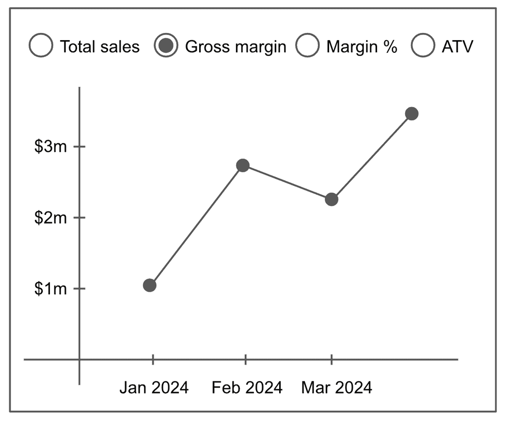

##### 图 6.14 我们 UI 模拟的时间序列图表

因此，我们不会将 `df["Sales"].sum()` 作为要应用的功能传递，而是从我们在 `metric.py` 中定义并在 `metric_config.py` 中实例化的 `Metric` 类的 `func` 属性中获取这个功能。

```py
Let's add such a function to the bottom of data_wrangling.py:
def get_metric_time_series(df, metric):
  grouped = df.groupby('Day')
  data = grouped.apply(metric.func, include_groups=False).reset_index()
  data.columns = ['Day', 'Value']
  return data

```

我们的功能接受一个数据框 `df` 和 `metric`，它是来自 `metric_config.py` 的 `Metric` 对象之一。正如你所看到的，我们通过将 `metric.func` 传递给 `grouped.apply` 来使其通用。

`data.columns = ['Day', 'Value']` 这行代码将结果数据框的列名重置为新的名称。

现在我们有了我们的时间序列，让我们构建我们的折线图。

#### 使用 Plotly 构建我们的时间序列折线图

正如我们在第一章中简要提到的，Streamlit 支持许多不同的数据可视化库。Plotly 是其中之一，它通常很容易使用，并提供了一系列引人入胜的交互式可视化。

要使用它，你首先需要使用 `pip install plotly` 安装它。

我们将使用的 Plotly 版本被称为 Plotly 图形对象（简称 GO）。GO 允许你以高程度控制和定制构建图表，使其非常适合交互式图表，你可以定义每个细节。

创建一个名为 `time_series_chart.py` 的新 Python 模块，并在列表 6.10 中编写代码。

##### 列表 6.10 time_series_chart.py

```py
import plotly.graph_objs as go
from data_wrangling import get_metric_time_series

def get_time_series_chart(df, metric):
  data = get_metric_time_series(df, metric)
  fig = go.Figure()
  fig.add_trace(
    go.Scatter(x=data['Day'], y=data['Value'], mode='lines+markers')
  )

  fig.update_layout(
    title=f"{metric.title}",
    xaxis_title='Day',
    yaxis_title=metric.title
  )
  return fig

```

顶部的导入语句使 Plotly 图形对象可用；缩写 `go` 是传统上用来指代它的。

`get_time_series_chart` 指标接受我们的数据框以及一个类型为 `Metric` 的对象，并返回我们可以稍后传递给 Streamlit 小部件进行显示的折线图（一个 Plotly `Figure` 对象）。

我们首先通过调用我们之前定义的 `get_metric_time_series` 函数来获取我们的时间序列数据。

Plotly 图表是逐步构建的。我们从一个空图表开始，逐步添加所需的组件。在这里，`fig = go.Figure()` 初始化图表并将其分配给 `fig`。

下一个部分将实际的线条添加到图表中：

```py
fig.add_trace(
  go.Scatter(x=data['Day'], y=data['Value'], mode='lines+markers')
)
```

在这里，我们创建了一个 `go.Scatter` 对象，它代表一个散点图。散点图简单地在二维坐标轴（x 轴和 y 轴）上绘制点。每个点都有一个坐标对。在这种情况下，x 坐标由 `data['Day']` 提供，即我们想在图表中显示的日期，而 y 坐标在 `data['Value']` 中，这将是我们关键指标之一（取决于变量 `metric` 包含的是哪一个）。

我们还传递 `mode='lines+markers'`，这使得 Plotly 不仅绘制点（使用“标记”），还在它们之间画线。结果是，我们数据框中的每个 (`Day`, `Value`) 对都有一个标记，所有标记都由线连接，形成了我们需要的折线图。

然后，我们将我们刚刚创建的图表添加到我们的 `Figure` 对象中，通过将其传递给 `fig.add_trace()`。

```py
fig.update_layout(
    title=f"{metric.title}",
    xaxis_title='Day',
    yaxis_title=metric.title
  )
```

上面的最后部分，只是在我们图表中添加了一些文本，例如标题（我们从`Metric`对象的`title`属性中获取，该属性在`metric_config.py`中定义），以及 x 轴和 y 轴的标题。

我们现在知道如何创建所需的图表。但我们还需要实际显示它，所以继续更新`time_series_chart.py`，在底部添加一个`time_series_chart`函数，并在顶部添加相应的导入：

```py
import plotly.graph_objs as go
import streamlit as st
from data_wrangling import get_metric_time_series
from metric_config import metrics, display_metrics

...
def time_series_chart(df):
  with st.container(border=True):
    chart_tabs = st.tabs(display_metrics)
    for idx, met in enumerate(display_metrics):
      with chart_tabs[idx]:
        chart = get_time_series_chart(df, metrics[met])
        st.plotly_chart(chart, use_container_width=True)

```

再次使用`st.container(border=True)`来制作一个盒子，将我们的折线图放入其中。

下一个部分，`chart_tabs = st.tabs(display_metrics)`，引入了一个新的 Streamlit UI 小部件：`st.tabs`。

如其名所示，`st.tabs`在应用中创建了一个标签页区域，允许用户通过点击顶部的标签在内容之间切换。`st.tabs`的参数是要使用的标签标题列表。

例如，`st.tabs(["Home", "About us", "Careers"])`将创建三个带有标题“Home”、“About us”和“Careers”的标签页。

我们试图为每个指标创建一个标签页，并带有相应的折线图，因此我们可以传递来自`metric_config.py`的变量`display_metrics`——你可能还记得，这是一个我们关心的指标列表，我们可以将其用作标签页标题。

我们定义标签页内的内容的方式与定义`st.column`的方式相同：使用 with 上下文管理器。由于`chart_tabs`现在包含标签列表（由`st.tabs`返回），我们可以遍历`display_metrics`中的每个列表索引/指标名称对（`idx, met`），并使用`chart_tabs[idx]`来引用相应的标签页，调用`get_time_series_chart`来为该指标创建 Plotly 折线图。

最后，我们将创建的图表传递给`st.plotly_chart`元素以在屏幕上渲染：

```py
st.plotly_chart(chart, use_container_width=True)
```

`use_container_width=True`确保折线图扩展以填充包含它的盒子的宽度。这防止了图表比容器大或在其周围留下大量空白等奇怪布局问题。

现在我们将折线图包含到我们的主应用中，通过更新`dashboard.py`：

```py
...
from time_series_chart import time_series_chart

...
if main_df.empty:
  st.warning("No data to display")
else:
  metric_bar(main_df)
  time_series_chart(main_df)
```

如果你现在保存并重新运行应用，你会看到你的第一个 Streamlit 可视化（见图 6.15）

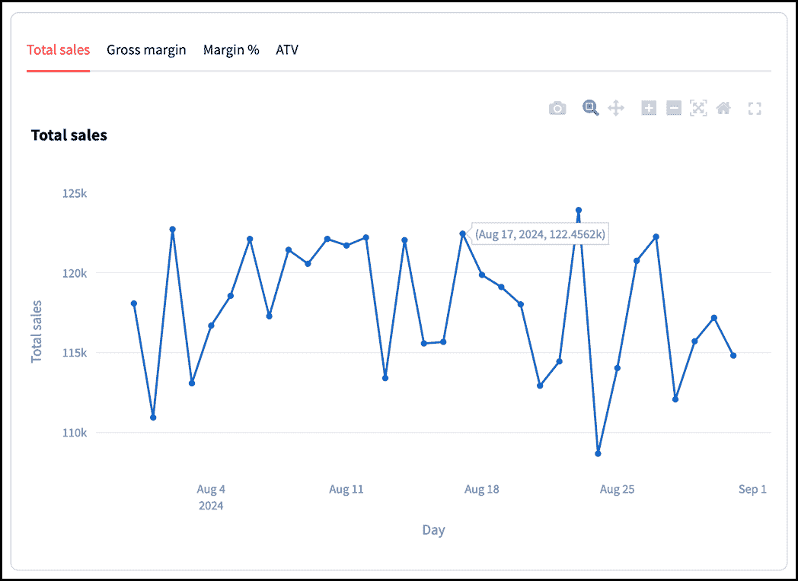

##### 图 6.15 使用 Plotly 创建的时间序列图表（GitHub 仓库中的 chapter_6/in_progress_8 部分有完整的代码）

真的很漂亮，不是吗？你可以看到标签页，并通过切换它们来查看每个指标在给定数据范围内的变化情况。使用`st.plotly_chart`创建的视觉图表免费提供许多有用的功能，例如能够放大图表中的特定点，当鼠标悬停在特定数据点上时显示工具提示，全屏模式，以及下载按钮以保存图像。

##### 注意

我们本可以使用单选按钮作为我们的指标选择小部件，正如我们的 UI 原型所示，但我不想错过介绍 st.tabs 的机会。此外，通过 st.radio 和通过 st.tabs 进行选择的方式有一个重要区别：在选项之间切换不会触发应用程序重新运行，而切换单选按钮选项则会。这使得使用标签页更快、更高效，但代价是需要一次性在初始加载时创建所有指标的图表。

### 6.5.2 创建饼图

我们刚刚创建的时间序列图表让我们能够识别时间趋势，但我们还需要能够分解特定的数据点并查看其贡献因素。例如，如果我们知道“钢笔”细分市场的总销售额为 50 万美元，那么了解其中 70%是由 RoyalQuill 品牌推动的，而 Inkstream 只占 30%，或者 45%的订书机销售额来自 56 岁以上的年龄组，将是有帮助的。

饼图，它展示了整体按其组成部分的百分比分解，是快速形成数据图像的好方法。

图 6.16 再次显示了我们的 UI 原型的饼图。

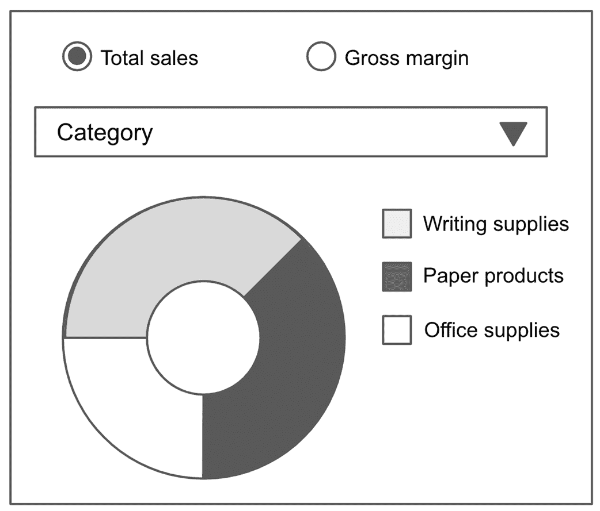

##### 图 6.16 我们 UI 原型的饼图

在这里，您可以做出两个选择：为饼图显示的指标和细分维度。指标只能是“总销售额”或“毛利润”，不能是“利润率%”或 ATV。这是因为后两个指标是比率，相应的按维度比率的总和不会达到 100%——因此饼图不适用。

例如，假设钢笔的平均交易价值（销售额除以交易次数）为 50 美元。我们无法按性别细分，并说其中 60%（30 美元）来自男性，40%（20 美元）来自女性。要获取男性的 ATV，我们必须通过将男性的总销售额除以相应的交易次数来计算比率。

让我们在 metric_config.py 的底部记录这个适用于饼图的较小指标列表的新变量： 

```py
pie_chart_display_metrics = ["Total sales", "Gross margin"]
```

#### 将数据整理成正确的形状

正如我们将数据整理成日期/值时间序列以供时间序列图表使用一样，我们还需要为饼图准备我们的数据。饼图需要知道与每个维度值对应的指标值；它将自行进行转换为百分比。

例如，考虑我们之前处理成时间序列的早期样本数据：

```py
+------------+-------+--------+-----------+------------+
|    Day     | State | Gender | Product   |   Sales    |
+------------+-------+--------+-----------+------------+
| 2024-08-01 |   CA  |   M    | RoyalQuill|   1500     |
| 2024-08-01 |   CA  |   M    | GripLink  |   1300     |
| 2024-08-02 |   CA  |   M    | RoyalQuill|   1600     |
| 2024-08-02 |   CA  |   M    | GripLink  |   1200     |
+------------+-------+--------+-----------+------------+

```

如果我们想按产品展示总销售额的细分，您将按产品分组并汇总销售额：

```py
+-----------+-------------+
|  Product  |    Sales    |
+-----------+-------------+
| RoyalQuill|     3100    |
| GripLink  |     2500    |
+-----------+-------------+
```

这与我们之前所做的工作非常相似；唯一的区别是，我们不是按日期字段分组，而是按特定维度（“产品”）分组。

因此，我们将包含在`data_wrangling.py`底部的函数也与`get_metric_time_series`非常相似：

```py
...

def get_metric_time_series(df, metric):
  grouped = df.groupby('Day')
  data = grouped.apply(metric.func, include_groups=False).reset_index()
  data.columns = ['Day', 'Value']
  return data

def get_metric_grouped_by_dimension(df, metric, dimension):
 grouped = df.groupby(dimension)
 data = grouped.apply(metric.func, include_groups=False).reset_index()
 data.columns = [dimension, 'Value']
 return data
```

新增的 `get_metric_grouped_by_dimension` 和 `get_metric_time_series` 之间的唯一区别在于，在前者中，我们接受维度作为输入，并按该维度进行分组，而不是按 `Day`。

#### 一个 Plotly 饼图

可变通用的 Plotly 图形对象也可以用来创建我们想要的饼图。实际上，你将在 `pie_chart.py`（如列表 6.11 所示的新文件）中放入的代码与 `time_series_chart.py` 中的代码密切相关：

##### 列表 6.11 pie_chart.py

```py
import plotly.graph_objects as go
from data_wrangling import get_metric_grouped_by_dimension

def get_pie_chart(df, metric, dimension):
  data = get_metric_grouped_by_dimension(df, metric, dimension)
  fig = go.Figure()
  fig.add_trace(
    go.Pie(labels=data[dimension], values=data['Value'], hole=0.4)
  )
  return fig
```

差异应该是相当明显的：我们用 `get_metric_grouped_by_dimension` 替换了 `get_metric_time_series`，用 `go.Pie` 替换了 `go.Scatter`。

`go.Pie` 接受 `labels`，这些标签将在颜色图例中显示，`values`，以及 `hole`，它表示饼图中的“甜甜圈洞”应该有多大。

我们在这里不使用 `fig.update_layout()` 来设置图表中的任何文本，因为标题将简单地是标签页标题（我们将在下一部分讨论），并且没有 x 或 y 轴。

如我们之前所做的那样，我们还需要在 `pie_chart.py` 中编写另一个函数来渲染图像：

```py
import plotly.graph_objects as go
import streamlit as st
from data_wrangling import get_metric_grouped_by_dimension
from metric_config import metrics, pie_chart_display_metrics

...
def pie_chart(df):
  with st.container(border=True):
    split_dimension = st.selectbox(
      "Group by",
      ["Age group", "Gender", "State", "Category",
       "Segment", "Product name"]
    )
    metric_tabs = st.tabs(pie_chart_display_metrics)
    for idx, met in enumerate(pie_chart_display_metrics):
      with metric_tabs[idx]:
        chart = get_pie_chart(df, metrics[met], split_dimension)
        st.plotly_chart(chart, use_container_width=True)

```

`pie_chart` 函数与来自 `time_series.chart.py` 的对应函数——`time_series_chart`——类似。

关键区别是添加了 `split_dimension` 变量（用于分解指标的维度），我们需要使用 `st.selectbox` 从用户那里收集。

其他内容保持大致相似；我们在 `pie_chart_display_metrics`（我们在 `metric_config.py` 中定义的）中为每个指标创建一个标签，遍历这些指标，使用 `get_pie_chart` 创建 Plotly 对象，并使用 `st.plotly_chart` 显示它。

在 `dashboard.py` 中，我们希望显示线形图和饼图并排，因此我们使用 `st.columns`：

```py
...
from pie_chart import pie_chart

...
if main_df.empty:
  st.warning("No data to display")
else:
  metric_bar(main_df)
  time_series_col, pie_chart_col = st.columns(2)
 with time_series_col:
 time_series_chart(main_df)
 with pie_chart_col:
 pie_chart(main_df)

```

因此，我们的仪表板的 UI 就完成了！重新运行以查看图 6.17。

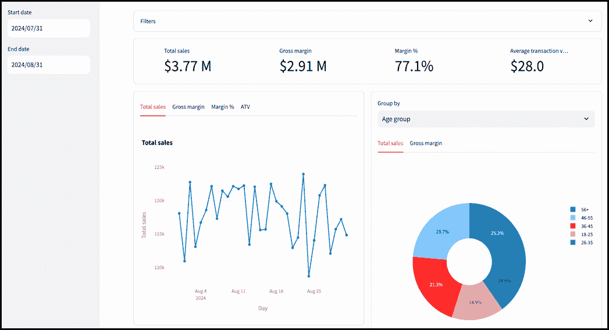

##### 图 6.17 我们完成的程序，底部右边的饼图是新添加的（GitHub 仓库中的 chapter_6/in_progress_9 有完整的代码）

在本章中，我们覆盖了很多内容，我们准备启动我们的仪表板。尽管如此，我们还没有完成 Note n' Nib。在下一章中，我们将看到几种改进我们应用程序的方法——包括可用性调整，以及从静态 CSV 文件切换到数据仓库。

## 6.6 摘要

+   指标仪表板是高管们的重要决策工具。

+   Pandas 是一个流行的 Python 库，用于在数据框中操作表格数据。Streamlit 可以原生地显示 Pandas 数据框。

+   使用 Pandas 的 `read_csv` 函数从逗号分隔值（CSV）文件加载数据。

+   `st.cache_data` 装饰器可用于缓存函数的结果以改进性能。其 `ttl` 参数设置缓存结果有效的时长。

+   在 Pandas 中，数据框的方括号表示法非常灵活；你可以使用它们来选择列、过滤行等等。

+   `st.container` 可以用来包含其他 Streamlit 小部件，以无序或带有边框的方式显示它们。

+   `st.multiselect` 创建一个下拉菜单，你可以从中选择多个选项。

+   `st.set_page_config` 可以在 Streamlit 中设置应用程序配置，包括从居中布局切换到最大化布局。

+   `st.date_input` 可以用来在你的应用程序中显示日期选择器。

+   `humanize` 库对于以用户友好的方式格式化数字非常有用。

+   时间序列是一系列数据点，每个数据点都有一个日期和一个值。

+   Pandas 数据框上的 `groupby` 方法可以在多个维度上聚合数据。

+   Plotly 图形对象（简称 `go`）是一个 Python 库，用于创建可以直接由 Streamlit 显示的可视化。

+   `go.Scatter` 可以用来创建散点图和折线图，而 `go.Pie` 可以用来制作饼图。

+   数据仓库是一个专门设计的系统，用于存储和检索大量数据。

+   Google BigQuery（GCP 的一部分）是一个数据仓库的例子。为了使应用程序能够连接到它，你需要创建一个带有密钥的服务帐户，并将凭据记录在 `st.secrets` 中。
