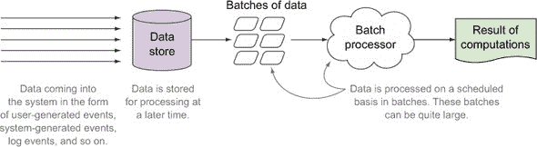
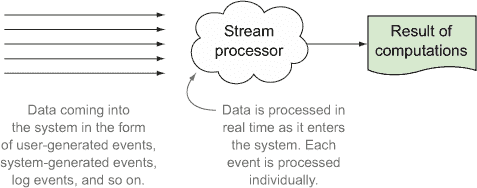
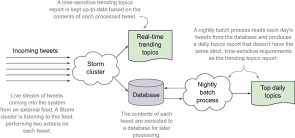
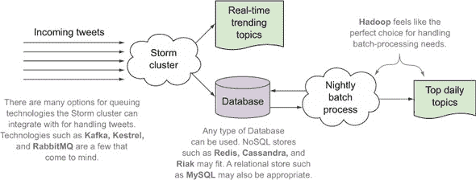
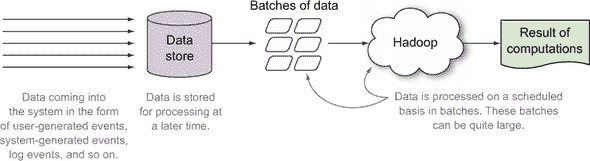
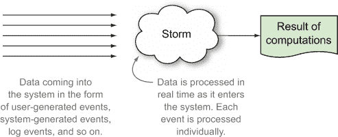

## 第一章. 介绍 Storm

*本章涵盖*

+   什么是 Storm

+   大数据的定义

+   大数据工具

+   Storm 在大数据图景中的位置

+   使用 Storm 的原因

Apache Storm 是一个分布式、实时计算框架，它使得处理无界数据流变得容易。Storm 可以与你的现有队列和持久化技术集成，消费数据流并在许多方式上对这些流进行处理/转换。

仍在关注我们吗？你们中的一些人可能觉得自己很聪明，因为你们知道这意味着什么。其他人可能在寻找合适的动态 GIF 来表达你的挫败感。这个描述中有很多内容，所以如果你现在还没有完全理解它的所有含义，请不要担心。我们已经在本章的剩余部分致力于阐明我们确切的意思。

要理解 Storm 是什么以及何时应该使用它，你需要了解 Storm 在大数据领域中的位置。它可以与哪些技术一起使用？它可以替代哪些技术？能够回答这些问题需要一些背景知识。

### 1.1\. 什么是大数据？

要谈论大数据以及 Storm 在大数据领域中的位置，我们需要对“大数据”的含义有一个共同的理解。关于大数据有很多定义。每个定义都有其独特的见解。这是我们的定义。

#### 1.1.1\. 大数据的四个 V

通过考虑大数据的四个不同属性来理解大数据：数据量、速度、多样性和真实性.^([1])

> ¹ [`en.wikipedia.org/wiki/Big_data`](http://en.wikipedia.org/wiki/Big_data)

##### 数据量

数据量是大数据最明显的属性——也是当人们听到这个术语时首先想到的。每天从各种来源不断生成数据：由社交媒体中的人生成数据、软件自身生成数据（网站跟踪、应用程序日志等），以及用户生成数据，如维基百科，只是数据来源的一小部分。

当人们想到数据量时，谷歌、Facebook 和 Twitter 等公司会浮现在脑海中。当然，所有这些公司都处理着大量的数据，我们确信你们可以列出其他公司，但那些没有这种数据量的公司呢？有很多其他公司，仅从数据量的定义来看，并不拥有大数据，但这些公司却在使用 Storm。为什么？这就是第二个 V，速度，发挥作用的地方。

##### 速度

速度处理数据流入系统的速度，无论是数据量还是它是连续的数据流。数据量（可能只是网站上的几个链接，访客正在点击）可能相对较小，但流入你系统的速度可能相当高。速度很重要。如果你处理数据不够快，无法提供价值，那么你有多少数据都无关紧要。它可能只有几个太字节；它可能是由 500 万个 URL 组成的较小数据量。所有重要的是你能否在数据过时之前从中提取意义。

到目前为止，我们已经有了量和速度，它们处理数据量和流入系统的速度。在许多情况下，数据也会来自多个来源，这让我们来到了下一个 V：多样性。

##### 多样性

为了增加多样性，让我们退一步，看看如何从数据中提取意义。通常，这可能涉及从几个来源获取数据并将它们组合成可以讲述故事的东西。然而，当你开始时，你可能有一些数据在谷歌分析中，也许有一些在只读日志中，也许还有一些在关系型数据库中。你需要将这些数据全部整合起来，并塑造出你可以用来深入挖掘并从以下问题中提取有意义的答案的东西：

+   Q: *我的最佳客户是谁？*

+   A: *新墨西哥州的野狗。*

+   Q: *他们通常购买什么？*

+   A: *有些是油漆，但大多是大型重物。*

+   Q: *我能否单独查看每位客户并找到其他人喜欢的产品，然后将这些产品推广给他们？*

+   A: *这取决于你多快能将你的各种数据转化为你可以使用和操作的东西。*

就像我们没有足够的担忧一样，大量数据以快速的速度从各种来源进入我们的系统，我们还得担心进入我们系统中的数据准确性。最后的 V 处理这个问题：真实性。

##### 真实性

真实性涉及进入和出去数据的准确性。有时，我们需要我们的数据非常准确。其他时候，“足够接近”的估计就足够了。许多允许进行高保真估计同时保持低计算需求的算法（如超对数）通常用于大数据。例如，确定一个极其成功的网站的精确平均页面浏览时间可能不是必需的；一个足够接近的估计就足够了。这些准确性和资源之间的权衡是大数据系统的常见特征。

定义了量、速度、多样性和真实性这些属性后，我们为大数据建立了一些一般性的边界。我们的下一步是探索在这些边界内可用于处理数据的各种工具。

#### 1.1.2\. 大数据工具

存在许多工具来解决大数据的各种特性（体积、速度、多样性和真实性）。在给定的大数据生态系统中，不同的工具可以单独使用或组合使用，用于不同的目的：

+   ***数据处理*—** 这些工具用于执行某种形式的计算并从数据集中提取智能。

+   ***数据传输*—** 这些工具用于收集和摄取数据到数据处理系统（或在不同系统组件之间传输数据）。它们有多种形式，但最常见的是消息总线（或队列）。示例包括 Kafka、Flume、Scribe 和 Scoop。

+   ***数据存储*—** 这些工具用于在处理的不同阶段存储数据集。它们可能包括分布式文件系统，如 Hadoop 分布式文件系统 (HDFS) 或 GlusterFS，以及 NoSQL 数据存储，如 Cassandra。

我们将重点关注数据处理工具，因为 Storm 是一个数据处理工具。要理解 Storm，你需要了解各种数据处理工具。它们主要分为两大类：批处理和流处理。最近，两者之间出现了一种混合形式：流处理中的微批处理。

##### 批处理

暂时考虑一个单一的数据点：对网站的一次唯一点击。现在想象在相同的时间段内发生的数十万次其他点击。所有这些点击一起形成一个批次——要一起处理的数据点集合。图 1.1 提供了数据流入面向批次的工具的概述。

##### 图 1.1\. 批处理器和数据如何流入其中

处理网站的日志文件以提取有关访客行为的例子是一个优秀的批处理问题。我们有一个固定的数据池，我们将对其进行处理以获得结果。这里需要注意的重要一点是，工具作用于数据批次。这个批次可能是一个小的数据段，也可能整个数据集。在处理数据批次时，你能够从整个批次中得出一个整体概述，而不是单个数据点。之前关于了解访客行为的例子不能基于单个数据点进行；你需要基于其他数据点（即，其他访问的 URL）的上下文。换句话说，批处理允许你连接、合并或聚合不同的数据点。这就是为什么批处理经常用于机器学习算法。

批量处理的另一个特点是，其结果通常只有在整个批次完成处理之后才能获得。早期数据点的结果只有在整个过程完成后才会变得可用。你的批次越大，你能够进行的合并、聚合和连接就越多，但这也带来了成本。批次越大，你需要等待的时间就越长，才能从其中获取有用的信息。如果答案的即时性很重要，流处理可能是一个更好的解决方案。

##### 流处理

流处理器对无界的数据流进行操作，而不是对数据点的批次进行操作。图 1.2 说明了数据如何流入流处理系统。

##### 图 1.2\. 流处理器及其数据流入方式

流处理器持续地摄取新的数据（称为“流”）。对流处理的需求通常源于对结果即时性的需求。但这并不总是如此，也绝对不是流处理的强制要求。这就是为什么我们有未界定的数据流不断输入到流处理器中。这些数据通常通过消息总线从其源头导向流处理器，以便在数据仍然“热”的时候就能获得结果。与批量处理不同，流中流动的数据点没有明确的开始或结束；它是连续的。

这些系统通过一次处理一个数据点来实现即时性。大量数据点正在流过流，当你一次处理一个数据点并且并行进行时，在数据创建和结果可用之间实现亚秒级延迟是非常容易的。想想对推文流进行情感分析。为了实现这一点，你不需要将任何传入的推文与其他同时发生的推文关联起来，因此你可以一次处理一个推文。当然，你可能需要一些通过使用历史推文创建的训练集来获取的上下文数据。但由于这个训练集不需要由当前发生的推文组成，可以避免昂贵的当前数据聚合，你可以在一次处理一个推文的同时继续操作。因此，在流处理应用程序中，与批量系统不同，你将在每个数据点完成处理时获得结果。

但流处理不仅限于一次处理一个数据点。最著名的例子之一是 Twitter 的“趋势话题”。趋势话题是通过考虑每个时间窗口内的推文来在滑动时间窗口内计算的。通过比较当前窗口的推文主题与之前的窗口，可以观察到趋势。显然，由于在时间框架内处理推文批次，这会在一次处理一个数据点的基础上增加延迟（因为每个推文不能被视为完成处理，直到它所属的时间窗口结束）。同样，其他形式的缓冲、连接、合并或聚合可能在流处理期间增加延迟。在这种聚合中，引入的延迟和可达到的精度之间总是存在权衡。更大的时间窗口（或在连接、合并或聚合操作中的更多数据）可能在某些算法中确定结果的准确性——以延迟为代价。通常在流系统中，我们保持在毫秒、秒或最多几分钟的处理延迟内。超出这个范围的用例更适合批处理。

我们刚刚考虑了使用流系统对推文的两个用例。以推文形式通过 Twitter 系统流动的数据量是巨大的，Twitter 需要能够告诉用户他们所在地区现在都在谈论什么。想想看。Twitter 不仅需要以高容量运行，还需要以高速度（即低延迟）运行。Twitter 有一个巨大的、永无止境的推文流进入，它必须能够实时提取人们正在谈论的内容。这是一项艰巨的工程壮举。事实上，第三章就是围绕一个类似这种趋势话题想法的用例构建的。

##### 流中的微批处理

在过去几年中，出现了一些专为与趋势话题等示例一起使用而构建的工具。这些微批处理工具与流处理工具类似，因为它们都处理无界的数据流。但与允许你访问其中每个数据点的流处理器不同，微批处理处理器以一种方式将传入的数据分组到批次中，并一次给你一个批次。这种方法使得微批处理框架不适合一次处理一个数据点的问题。你也在放弃处理单个数据点时相关的超低延迟。但它们使得在流中处理数据批次变得容易一些。

### 1.2\. Storm 如何融入大数据场景

那么，Storm 在这个所有内容中处于什么位置呢？回到我们最初的定义，我们说：

> Storm 是一个分布式、实时计算框架，使得处理无界数据流变得容易。

Storm 是一个流处理工具，简单明了。它将无限期运行，监听数据流，并在从流中接收到数据时“做些什么”。Storm 也是一个分布式系统；它允许我们轻松地添加机器，以便实时处理尽可能多的数据。此外，Storm 还附带一个名为 Trident 的框架，允许您在流中进行微批处理。

| |
| --- |

**什么是实时？**

当我们在整本书中使用“实时”这个术语时，我们究竟指的是什么？好吧，从技术角度来说，“近实时”更为准确。在软件系统中，实时约束被定义为设置系统响应特定事件的操作截止时间。通常，这种延迟在毫秒级别（或者至少是亚秒级），对最终用户来说没有可感知的延迟。在 Storm 的上下文中，实时（亚秒级）和近实时（取决于用例，几秒或几分钟）的延迟都是可能的。

| |
| --- |

那么我们最初定义中的第二句话是什么意思呢？

> 暴风雨可以与您现有的队列和持久化技术集成，消费数据流并以多种方式处理/转换这些流。

正如我们将在整本书中向您展示的那样，Storm 在灵活性方面极为出色，流源可以是任何东西——通常这意味着一个队列系统，但 Storm 并不限制您的流来自哪里（在我们的几个用例中，我们将使用 Kafka 和 RabbitMQ）。对于 Storm 产生的流转换结果也是如此。我们已经看到许多案例，其中结果被持久化到某个数据库中以便稍后访问。但结果也可能被推送到另一个队列，供另一个系统（甚至可能是另一个 Storm 拓扑）处理。

重点是您可以将 Storm 插入到现有的架构中，这本书将提供用例来说明您如何做到这一点。图 1.3 展示了分析推文流的一个假设场景。

##### 图 1.3\. Storm 在系统内使用的示例

这个高级假设解决方案正是如此：假设的。我们想展示 Storm 可以在系统中的哪个位置，以及批处理和流处理工具共存的可能性。

那么与 Storm 一起使用的不同技术呢？图 1.4 对此问题提供了一些启示。该图显示了在这个架构中可以使用的某些技术的少量样本。它说明了 Storm 在可以与之工作的技术以及可以插入系统中的位置方面的灵活性。

##### 图 1.4\. Storm 与其他技术一起使用的方法

对于我们的队列系统，我们可以从包括 Kafka、Kestrel 和 RabbitMQ 在内的一系列技术中进行选择。数据库的选择也是如此：Redis、Cassandra、Riak 和 MySQL 只是在众多选项中触及了表面。而且看，我们甚至在我们的解决方案中包含了一个 Hadoop 集群，用于执行我们“每日热门话题”报告所需的批量计算。

希望你开始更清楚地了解 Storm 的位置以及它可以与什么一起使用。包括 Hadoop 在内的一系列技术都可以在系统中与 Storm 一起工作。等等，我们刚刚告诉你 Storm 可以与 Hadoop 一起工作吗？

#### 1.2.1\. 暴风雨与常规嫌疑人

在许多工程师之间的对话中，Storm 和 Hadoop 经常被放在同一句话中。我们不会从工具开始，而是从你可能会遇到的问题类型开始，通过考虑每个工具的特点来展示最适合的工具。很可能会选择多个工具，因为没有单个工具适合所有问题。实际上，在适当的条件下，工具甚至可以结合使用。

以下对各种大数据工具的描述以及与 Storm 的比较旨在引起人们对它们与 Storm 独特不同的注意。但不要仅凭此信息就选择一个工具而放弃另一个。

##### Apache Hadoop

Hadoop 以前是批量处理系统的同义词。但随着 Hadoop v2 的发布，它不仅仅是一个批量处理系统——它是一个大数据应用的平台。其批量处理组件被称为 Hadoop MapReduce。它还附带了一个作业调度器和集群资源管理器，称为 YARN。另一个主要组件是 Hadoop 分布式文件系统，HDFS。许多其他大数据工具正在构建中，它们利用 YARN 来管理集群，并将 HDFS 作为数据存储后端。在本书的剩余部分，当我们提到 Hadoop 时，我们指的是其 MapReduce 组件，我们将明确提及 YARN 和 HDFS。

图 1.5 展示了数据如何被输入到 Hadoop 进行批量处理。数据存储是分布式文件系统，HDFS。一旦确定了与当前问题相关的数据批次，MapReduce 过程就会在每个批次上运行。当 Map-Reduce 过程运行时，它将代码移动到数据所在的节点。这通常是批量作业的一个特性。批量作业已知可以处理非常大的数据集（从千兆到拍字节并不罕见），在这些情况下，将代码移动到分布式文件系统中的数据节点并在这些节点上执行代码更容易，从而通过数据本地性实现了显著的效率提升。

##### 图 1.5\. Hadoop 及数据流入方式

##### Storm

Storm 作为一个实时计算的一般框架，允许你以 Hadoop 无法实现的方式在数据上运行增量函数。图 1.6 展示了数据是如何进入 Storm 的。

##### 图 1.6\. Storm 及其数据流

Storm 属于我们之前讨论的流处理工具类别。它保持了该类别的所有特征，包括低延迟和快速处理。事实上，它的速度不会比这更快。

与 Hadoop 将代码移动到数据不同，Storm 将数据移动到代码。这种行为在流处理系统中更有意义，因为数据集在事先是未知的，这与批量作业不同。此外，数据集是连续通过代码流动的。

此外，Storm 提供了一个定义良好的框架，用于在发生故障时进行有价值的、保证的消息处理。Storm 自带其自己的集群资源管理系统，但雅虎已经进行了非官方的工作，使 Storm 能够在 Hadoop v2 的 YARN 资源管理器上运行，以便资源可以与 Hadoop 集群共享。

##### Apache Spark

Spark 属于与 Hadoop MapReduce 相同的批量处理工具系列。它也运行在 Hadoop 的 YARN 资源管理器上。Spark 有趣的地方在于它允许在内存中缓存中间（或最终）结果（如有需要，溢出到磁盘）。这种能力对于在相同数据集上重复运行的过程非常有用，并且可以以算法上有意义的方式利用之前的计算。

##### Spark Streaming

Spark Streaming 与 Storm 一样处理无界的数据流。但它在某种程度上与 Storm 不同，因为 Spark Streaming 不属于我们之前讨论的流处理工具类别；相反，它属于微批处理工具类别。Spark Streaming 建立在 Spark 之上，并且需要将流中的数据流入表示为批次才能运行。在这方面，它与 Storm 的 Trident 框架相当，而不是 Storm 本身。因此，Spark Streaming 无法支持 Storm 的单次处理语义支持的低延迟，但在性能方面应该与 Trident 相当。

Spark 的缓存机制在 Spark Streaming 中也是可用的。如果你需要缓存，你将不得不在你的 Storm 组件内部维护自己的内存缓存（这并不困难，而且相当常见），但 Storm 并没有提供任何内置的支持来做这件事。

##### Apache Samza

Samza 是来自 LinkedIn 团队的一个年轻的流处理系统，它可以直接与 Storm 进行比较。然而，你会注意到一些差异。虽然 Storm 和 Spark/Spark Streaming 可以在自己的资源管理器下运行，也可以在 YARN 下运行，但 Samza 是专门为在 YARN 系统上运行而构建的。

Samza 有一个简单且易于推理的并行模型；Storm 有一个并行模型，让您可以在更细粒度的水平上微调并行性。在 Samza 中，您工作流程中的每个步骤都是一个独立的实体，您使用 Kafka 连接这些实体。在 Storm 中，所有步骤都通过一个内部系统（通常是 Netty 或 ZeroMQ）连接起来，从而实现更低的延迟。Samza 的优势在于它有一个 Kafka 队列，可以作为检查点，并允许多个独立的消费者访问该队列。

如我们之前所提到的，这不仅仅是在这些各种工具之间进行权衡并选择一个。很可能是您可以使用批处理工具和流处理工具结合使用。实际上，使用以批处理为导向的系统与以流为导向的系统相结合是 Nathan Marz 所著的*大数据*（Manning, 2015）一书中讨论的主题，而 Nathan Marz 是 Storm 的原始作者。

### 1.3. 您为什么想使用 Storm

现在我们已经解释了 Storm 在大数据领域中的位置，接下来让我们讨论一下为什么您会想要使用 Storm。正如我们将在整本书中展示的那样，Storm 具有一些基本特性，使其成为一个吸引人的选择：

+   它可以应用于广泛的用例。

+   它与多种技术配合良好。

+   它是可扩展的。Storm 使您能够轻松地将工作分解为一系列线程、一系列 JVM 或一系列机器——所有这些都不需要更改您的代码以进行这种扩展（您只需更改一些配置）。

+   它保证它会至少处理您给出的每一块输入一次。

+   它非常健壮——您甚至可以说它是容错的。在 Storm 内部有四个主要组件，在各个时期，我们不得不关闭其中的任何一个，同时继续处理数据。

+   它对编程语言没有限制。如果您可以在 JVM 上运行它，您就可以轻松地在 Storm 上运行它。即使您不能在 JVM 上运行它，如果您可以从*nix 命令行调用它，您可能可以使用它与 Storm 一起使用（尽管在这本书中，我们将限制自己在 JVM 上，特别是 Java 上）。

我们认为您会同意这听起来很令人印象深刻。Storm 已经成为我们首选的工具包，不仅用于扩展，还用于容错和保证消息处理。我们有许多 Storm 拓扑（执行特定任务的 Storm 代码块），这些拓扑可以轻松地作为 Python 脚本在单台机器上运行。但如果该脚本崩溃，它在可恢复性方面并不比 Storm 强；Storm 将重新启动并从我们的崩溃点继续工作。没有凌晨 3 点的紧急通知，没有早上 9 点的向工程副总裁解释为什么某件事失败的解释。关于 Storm 的伟大之处之一是，您是为了容错而来，但留在了易于扩展的环境中。

带着这些知识，您现在可以继续学习 Storm 的核心概念。对这些概念的良好理解将为我们在这本书中讨论的所有其他内容奠定基础。

### 1.4. 摘要

在本章中，您了解到

+   Storm 是一个无限运行的流处理工具，它监听数据流并对这些数据流进行某种类型的处理。Storm 可以与许多现有技术集成，使其成为许多流处理需求的可行解决方案。

+   最好通过考虑其四个主要属性来定义大数据：数据量（数据量）、速度（数据流入系统的速度）、种类（不同类型的数据）和真实性（数据的准确性）。

+   处理大数据主要有三种工具类型：批处理、流处理和流内的微批处理。

+   Storm 的一些优点包括其可扩展性、至少处理每条消息一次的能力、其健壮性以及能够用任何编程语言进行开发的能力。
