## 第二章\. 核心 Storm 概念

*本章涵盖*

+   核心 Storm 概念和术语

+   第一个 Storm 项目的基本代码

一旦你理解了 Storm 的核心概念，它们就很简单，但这种理解可能很难获得。第一天遇到“执行器”和“任务”的描述可能很难理解。你需要一次记住太多概念。在这本书中，我们将逐步介绍概念，并尽量减少你需要一次思考的概念数量。这种方法通常意味着解释并不完全“正确”，但在你的旅程的这个阶段，它将足够准确。随着你逐渐拼凑起不同的碎片，我们会指出我们早期的定义可以如何扩展。

### 2.1\. 问题定义：GitHub 提交计数仪表板

让我们从在一个应该熟悉的领域开始工作：GitHub 的源代码控制。大多数开发者都熟悉 GitHub，因为他们在个人项目、工作或与其他开源项目互动时使用过它。

假设我们想要实现一个仪表板，显示针对任何仓库的最活跃开发者的运行计数。这个计数有一些实时要求，即在仓库的任何更改发生后必须立即更新。GitHub 请求的仪表板可能看起来像图 2.1。

##### 图 2.1\. 对一个仓库更改计数仪表板的草图

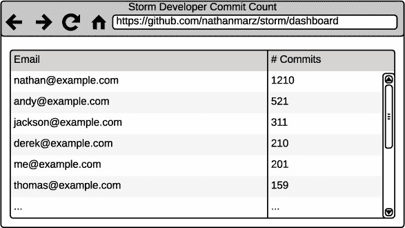

该仪表板相当简单。它包含了一个列表，列出了每个向仓库提交过代码的开发者的电子邮件，以及他们各自提交的总数。在我们深入探讨如何使用 Storm 设计解决方案之前，让我们进一步分解问题，从将要使用的数据的角度来看。

#### 2.1.1\. 数据：起始点和结束点

对于我们的场景，我们将说 GitHub 提供了一个任何仓库提交的实时流。每个提交作为一个包含提交 ID、一个空格和提交该提交的开发者电子邮件的单个字符串进入流。以下列表显示了流中的 10 个单独提交的样本。

##### 列表 2.1\. GitHub 提交流的示例提交数据

```
b20ea50 nathan@example.com
064874b andy@example.com
28e4f8e andy@example.com
9a3e07f andy@example.com
cbb9cd1 nathan@example.com
0f663d2 jackson@example.com
0a4b984 nathan@example.com
1915ca4 derek@example.com
```

这个数据流为我们提供了数据的起点。我们需要从这个实时流到一个显示每个电子邮件地址提交数运行计数的 UI。为了简化，让我们说我们只需要维护一个内存映射，其中电子邮件地址是键，提交数是值。这个映射在代码中可能看起来像这样：

```
Map<String, Integer> countsByEmail = new HashMap<String, Integer>();
```

现在我们已经定义了数据，下一步就是定义我们需要采取的步骤，以确保我们的内存映射正确地反映了提交数据。

#### 2.1.2\. 问题分解

我们知道我们想要从提交消息的流中转换到内存中的电子邮件/提交计数映射，但我们还没有定义如何实现。在这个阶段，将问题分解为一系列较小的步骤有助于。我们定义这些步骤为接受输入、对输入进行计算并产生输出的组件。这些步骤应该提供一种从起点到终点的方法。我们为这个问题提出了以下组件：

1.  一个组件从实时提交流中读取并生成单个提交消息

1.  一个组件接受单个提交消息，从中提取开发者的电子邮件，并生成一封电子邮件

1.  一个组件接受开发者的电子邮件并更新一个内存映射，其中键是电子邮件，值是该电子邮件的提交次数

在本章中，我们将问题分解为几个组件。在下一章中，我们将更详细地介绍如何将问题映射到 Storm 域。但在我们继续之前，看看图 2.2，它说明了组件、它们接受的输入和产生的输出。

##### 图 2.2. 将提交计数问题分解为一系列步骤，具有定义明确的输入和输出

![02fig02.jpg]

图 2.2 展示了我们将实时提交流转换为存储每个电子邮件提交计数的解决方案。我们有三个组件，每个组件都有单一的目的。现在我们已经对如何解决这个问题有了很好的理解，让我们在 Storm 的背景下构建我们的解决方案。

### 2.2. Storm 的基本概念

为了帮助您理解 Storm 的核心概念，我们将介绍 Storm 中使用的常见术语。我们将在我们的示例设计中这样做。让我们从 Storm 中最基本的组件开始：拓扑。

#### 2.2.1. 拓扑结构

让我们退一步，从我们的例子中理解什么是拓扑。想象一个简单的线性图，一些节点通过有向边连接。现在想象每个节点代表一个单独的过程或计算，每条边代表一个计算的结果作为输入传递给下一个计算。图 2.3 更清楚地说明了这一点。

##### 图 2.3. 拓扑是一个图，节点代表计算，边代表计算的结果。

![02fig03_alt.jpg]

Storm 拓扑是一个计算图，节点代表一些单个计算，边代表节点之间传递的数据。然后我们向这个计算图输入数据以实现某个目标。这究竟意味着什么呢？让我们回到我们的仪表板示例，看看我们说的是什么。

通过查看问题的模块化分解，我们能够从拓扑的定义中识别出每个组件。图 2.4 说明了这种关联；这里有很多内容需要消化，所以请慢慢来。

##### 图 2.4\. 将设计映射到 Storm 拓扑的定义

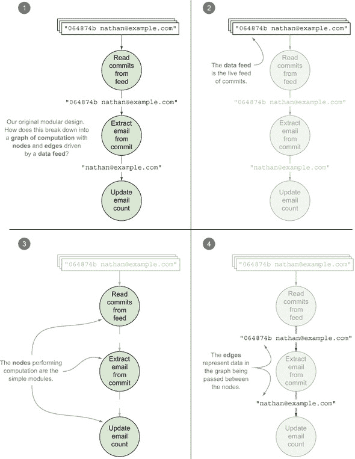

我们在拓扑定义中提到的每个概念都可以在我们的设计中找到。实际的拓扑由节点和边组成。这个拓扑随后由提交的持续实时流驱动。我们的设计非常适合 Storm 框架。现在你已经了解了什么是拓扑，我们将深入了解构成拓扑的各个组件。

#### 2.2.2\. 元组

我们拓扑中的节点以元组的形式相互发送数据。一个*元组*是有序值列表，其中每个值都被分配了一个名称。一个节点可以创建并（可选地）向图中任意数量的节点发送元组。将元组发送给任意数量的节点进行处理的过程称为*发射*元组。

需要注意的是，尽管元组中的每个值都有一个名称，但这并不意味着元组是名称-值对的列表。名称-值对的列表意味着背后可能有一个映射，并且名称实际上是元组的一部分。这两个陈述都不正确。元组是有序值列表，Storm 提供了为列表中的值分配名称的机制；我们将在本章后面讨论这些名称是如何分配的。

当我们在本书其余部分中的图中显示元组时，与值关联的名称很重要，因此我们确定了一个包括名称和值的约定（图 2.5）。

##### 图 2.5\. 在本书中显示元组的格式

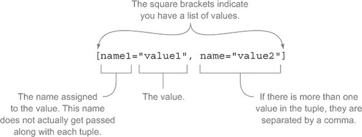

在掌握了显示元组的标准格式后，让我们确定我们的拓扑中的两种元组类型：

+   包含提交 ID 和开发者电子邮件的提交消息

+   开发者电子邮件

我们需要为这些分配一个名称，所以我们现在使用“提交”和“电子邮件”（关于如何在代码中实现这一点的更多细节将在后面介绍）。图 2.6 展示了我们的拓扑中元组的流动情况。

##### 图 2.6\. 拓扑中的两种元组：一个用于提交消息，另一个用于电子邮件

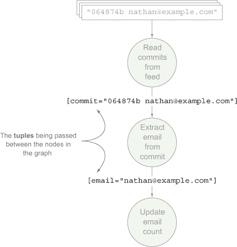

元组内值的类型是动态的，不需要声明。但是 Storm 需要知道如何序列化这些值，以便在拓扑中的节点之间发送元组。Storm 已经知道如何序列化原始类型，但对于你定义的任何自定义类型，它将需要自定义序列化器，并在没有自定义序列化器的情况下回退到标准的 Java 序列化。

我们很快就会看到所有这些代码，但现在的重点是理解术语和概念之间的关系。在掌握了元组的概念之后，我们可以继续学习 Storm 的核心抽象：流。

#### 2.2.3\. 流

根据 Storm 维基百科，流是“元组的无界序列。”这是对什么是流的很好解释，也许可以补充一点。*流*是拓扑中两个节点之间元组的无界序列。一个拓扑可以包含任意数量的流。除了拓扑中第一个从数据源读取的节点之外，节点可以接受一个或多个流作为输入。节点随后通常会对输入元组进行一些计算或转换，并发出新的元组，从而创建一个新的输出流。这些输出流然后作为其他节点的输入流，依此类推。

在我们的 GitHub 提交计数拓扑中，有两个流。第一个流从持续读取提交的节点开始。该节点发出一个包含提交的元组到另一个提取电子邮件的节点。第二个流从提取提交中的电子邮件的节点开始。该节点通过发出只包含电子邮件的新流来转换其输入流（包含提交）。结果输出流作为更新内存映射的节点的输入。您可以在图 2.7 中看到这些流。

##### 图 2.7\. 识别我们的拓扑中的两个流

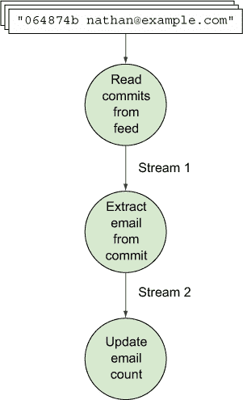

我们的 Storm GitHub 场景是一个简单链式流（多个流连接在一起）的例子。

##### 复杂流

流可能并不总是像我们的拓扑中那样简单。以图 2.8 中的例子为例。这张图显示了一个包含四个不同流的拓扑。第一个节点发出一个元组，被两个不同的节点消费；这导致了两个独立的流。然后，每个节点都会向它们自己的新输出流发出元组。

##### 图 2.8\. 包含四个流的拓扑

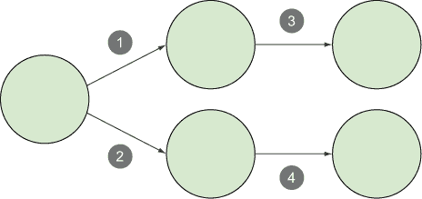

在创建、拆分和再次连接流的数量方面，组合是无限的。本书后面的例子将深入探讨更复杂的流链，以及为什么以这种方式设计拓扑是有益的。现在，我们将继续我们的简单例子，并转向拓扑的流来源。

#### 2.2.4\. 泄露

*Spout*是拓扑中流的来源。Spout 通常从外部数据源读取数据并将元组发射到拓扑中。Spout 可以监听消息队列中的传入消息，监听数据库中的变化，或监听任何其他数据源。在我们的例子中，spout 正在监听 Storm 仓库中提交的实时流(图 2.9)。

##### 图 2.9\. Spout 从提交消息的流中读取。

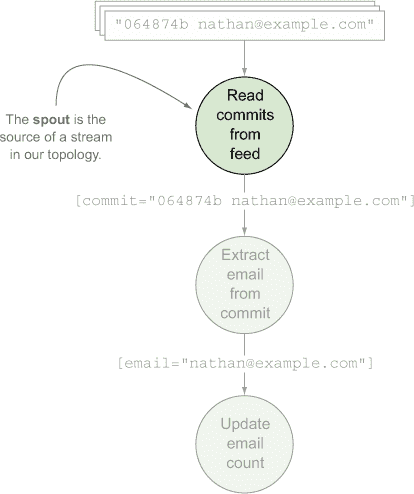

喷发器不执行任何处理；它们只是作为流源，从数据源读取并将元组发射到拓扑中的下一个节点类型：螺栓。

#### 2.2.5\. 螺栓

与仅用于监听数据流的目的的喷发器不同，*螺栓*从其输入流接受一个元组，对该元组执行一些计算或转换——可能是过滤、聚合或连接——然后可选地向其输出流（或多个输出流）发射新的元组（或多个元组）。

我们例子中的螺栓如下：

+   ***一个从提交中提取开发者电子邮件的螺栓*—** 这个螺栓从其输入流接受包含提交 ID 和电子邮件的元组。它转换输入流，并向其输出流发射只包含电子邮件地址的新元组。

+   ***一个更新提交计数电子邮件映射的螺栓*—** 这个螺栓从其输入流接受包含电子邮件地址的元组。因为这个螺栓更新内存映射并不会发射新的元组，所以它不会产生输出流。

这两个螺栓都在图 2.10 中展示。

##### 图 2.10\. 螺栓对提交消息及其中的相关电子邮件进行处理。

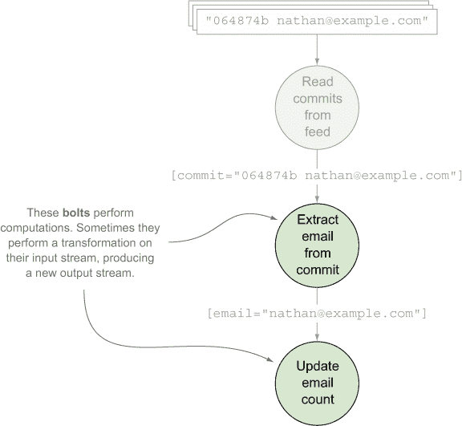

我们例子中的螺栓非常简单。随着你在书中继续前进，你会创建执行更复杂转换的螺栓，有时甚至从多个输入流读取并产生多个输出流。不过，我们在这里有点超前了。首先，你需要了解螺栓和喷发器在实际中的工作方式。

##### 在幕后螺栓和喷发器是如何工作的

在图 2.9 和 2.10 中，喷发器和螺栓都被显示为单个组件。从逻辑角度来看这是正确的。但是，当涉及到喷发器和螺栓在实际中的工作方式时，情况就更加复杂。在一个运行拓扑中，通常有大量每种类型的喷发器/螺栓实例并行执行计算。参见图 2.11，其中提取提交中的电子邮件和更新电子邮件计数的螺栓各自在三个不同的实例上运行。注意一个螺栓的单个实例是如何向另一个螺栓的单个实例发射元组的。

##### 图 2.11\. 通常有多个特定螺栓的实例向多个另一个螺栓的实例发射元组。

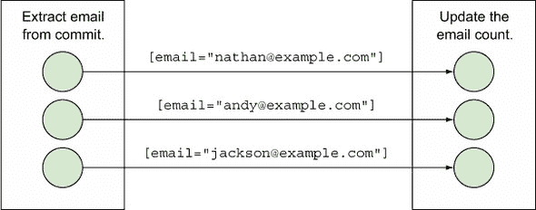

图 2.11 展示了两个螺栓实例之间元组发送的几种可能场景。实际上，情况更像是图 2.12，其中左侧的每个螺栓实例都在向右侧的多个不同螺栓实例发射元组。

##### 图 2.12\. 一个螺栓的单独实例可以向任何数量的另一个螺栓的实例发射。

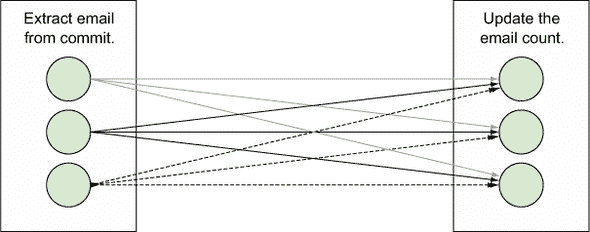

理解喷发器和螺栓实例的分解非常重要，因此让我们暂停一下，总结一下在深入探讨最终概念之前你所知道的内容：

+   一个 *topology* 由 *nodes* 和 *edges* 组成。

+   *Nodes* 代表 *spouts* 或 *bolts*。

+   *Edges* 代表这些 spout 和 bolt 之间的元组流。

+   一个 *tuple* 是值的有序列表，其中每个值都被分配了一个名称。

+   一个 *stream* 是 spout 和 bolt 或两个 bolt 之间的无界元组序列。

+   一个 *spout* 是拓扑中流的来源，通常监听某种实时数据流。

+   一个 *bolt* 接受来自 spout 或另一个 bolt 的元组流，通常对这些输入元组执行某种计算或转换。然后，bolt 可以选择性地发射新的元组，这些元组作为拓扑中另一个 bolt 的输入流。

+   每个 spout 和 bolt 都将有一个或多个单独的实例，这些实例并行执行所有这些处理。

这是一大堆内容，所以在继续之前请确保你已经消化了这些内容。准备好了吗？很好。在我们进入实际代码之前，让我们再解决一个重要概念：流分组。

#### 2.2.6\. Stream grouping

到现在为止，你知道流是一个无界的元组序列，在 spout 和 bolt 或两个 bolt 之间。流分组定义了元组如何在那些 spout 和 bolt 的实例之间发送。我们这是什么意思？让我们退一步，看看我们的提交计数拓扑。在我们的 GitHub 提交计数拓扑中，我们有两个流。这些流中的每一个都将有自己的流分组定义，告诉 Storm 如何在 spout 和 bolt 的实例之间发送单个元组（图 2.13）。

##### 图 2.13\. 拓扑中的每个流都将有自己的流分组。

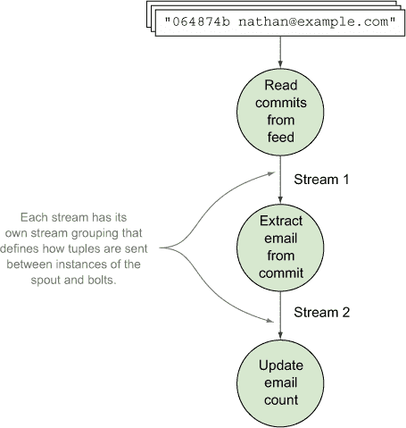

Storm 默认提供几种流分组。我们将在本书中介绍这些分组中的大多数，从本章中两种最常见的分组开始：shuffle grouping 和 fields grouping。

##### Shuffle grouping

我们 spout 和第一个 bolt 之间的流使用 shuffle grouping。一个 *shuffle grouping* 是一种流分组，其中元组随机发射到 bolt 实例，如图 2.14 所示。

##### 图 2.14\. 在我们的 spout 和第一个 bolt 之间使用 shuffle grouping

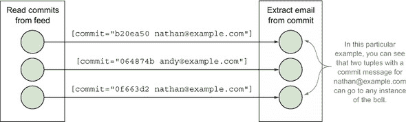

在这个例子中，我们不在乎元组是如何传递到我们 bolt 实例的，所以我们选择 shuffle grouping 来随机分配元组。使用 shuffle grouping 可以保证每个 bolt 实例应该接收相对相等数量的元组，从而在所有 bolt 实例之间分配负载。shuffle grouping 分配是随机进行的，而不是轮询，因此不能保证分配的精确平等。

这种分组在许多基本情况下都很有用，在这些情况下您没有关于如何将数据传递给 bolt 的特殊要求。但有时您会遇到一些场景，在这些场景中，根据您的需求，将元组发送到随机 bolt 实例将不起作用——就像我们在螺栓提取电子邮件和更新电子邮件之间发送元组的场景一样。我们需要不同类型的流分组来完成这项工作。

##### 字段分组

提取电子邮件的 bolt 和更新电子邮件的 bolt 之间的流需要使用字段分组。*字段分组*确保具有特定字段名相同值的元组始终被发射到 bolt 的同一实例。为了理解为什么字段分组对我们第二个流是必要的，让我们看看使用内存映射来跟踪每个电子邮件提交数量的后果。

每个 bolt 实例都将有自己的电子邮件/提交计数对映射，因此确保相同的电子邮件发送到同一 bolt 实例对于确保所有 bolt 实例中每个电子邮件的计数准确是必要的。字段分组正好提供了这一点(图 2.15)。

##### 图 2.15\. 使用字段分组来处理将具有单独内存映射的每个螺栓实例的螺栓。

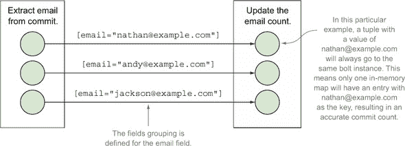

在这个例子中，使用内存映射来实现电子邮件计数决策导致了需要字段分组。我们本可以使用跨 bolt 实例共享的资源来消除这一需求。我们将在第三章及以后探讨类似的设计和实现考虑因素，但就目前而言，让我们将重点转移到我们需要使拓扑运行起来的代码上。

### 2.3\. 在 Storm 中实现 GitHub 提交计数仪表板

现在我们已经涵盖了 Storm 中的所有重要概念，是时候开始编写我们拓扑的代码了。本节将从单个 spout 和 bolt 的代码开始，并介绍相关的 Storm 接口和类。其中一些接口和类您将直接使用，而另一些则不会；无论如何，理解 Storm API 的整体层次结构将使您对拓扑及其相关代码有更全面的理解。

在我们介绍了 spout 和 bolt 的代码之后，我们将讨论将所有这些放在一起所需的代码。如果您还记得我们之前的讨论，我们的拓扑包含流和流分组。spout 和 bolt 的代码只是其中一部分——您仍然需要定义元组在拓扑组件之间发射的位置和方式。在讨论构建拓扑所需的代码时，您将遇到一些 Storm 的配置选项，其中大部分将在本书的后面部分进行更详细的介绍。

最后，在我们通过在拓扑中定义流和流分组连接好一切之后，我们将向您展示如何在本地运行您的拓扑，让您可以测试一切是否按预期工作。但在我们深入所有这些代码之前，让我们为您设置一个基本的 Storm 项目。

#### 2.3.1\. 设置 Storm 项目

将 Storm JAR 文件添加到您的类路径以进行开发的最简单方法是使用 Apache Maven。

|  |
| --- |

##### 注意

您可以在[`storm.apache.org/documentation/Creating-a-new-Storm-project.html`](http://storm.apache.org/documentation/Creating-a-new-Storm-project.html)找到设置 Storm 的其他方法，但 Maven 无疑是其中最简单的。有关 Maven 的信息，请访问[`maven.apache.org/`](http://maven.apache.org/)。

|  |
| --- |

将下一列表中的代码添加到您的项目 pom.xml 文件中。

##### 列表 2.2\. pom.xml

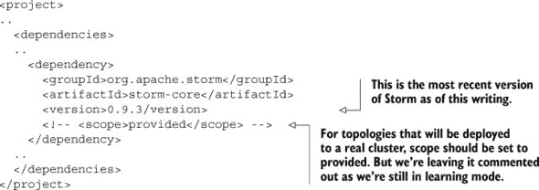

一旦您将这些添加到 pom.xml 文件中，您应该拥有编写代码和在本地的开发机器上运行 Storm 拓扑所必需的所有依赖项。

#### 2.3.2\. 实现喷口

因为拓扑中的数据入口是喷口（spout），所以我们将从这里开始编码。在深入细节之前，让我们先检查 Storm 中喷口的一般接口和类结构。图 2.16 解释了这个类层次结构。

##### 图 2.16\. Storm 的喷口类层次结构

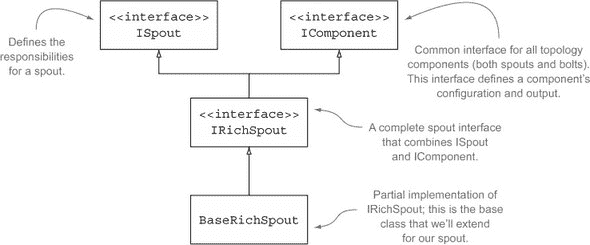

在这个设计中，喷口通过 GitHub API 监听对特定 GitHub 项目的提交实时流，并发出包含整个提交信息的元组，如图图 2.17 所示。

##### 图 2.17\. 喷口监听提交信息流并为每个提交信息发出一个元组。

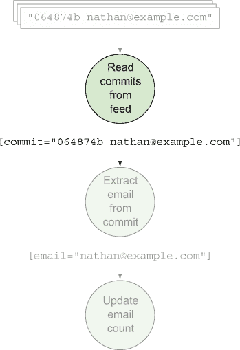

设置一个喷口以监听实时流需要一些工作，我们认为这会分散对基本代码的理解。因此，我们将采取作弊的方式，通过让我们的喷口持续读取一个包含提交信息的文件来模拟实时流，并为文件中的每一行发出一个元组。不用担心；在后面的章节中，我们将连接喷口到实时流，但现在我们的重点是基础知识。changelog.txt 文件将位于我们的喷口类旁边，并包含预期格式的提交信息列表（如下所示）。

##### 列表 2.3\. 我们简单数据源的摘录：changelog.txt

```
b20ea50 nathan@example.com
064874b andy@example.com
28e4f8e andy@example.com
9a3e07f andy@example.com
cbb9cd1 nathan@example.com
0f663d2 jackson@example.com
0a4b984 nathan@example.com
1915ca4 derek@example.com
```

一旦我们定义了数据源，我们就可以转向喷口的实现，如下一列表所示。

##### 列表 2.4\. CommitFeedListener.java

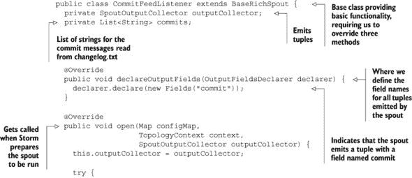

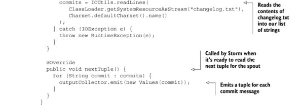

我们的 spout 中正在进行很多事情。我们首先通过扩展`BaseRichSpout`，这给了我们三个需要重写的方法。这些方法中的第一个是`declareOutputFields`。记得在章节开头我们提到过我们会讨论 Storm 如何为元组分配名称吗？嗯，这里就是。`declareOutputFields`方法是我们定义这个 spout 发射的元组中值的名称的地方。为发射的元组值定义名称是通过`Fields`类完成的，其构造函数接受多个字符串；每个字符串是发射元组中值的名称。`Fields`构造函数中名称的顺序必须与通过`Values`类在元组中发射的值的顺序相匹配。因为我们的 spout 发射的元组包含单个值，所以我们向`Fields`传递了一个单个参数，`commit`。

下一个我们需要重写的方法是`open`；这是我们将 changelog.txt 的内容读入我们的字符串列表中的地方。如果我们为处理实时数据源（如消息队列）的 spout 编写代码，这就是我们放置连接到该数据源代码的地方。你将在第三章开始时看到更多关于这个的内容。第三章。

我们需要重写的最后一个方法是`nextTuple`。这是 Storm 在准备好让 spout 读取和发射一个新的元组时调用的方法，通常根据 Storm 的周期性调用。在我们的例子中，每次调用`nextTuple`时，我们都会为列表中的每个值发射一个新的元组，但对于从实时数据源读取的东西，例如消息队列，只有当有新的数据可用时，才会发射新的元组。

你还会注意到一个名为`SpoutOutputCollector`的类。输出收集器是你在 spout 和 bolt 中都会经常看到的东西。它们负责发射和失败元组。

现在我们知道了我们的 spout 如何从数据源获取提交消息并为每个提交消息发射新的元组，我们需要实现将这些提交消息转换成电子邮件到提交计数映射的代码。

#### 2.3.3\. 实现 bolt

我们已经实现了作为流源头的 spout，现在该转向 bolt 了。图 2.18 解释了 Storm 中 bolt 的一般接口和类结构。

##### 图 2.18\. Bolt 的 Storm 类层次结构

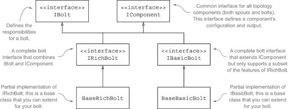

你会在 图 2.18 中注意到，bolt 的类层次结构比 spout 的稍微复杂一些。原因是 Storm 为那些具有极其简单实现（`IBasicBolt`/`BaseBasicBolt`）的 bolt 提供了额外的类。这些类接管了通常由 `IRichBolt` 可用的责任，因此使得 bolt 的简单实现更加简洁。`IBasicBolt` 的简单性是以牺牲通过 `IRichBolt` 可用的丰富功能集的流畅性为代价的。我们将在 第四章 中详细说明 `BaseRichBolt` 和 `Base-BasicBolt` 之间的区别，并解释何时使用任一。在本章中，我们将使用 `BaseBasicBolt`，因为 bolt 的实现相当直接。

要回顾我们的设计，请记住，在我们的拓扑中有两个 bolt（见图 2.19）。一个 bolt 接受包含完整提交消息的元组，从中提取电子邮件，并发射包含电子邮件的元组。第二个 bolt 维护一个电子邮件到提交计数的内存映射。

##### 图 2.19\. 我们拓扑中的两个 bolt：第一个 bolt 从提交消息中提取电子邮件，第二个 bolt 维护一个电子邮件到提交计数的内存映射。

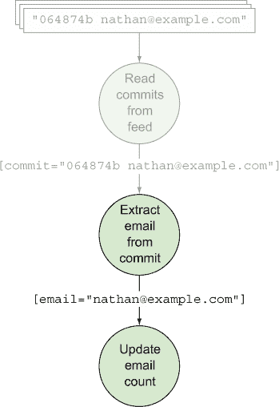

让我们看看这些 bolt 的代码，从下一列表中的 EmailExtractor.java 开始。

##### 列表 2.5\. EmailExtractor.java

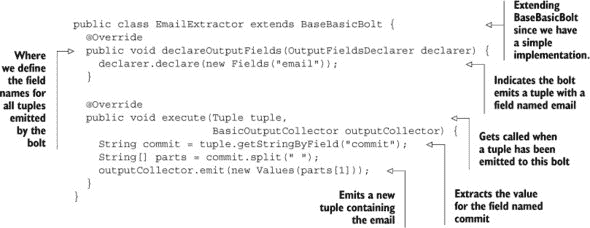

EmailExtractor.java 的实现相当小，这也是我们决定扩展 `BaseBasicBolt` 的主要原因。如果你稍微深入一点查看代码，你会注意到它与我们的 spout 代码有一些相似之处，即我们声明这个 bolt 发射的元组中值的名称的方式。在这里，我们定义了一个名为 `email` 的单个字段。

就 bolt 的 `execute` 方法而言，我们只是在空白处拆分字符串以获取电子邮件，并发射一个包含该电子邮件的新元组。还记得我们之前在 spout 实现中提到的输出收集器吗？这里我们也有类似的东西，即 `BasicOutputCollector`，它发射这个元组，将其发送到拓扑中的下一个 bolt，即电子邮件计数器。

电子邮件计数器中的代码结构与 EmailExtractor.java 类似，但设置和实现稍微多一点，如下一列表所示。

##### 列表 2.6\. EmailCounter.java

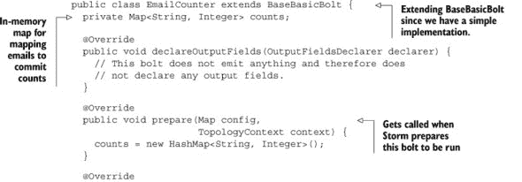

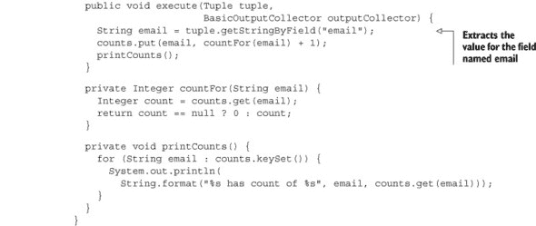

再次，我们决定扩展 `BaseBasicBolt`。尽管 EmailCounter.java 比 EmailExtractor.java 更复杂，但我们仍然可以通过 `BaseBasicBolt` 获取的功能来实现。你会注意到的一个区别是我们重写了 `prepare` 方法。这个方法在 Storm 准备 bolt 执行之前被调用，是我们为 bolt 执行任何设置的方法。在我们的情况下，这意味着实例化内存映射。

谈到内存映射，你会发现这是一个针对单个 bolt 实例的私有成员变量。这应该让你想起我们在 2.2.6 节中提到的事情，这也是我们被迫在两个 bolt 之间的流中使用 fields 分组的理由。

所以，我们现在有了我们的 spout 和两个 bolt 的代码。接下来是什么？我们需要以某种方式告诉 Storm 流的位置，并为每个流标识流分组。我们想象你很渴望运行这个拓扑并看到它的实际效果。这就是将所有组件连接起来发挥作用的地方。

#### 2.3.4\. 将所有组件连接起来形成拓扑结构

我们 spout 和 bolt 的实现本身并没有什么用处。我们需要构建拓扑，定义 spout 和 bolt 之间的流和流分组。之后，我们希望能够运行一个测试来确保一切按预期工作。Storm 提供了你完成这个任务所需的所有类。这些类包括以下内容：

+   **`TopologyBuilder`—** 这个类用于拼接 spout 和 bolt，定义它们之间的流和流分组。

+   **`Config`—** 这个类用于定义拓扑级别的配置。

+   **`StormTopology`—** 这个类是`TopologyBuilder`构建的，也是提交给集群运行的内容。

+   **`LocalCluster`—** 这个类在本地机器上模拟 Storm 集群，允许我们轻松地运行拓扑进行测试。

在对这些类有了基本理解之后，我们将构建拓扑并将其提交给本地集群，如下一列表所示。

##### 列表 2.7\. LocalTopologyRunner.java

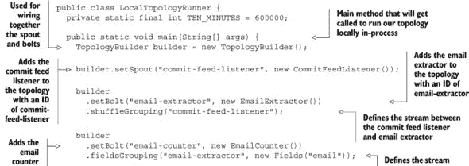

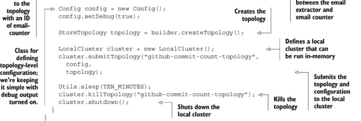

你可以将主方法想象成分为三个部分。第一部分是我们构建拓扑并告诉 Storm 流的位置，以及为这些流标识流分组。下一部分是创建配置。在我们的例子中，我们已经打开了调试日志。本书后面还会介绍更多配置选项。最后一部分是将配置和构建的拓扑提交给本地集群以运行。在这里，我们运行本地集群 10 分钟，持续发出我们的 changelog.txt 文件中每个提交消息的 tuple。这应该在拓扑中提供足够的活动。

如果我们通过`java -jar`运行 LocalTopologyRunner.java 的主方法，我们会在控制台看到调试日志消息飞快地闪过，显示我们的 spout 发出的 tuple 和我们的 bolt 处理的 tuple。就这样；你已经构建了你的第一个拓扑！在掌握了基础知识之后，我们仍需要解决本章中提到的某些问题。我们将从解决一些好的拓扑设计实践开始，这些实践将在第三章中介绍。

### 2.4\. 概述

在本章中，你学习了以下内容

+   拓扑是一个图，其中节点代表单个进程或计算，边代表一个计算的结果作为另一个计算的输入。

+   元组是有序值列表，其中列表中的每个值都分配了一个名称。元组代表两个组件之间传递的数据。

+   两个组件之间元组的流动称为流。

+   发射器充当流的来源；它们唯一的目的就是从源读取数据并将其元组发出到输出流。

+   螺栓是拓扑中核心逻辑所在之处，执行如过滤器、聚合、连接和与数据库通信等操作。

+   集合器和螺栓（称为组件）作为单个或多个实例执行，向其他螺栓实例发出元组。

+   元组在组件的各个实例之间流动的方式由流分组定义。

+   为您的发射器和螺栓实现代码只是其中一部分；您还需要将它们连接起来并定义流和流分组。

+   在本地模式下运行拓扑是测试您的拓扑是否正常工作的最快方式。
