## 第三章. 拓扑设计

*本章涵盖*

+   将问题分解以适应 Storm 结构

+   与不可靠的数据源一起工作

+   集成外部服务和数据存储

+   理解 Storm 拓扑中的并行性

+   遵循拓扑设计的最佳实践

在上一章中，我们通过构建一个简单的拓扑来计算提交到 GitHub 项目的提交次数，从而开始了我们的实践。我们将它分解成了 Storm 的两个主要组件——spouts 和 bolts，但我们没有关注为什么这样做。本章通过向你展示如何使用 Storm 来思考和设计解决方案，扩展了这些基本的 Storm 概念。你将学习到帮助你设计出良好设计的策略：一个表示当前问题工作流程的模型。

此外，了解可伸缩性（或工作单元的并行化）是如何内置到 Storm 中的也很重要，因为它会影响你在拓扑设计中所采取的方法。我们还将探讨提高拓扑速度的策略。

在阅读本章后，你不仅能够轻松地分解问题并看到它如何在 Storm 中适用，而且你还能确定 Storm 是否是解决该问题的正确解决方案。本章将为你提供对拓扑设计的坚实基础，以便你能够设想大数据问题的解决方案。

让我们从探索如何接近拓扑设计开始，然后根据我们概述的步骤分解一个现实场景。

### 3.1\. 接近拓扑设计

拓扑设计的步骤可以分解为以下五个步骤：

1.  ***定义问题/形成概念性解决方案***—**这一步旨在对正在解决的问题有一个清晰的理解。它还作为一个地方来记录对任何潜在解决方案（包括与速度有关的要求，这是大数据问题中的常见标准）的要求。这一步涉及建模一个解决方案（不是实现），该解决方案解决了问题的核心需求。

1.  ***将解决方案映射到 Storm***—**在这一步中，你遵循一系列原则，将提出的解决方案分解成一种方式，以便你能够设想它如何映射到 Storm 原语（即 Storm 概念）。在这一阶段，你将为你自己的拓扑设计出一个方案。这个方案将在接下来的步骤中根据需要进行调整和优化。

1.  ***实现初始解决方案***—**在这个阶段，每个组件都将被实现。

1.  ***扩展拓扑***—**在这一步中，你将调整 Storm 为你提供的旋钮，以便以规模运行此拓扑。

1.  ***根据观察调整***—**最后，你将根据运行时的观察行为调整拓扑。这一步可能涉及为了实现规模而进行的额外调整，以及可能为了效率而需要的设计变更。

让我们将这些步骤应用到现实世界的问题中，以展示如何完成每个步骤。我们将使用社会热图来完成，它包含与拓扑设计相关的几个具有挑战性的主题。

### 3.2\. 问题定义：社会热图

想象一下这个场景：现在是周六晚上，你和朋友们在酒吧里喝酒，享受美好的生活。你喝完了第三杯，开始觉得需要换换环境。也许去一个不同的酒吧？选择太多了——你甚至不知道怎么选择？作为一个社交达人，当然你希望最终能去最受欢迎的酒吧。你不想去你所在地区杂志上被评为最佳的地方。那已经是上周的事情了。你想要的是现在正在发生的事情，而不是上周，甚至不是上一个小时。你是潮流的引领者。你有责任让你的朋友们玩得开心。

好吧，也许那不是你。但这代表的是平均社会网络用户吗？现在我们能做些什么来帮助这个人呢？如果我们能以图形形式展示这个人正在寻找的答案，那就太理想了——一张能够快速传达酒吧活动密度最高的地区的热点地图。热图可以识别像纽约或旧金山这样的大城市中的普通地区，通常在挑选热门酒吧时，最好有几个彼此靠近的选择，以防万一。

| |
| --- |

**热图的其他案例研究**

哪些问题通过使用热图进行可视化会受益？一个好的候选者应该允许你使用热图的强度来模拟一组数据点相对于区域内（地理或其他）其他点的相对重要性：

+   加利福尼亚野火蔓延、东海岸即将来临的飓风或疾病的爆发可以通过热图进行模拟和表示，以警告居民。

+   在选举日，你可能想知道

    +   哪个政治选区有最多的选民投票？你可以通过模拟投票数来反映强度，在热图上描绘出来。

    +   你可以通过将政党、候选人或问题模拟为不同的颜色来描绘哪个政党/候选人/问题获得了最多的选票，颜色的强度反映了选票的数量。

| |
| --- |

我们已经提供了一个一般的问题定义。在继续前进之前，让我们形成一个概念性的解决方案。

#### 3.2.1\. 概念性解决方案的形成

我们应该从哪里开始？多个社交网络都包含了签到概念。假设我们能够访问一个收集所有这些网络酒吧签到的数据喷泉。这个喷泉将为每个签到发射一个酒吧的地址。这为我们提供了一个起点，但也要有一个目标在心中。假设我们的目标是带有热图覆盖的地理地图，以识别最受欢迎的酒吧所在的社区。图 3.1 展示了我们提出的解决方案，我们将从不同场所转换多个签到信息以在热图中显示。

##### 图 3.1\. 使用签到信息构建酒吧热图

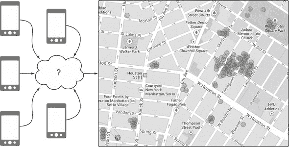

我们需要在 Storm 中建模的解决方案，变成了将签到信息（或聚合）转换成可以绘制在热图上的数据集的方法。

### 3.3\. 将解决方案映射到 Storm 的准则

最佳的起点是思考通过这个系统流动的数据的本质。当我们更好地理解数据流中包含的奇特之处时，我们可以更适应这个系统可能面临的实际要求。

#### 3.3.1\. 考虑数据流强加的要求

我们有一个喷泉式地发射酒吧地址的检查流。但这个签到流并不能可靠地代表每个去过酒吧的用户。签到并不等同于在某个地点的物理存在。更好的想法是将其视为现实生活的样本，因为并非每个用户都会签到。但这让我们质疑签到数据是否真的有助于解决这个问题。在这个例子中，我们可以安全地假设酒吧的签到与那些地点的人数成比例。

因此，我们知道以下内容：

+   签到是现实场景的样本，但并不完整。

+   它们是成比例的代表性。

| |
| --- |

##### 注意

让我们假设数据量足够大，可以弥补数据丢失，并且任何数据丢失都是间歇性的，不足以造成服务中断的明显影响。这些假设帮助我们描绘了一个与不可靠数据源合作的情况。

| |
| --- |

我们对我们数据流的第一个洞察：一个成比例的代表性但可能不完整的签到流。接下来是什么？我们知道我们的用户希望尽快收到关于活动最新趋势的通知。换句话说，我们有一个严格的速度要求：尽可能快地将结果呈现给用户，因为数据的价值会随时间而降低。

从对数据流的考虑中可以看出，我们不必过于担心数据丢失。我们可以得出这个结论，因为我们知道我们的输入数据集是不完整的，所以不需要达到某些任意、微小的精度程度的准确性。但它是成比例的代表性，这对于确定流行度来说已经足够了。结合速度的要求，我们知道只要我们能快速将最近的数据提供给用户，他们就会满意。即使发生数据丢失，过去的结果也会很快被替换。

这种场景直接映射到在 Storm 中处理不可靠数据源的概念。在不可靠的数据源中，你无法重试失败的操作；数据源可能没有重放数据点的能力。在我们的案例中，我们通过签到方式抽样现实生活，这模拟了不完整数据集的可用性。

相反，可能存在你与可靠数据源一起工作的情形——这种数据源有能力重放失败的数据点。但也许准确性不如速度重要，你可能不想利用可靠数据源的重放能力。那么近似值可能同样可以接受，而你通过选择忽略它提供的任何可靠性措施，将可靠数据源当作不可靠数据源来处理。

| |
| --- |

##### 备注

我们将在第四章中介绍可靠数据源以及容错性。

| |
| --- |

定义了数据源之后，下一步是确定单个数据点如何通过我们提出的解决方案流动。我们将在下一节探讨这个话题。

#### 3.3.2\. 将数据点表示为元组

我们下一步是确定通过这个流流动的各个数据点。通过考虑开始和结束是很容易完成这个任务的。我们从一个由活跃酒吧的街道地址组成的一系列数据点开始。我们还需要知道签到发生的时间。因此，我们的输入数据点可以表示如下：

```
[time="9:00:07 PM", address="287 Hudson St New York NY 10013"]
```

这是签到发生的时间和地址。这将是我们由 spout 发出的输入元组。如您从第二章中回忆的那样，*元组*是 Storm 表示数据点的原始数据结构，而*spout*是元组流的来源。

我们的目标是构建一个显示酒吧最新活动的热图。因此，我们需要最终得到表示地图上及时坐标的数据点。我们可以将一个时间间隔（例如，如果我们想要 15 秒的增量，可以说从晚上 9:00:00 到 9:00:15）附加到该间隔内发生的一组坐标上。然后在热图显示的点，我们可以选择最新的可用时间间隔。地图上的坐标可以通过纬度和经度来表示（例如，纽约，纽约的纬度为 40.7142° N，经度为 74.0064° W）。将 40.7142° N，74.0064° W 表示为（40.7142，-74.0064）是标准形式。但是，可能会有多个坐标表示在时间窗口内的多个签到。因此，我们需要一个时间间隔的坐标列表。然后我们的最终数据点开始看起来像这样：

```
[time-interval="9:00:00 PM to 9:00:15 PM",
 hotzones=List((40.719908,-73.987277),(40.72612,-74.001396))]
```

这是一个包含时间间隔和两个不同酒吧对应签到的最终数据点。

如果在那个时间间隔内同一酒吧有两次或更多签到怎么办？那么那个坐标将被重复。我们如何处理这种情况？一个选择是记录该坐标在该时间窗口内的出现次数。这涉及到根据一些任意但有用的精度确定坐标的相同性。为了避免所有这些，让我们在多个签到的时间间隔内保留任何坐标的副本。通过将相同坐标的多个倍数添加到热图中，我们可以让地图生成器利用多个出现次数作为热度级别（而不是使用出现次数来达到这个目的）。

我们的目标数据点将看起来像这样：

```
[time-interval="9:00:00 PM to 9:00:15 PM",
 hotzones=List((40.719908,-73.987277),
               (40.72612,-74.001396),
               (40.719908,-73.987277))]
```

注意，第一个坐标是重复的。这是我们最终元组，将以热图的形式提供。按时间间隔分组坐标列表有以下优点：

+   允许我们通过使用 Google Maps API 轻松构建热图。我们可以通过在常规 Google 地图上添加热图覆盖来实现这一点。

+   让我们回到过去，查看任何特定时间间隔的热图。

拥有输入数据点和最终数据点只是问题的一部分；我们仍然需要确定如何从 A 点到 B 点。

#### 3.3.3. 确定拓扑结构的步骤

我们设计 Storm 拓扑的方法可以分为三个步骤：

1.  确定输入数据点以及它们如何表示为元组。

1.  确定解决问题所需的最终数据点以及它们如何表示为元组。

1.  通过创建一系列操作来连接输入元组和最终元组，以填补它们之间的差距。

我们已经知道我们的输入和期望的输出：

输入元组：

```
[time="9:00:07 PM", address="287 Hudson St New York NY 10013"]
```

最终元组：

```
[time-interval="9:00:00 PM to 9:00:15 PM",
 hotzones=List((40.719908,-73.987277),
               (40.72612,-74.001396),
               (40.719908,-73.987277))]
```

在某个过程中，我们需要将酒吧地址转换为这些最终元组。图 3.2 展示了我们如何将这些操作分解成一系列。

##### 图 3.2. 通过一系列操作将输入元组转换为最终元组

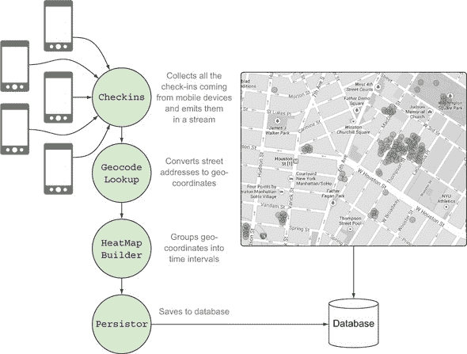

让我们看看这些步骤是如何映射到 Storm 原语（我们使用*Storm 原语*和*Storm 概念*这两个术语互换）的。

##### 作为 spout 和 bolt 的操作

我们创建了一系列操作，将输入元组转换为最终元组。让我们看看这四个操作是如何映射到 Storm 原语的：

+   **`Checkins`—** 这将是输入元组进入拓扑的来源，因此在 Storm 的概念中，这将是我们的 spout。在这种情况下，因为我们使用的是一个不可靠的数据源，我们将构建一个没有重试失败能力的 spout。我们将在第四章中讨论重试失败。

+   **`GeocodeLookup`—** 这将接收我们的输入元组，并通过查询 Google Maps Geocoding API 将街道地址转换为地理坐标。这是拓扑中的第一个 bolt。

+   **`HeatMapBuilder`—** 这是拓扑中的第二个 bolt，它将在内存中保持一个数据结构，将每个传入的元组映射到一个时间间隔，从而按时间间隔分组签到。当每个时间间隔完全过去后，它将发出与该时间间隔相关的坐标列表。

+   **`Persistor`—** 我们将在我们的拓扑中使用这个第三个也是最后一个 bolt 来将我们的最终元组保存到数据库中。

图 3.3 提供了设计映射到 Storm 概念的说明。

##### 图 3.3\. 热图设计映射到 Storm 概念

![03fig03_alt.jpg]

到目前为止，我们已经讨论了元组、spout 和 bolt。在图 3.3 中，有一件事我们没有讨论，那就是每个流的流分组。当我们下一节讨论拓扑的代码时，我们将更详细地介绍每个分组。

### 3.4\. 设计的初始实现

设计完成后，我们准备着手实现每个组件的实现。就像我们在第二章中做的那样，我们将从 spout 和 bolt 的代码开始，并以将它们全部连接起来的代码结束。稍后，我们将调整这些实现以提高效率或解决它们的一些不足。

#### 3.4.1\. Spout：从源读取数据

在我们的设计中，spout 监听社交签到的大流量，并为每个单独的签到发出一个元组。图 3.4 提供了我们在拓扑设计中的位置提醒。

##### 图 3.4\. spout 监听社交签到的大流量，并为每个签到发出一个元组。

![03fig04.jpg]

为了本章的目的，我们将使用一个文本文件作为签到数据源。为了将这个数据集输入到我们的 Storm 拓扑中，我们需要编写一个从该文件读取并为每行发出一个元组的 spout。文件 checkins.txt 将位于我们的 spout 类旁边，并包含按预期格式列出的签到列表（见以下列表）。

##### 列表 3.1\. 我们简单数据源 checkins.txt 的摘录

```
1382904793783, 287 Hudson St New York NY 10013
1382904793784, 155 Varick St New York NY 10013
1382904793785, 222 W Houston St New York NY 10013
1382904793786, 5 Spring St New York NY 10013
1382904793787, 148 West 4th St New York NY 10013
```

下一个列表显示了读取此检查文件泄漏的泄漏实现。由于我们的输入元组是时间和地址，我们将时间表示为 `Long`（毫秒级 Unix 时间戳），将地址表示为 `String`，在文本文件中以逗号分隔这两个。

##### 列表 3.2\. `Checkins.java`

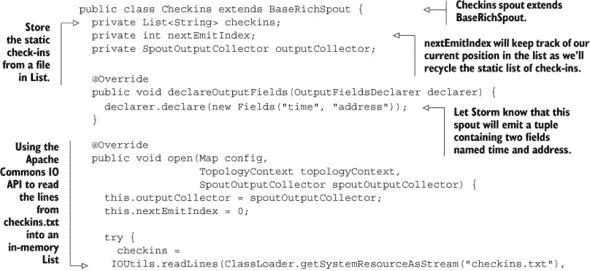

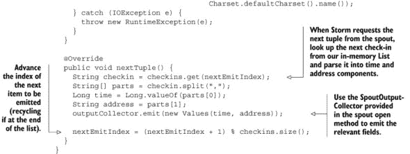

由于我们将此视为不可靠的数据源，因此泄漏保持简单；它不需要跟踪哪些元组失败以及哪些元组成功，以便提供容错性。这不仅简化了泄漏实现，还减少了 Storm 需要内部进行的记录工作，从而加快了速度。当不需要容错性并且我们可以定义一个服务级别协议（SLA），允许我们随意丢弃数据时，不可靠的数据源可以是有益的。它更容易维护，并且提供了更少的故障点。

#### 3.4.2\. 螺栓：连接到外部服务

拓扑中的第一个螺栓将接收由 `Checkins` 泄露的元组中的地址数据点，并通过查询谷歌地图地理编码服务将该地址转换为坐标。图 3.5 突出了我们目前正在实现的螺栓。

##### 图 3.5\. 地理编码查找螺栓接受社交检查并检索与该检查相关的坐标。

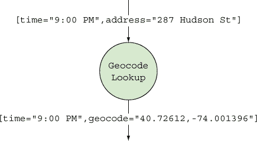

这个螺栓的代码可以在列表 3.3 中看到。我们使用来自[`code.google.com/p/geocoder-java/`](https://code.google.com/p/geocoder-java/)的谷歌地理编码 Java API 来检索坐标。

##### 列表 3.3\. `GeocodeLookup.java`

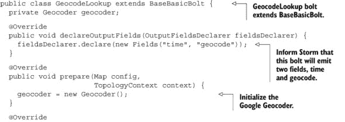

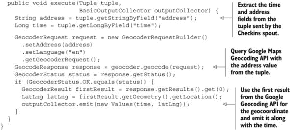

我们有意使与谷歌地理编码 API 的交互保持简单。在实际实现中，我们应该处理地址可能无效的错误情况。此外，谷歌地理编码 API 在这种方式下使用时施加配额，这个配额相当小，对于大数据应用来说不实用。对于这样一个大数据应用，如果你想使用它们作为地理编码的提供者，你需要从谷歌获得一个具有更高配额的访问级别。其他可以考虑的方法包括在数据中心本地缓存地理编码结果，以避免对谷歌 API 进行不必要的调用。

现在我们有了每个检查的时间地理坐标。我们取我们的输入元组

```
[time="9:00:07 PM", address="287 Hudson St New York NY 10013"]
```

并将其转换成这样：

```
[time="9:00 PM", geocode="40.72612,-74.001396"]
```

这个新的元组将被发送到通过时间间隔维护检查组群的螺栓，我们现在将探讨这一点。

#### 3.4.3\. 螺栓：内存中收集数据

接下来，我们将构建表示热图的数据结构。图 3.6 展示了我们在设计中的位置。

##### 图 3.6\. 热图构建螺栓接受包含时间和地理编码的元组，并发出包含时间间隔和地理编码列表的元组。

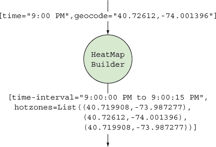

这里适合哪种数据结构？我们从这个 bolt 的前一个 `GeocodeLookup` bolt 接收元组，形式为 `[time="9:00 PM", geocode= "40.72612,-74.001396"]`。我们需要按时间间隔对这些进行分组——让我们假设是 15 秒的间隔，因为我们想每 15 秒显示一个新的热图。我们的最终元组需要以 `[time-interval="9:00:00 PM to 9:00:15 PM", hotzones= List((40.719908,-73.987277),(40.72612,-74.001396),(40.719908,-73.987277))]` 的形式存在。

要按时间间隔分组地理坐标，我们可以在内存中维护一个数据结构，并将传入的元组收集到该数据结构中，这些数据结构由时间间隔隔离。我们可以将其建模为一个映射：

```
Map<Long, List<LatLng>> heatmaps;
```

此映射的键是我们间隔开始的时间。我们可以省略时间间隔的结束，因为每个间隔长度相同。值将是落入该时间间隔的坐标列表（包括重复项——重复项或更接近的坐标将表示热图上的热点区域或强度）。

让我们分三步开始构建热图：

1.  将传入的元组收集到内存映射中。

1.  配置此 bolt 接收给定频率的信号。

1.  将经过的时间间隔的聚合热图发射到 `Persistor` bolt 以保存到数据库。

让我们逐个查看每个步骤，然后我们可以将所有内容组合起来，从下一个列表开始。

##### 列表 3.4\. `HeatMapBuilder.java`: 第 1 步，将传入的元组收集到内存映射中

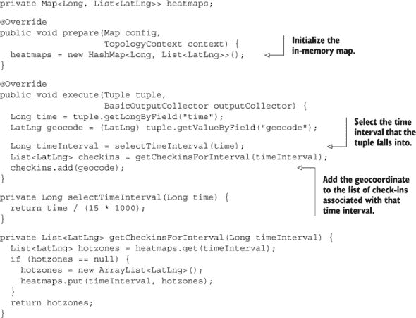

进入的元组所属的绝对时间间隔是通过将签到时间除以间隔长度来选择的——在本例中为 15 秒。例如，如果签到时间是下午 9:00:07.535，那么它应该落在下午 9:00:00.000–9:00:15.000 的时间间隔内。我们在这里提取的是该时间间隔的开始，即下午 9:00:00.000。

现在我们正在收集所有元组到一个热图中，我们需要定期检查它，并从完成的时间间隔中发射坐标，以便它们可以通过下一个 bolt 持久化存储。

##### 检查元组

有时你需要定期触发一个动作，比如聚合一批数据或将一些写入操作刷新到数据库中。Storm 有一个名为 *tick tuples* 的功能来处理这种情况。Tick tuples 可以配置为以用户定义的频率接收，当配置后，bolt 上的 `execute` 方法将以给定频率接收 tick tuple。你需要检查元组以确定它是否是这些系统发出的 tick tuples 之一，或者它是否是一个普通元组。拓扑中的普通元组将通过默认流流动，而 tick tuples 则通过系统 tick 流流动，这使得它们很容易被识别。以下列表显示了在 `HeatMapBuilder` bolt 中配置和处理 tick tuples 的代码。

##### 列表 3.5\. `HeatMapBuilder.java`: 第 2 步，配置接收给定频率的信号

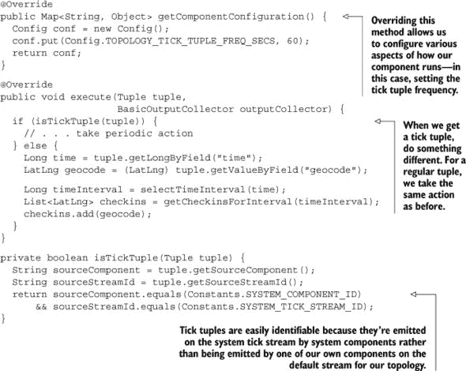

查看代码在列表 3.5，你会注意到 tick 元组是在 bolt 级别配置的，如`getComponentConfiguration`实现所示。相关的 tick 元组将只发送到这个 bolt 的实例。

|  |
| --- |

**tick 元组的发射频率**

我们配置了 tick 元组以每 60 秒的频率发射。这并不意味着它们会精确地每 60 秒发射一次；这是尽力而为的方式。发送到 bolt 的 tick 元组将排队在等待被该 bolt 的`execute()`方法消费的其他元组后面。如果 bolt 因为处理常规元组流的延迟而落后，它可能不会以发射频率处理 tick 元组。

|  |
| --- |

现在让我们使用这个 tick 元组作为信号来选择已经过去的时间段，我们不再期望有新的坐标进入，并从这个 bolt 中发射它们，以便下一个 bolt 可以接收（参见下一列表）。

##### 列表 3.6\. `HeatMapBuilder.java`：步骤 3，发射经过时间间隔的聚合 HeatMap

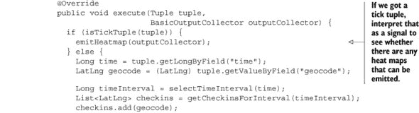

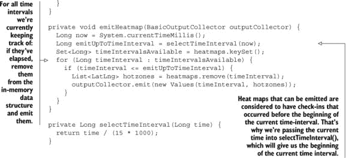

步骤 1、2 和 3 提供了一个完整的`HeatMapBuilder`实现，展示了如何使用内存中的映射来维护状态，以及如何使用 Storm 的内置 tick 元组在特定时间间隔发射元组。随着这个实现的完成，让我们继续持久化由`HeatMapBuilder`发射的元组的结果。

|  |
| --- |

**线程安全**

我们正在将坐标收集到一个内存映射中，但我们创建它作为一个常规`HashMap`的实例。Storm 非常可扩展，有多个元组进入并添加到这个映射中，我们也会定期从这个映射中删除条目。像这样修改内存数据结构是否是线程安全的？

是的，它是线程安全的，因为`execute()`一次只处理一个元组。无论是我们的常规元组流还是 tick 元组，只有一个 JVM 执行线程会通过并处理这个 bolt 实例中的代码。所以在一个特定的 bolt 实例中，永远不会有多线程通过它。

这是否意味着你永远不会在 bolt 的范围内担心线程安全？不，在某些情况下你可能需要。

有一种情况与元组在发送到 bolt 之间在不同线程上序列化时的值有关。例如，当你不复制内存中的数据结构而直接发射它，并且它在不同线程上序列化时，如果在序列化过程中改变了该数据结构，你会得到一个`Concurrent-ModificationException`。理论上，所有发射到`OutputCollector`的东西都应该防范此类场景。一种方法是将发射的任何值都设置为不可变的。

另一个案例是，您可能可以使用 bolt 的`execute()`方法创建自己的线程。例如，如果您不是使用 tick tuples，而是启动了一个定期发出热图的背景线程，那么您需要关注线程安全性，因为您将有自己的线程和 Storm 的执行线程都通过您的 bolt 运行。

| |
| --- |

#### 3.4.4. Bolt：持久化到数据存储

我们有表示热图的最终元组。在这个阶段，我们准备将数据持久化到某个数据存储中。我们的基于 JavaScript 的 Web 应用程序可以从这个数据存储中读取热图值，并与 Google Maps API 交互，从这些计算值中构建地理可视化。图 3.7 说明了我们设计中的最终 bolt。

##### 图 3.7. `Persistor` bolt 接受一个包含时间间隔和地理编码列表的元组，并将这些数据持久化到数据存储中。

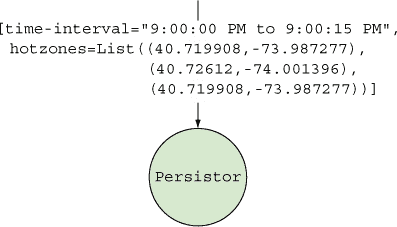

由于我们根据时间间隔存储和访问热图，因此使用键值数据模型进行存储是有意义的。在本案例研究中，我们将使用 Redis，但任何支持键值模型的数据存储都足够（例如 Membase、Memcached 或 Riak）。我们将使用时间间隔作为键，将热图本身作为坐标列表的 JSON 表示来存储热图。我们将使用 Jedis 作为 Redis 的 Java 客户端，并使用 Jackson JSON 库将热图转换为 JSON。

| |
| --- |

**NoSQL 和其他与 Storm 一起使用的数据存储**

检查可用于处理大数据集的各种 NoSQL 和数据存储解决方案超出了本书的范围，但请确保在选择数据存储解决方案时从正确的起点开始。

人们通常会考虑他们可用的各种选项，并问自己，“我应该选择这些 NoSQL 解决方案中的哪一个？”这是错误的方法。相反，你应该问自己关于你正在实施的功能以及它们对任何数据存储解决方案提出的要求的问题。

你应该问自己，你的用例是否需要一个支持以下功能的数据存储：

+   随机读取或随机写入

+   顺序读取或顺序写入

+   高读取吞吐量或高写入吞吐量

+   数据一旦写入是否改变或保持不变

+   适合您数据访问模式的存储模型

    +   列/列族导向

    +   键值

    +   文档导向

    +   模式/无模式

+   是否更希望一致性或可用性

一旦你确定了你的需求组合，很容易找出哪些可用的 NoSQL、NewSQL 或其他解决方案适合你。没有一种 NoSQL 解决方案适合所有问题。也没有一种完美的数据存储适合与 Storm 一起使用——它取决于用例。

| |
| --- |

因此，让我们看看写入这个 NoSQL 数据存储的代码（见以下列表）。

##### 列表 3.7. `Persistor.java`


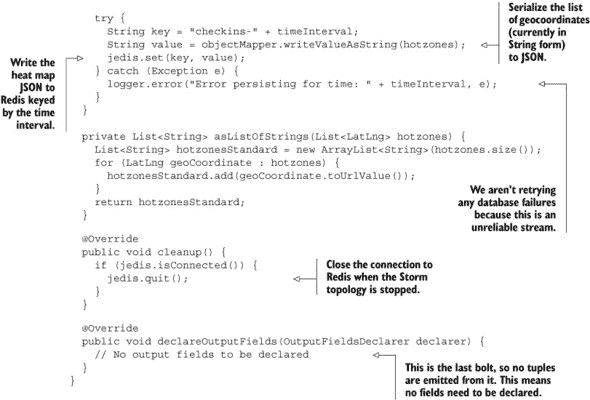

与 Redis 一起工作很简单，它作为我们的用例的良好存储。但对于更大规模的应用和数据集，可能需要不同的数据存储。需要注意的是，因为我们正在处理一个不可靠的数据流，所以我们只是记录在保存到数据库时可能发生的任何错误。一些错误可能可以重试（例如，超时），而在与可靠数据流一起工作时，我们会考虑如何重试它们，正如你将在第四章中看到的。

#### 3.4.5\. 定义组件之间的流分组

在第二章中，你学习了两种将拓扑内部组件连接到彼此的方法——洗牌分组和字段分组。为了回顾：

+   你使用洗牌分组以随机但均匀分布的方式将一个组件的输出元组分布到下一个组件。

+   当你想确保具有选定字段相同值的元组总是流向下一个螺栓的同一实例时，你使用字段分组。

对于`Checkins`/`GeocodeLookup`和`HeatMapBuilder`/`Persistor`之间的流，简单的洗牌分组应该足够。

但我们需要将`GeocodeLookup`螺栓发出的整个元组流发送到`HeatMapBuilder`螺栓。如果来自`GeocodeLookup`的不同元组最终被发送到不同的`HeatMapBuilder`实例，那么我们就无法将它们分组到时间间隔中，因为它们将分布在不同的`HeatMapBuilder`实例中。这就是全局分组发挥作用的地方。*全局分组*将确保整个元组流都流向一个特定的`HeatMapBuilder`实例。具体来说，整个流将流向具有最低任务 ID 的`HeatMapBuilder`实例（由 Storm 内部分配的 ID）。现在我们所有的元组都在一个地方，我们可以轻松地确定任何元组所属的时间间隔并将它们分组到相应的间隔中。

|  |
| --- |

##### 注意

你可以选择不使用全局分组，而是一个`HeatMapBuilder`螺栓的单例实例与洗牌分组。这也会保证一切都会流向同一个`HeatMapBuilder`实例，因为只有一个。但我们更喜欢在代码中明确表达，使用全局分组清楚地传达了这里期望的行为。全局分组也稍微便宜一些，因为它不需要像洗牌分组那样选择一个随机实例来发射。

|  |
| --- |

让我们看看我们如何在代码中定义这些流分组，以构建和运行我们的拓扑。

#### 3.4.6\. 在本地集群模式下运行拓扑结构

我们几乎完成了。我们只需要将所有东西连接起来，并在本地集群模式下运行拓扑，就像我们在第二章中做的那样。但在本章中，我们将偏离将所有代码放在单个 `LocalTopologyRunner` 类中的做法，将代码分成两个类：一个用于构建拓扑，另一个用于运行它。这是一个常见的做法，虽然你在这章中可能看不到立即的好处，但希望在第四章和第五章中你会看到我们为什么这样做的原因。

下面的列表展示了构建拓扑结构的代码。

##### 列表 3.8. `HeatmapTopologyBuilder.java`

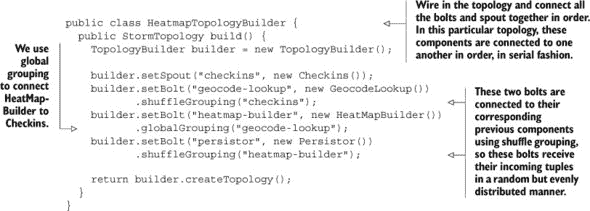

在定义了构建拓扑的代码之后，下一个列表展示了如何实现 `LocalTopologyRunner`。

##### 列表 3.9. `LocalTopologyRunner.java`

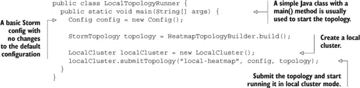

现在我们有一个工作的拓扑。我们从我们的发射器读取提交数据，最后，我们将按时间间隔分组的坐标持久化到 Redis 中，并完成热图拓扑的实现。我们剩下要做的就是使用 JavaScript 应用程序从 Redis 中读取数据，并使用 Google Maps API 的热图叠加功能来构建可视化。

这个简单的实现将会运行，但它会扩展吗？它足够快吗？让我们深入挖掘并找出答案。

### 3.5. 扩展拓扑结构

让我们回顾一下到目前为止的情况。我们有一个类似图 3.8 中所示的工作拓扑，用于我们的服务。

##### 图 3.8. 热图拓扑

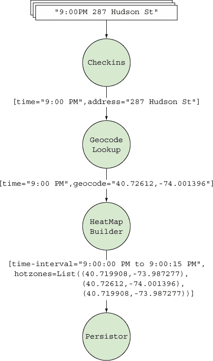

它存在一些问题。就目前而言，这个拓扑以串行方式运行，一次处理一个提交。这不是 Web 规模——这是 Apple IIe 规模。如果我们将其投入实际使用，一切都会陷入停滞，我们最终会得到不满意的客户、不满意的运维团队，以及可能的不满意的投资者。

| |
| --- |

**什么是 Web 规模？**

当一个系统可以简单地增长而不需要停机来满足由网络效应带来的需求时，它就是 Web 规模的。当每个满意的用户告诉他们的 10 个朋友关于你的热图时，服务和需求会呈指数增长。这种需求的增长被称为 Web 规模。

| |
| --- |

我们需要同时处理多个提交，因此我们将并行性引入到我们的拓扑中。使 Storm 如此吸引人的一个特性是并行化工作流程（如我们的热图）的简便性。让我们再次查看拓扑的各个部分，并讨论它们如何可以并行化。我们将从提交开始。

#### 3.5.1. 理解 Storm 中的并行性

Storm 有一些额外的原语，它们可以作为调整其扩展方式的旋钮。如果你不触碰它们，拓扑仍然可以工作，但所有组件将以更或更少的线性方式运行。这可能适合只有少量数据流通过它们的拓扑。对于像热图拓扑这样的东西，它将从大口径的水管接收数据，我们希望解决其中的瓶颈。在本节中，我们将查看处理扩展的两个原语。我们将在下一章稍后考虑更多的扩展原语。

##### 并行度提示

我们知道我们将会需要快速处理许多检查点，因此我们想要并行化处理检查点的发射器。图 3.9 给出了我们正在工作的拓扑部分的想法。

##### 图 3.9\. 将我们的并行化更改集中在 `Checkins` 发射器上

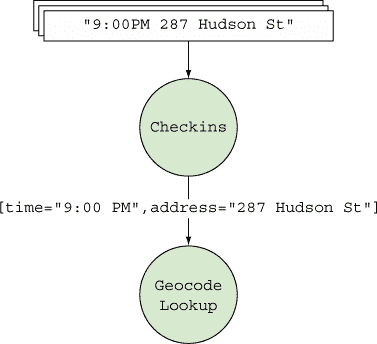

Storm 允许你在定义任何发射器或螺栓时提供并行度提示。在代码中，这涉及到将

```
builder.setSpout("checkins", new Checkins());
```

to

```
builder.setSpout("checkins", new Checkins(), 4);
```

我们提供给 `setSpout` 的附加参数是并行度提示。这听起来有点复杂：*并行度提示*。那么，什么是并行度提示呢？目前，我们可以这样说，并行度提示告诉 Storm 应该创建多少个检查点发射器。在我们的例子中，这导致创建了四个发射器实例。这不仅仅是这样，但我们稍后会谈到。

现在我们运行我们的拓扑时，我们应该能够以四倍的速度处理检查点——但是仅仅在我们的拓扑中引入更多的发射器和螺栓是不够的。拓扑中的并行性既涉及输入也涉及输出。`Checkins` 发射器现在可以一次处理更多的检查点，但 `GeocodeLookup` 螺栓仍然以串行方式处理。同时将四个检查点传递给单个 `GeocodeLookup` 实例是不会奏效的。图 3.10 展示了我们造成的问题。

##### 图 3.10\. 四个 `Checkins` 实例向一个 `GeocodeLookup` 实例发射元组，导致 `GeocodeLookup` 实例成为瓶颈。

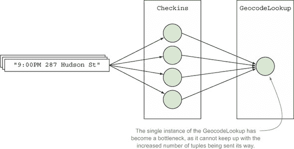

目前，我们面临的情况类似于马戏团的丑角汽车表演，许多丑角都试图同时通过同一个门挤进一辆车。这个瓶颈需要解决；让我们尝试并行化地理编码查找螺栓。我们可以像处理检查点一样并行化地理编码螺栓。从这一点

```
builder.setBolt("geocode-lookup", new GeocodeLookup());
```

to this

```
builder.setBolt("geocode-lookup", new GeocodeLookup(), 4);
```

肯定会很有帮助。现在我们有一个 `GeocodeLookup` 实例对应于每个 `Checkins` 实例。但是 `GeocodeLookup` 将会比接收检查点并将其传递给我们的螺栓花费更长的时间。所以也许我们可以做点像这样的事情：

```
builder.setBolt("geocode-lookup", new GeocodeLookup(), 8);
```

现在如果 `GeocodeLookup` 比处理检查点花费两倍的时间，元组应该能够在我们系统中平稳地流动，从而产生 图 3.11。

##### 图 3.11\. 四个 `Checkins` 实例向八个 `GeocodeLookup` 实例发射元组

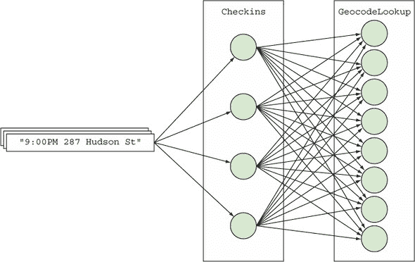

我们在这里取得了进展，但还有其他事情需要考虑：当我们的服务变得更受欢迎时会发生什么？我们需要能够继续扩展以跟上不断增长的流量，而不会使我们的应用程序离线，或者至少不会经常离线。幸运的是，Storm 提供了一种方法来实现这一点。我们之前对并行性提示做了大致的定义，但说还有更多内容。好吧，现在我们就在这里。这个并行性提示映射到我们尚未覆盖的两个 Storm 概念：执行器和任务。

##### 执行器和任务

那么，执行器和任务是什么？真正理解这个问题的答案需要更深入地了解 Storm 集群及其各个部分。尽管我们直到第五章才会学习有关 Storm 集群的详细信息，但我们可以提前向你展示 Storm 集群的某些部分，这将帮助你理解执行器和任务在扩展拓扑中的作用。

到目前为止，我们知道我们的 spouts 和 bolts 每个都在作为一个或多个实例运行。这些实例都在某个地方运行，对吧？肯定有一些机器（物理或虚拟）实际上在执行我们的组件。我们将这个机器称为工作节点，尽管工作节点不是在 Storm 集群上运行的唯一类型的节点，但它是在 spouts 和 bolts 中执行逻辑的节点。由于 Storm 运行在 JVM 上，因此每个工作节点都在 JVM 上执行我们的 spouts 和 bolts。图 3.12 显示了到目前为止的情况。

##### 图 3.12\. 工作节点是一个运行 JVM 的物理或虚拟机器，该 JVM 执行 spouts 和 bolts 中的逻辑。

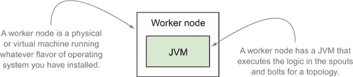

工作节点还有一些其他内容，但对你来说现在重要的是要理解它运行了执行我们的 spout 和 bolt 实例的 JVM。因此，我们再次提出问题：执行器和任务是什么？执行器是 JVM 上的一个执行线程，而任务是运行在执行线程中的我们的 spouts 和 bolt 的实例。图 3.13 说明了这种关系。

##### 图 3.13\. 执行器（线程）和任务（spouts/bolts 的实例）在 JVM 上运行。

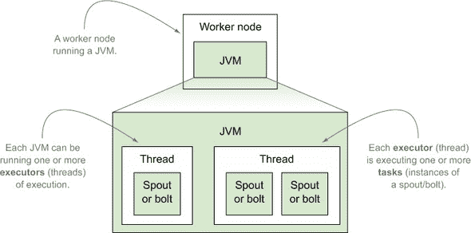

真的是这么简单。执行器是 JVM 中的一个执行线程。任务是运行在那个执行线程中的 spout 或 bolt 的实例。在讨论本章的可伸缩性时，我们指的是改变执行器和任务的数量。Storm 通过改变工作节点和 JVM 的数量提供额外的扩展方式，但我们将在第六章和第七章中介绍这些内容。

让我们回到我们的代码，重新审视这代表什么，从并行性提示的角度来看。将并行性提示设置为 8，就像我们在`GeocodeLookup`中做的那样，告诉 Storm 创建八个执行器（线程）并运行八个`GeocodeLookup`的任务（实例）。这可以通过以下代码看到：

```
builder.setBolt("geocode-lookup", new GeocodeLookup(), 8)
```

默认情况下，并行性提示会将执行者和任务的数量设置为相同的值。我们可以使用`setNumTasks()`方法覆盖任务的数量，如下所示：

```
builder.setBolt("geocode-lookup", new GeocodeLookup(), 8).setNumTasks(8)
```

为什么提供将任务数量设置为与执行者数量不同的能力？在我们回答这个问题之前，让我们退一步，重新审视我们是如何到达这里的。我们正在讨论如何在将来不关闭热图的情况下对其进行扩展。最容易的方法是什么？答案是：增加并行性。幸运的是，Storm 提供了一个有用的功能，允许我们通过动态增加执行者（线程）的数量来增加运行中的拓扑的并行性。你将在第六章中了解更多关于如何做到这一点的方法。第六章。

这对我们运行在八个线程上的八个实例的`GeocodeLookup`螺栓意味着什么？嗯，每个实例将花费大部分时间等待网络 I/O。我们怀疑这意味着`GeocodeLookup`将成为未来的争用源，并需要扩展。我们可以通过以下方式允许这种可能性：

```
builder.setBolt("geocode-lookup", new GeocodeLookup(), 8).setNumTasks(64)
```

现在我们有 64 个`GeocodeLookup`的任务（实例）在八个执行者（线程）上运行。由于我们需要增加`GeocodeLookup`的并行性，我们可以继续增加执行者的数量，直到最大 64 个，而无需停止我们的拓扑。我们重复：*无需停止拓扑*。正如我们之前提到的，我们将在后面的章节中详细介绍如何做到这一点，但这里的关键点是执行者（线程）的数量可以在运行中的拓扑中动态更改。

Storm 将并行性分解为执行者和任务两个不同的概念，以处理像我们的`GeocodeLookup`螺栓这样的情况。为了说明原因，让我们回到字段分组的定义：

> 字段分组是一种流分组类型，其中具有特定字段名相同值的元组总是被发射到螺栓的相同实例。

在那个定义中隐藏着我们的答案。字段分组通过在固定数量的螺栓上持续散列元组来工作。为了保持具有相同值的键流向相同的螺栓，螺栓的数量不能改变。如果改变了，元组就会开始流向不同的螺栓。这就会违背我们通过字段分组试图实现的目的。

在`Checkins`发射器和`GeocodeLookup`螺栓上配置执行者和任务很容易，以便在以后的时间点进行扩展。有时，我们的设计部分可能不适合扩展。让我们看看下一个问题。

#### 3.5.2. 调整拓扑以解决设计中的瓶颈

`HeatMapBuilder` 是下一个要讨论的。之前我们在增加 `Checkins` spout 的并行性提示时遇到了 `GeocodeLookup` 的瓶颈。但通过相应地增加 `GeocodeLookup` bolt 的并行性，我们能够轻松解决这个问题。在这里我们无法这样做。由于 `HeatMapBuilder` 是通过全局分组与前面的 bolt 连接的，因此增加其并行性没有意义。因为全局分组规定每个元组都发送到 `HeatMapBuilder` 的一个特定实例，增加其并行性没有任何效果；只有一个实例会积极处理流。我们拓扑设计中固有的瓶颈。

这是使用全局分组带来的缺点。使用全局分组，我们牺牲了扩展能力，引入了人为的瓶颈，以便在一个特定的 bolt 实例中看到整个元组流。

那么，我们能做什么呢？我们是否无法在拓扑中并行化这一步骤？如果我们不能并行化这个 bolt，那么并行化后续 bolt 几乎没有意义。这是瓶颈点。它不能与当前设计并行化。当我们遇到这类问题时，最佳方法是退一步，看看我们能否通过改变拓扑设计来达到我们的目标。

我们不能并行化 `HeatMapBuilder` 的原因是所有元组都需要进入同一个实例。所有元组都必须进入同一个实例，因为我们需要确保每个落入任何给定时间间隔的元组都能被分组在一起。所以如果我们能确保每个落入给定时间间隔的元组都进入同一个实例，我们就可以有多个 `HeatMapBuilder` 实例。

目前，我们使用 `HeatMapBuilder` bolt 做两件事：

+   确定给定元组所属的时间间隔

+   按时间间隔分组元组

如果我们能将这两个操作移动到单独的 bolt 中，我们就能更接近我们的目标。让我们看看下一个列表中 `HeatMapBuilder` bolt 部分是如何确定元组所属的时间间隔的。

##### 列表 3.10\. 在 `HeatMapBuilder.java` 中确定元组的时间间隔

```
public void execute(Tuple tuple,
                    BasicOutputCollector outputCollector) {
  if (isTickTuple(tuple)) {
    emitHeatmap(outputCollector);
  } else {
    Long time = tuple.getLongByField("time");
    LatLng geocode = (LatLng) tuple.getValueByField("geocode");

    Long timeInterval = selectTimeInterval(time);
    List<LatLng> checkins = getCheckinsForInterval(timeInterval);
    checkins.add(geocode);
  }
}

private Long selectTimeInterval(Long time) {
  return time / (15 * 1000);
}
```

`HeatMapBuilder` 从 `GeocodeLookup` 接收签到时间和地理坐标。让我们将这个从 `GeocodeLookup` 发射的元组中提取时间间隔的简单任务移动到另一个 bolt 中。这个 bolt——让我们称它为 `TimeIntervalExtractor`——可以发射一个时间间隔和一个坐标，这些可以被 `HeatMapBuilder` 捕获，如下列所示。

##### 列表 3.11\. `TimeIntervalExtractor.java`

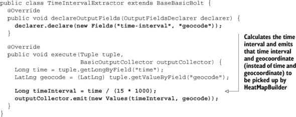

引入 `TimeIntervalExtractor` 需要修改 `HeatMapBuilder`。我们不再从输入元组中检索时间，而是需要更新该 bolt 的 `execute()` 方法以接受一个时间间隔，如下一个列表所示。

##### 列表 3.12\. 在 `HeatMapBuilder.java` 中更新 `execute()` 方法以使用预计算的时间间隔

```
@Override
public void execute(Tuple tuple,
                    BasicOutputCollector outputCollector) {
  if (isTickTuple(tuple)) {
    emitHeatmap(outputCollector);
  } else {
    Long timeInterval = tuple.getLongByField("time-interval");
    LatLng geocode = (LatLng) tuple.getValueByField("geocode");

    List<LatLng> checkins = getCheckinsForInterval(timeInterval);
    checkins.add(geocode);
  }
}
```

我们拓扑中的组件现在包括以下内容：

+   `Checkins` spout，它输出时间和地址

+   `GeocodeLookup` bolt，它输出时间和地理坐标

+   `TimeIntervalExtractor` bolt，它输出时间间隔和地理坐标

+   `HeatMapBuilder` bolt，它输出时间间隔以及一组地理坐标

+   `Persistor` bolt，它不输出任何内容，因为它是我们拓扑中的最后一个 bolt

图 3.14 显示了反映这些变更的更新拓扑设计。

##### 图 3.14\. 包含`TimeIntervalExtractor` bolt 的更新拓扑

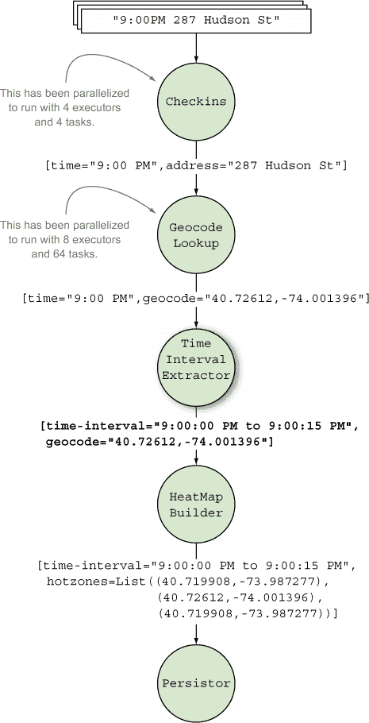

现在我们将`HeatMapBuilder`连接到`TimeIntervalExtractor`时，不需要使用全局分组。

我们已经预先计算了时间间隔，现在我们需要确保同一个`HeatMapBuilder` bolt 实例接收给定时间间隔内的所有值。不同的时间间隔是否发送到不同的实例无关紧要。我们可以使用*字段分组*来实现这一点。字段分组允许我们根据指定的字段对值进行分组，并将所有带有该给定值的元组发送到特定的 bolt 实例。我们所做的是将元组分割成时间间隔，并将每个段发送到不同的`HeatMapBuilder`实例，从而通过并行运行段来实现并行化。图 3.15 显示了我们的 spout 和 bolt 之间的更新流分组。

##### 图 3.15\. 更新拓扑流分组

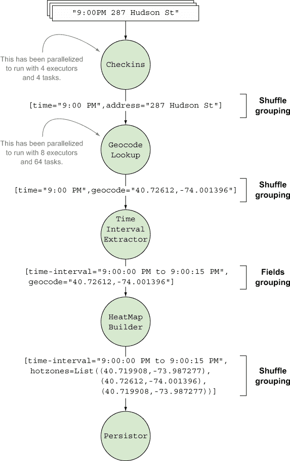

让我们看看需要添加到`HeatmapTopologyBuilder`中的代码，以便结合我们的新`TimeIntervalExtractor` bolt，并更改到适当的流分组，如列表 3.13 所示。

##### 列表 3.13\. 新增到`HeatmapTopologyBuilder.java`的 bolt

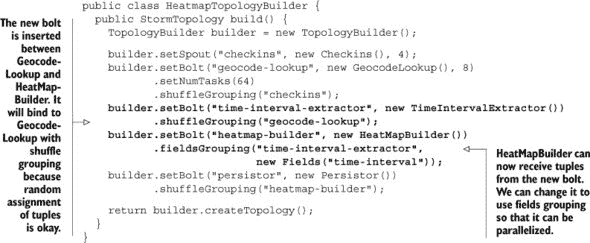

如列表所示，我们已经完全移除了全局分组，现在我们使用一系列洗牌分组，其中包含一个针对时间间隔的单字段分组。

|  |
| --- |

**全局分组**

我们通过将全局分组替换为字段分组来扩展了这个 bolt，在经过一些小的设计变更后。那么全局分组是否适合任何需要实际扩展的现实世界场景呢？不要小看全局分组；当它在正确的节点部署时，确实起到了有用的作用。

在这个案例研究中，我们在聚合点使用了全局分组（按时间间隔分组坐标）。当在聚合点使用时，它确实不会扩展，因为我们迫使它处理更大的数据集。但如果我们使用聚合后的全局分组，它将处理较小的元组流，我们就不需要像聚合前那样大的扩展。

如果你需要查看整个元组流，全局分组非常有用。首先你需要以某种方式聚合它们（洗牌分组用于随机聚合元组集或字段分组用于聚合选定的元组集），然后对聚合使用全局分组以获得完整的图景：

```
builder.setBolt("aggregation-bolt", new AggregationBolt(), 10)
       .shuffleGrouping("previous-bolt");
builder.setBolt("world-view-bolt", new WorldViewBolt())
       .globalGrouping("aggregation-bolt");
```

在这种情况下，`AggregationBolt` 可以进行扩展，并将流裁剪成更小的集合。然后 `WorldViewBolt` 可以通过在来自 `AggregationBolt` 的已聚合元组上使用全局分组来查看完整的流。我们不需要扩展 `WorldViewBolt`，因为它正在查看一个更小的数据集。

|  |
| --- |

并行化 `TimeIntervalExtractor` 是简单的。首先，我们可以给它与 `Checkins` spout 相同的并行级别——与 `GeocodeLookup` bolt 不同，我们不需要等待外部服务：

```
builder.setBolt("time-interval-extractor", new TimeIntervalExtractor(), 4)
    .shuffleGrouping("geocode-lookup");
```

接下来，我们可以清除拓扑中的麻烦瓶颈：

```
builder.setBolt("heatmap-builder", new HeatMapBuilder(), 4)
    .fieldsGrouping("time-interval-extractor", new Fields("time-interval"));
```

最后，我们解决 `Persistor` 的问题。在某种程度上，这与 `GeocodeLookup` 类似，因为我们预计我们以后需要对其进行扩展。因此，我们需要比执行器更多的任务，原因与我们在之前的 `GeocodeLookup` 讨论中提到的相同：

```
builder.setBolt("persistor", new Persistor(), 1)
    .setNumTasks(4)
    .shuffleGrouping("heatmap-builder");
```

图 3.16 展示了刚刚应用的并行化变化。

##### 图 3.16\. 并行化拓扑中的所有组件

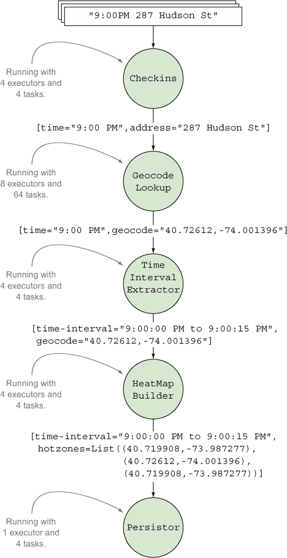

看起来我们已经完成了这个拓扑的扩展...还是吗？我们已经为拓扑中的每个组件（即每个发射器和 bolt）配置了并行性。每个 bolt 或 spout 都可以配置为并行，但这并不一定意味着它将以扩展的方式运行。让我们看看原因。

#### 3.5.3\. 调整拓扑结构以解决数据流中固有的瓶颈

我们已经并行化了拓扑中的每个组件，这与我们使用的每个分组（洗牌分组、字段分组和全局分组）如何影响我们拓扑中元组的流动的技术定义是一致的。不幸的是，它仍然没有有效地实现并行。

尽管我们能够通过上一节中的更改并行化 `HeatMapBuilder`，但我们忘记考虑的是我们数据流的性质如何影响并行化。我们将流经流的元组分组为 15 秒的段，这是我们问题的根源。对于给定的 15 秒窗口，所有落入该窗口的元组都将通过 `HeatMapBuilder` bolt 的一个实例。确实，通过我们做出的设计更改，`HeatMapBuilder` 在技术上可以并行化，但它实际上还没有实现并行。流经你的拓扑的数据流的形状可能会隐藏难以发现的扩展问题。始终质疑数据通过你的拓扑流动的影响是明智的。

我们如何进行并行化？我们正确地按时间间隔分组，因为这是我们热图生成的依据。我们需要在时间间隔下增加一个额外的分组级别；我们可以细化我们的高级解决方案，以便通过时间间隔和城市来提供热图。当我们按城市增加一个额外的分组级别时，我们将有一个给定时间间隔的多个数据流，它们可能通过 `HeatmapBuilder` 的不同实例流动。为了添加这个额外的分组级别，我们首先需要在 `GeocodeLookup` 的输出元组中添加城市作为一个字段，如下所示。

##### 列表 3.14\. 在 `GeocodeLookup.java` 的输出元组中添加城市作为一个字段

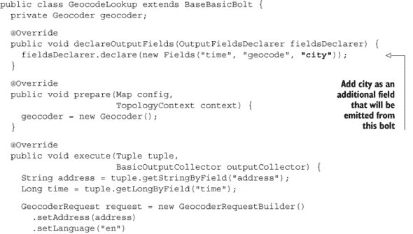

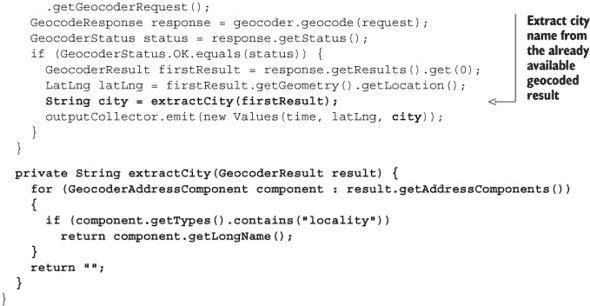

`GeocodeLookup` 现在将其输出元组中的城市作为一个字段。我们需要更新 `TimeIntervalExtractor` 以读取和发射此值，如下所示。

##### 列表 3.15\. 在 `TimeIntervalExtractor.java` 中传递城市字段

```
public class TimeIntervalExtractor extends BaseBasicBolt {
  @Override
  public void declareOutputFields(OutputFieldsDeclarer declarer) {
    declarer.declare(new Fields("time-interval", "geocode", "city"));
  }

  @Override

  public void execute(Tuple tuple,
                      BasicOutputCollector outputCollector) {
    Long time = tuple.getLongByField("time");
    LatLng geocode = (LatLng) tuple.getValueByField("geocode");
    String city = tuple.getStringByField("city");

    Long timeInterval = time / (15 * 1000);

    outputCollector.emit(new Values(timeInterval, geocode, city));
  }
}
```

最后，我们需要更新我们的 `HeatmapTopologyBuilder`，以便在 `TimeIntervalExtractor` 和 `HeatMapBuilder` 之间的字段分组基于时间间隔和城市字段，如下所示。

##### 列表 3.16\. 在 `HeatmapTopologyBuilder.java` 中添加了二级分组

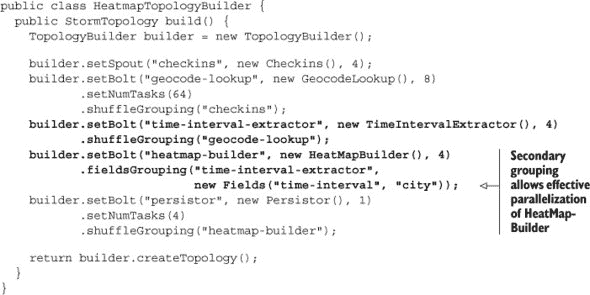

现在我们有一个拓扑，它不仅在技术上并行化，而且实际上也在并行运行。我们在这里做了一些更改，所以让我们更新一下我们的拓扑和图 3.17 中元组的转换。

##### 图 3.17\. 将城市添加到 `GeocodeLookup` 发射的元组中，并使 `TimeIntervalExtractor` 在其发射的元组中传递城市

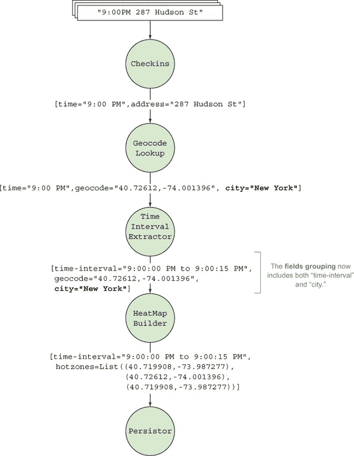

我们已经涵盖了并行化 Storm 拓扑的基本知识。我们在这里采取的方法是基于我们对每个拓扑组件如何工作的理解而做出的有根据的猜测。在并行化这个拓扑方面还有更多的工作可以做，包括额外的并行化原语和基于观察指标实现最佳调优的方法。我们将在本书的适当位置讨论它们。在本章中，我们构建了正确设计 Storm 拓扑所需的并行性理解。拓扑的可扩展性在很大程度上取决于拓扑底层组件分解和设计。

### 3.6\. 拓扑设计范式

让我们回顾一下我们是如何设计热图拓扑的：

1.  我们检查了我们的数据流，并确定我们的输入元组基于我们开始时的内容。然后我们确定了我们需要达到目标（最终元组）的结果元组。

1.  我们创建了一系列操作（作为 bolt），将输入元组转换为最终元组。

1.  我们仔细检查了每个操作，以了解其行为，并通过基于我们对行为理解的有根据的猜测进行扩展（调整其执行器/任务）。

1.  在我们不能再扩展的点，我们重新思考了我们的设计，并将拓扑重构为可扩展的组件。

这是一个很好的拓扑设计方法。在创建拓扑时，大多数人没有考虑到可扩展性，陷入了这个陷阱是很常见的。如果我们不早点做，而把可扩展性的问题留到以后，你为了重构或重新设计拓扑所需要做的工作量将增加一个数量级。

> 过早优化是万恶之源。
> 
> *唐纳德·克努特*

作为工程师，我们在早期讨论性能考虑因素时喜欢引用唐纳德·克努特的这句话。在大多数情况下，这确实是正确的，但让我们看看完整的引文，以给我们更多的背景，了解克努特博士试图说什么（而不是我们工程师通常用来表达观点的简短引语）：

> 你应该忘记关于小效率的事情，比如说 97%的时间；过早优化是万恶之源。

你不是在尝试实现小效率——你是在处理大数据。你做的每一个效率提升都很重要。一个小的性能瓶颈可能会在大数据集上工作时，导致无法达到所需的性能服务等级协议。如果你在建造赛车，你需要从第一天开始就考虑性能。如果你没有从一开始就为性能而建造，你不能在以后重构引擎来提高它。所以步骤 3 和步骤 4 是设计拓扑的关键部分。

这里唯一的缺点是对问题域的了解不足。如果你的问题域知识有限，那么如果你试图过早地扩展它，可能会对你不利。当我们说“对问题域的了解”时，我们指的是系统中流动的数据的性质以及你操作中的固有瓶颈。在你对它有很好的理解之前，推迟可扩展性的问题总是可以的。类似于构建专家系统，当你真正理解了问题域时，你可能不得不放弃你的初始解决方案并重新开始。

#### 3.6.1\. 通过分解为功能组件进行设计

让我们观察我们是如何分解拓扑中一系列操作的（图 3.18）。

##### 图 3.18\. 热图拓扑设计作为一系列功能组件

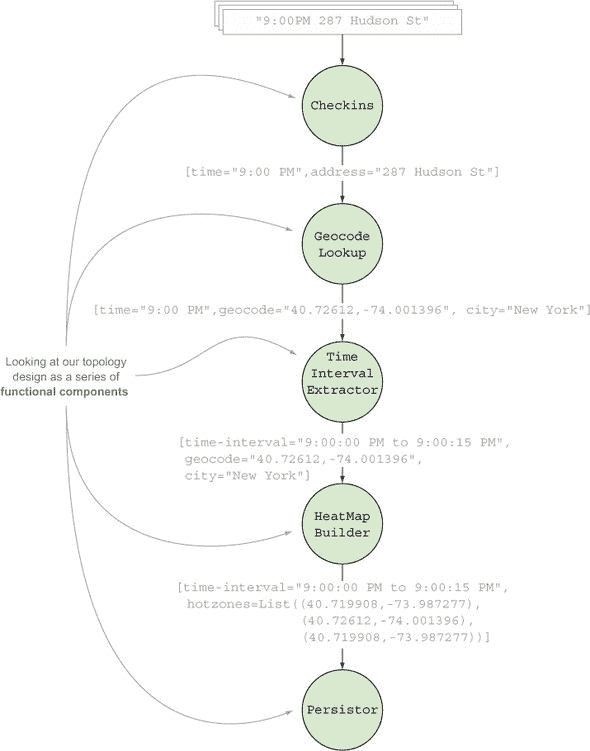

我们通过给每个螺栓分配一个特定的责任，将拓扑结构分解成单独的螺栓。这与*单一责任原则*相一致。我们在每个螺栓中封装了特定的责任，每个螺栓中的所有内容都与它的责任紧密相关，与其他内容无关。换句话说，每个螺栓代表一个功能整体。

这种设计方法有很多价值。给每个 bolt 分配单一职责使其易于独立处理。它还使得在不干扰拓扑其余部分的情况下轻松扩展单个 bolt，因为并行性是在 bolt 级别调整的。无论是扩展还是解决问题，当你能够聚焦于单个组件时，从这种专注中获得的效率提升将使你能够从以这种方式设计组件的努力中获得收益。

#### 3.6.2\. 在重分区点按组件分解设计

将问题分解为其组成部分的方法略有不同。与之前讨论的将问题分解为功能组件的方法相比，这种方法在性能方面提供了显著的改进。使用这种模式，我们不是将问题分解为其最简单的可能功能组件，而是从不同组件之间的分离点（或连接点）的角度思考。换句话说，我们考虑不同 bolt 之间的连接点。在 Storm 中，不同的流分组是不同 bolt 之间的标记（因为分组定义了来自一个 bolt 的输出元组如何分配到下一个 bolt）。

在这些点上，拓扑中流动的元组流会被重分区。在流重分区期间，元组的分配方式会改变。这实际上是流分组的函数。图 3.19(Figure 3.19)通过重分区的点说明了我们的设计。

##### 图 3.19\. 以重分区点为依据的 HeatMap 拓扑设计


使用这种拓扑设计模式，我们努力将拓扑内部的重分区数量最小化。每次进行重分区时，元组将从网络中的一个 bolt 发送到另一个 bolt。由于多种原因，这是一个昂贵的操作：

+   拓扑在分布式集群中运行。当元组被发出时，它们可能穿越集群，这可能会产生网络开销。

+   每次发出元组时，都需要在接收点进行序列化和反序列化。

+   分区数量越多，所需的资源就越多。每个 bolt 都需要一定数量的 executors 和 tasks，以及一个用于所有传入元组的队列。

| |
| --- |

##### 注意

我们将在后面的章节中讨论 Storm 集群的组成以及支持 bolt 的内部机制。

| |
| --- |

对于我们的拓扑，我们如何最小化分区数量？我们将不得不合并几个 bolt。要做到这一点，我们必须弄清楚每个功能组件有什么不同之处，使其需要自己的 bolt（以及 bolt 带来的资源）：

+   `Checkins` (spout)—4 executors (读取文件)

+   `GeocodeLookup`—8 executors, 64 tasks (调用外部服务)

+   `TimeIntervalExtractor`—4 executors (内部计算；转换数据)

+   `HeatMapBuilder`—4 个执行器（内部计算；聚合元组）

+   `Persistor`—1 个执行器，4 个任务（写入数据存储）

现在进行分析：

+   `GeocodeLookup`和`Persistor`与外部实体交互，与该外部实体交互所花费的时间将决定执行器和任务如何分配给这两个 bolt。我们不太可能能够迫使这些 bolt 的行为适应另一个。也许其他某些东西可能能够适应其中一个所需的资源。

+   `HeatMapBuilder`按时间区间和城市对地理坐标进行聚合。与其他相比，它有些独特，因为它在内存中缓冲数据，并且只有在时间区间过去之后才能进行下一步。它足够奇特，以至于将其与其他合并需要仔细考虑。

+   `Checkins`是一个 spout，通常你不会修改一个 spout 以包含涉及计算的运算。此外，由于 spout 负责跟踪已发射的数据，我们很少在其中执行任何计算。但是，与适应初始元组相关的一些事情（如解析、提取和转换）确实适合 spout 的职责。

+   这就留下了`TimeIntervalExtractor`。这很简单——它所做的只是将一个“时间”条目转换成一个“时间区间”。我们将其从`HeatMapBuilder`中提取出来，因为我们需要在`HeatMapBuilder`之前知道时间区间，以便我们可以按时间区间进行分组。这使我们能够扩展`HeatMapBuilder`bolt。`TimeIntervalExtractor`完成的工作在技术上可以在`HeatMapBuilder`之前的任何时刻发生：

    +   如果我们将`TimeIntervalExtractor`与`GeocodeLookup`合并，它需要适应分配给`GeocodeLookup`的资源。尽管它们有不同的资源配置，但`TimeIntervalExtractor`的简单性将允许它适应分配给`GeocodeLookup`的资源。从纯粹理想主义的角度来看，它们也适合——这两个操作都是数据转换（从时间到时间区间，从地址到地理坐标）。其中一个是极其简单的，而另一个则需要使用外部服务的网络开销。

    +   我们能否将`TimeIntervalExtractor`与`Checkins` spout 合并？它们具有完全相同的资源配置。此外，将“时间”转换为“时间区间”是 bolt 中可以合理地在 spout 中执行的操作类型之一。答案是响亮的肯定。这引出了一个问题，即`GeocodeLookup`是否也可以与`Checkins` spout 合并。尽管`GeocodeLookup`也是一个数据转换器，但由于它依赖于外部服务，这是一个更重量级的计算，这意味着它不适合在 spout 中发生的动作。

我们是否应该将`TimeIntervalExtractor`与`GeocodeLookup`或`Checkins`源合并？从效率的角度来看，两者都可以，这是正确的答案。我们会将其与源合并，因为我们更喜欢将外部服务交互与像`TimeIntervalExtractor`这样的简单任务保持清晰。我们将让你在你的拓扑中进行必要的更改来实现这一点。

你可能会想知道为什么在这个例子中我们选择不将`HeatMapBuilder`与`Persistor`合并。`HeatMapBuilder`定期（每当它收到一个 tick 元组时）发出聚合的地理坐标，在发出时，它可以修改为将值写入数据存储（`Persistor`的责任）。虽然从概念上讲这是合理的，但它改变了组合螺栓的可观察行为。组合的`HeatMapBuilder`/`Persistor`在接收到的两种类型的元组上表现非常不同。来自流的常规元组将以低延迟执行，而写入数据存储的 tick 元组将具有相对较高的延迟。如果我们要监控和收集关于这个组合螺栓性能的数据，将很难隔离观察到的指标并就如何进一步调整做出明智的决定。这种延迟不平衡的性质使得它非常不优雅。

通过考虑流的重分区点来设计拓扑，并尝试最小化它们，这将使你在具有较高性能可能性的拓扑结构中，以最低的延迟使用资源。

#### 3.6.3\. 最简单的功能组件与最少数量的分区

我们讨论了两种拓扑设计的方法。哪一个更好？只要仔细考虑哪些操作可以组合成一个螺栓，拥有最少数量的分区将提供最佳性能。

通常不是非此即彼。作为一个 Storm 初学者，你应该始终从设计最简单的功能组件开始；这样做可以让你轻松地推理不同的操作。此外，如果你从具有多个职责的更复杂组件开始，如果设计错误，将很难将其分解成更简单的组件。

你始终可以从最简单的功能组件开始，然后逐步将不同的操作组合在一起以减少分区数量。反过来操作要困难得多。随着你在与 Storm 合作方面获得更多经验并发展对拓扑设计的直觉，你将能够从最少数量的分区开始。

### 3.7\. 摘要

在本章中，你学习了

+   如何将问题分解为适合 Storm 拓扑的构造

+   如何将串行运行的拓扑转换为并行

+   如何在设计中发现问题并进行精炼和重构

+   关注数据流对拓扑结构限制的影响的重要性

+   两种不同的拓扑设计方法以及两者之间的微妙平衡

这些设计指南是构建 Storm 顶点的最佳实践。在本书的后续部分，您将了解到为什么这些设计决策极大地有助于对 Storm 进行调优以实现最佳性能。
