## 第四章\. 创建健壮的拓扑

*本章涵盖*

+   保证消息处理

+   容错性

+   重放语义

到目前为止，我们已经定义了许多 Storm 的核心概念。在这个过程中，我们实现了两个独立的拓扑，每个都在本地集群中运行。本章也不例外，我们将为一个新的场景设计和实现另一个拓扑。但我们要解决的问题对保证元组被处理和保持容错性有更严格的要求。为了帮助我们满足这些要求，我们将介绍一些与可靠性和故障相关的新概念。您将了解 Storm 为我们提供的处理故障的工具，我们还将深入了解我们可以对数据处理做出的各种保证。掌握了这些知识，我们将准备好进入世界并创建生产质量的拓扑。

### 4.1\. 可靠性的要求

在上一章中，我们的热图应用需要快速处理大量时间敏感的数据。此外，仅仅采样其中一部分数据就能为我们提供所需的信息：在特定地理区域内当前机构的流行度近似值 *现在*。如果我们未能在一个短暂的时间窗口内处理一个特定的元组，它就失去了其价值。热图就是关于 *现在* 的。我们不需要保证每条消息都被处理——*大多数* 就足够了。

但有些领域对此是严格不可接受的；每个元组都是神圣的。在这些场景中，我们需要保证每个元组都被处理。在这里，可靠性比及时性更重要。如果我们必须为 30 秒、10 分钟或一个小时（或达到某个合理的阈值）重试一个元组，它在我们第一次尝试时和在重试时在我们的系统中具有相同的价值。我们需要可靠性。

Storm 提供了保证每个元组被处理的能力。这作为我们可以信赖的可靠性度量，以确保功能的准确实现。在较高层次上，Storm 通过跟踪哪些元组被成功处理以及哪些没有，然后重放失败的元组直到它们成功，来提供可靠性。

#### 4.1.1\. 支持可靠性的拼图碎片

Storm 有许多组成部分需要协同工作才能提供可靠性：

+   一个可靠的数据源，以及相应的可靠 spout

+   一个锚定的元组流

+   一个拓扑结构，在处理每个元组时会识别它，或者在出现故障时通知你

+   具有容错性的 Storm 集群基础设施

在本章中，我们将探讨这三个组件如何组合起来以实现可靠性。然后第五章将向您介绍 Storm 集群，并讨论它如何提供容错性。

### 4.2\. 问题定义：信用卡授权系统

当你考虑使用 Storm 来解决你领域内的问题时，花时间思考你需要的处理保证；这是“在 Storm 中思考”的重要部分。让我们深入一个具有可靠性要求的问题。

想象一下，我们运营着一个大型电子商务网站，负责向人们运送实物商品。我们知道，在我们网站上提交的订单中，绝大多数都成功授权支付，只有一小部分被拒绝。在传统的电子商务中，用户需要完成的订单步骤越多，失去销售的风险就越高。当我们订单提交时立即进行账单处理，我们就会失去生意。将账单处理作为一个独立的、“离线”操作来处理，可以提高转化率并直接影响我们的底线。我们还需要这个离线账单流程能够很好地扩展，以支持像假日（想想亚马逊）或闪购（想想 Gilt）这样的高峰期。

这是一个需要可靠性的场景。每个订单在发货前都必须被授权。如果在尝试授权的过程中遇到问题，我们应该重试。简而言之，我们需要保证消息处理。让我们看看这样一个系统可能的样子，同时考虑到我们如何结合重试特性。

#### 4.2.1\. 具有重试特性的概念解决方案

该系统仅处理与已提交订单相关的信用卡授权。我们的系统不处理客户提交订单；这发生在管道的早期。

##### 上游和下游系统的假设

分布式系统由不同系统之间的交互定义。对于我们的用例，我们可以假设以下情况：

+   同一个订单永远不会被发送到我们的系统超过一次。这是由处理客户订单的上游系统保证的。

+   提交订单的上游系统会将订单放入队列，我们的系统将从队列中取出订单以便进行授权。

+   一个独立的下游系统将处理已处理的订单，如果信用卡被授权，则履行订单，或者通知客户信用卡被拒绝。

拥有这些假设，我们可以继续进行一个范围有限但很好地映射到我们想要涵盖的 Storm 概念的设计。

##### 概念解决方案的形成

让我们从订单如何通过我们的系统开始。当需要授权订单的信用卡时，采取以下步骤：

1.  从消息队列中取出订单。

1.  通过调用外部信用卡授权服务尝试授权信用卡。

1.  如果服务调用成功，更新数据库中的订单状态。

1.  如果它失败了，我们可以稍后再尝试。

1.  通知一个独立的下游系统订单已被处理。

这些步骤在图 4.1 中得到了说明。

##### 图 4.1\. 电子商务信用卡授权流程的概念解决方案

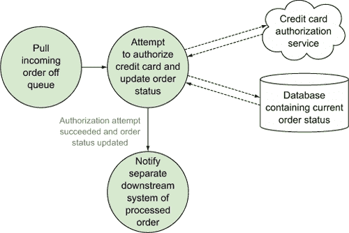

我们已经有了基本流程。定义我们问题的下一步是查看我们的拓扑中正在处理的数据点；有了这些知识，我们可以确定元组中传递的内容。

#### 4.2.2\. 定义数据点

在定义了事务流程后，我们可以查看涉及的数据。数据流从从队列中拉取的 JSON 格式的传入订单开始（见以下列表）。

##### 列表 4.1\. 订单 JSON

```
{
  "id":1234,
  "customerId":5678,
  "creditCardNumber":1111222233334444,
  "creditCardExpiration":"012014",
  "creditCardCode":123,
  "chargeAmount":42.23
}
```

此 JSON 将被转换为 Java 对象，我们的系统将内部处理这些序列化的 Java 对象。下一个列表定义了此类。

##### 列表 4.2\. `Order.java`

```
public class Order implements Serializable {
  private long id;
  private long customerId;
  private long creditCardNumber;
  private String creditCardExpiration;
  private int creditCardCode;
  private double chargeAmount;

  public Order(long id,
               long customerId,
               long creditCardNumber,
               String creditCardExpiration,
               int creditCardCode,
               double chargeAmount) {
    this.id = id;
    this.customerId = customerId;
    this.creditCardNumber = creditCardNumber;
    this.creditCardExpiration = creditCardExpiration;
    this.creditCardCode = creditCardCode;
    this.chargeAmount = chargeAmount;
  }
  ...
}
```

这种以数据点和对其执行操作的组件来定义问题的方法应该很熟悉；这正是我们在创建拓扑时在 第二章 和 第三章 中分解问题的方法。我们现在需要将此解决方案映射到 Storm 可以使用的组件，以构建我们的拓扑。

#### 4.2.3\. 将解决方案映射到 Storm 并具有重试特性

现在我们已经有一个基本的设计，并且已经确定了将通过我们的系统流动的数据，我们可以将我们的数据和组件映射到 Storm 概念。我们的拓扑将包含三个主要组件，一个 spout 和两个 bolt：

+   **`RabbitMQSpout`—** 我们的数据源将从队列中消费消息，其中每个消息都是表示订单的 JSON，并发射包含序列化 `Order` 对象的元组。我们将使用 RabbitMQ 作为我们的队列实现——因此得名。我们将在本章后面讨论保证消息处理时深入了解此 spout 的细节。

+   **`AuthorizeCreditCard`—** 如果信用卡被授权，此 bolt 将将订单状态更新为“准备发货”。如果信用卡被拒绝，此 bolt 将将订单状态更新为“拒绝”。无论状态如何，此 bolt 都将向流中的下一个 bolt 发射包含 `Order` 的元组。

+   **`ProcessedOrderNotification`—** 一个通知单独系统订单已处理的 bolt。

除了 spout、bolt 和元组外，我们还需要定义元组在各个组件之间发射时的流分组。以下将使用以下流分组：

+   在 `RabbitMQSpout` 和 `AuthorizeCreditCard` bolt 之间进行洗牌分组

+   在 `AuthorizeCreditCard` bolt 和 `ProcessedOrder-Notification` bolt 之间进行洗牌分组

在 第二章 中，我们使用字段分组确保相同的 GitHub 提交者电子邮件被路由到相同的 bolt 实例。在 第三章 中，我们使用字段分组确保按时间间隔相同的地理坐标分组被路由到相同的 bolt 实例。我们不需要相同的保证；任何给定的 bolt 实例都可以处理任何给定的元组，因此洗牌分组就足够了。

我们刚才讨论的所有 Storm 概念都在 图 4.2 中展示。

##### 图 4.2. 电子商务信用卡授权映射到 Storm 概念

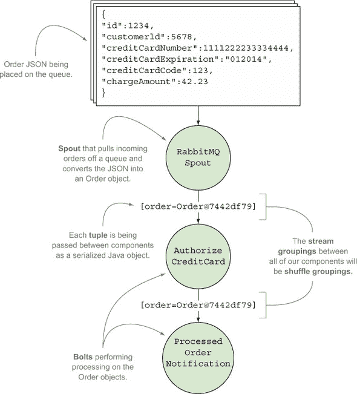

在了解我们的拓扑结构后，我们将先介绍我们两个螺栓的代码，然后再讨论保证消息处理及其实现所需的条件。稍后我们将讨论 spout 的代码。

### 4.3. 基本螺栓实现

本节将涵盖我们两个螺栓的代码：`AuthorizeCreditCard`和`ProcessedOrderNotification`。了解每个螺栓内部发生的事情将在我们讨论第 4.4 节中的保证消息处理时提供一些背景。

我们将`RabbitMQSpout`的实现留到保证消息处理部分的末尾，因为 spout 中的大部分代码都是针对重试失败的元组。对保证消息处理的完整理解将帮助您专注于 spout 代码的相关部分。

让我们从查看我们的拓扑中的第一个螺栓`AuthorizeCreditCard`开始。

#### 4.3.1. `AuthorizeCreditCard`实现

`AuthorizeCreditCard`螺栓从`RabbitMQSpout`接受一个`Order`对象。然后，这个螺栓尝试通过调用外部服务来授权信用卡。根据授权尝试的结果，我们的数据库中的订单状态将被更新。之后，这个螺栓将发出包含它接收到的`Order`对象的元组。图 4.3 说明了我们在拓扑中的位置。

##### 图 4.3. `AuthorizeCreditCard`螺栓接受来自`RabbitMQSpout`的输入元组，无论信用卡是否被授权都会发出元组。

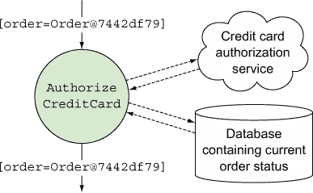

下一个列表展示了此螺栓的代码。

##### 列表 4.3. `AuthorizeCreditCard.java`

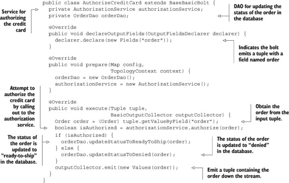

一旦账单被批准或拒绝，我们就准备好通知下游系统已处理的订单；这个代码将在接下来的`ProcessedOrder-Notification`中展示。

#### 4.3.2. `ProcessedOrderNotification`实现

我们流中的第二个也是最后一个螺栓`ProcessedOrderNotification`接受来自`AuthorizeCreditCard`螺栓的`Order`，并通知外部系统订单已被处理。这个螺栓不会发出任何元组。图 4.4 显示了这个最终的螺栓在拓扑中的位置。

##### 图 4.4. `ProcessedOrderNotification`螺栓接受来自`AuthorizeCreditCard`螺栓的输入元组，并在不发出元组的情况下通知外部系统。

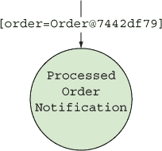

下面的列表显示了此螺栓的代码。

##### 列表 4.4. `ProcessedOrderNotification.java`

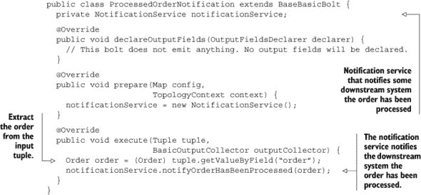

在下游系统被通知处理顺序之后，我们的拓扑结构就没有其他事情可做了，因此这就是我们 bolt 实现结束的地方。目前我们有一个明确的解决方案（除了 spout，我们将在下一节讨论）。我们在这个章节中提出的设计/实现步骤与我们在第二章和第三章中采取的步骤是一致的。

与那些章节相比，这个实现的不同之处在于确保所有元组都被拓扑结构中的所有 bolt 处理的要求。处理金融交易与 GitHub 提交计数或社交媒体签到热图有很大的不同。还记得在 4.1.1 节中提到的支持可靠性的拼图碎片吗？

+   一个对应可靠 spout 的可靠数据源

+   一个锚定的元组流

+   一个拓扑结构在处理每个元组时会承认它，或者在出现故障时通知我们

+   具有容错能力的 Storm 集群基础设施

我们已经到了可以开始处理前三部分内容的时候了。那么，我们的实现将如何改变以提供这些部分呢？令人惊讶的是，它不会改变！我们 bolt 的代码已经设置好了以支持 Storm 中的保证消息处理。让我们详细看看 Storm 是如何做到这一点的，以及接下来看一下我们的可靠`RabbitMQSpout`。

### 4.4\. 保证消息处理

什么是消息，Storm 又是如何保证消息被处理的？消息与元组同义，Storm 有确保从 spout 发出的元组被拓扑结构完全处理的能力。所以如果元组在流中某个点失败，Storm 知道发生了故障，并且可以重新播放该元组，从而确保它被处理。Storm 文档通常使用“保证消息处理”这个短语，本书中我们也将使用这个短语。

如果你想开发可靠的拓扑结构，理解保证消息处理是至关重要的。获得这种理解的第一步是知道元组完全处理或失败的含义。

#### 4.4.1\. 元组状态：完全处理与失败

从 spout 发出的元组可能导致下游 bolt 发出许多额外的元组。这创建了一个*元组树*，其中 spout 发出的元组作为根。Storm 为 spout 发出的每个元组创建和跟踪一个元组树。当该元组的树中的所有叶子都被标记为已处理时，Storm 将认为从 spout 发出的元组已经完全处理。为了确保 Storm 可以创建和跟踪元组树，你需要使用 Storm API 完成以下两项操作：

+   确保在从 bolt 发出新元组时锚定输入元组。这是 bolt 表示“好的，我正在发出一个新元组，同时这里也有初始输入元组，这样你可以在这两个元组之间建立联系”的方式。

+   确保你的螺栓在完成处理一个输入元组时通知 Storm。这被称为*确认*，这是螺栓告诉 Storm 的方式，“嘿，Storm，我已经处理完这个元组了，所以请随意在元组树中将其标记为已处理。”

Storm 将拥有创建和跟踪元组树所需的一切。

| |
| --- |

**有向无环图和元组树**

虽然我们称之为元组树，但实际上它是一个有向无环图（DAG）。有向图是一组由边连接的节点集，其中边有方向。DAG 是有向图，你不能从一个节点开始，通过一系列边最终回到同一个节点。Storm 的早期版本只与树一起工作；尽管 Storm 现在支持 DAG，但术语“元组树”仍然存在。

| |
| --- |

在一个理想的世界里，你可以在这里停止，由喷发器发出的元组将始终被完全处理，没有任何问题。不幸的是，软件的世界并不总是理想的；你应该预料到失败。我们的元组也不例外，将在以下两种情况下被视为失败：

+   元组树中的所有叶子节点在特定时间内都没有被标记为已处理（已确认）。这个时间框架可以在拓扑级别通过`TOPOLOGY`_`MESSAGE`_`TIMEOUT`_`SECS`设置进行配置，默认为 30 秒。以下是如何在构建你的拓扑时覆盖此默认值：

    ```
    Config config = new Config();
    config.setMessageTimeoutSecs(60);.
    ```

+   在螺栓中手动失败一个元组，这会触发元组树的立即失败。

我们不断提到“元组树”这个词，所以让我们在我们的拓扑中遍历元组树的生命周期，以展示它是如何工作的。

##### 与爱丽丝一起进入兔子洞...或者一个元组

图 4.5 从展示我们的喷发器发出一个元组后元组树的初始状态开始。我们有一个只有一个根节点的树。

##### 图 4.5\. 元组树的初始状态

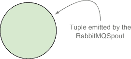

流中的第一个螺栓是`AuthorizeCreditCard`螺栓。这个螺栓将执行授权并发出一个新的元组。图 4.6 显示了发出后的元组树。

##### 图 4.6\. 在`AuthorizeCreditCard`螺栓发出一个元组后，元组树

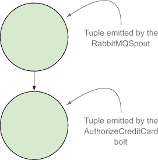

我们需要在`AuthorizeCreditCard`螺栓中确认输入元组，这样 Storm 才能将该元组标记为已处理。图 4.7 显示了执行此确认后的元组树。

##### 图 4.7\. 在`AuthorizeCreditCard`螺栓确认其输入元组后，元组树

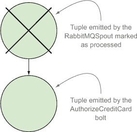

一旦`AuthorizeCreditCard`螺栓发出一个元组，它就会到达`ProcessedOrderNotification`螺栓。这个螺栓不会发出元组，因此不会将元组添加到元组树中。但我们需要确认输入元组，因此告诉 Storm 这个螺栓已经完成了处理。图 4.8 显示了执行此确认后的元组树。此时，元组被认为是完全处理的。

##### 图 4.8\. 在`ProcessedOrderNotification`螺栓确认其输入元组后，元组树

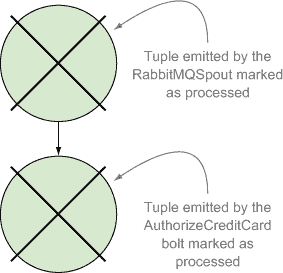

在心中有一个清晰的元组树定义后，让我们继续讨论我们 bolt 中需要的锚定和确认的代码。我们还将讨论失败的元组和我们需要注意的各种错误类型。

#### 4.4.2. 在我们的 bolt 中锚定、确认和失败元组

在我们的 bolt 中实现元组的锚定、确认和失败有两种方式：*隐式*和*显式*。我们之前提到，我们的 bolt 实现已经为保证消息处理而设置好了。这是通过隐式锚定、确认和失败来完成的，我们将在下面讨论。

##### 隐式锚定、确认和失败

在我们的实现中，所有的 bolt 都扩展了`BaseBasicBolt`抽象类。使用`BaseBasicBolt`作为我们的基类的美妙之处在于，它自动为我们提供了锚定和确认。以下列表检查了 Storm 是如何做到这一点的：

+   ***锚定（Anchoring）***—**在`BaseBasicBolt`实现的`execute()`方法中，我们将发射一个元组传递给下一个 bolt。在发射的这个点上，提供的`BasicOutputCollector`将承担将输出元组锚定到输入元组的责任。在`AuthorizeCreditCard`bolt 中，我们发射订单。这个发出的订单元组将自动锚定到进入的订单元组：

    ```
    outputCollector.emit(new Values(order));
    ```

+   ***确认（Acking）***—**当`BaseBasicBolt`实现的`execute()`方法完成时，发送给它的元组将被自动确认。

+   ***失败（Failing）***—**如果在`execute()`方法中发生失败，处理方式是通过抛出`FailedException`或`ReportedFailed-Exception`来通知`BaseBasicBolt`。然后`BaseBasicBolt`将负责将该元组标记为失败。

使用`BaseBasicBolt`通过隐式锚定、确认和失败来跟踪元组状态很容易。但`BaseBasicBolt`并不适合每个用例。它通常只在单个元组进入 bolt 并且立即从这个 bolt 发出单个对应元组的用例中才有帮助。这就是我们的信用卡授权拓扑的情况，所以它在这里工作。但对于更复杂的例子，这还不够。这就是显式锚定、确认和失败发挥作用的地方。

##### 显式锚定、确认和失败

当我们有一些 bolt 执行更复杂的任务时

+   在多个输入元组上聚合（折叠）

+   联合多个进入的流（我们不会在本章中介绍多个流，但在热图章节中，第三章，当我们除了默认流外还有一个 tick 元组流时，我们确实有两个流通过一个 bolt）

然后，我们将不得不超越 `BaseBasicBolt` 提供的功能。当行为可预测时，`BaseBasicBolt` 是合适的。当你需要程序性地决定一个元组批次何时完成（例如在聚合时）或在运行时决定何时将两个或多个流连接起来时，你需要程序性地决定何时锚定、确认或失败。在这些情况下，你需要使用 `BaseRichBolt` 作为基类而不是 `BaseBasicBolt`。以下列表显示了在扩展 `BaseRichBolt` 的 bolt 的实现中需要做什么：

+   ***锚定***—**要显式锚定，我们需要在 bolt 的 `execute` 方法中将输入元组传递到 `outputCollector` 的 `emit()` 方法：`outputCollector.emit(new Values(order))` 变为 `outputCollector.emit(tuple, new Values(order))`。

+   ***确认***—**要显式确认，我们需要在 bolt 的 `execute` 方法中调用 `outputCollector` 的 `ack` 方法：`outputCollector.ack(tuple)`。

+   ***失败***—**这是通过在 bolt 的 `execute` 方法中调用 `outputCollector` 的 `fail` 方法来实现的：`throw new FailedException()` 变为 `outputCollector.fail(tuple);`

虽然我们不能为所有用例使用 `BaseBasicBolt`，但我们可以使用 `BaseRichBolt` 来完成 `BaseBasicBolt` 可以做的所有事情，并且更多，因为它提供了更精细的控制，以确定何时以及如何锚定、确认或失败。我们的信用卡授权拓扑可以用 `BaseBasicBolt` 来表达，以实现所需的可靠性，但也可以用 `BaseRichBolt` 轻松编写。以下列表重写了我们的信用卡授权拓扑中的一个 bolt：

##### 列表 4.5\. 在 `AuthorizeCreditCard.java` 中的显式锚定和确认

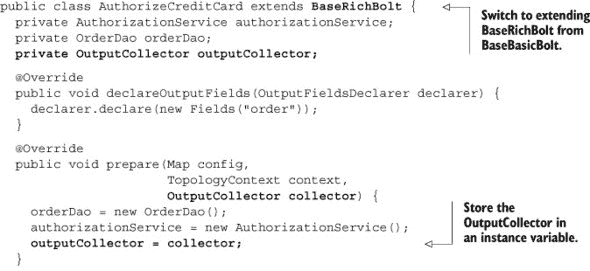

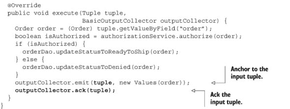

有一个需要注意的事项是，使用 `BaseBasicBolt` 时，我们会在每次调用 `execute()` 方法时获得一个 `BasicOutputCollector`。但使用 `BaseRichBolt` 时，我们需要通过在 bolt 初始化时通过 `prepare()` 方法提供的 `OutputCollector` 来维护元组状态。`BasicOutputCollector` 是 `OutputCollector` 的简化版本；它封装了一个 `OutputCollector`，但通过一个更简单的接口隐藏了更精细的功能。

另一点需要注意的事项是，当使用 `BaseRichBolt` 时，如果我们没有将输出的元组锚定到输入的元组上，那么从那个点开始将不再有任何可靠性。`BaseBasicBolt` 代表你进行了锚定：

+   *已锚定*—`outputCollector.emit(tuple, new Values(order));`

+   *未锚定*—`outputCollector.emit(new Values(order));`

在讨论了锚定和确认之后，让我们继续讨论不那么直接的事情：处理错误。本身失败一个元组是容易的；知道何时可以重试错误则需要一些思考。

##### 处理失败和知道何时重试

我们已经涵盖了与保证消息处理相关的许多概念。我们已经很好地掌握了锚定和确认。但我们还没有解决我们想要如何处理失败的问题。我们知道我们可以通过抛出`FailedException/ReportedFailedException`（当使用`BaseBasicBolt`时）或在`OutputCollector`上调用`fail`（当使用`BaseRichBolt`时）来使元组失败。让我们在`AuthorizeCreditCard`bolt 的上下文中看看这个问题，如下所示。我们只显示了`execute()`方法中包含显式失败的更改。

##### 列表 4.6\. 在`AuthorizeCreditCard.execute()`中锚定、确认和失败

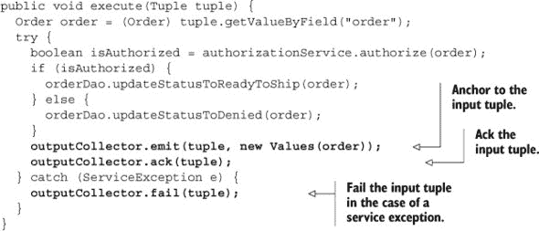

以这种方式使元组失败将导致整个元组树从 spout 开始重放。这是保证消息处理的关键，因为这是重试机制的主要触发器。了解何时应该使元组失败很重要。这看起来很明显，但元组应该在它们是*可重试的*（可以重试）时失败。那么问题就变成了什么可以/应该重试。以下列表讨论了各种类型的错误：

+   ***已知错误*—** 这些可以分为两组：

    +   ***可重试*—** 对于已知的特定可重试错误（例如，在连接到服务时发生的套接字超时异常），我们希望使元组失败，以便它被重放和重试。

    +   ***不可重试*—** 对于已知无法安全重试的错误（如对 REST API 的 POST 请求）或者当重试没有意义时（如处理 JSON 或 XML 时的`ParseException`），你不应该使元组失败。当你遇到这些不可重试的错误时，你不需要使元组失败，而是需要确认该元组（不发射新的元组），因为你不想触发它的重放机制。我们建议在这里进行某种形式的记录或报告，这样你将知道你的拓扑中出现了错误。

    +   ***未知错误*—** 通常，未知或意外的错误将占观察到的错误的一小部分，因此通常会将它们失败并重试。在你看到它们一次之后，它们就变成了已知错误（假设有记录），你可以对它们采取行动，无论是作为可重试的还是不可重试的已知错误。

|  |
| --- |

##### 注意

在 Storm 拓扑中记录错误数据可能很有用，正如你在第六章中看到的，当我们讨论度量时。

|  |
| --- |

这使得我们在 bolt 中关于锚定、确认和失败的讨论告一段落。现在，是时候转换方向，转向 spout。我们提到，当重放机制被激活时，重放从 spout 开始，并逐步进行。让我们看看它是如何工作的。

#### 4.4.3\. Spout 在保证消息处理中的作用

到目前为止，我们的焦点一直集中在我们在 bolts 中需要做什么来实现保证消息处理。本节将完成序列，并讨论 spout 在保证它发射的元组被完全处理或失败时重放所起的作用。下一个列表显示了来自 第二章 的 spout 接口。

##### 列表 4.7\. `ISpout.java` 接口

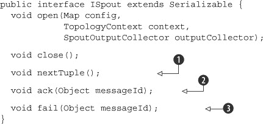

怎样让 spout 保证消息被处理？这里有一个提示：`ack`  和 `fail`  方法与此有关。以下步骤给出了一个更完整的图景，说明了在 spout 发射元组之前和该元组被完全处理或失败之后会发生什么：

1.  Storm 通过在 spout 上调用 `nextTuple`  来请求元组。

1.  spout 使用 `SpoutOutputCollector` 将元组发射到其流中的一个。

1.  当发射元组时，Spout 提供一个 `messageId`，用于识别该特定的元组。这看起来可能像这样：

    ```
    spoutOutputCollector.emit(tuple, messageId);.
    ```

1.  元组被发送到下游的 bolts，Storm 跟踪由这些消息创建的元组树。记住，这是通过 bolts 中的锚定和确认来完成的，以便 Storm 可以构建树并标记已处理的叶子。

1.  如果 Storm 检测到元组已被完全处理，它将在原始 spout 任务上调用 `ack`  方法，并带有 spout 提供给 Storm 的消息 ID。

1.  如果元组超时或消费 bolts 之一明确地失败了元组（例如在我们的 `AuthorizeCreditCard` bolt 中），Storm 将在原始 spout 任务上调用 `fail`  方法，并带有 spout 提供给 Storm 的消息 ID。

步骤 3、5 和 6 是从 spout 视角保证消息处理的关键。一切始于发射元组时提供 `messageId`。不这样做意味着 Storm 无法跟踪元组树。如果需要，您应该在 `ack` 方法中添加代码以执行对完全处理元组所需的任何清理。您还应该在 `fail` 方法中添加代码以重放元组。

|  |
| --- |

**Storm 确认任务**

Storm 使用特殊的“确认”任务来跟踪元组树，以确定 spout 元组是否已被完全处理。如果一个确认任务看到元组树是完整的，它将向最初发射元组的 spout 发送消息，导致该 spout 的 `ack` 方法被调用。

|  |
| --- |

看起来我们需要编写一个支持所有这些标准的 spout 实现。在前一章中，我们介绍了不可靠数据源的概念。不可靠数据源将无法支持确认或失败。一旦该数据源将消息交给你的 spout，它就假设你已经承担了该消息的责任。另一方面，可靠数据源会将消息传递给 spout，但直到你提供了某种形式的确认，它才不会假设你已经承担了这些消息的责任。此外，可靠数据源将允许你失败任何给定的元组，并保证你以后能够重放它。简而言之，可靠数据源将支持步骤 3、5 和 6。

要展示可靠数据源的能力如何与 spout API 结合，最好的方式是使用一个常用的数据源来实现解决方案。Kafka、RabbitMQ 和 Kestrel 都是与 Storm 一起广泛使用的。Kafka 是基础设施工具箱中的一个宝贵工具，它与 Storm 配合得很好，我们将在第九章中详细介绍。现在我们选择使用 RabbitMQ，它非常适合我们的用例。

##### 一个可靠的 spout 实现

让我们回顾一个基于 RabbitMQ 的 spout 实现，它将为我们提供这个用例所需的全部可靠性。[¹] 请记住，我们的主要兴趣不是 RabbitMQ，而是如何通过一个良好实现的 spout 和可靠数据源提供确保消息处理。如果你不熟悉 RabbitMQ 客户端 API 的底层，不要担心；我们在下一个列表中强调了你需要关注的重要部分。

> ¹ 你可以在 GitHub 上找到 RabbitMQ spout 实现的更健壮、可配置和性能更好的版本，网址为[`github.com/ppat/storm-rabbitmq`](https://github.com/ppat/storm-rabbitmq)。

##### 列表 4.8\. `RabbitMQSpout.java`

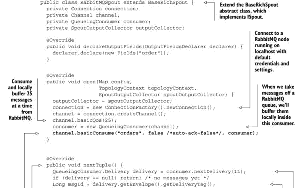

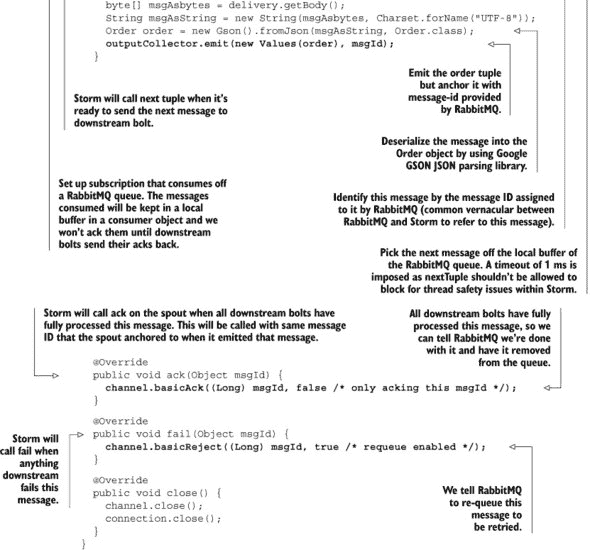

Storm 为你提供了工具，确保你的 spout 发出的元组在 Storm 基础设施中传输过程中得到完全处理。但为了确保消息处理生效，你必须使用一个可靠的数据源，该数据源具有重放元组的能力。此外，spout 实现必须利用其数据源提供的重放机制。如果你想在拓扑中成功实现确保消息处理，理解这一点是至关重要的。

| |
| --- |

**从 spout 发出锚定与非锚定元组**

我们在前面章节中创建的拓扑没有充分利用保证消息处理或容错。我们可能在那章中使用了`BaseBasicBolt`，这可能会给我们带来隐式的锚定和确认，但那些章节中的元组并非来自可靠的数据源。由于这些数据源的不可靠性，当我们从 spout 发射元组时，它们是通过`outputCollector.emit(new Values(order))`发送的“未锚定”。如果你从 spout 开始不锚定输入元组，那么你不能保证它们会被完全处理。这是因为回放总是从 spout 开始的。因此，决定不锚定发射元组应该始终是一个有意识的决策，就像我们在热图示例中所做的那样。

| |
| --- |

我们现在准备编写一个健壮的拓扑并将其介绍给世界。我们已经涵盖了支持可靠性的三个拼图碎片：

+   一个具有相应可靠 spout 的数据源

+   一个锚定的元组流

+   一个在处理每个元组时确认或通知失败的情况的拓扑

在继续讨论第五章（chapter 5）以讨论拼图的最后一部分——Storm 集群——之前，让我们谈谈回放语义以及我们当前的拓扑实现是否足够满足我们的需求。

### 4.5\. 回放语义

拼图中支持可靠性的每一个碎片都扮演着关键角色，如果我们想要构建一个健壮的拓扑，它们都是必要的。但是，当你考虑流在通过你的拓扑时的回放特性时，你将开始认识到，在事件处理方面，Storm 提供了不同级别的可靠性保证。当我们意识到我们的流满足不同的需求时，我们可以为可靠性分配不同的语义。让我们来看看这些不同级别的可靠性。

#### 4.5.1\. Storm 中的可靠性级别

与我们在第三章（chapter 3）中仔细检查数据流时看到的不同类型的扩展问题类似，当我们仔细检查我们的拓扑设计时，我们看到了不同级别的可靠性。在这里，我们确定了三个可靠性的级别：

+   至多一次处理

+   至少一次处理

+   精确一次处理

让我们进一步阐述我们所说的每个这些概念。

##### 至多一次处理

当你想要保证没有任何单个元组被处理超过一次时，你会使用*至多一次处理*。在这种情况下，永远不会发生回放。如果它成功了，那很好，但如果它失败了，元组将被丢弃。无论如何，这种语义不提供所有操作都将被处理的可靠性保证，这是你可以选择的简单语义。我们在前面的章节中使用了至多一次处理，因为那些用例没有规定需要可靠性。我们可能在之前的章节中使用了`BaseBasicBolt`（具有自动锚定和确认），但我们没有在从 spout 首次发射元组时锚定元组。

在 Storm 中实现这种可靠性不需要做任何特殊的事情，但这并不是我们下一个可靠性级别的真实情况。

##### 至少一次处理

当你想确保每个元组至少被成功处理一次时，可以使用至少一次处理。如果一个元组被重放多次，并且由于某种原因它成功超过一次，在这个重放语义下这是可以接受的。你主要关心的是它必须成功，即使这意味着要做重复的工作。

要在 Storm 中实现至少一次处理，你需要一个可靠的 spout 和一个可靠的数据源，以及一个带有已确认或失败元组的锚定流。这使我们达到了最严格的可靠性级别。

##### 一次且仅一次处理

一次且仅一次处理与至少一次处理相似，因为它可以保证每个元组都成功处理。但一次且仅一次处理特别注意确保一旦元组被处理，它就再也不能被处理。

与至少一次处理一样，你需要一个可靠的 spout 和一个可靠的数据源，以及一个带有已确认或失败元组的锚定流。但使这个级别与至少一次处理区分开来的是，你还需要在 bolt(s)中添加逻辑来确保元组只被处理一次。

要理解每种类型处理对系统提出的要求，重要的是要了解从我们最严格的选项中产生的微妙之处和问题：即一次且仅一次。

#### 4.5.2. 检查 Storm 拓扑中的一次且仅一次处理

在那个简单的短语*一次且仅一次*背后隐藏着很多复杂性。这意味着你必须能够知道你是否已经完成了一个工作单元，这反过来意味着你必须做以下事情：

1.  做这个工作单元。

1.  记录你已经完成了这个工作单元。

此外，这两个步骤必须作为一个原子操作执行——你不能先做工作然后未能记录结果。你需要能够在一步中完成工作并记录已经完成。如果你可以完成工作但在记录工作已完成之前出现故障，那么你实际上并没有*一次且仅一次*——你只有*通常一次*。绝大多数时候，工作只会做一次，但偶尔，它会被做多次。这是一个极其严格的资格要求。

至少一次处理与这两个步骤相同，但这些操作不需要原子性地发生。如果在执行工作单元期间或之后立即发生故障，可以重新做工作并重新尝试记录结果。如果重新做工作是不允许的，那么你需要添加一个重要要求：工作单元的最终结果必须是幂等的。一个动作如果是幂等的，那么在执行多次后，它对主题的第一次执行之后就没有额外的效果。例如：

+   “将 x 设置为 2”是一个幂等操作。

+   “将变量 x 加 2”不是一个幂等操作。

具有外部副作用（如发送电子邮件）的操作显然是非幂等的。重复该工作单元会发送多于一个的电子邮件，这肯定不是你想要做的。

如果你的工作单元是非幂等的，那么你必须回退到至多一次处理。你想要完成这个工作单元，但这个工作结果不被重复比实际完成工作更重要。

#### 4.5.3\. 检查我们的拓扑中的可靠性保证

我们如何在拓扑中提供更严格的可靠性程度？我们甚至需要这样做吗，或者我们已经处于足够好的状态？为了回答这些问题，识别我们的拓扑当前处于何种可靠性水平是有意义的。

##### 确定当前的可靠性水平

我们拓扑中有哪种处理类型？我们有保证的消息处理，这样如果发生故障，我们会重试元组。这排除了至多一次作为我们的语义。这是好的。我们当然希望向人们收取我们为他们运输的货物的费用。

我们是具有精确一次语义还是至少一次语义？让我们来分析一下。我们的“工作单元”是向客户的信用卡收费并更新订单状态。这可以在以下列表中看到。

##### 列表 4.9\. 检查 `AuthorizeCreditCard.java` 的 `execute()` 方法

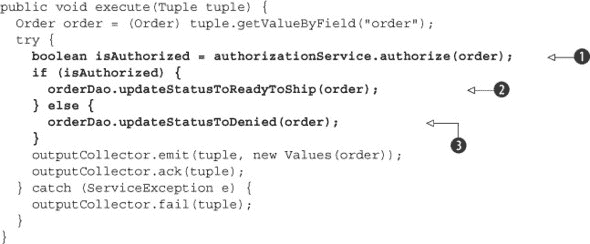

问题是这样的：这两个步骤是一个原子操作吗？答案是：不是。我们有可能向用户的信用卡收费，但不更新订单状态。在收费信用卡()和更改订单状态(, )之间，可能会发生一些事情：

+   我们的过程可能会崩溃。

+   数据库可能无法记录结果。

这意味着我们没有精确一次语义；我们有至少一次。从我们目前的状态来看，这是有问题的。重试一个元组可能导致向客户的卡重复收费。我们能做些什么来减少这种危险？我们知道精确一次对我们来说是不可能的，但我们应该能够使至少一次更安全。

##### 在授权订单时提供更好的至少一次处理

在使我们的至少一次处理更安全时，我们想要问的第一个问题是我们的操作是否可以做成幂等的。答案可能是：不可以。我们需要外部信用卡服务的帮助。如果我们能提供订单 ID 作为唯一的交易标识符，并且服务会抛出一个错误，例如 `DuplicateTransactionException`，那么我们可以更新我们的记录以表明订单已准备好发货并继续处理。处理此类错误可以在以下列表中看到。

##### 列表 4.10\. 更新 `AuthorizeCreditCard.java` 以处理 `DuplicateTransactionException`

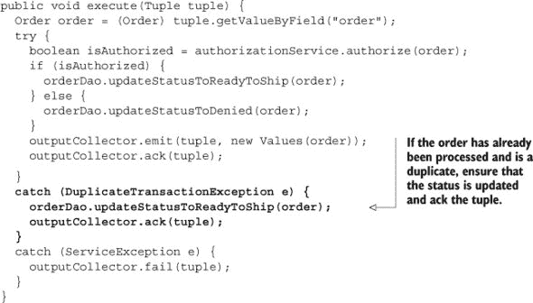

没有外部合作，我们能做得最好的是什么？如果我们的进程在向客户扣款和记录扣款之间崩溃，我们除了接受它有时会发生并准备以非技术方式（如客户服务响应退款请求）应对它之外，别无他法。从现实的角度来看，如果我们的系统稳定，这应该是一个相对罕见的事件。

对于“记录系统不可用”的情况，我们可以采取一种部分预防措施。在尝试扣款之前，我们可以验证存储更新订单状态的数据库是否可用。这种方法可以减少出现以下情况的可能性：我们扣款后，由于数据库故障而未能更新订单状态。

通常，这是一个好的做法。如果你在拓扑中计算非幂等结果，并将“完成”存储起来，那么在开始你的工作单元时，确保你将能够记录它。这个检查可以在下一个列表中看到。

##### 列表 4.11\. 更新`AuthorizeCreditCard.java`以在处理前检查数据库可用性

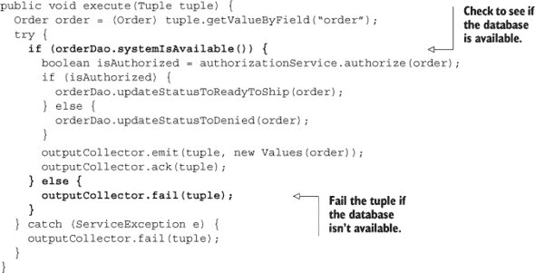

因此，我们已经提高了可靠性，但我们感觉我们还能做得更好。回顾我们的步骤，我们有以下内容：

1.  授权信用卡。

1.  更新订单状态。

1.  通知外部系统变化。

看起来我们还需要做更多工作来解决步骤 3。

##### 在所有步骤中提供至少一次处理。

如果我们成功完成了前两个步骤，但在执行第三个步骤时遇到故障怎么办？可能我们的进程崩溃了；可能我们的元组在通知外部系统之前超时了。无论如何，它已经发生了，Storm 将会重新播放该元组。那么我们如何应对这种场景呢？

在处理信用卡之前，我们应该确保记录系统可用（就像我们之前做的那样）并验证订单状态尚未“准备发货”。如果订单未准备发货，则按正常流程进行。这可能是我们第一次尝试此订单，数据库正在运行。如果订单已准备发货，那么我们可能在“更新订单状态”和“通知外部系统”步骤之间遇到了故障。在这种情况下，我们希望跳过再次扣款并直接通知外部系统变化。

如果我们控制这个外部系统，那么我们可以请求发送相同的订单多次，这是一个幂等操作，后续尝试将被丢弃。如果不这样做，我们之前遇到的关于信用卡处理缺乏幂等性的问题也适用。

我们的概念框架中的步骤有所改变；步骤 2 是新的：

1.  从消息队列中取出订单。

1.  确定订单是否已标记为“准备发货”，并执行以下两项操作之一：

    1.  如果订单已被标记为“准备发货”，则跳到步骤 6。

    1.  如果订单尚未标记为“准备好发货”，继续到步骤 3。

1.  通过调用外部信用卡授权服务尝试授权信用卡。

1.  如果服务调用成功，更新订单状态。

1.  如果失败，我们可以在稍后重试。

1.  通知一个单独的下游系统订单已被处理。

这些更新步骤在 图 4.9 中得到说明，新步骤被突出显示。

##### 图 4.9\. 电子商务信用卡授权流程的概念解决方案，增加了一步以提供更好的至少一次处理

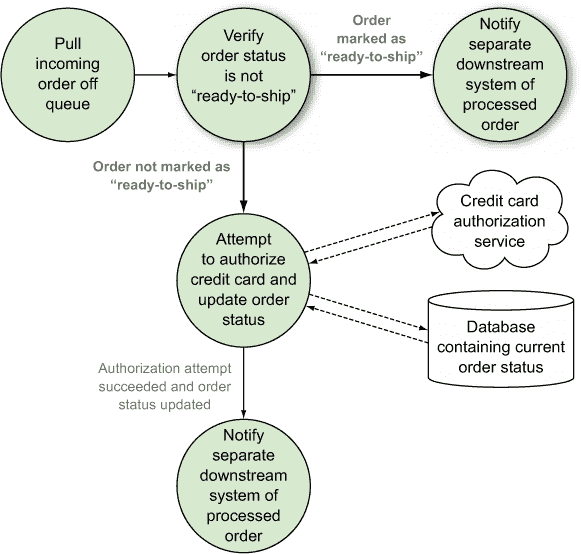

我们可以将这个概念解决方案以几种方式映射到我们的拓扑中：

+   添加一个新的 bolt 来执行状态验证步骤。我们可以将其命名为 `VerifyOrderStatus`。

+   在 `AuthorizeCreditCard` bolt 中执行状态验证步骤。

我们将选择第二个选项并更新 `AuthorizeCreditCard` bolt 以执行验证步骤。我们将把添加新的 `VerifyOrderStatus` bolt 作为你的练习。以下列表显示了 `AuthorizeCreditCard` 的更新代码。

##### 列表 4.12\. 更新 `AuthorizeCreditCard.java` 以在处理前检查订单状态

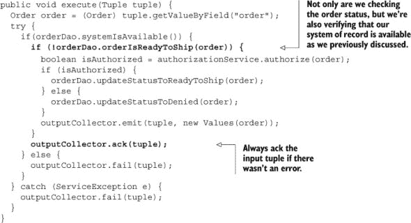

就这样，我们完成了。或者，我们真的完成了吗？我们在这里遗漏了一些东西。即使“完成”只是意味着我们检查了订单是否准备好发货并且没有做任何事情，我们仍然需要在处理完订单后始终通知外部系统。这个更新的代码可以在下一个代码列表中看到；我们只需要在“处理”订单时发出一个元组。

##### 列表 4.13\. 更新 `AuthorizeCreditCard.java` 以在订单“处理”时发出元组

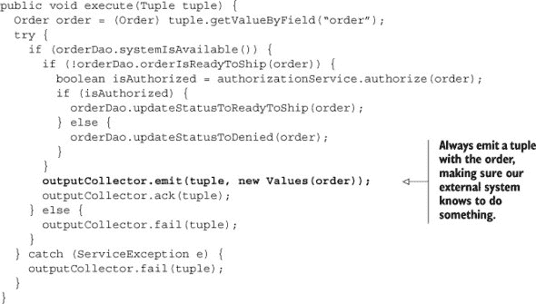

这使我们达到了一个我们感到舒适的解决方案。尽管我们还没有能够实现精确一次处理，但我们通过在 `AuthorizeCreditCard` bolt 中包含一些额外的逻辑，已经能够实现更好的至少一次处理。在设计具有可靠性要求的拓扑时，你应遵循此过程。你需要绘制出你的基本概念问题，然后确定你的语义，至少一次或最多一次。如果是至少一次，开始考虑所有可能失败的方式，并确保你解决了这些问题。

### 4.6\. 摘要

在本章中，你学习了

+   在 Storm 中你可以达到的不同可靠程度

    +   最多一次处理

    +   至少一次处理

    +   一次精确处理

+   不同的问题需要不同级别的可靠性，作为开发者，了解你的问题域的可靠性要求是你的工作。

+   Storm 通过四个主要部分支持可靠性：

    +   一个对应可靠源头的可靠数据源

    +   一个锚定的元组流

    +   一个在处理每个元组时承认它或通知失败的网络拓扑

    +   具有容错能力的 Storm 集群基础设施（将在下一章中讨论）

+   Storm 能够通过跟踪该元组的元组树来确定由 spout 发出的元组是否已完全处理。

+   为了使 Storm 能够跟踪元组树，你必须将输入元组锚定到输出元组，并确认任何输入元组。

+   通过超时或手动方式使元组失败将触发 Storm 的重试机制。

+   元组应该因为已知/可重试的错误和未知错误而失败。元组不应该因为已知/不可重试的错误而失败。

+   为了真正实现保证消息处理，spout 必须在连接到可靠数据源时显式处理和重试失败。
