## 第五章. 从本地到远程拓扑结构的迁移

本章涵盖

+   Storm 集群

+   Storm 集群内的容错性

+   Storm 集群安装

+   在 Storm 集群上部署和运行拓扑结构

+   Storm UI 及其作用

想象以下场景。你被分配去实现一个 Storm 拓扑结构，用于对公司系统内记录的事件进行实时分析。作为一名负责任的开发者，你决定将这本书作为开发拓扑结构的指南。你使用了在第二章 chapters 2 中介绍的核心 Storm 组件来构建它。你在第三章 chapters 3 中学习到的拓扑设计模式的基础上，确定每个 bolt 应该包含什么逻辑，并遵循第四章 chapters 4 中的步骤，为进入你的拓扑结构的所有元组提供至少一次处理。你准备将拓扑结构连接到接收日志事件的队列，并让它正常运行。接下来你该做什么？

你可以在本地运行你的拓扑结构，就像在第二章 chapters 2、第三章 chapters 3 和第四章 chapters 4 中所做的那样，但这样做并不能扩展到你期望的数据量和速度。你需要能够将你的拓扑结构部署到专为处理生产级数据而构建的环境中。这就是“远程”（也称为“生产”）Storm 集群发挥作用的地方——一个专为处理生产级数据需求而构建的环境。

| |
| --- |

##### 注意

正如你在第一章 chapters 1 中所学的，*容量*指的是进入你系统的数据量，*速度*指的是这些数据流经你系统的速度。

| |
| --- |

到目前为止，我们在单个进程中运行拓扑结构并模拟 Storm 集群已经满足了我们的需求，这对于开发和测试目的很有用。但本地模式不支持在第三章 chapters 3 中讨论的扩展性，也不支持我们在第四章 chapters 4 中了解到的第一类保证处理。实际上的 Storm 集群对于这两者都是必需的。

本章将首先解释 Storm 集群的各个部分及其所扮演的角色，随后将进行关于 Storm 如何提供容错性的问答环节。然后，我们将继续介绍如何安装 Storm 集群，并在安装的集群上部署和运行你的拓扑结构。我们还将介绍一个重要的工具，你可以使用它来确保你的拓扑结构健康：Storm UI。在这个过程中，我们将预览到将在第六章 chapters 6 和第七章 chapters 7 中涉及到的调整和故障排除主题。

所有这一切都始于 Storm 集群，因此让我们从第三章 chapters 3 中讨论的工作节点讨论展开。

### 5.1. Storm 集群

第三章（kindle_split_011.html#ch03）简要介绍了工作节点及其运行 JVM 的方式，而 JVM 又运行执行器和任务。在本节中，我们将深入探讨，从 Storm 集群的整体结构开始。一个 Storm 集群由两种类型的节点组成：主节点和工作节点。*主节点*运行一个名为 Nimbus 的守护进程，而*工作节点*每个运行一个名为 Supervisor 的守护进程。图 5.1 展示了包含一个主节点和四个工作节点的 Storm 集群。Storm 只支持单个主节点，而你的集群可能根据需要拥有不同数量的工作节点（我们将在第六章和第七章中介绍如何确定这个数量）。

##### 图 5.1\. Nimbus 和 Supervisor 及其在 Storm 集群内的责任

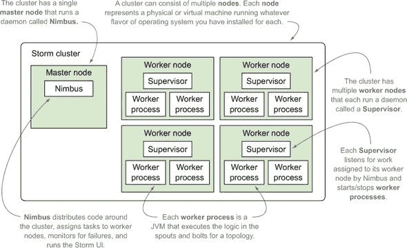

主节点可以被视为控制中心。除了图 5.1 中列出的责任外，这里还可以运行 Storm 集群中可用的任何命令——例如`activate`、`deactivate`、`rebalance`或`kill`（本章后面将详细介绍这些命令）。工作节点是 Spout 和 Bolt 中的逻辑执行的地方。

Storm 集群的另一个重要部分是*Zookeeper*。Storm 依赖于 Apache Zookeeper^([1])来协调 Nimbus 和 Supervisor 之间的通信。任何需要协调 Nimbus 和 Supervisor 之间的状态都保存在 Zookeeper 中。因此，如果 Nimbus 或 Supervisor 出现故障，一旦它们恢复，就可以从 Zookeeper 中恢复状态，使 Storm 集群像什么都没发生一样继续运行。

> ¹ [`zookeeper.apache.org/`](http://zookeeper.apache.org/)

图 5.2 展示了集成到 Storm 集群中的 Zookeeper 节点集群。我们已从该图中移除工作进程，以便你可以专注于 Zookeeper 如何作为 Nimbus 和 Supervisor 之间通信协调者的位置。

##### 图 5.2\. Zookeeper 集群及其在 Storm 集群中的作用

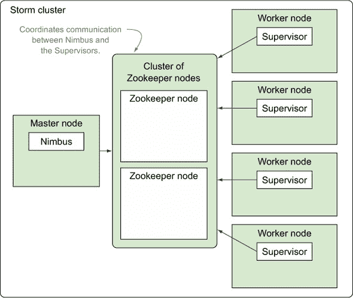

在本书的剩余部分，每次提到“Storm 集群”时，我们指的是主节点、工作节点和 Zookeeper 节点。

尽管主节点和 Zookeeper 是 Storm 集群的重要组成部分，但我们将暂时将焦点转移到工作节点上。工作节点是 Spout 和 Bolt 处理发生的地方，因此它们是我们第六章和第七章中许多调整和故障排除工作的中心。

| |
| --- |

##### 注意

第六章和第七章将解释你何时可能想要增加工作节点上运行的工作进程数量，以及何时以及如何达到收益递减的点。这些章节还将讨论工作进程内的调整，因此解释工作进程的各个部分是有意义的。

| |
| --- |

#### 5.1.1\. 工作节点的结构

如前所述，每个工作节点都有一个负责管理工作进程并保持其运行状态的守护进程。如果守护进程注意到某个工作进程已关闭，它将立即重启它。那么，工作进程究竟是什么呢？我们提到它是一个 JVM，但正如你在第三章 中所知，它还有更多内容。

每个工作进程执行拓扑的一部分。这意味着每个工作进程属于特定的拓扑，并且每个拓扑将在一个或多个工作进程中运行。通常，这些工作进程在 Storm 集群中的多台机器上运行。

在第三章中，你学习了关于执行器（线程）和任务（数据源/螺栓的实例）的内容。我们讨论了工作进程（JVM）如何运行一个或多个执行器（线程），每个线程执行一个或多个数据源/螺栓的实例（任务）。图 5.3 说明了这个概念。

##### 图 5.3\. 工作进程由一个或多个执行器组成，每个执行器由一个或多个任务组成。


这里是一些关键要点：

+   工作进程是一个 JVM。

+   执行器是 JVM 中的一个执行线程。

+   任务是在 JVM 执行线程中运行的数据源或螺栓的实例。

理解这些映射对于调整和故障排除非常重要。例如，第六章 回答了为什么你可能希望每个执行器有多个任务等问题，因此理解执行器与其任务之间的关系是至关重要的。

为了使关于工作节点、工作进程、执行器和任务的讨论完整，让我们在第四章中提到的信用卡授权拓扑的背景下介绍它们。

#### 5.1.2\. 在信用卡授权拓扑的背景下介绍工作节点

在本节中，我们将展示一个假设的信用卡授权拓扑配置，以帮助你在图中的工作进程、执行器和任务数量与实现它们的代码之间建立联系。这个假设配置可以在图 5.4 中看到。

##### 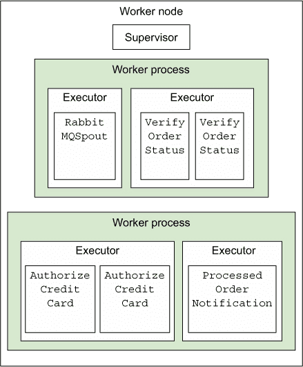


图 5.4 中的设置将通过以下列表中的代码实现。

##### 列表 5.1\. 我们假设的 Storm 集群配置

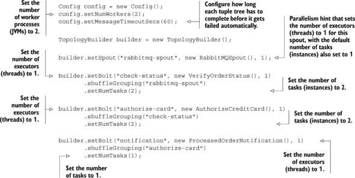

当我们在`Config`中设置`numWorkers`时，我们正在配置运行此拓扑所需的 worker 进程。我们实际上并没有强迫两个 worker 进程最终都运行在同一个 worker 节点上，如图 5.4 所示。图 5.4。Storm 会根据集群中哪些 worker 节点有空闲槽位来决定它们最终的位置。

|  |
| --- |

**并行性 vs. 并发性：有什么区别？**

*并行性*是指两个线程同时执行。*并发性*是指至少有两个线程在某种计算上取得进展。并发性不一定意味着两个线程是同时执行的——可能使用时间切片等技术来模拟并行性。

|  |
| --- |

在重新审视了工作节点故障分解之后，让我们看看 Storm 是如何在集群的各个部分提供容错性的。

### 5.2\. Storm 集群内的快速失败容错哲学

记得在第四章中讨论的可靠性难题的四个部分吗？

+   一个具有相应可靠 spout 的可靠数据源

+   一个锚定的元组流

+   一个在处理每个元组时确认或通知失败的拓扑

+   一个具有容错能力的 Storm 集群基础设施

我们终于到了讨论最后一部分的时候了，那就是具有容错能力的 Storm 集群基础设施。Storm 集群的组件在设计时已经考虑了容错性。解释 Storm 如何处理容错性最简单的方法就是以“当*x*发生时，Storm 会做什么？”的形式回答问题。关于容错性的最重要问题在表 5.1 中得到了解答。

##### 表 5.1\. 容错性问题及答案

| 问题 | 答案 |
| --- | --- |
| 如果一个工作节点挂了？ | Supervisor 会重启它，并将新的任务分配给它。所有在死亡时未完全确认的元组将由 spout 完全重放。这就是为什么 spout 需要支持重放（可靠的 spout）*并且*数据源也需要是可靠的（支持重放）。 |
| 如果一个工作节点连续启动失败？ | Nimbus 会将任务重新分配给另一个工作节点。 |
| 如果运行 worker 节点的一台实际机器挂了？ | Nimbus 会将该机器上的任务重新分配给健康的机器。 |
| 如果 Nimbus 挂了？ | 因为 Nimbus 是在监控下运行的（使用 daemontools 或 monit 等工具），它应该会自动重启并继续处理，就像什么都没发生一样。 |
| 如果一个 Supervisor 挂了？ | 因为 Supervisor 也是在监控下运行的（使用 daemontools 或 monit 等工具），它们应该会像什么都没发生一样自动重启。 |
| Nimbus 是否是单点故障？ | 不一定。Supervisor 和 worker 节点将继续处理，但你将失去将 worker 重新分配到其他机器或部署新拓扑的能力。 |

你可以看到，Storm 在保持快速失败哲学方面做得很好，即这个基础设施中的每一部分都可以重启，并将重新校准自己继续运行。如果在失败过程中元组处于中间状态，它们将自动失败。

无论失败的单元是实例（任务）、线程（执行器）、JVM（工作进程）还是 VM（工作节点），在每个层面上都设有安全措施，以确保一切都能自动重启（因为所有内容都在监督下运行）。

我们已经讨论了 Storm 集群在并行性和容错性方面的优势。你是如何着手搭建并运行这样一个集群的呢？

### 5.3. 安装 Storm 集群

Storm 维基对如何设置 Storm 集群做了很好的描述。维基上找到的步骤包括以下内容：

1.  查找有关设置 Zookeeper 的信息，以及一些有关维护 Zookeeper 集群的实用技巧。

1.  在主节点和工作节点上安装所需的 Storm 依赖项。

1.  将 Storm 发布版本下载并解压到主节点和工作节点上。

1.  通过 storm.yaml 文件配置主节点和工作节点。

1.  使用 Storm 脚本在监督下启动 Nimbus 和监督者守护进程。

我们将在下一部分更详细地介绍这些步骤。

| |
| --- |

##### 注意

在监督下运行一个进程意味着什么？这意味着某个监督进程管理着正在运行的进程。因此，如果被“监督”的进程失败，监督进程可以自动重启失败的进程。这是在 Storm 中提供容错性的关键要素。

| |
| --- |

#### 5.3.1. 设置 Zookeeper 集群

设置 Zookeeper 集群的步骤超出了本书的范围。你可以在 Apache Zookeeper 项目页面上找到如何安装 Zookeeper 的详细解释：[`zookeeper.apache.org`](http://zookeeper.apache.org)。遵循这些步骤来搭建并运行你的集群。

在运行 Zookeeper 时请注意以下几点：

+   Zookeeper 被设计为“快速失败”，这意味着如果发生它无法恢复的错误，它将关闭。在 Storm 集群中这并不理想，因为 Zookeeper 协调 Nimbus 和监督者之间的通信。因此，我们必须有一个监督进程来管理 Zookeeper 实例，以便如果 Zookeeper 实例发生故障，整个集群可以继续处理请求。监督进程将处理重启任何失败的 Zookeeper 服务器，使 Zookeeper 集群能够自我修复。

+   由于 Zookeeper 是一个长期运行的过程，其事务日志可能会变得相当大。这最终会导致 Zookeeper 运行空间耗尽。因此，设置某种类型的进程来压缩（甚至存档）这些日志中产生的数据至关重要。

#### 5.3.2. 在主节点和工作节点上安装所需的 Storm 依赖项

下一步是将所需的 Storm 依赖项安装到您为运行 Nimbus 和监督者而指定的机器上。表 5.2 列出了这些依赖项。

##### 表 5.2\. Storm 主节点和工作节点的外部依赖

| 依赖项 | 为什么需要它 | 下载链接 |
| --- | --- | --- |
| Java 6+ | Storm 在 JVM 上运行，最新的 Storm 版本在 Java 6 上运行。 | [`www.oracle.com/us/technologies/java/overview/index.html`](http://www.oracle.com/us/technologies/java/overview/index.html) |
| Python 2.6.6 | Storm 的标准命令行工具是围绕 Java 包装的 Python。 | [`www.python.org/downloads/`](https://www.python.org/downloads/) |

一旦将所需的依赖项安装到托管 Nimbus 和监督者的每台机器上，您就可以将这些机器安装 Storm。

#### 5.3.3\. 在主节点和工作节点上安装 Storm

目前 Storm 安装可以在 [`storm.apache.org/downloads.html`](http://storm.apache.org/downloads.html) 找到。对于本书，我们使用了 apache-storm-0.9.3。您应该将 Storm 版本的 zip 文件下载到每个节点，并在每台机器上的某个位置提取 zip 文件的内容。位置由您决定；例如，/opt/storm 是一个示例。图 5.5 显示了在 /opt/storm 目录中提取的内容。

##### 图 5.5\. Storm 版本 zip 文件的提取内容

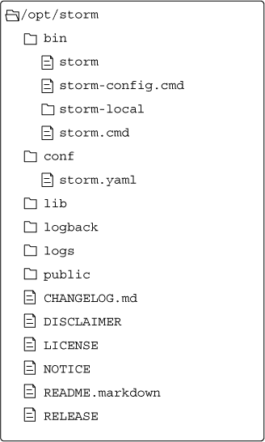

本图中有两个文件是我们本章特别感兴趣的：/opt/storm/bin/storm 和 /opt/storm/conf/storm.yaml。接下来让我们讨论 storm.yaml 及其用途。

#### 5.3.4\. 通过 storm.yaml 配置主节点和工作节点

Storm 版本包含一个 conf/storm.yaml 文件，用于配置 Storm 守护进程。此文件覆盖了在 defaults.yaml 中找到的配置设置。2 您可能希望覆盖至少一些值；许多默认值将机器名指向“localhost”。表 5.3 列出了您可能想要覆盖的一些初始配置选项，以便使您的 Storm 集群启动并运行。

> ² 您可以在 [`github.com/apache/storm/blob/master/conf/defaults.yaml`](https://github.com/apache/storm/blob/master/conf/defaults.yaml) 找到 defaults.yaml。

##### 表 5.3\. 您可能想要覆盖的 storm.yaml 属性，以用于您的 Storm 安装

| 属性 | 描述 | 默认值 |
| --- | --- | --- |
| storm.zookeeper.servers | 为您的 Storm 集群指定的 Zookeeper 集群中的主机列表。 | storm.zookeeper.servers: - "localhost" |
| storm.zookeeper.port | 如果您的 Zookeeper 集群使用的端口与默认端口不同，则需要此端口。 | storm.zookeeper.port: 2181 |
| storm.local.dir | Nimbus 和 Supervisor 守护进程将用于存储少量状态信息的目录。您必须在将运行 Nimbus 和 worker 的每台机器上创建这些目录并赋予它们适当的权限。 | storm.local.dir: "storm-local" |
| java.library.path | Java 安装的位置。 | java.library.path: "/usr/local/lib:/opt/local/lib:/usr/lib" |
| nimbus.host | Nimbus 机器的主机名。 | nimbus.host: "localhost" |

| supervisor.slots.ports | 对于每个工作机器，用于接收消息的端口。可用的端口号数量将决定 Storm 在每个工作机器上运行的 worker 进程数量。 | supervisor.slots.ports: – 6700

– 6701

– 6702

– 6703 |

您需要更新集群中每个节点的配置。如果您有一个包含多个工作节点的集群，这样做可能会变得繁琐。因此，我们建议使用像 Puppet^([3])这样的外部工具来自动化每个节点的部署和配置。

> ³ [`puppetlabs.com/`](http://puppetlabs.com/)

#### 5.3.5. 在监督模式下启动 Nimbus 和 Supervisors

如前所述，在监督模式下运行守护进程是设置 Storm 集群的关键步骤。监督进程使我们的系统具有容错能力。这究竟意味着什么？为什么需要这样做？

Storm 是一个快速失败的系统，这意味着任何遇到意外错误的 Storm 进程都会停止。Storm 被设计成任何进程都可以在任何点安全停止，并在进程重启时恢复。在监督模式下运行这些进程允许它们在发生故障时重新启动。因此，您的拓扑不受 Storm 守护进程故障的影响。要在监督模式下运行 Storm 守护进程，请执行以下命令：

+   ***启动 Nimbus*—** 在主机器上以监督模式运行 `bin/storm nimbus`。

+   ***启动 supervisors*—** 在每个工作机器上以监督模式运行 `bin/storm supervisor`。

+   ***Storm UI*—** 在主机器上以监督模式运行 `bin/storm ui`。

运行 Storm 守护进程是设置 Storm 集群的最后一步。当一切正常运行时，您的集群准备开始接受拓扑。让我们看看您如何将拓扑运行在 Storm 集群上。

### 5.4. 将您的拓扑运行在 Storm 集群上

在前面的章节中，我们已经在本地运行了我们的拓扑。这种方法对于学习 Storm 的基本原理是可行的。但如果你想获得 Storm 提供的益处（尤其是在保证消息处理和并行性方面），则需要一个远程的 Storm 集群。在本节中，我们将通过从第四章中的信用卡授权拓扑中提取一些代码，并执行以下操作来展示如何做到这一点：

+   重新审视连接拓扑组件的代码

+   展示在本地模式下运行该拓扑的代码

+   展示在远程 Storm 集群上运行该拓扑的代码

+   展示如何打包和部署该代码到远程 Storm 集群

#### 5.4.1\. 重新审视如何组合拓扑组件

在我们深入到在本地模式和远程集群上运行拓扑的代码之前，让我们快速回顾一下从第四章，信用卡授权拓扑，连接拓扑组件的代码，以提供一些背景。我们已经在第 5.1.2 节中展示了一些这段代码，但接下来的列表以更结构化的格式展示了它。

##### 列表 5.2\. 用于构建信用卡授权拓扑的`CreditCardTopologyBuilder.java`

```
public class CreditCardTopologyBuilder {
  public static StormTopology build() {
    TopologyBuilder builder = new TopologyBuilder();

    builder.setSpout("rabbitmq-spout", new RabbitMQSpout(), 1);

    builder.setBolt("check-status", new VerifyOrderStatus(), 1)
           .shuffleGrouping("rabbitmq-spout")
           .setNumTasks(2);

    builder.setBolt("authorize-card", new AuthorizeCreditCard(), 1)
           .shuffleGrouping("check-status")
           .setNumTasks(2);

    builder.setBolt("notification", new ProcessedOrderNotification(), 1)
           .shuffleGrouping("authorize-card")
           .setNumTasks(1);

    return builder.createTopology();

  }
}
```

我们将构建拓扑的代码封装在`CreditCardTopologyBuilder.java`中，因为这段代码不会改变，无论我们是在本地模式还是在 Storm 集群上运行。这是我们从第三章开始做的事情，这种方法的优点是它允许我们从多个地方调用构建拓扑的代码，而无需重复代码。

现在我们已经有了构建拓扑的代码，我们将向您展示如何运行这个构建好的拓扑。

#### 5.4.2\. 在本地模式下运行拓扑

本地模式在开发拓扑时很有用。它允许您在本地机器上模拟一个 Storm 集群，这样您就可以快速开发和测试您的拓扑。这提供了在代码更改和在实际运行拓扑中测试该更改之间快速周转的好处。尽管如此，本地模式也有一些缺点：

+   您无法实现与远程 Storm 集群相同的并行性。这使得在本地模式下测试并行性更改变得困难，甚至可能不可能。

+   当 Nimbus 尝试将 spouts 和 bolts 的实例序列化到各个工作节点时，本地模式不会揭示潜在的序列化问题。

下面的列表展示了具有`main()`方法的`LocalTopologyRunner`类，该方法接受我们在列表 5.2 中构建的拓扑并在本地运行它。

##### 列表 5.3\. 运行本地集群上拓扑的`LocalTopologyRunner.java`

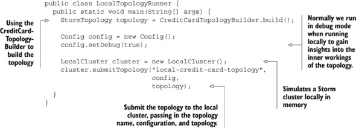

列表中的代码应该对您来说很熟悉。我们尚未解决的是将拓扑提交到远程 Storm 集群的代码。幸运的是，这段代码并没有太大的不同。让我们看看。

#### 5.4.3\. 在远程 Storm 集群上运行拓扑

在远程运行您的拓扑的代码与本地运行类似。唯一的区别是提交拓扑到集群的代码。您可能还需要不同的配置，因为本地模式不支持远程集群支持的一些功能（并行性和保证消息处理）。下一个列表展示了这段代码在一个我们称之为`RemoteTopologyRunner`的类中。

##### 列表 5.4\. `RemoteTopologyRunner`，用于将拓扑提交到远程集群

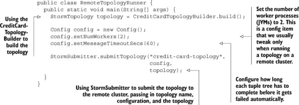

您会注意到唯一的区别是配置略有不同，使用 `StormSubmitter.submitTopology` 而不是 `LocalCluster.submitTopology`。

|  |
| --- |

##### 注意

我们将我们的拓扑的构建、本地运行和远程运行封装在三个不同的类中（`CreditCardTopologyBuilder`、`LocalTopologyRunner` 和 `RemoteTopologyRunner`）。虽然您可以按照您喜欢的任何方式设置代码，但我们发现这种分割效果很好，并且我们在所有拓扑中都使用它。

|  |
| --- |

现在我们已经编写了在远程集群上运行拓扑的代码，让我们将注意力转移到将代码物理上传到 Storm 集群以便运行。

#### 5.4.4\. 将拓扑部署到远程 Storm 集群

“将拓扑部署到 Storm 集群”是什么意思？通过“部署”，我们指的是将包含拓扑编译代码的 JAR 文件物理复制到集群中，以便运行。您需要从配置了 Storm 的机器上部署您的拓扑。图 5.6 提供了 Storm 发布版 zip 文件提取内容的复习。

##### 图 5.6\. Storm 发布版 zip 文件提取的内容

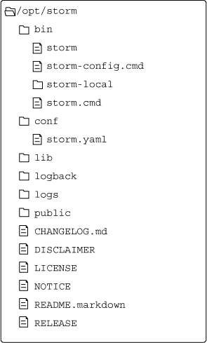

您需要确保更新 /opt/storm/conf/storm.yaml 文件，以便将 `nimbus.host` 属性设置为正确位置。我们对此步骤中的 /opt/storm/bin/storm 文件也很感兴趣：这是您将运行以将拓扑 JAR 部署到远程集群的可执行文件。图 5.7 显示了您将运行的部署拓扑的命令。您会注意到在图中，我们通过 /opt/storm/bin/storm 引用了 storm 可执行文件的全路径。如果您不想这样做，将 /opt/storm/bin 添加到您的 `PATH` 中，您可以从机器上的任何位置直接引用 `storm` 命令。

##### 图 5.7\. 将拓扑部署到 Storm 集群的命令

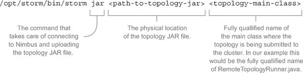

执行 图 5.7 中的命令后，您的拓扑将在 Storm 集群上启动并运行。一旦您的拓扑开始运行，您如何知道它实际上正在按预期工作并处理数据？这就是您需要查看 Storm UI 的地方，接下来我们将讨论 Storm UI。

### 5.5\. Storm UI 及其在 Storm 集群中的作用

Storm UI 是查找 Storm 集群和单个拓扑诊断的中心位置。如 5.3.5 节 中所述，在 Nimbus 上运行命令 `/bin/storm ui` 将启动 Storm UI。defaults.yaml 中的两个属性影响 Storm UI 的查找位置：

1.  **`nimbus.host`—** Nimbus 机器的主机名

1.  **`ui.port`—** 用来提供 Storm UI 的端口号（默认为 8080）

一旦运行起来，请在网页浏览器中输入 http://{nimbus.host}:{ui.port} 以访问 Storm UI。

Storm UI 有几个部分：

+   集群摘要屏幕

+   单个拓扑摘要屏幕

+   每个喷发器和螺栓的屏幕

每个屏幕都显示了与 Storm 集群不同部分相关的信息，具有不同粒度级别。集群概要屏幕与整个 Storm 集群相关，如图 5.8 所示。

##### 图 5.8\. 集群概要屏幕显示了整个 Storm 集群的详细信息。

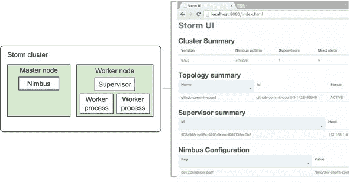

点击特定的拓扑链接（如图 5.8 中的 github-commit-count）将带您进入拓扑概要屏幕。此屏幕显示与特定拓扑相关的信息，如图 5.9 所示。

##### 图 5.9\. 拓扑概要屏幕显示了特定拓扑的详细信息。

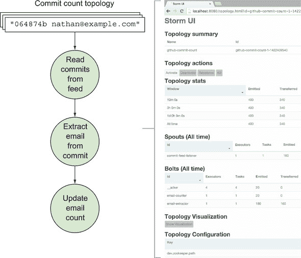

让我们更详细地探讨每个屏幕。

#### 5.5.1\. Storm UI：Storm 集群概要

Storm 集群概要由四个部分组成，如图 5.10 所示。

##### 图 5.10\. Storm UI 的集群概要屏幕

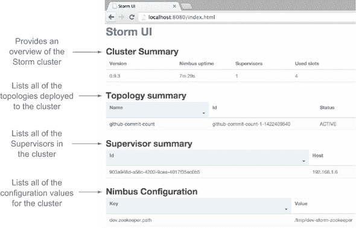

本屏幕的每个部分将在以下部分中更详细地解释。

##### 集群概要

集群概要部分提供了一个小但有用的集群概览。你会在图 5.11 中注意到术语*槽位*。一个槽位对应一个工作进程，因此有两个槽位被使用的集群意味着该集群上有两个工作进程正在运行。图 5.11 提供了本节中每个列的更多详细信息。

##### 图 5.11\. Storm UI 的集群概要屏幕上的集群概要部分

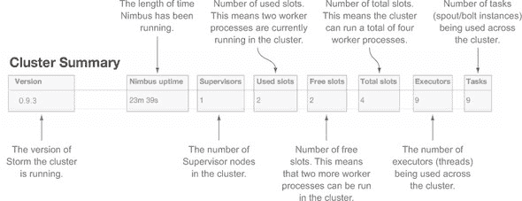

##### 拓扑概要

拓扑概要列出了部署到集群的所有拓扑。图 5.12 提供了本节中你看到的信息的更多详细信息。

##### 图 5.12\. Storm UI 的集群概要屏幕上的拓扑概要部分


##### 管理员概要

管理员概要列出了集群中的所有管理员。同样，你会在图 5.13 中注意到术语槽位。这对应于特定管理员节点上的一个工作进程。图 5.13 提供了本节中你看到的信息的更多详细信息。

##### 图 5.13\. Storm UI 的集群概要屏幕上的管理员概要部分

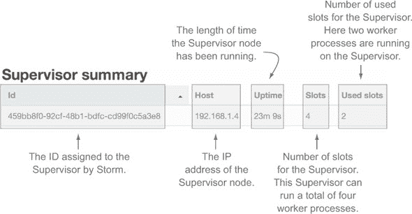

##### Nimbus 配置

Nimbus 配置列出了在 defaults.yaml 中定义的配置以及在 storm.yaml 中覆盖的任何值。图 5.14 提供了本节中你看到的信息的更多详细信息。

##### 图 5.14\. Storm UI 的集群概要屏幕上的 Nimbus 配置部分

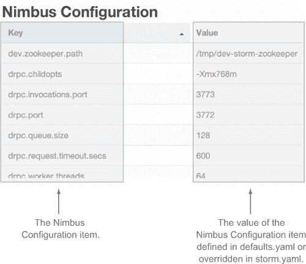

在介绍了集群概要屏幕后，让我们深入了解单个拓扑的屏幕看起来是什么样子。您可以通过点击拓扑列表中的给定拓扑名称来访问此屏幕。

#### 5.5.2\. Storm UI：单个拓扑概要

单个拓扑概要屏幕的部分可以在图 5.15 中看到。

##### 图 5.15。Storm UI 拓扑摘要屏幕

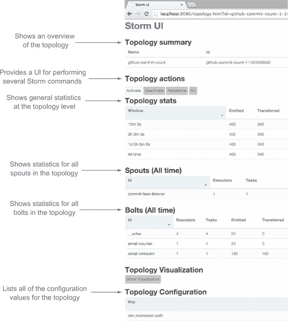

下面的章节将更详细地解释此屏幕的每个部分。

##### 拓扑摘要

拓扑摘要提供了对正在观察的拓扑的简要但有用的概述。图 5.16 提供了关于此部分每个单独列的更多细节。

##### 图 5.16。Storm UI 拓扑摘要屏幕上的拓扑摘要部分

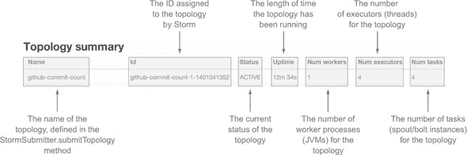

##### 拓扑操作

拓扑操作部分提供了一个用户界面来激活、停用、重新平衡和终止您的拓扑。图 5.17 更详细地描述了这些操作。

##### 图 5.17。Storm UI 拓扑摘要屏幕上的拓扑操作部分

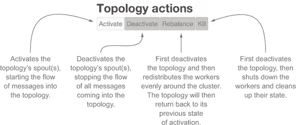

##### 拓扑统计

拓扑统计部分在拓扑级别提供了一些通用统计数据。这些统计数据可以显示为所有时间、过去 10 分钟、过去 3 小时或过去一天。所选的时间间隔也应用于喷发器和螺栓统计部分，这些部分将在下面描述。图 5.18 提供了关于此部分看到的信息的更多细节。

##### 图 5.18。Storm UI 拓扑摘要屏幕上的拓扑统计部分

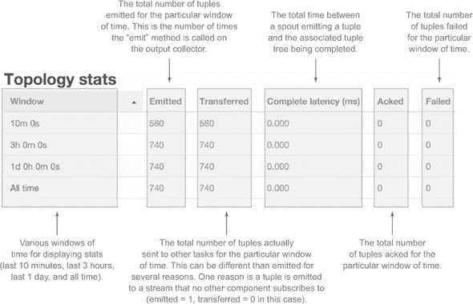

##### 喷发器统计

喷发器部分显示了拓扑中所有喷发器的统计数据。这些统计数据是拓扑统计部分所选时间窗口内的（所有时间、过去 10 分钟、过去 3 小时或过去一天）。图 5.19 提供了关于此部分看到的信息的更多细节。

##### 图 5.19。Storm UI 拓扑摘要屏幕上的喷发器部分

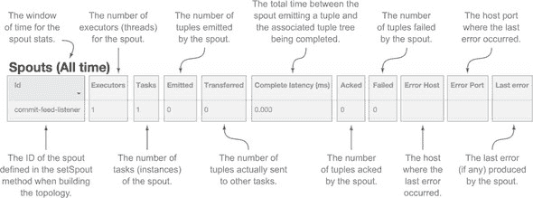

##### 螺栓统计

螺栓部分显示了拓扑中所有螺栓的统计数据。这些统计数据是拓扑统计部分所选时间窗口内的（所有时间、过去 10 分钟、过去 3 小时或过去一天）。图 5.20 提供了直到容量列的更多细节。图 5.21 提供了剩余列的更多细节。

##### 图 5.20。Storm UI 拓扑摘要屏幕上的螺栓部分，直到容量列

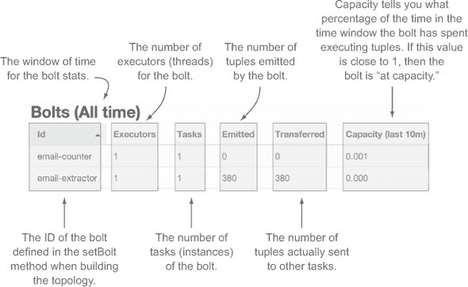

##### 图 5.21。Storm UI 拓扑摘要屏幕上的螺栓部分，剩余列

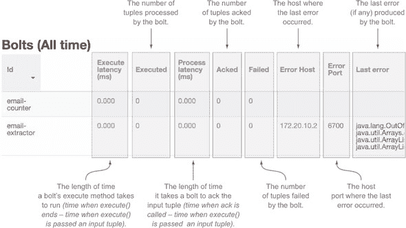

##### 拓扑配置

拓扑配置列出了正在查看的特定拓扑中定义的配置。图 5.22 提供了关于您在此部分看到的信息的更多细节。

##### 图 5.22。Storm UI 拓扑摘要屏幕上的拓扑配置部分

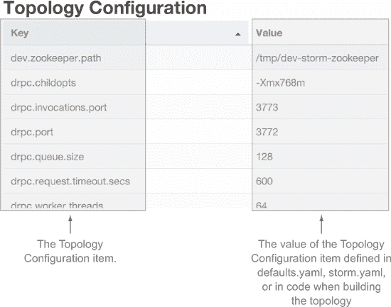

从拓扑摘要屏幕，您可以深入了解单个喷发器或螺栓。在拓扑摘要屏幕上，通过单击喷发器或螺栓名称来访问单个喷发器或螺栓。

#### 5.5.3。Storm UI：单个喷发器/螺栓摘要

在 UI 中，一个单独的 bolt 包含六个部分，如图 5.23 所示。

##### 图 5.23\. Storm UI 中的 bolt 摘要屏幕

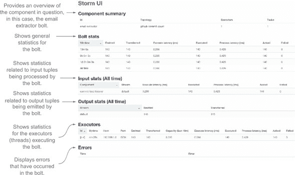

##### 组件摘要

组件摘要部分显示了被观察的 bolt 或 spout 的一些高级信息。图 5.24 提供了更多细节。

##### 图 5.24\. Storm UI 中 bolt 的组件摘要部分

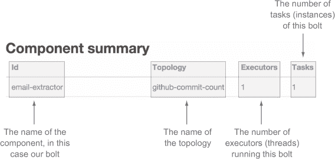

##### Bolt 统计

Bolt 统计部分提供了与拓扑摘要中 Bolts 部分所看到的大部分相同的信息，但信息仅限于单个 bolt（见图 5.25）。

##### 图 5.25\. Storm UI 中的 bolt 统计部分

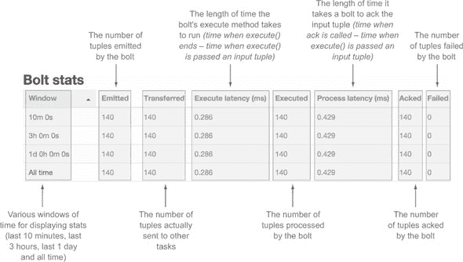

##### 输入统计

输入统计部分显示了 bolt 正在消费的元组的统计信息。这些统计信息与特定的流相关；在这种情况下是“默认”流。图 5.26 对此部分进行了更详细的说明。

##### 图 5.26\. Storm UI 中 bolt 的输入统计部分

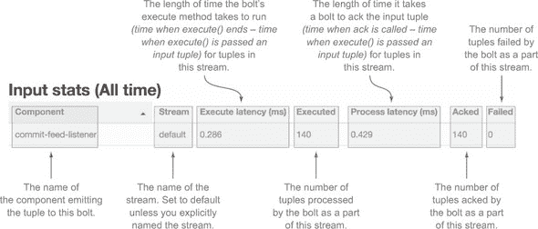

##### 输出统计

输出统计部分显示了 bolt 发出的元组的统计信息（见图 5.27）。

##### 图 5.27\. Storm UI 中 bolt 的输出统计部分

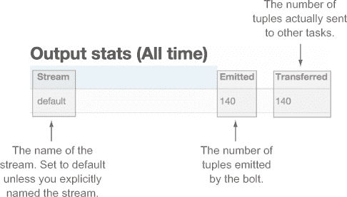

##### Executors

Executors 部分显示了运行特定 bolt 实例的所有 executors 的统计信息。我们将此部分分为两个图。显示了第一部分，图 5.29 显示了第二部分。

##### 图 5.28\. Storm UI 中 bolt 的 Executors 部分，通过容量列

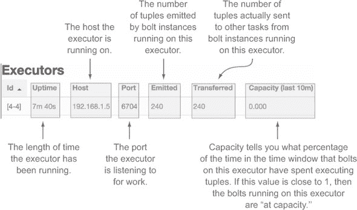

##### 图 5.29\. Storm UI 中 bolt 的 Executors 部分，剩余列

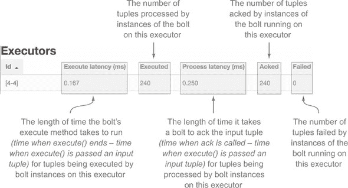

##### 错误

错误部分显示了此 bolt 所经历的错误历史，如图 5.30 所示。

##### 图 5.30\. Storm UI 中 bolt 的错误部分

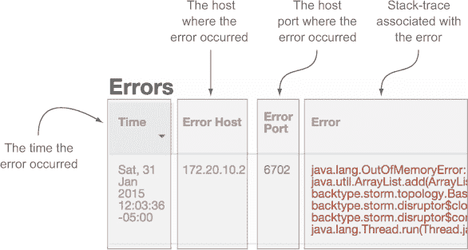

Storm UI 提供了丰富的信息，使你能够清楚地了解你的拓扑在生产中的运行情况。使用 Storm UI，你可以快速判断你的拓扑是否健康，或者是否有问题。你应该能够轻松地发现你的拓扑遇到的问题，同时也能够快速识别其他问题，例如瓶颈。

如你所能想象，一旦你将你的拓扑部署到生产 Storm 集群中，你的开发者工作并没有结束。一旦部署，你将进入一个全新的世界，确保你的拓扑尽可能高效地运行。这就是调优和故障排除的世界。我们将在接下来的两章中专注于这些任务。

本章通过解释 Storm 集群的各个部分以及每个部分的作用，为调优奠定了基础。我们还详细解释了你在调优和故障排除过程中将使用的首选工具：Storm UI。

### 5.6\. 摘要

在本章中，你学习了以下内容：

+   Storm 集群由 Nimbus 组成，它作为控制中心，以及执行 spouts 和 bolts 实例中的逻辑的管理员组成。

+   运行 Storm 集群的同时需要有一个 Zookeeper 集群，因为它在 Nimbus/管理员之间协调通信，同时维护状态。

+   管理员运行工作进程（JVMs），这些工作进程再运行执行器（线程）和任务（spouts/bolts 的实例）。

+   如何安装一个 Storm 集群，包括必须设置的键配置选项，以便使集群运行。

+   如何将你的拓扑部署到 Storm 集群，以及如何在集群上运行它们实际上与本地运行没有太大区别。

+   Storm UI 是什么，以及 Storm 生态系统的不同部分如何映射到 Storm UI 的不同屏幕。

+   Storm UI 的每个部分提供什么信息，以及这些信息如何有助于调整和调试你的拓扑。
