## 第六章：Storm 中的调优

*本章涵盖*

+   调优 Storm 拓扑

+   处理 Storm 拓扑中的延迟

+   使用 Storm 内置的指标收集 API

到目前为止，我们已经尽可能地为您提供了对 Storm 概念的温和介绍。现在是时候提高难度了。在本章中，我们将讨论在你将拓扑部署到 Storm 集群后作为开发者的生活。你以为拓扑部署后你的工作就结束了，不是吗？再想想！一旦你部署了拓扑，你需要确保它尽可能高效地运行。这就是为什么我们投入了两个章节来讨论调优和故障排除。

我们将简要回顾 Storm UI，因为这将是你用来确定你的拓扑是否运行高效的最重要的工具。然后我们将概述一个可重复的过程，你可以使用它来识别瓶颈并解决这些瓶颈。我们的调优课程并没有结束——我们还需要讨论快速代码的最大敌人之一：延迟。我们将通过介绍 Storm 的指标收集 API 以及介绍我们自己的几个自定义指标来结束讨论。毕竟，确切地知道你的拓扑在做什么是理解如何使其更快的重要部分。

| |
| --- |

##### 注意

在本章中，我们在运行调优示例时让你从 GitHub 检查源代码。要检查此代码，请运行以下命令：`git checkout [tag]`，将`[tag]`替换为我们指定的代码版本。GitHub 存储库位于[`github.com/Storm-Applied/C6-Flash-sale-recommender`](https://github.com/Storm-Applied/C6-Flash-sale-recommender)。

| |
| --- |

在我们深入探讨这些主题之前，让我们通过一个将在本章中作为示例案例的使用场景来设定场景：每日特价！重生。

### 6.1. 问题定义：每日特价！重生

下面是这个故事的来龙去脉。我们为一家新兴的闪购网站工作。每天，我们都会在短时间内推出一些商品，并观察流量涌入。随着时间的推移，每天的销售数量一直在增长，对于客户来说，找到他们感兴趣的销售变得越来越困难。我们公司另一个团队已经建立了一个在线的“找到我的销售！”推荐系统。“找到我的销售！”会缩小客户可能感兴趣的产品数量。它从客户提供的某些基本信息开始，但也结合了购买历史、浏览历史等等，试图将客户最可能感兴趣的销售放在他们面前。我们的网站通过 HTTP API 与该系统交互，我们传递一个客户标识符，然后返回一个推荐标识符列表。然后我们可以回过头来查找这些销售的详细信息，并在网站上向客户展示。

这对公司来说是一大福音，并帮助推动了卓越的增长。同时，我们有一个过时的“每日特价！”电子邮件，它从公司早期关于即将到来的销售的信息中幸存下来。最初，每封电子邮件只有一个销售信息非常有效。最终，它被改为每天在我们的客户收件箱中获取一个合理的即将到来的销售信息。随着时间的推移，电子邮件的有效性有所下降。早期的测试表明，问题是电子邮件的内容已经不再相关。每天都有很多销售，简单的启发式方法没有挑选出高度相关的销售信息发送；它只挑选出适度相关的销售信息。

我们被分配了一个新的任务：制作一封电子邮件来替代每日特价活动！这封电子邮件将在每天发送给客户，包含下一天 Find My Sales!系统标记为对客户感兴趣的销售信息。我们希望使用 Find My Sale!系统来提高相关性和点击率，以及最终在网站上的销售额。尽管如此，还有一些需要注意的地方。Find My Sale!是一个纯在线系统，目前推荐的销售额与其外部 HTTP 接口有些混乱。在我们考虑重写它之前，我们希望验证我们的想法，即更相关的每日特价活动电子邮件将对业务产生重大影响（团队中的一些成员认为当前的电子邮件已经足够好，提高相关性不会导致流量有大幅增长）。

#### 6.1.1\. 构建概念解决方案

我们着手设计一个处理电子邮件创建的解决方案。它消费客户信息的输入流，并实时调用 Find My Sale!以找到任何即将到来的闪购活动，这些活动可能会引起客户的兴趣。（我们不得不稍微修改 Find My Sale!——通常它只考虑活跃的销售，但我们已经将其修改为考虑活跃时间范围的日期范围。）然后我们查找有关这些销售的信息，并将其存储起来，以便另一个执行电子邮件发送的过程。图 6.1 给出了这个设计的一般概述。

##### 图 6.1\. Find My Sale!拓扑：其组件和数据点


设计相当直接；它有四个组件，与两个外部服务和数据库进行通信。有了这个设计在手，让我们将注意力转向它是如何映射到 Storm 概念的。

#### 6.1.2\. 将解决方案映射到 Storm 概念

在 Storm 的术语中，这种设计映射到一个相对简单的拓扑结构。我们有一个喷嘴发射客户信息，然后将其传递给“查找我的销售”bolt，该 bolt 与外部服务交互。找到的销售信息会与客户信息一起发射到一个查找销售信息的 bolt，该 bolt 将信息与客户信息一起发射到一个持久化 bolt，以便另一个进程可以在稍后提取信息用于发送电子邮件。图 6.2 展示了将设计映射到这些 Storm 概念。

##### 图 6.2\. 将“查找我的销售”设计映射到 Storm 概念

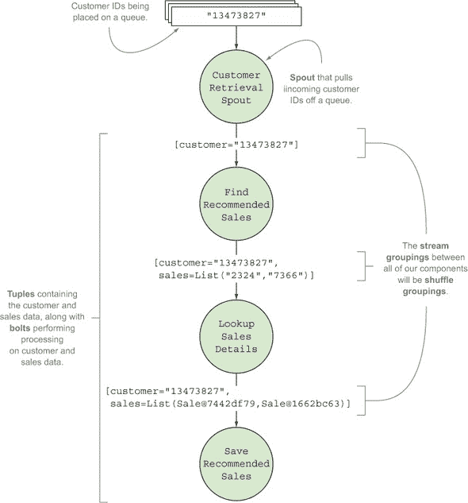

我们的设计映射到 Storm 概念的模式与第二章到第四章中找到的模式相似。我们有一个喷嘴作为元组的来源，有三个 bolt 对这些元组进行转换。现在我们将向您展示这个设计的首次代码实现。

### 6.2\. 初始实现

在我们进入设计的实现之前，重要的是要记住以下将在后续代码中频繁引用的几个接口：

+   **`TopologyBuilder`—** 提供了指定 Storm 执行拓扑的 API

+   **`OutputCollector`—** 发射和失败元组的核心 API

我们将从`FlashSaleTopologyBuilder`开始，它负责连接我们的喷嘴和 bolt（见以下列表）。所有构建拓扑的工作都由这个类处理，无论我们如何运行它：在本地模式或在远程集群中部署。

##### 列表 6.1\. `FlashSaleTopologyBuilder.java`

```
public class FlashSaleTopologyBuilder {
  public static final String CUSTOMER_RETRIEVAL_SPOUT = "customer-retrieval";
  public static final String FIND_RECOMMENDED_SALES = "find-recommended-sales";
  public static final String LOOKUP_SALES_DETAILS = "lookup-sales-details";
  public static final String SAVE_RECOMMENDED_SALES = "save-recommended-sales";

  public static StormTopology build() {
    TopologyBuilder builder = new TopologyBuilder();

    builder.setSpout(CUSTOMER_RETRIEVAL_SPOUT, new CustomerRetrievalSpout())
           .setMaxSpoutPending(250);

    builder.setBolt(FIND_RECOMMENDED_SALES, new FindRecommendedSales(), 1)
           .setNumTasks(1)
           .shuffleGrouping(CUSTOMER_RETRIEVAL_SPOUT);

    builder.setBolt(LOOKUP_SALES_DETAILS, new LookupSalesDetails(), 1)
           .setNumTasks(1)
           .shuffleGrouping(FIND_RECOMMENDED_SALES);

    builder.setBolt(SAVE_RECOMMENDED_SALES, new SaveRecommendedSales(), 1)
           .setNumTasks(1)
           .shuffleGrouping(LOOKUP_SALES_DETAILS);

    return builder.createTopology();
  }
}
```

现在我们已经看到如何通过`FlashSaleTopologyBuilder`将拓扑中的所有组件组合在一起，我们将更详细地介绍每个单独的组件，从喷嘴开始。

#### 6.2.1\. 喷嘴：从数据源读取

数据将通过喷嘴流入我们的拓扑。这种数据以单个客户 ID 的形式出现，如图 6.3 所示。

##### 图 6.3\. 喷嘴为每个接收到的客户 ID 发射一个元组。

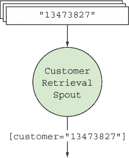

但与其他拓扑一样，我们将为了快速启动而作弊。目前，我们将喷嘴生成数据，每当调用其`nextTuple()`方法时，而不是将其连接到真实的消息队列，如以下列表所示。

##### 列表 6.2\. `CustomerRetrievalSpout.nextTuple`生成客户 ID

```
...

@Override
public void nextTuple() {
  new LatencySimulator(1, 25, 10, 40, 5).simulate(1000);

  int numberPart = idGenerator.nextInt(9999999) + 1;
  String customerId = "customer-" + Integer.toString(numberPart);

  outputCollector.emit(new Values(customerId));
}
...
```

如果我们将我们的拓扑结构部署到实际的生产环境中，客户检索的喷嘴将会连接到一个消息总线，例如 Kafka 或 RabbitMQ。我们会将需要处理的客户列表保存在队列中，如果我们的拓扑结构完全崩溃或以其他方式停止，我们可以重新启动并从上次停止的地方继续。我们的数据流有一个持久的家，它独立于处理它的系统。

此外，如果我们决定不想以批处理方式执行此操作，我们就必须将其转换为实时系统。使用 Storm 和我们的设计，我们正在以流的形式处理我们的数据，但以批处理的方式启动运行。我们将流处理“如何”与批处理导向的“何时”分开。任何时候我们想要，我们都可以将这个系统从当前的批处理系统形式转换为实时系统，而无需更改我们的拓扑中的任何内容。

在我们进入本章的主要内容之前，让我们逐一检查我们的螺栓并确定重要的逻辑部分。

#### 6.2.2\. 螺栓：查找推荐销售

找到推荐销售记录的螺栓在其输入元组中接受一个客户 ID，并发出包含两个值的元组：客户 ID 和销售 ID 列表。为了检索销售 ID，它调用外部服务。图 6.4 说明了我们在拓扑中的位置。

##### 图 6.4\. `FindRecommendedSales`螺栓在其输入元组中接受一个客户 ID，并发出包含一个客户 ID 和销售 ID 列表的元组。

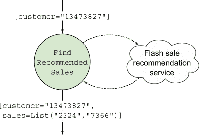

下一个列表显示了此螺栓的实现。

##### 列表 6.3\. `FindRecommendedSales.java`

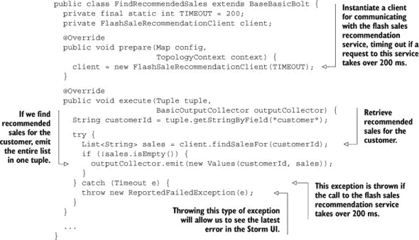

我们从`client.findSalesFor`调用中只得到销售标识符列表。为了发送我们的电子邮件，我们需要有关产品和销售的一些额外信息。这就是我们的下一个螺栓发挥作用的地方。

#### 6.2.3\. 螺栓：查找每个销售的详细信息

为了发送包含每个销售详细信息的有意义电子邮件，我们需要查找每个推荐销售的详细信息。执行此操作的螺栓接受包含客户 ID 和销售 ID 列表的元组，通过调用外部服务查找每个销售的详细信息，并发出包含客户 ID 和包含每个销售详细信息的`Sale`对象列表的元组（见图 6.5）。

##### 图 6.5\. 查找销售详细信息的螺栓在其输入元组中接受客户 ID 和销售 ID 列表，并发出包含客户 ID 和包含每个销售详细信息的`Sale`对象列表的元组。

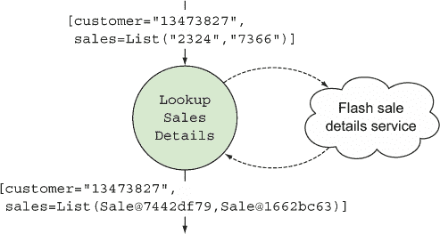

下面的列表显示了`LookupSalesDetails`螺栓的实现。

##### 列表 6.4\. `LookupSalesDetails.java`

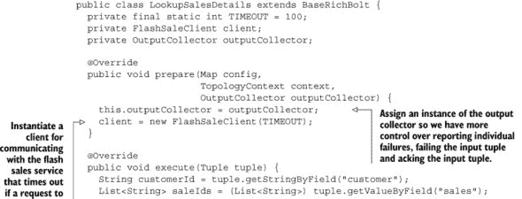

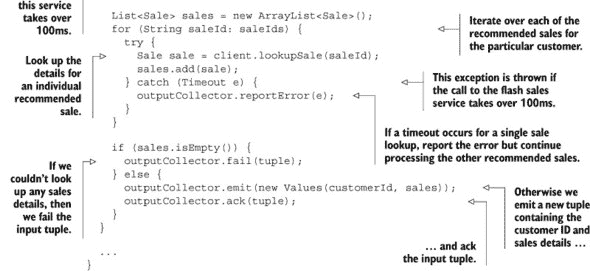

与之前那个螺栓相比，最大的不同之处在于这个螺栓可以同时成功和失败。我们可能会尝试查找十个销售记录，得到九个，但一个也得不到。为了处理这种更复杂的成功定义，我们扩展了`BaseRichBolt`并手动确认元组。只要我们能从输入元组中获取到的销售 ID 中至少查找到一个销售记录，我们就将其视为成功并继续。我们的主要优先级是尽可能多地及时发送电子邮件。

这引导我们到达最后一个螺栓，我们将结果保存到数据库中，以便通过另一个进程发送。

#### 6.2.4\. 螺栓：保存推荐的销售记录

保存推荐销售的 bolt 接受包含客户 ID 和每个销售的详细信息的`Sale`对象列表的输入元组。然后它将数据持久化到数据库中，以便稍后处理，因为它是我们拓扑中的最后一个 bolt，所以不发出元组（见图 6.6）。

##### 图 6.6\. 保存推荐销售 bolt 接受包含客户 ID 和销售对象列表的输入元组，并将该信息持久化到数据库中。

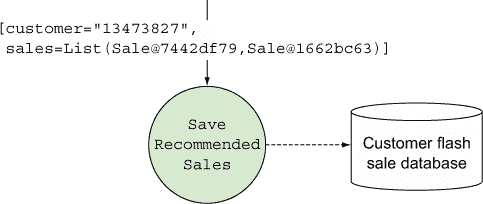

下一个列表显示了`SaveRecommendedSales`的实现。

##### 列表 6.5\. `SaveRecommendedSales.java`

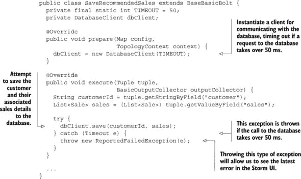

我们在这里也使用了之前两个 bolt 中使用的相同模式。这是我们的逻辑。看起来都很合理。想象一下，我们已经对我们的拓扑及其工作进行了测试，但它离投入生产还远。它会足够快吗？很难说。让我们看看我们如何找到答案。

### 6.3\. 调优：我想跑得快

如何对拓扑进行调优？一开始这可能看起来像是一项艰巨的任务，但 Storm 为我们提供了工具，可以帮助我们快速识别瓶颈，从而采取措施缓解这些瓶颈。使用 Storm UI 和指标收集 API，您有可用的工具来建立一个可重复的过程，用于调优您的拓扑。

#### 6.3.1\. Storm UI：您的调优首选工具

理解 Storm UI 是至关重要的，因为它是主要的工具，将给我们反馈，了解您的调优努力是否产生了效果。图 6.7 提供了对 Storm UI 拓扑摘要屏幕的快速回顾。

##### 图 6.7\. Storm UI 的拓扑摘要屏幕

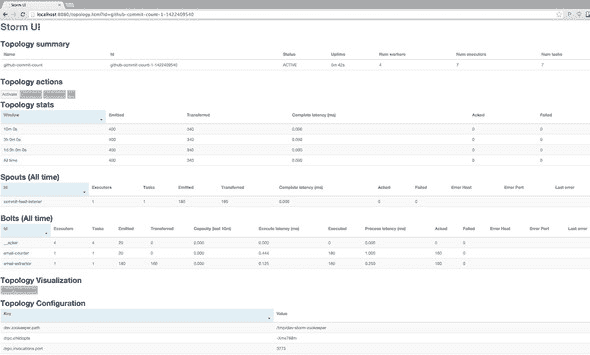

如您所回忆的，单个拓扑在 UI 中有七个部分：

+   ***拓扑摘要*—** 显示整个拓扑的状态、运行时间和分配给整个拓扑的工作者、执行者和任务数量。

+   ***拓扑操作*—** 允许您从 UI 直接停用、重新平衡或终止您的拓扑。

+   ***拓扑统计*—** 显示整个拓扑在四个时间窗口中的高级统计数据；其中一个窗口是所有时间。

+   ***Spouts (All time)*—** 显示您在所有时间内的 spout(s)的统计数据。这包括执行者和任务的数量；由 spout(s)发出的、确认的和失败的元组数量；以及与 spout(s)关联的最后一个错误（如果有）。

+   ***Bolts (All time)*—** 显示您在所有时间内的 bolt(s)的统计数据。这包括执行者和任务的数量；由 bolt(s)发出的、确认的和失败的元组数量；一些与延迟和 bolt(s)的繁忙程度相关的指标；以及与 bolt(s)关联的最后一个错误（如果有）。

+   ***可视化*—** 显示 spouts、bolt(s)的连接方式以及所有流之间元组的流动。

+   ***拓扑配置*—** 显示为您的拓扑设置的配置选项。

我们将专注于 UI 的 Bolts 部分进行调优课程。在我们开始确定需要调整什么以及如何调整之前，我们需要为我们的拓扑定义一组基准数字。

|  |
| --- |

**定义你的服务等级协议（SLA**）

在你开始分析你的拓扑是否是一个精细调优的机器之前，问问自己对你来说“足够快”意味着什么。你需要达到什么样的速度？暂时想想 Twitter 的热门话题。如果处理每条推文需要八个小时，那么这些话题就不会像网站上那样热门。在时间上，SLA 可能相对灵活，比如“在一小时内”，但在数据流上可能非常严格。事件不能超过某个点；某个地方有一个队列，保留着所有将要处理的数据。在设置了一定的最高水位线之后，我们需要以尽可能快的速度消费数据，否则我们可能会达到队列限制，或者更糟糕的是，引发内存不足错误。

对于我们的用例，我们以批量方式处理流数据，我们的 SLA 是不同的。我们需要在电子邮件发出之前完全处理所有数据。“足够快”有几个简单的指标：1）它是否按时完成？2）随着我们每天处理更多数据，它是否会继续按时完成？

让我们的服务等级协议（SLA）变得更加真实一些。在发送之前，处理所有这些电子邮件（比如说 60 分钟）需要一段时间。我们希望每天早上 8 点开始发送。对于即将到来的日子，可以输入交易直到晚上 11 点，我们只能在之后开始处理。这给我们从开始到必须完成的时间提供了八个小时。目前我们有 2000 万客户——这意味着为了勉强达到我们的目标，我们需要每秒处理大约 695 个客户。这已经很接近了；我们决定在第一次尝试中，我们需要有信心在七小时内完成。这意味着每秒 794 个客户，考虑到我们的增长，我们希望迅速将完成时间缩短到三小时以内，这样我们就不必担心调整一段时间了。为了做到这一点，我们需要每秒处理 1,852 个客户。

|  |
| --- |

#### 6.3.2\. 建立基准性能数字集

是时候深入开发基本的 Storm 调优技能了，这些技能可以用来使拓扑逐渐变快。在我们的源代码中，你可以找到 Find My Sale!拓扑的 0.0.1 版本。要查看该特定版本，请使用以下命令：

```
git checkout 0.0.1
```

在我们调整时，我们需要注意一个主要类：`FlashSaleTopology-Builder`。这是我们构建拓扑并设置每个组件并行性的地方。让我们再次看看它的构建方法，以刷新您的记忆：

```
public static StormTopology build() {
  TopologyBuilder builder = new TopologyBuilder();

  builder.setSpout(CUSTOMER_RETRIEVAL_SPOUT, new CustomerRetrievalSpout())
         .setMaxSpoutPending(250);

  builder.setBolt(FIND_RECOMMENDED_SALES, new FindRecommendedSales(), 1)
         .setNumTasks(1)
         .shuffleGrouping(CUSTOMER_RETRIEVAL_SPOUT);

  builder.setBolt(LOOKUP_SALES_DETAILS, new LookupSalesDetails(), 1)
         .setNumTasks(1)
         .shuffleGrouping(FIND_RECOMMENDED_SALES);

  builder.setBolt(SAVE_RECOMMENDED_SALES, new SaveRecommendedSales(), 1)
         .setNumTasks(1)
         .shuffleGrouping(LOOKUP_SALES_DETAILS);

  return builder.createTopology();
}
```

注意，我们在`setBolt`的调用中创建了一个执行者，在`setNumTasks`中为每个螺栓创建了一个任务。这将给我们一个基本的基础线，了解我们的拓扑性能。接下来，我们将将其部署到远程集群，然后用一些客户数据运行 10-15 分钟，从 Storm UI 收集基本数据。图 6.8 显示了这一点，重要的部分被突出显示并标注。

##### 图 6.8.确定我们的调整课程中 Storm UI 的重要部分

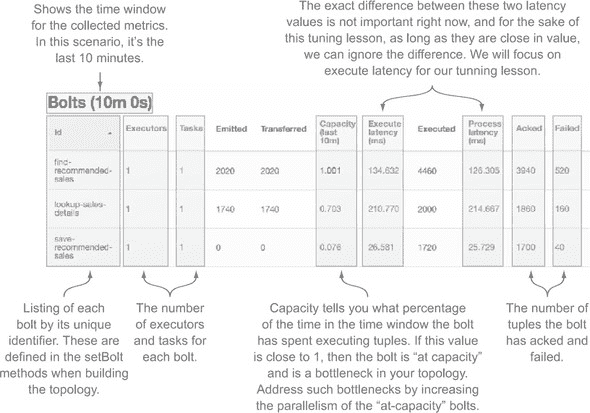

现在，我们有一个有用的界面来显示与我们的拓扑相关的指标以及一组基准性能数字。调整过程的下一步是确定我们的拓扑中的瓶颈并采取相应措施。

#### 6.3.3.识别瓶颈

我们在第一次运行这些指标后能看到什么？让我们聚焦于容量。对于我们的两个螺栓，它的值相当高。`find-recommended-sales`螺栓的值为 1.001，而`lookup-sales-details`螺栓的值在 0.7 左右徘徊。1.001 的值表明`find-recommended-sales`存在瓶颈。我们需要增加其并行度。鉴于`lookup-sales-details`的值为 0.7，很可能在不打开`lookup-sales-details`的情况下打开`find-recommended-sales`只会将其变成一个新的瓶颈。我们的直觉告诉我们它们应该同时调整。另一方面，`save-recommended-sales`的值非常低，为 0.07，可能在未来相当长一段时间内都不会成为瓶颈。

接下来，我们将猜测我们可能希望将并行度提高到多高，将任务数量设置为那个值，然后再次发布。我们也会向您展示那次运行的统计数据，以便您可以看到在不改变执行者数量的情况下改变任务数量不会产生任何影响。

您可以通过执行此命令来查看代码的 0.0.2 版本：

```
git checkout 0.0.2
```

唯一的重要变化是在`FlashSaleTopologyBuilder`中：

```
public static StormTopology build() {
  TopologyBuilder builder = new TopologyBuilder();

  builder.setSpout(CUSTOMER_RETRIEVAL_SPOUT, new CustomerRetrievalSpout())
         .setMaxSpoutPending(250);

  builder.setBolt(FIND_RECOMMENDED_SALES, new FindRecommendedSales(), 1)
         .setNumTasks(32)
         .shuffleGrouping(CUSTOMER_RETRIEVAL_SPOUT);

  builder.setBolt(LOOKUP_SALES_DETAILS, new LookupSalesDetails(), 1)
         .setNumTasks(32)
         .shuffleGrouping(FIND_RECOMMENDED_SALES);

  builder.setBolt(SAVE_RECOMMENDED_SALES, new SaveRecommendedSales(), 1)
         .setNumTasks(8)
         .shuffleGrouping(LOOKUP_SALES_DETAILS);

  return builder.createTopology();
}
```

为什么螺栓任务为 32、32 和 8？当我们完成时，我们可能不需要超过 16、16 和 4，但作为第一次尝试，选择双倍的数量是明智的。有了这个变化，我们不需要多次发布拓扑。我们只需发布版本 0.0.2，并在我们的 Nimbus 节点上使用`rebalance`命令来调整运行拓扑的并行度。

发布后，我们让它运行大约 10-15 分钟。如您所见，UI 中唯一有意义的变化是每个螺栓的任务数量。

接下来我们做什么？让我们首先通过运行`rebalance`命令将`find-recommended-sales`和`lookup-sales-details`螺栓的并行度翻倍。

|  |
| --- |

##### 注意

本章中使用的`rebalance`命令的形式是`storm rebalance topology-name –e [bolt-name]=[number-of-executors]`。这个命令将重新分配给定 bolt 的执行器，允许我们在运行时增加给定 bolt 的并行性。所有`rebalance`命令都假设我们在 Nimbus 节点上运行，并且我们在`PATH`中具有 Storm 命令。

|  |
| --- |

我们将运行一个`rebalance`命令，等待变化出现在 UI 中，然后运行第二个`rebalance`命令：

```
storm rebalance flash-sale -e find-recommended-sales=4
storm rebalance flash-sale -e lookup-sales-details=4
```

好的，我们的重新平衡已完成。10 分钟过去了——让我们看看我们得到了什么(图 6.9)。

##### 图 6.9\. Storm UI 显示在尝试增加我们前两个 bolt 的并行性后的容量变化最小。

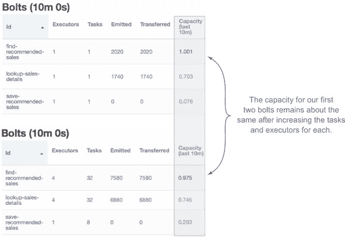

这里有一件可能会让你感到惊讶的事情。我们增加了`find-recommended-sales` bolt 的并行性，但容量没有变化。它和之前一样忙碌。这怎么可能呢？从 spout 流入的元组流没有受到影响；我们的 bolt 是一个瓶颈。如果我们使用真实的队列，消息就会在那个队列上积压。注意`save-recommended-sales` bolt 的容量指标也上升到了大约 0.3。这仍然相当低，所以我们不必担心它成为瓶颈。

让我们再次尝试，这次将两个 bolt 的并行性都加倍。这肯定会在那个队列上留下痕迹：

```
storm rebalance flash-sale -e find-recommended-sales=8
storm rebalance flash-sale -e lookup-sales-details=8
```

让我们假设重新平衡已完成，并且我们已经等待了 10 分钟(图 6.10)。

##### 图 6.10\. Storm UI 显示将我们前两个 bolt 的执行器数量加倍后的容量变化最小

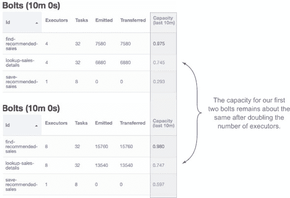

`find-recommended-sales`和`lookup-sales-details`的容量都没有变化。我们 spout 后面的队列肯定积压得很严重。尽管如此，`save-recommended-sales`的容量几乎翻倍了。如果我们提高我们前两个 bolt 的并行性，这可能会成为我们的瓶颈，所以我们也提高一下。再次，将我们前两个 bolt 的并行性加倍，然后将`save-recommended-sales` bolt 使用的并行性增加到四倍：

```
storm rebalance flash-sale -e find-recommended-sales=16
storm rebalance flash-sale -e lookup-sales-details=16
storm rebalance flash-sale -e save-recommended-sales=4
```

经过三次重新平衡命令和 10 分钟的等待，我们有了图 6.11。

##### 图 6.11\. Storm UI 显示我们拓扑中所有三个 bolt 的容量有所提高

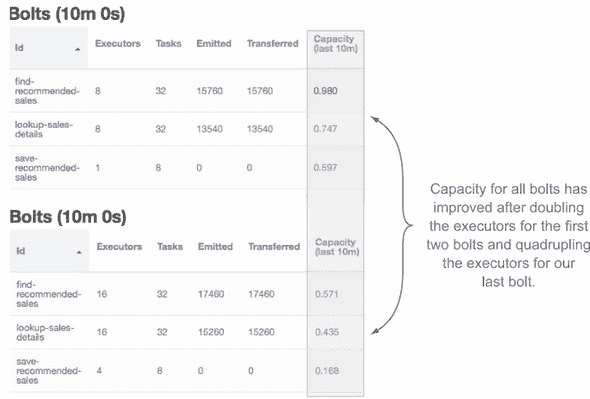

太棒了！我们终于取得了一些进展，在容量方面也有了相当不错的提升。现在，喷嘴的数量（一个）可能成为我们的限制因素。在一个连接到真实消息队列的拓扑中，我们会检查消息流是否满足我们的服务级别协议（SLA）。在我们的用例中，我们不在乎消息的积压，但我们关心处理所有消息所需的时间。如果我们的工作从开始到结束需要太长时间，我们可以增加喷嘴的并行性，并采取我们刚刚向您展示的调整步骤。在我们的小型测试拓扑中，模拟喷嘴并行性超出了我们的范围，但您可以自由尝试去模拟它。这可能是一项有益的练习。

|  |
| --- |

**在执行器级别与工作者级别增加并行性**

到目前为止，我们还没有触及工作者的并行性。一切都在单个工作者和单个喷嘴上运行，我们不需要超过一个工作者。我们的建议是在单个工作者上使用执行器进行扩展，直到您发现增加执行器不再有效。我们刚才用于扩展 bolt 的基本原则也可以应用于喷嘴和工作者。

|  |
| --- |

#### 6.3.4. 喷嘴：控制数据流入拓扑的速度

如果我们在调整过程中仍然没有达到我们的 SLA，那么是时候开始考虑如何控制数据流入我们拓扑的速度了：对喷嘴并行性的控制。有两个因素起作用：

+   喷嘴的数量

+   每个喷嘴将允许在我们的拓扑中活跃的最大元组数

|  |
| --- |

##### 注意

在我们开始之前，记得在第四章中我们讨论了保证消息处理以及 Storm 如何使用元组树来跟踪从喷嘴发出的元组是否被完全处理？在这里，当我们提到元组未确认/活跃时，我们指的是尚未被标记为完全处理的元组树。

|  |
| --- |

这两个因素，喷嘴的数量和最大活跃元组数，是相互关联的。我们将从第二个点开始讨论，因为它更为复杂。Storm 的喷嘴有一个称为*最大喷嘴挂起*的概念。最大喷嘴挂起允许您设置在任何给定时间可以未确认的最大元组数。在`FlashSaleTopologyBuilder`代码中，我们设置最大喷嘴挂起值为 250：

```
builder
  .setSpout(CUSTOMER_RETRIEVAL_SPOUT, new CustomerRetrievalSpout())
  .setMaxSpoutPending(250);
```

通过将该值设置为 250，我们确保每个喷嘴任务在给定时间可以有 250 个元组未确认。如果我们有两个喷嘴实例，每个实例有两个任务，那么将是：

*2 个喷嘴 x 2 个任务 x 250 最大喷嘴挂起 = 1000 个可能的未确认元组*

当在您的拓扑中设置并行性时，确保最大喷嘴挂起数量不是瓶颈非常重要。如果可能未确认的元组数量低于您为拓扑设置的总体并行性，那么它可能是一个瓶颈。在这种情况下，我们有以下

+   16 个`find-recommended-sales` bolt

+   16 个`lookup-sales-details` bolt

+   4 个`saved-recommended-sales` bolt

每次我们可以处理 36 个元组。

在这个例子中，使用单个 spout，我们可能的最大未确认元组数，250，大于基于我们的并行化可以处理的元组数，36，因此我们可以放心地说，最大 spout 挂起不会造成瓶颈（图 6.12）。

##### 图 6.12。因为最大 spout 挂起数大于我们一次可以处理的元组总数，所以它不是瓶颈。

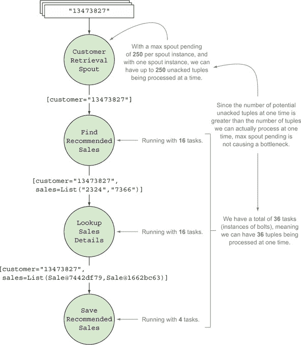

如果最大 spout 挂起数可以造成瓶颈，为什么还要设置它呢？如果没有它，元组将继续流入你的拓扑，无论你是否能够跟上处理它们。最大 spout 挂起数允许我们控制我们的摄入速率。如果没有控制我们的摄入速率，可能会使我们的拓扑被涌入的数据淹没，导致崩溃。最大 spout 挂起数让我们在拓扑前建立一道堤坝，施加反向压力，避免被淹没。我们建议，尽管最大 spout 挂起数是可选的，但你总是应该设置它。

当试图提高性能以满足 SLA 时，我们可以通过增加 spout 并行度或增加最大 spout 挂起数来增加数据摄入速率。如果我们允许的最大活动元组数增加了四倍，我们预计消息离开我们的队列的速度会增加（可能不会增加四倍，但肯定会增加）。如果这导致我们任何 bolt 的容量指标返回到一或接近一，我们会再次调整 bolt，并重复使用 spout 和 bolt，直到我们达到 SLA。如果调整 spout 和 bolt 的并行度未能提供额外的收益，我们会尝试调整工作线程的数量，看看我们是否现在受限于我们运行的 JVM，需要跨 JVM 进行并行化。这个基本方法可以反复应用，在许多情况下，我们可以根据这个方法满足我们的 SLA。

如果你正在调整拓扑中的外部服务，请记住以下要点：

1.  与外部服务（如 SOA 服务、数据库或文件系统）交互时，很容易在拓扑中提高并行度到一个足够高的水平，但该外部服务的限制会阻止你的容量进一步提升。在你开始调整与外界交互的拓扑中的并行度之前，请确保你对该服务有良好的指标。我们可以不断调整`find-recommended-sales`螺栓的并行度，直到它使“找到我的销售！”服务陷入瘫痪，在它无法处理的大量流量下崩溃。

1.  第二点是关于延迟。这一点更为微妙，需要更长的解释和一些背景信息，所以在我们到达那里之前，让我们检查我们的并行度变化。

你可以通过执行以下命令来查看我们在调整示例中此阶段的代码版本：

```
git checkout 0.0.3
```

### 6.4. 延迟：当外部系统耗时长时

让我们谈谈快速代码的最大敌人：延迟。延迟通常定义为系统的一部分等待从系统的另一部分获得响应的时间段。访问你电脑上的内存、访问硬盘驱动器和通过网络访问另一个系统都会有延迟。不同的交互有不同的延迟级别，理解你系统中的延迟是调整你的拓扑结构的关键之一。

#### 6.4.1\. 在你的拓扑结构中模拟延迟

如果你查看这个拓扑结构的代码，你会在 Database.java 的代码中找到类似这样的东西：

```
private final LatencySimulator latency = new LatencySimulator(
  20, 10, 30, 1500, 1);

public void save(String customerId, List<Sale> sale, int timeoutInMillis) {
  latency.simulate(timeoutInMillis);
}
```

如果你没有看过代码，不要担心。我们在这里会涵盖所有重要的部分。`LatencySimulator`是我们使这个拓扑结构在与外部服务交互时表现得像真实的一个方法。你与之交互的任何东西都会表现出延迟，从你电脑上的主内存到你必须从中读取的网络化文件系统。不同的系统将表现出不同的延迟特性，我们的`LatencySimulator`试图以简单的方式模拟这些特性。

让我们分解其五个构造函数参数（见图 6.13）。

##### 图 6.13\. `LatencySimulator`构造函数参数说明

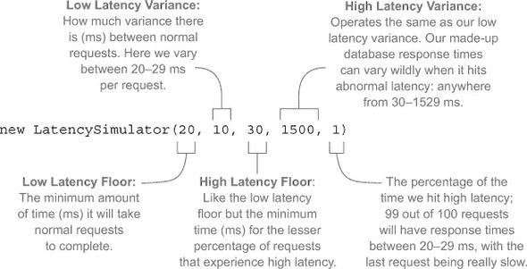

注意，我们不是用基本平均值来表示延迟，这很少是延迟工作的方式。你通常会得到相当一致的反应时间，突然间这些反应时间会因为各种因素而剧烈变化：

+   外部服务正在进行垃圾回收事件。

+   某处的网络交换机暂时过载。

+   你的同事编写了一个失控的查询，目前正占用数据库的大部分 CPU。

|  |
| --- |

##### 注意

在我们的日常工作岗位上，我们几乎所有的系统都在 JVM 上运行，我们使用 Coda Hale 的优秀 Metrics 库^([1])以及 Netflix 的出色 Hystrix 库^([2])来测量我们系统的延迟并相应调整。

> ¹ [`github.com/dropwizard/metrics`](https://github.com/dropwizard/metrics)
> 
> ² [`github.com/Netflix/Hystrix`](https://github.com/Netflix/Hystrix)

|  |
| --- |

表 6.1 显示了我们的拓扑结构交互的各种系统的延迟。查看表格，我们可以看到在这些服务中，从最佳请求到最差请求有很大的差异。但真正引人注目的是我们经常受到延迟的影响。有时，数据库的延迟比其他任何服务都要长，但与`FlashSaleRecommendationService`相比，后者遇到高延迟期要高一个数量级。也许我们可以在那里解决一些问题。

##### 表 6.1\. 外部服务的延迟

| 系统 | 低点 | 低变异性 | 高点 | 高变异性 | 高百分比 |
| --- | --- | --- | --- | --- | --- |
| FlashSaleRecommendationService | 100 | 50 | 150 | 1000 | 10 |
| FlashSaleService | 50 | 50 | 100 | 200 | 5 |
| 数据库 | 20 | 10 | 30 | 1500 | 1 |

当你查看`FindRecommendedSales`bolt 时，你会看到：

```
private final static int TIMEOUT = 200;

...

@Override
public void prepare(Map config, TopologyContext context) {
  client = new FlashSaleRecommendationClient(TIMEOUT);
}
```

我们为每个客户端查找推荐设置了 200 毫秒的超时。这是一个不错的数字，200，但我们是如何确定这个数字的呢？当我们试图让拓扑工作的时候，这看起来可能是正确的。在图 6.14 中，看看“最后错误”列。你会发现我们所有的 bolt 都在经历超时。这是有道理的。我们只等待 200 毫秒来获取推荐，但根据表 6.1，每十个请求中有一个会达到高于正常的延迟，可能需要从 150 毫秒到 1049 毫秒的时间来返回结果，而九个请求将返回少于 150 毫秒。这种情况可能有两个主要原因：外在和内在。

##### 图 6.14\. Storm UI 显示我们每个 bolt 的最后错误

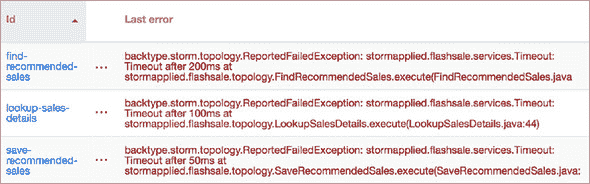

#### 6.4.2\. 延迟的外在和内在原因

一个**外在**的原因是与数据几乎没有关系的原因。我们遇到高延迟是因为网络问题或垃圾回收事件，或者是一些应该随时间流逝而解决的问题。下次我们重试那个请求时，我们的情况可能不同。

一个**内在**的原因是与可能导致延迟的数据相关的某个原因。在我们的例子中，为某些客户提供推荐销售可能需要更长的时间。无论我们在这个 bolt 中失败多少次并再次尝试，我们都不会为这些客户提供推荐销售。这只会花费太长时间。内在原因可以与外在原因结合；它们不是相互排斥的。

这都很好，但这与我们的拓扑有什么关系呢？嗯，当我们与外部服务交互时，我们可以考虑延迟，并尝试在不增加并行性的情况下提高我们的吞吐量。让我们更聪明地处理我们的延迟。

好吧，我们在这里做推荐，所以我们宣布经过调查，我们已经发现我们的`FlashSaleRecommendationService`的方差是基于客户的。某些客户查找起来会慢一些：

+   我们可以在 125 毫秒内为其中 75%生成推荐。

+   对于另外 15%，大约需要 125-150 毫秒。

+   最后的 10%通常需要至少 200 毫秒，有时长达 1500 毫秒。

这些是延迟的内在差异。有时，由于一个外在事件，这些“快速”查找中的一个可能会花费更长的时间。对于表现出这种问题的服务，我们有一个策略效果很好，那就是在超时上有硬上限的初始查找尝试。在这个例子中，我们可以使用 150 毫秒，如果失败了，就将其发送到同一个 bolt 的较不并行化的实例，该实例的超时会更长。最终结果是，我们处理大量消息的时间减少了——我们实际上是在对外在延迟宣战。如果 90%的请求超过 150 毫秒，那可能是因为

1.  这是一个存在内在问题的客户。

1.  外部问题，如停止世界的垃圾收集正在产生影响。

使用这种策略的效果可能会有所不同，所以在使用之前请进行测试。不考虑警告，让我们看看一种可以实现的方法。查看我们代码的 0.0.4 版本

```
git checkout 0.0.4
```

并查看以下列表，以了解 `FindRecommendedSales` 和 `FlashSaleTopologyBuilder` 中的更改。

##### 列表 6.6. `FindRecommendedSales.java` 带有重试逻辑

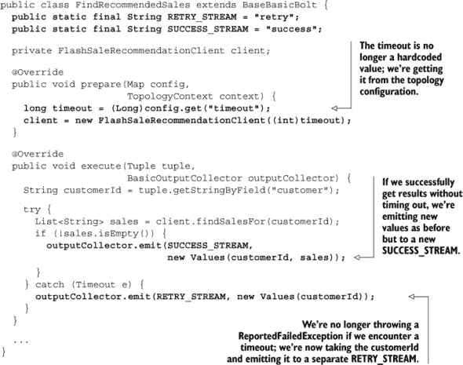

查看在 `FlashSaleTopologyBuilder` 中发生的事情：

```
builder
  .setSpout(CUSTOMER_RETRIEVAL_SPOUT, new CustomerRetrievalSpout())
  .setMaxSpoutPending(250);

builder
  .setBolt(FIND_RECOMMENDED_SALES_FAST, new FindRecommendedSales(), 16)
  .addConfiguration("timeout", 150)
  .setNumTasks(16)
  .shuffleGrouping(CUSTOMER_RETRIEVAL_SPOUT);

builder
  .setBolt(FIND_RECOMMENDED_SALES_SLOW, new FindRecommendedSales(), 16)
  .addConfiguration("timeout", 1500)
  .setNumTasks(16)
  .shuffleGrouping(FIND_RECOMMENDED_SALES_FAST,
                   FindRecommendedSales.RETRY_STREAM)
  .shuffleGrouping(FIND_RECOMMENDED_SALES_SLOW,
                   FindRecommendedSales.RETRY_STREAM);

builder
  .setBolt(LOOKUP_SALES_DETAILS, new LookupSalesDetails(), 16)
  .setNumTasks(16)
  .shuffleGrouping(FIND_RECOMMENDED_SALES_FAST,
                   FindRecommendedSales.SUCCESS_STREAM)
  .shuffleGrouping(FIND_RECOMMENDED_SALES_SLOW,
                   FindRecommendedSales.SUCCESS_STREAM);

builder
  .setBolt(SAVE_RECOMMENDED_SALES, new SaveRecommendedSales(), 4)
  .setNumTasks(4)
  .shuffleGrouping(LOOKUP_SALES_DETAILS);
```

我们之前有一个单独的 `FindRecommendedSales` bolt，现在我们有两个：一个用于“快速”查找，另一个用于“慢速”。让我们更仔细地看看快速的那个：

```
builder
  .setBolt(FIND_RECOMMENDED_SALES_FAST, new FindRecommendedSales(), 16)
  .addConfiguration("timeout", 150)
  .setNumTasks(16)
  .shuffleGrouping(CUSTOMER_RETRIEVAL_SPOUT);
```

它与我们的先前 `FindRecommendedSales` bolt 相同，只是增加了一个功能：

```
.addConfiguration("timeout", 150)
```

这是我们在 bolt 的 `prepare()` 方法中用来初始化 `FindRecommendationSalesClient` 超时值的超时值（以毫秒为单位）。每个通过快速 bolt 的元组将在 150 毫秒后超时，并在重试流上发出。以下是 `FindRecommendedSales` bolt 的“慢”版本：

```
builder
  .setBolt(FIND_RECOMMENDED_SALES_SLOW, new FindRecommendedSales(), 16)
      .addConfiguration("timeout", 1500)
      .setNumTasks(16)
      .shuffleGrouping(FIND_RECOMMENDED_SALES_FAST,
                       FindRecommendedSales.RETRY_STREAM)
      .shuffleGrouping(FIND_RECOMMENDED_SALES_SLOW,
                       FindRecommendedSales.RETRY_STREAM);
```

注意，它有一个 1500 毫秒的超时时间：

```
.addConfiguration("timeout", 1500)
```

这是基于该客户内在原因我们决定应该等待的最长时间。

那两个 shuffle 分组发生了什么？

```
.shuffleGrouping(FIND_RECOMMENDED_SALES_FAST,
                 FindRecommendedSales.RETRY_STREAM)
.shuffleGrouping(FIND_RECOMMENDED_SALES_SLOW,
                 FindRecommendedSales.RETRY_STREAM);
```

我们将慢速的 `FindRecommendedSales` bolt 连接到两个不同的流：来自快速和慢速版本的 `FindRecommendedSales` bolts 的重试流。每当 bolt 的任何版本发生超时，它将在重试流上发出，并以较慢的速度重试。

我们必须对我们的拓扑进行一次更大的更改来整合这一点。我们的下一个 bolt，`LookupSalesDetails`，必须从两个 `FindRecommendedSales` bolts 的成功流中获取元组，无论是慢速还是快速：

```
builder.setBolt(LOOKUP_SALES_DETAILS, new LookupSalesDetails(), 16)
       .setNumTasks(16)
       .shuffleGrouping(FIND_RECOMMENDED_SALES_FAST,
                        FindRecommendedSales.SUCCESS_STREAM)
       .shuffleGrouping(FIND_RECOMMENDED_SALES_SLOW,
                        FindRecommendedSales.SUCCESS_STREAM);
```

我们也可以考虑将这种模式应用到更下游的其他 bolt 上。重要的是要权衡由此产生的额外复杂性以及可能的性能提升。像往常一样，一切都是关于权衡。

让我们回顾一个先前的决定。还记得 `LookupSalesDetails` 中的代码，它可能导致某些销售详情没有被查询到吗？

```
@Override
public void execute(Tuple tuple) {
  String customerId = tuple.getStringByField("customer");
  List<String> saleIds = (List<String>) tuple.getValueByField("sales");
  List<Sale> sales = new ArrayList<Sale>();
  for (String saleId: saleIds) {
    try {
      Sale sale = client.lookupSale(saleId);
      sales.add(sale);
    } catch (Timeout e) {
      outputCollector.reportError(e);
    }
  }

  if (sales.isEmpty()) {
    outputCollector.fail(tuple);
  } else {
    outputCollector.emit(new Values(customerId, sales));
    outputCollector.ack(tuple);
  }
}
```

我们为了速度做出了权衡。我们愿意接受偶尔在向每个客户推荐销售数量上损失精度，而不是通过电子邮件确保我们达到服务级别协议（SLA）。但是这个决定会产生什么影响？有多少销售没有发送给客户？目前，我们没有任何洞察。幸运的是，Storm 自带一些内置的度量能力，我们可以利用。

### 6.5. Storm 的度量收集 API

在 Storm 0.9.x 系列版本发布之前，度量指标就像西部荒野。你可以在 UI 中查看拓扑级别的度量指标，但如果你需要业务级别或 JVM 级别的度量指标，你需要自己实现。现在随 Storm 一起提供的度量 API 是获取可以解决我们当前困境（理解我们在`LookupSalesDetails`bolt 中丢失了多少精确度）的度量指标的一个绝佳方式。

#### 6.5.1\. 使用 Storm 的内置 CountMetric

要在源代码中跟踪，请运行以下命令：

```
git checkout 0.0.5
```

下一个列表显示了我们对`LookupSalesDetail`bolt 所做的更改。

##### 列表 6.7\. 带有度量的`LookupSalesDetails.java`

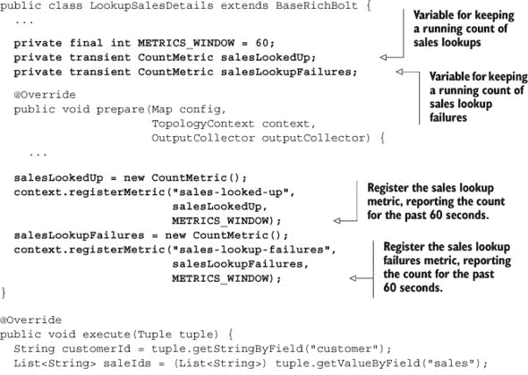

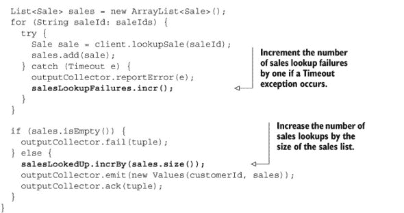

我们在`prepare()`方法中创建了并注册了两个`CountMetric`实例：一个用于跟踪成功查找详细信息的销售数量，另一个用于跟踪失败次数。

#### 6.5.2\. 设置度量消费者

现在我们有一些基本的原始数据要记录，但要获取这些数据，我们必须设置一个消费者。度量消费者实现了`IMetricsConsumer`接口，它充当 Storm 和外部系统（如 Statsd 或 Riemann）之间的桥梁。在这个例子中，我们将使用提供的`LoggingMetricsConsumer`。当一个拓扑在本地模式下运行时，`LoggingMetricsConsumer`最终会被导向标准输出（stdout）以及其他日志输出。我们可以通过向我们的`LocalTopologyRunner`添加以下内容来设置它：

```
Config config = new Config();
config.setDebug(true);
config.registerMetricsConsumer(LoggingMetricsConsumer.class, 1);
```

假设我们在时间窗口内成功查看了 350 个销售记录：

```
244565 [Thread-16-__metricsbacktype.storm.metric.LoggingMetricsConsumer]
INFO  backtype.storm.metric.LoggingMetricsConsumer - 1393581398
localhost:1     22:lookup-sales-details     sales-looked-up     350
```

在远程集群上，`LoggingMetricsConsumer`将信息级别消息写入 Storm 日志目录中名为 metrics.log 的文件。我们还通过以下添加启用了度量日志记录，以便在将拓扑部署到集群时：

```
public class RemoteTopologyRunner {
  ...
  private static Config createConfig(Boolean debug) {
    ...

    Config config = new Config();
    ...
    config.registerMetricsConsumer(LoggingMetricsConsumer.class, 1);
    ...
  }
}
```

Storm 的内置度量指标很有用。但如果你需要比内置的更多呢？幸运的是，Storm 提供了实现自定义度量指标的能力，这样你可以创建针对特定需求的度量指标。

#### 6.5.3\. 创建自定义 SuccessRateMetric

我们有原始度量数据，但我们想将它们聚合起来，然后自己进行数学计算以确定成功率。我们更关心的是成功率，而不是原始的成功和失败次数。Storm 没有内置的度量指标供我们使用，但很容易创建一个类来为我们记录这些信息。下面的列表介绍了`SuccessRateMetric`。

##### 列表 6.8\. `SuccessRateMetric.java`

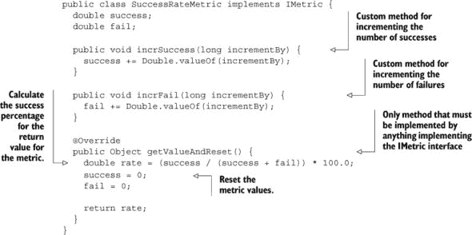

将代码更改为使用这个新的自定义度量指标很简单（见下一个列表）。

##### 列表 6.9\. 使用我们的新自定义度量指标的`LookupSalesDetails.java`

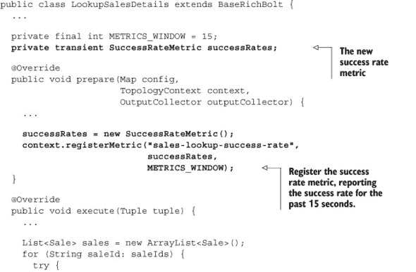

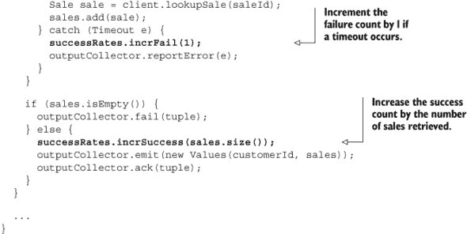

一切几乎都和以前一样。我们记录一个度量（只是类型不同）并向其报告我们的成功和失败情况。记录的输出更接近我们想要了解的内容：

```
124117 [Thread-16-__metricsbacktype.storm.metric.LoggingMetricsConsumer]
INFO  backtype.storm.metric.LoggingMetricsConsumer - 1393581964
localhost:1     32:lookup-sales-details     sales-lookup-success-rate
98.13084112149532
```

你可以亲自尝试：

```
git checkout 0.0.5
mvn clean verify -P local-cluster
```

警告！输出会很多。

#### 6.5.4\. 创建自定义 MultiSuccessRateMetric

到目前为止，我们已经进入生产阶段，业务人员对连续几天的情况感到满意——直到他们想要知道客户之间保真度的分布。换句话说，我们需要按客户记录成功和失败情况。

幸运的是，有一个名为`MultiCountMetric`的 Storm 度量标准，它正好做这件事——除了它使用`CountMetrics`而不是`SuccessRateMetrics`。但这很容易处理——我们只需从它创建一个新的度量标准：

```
git checkout 0.0.6
```

下面的列表显示了新的度量标准：`MultiSuccessRateMetric`。

##### 列表 6.10\. `MultiSuccessRateMetric.java`

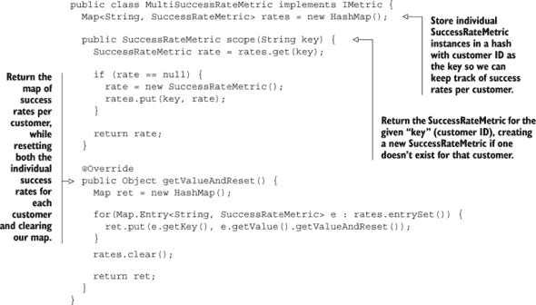

这个类很简单；我们在散列表中存储单个`SuccessRateMetric`。我们将使用客户 ID 作为键，并能够跟踪每个客户的成功和失败情况。正如你在下一个列表中可以看到的，我们需要做的更改很小。

##### 列表 6.11\. `LookupSalesDetails.java` 使用新的 `MultiSuccessRateMetric`

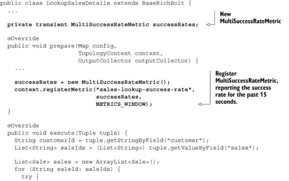

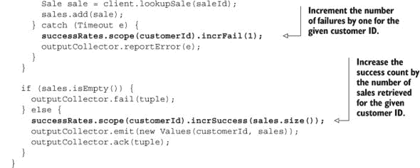

现在我们正在以对业务人员有用的方式记录度量标准：

```
79482 [Thread-16-__metricsbacktype.storm.metric.LoggingMetricsConsumer]
INFO  backtype.storm.metric.LoggingMetricsConsumer - 1393582952
localhost:4     24:lookup-sales-details     sales-lookup-success-rate
{customer-7083607=100.0, customer-7461335=80.0, customer-2744429=100.0,
customer-3681336=66.66666666666666, customer-8012734=100.0,
customer-7060775=100.0, customer-2247874=100.0, customer-3659041=100.0,
customer-1092131=100.0, customer-6121500=100.0, customer-1886068=100.0,
customer-3629821=100.0, customer-8620951=100.0, customer-8381332=100.0,
customer-8189083=80.0, customer-3720160=100.0, customer-845974=100.0,
customer-4922670=100.0, customer-8395305=100.0,
customer-2611914=66.66666666666666, customer-7983628=100.0,
customer-2312606=100.0, customer-8967727=100.0,
customer-552426=100.0, customer-9784547=100.0, customer-2002923=100.0,
customer-6724584=100.0, customer-7444284=80.0, customer-5385092=100.0,
customer-1654684=100.0, customer-5855112=50.0, customer-1299479=100.0}
```

日志消息提供了一个新度量标准的示例：一个客户 ID 列表，每个 ID 都有一个相关的成功率。以下是列表中的一位幸运客户，其成功率为 100%：

```
customer-2247874=100.0
```

通过这些数据，我们对有多少客户收到了他们全部可能的闪购套装有了更深入的了解。

### 6.6\. 摘要

在本章中，你了解到

+   拓扑结构的所有基本计时信息都可以在 Storm UI 中找到。

+   为你的拓扑结构建立一组基线性能数字是调整过程中的基本第一步。

+   瓶颈由 spout/bolt 的高容量表示，可以通过增加并行性来解决。

+   增加并行性最好分小步骤进行，这样你可以更好地理解每次增加的效果。

+   与数据相关（内在）以及与数据无关（外在）的延迟可能会降低你的拓扑结构的吞吐量，可能需要解决。

+   如果你想真正了解你的拓扑结构是如何运行的，度量标准（无论是内置的还是自定义的）都是必不可少的。
