## 第七章. 资源竞争

*本章涵盖*

+   Storm 集群中工作进程的竞争

+   工作进程（JVM）内的内存竞争

+   工作节点上的内存竞争

+   工作节点 CPU 竞争

+   工作节点网络/套接字输入/输出（I/O）竞争

+   工作节点磁盘 I/O 竞争

在第六章中，我们讨论了在单个拓扑级别进行调优。调优是一项重要的技能，当你将拓扑部署到生产环境中时，它将为你提供良好的服务。但它只是更大图景中的一小部分。你的拓扑将不得不与 Storm 集群中的各种其他拓扑共存。其中一些拓扑将消耗大量 CPU 进行复杂的数学计算，一些将消耗大量的网络带宽，等等，涉及各种资源。

在本章中，我们将介绍在 Storm 集群中可能发生竞争的各种资源类型，并解释如何解决每个问题。我们希望没有单个 Storm 集群会有如此多的竞争问题，因此我们放弃了我们通常的案例研究格式，转而采用更合适的食谱方法。快速浏览本章，以获得对竞争类型的一般了解，然后在开始遇到问题时，参考与你相关的任何部分。

本章的前三个食谱专注于解决随后提出的几种类型的竞争的常见解决方案。我们建议首先阅读这三个食谱，因为这将帮助你更好地理解当我们讨论特定类型竞争的解决方案时我们在说什么。

在本章中，当我们讨论可能发生竞争的资源时，我们使用某些术语。当你看到某些术语时，了解我们正在引用的 Storm 部署的哪个部分是很重要的。图 7.1 突出了这些资源，其中关键术语以粗体显示。其中大部分你应该已经很熟悉了，但如果不是，确保在继续前进之前花时间研究这些术语以及各种组件之间的关系。

##### 图 7.1. Storm 集群中各种类型的节点以及作为工作进程及其部分的工人节点

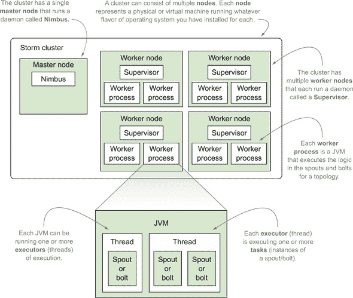

定义了术语后，让我们开始我们的“常见解决方案”食谱中的第一个，即更改运行在工作节点上的工作进程（JVM）的数量。现在解决这些“常见解决方案”食谱将为以后提供良好的参考，并使我们能够专注于为什么每个解决方案对于特定场景都是好的。

|  |
| --- |

**在讨论操作系统级别的竞争时选择操作系统**

每个人在管理、维护和诊断 Storm 集群中的问题的经验都会有所不同。我们试图涵盖主要问题和您将需要的某些工具。但您的情况可能与我们遇到的任何情况都不同。您的集群配置可能在机器数量、每台机器的 JVM 数量等方面有所不同。没有人能给您提供如何设置您的集群的答案。我们能做的最好的事情是向您提供调整可能出现问题的指南。因为我们正在解决操作系统级别存在的许多问题，并且因为您可以在许多操作系统上运行 Storm，所以我们决定专注于一个特定的操作系统家族：基于 Linux 的。

本章讨论的操作系统级工具应该在每种 Linux 变体中都可用。此外，这些工具应该存在于任何 Unix 类型的操作系统（如 Solaris 或 FreeBSD）中，或者有等效的工具。对于那些考虑使用 Windows 的用户，您将不得不做更多的工作来将这些想法转换到您的操作系统上，但一般原则适用。重要的是要注意，我们关于工具使用的讨论远非详尽——它是为了为你提供一个基础来构建。为了管理和诊断生产集群中的问题，您将需要了解更多关于您正在运行的工具和操作系统。手册页、搜索引擎、Storm 邮件列表、IRC 频道以及您友好的本地操作人员都是您应该依赖的、学习更多知识的优秀资源。

|  |
| --- |

### 7.1\. 在工人节点上更改运行的工人进程数量

在本章的几个食谱中，解决所讨论的争用问题的一个方案是改变在工人节点上运行的工人进程的数量（图 7.2）。

##### 图 7.2\. 工人节点上运行的许多工人进程

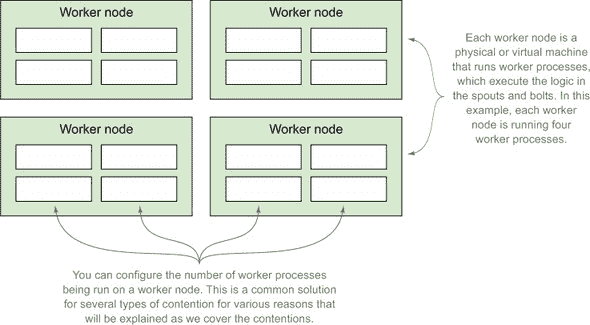

在某些情况下，这意味着增加工人进程的数量，而在其他情况下，这意味着减少工人进程的数量。这是一个如此常见的解决方案，以至于我们决定将其分解为单独的食谱，这样您就可以在遇到它作为解决方案时随时参考这一部分。

#### 7.1.1\. 问题

您正在经历一个争用，您需要增加或减少在工人节点上运行的工人进程的数量。

#### 7.1.2\. 解决方案

工人节点上运行的工人进程的数量由每个工人节点 storm.yaml 配置文件中的`supervisor.slots.ports`属性定义。该属性定义了每个工人进程将使用哪些端口来监听消息。下面的列表显示了该属性的默认设置。

##### 列表 7.1\. `supervisor.slots.ports`的默认设置

```
supervisor.slots.ports
 - 6701
 - 6702
 - 6703
 - 6704
```

要增加可以在工人节点上运行的工人进程的数量，为要添加的每个工人进程添加一个端口到这个列表中。对于减少工人进程的数量，情况相反：为要移除的每个工人进程移除一个端口。

更新此属性后，你需要重新启动工作节点上的 Supervisor 进程以生效更改。如果你像我们在第五章安装过程中所做的那样，将 Storm 安装到 /opt/storm，这将需要终止 Supervisor 进程，并使用以下命令重新启动：

```
/opt/storm/bin storm supervisor
```

重新启动后，Nimbus 将会意识到配置的更新，并且只向此列表中定义的端口发送消息。

#### 7.1.3\. 讨论

Storm 默认为每个工作节点分配四个工作进程，每个工作进程分别监听端口 6701、6702、6703 和 6704。当你刚开始构建集群时，这通常已经足够好了，所以不必担心立即尝试找出最佳配置。但如果你确实需要添加端口，请确保使用 Linux 上的 `netstat` 等工具检查你想要添加的端口是否已被占用。

另一个需要考虑的是你集群中工作节点的数量。如果需要广泛更改，更新配置并在数百甚至数十个节点上重启 Supervisor 进程是一项繁琐且耗时的任务。因此，我们推荐使用像 Puppet ([`puppetlabs.com`](http://puppetlabs.com)) 这样的工具来自动化每个节点的部署和配置。

### 7.2\. 更改分配给工作进程（JVMs）的内存量

在本章的一些食谱中，解决所讨论的竞争问题的方法之一是改变工作节点上工作进程（JVMs）分配的内存量。

在某些情况下，这意味着增加分配的内存量，而在其他情况下则意味着减少内存。无论解决方案的原因是什么，更改此设置的步骤都是相同的，这就是为什么我们专门为它编写了一个单独的食谱。

#### 7.2.1\. 问题

你正在经历一个需要增加或减少工作节点上工作进程（worker processes）使用的内存量的竞争（contention）。

#### 7.2.2\. 解决方案

可以在各个工作节点 storm.yaml 配置文件中的 `worker.childopts` 属性中更改分配给工作节点上所有工作进程（JVMs）的内存量。该属性接受任何有效的 JVM 启动选项，提供了为工作节点上的 JVM 设置初始内存分配池（`-Xms`）和最大内存分配池（`-Xmx`）启动选项的能力。以下列表显示了这将如何看起来，仅关注与内存相关的参数。

##### 列表 7.2\. 在 storm.yaml 中设置 `worker.childopts`

```
worker.childopts: "...
-Xms512m
-Xmx1024m
..."
```

重要的是要意识到更改此属性将更新特定工作节点上的所有工作进程。在更新此属性后，您需要重新启动工作节点上的 Supervisor 进程以生效更改。如果您像我们在第五章中的安装演练那样将 Storm 安装到/opt/storm，这将需要终止 Supervisor 进程，然后使用以下命令重新启动：

```
/opt/storm/bin storm supervisor
```

重新启动后，工作节点上的所有工作进程（JVM）都应使用更新的内存设置运行。

#### 7.2.3. 讨论

在增加 JVM 大小时，需要注意的一点是确保工作节点（机器/虚拟机）本身有足够的资源来支持这种大小增加。如果工作节点没有足够的内存来支持您设置的`–Xmx`值，您需要在更改分配给 JVM 的内存量之前更改实际机器/虚拟机的大小。

我们强烈推荐遵循的另一个技巧是将`–Xms`和`–Xmx`设置为相同的值。如果这些值不同，JVM 将管理堆，有时增加有时减少堆大小，具体取决于堆的使用情况。我们发现这种堆管理的开销是不必要的，因此建议将两者设置为相同的值以消除任何堆管理开销。除了更高效之外，这种策略还有额外的优点，即更容易理解 JVM 内存使用情况，因为堆大小是 JVM 生命周期的固定常数。

### 7.3.确定拓扑正在执行的工作节点/进程

本章中的许多配方都涉及工作节点和工作进程级别的竞争。通常，这些竞争将以拓扑在 Storm UI 中抛出错误、吞吐量降低或完全没有吞吐量的形式表现出来。在这些所有场景中，您很可能会需要确定特定拓扑正在执行的工作节点和工作进程。

#### 7.3.1. 问题

您有一个有问题的拓扑，需要确定该拓扑正在执行的工作节点和工作进程。

#### 7.3.2. 解决方案

要这样做，请查看 Storm UI。您应该从查看特定拓扑的 UI 开始。我们建议检查 Bolts 部分，看看是否有任何异常。如图 7.3 所示，其中一个 bolt 存在问题。

##### 图 7.3.在 Storm UI 中诊断特定拓扑的问题

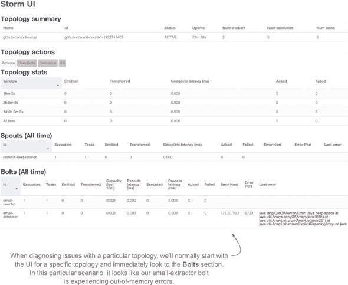

在确定了有问题的 bolt 之后，您现在想了解更多关于该 bolt 发生的事情的详细信息。为此，请在 UI 中单击该 bolt 的名称以获取该 bolt 的更详细视图。从这里，将您的注意力转向单个 bolt 的 Executors 和 Errors 部分（图 7.4）。

##### 图 7.4\. 查看特定 bolt 的 Storm UI 中的 Executors 和错误部分，以确定 bolt 遇到的问题类型，同时确定 bolt 正在执行的工作节点和工作进程

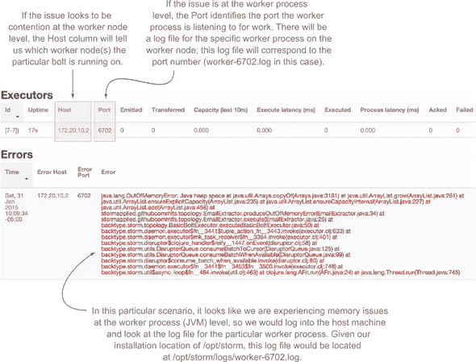

对于单个 bolt 的 Executors 部分特别有趣；这告诉你 bolt 正在哪些工作节点和工作进程上执行。从这里，根据正在经历的竞争类型，你可以采取必要的步骤来识别和解决问题。

#### 7.3.3\. 讨论

Storm UI 是你的朋友。熟悉它的各种屏幕。通常，我们在诊断任何类型的竞争时首先查看的地方。能够快速识别出有问题的拓扑、bolt、工作节点和工作进程在我们的经验中非常有价值。

尽管 Storm UI 是一个强大的工具，但它可能并不总是显示你需要的信息。这时，额外的监控就能发挥作用。这可以通过监控单个工作节点或你 bolt 代码中的自定义指标来实现，从而让你更深入地了解 bolt 的性能。关键在于，你不应该仅仅依赖 Storm UI。要采取其他措施确保全面覆盖。毕竟，问题不是“是否”会出问题，而是“何时”出问题。

### 7.4\. Storm 集群中的工作进程竞争

当你安装一个 Storm 集群时，你会在所有工作节点上安装一个固定数量的可用工作进程。每次你将新的拓扑部署到集群中时，你都会指定该拓扑应该消耗多少个工作进程。很容易陷入这样的情况：你部署了一个需要一定数量工作进程的拓扑，但你无法获得这些工作进程，因为它们都已经分配给了现有的拓扑。这使得相关的拓扑变得无用，因为它没有工作进程就无法处理数据。图 7.5 说明了这一点。

##### 图 7.5\. 示例 Storm 集群，其中所有工作进程都已分配给拓扑。

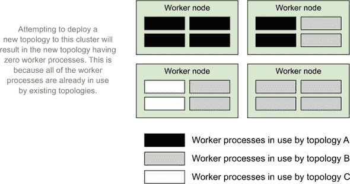

图 7.5 展示了我们亲身体验过多次的问题。幸运的是，这个问题很容易检测；可以通过查看 Storm UI 的集群摘要页面（图 7.6）来找到。 

##### 图 7.6\. Storm UI：没有空闲槽位可能意味着你的拓扑正遭受槽位竞争。

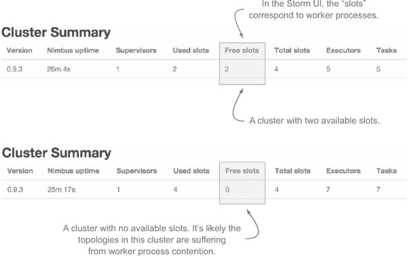

#### 7.4.1\. 问题

根据 Storm UI，你注意到一个拓扑没有处理任何数据，或者吞吐量突然下降，且没有空闲槽位可用。

#### 7.4.2\. 解决方案

核心问题是，你有固定数量的工作进程可以分配给请求它们的拓扑。你可以通过以下策略解决这个问题：

+   减少现有拓扑使用的工作进程数量

+   增加集群中工作进程的总数

##### 减少现有拓扑使用的工作进程数量

这是为集群中的其他拓扑释放槽位的最快和最简单的方法。但这可能或可能不取决于现有拓扑的 SLAs。如果你可以在不违反 SLA 的情况下减少拓扑使用的工作进程数量，我们建议这种方法。

拓扑请求的工作进程数量在构建和提交拓扑到 Storm 集群的代码中指定。下面的列表显示了此代码。

##### 列表 7.3\. 配置拓扑的工作进程数量

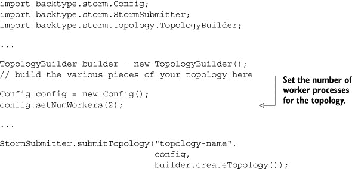

如果你的服务等级协议（SLAs）不允许你减少集群中任何拓扑使用的槽位数，你将不得不向集群中添加新的工作进程。

##### 增加集群中工作进程的总数

有两种方法可以增加集群中工作进程的总数。一种是通过在第 7.1 节中列出的步骤向你的工作节点添加更多的工作进程。但如果你的工作节点没有资源来支持额外的 JVMs，这就不起作用了。如果是这种情况，你将需要向你的集群添加更多的工作节点，从而增加工作进程池。

如果你能够的话，我们建议添加新的工作节点。这种方法对现有拓扑的影响最小，因为向现有节点添加工作进程可能会引起其他类型的竞争，然后必须解决这些竞争。

#### 7.4.3\. 讨论

工作进程竞争可能有各种原因，其中一些是自致的，而另一些则不是。场景包括以下：

+   你部署了一个配置为消耗比集群中可用槽位更多的拓扑的工作进程。

+   你部署了一个没有可用槽位的拓扑到你的集群中。

+   一个工作节点宕机，从而减少了可用槽位的数量，可能会造成现有拓扑之间的竞争。

在部署新拓扑时，始终了解集群中可用的资源非常重要。如果你忽略了集群内的可用资源，你很容易通过部署消耗过多资源的东西来影响集群中的每个拓扑。

### 7.5\. 工作进程（JVM）内的内存竞争

正如你使用固定数量的工作进程安装 Storm 集群一样，你也为每个工作进程（JVM）设置了一个固定数量的内存，它可以增长并使用。内存的数量限制了可以在该 JVM 上启动的线程（执行器）的数量——每个线程需要一定量的内存（在 64 位 Linux JVM 上默认为 1 MB）。

JVM 竞争可能在每个拓扑结构的基础上成为一个问题。你的 bolts、spouts、threads 等使用的内存组合可能会超过分配给它们运行的 JVMs 的内存（图 7.7）。

##### 图 7.7\. 工作进程、执行器与 JVM 的映射，以及 spouts/bolts 的线程和实例，以及同一 JVM 中争夺内存的线程/实例

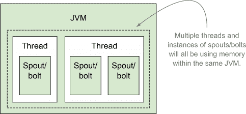

JVM 竞争通常表现为内存不足（OOM）错误和/或过长的垃圾回收（GC）暂停。OOM 错误将出现在 Storm 日志和 Storm UI 中，通常以 `java.lang.OutOfMemory-Error: Java heap space` 开头的堆栈跟踪。

获得 GC 问题的可见性需要一点更多的设置，但这在 JVM 和 Storm 配置中都是容易支持的。JVM 提供了跟踪和记录 GC 使用情况的启动选项，而 Storm 提供了一种为您的 worker 进程指定 JVM 启动选项的方法。storm.yaml 中的 `worker.childopts` 属性是您指定这些 JVM 选项的地方。以下列表显示了工作节点中的示例 storm.yaml 配置。

##### 列表 7.4\. 为工作进程设置 GC 日志记录


一个值得注意的有趣项目是 `–Xloggc` 设置的值。记住，每个工作节点可以有多个工作进程。`worker.childopts` 属性适用于节点上的所有工作进程，因此指定一个常规日志文件名将生成所有工作进程合并的一个日志文件。为每个工作进程生成单独的日志文件将使跟踪每个 JVM 的 GC 使用情况更容易。Storm 提供了一种记录特定工作进程日志的机制；`ID` 变量对于工作节点上的每个工作进程都是唯一的。因此，您可以将 `"%ID%"` 字符串添加到 GC 日志文件名中，您将为每个工作进程获得一个单独的 GC 日志文件。

首次阅读 GC 日志可能会有些令人畏惧，所以我们将快速浏览一个教程，概述 列表 7.4 中的选项将在相关日志中产生什么。此列表显示了包含小（年轻代）和主要收集（持久代）的 GC 周期的示例输出。完全有可能不是每个 GC 日志语句都会包含主要收集统计信息，因为主要收集并不在每次 GC 周期中发生。但为了完整性，我们希望包括两者。

| |
| --- |

**Java 代际垃圾回收**

Java 使用所谓的代际垃圾回收。这意味着内存被划分为不同的“代”，随着对象经历足够的 GC 事件，它们会被提升到更老的代。对象将开始于所谓的年轻代，如果它们在年轻代中经历了足够的 GC 事件，最终会被提升到持久代。年轻代对象引用的集合称为小回收；持久代对象的集合称为大回收。

| |
| --- |

##### 列表 7.5\. 样本 GC 日志输出

```
2014-07-27T16:29:29.027+0500: 1.342: Application time: 0.6247300 seconds

2014-07-27T16:29:29.027+0500: 1.342: [GC 1.342: [DefNew: 8128K->8128K(8128K),
     0.0000505 secs] 1.342: [Tenured: 18154K->2311K(24576K), 0.1290354 secs]
     26282K->2311K(32704K), 0.1293306 secs]

2014-07-27T16:29:29.037+0500: 1.353: Total time for which application threads
     were stopped: 0.0107480 seconds
```

让我们分析一下这个输出中的每一部分。图 7.8 显示了第一行，包含自上次 GC 以来应用程序运行的时间长度。

##### 图 7.8\. GC 日志输出显示`–XX:+PrintGCDateStamps`、`–XX:+PrintGCTimeStamps`和`–XX:+PrintGCApplicationConcurrentTime`的输出

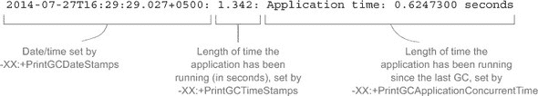

下一行是`–XX:+PrintGCDetails`选项的结果，并分解成几个图，以便更好地解释所表示的内容。为了使图更简单，我们排除了日期/时间戳。图 7.9 显示了年轻代次要收集的 GC 细节。

##### 图 7.9\. GC 日志输出显示年轻代内存的垃圾回收细节

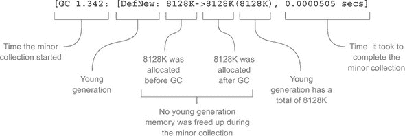

旧生代主要收集的 GC 细节显示在图 7.10 中。图 7.11 显示了`–XX:+PrintGCDetails`输出的最后部分，它显示了整体堆的值以及整个 GC 周期所花费的时间。

##### 图 7.10\. GC 日志输出显示旧生代内存的主要垃圾回收细节


##### 图 7.11\. GC 日志输出显示整个堆的值和完整的 GC 时间

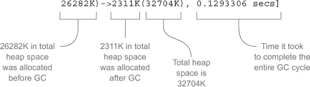

在覆盖了 GC 输出的第一行和第二行之后，输出的最后一行很简单；`–XX:+PrintGCApplicationStoppedTime`选项会导致如下类似的行：`2014-07-27T16:29:29.037+0500: 1.353: 应用程序线程停止的总时间：0.0107480 秒`。这提供了对由于 GC 而暂停的应用程序持续时间的更高级别的描述。

就这么简单。一开始看起来令人畏惧的事情，当你将其分解成更小的部分时，就会很容易解释。能够阅读这些日志将极大地帮助你在调试 Storm 中的 JVM 竞争问题时，以及在任何运行在 JVM 上的应用程序中。通过了解如何设置和阅读 GC 日志，以及知道如何找到 OOM 错误，您将能够确定您的拓扑是否正在经历 JVM 竞争。

#### 7.5.1\. 问题

您的 spouts 和/或 bolts 正在尝试消耗比分配给 JVM 的内存更多的内存，导致 OOM 错误和/或长时间的 GC 暂停。

#### 7.5.2\. 解决方案

您可以通过以下几种方式来解决这个问题：

+   通过增加拓扑中使用的 worker 进程数量

+   通过增加 JVM 的大小

##### 增加拓扑中使用的 worker 进程数量

请参阅第 7.1 节中的步骤。通过向拓扑中添加一个 worker 进程，您将减少该拓扑所有 worker 进程的平均负载。这应该会导致每个 worker 进程（JVM）的内存占用更小，希望消除 JVM 内存竞争。

##### 增加 JVM（worker 进程）的大小

有关如何操作的步骤，请参阅第 7.2 节。因为增加 JVM 的大小可能需要你改变它们运行的机器/VM 的大小，所以我们建议如果你可以的话，采用“增加工作进程”的解决方案。

#### 7.5.3. 讨论

在 JVM 之间进行交换和平衡内存一直是我们在 Storm 中遇到的最大挑战之一。不同的拓扑会有不同的内存使用模式。随着时间的推移，我们已经从每个工作节点有四个工作进程，每个使用 500 MB 内存，转变为每个工作节点有两个工作进程，每个使用 1 GB 内存。

我们的拓扑具有足够的并行度，每个线程的内存成本使得在 500 MB 时进行调优变得有困难。每个工作进程 1 GB 的内存，我们大多数拓扑都有足够的余量。有些接近那个限制，所以我们开始将负载更分散到多个工作节点上。

如果你一开始没有做对，不要担心。我们已经在生产环境中运行 Storm 两年了，并且随着我们的拓扑改变、增长和扩展，我们仍在调整每个工作进程的内存量和每台机器的工作进程数量。只需记住，这是一个永无止境的过程，因为你的集群和拓扑的形状在不断变化。

当增加分配给 JVM 的内存时，要小心；一般来说，当你越过某些关键点时，你会注意到垃圾收集时间的变化——500 MB、1 GB、2 GB 和 4 GB 都是我们的 GC 时间跳跃的点。这更多的是艺术而不是科学，所以带上你的耐心。没有什么比通过增加 JVM 内存大小来解决 OOM 问题，却发现它明显影响了 GC 时间更令人沮丧的。

### 7.6. 工作节点上的内存竞争

就像单个 JVM 有有限的可用内存一样，整个工作节点也是如此。除了运行你的 Storm 工作进程（JVMs）所需的内存外，你还需要内存来运行 Supervisor 进程以及在工作节点上运行的任何其他进程，而不进行交换（图 7.12）。

##### 图 7.12. 工作节点有固定数量的内存，这些内存被其工作进程以及在该工作节点上运行的任何其他进程使用。

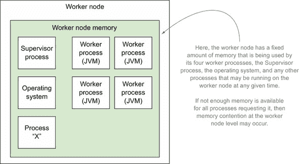

如果一个工作节点正在经历内存竞争，那么该工作节点将会进行交换。*交换*是小小的死亡，如果你关心延迟和吞吐量，就需要避免它。在使用 Storm 时，每个工作节点都需要有足够的内存，以便工作进程和操作系统不进行交换。如果你想保持一致的性能，你必须避免使用 Storm 的 JVMs 进行交换。

在 Linux 中，你可以使用`sar`（系统活动报告）命令来监控这一点。这是一个基于 Linux 的系统统计命令，它收集并显示所有系统活动和统计信息。我们以`sar [option] [interval [count]]`的格式运行这个命令（图 7.13）。

##### 图 7.13. `sar`命令分解

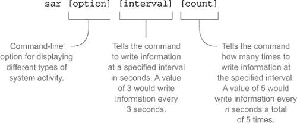

可以传递各种选项来显示特定类型的统计信息。对于诊断工作节点内存争用，我们使用`–S`选项来报告交换空间利用率的统计信息。图 7.14 展示了交换空间利用率的输出。

##### 图 7.14\. `sar –S 1 3`命令报告交换空间利用率的输出

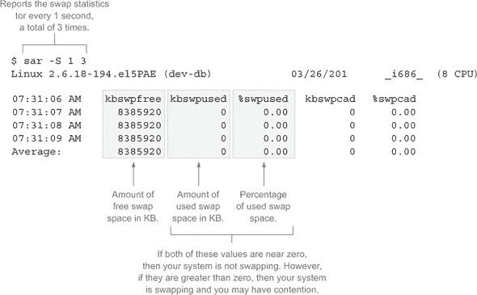

| |
| --- |

**关于操作系统争用的说明**

避免操作系统级别的争用的唯一方法是完全避开它！我们这是什么意思呢？让我们来解释一下。

如果您在每个工作节点上运行单个工作进程，那么在该节点上遇到工作进程之间的争用是不可能的。这可以使在集群内保持一致的性能变得容易得多。我们知道不止一个开发团队选择了这种方法。如果可能的话，我们建议您认真考虑走这条路。

如果您不在虚拟化环境中运行，这根本无法开始。如果您在单个物理机器上运行单个操作系统实例的“裸机”上运行，成本太高了。在虚拟化环境中，您将使用更多资源来做这件事。假设您的操作系统安装需要*n* GB 的磁盘空间，并且需要 2 GB 的内存来有效运行。如果您在您的集群上有八个工作节点，并且每个节点分配四个工作节点，您将使用*n* * 2 GB 的磁盘空间和 4 GB 的内存来在您的集群节点上运行操作系统。如果您要在每个节点上运行单个工作节点，那么这会激增到*n* * 8 GB 的磁盘空间和 16 GB 的内存。这在相当小的集群中是一个四倍的增长。想象一下，如果您有一个由 16、32、128 个或更多节点组成的集群，这将导致额外的使用量。如果您在像亚马逊网络服务（AWS）这样的环境中运行，您按节点付费，成本会迅速增加。因此，我们建议只有在您在硬件成本相对固定且您有额外的磁盘和内存资源的私有虚拟化环境中运行时才采用这种方法。

如果这个有限的场景不符合您的描述，请不要担心；我们在接下来的几页中有很多提示可以帮助您。即使它符合您的描述，您也仍然需要熟悉以下材料，因为单个拓扑结构仍然会遇到这些问题。

| |
| --- |

#### 7.6.1\. 问题

您的工作节点正在交换，因为对该节点内存的争用。

#### 7.6.2\. 解决方案

这是您如何解决这个问题：

+   增加每个工作节点可用的内存。这意味着根据您如何配置您的集群，给物理机器或虚拟机更多的内存。

+   降低工作进程使用的总内存。

##### 降低工作进程使用的总内存

通过以下两种方式之一降低工作进程使用的总内存。第一种是减少每个工人节点的工作进程数量。参见第 7.1 节中的适当步骤。减少总工作进程数量将降低剩余进程组合的整体内存占用。

第二种方法是减小你的 JVMs 的大小。参见第 7.2 节中的这些步骤。不过，在降低现有 JVM 分配的内存时要小心，以避免在 JVM 内引入内存竞争。

#### 7.6.3\. 讨论

我们的解决方案是始终选择增加每台机器可用的内存。这是最简单的解决方案，其产生的后果也最容易理解。如果你内存紧张，降低内存使用可能有效，但你会面临我们之前讨论的每个 JVM 的 GC 和 OOM 问题。简而言之，如果你有多余的内存，请在每台机器上增加内存。

### 7.7\. 工作节点 CPU 竞争

当对 CPU 周期的需求超过可用量时，就会发生工作节点 CPU 竞争。在使用 Storm 时这是一个问题，也是 Storm 集群中竞争的主要来源之一。如果你的 Storm 拓扑的吞吐量低于预期，你可能想检查运行拓扑的工作节点，看看是否存在 CPU 竞争。

在 Linux 中，你可以使用`sar`命令来监控这个问题，通过传递选项`–u`来显示所有 CPU 的实时 CPU 利用率。图 7.15 展示了 CPU 利用率以及你需要关注的列。

##### 图 7.15\. 输出 `sar –u 1 3` 以报告 CPU 利用率

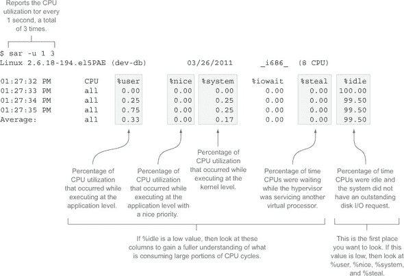

#### 7.7.1\. 问题

你的拓扑吞吐量低，根据运行`sar`命令的结果，你看到存在 CPU 竞争。

#### 7.7.2\. 解决方案

为了解决这个问题，你有以下几种选择：

+   增加机器可用的 CPU 数量。这仅在虚拟化环境中才可行。

+   升级到更强大的 CPU（例如亚马逊网络服务(AWS)类型的环境）。

+   通过减少每个工作节点的工作进程数量来将 JVM 负载分散到更多的工人节点上。

##### 将 JVM 负载分散到更多的工人节点上

为了将工作进程（JVM）负载分散到更多的工人节点上，你需要减少每个工人节点上运行的工作进程数量（参见第 7.1 节中的这些步骤）。减少每个工人节点上的工作进程数量会导致每个工人节点上完成的处理（CPU 请求）减少。当你尝试这个解决方案时，可能会遇到两种情况。第一种是你集群中有未使用的工作进程，因此可以减少现有节点上的工作进程数量，从而分散负载(图 7.16)。

##### 图 7.16\. 在有未使用工作进程的集群中减少每个工作节点的工作进程数量

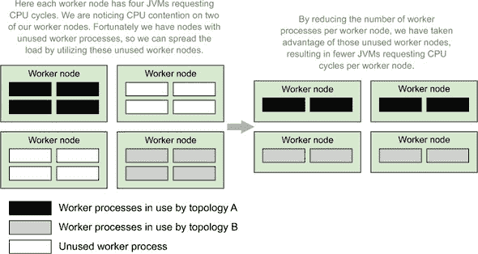

第二种情况是，你没有未使用的工作进程，因此需要添加工作节点来减少每个工作节点的工作进程数量（图 7.17）。

##### 图 7.17\. 在没有未使用工作进程的集群中减少每个工作节点的工作进程数量，导致添加更多工作节点

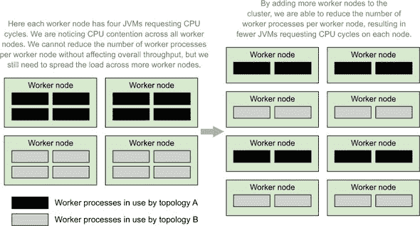

减少每个工作节点的工作进程数量是减少每个节点请求的 CPU 周期的有效方法。你只需要意识到可用的和正在使用的资源，并在你的特定场景中相应地采取行动。

#### 7.7.3\. 讨论

如果你像我们一样运行自己的私有云，第一个选项是一个很好的选择。你的 Storm 节点正在不同的主机机器上运行，每个机器有*x*个可用的 CPU（在我们的情况下，16 个）。当我们最初开始使用 Storm 时，我们的计算需求很低，我们为每个节点分配了最多两个核心。最终这变得有问题，我们改为四个，然后是八个。大多数时候，每个节点并没有使用所有的 CPU，但需要时它就在那里。

你可以通过升级到更强大的 CPU 和/或更多可用核心，在 AWS 和其他托管解决方案中遵循相同的模式。但你会遇到限制。在单个物理盒子上运行的那么多虚拟机中，CPU 时间有限。如果你达到那个点或无法扩展 CPU，将负载分配到更多机器是你的唯一选择。

到目前为止，我们从未以这种方式解决过 CPU 使用问题（但我们以这种方式解决了别人的问题）。有时，我们以完全不同的方式解决了问题。结果发现，有一次我们的问题是由于一个错误，导致拓扑在紧密循环中反复无用地烧毁 CPU。这始终是你应该首先检查的，但以“你确定你没有搞砸吗？”开始讨论似乎不是一种友好的方式。

### 7.8\. 工作节点 I/O 竞争

工作节点上的 I/O 竞争可以分为以下两类：

+   磁盘 I/O 竞争，从文件系统读取和写入

+   网络套接字 I/O 竞争，通过套接字从网络读取和写入

这两种类型的竞争对于某些类别的 Storm 拓扑来说是常见问题。确定你是否经历这两种竞争的第一步是确定工作节点是否在总体上经历 I/O 竞争。一旦你做到了，你就可以深入了解你的工作节点正在遭受的确切类型的 I/O 竞争。

确定你的集群中的工作节点是否经历 I/O 竞争的一种方法是通过运行带有 `–u` 选项的 `sar` 命令来显示实时 CPU 使用率。这是我们用于 第 7.7 节 中 CPU 竞争的相同命令，但这次我们将关注输出中的不同列（图 7.18）。

##### 图 7.18\. `sar –u 1 3` 的输出，用于报告 CPU 利用率和，特别是 I/O 等待时间

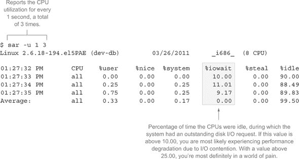

一个健康的拓扑结构，使用大量的 I/O，不应该花费大量时间等待资源可用。这就是为什么我们使用 10.00% 作为你开始经历性能下降的阈值。

你可能会认为区分套接字/网络和磁盘 I/O 竞争是一项困难的任务，但你会惊讶于你的直觉经常能引导你做出正确的选择。让我们来解释一下。

如果你了解在特定工作节点上运行哪些拓扑结构（第 7.3 节 讨论了如何确定这一点），你就知道它们会使用大量的网络资源或磁盘 I/O，并且你会看到 `iowait` 问题，你可能会安全地假设这两个问题中的哪一个是你遇到的问题。这里有一个简单的测试可以帮助你确定：如果你看到令人烦恼的 I/O 竞争迹象，首先尝试确定你是否遭受了套接字/网络 I/O 竞争。如果你没有，那么你很可能遭受的是磁盘 I/O 竞争。尽管这不一定总是情况，但它可以在你学习行业工具时带你走很长的路。

让我们深入探讨每个 I/O 竞争，以便你更全面地了解我们所讨论的内容。

#### 7.8.1\. 网络/套接字 I/O 竞争

如果你的拓扑结构通过网络与外部服务交互，网络/套接字 I/O 竞争很可能是你集群的问题。根据我们的经验，这种竞争的主要原因是为打开套接字分配的所有端口都被使用了。

大多数 Linux 安装将默认为每个进程最多 1024 个打开文件/套接字。在一个 I/O 密集型的拓扑结构中，很容易迅速达到这个限制。我们已经编写了每个工作节点打开数千个套接字的拓扑结构。为了确定你操作系统的限制，你可以检查 /proc 文件系统来查看你的进程限制。为了做到这一点，你首先需要知道你的进程 ID。一旦你做到了，你就可以获取该进程的所有限制列表。以下列表显示了如何使用 `ps` 和 `grep` 命令来查找你的进程 ID（即 PID），然后如何从 /proc 文件系统中获取你的进程限制。

##### 列表 7.6\. 确定资源限制

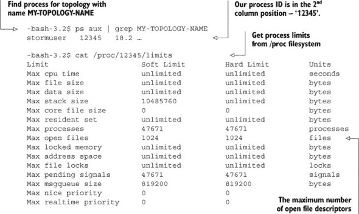

如果你遇到了这个限制，你的拓扑结构的 Storm UI 应该在“最后错误”列中显示一个异常，表明已达到最大打开文件限制。这很可能是以 `java.net.SocketException: Too many open files` 开头的堆栈跟踪。

|  |
| --- |

**处理饱和的网络链路和网络/套接字 I/O 密集型拓扑**

我们从未见过饱和的网络链路，但我们知道在理论上这是可能的，所以我们在这里提到它，而不是为它专门写一个完整的配方。根据你的操作系统，你可以使用各种工具来确定你的网络链路是否饱和。对于 Linux，我们推荐使用`iftop`。

对于饱和的网络链路，你可以做两件事：1) 获取更快的网络或 2) 降低每个工作节点上的工作进程数量，以便将负载分散到更多的机器上；只要你的本地网络过载，而不是整个网络过载，这种方法就会有效。

| |
| --- |

##### 问题

你的拓扑正在经历吞吐量降低或完全没有吞吐量，并且你看到错误，表明达到了打开套接字数量的限制。

##### 解决方案

解决这个问题的几种方法如下：

+   增加工作节点上的可用端口

+   向集群中添加更多工作节点

为了增加可用端口，你需要在大多数 Linux 发行版的`/etc/security/limits.conf`文件中进行编辑。你可以添加如下所示的行：

```
* soft nofile 128000
* hard nofile 25600
```

这些设置将设置每个用户打开文件的数量上的硬限制和软限制。作为 Storm 用户，我们关注的值是软限制。我们不建议超过 128k。如果你这样做，那么作为一个经验法则（直到你了解更多关于 Linux 上打开文件数量的软/硬限制），我们建议将硬限制设置为软限制的两倍。请注意，你需要超级用户权限来更改`limits.conf`，并且你需要重新启动系统以确保它们生效。

增加集群中的工作节点数量将为你提供更多的端口。如果你没有资源添加更多的物理机器或虚拟机，你将不得不尝试第一种解决方案。

##### 讨论

我们遇到的第一真正争用问题是每台机器上可用的套接字数量。我们使用了很多，因为我们的许多拓扑需要调用外部服务来查找从初始传入数据中不可用的额外信息。拥有大量的可用套接字是必须的。在你尽可能增加每个节点上的可用套接字之前，不要在其他机器上添加更多的工作进程。一旦你做到了这一点，你也应该看看你的代码。

你是否一直在打开和关闭套接字？如果你能保持连接打开，那就这么做。有一个美妙的东西叫做`TCP_WAIT`。这是一个 TCP 连接在关闭后会保持打开状态，等待任何散乱的数据。如果你在一个慢速网络链路上（就像 TCP 最初设计时许多人那样），这是一个美妙的主意，有助于防止数据损坏。如果你在一个快速的现代局域网中，这会让你发疯。你可以通过各种操作系统特定的方法调整你的 TCP 堆栈，以降低你在`TCP_WAIT`中逗留的时间，但当你进行大量的网络调用时，即使这样也不够。要聪明：尽可能少地打开和关闭连接。

#### 7.8.2\. 磁盘 I/O 竞争

磁盘 I/O 竞争会影响你向磁盘写入的速度。这可能是 Storm 的问题，但应该极其罕见。如果你正在向日志写入大量数据或将计算输出存储在本地文件系统上的文件中，可能会出现这个问题，但这种情况不太可能。

如果你有一个将数据写入磁盘的拓扑，并且注意到其吞吐量低于你的预期，你应该检查运行在工作节点上的拓扑是否正在经历磁盘 I/O 竞争。对于 Linux 安装，你可以运行一个名为`iotop`的命令来查看相关工作节点的磁盘 I/O 使用情况。此命令显示系统中进程/线程当前的 I/O 使用情况表，其中最密集的 I/O 进程/线程列在前面。图 7.19 显示了该命令及其相关输出，以及我们感兴趣的输出部分。

##### 图 7.19\. `iotop`命令的输出以及确定工作节点是否经历磁盘 I/O 竞争时需要注意的事项

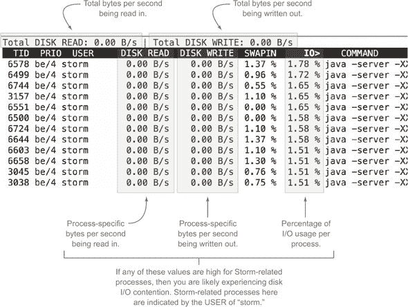

##### 问题

你有一个读取/写入磁盘的拓扑，看起来它运行在工作节点上正经历磁盘 I/O 竞争。

##### 解决方案

为了解决这个问题

+   减少写入磁盘的数据量。这可能意味着在拓扑中减少数据量。也可能意味着如果多个工作进程在同一工作节点上对磁盘有需求，那么在每个工作节点上放置较少的工作进程。

+   获取更快的磁盘。这可能包括使用 RAM 磁盘。

+   如果你正在向 NFS 或其他网络文件系统写入，请立即停止。向 NFS 写入很慢，如果你这么做，你将为自己设置磁盘 I/O 竞争。

##### 讨论

慢速磁盘 I/O 令人沮丧。它让我们发疯。最糟糕的是，快速磁盘并不便宜。我们在 Storm 工作节点上运行的磁盘相当慢。我们将快速磁盘留给我们真正需要速度的地方：Elasticsearch、Solr、Riak、RabbitMQ 以及我们基础设施中类似的写密集型部分。如果你正在向磁盘写入大量数据，而你又没有快速磁盘，你将不得不接受它作为瓶颈。如果不投入资金解决这个问题，你几乎无能为力。

### 7.9\. 摘要

在本章中，你学习了以下内容：

+   在拓扑级别之上存在多种竞争类型，因此能够监控运行在工作节点上的操作系统如 CPU、I/O 和内存使用情况很有帮助。

+   对于你集群中机器/虚拟机的操作系统监控工具有一定的熟悉程度很重要。在 Linux 中，这些包括`sar`、`netstat`和`iotop`。

+   了解常见的 JVM 启动选项很有价值，例如`–Xms`、`-Xmx`以及与 GC 日志相关的选项。

+   虽然 Storm UI 是诊断许多类型竞争的出色工具，但拥有机器/虚拟机级别的其他类型监控也很明智，以便你知道是否有问题发生。

+   在你的单个拓扑中包含自定义指标/监控将为你提供 Storm UI 可能无法提供的宝贵见解。

+   在增加运行在工作节点上的工作进程数量时要小心，因为这可能会在节点级别引入内存和/或 CPU 竞争。

+   在减少运行在工作节点上的工作进程数量时要小心，因为这可能会影响你的拓扑吞吐量，同时也会在你的集群中引入对工作进程的竞争。
