## 第八章. Storm 内部机制

本章涵盖

+   执行器在底层是如何工作的

+   元组如何在执行器之间传递

+   Storm 的内部缓冲区

+   Storm 内部缓冲区的溢出和调整

+   路由和任务

+   Storm 的调试日志输出

到这里，我们已经介绍了四个章节，涵盖了在生产环境中使用 Storm。我们解释了如何使用 Storm UI 来理解你的拓扑中正在发生的事情，如何使用这些信息来调整你的拓扑，以及如何诊断和治疗跨拓扑竞争问题。我们已经探索了许多你可以有效使用的工具。在本章中，我们将介绍另一个：对 Storm 内部机制的深入了解。

为什么我们认为这很重要呢？好吧，在前三章中，我们为你提供了处理可能遇到的问题的工具和策略，但我们无法预知你可能会遇到的所有可能的问题。每个 Storm 集群都是独特的；你硬件和代码的组合很可能会遇到我们从未见过的，也许其他人也没有见过的挑战。你对 Storm 工作原理的理解越深入，你处理这类问题的能力就越强。本章的意图，与上一章不同，并不是提供特定问题的解决方案。

要成为 Storm 调优、调试问题、为最大效率设计拓扑，以及运行生产系统所涉及的其他无数任务的专家，你需要对你所使用的工具有深入的理解。我们旨在本章带你深入了解构成 Storm 的抽象。我们不会带你深入到底层，因为 Storm 是一个活跃的项目，正在积极开发中，其中很多开发工作都在核心部分进行。但有一个比我们之前所覆盖的任何抽象都更深的层次，我们将努力让你熟悉这个层次。我们无法告诉你如何部署从本章获得的知识，但我们知道，直到你牢固掌握本章主题的内部机制，你不会掌握 Storm。

|  |
| --- |

##### 注意

本章中使用的某些术语并不直接对应于 Storm 源代码中的术语，但与精神相符。这是故意的，因为重点应该放在内部机制的工作方式上，而不是它们的命名上。

|  |
| --- |

为了专注于 Storm 的内部机制而不是新用例的细节，我们将重新引入一个老朋友，即第二章中的提交计数拓扑 chapter 2。让我们快速回顾一下这个拓扑，以防你忘记了。

### 8.1. 重新审视提交计数拓扑

提交计数拓扑提供了一个简单的拓扑（一个 Spout 和两个 Bolt），我们可以用它来解释在特定用例的上下文中 Storm 的内部结构，但又不至于陷入用例的细节。话虽如此，为了教学目的，我们还会在这个拓扑结构中添加一些额外的限定条件。但在我们讨论这些限定条件之前，让我们快速回顾一下拓扑结构本身。

#### 8.1.1\. 回顾拓扑设计

如您从第二章中回忆的那样，提交计数拓扑被分解为（1）一个 Spout，它将从源读取提交，以及（2）两个 Bolt，它们将分别从提交消息中提取电子邮件并存储每个电子邮件的计数。所有这些都可以在图 8.1 中看到。

##### 图 8.1\. 提交计数拓扑设计和 Spout 与 Bolt 之间的数据流

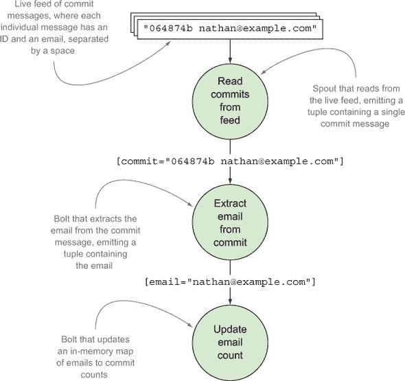

这个设计简单易懂。因此，它为我们提供了一个很好的场景，可以深入研究 Storm 的内部结构。在本章中，我们将做的一件事是展示部署到远程 Storm 集群上的拓扑结构，而不是在本地模式下运行。让我们讨论为什么需要这样做，以及我们的拓扑结构在部署到具有多个工作节点的远程集群时可能看起来是什么样子。

#### 8.1.2\. 将拓扑视为在远程 Storm 集群上运行

将拓扑结构展示为在远程 Storm 集群上运行对于本章至关重要，因为我们要讨论的 Storm 内部结构只存在于远程集群设置中。为此，我们将说我们的拓扑结构运行在两个工作节点上。这样做允许我们解释当元组在同一个工作进程（JVM）内的组件之间传递时以及跨工作进程（从一个 JVM 到另一个 JVM）时会发生什么。图 8.2 展示了两个工作节点以及每个 Spout 和 Bolt 执行的具体位置。这张图应该看起来很熟悉，因为我们曾在第五章中提供了一个类似的假设配置，即信用卡授权拓扑结构。

##### 图 8.2\. 提交计数拓扑在两个工作节点上运行，其中一个工作进程执行 Spout 和 Bolt，另一个工作进程执行 Bolt

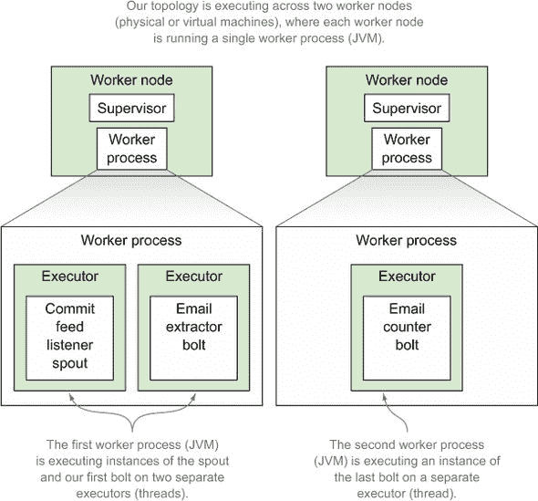

#### 8.1.3\. 集群中 Spout 和 Bolt 之间的数据流

让我们追踪一个元组通过拓扑结构的流动，就像我们在第二章中所做的那样。但与从图 8.1 的视角展示数据流不同，我们将从数据在我们 Spout 和 Bolt 实例之间、执行器和工作进程之间传递的视角展示它（图 8.3）。

##### 图 8.3\. 将拓扑结构中的数据流分解为六个部分，每个部分都突出了执行器内部的不同之处或数据在执行器之间传递的方式

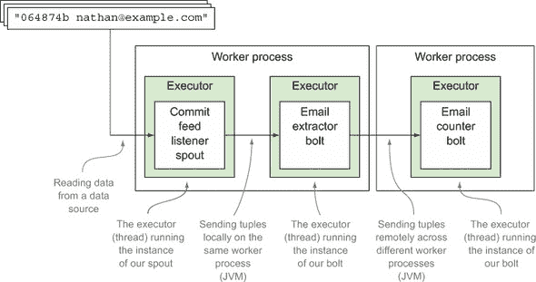

图 8.3 很好地说明了元组如何在单个 JVM（工作进程）内的实例之间以及在不同工作节点之间流动，包括数据流向完全不同的 JVM（工作进程）。将 图 8.3 想象为元组在组件之间传递的 10,000 英尺视图。本章的目标是深入探讨 图 8.3 中发生的事情，所以让我们按照我们场景中执行器内部和之间的数据流进行操作。

### 8.2\. 深入了解执行器的细节

在前面的章节中，我们将执行器描述为在 JVM 上运行的单个线程。这至今为止都对我们很有帮助。在我们日常对自身拓扑的推理中，我们通常也会将执行器抽象到这个层面。但是，执行器不仅仅是单个线程。让我们从我们运行的读取数据源数据的 spout 实例的执行器开始讨论我们所说的这个意思。

#### 8.2.1\. 提交消息监听 spout 的执行器详细信息

数据通过提交消息监听 spout 进入提交计数拓扑，该 spout 监听包含单个提交消息的数据流。图 8.4 展示了我们在拓扑中的数据流位置。

##### 图 8.4\. 专注于流入 spout 的数据

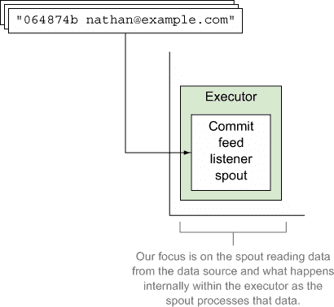

这个执行器比单个线程要复杂一些。它实际上是两个线程和一个队列。第一个线程就是我们所说的 *主线程*，主要负责运行用户提供的代码；在这个例子中，就是我们在 `nextTuple` 中编写的代码。第二个线程是我们将要称为 *发送线程* 的线程，我们将在下一节中简要讨论它，它负责将元组传递到拓扑中的下一个 bolt。

除了两个线程外，我们还有一个用于将发出的元组从执行器中传输出去的单个队列。将这个队列想象成一个执行后-spout 函数。这个队列是为了在执行器之间实现高性能消息传递而设计的。它是通过让队列实现依赖于一个称为 *LMAX Disruptor* 的库来实现的。图 8.5 更详细地展示了我们 spout 的执行器，其中有两个线程和一个队列。

> ¹ LMAX Disruptor 是一个高性能的线程间消息库。它是一个开源项目，可在 [`lmax-exchange.github.io/disruptor`](http://lmax-exchange.github.io/disruptor) 找到。

##### 图 8.5\. Spout 从包含提交消息的队列中读取消息，并将这些消息转换为元组。执行器上的主线程处理发出的元组，将它们传递到执行器的输出队列。

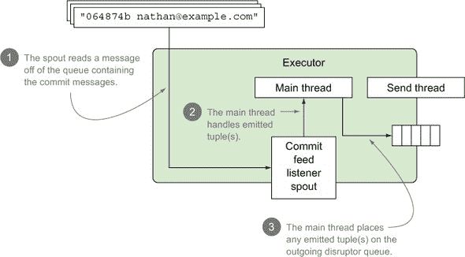

图 8.5 中的插图涵盖了喷泉实例读取的数据和主线程接收喷泉发出的元组并将其放置在输出队列上的情况。没有涵盖的是，一旦发出的元组被放置在输出队列上会发生什么。这就是发送线程发挥作用的地方。

#### 8.2.2. 在同一 JVM 上的两个执行器之间传输元组

我们的元组已经被放置在喷泉的输出 disruptor 队列中。现在怎么办？在我们深入探讨这里发生的事情之前，让我们看一下图 8.6，它显示了我们在拓扑数据流中的位置。

##### 图 8.6. 聚焦于同一 JVM 内传递元组

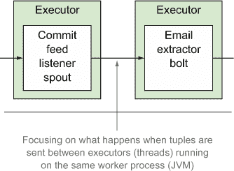

一旦数据被放置在喷泉的输出 disruptor 队列中，发送线程将从这个输出 disruptor 队列中读取该元组，并通过一个**传输函数**将其发送到适当的执行器（们）。

由于提交数据源监听器喷泉和电子邮件提取器螺栓都在同一个 JVM 上，这个传输函数将在执行器之间执行一个**本地传输**。当发生本地传输时，执行器的发送线程直接将输出元组发布给下一个执行器。这里的两个执行器都在同一个 JVM 上，因此在发送过程中几乎没有开销，这使得这种传输函数非常快。这更详细地在本节图 8.7 中说明。

##### 图 8.7. 对提交数据源监听器喷泉和电子邮件提取器螺栓之间元组本地传输的更详细查看

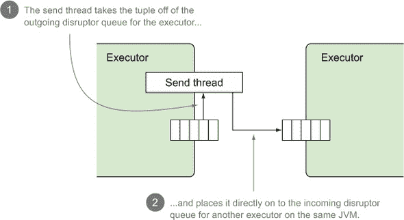

我们的第一个螺栓的执行器是如何直接接收元组的？这将在下一节中介绍，我们将分解电子邮件提取器螺栓的执行器。

#### 8.2.3. 电子邮件提取器螺栓的执行器详细信息

到目前为止，我们已经涵盖了我们的喷泉从数据源中读取提交消息并为每个单独的提交消息发出一个新元组。我们现在处于第一个螺栓，即电子邮件提取器，准备处理传入元组的状态。图 8.8 突出了我们在数据流中的位置。

##### 图 8.8. 聚焦于发射元组的螺栓

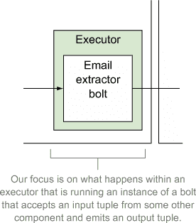

由于我们已经涵盖了喷泉的执行器，您可能对我们的螺栓执行器有一些了解。喷泉和螺栓之间的唯一真正区别是，螺栓的执行器有一个额外的队列：处理传入元组的队列。这意味着我们的螺栓执行器有一个传入的 disruptor 队列和一个主线程，该线程从传入的 disruptor 队列中读取一个元组并处理该元组，从而产生零个或多个要发出的元组。这些发出的元组被放置在输出 disruptor 队列中。图 8.9 详细说明了这些细节。

##### 图 8.9. 我们的螺栓执行器，具有两个线程和两个队列

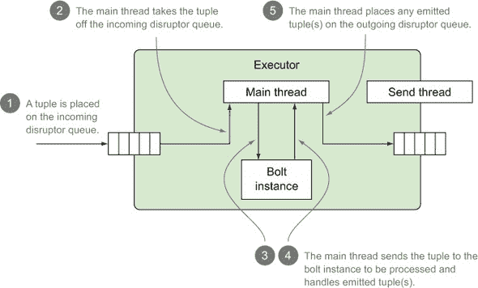

一旦电子邮件提取 bolt 处理完元组，它就准备好发送到下一 bolt，即提交计数 bolt。我们已经讨论了当元组在提交 feed 监听 spout 和电子邮件提取 bolt 之间发送时会发生什么。这是在本地传输中发生的。但是，当在电子邮件提取 bolt 和提交计数 bolt 之间发送数据时，我们处于不同的情境。bolt 实例在不同的 JVM 上运行。让我们接下来讨论这个场景中会发生什么。

#### 8.2.4\. 在不同 JVM 之间传输元组

如我们之前提到的，电子邮件提取 bolt 和提交计数 bolt 在不同的 JVM 上运行。图 8.10 显示了我们的拓扑数据流中我们所在的确切位置。

##### 图 8.10\. 专注于在 JVM 之间发送元组

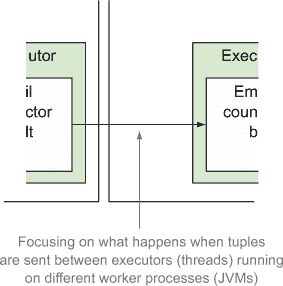

当元组被发送到在单独 JVM 上运行的 executor 时，发送 executor 的发送线程将执行一个*传输函数*，执行我们所说的*远程传输*。远程传输比本地传输更复杂。当 Storm 需要从一个 JVM 向另一个 JVM 发送元组时会发生什么？这个过程的第一步是将我们的元组序列化以进行传输。根据你的元组，这可能是一个相当昂贵的操作。在序列化元组时，Storm 试图查找该对象的 Kryo 序列化器并准备好传输。如果没有 Kryo 序列化器，Storm 将回退到标准的 Java 对象序列化。Kryo 序列化比 Java 序列化更高效，所以如果你关心从你的拓扑中提取每一分性能，你将希望为你的元组注册自定义序列化器。

一旦元组被序列化以进行跨 JVM 传输，我们的 executor 的发送/传输线程将其发布到另一个 disruptor 队列。这个队列是我们整个 JVM 的传输队列。任何时候，这个 JVM 上的 executor 需要将元组传输到其他 JVM 上的 executor 时，那些序列化的元组将被发布到这个队列。

一旦元组进入这个队列，另一个线程，即工作进程的发送/传输线程，将其取走，并通过 TCP 将其发送到目标 JVM。

在目标 JVM 上，另一个线程，即工作进程的接收线程，正在等待接收元组，然后将其传递给另一个函数，即接收函数。工作接收函数，就像 executor 的传输函数一样，负责将元组路由到正确的 executor。接收线程将我们的元组发布到传入的 disruptor 队列中，在那里它可供 executor 的主线程进行处理。整个过程可以在图 8.11 中看到。

##### 图 8.11\. 在不同 JVM 的 executors 之间远程传输元组时发生的步骤

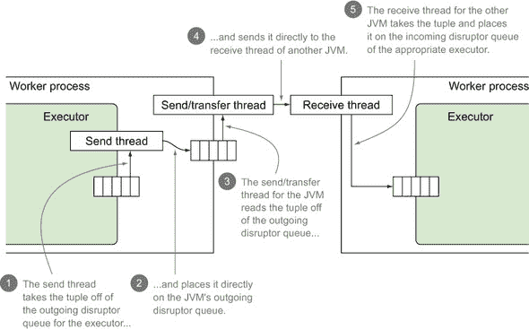

在我们的提交计数示例中，我们的电子邮件提取螺栓从一个提交中提取了一个电子邮件地址，例如 *sean@example.com*，并将其放置在执行器的传输队列中，执行器的发送线程将其拾取并传递给传输函数。在那里，它被序列化以进行传输，并放置在工作者的传输队列中。然后另一个线程拾取传输并将其通过 TCP 发送到我们的第二个工作者，接收线程接受它并通过接收函数将其路由到正确的执行器，将其放置在该执行器的传入 disruptor 队列中。

|  |
| --- |

**关于 Netty 的一些话**

在本节中，我们使用了 *TCP* 这个术语来讨论构成 Storm 集群的 JVM 之间的连接。截至 Storm 的当前版本，网络传输由 Netty 提供，这是一个旨在简化构建高性能异步网络应用程序的强大框架。它拥有丰富的设置，允许你调整其性能。

对于标准的 Storm 安装，你不应该需要调整 Storm 提供的任何 Netty 设置。如果你发现自己遇到了 Netty 性能问题，就像任何其他设置一样，在改变之前准备好测量前后变化。

提供足够的信息，让你能够自信地调整 Netty，超出了本书的范围。如果你对学习 Netty 感兴趣，我们强烈建议你阅读 Netty 贡献者 Norman Maurer 所著的 *Netty in Action*（Manning，2015）。

|  |
| --- |

#### 8.2.5\. 电子计数螺栓的执行器细节

这个螺栓的执行器与我们的前一个螺栓的执行器类似，但由于这个螺栓不发射元组，执行器的发送线程不需要做任何工作。图 8.12 突出了我们在执行器之间元组流中的位置。

##### 图 8.12\. 关注一个不发射元组的螺栓

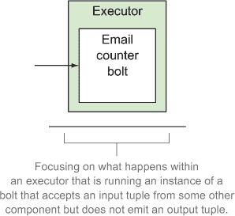

这个执行器内部发生的事情的细节可以在图 8.13 中看到。注意步骤数量减少了，因为我们在这个螺栓中不发射元组。

##### 图 8.13\. 电子计数螺栓的执行器，主线程从传入的 disruptor 队列中拉取一个元组并将其发送到螺栓进行处理

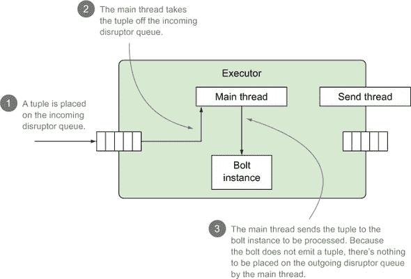

我们的数据现在已经从起始的 spout 流经电子计数螺栓。它的生命周期几乎结束。它将被反序列化并处理，并且该电子邮件地址的计数将被更新。我们的电子计数螺栓不会发射新的元组——它确认其传入的元组。

### 8.3\. 路由和任务

在本书中，我们有时只解释了一些内容，后来又通过省略来承认我们撒了谎，以便解释一个概念的基本原理。因此，我们到目前为止在本章中的解释也是如此。我们省略了一个非常重要的对话部分。但不用担心；现在你已经掌握了 Storm 的核心部分，我们可以讨论 *任务和路由*。

在第三章中，我们介绍了执行器和任务。图 8.14 应该看起来很熟悉——这是分解工作节点作为一个运行执行器并带有任务（spout/bolt 实例）的 JVM 的图，但更新了你对执行器如何工作的当前理解。

##### 图 8.14. 一个工作进程及其内部线程和队列，以及执行器及其内部线程、队列和任务

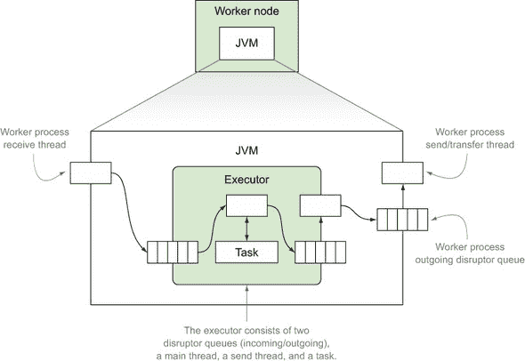

让我们更深入地探讨一下任务。正如我们在第三章中所述，执行器可以有一个或多个任务，其中执行器负责“执行”任务中用户逻辑。当执行器有多个任务（图 8.15）时，这是如何工作的？

##### 图 8.15. 具有多个任务的执行器

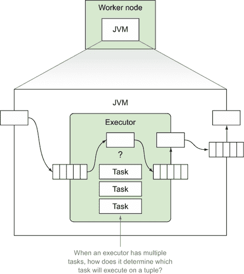

这就是路由介入的地方。在这个上下文中，“路由”指的是工作进程的接收线程（远程传输）或执行器的发送线程（本地传输）如何将一个元组发送到其正确的下一个位置（任务）。这是一个多步骤的过程，通过具体的例子会更容易理解。我们将使用电子邮件提取器作为例子。图 8.16 展示了电子邮件提取器的主线程运行`execute`方法并发出一个元组之后发生的情况。

##### 图 8.16. 确定发出的元组的目标任务时采取的步骤

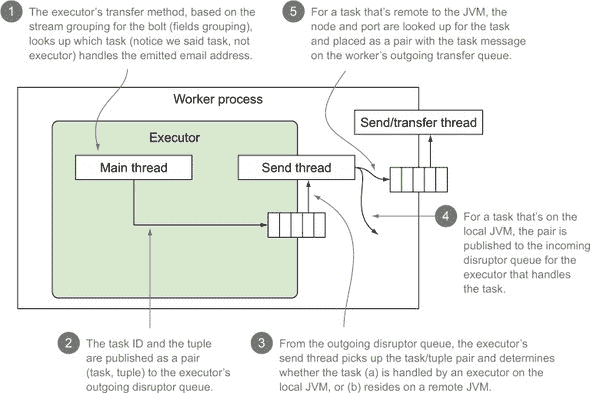

图 8.16 应该看起来有些熟悉。它包括我们一直在讨论的一些内部队列和线程，以及确定哪个任务应该执行发出的元组时采取的步骤的注释。该图引用了一个任务 ID 和元组对，它以`TaskMessage`类型对象的格式出现：

```
public class TaskMessage {
  private int _task;
  private byte[] _message;
  ...
}
```

这就结束了我们对 Storm 内部队列的解释。现在，我们将继续讨论这些队列可能发生的溢出以及解决这种溢出的一些方法。

### 8.4. 知道 Storm 内部队列何时溢出

在相对较短的时间内，我们已经涵盖了大量的内容。到现在，你应该已经对构成执行器的内容有了相当的了解。但在我们深入调试日志的细节之前，我们想让你回顾一下我们之前讨论的 Storm 内部三个队列。

#### 8.4.1. 内部队列的各种类型以及它们可能发生的溢出

在我们讨论执行器时，我们确定了 Storm 内部三个队列：

+   执行器的输入队列

+   执行器的输出队列

+   工作节点上存在的输出队列

我们喜欢谈论故障排除和可能出错的情况，因此我们提出问题：要使每个队列溢出需要什么？

好吧。花一分钟时间。我们会等待。对于一个队列要溢出，任何产生并进入队列的数据都必须以比其被消费更快的速度生成。我们想要关注的是生产者和消费者之间的关系。我们将从查看执行器的输入队列开始。

##### 执行器的输入队列

此队列接收来自拓扑中 preceding spout/bolt 的元组。如果 preceding spout/bolt 产生元组的速率比消费 bolt 处理它们的速率快，你将遇到溢出问题。

元组将遇到的下一个队列是执行器的输出传输队列。

##### 执行器的输出传输队列

这个有点复杂。这个队列位于执行器的主线程（执行用户逻辑）和负责将元组路由到下一个任务的传输线程之间。为了使这个队列出现拥堵，你需要以比元组路由、序列化等更快的速度处理传入的元组。这是一个相当高的要求——我们实际上从未遇到过这种情况——但我们确信有人遇到过。

如果我们处理的是要传输到另一个 JVM 的元组，我们将遇到第三个队列，即工作进程的输出传输队列。

##### 工作进程的输出传输队列

此队列接收来自工作进程中所有执行器、旨在发送到另一个不同工作进程的元组。考虑到工作进程内部有足够的执行器产生需要通过网络发送到其他工作进程的元组，你可能会溢出此缓冲区。但你可能需要付出很大努力才能做到这一点。

如果你开始溢出这些缓冲区之一，会发生什么？Storm 将溢出的元组放置在（希望是）临时的溢出缓冲区中，直到给定队列上有空间。这将导致吞吐量下降，并可能导致拓扑停止运行。如果你使用的是将元组均匀分配到任务中的 shuffle 分组，这应该是一个问题，你可以使用第六章（chapter 6）中的调整技术或第七章（chapter 7）中的故障排除技巧来解决。

如果你没有在任务之间均匀分配元组，宏观层面上的问题将更难发现，并且第六章（chapters 6）和第七章（chapters 7）中的技术可能无法帮助你。那么你该怎么办？首先，你需要知道如何判断缓冲区是否溢出以及可以采取哪些措施。这正是 Storm 的调试日志能提供帮助的地方。

#### 8.4.2\. 使用 Storm 的调试日志诊断缓冲区溢出

要查看 Storm 的内部缓冲区是否溢出，最佳位置是 Storm 日志中的调试日志输出。图 8.17 展示了 Storm 日志文件中的一个示例调试条目。

##### 图 8.17\. 执行器实例的调试日志输出快照

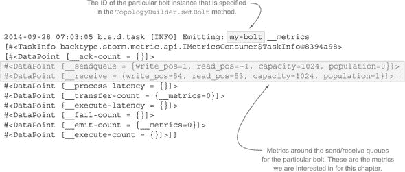

在图 8.17 中，我们突出显示了与发送/接收队列相关的行，分别提供了每个队列的指标。让我们更详细地看看这些行。

图 8.18 中的示例显示了两个几乎不会溢出的队列，但应该很容易判断它们是否溢出。假设你正在使用洗牌分组来将元组均匀地分配到 bolt 和任务中，检查任何 bolt 的任何任务的值应该足以确定你接近容量有多近。如果你使用的是不会均匀分配元组到 bolt 和任务的分组，你可能会更难快速发现问题。不过，一点自动化的日志分析应该能帮你找到需要的地方。日志条目的模式已经建立，提取每个条目并查找达到或接近容量的值，将是一个构建和使用适当工具的问题。

##### 图 8.18\. 分解发送/接收队列指标的调试日志输出行

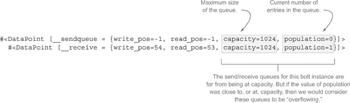

现在你已经知道如何确定 Storm 的内部队列中是否有溢出，我们将向你展示一些停止溢出的方法。

### 8.5\. 解决内部 Storm 缓冲区溢出问题

你可以通过四种主要方式之一来解决内部 Storm 缓冲区溢出问题。这些选项不是非此即彼的——你可以根据需要混合使用，以解决问题：

+   调整生产到消费的比例

+   增加所有拓扑的缓冲区大小

+   增加给定拓扑的缓冲区大小

+   设置最大 spout 挂起数

让我们逐一介绍，首先是调整生产到消费的比例。

#### 8.5.1\. 调整生产到消费的比例

减少元组的生成速度或增加消费速度是处理缓冲区溢出的最佳选择。你可以降低生产者的并行度或提高消费者的并行度，直到问题消失（或者变成另一个问题！）！除了调整并行度之外，还可以检查消费 bolt（在`execute`方法内部）中的用户代码，找到使其运行更快的方法。

对于执行器缓冲区相关的问题，有很多原因说明调整并行度并不能解决问题。除了洗牌分组之外的其他流分组可能会导致一些任务处理比其他任务多得多的数据，导致它们的缓冲区比其他任务更活跃。如果分布特别不均匀，你可能会因为添加大量消费者来处理最终是数据分布问题的情况而出现内存问题。

当处理溢出的工作传输队列时，“增加并行性”意味着添加更多的工作进程，从而（希望）降低执行器到工作进程的比例，减轻工作传输队列的压力。然而，数据分布问题仍然可能出现。如果你添加了另一个工作进程后，大多数元组都绑定到同一工作进程的任务上，那么你并没有获得任何好处。

当你不均匀地分配元组时，调整生产到消费的比例可能会很困难，而你获得的所有收益可能会因为输入数据形状的变化而丢失。尽管你可能通过调整比例获得一些效果，但如果你不依赖于 shuffle 分组，我们其他三个选项中可能更有助于你。

#### 8.5.2\. 增加所有拓扑的缓冲区大小

我们会诚实地告诉你：这是一种用大炮打苍蝇的方法。每个拓扑都需要增加缓冲区大小的可能性很低，你可能不想在整个集群中更改缓冲区大小。话虽如此，也许你有一个非常好的理由。你可以通过调整以下 storm.yaml 中的值来更改拓扑的默认缓冲区大小：

+   所有执行器的输入队列的默认大小可以通过`topology.executor.receive.buffer.size`的值进行更改

+   所有执行器的输出队列的默认大小可以通过`topology.executor.send.buffer.size`的值进行更改

+   工作进程的输出传输队列的默认大小可以通过`topology.transfer.buffer.size`的值进行更改

需要注意的是，你设置任何 disruptor 队列缓冲区大小的值都必须是 2 的幂——例如，2、4、8、16、32 等等。这是 LMAX disruptor 强制要求的。

如果你不想更改所有拓扑的缓冲区大小，并且需要更细粒度的控制，那么增加单个拓扑的缓冲区大小可能是你想要的选项。

#### 8.5.3\. 增加特定拓扑的缓冲区大小

单个拓扑可以覆盖集群的默认值，并为任何 disruptor 队列设置自己的大小。这是通过在提交拓扑时传递给`StormSubmitter`的`Config`类来完成的。与前面的章节一样，我们一直在将此代码放置在`RemoteTopologyRunner`类中，如下所示。

##### 列表 8.1\. `RemoteTopologyRunner.java`带有增加缓冲区大小的配置

```
publc class RemoteTopologyRunner {
  public static void main(String[] args) {
    ...

    Config config = new Config();
    ...
    config.put(Config.TOPOLOGY_EXECUTOR_RECEIVE_BUFFER_SIZE,
               new Integer(16384));
    config.put(Config.TOPOLOGY_EXECUTOR_SEND_BUFFER_SIZE,
               new Integer(16384));
    config.put(Config.TOPOLOGY_TRANSFER_BUFFER_SIZE,
               new Integer(32));

    StormSubmitter.submitTopology("topology-name",
                                  config,
                                  topology);
  }
}
```

这就带我们来到了我们的最后一个选项（这也是你应该熟悉的）：设置最大 spout 挂起数。

#### 8.5.4\. 最大 spout 挂起数

我们在第六章中讨论了最大 spout 挂起数。如您所回忆的那样，*最大 spout 挂起数*限制了任何给定的 spout 在任何时候在拓扑中保持活跃的元组数量。这如何帮助防止缓冲区溢出？让我们尝试一些数学计算：

+   单个 spout 的最大 spout 挂起数为 512。

+   最小的干扰器具有 1024 的缓冲区大小。*512 < 1024*

假设你的所有 bolt 不会创建比它们消耗更多的元组，那么在拓扑中不可能有足够的元组在游戏中以溢出任何给定的缓冲区。如果你有一些 bolt 消耗单个元组但发射可变数量的元组，这个数学可能会变得复杂。这里有一个更复杂的例子：

+   单个 spout 的最大 spout 待处理数量为 512。

+   最小的干扰器具有 1024 的缓冲区大小。

我们的一个 bolt 只接受一个元组并发射 1 到 4 个元组。这意味着我们的 spout 在某个时间点将发射的 512 个元组可能导致拓扑中从 512 到 2048 个元组在游戏中。或者换句话说，我们可能会遇到缓冲区溢出问题。不考虑缓冲区溢出，设置 spout 的最大 spout 待处理值是一个好主意，并且应该始终这样做。

在解决了处理缓冲区溢出的四种解决方案之后，我们将把注意力转向调整这些缓冲区的大小，以便在 Storm 拓扑中获得最佳性能。

### 8.6. 调整缓冲区大小以获得性能提升

许多博客文章都在流传，详细介绍了基于部分更改 Storm 内部干扰器缓冲区大小的性能指标。在这个章节中，我们不应该不讨论这个性能调整方面。但首先，有一个警告：Storm 有许多内部组件，其配置通过 storm.yaml 和程序性方式公开。我们在第 8.5 节中提到了一些。如果你找到一个设置但不知道它做什么，不要更改它。先进行研究。在一般上了解你正在更改的内容，并考虑它可能如何影响吞吐量、内存使用等。在你能够监控你更改的结果并验证你得到了期望的结果之前，不要更改任何内容。

最后，请记住 Storm 是一个复杂的系统，每次额外的更改都是基于之前的更改。你可能有两个不同的配置更改——让我们称它们为 A 和 B——它们独立地导致期望的性能变化，但结合在一起会导致退化的变化。如果你按照 A 然后是 B 的顺序应用它们，你可能会认为 B 是一个较差的更改。但这可能并不正确。让我们提出一个假设场景来展示我们的意思：

+   改变 A 导致吞吐量提高 5%。

+   改变 B 会导致吞吐量提高 10%。

+   改变 A 和 B 会导致吞吐量下降 2%。

理想情况下，你应该使用更改 B，而不是更改 A，以获得最佳性能。务必独立测试更改。准备以累加的方式测试，将更改 B 应用到已经包含 A 的现有配置中，以及将 B 应用到“标准”Storm 配置中。

所有这些假设都是基于你需要从你的拓扑中榨取每一丝性能。我们给你透露一个秘密：我们很少这样做。我们花足够的时间在给定的拓扑中获取可接受的性能，然后结束工作，继续其他任务。我们怀疑你们大多数人也会这样做。这是一个合理的做法，但我们仍然觉得，如果你正在增加你的 Storm 使用量，了解各种内部机制，开始调整、设置和理解它们如何影响性能是很重要的。阅读关于它是回事——亲自体验则是完全不同的。

这就结束了我们对 Storm 内部机制的章节。我们希望你在了解 Storm 内部缓冲区“幕后”发生的事情、这些缓冲区可能如何溢出、如何处理溢出以及一些关于如何进行性能调整的想法方面找到了一些价值。接下来，我们将转换话题，介绍 Storm 的高级抽象：Trident。

### 8.7. 概述

在本章中，你了解到

+   执行器不仅仅是单个线程，它由两个线程（主/发送者）以及两个中断队列（输入/输出）组成。

+   在同一 JVM 上的执行器之间发送元组既简单又快速。

+   工作进程有自己的发送/传输线程、输出队列和接收线程，用于处理在 JVM 之间发送元组。

+   每个内部队列（缓冲区）都可能溢出，导致你的 Storm 拓扑中的性能问题。

+   每个内部队列（缓冲区）都可以配置以解决任何潜在的溢出问题。
