## 第九章\. Trident

本章涵盖

+   Trident 及其为何有用

+   将 Trident 操作和流作为一系列批处理元组

+   Kafka，其设计以及如何与 Trident 相匹配

+   实现 Trident 拓扑

+   使用 Storm 的分布式远程过程调用（DRPC）功能

+   通过 Storm UI 将原生 Storm 组件映射到 Trident 操作

+   扩展 Trident 拓扑

在《Storm 应用》中我们已经走得很远了。早在第二章中，我们就介绍了 Storm 的基本抽象：bolt、spout、元组和流。在前六章中，我们深入探讨了这些基本抽象，涵盖了高级主题，如保证消息处理、流分组、并行性以及更多。第七章提供了一种烹饪法来识别各种类型的资源竞争，而第八章则带你进入 Storm 基本抽象之下的抽象层次。理解所有这些概念对于掌握 Storm 至关重要。

在本章中，我们将介绍 Trident，这是位于 Storm 基本抽象之上的高级抽象，并讨论它如何允许你用“是什么”而不是“怎么做”来表述拓扑。我们将在一个最终用例的背景下解释 Trident：一个互联网广播应用程序。但与我们在前几章中一样，我们从解释 Trident 开始。因为 Trident 是一个高级抽象，我们在设计用例解决方案之前理解这个抽象是有意义的，因为这种理解可能会影响我们互联网广播拓扑的设计。

本章将从解释 Trident 及其核心操作开始。然后，我们将讨论 Trident 如何处理流作为一系列批次，这与原生的 Storm 拓扑不同，以及为什么 Kafka 是 Trident 拓扑的完美匹配。到那时，我们将为我们的互联网广播应用程序制定一个设计，然后是相关的实现，其中包括 Storm 的 DRPC 功能。一旦我们有了实现，我们将讨论扩展 Trident 拓扑。毕竟，Trident 只是一个抽象，但最终结果仍然是一个必须调整和优化以实现最佳性能的拓扑。

不再拖延，我们将向您介绍 Trident，这是位于 Storm 基本抽象之上的抽象。

### 9.1\. 什么是 Trident？

Trident 是建立在 Storm 基本抽象之上的抽象。它允许你用“是什么”（声明式）而不是“怎么做”（命令式）来表述拓扑。为了实现这一点，Trident 提供了诸如连接、聚合、分组、函数和过滤器等操作，并提供在任意数据库或持久化存储上执行有状态、增量处理的原语。如果你熟悉像 Pig 或 Cascading 这样的高级批处理工具，Trident 的概念对你来说将是熟悉的。

使用 Storm 表达计算，用你想要完成的“是什么”而不是“如何”来表示，这意味着什么？我们将通过查看我们在第二章 [kindle_split_010.html#ch02] 中构建的 GitHub 提交计数拓扑以及将其与这个拓扑的 Trident 版本进行比较来回答这个问题。你可能还记得，第二章 [kindle_split_010.html#ch02] 中 GitHub 提交计数拓扑的目标是从包含电子邮件的提交消息流中读取，并跟踪每个电子邮件的提交计数。

第二章 以如何按电子邮件计数提交消息的术语描述了 GitHub 提交计数拓扑。这是一个机械的、命令式的过程。下面的列表显示了构建此拓扑的代码。

##### 列表 9.1\. 构建 GitHub 提交计数 Storm 拓扑

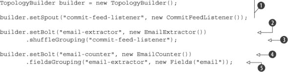

通过查看这个拓扑的构建方式，你可以看到我们  将一个 spout 分配给拓扑以监听提交消息， 定义我们的第一个 bolt 从每个提交消息中提取电子邮件， 告诉 Storm 元组如何在我们的 spout 和第一个 bolt 之间发送， 定义我们的第二个 bolt，它保持电子邮件数量的运行计数，并以  结尾，在那里我们告诉 Storm 元组如何在我们的两个 bolt 之间发送。

这同样是一个机械的过程，一个特定于“我们如何”解决提交计数问题的过程。列表中的代码易于理解，因为拓扑本身并不复杂。但是，当查看更复杂的 Storm 拓扑时，可能就不是这样了；在更高层次上理解正在执行的操作可能会变得困难。

这就是 Trident 如何帮助的地方。通过其“连接”、“分组”、“聚合”等概念，我们在比 bolt 或 spout 更高的层次上表达计算，这使得理解正在执行的操作变得更容易。让我们通过查看 GitHub 提交计数拓扑的 Trident 版本来展示我们的意思。注意在下面的列表中，代码更多地以我们正在做的“是什么”而不是“如何”执行来表达。

##### 列表 9.2\. 构建 GitHub 提交计数 Trident 拓扑

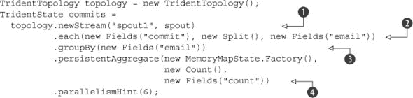

一旦你理解了 Trident 的概念，理解我们的计算就比如果我们用 spouts 和 bolts 来表示它要容易得多。即使没有对 Trident 有太多的理解，我们也可以看到我们  创建一个从 spout 来的流，对于流中的每个条目 ，我们将`commit`字段分割成多个`email`字段条目，将类似的电子邮件分组 ，并持久化电子邮件的数量 。

如果我们遇到这个列表中的代码，与迄今为止使用的 Storm 原语等价的代码相比，我们会更容易理解正在发生的事情。我们以更接近纯“是什么”的水平表达我们的计算，其中混合了更少的“如何”。

列表中的代码涉及了 Trident 的一些抽象，这些抽象可以帮助你编写表达“是什么”而不是“如何做”的代码。让我们看看 Trident 提供的操作的全范围。

#### 9.1.1. 不同类型的 Trident 操作

我们对使用 Trident 以“是什么”而不是“如何做”的方式来表达我们的代码有一个模糊的概念。在前一节的代码中，我们有一个 Trident spout 发出一个流，该流将被一系列 Trident 操作转换。这些操作的组合构成了一个 Trident 拓扑。

这听起来与建立在 Storm 原始操作（spouts 和 bolts）之上的 Storm 拓扑相似，但不同的是，我们用 Trident spout 替换了 Storm spout，用 Trident 操作替换了 Storm bolts。这种直觉是不正确的。重要的是要理解 Trident 操作并不直接映射到 Storm 原始操作。在原生的 Storm 拓扑中，你在一个执行你的操作（s）的 bolt 中编写你的代码。你得到的是一个 bolt 的执行单元，你可以在其中自由地做任何你想做的事。但与 Trident 不同，你没有这种灵活性。你提供了一系列标准操作，并需要找出如何将你的问题映射到这些标准操作之一或多个，很可能是将它们链接在一起。

可用的不同 Trident 操作很多，你可以使用它们来实现你的功能。从高层次来看，它们可以列出如下：

+   ***函数*—** 对进入的元组进行操作并发出一个或多个相应的元组。

+   ***过滤器*—** 决定保留或过滤掉从流中进入的元组。

+   ***分割*—** 分割流将导致多个具有相同数据和字段的流。

+   ***合并*—** 只有当流具有相同的字段（相同的字段名称和相同数量的字段）时，才能合并流。

+   ***连接*—** 连接用于具有大部分不同字段的不同流，除了一个或多个用于连接的公共字段（类似于 SQL 连接）。

+   ***分组*—** 在分区内部按特定字段（s）进行分组（关于分区的更多内容稍后讨论）。

+   ***聚合*—** 对元组集进行计算。

+   ***状态更新器*—** 将元组或计算值持久化到数据存储。

+   ***状态查询*—** 查询数据存储。

+   ***重新分区*—** 通过对特定字段（类似于字段分组）进行哈希或以随机方式（类似于洗牌分组）重新分区流。通过某些特定字段进行重新分区与分组不同，因为重新分区发生在所有分区上，而分组发生在单个分区内。

将你的问题表示为一系列这些操作，可以使你比本地 Storm 原语允许的更高层次地思考和推理。这也使得将这些不同操作连接在一起的 Trident API 感觉更像是一种领域特定语言（DSL）。例如，假设你有一个需要将计算结果保存到数据存储的步骤。在那个步骤中，你会连接一个*状态更新器*操作。无论该状态更新器操作是写入 Cassandra、Elasticsearch 还是 Redis，这都完全无关紧要。实际上，你可以有一个写入 Redis 的状态更新器操作，并在不同的 Trident 拓扑之间共享它。

希望你已经开始理解 Trident 提供的抽象类型。现在不必担心这些各种操作是如何实现的。当我们深入研究我们的互联网广播拓扑的设计和实现时，我们很快就会介绍这一点。但在我们开始设计该拓扑之前，我们需要覆盖一个额外的主题：Trident 如何处理流。这与本地 Storm 拓扑处理流的方式根本不同，并将影响我们互联网广播拓扑的设计。

#### 9.1.2. Trident 流作为一系列批次

Trident 拓扑与本地 Storm 拓扑之间的一个基本区别是，在 Trident 拓扑中，流被处理为元组批次，而在本地 Storm 拓扑中，流被处理为一系列单个元组。这意味着每个 Trident 操作处理一个元组批次，而每个本地 Storm bolt 在单个元组上执行。图 9.1 提供了这个概念的说明。

##### 图 9.1。Trident 拓扑在元组批次流上操作，而本地 Storm 拓扑在单个元组流上操作。

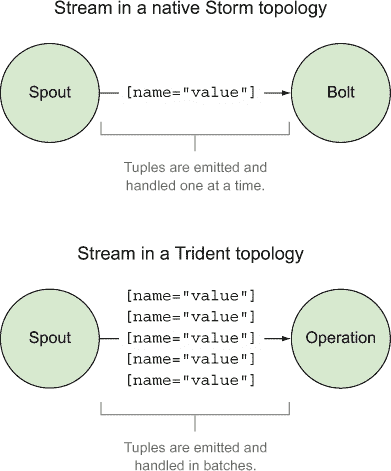

因为 Trident 将流视为元组批次，所以它属于第一章中讨论的微批处理工具类别。正如你从那一章中回忆起来的，微批处理是批处理和流处理之间的混合体。

这种在 Trident 中将流视为一系列批次的根本区别，是为什么在 Trident 中存在操作而不是 bolt 的原因。我们以流及其可以应用于该流的操作系列来思考。在第 9.1.1 节中讨论的操作将修改流中流动的元组或流本身。为了理解 Trident，你必须理解 Trident 中的流和操作。

接下来，我们将讨论一个非常适合与 Trident 一起使用的消息队列实现。它与 Trident 的需求如此接近，以至于它被捆绑在 Storm 中，以便与 Trident 拓扑一起使用。

### 9.2. Kafka 及其在 Trident 中的作用

当涉及到作为输入源的消息队列时，Storm 与 Apache Kafka 保持着独特的关系。这并不意味着不能使用其他消息队列技术。我们在整本书中都非常小心地指出 Storm 如何与多种不同的技术一起使用，例如 RabbitMQ 和 Kestrel。是什么让 Kafka 与其他消息代理实现不同？这归结于 Kafka 创建过程中的核心架构决策。为了帮助您理解为什么 Kafka 与 Trident 非常匹配，我们将简要讨论 Kafka 的设计，然后讨论该设计的哪些特性与 Trident 非常吻合。

#### 9.2.1\. 拆解 Kafka 的设计

本节将简要探讨 Kafka 的设计，但仅限于您理解为什么它与 Storm 和 Trident 相关。

| |
| --- |

##### 注意

在本章中，我们使用了一些标准的 Kafka 术语。其中两个更常用的术语是 1) *主题*，它是一个特定类别的消息源，2) *代理*，它是一个服务器/节点，通常在 Kafka 集群中运行的一个多个节点之一。

| |
| --- |

Kafka 网站以两种方式描述自己，这两种方式都作为为什么设计适合 Trident 的线索：

+   它是一个发布-订阅消息代理，重新构想为一个 *分布式提交日志*。

+   它是一个分布式、分区、复制的提交日志服务，提供消息系统的功能，但具有独特的设计。

让我们逐一讨论这些内容，因为理解这些基本的设计决策将帮助您了解 Kafka 如何与 Trident 对齐。

##### 分区以分发 Kafka 主题

当消息生产者向 Kafka 主题写入消息时，它会将该主题的特定分区中的给定消息写入。一个 *分区* 是一个有序的、不可变的消息序列，它不断地被追加。一个主题可以有多个分区，这些分区可以分布在多个 Kafka 代理上。消息消费者将读取每个分区，以查看整个主题。图 9.2 展示了一个主题如何分布到多个分区。

##### 图 9.2\. Kafka 主题的分布，作为多个 Kafka 代理上的分区组

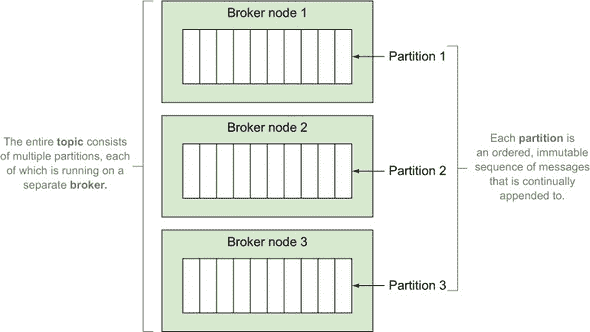

通过对主题进行分区，Kafka 获得了将单个主题扩展到单个代理（节点）之外的能力，无论是读取还是写入。每个分区还可以进行复制以提供容错性。这意味着如果您为分区有 `n` 个副本，您可以在不遭受任何数据丢失的情况下丢失多达 `n – 1` 个副本。

在 Trident 中，理解多个分区以及能够扩展这些分区是非常重要的概念。正如您将在本章后面看到的那样，这与 Trident 读取流数据的拓扑方式非常吻合。但在我们继续前进之前，我们应该更详细地阐述 Kafka 如何存储消息。

##### 将存储建模为提交日志

Kafka 用于主题内消息的存储模型在性能和功能特性方面都提供了许多优势。我们从上一节中了解到，分区是文件系统上有序、不可变的消息序列。这代表了一个提交日志。分区内的每条消息都被分配了一个顺序标识符，称为*偏移量*，它标记了每条消息在提交日志中的存储位置。

Kafka 还维护分区内的消息顺序，因此当单个消费者从分区读取时，可以保证强顺序。从特定分区读取消息的消息消费者将维护其当前位置的引用，这被称为该消费者在提交日志中的偏移量。图 9.3 说明了多个分区的偏移量。

##### 图 9.3。一个分区包含一个不可变、有序的消息序列，其中读取这些消息的消费者维护其读取位置的偏移量。

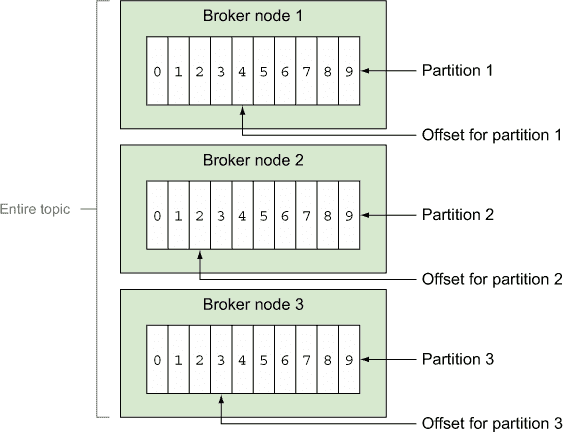

Kafka 在消费者推进偏移量后不会丢弃消息；它们会被保留在日志中一段时间（例如 24 小时或 7 天）。一旦这个时间间隔过去，Kafka 将压缩日志并清除任何较旧的条目。

您现在应该对 Kafka 的设计工作原理有一个大致的了解。主题充当特定类别的消息源。然后，这个主题可以被分解成多个分区，这些分区是不可变、有序的消息序列。这些分区可以分布在 Kafka 集群的不同代理上。我们现在将详细阐述一些关于功能和性能方面的设计优势。

##### Kafka 设计的功能和性能优势

此设计的功能优势包括以下内容：

+   由于消息不会立即被丢弃，并且消费者决定何时或何时不推进其提交日志中的偏移量，因此很容易从 Kafka 重新播放任何消息。

+   类似地，如果您的消费者长时间落后，并且由于某些消费截止日期的要求，不再有消费这些排队消息的意义，那么通过将偏移量向前推进一大步到新的读取位置来跳过所有过期的消息就变得容易了。

+   如果您的消费者以批量的方式处理消息，并且需要一次性完成整个批次或者根本不完成，这可以通过一次性推进一个分区中一系列消息的偏移量来实现。

+   如果您有不同需要订阅同一主题中相同消息的应用程序，消费者可以轻松地从该主题的相同分区集中读取这些不同的应用程序。这是因为消息在第一个消费者处理完毕后并不会被丢弃，而是消费者控制其自己的提交日志中的偏移量。

+   另一方面，如果你想确保只有单个消费者消费每条消息，你可以通过将单个消费者实例固定到特定主题的特定分区来实现。

性能优势包括以下方面：

+   无论你的消息总线最终是由消息生产者还是消息消费者造成的瓶颈，这个瓶颈都可以通过增加分区数量来轻松解决。

+   提交日志的顺序和不可变特性，以及消费者偏移量推进模式的顺序特性（在大多数情况下），为我们带来了许多性能提升：

    +   磁盘访问通常成本较高，但在大多数情况下，这是由于大多数应用程序中普遍存在的随机访问特性。由于 Kafka 从头开始设计就是为了利用文件系统中数据的顺序访问，现代操作系统将通过预读缓存和写后缓存来高效地利用这一点，从而在性能提升上取得大幅进步。

    +   Kafka 充分利用了操作系统的磁盘缓存。这使得 Kafka 能够避免在进程内维护昂贵的缓存，并免受垃圾收集压力的影响。

我们对 Kafka 的一般设计和它提供的优势，包括功能性和性能相关的优势，已经有了相当的了解。现在是时候确定 Kafka 如何与 Trident 兼容，使其成为 Trident 如此优秀的选择，以至于它现在与 Storm 捆绑在一起。

#### 9.2.2. Kafka 与 Trident 的兼容性

你可能能够想象到 Storm 如何从 Kafka 的功能性和性能优势中受益。Kafka 提供的性能优势比其竞争对手高出一个数量级。仅凭这一点，Kafka 就成为了原生 Storm 的首选消息总线。但是，当与 Trident 一起使用时，它作为消息实现的优秀选择的原因就很明显了：

+   由于 Trident 在流中执行微批处理，它依赖于能够原子性地管理一个元组批次。通过允许 Trident 推进其消费者偏移量，Kafka 支持这一功能。

+   消息不会被丢弃，因此通过回滚偏移量，你可以从任何时间点（直到 Kafka 的日志过期时间间隔）重新播放消息。这使得 Kafka 能够作为一个可靠的数据源，你可以在此基础上构建一个可靠的 spout，无论是对于 Trident 还是原生 Storm。

+   正如我们稍后将要看到的，Trident 可以使用 Kafka 分区作为 Trident 拓扑内部并行化的主要手段。

+   为 Kafka 实现的 Storm spout 可以在 Zookeeper 中维护不同分区的消费者偏移量，因此当你的 Storm 或 Trident 拓扑重启或重新部署时，你可以从上次停止的地方继续处理。

让我们暂停一下，看看我们已经涵盖了哪些内容。到目前为止，你应该理解以下内容：

+   Trident 在 Storm 的原始操作之上提供了一个抽象层，允许你编写表达“做什么”而不是“如何做”的代码。

+   Trident 流被处理为一组元组的批次，而不是单个元组，一次一个。

+   Trident 有操作，而不是螺栓，可以应用于流。这些操作包括函数、过滤器、拆分、合并、连接、分组、聚合、状态更新器、状态查询和重新分区。

+   Kafka 是适用于 Trident 顶点的理想队列实现。

我们终于准备好深入我们的用例，并将所有这些 Trident 原则应用于我们的设计和实现。当我们通过用例时，请尝试记住 Trident 的操作以及它是如何处理流的，因为这将有助于指导我们的设计。

### 9.3\. 问题定义：互联网广播

假设我们想要创办一家互联网广播公司。我们希望对艺术家通过我们的互联网广播平台流过的音乐支付公平的版税。为此，我们决定跟踪艺术家个人歌曲的播放次数。这些计数可以稍后用于报告和分配版税。除了支付版税外，我们还有相当雄心勃勃，希望能够查询/报告用户偏好的音乐类型，以便在用户使用我们的应用程序时提供最佳体验。

我们的用户将在各种设备和网页上收听我们的互联网广播。这些应用程序将收集“播放日志”并将这些信息发送给我们，以便从我们的 Trident spout 流入我们的拓扑。

拿着这个问题定义，让我们来看看起始和结束的数据点，就像我们在前面的章节中所做的那样。

#### 9.3.1\. 定义数据点

对于我们的场景，每个播放日志将作为包含艺术家、歌曲标题和与歌曲相关的标签列表的 JSON 流入我们的拓扑。下面的列表提供了一个单个播放日志的示例。

##### 列表 9.3\. 样本播放日志流条目

```
{
  "artist": "The Clash",
  "title": "Clampdown",
  "tags": ["Punk","1979"]
}
```

播放日志 JSON 给我们提供了数据的起点。我们希望持久化三种不同类型的计数：按艺术家、标题和标签的计数。Trident 提供了一个 `TridentState` 类，我们将用它来完成这个任务。我们将在稍后更深入地了解 `TridentState`——现在重要的是你要理解我们开始的数据以及我们想要达到的目标。

数据定义后，下一步是定义一系列步骤，我们需要从播放日志的流到存储在 `TridentState` 实例中的计数。

#### 9.3.2\. 将问题分解为一系列步骤

我们已经确定我们将从一个播放日志开始，以艺术家、标题和标签的计数结束。在形成一个概念解决方案时，我们需要确定我们开始和结束之间的所有步骤。

记得我们之前在讨论用例设计时提到要记住各种 Trident 操作吗？这就是我们将查看这些操作并确定哪些在我们的场景中合理的地方。我们最终得到以下结果：

1.  一个发出 Trident 流的喷口。记住，Trident 流由元组批次组成，而不是单个元组。

1.  一个将传入的播放日志反序列化（分割）成艺术家、标题和标签元组批次的函数。

1.  分别为艺术家、标题和标签分别计数的功能。

1.  Trident 状态通过艺术家、标题和标签分别持久化计数。

这些步骤在图 9.4 中得到了说明，该图说明了我们的设计目标。接下来，我们需要实现将应用于包含播放日志的元组批次流的 Trident 操作的代码。

##### 图 9.4\. 互联网广播应用的 Trident 拓扑

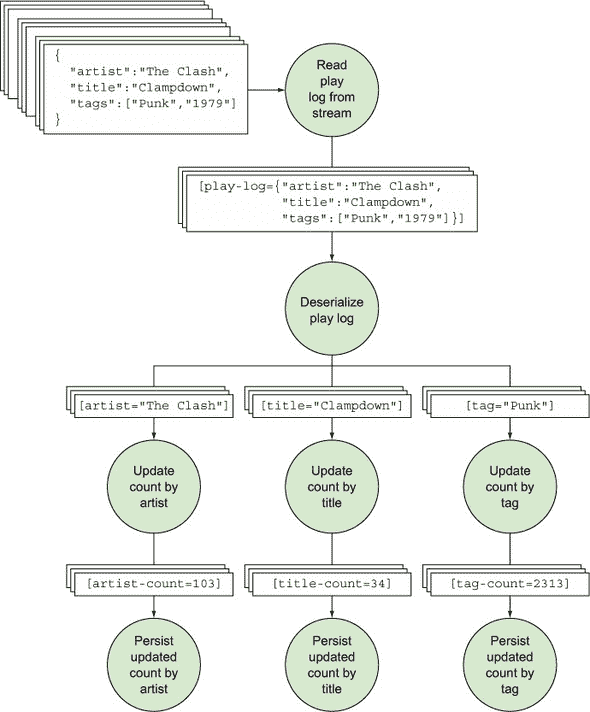

### 9.4\. 将互联网广播设计实现为 Trident 拓扑

到目前为止，我们已经准备好实现一个符合我们在图 9.4 中建立的设计目标的 Trident 拓扑。当你开始通过实现进行时，你会注意到我们拓扑的大部分代码都在拓扑构建器类（`TopologyBuilder`）中处理。虽然我们确实实现了一些用于操作的函数，但你将在`TopologyBuilder`中看到以“what”而不是“how”的形式表达代码。

让我们从我们的拓扑的喷口开始。幸运的是，对于我们的需求，Storm 自带了一个内置的喷口实现，我们可以使用它来节省一些时间。

#### 9.4.1\. 使用 Trident Kafka 喷口实现喷口

我们将使用官方 Storm 发行版中包含的 Trident Kafka 喷口。图 9.5 显示了在拓扑中此 Trident Kafka 喷口将如何使用。

##### 图 9.5\. Trident Kafka 喷口将用于处理传入的播放日志。

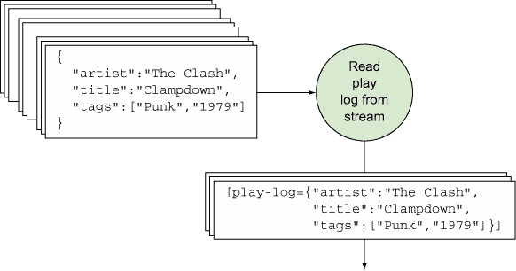

虽然这个喷口的实现细节超出了本章的范围，但我们将展示如何在下一个列表中`TopologyBuilder`类中连接这个喷口的代码。

##### 列表 9.4\. 在`TopologyBuilder`中连接`TransactionalTridentKafkaSpout`

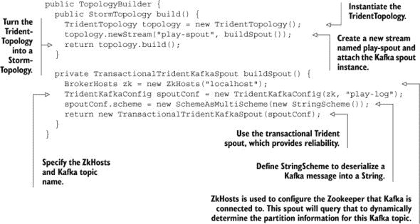

现在，我们有一个将发出播放日志批次的喷口实现。下一步是实现我们的第一个操作，该操作将批次的每个元组的 JSON 转换为艺术家、标题和标签的单独元组批次。

#### 9.4.2\. 反序列化播放日志并为每个字段创建单独的流

在设计中要实施的下一步是获取进入的`play-log`元组批次，并为我们要计数的每个字段（艺术家、标题和标签）发出元组批次。图 9.6 说明了输入元组批次、我们的操作和输出元组批次，每个批次都在单独的流上发出。

##### 图 9.6\. 将 JSON 反序列化为 Trident 元组批次的操作，针对艺术家、标题和标签字段

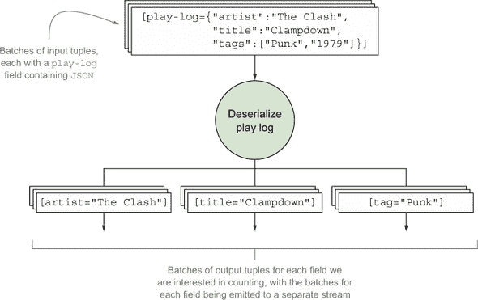

观察图示，你可以看到我们需要做两件事：1) 将 JSON 转换为艺术家、标题和标签字段的单个元组，2) 为这些字段中的每个字段创建一个单独的流。对于第一个任务，我们将查看`each`操作。

Trident 提供了一个可以应用于每个元组的`each`操作。`each`操作可以与函数或过滤器一起使用。在我们的场景中，一个`each`函数似乎是一个合适的选择，因为我们正在将 JSON 转换为艺术家、标题和标签的 Trident 元组。如果我们需要出于某种原因过滤掉任何数据，那么过滤器将是一个更合适的选择。

##### 实现每个函数

函数接收一组输入字段并发出零个或多个元组。如果它不发出任何内容，则原始元组被过滤掉。当使用`each`函数时，输出元组的字段被附加到输入元组上。以下列表提供了为我们拓扑实现`each`函数的代码。

##### 列表 9.5\. `TopologyBuilder.java`中的`each`函数用于反序列化播放日志

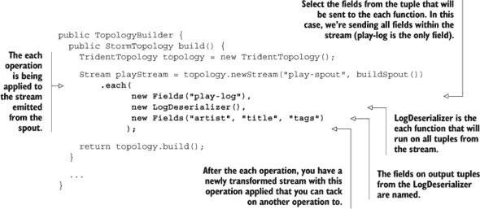

新的流将包含`play-log`、`artist`、`title`和`tags`字段。`each`函数`LogDeserializer`通过为`Base-Function`抽象类提供一个实现来构建，并将输入元组中的 JSON 字符串反序列化到所需的输出。实现`BaseFunction`类似于在原生 Storm 中实现`Base-BasicBolt`。以下列表显示了实现。

##### 列表 9.6\. `LogDeserializer.java`

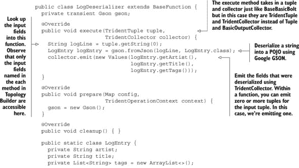

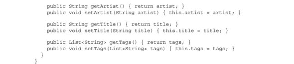

| |
| --- |

**投影**

当你定义一个`each`函数为`stream.each(inputFields, function, output-Fields)`时，只有原始流中的一部分字段（由`inputFields`表示）被发送到函数中（其余的函数内部无法访问）。这被称为*投影*。投影使得避免人们通常遇到的问题变得极其容易，即向函数发送了不必要的字段。

你也可以在流上使用`project(..)`方法来移除操作后挂留的任何不必要的字段。在我们的例子中，我们在`LogDeserializer`操作后流中有一个`play-log`字段，我们不再需要原始的 JSON。最好将其删除；保留不必要的内存数据会影响效率（尤其是在 Trident 中，因为我们把流当作一系列批次来处理，这涉及到在 JVM 中比常规 Storm 拓扑保留更多的数据）：

```
playStream = playStream.project(new Fields("artist", "title", "tags"));
```

| |
| --- |

如我们之前提到的，我们必须做两件事：1) 将 JSON 转换为单独的元组，我们现在已经做到了，2) 为这些字段中的每个字段创建一个单独的流。让我们看看第二个任务。

##### 分割流和分组字段

如果我们现在结束实现，我们将有一个包含四个值元组批次的单个流。这是因为`LogDeserializer`中的以下原因：

```
collector.emit(new Values(logEntry.getArtist(),
                          logEntry.getTitle(),
                          logEntry.getTags()));
```

图 9.7 展示了我们现在所在的位置与我们的目标位置。

##### 图 9.7\. 我们希望从包含多个值的元组的流移动到包含单个值的多个流。

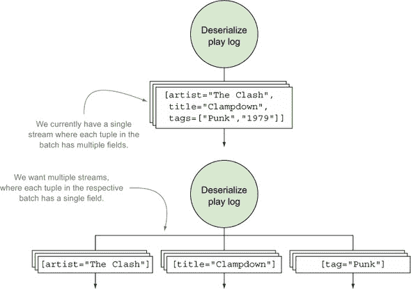

幸运的是，拆分流很容易。我们从拆分起源点持有多个流引用，然后继续对这些引用应用不同的 Trident 操作，如下一列表所示。

##### 列表 9.7\. 将来自`LogDeserializer`的流拆分为三个独立的流

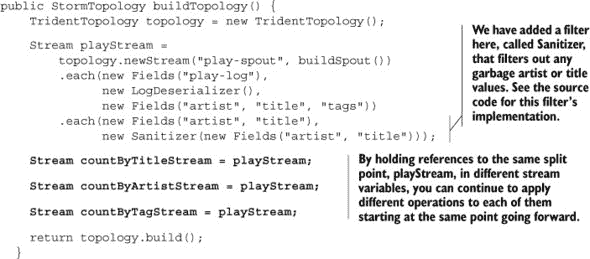

我们有创建单独流的代码，但那些流中没有什么内容。它们只是对起源`playStream`的引用。我们需要将每个流与我们要拆分的字段相关联。这正是按字段名称对元组进行分组发挥作用的地方。

##### 按字段名称对元组进行分组

Trident 提供了一个`groupBy`操作，我们可以用它来对具有相同字段名的元组进行分组。`groupBy`操作首先重新分区流，使得具有相同选定字段值的元组落在同一个分区中。在每个分区内部，它然后将具有相等组字段的元组分组在一起。执行这些`groupBy`操作的代码在下一列表中。

##### 列表 9.8\. 在三个拆分流中对艺术家、标题和标签进行分组

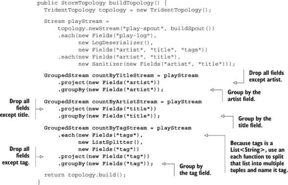

`ListSplitter`是一个以类似`LogDeserializer`的方式实现的`each`函数。不同之处在于`ListSplitter`将`tags`列表拆分为单个`tag`元组。

现在我们已经拆分了流并对每个`artist`、`title`和`tag`字段进行了分组，我们准备计算这些字段的计数。

#### 9.4.3\. 计算并持久化艺术家、标题和标签的计数

下一步是对`artist`、`title`和`tag`元组进行聚合，以便计算每个的计数。图 9.8 提醒我们在拓扑设计中的位置。

##### 图 9.8\. 对每个`artist`、`title`和`tag`值进行计数并将这些值持久化到存储中

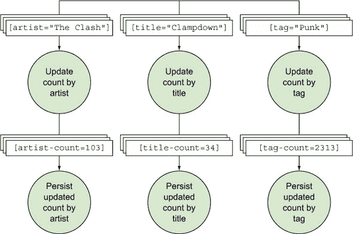

根据图 9.8，这里基本上有两个步骤：1) 对每个流按值聚合元组以执行计数，2) 持久化计数。让我们先看看三种不同的聚合元组的方法，并确定最适合我们场景的方法。

##### 为执行计数选择聚合器实现

有三种方法可以聚合元组，每种方法都有自己的接口来定义如何实现：

1.  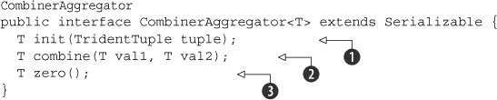

    一个 `CombinerAggregator` 对每个元组调用 `init`  方法，然后使用 `combine`  方法将每个元组的 `init` 值合并并返回一个结果。如果没有元组要聚合，它返回 `zero`  值。

1.  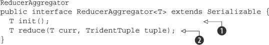

    一个 `ReducerAggregator` 只对聚合调用一次 `init` 方法，然后对每个元组和当前值调用 `reduce` 。

1.  ```
    Aggregator
    public interface Aggregator<T> extends Operation {
      T init(Object batchId, TridentCollector collector);
      void aggregate(T state, TridentTuple tuple, TridentCollector collector);
      void complete(T state, TridentCollector collector);
    }
    ```

    `Aggregator` 是一个更底层的抽象接口，用于实现更复杂的聚合。请参阅 Storm 文档以获取更多信息。

大多数情况下，你会使用 `CombinerAggregator` 或 `ReducerAggregator`。如果整个聚合的初始值不依赖于任何单个元组，那么你就必须使用 `ReducerAggregator`。否则，我们建议使用 `CombinerAggregator`，因为它性能更好。

|  |
| --- |

**CombinerAggregator 相对于 ReducerAggregator 的优势**

当你使用基于 `ReducerAggregator` 或 `Aggregator` 的实现运行聚合操作时，流会发生重新分区，以便所有分区都合并成一个，并在该分区上进行聚合。但如果你使用基于 `CombinerAggregator` 的实现（就像我们使用 `Count` 一样），Trident 将在当前分区上执行部分聚合，然后重新分区流为一个流，并通过进一步聚合部分聚合的元组来完成聚合。这要高效得多，因为 fewer tuples have to cross the wire during the repartition. `CombinerAggregator` 应该始终优先考虑，因为这个原因；你唯一需要求助于 `ReducerAggregator` 的时候是当你需要用一个与元组无关的初始值来初始化聚合。

|  |
| --- |

对于我们的场景，让我们使用一个名为 `Count` 的内置聚合器，它实现了 `Combiner-Aggregator`。这是一个简单的实现，它将允许我们在分组内计数艺术家、标题和标签。下一个列表显示了 `Count` 的实现。

##### 列表 9.9\. 实现 `CombinerAggregator.java` 的内置 `Count.java`

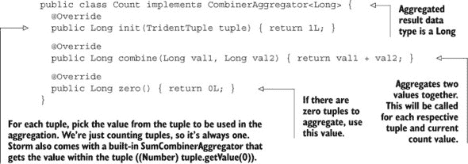

我们知道我们将使用 `Count` 类来执行实际的计数，但我们仍然需要在我们的 `TopologyBuilder` 中将 `Count` 实例连接起来。让我们看看如何做到这一点。

##### 选择一个聚合操作与我们的聚合器实现一起使用

Trident 提供了三种方法来使用聚合器与流：

+   **`partitionAggregate`—** 这个操作承担了聚合元组的单一责任，并且仅在单个分区内工作。这个操作的结果是一个包含聚合结果元组的 `Stream`。设置 `partition-Aggregate` 的代码如下：

    ```
    Stream aggregated = stream.partitionAggregate(new Count(),
                                                  new Fields("output"));
    ```

+   **`aggregate`—** 这个操作承担着聚合元组的单一职责，并在单个元组批次的所有分区中工作。操作的结果是一个包含聚合结果元组的`Stream`。设置`aggregate`的代码如下：

    ```
    Stream aggregated = stream.aggregate(new Count(),
                                         new Fields("output"));
    ```

+   **`persistentAggregate`—** 这个操作跨越多个批次，承担着聚合元组和持久化结果的职责。它将聚合结果持久化到由`<state-factory>`管理的数据存储中。状态工厂是 Trident 用于与数据存储一起工作的抽象。因为它与状态一起工作，所以`persistentAggregate`可以在批次之间工作。它是通过从流中聚合当前批次，然后将该值与数据存储中的当前值聚合来实现的。这个操作产生了一个可以查询的`TridentState`。设置`persistentAggregate`的代码如下：

    ```
    TridentState aggregated = stream.persistentAggregate(<state-factory>,
                                                         new Count(),
                                                         new Fields("output"));
    ```

在这个列表中，`Count`聚合器可以被替换为任何`CombinerAggregator`、`ReducerAggregator`或`Aggregator`实现。

哪种聚合操作最适合我们的需求？让我们从`partition-Aggregate`开始。我们知道`partitionAggregate`在单个分区内部工作，因此我们必须弄清楚我们是否需要在单个分区内部进行聚合。我们已经对一个字段（艺术家、标题和标签）的元组应用了`groupBy`操作来分组，然后在整个批次中计算该组内的元组数量。这意味着我们正在跨分区操作，这使得`partitionAggregate`不是我们的选择。

接下来是`aggregate`操作。`aggregate`操作在元组批次的所有分区中工作，这正是我们所需要的。但如果我们决定使用`aggregate`，我们还需要应用另一个操作来持久化聚合结果。因此，如果我们决定承担更多的工作并构建更多内容，允许我们在批次之间聚合并持久化结果，`aggregate`就可以工作。

我们感觉对于我们的场景，可能有一个更好的选择，这让我们想到了`persistent-Aggregate`。仅从名称上，我们就有一种感觉，这可能正是我们需要进行的操作。我们需要对计数进行聚合，并将这些聚合结果持久化。因为`persistentAggregate`与状态一起工作，因此可以在批次之间工作，这使得它非常适合我们的场景。此外，`persistentAggregate`为我们留下了一个可以查询的`TridentState`对象，这使得我们很容易构建之前在问题定义中讨论的各种报告。

我们已经决定使用`persistentAggregate`作为我们的解决方案，但在完成之前，我们还需要定义最后一个部分。让我们再次看看`persistent-Aggregate`的代码：

```
TridentState aggregated = stream.persistentAggregate(<state-factory>,
                                                     new Count(),
                                                     new Fields("output"));
```

我们仍然需要一个`<state-factory>`，我们将在下一节讨论。

##### 处理状态

在 Trident 中处理状态时，我们需要一个 `StateFactory` 的实现。这个 `StateFactory` 作为一种抽象，知道如何查询和更新数据存储。在我们的场景中，我们将选择与 Trident 一起捆绑的 `MemoryMapState.Factory`。`MemoryMapState.Factory` 与内存中的 `Map` 一起工作，目前它完全可以满足我们的需求。连接这个工厂的代码可以在下面的列表中看到。

##### 列表 9.10\. 使用 `persistentAggregate` 操作在 `TopologyBuilder.java` 中更新/持久化计数

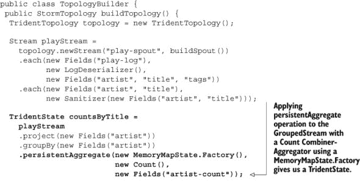

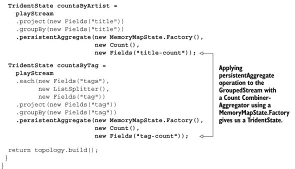

这就完成了我们 Trident 拓扑的基本实现。我们现在已经拥有了所有感兴趣字段的内存计数：`artist`、`title` 和 `tag`。现在我们已经完成了；准备好继续前进，对吧？嗯，还不完全是。我们不想让你带着这些无法访问的内存计数离开。让我们看看如何实现对这些计数的访问。这将以 Storm 的 DRPC 功能的形式出现。

### 9.5\. 通过 DRPC 访问持久化的计数

现在我们有了按艺术家、标题和标签计数的 `TridentState` 对象，我们可以查询这些状态对象来构建我们需要的报告。我们希望我们的报告应用程序在 Storm 之外，因此这个报告应用程序需要能够查询这个拓扑以获取它所需的数据。我们将利用分布式远程过程调用（DRPC）来实现这个目的。

在 Storm DRPC 中，客户端将使用 Storm DRPC 服务器调用一个 DRPC 请求，该服务器将通过将请求发送到相应的 Storm 拓扑并等待该拓扑的响应来协调请求。一旦它收到响应，它将把这个响应传达给调用客户端。这实际上通过并行查询多个艺术家或标签并汇总结果来充当一个分布式查询。

本节涵盖了实现我们的查询计数解决方案所需的 Storm DRPC 的三个部分：

+   创建一个 DRPC 流

+   将 DRPC 状态查询应用于流

+   使用 DRPC 客户端通过 Storm 进行 DRPC 调用

我们将从 DRPC 流开始我们的解释。

#### 9.5.1\. 创建一个 DRPC 流

当 Storm DRPC 服务器接收到一个请求时，它需要将其路由到我们的拓扑。为了我们的拓扑能够处理这个传入的请求，它需要一个 DRPC 流。Storm DRPC 服务器将把任何传入的请求路由到这个流。DRPC 流被赋予一个名称，这个名称是我们想要执行的这个分布式查询的名称。DRPC 服务器将根据这个名称确定要路由到哪个拓扑（以及该拓扑中的哪个流）。下面的列表显示了如何创建一个 DRPC 流。

##### 列表 9.11\. 创建一个 DRPC 流

```
topology.newDRPCStream("count-request-by-tag")
```

DRPC 服务器接受以文本形式传递给 DRPC 函数的参数，并将这些参数与请求一起转发到该 DRPC 流。我们需要将这些文本参数解析成我们可以在 DRPC 流中使用的格式。以下列表定义了我们的 `count-request-by-tag` DRPC 流的参数合同，即我们想要查询的标签的逗号分隔列表。

##### 列表 9.12\. 定义 DRPC 流参数的合同

```
topology.newDRPCStream("count-request-by-tag")
        .each(new Fields("args"),
              new SplitOnDelimiter(","),
              new Fields("tag"));
```

列表 9.12 引用了名为 `SplitOnDelimiter` 的每个函数，因此让我们看看该类的实现，如下列表所示。

##### 列表 9.13\. `SplitOnDelimiter.java`

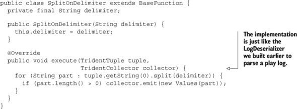

这为我们提供了一个基本的 DRPC 流来工作。下一步是将状态查询应用于此流。

#### 9.5.2\. 将 DRPC 状态查询应用于流

我们想要执行的针对此 DRPC 请求的状态查询是按给定标签参数计算播放日志的数量。在我们继续之前，让我们刷新一下如何计算标签的 `TridentState` 的记忆，如下列表所示。

##### 列表 9.14\. 创建导致 `TridentState` 的 `counts-by-tag` 流

```
TridentState countsByTag = playStream
    .each(new Fields("tags"),
          new ListSplitter(),
          new Fields("tag"))
    .project(new Fields("tag"))
    .groupBy(new Fields("tag"))
    .persistentAggregate(new MemoryMapState.Factory(),
                         new Count(),
                         new Fields("tag-count"));
```

我们使用标签作为键和计数作为值，将按给定标签的计数存储在内存映射中。现在我们只需要查找作为 DRPC 查询参数接收到的标签的计数。这是通过 DRPC 流上的 `stateQuery` 操作实现的。`stateQuery` 操作的解释可以在 图 9.9 中看到。

##### 图 9.9\. 分析 `stateQuery` 操作

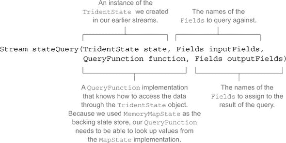

如图所示，我们选择的 `QueryFunction` 需要知道如何通过 `TridentState` 对象访问数据。幸运的是，Storm 内置了一个 `MapGet` 查询函数，它可以与我们的 `MemoryMapState` 实现一起工作。

但实现这个状态查询并不像在我们的 DRPC 流末尾添加 `stateQuery` 操作那么简单。原因是我们在原始播放流中，使用 `tag` 字段上的 `groupBy` 操作重新分区了流。为了将 `count-request-by-tag` 请求从 DRPC 流发送到包含所需标签的 `TridentState` 的同一分区，我们还需要在 DRPC 流上应用一个 `groupBy` 操作，在相同的标签字段上。下一个列表提供了相应的代码。

##### 列表 9.15\. 通过查询状态源查找 `counts-by-tag`

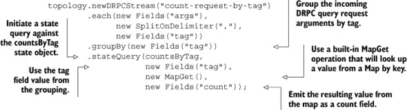

现在我们已经得到了我们想要的每个标签的计数结果。我们可以在 DRPC 流中停止这里并完成。可选地，我们可以附加一个额外的 `each` 操作来过滤掉空计数（即尚未在播放流中遇到的标签），但我们将空值留给 DRPC 调用者处理。

这将我们带到最后一步：能够通过 DRPC 客户端与 Storm 进行通信。

#### 9.5.3\. 使用 DRPC 客户端调用 DRPC 调用

向此拓扑发送 DRPC 请求可以通过在您的客户端应用程序中包含 Storm 作为依赖项，并使用 Storm 内置的 DRPC 客户端来完成。一旦这样做，您就可以使用类似于下一列表中的代码来发送实际的 DRPC 请求。

##### 列表 9.16\. 执行 DRPC 请求

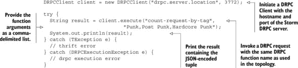

DRPC 请求是通过 Thrift 协议进行的，因此您需要处理与 Thrift 相关的错误（通常是连接相关）以及`DRPCExecutionException`错误（通常是功能相关）。就是这样。我们没有让您失望。现在您有一个拓扑，它可以维护`artist`、`title`和`tag`等不同字段的计数状态，并且您能够查询该状态。我们已经使用 Trident 和 Storm DRPC 构建了一个完全功能化的拓扑。

或者就这样了吗？如果您从前面的章节中学到了什么，那就是一旦您部署了拓扑，作为开发者的工作还没有结束。这里也是同样的情况。第 9.6 节讨论了如何使用 Storm UI 来识别在幕后创建的 spout 和 bolt，以将 Trident 操作映射到 Storm 原语。第 9.7 节将接着讨论扩展 Trident 拓扑。

### 9.6\. 将 Trident 操作映射到 Storm 原语

回想一下，在本章的开头我们讨论了如何基于我们在本书中逐渐熟悉的 Storm 原语构建 Trident 拓扑。随着我们的用例完成，让我们看看 Storm 是如何将我们的 Trident 拓扑转换为 bolt 和 spout 的。我们将首先查看没有我们的 DRPC spout，我们的拓扑是如何映射到 Storm 原语的。为什么不一次性查看所有内容呢？我们觉得首先处理核心的 Trident 流，然后再添加 DRPC 流，这样更容易理解到底发生了什么。

没有我们的 DRPC spout，我们的`TopologyBuilder`代码可以在以下列表中看到。

##### 列表 9.17\. 没有 DRPC 流的`TopologyBuilder.java`

```
public TopologyBuilder {
  public StormTopology build() {
    TridentTopology topology = new TridentTopology();

    Stream playStream = topology
      .newStream("play-spout", buildSpout())
      .each(new Fields("play-log"),
            new LogDeserializer(),
            new Fields("artist", "title", "tags"))
      .each(new Fields("artist", "title"),
            new Sanitizer(new Fields("artist", "title")));

    TridentState countByArtist = playStream
      .project(new Fields("artist"))
      .groupBy(new Fields("artist"))
      .persistentAggregate(new MemoryMapState.Factory(),
                           new Count(),
                           new Fields("artist-count"));

    TridentState countsByTitle = playStream
      .project(new Fields("title"))
      .groupBy(new Fields("title"))
      .persistentAggregate(new MemoryMapState.Factory(),
                           new Count(),
                           new Fields("title-count"));

    TridentState countsByTag = playStream
      .each(new Fields("tags"),
            new ListSplitter(),
            new Fields("tag"))
      .project(new Fields("tag"))
      .groupBy(new Fields("tag"))
      .persistentAggregate(new MemoryMapState.Factory(),
                           new Count(),
                           new Fields("tag-count"));

    return topology.build();
  }

  ...
}
```

当我们的 Trident 拓扑被转换为 Storm 拓扑时，Storm 会以高效的方式将我们的 Trident 操作打包到 bolt 中。一些操作将被组合到同一个 bolt 中，而其他操作将是独立的。Storm UI 提供了一个视图，展示了这种映射是如何进行的（图 9.10）。

##### 图 9.10\. 在 Storm UI 中分解为 spout 和 bolt 的我们的 Trident 拓扑

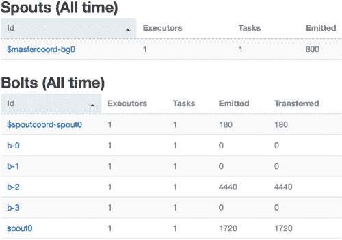

如您所见，我们有一个 spout 和六个 bolt。其中两个 bolt 的名称中包含“spout”，另外四个分别标记为 b-0 到 b-3。我们可以在那里看到一些组件，但我们不知道它们如何与我们的 Trident 操作相关联。

而不是试图解开名称背后的神秘，我们将向您展示一种使识别组件更容易的方法。Trident 有一个命名操作，它将我们指定的名称分配给一个操作。如果我们给拓扑中的每个操作集合命名，我们的代码最终会像下面列表中的那样。

##### 列表 9.18\. `TopologyBuilder.java`带有命名操作

```
public TopologyBuilder {
  public StormTopology build() {
    TridentTopology topology = new TridentTopology();

    Stream playStream = topology
      .newStream("play-spout", buildSpout())
      .each(new Fields("play-log"),
            new LogDeserializer(),
            new Fields("artist", "title", "tags"))
      .each(new Fields("artist", "title"),
            new Sanitizer(new Fields("artist", "title")))
      .name("LogDeserializerSanitizer");

    TridentState countByArtist = playStream
      .project(new Fields("artist"))
      .groupBy(new Fields("artist"))
      .name("ArtistCounts")
      .persistentAggregate(new MemoryMapState.Factory(),
                           new Count(),
                           new Fields("artist-count"));

    TridentState countsByTitle = playStream
      .project(new Fields("title"))
      .groupBy(new Fields("title"))
      .name("TitleCounts")
      .persistentAggregate(new MemoryMapState.Factory(),
                           new Count(),
                           new Fields("title-count"));

    TridentState countsByTag = playStream
      .each(new Fields("tags"),
            new ListSplitter(),
            new Fields("tag"))
      .project(new Fields("tag"))
      .groupBy(new Fields("tag"))
      .name("TagCounts")
      .persistentAggregate(new MemoryMapState.Factory(),
                           new Count(),
                           new Fields("tag-count"));

    return topology.build();
  }

  ...
}
```

如果我们查看我们的 Storm UI，发生的事情就变得更加明显了(图 9.11)。

##### 图 9.11\. 在 Storm UI 上命名每个操作后显示的我们的 Trident 拓扑

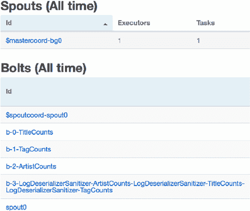

我们可以看到，我们的`b-3`螺栓是日志反序列化和净化。而我们的`b-0`、`b-1`和`b-2`螺栓分别对应标题、标签和艺术家计数。考虑到使用名称提供的清晰度，我们建议您始终为分区命名。

日志反序列化螺栓的名称是怎么回事？`LogDeserializer-Sanitizer-ArtistCounts-LogDeserializerSanitizer-TitleCounts-Log-Deserializer-Sanitizer-TagCounts`——多么冗长！但它确实为我们提供了大量信息。名称表明我们从日志反序列化和净化器获取数据，并将其输入到艺术家计数、标题计数和标签计数中。这不是最优雅的发现机制，但比仅仅 b-0 要好。

在获得这种额外的清晰度后，看看图 9.12，它说明了我们的 Trident 操作是如何映射到螺栓中的。现在让我们添加回带有相关名称的 DRPC 流。这个代码在下一个列表中。

##### 图 9.12\. 我们 Trident 操作如何映射到螺栓中

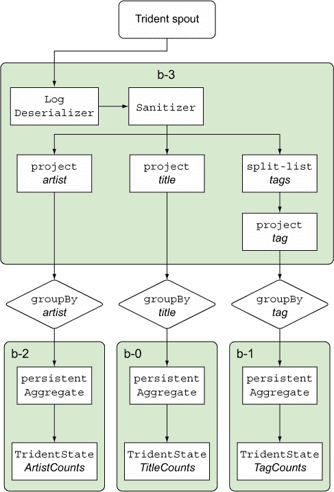

##### 列表 9.19\. 带有命名操作的 DRPC 流

```
topology.newDRPCStream("count-request-by-tag")
  .name("RequestForTagCounts")
  .each(new Fields("args"),
        new SplitOnDelimiter(","),
        new Fields("tag"))
  .groupBy(new Fields("tag"))
  .name("QueryForRequest")
  .stateQuery(countsByTag,
              new Fields("tag"),
              new MapGet(),
              new Fields("count"));
```

添加带有命名操作的 DRPC 流导致出现图 9.13 中看到的 Storm UI。

##### 图 9.13\. 包含 Trident 拓扑和 DRPC 流的命名操作的 Storm UI

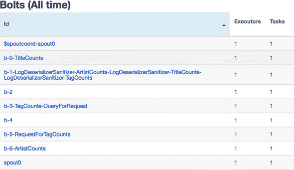

发生了什么变化？嗯...

我们日志净化器螺栓现在是 b-2 而不是 b-3。这非常重要。当您更改拓扑中螺栓的数量时，不能依赖自动生成的螺栓名称保持不变。

命名螺栓的数量从 4 个增加到 5 个，并且这些螺栓的名称也发生了变化。

我们有一些未命名的螺栓。螺栓名称变更发生了什么情况？我们添加了 DRPC 喷嘴后，映射到 Storm 原语和名称相应地发生了变化。图 9.14 显示了 Trident/DRPC 操作最终映射到螺栓的过程。

##### 图 9.14\. Trident 和 DRPC 流以及操作如何映射到螺栓中

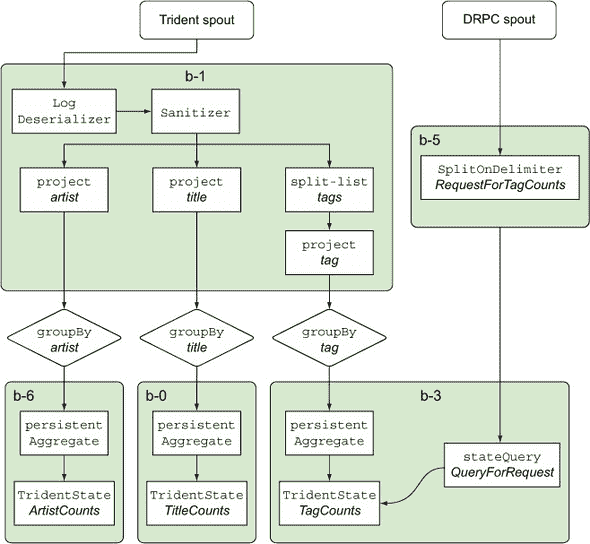

注意“标签计数”和“请求查询”是如何映射到同一个螺栓，并且名称已经相应调整。好吧，那么那些未命名的螺栓怎么办？我们之所以在 UI 的螺栓部分看到一些组件被命名为喷嘴，是因为 Storm 运行在螺栓中的 Trident 喷嘴。记住，Trident 喷嘴与本地 Storm 喷嘴不同。此外，Trident 拓扑还有其他协调器，允许我们将传入的流视为一系列批次。当我们将 DRPC 喷嘴添加到拓扑中并更改其映射方式时，Storm 引入了它们。

通过几行额外的代码，很容易识别 Storm 如何将 Trident 操作映射到本地 Storm 组件。添加名称是关键，这将节省你很多麻烦。现在你已经了解了如何通过名称和 Storm UI 将本地 Storm 组件映射到 Trident 操作，让我们将注意力转向本章的最后一个主题：扩展 Trident 拓扑。

### 9.7\. 扩展 Trident 拓扑

让我们谈谈并行单位。当处理螺栓和喷嘴时，我们交换执行者和任务。它们构成了组件之间并行的主要手段。当使用 Trident 时，我们仍然与它们一起工作，但只是作为 Trident 操作映射到这些原语。当使用 Trident 时，我们实现并行的主要方法是分区。

#### 9.7.1\. 用于并行的分区

使用 Trident，我们通过分区流并在每个分区上并行应用我们的操作，在一个或多个工作进程中处理数据流。如果我们拓扑中有五个分区和三个工作进程，我们的工作将以类似 图 9.15 中所示的方式分布。

##### 图 9.15\. 分区分布在 storm 工作进程（JVM）上，并并行操作

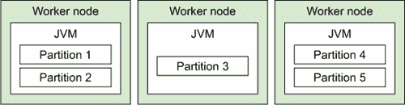

与 Storm 不同，在 Storm 中我们想象并行性是跨一系列工作进程分散执行者，而在这里我们想象并行性是一系列分区被分散到一系列工作进程中。我们通过调整分区数量来扩展 Trident 拓扑。

#### 9.7.2\. Trident 流中的分区

分区从 Trident 喷嘴开始。Trident 喷嘴（与 Storm 喷嘴大不相同）会发出一个流，然后对这个流应用一系列 Trident 操作。这个流被分区以提供拓扑的并行性。Trident 将这个分区流分解成一系列小批量，包含数千个元组到数百万个元组，具体取决于你的输入吞吐量。图 9.16 展示了两个 Trident 操作之间或 Trident 喷嘴和第一个 Trident 操作之间的 Trident 流的放大视图。

##### 图 9.16\. 两个操作之间带有一系列批次的分区流

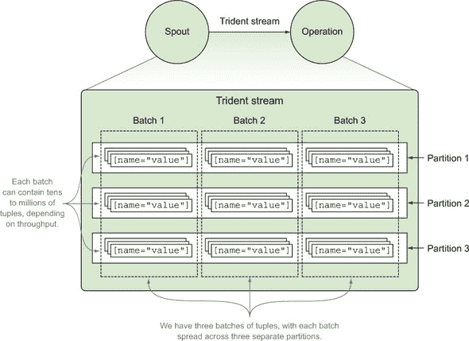

如果并行度从 spout 开始，并且我们调整分区数来控制并行度，我们如何调整 spout 上的分区数？我们调整我们订阅的 Kafka 主题的分区数。如果我们有一个 Kafka 主题的分区，那么我们的拓扑将从一个分区开始。如果我们把 Kafka 主题增加到有三个分区，那么我们的 Trident 拓扑中的分区数将相应改变（图 9.17）。

##### 图 9.17\. Kafka 主题分区及其与 Trident 流中分区的关系

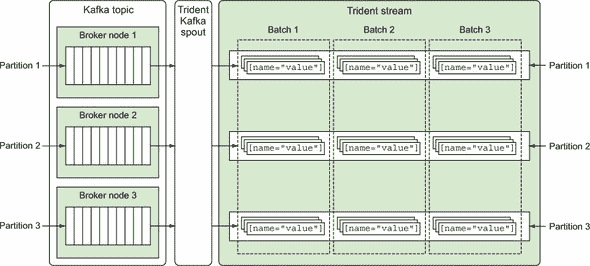

从这里，我们的三个分区的流可以通过各种操作进一步分区。让我们从谈论从 spout 有三个分区的话题退一步，回到只有一个分区；在学习我们 Trident 拓扑中的并行度时，这将使其他一切更容易推理。

在 Trident 拓扑中，将存在自然的分区点。需要改变分区的地方基于正在应用的运算。在这些点上，您可以调整每个结果分区的并行度。我们在拓扑中使用的 `groupBy` 操作会导致重新分区。我们每个 `groupBy` 操作都导致了一种重新分区，我们可以向其提供并行度提示，如下面的列表所示。

##### 列表 9.20\. 在重新分区点指定并行度

```
public static StormTopology build() {
  TridentTopology topology = new TridentTopology();

  Stream playStream =
    topology.newStream("play-spout", buildSpout())
            .each(new Fields("play-log"),
                  new LogDeserializer(),
                  new Fields("artist", "title", "tags"))
            .each(new Fields("artist", "title"),
                  new Sanitizer(new Fields("artist", "title")))
            .name("LogDeserializerSanitizer");

  TridentState countByArtist = playStream
    .project(new Fields("artist"))
    .groupBy(new Fields("artist"))
    .name("ArtistCounts")
    .persistentAggregate(new MemoryMapState.Factory(),
                         new Count(),
                         new Fields("artist-count"))
    .parallelismHint(4);

  TridentState countsByTitle = playStream
    .project(new Fields("title"))
    .groupBy(new Fields("title"))
    .name("TitleCounts")

    .persistentAggregate(new MemoryMapState.Factory(),
                         new Count(),
                         new Fields("title-count"))
    .parallelismHint(4);

  TridentState countsByTag = playStream
    .each(new Fields("tags"),
          new ListSplitter(),
          new Fields("tag"))
    .project(new Fields("tag"))
    .groupBy(new Fields("tag"))
    .name("TagCounts")
    .persistentAggregate(new MemoryMapState.Factory(),
                         new Count(),
                         new Fields("tag-count"))
    .parallelismHint(4);

  topology.newDRPCStream("count-request-by-tag")
          .name("RequestForTagCounts")
          .each(new Fields("args"),
                new SplitOnDelimiter(","),
                new Fields("tag"))
          .groupBy(new Fields("tag"))
          .name("QueryForRequest")
          .stateQuery(countsByTag,
                      new Fields("tag"),
                      new MapGet(),
                      new Fields("count"));

  return topology.build();
}
```

在这里，我们给我们的最后三个 bolt 分别分配了四个并行度。这意味着它们各自使用四个分区。我们能够为它们指定并行度，因为它们之间以及它们之前的 bolts 之间由于 `groupBy` 和 `persistentAggregate` 操作发生了自然的重新分区。我们没有为前两个 bolts 指定任何并行度提示，因为它们之间以及它们之前的 spouts 之间没有进行任何内在的重新分区。因此，它们以与 spouts 相同的分区数运行。图 9.18 展示了这种配置在 Storm UI 中的样子。

##### 图 9.18\. 将四个并行度提示应用于我们的 Trident 拓扑中的 `groupBy` 操作的结果

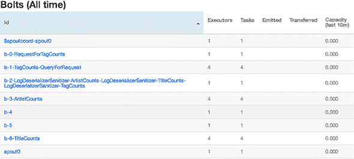

| |
| --- |

**强制重新分区**

除了由于 `groupBy` 操作导致的分区自然变化之外，我们还有能力强制 Trident 进行重新分区操作。此类操作将在分区改变时导致元组在网络中传输。这将对性能产生负面影响。除非您能验证重新分区后的并行度提示确实导致了整体吞吐量的增加，否则您应该避免仅为了改变并行度而进行重新分区。

| |
| --- |

这使我们来到了 Trident 的结尾。在本章中，你学到了很多，所有这些都建立在这本书前八章所奠定的基础之上。希望这个基础只是你 Storm 冒险的开始，我们的目标是让你在使用 Storm 解决任何问题时，继续对这些技能进行优化和调整。

### 9.8. 摘要

在本章中，你了解到

+   Trident 允许你专注于解决问题的“是什么”，而不是“如何”。

+   Trident 利用操作在元组批次上运行，这与在单个元组上运行的 Storm bolts 原生操作不同。

+   Kafka 是一个分布式消息队列实现，它与 Trident 在分区上对元组批次进行操作的运行方式完美匹配。

+   Trident 操作并不直接映射到 spouts 和 bolts，因此始终命名你的操作是很重要的。

+   Storm DRPC 是执行针对由 Storm 拓扑计算出的持久状态的分布式查询的有用方式。

+   扩展 Trident 拓扑与扩展原生 Storm 拓扑大不相同，并且是在分区上进行的，而不是设置 spouts 和 bolts 的确切实例。
