# 第一章：分类分析

*分类分析*是数据可视化的基础。这是数据分析师使用的第一种和最频繁的数据可视化类型。分类分析将一个维度（例如，[地区]）按照一个度量（例如，[销售额]）进行分解。*维度*通常是一个分类值；这些不会被聚合。它们通常用于创建数据标题或生成过滤器。*度量*是一个（通常是数值的）值，可以使用数学函数（如求和、平均值或中位数）进行聚合。度量创建无间断的轴线，从一个范围的一端延伸到另一端。

这种类型的分析有助于回答以下常见业务问题：

+   *A*与*B*相比如何？

+   *X*的度量在*Y*类别中如何分布？

+   *A*、*B*和*C*对总体的贡献有多大？

+   如何测量*X*随时间（时间作为维度）的变化？

分类分析通常以条形图呈现。*条形图*使用高度或长度作为视觉编码来表达一个度量。*视觉编码*是指在图表中显示数据的技术；图 1-1 展示了一些例子。在条形图中编码数据非常有效，因为人类可以快速分析条形的大小变化；它们也容易理解和标记。

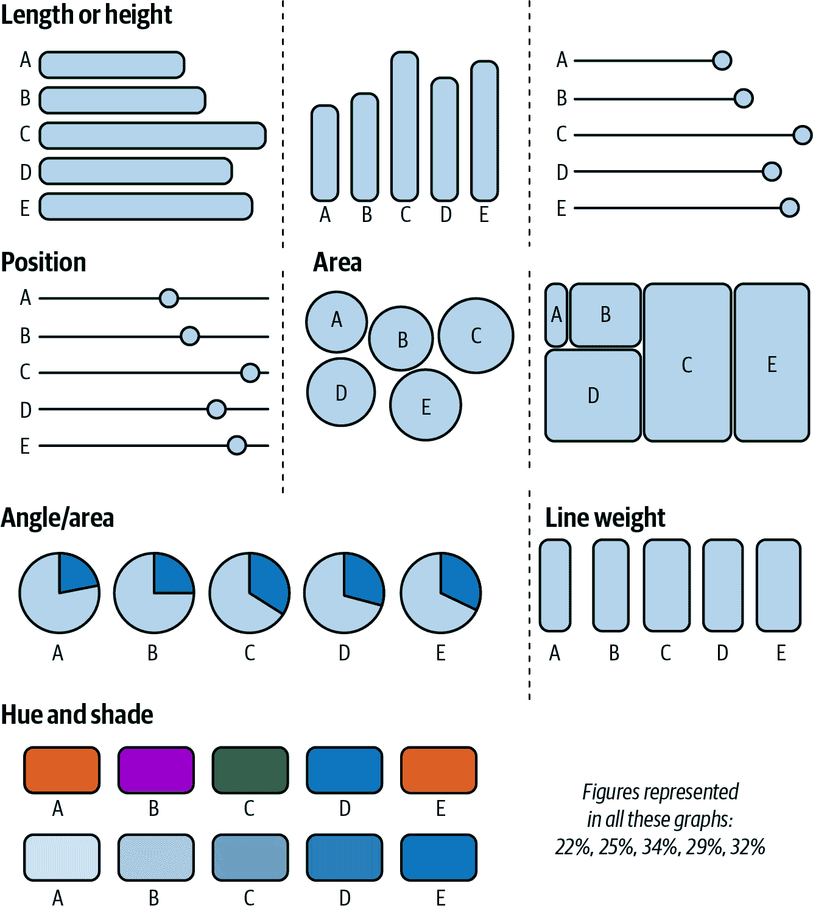

###### 图 1-1。这幅插图展示了数据可以如何编码以便显示，并将它们与一个理解尺度对齐，表明人眼可以辨别差异的精度。

在我们的第一个应用案例中，我们将探讨如何制作有效的*条形图*。您将扮演一个希望了解哪些商家类别占据大部分交易支出的大型金融机构角色，以推动营销工作和合作伙伴关系，更好地服务客户利益的角色。我们还将从默认设置中扩展出两种额外的制作条形图的方法，以展示最重要的信息。

在第二个案例研究中，您将学习如何处理多个维度。虽然条形图非常有用，但在进行分类分析时，您需要其他数据可视化工具。当一个维度有许多成员时，将每个成员显示为条形图有时会变得棘手。在这种情况下，您可以使用替代的图表形式来节省空间，但仍然可以显示所有成员。对于这种情况最有用的图表是树状图。我们将通过一个关于非营利组织的案例研究来探索树状图。

在本章的最终用例中，您将学习如何使用饼图和环形图来可视化整体关系。本案例涉及对 IT 专业人员和心理健康进行调查。饼图通常是您在学校学习的第一种数据可视化类型，但我们喜欢节俭地使用它们作为备选选项。当我们到达这个用例时，您将看到如何正确执行饼图可以成为与观众共享和制作数据的强大工具。

# 柱状图：Tableau 案例研究

我们的第一个案例研究涉及一家试图了解消费者行为的大型金融机构。我们称之为*Banco de Tableau*（简称为 BoT）。

BoT 的数据团队正在努力了解消费者如何和在哪里花钱。这个目标对于组织的成功至关重要，因为它将推动营销努力、合作伙伴关系和产品推广的方向。它还将提供关于客户画像的见解，并可能揭示增加客户群体的机会。团队应该使用什么样的图表来呈现其结果？

当您探索分类分析时，柱状图应该是您尝试的第一种可视化类型。因为它们使用长度和高度作为视觉编码，使得解释和比较成员变得容易。

要解决银行数据团队的问题，你将从一个基本的柱状图开始。它将帮助你通过消费者支出来比较各种类型的商户。它还将作为理解数据的第一步。

## 策略：在 Tableau 中构建柱状图

要构建您的第一个柱状图，您将使用 Tableau 中的金融机构交易数据集进行跟随。以下是步骤：

1.  将[Merchant Category]维度拖动到行架上。

1.  将[Transaction Amount]度量作为`SUM([Transaction Amount])`拖动到列架上。

1.  从工具栏中，按交易金额（即支出）降序排列商户。

恭喜你——你已经构建了你的第一个柱状图。现在这可能看起来并不革命性，但这是了解消费者支出重点的第一步。这个简单的图表，显示在图 1-2 中，打破了任何基于直觉的理论，并向我们呈现了事实。

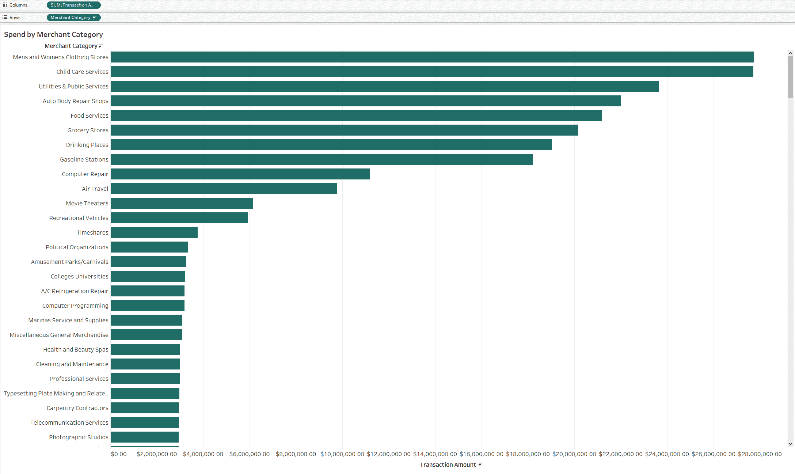

###### 图 1-2\. 柱状图显示按交易金额降序排列的商户类别

这是一个很好的起点。我们已经将数据可视化，可以看到最大的商户类别是男女装店。我们还可以看到一些小的商户类别贡献不了很多支出，比如清洁和维护。知道有许多类型的商户类别，有些比其他的大得多，这是我们可以利用以改进我们的可视化的额外洞察。

通过使用一个*Top N 过滤器*和一个参数，限制显示的商家类别数量是一个很好的增量方式。这个过滤器根据用户定义的*N*值限制图表，以便只显示图表中的前几名成员。*参数*是由最终用户定义的动态输入字段。

在这种情况下，我们将创建一个允许用户动态定义要查看的类别数的参数。添加参数不仅可以使我们的受众更多地控制可视化效果，而且还提供了一种更具对话性的方式来理解图表的内容。前 10 名的示例比长长的条形图列表更具切实可行性和简洁性。

###### 提示

在即将到来的策略中，您将首次使用参数。我们使用记忆术*ABC*来记住构建参数的最常见步骤：

+   A: 添加一个新的参数。

+   B: 将参数控件拖放到工作表上（显示控件）。

+   C: 将参数包含在一个计算字段中。

## 策略：创建 Top N 条形图

要创建 Top N 条形图，请按照以下步骤操作：

1.  将[商家类别]拖放到筛选器架上。

1.  导航到顶部部分。

1.  从下拉列表中，选择创建一个新的参数。

1.  将参数命名为`**[Top N]**`并保存。

1.  右键单击数据窗格左下角的参数以显示参数控件。

注意在图 1-3 中，我们将参数值放在图表标题中。现在，当用户进行动态更改时，数字将随之更新。通过这个小动作，我们创建了一系列可以根据受众需求定制的图表。这个改变还使得图表能够对观众产生响应；他们的行为改变了可视化效果。

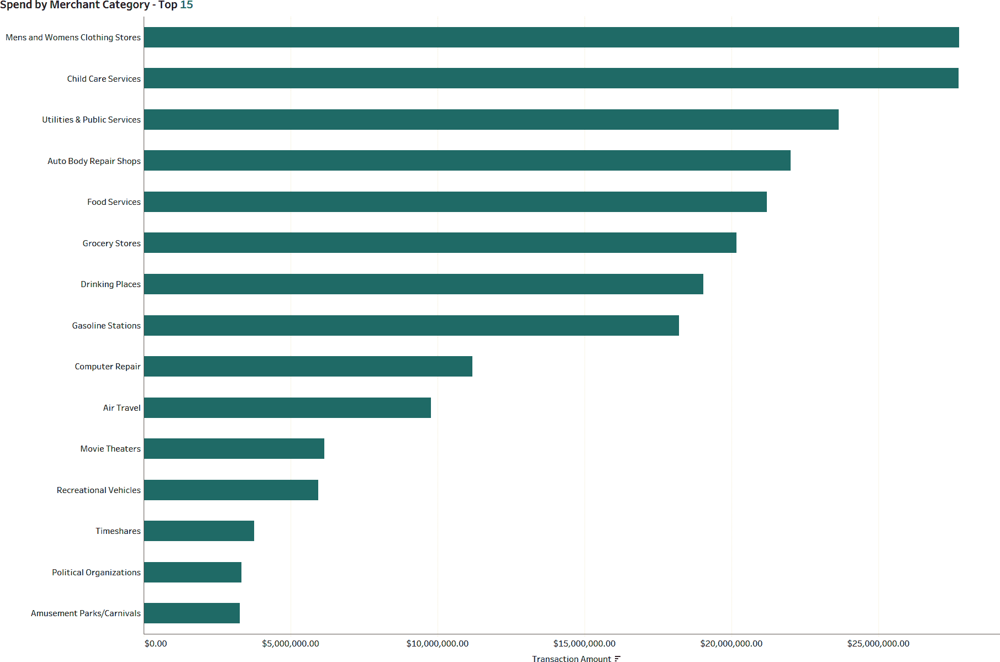

###### 图 1-3\. 一个应用了 Top N 过滤和参数的条形图

那么我们如何进一步提升呢？我们猜你一直在想，这些类别在总支出中所占的百分比是多少。尽管比较它们在我们进一步综合思考时是有用的，但一种自然的倾向是改变评论，即“男装和女装店的客户支出达到 2700 万美元”，改为“接近总客户支出的 4%归因于男装和女装店”。

我们如何处理呈现这些信息？首先，我们可以将度量从直接度量改为总量的百分比。但现在我们留下一个悬而未决的想法，即如果我们将我们的图表限制在前 10 名，我们将失去其他所有类别支出量的上下文。

要解决此限制，我们可以允许观众使用参数来定义他们希望看到分解为商户类别的客户支出比例，并自动将所有其他类别分组在一起。他们仍然可以对图表进行动态控制，但同时可以看到数据的整体情况，如 图 1-4 所示。

注意，您需要构建一个与您所做的总数百分比计算相当的计算。为此，您可以利用 *层级详细* (*LOD*) *表达式*。LOD 表达式允许您定义计算的聚合方式，与可视化中使用的维度无关。该计算采用 `SUM([Transaction Amount])` 并将其除以整个数据集的总和 `SUM([Transaction Amount])`。

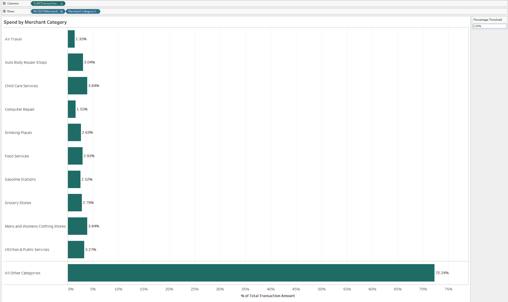

###### 图 1-4\. 更新后的条形图，现在将所有其他类别分组放置在底部。

## 策略：动态分组其他维度

要更新我们的图表，动态分组其他维度并显示总数的百分比，请按照以下步骤操作，使用前一策略的工作表：

1.  从筛选架中删除 [商户类别] 筛选器，方法是右键单击并选择“删除”或将其拖到标记卡下方的灰色空间中。

1.  通过使用快速表格计算，将度量更改为总数的百分比。右键单击 `SUM([Transaction Amount])`，选择快速表格计算 → 百分比占总数。

1.  创建名为 `**[百分比阈值]**` 的参数。将数据类型设置为浮点数，当前值为 0.01。以百分比格式显示数值。

1.  基于 [商户类别] 维度创建一个集合。这将是一个基于计算的公式集合，其中总数的百分比大于或等于参数。在数据窗格中右键单击 [商户类别]，选择创建 → 集合。

1.  在“创建集合”对话框中，选择“使用全部”，然后导航到“条件”选项卡并在“按公式”文本框中输入以下内容：

    ```
    SUM([Transaction Amount])/MAX({SUM([Transaction Amount])})
    	>= [Percentage Threshold]
    ```

1.  创建名为 `**[要显示的商户类别]**` 的计算维度：

    ```
    //Merchant Category to Display
    IF [Merchant Category Set] THEN [Merchant Category]
    ELSE "All Other Categories" END
    ```

1.  将新的 [要显示的商户类别] 维度拖放到行架上的 [商户类别] 上方。

1.  将 [商户类别集] 拖到 [要显示的商户类别] 的左侧。这将组织类别的显示顺序。右键单击并隐藏标题。

1.  通过右键单击并将 [百分比阈值] 参数添加到工作表来完成可视化。同样，右键单击并隐藏 [要显示的商户类别] 的字段标题。通过在标记卡上单击 Label 并选中“显示标记标签”复选框来添加标签。

更新后的分析更加灵活地满足观众的偏好。现在，他们有关于总数百分比的上下文信息，并且能够决定显示多少数据。这种可视化已经超越了只有支出总和的条形图，因为我们不再牺牲了解数据总分布的情况。

如果您已经达到这一点，仍然想要更多，您可以引入额外的项目来增加更多的上下文和反馈。类似于我们最初用于 Top N 的参数，这些附加技术将根据观众的反馈提供反馈，并帮助增强他们对图表的信任。

## 策略：通过颜色增强您的条形图

您可以在条形图中添加颜色。按照以下步骤进行增强：

1.  您可以使用参数作为参考线，以加强动态输入概念。右键单击[% of Total Transaction Amount]轴，选择添加参考线。将范围设置为整个表格，值设置为百分比阈值，标签设置为值。点击确定。

1.  现在将百分比阈值调整为 0.75%（0.0075）。请注意，会显示额外的类别，但没有一个低于 0.75%。

1.  您还可以通过使用我们的“颜色设置”来进一步对目标大型商户类别进行编码。将[商户类别设置]拖到颜色上。设置在此集合中的商户将显示为一种颜色，而不在其中且属于“所有其他类别”的商户将显示为另一种颜色。

    图 1-5 显示了结果。

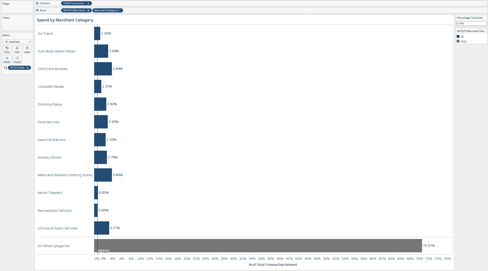

###### 图 1-5\. 相同的条形图，现在通过颜色编码区分个别类别和分组类别

干得好！我们喜欢条形图——它们是任何分析的关键工具。虽然它们可能一开始很简单，但通过抽象的度量和动态输入，您可以将条形图从基础提升到令人惊叹的水平。

有时候，文本在和那些条形图周围的格式化方式上的价值就体现在这里。在这一节中，我们将讨论三种更多的方法来通过格式化使你的条形图更加突出。您将继续使用金融机构交易数据集来构建这些内容。

## 策略：左对齐文本

从一个新的工作表开始，您将使用网络创建这个格式化的条形图：

1.  将[网络]添加到行架上，将`SUM([交易])`添加到列架上。将视图设置为整个视图，并使用轴上的排序图标将网络按`SUM([交易])`按降序排序。

1.  通过按住 Ctrl 键从各自的行/列架上拖动，将[网络]和`SUM([交易])`添加到标签上的标记卡。

1.  右键单击行架上的[网络]并取消选择显示标题。

1.  要编辑标签，请点击标记卡上的标签。在打开的对话框中，点击文本选项旁边的省略号。自定义标签为`**<Network> // <SUM(Transactions)>**`，左对齐。我们建议将维度的字体大小设置为度量的 1.5 倍左右。您可以通过将<Network>设置为 12 和<SUM(Transactions)>设置为 10 来完成此操作。

1.  再次点击标签，并调整水平对齐方式为左对齐。

1.  右键单击轴，取消选中显示[Transactions]的标题以隐藏轴。

1.  从工具栏中选择“格式” → “线条”。通过将它们设置为“无”，删除网格线和零线。将行的轴标尺设置为实线黑色。

结果是一个可视化图表，标签包含维度名称和与度量相关的数值（图 1-6）。

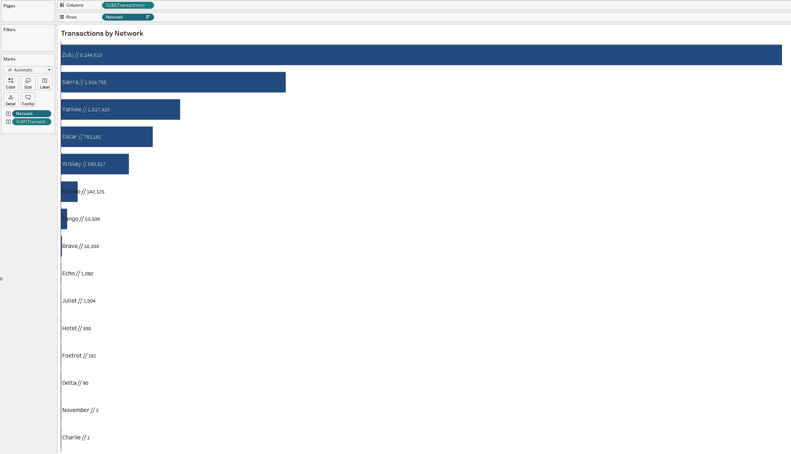

###### 图 1-6。重新格式化柱状图表可以为图表类型带来新生命

## 策略：创建带有顶部标签的柱状图

此策略还直接将标签和值放置在柱形上方。创建此柱状图的技巧在于我们根本不会使用柱形标记类型：

1.  右键单击上一个策略的工作表并进行复制。

1.  创建名为`**[Baseline]**`的计算。此计算将用于确定柱状图表的基线位置：

    ```
    //Baseline
    MIN(0.0)
    ```

1.  在列架上添加[基线]。右键单击并创建双轴。同步轴，然后将标记类型更改为甘特图。右键单击隐藏轴，取消选择显示标题。你可能需要将`SUM([Transactions])`的标记类型改回柱状图。在这样做的同时，取消选中“显示标记标签”。

1.  在[基线]的标记卡上，通过单击“大小”并调整滑块来编辑甘特图的宽度，使甘特条尽可能宽。将颜色设置为白色，并将不透明度设置为零。

1.  调整标签对齐方式，水平右对齐，垂直顶部。

1.  现在，您可以调整`SUM([Transactions])`柱的大小，使其变小，看起来标有甘特标记的标签位于柱的顶部。图 1-7 显示了重新格式化的图表。

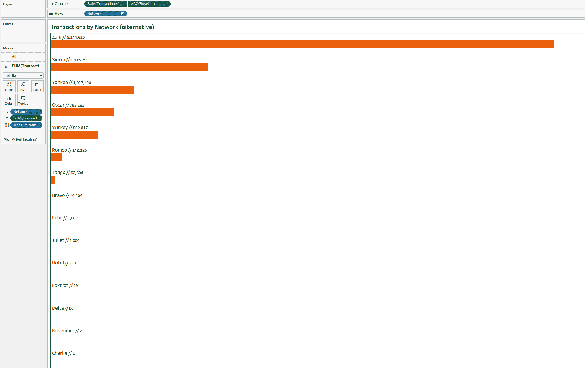

###### 图 1-7。另一个重新格式化的柱状图表

## 策略：创建最大百分比柱状图

举例说明，你将构建另一个柱状图表（图 1-8），但这次柱的背景也将用颜色突出显示：

1.  创建名为`**[Total Bar]**`的计算：

    ```
    // Total Bar
    MIN(1.0)
    ```

    ###### 提示

    我们将使用此计算来在可视化中表示交易金额的 100%。

1.  将[Network]添加到行架上。

1.  将“Total Bar”添加到“Columns”架上。将轴固定在 0 开始到 1.1 结束。您可以通过右键单击轴并选择“编辑轴”来执行此操作。在对话框中，将范围设置为固定，并使用 0 作为固定起点，1.1 作为固定终点。

1.  将颜色不透明度设置为 40%。将`SUM([Transactions])`拖到标签中。

1.  创建一个名为`**[Percent of Maximum]**`的度量：

    ```
    // Percent of Maximum Transactions
    SUM([Transactions])/WINDOW_MAX(SUM([Transactions]))
    ```

1.  将这个新的度量添加到“Columns”架上。创建一个双轴并同步轴。您可能需要将标记类型更改回柱形。在所有标记卡上删除“[Measure Names]”的颜色。从“[Percent of Maximum Transactions]”标记卡中删除标签。

1.  通过单击轴并选择降序来对网络进行排序。然后隐藏两个轴标题。调整柱状图的大小以位于“大小”的中心刻度标记处。

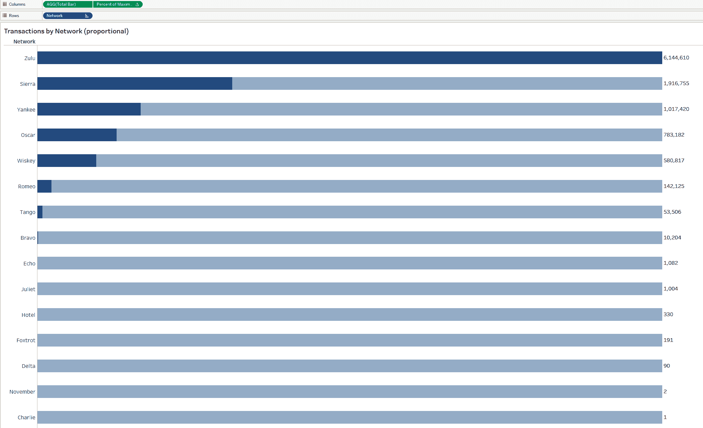

###### 图 1-8\. 一个百分比最大柱状图

# 柱形-柱形图：Amplify Performance 案例研究

我们的下一个案例研究关注非营利组织 Amplify Performance (AP)，它控制并资助纽约州的创意、表演和文化艺术项目和倡议。资助款项分为两类：一类与组织预算相关，另一类更直接地分类为项目倡议。AP 数据团队试图用并排柱状图展示这两类数据，但结果令人困惑。什么样的可视化方式更合适？

并非所有分类比较都需要简单的柱形图。有时比较更复杂。例如，您可能需要比较单一指标的不同时间段的群组。您的受众将希望了解成员之间的变化，以及各个组在时间上的变化。

在这些情况下，新手开发者的第一反应往往是使用并排柱状图。这些可能是有效的，但它们占用了大量空间。在进行这类分析时，我们更喜欢使用柱形-柱形图。在图 1-9 中，您可以看到 2018 年和 2019 年每个类别的总资助额的并排柱状图。

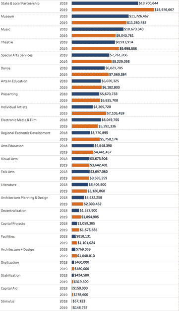

###### 图 1-9\. 并排柱状图虽然有效，但占用了太多空间

看起来你已经得到了你真正想要的所有信息：有两年的柱形图，并且可以快速比较。但你会注意到，数据并没有按照 2019 年的总数排序；相反，它按照两年总数*排序*。

此外，我们在组内进行任何比较（例如，艺术教育）都需要观众进行心算，以理解从 2018 年到 2019 年变化的幅度。如果能在可视化中直接显示这些信息，将会非常有帮助。同样，观众也能快速了解哪些类别从前一年增加，哪些减少。

您可以通过使用条形图，如图 1-10 所示，完成所有操作。跟随非营利性拨款数据集创建此图。

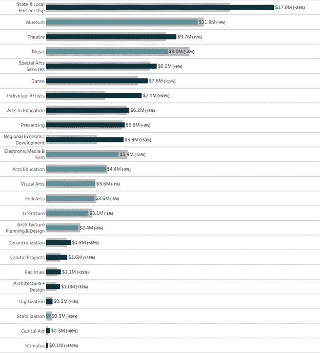

###### 图 1-10\. 条形内外柱图比并排条形图占用更少的空间，同时展示相同的信息。

## 策略：创建条形内外柱图

在图 1-10 中，我们将 2019 年的拨款总额放置在每个类别的 2018 年拨款总额上方。在此，您的观众可以快速比较基准年度（此处为 2019 年）各组的表现，以及该组与前一年的表现。

我们通过添加颜色来辅助年度比较 —— 我们并未选择两种截然不同的颜色，而是使用了同一色调的两种颜色。前一年减少的总数用较亮、饱和度较低的颜色表示。

最后，我们将 2019 年的年度变化以百分比的形式添加到总数旁边。在图 1-10 中，生成的图表综合了三个比较内容：2019 年各组的总拨款金额、每组从 2018 年到 2019 年的拨款金额变化，以及从 2018 年到 2019 年的变化幅度。

那么，如何创建此图表呢？按照以下步骤操作：

1.  创建您的度量。与其使用日期维度来分隔数据，更有效的做法是创建两个分别过滤到相关数据内部的计算。让我们创建 2018 年拨款金额的计算：

    ```
    // Grant Amount | 2018
    SUM(
     IF YEAR([Date]) = 2018
     THEN [Grant Amount]
     END
    )
    ```

    以及 2019 年拨款金额的计算：

    ```
    // Grant Amount | 2019
    SUM(
     IF YEAR([Date]) = 2019
     THEN [Grant Amount]
     END
    )
    ```

    一般而言，应避免在计算过程中硬编码任何内容。在这种情况下，我们通常使用计算或参数来在数据更新时自动化变化（详见第 4 章）。

1.  通过将[Budget Category]添加到行中，同时将[Grant Amount | 2018]和[Grant amount | 2019]添加到行中创建基础可视化。

    1.  创建一个同步的双轴图表，两个标记类型都设置为条形。确保将 2018 年放在双轴图表的最左侧。

        将 2019 年的条形大小调窄，使其比 2018 年的条形更窄。您可能需要调整两者，以便使条形的位置更合适。

    1.  确保从两个 Marks card 中删除[测量名称]。（这不是您添加的；当您创建双轴图表时，Tableau 会自动添加这个。）

    1.  将外部柱的颜色设置为浅灰色，但仍能与背景区分开，如图 1-11 所示。

        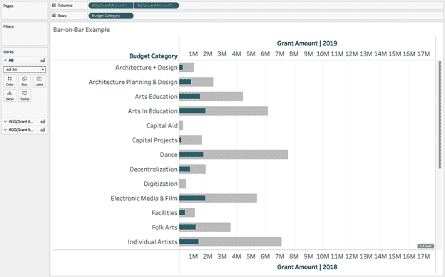

    ###### 图 1-11\. 使用自定义计算创建柱对柱图表

    ###### 提示

    我们倾向于使我们外部柱的宽度（在图 1-11，2018 年）等于柱之间的空白宽度。对于内部柱，我们希望其宽度介于外部柱宽度的 50%至 75%之间。

1.  我们可以依赖轴来进行比较，但由于我们使用的是水平柱状图，因此添加标签是有意义的：

    1.  在[资助金额 | 2019] Marks card 上，点击并拖动[资助金额 | 2019]到标签。

    1.  创建一个名为`**[资助金额 | % 变化]**`的新计算，用于从 2018 年到 2019 年的百分比变化：

        ```
        // Grant Amount | % Change
        ([Grant Amount | 2019] - [Grant Amount | 2018]) / [Grant Amount | 2018]
        ```

    1.  创建度量后，右键单击它，并更改数字格式的默认设置，如图 1-12 所示。

        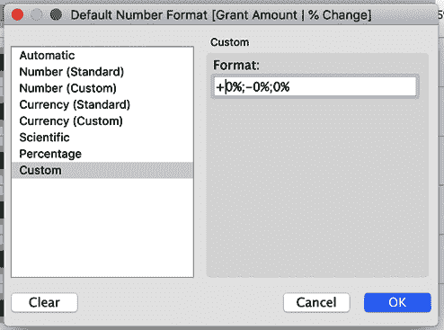

        ###### 图 1-12\. 使用自定义格式使您的百分比显示恰到好处

        这将显示正值前面的加号，负值前面的减号，当方向没有变化时则不显示任何符号。

    1.  将此计算添加到标签中。现在编辑标签的文本。将[资助金额 | 2019]格式化为比[资助金额 | % 变化]度量更大且颜色更深。您的图表应如图 1-13 所示。

        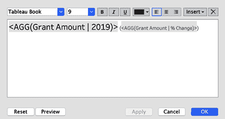

        ###### 图 1-13\. 文本编辑器显示您应如何格式化可视化文本标签

        在此示例中，我们分别使用了大小为 15 和 9 的字体。文本颜色分别为#000000（黑色）和#555555（深灰色）。此外，我们在括号中添加了[资助金额 | % 变化]。您的图表应如图 1-14 所示。

        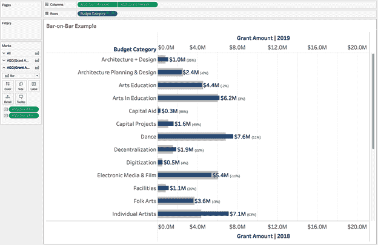

        ###### 图 1-14\. 在最终格式化之前查看柱对柱图表

1.  要添加颜色，请创建一个名为`**[颜色]**`的简单布尔型变量，比较 2019 年和 2018 年的情况，然后将其添加到[资助金额 | 2019] Marks card：

    ```
    // Color

    [Grant Amount | 2019] > [Grant Amount | 2018]
    ```

    您可以编辑颜色，并选择两种以相同颜色开头的颜色：例如，基础十六进制颜色#19626B 用于 True 值，第二种颜色#84B6BC 则更亮、饱和度较低。

1.  添加最后的润色：

    1.  按 2019 年总资助金额对类别进行排序。

    1.  隐藏您的轴和行标题标签。删除所有多余的线条。

    1.  移除垂直分隔线。保留水平分隔线，确保每个成员之间都有分隔。

    你的结果应该类似于图 1-15。

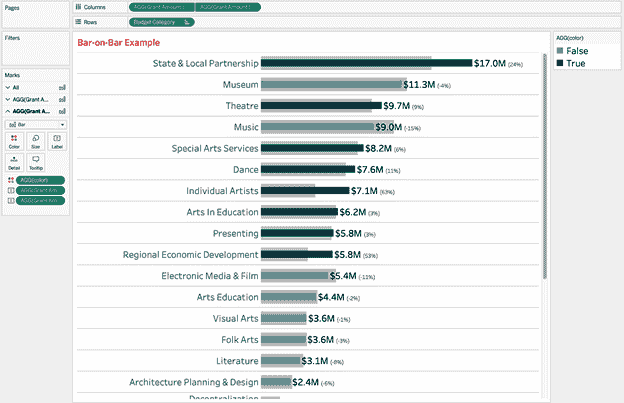

###### 图 1-15\. 添加颜色后的柱状图

# Treemaps：放大性能案例研究

*Treemap*类似于柱状图，但使用矩形的面积相对于高度或长度来编码数据。如果一个维度有许多成员，并且必须显示所有成员，则 Treemap 是一个很好的替代方案。

面积是一个较不精确的度量，但通常在使用 Treemap 时，目标不是完全精确，而是要在一个单一、紧凑的可视化中显示类别的所有成员，按大小排序。

我们将探讨使用 Treemap 的主要好处之一，即能够使用颜色来表示度量或维度。在可钻取的 Treemap 示例中，我们将使用颜色来表示预算类别及其内部的项目类别。然后我们将展示如何根据需要向观众展示额外的详细成员。借助这一功能，观众可以自由探索多个方面而不感到不知所措。我们还将直接和间接地将颜色表示为度量。

接下来，我们将专注于在单个可视化中显示维度的所有成员时该如何操作。您已经看到使用柱状图时会出现长滚动的问题，那么您可以使用什么类型的图表来解决这个障碍呢？

假设你正在与之前介绍的非营利组织 AP 合作，该组织控制并拨发资助金用于纽约州的创意、表演和文化艺术项目和倡议。资助金分为两类：一类专注于组织的预算，另一类专注于项目的倡议。

在这种情况下，您不能牺牲较小的成员。能够看到一些较小类别的情况至关重要，以便提供额外资助金的去向洞察。

如果您面临类似情境，我们建议使用 Treemap。虽然您可能会失去比较选择度量的某些精确性，但您将得到一个良好排序且紧凑的可视化，能够显示维度的所有成员。

## 策略：创建基本 Treemap

使用非营利资助数据集创建一个新的工作表，然后按照以下步骤操作：

1.  将[Budget Category]拖动到文本。

1.  将`SUM([Grant Amount])`拖动到大小，然后同时将其 Ctrl-拖动到颜色中。

1.  确保将标记类型设置为 Square。

    结果显示在图 1-16 中。

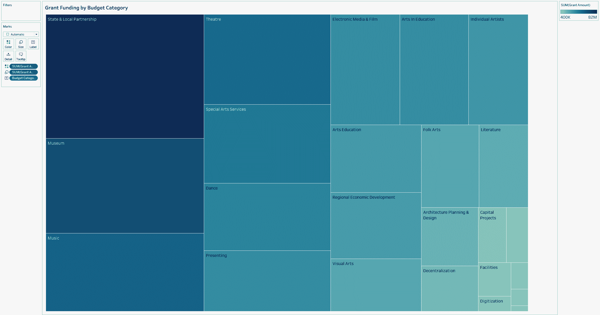

###### 图 1-16\. 按授予金额排序的预算类别的 Treemap

这将为您提供**AP**的资助分配的完整图景。没有一个单一的预算类别拥有大部分资金，但一些较小的类别占用不到 1%。

###### 提示

在使用树状图时的标准惯例是通过大小和颜色双重编码一个度量。这有助于进一步区分各部分和成员。但这不是必需的。作为一种替代方案，您可以考虑在颜色上编码类别。然而，我们建议谨慎：这里有许多成员，而在这种情况下，您将编码冗余信息。

这个树状图是一个很好的起点，但仅让我们提供了关于资助数据的具体细节一半。资金不仅分配给预算，还分配给项目类别。有 55 个独特的项目类别，这是一个重要的附加详细级别，可能会令人不知所措。我们确实只需要知道每次同时一个给定的预算类别内有哪些项目类别。

要解决预算内项目类别的下一个层次的问题，**AP**团队可以创建一个*可钻取的树状图*：一个交互式的树状图，在这里观众可以点击特定的预算类别以查看更多信息。

###### 注意

在以下策略中，您将使用集合动作。集合和集合动作允许您的最终用户与可视化进行交互，以将维度分配给一个集合。在这里，一旦一个维度成为集合的一部分，钻取部分将显示更多细节。

## 策略：创建可钻取的树状图

让我们尝试创建一个可钻取的树状图，继续使用非营利性资助数据集：

1.  从前一策略完成的树状图开始，通过首先将[项目类别]拖放到树状图视图的标记卡上，创建一个基于[预算类别]和[项目类别]的集合。这将允许您点击标记并创建一个集合，将两个维度结合起来。右键单击任何标记并创建一个名为`**[项目和预算集合]**`的集合。最初集合中有什么值并不重要，只要有两列，每个维度一列。

1.  现在创建一个名为`**[标签项目]**`的计算字段。这将评估某物是否是集合的一部分，并返回该项目：

    ```
    //Label Program
    IF [Program & Budget Set] THEN [Program Category] END
    ```

1.  将这个计算字段拖放到标记卡上的[项目类别]之上。

1.  创建钻取功能。选择工作表 → 操作 → 添加操作 → 更改集合值。

1.  称之为`**深入到项目**`。它将在选择时运行。目标集是[项目和预算集合]。清除选择时您想要的操作是“从集合中删除所有值”。

1.  将[Budget Category]拖放到颜色上，替换`SUM([Grant Amount])`。

1.  现在点击**Dance**，树状图矩形将进入，显示组成**Dance**预算的所有项目。

请注意，在图 1-17 中，您已经改变了颜色的使用方式。这里不再将颜色与拨款支出的重复联系起来，而是用它来区分预算类别。

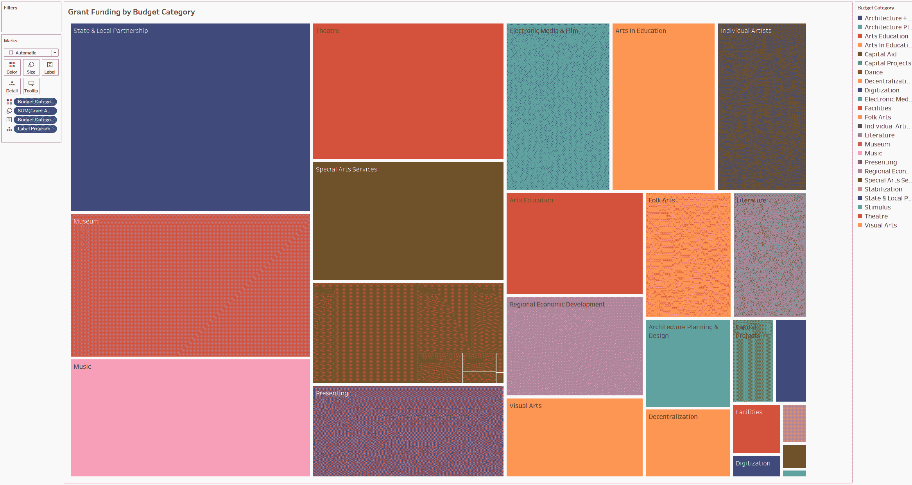

###### 图 1-17\. 显示预算类别和项目类别的树状图（树状图以预算类别着色，矩形的大小代表拨款金额）

让我们再次回到我们的树状图示例，进一步探讨颜色编码。在这种情况下，您将从项目类别开始创建树状图。这次，AP 团队试图确保不仅各种项目类型获得了足够的资金分配，而且资助和支持的项目类型多样化存在。

## 策略：用颜色编码连续度量

对于这个可视化，您将使用颜色编码来发现项目复苏的机会。您还将用它来突出另一个连续度量：自最近的拨款以来的天数。

一个*连续度量*是指跨越无限范围的度量，通常在数轴或时间轴上：

1.  在新的工作表上，创建一个关于[项目类别]和[拨款金额]的树状图。

1.  创建一个计算字段，评估某类别自上次拨款以来的时间：

    ```
    //Days Since Last Grant
    DATEDIFF( 'day',MAX([Date]),TODAY())
    ```

1.  当您在视图中使用此计算时，它将评估每个[项目类别]的最大或最近日期，然后计算自今天以来的天数。

1.  将此度量放在颜色上，并将调色板更改为蓝绿顺序反转。

    您可以在图 1-18 中看到结果。

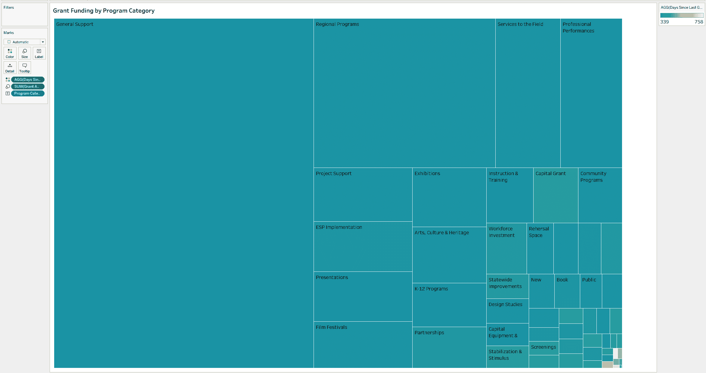

###### 图 1-18\. 显示项目类别按拨款金额分类的树状图；颜色已编码以显示项目上次拨款以来的天数

您现在已经看到三种树状图方法，利用不同的颜色编码技术和允许观众深入探索类别的动态元素。

# 饼图和圆环图：IT 员工健康项目案例研究

本章的最后一个案例研究涉及 IT 员工健康项目，这是一个调查 IT 专业人员及其雇主的倡议。该项目调查了 IT 工作对员工心理健康的影响，以及雇主对心理健康的态度。

与大多数调查一样，有许多问题需要分析以确定态度，但核心任务是提供受访者的人口统计概述。项目的数据分析师的目标是通过职业显示调查受访者的性别分布。他们还希望同时比较几个专业中的分布。哪种图表类型能最有效地将这些传达给项目委员会？

当您考虑到部分与整体的关系时，饼图是一个自然的起点。*饼图*将圆圈分成维度成员的片段，每个部分代表整体的一部分。一些图表爱好者一想到饼图就会退缩，但饼图对大多数人来说很熟悉。它们还能有效利用空间，并可以作为颜色图例或交互式过滤器使用。并非在每种情况下都是最佳选择，但在正确使用时它们确实有其用武之地。

在本章的最终策略中，您将通过制作*小倍数*或同一图表的重复版本，按专业分开，进一步发展您的甜甜圈图。这将使数据团队能够同时比较几个专业中性别分布。

## 策略：构建基本饼图

让我们从基本的饼图开始。你将使用 IT 调查数据集来跟随：

1.  将 [性别] 拖动到颜色上。

1.  将标记类型更改为饼图。

1.  创建一个名为 `**[# 受访者]**` 的计算字段。

    ```
    //# Respondents
    COUNTD([Respondent ID])
    ```

1.  将 [# 受访者] 拖动到角度上。根据需要更改颜色（我们使用夏季调色板和白色边框）。将 [性别] 与 [# 受访者] 一起拖动到标签上。格式化标签以匹配标记颜色。

    图 1-19 显示了结果。

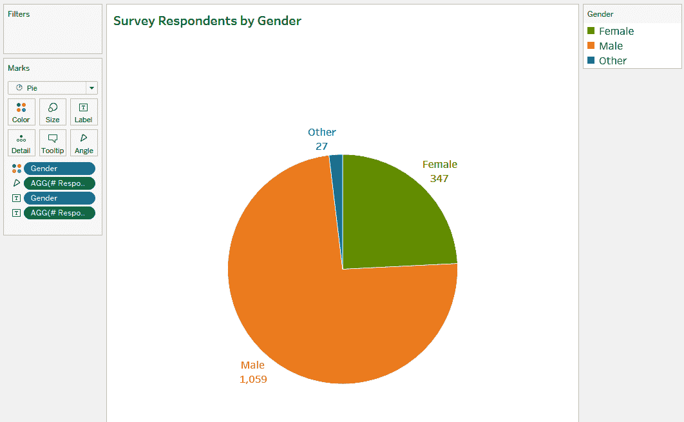

###### 图 1-19\. 显示调查受访者性别分布的饼图

为什么这个饼图有效？首先，它只有三个部分；这个饼图没有很多片，所以很容易比较差异。接下来，你已经走了额外的一英里，直接标记并将每个部分的百分比放在旁边。这使得观众很容易理解。如果你有更多的值，或者几个大小相似的部分，我们建议使用条形图，但在这里显然不是这种情况。

## 策略：构建甜甜圈图

现在让我们通过在中间添加一个孔将这个饼图变成甜甜圈图。这个孔允许您传达额外的信息。在这种情况下，它允许您在单个图表中表示两个概念——受访者数量和性别分布：

1.  创建一个虚拟测量 `**[MIN(1)]**`；这将用作双轴图表的多个测量值：

    ```
    //Dummy
    MIN(1)
    ```

1.  将其拖动到行上两次，右键单击，创建双轴图表。您可以使用前一个策略的可视化作为起点。

1.  将第一个度量的大小设置为推荐大小的正确刻度。

1.  右键单击[# Respondents]，将其更改为总体快速表格计算的百分比。然后通过右键单击该字段并选择格式化，将百分比格式化为不带小数位。

1.  单击第二个度量并移除所有字段，除了[# Respondents]，它应该在标签上。在该字段下添加文本`**Respondents**`，字体大小为 8 pt。

1.  将第二个度量的大小设置为推荐大小的左刻度。

1.  将标签对齐到中间并居中，并将标记颜色设置为白色。

1.  隐藏坐标轴并从图表中删除所有线条。

    您可以在图 1-20 中看到结果。

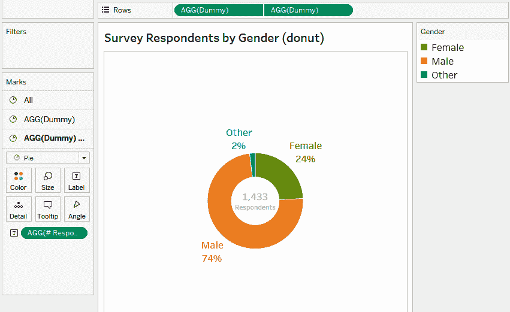

###### 图 1-20\. 一个带有受访者数量的甜甜圈图已添加到中心；片段代表调查受访者按性别分布

现在您有一个能够同时服务两个目的并且在生成深刻描述时非常出色的甜甜圈图。您可以说“24%的受访者是女性”，并立即了解调查的样本大小，这对于观众从结果中做出决策是必要的。

要完成甜甜圈图，您可以将其用作交互式过滤器；当用户点击一个片段时，Tableau 会在后续的可视化中进行筛选。它还可以用作颜色图例的用途——不仅仅是说明绿色代表男性。

## 策略：创建小多图

因为我们正在处理甜点图表，我们想介绍的最后一种可视化是*小多图*，即以较小格式重复出现的任何图表。对于饼图和甜甜圈图，小多图非常强大。您可以采用更多成员的维度，并使用它来创建重复的图表进行比较。

我们知道项目委员会希望看到不同职业中性别分布的变化。小多图可以帮助您快速分析答案。是的，您可以创建一个筛选器来选择角色，但当您创建能显示分布并在上下文中提供样本大小的小多图时，您可以一目了然地获得更多洞察。

从您刚刚创建的甜甜圈图开始，您只需要做一些微调：

1.  从标签中删除“受访者”一词以节省空间。

1.  将[Professional Role]拖放到列架上。

    您可以在图 1-21 中看到结果。

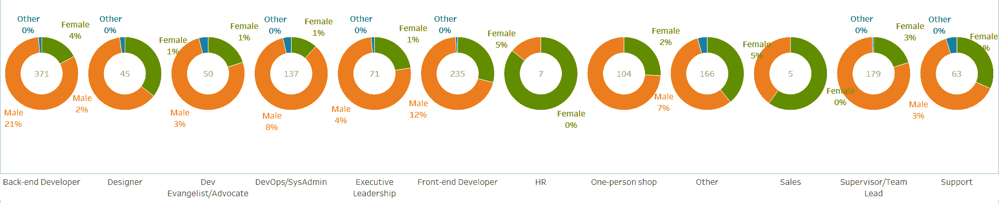

###### 图 1-21\. 小多图甜甜圈图，其中包括根据不同职业分开性别分布

现在您已经看过一些饼图的示例，希望您能意识到何时适合使用它们——更重要的是，使用它们可以增强您向观众呈现数据的效果。

# 结论

现在，您有机会看到不同的图表类型用于分类分析。您从基本的水平条形图开始，并迅速学会了如何创建 Top N 图表，以便为观众限制最相关的信息。

从那里开始，您探索了将小类别动态分组到“其他”柱中，并允许您的观众通过参数定义分析的范围，使他们能够定义一个类别必须具有的百分比贡献才能显示在图表中。

您还探索了在条形图中使用颜色编码来进一步突出分类分析，并学习了一些我们喜欢的格式化技巧，以使条形图更加生动。

接下来，我们进入了 Amplify Performance 的案例研究，并使用了矩形树图来确保将维度的所有成员（即使是非常小的成员！）都呈现在可视化中。您学会了如何通过允许深入分割数据来使此图表类型更加动态化。您还使用了颜色编码，并尝试了一些日期计算来向 AP 高管展示可能没有得到资金的区域（如果这很有趣，等到第四章吧）。

最后，我们通过探索甜点图表（首先是饼图，然后是甜甜圈图）来结束本章。您学会了何时有效使用饼图（不要太多切片），以及如何利用甜甜圈图内部的空洞同时显示两个信息。

借助所有这些新技术，我们确信您将能够创建灵活、引人入胜且有洞察力的可视化，让您的观众动态探索问题和分析。

在下一章中，我们将向您介绍定量分析——所有图表都专注于以不同方式绘制数值字段和使用统计数据。您将通过创建各种图表类型（再见，条形图）将学到的基础知识付诸实践。
